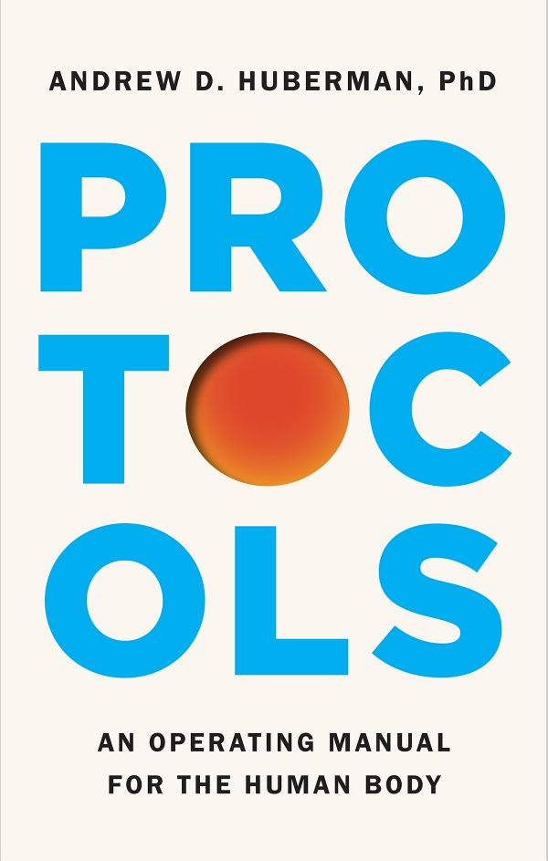
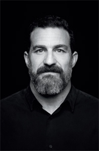

# Protokollok

*Használati útmutató az emberi testhez*

**Andrew D. Huberman, PhD**, Jessica Wapner közreműködésével

*Simon Element, 2026*

## Tartalom

- [Jogi nyilatkozat](#jogi-nyilatkozat)
- [Bevezetés](#bevezetés)
- [1. fejezet: Alvásprotokollok](#1-fejezet-alvásprotokollok)
  - [1. alvásprotokoll: Nézz napfényt minél hamarabb ébredés után](#1-alvásprotokoll-nézz-napfényt-minél-hamarabb-ébredés-után)
  - [2. alvásprotokoll: Nézz napfényt késő délután](#2-alvásprotokoll-nézz-napfényt-késő-délután)
  - [3. alvásprotokoll: Kerüld az erős fényt a lefekvés előtti utolsó órában](#3-alvásprotokoll-kerüld-az-erős-fényt-a-lefekvés-előtti-utolsó-órában)
  - [4. alvásprotokoll: Találd meg a számodra ideális lefekvési és ébredési időpontokat, és törekedj rá, hogy tartsd magad hozzájuk](#4-alvásprotokoll-találd-meg-a-számodra-ideális-lefekvési-és-ébredési-időpontokat-és-törekedj-rá-hogy-tartsd-magad-hozzájuk)
  - [5. alvásprotokoll: Éjszaka csökkentsd a testmaghőmérsékletedet](#5-alvásprotokoll-éjszaka-csökkentsd-a-testmaghőmérsékletedet)
  - [6. alvásprotokoll: Az ébredés előtti utolsó egy-két alvásórában emeld meg a testmaghőmérsékletedet](#6-alvásprotokoll-az-ébredés-előtti-utolsó-egy-két-alvásórában-emeld-meg-a-testmaghőmérsékletedet)
  - [7. alvásprotokoll: Helyes szunyókálással ellensúlyozd a kisebb alváshiányt](#7-alvásprotokoll-helyes-szunyókálással-ellensúlyozd-a-kisebb-alváshiányt)
  - [8. alvásprotokoll: Pótold az alváshiányt alvás nélküli mély pihenéssel (NSDR-rel) (és javítsd az esti elalvás és átalvás képességét)](#8-alvásprotokoll-pótold-az-alváshiányt-alvás-nélküli-mély-pihenéssel-nsdr-rel-és-javítsd-az-esti-elalvás-és-átalvás-képességét)
  - [9. alvásprotokoll: Fontold meg az alvást támogató étrend-kiegészítőket](#9-alvásprotokoll-fontold-meg-az-alvást-támogató-étrend-kiegészítőket)
  - [10. alvásprotokoll: A receptköteles altatók óvatos kezelése](#10-alvásprotokoll-a-receptköteles-altatók-óvatos-kezelése)
  - [11. alvásprotokoll: Igazítsd a koffeinfogyasztásod időzítését a jobb alvásért](#11-alvásprotokoll-igazítsd-a-koffeinfogyasztásod-időzítését-a-jobb-alvásért)
  - [12. alvásprotokoll: Lefekvés előtt nyolc órán belül kerüld az alkoholt](#12-alvásprotokoll-lefekvés-előtt-nyolc-órán-belül-kerüld-az-alkoholt)
  - [13. alvásprotokoll: Ne használd a kannabiszt altatóként](#13-alvásprotokoll-ne-használd-a-kannabiszt-altatóként)
  - [14. alvásprotokoll: Lefekvés előtt legalább egy órával kerüld a képernyőket](#14-alvásprotokoll-lefekvés-előtt-legalább-egy-órával-kerüld-a-képernyőket)
  - [15. alvásprotokoll: Gyakorlati útmutató a jet lag elkerüléséhez](#15-alvásprotokoll-gyakorlati-útmutató-a-jet-lag-elkerüléséhez)
- [2. fejezet: Edzésprotokollok](#2-fejezet-edzésprotokollok)
  - [1. edzésprotokoll: Sétálj minden nap, amennyit csak lehet](#1-edzésprotokoll-sétálj-minden-nap-amennyit-csak-lehet)
  - [2. edzésprotokoll: Heti három erőedzés](#2-edzésprotokoll-heti-három-erőedzés)
  - [3. edzésprotokoll: Végezz állóképességi edzést hetente háromszor](#3-edzésprotokoll-végezz-állóképességi-edzést-hetente-háromszor)
  - [4. edzésprotokoll: Építs be rövid mobilitási és hajlékonysági gyakorlatokat heti 2–4 alkalommal](#4-edzésprotokoll-építs-be-rövid-mobilitási-és-hajlékonysági-gyakorlatokat-heti-24-alkalommal)
- [3. fejezet: Protokollok a stressz szabályozásához](#3-fejezet-protokollok-a-stressz-szabályozásához)
  - [1. stresszszabályozási protokoll: 1–3 fiziológiai sóhajjal gyorsan csökkentheted a stresszt](#1-stresszszabályozási-protokoll-13-fiziológiai-sóhajjal-gyorsan-csökkentheted-a-stresszt)
  - [2. stresszszabályozási protokoll: Tudatos hidegexpozícióval emeld a stresszküszöbödet](#2-stresszszabályozási-protokoll-tudatos-hidegexpozícióval-emeld-a-stresszküszöbödet)
  - [3. stresszszabályozási protokoll: Végezz alvás nélküli mély pihenést (NSDR-t), hogy ellensúlyozd a stresszt](#3-stresszszabályozási-protokoll-végezz-alvás-nélküli-mély-pihenést-nsdr-t-hogy-ellensúlyozd-a-stresszt)
  - [4. stresszszabályozási protokoll: Ébredés után azonnal végezz mikromeditációt](#4-stresszszabályozási-protokoll-ébredés-után-azonnal-végezz-mikromeditációt)
  - [5. stresszszabályozási protokoll: Fokozd a reggeli kortizol- és katekolamincsúcsodat](#5-stresszszabályozási-protokoll-fokozd-a-reggeli-kortizol--és-katekolamincsúcsodat)
  - [6. stresszszabályozási protokoll: Fontolj meg egyes étrend-kiegészítőket a túlzott stressz ellensúlyozására](#6-stresszszabályozási-protokoll-fontolj-meg-egyes-étrend-kiegészítőket-a-túlzott-stressz-ellensúlyozására)
- [4. fejezet: Táplálkozási protokollok](#4-fejezet-táplálkozási-protokollok)
  - [1. táplálkozási protokoll: Az elfogyasztott ételek legalább 90%-a legyen feldolgozatlan vagy minimálisan feldolgozott](#1-táplálkozási-protokoll-az-elfogyasztott-ételek-legalább-90-a-legyen-feldolgozatlan-vagy-minimálisan-feldolgozott)
  - [2. táplálkozási protokoll: Gondoskodj a folyadékpótlásról](#2-táplálkozási-protokoll-gondoskodj-a-folyadékpótlásról)
  - [3. táplálkozási protokoll: Egyél minden teljes étkezéshez magas CP:C arányú fehérjét](#3-táplálkozási-protokoll-egyél-minden-teljes-étkezéshez-magas-cpc-arányú-fehérjét)
  - [4. táplálkozási protokoll: Rostos zöldségekből és (némi) gyümölcsből fedezd a szénhidrátbevitel nagy részét](#4-táplálkozási-protokoll-rostos-zöldségekből-és-némi-gyümölcsből-fedezd-a-szénhidrátbevitel-nagy-részét)
  - [5. táplálkozási protokoll: Fogyassz egészséges zsírokat a legtöbb étkezés és uzsonna részeként](#5-táplálkozási-protokoll-fogyassz-egészséges-zsírokat-a-legtöbb-étkezés-és-uzsonna-részeként)
  - [6. táplálkozási protokoll: Fogyassz alacsony cukortartalmú fermentált élelmiszereket](#6-táplálkozási-protokoll-fogyassz-alacsony-cukortartalmú-fermentált-élelmiszereket)
  - [7. táplálkozási protokoll: Egyél zsíros tengeri halat és/vagy fontold meg az omega-3-kiegészítőket](#7-táplálkozási-protokoll-egyél-zsíros-tengeri-halat-ésvagy-fontold-meg-az-omega-3-kiegészítőket)
- [5. fejezet: Fényprotokollok](#5-fejezet-fényprotokollok)
  - [1. fényprotokoll: Nézz erős fényt az ébredés utáni első órában, hogy tovább növeld a reggeli kortizolszintedet](#1-fényprotokoll-nézz-erős-fényt-az-ébredés-utáni-első-órában-hogy-tovább-növeld-a-reggeli-kortizolszintedet)
  - [2. fényprotokoll: Nézz napfényt késő délután és/vagy kora este, hogy enyhítsd az éjszakai mesterséges fény kedvezőtlen hatásait](#2-fényprotokoll-nézz-napfényt-késő-délután-ésvagy-kora-este-hogy-enyhítsd-az-éjszakai-mesterséges-fény-kedvezőtlen-hatásait)
  - [3. fényprotokoll: Kerüld az erős fény nézését a lefekvésed előtti egy órában](#3-fényprotokoll-kerüld-az-erős-fény-nézését-a-lefekvésed-előtti-egy-órában)
  - [4. fényprotokoll: Tedd ki a felső- és alsótested bőrét nappal napfénynek](#4-fényprotokoll-tedd-ki-a-felső--és-alsótested-bőrét-nappal-napfénynek)
  - [5. fényprotokoll: Tedd ki a bőrödet és a szemedet hosszú hullámhosszú (vörös, közeli infravörös és infravörös) fénynek](#5-fényprotokoll-tedd-ki-a-bőrödet-és-a-szemedet-hosszú-hullámhosszú-vörös-közeli-infravörös-és-infravörös-fénynek)
- [6. fejezet: Fókusz-, motiváció- és tanulási protokollok](#6-fejezet-fókusz--motiváció--és-tanulási-protokollok)
  - [1. tanulási protokoll: Válts éber és fókuszált állapotba](#1-tanulási-protokoll-válts-éber-és-fókuszált-állapotba)
  - [2. tanulási protokoll: Mentális kontrasztálással érj el „sürgetettségi állapotot”, és valósítsd meg a céljaidat](#2-tanulási-protokoll-mentális-kontrasztálással-érj-el-sürgetettségi-állapotot-és-valósítsd-meg-a-céljaidat)
  - [3. tanulási protokoll: Fogadd el a hibákat, hogy javítsd a teljesítményedet](#3-tanulási-protokoll-fogadd-el-a-hibákat-hogy-javítsd-a-teljesítményedet)
  - [4. tanulási protokoll: Részesítsd előnyben az alvást a tanulási szakasz utáni éjszakán](#4-tanulási-protokoll-részesítsd-előnyben-az-alvást-a-tanulási-szakasz-utáni-éjszakán)
  - [5. tanulási protokoll: Építs be mikroszüneteket a tanulási szakaszaidba](#5-tanulási-protokoll-építs-be-mikroszüneteket-a-tanulási-szakaszaidba)
  - [6. tanulási protokoll: Növeld az új készségek és információk megőrzését mentális gyakorlással](#6-tanulási-protokoll-növeld-az-új-készségek-és-információk-megőrzését-mentális-gyakorlással)
- [7. fejezet: Személyes fejlődési protokollok](#7-fejezet-személyes-fejlődési-protokollok)
  - [1. személyes fejlődési protokoll: Az elkalandozó figyelem helyett jelenhez kötött tudatosság](#1-személyes-fejlődési-protokoll-az-elkalandozó-figyelem-helyett-jelenhez-kötött-tudatosság)
  - [2. személyes fejlődési protokoll: Alkalmazd James Hollis útmutatóját a lehető legjobb életed kialakításához](#2-személyes-fejlődési-protokoll-alkalmazd-james-hollis-útmutatóját-a-lehető-legjobb-életed-kialakításához)
  - [3. személyes fejlődési protokoll: Belső fájdalompontok feldolgozása expresszív írással](#3-személyes-fejlődési-protokoll-belső-fájdalompontok-feldolgozása-expresszív-írással)
  - [4. személyes fejlődési protokoll: A veszteség átkeretezése, hogy hatékonyan feldolgozd a gyászt](#4-személyes-fejlődési-protokoll-a-veszteség-átkeretezése-hogy-hatékonyan-feldolgozd-a-gyászt)
- [Mielőtt az utolsó oldalra lapoznál](#mielőtt-az-utolsó-oldalra-lapoznál)
- [Köszönetnyilvánítás](#köszönetnyilvánítás)
- [A szerzőről](#a-szerzőről)
- [Jegyzetek](#jegyzetek)
- [Index](#index)
- [Copyright](#copyright)

## Jogi nyilatkozat

Ez a kiadvány a szerző véleményét és gondolatait tartalmazza. Célja, hogy hasznos és tájékoztató anyagot nyújtson a kiadványban tárgyalt témákról. A kiadvány értékesítése azon az alapon történik, hogy a szerző és a kiadó a könyvben nem nyújt orvosi, egészségügyi vagy másfajta személyre szabott szakmai szolgáltatásokat. Az olvasóknak a könyv bármely javaslatának alkalmazása vagy az abból levont következtetések előtt orvossal, egészségügyi szakemberrel vagy más illetékes szakemberrel kell konzultálniuk.

A szerző és a kiadó kifejezetten kizár minden felelősséget bármely olyan – személyes vagy egyéb jellegű – felelősségért, veszteségért vagy kockázatért, amely a könyv bármely tartalmának használata és alkalmazása következtében, közvetlenül vagy közvetve merül fel.

Dr. Huberman az AG1, az Eight Sleep, a Function Health, a Reveri és a WHOOP tudományos tanácsadója, és ezektől a szervezetektől, valamint a *Huberman Lab* podcastot szponzoráló más szervezetektől is anyagi ellentételezésben részesül. A *Huberman Lab* aktuális szponzorainak listája a következő címen található: <http://www.hubermanlab.com/sponsors>.

## Ajánlás

> *Costellónak, Zoë-nak és Strummernek, akiknek egyetlen dolguk volt: jól és eleget aludniuk, egészségesen, de nem túl sokat enniük, elegendő folyadékot inniuk, napfényt nézniük és mozogniuk. És szüntelenül szeretetet adniuk és kapniuk. Biztos jó lehet…*
>
> *Mindenki másnak: ezt a könyvet nektek írtam.*

## Bevezetés

Üdvözöllek a *Protokollok*ban.

Ez a könyv útmutató az egészséged és a teljesítményed javításához. Ha az egészséged egy vagy több területén nehézségeid vannak, segíthet. Ha általában jól vagy, és ezen területek közül egyet vagy többet magasabb szintre szeretnél emelni, akkor is segíthet.

Mi a protokoll? A protokoll bevált eljárás, amely segít leküzdeni a gyakori akadályokat, elérni egy konkrét egészség- vagy teljesítménycélt, vagy általában javítani a mindennapi testi vagy mentális állapotodon. Mindegyik könnyen alkalmazható. Mindegyiket úgy tervezték, hogy a lehető legrövidebb idő alatt a lehető legjobb eredményt hozza. Mindegyik működhet elsőre – és minden alkalommal.

Ahogy megismered ezeket a protokollokat, azt is megtudod, milyen tudományos alapjuk van, és közben sokat tanulsz majd arról is, hogyan működik az agyad és a tested. Mindegyik ugyanis élettanunk ismert sajátosságaira épül. Azért működnek, mert arra épülnek, ahogyan mi működünk. A tudomány legalább két okból fontos, amelyek túlmutatnak azon, hogy alátámassza az állításokat. Először is: ha megérted, hogy egy adott protokoll például hogyan javíthatja az alvásodat, vagy azt, mennyire tudsz összpontosítani és új dolgokat tanulni, a saját igényeidhez igazíthatod úgy, hogy továbbra is kiváltsa a kívánt hatást. Másodszor: elkezded észrevenni, hogy hasonló biológiai mintázatok bukkannak fel olyan rendszerekben is, amelyek egyébként egymástól teljesen különbözőnek látszanak. Az agyunk és a testünk számos ugyanazon mechanizmust használ fel újra, hogy ezek a rendszerek együtt tudjanak működni. Ha ismered az egyes protokollok mögötti tudomány egy részét, nemcsak azt érted meg, hogyan működnek, hanem azt is, hogyan erősítik egymás hatását a különböző protokollok. Gyakorlatilag ez olyan fokú ellenőrzést ad az egészséged felett, amire attól, hogy csupán megtanulod: „végezd el az A protokollt a B hatásért”, egyszerűen nem tehetsz szert. A saját életed keretében eldöntheted, mi működik az igényeidhez és céljaidhoz, anélkül hogy az egészségre törekvésnek egyetlen központi üggyé kellene válnia.

Mert nézzünk szembe vele: valójában azért végzünk bármelyik protokollt, hogy testileg és szellemileg jobban érezzük magunkat és jobban teljesítsünk, és több energiánk maradjon az életünk többi részére.

Azt is el kell mondanom, mi nem ez a könyv. Ez a könyv nem az „optimalizálásról” szól – legalábbis nem a szó szokásos értelmében. Erről a szóról az juthat eszünkbe, hogy rengeteg időt fordítunk a napi rutinunk tökéletesítésére. Az igazi optimalizálás időt ment meg – nemcsak azzal, hogy növeli életed éveinek számát, hanem azzal is, hogy több hatékony órád lesz napközben (és több órát töltesz igazán jó alvással éjszakánként). A könyv sok protokollja mindössze néhány percet vesz igénybe, és akkor végezheted el, amikor szeretnéd. Mások valamivel több időt igényelnek, vagy a nap, illetve a hét meghatározott időszakában kell elvégezni őket.

Már ebből a néhány rövid bekezdésből is láthatod, hogy a „biohacking” egész elgondolását elvetem. A hack rövidítés: valamit egy többnyire nem kapcsolódó célra használunk fel, például amikor egy törött szemüveget gemkapoccsal és ragasztószalaggal tákolunk meg. A hackek sosem jelentenek hosszú távú megoldást. A könyv protokolljai épp a hackek ellentétei. Tudományosan alátámasztott eszközök, amelyek szilárd élettani mechanizmusokra épülnek – olyan idegi áramkörökre, hormonokra és neurotranszmitterekre, amelyek már születésed előtt beépültek az agyadba és a testedbe. Csak azt kell megtanulnod, hogyan férhetsz hozzájuk.

Észre fogod venni, hogy főként azokat a viselkedéses módszereket hangsúlyozom, amelyek a legnagyobb különbséget hozhatják az egészségedben rövid és hosszú távon. Mivel azonban gyakran kérdezik tőlem, mely vényköteles gyógyszerek, étrend-kiegészítők és eszközök lehetnek hasznosak egy adott egészség- vagy teljesítménycél eléréséhez, ezekről is szólok.

Valóban, az egyik leggyakoribb kérdés, amelyet férfiaktól és nőktől egyaránt kapok: „Mit szedjek?” Sokan úgy gondolják, hogy az egészség és a teljesítmény titka az exogén molekulákban rejlik – vagyis azokban az anyagokban, amelyek a testünkön kívülről érkeznek. Ne legyen félreértés: bizonyos tabletták, porok vagy injekciós készítmények kedvezően befolyásolhatják az egészséget és a teljesítményt. Ám egyes viselkedések rendkívül erősen aktiválhatnak több élettani mechanizmust is, köztük az endogén molekulák felszabadulását – ezek pedig, ahogy bizonyára kitaláltad, a testünkön belülről származó anyagok –, ezért egyszerűen semmi sem helyettesítheti őket. Ezért semmilyen tabletta nem helyettesítheti (és soha nem is fogja helyettesíteni) a testmozgást, az alvást vagy a megfelelő stresszkezelést. Még azok a gyógyszerek sem idéznek elő önmagukban tanulást, amelyek lehetővé teszik a neuroplaszticitást, vagyis hogy az agyad újrahuzalozza magát és tanuljon. A plaszticitást egy konkrét cél felé kell irányítani. Ehhez bizonyos viselkedésekre van szükség. A megfelelő dolgokat, megfelelő sorrendben kell tennünk. Vagy ahogy egy kollégám találóan megfogalmazta: „A kémia révén jobb élethez továbbra is jobban kell élni.”

Ez azt jelenti, hogy az egészség- vagy teljesítménycéljaid eléréséhez nem kell semmit vásárolnod. Vannak, akiknek van elkölthető jövedelmük arra, hogy egészséget és teljesítményt támogató eszközökre költsék. Másoknak nincs. Mindenkinek írtam ezt a könyvet, és biztosíthatlak róla: alapvető tény, hogy a viselkedéses eszközök valódi előrelépést hoznak a jó irányba – és szerintem ez mindig is így lesz. A megfelelőek pedig mindenkinél működhetnek. Akár fiatal vagy, akár idős, akár fitt vagy jelenleg, akár nincs jó formában, a könyv protokolljainak köszönhetően sokkal jobban érezheted magad, jobban nézhetsz ki és jobban gondolkodhatsz. Így jobban helytállhatsz a munkahelyeden, az iskolában, a pályán vagy az edzőteremben, és a kapcsolataidban is… még a saját magaddal való kapcsolatodban is. Tudom, hogy ez igaz, mert szó szerint emberek milliói alkalmazták ezeket a protokollokat nagy sikerrel, és teszik ezt továbbra is nap mint nap. Onnan is tudom, hogy én magam is használom őket.

Valójában a könyv számos protokollját azért fedeztem fel, mert szükségem volt rájuk, olykor sürgősen. Sok más emberhez hasonlóan én is küzdöttem az alvással és a stresszel, a „megfelelő” étrend megtalálásával, azzal, hogyan eddzek a legjobban konkrét célok eléréséhez, és így tovább.

De ha van bennem veleszületett tulajdonság, az a kíváncsiság. Szeretek tanulni. Azt is szeretem, ha megoszthatom másokkal, amit tanulok. És ami a kíváncsiságomat hajtja – legalábbis az egészség és a teljesítmény területén –, valószínűleg ugyanaz, ami téged is ehhez a könyvhöz vezetett: tudni akartam, melyek a legjobb megoldások ezekre a kihívásokra.

Nincs olyan eszköz a könyvben, amelyet ne próbáltam volna ki személyesen. Némelyiket rövid ideig használtam, mert egy elakadás leküzdésére szolgálnak, utána pedig a legjobb félretenni őket. Mások a mindennapjaim állandó részei, és halálomig azok is maradnak, mert központi szerepük van a testi és mentális egészségemben, valamint abban, hogy hatékonyan tudjak összpontosítani és tanulni, miközben továbbra is segítenek elérni a teljesítménycéljaimat. Minden eszközért és minden fogalomért vállalom a felelősséget.

Ezek a protokollok azt fedik le, amiről tudom, hogy működik. A podcastomban, a *Huberman Lab*-ben olyan témákat is vizsgálok és osztok meg, amelyekben biztos vagyok, és olyanokat is, amelyeket még kutatok – például a peptideket vagy a pszichedelikumokat –, ez a könyv azonban többnyire az előbbiekre összpontosít. Az alvásról; a testmozgásról; a stresszkezelésről; a táplálkozásról; a fényről; a fókuszról, a motivációról és a tanulásról; valamint a személyes fejlődésről szóló fejezetek évek kutatásának eredményei: laboratóriumi és hétköznapi tapasztalatoké, az egyes témák szakértőié és a saját munkámé. Némelyik protokoll alapvető, mások haladóbbak. El tudod majd dönteni, melyek felelnek meg leginkább az igényeidnek és a céljaidnak.

Azok kedvéért, akik most ismerkednek a munkámmal, elmondok néhány dolgot a hátteremről, hogy legyen némi kontextus, és arról is, hogyan jutottunk el idáig mi – igen, te és én. Ha elolvasod ezt a könyvet és használod ezeket az eszközöket, remélem, úgy tekintesz majd ránk, mint akik együtt járják ezt az utat. Ismét: a könyv számos protokollját azért fedeztem fel, mert szükségem van rájuk. Ha neked is, tudd, hogy nem vagy egyedül.

E bevezető írásakor ötvenéves vagyok. Az elmúlt három évtizedben ébren töltött óráim nagy részét annak kutatásával töltöttem, hogyan működik, fejlődik és változhat – jó vagy rossz irányban – az idegrendszer, vagyis az agy és a gerincvelő. Ezt a területet idegtudománynak nevezik. Az idegtudományról először az egyetemen hallottam, Harry Carlisle-tól. Ő élettanász, idegtudós és az egyetemem professzora volt. Felvettem a kurzusát, és ott tanultam először a motiváció agyi áramköreiről, a tanulásról, az emlékezetről és még sok minden másról. Ez a kincsesbánya tudás akkoriban sehol máshol nem létezett, még a tankönyvekben sem. Harry az idegtudomány egészét oktatta, de külön hangsúlyt helyezett az agy és a test közötti idegi, hormonális és peptidkölcsönhatásokra. Úgy tudta összekötni a pontokat, ahogy csak egy mesteri tanár képes rá. Egyik nap, előadás közben abbahagyta az írást a táblán, felénk fordult, és ezt mondta: „Amikor legközelebb skizofrénia miatt téveszmés embert, depresszió miatt összeomlott embert vagy stimulánsfüggőt látsz, gondolj bele, milyen lehet úgy próbálni mozogni, gondolkodni vagy érezni valamilyen módon, hogy a neuronok – azok a sejtek, amelyek ezeket az erőfeszítéseket lehetővé teszik – egyszerűen nincsenek ott, vagy sérültek…” Bennem ekkor kattant helyére valami.

Bizonyos értelemben már felkészültem erre a pillanatra. Tizenkilenc éves koromra sok, az aggyal összefüggő mentális és testi egészségügyi problémával élő embert láttam. Többen súlyosan alkoholfüggővé vagy drogfüggővé váltak. Ma már tudjuk, hogy a függőség az agy problémája, akkor azonban a legtöbben azt gondolták, egyszerűen akaraterőhiányról van szó. A körülöttem felnőtt, „jól funkcionáló” emberek közül sokan szenvedtek szorongástól vagy depressziótól. Harry kurzusa emberközelivé tette a tudományt, és elmagyarázta, hogy ami gyakran pszichológiainak látszik, valójában élettani. Ez ösztönzött arra, hogy idegtudós legyek. És különben is: mi lehet érdekesebb az agynál?

Azért nem volt teljesen váratlan, hogy végül tudós lettem. Mindig is szerettem megfigyelni az állatokat – az embereket is beleértve –, és tanulni róluk. Apám is tudós, elméleti fizikus. Tizenhárom éves koromig a család minden este együtt vacsorázott, és olykor apám kollégái is csatlakoztak hozzánk. Más családoknál vacsora közben politikáról beszélgettek vagy sportot vitattak meg; nálunk a tudomány volt az egyetlen „sport”, a sztárjátékosok pedig a tudósok. Richard Feynmanről és Murray Gell-Mannról, a híres Nobel-díjas fizikusokról, valamint Ed Wilsonról, a szociobiológia megalapítójáról és más kiválóságokról hallottam történeteket. Ma is nevetünk azon, amikor a húgom, aki akkor még kisgyerek volt, odasétált az egyik leghíresebb Nobel-díjashoz, rámosolygott, majd az ölébe hányt… ő pedig lazán kezelte. Anyai nagyapám pedig biokémikus volt. Amikor meglátogattuk, elvitt a laboratóriumába, hogy segítsek adatot gyűjteni a különféle étrenden tartott patkányok anyagcseréjéről és testösszetételéről.

Szóval teljesen logikus, hogy tudós lettem, nem? Hát igen is, meg nem is. Tizennégy éves koromban elváltak a szüleim. Nincs bennem emiatt neheztelés, de akkoriban ez a változás otthon és az iskolában is szétzilálta a dolgokat. Ne feledd, az 1980-as években jártunk, amikor a válás ritkább volt, és én is tizennégy évesen kezdtem kamaszodni, ezért lehetetlen eldönteni, hogy mindazt, ami ezután következett, a családi struktúrám hirtelen felbomlása vagy az agyamban és a testemben megugró hormonszint táplálta-e. Ahogy a tudományban mondjuk: „Rossz kísérlet… túl sok változó ahhoz, hogy ok-okozati következtetést lehessen levonni.”

Azt viszont tudom, hogy tizennégy és tizenkilenc éves korom között, mielőtt Harry kurzusán kötöttem ki, az életem vad, szemfelnyitó kalandok, fájdalmas veszteségek és időnként teljes káosz egymásba folyó kavalkádja volt. Egyre jobban magával ragadott a gördeszkázás – ami akkoriban eléggé rétegsportnak számított. Magát a sportot is szerettem, és azt a különc, gyakran fékezhetetlen figurákból álló közösséget is, amelyet vonzott. Azért is szerettem, mert nap mint nap a fegyelemről, az összpontosításról és az energiáról tanított: próbálkozol, próbálkozol, próbálkozol, elbuksz, elbuksz, elbuksz, majdnem sikerül, aztán még 100-szor elbuksz, mire végre sikerül a trükk. Közben gyakran jó sok fájdalom árán. A gördeszkázás száz százalékban önirányított volt. Példamutatással ösztönöztük egymást, és biztattuk is a másikat, de nem voltak edzők, sem bírók. Valójában a gördeszkázás afféle magától értetődő választás volt azoknak, akik sportolni akartak, de akiknél a szülői részvételre sem szükség, sem – őszintén szólva – igény nem volt. Teljesen vadak voltunk. És ez a „mi” több korosztályból érkezett, minden elképzelhető háttérrel. A gördeszkázás mindig is szokatlan sport volt, mert tizenkét, tizenhárom és tizennégy éves gyerekek lógtak együtt késő tizenéves, huszon- és harmincéves férfiakkal (akkoriban szinte kizárólag férfiakkal). Egyesek a külvárosból, mások a városból jöttek. Az ország minden tájáról érkeztek azokra a legendás helyekre, ahová mi is jártunk. Az élet minden területéről kerültek ki közeli barátaim. Sokat láttam drogból, alkoholból, szexből és erőszakból. Az iskolából is sokat hiányoztam.

Elfogadhatóan gördeszkáztam. Szereztem egy-két kisebb szponzori támogatást. De sosem voltam esélyes arra, hogy profi legyek. Bármennyire is akartam és dolgoztam érte, egyszerűen nem volt hozzá elég tehetségem. Szerencsés vagyok, hogy az akkori nagyok közül többet megismerhettem, és a mai napig a barátaim maradtak. És tanúja lehettem néhány igazán történelmi pillanatnak a gördeszkázásban. Szavakba sem lehet önteni, mennyi nyers energia és újítás volt jelen a mára legendássá vált Embarcadero Plazán („EMB”) San Franciscóban, egy San Diegó-i versenyen vagy New Yorkban, a Washington Square Parkban az 1990-es évek elején. Ezért és sok más okból azok az évek gyerekkorom legkedvesebb és leginspirálóbb emlékei közé tartoznak. De hát gyerek voltam. A sok csodás élménybe sok nehéz is vegyült. Most óvatosan szeretnék fogalmazni. Egyfelől senkinek sem kívánnám az akkori élményeim jó részét, még kevésbé egy fiatal gyereknek, másfelől el sem cserélném őket. Teljesen szabad voltam, mégis mindenben bizonytalanságot éreztem. Sokat sérültem meg, és sok időt töltöttem mankóval.

A fizikai sérüléseim azonban néhány nagyon jó döntéshez vezettek. Arra ösztönöztek, hogy szembemenjek az akkori gördeszkás szokásokkal, elkezdjek futni és súlyzókkal edzeni. Ma ez talán hétköznapinak tűnik, de az 1990-es évek elején, ha nem testépítő voltál, az idényre készülő amerikaifutball-játékos vagy katonasághoz készültél, senki sem emelt súlyzókat. Edzőtermek gyakorlatilag nem is léteztek. Még furcsábbnak számított, ha egy amerikai gyerek meditált, de én azt is elkezdtem.

Ebből tanultam meg a testmozgás és a stressz kiváltotta alkalmazkodási folyamatok alapjait, és azt, hogy miben hasonlítanak, illetve különböznek egymástól. Nagyjából így működik: fuss messzebbre vagy gyorsabban, mint legutóbb, és a következő futás könnyebbé válik… ráadásul megnyílik a lehetőség, hogy egy kicsit messzebbre és gyorsabban fuss, és így tovább. Egy adott edzésen addig emelj egy súlyt, amíg a legnagyobb erőfeszítésed ellenére egyetlen további ismétlésre sem vagy képes; a következő edzésen aztán ugyanazzal a súllyal több ismétlést végezhetsz, vagy nagyobb súlyt mozgathatsz meg. Állíts be öt percre egy időzítőt, ülj mozdulatlanul, és próbálj a légzésedre összpontosítani, miközben az elkerülhetetlen nyugtalanság felerősödik, majd alábbhagy, aztán ismét felerősödik. Másnap állítsd az időzítőt hat percre, aztán hét percre; hamarosan pedig húsz perc is menni fog.

Egy másik nagyon jó döntés – bár nem éppen a fizikai sérüléseimhez kapcsolódott – az volt, hogy elkezdtem az egyetemre gondolni. A barátnőm egy évvel előttem végzett középiskolában, majd elköltözött egyetemre. Hiányzott, ezért gyakran meglátogattam. Végül főként csak azért jelentkeztem egyetemre, hogy a közelében lehessek. Nem igazán számítottam rá, hogy felvesznek. De felvettek.

Ahogy sejtheted, az első egyetemi évem nem alakult jól. Továbbra is edzettem és meditáltam, de hiányoztam az előadásokról, és ostoba verekedésekbe keveredtem. Igaz a mondás: „Annyit kapsz, amennyit beleteszel.” Megkaptam, amit érdemeltem, és az nem volt sok.

Aztán eljött a nagy fordulópont. 1994. július 4-én néhányan épp egy barátunk házához érkeztünk grillezni, amikor láttuk, hogy kirabolják. Pont azt tettük, amit bármelyik fiatal férfi idióta tett volna: összeverekedtünk a rablókkal. Arra sem emlékszem, hogy ezt egyáltalán döntésként éltem volna meg. Csak arra emlékszem, hogy egyenesen a sűrűjébe rohantam. Bárki, aki valóban keveredett már utcai verekedésbe – nem bokszórán, és nem kesztyűs, bíró vezette hivatalos meccsen –, megmondja: ez nem olyan, mint a filmekben. A dolgok nagyon gyorsan elfajulhatnak, az emberek pedig megsérülhetnek vagy meghalhatnak. Az a verekedés csúnya volt. Szerencsére senki sem sérült meg súlyosan, de kijött a rendőrség, és mindannyiunknak sok magyarázkodnivalója akadt. A házat kirabló srácokat tartóztatták le, nem minket. Sőt, mielőtt elhajtottak, a rendőrök gratuláltak nekem. Hányingerem lett. Nem arról volt szó, hogy azt kívántam volna, bárcsak bajba kerülök a történtek miatt; csak rájöttem, hogy sehová sem tartok az életben, így az elismerés inkább veszteseknek járó trófeának tűnt, mintsem bárminek, amit érdemes ünnepelni. Legbelül tudtam, hogy függetlenül attól, ki volt a hibás, nem hoztam jó döntéseket; tudtam, hogy az önpusztítás felé sodródom.

A július 4-i hétvége hátralévő részét önvizsgálattal töltöttem. Tizenkilenc éves voltam, és semmi hasznoshoz nem értettem. Pedig szerettem volna. Ezért úgy döntöttem, rendbe teszem az életemet: olyan dologra összpontosítok, amelyről tudtam, hogy megvan benne az a minőség, hogy „ha csak minden nap megjelensz és keményen dolgozol rajta, a végén vár rád valami”.

Úgy döntöttem, a tanulásra összpontosítok. Nem tudtam, mit kezdek majd egy egyetemi diplomával, sőt azt sem, milyen szakot válasszak, de akkor ez nem érdekelt. Csak olyan útra volt szükségem, amelyről tudtam, hogy jobb helyre vezet annál, ahol abban a pillanatban tartottam. A végső célt majd később kitalálom.

Mivel a középiskolából ennyit hiányoztam, tudtam, hogy hátrányból indulok, ezért az egyetemtől távolabb kivettem egy garzonlakást. Éjjel-nappal tanultam; csak órára, enni, aludni vagy mozogni álltam fel. Enyhén szólva is motivált voltam – állandóan attól féltem, hogy iránytalan vesztes maradok, és ez hajtott tovább. A középiskolából nem hoztam magammal bevált tanulási szokásokat, amelyekre támaszkodhattam volna. Ezért nyers erővel kényszerítettem ki. Beállítottam egy időzítőt, és kétórás blokkokban erőltettem magamra a tanulást; még mosdóba sem engedtem magam felállni. Minden blokk után tartottam egy rövid szünetet, aztán visszaültem dolgozni. Ha végigcsináltam három ilyen ciklust, megengedtem magamnak egy szundítást, ha szükségem volt rá, majd nekiveselkedtem újabb háromnak. Egyedül dolgoztam a garzonlakásomban: minden fejezetet, bekezdést és mondatot elolvastam, és részletes jegyzeteket készítettem róluk. Eszméletlen mennyiségű vizet, yerba matét, feketekávét és citromlével ízesített Diétás Coca-Colát ittam. Minden előadásra és fogadóórára elmentem. Miközben biciklivel mentem órára, és amikor este lefeküdtem aludni, fejben kikérdeztem magamtól a tananyagot. A nap első és utolsó gondolata is a tananyag körül forgott. Minden előadáson az első sorban ültem. Pedig még mindig fogalmam sem volt, milyen szakot jelölök majd meg. Egyetlen konkrét tárgy sem tűnt „az igazinak”. Csak kapartam előre magam. A barátnőm – aki még középiskolából ismert – megjegyezte: „Mi történt veled?!” Egyszerre örült is, meg kicsit frusztrálta is, hogy megváltoztam. Egyrészt most már elfogadhatóbb voltam a szülei szemében, másrészt jóval kevésbé voltam szórakoztató társaság. Talán más srácok pénteken elmehettek szórakozni, szombaton a tengerparton lóghattak, vasárnap pedig szabadtéri koncertre mehettek, és közben az iskolában is jól teljesíthettek. Én nem közéjük tartoztam. Az volt a küldetésem, hogy helyrehozzam magam. Nagyjából havonta egyszer elmentem egy buliba. A barátaim tréfásan „Dart”-nak hívtak, mert éjfélkor „ír búcsúval”, vagyis elköszönés nélkül leléptem, hogy eleget aludjak, és másnap ne tegyem tönkre. Nem éreztem, hogy kimaradnék bármiből. Tizenkilenc éves koromra több életre elegendő vad élményt és bulit halmoztam fel. Számomra máshol zajlott az élet.

De hamar utolért a stressz és az alváshiány. A félelem ráadásul ugyan erős motiváló tényező, de hosszú távon nem fenntartható. Elkezdtem folyton megfázni. Biciklibalesetet szenvedtem. Akkoriban senki sem beszélt igazán a stresszről vagy az alvás fontosságáról úgy, ahogy ma, arról pedig még kevésbé, miért fontos, hogy a kiégés elkerülése érdekében az összpontosított, intenzív időszakokat pihenőkkel váltogassuk. A meditációmat napi húsz percről harminc percre emeltem. Ez csökkentette a stresszemet, és javította, hogy hosszú tanulási szakaszokon át tudjak összpontosítani. Folytattam a heti három súlyzós és három futóedzésemből álló edzésprogramomat, de a súlyzós edzéseimre és a futásaimra is a meditáció egy-egy formájaként kezdtem tekinteni.

Ekkor valami váratlan, de igazán klassz dolog történt. Rájöttem, hogy ha az edzőteremben a lehető legtöbb figyelmet szentelem minden egyes ismétlésnek, vagy futás közben kiürítem az elmémet, hamarosan mozgáson kívül is elő tudom hívni az összpontosítás és a nyugalom ilyen agyi állapotait. Ekkor ízleltem meg először, milyen tudatosan hozzáférni különböző agyi állapotokhoz, és váltani közöttük. Felkeltette az érdeklődésemet. Ezért elkezdtem az agyi állapotokról olvasni. Ez pedig a drogokról szóló olvasáshoz vezetett. Rekreációs drogok sosem érdekeltek különösebben. Középiskolában és az egyetemen ittam alkoholt, szívtam egy kis füvet, és kipróbáltam a pszilocibint meg az LSD-t. Bevallom, egyik sem tetszett. Az én drogom a koffein volt. Ezt megemlítettem a helyi kínai gyógyászati bolt tulajdonosának. Azt javasolta, hogy kávé helyett próbáljak ki néhány gyógynövényt. Az egyiktől úgy éreztem, szívrohamot fogok kapni (tiszta efedratea? Nem ajánlom!), másoktól viszont egyszerre lettem hihetetlenül összpontosított és nyugodt, órákon át. Klassz!… Csakhogy aztán hamar elvesztették a hatásukat. Ez már nem volt klassz. Kipróbáltam egy ásványi anyagot is, amelyről egy akupunktőr azt mondta, sokkal mélyebb alvást ad majd. Tudatos álmokat okozott, ez pedig elvezetett egy J. Allan Hobson nevű, a Harvard Egyetemen dolgozó férfi alvás és álmodás neurokémiai hátteréről szóló könyvéhez. Ennek hatására korlátozni kezdtem az esti koffeinfogyasztásomat. Ezek a kísérletek azonban beváltak: újra jobban éreztem magam, és az óráimon is jobban teljesítettem. Lelkesen töltött el a gondolat, hogy az egészségemben és a teljesítményemben látszólag apró viselkedések, illetve bizonyos esetekben konkrét vegyületek elfogyasztása is jelentős változást hozhat.

Vény nélkül kapható étrend-kiegészítőkkel is kísérleteztem. Néhány valóban működött: például húszéves koromban elkezdtem kreatin-monohidrátot szedni, és ez egyértelműen segített, hogy erősebb legyek. Csak most ismerjük néhány további, a kognícióra gyakorolt előnyét, különösen enyhe alváshiány esetén.[^i-1] Kipróbáltam a ginzenget és a ginkgót is, de brutális fejfájást okoztak.

Mindezek eredményeként nemcsak az összpontosításom és az iskolai teljesítményem javult óriásit, hanem a hangulatom is. Jól aludtam. Következetesen úgy ébredtem, hogy vártam a napot. Tovább építettem a fizikai erőmet. Minden vasárnap elmentem egy legalább egyórás hosszú futásra. Megszereztem az irányítás egy fokát az életem felett. Az, hogy órákon át új információkat tanuljak, szokássá, sőt élvezetes szokássá vált. A tanulás elején érzett frusztrációt amiatt, hogy valamit nem értek, már olyan szakasznak tekintettem, amelyen át kell jutni, nem olyasminek, amit el kell kerülni. Soha nem vártam, hogy elsőre sikerül egy gördeszkás trükk, miért lenne más az új információk megtanulása? Tudtam a képletet: ismétlés, ismétlés és még több ismétlés, amíg meg nem érted. Kezdtem úgy érteni a tanulást, mint ami egyszerűen folyamat.

És épp ekkor kerültem Harry idegtudományi kurzusára. Akkor állt össze minden. Végre a fegyelem, az összpontosítás és az energia minden erőforrását egy konkrét, a pályámhoz kötődő célra fordíthattam: idegtudós leszek.

A mai napig, amikor azt kérdezik tőlem, hogyan találják meg a hivatásukat, azt mondom: bármit is teszel, ne várd, hogy a hivatásod találjon rád. Kezdj el most keményen dolgozni, és közben tanulj meg gondoskodni a mentális és fizikai egészségedről. Lehet ez tanulás, alkotó tevékenység vagy vállalkozásindítás, de tartsd magad ehhez a szerkezethez. Csinálj *valami* nehezet (neked nehezet), ami minden egyes nap önmagára épül. Felkészít majd arra, amikor világossá válik *az a dolog*.

Nagyon sok embert láttam őrült módra dolgozni valamin, elhanyagolni a fizikai és mentális egészségét, majd kiégni. Vagy várni, hogy a hivatása hívogassa, miközben közben a fizikai és mentális egészsége lejtmenetbe kerül. A lényeg, hogy azok a dolgok, amelyekkel támogatod az egészségedet, akkor is felkészítsenek a hivatásodra, amikor az megérkezik. Építs mentális és fizikai erőt, valamint rezilienciát. És állóképességet. Tanuld meg, hogyan alhatsz rendszeresen igazán jól egy egész éjszakát. Dolgozz keményen, bármi is a munkád. Ez a titok.

Az egyetem harmadik és negyedik évében keményen dolgoztam Harry laboratóriumában. Egymás mellett végeztük a kísérleteket. Mindent elolvastam az agyról, ami csak a kezem ügyébe került, és a fiziológiáról is. A doktoranduszokkal és professzorokkal együtt idegtudományi szemináriumokra jártam. Harryvel még közös cikket is publikáltunk. Nem volt korszakalkotó tanulmány vagy ilyesmi, de alapos munka volt. A szerzők felsorolásában pedig én szerepeltem első szerzőként. Ez azt jelentette, hogy nem csupán egy újabb egyetemista voltam, aki azért dolgozik önkéntesként egy laborban, hogy ajánlólevelet kapjon a doktori képzéshez. Igazi tudós voltam. Kezdő, de attól még tudós. „Bárki elolvashat és kritikusan elemezhet egy cikket – mondta Harry –, de amikor végigmész azon a folyamaton, hogy jó kérdést teszel fel, hipotézist kockáztatsz meg, kísérleteket tervezel és végzel, elemzed az adatokat, leírod az eredményeket és az értelmezésedet, majd szakértői bírálat után publikálják, örökre megváltozol. Az adatokat – és a világot – soha többé nem fogod ugyanúgy látni.” Örökké hálás vagyok Harrynek, hogy megadta nekem ezt a lehetőséget.

És valóban, mindent, amit a tanulmány elkészítésének folyamatáról tanultam, alkalmaztam az egészséget és teljesítményt szolgáló eszközök keresésében: olvastam, tanultam, kérdéseket tettem fel, hipotéziseket teszteltem, és adatokat gyűjtöttem arról, hogyan hatnak rám a különféle mozgásformák, a fény, a táplálkozás és így tovább. Rájöttem, hogy az információk nagy részét ezoterikus elnevezések homálya fedi, vagy szubkultúrákba zárva nehezen hozzáférhető. De korábban már voltam egy szubkultúra része, és megtanultam eligazodni benne. Mivel tudósok között nőttem fel, tudtam, hogy ez az információ sokak számára lehet hasznos.

Valóban, időnként érdekes átfedést vettem észre a biológiatankönyveimből tanultak és aközött, amibe véletlenül belebotlottam az egészséget és teljesítményt szolgáló eszközök keresése közben. A korábban különálló világok fokozatosan kezdtek összetalálkozni.

Az egyetem utáni életem talán kissé száraznak, önéletrajz-szerűnek tűnik a leírásból, nekem azonban elképesztően izgalmas volt. Megszállottan kezdtek foglalkoztatni a biológiai ritmusaink és az, hogyan hat rájuk a fény. A mesterfokozatomat azzal szereztem meg, hogy feltérképeztem a szemből az agyba futó idegi pályákat, amelyek segítenek szabályozni ezeket a ritmusokat, és publikáltam az eredményeket. Huszonöt és harmincéves korom között idegtudományból doktoráltam; az agy fejlődését és neuroplaszticitását kutattam. Sokan utálják a doktori képzést, és mire végeznek, tíz évvel idősebbnek látszanak a biológiai koruknál. Én imádtam. Egy Barbara Chapman nevű kutatónak dolgoztam, aki megtanított igazán jó kérdéseket feltenni, és a megválaszolásukhoz megfelelő kísérleteket tervezni. Nagy szabadságot adott, hogy új eszközöket fejlesszek a korábban nehezen megfejthető rejtélyek megválaszolására. Barbarával hat első szerzős cikket publikáltam, mind kiváló folyóiratban, köztük egyet a *Science*-ben. Semmi sem ment könnyen. Rendszeresen heti több mint nyolcvan órát dolgoztam. Szellemileg és fizikailag is megterhelő volt. Kiderült, hogy jól jött a régi országúti utak során elsajátított készségem – az, hogy autókban és furgonokban tudok aludni. Az egyetemen kialakított, alvást és összpontosítást segítő eszközeim is jól jöttek. Mert gyakran a laborban aludtam. Közben előadást tartottam több tucat konferencián is; ez az akadémiai képzés fontos része volt, amiért örökké hálás vagyok. Senki sem születik jó előadónak. Ez is készség. Csak azért lettem benne jó, mert barátságos arcok és olyan szakértő kritikusok előtt is adatokat kellett bemutatnom, akik egyáltalán nem bántak kesztyűs kézzel. Semmi sem ment tökéletesen, de apránként, útközben jó néhány fülig vörösödős bakival egyre jobban értettem a mesterségemhez.

Szakmailag is kifizetődött. Kiváló posztdoktori ösztöndíjat kaptam a Stanfordon. Ott továbbra is teljes összpontosítással dolgoztam éjjel-nappal. Erre ösztönzött, hogy a Stanfordon mindenki a legmagasabb szinten teljesített. Valóban elképesztő hely.

Csakhogy a posztdoktori időszak bizonytalan lépés egy tudós pályáján. A végén nincs diploma, és a siker akkor sincs megígérve, ha az ember megjelenik és rendkívül keményen dolgozik. A posztdoktorok túlnyomó többsége elhagyja az akadémiai tudományt, sokan pedig a tudományt is teljesen. Ráadásul a projektemmel egy nagy keleti-parti és egy még nagyobb svájci laborral versenyeztem, én pedig magányos posztdoktorként dolgoztam rajta két stanfordi egyetemista, Nicko Josten és Mike Susman segítségével. Nyomasztott a gondolat, hogy nem bukhatok el; nem akartam, hogy a publikálásban „megelőzzenek” minket – ahogy a tudományos zsargonban mondják: előttünk közöljék az eredményt. Hosszú idő után először a félelem és a stressz is újra megjelent. És történt még valami. Egy nap, amikor a laborba tartottam, alig volt elég erőm felmenni két emeletnyi lépcsőn. Pedig előző éjjel jól aludtam. Mindent „jól” csináltam. Vagy legalábbis azt hittem…

Ezért visszatértem ahhoz a folyamathoz, amely az egyetemen már bevált: olyan eszközöket kerestem, amelyekkel napról napra egészségesen növelhetem a mentális és fizikai energiámat. Olvastam, önkísérleteztem. Olyanokkal is beszélgettem, akiknek láthatóan sok mentális és fizikai energiájuk volt, de ezt erőfeszítéssel érték el, így értették a folyamatot, nem egyszerűen kiváló géneket örököltek vagy velük születetten energikusak voltak. Akkor még egyáltalán nem akartam egészségügyi ismeretterjesztő lenni. Csak azt akartam tudni, mi segítene valóban nekem: olyasvalakinek, aki nagyon is hajlandó erőfeszítést tenni, de sem a fittségben, sem a tanulásban… valójában semmiben nem természetes tehetség.

Kíváncsi viszont voltam, és az is maradtam. Igaz a mondás: „aki keres, talál”. Új módszereket találtam az egészségem és a teljesítményem támogatására. Néhány dolog az évek során változatlan maradt – például, ahogy majd látni fogod, az átfogó edzésrutinomon alig változtattam. Továbbra is jól működik, és nem csak nekem. Más dolgok viszont azonnali változtatásokra késztettek az étrendemben és abban, ahogyan az alváshoz közelítek. Napi gyakorlattá tettem valamit, ami kicsit hasonlít a meditációra, alapvetően mégis más, és gyorsan helyreállítja a mentális és fizikai energiát, még alváshiány esetén is. Új eszközöket találtam az összpontosításhoz is. Jól megtanultam a feladatváltást. Mindez segített, hogy első szerzős cikkekkel, számos felkérésre írt összefoglaló tanulmánnyal, és ami a legfontosabb, a következő nagy lépéshez szükséges készségekkel és önbizalommal fejezzem be a stanfordi posztdoktori képzésemet.

Szerencsés voltam. Nevet szereztem magamnak a neurális fejlődés és regeneráció területén. A cikkeim több ábrája is bekerült fontos tankönyvekbe. Professzori állást fogadtam el a UC San Diegón, amelynek idegtudományi programja a világ legjobbjai közé tartozik. Ekkor már egyetemi és doktorandusz hallgatókat oktattam a tanteremben és a laboromban, kutatási cikkeket és a National Institutes of Healthnek benyújtott pályázatokat írtam és bíráltam, valamint bejártam a világot szemináriumi előadásokat tartva. Folyóiratok szerkesztőbizottságaiban dolgoztam. A laborom publikált egy cikket a *Nature*-ben – amely talán a tudomány egészének legjobb és legversengőbb folyóirata. És még sok másikat más vezető folyóiratokban. Negyvenévesen visszatértem a Stanfordra, ezúttal véglegesített professzorként.

Szóval minden rendben volt, ugye? Sajnos nem. Amikor doktorandusz voltam, Harry Carlisle – az ember, aki erre az útra inspirált, és akivel közeli barátokká váltunk – öngyilkos lett. Nem sokkal azután, hogy elindítottam a laboromat San Diegóban, Barbara Chapman ötvenévesen mellrákban meghalt. Összetörtem.

Azután egykori stanfordi posztdoktori témavezetőm, Ben Barres vacsora közben, közvetlenül előttem kapott szívrohamot. Orvos és PhD is volt, ezért amikor felnézett a lazacfiléjéből, és azt mondta: „Szívrohamom van”, nem kérdezősködtem. Berohantam vele a kórházba, ahol később megtudtuk, hogy nem csupán szívrohamról van szó. Bennél hasnyálmirigyrákot diagnosztizáltak. Nagyjából egy évvel később meghalt.

Soha nem készültem fel az ilyen hírekre. Úgy tűnt, az életem múltjának és jelenének minden oldaláról érkeznek. Egy különösen sötét hónapban három gyermekkori közeli barátom – Aaron King (ORFN néven ismert graffitiművész, akinek munkáit a San Franciscó-i Modern Művészetek Múzeumában is kiállították), John Eikleberry és Jonny Farrer – halt meg; mindhárman kedves, kreatív, zseniális emberek voltak. Gyomorrák, fentaniltúladagolás, öngyilkosság. Összetörtem.

Sokkal kevésbé tragikus, de mégis aggasztó szinten gyakran alig ismertem rá a barátaimra és kollégáimra, amikor összefutottam velük, mert annyira rossz formában voltak. És gyakran fájdalmaik is voltak. A hátukra, álmatlanságra vagy autoimmun problémákra panaszkodtak. A gyerekeik testi és mentális egészsége is aggasztotta őket. Sokuk orvos vagy tudós volt. Ismerték a tudományt, de úgy tűnt, ez nem számít. Egy san diegói kollégám fájdalomcsillapítóktól függővé vált, és felhagyott a laborja vezetésével. Aztán meghalt. A közösségünkben senki sem beszélt róla. Mintha azt gondoltuk volna, hogy immunisak vagyunk azokra a függőségekre, amelyek épp azokból az agyi áramkörökből erednek, amelyeket kutattunk.

Világossá vált számomra, hogy sok ember – ahogyan egykor én is – az egészsége egy vagy több területén küzd. Nem számított, hogy orvos, tudós, vállalkozó vagy zenész volt-e, férfi vagy nő, fiatal vagy idős… senki sem volt immunis.

Természetesen nem tudtam minden választ. De voltak eszközeim, amelyekről tudtam, hogy hatásosak, és másoknak is értékesek lehetnek. A laboromban és azon kívül végzett kutatásaimból több olyan mechanizmust is értettem, amely megmagyarázta, miért működnek ezek az eszközök. Egyáltalán nem voltam a biológia minden területének szakértője, de az idegtudomány nyelvét folyékonyan beszéltem. Mire professzor lettem, ha egy konkrét biológiai területtel kapcsolatban kérdésem volt, ismertem világszínvonalú szakértőket, akik megadhatták a választ, ha egyáltalán létezett válasz. Sok világszínvonalú orvost is ismertem. És a fizikai egészség és teljesítmény szakértőit is.

A legjobb eszközök némelyike a klasszikus „egyél jól, aludj, mozogj” mondás kevéssé ismert változata volt. Ezekről a változatokról ritkán esett szó, pedig a lehető legtöbbet hozták ki az eredményekből. Más eszközök traumafeldolgozással és függőségből való felépüléssel foglalkozó közösségek szakértőitől származtak. Némelyik élsportolóktól vagy az edzőiktől jött. Megint másokat a legelőrelátóbb orvos kollégáimtól és barátaimtól tanultam. A mércém mindig ugyanaz volt: ha az eszközök nekem és másoknak is működtek, nem igényeltek sok időt vagy pénzt, és biztonságosak voltak, bekerültek az eszköztáramba. Ha azt gondoltam, másoknak is segíthetnek, továbbadtam őket.

Mindeközben továbbra is a laboromban dolgoztam, az agy fejlődését, regenerációját és neuroplaszticitását kutatva. Munkánk egyre inkább betegségek gyógyítására összpontosított, de egyik sem kapcsolódott olyan problémához, amellyel nekem vagy a családtagjaimnak személyesen gondja volt. Mivel azonban láttam, hogy a stressz mennyire átható probléma, és milyen sok egészségi és teljesítménybeli nehézség középpontjában áll, amelyekkel fiatal és idős tudósok, valamint orvosok egyaránt küzdenek, úgy döntöttem, hogy a laborom jelentős részét a stressz, a stresszel szembeni reziliencia és a valós idejű stresszszabályozás kutatására fordítom. A laborom munkája így közvetlenebbül lett alkalmazható több ember számára. És ez jó érzés volt. Újabb eszközök kerültek a barátaim, a családom és a kollégáim kezébe, és az én eszköztáramnak is részévé váltak.

Bár szeretem az akadémiai tudományt, mindig kissé fájdalmas volt látnom, hogy a publikált eredményekben szereplő, elképesztő adatok – amelyekről tudtam, hogy a szélesebb közönség javára válhatnának – elérhetetlenek maradnak számukra. Nem arról van szó, hogy a tudományos közösség aktívan rejtegetné az eredményeit. Épp ellenkezőleg. Az egyetemeknek sajtóirodáik vannak, a híroldalakon pedig régóta külön egészség- és tudományrovat működik. De elég volt összevetnem, mit írt a sajtó az általam ismert és értett kutatásokról azzal, amit maguk a kutatást végző tudósok mondtak, illetve amit némelyikük már a saját és a családja egészsége érdekében tett, hogy lássam: rés tátong a kettő között – sőt, inkább szakadék. Senki sem volt hibás. Semmi rosszindulat nem volt a háttérben. Egyszerűen így alakultak a dolgok. Úgy döntöttem, megpróbálom áthidalni ezt a rést.

Ezért 2019-ben elkezdtem a közösségi médiában megosztani az egészséget szolgáló eszközöket és a mögöttük álló tudományt, 2021-ben pedig elindítottam a *Huberman Lab* podcastet. Akkoriban a világ nagy része lezárások alatt élt. A stressz minden korábbinál nagyobb volt, ezért még erősebb késztetést éreztem, hogy megosszam azokat az információkat, amelyekről tudtam, hogy segíthetnek az embereknek. Semmit sem tudtam a podcastkészítésről, de a barkács-média legjobb példáján nőttem fel: a gördeszkások mindig maguk forgatták a filmjeiket, jóval azelőtt, hogy ezt a közösségi média vagy a valóságshow-k divatba hozták volna. Középiskolai közeli barátom, Jake Rosenberg gyerekként mindannyiunkat filmezett. Később legendává vált a gördeszkás filmkészítésben, és az Adobe Premiere videoszerkesztő program egyik eredeti közreműködője is lett.

Így hát saját kezűleg vágtam bele a podcastba. De nem egyedül. Megnyertem hozzá a barátomat, Rob Mohrt, akinek volt egy kis podcastje, és ismerte a műfaj alapjait. Bevontuk a híres gördeszkás fotóst, Mike Blabacet, valamint Chris Ray és Martin Fobes gördeszkás filmeseket és vágókat, aztán azt tettük, amiről tudtuk, hogy működni fog. Felvettünk egy embert – engem –, amint a szenvedélyéről, a tudományról és az egészséget szolgáló eszközökről beszél, és ennek él. A podcastban a stanfordi és más kollégáimmal is elkezdtem interjúkat készíteni. (Bulldog-masztiffom, Costello az első epizódjaink közül soknál az íróasztal alatt, a felvételi stúdiómnak berendezett szekrényben aludt, és hangosan horkolt.)

Három másik kulcsszereplő is van, akik működtetik ezt. Az első Ian Mackey, akit a Stanford médiacsapatától (etikusan) csábítottunk át, hogy a podcastnak dolgozzon. A másik Greg Annunziata, aki korábban az Uber-sofőröm volt, most pedig a *Huberman Lab* podcast adminisztrátora. Nem ritka, hogy az emberek az egészséget szolgáló eszközökről kérdeznek, de Greg egy nap, egy rövid reptéri út alatt éppen a megfelelő kérdéseket tette fel. Azonnal felismertem, hogy ugyanolyan kíváncsi, mint én. Amikor kitett, ezt mondtam: „Gyere el hozzám dolgozni.” Ez négy éve történt.

A csapat minden tagja meg akarta tanulni, hogyan alkalmazhatja az életében az egészséget és a teljesítményt támogató, tudományos alapú eszközöket. Mike e könyv eszközeivel kordában tartotta az egész életében fennálló vérnyomásproblémáit, leadott hatvan fontnyi (kb. huszonhét kg) súlyfelesleget, és nem is szedte vissza. A túlzott alkoholfogyasztással is felhagyott, amit évtizedeken át folytatott. Ian, aki korábban nagyon túlsúlyos volt, ma rendkívül fitt, és az élete minden területén jól boldogul. A csapat egy másik tagjának sclerosis multiplexe van, és ezzel az eszközökkel sikerült nagymértékben csökkentenie a tüneteit. Kicsattan az erőtől. Mindannyian alvásra, testmozgásra, táplálkozásra, stresszkezelésre és más területekre szolgáló protokollokat használunk, hogy helytálljunk a rendkívül megterhelő, mégis jutalmazó családi és szakmai életben. Egyikünk sem ösztönösen ért ehhez. Szenvedélyesek, szorgalmasak és igen, kíváncsiak vagyunk. De emberek vagyunk, ami azt jelenti, hogy nekünk is épp annyira szükségünk van az egészséget és a teljesítményt támogató eszközökre, mint bárki másnak.

Ezzel el is érkeztünk a harmadik nélkülözhetetlen szereplőhöz: hozzád.

Neked írtam ezt a könyvet, hogy ugyanazokból az eszközökből profitálhass, amelyeket ők használnak, és még sok másból is. A podcast epizódjai nagyszerűek, de a következő oldalakon valami mást igyekeztem adni. A formátum lehetővé teszi, hogy bármelyik fejezethez odalapozz, megismerd az ott szereplő információkat, és könnyen alkalmazd őket. A könyvet elejétől a végéig is elolvashatod. Ahogy korábban említettem, a tudományos témák egymásra épülnek, ugyanúgy, ahogyan a való életben is: a testedben és az agyadban. A protokollok minden fejezetben fontosság és hatás szerint követik egymást. Mindegyik teendők sorával kezdődik, amelyek elmondják, mit kell tenned. Ezután jön a tudomány, amely feltárja, milyen mechanizmusok miatt működnek. Megválaszolom azokat a kérdéseket is, amelyeket a barátaim, a családom, a kollégáim és a szélesebb közönség gyakran feltesznek nekem.

Remélem, hogy e könyv elolvasása nyomán tudományosabb módon kezdesz gondolkodni az egészségedről. Próbálj ki egy adott protokollt, majd figyeld meg, milyen változást idéz elő a mentális és fizikai egészségedben, valamint a teljesítményedben. Az ilyen, személyes tapasztalaton alapuló felismerésekre időnként az *anekdotikus adat* kifejezést használom. Az egyéni tapasztalatokat gyakran félresöprik, mert az akadémiai tudomány általában nem tekint bizonyítéknak egyetlen emberből álló mintát – kivéve persze a formális esettanulmányokat. Mégis mindannyiunk élete a maga módján laboratórium. Semmi rossz nincs abban, ha hitelt adsz a saját tapasztalataidnak, és adatforrásként figyeled, hogyan hat rád valami. A lényeg, hogy önmagad *módszeres megfigyelőjévé* válj. Nézd meg, hogyan hat a testedre, az érzelmeidre vagy a termelékenységedre, ha elkezdesz egy protokollt. Azt is jegyezd fel, mi történik, amikor abbahagyod a protokollt – mintha egy kísérlet kontrollágára váltanál.

Természetesen miközben megismered a különféle protokollok mögött álló mechanizmusokat, azt is remélem, hogy értékelni kezded majd biológiánk elképesztő szépségét: a sejteket, szerveket és a testi rendszereink közötti kölcsönhatásokat, amelyek létrehozzák mentális és fizikai életünket. Bizonyára többek vagyunk, mint sejtek és vegyi anyagok halmaza. Ezek a sejtek és vegyi anyagok azonban elrendeződésükben és erejükben valóban csodálatosak. A *Protokollok* arról szól, hogyan meríthetünk ebből az erőből, és hogyan hasznosíthatjuk.

Kezdjük hát.

## 1. fejezet: Alvásprotokollok

Az alvás azért e könyv első fejezetének témája, mert mélyrehatóan befolyásolja élettanunk és pszichológiánk minden területét. Egyszerűen fogalmazva: az alvás a mentális egészségünk, a fizikai egészségünk és a teljesítményünk alapja.[^c1-1] Az alvással nyerünk.

Elég korán rájöttem erre, de csak azért, mert gondjaim voltak az alvással. Gyerekként úgy aludtam, mint a bunda – mindig megbízhatóan 8–9 órát, és ritkán ébredtem fel akár egyszer is éjszaka. Tizenévesen sokáig maradtam ki, hétvégén pedig sokáig aludtam, mint a legtöbben. Soha nem gondolkodtam az alvásomon.

Amikor középiskolai harmadikba kerültem, minden megváltozott. Lefeküdtem, rögtön elaludtam, aztán 3–4 órával később teljesen éberen felébredtem. Ezután csak forgolódtam. Végül újra elaludtam, de ahhoz, hogy kipihentnek érezzem magam, nagyon késő délelőttig kellett aludnom. Az iskola 8:00-kor kezdődött, így ez a legtöbb napon nem jöhetett szóba. Emiatt elaludtam az órákon, esténként viszont teljesen ébernek éreztem magam, aztán az egész körforgás kezdődött elölről.

Középiskola vége felé, amikor elkezdtem érdeklődni a fittség iránt, megtudtam, hogy alvás közben regenerálódunk az edzésből. Az 1990-es évek elején jártunk, és a közvélemény még nem ismerte fel az alvás jelentőségét. Már létezett némi tudományos kutatás erről – sőt, az alvás egészségben és kognícióban betöltött szerepéről szóló legjobb munkák némelyike a Stanford Alváslaboratóriumból érkezett, alig néhány mérföldre attól, ahol éltem. De először egy, a fitnesz világában ismert edző tanított meg arra, hogy komolyan vegyem az alvást. Adott egy többnyire jó és egy borzalmas alvástanácsot. A többnyire jó tanács az volt, hogy olvassam Allan Hobson – a Harvard Egyetem alváskutatója – munkáit, és ezt végül meg is tettem. Bár felfedeztem, hogy Allan főként az álmok jelentőségére összpontosított, ami kissé félrevezetőnek tűnt valakinek, akinek alvásproblémái vannak. A borzalmas tanácsa? Azt mondta, ha éjszaka felébredek és nem tudok visszaaludni, igyak meg fél bögrényi fehérbort. Tizenhét éves voltam! Azért kipróbáltam, de nálam nem működött. Szerencsére. Ma már tudjuk, hogy az alkohol nagymértékben rontja az alvás minőségét és regeneráló hatását, még ha egyeseknek segít is elaludni.

Végül rájöttem, hogyan sajátíthatom el a jó éjszakai alvás művészetét, de ehhez idő kellett. Évek, valójában. A tudomány is fejlődött, persze, és ma már sokat tudunk mind az alvás jelentőségéről, mind szinte bármilyen alvásprobléma orvoslásának módjairól. Bárcsak középiskolásként, egyetemistaként, a doktori képzésem és a posztdoktori időszakom alatt is rendelkezésemre állt volna az az információ, amelyet most olvasni fogsz. A helyzet az, hogy minél elfoglaltabbak vagyunk, annál fontosabb az alvás az egészségünk és a teljesítményünk szempontjából. De bármilyen mozgalmas vagy nyugodt is az életünk, a jó éjszakai alvás döntő fontosságú az elménk és a testünk számára.

Ha a legtöbb emberhez hasonlóan neked is gondot okoz a jó éjszakai alvás, ezt a lehető leghamarabb orvosolni szeretnéd.[^c1-2] Ám még ha azon ritka emberek közé tartozol is, akik minden éjjel mélyen alszanak és minden nap teljesen felfrissülve ébrednek, akkor is vannak módszerek, amelyekkel javíthatod az alvásodat, és így az életminőségedet. Bármelyik csoportba tartozol is, ez a fejezet segíteni fog.

Szeretném megemlíteni, hogy ez hosszú fejezet. Mélyen belemegyünk az alvás tudományába, de ígérem, mindent közérthetően mutatok be. Tudom, hogy e tudomány megértése segít majd jó éjszakai alvást elérni. Úgy írtam ezt a fejezetet, hogy téma vagy eszköz szerint is böngészhesd. Kezdd azokkal a részekkel, amelyek a leginkább érdekelnek, vagy azokkal a protokollokkal, amelyekről úgy gondolod, most segítenek neked.

Inkább arra szeretek összpontosítani, milyen előnyökkel jár, ha jól csináljuk a dolgokat, de alvásról lévén szó, érdemes kicsit a rosszul végzett dolgok hátrányaira is gondolni, és megtanulni elkerülni őket. Az alváshiány – vagyis amikor túl keveset alszunk, vagy éjszaka túl sokszor ébredünk fel – összefüggésbe hozható a szívbetegség, a sztrók és számos hormonális egyensúlyzavar jelentősen megnövekedett kockázatával; ezek többek között a kortizolt, az ösztrogént, a tesztoszteront és az inzulint érintik, amely utóbbi 2-es típusú cukorbetegséget okozhat.[^c1-3] Az elhízást, a mentális egészségi problémákat, a fizikai sérüléseket, a rákot, az autóbaleseteket, a depressziót, a magas vérnyomást és az életkorral összefüggő demenciát szintén összefüggésbe hozták a rossz alvással.[^c1-4] Az alváshiány nem feltétlenül *közvetlenül* idézi elő ezeket a problémákat; inkább károsítja azokat a sejtszintű mechanizmusokat, amelyek egymásra épülve többféle problémát okoznak a különböző szerveken és rendszereken belül, illetve közöttük.

Legyünk egyértelműek: mindenkinek van időnként rossz éjszakája. De íme egy jó cél: törekedj arra, hogy életed éjszakáinak 90–95%-ában jól aludj, és engedd meg, hogy a fennmaradó 5–10%-uk rossz legyen olyan elkerülhetetlen, kedvezőtlen körülmények – például munkahelyi konfliktus – vagy örömteli élmények – például egy nagyszerű buli – miatt. Tégy meg mindent, hogy az alvás az egyik legfontosabb prioritásod legyen, így az életed többi része is ennyivel jobb lehet.

Talán hallottál már minderről. A legtöbben tudnak valamennyit az alvás előnyeiről és jelentőségéről. Ahogy fentebb említettem, ez viszonylag új fejlemény. Körülbelül egy évtizede írta meg Matthew Walker – aki korábban a Kaliforniai Egyetem Berkeley-i campusán működő Center for Human Sleep Science igazgatója volt, jelenleg pedig a Dallasi Texasi Egyetemen dolgozik – mára híressé vált könyvét, a *Miért alszunk?*-ot. Akkoriban a „Majd alszom, ha meghaltam” vagy a „Majd hétvégén bepótolom az alvást” szemlélet uralkodott.[^c1-5] Nagyrészt Matt könyvének és más ismeretterjesztő törekvéseknek köszönhetően az emberek ma már felismerik, hogy *muszáj* aludniuk, mégis a többség továbbra sem alszik jól, és túl sokan alszanak rosszul: a felnőttek közel fele alvásával való elégedettségét „F”-nek – vagyis a lehető legalacsonyabb osztályzatnak – minősíti.[^c1-6] Igaz, hogy mindannyiunk alvásigénye némileg eltérő. Egyesek hajnalpacsirtának tartják magukat. Inkább korán kelnek. Mások éjszakai baglyok, akik szeretnek sokáig fennmaradni. Ezek azok a jellemzők, amelyeket az alváskutatók kronotípusoknak neveznek: genetikailag meghatározott sajátosságai azoknak a vegyületeknek, sejteknek és áramköröknek, amelyek szabályozzák, mikor szeretünk elaludni és felébredni. Lefekvési és ébredési időre vonatkozó preferenciádért a szüleidet hibáztathatod.

A kronotípusodtól függetlenül az is számít, összesen mennyi alvásra van szükséged. Van, akinek 6 óra kell ahhoz, hogy teljesen kipihentnek érezze magát, másnak 8, és vannak, akik már 5 órától is remekül érzik magukat. Meg kell azonban jegyeznem, hogy rendkívül ritkák azok, akiknek 5 óra után is kiváló a közérzetük. A legtöbb embernek 7–8 óra kell.[^c1-7] De ahogy fentebb említettem, a National Sleep Foundation és a Centers for Disease Control and Prevention (CDC) legutóbbi jelentései szerint az amerikaiak legalább egyharmada közel sem alszik eleget – és ez a statisztika valószínűleg jelentősen alábecsüli a helyzetet, tekintve, hogy manapság hatalmas mértékben megnőtt a közösségi médiában és az interneten töltött idő.[^c1-8] A középiskolások körében ez az arány valójában több mint 75%-ra ugrik. Így van: a tinédzserek körülbelül háromnegyede nem alszik eleget,[^c1-9] ami rendkívül aggasztó, hiszen serdülő- és tinédzserkorunkban szilárdul meg az agy hangulat- és viselkedésszabályozással, valamint figyelemmel és tanulással kapcsolatos huzalozásának nagy része. A születéstől nagyjából 25 éves korig tartó időszak különösen érzékeny és időben korlátozott szakasz, amelyet *kritikus időszaknak* nevezünk.[^c1-10] A kritikus időszakok pedig előbb-utóbb lezárulnak: bár agyunk egész életünkben plasztikus marad, az első 25 évben lehetséges neuroplaszticitás mértéke messze meghaladja azt, amire később lehetőség van, ezért a tinédzserek később nem pótolhatják egyszerűen az elveszett agyi huzalozást.[^c1-11] Nem tudjuk, milyen hosszú távú következményei vannak ennek a fajta krónikus alváshiánynak, de azt tudjuk, hogy túl sok fiatal éppen akkor marad alvás nélkül, amikor a legnagyobb szüksége lenne rá.

A telefonok és más képernyőalapú technológiák éjszakai, kényszeres túlhasználata jelentősen hozzájárul ahhoz, hogy a serdülők és tizenévesek rosszul alszanak, de a felnőttek rossz alvási szokásaihoz is.[^c1-12] A 21. századi élet egyik központi jellemzője, hogy folyamatosan online és üzenetben is elérhetők vagyunk. Annyira, hogy a műszakos munka klasszikus meghatározása szerint ma világszerte sokan – talán még *a legtöbben* is – műszakos dolgozónak számítanak: 22:00 és hajnali 5:00 között két-három órán át ébren vannak. A műszakos munka nem pusztán késői fennmaradást jelent: kevesebb nappali napfénynek való kitettséggel, az éjszakai elegendő sötétség hiányával és éjszakai időpontra tolódó étkezési renddel is jár. Ennek jól dokumentált káros egészségi hatásai vannak, köztük rossz bélrendszeri egészség, mentális egészségi problémák, sőt még rövidebb élettartam is.[^c1-13] Ez tehát korántsem jelentéktelen ügy. Nem önmagukban az okostelefon-technológiák a hibásak, hanem az, hogy mikor használjuk őket. A hét mind a 7 napján, a nap 24 órájában görgethetünk, és ha nem állunk ellen, a telefonunk, táblagépünk vagy számítógépünk képernyőjének fénye rontja az alvásunkat. Arról nem is beszélve, hogy az ezeken a képernyőkön befogadott tartalom is gyakran hatással van az alvásunkra, mert fokozott éberséget – vagyis stresszt – kelt. Még ha a lefekvés előtti órákban a telefonunk vagy táblagépünk használata nem is stresszel minket, megzavarhatja az alvásunkat.[^c1-14] Ritkán hallunk arról, hogyan változtatja meg az üzenetküldés az alvási mintázatainkat, de szerintem sok ember számára e tekintetben legalább annyira ártalmas, mint a közösségi média. Hogy egyértelmű legyek: az üzenetküldés nagyszerű kommunikációs eszköz, amely lehetővé teszi, hogy gyorsan kapcsolatba lépjünk egymással. A közösségi média pedig jó forrása lehet a tanulásnak, a társas kapcsolódásnak és a szórakozásnak. Hátránya viszont, hogy a nap vagy az éjszaka bármely szakában beszélgethetünk és figyelemmel kísérhetünk eseményeket. Ha éjszaka közepén felébredünk, tudjuk, hogy vissza kell fordulnunk, és vissza kell aludnunk, sokan mégis inkább olvasni kezdenek, üzeneteket küldenek, az internetet görgetik vagy közösségi oldalakat böngésznek.

Így nem meglepő, hogy ma a legtöbben műszakos dolgozónak minősülünk, de közülünk nagyon kevesen áldozzák fel az alvásidejüket valódi munkavégzés miatt.[^c1-15] Mindannyian annyira hozzászoktunk a tartalomfogyasztás és a minden órában folytatott kommunikáció eme új normalitásához, hogy nem látjuk, valójában mennyire nincs összhangban az alvásunkkal, és így az egészségünkkel sem.

A jó hír az, hogy alvásunk időtartamát és minőségét is helyrehozhatjuk, sőt az időzítését is meghatározhatjuk – kronotípusunktól függetlenül –, anélkül, hogy túlságosan el kellene szakadnunk ezektől a technológiáktól.

És ez nagyon is megéri, mert amikor azt mondom: „Az alvással nyerünk”, arra utalok, hogy az alvás mindent alakít velünk kapcsolatban: azt, hogyan nézünk ki, hogyan gondolkodunk és hogyan érezzük magunkat. De arra is gondolok, hogy ha az esetek 90 százalékában jól csinálod az alvást, egészen meg fogsz lepődni, mennyit javul a külsőd, az egészséged és a teljesítményed. Az adatok szerint valószínűleg tovább is fogsz élni.[^c1-16]

Ez a fejezet olyan protokollokat kínál, amelyeket könnyen beépíthetsz az életedbe, hogy sokkal pihentetőbb és regenerálóbb alvásban legyen részed. Vagyis hogy „jobban aludj”. Egyik sem vesz sok időt igénybe, és sok közülük kimondottan kellemes. Vegyük sorra ezeket a protokollokat fontossági sorrendben.

### 1. alvásprotokoll: Nézz napfényt minél hamarabb ébredés után

#### Mit tegyél?

- **Ébredés után minél hamarabb érje reggeli napfény a szemed.** Menj ki a szabadba, és minden reggel legalább 5–10 percig nézz a nap irányába. Törekedj arra, hogy az ébredés utáni első 30–60 percben napfény érje a szemed.
- **Néhány dolog, amit érdemes szem előtt tartani.** Ha napkelte előtt ébredsz, természetesen várnod kell. Nagyszerű, ha látod, ahogy a nap felkel a horizonton, de ez nem elengedhetetlen a protokoll működéséhez.

  Ahogy látni fogjuk, a reggeli napfény minőségében eltér a nap más szakaszaiban érkező napfénytől. A legjobb, ha a nap felé fordulsz, és semmilyen fizikai akadály – például napellenző vagy épület – nem takarja el előled. Ne viselj karimás kalapot, mert az felfogja a fény egy részét, amely felülről egyébként elérné a szemed. Szemüveget vagy kontaktlencsét nyugodtan viselhetsz, de ez a protokoll sajnos közel sem működik olyan jól ablakon vagy szélvédőn keresztül, mert azok kiszűrik a fény számos fontos hullámhosszát. A protokoll idejére vedd le a napszemüveget. És mi a helyzet a felhőkkel? Bármilyen borult is az ég, napkelte után valamennyi napfény mindig átjut rajta. Valójában pontosabb volna így megfogalmazni a protokollt: „a napod során a lehető legkorábban érje *nappali fény* a szemed”, de ez elég körülményesen hangzik. A lényeg, hogy a nap borult időben is biztosít nappali fényt. Elég összehasonlítanod egy borús reggel 8:00 órai világosságát az előző éjszakai éjfél sötétjével. Felejtsd el tehát azt az érvet, hogy „télen, ahol élek, nincs napfény”. Nappali fény van, és ezt kell látnod. Ez a protokoll éppen felhős napokon különösen fontos.

  Figyelem: Ne nézz közvetlenül a napba! Soha ne kényszerítsd magad arra, hogy nyitva tartsd a szemed. Hagyd, hogy a hunyorítás és a pislogás természetes reflexe védje a szemed. Ha a nap még így is túl fényesnek érződik, nézz néhány fokkal mellé.

#### Hogyan működik?

A megfelelő időben – különösen reggel – látott napfény rendkívül kedvező az általános egészségünkre. Ez az egyszerű, ingyenes protokoll jelentősen befolyásolja a napközbeni hangulatodat, összpontosításodat és éberségedet, valamint javítja az alvásodat, ami számtalan módon tovább javítja az egészségedet és a teljesítményedet.

A protokoll ereje abból fakad, hogy három, egymást erősítő elemre hat: a cirkadián órádra; a szemedre – pontosabban azokra a szem idegsejtjeire, amelyek érzékelik a napfényt, és jelzik a jelenlétét a cirkadián órának –; valamint a napfény bizonyos tulajdonságaira, különösen akkor, amikor a nap alacsonyan áll a horizonthoz képest. Ez a három elem együtt olyan stabil hálózatot alkot, amely az agyadban és a testedben zajló számos biológiai folyamatot vezérli.

A reggeli napfény fontosságáról először a világ egyik legkiválóbb alváskutatójától, Seiji Nishinótól (MD, PhD) hallottam. Egyetemistaként, az egyik nyáron a Stanfordi Egyetemen dolgoztam a laborjában, és észrevettem, hogy mielőtt aznapra belépett volna a laborba, mindig megállt néhány percre a nap felé fordulva. Még ha napkelte előtt érkezett is – ami egy alváslabor kutatóinál nem ritka –, röviddel napkelte után mindenképpen kilépett a szabadba, néhány percre a nap felé fordult, majd visszatért dolgozni. Mindez még 1996-ban történt, amikor az emberi cirkadián biológia mechanizmusairól a maihoz képest kezdetleges ismereteink voltak. Seiji elmondta, hogy jólesik neki a reggeli napfényt nézni, több energiája lesz tőle napközben, és jobban alszik. Csatlakozni kezdtem hozzá, és azzal viccelődtem, hogy úgy festünk, mint a körülöttünk élő, hátsó lábukra ülő ürgék, amelyek pontosan ugyanezt teszik. Akkor még nem sejtettem, hogy bennünk és ezekben az ürgékben pontosan ugyanazok a reggeli napfényt érzékelő sejtek, idegi áramkörök és mechanizmusok működnek – sőt minden emlősfajban, amelyben eddig vizsgálták őket.

Hamar észrevettem, hogy azokon a napokon, amikor reggeli napfényt néztem, én is jobban éreztem magam, napközben több energiám volt, éjjel pedig jobban aludtam, ezért folytattam. Valószínűleg te is megtapasztalod majd ezeket az előnyöket, mert a reggeli napfény – akár tiszta, akár felhős az ég – erőteljes hormonális és idegi mechanizmusok egész sorát indítja be, amelyek ezt követően órákon át kedvezően változtatják meg az egész agy és test állapotát. Már az első alkalommal és minden egyes alkalommal működhet. Ha pedig valamennyire megérted ezeket a mechanizmusokat, könnyen a saját napirendedhez és körülményeidhez igazíthatod a protokollt, hogy minimális időráfordítással a lehető legtöbbet hozd ki belőle.

##### A cirkadián órád

A szájpadlásod felett néhány centiméterrel található egy kis idegsejtcsoport, a *szuprakiazmatikus nucleus*, vagyis az SCN.[^c1-17] Az SCN a szervezeted fő cirkadián órája. Feladata, hogy a tested valamennyi sejtjének és szervének működését összehangolja egy egységes huszonnégy órás ritmusba. Így ennek a ritmusnak a szakaszától függően bizonyos sejtek és szervek aktívabbak, mások pedig kevésbé aktívak. Az SCN tartja menetrendben a testedet és az agyadat.

A cirkadián óra első dokumentált felfedezése nem emberek, sőt még csak nem is rágcsálók, hanem növények vizsgálatából származott. Jean-Jacques d’Ortous de Mairan francia csillagász 1729-ben észrevette, hogy egy teljesen sötét szobában tartott mimóza huszonnégy óránként továbbra is ritmikusan összezárja és szétnyitja a leveleit, mintha csak besütne a nap az ablakon.[^c1-18] Rejtély volt: ha a növény nem azért nyitja szét a leveleit, hogy napfényt vagy más fényt nyeljen el, akkor mi irányítja a mozgását? Körülbelül kétszáz évvel később Erwin Bünning német biológus babnövények leveleinek mozgását követte nyomon, és arról számolt be, hogy azok 24,4 órás ciklust követnek. Az efféle megfigyelések megerősítették, hogy a növényeknek belső – a tudósok szóhasználatával *endogén* – órájuk van, amely az utóbb cirkadián ritmusnak nevezett mintát követi. A név a latin *circa diem*, azaz „körülbelül egy nap” kifejezésből ered. Ahogy azután több évtizednyi kutatás igazolta, a földi élőlények túlnyomó többségének – nemcsak a növényeknek, hanem a rovaroknak, rágcsálóknak, hüllőknek és minden emlősnek, köztük az embernek is – van olyan belső időmérője, amely huszonnégy órás cirkadián ritmust tart fenn akkor is, ha semmilyen külső jel nem tájékoztatja a külvilág állapotáról.[^c1-19]

A maghőmérsékletünk, bizonyos hormonok felszabadulása és mindenekelőtt az alvás–ébrenlét ciklusunk egyaránt huszonnégy órás cirkadián ritmust követ.[^c1-20] Amikor a kutatók egyes sejteket kiemeltek a szervezetből, azok továbbra is ezt a ritmust követték.[^c1-21] Az, hogy mely gének mikor fejeződtek ki, milyen fehérjék jöttek létre e gének működésének eredményeként, hogyan alakult a sejtek enzimaktivitása – vagyis nem csupán *néhány* dolog, hanem a sejtműködés szinte minden mozzanata –, láthatóan nem véletlenszerűen, hanem huszonnégy óránként szisztematikusan változott. Ez figyelemre méltó volt.

Ugyanilyen lenyűgöző, hogy testünk valamennyi sejtje képes tökéletes időzítéssel összehangolni a saját ritmusát a többiével – akár egy jól begyakorolt szimfonikus zenekar, csakhogy ebben a zenekarban nem néhány száz, még csak nem is ezer, hanem több billió résztvevő játszik. És ahogy egy zenekarban, itt sem elég, ha minden sejt egyszerűen ugyanakkor kezdi és fejezi be a működését. Egyes sejteknek egyszerre, vagyis egymással *azonos fázisban* kell aktívnak lenniük; másoknak ellentétes időpontokban, vagyis *ellenfázisban*; megint mások pedig előbb gyorsabban, aztán lassabban, majd ismét gyorsabban ismétlik aktivitási ciklusukat, a maguk sajátos mintázata szerint, mégis huszonnégy óránként visszatérően. Minden sejt huszonnégy órás ritmusának kezdete és vége szorosan kötődik a test összes többi sejtjéhez, akárcsak egy szimfónia kezdete és vége. E koordináció nélkül zene helyett zaj, egészség helyett betegség keletkezik. Az egyetlen különbség, hogy a fiziológiád szimfóniája sohasem hallgat el: születésed napjától halálod napjáig huszonnégy óránként újra megismétlődik.

Ennek a tartós és rendkívül pontos biológiai összehangolásnak az alapja egészen a közelmúltig rejtély maradt. Több forrásból érkeztek nyomok. Elsőként azok a vizsgálatok erősítették meg a cirkadián ritmus létezését az emberben, amelyekben az embereket állandóan sötét környezetbe, például barlangokba vagy ablaktalan bunkerekbe helyezték. Két fiziológus még 1938-ban eltöltött egy hónapot a Kentucky állambeli Mammoth-barlangban – talán úgy gondolták, jobb, ha előbb magukon végzik el a kísérletet, és csak utána kérnek meg rá másokat.[^c1-22] Ott igazolták, hogy az emberi testhőmérséklet cirkadián ritmust követ: ébredés után emelkedik, körülbelül tíz-tizenkét órával később csökkenni kezd, alvás közben eléri a mélypontját, majd ismét emelkedik. Mindez huszonnégy óránként végbemegy, noha az alanyok – akik egyben a kutatók is voltak – nem láttak napfényt, és semmilyen más jelből sem tudhatták, melyik napszak van. További vizsgálatok azt is megerősítették, hogy váltakozó környezeti világosság és sötétség hiányában az emberi test élettani működésének számos eleme továbbra is cirkadián ritmust tart fenn.[^c1-23]

Jürgen Aschoff német orvos 1966-ban indította el a később bunkerkísérletként ismertté vált vizsgálatot. Ebben az alanyok – ezúttal nem a kutatók – több hetet töltöttek egy lezárt bunkerben, a megszokott életüket élve, de ablak és az idő múlásának megállapítására alkalmas bármilyen más támpont nélkül.[^c1-24] A kutatók azt találták, hogy az alanyok általában minden huszonnégy órás időszak mintegy harmadát alvással, kétharmadát pedig ébren töltötték, akárcsak a felszínen élő emberek többsége. A bunkerben tartózkodók ébredési és elalvási időpontja azonban eltolódott: napról napra kissé később ébredtek és feküdtek le. A bunkerkísérlet tehát igazolta a cirkadián ritmus létezését, de azt is megmutatta, hogy a rögzítéséhez valamilyen külső jelre van szükség. A cirkadián óra biológiai alapja továbbra is rejtély maradt. A vérben keringő tényező volna? A májban található? Az agyban? A tobozmirigyben? Elméletből nem volt hiány, de egyik sem állta ki a kísérleti próbát. Egy másik fontos kérdésre sem született válasz: a bunkeren kívüli környezetben mely külső jelek állítják be nap mint nap az óra pontos kezdő- és végpontját?

Előbb rágcsálókon, majd embereken tett későbbi felfedezések feltárták, hogy ebben kulcsszerepet játszik a szánk felett néhány centiméterrel elhelyezkedő kicsiny idegsejtcsoport – azaz *nucleus*. Később szuprakiazmatikus nucleusnak (SCN) nevezték el, ami azt jelenti: „a chiasma felett”. A chiasma az agyalapnak az a pontja, ahol a két szemből érkező idegrostok részben keresztezik egymást. Ahogy korábban említettem, az SCN a szervezet fő cirkadián órája: ez a struktúra hangolja össze valamennyi sejtünk és szervünk működését. Másként fogalmazva, az SCN a karmester, aki gondoskodik arról, hogy minden sejt huszonnégy órás ritmusa időben kezdődjön.[^c1-25] Az UC Berkeley Irving Zucker vezette laboratóriuma és a Chicagói Egyetem Robert Moore vezette laboratóriuma 1972-ben, egymástól függetlenül fedezte fel, hogy az SCN sérülése ritmus nélkülivé és rendezetlenné teszi az élőlények cirkadián mintázatát.[^c1-26] Később daganatok okozta, természetesen kialakuló SCN-sérülések azt is megmutatták, hogy az ember alvás–ébrenlét, éhség- és egyéb testi ritmusai csak az SCN segítségével képesek követni a cirkadián ciklust.[^c1-27] Állatkísérletek ezenfelül kimutatták, hogy már néhány egészséges SCN-idegsejt átültetése is helyreállítja az egységes huszonnégy órás ritmust egy ritmusát vesztett agyban. Ez bizonyítja, hogy az SCN az endogén cirkadián ritmushoz egyaránt szükséges és önmagában elégséges.[^c1-28]

Ha van olyan agyi struktúra, amelynek működése gyönyörűen szervezett, és hozzájárul fajunk fennmaradásához, akkor az az SCN. Még az SCN látszólagos tökéletlenségéről is kiderül, hogy valójában tökéletes.

Maradj még velem. Az SCN például olyan periódust – vagyis ciklushosszt – hoz létre, amely közel van a huszonnégy órához, de nem pontosan annyi. Ez a periódus többnyire valamivel hosszabb, akár 24,5 óra.[^c1-29] Emiatt az SCN a nappalok hosszának évszakos változásaihoz vagy más, a túlélést szolgáló igényekhez igazodva előre vagy hátra tudja tolni a cirkadián ritmus kezdetét anélkül, hogy összezavarná, és eltérő menetrendre állítaná a sejtjeinket.[^c1-30] Más szóval, a periódus időtartamában hagyott kis mozgástér nem kevesebb, hanem több rugalmasságot és összességében nagyobb pontosságot biztosít. Ez szerencsés, hiszen mindannyian tudjuk, hogy az élet ritkán alakul két egymást követő napon pontosan ugyanúgy. Ráadásul ez teszi lehetővé a *fáziseltolást*[^c1-31] is, vagyis azt, hogy megváltozzon a napi ciklus kezdőpontja. Ha most azon tűnődsz, miért nem ébredünk és fekszünk le napról napra később, annak az az oka, hogy a reggeli és az esti fény látványa éppen megfelelően ide-oda igazítja az órádat, és ezzel szabályosan tartja. Később elmagyarázom, hogyan használhatod ezt a jet lag, vagyis az időzóna-váltás okozta zavar, illetve bármilyen új napirend gyors leküzdésére. Egyelőre elég annyit tudnod, hogy a nem egészen huszonnégy órás ritmus előny, nem pedig hiba.

Ahogy valószínűleg már az 1. alvásprotokoll felhívásából is felismered, az SCN számára fontos, hogy odakint világos vagy sötét van-e. A világosság és sötétség ciklusait természetesen a Föld forgása alakítja. De honnan „tud” a Föld forgásáról az SCN, ez az agyunk mélyén, sötétben megbúvó parányi idegsejtcsoport? Keressük meg a választ a bolygótudomány és a kozmológia felismeréseinek segítségével.

Mindannyian ezen a világűrben lebegő hatalmas gömbön utazunk, amely óránként mintegy 1600 kilométeres (1000 mérföldes) sebességgel forog. Emiatt huszonnégy óránként előbb a nap felé, majd tőle elfordulva, azután újra felé fordulunk. Mivel a Föld gömbölyű, a naponta megtapasztalható napfény pontos időtartama természetesen attól függ, hol tartózkodunk rajta. A különbségek jelentősek: az Egyenlítőnél a világos és sötét időszakok meglehetősen egyenlően oszlanak meg, a sarkvidékeken viszont csaknem egész napos vagy egész éjszakás sötétség, illetve napfény is előfordulhat. Bárhol legyünk is azonban a Földön, az agyunkban az SCN rendületlenül előállítja a huszonnégy óránál valamivel hosszabb ritmust, amely egész testünk sejtműködését összehangolja.

Végső soron az SCN mondja meg, mikor aludjunk és mikor ébredjünk. Nappali, nem pedig éjszakai faj vagyunk. Ha úgy döntünk, fennmaradhatunk későig és átaludhatjuk az egész napot, de még az éjjeli baglyok valamennyi testi rendszere – a hormonok és neurotranszmitterek rendszere, az immunrendszer, az összpontosítás mértéke és minősége, vagyis minden – is sokkal jobban működik, ha nappali életmódot élünk: kevéssel a hajnali világosság előtt vagy annak idején ébredünk, és néhány órával napnyugta után térünk nyugovóra.[^c1-32] (Igen, az éjjeli baglyoknak is érdemes volna így tenniük – már ha a lelki és testi egészségük elsődleges számukra.)

Ne feledd, hogy ezek egymástól független jelenségek. Nem a Föld forgása és nap körüli keringése hozza létre az SCN huszonnégy órás ritmusát, és nem is ez mondja meg nekünk, mikor aludjunk és mikor ébredjünk – a kettőt azonban össze kell kapcsolni. Hogyan hangoljuk tehát hozzá – szakszóval hogyan *szinkronizáljuk* – az SCN ritmusát ahhoz a világosság–sötétség ciklushoz, amelyet a Föld forgása és nap körüli keringése alakít ki? Ne feledd, az SCN mélyen az agyunkban, a koponyánk sötétjében található. Ahhoz, hogy cirkadián óránkat összehangoljuk a földi helyzetünk miatt ránk vetülő nappal–éjszaka ciklussal, valamilyen módon jeleznünk kell az SCN-nek a napfény jelenlétét vagy hiányát. Erre az a legjobb megoldás, ha az agyunknak azt a részét hívjuk segítségül, amely közvetlenül hozzáfér a napfényhez: a szemünket.

##### A szemed

Várjunk csak, azt mondtam, hogy a szemed az agyad része? Igen, pontosan. Mindkét szemgolyód belső hátsó felszínét vékony agyszövetréteg, az ideghártya, vagyis a neurális retina borítja. A méhen belüli életed első harmadában a neurális retinád kitüremkedett és eltávolodott az agyad többi részétől, majd vezetékszerű nyúlványokat növesztett vissza a tulajdonképpeni agyba. E nyúlványok alkotják a két látóideget. A látóidegek a napfény jelenlétéről vagy hiányáról, tárgyakról, arcokról, mozgó járművekről és még sok minden másról szóló elektromos jeleket továbbítanak az agy különböző területeire, köztük – kitaláltad – az SCN-be.[^c1-33]

A szemed és az agyad közötti kapcsolatok valóban a biológiai mérnöki munka lenyűgöző alkotásai. Egyrészt megoldják, hogy az agy képalkotó területei értesüljenek arról, „mi van odakint” a világban, így láthatod az arcokat, a mozgó tárgyakat és a színeket. Másrészt a napfény jelenléte révén azt is jelzik az SCN-nek, hogy „*mikor* van odakint”. A napfény jelenlétét az SCN-nek továbbító idegsejtek nem vesznek részt a képalkotásban: nem a nap alakjára reagálnak, hanem a fényerejére és a napfény azon meghatározott hullámhosszaira, amelyek akkor érik a szemed, amikor a nap alacsonyan jár az égen. Ezeket a hullámhosszakat az alacsony napállású napfény jellemzőinek nevezzük.[^c1-34]

Észrevetted már, hogy alacsony napállásnál a napfény sárgábbnak látszik, mint délben? Vagy akár narancssárgának? Figyelj meg egy napkeltét vagy napnyugtát, és hasonlítsd össze a napfény színét a déli napfényével. Maga a napfény természetesen nem változik attól függően, hol jár a nap az égen; az változik, hogy mely részeit látjuk.

A napfény mindig teljes spektrumú: a fény valamennyi hullámhosszát tartalmazza – vörös, narancs, sárga, zöld, kék, indigó és ibolya, vagyis ROYGBIV –, ahogy az általános iskolában tanultuk. Az R (*red*, vörös), az O (*orange*, narancs) és az Y (*yellow*, sárga) a hosszabb hullámhosszú fényt, a G (*green*, zöld) a közepes hullámhosszt, a B (*blue*, kék), az I (*indigo*, indigó) és a V (*violet*, ibolya) pedig a rövidebb hullámhosszokat jelöli. A nap természetesen UV-, valamint távoli vörös, azaz infravörös hullámhosszakat is kibocsát, ezeket azonban nem látjuk – bár sok más állat és rovar igen. Amikor a nap magasan áll az égen, fehérnek látszik, mert a különböző hullámhosszú fénysugarak nagyjából azonos intenzitással érik el a szemünket. Alacsony napállásnál a napot sárgábbnak, narancssárgábbnak vagy vörösebbnek látjuk, mert a légkör molekulái nagyobb arányban térítik el a rövidebb kék, indigó és ibolya hullámhosszokat. Ezt a folyamatot Rayleigh-szórásnak nevezzük. (A fény tulajdonságait az 5. fejezetben tárgyaljuk részletesen.)

Minden emlősben – így bennünk, emberekben is – olyan különleges fényérzékelő rendszer fejlődött ki, amely kifejezetten az erős fény rövid és hosszú hullámhosszainak jelenlétére és kontrasztjára reagál. Éppen ilyen fény éri a szemed, ha a napot kora vagy késői napszakban, viszonylag alacsony napállásnál látod. Másképpen fogalmazva, mindannyiunk szemében van egy napkelte- és napnyugta-érzékelő rendszer, amely közli az SCN-nel, melyik napszak van.[^c1-35]

Ahogy korábban említettem, ezt a szemtől az agyig futó időmérő áramkört is csak viszonylag nemrég fedezték fel. És a *nemrég* alatt tényleg nemrég értendő: a cirkadián biológia kutatói között még az 1990-es évek végén sem volt általános egyetértés arról, hogy a fény – nem pedig valamely más jel, például a társas érintkezés – az SCN szinkronizálásának meghatározó tényezője. Ignacio „Iggy” Provencio idegkutató azután 1998-ban kulcsfontosságú felfedezést tett. Iggy megállapította, hogy az afrikai békák egyik fajának bőrében található molekula, amely napfény hatására elsötétíti a bőrt, az egerek szemében is jelen van.[^c1-36] A molekula egy opszin volt. Ez olyan fehérje, amely elnyeli a fényt, ennek hatására megváltoztatja térszerkezetét, és jelátviteli folyamatot indít el.[^c1-37] Mivel ugyanez az opszin a békabőr pigmentsejtjeinek elsötétedését okozta, Provencio az egér retinájában talált opszint *melanopszinnak* nevezte el. Más laboratóriumok megerősítették, hogy az emberi retinában is nagy számban találhatók melanopszint tartalmazó sejtek, főként az alsó részen, amely a látómező felső részét – vagyis, ahogy talán már kitaláltad, az eget – érzékeli.[^c1-38]

Akkor tehát a szemünkben a békabőr sejtjeihez hasonló sejtek vannak? Nem egészen. Ahhoz, hogy megértsük, mitől olyan különlegesek a retina melanopszint tartalmazó sejtjei, előbb nézzük meg röviden a fotoreceptorokat. A fotoreceptorok olyan idegsejtek, amelyek a fényt a retina és az agy többi része számára értelmezhető elektromos jelekké alakítják. A melanopszint tartalmazó retinasejtek azonban eltérnek a többi fotoreceptortól. Az Iggy által felfedezett, melanopszint tartalmazó idegsejtekről kiderült, hogy egyszerre fotoreceptorok és retinális ganglionsejtek (RGC-k). A ganglionsejtek kötik össze a szemet az aggyal, vezetékszerű nyúlványaik, az axonok pedig magukat a látóidegeket alkotják. Nem sokkal ezután a Brown Egyetemen David Berson és Felice Dunn, a Johns Hopkins Egyetemen Samer Hattar és King Wai-Yau, valamint több hallgatójuk és posztdoktori kutatójuk megerősítette, hogy a melanopszint tartalmazó RGC-k axonjaikat az SCN-be küldik, *és* fény hatására elektromos jeleket adnak le, ezzel neurotranszmittereket szabadítva fel.[^c1-39] Figyelemre méltó, hogy erre a retina összes többi sejtjétől elkülönítve is képesek voltak. Ha kellően erős és tartós fény érte őket, elektromos jeleket adtak le. Ezért nevezték el őket belső fényérzékeny retinális ganglionsejteknek (ipRGC-knek), megkülönböztetve őket az RGC-k másik 99 százalékától, amely önmagában nem képes közvetlenül reagálni a fényre. Néhány évvel később a Seattle-ben működő Washingtoni Egyetem Neitz Color Vision Lab kutatói és mások kimutatták, hogy az ipRGC-k számára nem egyszerűen az erős fény az optimális inger.[^c1-40] Felfedezték, hogy az SCN-hez kapcsolódó ipRGC-ket leginkább a tartós, nagyon erős, a kéknek vagy zöldnek látott fényhez hasonló fény aktiválja, ha az közepes hullámhosszú – rendszerint sárgának vagy narancssárgának látott – fénnyel alkot kontrasztot. Más szóval pontosan azok a jellemzők, amelyek alacsony napállásnál feltűnőek a napfényben. A napkelte és a napnyugta színkontrasztjai jelzik az agyadnak, hol tartasz a huszonnégy órás ciklusban. A melanopszin felfedezésétől az ipRGC-k azonosításáig és működésük megértéséig vezető kutatások alapvető felismerést hoztak. Kiderült, hogy a szemtől az agyig külön idegi áramkör húzódik, amelynek feladata az SCN és a cirkadián ritmusaink szinkronizálása. Ez az áramkör az idegtudomány szóhasználatával élve az alacsony napállású napfény jelenlétére van *hangolva*, vagyis arra reagál. Az SCN ezután az egész test és agy cirkadián ritmusainak összehangolását végzi. E napfény vezérelte cirkadián szinkronizáló áramkör aktiválásához nincs szükség tanulásra vagy gyakorlásra. Születésünktől fogva jelen van, és már az első, majd minden további alkalommal működik, többek között az alvás–ébrenlét ciklusodat szabályozva.

##### A nap

Ezzel elérkeztünk a kirakós utolsó darabjához: ahhoz a részhez, amely nincs velünk születetten rögzítve, hanem a viselkedésünkkel szabályozhatjuk. Ez egyben a protokoll cselekvésre szólító lényege is: érje reggeli napfény a szemed – vagy ennek hiányában a következő legjobb megoldás, amelyet lentebb ismertetek. Ez aktiválja az ipRGC-től az SCN-ig futó cirkadián szinkronizáló áramkört, és kedvező folyamatok tucatjait indítja el. Ezek hozzák működésbe, majd tartják mozgásban az agyadat és a testedet a nap folyamán. Estére pedig a lehető legjobb helyzetet teremtik ahhoz, hogy nagyszerűen aludj.

Rengeteg bizonyítékunk van arra, hogy ez nappali jóllétünknek és éjszakai alvásunknak egyaránt alapja. Egy kisebb példával élve: építészek és neurológusok egy csoportja 2014-ben közösen vizsgálta, hogyan hatnak az ablaktalan irodák az ott dolgozókra.[^c1-41] Huszonhét olyan irodai dolgozót kérdeztek a jóllétéről és az alvásminőségéről, akinek egyáltalán nem volt ablaka, vagy a munkahelye messze esett az ablakoktól, valamint huszonkét olyan embert, aki ablakos irodában dolgozott. Az ablaktalan környezetben dolgozók kérdőíves pontszámai egyértelműen rosszabbak voltak. Több alvászavarról és összességében elégtelen alvásminőségről számoltak be.

A 2000-es évek elején a müncheni Orvosi Pszichológiai Intézet kronobiológusai – a biológiai időzítés kutatói – ötszáz embert kérdeztek meg alvási időpontjaikról, fényterhelésükről és kronotípusukról, vagyis arról, hogy inkább reggeli típusok, éjjeli baglyok vagy valahol a kettő között vannak-e. (A 4. alvásprotokollból megtudhatod, hogyan állapítsd meg a sajátodat.)[^c1-42] A kutatók azt találták, hogy a napközbeni fényterhelés mennyisége összefüggött a lefekvés időpontjával: aki napközben több fényt kapott, korábban feküdt le. E kapcsolatot részben külső tényezők, például a foglalkozás magyarázhatják. Aki a megélhetése miatt a szabadban dolgozik, nagyobb valószínűséggel fekszik le korán, különösen akkor, ha a munkája korai kelést vagy fizikai erőkifejtést kíván. Ez azonban nem magyarázza meg teljesen az összefüggést. Kiderült, hogy részben a nappali fény élettanunkra gyakorolt szabályozó hatása is szerepet játszik: többek között hormonális és idegi útvonalakon keresztül fokozza az éberséget. Egy áttekintés így foglalta össze: „Összességében a kutatások láthatóan egyetértenek abban, hogy a nappali fény – nagy intenzitás esetén – kedvező az alvás számára.”[^c1-43]

Számos vizsgálat mutatja azt is, hogy a nap elején kapott erős – a reggeli szabadban tartózkodáskor tapasztalható intenzitású – fény a hangulattól a hormonális egészségen át a nappali energiaszintig sok mindenre kedvezően hat.[^c1-44] Mielőtt azonban azt mondanád: „Rendben, értem!”, érdemes még egy kicsit megérteni a protokoll mögötti mechanizmusokat, mégpedig az alvás és az ébrenlét kapcsolatát. Ez segít a legtöbbet kihozni a protokollból, bárhol élj és bármelyik évszak legyen is.

Nappali éberségünk szintje tükrözi az éjszakai alvás minőségét és időtartamát. Ez nyilvánvaló. Mindannyian tudjuk, hogy rossz alvás után másnap szellemileg és fizikailag is vonszoljuk magunkat. Azt is tudjuk, hogy nagyszerű alvás után összpontosítani tudunk, kedvünk van mindenféle energiaigényes tevékenységhez… és energiánk is van hozzájuk.

A legtöbben viszont nem tudják, hogy az alvás és az ébrenlét kapcsolata fordítva is működik. Ha reggel és napközben éberek vagyunk, nagyobb valószínűséggel használunk fel szellemi és fizikai energiát, ez pedig elősegíti az éjszakai alvást. Még azok is, akik általában jól alszanak, többnyire azt tapasztalják, hogy a nappali fizikai aktivitás növelése – különösen a napkelte és délután 2:00 közötti órákban – jelentősen jobb alváshoz vezet.[^c1-45] Ettől másnap több energiánk lesz, ami tovább javítja az alvást, és így tovább. Valószínűleg megint azt gondolod: „Ezt mindenki tudja. Tényleg a tudománynak kell elmagyaráznia?”

Most jön a kevésbé ismert tény: a reggeli napfény látványa a legjobb módszer reggeli és nappali energiaszintünk növelésére.[^c1-46] Nem az étel – bár a nap elején enni rendben van –, és nem is a koffein – azzal sincs baj. Hanem a reggeli napfény.

A reggeli napfény legalább három különböző mechanizmussal növeli az energiaszintedet. Először is elnyomja az agyadban még esetleg keringő melatonint. (A 3. alvásprotokoll részletesen foglalkozik a melatoninnal, az álmosságot elősegítő hormonnal.)[^c1-47] Ahogy fentebb szó volt róla, amikor a napfény látványa aktiválja az ipRGC-ket, azok elektromos jeleket küldenek az SCN-nek. Az SCN erre a közelben található paraventrikuláris nucleus, vagyis a PVN idegsejtjeinek egy csoportját ingerli. A PVN ezután olyan jelláncolatot indít el, amely a gerincvelőn át halad, majd visszajut az agy tobozmirigyéhez, és leállítja a melatonintermelést.[^c1-48] Voilà! A reggeli napfény látványával elnyomtad az álmosságot elősegítő elsődleges hormon termelődését.

Másodszor, a szemedbe érkező erős fény segít elnyomni az adenozin hatását. Ez a vegyület szintén hozzájárul az álmosság érzéséhez.[^c1-49] A napfény ezt közvetve, az agy és a test más rendszereire gyakorolt hatásán keresztül éri el, de ettől még erőteljesen csökkenti az adenozin hatását. (Az adenozint a 7. alvásprotokollban vizsgáljuk meg alaposan.) Egy teljes éjszakai alvás után az adenozinszint rendszerint alacsony. Ha azonban nem aludtál eleget – ahogy oly sokunkkal megesik –, a reggeli fény segít csökkenteni a maradék adenozin hatását. Ez egyszerre növeli az éberségedet és akadályozza meg, hogy a visszamaradt adenozin késleltesse a cirkadián órádat. Ellenkező esetben hajlamos lennél másnap később ébredni, aztán később elaludni, majd az azt követő napon még később ébredni, és így tovább. A kronobiológusok ezt *fáziskésésnek* nevezik.[^c1-50] Az enyhe alváshiány okozta ilyen cirkadián „elcsúszás” nagyon gyakori. A legjobb ellenszere a reggeli napfény, amely visszaállítja a cirkadián ritmust.[^c1-51]

Harmadszor beszélnünk kell a kortizolról. Mivel gyakran a káros krónikus stresszel összefüggésben emlegetik, a legtöbben magát a kortizolt is „rossznak” tartják. Pedig nem az. A kortizol nélkülözhetetlen az egészséghez és az energiaszinthez – csupán az nem jó, ha rossz időpontban emelkedik meg a szintje.[^c1-52]

Az SCN a hipotalamuszban (H) található. Ez egy olyan biológiai áramkör része, amelyhez a hipofízis (P), az agy alapján lévő kis, nyélszerű kitüremkedés is hozzátartozik; ez hormonokat bocsát a véráramba. Az áramkör részét képezik a vesék tetején elhelyezkedő mellékvesék (A) is. Ezt az áramkört HPA-tengelynek nevezzük.[^c1-53] A HPA-tengely a stresszre reagáló egyik fő rendszer – ezért a 3. fejezetben még többet hallasz majd róla. Így működik: a folyamat a hipotalamusz jeleivel kezdődik, amelyek meghatározott hormonok felszabadítására serkentik a hipofízist; ezek a hormonok azután adrenalin és kortizol kibocsátására ösztönzik a mellékveséket.

A HPA-tengely az alvás–ébrenlét ciklusban is részt vesz. Amikor az alacsony napállású reggeli napfény aktiválja az ipRGC-ket, az SCN pedig megkapja az így létrejött jelet, a HPA-tengelyen keresztül arra készteti a mellékveséket, hogy adrenalint és kortizolt bocsássanak ki.[^c1-54] A kortizol és az adrenalin drámai mértékben növeli az éberséget. Az adrenalin ezt valószínűleg a bolygóideg receptorainak aktiválásával teszi.[^c1-55] A bolygóideg jelentős része a test szerveitől az agyba fut, és ott többek között a locus coeruleust serkenti noradrenalin termelésére. Ennek összhatása, hogy „felébreszt”.[^c1-56] A kortizol sokféle feladatot lát el. Csökkenti a gyulladást, és úgy szabályozza immunrendszerünket, hogy védjen a vírusos és bakteriális fertőzésektől.[^c1-57] Emellett az energiaszintünket is szabályozza. Ha meg akarod érteni, mit tesz a testedben a kortizol az idő nagy részében, inkább az ébrenlétet elősegítő hormonként gondolj rá, ne stresszhormonként. Azt is érdemes megvizsgálni, hogyan emelkedik és csökken idővel a kortizolszint a cirkadián óra jelzései nyomán. Amikor a kutatók húszpercenként megmérték emberek kortizolszintjét, azt találták, hogy a kortizol nagyjából hatvan perccel az ébredés után éri el a csúcsát, és körülbelül négy-öt órával az elalvás után a legalacsonyabb.[^c1-58] Ezután az alvás utolsó két-három órájában meredeken emelkedni kezd, mígnem – bumm! – felébredsz, nagyrészt az úgynevezett ébredési kortizolválasz (CAR) miatt. Igen, egy kortizolküszöb elérése az egyik legfontosabb tényező, amely végül felébreszt az alvásból. Ahogy fentebb említettem, kortizolszinted tovább emelkedik, és körülbelül hatvan perccel az ébredés után tetőzik, majd a kora és késő délután során lassan csökken. Este és éjszaka általában alacsony marad, és tovább csökken – feltéve, hogy stressz vagy intenzív testmozgás miatt nem ugrik meg; erről lentebb még lesz szó. Az alvás első négy-öt órájában eléri mélypontját, majd a reggel közeledtével ismét emelkedni kezd. A 3. fejezetben még visszatérünk ehhez a *cirkadián kortizolgörbéhez*, valamint ahhoz, milyen szerepet játszik minden életkorú nő és férfi egészségének támogatásában. Egyelőre az a legfontosabb, hogy a kortizolnak az ébredés utáni első körülbelül egy órában kell tetőznie ahhoz, hogy támogassa az egészségünket. Ezután este és éjszaka meredeken csökkennie kell, majd tovább esnie, hogy az alvás első négy-öt órájában elérje a mélypontját.[^c1-59]

A reggeli napfény látványa nem közvetlenül idézi elő a kortizol reggeli csúcsát, de akár 50 százalékkal is jelentősen felerősítheti az emelkedését.[^c1-60] Ez azt is segít biztosítani, hogy a csúcs a nap elejére essen, és ne tolódjon át délutánra. A nap későbbi szakaszában megemelkedő kortizolszint idővel olyan káros következményekkel jár, mint az álmatlanság, a szorongás és az anyagcsere-betegségek.[^c1-61]

Egy rövid megjegyzés: a reggeli edzés, a reggeli koffein és a reggeli – feltéve, hogy nem óriási vagy szénhidrátokkal túlterhelt – szintén elősegíti az ébrenlétet, és ezzel hozzájárul a megfelelően beállított cirkadián ritmushoz. A reggeli napfény azonban a legerősebb eszköz a reggeli kortizolszint, ezáltal a nappali energia növelésére és az éjszakai alvás javítására. Ne becsüld alá az erejét.

Tartsd a cirkadián ritmusodat a naphoz hangolva, és mindezek a mechanizmusok úgy működnek majd, ahogy kell.

#### Gyakori kérdések

*Ébredéskor gyakran még sötét van. Mit tegyek, ha nem jutok reggeli napfényhez, de el szeretném kezdeni a napomat?*

Ha napkelte előtt ébredsz, és el szeretnéd kezdeni a napodat, azt javaslom, hogy otthon – vagy a szállodai szobádban, illetve bárhol, ahol éppen vagy – kapcsolj fel minél több erős beltéri lámpát. A napfényt nem helyettesíti a szokásos beltéri világítás, de nem árt, ha rögtön felkelés után felkapcsolod. Miután pedig felkelt a nap, menj ki a szabadba reggeli napfényt nézni.

Ha mindennap napkelte előtt ébredsz, vagy a világ olyan részén élsz, ahol télen nagyon sötét van, érdemes lehet beszerezned egy 10 000 luxos lámpát, hogy reggel biztosan elég fényt kapj. (A lux a megvilágítás erősségének mértékegysége.) A legtöbb körülbelül 100 dollárba kerül, és némelyik utazáshoz is hordozható. Én is gyakran ébredek napkelte előtt. Mivel az ipRGC-ket nagyon erős mesterséges fény is aktiválhatja, ha elegendő rövid hullámhosszú összetevőt tartalmaz, a konyhámban és a fürdőszobámban is tartok egy 10 000 luxos lámpát.[^c1-62] Ebből hiányzik a hosszú hullámhosszú fény, ezért egy vörös fényű izzólámpát is tettem mellé, és azt is felkapcsolom. A SaunaSpace vörös fényű izzólámpáját használom; semmilyen üzleti kapcsolatban nem állok a céggel. Reggel első dolgom mindkettőt felkapcsolni, majd napkelte után kimegyek megnézni a reggeli napfényt. Pontosan tudom, hogy ezek a lámpák nem helyettesítik a napfényt, de segítenek áthidalni a napkeltéig tartó időt. Abban biztos lehetsz, hogy amint felkel a nap, kimegyek a szabadba!

Néha azután is bekapcsolva és magam felé fordítva hagyom a 10 000 luxos lámpát és a vörös izzólámpát körülbelül egy órán át, hogy visszaültem dolgozni az íróasztalomhoz, vagy készülődni kezdtem. Az 5. fejezet részletesebben elmagyarázza e meghosszabbított reggeli fényterhelés logikáját és előnyeit. Ott olyan lehetőségeket is említek, amelyek az alváson kívül az egészség más területein, például az anyagcsere-egészség javításában is sokat segíthetnek.

Ne feledd azonban: az ipRGC-k, az SCN és a cirkadián ritmus számára a reggeli napfény a legjobb inger, ráadásul ingyen van! Találd meg a módját, hogy minden reggel lásd. Megismétlem: nem kell végignézned, ahogy a nap áthalad a horizonton és felkel. Ha látod, nagyszerű, de az sem baj, ha csak napkelte után ébredsz. Tégy meg mindent azért, hogy az ébredés utáni első 30–60 percben napfény érje a szemed. Vidd ki magaddal a kávédat vagy a teádat. Ha a házastársad vagy a gyerekeid ébren vannak, őket is vidd magaddal. Ha van kutyád, őt is. Ne feledd, a kutyáknak, macskáknak, teheneknek és más állatoknak is vannak ipRGC-ik és SCN-jük, így a reggeli napfény sok tekintetben ugyanazokon a mechanizmusokon keresztül ugyanúgy kedvez nekik, mint nekünk.[^c1-63]

*Mi van, ha odakint felhős az ég?*

Az ipRGC-k leggyorsabb aktiválásához menj ki egy szép, tiszta, felhőtlen reggelen, és fordulj keletre, a nap felé. Nyilvánvalóan nem mindenki tudja ezt mindennap megtenni.

Szerencsére a ritkás felhőzet nem zavarja a napfény és a cirkadián óránk közötti kölcsönhatást. Ha azonban az ég sűrűn borult és szürke, sokat segíthet egy 10 000 luxos lámpa. Ettől függetlenül törekedj arra, hogy több napfény érje a szemed, így ellensúlyozhatod a napfény alacsonyabb intenzitását és a sárga–kék kontraszt csökkenését, amelyet valószínűleg a nagyon borult napokon tapasztalsz. Valójában *különösen* fontos, hogy borult napokon napfény érje a szemed. Ennek három oka van: (1) a sűrű felhőzet csökkenti az adott idő alatt a szemedet elérő fotonok számát; (2) kiszűri a hosszabb – sárga, narancs és vörös – fényhullámok nagy részét; (3) felhős időben valószínűleg többet tartózkodsz bent, emiatt az SCN eltérhet a napciklustól, ami későbbi éjszakázáshoz, több éjszakai mesterséges fényhez, nagyobb cirkadián zavarhoz és további következményekhez vezethet.

Napos, tiszta időben legalább 5–10 perc az ajánlás; ezt felhős napokon legalább 15 percre, sűrűn borult napokon pedig legalább 30 percre növeld. Ez soknak tűnhet, de ne feledd, nem kell egy helyben állva az eget bámulnod. Sétálj. Telefonálj. Hallgass hangoskönyvet vagy podcastot, illetve beszélgess egy baráttal, a pároddal vagy más családtaggal. És ha nem is tudsz a fent ajánlott teljes időre kimenni, még mindig jobb, ha valamennyi reggeli napfény éri a szemed, mint ha semennyi sem. Ha utazás, betegség vagy más ok miatt teljesen kimarad egy nap, ne ess kétségbe. Aznap alacsonyabb lehet az energiaszinted, mert elmaradt az erős reggeli fény kiváltotta kortizolcsúcs, a cirkadián ritmusod azonban az előző három-négy nap napfénynézési szokásait tükrözi.

*Aggódnom kell amiatt, hogy a napfény károsítja a szememet?*

A túlzott UV-fényterhelés szürkehályogot, valamint – ahogy mindannyian hallottuk – bőrkárosodást, gyorsabb bőröregedést és a bőrrák bizonyos formáit okozhatja. Ezekkel a témákkal a könyv későbbi részében foglalkozom részletesebben. A reggeli napfényt nézni azonban sokkal biztonságosabb, mint a fejünk felett álló déli napot. Amikor ugyanis a nap alacsonyan jár, a rövid hullámhosszú fény Rayleigh-szórása az UV-fényt is érinti, ezért jelentősen csökken az UV-terhelés. Akkor magas az UV-index, amikor a nap a fejünk felett jár. Az UV-fény önmagában nem rossz, de nem jó, ha túl sok jut belőle a szemedbe vagy a bőrödre. Az UV-fény előnyeit és hátrányait az 5. fejezet tárgyalja részletesen.

SOHA, SEMMILYEN körülmények között ne kényszerítsd magad arra, hogy a napba – vagy bármely más fényforrásba – nézz, a nap bármely szakában. A pislogás és az „elfordulás” természetes reflexe beépített idegi áramkör – igen, külön áramkörünk van rá –, amely a szemedet védi. A makuladegenerációval vagy más szembetegséggel élőknek különösen óvatosnak kell lenniük a déli napfény nézésekor. Aki nagyon érzékeny a napfényre, annak érdemes szemészével egyeztetnie, mielőtt szándékosan napfényt nézne.

*És mi a helyzet a szemüveggel és a kontaktlencsével?*

Reggeli napfény nézésekor szemüveget és kontaktlencsét egyaránt nyugodtan viselhetsz. Egyik sem akadályozza meg, hogy a fény elérje a szemed, akkor sem, ha a szemüveged vagy a kontaktlencséd UV-szűrős.

A napszemüveget és a fényre sötétedő lencsét viszont kerüld a reggeli napfény nézésekor, mert ezek sok olyan hullámhosszt kiszűrnek, amely beindítja a protokollban ismertetett kedvező mechanizmusokat. Emellett csökkentik a szemedet elérő fotonok számát is. A nap más szakaszaiban természetesen nyugodtan viselj napszemüveget, amikor a kényelem vagy a biztonság miatt szükséges.

*Mi a helyzet az ablakon vagy a szélvédőn keresztül látott napfénnyel? Ugyanaz a hatása?* Ezt könyörtelen kitartással kérdezik tőlem, én pedig ugyanilyen kitartóan válaszolom: nem, a hatás nem ugyanaz. Sokkal kevésbé hatásos, bár a semminél jobb. Ha azonban bármilyen módon ki tudsz menni, menj ki. Az ablak és a szélvédő – különösen a mai változatok – kiszűri a protokoll működéséhez szükséges fényintenzitást és hullámhosszakat. „Miért jó akkor a reggeli napfényt szemüvegen vagy kontaktlencsén keresztül nézni, ablakon vagy szélvédőn át pedig miért nem?” – kérdezheted. Azért, mert az ablak úgynevezett spektrális szűrést végez: csökkenti a szemedet egyébként elérő fény, különösen a rövid hullámhosszú fény mennyiségét. A látásjavító lencse nem teszi ezt; sokkal több fényt enged át. Ez a feladata. No meg az, hogy kijavítsa a szemgolyód szerkezetének optikai hibáit, és így tisztán láthass. Az ablak és a szélvédő egyik feladatot sem látja el.

### 2. alvásprotokoll: Nézz napfényt késő délután

#### Mit tegyél?

- **Késő délután vagy kora este érje napfény a szemed.** Ideális esetben menj ki, és napnyugta előtt tölts kint legalább tíz–tizenöt percet. Ha csak lehet, nézz vagy sétálj nyugat felé, a nap irányába. Nem kell látnod, ahogy a nap a horizont alá bukik. Ha megteheted, az csodálatos dolog – ki ne szeretné a naplementét? Sajnos a legtöbben nem olyan helyen élünk vagy dolgozunk, ahonnan ezt láthatnánk. Szerencsére már az is kedvező, ha késő délután vagy kora este kimész, és a szemedet környezeti fény éri. A naplemente látványa csak ráadás.
- **Néhány szempontot tarts észben.** Az előző protokollhoz hasonlóan itt is az a legjobb, ha közvetlenül a nap felé fordulsz, nem ablakon vagy szélvédőn keresztül nézed, és nem viselsz napszemüveget vagy karimás kalapot. Talán akadálytalan kilátást kapsz, ha felmész egy tetőre, vagy elsétálsz néhány háztömbnyit a lakhelyedtől vagy a munkahelyedtől. Egészségügyi szempontból ez bőven megéri. Ezt a protokollt ismét különösen fontos felhős napokon is követni.

#### Hogyan működik?

Már áttekintettük azokat az alapvető élettani folyamatokat, amelyek összekapcsolják a cirkadián órádat, a szemedet és a fénynek az alvás–ébrenlét ciklusát irányító sajátosságait. A délutáni napfényexpozíció ugyanazokat az alapvető sejteket, idegi köröket és mechanizmusokat is igénybe veszi, ám sajátos és további előnyökkel is jár. Ezek közé tartozik, hogy részben védelmet nyújt a késő éjszakai mesterséges fények néhány kedvezőtlen egészségügyi hatásával szemben.

Itt is az SCN-nel kezdjük. Korábban az SCN-t „neuronok csoportjaként” írtam le, de ez nem igazán adja vissza a lényegét. Az SCN egyik kulcsfontosságú sajátossága, hogy két oszcillátort tartalmaz: mindkettő az elektromos aktivitás nagyjából huszonnégy órás ritmusát követi, de egymáshoz képest eltolódva.[^c1-64] Mintha kánonban énekelnének, és a csúcsaik a huszonnégy órás ciklus eltérő, mégis meghatározott időpontjaiban jelentkeznének. Az egyik csúcs nagyjából a reggelnek, a másik az estének felel meg, és mindkettő szinkronizálható a napkeltéhez és a napnyugtához. Emellett kommunikálnak egymással, hogy se a reggeli, se az esti oszcillátor ne járjon túl gyorsan vagy túl lassan. Ez segít létrehozni az SCN koherens napi ritmusát, amelyet a test összes többi sejtje követ. Azt is lehetővé teszi, hogy az évszakokkal változó nappal- és éjszakahosszhoz igazodva előre- vagy hátratoljuk a belső óránkat.

Így a legjobb elképzelni: ez a két oszcillátor olyan, mint a függőlegesen egymás mellé sorakoztatott könyvek két végét megtámasztó könyvtámasz, amely kevésbé engedi eldőlni a könyveket. Találó a hasonlat, mert a reggeli napfény nézése előretolja a cirkadián óránk fázisát, ezért korábban akarunk elaludni és felébredni. A késő délutáni vagy kora esti napfény nézése késlelteti az óránk fázisát; mivel eltolja az olyan hormonok felszabadulásának időzítését, mint a melatonin, később akarunk lefeküdni és felébredni. A reggeli és a délutáni napfény együttes nézése ezért segít rendszeres alvás–ébrenlét rendet tartani, mert a reggeli és esti napfény fáziseltoló hatásai ellensúlyozzák egymást.[^c1-65]

Azért is nagyszerű késő délután vagy kora este napfényt nézni, mert mérsékli az éjszakai erős mesterséges fények nézésének kedvezőtlen hatásait.[^c1-66] Reggel sok erős fényt kell látnunk ahhoz, hogy az SCN-ünket a napciklushoz hangoljuk és fokozzuk éberségünket. A legtöbb mesterséges fény, és különösen a telefon- vagy számítógép-képernyőnk erre akkor egyszerűen nem képes – kivéve, ha 10 000 luxos lámpáról van szó. Napnyugta után viszont rendkívül kevés erős fény is elég ahhoz, hogy elnyomja a melatoninszintünket és eltolja a cirkadián óránkat. És még ha éjszaka el is tudunk aludni, az alvás nem lesz olyan jó minőségű.

A vizsgálatok valójában azt mutatják, hogy már tizenöt másodpercnyi erős fény is jelentősen eltolhatja a cirkadián óránkat.[^c1-67] Bár a legtöbb képernyő nem olyan fényes, mint az e vizsgálatokban használt lámpák, az ipRGC-ink és az SCN-ünk összeadják a fotonokat – vagyis összesítik a különféle forrásokból érkező összes fényt, amelyet látunk. És nézzünk szembe vele: a legtöbben napnyugta után jóval tizenöt másodpercnél tovább nézzük a telefonunkat és más képernyőket.

Összefoglalva: reggel több erős fénynek kell a szemedbe jutnia annál, mint amennyit egy képernyő vagy a hagyományos otthoni világítás biztosíthat; éjszaka pedig jóval kevesebb fényt szeretnél a szemedbe engedni annál, mint amennyi általában telefon- vagy számítógép-képernyőről, illetve hagyományos otthoni világításból érkezik. Mindez azzal függ össze, hogy szemünk a nappal és az éjszaka különböző szakaszaiban eltérően érzékeny a fény észlelésére. Ha ez kényelmetlennek tűnik, igazad van: manapság az! A retinális és cirkadián érzékenységnek a huszonnégy órás cikluson átívelő alapjául szolgáló idegi körök azonban jóval azelőtt alakultak ki, hogy az embereknek mesterséges világításuk lett volna, nemhogy az általunk ma használt, erős, rövid hullámhosszú fénnyel dúsított LED-képernyőik és LED-izzóik.

Én is, a legtöbb emberhez hasonlóan, gyakran egyszer felébredek éjszaka, hogy kimenjek a mosdóba. Ha rajtam múlna, a cirkadián rendszerünket ilyenkor védené a fény fáziseltoló hatása, de a tervezéskor nem kérdezték meg a véleményemet, és az ipRGC-ink *rendkívül* érzékenyek az éjszaka közepén és a kora reggeli órákban érkező erős fényre. Az ipRGC-ink és az SCN-ünk ráadásul napnyugta után óráról órára egyre inkább reagálnak a fényre.[^c1-68] Ha azon tűnődsz, túl erős-e sötétedés után a kandallótűz, a tábortűz, a gyertyafény vagy a holdfény, a válasz: nem. A tűzfényforrások igen hosszú hullámhosszakat bocsátanak ki, a holdfény megvilágítási erőssége pedig alacsony. A gyertyafény általában mindössze 1 lux. A fényes telihold megvilágítási erőssége *kevesebb*, mint 1 lux! Hasonlítsd ezt egy átlagos asztali lámpáéhoz, amely 200–400 lux, vagy a gyakran használt mennyezeti beltéri LED-világításéhoz, amely 500–1000 lux.

Akkor mindannyiunknak kerülnünk kellene a mesterséges világítást, és gyertyafényt vagy holdfényt választanunk? Talán, de erről később még szó lesz. Addig is ismerjük el, hogy a legtöbben egyszerűen nem fogják ezt megtenni, és még ha otthon így is döntünk, a legtöbb más környezet, például az irodai fülkék, éttermek, hotelek és egyebek világítását nem tudjuk befolyásolni.

Itt segíthet ez a protokoll. A délutáni napfény nézése csökkenti a retinádban lévő idegi körök érzékenységét, így a sötétedés után látott mesterséges fény nem zavarja meg olyan erősen a melatonint, valamint a szemedben és az agyadban zajló más cirkadián vonatkozású molekuláris folyamatokat. Ez a protokoll különösen fontos, ha a reggeleidet és napjaidat többnyire mesterséges beltéri fényben töltöd, mert emiatt az éjszaka látott bármely mesterséges fény aránytalanul erős kedvezőtlen hatást gyakorol majd az alvásodra és a cirkadián ritmusodra.[^c1-69] Tekints a naplemente nézésére úgy, mint az esti tévénézés vagy telefonpörgetés (részleges!) védőoltására. Ennek ellenére továbbra is törekedj arra, hogy este tompítsd a fényeket, alvás közben pedig a lehető legsötétebb legyen körülötted, ahogy azt a következő protokollban is tárgyaljuk.

#### Gyakori kérdések

*Mi van akkor, ha késő délután vagy kora este nem jutok olyan helyre, ahol napfényt láthatok?*

Megértem. A legtöbben dolgozunk, vezetünk, vagy más módon bent vagyunk elfoglalva, amikor a nap lemegy – különösen az őszi és téli hónapokban. A naplemente gyönyörű és jótékony is, de ha azt mondod a főnöködnek, hogy „El kell mennem naplementét nézni”, az valószínűleg nem talál majd kedvező fogadtatásra. (Bár az, hogy „Menjünk együtt naplementét nézni, mert jót tesz az egészségünknek”, jó ötlet lehet, attól függően, hogyan vezeted fel.) Ha nem tudod nézni a naplementét, csak próbálj meg délután valamikor kimenni, hogy még sötétedés előtt valamennyi környezeti nappali fény a szemedbe jusson – akár csak egy séta erejéig a háztömb körül, vagy néhány percre az erkélyre. Tégy meg mindent, ami tőled telik. A környezeti fény így is számos jótékony módon támogatja az SCN-edet, és ezen keresztül a cirkadián ritmusodat, az alvásodat és az egészségedet.

### 3. alvásprotokoll: Kerüld az erős fényt a lefekvés előtti utolsó órában

#### Mit tegyél?

- **Napnyugta után korlátozd az éjszakai fényterhelésedet.** Erre több lehetőséged is van. Hogy melyiket választod, attól függ, hol vagy, és milyen tevékenységeket kell végezned.
  - **1. lehetőség: Tompítsd a fényeket.** Napnyugta után, az elalvás előtti órákban tompítsd az otthonodban vagy bárhol, ahol éppen vagy, a fényeket.
  - **2. lehetőség: Éjszaka használj vörös fényt.** Kedvelem, ha sötétedés után a beltéri világításhoz lágy borostyánsárga vagy vörös fényű izzólámpákat használunk – vagy akár borostyánsárga vagy vörös LED-fényeket, amelyeket manapság könnyebb beszerezni –, mert sok erős fehér LED-fényhez képest kevésbé emelik meg a kortizolszintet, és kevésbé nyomják el a melatonint.[^c1-70] Ne feledd, késő este, különösen a lefekvésed előtti utolsó néhány órában törekedj arra, hogy alacsonyan tartsd a kortizolszintedet. Azt is szeretnéd, hogy ilyenkor magas legyen a melatoninszinted. Ez a protokoll szélsőségesnek tűnhet, de egyeseknél az elalvás és a mély alvás fenntartásának képességét érezhetően javíthatja, ha az elalvás előtti utolsó órákban borostyánsárga vagy vörös fényű világításra váltanak. Ez a következő nap energiaszintjének, hangulatának és összpontosításának minden vonatkozására kihat.[^c1-71]
    - *Érdemes lehet néhány jó minőségű vörös fényű izzót vásárolnod.* A Bon Charge kiváló LED-izzókat készít: épp elég fényesek ahhoz, hogy láss mellettük, de nem annyira, hogy megzavarják a cirkadián ritmust. A Ra Optics LED-izzói pedig nélkülözik a LED-ekre jellemző villódzást, és nappali, illetve „gyertyafény” üzemmód között lehet őket váltani. (Nincs üzleti kapcsolatom a Bon Charge-dzsal vagy a Ra Opticsszal, de otthon ezeket a márkákat használom, és utazáskor is viszek magammal egy-két ilyen izzót, amikor hotelekben szállok meg.) A SaunaSpace egy nagy, vörös fényű izzólámpát készít, amely nagyjából egy cipősdoboz méretű, és képes bevilágítani egy közepes méretű szobát. Egy a nappalimban, egy másik pedig a hálószobámban van. Az izzólámpák lágyabb fényt adnak, mint a LED-ek, és ismert előnyeik vannak a mitokondriumok egészsége szempontjából; erről az 5. fejezetben írok.
    - *Érdemes lehet kisméretű, hordozható asztali LED-lámpákat vagy -izzókat beszerezned, amelyek a napszaknak megfelelően erős fehérről sárgára, majd vörösre kapcsolhatók.* Ilyeneket a Bon Charge is készít. Nagyon hasznosak, ha éjszaka ki kell jutnod a mosdóba. Számítógépről vagy fali aljzatról tölthetők, és – hurrá! – nem kell hozzájuk sem Wi-Fi, sem alkalmazás. Sok olyan embert ismerek, aki azzal oldotta meg a „felébredek az éjszaka közepén, kimegyek a mosdóba, aztán nem tudok visszaaludni” problémáját, hogy ezekre váltott.

**Megjegyzés:** *Itt nem „vörösfény-terápiáról” beszélek, és ehhez a protokollhoz nincs szükséged különleges vörösfény-panelre. Sőt, a vörösfény-panelek általában nagyon erősek – éppen az ellenkezőjét érdemes éjszaka használnod! Megvan a helyük, erről később még szólok a könyvben.*

- **3. lehetőség: Napnyugta után viselj UV-, kék- és zöldfény-szűrő szemüveget.** Ez a legsokoldalúbb és legköltséghatékonyabb lehetőség. Érdemes beszerezned egy kék és zöld fényt szűrő szemüveget, ha éjszaka számítógépen kell dolgoznod, telefonra nézned vagy tévét nézned. Akkor is hasznos, ha nem tudod befolyásolni a világítást, mert éjszaka étteremben, repülőtéren vagy hasonló helyen vagy.

  Közreműködtem a ROKA Wind Down szemüveg tervezésében. A szemüveg a kék és zöld fény teljes tartományát szűri, könnyű, és többféle kerettel kapható. Kiváló minőségű.

- **4. lehetőség: Használj jó öreg gyertyafényt.** Csak lefekvés előtt mindenképpen fújd el!

#### Hogyan működik?

Az ember nem a Föld legerősebb vagy leggyorsabb élőlénye, viszont mi építjük a legjobb technológiákat. Minden technológia – az autó, az okostelefon, a repülőgép, az antibiotikumok – korábban elképzelhetetlen lehetőséget ad arra, hogy a mindennapokban uralmunk alá hajtsuk a természetet. A mesterséges világítás legyőzte a sötétséget. Különösen a LED-lámpák esetében azonban ez a technológia a cirkadián ciklusunkat, a mitokondriumainkat, és így az egészségünket is veszélyeztetheti.

Nagyjából tíz évvel ezelőttig a mesterséges világítás zöme izzólámpával működött. Ezek több hosszú hullámhosszú fényt tartalmaznak, és a különböző hullámhosszak eloszlása is egyenletesebb bennük, mint a LED-izzókban. Az izzólámpákat jórészt kivonták a forgalomból, mert kevésbé energiahatékonyak, mint a LED-izzók. Manapság a beltéri világítás nagy része LED-ekből származik, amelyek aránytalanul sok rövid hullámhosszú fényt bocsátanak ki, és ez erőteljesen csökkentheti a melatoninszintet.[^c1-72] A kibontakozó bizonyítékok arra is utalnak, hogy a LED-ek kedvezőtlenül hathatnak a mitokondriumok egészségére (erre később, az 5. fejezetben térek ki).[^c1-73]

Ezek tehát a kockázatok egy része. Most elmagyarázom, miért befolyásolhatja a hangulatunkat is az éjszakai erős mesterséges fény. Mindannyiunk agyában van egy habenulának nevezett struktúra, amely a talamusznak nevezett, tojás alakú agyi struktúra középső-felső részén helyezkedik el.[^c1-74] A talamusz afféle átkapcsoló állomás: a különféle érzékszervi és motoros információkat az agy megfelelő részeihez irányítja, hogy észlelhesd őket, és beépíthesd a gondolataidba és a cselekedeteidbe. Amikor egyetemistaként és doktoranduszként neuroanatómiát tanultam, a habenula funkcióját „ismeretlenként” tüntették fel. Rágcsálókon, halakon és embereken végzett újabb vizsgálatok végre feltárták, mit csinál.[^c1-75]

Ma már tudjuk, hogy a habenula egy olyan hálózat része, amely a depresszív érzéseket és a csalódottságot szabályozza.[^c1-76] A habenula aktiválódása azáltal hozza létre ezeket az állapotokat, hogy megváltoztatja a jutalommal összefüggő agyterületek dopamin- és szerotonindinamikáját.[^c1-77] Miért van bennünk ilyen struktúra és idegi kör? Azért, mert nem minden viselkedést kell jutalmazni. Némelyiket büntetni kell, hogy kisebb eséllyel ismételjük meg. És úgy tűnik, ezek közé tartozik az is, ha a cirkadián ciklusodnak abban a szakaszában nézel erős fénybe, amikor „tényleg aludnod kellene”. Állatkísérletek és embereken végzett, kibontakozó bizonyítékok szerint az éjszakai erős fény hatására az ipRGC-id aktiválnak egy perihabenulának nevezett specifikus területet.[^c1-78] Ennek következtében megemelkedik a kortizolszint, csökken a dopaminszint, másnap szorongást tapasztalhatsz, és romolhat a tanulási teljesítményed – ezek a következmények pedig látszólag függetlenek az összes alvásidő bármilyen csökkenésétől.[^c1-79]

A legtöbb embernél a „tényleg aludnod kellene” időszak valahol 23:00 és 4:00 közé esik. Az SCN-ed és a habenulád azonban természetesen nem az órát ismeri; csak a cirkadián időt, amely a cirkadián testhőmérsékletet, a kortizolt és az e fejezet korábbi részében röviden ismertetett egyéb huszonnégy órás ritmusokat követi. A testhőmérsékleted az ébredés előtti utolsó két órában emelkedni kezd, majd tovább emelkedik a reggel és a nap folyamán, egészen a kora délutáni vagy késő délutáni időszakig.[^c1-80] Ekkor csökkenni kezd. A csökkenés alvás közben is folytatódik, és az ébredés előtt nagyjából két-három órával éri el a mélypontját, amelyet nem túl találóan *minimum-hőmérsékleti időpontnak* nevezünk.[^c1-81] Amikor tehát azt mondom, hogy éjszaka kerüld a LED-ekből vagy más forrásokból érkező erős fényt, akkor a minimum-hőmérsékleti időpontod előtti nagyjából hat–nyolc órára gondolok. Ez talán túlságosan technikainak hangzik, de nagyon hasznos lehet, ha ismered a minimum-hőmérsékleti időpontodat. És nem, nem kell megmérned a testhőmérsékletedet: ez az időpont a huszonnégy órás cirkadián ciklusodban megközelítőleg két órával előzi meg azt az időt, amikor rendszerint felébredsz, akár használsz ébresztőórát, akár nem. A pontos óraidő persze attól függ, hogy pacsirta vagy-e, éjjeli bagoly, vagy valahol a kettő között (hamarosan arról is szó lesz, hogyan állapíthatod meg ezt). Mivel azonban a legtöbben 6:00 és 8:00 között ébrednek, a minimum-hőmérsékleti időpontjuk 4:00 és 6:00 közé esik. Ha te is így vagy ezzel, és 22:00 és éjfél között szeretnél elaludni, 23:00 és 4:00 között kerülnöd kell az erős mesterséges fényt. Még jobb, ha már este 20:00 vagy 21:00 körül elkezded tompítani a világítást. Egyszerűen fogalmazva: hogy elkerüld a habenula aktiválódását és a cirkadián órád eltolódását, a minimum-hőmérsékleti időpontod előtti négy–hat órában kerüld az erős mesterséges fényt.

Ha pontosan meg szeretnéd határozni a minimum-hőmérsékleti időpontodat, három-négy napon át írd fel, mikor ébredsz, vedd ezek átlagát, majd vonj le belőle két órát. Ezután törekedj arra, hogy az azt megelőző teljes hatórás időszakban ne nézz erős mesterséges fénybe. Én általában 6:30 körül ébredek, így nálam a minimum-hőmérsékleti időpont 4:30, ezért 22:30 és 4:30 között kerülöm az erős mesterséges fényt.

Tudom, mindez technikainak hangzik, de valójában nagyon egyszerű. Ha megteszed, valószínűleg javul az alvásod, és ezzel együtt a nappali hangulatod, összpontosításod és éberséged is. Elismerem, sokan akkor is el tudnak aludni, ha a lefekvés előtti órákban erős mesterséges fényben voltak. Több ilyen embert is ismerek, és biztosíthatlak róla, hogy még nekik is előnyük származik ebből az egyszerű – és mellesleg költségkímélő – változtatásból. Ráadásul az otthonod is otthonosabbnak hat este.

Még valami a hangulat javulásáról: 2018-ban kutatók egy csoportja, köztük Peter Whybrow, az UCLA neves pszichiátere, áttekintette a LED-világítás és a mentális egészség közötti lehetséges kapcsolat adatait. Arra jutottak, hogy különösen a kék fénynek való kitettség jelent kockázatot az alvásra és a cirkadián rendszer által szabályozott egyéb folyamatokra nézve.[^c1-82] Arra is vannak bizonyítékok, hogy az, ahogyan az éjszakai mesterséges világítás megzavarja ezt a rendszert, depresszióhoz vezethet.[^c1-83]

Ezek az eredmények nem azt jelentik, hogy mindannyiunknak ki kell dobnia a LED-lámpáit. Ha azonban találsz otthonra izzólámpát, az előnyösebb, mert kevésbé zavarja meg a cirkadián rendszert. Egy 2020-as vizsgálatban a kutatók azt találták, hogy az izzólámpás világítás jóval ritkábban zavarta meg a melatonin termelődését, mint a LED- vagy a fénycsöves világítás.[^c1-84] (Az 5. fejezetben kitérek rá, miért.) Ha nem találsz izzólámpát, fontold meg a Bon Charge vagy Ra Optics égőinek, illetve a ROKA Wind Down vagy más, rövid hullámhosszú fényt – nem csak „kék” fényt – szűrő szemüvegeknek a használatát.

Kísérletezz a protokoll lehetőségeivel, hogy kiderüljön, neked melyik válik be a legjobban. És bármilyen égőt is választasz az otthonodba, lefekvés előtt akkor is tompítsd a fényt, a minimum-hőmérsékleti időpontod előtti hat–nyolc órában pedig maradjon sötét. Ha egy fényforrás elég erős, nem számít, hogy LED vagy izzólámpa: akkor is megváltoztatja a cirkadián ciklusodat.[^c1-85]

#### Gyakori kérdések

*Mi van akkor, ha el szeretnék menni egy mérkőzésre, koncertre, buliba vagy moziba, és erős fénynek lennék kitéve? Tönkreteszi az aznapi éjszakai alvásomat?*

Ez fontos kérdés, hiszen az életünk nem szólhat kizárólag az egészségről. Cirkadián szempontból nem, nem teszi tönkre az alvásodat. A természetes ébredési és elalvási időpontodat a genetikád, a társas tevékenységeid, az edzésrutinod, a stressz-szinted, valamint az előző napokban a reggeli és esti fénynek – különösen a reggeli napfénynek – való kitettség átlagos időzítése és mennyisége határozza meg. Ahogy korábban említettem, az a cél, hogy életed éjszakáinak nagyjából 90 százalékában jól aludj, a fennmaradó körülbelül 10 százalékot pedig hagyd meg azokra az alkalmakra, amikor kihívások vagy szórakozás miatt későig, akár hajnalig fennmaradsz. Igen, az UV-, kék ÉS zöld hullámhosszú fényt blokkoló szemüveg segíthet abban, hogy az alvásod a helyes mederben maradjon akkor is, ha sokat jársz el, de ki akar ilyen lencsét viselni az első randiján vagy a nászéjszakáján? Koncerten és vacsora közben szórakoztató lehet viselni őket, de rossz lenne arra gondolni, hogy bárki lemondana az élet örömeiről, csak hogy elkerülje, hogy erős fény érje a szemét. Ugyanakkor ha éjszaka sok LED-fényt bocsátó képernyőt nézel, mert a telefonodat vagy a számítógépedet görgeted, illetve nagy, lapos képernyős monitort nézel, az ártani fog az egészségednek. Kérlek, úgy alakítsd ezt a protokollt, hogy neked működjön. Nyilvánvaló okokból vezetés közben sem szabad viselned ezeket a szemüvegeket: sok közúti táblát és fényjelzést nem tudnál pontosan, a színüktől függően pedig akár egyáltalán sem látni, és balesetet szenvedhetnél.

Az itt leírtak azok, amelyekre törekedni érdemes. Mindenki eltér ettől időről időre. Élvezd az életed, és éld meg a pillanatait úgy, hogy az egészségedet legtöbbször előtérbe helyezed, de nem stresszelsz az alkalmi esti program miatt.

*És mi a helyzet a gyerekekkel? Rájuk is ugyanazok a világításra vonatkozó szabályok érvényesek?*

Igen. Az agyi és testi fejlődésüknek ebben a szakaszában még inkább szükségük van jó alvásra, mint nekünk. A tizenévesek azonban hajlamosak későig fennmaradni, hogy az interneten vagy más módon társasági életet éljenek. Ne feledd, hogy a gyerekeknek és a tizenéveseknek gyakran nyolc–tíz óra alvásra van szükségük.[^c1-86] A társas kapcsolataik viszont szintén létfontosságúak, ezért egyensúlyt kell találnod aközött, hogy egészséges viszonyra ösztönzöd őket a mesterséges fénnyel, a képernyőkkel és a társas életükkel kapcsolatban. Ha azonban a tizenévesed vagy a gyermeked depressziós vagy szorong, fontos felmérni az alvási szokásait és a fényhez való viszonyát, különösen azt, hogy mennyi időt tölt képernyő előtt, és mikor. Sok szülőtől hallottam, hogy a gyerekeik mentális egészsége jelentősen javult az itt felsorolt protokolloktól. Néhányan csak azt tudták elérni, hogy a tizenévesük reggel a kertben használja a telefonját, ne a szobájában. Mások arról számoltak be, hogy a gyerekeik szeretik a reggeli és esti napfényt, mert az azonnali mentális és fizikai előnyökkel jár. Nem csinálok ebből szülői protokollt, de ebben az összefüggésben talán hasznos lehet a „légy csatorna, ne gát” mondás.

*A csecsemőm gyakran felébred éjszaka. Segíthet a tompa világítás megbirkózni a megszakított alvással?*

Igen. Még ha a csecsemőd gyakran fel is ébred éjszaka, próbáld ezekben az időszakokban a lehető legtompábbra állítani a világítást, és/vagy használj vörös fényű izzókat (ismét: ezek nem azonosak a vörösfény-terápiás panelekkel). A fények tompítása segít, hogy a babáddal együtt újra elaludj, és abban is segíti a baba cirkadián rendszerét, hogy elkezdjen ráhangolódni a napciklusra. A csecsemők REM- és egyéb alvási ciklusai nagyon különböznek a felnőttekéitől – természetes módon sokkal több REM-alvásuk van –, de a fény és a sötétség kortizol- és melatoninszintjükre gyakorolt általános hatása nagyon hasonló az egészséges felnőttek esetében megfigyelthez. Ez az egyik oka annak, hogy az egészségtudatos körökben egyre gyakrabban kerül szóba az a gyakorlat, hogy a későbbi felhasználásra hűtőben tárolt anyatejet „reggel gyűjtött” és „éjjel gyűjtött” kategóriákra osztják. Az előbbiben viszonylag több kortizol, az utóbbiban viszonylag több melatonin található.[^c1-87]

### 4. alvásprotokoll: Találd meg a számodra ideális lefekvési és ébredési időpontokat, és törekedj rá, hogy tartsd magad hozzájuk

#### Mit tegyél?

- **Az időbeosztásod kialakításához határozd meg a kronotípusodat.** Vannak, akik akkor alszanak jobban, ha későn fekszenek le és későn kelnek; mások akkor érzik magukat a legjobban, ha korán fekszenek és korán kelnek; a legtöbben pedig a kettő között helyezkednek el: inkább este 22:00 és éjfél között fekszenek le, és reggel 6:00 és 8:00 között kelnek.
- **Próbáld tartani az időbeosztásodat.** Feltéve, hogy éjszakánként legalább 6–8 órát alszol, olyan alvás-ébrenlét rendet válassz, ami neked megfelel. Már az is sokkal pihentetőbb alvást biztosít, ha az időbeosztásod csak kissé közelebb kerül a kronotípusodhoz.

> **Rendszeres módszer az ideális alvás-ébrenlét időbeosztásod meghatározására:**
>
> Először tisztázzunk valamit. Ha ezt a fejezetet olvasva arra gondoltál: „Hm, az én cirkadián ritmusom egyáltalán nem olyan, mint amit leírsz”, lehet, hogy éjjeli bagoly vagy. Vagy talán csak azt hiszed, hogy az vagy. Kenneth Wright, akinek a Colorado Boulder Egyetemen működő laboratóriuma a cirkadián ritmusokat vizsgálja, azt akarta kideríteni, hogy az emberek napnyugta után jóval későbbi lefekvésre, illetve napkelte után sok órával későbbi ébredésre vonatkozó preferenciájából mennyi fakad természetes hajlamból, és mennyi a mesterséges beltéri világítás hatása.[^c1-88] Ő és több kollégája olyan csuklóra rögzíthető monitorokat adott a résztvevőknek, amelyek egész nap mérték a fényexpozíciójuk erősségét és időzítését, valamint aktivitási mintáikat, hogy megállapíthassák, mikor alszanak. Ezután óránként mérték a melatoninszintjüket, hogy kiderüljön, a lefekvési idejük egybeesik-e a melatoninszint cirkadián ritmus által vezérelt emelkedésével – ez megbízható mutatója a cirkadián óra működésének. Végül útnak indították a résztvevőket. Egy hétre táborozni mentek, és csak a nap, illetve a tábortűz szolgált fényforrásul; zseblámpát, képernyőt vagy más elektronikus eszközt nem használhattak.
>
> A résztvevőknek elég volt ez az egy hét ahhoz, hogy alvás-ébrenlét ciklusuk összehangolódjon a nap kelésével és nyugvásával. A kirándulás előtt egyesek meg voltak győződve róla, hogy reggeli emberek, mások pedig arról, hogy éjjeli baglyok. Egy hét vadonban töltött idő után ezek a különbségek elhalványultak. Mindannyian napnyugta táján feküdtek le. A kutatók megállapították, hogy a táborozás alatt a résztvevőket érő fény erőssége négyszerese volt a hétköznapi életükben tapasztalt fényének – ami jól mutatja, általában mennyi időt töltenek zárt térben. Érdekes módon már egyetlen táborozással töltött hétvége is hasonlóan a korán kelés és a korai lefekvés felé tolta az emberek cirkadián ritmusát. És ez az eltolódás nem csupán a táborozás idején volt jelen. *Azután is* megmaradt, hogy hazatértek. A vizsgálat kis létszámú volt, és semmiképp sem jelenti azt, hogy nem léteznek éjjeli baglyok. A változás gyorsasága és mértéke azonban arra utal, hogy a mesterséges világítás sok emberben elfedi a napciklushoz igazodó ritmus iránti természetes preferenciát.
>
> Az alvás-ébrenlét veleszületett időzítéséhez való közeledésnek – vagy attól való eltávolodásnak – lehetnek egészségügyi következményei. Ezek arra utalnak, hogy a valódi éjjeli baglyokat kivéve előnyös a napciklushoz jobban igazodó ritmus. Egy 2019-es, csaknem 700 000 személy bevonásával készült nagy léptékű vizsgálat oksági kapcsolatot mutatott ki a reggeli típus és a jobb mentális egészség között – igen, oksági kapcsolatot.[^c1-89] Egy másik kutatás nagyobb szív- és érrendszeri megbetegedési kockázatot talált azoknál, akik később feküdtek le és sokáig aludtak.[^c1-90] Egy 6258 finnországi ember adatait használó másik elemzés kapcsolatot talált a rendszeres késői lefekvés és a 2-es típusú cukorbetegség között.[^c1-91] Az éjjeli baglyokra jellemző alvásmintákat depresszióval is összefüggésbe hozták.[^c1-92]
>
> Új adatok azt is mutatják, hogy még ha szeretsz is későn lefeküdni és sokáig aludni, az egészséged javulhat, ha korán kelővé válsz.[^c1-93] Ám veszélyes lehet egy éjjeli bagolynak azt mondani, hogy legyen reggeli típus – az emberek úgy kapaszkodnak a természetes alvási ciklusukba, mint pitbull a húzójátékba.
>
> Akár éjjeli bagolynak tartod magad, akár nem, az ideális alvás-ébrenlét időbeosztásodat úgy határozhatod meg, ha rendszeresen kissé kísérletezel a lefekvési és ébredési időddel, és az elalvás előtti utolsó egy-két órában korlátozod az erős mesterséges fénynek való kitettséget. Kevesen tudnak genetikai vizsgálatot vagy alváslaboratóriumi elemzést végeztetni, hogy meghatározzák a valódi kronotípusukat, de létezik egyszerűbb módszer is, amelyet érdemes kipróbálni.
>
> - **Így csináld:**
>
>   Ha nem vagy teljesen elégedett az alvásoddal, egy héten át próbálj este 20:30 és 21:00 között ágyba kerülni. Ha akkor még nem állsz készen az alvásra, olvass könyvet vagy végezz más, képernyő nélküli tevékenységet, de 21:00 és 21:30 között, legkésőbb talán 22:00-kor olts el minden fényt.
>
>   Sokan, akik ezt teszik, másnap reggel 6:00-kor, sőt akár 5:00-kor úgy ébrednek, hogy frissebbnek érzik magukat, mint valaha. Akik korábban 23:00-kor vagy éjfélkor feküdtek le, és azt feltételezték, hogy kipihenten legalább nyolcórányi alvásra van szükségük, gyakran rájönnek, hogy már hat vagy hét óra alvással is remekül érezhetik magukat, ha csak egy kicsit korábban alszanak el.
>
> Ez a folyamat pontosabban összehangolja az alvásodat a genetikailag meghatározott kortizol- és melatoninritmusoddal. A kronotípust meghatározó gének hatnak az úgynevezett óragénekre, amelyek az SCN-edben és a tested szinte minden más sejtjében is megtalálhatók. Az SCN-ed a tested minden sejtjét összehangolja: közvetlenül vagy közvetve változtatja meg az óragénexpressziójuk mintázatát azáltal, hogy módosítja a sejtekhez eljutó peptidek, hormonok és idegi jelzések időzítését és típusát. Ezt egy sokágú és rendkívül kiterjedt hálózat teszi lehetővé az SCN-ed számára. Ez az egyik oka annak, hogy amikor az emberek megtalálják a helyes alvási időbeosztásukat, gyakran az emésztésük és az immunrendszerük, valamint az anyagcsere fontos biomarkerei is javulnak, nem csak az alvásuk és a hangulatuk. Nem szokatlan, hogy több mély- és REM-alváshoz jutsz, és lényegesen frissebben ébredsz, ha a kronotípusod szerint élsz. Az éjszakai növekedésihormon-kiválasztást[^c1-94] erősen szabályozza a cirkadián órád,[^c1-95] és a hormon az alvás első óráiban szabadul fel. Ha neked este 20:30 és 22:00 között lenne ideális lefeküdnöd, de későn maradsz fenn, nem jutsz hozzá ennek a növekedési hormonnak egy részéhez. A növekedési hormon pedig létfontosságú a test és az agy regenerációjához, az anyagcseréhez és számtalan más egészségügyi funkcióhoz.[^c1-96]
>
> Néhány dolgot tarts szem előtt, amikor kipróbálod ezt a protokollt. Ha jellemzően este 22:30 után fekszel le, a 3. alvásprotokollban leírtak szerint tompítsd a fényeket. Ne feledd azt sem, hogy teljesen normális, ha éjszaka egyszer felébredsz, hogy kimenj a mosdóba. Ha így történik, kifejezetten azt javaslom, ne nézz órára, és ne kapcsold fel az erős fényeket. Jó eséllyel harminc percen belül visszaalszol. Függetlenül attól, hogy általában mikor fekszel le, ha túl közel eszel a lefekvéshez, és/vagy későn iszol koffeint, az tönkreteszi az egész kísérletet – mindkettő gyakoribb éjszakai ébredéshez vezet, úgyhogy egyiket se tedd.[^c1-97] Általában az a legjobb, ha az utolsó falatot legalább két-három órával lefekvés előtt eszed meg, kivéve, ha lefekvés közelében gyötrő éhséget érzel; ilyenkor egy kis, egy órával korábbi nassolnivaló segít. Igen, a lefekvéshez túl közeli evés megzavarhatja az alvást, de a gyötrő éhség ébren tart, ezért legyünk gyakorlatiasak ezzel a „ne egyél túl közel a lefekvéshez” dologgal kapcsolatban.[^c1-98] És próbálj meg délután 13:00 vagy 14:00 után nem inni koffeint (ennek okairól bővebben a 11. alvásprotokollban).
>
> Ha nem szoktál hozzá az ilyen korai lefekvéshez, és több éjszaka után sem tudsz elaludni, lehet, hogy genetikailag úgy vagy huzalozva, hogy este 22:30 és éjfél között feküdj le. A valódi éjjeli baglyok igenis léteznek! Ezzel semmi baj nincs, feltéve, hogy az időbeosztásod lehetővé teszi, hogy annyit aludj, amennyitől másnap kipihentnek érzed magad. Ez ismét azt feltételezi, hogy délután 13:00 vagy 14:00 után nem iszol koffeint, nem vagy feszült, és más módon sem idézel elő késő délután fokozott éberségi szintet – mindezek befolyásolhatják az alvás-ébrenlét időbeosztásodat.
>
> Valóban, az emberek különböző alvási időbeosztásokat kedvelnek. Az emberek körülbelül 33%-a akkor érzi magát remekül, ha este 22:30 és éjfél között fekszik le, és reggel 6:30 és 7:30 között ébred.[^c1-99] A másik 33% számára az a legjobb, ha este 20:30 és 22:00 között fekszik le, és reggel 4:30 és 6:30 között ébred. A fennmaradó egyharmad valódi éjjeli bagoly – koffein vagy a munka követelményeinek hiányában a genetikailag meghatározott melatoninritmusuk és cirkadián ritmusuk miatt éjjel 0:30-ig, 1:00-ig, sőt akár hajnali 2:00–3:00-ig is teljesen éberek, és akkor járnak a legjobban, ha reggel 9:00 és dél között ébrednek.[^c1-100] A lényeg, hogy kiderítsd, melyik csoportba tartozol, és ezt úgy tedd, hogy más változók ne rontsák el a kísérletedet.
>
> Rendkívül értékes tudni, mire van szüksége a testednek és az agyadnak, és mi az, amiben igazán jól működnek. Ha valóban korai vagy késői kronotípusú vagy, esetleg családtagokra vagy lakótársakra ruházhatsz át feladatokat, hogy eleget tegyél az élet követelményeinek. Olyan tanfolyamokat és edzésidőpontokat választhatsz, amelyek jobban illenek a ritmusodhoz. Még azt is megkockáztatom, hogy mivel az egészségedre és a megismerési képességeidre aránytalanul nagy kedvező hatással van, ha megfelelően időzíted az alvás-ébrenlétedet, bölcsen teszed, ha az életedet is e köré próbálod szervezni. Mondd meg a főnöködnek, hogy kevesebb betegnapod lesz (lesz), a párodnak, hogy jobb társ leszel (az leszel), ha pedig gyerekeid vannak, hogy jobb szülő (az leszel). A tárgyalásokon nyugodtan hivatkozz rám. Biológiánknak vannak olyan vonatkozásai, amelyeket egy ideig elhanyagolhatunk, mielőtt gondot okoznának. A kronotípus nem ilyen. Természetesen a gyereknevelés, a munka vagy az utazás kedvéért eltolhatjuk a cirkadián óránkat, és ez a könyv megtanítja, hogyan tehetjük ezt hatékonyabban, de a kronotípusunkkal nem dacolhatunk néhány évnél tovább anélkül, hogy utol ne érne minket; gyakran már néhány hét elteltével, amikor nem tartjuk magunkat hozzá, enyhe vagy súlyos rossz közérzetet, ingerlékenységet vagy rossz emésztést kezdünk tapasztalni. Szerencsére a fordítottja is igaz. Igazodj jobban a kronotípusodhoz – akár csak egy-két órával –, és gyakran már napokon belül sokkal jobban fogod érezni magad.
>
> Ezzel együtt az ideális alvásidőzítésünk és a teljes alvásigényünk az életkor előrehaladtával változik. Ennek egy része társadalmi eredetű, más része viszont a tobozmirigyünk változásaival függ össze – ez a mirigy termeli a melatonint, valamint más hormonokat és idegi jelátvivő anyagokat.[^c1-101]
>
> Betegség, sérülésből való felépülés vagy tartós stressz időszaka alatt is több alvásra van szükségünk. A lényeg, hogy idén megtaláld a számodra legjobb alvási időbeosztást, és tudd: ez az idő múlásával vagy bizonyos körülmények között kissé változhat.

> **1. kulcspont:**
>
> Tartsd észben, hogy az ideális alvás-ébrenlét időbeosztásodtól függetlenül minden alvás-ébrenlét időbeosztásból akkor profitálsz, ha következetesen tartod magad hozzá. Ez azt jelenti, hogy a hét hat vagy hét éjszakáján ugyanakkor fekszel le és ébredsz, legfeljebb harminc perc eltéréssel. A következetesség nem jelent görcsösséget. Törekedj rá, de ne erőltesd, hogy jól csináld. Semmi sem rosszabb annál, mint amikor megpróbálod alvásra kényszeríteni magad.

> **2. kulcspont:**
>
> Teljesen normális, ha a lefekvésed előtt körülbelül egy-három órával nagyon ébernek érzed magad. Az éberségnek ezt a fokozódását, amelyet néha „ébrenléti fenntartó szakasznak” neveznek, feltételezések szerint olyan alkalmazkodási mechanizmus okozza, amely lehetővé teszi, hogy alvás előtt biztonságba helyezzük fizikai környezetünket és magunkat, de ez csak találgatás. Az éberség átmeneti fokozódása – egyeseknél napnyugta körül, másoknál a szokásos lefekvésük előtt egy-három órával – szintén előfordulhat; alvásvizsgálatok jól dokumentálták, bár tudomásom szerint élettani alapját még nem vizsgálták részletesen.[^c1-102] Ne feledd, ez csak átmeneti fokozódás, úgyhogy ne aggódj miatta. Hagyd elmúlni, és fogadd el az azt követő testhőmérséklet-csökkenést, melatoninszint-emelkedést és álmosságot.

#### Hogyan működik?

Az alvás során történő események bonyolultsága – az úgynevezett alvásarchitektúra – önmagában is megérdemelne egy könyvet, és valóban sok könyv született már róla.

Ritkán esik azonban szó arról, hogy az egyes alvás-ébrenlét ciklusok architektúrája miként befolyásolja az *alvó és ébrenléti* állapotunkat. Erről valamennyit már szóltunk e fejezet elején. Most azonban, ha magát az alvás architektúráját vizsgáljuk, elkezdhetjük megérteni, hogy az egyes huszonnégy órás ciklusokban az alvás hat-nyolc órájának elhelyezése, valamint ennek az elhelyezésnek a napról napra való állandósága milyen mélyrehatóan hat arra, pontosan mi történik alvás közben, és ez hogyan befolyásolja, hogy az alvásunk a lehető leginkább helyreállító-e.

##### Az alvás szakaszai

Sokan ismerik az alvás két fő típusát: a gyors szemmozgásos, vagyis REM-alvást, és a nem REM-alvást. A nem REM-alvást gyakran mély- vagy lassú hullámú alvásnak nevezik, de ez túlságosan leegyszerűsítő. A nem REM-alvás három elkülönülő szakaszból áll, amelyekbe egymást követően lépünk. Ezeket N1-, N2- és N3-alvásnak nevezik, és tényleges mély- vagy lassú hullámú alvás csak az N3-szakaszban következik be. Az N1-, N2- és N3-alvás, majd a REM-alvás végigjárása átlagosan körülbelül kilencven percet vesz igénybe. Így aki három órát alszik, két cikluson juthat végig; aki hat órát alszik, négy ciklust él át; aki pedig 7,5 órát alszik, öt ciklust, és így tovább.

Először az N1-be, vagyis a *könnyű alvás* szakaszába lépünk, amely rendszerint öt-tíz percig tart. N1-alvásból könnyű felébreszteni bennünket. Az N1 azonban nem pusztán átmeneti szakasz; az N1 során a szervezetünk elkezd további adenozin-trifoszfátot, vagyis ATP-t termelni – ez a vegyi anyag hajtja valamennyi biológiai folyamatunkat. Ráadásul az ébren töltött órák alatt eldeformálódott vagy károsodott fehérjék az N1 során helyreállnak, és létrejönnek azok a fehérjék, amelyek idegi áramköreink átrendezésével segítik az emlékek kialakulását.[^c1-103]

Ezután az N2-alvásba lépünk, amely körülbelül húsz percig tart. N2 közben csökken a testhőmérsékletünk, lelassul a szívverésünk, és az agyunk alvási orsókat termel – ezek az agyi aktivitás átmeneti felfutásai, amelyek segítenek megszilárdítani az előző napokban tanult információkat.[^c1-104] Az alvási orsók létfontosságúak az új kognitív információk és motoros készségek elsajátításához; mindkettő a neuroplaszticitás egy-egy formája.[^c1-105] Ezt a 6. fejezetben részletesebben is tárgyaljuk.

Az N2-nek van egy másik érdekes jellemzője is: a PGO-hullámok. Ezek nagy léptékű agyi aktivitási hullámok, amelyek az agytörzs hídjából (pons, P) a talamuszunkban található geniculatumba (G) – abba az érzékszervi átkapcsolóállomásba, amelyről korábban szó volt –, majd az agyunk hátulsó részén elhelyezkedő, többek között a vizuális feldolgozásban részt vevő okcipitális (O) kéregbe jutnak. A PGO-hullámok nagy mennyiségű glutamát, egy serkentő neurotranszmitter felszabadulását váltják ki; a glutamát elengedhetetlen része a tanulás többlépcsős folyamatának, például a szinapszisok kialakulásának és felszámolásának.[^c1-106]

Az N1 és az N2 után mélyalvásba lépünk, amelyet az alváskutatók *lassú hullámú alvásnak*, vagyis N3-nak neveznek. Ez az alvás rendkívül helyreállító szakasza. N3 közben agyhullámaink amplitúdója nagyon nagyra, frekvenciája pedig nagyon alacsonyra vált, vagyis *lassúvá*; a szívverésünk jelentősen lelassul, és az agyalapi mirigyünkből növekedési hormon szabadul fel a véráramunkba.[^c1-107] Ekkor zajlik az izmaink, az agyunk és más testszöveteink – köztük inaink, bőrünk, szívünk stb. – aktív helyreállítása is.[^c1-108] Ez a folyamat sok fehérjeszintézissel jár, vagyis a sejtek és szövetek helyreállításával és regenerációjával, meghatározott aminosavak felhasználásával.[^c1-109] Ennek a helyreállításnak és regenerációnak egy része az edzés okozta szöveti károsodásra adott válasz, de nagyobb része egyszerű, „háztartásszerű” sejtcserével és helyreállítással jár, amely szintén létfontosságú az egészségünk és a hosszú élet szempontjából. Az N3 során történik az agy *glimfatikus átöblítése* is.[^c1-110] Ezt a folyamatot csak az elmúlt nagyjából tizenöt évben fedezték fel; ekkor nyirokszerű folyadék pulzál át az agyunkon, eltávolítva ezzel a normális agyi anyagcsere melléktermékeit, valamint az előző nap felhalmozódott sejttörmeléket.[^c1-111] Ezt a glimfatikus tisztulást több agyterület – köztük a locus coeruleus – aktívan szabályozza; erről alább és a későbbi fejezetekben is többet mondunk.

Az N3-at REM-alvás, vagyis gyors szemmozgásos alvás követi, de gyakran az N3-ból néhány percre vagy hosszabb időre visszatérünk az N2-be, mielőtt továbblépnénk REM-alvásba. A REM-alvás kulcsfontosságú ahhoz, hogy feldolgozzuk mindazt, amit az ébrenlét hoz számunkra: az alapján szünteti meg vagy erősíti meg a meghatározott idegi kapcsolatokat, hogy mely információkat kell megőriznünk, és melyeket érdemes elvetnünk.[^c1-112] Tekints hát a REM-alvásra az élmények auditálásaként, amelyben csak a jelentőséggel bíró élmények élik túl a rostát.

Van még egy érdekesség a REM-mel kapcsolatban: ebben a szakaszban a testünk nagyrészt megbénul – ezt a jelenséget alvási atóniának nevezik.[^c1-113] Az alvási atónia magyarázatára legelterjedtebb hipotézis szerint ez akadályoz meg bennünket abban, hogy REM-alvás közben eljátsszuk az álmainkat.[^c1-114] Az agyunk REM alatt rendkívül aktív, az ebben a szakaszban átélt álmok pedig rendszerint élénkek és érzelmekkel telítettek – gyakran repülünk vagy úszunk bennük, szorongás vagy áhítat tölt el, és az időn és téren való mozgásunk rendkívül dinamikus (természetesen az álomban).[^c1-115] Az elképzelés szerint a REM-hez társuló atónia akadályoz meg bennünket abban, hogy a lényegében alvás közben jelentkező hallucinációinknak megfelelően cselekedjünk, ami veszélybe sodorna minket.

Az éjszaka során egyre több alvásciklust végigjárva növekszik a REM-alvásban töltött idő aránya, és csökken a mély N3-alvásban töltött idő. Ezért a legélénkebb álmaink általában a reggel közeledtével jelentkeznek. A csecsemők alvása jórészt REM-alvás, és a REM-alvás mennyisége serdülőkortól kezdve az életkor előrehaladtával csökken.[^c1-116] Ha alváshiányban szenvedünk, vagy olyasmit teszünk, ami valamelyik éjszakán csökkenti a REM-alvás mennyiségét – például kannabiszt használunk –, a következő éjszaka REM-visszapattanást tapasztalunk: az alvásciklus során hamarabb lépünk REM-alvásba, és összességében több REM-alvást élünk át. Azok a krónikus kannabiszhasználók, akik abbahagyják a kannabisz használatát, gyakran számolnak be élénk álmokról a leszokást követő első hetekben és hónapokban.[^c1-117]

Az alkohol és számos vényköteles gyógyszer szintén csökkenti az alvásunk REM-alvásra eső hányadát. Amikor valaki abbahagyja ezek használatát, REM-visszapattanást is tapasztal.[^c1-118]

A REM-alvás lenyűgöző. Ahogy korábban is szó volt róla, ekkor nagyobb agyi aktivitás jellemző ránk, mint amilyet ébren valaha is tapasztalunk, miközben az agyunk ebben a hiperaktív állapotban van, a testünk pedig bénult. És ez még nem minden. A REM-alvás életünknek az egyetlen olyan időszaka, amikor a locus coeruleusunk – az agytörzsnek az a régiója, amely noradrenalint szabadít fel, és fokozza a fókuszunkat és éberségünket – nagyrészt nyugalmi állapotba kerül. REM alatt a mellékvesénk sem bocsát ki könnyen adrenalint.

A kutatók úgy vélik, hogy ez a paradox állapot – amikor az agyunk rendkívül aktív, a testünk mégis bénult, a locus coeruleusunk szinte néma, és a testünk nem tud könnyen adrenalint felszabadítani – egyfajta természetes terápiaként működik, megszabadítva bennünket a nappali élményeink érzelmi terheitől. Valóban, ez az általános feltételrendszer sok bevett traumaterápiához hasonlít, amelyekben a páciensek szándékosan vagy fokozatosan csökkentett szorongási szint mellett idéznek fel traumatikus eseményt, hogy a test és az agy érzelmi válaszait leválasszák az emlék részleteiről. Azoknak, akiket szelektíven megfosztanak a REM-alvástól, nehezebb lerakniuk a múltbeli élmények – köztük traumák – érzelmi terheit.[^c1-119]

A REM, akárcsak az alvás néhány más szakasza, kulcsfontosságú időszak az új, nem érzelmi jellegű készségek és információk megszilárdításához is. Erről a 6. fejezetben még többet mondunk.

##### Az alváshiány egészségügyi kockázatai

Mindezek fényében egyre világosabbá válik, hogy az alváshiány, de az alvásarchitektúra megváltozása is sokféleképpen hat az elménkre és a testünkre. Az alváshiány összefügg a reakcióidő, az éberség, a figyelem, a memória és a végrehajtó funkciók romlásával.[^c1-120]

Emellett, ahogy a fejezet elején is szó volt róla, az alváshiány hosszabb távú problémákhoz is vezethet. Az elégtelen REM-alvás növelheti a demencia kockázatát. 2017-ben kutatók egy csoportja közzétette a demencia és az alvásarchitektúra közötti kapcsolatokat vizsgáló kutatását.[^c1-121] Három év adatait elemezték harminckét, demenciával élő, hatvan évnél idősebb felnőttnél, és azt találták, hogy a kognitív hanyatlás valószínűsége a REM-alvás csökkenésével együtt nőtt. Valójában a REM-alvás minden 1%-os csökkenésével a demencia kockázata mintegy 9%-kal emelkedett. (A nem REM-alvás hiánya nem mutatott ilyen összefüggést.) Az is magyarázhatja, miért emeli a demencia kockázatát ennek a szakasznak a lerövidülése, hogy a REM szerepet játszik az idegi kapcsolatok kialakításában és megszilárdításában, ezáltal pedig véd a kognitív hanyatlás ellen. Ennek a mechanizmusnak a közvetlen emberi bizonyítékai azonban még hiányoznak.

A megfelelő mennyiségű REM-alvás az általános élettartammal is összefügg. 2020-ban több intézmény kutatóinak egy csoportja arról számolt be, hogy a kevesebb REM-alvás a halálozás nagyobb kockázatával jár együtt. 4050 ember adatait felhasználva azt találták, hogy a REM-alvás minden 5%-os csökkenésével a halálozási arány 13%-kal emelkedett.[^c1-122] Ez a halálokok többségére, köztük a szív- és érrendszeri betegségekre is igaz volt.

Kérdezz meg bármelyik alváskutatót: „Hogyan juthatok több REM-alváshoz?” A válasza ez lesz: „Aludj egy-két órával tovább.” A legtöbben azonban nem engedhetik meg maguknak, hogy a szokásos ébredési időn túl még egy-két órát aludjanak. Jó hír, hogy az, *mikor* alszunk, csaknem annyira fontos, mint hogy eleget aludjunk. Ha a kronotípusunkkal összhangban feküdünk le és ébredünk, több növekedési hormon szabadul fel, kevesebb időt töltünk könnyű alvásban, és többet mélyalvásban, illetve REM-alvásban. Ennek következtében általában összességében kevesebb alvásra van szükségünk. Alvásunk hatékonyabbá és helyreállítóbbá válhat.[^c1-123]

A váltott műszakban dolgozókat vizsgáló kutatások megmutatják, mi történik akkor, ha eleget alszunk, de a huszonnégy órás ciklus rossz időpontjaiban. Röviden: rossz dolgok történnek. Az éjszakai munka és a nappali alvás együtt jár a 2-es típusú cukorbetegség, a szív- és érrendszeri betegségek, a depresszió és az öngyilkosság nagymértékben megnövekedett kockázatával.[^c1-124] A váltott műszakban dolgozók neurokognitív károsodásra is fogékonyabbak, és náluk nagyobb a szerhasználat kockázata.[^c1-125] Egy nagy kanadai felmérés szerint a végrehajtó funkciók jelentősen rosszabbak azoknál, akiknek a munkája a szokásos munkaidőn kívül zajlik.[^c1-126] Egy vizsgálat szerint a teljesítményromlás mértéke a 0,10-es véralkohol-koncentrációnak felelt meg, amely sok helyen meghaladja a vezetésre megengedett jogi határértéket.[^c1-127]

Legyen világos: az éjjeli bagoly kronotípus nem azonos azzal, hogy valaki arra kényszeríti magát, hogy éjszakai életet éljen, ezért ha ez a kronotípusod, ne aggódj. A váltott műszak egészségkárosító hatásai valószínűleg több tényezőből erednek – a napfény hiányából, a felcserélt időbeosztással járó megváltozott társas kapcsolatokból és még sok minden másból. Tudjuk, hogy egészségügyi szempontból a váltott műszak egyik legrosszabb formája a váltakozó műszak, amikor az emberek hetente, vagy akár ugyanazon a héten belül is oda-vissza váltanak a nappali és az éjszakai munka között.

Az, hogy mennyit alszunk, mikor alszunk, és mennyire következetesen tartjuk az alvás-ébrenlét időbeosztásunkat, hat a testi és a lelki egészségünkre. Ezért remélem, kipróbálod az itt vázolt megközelítést. Derítsd ki, mi a legjobb neked, aztán tartsd magad hozzá.

#### Gyakori kérdések

*Befolyásolja-e az alvás-ébrenlét ciklusunkat, ha utazáskor időzónát váltunk, vagy ha a nyári időszámítás miatt átállítjuk az órát?*

Igen. Amikor az órákat egy órával előreállítjuk, hogy a téli időszámításról nyári időszámításra váltsunk, vagy egy órával visszaállítjuk, hogy visszatérjünk a téli időszámításhoz, illetve amikor utazás közben időzónát váltunk, a cirkadián óránknak is át kell állnia.

Az órák előre- vagy visszaállításával közösen úgy döntünk, hogy a reggel 7:00 mostantól reggel 8:00, vagy a reggel 8:00 mostantól reggel 7:00. Az SCN-t azonban valójában nem érdekli az óra szerinti idő: csak azt az időt ismeri, amelyet a kapott szinkronizáló jelzések alapján érzékel. A legerősebb ilyen jelzést már ismered: ez a reggeli napfény látása. Még ha csak egy órával állítjuk is át az órát, az SCN-nek néhány napra van szüksége, hogy a génexpressziós mintázatait és a test valamennyi sejtjével folytatott kommunikációját úgy módosítsa, hogy azok ismét ütemben legyenek. Addig a reggel olyan időszakaiban vagyunk kótyagosak, amikor előző nap még teljesen frissek voltunk. A testünk és az agyunk sok más rendszerének is át kell állnia, mire újra önmagunknak érezzük magunkat. Az ilyen átállások veszélyei nem merülnek ki az ingerlékenységben. Az idényjellegű óraátállításokat közvetlenül követő napokban nő a közlekedési balesetek száma.[^c1-128] A szívrohamoké is.[^c1-129] Az átállás a depresszióra is fogékonyabbá teszi az embereket.[^c1-130]

Jet lag (időzóna-váltás okozta zavar) akkor alakul ki, amikor az alvás-ébrenlét ciklusunk már nem illeszkedik az adott hely napciklusához. Előfordulhat, hogy a belső időmérőnk akkor jelzi az alvás idejét, amikor a helyiek épp vacsoráznak. Sokan úgy tapasztalják, hogy kelet felé, egy későbbi időbe utazni nehezebb, mint nyugat felé, egy korábbi időbe, mert ekkor előre kell állítanunk a cirkadián óránkat. Gyakran könnyebb néhány órával tovább ébren maradni, vagy akár rövidet szundítani, mint arra kényszeríteni magunkat, hogy még azelőtt lefeküdjünk, mielőtt készen állnánk rá.

Vannak, akik nem szenvednek különösebben a jet lagtől. Mások borzasztóan megsínylik. Ha az utóbbi csoportba tartozol, a 15. alvásprotokoll olyan módszert kínál, amely segíthet elkerülni a jet laget, vagy legalább enyhíteni a hatását.

*Ártalmas-e hétvégén sokáig aludni, vagy időnként későig fennmaradni?*

Mindannyiunknak törekednünk kell a következetes alvás-ébrenlét időbeosztásra a fent tárgyalt okok miatt. Ez azt jelenti, hogy a legtöbb este próbáljunk ugyanakkor, legfeljebb 30 perc eltéréssel lefeküdni. Ugyanez érvényes az ébredésre is: igyekezz minden nap nagyjából ugyanakkor, legfeljebb 30 perc eltéréssel felébredni. Az alvás vagy az ébredés időpontjának időnkénti nagyobb változásai nem lesznek túlságosan zavaróak, mert az SCN szinkronizációja – ahogyan már szó volt róla – több tényezőből származó jelzések súlyozott átlagát tükrözi. Úgyhogy csak élvezd a születésnapi, esküvői vagy szilveszteri ünneplést, és ne keseredj el, ha későn érsz haza. Egyetlen késői este miatt nem kell aggódni.

Sokan kíváncsiak rá, hogy az ilyen alkalmi késői esték után később kell-e ébredni. Ha általában este 20:30 és 23:00 között fekszel le, de egy este hajnali 1:00-ig vagy 2:00-ig fennmaradsz, sokáig aludj-e, vagy a szokásos időben kelj fel? Általában az a legjobb, ha annyit alszol, hogy kipihentnek érezd magad, de legfeljebb egy-két órával a szokásos ébredési időd után kelsz. Vagyis azokon a „tegnap este túl sokáig fennmaradtam” reggeleken tölts, ha lehet, egy plusz órát alvással az ágyban, délután pedig próbálj meg húsz percet szundítani, vagy gyakorold az alvás nélküli mély pihenést (NSDR-t) (hamarosan még szó lesz erről), aztán aznap este a szokásos időd körül feküdj le. Az SCN-ed – és így te is – a következetességtől működik a legjobban. Ha a szokásosnál jóval később fekszel le, és jóval később is kelsz, ügyelj rá, hogy ne told előre az egész időbeosztásodat. Továbbra is rendben van – sőt, ajánlott –, hogy napfényt nézz, mozogj, és így tovább, de különösen ügyelj arra, hogy a szokásosnál ne igyál sokkal később koffeint, különben hamar eltérsz a megszokott ritmusodtól, és három-négy vagy még több napba telik, míg visszaállsz rá.

*És mi a helyzet a gyerekekkel és a tizenévesekkel?*

Némileg más tanácsok vonatkoznak a kisgyerekekre és a tizenévesekre. A csecsemőknek NAGYON SOKAT kell aludniuk, és minden más korosztálynál sokkal gyakrabban és hosszabb időre lépnek REM-alvásba. A totyogóknak és a kisgyerekeknek is annyit vagy olyan gyakran kell aludniuk, amennyit szükségesnek vagy kívánatosnak éreznek, hogy támogassák agyuk és testük rendkívül gyors növekedését. A csecsemők és a gyermekek neuroplaszticitása – egészen a serdülőkorig és azon túl is – lenyűgöző, és ennek a folyamatnak az alvás kulcsfontosságú része. Alvásuk korlátozása soha nem ajánlott, de amikor a gyerekek iskolába járnak, fontossá válik a rendszeres időbeosztás kialakítása, valamint az, hogy lefekvés körül és az egész éjszaka során ne legyen készülék a szobájukban.

A tizenévesek alvásigénye kissé eltérő. A lefekvés ideje a pubertás alatt legalább két ismert okból későbbre tolódik. Az első az, amit a kutatók homeosztatikus alváskésztetésnek neveznek. Ez a kifejezés az agyban és a testben fokozatosan, a nap folyamán felépülő alvási nyomásra utal, amelyet főként az adenozin felhalmozódása okoz.[^c1-131] Minél tovább vagyunk ébren, annál több adenozin van a testünkben, és annál nagyobb az alvási nyomás. Az adenozinszint alvás közben csökken, majd amikor az új napra felébredünk, ismét emelkedni kezd. Ez az alvási nyomás elkülönül az eddig sokat tárgyalt cirkadián óra mechanizmusaitól. A tizenévesek – hiszen jó lázadók – ellenállnak ennek a nyomásnak, és arra kényszerítik magukat, hogy későig fennmaradjanak. Így több adenozin halmozódik fel, és ezért másnap reggel erősebben vágynak a sokáig alvásra.[^c1-132]

Gyakran azonban nem is kell későig fennmaradásra kényszeríteniük magukat: ez természetesen történik, mert a pubertás hormonjainak – a tesztoszteronnak, az ösztrogénnek és a progeszteronnak – a megugró szintje későbbi fázisba tolja a cirkadián órájukat.[^c1-133] A melatonintermelés a tizenévesek agyában később kezdődik, mint a felnőttek vagy a kisebb gyermekek agyában.

Mindezek a változások azt eredményezik, hogy egy átlagos tizenhat éves körülbelül este 23:00-ig ébren van.[^c1-134] Ennek a korosztálynak éjszakánként körülbelül kilenc órát kellene aludnia, ezért a reggel 8:00 az ideális ébredési idő. Vizsgálatok szerint az iskolakezdés reggel 8:30-ra vagy későbbre halasztása jobb jegyekhez és a tanulmányi teljesítmény más mutatóinak javulásához vezet. Arra is vannak eredmények, hogy ez a változás csökkenti a tizenéves sofőrök autóbaleseteinek számát.[^c1-135] A tizenéveseknek előnyös, ha vannak napjaik, amikor addig alhatnak, ameddig csak akarnak, még ha ez azt is jelenti, hogy délig az ágyban maradnak. Ez nem azt jelenti, hogy szombaton vagy vasárnap soha nem szabad korábban felébreszteni őket, de a szülőknek és a gondozóknak nem kell aggódniuk a hétvégi hosszas alvás miatt. Tizenévesek, igen, hivatkozzatok erre a könyvre, ha jól jönne egy érv a sokáig alváshoz; szülők, igen, továbbra is bátorítsátok őket arra, hogy felkelés után napfényt nézzenek, még ha akkor már dél van is, tehát nem alacsony napállású napfényről van szó.

A jelenlegi adatok szerint az Egyesült Államokban a tizenévesek körében alváshiány-járvány zajlik, amely valószínűleg súlyos következményekkel jár az egészségükre. Ideális esetben a hat és tizenkét év közötti fiataloknak éjszakánként legalább kilenc órát, a tizenhárom és tizennyolc év közöttieknek pedig legalább nyolc órát kellene aludniuk. A CDC egyik nagy felmérése szerint a fiatalok több mint 70 százaléka nem alszik eleget.[^c1-136] A serdülők alváshiányát összefüggésbe hozták a szorongással, a hangulatzavarokkal, az elhízással, a kockázatos viselkedéssel, a gyenge tanulmányi teljesítménnyel és a szerhasználattal.[^c1-137] A tizenévesek számára jó gyakorlat, ha lefekvés előtt legalább egy órával kikapcsolják a képernyőket, éjszakára nem viszik be a hálószobába a telefonjukat – és a laptopot, tabletet stb. sem –, a szobát hűvösen és sötéten tartják, következetes lefekvési időt alakítanak ki, és ideális esetben éjszakánként nyolc-kilenc órát alszanak.

*Változnak-e az alvási mintázatok az idősebb felnőtteknél?*

Az idősebb felnőtteknél jelentkező alvásváltozások értelmezése bonyolult. Különféle betegségek és gyógyszerek sokféleképpen befolyásolják az alvást. Ilyen zavaró tényezők hiányában az alvás változhat későbbi éveinkben, de nem jelentős mértékben. Az idősebb felnőttek átlagosan nagyjából egy órával kevesebbet alszanak, mint a középkorú felnőttek.[^c1-138] Ötvenéves kor után hosszabb időbe telhet az elalvás, de ez sem drámai változás. Az idősebb felnőttek pedig éppolyan jól vissza tudnak szundítani egy éjszakai felébredés után, mint a tizenévesek és a fiatalabb felnőttek.

Az alvási szakaszok is kissé eltolódnak az életkor előrehaladtával. Csökken a mélyalvásban és a REM-alvásban töltött idő aránya, bár a kutatások a hetvenöt és nyolcvanöt év közöttieknél a REM-alvás megugrását mutatták ki.[^c1-139] Az idősebbek gyakrabban is szundítanak.

*Segít-e az elalvásban a bárányszámolás?*

A bárányszámolást régóta ajánlják, hogy lefekvés előtt lecsillapítsa a túlpörgő agyat. Az elképzelés szerint, ha feladatot adunk magunknak, abbahagyjuk a nap eseményeinek rágódását és a másnapi teendőlistánk ismételgetését. Kiderült, hogy a bárányszámolás nem igazán jó éjszakai elfoglaltság. Allison Harvey, a UC Berkeley pszichológusa azt találta, hogy a bárányszámolás valójában megnehezítette az embereknek az elalvást.[^c1-140] Arra jutott, hogy ez az alapvető mentális kép nem köti le eléggé az ágyban fekvő, szorongásukat féken tartani próbáló emberek figyelmét. E fókusz nélkül, amely segítene megnyugtatni az agyunkat, ismét visszatérünk a rágódáshoz és a teendőlisták átnézéséhez. Egy későbbi vizsgálatban Harvey arra utasította a résztvevőket, hogy elalvás előtt szándékosan nyomják el azt a gondolatot, amely a legnagyobb valószínűséggel tolakodik be az elméjükbe. Az eredmények szerint ez nem segített – előre látható módon az elnyomni próbált gondolat csak még inkább foglalkoztatta őket.[^c1-141] *Ehelyett próbáld ki ezeket a kissé furcsa trükköket:*

*Tegyél képzeletbeli sétát:* **Képzeld el, hogy az ágyadtól elsétálsz a postaládádhoz, majd végigmész**

**az utcán egy közeli helyig, aztán ugyanazon vagy egy másik ismerős útvonalon**

**hazamész.** Ha egy túlpörgő agyat egyszerű és lekötő feladattal foglalkoztatunk, az segíthet megállítani a rágódó gondolatokat. Az ilyen képzeletbeli séták lekötnek, de nem stimulálnak. És hajlamosak elringatni az embert.

*Mozgasd a szemed az alább leírt minta szerint:* **Figyelmeztetés: Ez kissé bizarrnak fog hangzani, de sok embernél jól működik, és a vizsgálatok közvetve kezdik jelezni, miért.**

Feküdj le az ágyba, és csukd be a szemed. Tartsd csukva a szemed, és lassan mozgasd jobbra, majd balra, aztán felfelé, lefelé, az óramutató járásával ellentétesen, végül az óramutató járásával megegyezően. Ezután mozgasd mindkét szemed finoman az orrod felé, hogy kissé befelé álljanak. Végül vegyél egy nagy levegőt, majd hosszan fújd ki. Szükség szerint ismételd meg egy-háromszor.

Ugye, mondtam, hogy kissé bizarrul fog hangzani! Ez a trükk gyakran segít az embereknek elaludni, mert ehhez abba kell hagynunk a végtagjaink helyzetén, vagyis a testhelyzet-érzékelésen való gondolkodást. A látórendszerünk, a vesztibuláris, vagyis egyensúlyi rendszerünk és a testhelyzet-érzékelő rendszereink kölcsönhatásban állnak egymással, a most leírt szemmozgások pedig „összezavarják” őket. Hasonló mechanizmus részben megmagyarázza, miért segíthet a csecsemőknek a gyengéd, lassú ringatás és járkálás, valamint miért javíthatja felnőtteknél az alvásmutatókat az ágy lassú ringatása – igen, léteznek ilyen ágyak.[^c1-142] Több adatra van szükségünk ahhoz, hogy megértsük e minta mögötti mechanizmust, ezért nem kapott külön protokollt, de ésszerű feltételezni, hogy összefügg a többek között a testhelyzet-érzékelésben és az alvásban részt vevő szem–vesztibuláris körökkel. Az új szemmaszk- és ringatóágy-technológiákat úgy tervezik, hogy kiváltsák ezt a szemmozgásmintát, és hasonló szemmozgásokat idézzenek elő. Kipróbáltam néhányat ezek közül a még kialakulóban lévő technológiák közül, és bevallom, kevesebb mint két perc alatt elaludtam! Eközben ez a módszer ingyenes, és könnyű kipróbálni. Azoktól, akikkel megosztottam ezt a trükköt, nem ritka hallani: „Mire észbe kaptam, reggel volt!”

### 5. alvásprotokoll: Éjszaka csökkentsd a testmaghőmérsékletedet

#### Mit tegyél?

- **Csökkentsd annak a helyiségnek a hőmérsékletét, ahol éjszaka alszol.** A hűvösebb környezeti hőmérséklet elősegíti az alvást. Tartsd a hálószobád hőmérsékletét 18–20 °C (65–68 °F) között, de legfeljebb 21 °C-on (70 °F).
- **Lefekvés előtt melegítsd fel a végtagjaidat.** Forró zuhany, forró fürdő, szauna, sőt még az arcod nagyon meleg vízzel való megmosása is segíthet álmosságot előidézni: felmelegíti a kezedet és a lábadat, és az e melegedést ellensúlyozó testmaghőmérséklet-csökkenést vált ki.
- **Gondoskodj róla, hogy a takaró alól könnyen ki tudd dugni a lábadat és a kezedet.** Ezeknek a testrészeknek a bőre az egyik fő út, amelyen keresztül hőt ad le a testünk. Hűvös levegőnek kitenni őket az egyik leghatásosabb módja a testmaghőmérséklet csökkentésének. Ezért a lábadnál és az ágy oldalánál ne tűrd be a lepedőt.
- **Alvás közben ne viselj zoknit, különösen akkor, ha hajlamos vagy az éjszaka közepén felébredni.** A zokni megakadályozhatja a lábon keresztül zajló természetes lehűlési folyamatot. (Akiknek éjszaka nagyon fázik, kihagyhatják ezt az ajánlást.)

#### Hogyan működik?

Zokniban vagy zokni nélkül? Nyitott vagy csukott ablaknál? Takaróval vagy csak lepedővel? Kint legyen a lábad? Mindannyiunknak megvannak a maga alvási szokásai, és sok közülük a hőmérséklet körül forog. Ez érthető is. A hőszabályozás – testmaghőmérsékletünk fenntartása –, valamint az alvási környezetünk testhőmérséklet-szabályozás céljából történő kezelése alapvető a jó éjszakai alváshoz, vagyis ahhoz, hogy elaludjunk és alva is maradjunk. A testmaghőmérséklet változásai valóban egyszerre tükrözik és befolyásolják a cirkadián ritmusunkat, a felszabaduló melatonin és más hormonok mennyiségét, sőt azt is, hogy egy adott éjszaka mennyi mély- és REM-alvást kapunk.

Ahogy e fejezetben korábban említettem, testmaghőmérsékletünk a nap előrehaladtával csökken, majd végül egy adott időpontban éri el a mélypontját – ezt nevezzük minimum-hőmérsékleti időpontnak.[^c1-143] Elalvásunkat a testhőmérséklet csökkenése előzi meg. Nemcsak a testmaghőmérséklet abszolút értéke, hanem a hőmérséklet-csökkenés üteme is számít. Egy kísérletben a kutatók amellett érveltek, hogy az emberek pontosan akkor indultak aludni, amikor a hőmérsékletük a leggyorsabban csökkent.[^c1-144] Testhőmérsékletünk nem sokkal az ébredés előtt emelkedni kezd. A testmaghőmérséklet és autonóm aktivációs szintünk – amelyet az álmosság és az éberség tükröz – közötti kapcsolat oksági, de leginkább úgy érdemes rá gondolni, hogy „szükséges, de nem elégséges”: szükségünk van a hőmérséklet változására, de más tényezők is kulcsfontosságúak.[^c1-145]

Kutatások szerint alvás közben az ideális környezeti hőmérséklet körülbelül 19–21 °C (66–70 °F); ez a bőrünk közvetlen körüli mikroklímát jellemzően 31–35 °C-ra (88–95 °F) hűti le.[^c1-146] Az elalváshoz testmaghőmérsékletünknek körülbelül 1–2 fokkal kell csökkennie.

Az alacsonyabb testmaghőmérséklet számos, már ismerős, alváshoz kapcsolódó biológiai folyamatot segít elő. Először is, a kutatások arra utalnak, hogy ez a csökkenés segíthet elindítani a nem REM-alvást,[^c1-147] és a legalacsonyabb testhőmérsékletünk a mélyalvással függ össze. Az elalvást segítő melatonin hormon a testhőmérséklet éjszakai csökkenésével összhangban szabadul fel. Egy kis létszámú vizsgálatban, amelyben tizenkét nő cirkadián ritmusát a napciklushoz igazították, a természetes melatonin éjszakai kiválasztása a testmaghőmérséklet egyidejű csökkenésével történt.[^c1-148] Más vizsgálatok is hasonló összekapcsolódást figyeltek meg.[^c1-149]

Testünk mozdulatlansága a korai alvás során szintén hozzájárul testmaghőmérsékletünk további csökkenéséhez. Alvás közben autonóm idegrendszerünk a mozgáskészséggel és az éberséggel összefüggő erősebb szimpatikus aktivitásról – vagy, ahogy gyakran mondják, tónusról – jóval erősebb paraszimpatikus tónusra vált; ez utóbbi a nyugalommal, az alacsonyabb szívfrekvenciával, valamint a kevés vagy teljesen hiányzó testmozgással társul.[^c1-150] Mindez együtt azt eredményezi, hogy több vér áramlik a perifériánkba, a kezünkbe és a lábunkba, ahol „leadja a hőt”, ami viszont alacsonyabb testmaghőmérséklethez vezet.

Ez azt jelenti, hogy lefekvés előtt a kezünk és a lábunk enyhe felmelegítése megkönnyítheti az elalvást. Ez paradoxnak tűnhet: miért segítene felmelegíteni a perifériánkat, amikor a cél a testmaghőmérséklet lehűtése? Mert a periféria felmelegítése kiváltó jelként működik. A forró zuhany vagy fürdő, illetve a szauna felmelegíti a tested felszínét. Ez arra készteti a hipotalamuszod preoptikus területét – egy, nagyjából termosztátként működő agyterületet –, hogy kompenzáló választ váltson ki, és csökkentse a tested testmaghőmérsékletét.[^c1-151] Ez a folyamat megkönnyíti az elalvást; köznyelvben ezt *meleg fürdő hatásnak* nevezik.[^c1-152]

Az is segít, ha ágyba bújás után hűvös az alvási környezeted. Sokan hűvös szobában, de rengeteg meleg takaró alatt alszanak a legjobban. Másoknak melegük van, és csak lepedő vagy könnyű takaró alatt szeretnek aludni. Próbálj ki néhányat ezek közül az ajánlások közül, és válaszd azt, amelyik neked a legjobban beválik.

##### Saját tapasztalataim

Én paplant és nehezített takarót használok, de a csupasz lábamat kidugom alóluk – tudjuk, hogy ez segít lehűteni a testmaghőmérsékletet. A szobát pedig nagyjából 20 °C-on (68 °F) tartom. Reggelhez közeledve gyakran azt tapasztalom, hogy álmomban a takaró alá húzom a lábamat. Tudjuk, hogy ez növelheti a REM-alvásban töltött időt az ébredés előtti utolsó néhány órában.[^c1-153] Az olyan, hőmérséklet-szabályozható matracvédők, mint az Eight Sleep, megkönnyítik, hogy egész éjszaka szabályozd az ágyad hőmérsékletét, én is használok egyet. (Az Eight Sleep a podcastom szponzora, én pedig a tudományos tanácsadójuk vagyok.) Az Eight Sleeppel vagy nélküle is érdemes programozható szobahőmérséklet-szabályozást használni, hogy az alvási környezeted kezdetben hűvösebb, reggel felé pedig melegebb legyen. Kísérletezz, és találd meg, mi válik be neked.

#### Gyakori kérdések

*Befolyásolják a nappali hőmérséklet-változások az éjszakai alvást?*

Állatkísérletekből származó egyes adatok arra utalnak, hogy a délutáni, néhány órán át tartó, enyhén magasabb testhőmérséklet több, N3-alvásban töltött időhöz vezethet éjszaka, amikor – más folyamatok mellett – kiürülnek az agyból és a gerincvelőből a salakanyagok.[^c1-154] Ez az egyik oka annak, hogy sokan úgy találják: javítja az alvásukat, ha kora délután vagy a délután közepén közepes vagy nagy intenzitással edzenek, feltéve, hogy az edzés előtt nem fogyasztanak sok koffeint.

*Akkor kerüljem az esti edzést?*

A legjobb elkerülni a nagy intenzitású edzést késő este, az alvást megelőző három-négy órában. A nagy intenzitású edzés megemeli a testmaghőmérsékletünket, ami hátráltatja az elalvást. Ennek ellenére egyesek csak ebben az időszakban tudnak edzeni, és sokan megtanulják utána lecsendesíteni magukat forró fürdővel vagy zuhannyal, illetve a 3. fejezetben ismertetett eszközök némelyikével, például tudatos, hosszú kilégzésű légzéssel.

Ha rendszeresen nehezedre esik elaludni és alva maradni egy esti, megterhelő edzés után, fontold meg, hogy az intenzívebb edzéseidet reggelre teszed, este pedig valami könnyebbet csinálsz. Több randomizált klinikai vizsgálat áttekintése szerint az olyan meditatív mozgásformák, mint a tajcsi és a csikung, javították az alvásminőséget.[^c1-155]

Ha azonban csak este tudsz edzeni, fontosabb elvégezni az edzést, mint kihagyni csak azért, mert késő van (erről bővebben a 2. fejezetben). Ebben az esetben segíthet néhány további lépés a pihentető éjszakai alvás biztosításában: délután 13:00 vagy 14:00 után ne fogyassz koffeint; legyen esti levezető rutinod; zuhanyozz le forró vízzel; végezz néhány stresszcsökkentő légzőgyakorlatot; ne nézz képernyőt; és használj tompított világítást. Mindez segít ellensúlyozni a késő esti edzés élénkítő hatását.

### 6. alvásprotokoll: Az ébredés előtti utolsó egy-két alvásórában emeld meg a testmaghőmérsékletedet

#### Mit tegyél?

- **Programozd be annak a helyiségnek a fűtését, ahol éjszaka alszol.** Ha olyan rendszered van, amelyet különböző időpontokra is be lehet állítani, programozd úgy, hogy az ébredési időpontod előtt egy-két órával kezdve a szobahőmérsékletnél egy-három fokkal magasabbra emelje a hőmérsékletet.
- **Tarts ruhát az ágyad mellett.** Ha a kívánt ébredési időpontod előtt egy-két órával felébredsz, vagy éjszaka közepén kimész a mosdóba, próbálj felvenni zoknit, melegítőnadrágot vagy akár kötött sapkát, majd aludj vissza a kívánt ébredési időpontig. Ez megemelheti a testmaghőmérsékletedet, ami növeli a REM-alvásban töltött időt, és segít, hogy energikusan ébredj.

#### Hogyan működik?

Az előző protokollban már érintettük ezt, de mivel a megfelelő mennyiségű REM-alvás fontos a mentális és fizikai egészség, valamint a teljesítmény szempontjából, érdemes ezt a témát önálló protokollként is részletesebben körbejárni. Íme: ahogyan a testmaghőmérsékletünk csökkentése megkönnyíti az elalvást és az átalvást, a testmaghőmérsékletünknek az ébredésünk előtt körülbelül egy-két órával kezdődő emelése is sokkal frissebbé tehet, és felkészíthet arra, hogy belevágjunk a napba.

A magas hőmérséklet zavarja az elalvást és az átalvást.[^c1-156] Érdekes módon a szervezet ehhez többnyire nem alkalmazkodik: az alvás még azután is zavart marad, hogy több napon át magas hőmérsékleten próbálunk jól aludni.[^c1-157] Az egyik elmélet szerint magát az ébrenlétet a hőszabályozás szükséglete váltja ki; másképpen fogalmazva, az ébredés egyik módja annak, hogy a testhőmérsékletünk visszatérjen a normális szintre.[^c1-158]

Az alvásciklusnak erről a szakaszáról kevesebb adatunk van a hőmérséklet alkalmazásával kapcsolatban, mint az előző protokollról. Azt azonban tudjuk, hogy a legalacsonyabb testhőmérsékletünk – vagyis a minimum-hőmérsékleti időpont – körülbelül két órával az ébredés előtt következik be, majd ezután emelkedni kezd.[^c1-159] A normális testmaghőmérséklethez való visszatérésünk együtt jár az ébrenlétbe való visszatéréssel, ezért logikus, hogy ha a minimum-hőmérsékleti időpont elérése után támogatjuk a felmelegedés általános folyamatát, energikusabban ébredünk.[^c1-160] (Ez valószínűleg azt tükrözi, hogy legalább két, REM-ben gazdag alvásciklusunk volt.)

Be kell vallani, itt van egy kis probléma. Nehéz meleg ágyból hideg szobába kiszállni. Ezt megoldja, ha időkapcsolóval úgy állítod be a hálószoba fűtését, hogy az ébredés előtt egy-két órával emelje a hőmérsékletet. Máskülönben csak fel kell kelned, és oda kell menned a termosztáthoz. Ahogy korábban említettem, az olyan eszközök, mint az Eight Sleep matracvédői, amelyek eleinte hűteni, majd az alvás utolsó óráiban melegíteni tudják az alvási környezetedet, nagyon hatásosak. Ezek a mélyalvásodat és REM-alvásodat is mérhetik, és mesterséges intelligencia segítségével valós időben módosíthatják az alvási hőmérsékletedet, hogy a lehető legjobban aludj. Ám sokak számára megfizethetetlenül drágák lehetnek, és a legtöbb változatukat nem könnyű magaddal vinni utazáskor. Bárki beállíthatja a hálószobája hőmérsékletét, és/vagy ruhát használhat, hogy megpróbálja elérni az itt ismertetett ideális hőmérsékleti tartományok valamelyikét.

### 7. alvásprotokoll: Helyes szunyókálással ellensúlyozd a kisebb alváshiányt

#### Mit tegyél?

- **Ha szunyókálnod kell, legyen rövid.** Ne tartson körülbelül húsz percnél tovább, és kerüld a kilencven percnél hosszabb szunyókálást.
- **Kerüld a késő délutáni szunyókálást, ha az zavarja az éjszakai alvásodat.** Egy kis kísérletezéssel mindenki meghatározhatja, számára mit jelent a „túl késő”. Figyeld meg, mennyire vagy kábult a szunyókálás utáni órákban. A legfontosabb pedig, hogy figyeld meg azt is, utána a szokásos lefekvési idődben még mindig könnyen el tudsz-e aludni.
- **Tudd, mi a célod.** A szunyókálási stratégia attól függ, mit szeretnél elérni.
  - **Ha energialöketre van szükséged, hogy a nap hátralévő részében fenntartsd a fókuszodat és a lendületedet:** Törekedj tizenöt-húsz perces szunyókálásra. Öt-tíz perc enyhe energialöketet ad, és segíti a fókuszodat, de a hatása nem tart sokáig. Tizenöt-húsz perces szunyókálás után a koncentrációd, a hangulatod és az energiaszinted úgy javul, hogy kitart a nap hátralévő részében.
  - **Ha erős érzelmekkel küzdesz, például veszteség, elutasítás vagy vita miatt:** Törekedj hosszabb, de kilencven percnél nem hosszabb szunyókálásra. A 4. alvásprotokollból emlékezhetsz rá, hogy az érzelmek feldolgozása a REM-szakaszban történik, amely körülbelül hatvan-hetven perccel az alvásciklus kezdete után következik be. Ezért tudd, hogy körülbelül negyvenöt perces szunyókálás után kábultnak érezheted magad, mert az alvás a REM-ciklus befejeződése előtt megszakad. Azt is tudd, hogy amikor valakinek az erős érzelmek miatt megváltozik az éjszakai alvása, és napközben szunyókál, gyakran gyorsabban jut el a REM-szakaszba; ez az a REM-visszapattanási hatás, amelyről ugyanabban a protokollban volt szó.
  - **Ha bármilyen okból alváshiányos vagy:** Nyugodtan szunyókálhatsz harminc, hatvan, akár kilencven percet is, de kerüld a hosszabb szunyókálást, mert az megváltoztathatja a cirkadián ritmusodat. Gyakran „kettéoszthatja” a cirkadián ritmusodat: este 22:00 és hajnali 2:00 között alszol, aztán néhány órán át ébren vagy, majd ismét alszol.
- **Az alváson kívül a nappali pihenés más formáit is fontold meg, hogy helyreállítsd a szellemi és fizikai lendületedet.** Különösen akkor, ha nehezen alszol el este, a szunyókálás nem biztos, hogy ideális. A 8. alvásprotokoll leírja az NSDR-t (alvás nélküli mély pihenés), a szunyókálás rendkívül hatásos alternatíváját, amely segíthet felfrissülni anélkül, hogy kábultságot okozna vagy rontaná az éjszakai alvásodat. Más előnyei is vannak.

#### Hogyan működik?

Az alvásszakértők eltérően vélekednek a szunyókálásról.[^c1-161] Egyesek szerint, ha nappal annyira álmos vagy, hogy le tudnál dőlni, akkor éjszaka az optimálisnál kevesebbet alszol, ezért inkább ennek javítására kellene összpontosítanod. Mások úgy vélik, a szunyókálás rendben van, sőt előnyös is lehet, és nem mindig az alváshiány jele. Ha betartasz néhány egyszerű korlátot, a szunyókálás nagyszerű. De ha nem kívánod a szunyókálást, nincs rá szükséged.

És igen, a szunyókálásnak is megvan a helyes módja.

Először is, teljesen normális, ha délután kissé álmos vagy, amikor a testhőmérsékleted emelkedésből csökkenésbe vált – ne feledd, az álmosság érzetét a testmaghőmérséklet csökkenésének üteme indítja el. Azoknál, akik a szokásos rend szerint éjszaka alszanak, nappal pedig ébren vannak, a kora délutáni energiaszintcsökkenés elmúlik. A legtöbb este körülbelül 22:30-kor alszom el, és 6:30-kor ébredek; mindig kissé álmos leszek 14:00 és 15:00 között, függetlenül attól, mit eszem, mennyi koffeint iszom és így tovább. Úgy 15:30 után ismét teljesen ébernek és energikusnak érzem magam. A lényeg, hogy délután kissé elfáradhatsz, de ez az érzés átmeneti. Nem mindenki tapasztalja ezt a visszaesést. Vannak, akik egyszerűen lendületből végigcsinálják a napot reggeltől estig.

Tudjuk, hogy a szunyókálás fokozhatja a koncentrációs és tanulási képességünket. Matthew Walker, a Dallasi Texasi Egyetem idegtudományi és biomedikai mérnöki professzora olyan vizsgálatot végzett, amelyben a résztvevők egyik csoportja délben új tények egy csoportját tanulta meg.[^c1-162] Ezután a résztvevők fele kilencven percet szunyókált, a másik fele alvás nélkül pihent. 17:00-kor egy második új ténycsoportot tanultak meg. A nem szunyókáló csoport tanulási képessége romlott. A szunyókáló csoport megőrizte, sőt akár javította is a tanulási képességét. A különbség körülbelül 25 százalékos volt, ami jelentős.

Ez az eredmény az alvási orsók szerepéhez vezet vissza, amelyekről a 4. alvásprotokollban volt szó. Ezek az N2-alvásban jelen lévő agyhullámtípusok, az N2 pedig az alvásciklus korai szakaszában jelentkezik. Már egy rövid, húszperces szundítás is eljuttat minket az N2-be.[^c1-163] Az alvási orsók segítenek feldolgozni az újonnan tanultakat, de arra is felkészítik az agyunkat, hogy ébredés után még többet tanulhassunk.

A szunyókálás a hangulatunkat is befolyásolja. Egy másik vizsgálatban Walker és csoportja arra kérte a résztvevőket, hogy értékeljék, milyen erős érzelmeket látnak egy fényképen.[^c1-164] Mennyire dühösek a dühös arcok? Mennyire boldogok a boldog arcok? Ismét a vizsgálati személyek fele körülbelül egy órát szunyókált, a másik fele nem. A nap vége felé a nem szunyókálók szélsőségesebbnek ítélték meg az érzelmeket: a dühös emberek dühösebbnek tűntek, és így tovább. A szunyókáló csoport nagyobb valószínűséggel értékelte az arcokat boldognak; úgy tűnt, a pihenőidő tompítja a dühérzékenység nap közbeni szokásos fokozódását. Walker olykor úgy fogalmaz, hogy az alvás „rózsaszín árnyalatot” kölcsönöz a világról alkotott képünknek. Ebben a vizsgálatban a szunyókálások kilencven percesek voltak, vagyis elég hosszúak ahhoz, hogy valamennyi REM-alvás is legyen bennük, ezért az előny valószínűleg ennek köszönhető. Ahogy tárgyaltuk, ekkor tesszük le a nappali élményeink érzelmi terheit. Ebben az esetben azonban nem a szunyókálók érzelmeiről volt szó, hanem arról, hogyan észlelték mások érzelmeit.

Végül ott van az energiaszint helyreállításának egyszerű előnye. Sokan megtapasztalják azt, amit az alváskutatók étkezés utáni energiaszintcsökkenésnek neveznek: az étkezést követő energiazuhanást, különösen nagy, keményítőben gazdag szénhidrátokat tartalmazó étkezések után. Az étrended módosítása mellett a szunyókálás is átsegíthet ezen az étkezés utáni energiaszintcsökkenésen, ha tapasztalod ezt a jelenséget. Ezzel együtt, ha napközben fáradt vagy, és jobban járnál e nélkül az álmosság nélkül, azt javaslom, ügyelj rá, hogy ebédnél ne edd túl magad, és akár csökkentsd is a keményítőtartalmú szénhidrátok bevitelét. Utána tegyél egy rövid, tízperces sétát; ez a vércukor-, vagyis glükózszabályozással kapcsolatos okokból segíthet (erről a 2. fejezetben volt szó). Sokan úgy találják, hogy már az is lehetővé teszi számukra, hogy energikusan és összpontosítva folytassák a nap hátralévő részét, ha ebédnél kevesebb keményítőtartalmú szénhidrátot esznek. Az étel és az agyi állapotok kapcsolatáról a 4. fejezetben még többet beszélek.

##### Mikor ne szunyókálj – és miért?

A rövid, déli alvás nem mindenkinek jó ötlet. Hogy megértsük, miért, vissza kell térnünk az adenozinhoz. Ahogy emlékezhetsz rá, az adenozin neurotranszmitterként gátolja az idegi aktivitást a stratégiai tervezésben részt vevő agyterületeken.[^c1-165] Az alvás valójában két folyamat eredménye: a cirkadián óra és az adenozin okozta alvásnyomás. Az eddigi protokollok többsége az előbbire épült. Ez az utóbbival foglalkozik, amelyre a 4. alvásprotokollból emlékezhetsz. Az adenozin annyira fontos ebben a folyamatban, hogy érdemes egy kicsit alaposabban is megvizsgálni. Lássuk.

Az ATP, vagyis az adenozin-trifoszfát minden sejtszintű folyamatunk alapvető energiaegysége. Az alvás korai szakaszában termelődik. Az adenozin az ATP elégetésének végterméke.[^c1-166] Az anyagcsere terméke, amely a nap során végzett tevékenység közben halmozódik fel. Ahogy reggelből délután, majd estébe fordul a nap, egyre több energiát használunk fel, ezért egyre több adenozin gyűlik össze az agyunkban, a sejtek közötti térben. Ennek hatására alvásigényt érzékelünk. Ezt nevezzük ismét homeosztatikus alváskésztetésnek.

Minél tovább vagyunk ébren, és minél több fizikai és szellemi tevékenységet végzünk a nap folyamán, annál magasabb adenozinszint halmozódik fel bennünk. Azokon a napokon például, amikor többet mozgunk, az agyunkban több adenozin gyűlik össze. És minél több gyűlik össze belőle, annál könnyebben alszunk el, és maradunk alva. Emellett a nagyobb mennyiségű adenozin a mélyebb, lassú hullámú alvás növekedésével és a felszínesebb alvás csökkenésével jár együtt.

A szunyókálás – amely végül is az alvás egyik formája – csökkenti az agyunkban lévő adenozin mennyiségét.[^c1-167] Nem nullázza le úgy, mint nyolc óra folyamatos alvás, de egy negyvenöt-kilencven perces szunyókálás jelentős mennyiségű adenozint távolít el. Ezért azoknak, akiknek nehézséget okoz az esti elalvás, nem szabad szunyókálniuk. Azt szeretnéd, hogy a felhalmozódó adenozin elegendő alvásnyomást hozzon létre ahhoz, hogy este könnyen elaludj és alva is maradj.

##### Hogyan szunyókálj?

A NASA 1995-ös kutatása szerint a huszonhat perces szunyókálás a lehető legnagyobbra növeli az éberség, a fókusz és a motiváció szempontjából elérhető előnyöket.[^c1-168] Ezeket kezdték *rövid frissítő alvásoknak* nevezni, és gyakran alkalmazzák a memória javítására, a vérnyomás csökkentésére és a koncentráció fokozására. Szerintem a huszonhat percben nincs semmi varázslatos azon kívül, hogy rövidebb negyvenöt percnél és hosszabb tíz percnél, ezért állítsd az ébresztőt tizenöt-húsz perces szunyókálásra, és ha az ébresztő első megszólalásakor nem érzed magad frissnek, esetleg nyomd meg az ötperces szundi gombot. Másodszor viszont ne nyomd meg!

Egy húszperces szunyókálástól nem kellene kábultnak érezned magad. Ez az alvási tehetetlenségnek nevezett érzés akkor jelentkezik, amikor a nem REM-alvás mélyebb szakaszainak közepén ébredünk fel. Ha körülbelül húsz percre korlátozod a szunyókálást, élvezheted az N1- és N2-alvás előnyeit anélkül, hogy alvási tehetetlenséget tapasztalnál.

Talán meglepő, de egyesek úgy találják, hogy az alvás nélküli pihenés is elég a szellemi és fizikai energiájuk helyreállításához. Ilyenkor olyan átmeneti állapotba kerülhetsz, amelyben még ébren vagy, de az agyad egyes részei alváshoz hasonló állapotban vannak. Sokan azt tapasztalják, hogy már akkor is megkapják a valódi szunyókálás néhány helyreállító hatását, ha egyszerűen lefekszenek, a lábukat néhány párnára vagy egy székre teszik, becsukják a szemüket, és tíz-tizenöt percig pihennek. A lábszár és a lábfej ilyen enyhe megemelése elősegíti a paraszimpatikus választ, fokozza a vénás vér visszaáramlását a szívhez, kissé csökkentheti a vérnyomást, és – feltéve, hogy nem rágódsz stresszes témákon – az agy állapotát a nagyobb „ellazulás” felé terelheti. Nem, nem jó ötlet ezt az időt a telefonod nyomkodásával vagy görgetésével tölteni, mert ez ellensúlyozza azt az agyiállapot-változást, amelyet el szeretnél érni. Az elmédnek egyfajta üresjárati módba kell kerülnie. Az *üresjárat* nyilvánvalóan nem idegtudományi kifejezés. De jól írja le, ahogyan az agyunk ilyen pihenési körülmények között egészen más aktivitásmintára vált: a magasabb frekvenciájú béta-hullámokról (13–30 Hz) az alacsonyabb frekvenciájú alfa-hullámokra (8–13 Hz). A szunyókálás ezzel szemben lehetővé teszi, hogy az agyunk N1- és N2-alvásba lépjen, így még alacsonyabb frekvenciájú théta-hullámok (4–8 Hz) jelenhetnek meg.[^c1-169] A tapasztalt meditálók el tudják érni azt az állapotot, amelyben a théta-hullámok gyorsan megjelennek, ehhez azonban gyakorlás kell. A közvetlenül következő protokollban ismertetett relaxációs technikákhoz hasonló módszerek segíthetnek napközben pihenni anélkül, hogy zavarnák az esti elalvás képességét.

#### Gyakori kérdések

*Nem szoktam szunyókálni, de este nincs gondom az elalvással. Szunyókáljak?*

Ha napközben nem vagy fáradt, ne erőltesd a szunyókálást. Vannak, akik szunyókálás nélkül is gond nélkül végigcsinálják a napot.

*Segíthet a szunyókálás az álmatlanságon?*

Az álmatlansággal küzdőknek általában kerülniük kell a szunyókálást.[^c1-170] Ha éjszaka rosszul alszol, erős lehet a kísértés, hogy napközben aludj. Minden bizonyíték azonban arra utal, hogy az álmatlansággal küzdőknek az a legjobb, ha ellenállnak a szunyókálás késztetésének. Ha krónikus álmatlanságban szenvedsz, próbáld ki a könyvben ismertetett protokollokat, és ha ezek nem oldják meg a problémát, fordulj alvásgyógyászatra szakosodott orvoshoz.

*Az idősebb felnőtteknek nyújt-e további egészségügyi előnyt a szunyókálás?*

Az idősebb felnőttek szunyókálását vizsgáló kutatások vegyes eredményeket hoztak.[^c1-171] Az idősebbek hosszas déli pihenésével kapcsolatban aggodalomra ad okot, hogy a szunyókálás igénye az éjszakai alvás problémájára utalhat. Azoknak az idősebb felnőtteknek, akik napközben mindig fáradtnak érzik magukat, érdemes a szunyókálásra támaszkodás előtt olyan változtatásokat fontolóra venniük, amelyek javíthatják az alvást: például ügyelniük arra, hogy reggel sok természetes fény érje a szemüket, és este tompítaniuk a benti világítást. (Az 1–6. alvásprotokoll mindegyike hasznos eszközöket kínál erre a helyzetre.)

### 8. alvásprotokoll: Pótold az alváshiányt alvás nélküli mély pihenéssel (NSDR-rel) (és javítsd az esti elalvás és átalvás képességét)

#### Mit tegyél?

- **Végezz alvás nélküli mély pihenést (NSDR-t), ha fáradtnak érzed magad, és helyre kell állítanod szellemi és fizikai erőnlétedet.** Az NSDR gyors, biztonságos, hatékony és ingyenes. Az agyad állapotára azonnali és hosszú távú előnyökkel is jár, és bizonyítékok utalnak arra, hogy javíthatja a fókuszt és a tanulást. Akár tíz perc alatt is elvégezhető, bár a húsz-, harminc- vagy akár hatvanperces, hosszabb változatok még hatásosabbak lehetnek. Szinte lehetetlen rosszul végezni az NSDR-t (kivéve, ha a gyakorlat közben üzeneteket írsz).
  - Reggel, közvetlenül ébredés után végezz NSDR-t, ha előző éjjel nem aludtál eleget, és kipihentebben szeretnél nekivágni a napnak. Ha akkor éppen nincs rá időd, azt javaslom, délelőtt közepén vagy délután végezz NSDR-t. Akkor is segíteni fog.
  - Éjszaka is végezz NSDR-t, ha nehezen alszol el, vagy ha az éjszaka közepén felébredsz, és nem tudsz visszaaludni. Az NSDR sokkal jobb megoldás, mint hánykolódni és forgolódni, miközben azon aggódsz, mennyi alvástól esel el.
  - Az alábbi linken ingyenesen letölthető NSDR-felvételek listáját találod (regisztráció nem szükséges): néhányat én készítettem, néhányat pedig Kelly Boys, az NSDR szakértője. Ha női hangot szeretnél, az utóbbiakat válaszd.

  <https://www.hubermanlab.com/nsdr>

  <https://www.youtube.com/@kellyboys5313>

  <https://www.kellyboys.org/>

#### Hogyan működik?

Először is fontos hangsúlyozni, hogy az NSDR egyáltalán nem hasonlít a hagyományos meditációra. Az NSDR nem légzőgyakorlat sem. Inkább olyan technikák csoportjába tartozik, amelyeket nagy vonalakban önirányított relaxációként foghatunk fel. Az NSDR egyáltalán nem hasonlít a szunyókálásra sem. Az NSDR központi eleme, hogy ébren maradsz – de nem a tervezésre vagy a cselekvésre összpontosítasz –, miközben a testedet rendkívül ellazult állapotba juttatod. Sajátos agyi állapotba kerülsz.[^c1-172] A meditáció gyakran azt jelenti, hogy figyelmünket a testünkben vagy a testünk közelében lévő meghatározott pontra – például a homlokunk mögötti területre –, egy külső tárgyra – mondjuk egy gyertyalángra –, vagy akár egy érzékszervi élményre – pl. egyetlen mandula ízére – irányítjuk. Az ilyen, az észlelést egy pontra irányító gyakorlatokról kimutatták, hogy javítják a koncentrációt, csökkentik a stresszt, erősítik a memóriát és javítják a mentális egészséget.[^c1-173] Rendszeresen végezve a meditációs technikák mélyrehatóan megváltoztathatják, hogyan tudatosítjuk belső gondolati mintázatainkat. A meditáció idővel gazdagabb megértést adhat arról is, hogyan működik az elménk, sőt még a temperamentumunkat is megváltoztathatja.

Az NSDR-hez hasonló önirányított relaxációs protokollok mások. Az NSDR során úgy lélegzünk, hogy szándékosan a kilégzések időtartamára helyezzük a hangsúlyt; ezzel vegetatív idegrendszerünket paraszimpatikusabb, vagyis ellazultabb állapotba mozdítjuk el.[^c1-174] Az NSDR része az is, hogy szándékosan és rendszeresen átvisszük figyelmünk fókuszát testünk egyik részéről a másikra, majd a testünktől távoli helyekre, aztán közelebb hozzánk, majd ismét távolabbra. Az újbóli és újbóli fókuszálás, a fókusz elengedése, a figyelem áthelyezése és újraindítása aktívan tartja az elmét. Mivel mindezt mélyen ellazult testtel végezzük, kissé álomszerű állapotot idéz elő, miközben végig teljesen tudatunknál vagyunk és éberek maradunk.

Az NSDR a jóga nidra nevű ősi gyakorlat módosított változata; a kifejezés hozzávetőlegesen „jógikus alvást” jelent.[^c1-175] A jóga nidrát úgy írták le, mint amely azt az élményt teremti meg, hogy elménk „a gondolkodás és cselekvés felől a létezés és érzés állapota felé” mozdul el – ami be kell vallani, meglehetősen homályos megfogalmazás. Kevés, de egyre több modern tudományos kutatás foglalkozik azokkal az agyi és testi állapotokkal, amelyeket a jóga nidra és az NSDR előidéz, valamint azzal, hogy képesek helyreállítani a szellemi és fizikai erőnlétet, javítani az újonnan tanult információk megszilárdítását, ellensúlyozni az alváshiányt és még sok minden mást.

Amikor 2017-ben először próbáltam ki a jóga nidrát, hihetetlenül helyreállítónak találtam. Ha egy nyugtalan vagy a kelleténél rövidebb éjszakai alvás után, reggel közvetlenül ébredéskor húsz-harminc percig végeztem ezt a technikát, teljesen kipihentnek éreztem magam, mintha életemben a legjobbat aludtam volna. Azt is észrevettem, hogy ha reggel beépítettem ezt a gyakorlatot a napomba, könnyebben visszaaludtam, ha történetesen az éjszaka közepén felébredtem. Így van: bár az NSDR az alvás nélküli mély pihenést jelenti, és általában reggel vagy délután végzik, úgy tűnt, hogy az, ha ebben a napszakban végeztem, jelentősen javította a képességemet arra, hogy ha szükségem volt rá, éjszaka magam irányítsam az agyamat és a testemet ellazult állapotba, majd visszasodródjak az alvásba. Sőt, ha valaha az éjszaka közepén felébredtem, egy vezetett NSDR-felvétel hallgatása jobb volt, mint a hánykolódás és forgolódás, és gyakran vissza is küldött az álomba. Nagyon gyakoriak az elalvási és átalvási nehézségek, ezért felkeltette az érdeklődésemet. Azt is észrevettem, hogy ha a délutáni szunyókálást NSDR-gyakorlattal váltottam fel, különösen felfrissültem, és ez semmilyen kedvezőtlen módon nem befolyásolta az éjszakai alvásomat.

Kíváncsi voltam, hogyan működik valójában ez az egyszerű gyakorlat. Ezért beleástam magam a szakirodalomba, és azt találtam, hogy nem sokat tudunk róla. Az a néhány tanulmány azonban, amelyet találtam, érdekes volt. Egy 2002-es dán kutatás szerint a jóga nidra gyakorlása drasztikusan megemeli a dopamin szintjét a bazális ganglionoknak nevezett agyterületen; ezek szerepet játszanak a cselekvésben és a cselekvéstől való tartózkodásban.[^c1-176] A jóga nidra a vérnyomást és a szívfrekvenciát is csökkentette. Bár ez és a jóga nidrával foglalkozó más tanulmányok a vizsgált alanyok számát tekintve kicsik voltak, más kutatások arra utaltak, hogy ez a gyakorlat javíthatja a mentális egészség különböző mutatóit, és segíthet a tanulás egyes formáinak megszilárdításában.[^c1-177]

Egy ponton úgy döntöttem, hogy laborom egy részét a jóga nidrának mint stresszcsökkentő eszköznek a vizsgálatára szentelem. Ehhez meg kellett tartanunk a gyakorlat központi elemeit – a hosszú kilégzéseket hangsúlyozó légzést, amely lassítja a szívfrekvenciát és paraszimpatikusabb állapotba helyez bennünket; az észlelési figyelem szándékos és rendszeres áthelyezését először a test felszínére, majd a belsejébe, aztán a testtől távolabbra és így tovább –, de úgy döntöttünk, elhagyjuk a „szándékokat”, valamint a jóga nidra spirituálisabb vonatkozásaira utaló minden megfogalmazást.[^c1-178] Ez a szétválasztás nem egy ősi hagyomány kulturális kisajátítására tett kísérlet volt. Inkább arra szolgált, hogy ezt a hatásos eszközt a nyugati tudomány keretein belül vizsgáljuk, ahol igyekszünk megérteni, mi működik és miért, majd ezt a tudást hatékonyabb és eredményesebb eszközök létrehozására használjuk. A gyakorlat minden olyan elemét elhagytuk, amelyet nem lehetett megbízhatóan mérni.

Később, amikor a nyilvános ismeretterjesztés felé fordultam, és stresszcsökkentő eszközökről beszéltem, megalkottam a *non-sleep deep rest* kifejezést. Ez megőrzi a jóga nidra élettanához kapcsolódó kulcselemeket, de elhagyja azokat a szubjektív vonásokat, amelyeket személyenként nehéz állandón tartani.

Végül, mivel széles körű érdeklődés mutatkozott a stresszcsökkentő eszközök iránt, a podcastcsapatom elkészítette a rövid (tízperces), közepes (húszperces) és hosszú (harmincperces) NSDR-gyakorlatok különféle vezetőszövegeit, és ingyenesen elérhetővé tette őket az interneten.[^c1-179]

A nyilvánosság visszajelzései megerősítették az NSDR kedvező hatásait, bár ez természetesen csak azt folytatja, amit az emberek szerte a világon évezredek óta tesznek ezzel a jól bevált gyakorlattal. (Később, a 3. fejezetben visszatérek arra, mit tártak fel a laborom stresszel kapcsolatos vizsgálatai az NSDR előnyeiről.)

Az általam a *Huberman Lab* podcastban megosztott összes protokoll közül az NSDR az első tíz között van azok között, amelyekről az emberek azt mondják nekem, hogy megváltoztatták az életüket. Különösen igaz ez azokra, akik nehezen alszanak eleget, nehezen tartanak fenn magas szintű nappali energiát és fókuszt, illetve túl sok munka, iskola vagy más kötelezettség nyomasztja őket. Én lennék az utolsó, aki azt javasolná, hogy az emberek éjszaka kevesebbet aludjanak, mint amennyire szükségük van, de elsőként ismerem el, milyen nehéz lehet gyakran teljes hét-kilenc órát aludni, különösen kisgyermekes szülőknek és nagyon hosszú órákban dolgozóknak. Az NSDR figyelemre méltó eszköz mindenkinek, aki egyszerűen nem tud eleget aludni, mert fel kell kelnie, és meg kell felelnie a nap követelményeinek. Azoknak is, akik nem szeretik a szunyókálást, vagy bármilyen okból nem tudnak szunyókálni. A könyvben még többször visszatérünk az NSDR-re, de addig is, ha az alvás javításához vagy akár a kimaradt alvás pótlásához keresel eszközöket, határozottan javaslom az NSDR-t.

#### Gyakori kérdések

*Mi történik, ha NSDR közben elalszom?*

Ez teljesen rendben van. Ha napközben végzed, az alvás valószínűleg viszonylag felszínes lesz, és kevés vagy semennyi alvási tehetetlenséget nem okoz. Sokszor előfordult velem, hogy a reggeli vagy délutáni NSDR-alkalom közben elaludtam, majd az utolsó, a végtagjaim megmozdítására szólító instrukcióra ébredtem fel. Ez azt jelentette, hogy nem voltam mély alvásban. Ha az NSDR-t napközbeni felfrissülésre használod, vagy reggel, közvetlenül ébredés után, hogy ellensúlyozd a kevés alvás hatásait, állíts be ébresztőt arra az esetre, ha elaludnál.

*Milyen hosszú legyen az NSDR-gyakorlatom?*

Ez rajtad múlik. A tízperces NSDR gyakran elég egy gyors délutáni felfrissüléshez, de ha van rá időd, húsz-harminc perces NSDR-t javaslok. Ha előző éjjel rosszul aludtál, előfordulhat, hogy egy hosszabb reggeli vagy délutáni gyakorlattól kipihentebbnek érzed magad, mert pótolja az éjszaka elmulasztott alvás egy részét. Találd meg, mi válik be neked.

*Az NSDR valóban helyettesítheti az alvást, vagy csökkentheti az általam szükségesnek érzett alvásmennyiséget?* Elterjedtek az olyan állítások, mint hogy „harminc perc jóga nidra két óra alvást ér”. Azt is hallottam, hogy „a napi kétszer húsz perc meditáció több órával csökkenti az éjszakai alvásigényt”. Nem ismerek sok laboratóriumi adatot, amely alátámasztaná ezeket az állításokat. Nehéz lehet eleget aludni, és legtöbbünk örülne, ha kevesebb alvásra lenne szüksége ahhoz, hogy teljesen kipihentnek érezze magát. Az NSDR nem feltétlenül csökkenti az éjszakai alvásigényedet, de nagyon is javíthatja az alvásod minőségét. Ha az éjszakai alvásodat megfelelően helyezed el a huszonnégy órás ciklusban (erről bővebben a 4. alvásprotokollnál), és e fejezet többi protokollját is alkalmazod, az NSDR mégis csökkentheti a teljes alvásigényedet az alvásarchitektúra javításával, ahogy erről korábban szó volt ebben a fejezetben.

Egy vizsgálatban a kutatók negyvenegy, krónikus álmatlanságban szenvedő embert véletlenszerűen két csoportba osztottak: az egyik kognitív viselkedésterápiában vett részt álmatlanság miatt, a másik naponta kétszer húsz perc jóga nidrát végzett.[^c1-180] Mindkét csoport résztvevői néhány perccel többet aludtak a vizsgálat során, mint annak kezdetén. A jóga nidra csoport tagjai azonban gyorsabban aludtak el, éjszakai felébredés után gyorsabban aludtak vissza, és a vizsgálat előtti alvásukhoz képest hatékonyabban aludtak (többször mentek végig az N1, N2, N3 és REM szakaszokon). Tehát nem aludtak kevesebbet, de az alvásuk jobb volt, mint korábban.

A vizsgálat azt is megállapította, hogy a jóga nidrát követően jelentősen csökkent a kortizolszint.[^c1-181] Ez lehet az egyik tényező, amely csökkenti a teljes alvásigényt, mert elméletileg az esti kortizolszint csökkentése javíthatja az alvást. Ha napközben relaxációs technikákat gyakorolsz, és emiatt azon az éjszakán történetesen kevesebb alvásra van szükséged, az további előny.[^c1-182]

### 9. alvásprotokoll: Fontold meg az alvást támogató étrend-kiegészítőket

#### Mit tegyél?

- **Találd meg az étrend-kiegészítőknek azt a kombinációját, amely a lehető legjobb alváshoz segít hozzá.** Ismerd meg kicsit, hogyan működik mindegyik. Vedd figyelembe a saját igényeidet, és kérd ki az orvosod tanácsát, hogy az általad szedett étrend-kiegészítők biztonságosak legyenek számodra, és ne lépjenek kölcsönhatásba a jelenleg szedett gyógyszereiddel. Ahogy a Bevezetésben is írtam, az étrend-kiegészítőknek lehet helyük, de ideális esetben először a viselkedéses eszközöket próbáld ki. Nincs olyan tabletta, amely pótolná a rossz alvási szokásokat, vagyis az „alváshigiéniát”. Az alábbiakban olyan, vény nélkül kapható, gyakori étrend-kiegészítőket sorolok fel, amelyek segíthetnek a lehető legjobb éjszakai alvás elérésében:
  - **Magnézium-L-treonát vagy magnézium-biszglicinát.** Adagolás: 145–250 mg

    E két magnéziumforma az alvás javítása szempontjából felcserélhető.

  - **Apigenin**, a kamilla egyik származéka. Adagolás: 50 mg
  - **Teanin.** Adagolás: 100–200 mg
  - **GABA.** Adagolás: 250–500 mg
  - **Glicin.** Adagolás: 1–2 g (1000–2000 mg)
  - **Mio-inozitol.** Adagolás: 900 mg
  - **Kiwikivonat.** Adagolás: 500–1000 mg
  - **Meggykivonat.** Adagolás: 500 mg
  - **Sáfrány.** Adagolás: 30 mg
  - **Macskagyökér.** Adagolás: 50–75 mg.
  - **Melatonin.** Adagolás: 0,5–1,5 mg azonnali felszabadulású; 0,5–1,5 mg elnyújtott felszabadulású formában. (Figyelj a tizedesvesszőkre: nem elírások. Ezek a szokásosan ajánlottnál JÓVAL alacsonyabb melatonindózisok.)
- **Állíts össze egy alvástámogató kombinációt.** A legjobb megközelítés, ha egyszerre csak egy vegyülettel kísérletezel, hogy külön-külön megismerd mindegyik hatását. A felsorolt legalacsonyabb mennyiséggel kezdd, és szükség esetén módosítsd az adagot, amíg meg nem találod a számodra működő legalacsonyabb dózist. Az itt megadott adagok átlagértékek. Egészséges emberek számára valamennyi vegyület biztonságosnak tekinthető, de az eredmények eltérhetnek, ezért azt javaslom, hogy mindegyiket külön-külön, néhány éjszakán át szedd, majd adj hozzá egy további étrend-kiegészítőt. Ez a legköltséghatékonyabb és legbiztonságosabb megközelítés, ráadásul segít megérteni, mi válik be nálad.

  Ezzel együtt, ha rögtön két-három alvást támogató étrend-kiegészítőből álló kis kombinációval szeretnél kezdeni, íme egy, amely sok embernél bevált. Lefekvés előtt körülbelül harminc perccel vedd be.

  - 145–250 mg magnézium-L-treonát (vagy magnézium-biszglicinát), 50 mg **apigenin**
  - 100–200 mg **teanin**. (Ne szedj teanint, ha hajlamos vagy intenzív álmokra vagy rémálmokra, illetve ha alvajársz, mert fokozhatja az álmaid élénkségét.)
- **Figyelj a lehetséges mellékhatásokra.** A fent felsorolt étrend-kiegészítők általában nagyon biztonságosak, de nem mindegyik válik be mindenkinél. Erre figyelj:
  - *Emésztőrendszeri kellemetlenség:* Azok kis százaléka (tapasztalataim szerint körülbelül 5 százalék), akik alvást segítő szerként magnézium-treonátot szednek, emésztési problémákat vagy más emésztőrendszeri kellemetlenséget tapasztal. A magnézium-L-treonát és a biszglicinát sokkal kisebb valószínűséggel okoz ilyet, mint a magnézium más formái, például a citrát vagy a malát, és így tovább. Ha azonban az emésztőrendszeri kellemetlenség tartósan fennáll, hagyd abba a magnézium-L-treonát vagy a biszglicinát szedését. A magnézium fent megadott adagja már eleve elég alacsony, így nincs sokkal alacsonyabb határérték, amellyel dolgozhatnál.
  - *Élénk vagy nyugtalanító álmok:* Azok kis százaléka (körülbelül 5 százalék), akik teanint szednek, arról számol be, hogy olyan élénk álmaik vannak, amelyek éjszaka felébresztik őket.
- **Járj el körültekintően.** Ismétlem, fontos, hogy étrend-kiegészítők szedése előtt kérd ki az orvosod tanácsát. Biztosnak kell lenned abban, hogy nem kockáztatsz veszélyes kölcsönhatást, és hogy egy egészségügyi szakember tud az alvásproblémáidról, amelyek egy mögöttes egészségügyi probléma tünetei lehetnek. Mindig ellenőrizd azt is, hogy bármely termék, amelynek használata mellett döntesz, megbízható-e.

#### Hogyan működik?

Ha optimális alvást szeretnél, mindig a viselkedéses eszközökkel és az alvási környezeted megváltoztatásával érdemes kezdened. A (nap)fénynek való kitettség, a maghőmérséklet beállítása és az NSDR mind javíthatja az alvást. Ugyanez igaz a testmozgásra és a megfelelő táplálkozásra is (mindkettőről később még szó lesz). Ezek nem kerülnek pénzbe, nem okoznak mellékhatásokat, és gyakran megoldják a tartós problémákat.

Sokan étrend-kiegészítőkhöz fordulnak, hogy javítsák az alvásukat. Nehéz lehet eligazodni a vény nélkül kapható, étrend-kiegészítő alapú alvást segítő szerek hatásosságáról szóló tudományos szakirodalomban. A vizsgálatok gyakran kis létszámúak, egymásnak ellentmondó eredményeket adnak, és túl kevés van belőlük ahhoz, hogy jelentős bizonyítékhalmazt alkossanak.[^c1-183] Ennek ellenére elegendő adat utal arra, hogy egyes étrend-kiegészítők hasznosak lehetnek, és a legtöbb ember számára, aki kipróbálja őket, nagyon alacsony az ártalom kockázata. Véleményem szerint ezek jóval biztonságosabbak, mint a receptköteles altatók többsége.

Az étrend-kiegészítőkkel kapcsolatos egyik fő probléma, hogy a flakonban lévő tabletták adagja gyakran nem egyezik a címkén feltüntetett adagolással.[^c1-184] Ráadásul attól, hogy egy étrend-kiegészítő „természetes” összetevőt tartalmaz, még nem feltétlenül biztonságos. Ezek az összetevők kedvezőtlenül is kölcsönhatásba léphetnek egy felírt gyógyszerrel. Ezért ismét emlékeztetlek rá: mielőtt továbblépnél, beszélj az orvosoddal, és étrend-kiegészítőt csak megbízható márkától vásárolj. Alább bemutatok néhány dolgot, amelyet a csomagoláson keress, hogy megbizonyosodj erről.

- **Magnézium-L-treonát:** E vegyülettel növelve az agy magnéziumszintjét, javulhat a tanulás és a memória.[^c1-185] Egy randomizált vizsgálat, amely a magnézium-L-treonátot placebóval hasonlította össze, azt találta, hogy ez az étrend-kiegészítő javította az alvás minőségét és a nappali kognitív teljesítményt is.[^c1-186] Alvás szempontjából több adat áll rendelkezésre a magnézium-biszglicinátról, mint a treonátról, de erre a célra felcserélhetőnek tűnnek.
- **Apigenin:** Ez a vegyület a legszélesebb körben vizsgált flavonoidok közé tartozik – a flavonoidok növényekben előforduló vegyi anyagok –, és többek között kamillában, petrezselyemben, narancsban, zellerben és kakukkfűben található meg.[^c1-187] Egyre több bizonyíték támasztja alá, hogy az apigenin alvást segítő szer lehet.[^c1-188] Állatkísérletek enyhe nyugtató hatást mutattak ki az apigeninnel kapcsolatban.[^c1-189] Embereken végzett vizsgálatok is alvástámogató hatásra utalnak. Egy kutatásban az apigenin enyhén javította az álmatlanságban szenvedők nappali működését.[^c1-190] Rossz alvástól és depressziótól szenvedő friss anyák egy csoportjában az apigenin mindkettőt javította.
- **Teanin:** Az eredmények arra utalnak, hogy a teanin növeli a GABA szintjét. A GABA olyan aminosav, amelynek az agyban széles körű emelkedése csökkentheti a szorongást.[^c1-191]
- **Glicin:** Kutatások arra utalnak, hogy a glicin a szerotoninszint emelésével – amely segít szabályozni az alvást – és a cirkadián óra központjának számító SCN-ben található NMDA-receptorok aktiválásával fejti ki hatását.[^c1-192]
- **GABA:** Ahogy korábban említettem, a GABA az agyi aktivitás csökkenésével összefüggő aminosav. Elősegíti az ellazulást, ezért támogatja az alvást.[^c1-193]
- **Melatonin:** Ahogy a 3. alvásprotokollnál tárgyaltuk, természetes melatonint termelünk, amely olyan hormon, amitől álmosnak érezzük magunkat. Termelődése éjszaka megugrik, és álmosságérzethez vezet. Ez a hormon önmagában is jól működik. A melatonintartalmú étrend-kiegészítők azonban évek óta a vitaminboltok alaptermékei.

  Klinikai vizsgálatok és több tanulmány metaelemzései arra utalnak, hogy a melatonintartalmú étrend-kiegészítők előnyösek lehetnek az idősebb felnőtteknek, akik kevesebb természetes melatonint termelnek.[^c1-194] A reggeli fénynek való kitettséggel együtt az Alzheimer-kórban szenvedőknek is előnyös lehet,[^c1-195] akiknél az alvási mintázatok jellemzően felborulnak. Más csoportok esetében azonban nincs egyértelmű bizonyíték az előnyére.

  Ismét figyelj az itt felsorolt adagokra. Egy átlagos, egyszeri vény nélkül kapható tablettában sokkal több melatonin van, mint amennyit a szervezetünk termel. Gyakran látok 3 mg-os, 5 mg-os, sőt 8–10 mg-os melatoninadagokat is; ezek hihetetlenül magasak, és nem ajánlottak. Ez azért gond, mert a melatonin nemcsak álmossá tesz: az alvástól független, más hormonokkal és az agy, illetve a test más biológiai folyamataival is kölcsönhatásba léphet. Ezért a melatonin tartós szedése problémás lehet, különösen a még növekedésben lévő gyermekeknél és serdülőknél.

  Ha úgy döntesz, hogy melatonint szedsz, ügyelj rá, hogy független külső fél tanúsításával rendelkező, megbízható márkát válassz, és a legkisebb hatásos adagot használd. Azt javaslom, hogy ne szedj többet a fent felsorolt mennyiségeknél (0,5–1,5 mg gyors vagy elnyújtott hatóanyag-leadású készítményből, bár mindkettő szedhető és hasznos is lehet).

- **Savanyúcseresznye-kivonat:** Egy kis létszámú, randomizált, kettős vak, placebokontrollos vizsgálat szerint tíz embernél, akik hét napon át savanyúcseresznye-levet ittak, emelkedett a természetes melatoninszint, és javult az alvásminőség.[^c1-196] Ez az előzetes bizonyíték lehetséges előnyre utal, de nagyobb és hosszabb távú vizsgálatokra van szükség. A lefekvés előtt röviddel fogyasztott savanyúcseresznye-lé biztonságosan kipróbálható alvást segítő szerként. Ha nem szeretnéd a lével járó többletkalóriát, a savanyúcseresznye-kivonat kapszulája előnyösebb.
- **Kivikivonat:** Egy kis vizsgálat, amelyben huszonöt ember saját beszámolója alapján vizsgálták az alvási mintázatukat, arra a következtetésre jutott, hogy a kivi mérsékelten javíthatja az alvás időtartamát és hatékonyságát.[^c1-197] A lefekvés előtt egy órával, héjával együtt elfogyasztott kivi enyhe alvást segítő szer lehet. Több bizonyíték kell ahhoz, hogy biztosak lehessünk ebben az előnyben, de a kivi biztonságosan kipróbálható. A kivikivonat kalóriamentes, kapszulás lehetőség ugyanennek a hatásnak az elérésére. (És nem kell megenned a kivihéjat!)

#### Gyakori kérdések

*Mikor szedjem az alvást támogató étrend-kiegészítőket?*

Minden alvást segítő étrend-kiegészítőt legjobb körülbelül harminc perccel azelőtt bevenni, hogy el akarsz aludni. A nappal szedett magnéziumnak más okokból lehet haszna, de ha kifejezetten az alvásért szeded, akkor a legjobb lefekvés előtt bevenni. Kivételt jelent a teanin: egyesek koffeinfogyasztáskor szeretik bevenni, hogy ellensúlyozzák a koffein okozta remegős idegességet. Valójában ez is az egyik oka annak, hogy az energiaitalok gyártói gyakran tesznek teanint az energiaitalokba.

Én AGZ-t szedek, egy por állagú, alvást segítő étrend-kiegészítőt, amelyet vízzel elkeversz és megiszol. (Megjegyzés: közreműködtem az AGZ megtervezésében.) Sok, fent felsorolt vegyületet tartalmaz. Továbbra is ez a legjobb alvást segítő étrend-kiegészítő, amelyet valaha szedtem, és igen, érdekemben áll ezt mondani, de a legtöbb éjszakán mérem az alvásstatisztikáimat. Nekem elég fél tasak is (egy teljes tasak az ajánlott adag). Az évek során kipróbált összes többi altatótabletta-/por-kombinációt felülmúlta, sőt még az általam kipróbált, pinealonnak nevezett „alváspeptidet” is. Természetesen más, többféle vegyületet tartalmazó, kiváló alvást segítő étrend-kiegészítők is léteznek. Hasonlítsd össze az összetevőlistákat és a költségeket, és ismétlem: csak úgy döntheted el igazán, mi működik nálad és mi nem, ha egyenként próbálod ki az egy hatóanyagot tartalmazó étrend-kiegészítőket.

*Milyen márkájú étrend-kiegészítőket válasszak?*

Mindig keresd a független, harmadik fél által végzett vizsgálat igazolását. Az NSF (eredetileg National Sanitation Foundation) vagy az Egyesült Államok Gyógyszerkönyve (US Pharmacopeia, USP) szigorú vizsgálatokat kínál az étrend-kiegészítőkhöz.[^c1-198] Az „NSF Certified for Sport” azt jelzi, hogy a termék megfelelt az NSF felülvizsgálati szabványainak.

### 10. alvásprotokoll: A receptköteles altatók óvatos kezelése

#### Mit tegyél?

- **Beszélj az orvosoddal.** Ha az előző alvásprotokollok végigvitele és a stresszkezelési protokollok kipróbálása után is gondod van az alvással, beszélj az orvosoddal. Lehet, hogy olyan alapbetegséged van, amely kezelést igényel. Az is lehet, hogy az alvásproblémáid intenzívebb kezelést indokolnak. A kognitív viselkedésterápia hatásosnak bizonyult a tartós alvászavarok kezelésében.
- **Ha lehet, kerüld a receptköteles altatókat.** Ezeket a legjobb elkerülni, kivéve, ha az orvosod végső megoldásként írja fel őket. A legtöbbjüknek lehetnek mellékhatásai, például zavartság és nappali álmosság. Egyesek, például az Ambien, károsíthatják az alvásarchitektúrát és a glimfatikus működést.[^c1-199] Ez azt jelenti, hogy még ha több időt töltesz is ágyban, az alvás esetleg nem végzi el azt a „tisztító” munkát, amelyre szolgál. Mások, például a trazodon és a DORA-k (kettős orexinreceptor-antagonisták) biztonságosabbnak tűnnek a többinél, de ha egyszer elkezded őket alváshoz használni, könnyen függővé válhatsz tőlük. Egyik sem mentes a mellékhatásoktól, és a megvonásnak is megvannak a maga mellékhatásai.

#### Hogyan működik?

Az alábbiakban az altatók különböző, gyakori csoportjait írom le, hogy megérthesd, miként működik mindegyik, és milyen lehetséges kockázatokkal jár:

- **Benzodiazepinek:** Ezek a gyógyszerek a gyakran hipnotikumoknak vagy nyugtatóknak nevezett gyógyszercsoportba tartoznak, bár más hatásaik is vannak. Gyakran álmatlanság kezelésére írják fel őket. A GABA hatását fokozva működnek.[^c1-200] Régebbi gyógyszerek, amelyek függőséget okozhatnak, és más súlyos mellékhatásaik is lehetnek, köztük zavartság, memóriazavar, bizonytalan járás és elkent beszéd.[^c1-201] A benzodiazepinek elhagyása közismerten nehéz.
- **Nem benzodiazepin típusú hipnotikumok:** Ezek a rövid távú álmatlanság kezelésére szolgáló gyógyszerek általában kevésbé zavarják meg az alvást, mint a benzodiazepinek.[^c1-202] Közülük az Ambien a legismertebb. Az FDA azonban „fekete keretes” figyelmeztetést adott ki a nem benzodiazepin típusú gyógyszerekkel kapcsolatban, miután ritka, de veszélyes, alvás közben előforduló viselkedésről – például kóborlásról, vezetésről és tűzhelyhasználatról –, valamint a gyógyszer hatásának elmúltával jelentkező amnéziáról és a memória másféle megváltozásáról érkeztek beszámolók.[^c1-203] És ismét: az Ambien károsíthatja az alvásarchitektúrát és a glimfatikus működést, vagyis az agyból az éjszaka során eltávolított salakanyagok kiürülését.[^c1-204]
- **Antidepresszánsok:** Bizonyos antidepresszánsok gyakori mellékhatása az álmosság, ezért altatóként is használják őket. Az Amerikai Alvásgyógyászati Akadémia egyes antidepresszánsok alkalmazását javasolta álmatlanság kezelésére depressziós embereknél, de ennek az előnynek a klinikai bizonyítékai korlátozottak.[^c1-205] A trazodon, egy szerotoninreceptor-agonista és visszavételgátló (SARI), kifejezetten alváshoz szedve úgy tűnik, jobban megőrzi az alvásarchitektúrát, mint más antidepresszánsok.[^c1-206] Érdemes tudni, hogy sok ember, aki nappal depresszió, szorongás vagy más ok miatt szelektív szerotoninvisszavétel-gátlót (SSRI-t), például Prozacot, SARI-t, például trazodont, vagy noradrenalin-dopamin-visszavétel-gátlót (NDRI-t), például Wellbutrint/bupropiont szed, nem tapasztal megváltozott alvást. Ezek közül egyesek, például a nap elején bevett bupropion, közvetve javíthatják a későbbi éjszakai alvást.[^c1-207] A pszichiáterek ma már kifejezetten alváshoz is írnak fel antidepresszánsokat, mert némelyikük javíthatja az alvást.
- **Melatoninreceptor-agonisták:** Ez a gyógyszercsoport utánozza a melatonin hatását, és segíthet gyorsabban elaludni, valamint javíthatja az alvás minőségét. Úgy tűnik, nem okoznak függőséget vagy súlyos mellékhatásokat.[^c1-208] A melatoninreceptor-agonisták hatásossága azonban némileg bizonytalan.
- **Antikonvulzív szerek és dopaminagonista gyógyszerek:** Ezeket a nyugtalanláb-szindróma és más, éjszakai végtagmozgással járó állapotok kezelésére írhatják fel, amelyek megnehezíthetik az elalvást és az alvás fenntartását,[^c1-209] valamint fájdalom kezelésére is. Ilyen például a gabapentin és a kabergolin.
- **Kettős orexinreceptor-antagonisták (DORA-k):** Az álmatlanságot rendellenes ébrenlét jellemzi, az alvás-ébrenlét ciklus szabályozását segítő, narkolepsziában megváltozó neuropeptidről, az orexinről pedig kimutatták, hogy éberségi állapotot idéz elő.[^c1-210] Ezért érdemes az orexint az álmatlanság elleni gyógyszerek egyik lehetséges célpontjaként vizsgálni. Ez vezetett a DORA-k kifejlesztéséhez: ezek nem közvetlen nyugtatással, hanem az orexin és így az agy ébrenléti áramköreinek hatását csökkentve működnek.[^c1-211] Az ilyen gyógyszerek korai bizonyítékai azt mutatják, hogy valóban blokkolják az orexint, és arra utalnak, hogy szerepük lehet az álmatlanság biztonságos kezelésében.[^c1-212] Tíz randomizált klinikai vizsgálat metaanalízise, amely 7086 álmatlanságban szenvedő személy mintáját egyesítette, azt találta, hogy ezek a gyógyszerek általában biztonságosak, az enyhe mellékhatások előfordulása viszonylag alacsonyabb, és a placebóhoz képest javult az alvás.[^c1-213] Ezek az új gyógyszerek drágák: általában havi körülbelül 300 dollárba vagy még többe kerülnek.[^c1-214] Olcsóbb generikus változatok egyelőre nem érhetők el.

### 11. alvásprotokoll: Igazítsd a koffeinfogyasztásod időzítését a jobb alvásért

#### Mit tegyél?

- **Lefekvés előtt nyolc-tíz órával már kerüld a koffeint.** Mivel a koffein hosszú felezési idejű stimuláns, a nap késői szakaszában érdemes kerülni, különösen akkor, ha nehezen alszol el. Akik különösen érzékenyek a koffeinre, azoknak lehet, hogy már a lefekvés előtti tizenkét órában kerülniük kell. Még azok sem valószínű, hogy a lehető legjobban alszanak, akik „kávéivás után is el tudnak aludni”. Koffeinrajongóként együttérzek mindenkivel, aki vonakodik délután abbahagyni a koffeinfogyasztást. Bármilyen fájdalmas is, a legtöbb napon 14:00 után személy szerint már kerülöm.
- **Ha a jó alvás ellenére délután gyakran rád tör az energiaszint összeomlása, fontold meg, hogy az ébredés utáni harminc-kilencven percre halasztod a koffeinfogyasztást.** A koffein időzítésének ez az apró módosítása segíthet, hogy egész nap egyenletesebb legyen az energiaszinted, és hogy 14:00 után ne legyen szükséged koffeinre.

#### Hogyan működik?

Emlékszel a 7. alvásprotokollból az adenozinra? Ez az a vegyület, amely a nap folyamán felhalmozódik az agyunkban, és végül az úgynevezett homeosztatikus alváskésztetés révén aludni késztet bennünket.[^c1-215]

Az adenozinnal kapcsolatos tudományos ismereteink szorosan összefonódnak a koffeinnel kapcsolatosakkal.[^c1-216] A kutatás története 1911-ig nyúlik vissza: a Coca-Cola felkérte Harry Levi Hollingworth pszichológust, hogy vizsgálja meg a koffein emberi viselkedésre gyakorolt hatását, mert az amerikai kormány beperelte a vállalatot amiatt, hogy a szóda szerinte „mérgező hajlamú” drogot tartalmazott. (A kokaint, amely korábban a Coca-Cola egyik fő összetevője volt, évekkel azelőtt kivonták belőle.)[^c1-217] A vállalat megbízható bizonyítékot akart arról, pontosan miként változtatja meg a koffein az emberi viselkedést. Hollingworth azzal a feltétellel vállalta el, hogy a cég nem használja fel a kutatási eredményeit a hirdetéseiben. Azt is kikötötte, hogy az eredményeket attól függetlenül publikálják, mit tárnak fel.

Hollingworth vizsgálatát gyakran említik úgy, mint amikor a kettős vak, placebokontrollos vizsgálati elrendezés először jelent meg a pszichológiai kutatásban.[^c1-218] Bár egyesek vitathatják, valóban kettős vak vizsgálat volt-e, a módszer szigorúságának bevezetése és eredményei miatt mérföldkőnek számít. Tizenhat résztvevő naponta különböző dózisokban fogyasztott koffeint – olyan mennyiségben, amely egy napi üdítő elfogyasztásának felelt meg – vagy placebót. Ezután különféle feladatokat végeztek, amelyek az éberségüket, koordinációjukat és más mentális készségeiket vizsgálták. A koffein vitathatatlanul javította a teljesítményüket mindezeken a területeken. Az eredmények kedvezőek voltak a Coca-Cola számára, mert a vizsgált anyag – legalábbis a mért szempontok szerint – csak segíteni, ártani nem látszott az embereknek. A Coca-Colát azonban nem az alvás érdekelte. (Ha kíváncsi vagy rá: az amerikai kormány keresetét alaki okból elutasították, miután a vállalat azzal érvelt, hogy a koffeint nem hozzáadták az italhoz, hanem természetes módon volt jelen benne.)

Hollingworth 1912-ben, az *American Journal of Psychology* folyóiratban megjelent beszámolója szerint az egymást követő napokon elfogyasztott néhány szem koffein is elég volt ahhoz, hogy rontsa az alvást.[^c1-219] Az összefüggés önbevalláson alapult: minden résztvevő rögzítette, milyen benyomása alakult ki az alvása minőségéről az egyes vizsgálati napokat követően. Az eredmények azonban következetesek voltak.

Évtizedekkel később már tudjuk, hogyan történik ez: a koffein meghosszabbítja az elalvási latenciát (vagyis az elalváshoz szükséges időt), és gyakoribb éjszakai ébredéshez vezet, így másnap csökkenti az ébrenlétet.[^c1-220] Ma már azt is tudjuk, hogy a koffein megváltoztathatja az alvásarchitektúrát, többek között csökkentheti a REM-alvásban töltött időt.[^c1-221]

Hollingworth vizsgálata csak az első volt a sok későbbi közül. Ma már sokat tudunk arról, hogyan serkenti a koffein az agyi működést. Pszichoaktív stimuláns: fokozza az epinefrin és a dopamin hatását, részben azzal, hogy növeli a dopaminreceptorok hozzáférhetőségét; ezek a sejtek azon helyei, amelyekhez a dopamin kapcsolódhat, és így kiválthatja a hatását.[^c1-222] A koffein emellett fokozza bizonyos, éberséggel összefüggő idegi körök és agyterületek – például a fejezetben korábban tárgyalt locus coeruleus – aktivitását is.[^c1-223] Ma már azt is értjük, miként zavarja meg az alvást. Ez visszavezet bennünket az adenozinhoz.

A koffein úgynevezett adenozinantagonista.[^c1-224] Elfoglalja az adenozinreceptorokat, így megakadályozza, hogy az adenozin az agyban kifejtse szokásos, fáradtságot kiváltó hatását. Matthew Walker alvásszakértő így írja le: „A koffein folyamatosan kihúzza a székeket az adenozin alól.”[^c1-225] Ezért bár az adenozin az ébren töltött órák mindegyikével felhalmozódik – különösen akkor, amikor nagyon éberek vagy aktívak vagyunk –, az agyunk nem érzékeli pontosan sem ezt a fáradtságot, sem azt, hány órája vagyunk ébren.[^c1-226] A koffein tompítja az adenozin és az agy közötti kommunikációt.

Ez a folyamat magyarázza a sokunk által ismert koffeinösszeomlás jelenségét. Amikor a koffeinnek e receptorokra gyakorolt hatása elmúlik – az anyagcserénk néhány óra alatt lebontja –, a felhalmozódott, receptorhoz nem kötött adenozin hirtelen kapcsolódhat a receptorokhoz, és ránk tör a fáradtság. A koffein ráadásul aktívabbá teszi az agyunkat, és növeli a fizikai erőkifejtésre való képességünket; ez melléktermékként több adenozint termel, ami azt jelenti, hogy az összeomlás erősebb, mint koffein nélkül lenne.

Mindez elég rosszul hangzik, de szeretném megismételni: szeretem a koffeint, és nem tervezem, hogy lemondok róla. Az adatok szerint a mérsékelt koffeinfogyasztás rendben van… sőt még jót is tehet nekünk. Egy közelmúltbeli, több mint 100 000 alany bevonásával készült nagy léptékű vizsgálat azt találta, hogy napi körülbelül két-három csésze koffeintartalmú kávé vagy tea fogyasztása csökkentheti a stroke és a demencia kockázatát.[^c1-227]

„Mi számít mérsékletnek?” – merülhet fel benned. Egy vagy két csésze erős kávé, néhány kb. 355 ml-es (12 oz) diétás üdítő (a mesterséges édesítőszerekről később, a 4. fejezetben vitatkozhatunk, de a hagyományos üdítők cukrát valószínűleg mindannyiunknak kerülnie kellene), vagy a kedvenc koffeinforrásom: a melegen főzött vagy hidegen áztatott yerba maté, amely a forrástól függően 100–300 mg koffeint tartalmaz.

A koffein alvásra gyakorolt hatása a koffein adagjától és a fogyasztás napszakától függ. Minél közelebb iszol koffeintartalmú italt ahhoz az időponthoz, amikor aludni készülsz, és minél érzékenyebb vagy a koffeinre, annál nagyobb hatással lesz az alvásodra.

Most talán azt kérdezed: mennyire közel van túl közel az elalvás idejéhez? Ez talán magától értetődőnek tűnik, de a legtöbben nem tudják, milyen sokáig tart a koffein hatása; ebben szeretnék segíteni ezzel a protokollal.

Akik nagyon érzékenyek a koffeinre, valószínűleg már tapasztalatból megtanulták, hogy ha aznap este aludni szeretnének, a nap egy bizonyos időpontja után ne igyanak koffeint. Nekünk, többieknek, akik reggel és délután is szeretjük a koffeint – igen, sokan vagyunk így –, már a koffein hatásainak valamivel jobb megértése is sokat segíthet abban, hogy úgy fogyasszuk, hogy közben továbbra is nagyszerűen aludjunk.

A koffeint nehéz vizsgálni. Azoknak a leendő vizsgálati résztvevőknek, akik naponta fogyasztanak koffeint (például az amerikai felnőttek mintegy 85 százaléka), abba kellene hagyniuk a fogyasztását, mielőtt részt vennének egy jól kontrollált, a koffein hatásait vizsgáló kutatásban. Sokan pedig egy kutatás kedvéért még rövid időre sem hajlandók tartózkodni tőle. A kutatók azt sem mindig tudják, mikor tér vissza a koffeinmegvonást átélő ember alvása a kiindulási állapotba.[^c1-228] És ahogy említettem, az emberek koffeinérzékenysége eltérő.[^c1-229] Ezzel együtt a bizonyítékok azt mutatják, hogy az alvási mintázatunk általában alkalmazkodik a napi koffeinadaghoz. A rendszeres koffeinfogyasztók képesek elaludni, alva maradni és végigmenni az alvás szakaszain.[^c1-230] Úgy tűnik, a krónikus koffeinfogyasztóknál kialakul egyfajta alvástolerancia a stimulánssal szemben. Ennek vannak jó és rossz oldalai. Jó, mert azt jelenti, hogy hozzám hasonlóan az emberek élvezhetik a reggeli yerba matét és a 14:00-kor megivott eszpresszót, mégis könnyen elalszanak 22:00-kor. Rossz, mert fennáll a lehetősége annak, hogy aki dél után koffeint fogyaszt, az optimálisnál rosszabbul alszik. Persze nem az élet minden része arról szól, hogy a lehető legjobban aludjunk, de ha napközben nehezen érzed magad elég kipihentnek, vagy hét-nyolc óra alvás után is úgy ébredsz, hogy nem vagy éber, megpróbálhatod az alvás előtti nyolc-tíz, sőt akár tizenkét órában is kerülni a koffeint. Figyeld meg, hogyan érzed magad. Akik Eight Sleep, WHOOP, Oura gyűrű vagy más eszköz segítségével követik az alvásukat, láthatják, miként hat ez a REM- és nem REM-alvásukra.

Az a javaslat, hogy az ébredés után hatvan-kilencven perccel késleltesd a koffeinfogyasztást, csak javaslat. Valóban: amikor ezt a javaslatot először tettem az interneten, NAGYON sokan felháborodtak. (Az emberek nem szeretik, ha megpróbálod elvenni tőlük a reggeli kávéjukat.) Hogy világos legyen: nem kell ezt tenned.

Klinikai vizsgálat sem támasztja alá. Ugyanakkor bőséges mechanisztikus bizonyíték szól amellett, hogyan módosítja a koffein az adenozin működését, és hogyan csökken folyamatosan az adenozin a nap első egy-két órájában, ha nem fogyasztunk koffeint. Ha délután hajlamos vagy energiaösszeomlást tapasztalni, és koffeinre támaszkodsz, hogy túllépj rajta, azt javaslom, legalább néhány napig próbáld meg hatvan-kilencven perccel elhalasztani a reggeli koffeinfogyasztást. Kezdetben kissé fájdalmas lehet, ezért esetleg kezdd harmincperces késleltetéssel, majd hatvan, aztán kilencven perccel, és nézd meg, szükséged van-e még délután a koffeinlöketre. Ezután próbáld ki a 8. alvásprotokollban leírt NSDR-t, ha koffein nélkül nehezedre esik átvészelni a délutánt.

Egy kulcsfontosságú dolog: ha szeretsz röviddel ébredés után edzeni, és ehhez koffeinre van szükséged – ahogy nekem és sok más embernek is –, akkor mindenképpen idd meg ébredéskor, és eddz. Csak arra ügyelj, hogy jól hidratálj is. A koffein enyhe vízhajtó lehet. Sokkal kevésbé vízhajtó, mint korábban gondolták, de eleve kissé dehidratáltan szoktunk ébredni.[^c1-231] Mielőtt lehajtasz két kávét, valószínűleg az a legjobb, ha rögtön hidratálsz.

##### Saját tapasztalatom szerint

A nap első koffeinjeként általában yerba matét iszom: ez egy paraguayi (valamint uruguayi és argentin) tea, amelyet hagyományosan kis tökből, fém szívószállal kortyolgatnak, de ugyanúgy le is lehet forrázni és el lehet fogyasztani, mint bármely más teát. Forrón vagy hidegen áztatott, dobozos változatban is iszom. A Mateina a kedvencem. (Megjegyzés: résztulajdonos vagyok a Mateinában, de elfogultság nélkül szeretem. Azt is érdemes elkerülni, hogy füstölt yerbát igyál. A Mateinát levegőn szárítják, nem füstölik.) Azt tapasztalom, hogy a yerba maté élénkítő hatása fokozatosabb, kevésbé okoz remegős idegességet, és amikor elmúlik, enyhébb, ha egyáltalán van, „visszaesést” eredményez. Néha később délelőtt kávét vagy eszpresszót is iszom. Számomra a kávézás abszolút legjobb ideje a kora délután, egy húsz-harminc perces NSDR-alkalom után. Ez aztán az újraindítás. Úgy tűnik, a legjobb munkaszakaszaim ezt a protokollt követik. Ha azonban délután 15:00 után iszom kávét, az alvásom megsínyli. Tökéletesen el tudok aludni, de nem alszom olyan mélyen (alváskövetőt használok, és az megerősíti, hogy a nap későbbi részében fogyasztott koffein után jóval kevesebb REM-alvásom van). Ezért igyekszem délután 15:00 után korlátozni a kávét és a többi koffeinforrást. Ez nem megdönthetetlen szabály: néha későn is iszom kávét, de ez ritka, és mindig megbánom, amikor éjfélkor még ébren vagyok.

Szeretek rögtön reggel, az ébredés után egy-két órán belül edzeni, ezért az edzésnapokon az ideális rutinom az, hogy nem sokkal ébredés után vizet és koffeint fogyasztok, napfényt nézek, majd edzem. Azokon a napokon, amikor nem tudok korán edzeni, jellemzően késő délelőttre halasztom a koffeinfogyasztást; azt tapasztalom, hogy így a délután kezdetén és végig egyenletesebb marad az energiaszintem. Ezeken a napokon gyakran kihagyom a délutáni koffeint, mert nincs rá szükségem.

#### Gyakori kérdések

*Számít, honnan származik a koffein?*

Nem. A különböző italok eltérő mennyiségű koffeint tartalmaznak, és a csokoládéban is van kevés.[^c1-232] A koffeinmolekula azonban nagyjából ugyanúgy működik, függetlenül attól, honnan származik. Egyes italok, például a yerba maté és a guayusa tea, koffeintől eltérő serkentőanyagokat is tartalmaznak, például teobromint – egy antioxidáns tulajdonságokkal is rendelkező növényi alkaloidot. És persze manapság több száz különféle energiaital kapható, amelyek a koffeint neuromodulátor-előanyagokkal, például L-tirozinnal (az aminosavval, amelyből dopamin képződik), taurinnal és még sok mással kombinálják. Időről időre megiszom egy cukormentes energiaitalt. Ezekről és más serkentőanyagokról a 6. fejezetben részletesebben is beszélek.

*Egészségtelen-e a koffein?*

A vizsgálatok következetesen kimutatták, hogy a kávénak – különösen, ha délelőtt, bizonyos mennyiségig fogyasztják – egészségügyi előnyei vannak.[^c1-233] Általánosságban napi négy csésze kávé, vagy ennek megfelelő 400 milligramm fölött az előnyök csökkennek, illetve kedvezőtlen következmények is felléphetnek, bár a nagyobb testalkatúak valószínűleg ennél többet is gond nélkül elviselhetnek.[^c1-234] A kávé és a tea számos előnye nem a koffeinből, hanem a kávébabban és bizonyos teákban található antioxidánsokból ered. Ezt az is alátámasztja, hogy a koffeinmentes kávé ugyanazokat az előnyöket nyújtja, mint a koffeines kávé; ezek közé tartozik a szívbetegség, a prosztatarák, a melanoma, a méhtestrák, a májbetegségek, a 2-es típusú cukorbetegség és a neurodegeneratív betegségek kockázatának lehetséges csökkenése.[^c1-235] A yerba maté esetében a kutatások arra utalnak, hogy az étvágy csökkentésével, és talán az emésztésre, valamint a mikrobiomra gyakorolt hatásai révén is elősegítheti a fogyást; a mikrobiom az egészség kritikus fontosságú tényezője, amellyel a 4. fejezetben foglalkozunk.[^c1-236]

### 12. alvásprotokoll: Lefekvés előtt nyolc órán belül kerüld az alkoholt

#### Mit ne tegyél?

- **Ne használd az alkoholt altatóként.** Az alkohol súlyosan megzavarja az alvás elegánsan egymásra épülő szerkezetét, és csökkenti mind a mélyalvás, mind a REM-alvás teljes mennyiségét. Így még ha segít is elbóbiskolni, és hét-nyolc órát alszol, kedvezőtlenül hat az alvásod minőségére.
- **Ha iszol, az elalvásod tervezett időpontja előtti nyolc órában kerüld az alkoholt.** Ez az időzítés csökkenti a szervezetedben lévő alkohol mennyiségét, mire lefekszel.

A *Huberman Lab* podcast „What Alcohol Does to Your Body, Brain & Health” című epizódja továbbra is minden idők legtöbbet letöltött és megosztott podcast-epizódjai közé tartozik, az összes podcastot tekintve is. Világossá teszi, hogy az adatok szerint a heti nulla-két ital rendben van azoknak a nem alkoholfüggő felnőtteknek, akiknek nincs zavaró egészségügyi problémájuk. A nulla azonban jobb bármennyi mennyiségnél, és egyre több adat utal az alkoholfogyasztással összefüggő emelkedett rákkockázatra.[^c1-237]

Nem vagyok alkoholellenes! Tudom, hogy egyesek időről időre szívesen isznak, és ez motivált arra, hogy ezt a protokollt is beválogassam. A „tégy, ahogy jónak látod, de tudd, mit csinálsz” elvet vallom. Én személy szerint nem iszom, de soha nem szerettem az alkohol ízét vagy hatását.

Van azonban egy kulcsfontosságú kérdés, amellyel még nem foglalkoztunk: vajon az alkohol sok kedvezőtlen hatása az alkohol alvásra gyakorolt kedvezőtlen hatásának a következménye? Ezt nem vizsgálták szisztematikusan, de akik időről időre szeretnek inni egyet – és azok is, akik tartózkodnak az alkoholtól –, tartsák észben ezt a kérdést az alábbi rész olvasása közben.

#### Hogyan működik?

Az alkohol nyugtatószer, amely többféleképpen is hat az alvással összefüggő idegpályákra. Az alkohol csökkenti az elalváshoz szükséges időt.[^c1-238] Ami utána történik, az azonban nem jó. Az éjszaka első felében a szervezetben jelen lévő alkohol elnyomja a REM-alvást, és tovább tart eljutnunk ahhoz a REM-alváshoz, amelyet egyáltalán sikerül elérnünk.[^c1-239] Ne feledd, hogy az egyes alvási szakaszok kapuként vezetnek a következőbe, ezért a kevesebb REM kevesebb mélyalvást, a következő ciklusban pedig kevesebb REM-et jelent. Ahogyan a fejezet korábbi részében tárgyaltuk, a REM-alvás létfontosságú a kognitív működésünkhöz, az új információk megszilárdításához és a nappali érzelemszabályozáshoz. Ezért bármennyi REM-alvás elvesztése problémát jelent. Az alkohol pedig erős REM-elnyomó szer.

Az alkoholról azt is megállapították, hogy csökkenti az éjszaka során felszabaduló növekedési hormon és tesztoszteron mennyiségét – ezek a hormonok férfiaknál és nőknél egyaránt létfontosságúak a vitalitás és az anyagcsere szempontjából.[^c1-240] A növekedési hormon normális esetben az elalvás után viszonylag hamar szabadul fel, a tesztoszteron pedig a REM-alvás előtt és közben.[^c1-241] Az alkohol REM-alvásra és ezekre a hormonokra gyakorolt kedvezőtlen hatásai akutan jelentkeznek: már egyetlen ivással töltött éjszaka után is, az alkoholra érzékenyeknél pedig akár egyetlen ital után. E következmények egy részét csak akkor kerülhetjük el, ha lefekvés előtt lebontjuk az alkoholt; ezért ajánl ez a protokoll meghatározott időzítést.

A tartós alkoholfogyasztás még problémásabb az alvás szempontjából. Például az álmatlanság és az alkoholfüggőség gyakran együtt fordul elő.[^c1-242] A körfolyamat önfenntartó: a rossz alvás fokozott koffein- és más serkentőhasználathoz vezet napközben, valamint a délután és este folyamán; ez éjszakai elalvási nehézséghez vezet, az pedig ahhoz, hogy az ember altatóként alkoholt fogyaszt. Azon túl, hogy egy-két ital milyen változásokat okozhat a REM-alvásban, az alkoholfüggőségben szenvedő embereknél rendszerint az N2- és N3-alvás mennyisége is csökken; ez az a nem REM-alvási időszak, amikor mélyalvásba merülünk.[^c1-243] Az alvásarchitektúra e változásai valameddig akkor is fennmaradhatnak, miután valaki abbahagyja az ivást. A gyakori alkoholfogyasztás a cirkadián ritmust is megzavarja: megzavarja, vagy akár csökkenti is az agyunk által termelt melatonin mennyiségét.[^c1-244]

A serdülők különösen veszélyeztetettek abból a szempontból, hogy az alkoholfogyasztáshoz altatóként forduljanak. A Texasi Egyetem Egészségtudományi Központjának közegészségügyi kutatói 2008-ban számoltak be egy nagyszabású, egyéves vizsgálat eredményeiről, amely tizenegy és tizenhét év közötti fiatalok álmatlanságát vizsgálta. A kiindulási időpontban, majd tizenkét hónappal később 3134 ebbe a korosztályba tartozó személytől gyűjtöttek adatokat, és azt találták, hogy a tartós álmatlanság növelte az alkoholfogyasztás kockázatát.[^c1-245] Ez aggasztó, mert az álmatlanság a fiatalok leggyakoribb alvászavara, és mert az ebben a korcsoportban nagyon elterjedt éjszakai telefonhasználat szintén rontja az alvás minőségét és időtartamát.[^c1-246] Az éjszakai telefonhasználatot összefüggésbe hozták az álmatlansággal.[^c1-247]

Ez azt jelenti, hogy ebben a korcsoportban két jelentős kockázat fenyegeti a jó alvást, nem is beszélve azokról a tartós stresszhatásokról, amelyekkel az ilyen korú gyerekek szembesülnek. A telefonhasználatot a 14. alvásprotokollban tárgyaljuk.

#### Gyakori kérdések

*Nem praktikus, hogy az alvás előtti nyolc órában kerüljem az alkoholt, mert ha iszom, azt este teszem. Hogyan ellensúlyozhatom a lefekvéshez közeli alkoholfogyasztás kedvezőtlen hatásait?*

A legtöbb ember jóval az elalvás előtti nyolc órán belül fogyaszt alkoholt társaságban. Itt az a fontos, hogy ha ez minden este, hetente többször vagy akár csak hetente egyszer történik, az károsan megzavarja az alvást, és ezáltal az egészséget. Az alkalmi, lefekvéshez közelebbi alkoholfogyasztás – mondjuk havonta egyszer vagy még ritkábban – nagyon valószínűtlen, hogy hosszú távú problémákat okozzon, kivéve, ha azon a havi egyszeri estén túlzásba viszed.

Ha az alvást megelőző nyolc órában iszol, ügyelj rá, hogy lefekvés előtt és ébredés után is elegendő vizet igyál. Ha tudsz, fogyassz elektrolitokat is, és helyezz nagyobb hangsúlyt azokra a szokásokra, amelyek támogatják a jó alvást és az egészséges bélmikrobiomot, hogy megpróbáld ellensúlyozni az alkohol hatásait.

Hogy egyértelmű legyen: jó élvezni az életet. Ha nálad az ünneplés vagy az alkalmi esti kikapcsolódás néha néhány italt jelent, nem vagy egyedül. Az a fontos, hogy ez ne történjen túl gyakran, ne vezess, ne tapasztald a függőség semmilyen formáját, és ne legyél túl fiatal az alkoholfogyasztáshoz (az alkohol kedvezőtlen hatásai sokkal súlyosabbak a fejlődő agyra, mint a felnőtt agyra).[^c1-248]

*Számít, milyen típusú alkoholt iszol?*

Nem, ami az alvásra és a bélmikrobiomra gyakorolt kedvezőtlen hatásait illeti. Ahogy fentebb említettem, a semennyi alkohol jobb bármennyi alkoholnál. Bár sok vizsgálat foglalkozott a vörösbor lehetséges előnyeivel, erre az összefüggésre nincs meggyőző bizonyíték.[^c1-249] Ahhoz például, hogy a szőlő héjából származó előnyökhöz juss, annyi vörösbort kellene innod, hogy az alkoholfogyasztás messze felülmúlná az esetleges előnyöket. Röviden: az alkohol és az alvási folyamataink közötti kölcsönhatás az italtól függetlenül ugyanaz.

### 13. alvásprotokoll: Ne használd a kannabiszt altatóként

#### Mit tegyél?

- **Ne használd a kannabiszt kifejezetten alvásra.** A kannabiszt ne használd az elalvás elősegítésére vagy arra, hogy éjszakai felébredés után visszaaludj. Erőteljesen csökkenti a REM-alvást.
- **Értsd meg a CBD alvásra gyakorolt hatását.** Van némi bizonyíték arra, hogy a CBD előnyös lehet az alvás szempontjából, de ezek a hatások főként az általa kiváltott szorongáscsökkenésnek köszönhetők.[^c1-250] Nagyobb adagokban (pl. 160 mg vagy több) a CBD inkább nyugtató hatású. Az, hogy a CBD milyen adagban válik hatékony altatóvá, testtömegtől és más tényezőktől függ.[^c1-251]

#### Hogyan működik?

A kannabisz a kannabisznövényből származó pszichoaktív szer. Pszichoaktív hatásainak fő vegyülete a THC (delta-9-tetrahidrokannabinol).[^c1-252] A CBD, vagyis a kannabidiol, a kannabisznövény egy másik ismert összetevője; ez a vegyület technikailag szintén pszichoaktív, mert hat az agyra, de nem ez felelős azért a „betépésért”, amelyet az emberek rendszerint a kannabisz használatakor keresnek. A THC ronthatja a kognitív vagy viselkedéses működést; a CBD-ről nem tűnik úgy, hogy ezt tenné.[^c1-253] Amikor a CBD a kannabisznövényben vagy ehető kannabiszkészítményben THC-vel együtt van jelen, módosíthatja a THC agyi működését, ezért arányuk meghatározhatja a szer szubjektív hatásait.[^c1-254]

A THC már alacsony dózisban is erőteljesen csökkenti a REM-alvás mennyiségét.[^c1-255] A THC-t gyakran használják az elalvás segítésére, mert pszichoaktív tulajdonságait gyakran álmosság kíséri vagy követi. Az alkoholhoz hasonlóan az emberek gyakran a THC-től válnak függővé az elalváshoz; ez megzavarja az alvás-ébrenlét ciklust, és a REM-alvás hiányával összefüggő testi és mentális egészségi problémák, többek között a depresszió és a szív-érrendszeri betegségek kockázatának teheti ki őket.[^c1-256] Természetesen nem minden kannabiszhasználó tapasztalja ezeket a nehézségeket, de a REM-alvás és az egészség közötti kapcsolat szilárd: a THC csökkenti a REM-alvást. Kérdezd meg azokat, akik rendszeresen használtak kannabiszt, majd abbahagyták, és gyakran hallasz majd arról, milyen vad álmaik vannak utána. Ez a REM-visszacsapás, amely a kannabiszhasználat során elszenvedett REM-alvás-hiányt kompenzálja.[^c1-257]

A kanadai McMaster Egyetem multidiszciplináris kutatócsoportja áttekintette a kannabinoidok és az alvás kapcsolatáról szóló tudományos irodalmat.[^c1-258] Egyik legfigyelemreméltóbb megállapításuk az volt, hogy a THC és a CBD közvetlen alvási hatásairól hiányosak az adatok, mivel a kannabisszal végzett klinikai vizsgálatok többsége különféle egészségi állapotokra – például fájdalomra, poszttraumás stressz-zavarra vagy zöldhályogra – összpontosított. A kutatók azonosítottak olyan adatokat, amelyek szerint a kannabinoidok kedvezően hathatnak az alvásra. A vizsgálatok kis mintanagysága, valamint az, hogy e kapcsolat vizsgálata nem az elsődleges céljuk volt, valamelyest korlátozza az eredmények hasznosságát. Ráadásul a THC és a CBD alapvetően különböznek, ezért a *kannabinoidok* bármiféle említése zavaros és nem hasznos.

Egy coloradói, 4637 kilencedik–tizenkettedik évfolyamos diák körében végzett felmérés azt találta, hogy azok, akik ehető kannabiszkészítményként vagy vaporizálással fogyasztottak kannabiszt, általában kevesebb mint hét órát aludtak éjszakánként.[^c1-259] Egy másik, serdülők körében végzett vizsgálat szerint a THC nyugtató hatását fokozott éjszakai ébrenlét és másnapi memóriazavar követte; ezt közvetlenül a memóriát köztudottan rontó THC, az alváshiány vagy mindkettő okozhatta.[^c1-260]

A kutatók lehetséges kapcsolatot találtak a várandós anyák kannabiszhasználata és gyermekeik serdülőkori rossz alvási szokásai között is.[^c1-261] Talán azt kérdezed: „Hány várandós nő használ kannabiszt?” Egy közelmúltbeli jelentés szerint az Egyesült Államokban a várandós anyák 4–12%-a számolt be arról, hogy a várandósság alatt kannabiszt használt, rendszerint ehető kannabiszkészítmény formájában és többnyire az első trimeszterben, még azelőtt, hogy megtudta volna, hogy várandós.[^c1-262] A jelentések szerint a várandósság alatti kannabiszhasználat az utóbbi években növekedett: 2002-ben 3,4% volt, 2017-ben pedig 7%.[^c1-263] A várandósság alatti kannabiszszívást vagy -fogyasztást alacsonyabb születési testtömeggel hozták összefüggésbe, ennek lehetséges oka a THC által a méhlepényben kiváltott változás.[^c1-264] A várandósság alatti kannabiszhasználat mellett magasabb az újszülött- és csecsemőhalálozás aránya, mint ilyen használat nélkül (és a kannabisz nikotinnal való együttes használata ezt a kockázatot még tovább növeli).[^c1-265]

Sokan használnak CBD-t, hogy elaludjanak, de jelenleg nincs elegendő szigorú bizonyíték arra, hogy közvetlenül előnyös lenne az alvás számára. A CBD alvásra gyakorolt esetleges kedvező hatásai valószínűleg szorongáscsökkentő hatásának köszönhetők. A CBD segíthet abban, hogy az ember abbahagyja a rágódást – ami az elalvás előfeltétele. Ezért vannak olyan csoportok, amelyek számára a CBD hasznos lehet. Egy vizsgálatban a szorongással élő 72 felnőttből 57 számolt be jobb alvásról CBD használata mellett, bár ez retrospektív vizsgálat volt: a résztvevők a lehetséges hatásokra emlékezetből visszatekintve számoltak be, nem pedig közvetlenül mérték azokat.[^c1-266] Egy 2025-ös, 29 vizsgálatot áttekintő elemzés szerint a CBD csökkentheti az alvászavarokat, de kiemelte, hogy az e kapcsolatra vonatkozó kutatást a standardizáltság hiánya hátráltatja.[^c1-267] Elegendő bizonyíték van ahhoz, hogy indokolt legyen a CBD további vizsgálata ebben az összefüggésben, és nem ismerünk olyan kedvezőtlen CBD-hatást, amely kizárná, hogy kipróbáld alváshoz, ha éjszaka stresszesnek érzed magad. Ezzel együtt egy ausztrál kutatócsoport 2024 januárjában közzétette egy kis, randomizált, placebokontrollos vizsgálat eredményeit, amelyben 15 ember kapott 150 mg CBD-t, 15 pedig placebót álmatlanság elleni altatóként.[^c1-268] A kutatók nem figyeltek meg különbséget a két csoport között az elalváshoz szükséges idő, az alvás hatékonysága, az alvás időtartama vagy az álmatlanság általános súlyossága tekintetében. A CBD-csoportban az ébredés utáni javuló hangulat néhány jelét észlelték, és két hét kezelés után ebben a csoportban kevesebb volt az éjszakai felébredés.

Még egy dolog: egyre több vizsgálat számol be arról, hogy a THC (de nem a CBD) egyes embereknél pszichózist idézhet elő.[^c1-269]

Ha az alvásod javítása a célod, e fejezet más protokolljai között jobb eszközöket találsz. Ugyanez igaz a stresszkezelésre is – léteznek megbízhatóbb eszközök (és ezek az alvást is javíthatják), amelyekről egy későbbi fejezetben lesz szó.

### 14. alvásprotokoll: Lefekvés előtt legalább egy órával kerüld a képernyőket

#### Mit tegyél?

- **Éjszaka ne használj képernyőt a hálószobában.** Ide tartozik a telefon, a laptop, a táblagép és a tévéképernyő is.
- **Lefekvés előtt legalább egy órával ne fogyassz információt elektronikus eszközön.** A telefonok és más képernyők fénye megzavarhatja a cirkadián órádat.
- **Ha az elalvás előtti órában mégis képernyőn olvasol vagy nézel valamit, halványítsd el a képernyőt.** Azt javaslom, csökkentsd a fényerőt és/vagy kapcsold be a „vörös” képernyőfunkciót. Kék és zöld (rövid hullámhosszú) fényt blokkoló szemüveget is viselhetsz.

#### Hogyan működik?

2011-ben a National Sleep Foundation felmérést végzett.[^c1-270] 1508 amerikait kérdeztek alvási szokásaikról, arról, hogy a lefekvés előtti órában volt-e a közelükben valamilyen technológiai eszköz, és ha igen, mi volt az, illetve hogyan használták. A válaszadók kilencven százaléka mondta, hogy ilyenkor használ valamilyen képernyős eszközt; a harminc év alattiaknál ez az arány 96 százalékra emelkedett! A serdülő és fiatal felnőtt válaszadók a harminc év feletti felnőttekhez képest nagyobb valószínűséggel használtak mobiltelefont vagy játszottak videojátékokkal lefekvés előtt, és ugyanez volt igaz a számítógépekre és a digitális zenelejátszókra is. Erősen gyanítom, hogy ezek az arányok az elmúlt másfél évtizedben vagy változatlanok maradtak, vagy nőttek. 2011-ben a teljes mintában a tévénézés volt a leggyakoribb tevékenység. Mások a házi feladat elkészítését, a közösségi média használatát, az okostelefon-használatot, munkahelyi e-mailek küldését és egyéb tevékenységeket említettek. A kutatók azt is megkérdezték, hogy lefekvés előtt olvasnak-e nyomtatott könyvet vagy magazint; a válaszadók körülbelül fele számolt be erről.

A válaszadók több mint fele – pontosan 63 százaléka – azt mondta, hogy hétköznap éjszakánként nem alszik eleget. Az elégtelen alvásról beszámolók csaknem mindegyike szerint ez hátrányosan érintette a magán- és a szakmai életét is. A felmérés válaszaiban megfigyelt, késő esti technológiahasználat és elégtelen alvás magas aránya nem jelentette automatikusan, hogy a kettő összefügg, ezért a kutatók statisztikai elemzéseket végeztek, hogy megvizsgálják, van-e ilyen kapcsolat. Azt találták, hogy az elalvási nehézségek a lefekvés előtti órában használt technológia mennyiségével együtt növekedtek. A passzívabb eszközök, például az e-könyv-olvasók kevésbé okoztak problémát, mint az interaktív eszközök, például a játékkonzolok, a mobiltelefonok és a laptopok.

Ezeket a képernyőket LED-ek világítják meg, és ahogy ebben a fejezetben már szó volt róla, ez a fajta világítás megzavarja a cirkadián ritmusunkat. Az eredmények arra utalnak, hogy a LED-képernyők megzavarhatják a melatonintermelést, amely – ahogyan már tudod – nélkülözhetetlen az alváshoz. A Harvard Egyetem Orvosi Karának alváskutatói 2014-ben arról számoltak be, hogy azok az emberek, akik éjszaka e-könyvet olvastak halvány éjjeli fény mellett, a lefekvés előtt halvány éjjeli fény mellett nyomtatott könyvet olvasókhoz képest később aludtak el, kevésbé voltak álmosak, alacsonyabb volt a melatoninszintjük, és másnap reggel kevésbé voltak éberek.[^c1-271]

És van még. 2018-ban kutatók egy csoportja, köztük Peter Whybrow, a UCLA pszichiátere áttekintette a LED-világítás és a mentális egészség lehetséges kapcsolatára vonatkozó adatokat.[^c1-272] Arra jutottak, hogy különösen a kék fénynek való kitettség jelent kockázatot az alvásra és a cirkadián rendszer által szabályozott más folyamatokra. Az eredmények arra is utalnak, hogy az, ahogyan az éjszakai mesterséges világítás megzavarja ezt a rendszert, depresszióhoz vezethet.[^c1-273]

A lefekvéskori eszközhasználat problémája nem kizárólag a világítás típusából fakad. A technológia, különösen az interaktív technológia úgy ingerli az agyunkat, hogy az ellene hat annak a nyugalomnak, amelyre az elalváshoz szükségünk van. Például a 2018-as vizsgálatban szereplő eszközök kapcsolódtak a legerősebben az elalvási nehézségekhez és a rossz alvásminőséghez. Emellett azok is hozzájárultak a vizsgálatban közölt számokhoz, akik bekapcsolt csengőhanggal tartották a telefonjukat a szobájukban, ami azt jelzi, hogy a probléma nem csupán a késő esti görgetésről szól.

Legalább az 1970-es évek óta tudjuk, hogy a hálószobát az alvás és az intimitás számára kell fenntartani.[^c1-274] Jól megalapozottak azok a bizonyítékok, amelyek különféle ingereket kötnek az álmatlansághoz. Mégis, évtizedekkel később is itt tartunk: 1508 véletlenszerűen kiválasztott amerikaiból körülbelül 1350 figyelmen kívül hagyja ezt az alapvető gyakorlatot.

Akár elhiszed, akár nem (hidd el!), ez a fejezet egyik leghatásosabb protokollja. Sokak számára egyben az egyik legnehezebben betartható is. Az alvást segítő alkalmazások és az okostelefonok ébresztőóraként való használata sem könnyíti meg a helyzetet. Ennek ellenére nagyon javaslom, hogy próbáld ki.

#### Gyakori kérdések

*Ellensúlyozzák a képernyők éjszakai negatív hatásait a kék fényt blokkoló szemüvegek?*

Igen, bizonyos mértékig. Még jobb azonban, ha ilyenkor olyan szemüveget viselsz, amely a kék és a zöld fényt is blokkolja, vagyis a látható fény rövid hullámhosszait – különösen akkor, ha éjszaka képernyőt használsz. (További információért lásd a 3. alvásprotokollt.)

### 15. alvásprotokoll: Gyakorlati útmutató a jet lag elkerüléséhez

Egyesek súlyos jet laget tapasztalnak, mások jóval kevésbé. Ez az életkorral változik. Az is számít, hová repülünk – milyen irányba, és hogy a szokásosnál korábban kell-e felébrednünk, vagy tovább kell-e ébren maradnunk. Az utóbbi az embereknek mindig könnyebb.

Öt tényezővel állíthatod át a cirkadián órádat. Ezek ismerete segíthet gyorsan átállni egy új időzónára, így hatékonyabb lehetsz üzleti úton, és teljesebben élvezheted a nyaralást. Az új helyi világos–sötét ciklushoz a szuprakiazmatikus nucleusodat a következő tényezőkkel hangolhatod hozzá, hatásuk szerinti csökkenő sorrendben:

- **Fény**
- **Hőmérséklet**
- **Étkezési időpontok**
- **Testmozgás**
- **Társas tényezők**

Talán azt gondolod: Nem elég egyszerűen átállnom a helyi időrendhez? Sajnos nem, mert az SCN-ed az utazás előtti nagyjából egy hét során ahhoz a helyhez igazodott, ahol tartózkodtál. Ha például Kaliforniából Londonba repülsz, 17:00-kor érkezel meg, és megnézed a naplementét, az SCN-ed azt hiszi, hogy reggeli napfényt lát, és felébreszt. De van mód ennek leküzdésére. Elmagyarázom.

#### Mit tegyél?

**MIELŐTT KELET FELÉ UTAZOL**

A kelet felé történő utazás általában nagyobb kihívást jelent a szervezetnek. Miért? A legtöbben könnyebben maradnak fenn később, mint alszanak el korábban. De felkészülhetsz az útra, és már az indulás előtt részben átállíthatod a cirkadián ritmusodat:

- **Keresd a korai erős fényt, de ügyelj az időzítésre.** Ha kelet felé utazol, a megszokottnál korábbi ébredéshez kell alkalmazkodnod. Az indulás előtt két nappal próbálj a szokásos ébredési idődnél harminc–negyvenöt perccel korábban kelni, és amint felébredsz, nézz erős napfénybe vagy erős mesterséges fénybe.
- **Igyál korán koffeint.** Ez elősegíti a korai éberséget, és utazáskor sokkal könnyebbé teszi az új időzónához való átállást.
- **Mozogj.** Az új, korábbi ébredési idődtől számított hatvan percen belül mozogj. Ha nem tudsz teljes edzést végezni, már egy kis könnyű kocogás is segít.

Ez a három eszköz – a fény, a koffein és a testmozgás – gyorsan hozzáigazítja a cirkadián órádat a szokásos helyedhez képest keletebbre fekvő új helyhez.

**MIELŐTT NYUGAT FELÉ UTAZOL**

Ahogy korábban említettem, a nyugat felé utazás a legtöbb embernek általában könnyebb. Ennek ellenére itt is segíthet, ha indulás előtt fénnyel, testmozgással és koffeinnel átállítod a cirkadián ritmusodat. Ebben az esetben azonban mindent harminc–negyvenöt perccel későbbre kell tenned a nap folyamán, nem korábbra. Segít, ha kissé később ébredsz, ha reggel és kora délután kissé később fogyasztasz koffeint (de lefekvés előtt nyolc–tíz órával továbbra is kerüld a koffeint), és ha valamivel később, akár csak negyvenöt perccel később edzel.

Arra is ügyelj, hogy naplemente után egy–két órával erős mesterséges fényt nézz. Ne feledd, arra készülsz, hogy hamarosan nyugat felé repülsz, és később maradj ébren.

**AMIKOR MEGÉRKEZEL AZ ÚJ ÚTI CÉLHOZ (AKKOR IS, HA**

**KELET VAGY NYUGAT FELÉ REPÜLTÉL)**

- **Egyél úgy, mint a helyiek.** Ha megérkezéskor átveszed a helyi étkezési rendet – nagyjából ugyanakkor reggelizel, ebédelsz és vacsorázol, mint a helyiek, még akkor is, ha nem vagy éhes –, az segít átállítani a cirkadián órádat az új időzónára. Személy szerint utálok enni, amikor nem vagyok éhes (és imádok, amikor igen!), ezért én ezt a protokollt kihagyom. Ha nálad működik, csináld. Minél hamarabb át tudsz állni a helyi étkezési rendre, annál jobb. Sokan hatásosnak találják, ha a helyi reggeli időpontja előtt tizennégy–tizenhat órán át böjtölnek, hogy az időpont elérkeztekor nagyon éhesek legyenek.
- **A minimum-hőmérsékleti időpontod ismeretében időzítsd helyesen a fénynek való kitettséget.** Ez az igazán hatásos eszköz a cirkadián órád gyors átállítására, de előbb meg kell ismerned a *minimum-hőmérsékleti időpontodat*. Erről bővebben a 3. és az 5. alvásprotokollban olvashatsz. Egyelőre tudd, hogy ez körülbelül két órával a szokásos ébredési időd előtt következik be. Ha általában reggel 7:00-kor ébredsz, a minimum-hőmérsékleti időpontod nagyon valószínűen 4:30 és 5:30 közé esik. Itt a lényeg: Ha a minimum-hőmérsékleti időpontod utáni egy–két órában erős fénynek teszed ki magad, úgy állítod át a cirkadián órádat, hogy a következő estéken korábban akarsz majd lefeküdni, a következő reggeleken pedig korábban ébredni. Tökéletes kelet felé utazáshoz. Ezzel szemben, ha a minimum-hőmérsékleti időpontod előtti egy–két órában teszed ki magad erős fénynek, úgy állítod át a cirkadián órádat, hogy a következő estéken később akarsz majd lefeküdni, a következő reggeleken pedig később ébredni. Tökéletes nyugat felé utazáshoz.

  De ne feledd: az indulás előtti minimum-hőmérsékleti időpontodról beszélünk! Ezt létfontosságú megérteni. Ha jól csinálod, gyorsan állsz át az időzónák között. Ha elrontod, nagy zűrzavar lehet belőle.

  Miért? Gondold végig. Képzeld el, hogy San Franciscóból Londonba repülsz (+8 óra). London szerint reggel érkezel meg, és süt a nap. Azt mondtam, reggeli napfényt nézz, ugye? Igen, de Londonban az első két–három napban, amíg nem állítod át az órádat, az agyad órája számára a londoni reggeli napfény megtekintése ugyanaz, mintha San Francisco szerint éjfélkor óriási fényáradat érné a szemedet. Így épp arra késztetted a testedet, hogy sokkal később akarjon lefeküdni és később ébredjen. Fordítva csináltad. Sokan jól alszanak a kelet felé tartó repülőút utáni első éjszakán, felébrednek, napfényt néznek, a második éjszaka pedig kész káosz. Nem tudnak aludni! Jobb lenne, ha Londonban az első két napon a minimum-hőmérsékleti időpontod előtti két–három órában sötét napszemüveget viselnél. Az első két vagy három nap után egyszerűen a fejezet korábbi ajánlásai szerint nézz napfényt.

  Nyilvánvalóan Londont csak példaként használom. Ezt a saját úti célod alapján kell kiszámolnod. Tudom, bonyolultnak hangzik, de ha ismered az otthoni minimum-hőmérsékleti időpontodat, és követed a fenti utasításokat, könnyedén sikerrel jársz ezzel a protokollal.

- **Használd eszközként a mesterséges fényt, valamint a kék és zöld (rövid hullámhosszú) fényt blokkoló szemüveget.** Persze gyakran nagyon felhős az idő, vagy éjszaka érkezhetsz, a napkelte és napnyugta időpontját pedig nem tudjuk befolyásolni – bár ha tudod, kérlek, vedd fel velem a kapcsolatot.

  Amit viszont tehetsz: hordozható erős fényű eszközt viszel magaddal (olyat érdemes választanod, amelynek fényereje 5000–10 000 lux), hogy átállítsd a cirkadián órádat. Több is könyv méretű, és elég vékony ahhoz, hogy beférjen a kézipoggyászba. Nincs kapcsolatom az ezeket gyártó cégekkel, de utazáskor Verilux Happy Lightot használok. Körülbelül 50 dollárba kerülnek. Otthon nagyobb, pultra helyezhető készüléket, a Carex Daylightot (ezzel sincs kapcsolatom), nappal pedig Ra Optics vagy Bon Charge teljes spektrumú LED-izzókat használok, ahogy korábban szó volt róla. Ne feledd, hogy a felhőtakarón átszűrődő napfény még felhős időben is szinte mindig sokkal erősebb a mesterséges világításnál. Menj ki, és a megfelelő időpontokban nézd a napfényt, így gyorsan átállítod a cirkadián órádat. Utána visszatérhetsz a helyi időrend követésének szokásos protokolljaihoz.

  Van még valami, amit mindannyian befolyásolhatunk: az esti és éjszakai környezetünk fényereje. Lefekvéshez készülődve csökkentsd az erős fénynek való kitettséget – különösen a kék és a zöld, vagyis a rövid hullámhosszú fényét. Sajnos, ahogy már tudod, minden LED-fény bővelkedik kék és zöld hullámhosszakban. Ezért napnyugta után kék és zöld (rövid hullámhosszú) fényt blokkoló szemüveget viselek, hogy segítsem a helyi időrendhez való alkalmazkodást. Erről a protokollról ismert, hogy véd az erős fény melatonincsökkentő hatásai ellen, és megelőzi az erős fény kortizolszintet emelő hatásait.

- **Tarts fenn rendszeres edzésrendet.** Utazás közben próbálj következetes, kora napi edzésrendet tartani (a helyi időrendhez igazítva). Ez is segít átállítani a cirkadián órádat.
- **Egy utolsó tipp.** Két napnál rövidebb utak esetén hasznos lehet, ha a cirkadián ritmusod megzavarásának minimalizálására az otthoni alvás-ébrenlét, étkezési és edzési időrendedet követed (vagy nagyjából ahhoz tartod magad).

  Ezek a tippek segítenek, hogy a jövőbeli utazásaid során gyorsan leküzdd a jet laget – nekem az évek során biztosan segítettek, ahogyan a katonaságnál dolgozóknak, az éjszakai műszakban dolgozó egészségügyi szakembereknek és sok más embernek is.

## 2. fejezet: Edzésprotokollok

Nagy szerencsém volt, hogy megtanultam edzeni és megszerettem a mozgást – de csak azért, mert először pechem volt.

Mint a városunkban a legtöbb gyerek, úsztam és fociztam, de velük ellentétben teljesen rákattantam a gördeszkázásra. A többi sportban is elég jó voltam, de a gördeszkázást szerettem a legjobban. Ez adta a legtöbb szabadságot, mert a nap vagy az éjszaka bármely szakában csinálhattam, és imádtam, hogy nem volt kijelölt pálya vagy játéktér – a város utcái, a járdaszegélyek, a padok és a lépcsők végtelenül változatos terepet jelentettek. Közlekedni is lehetett vele, így a kalandok mindenféle lehetőségét kínálta. Egyedül és másokkal is gördeszkázhattam, és azt is szerettem benne, hogy új trükkök kitalálásával lehetett újítani. Akkoriban a sport még viszonylag kicsi volt – ez az 1980-as évek vége és az 1990-es évek eleje –, és ahogy e könyv bevezetőjében is említettem, több barátom közvetlenül a középiskola után profi lett. Én nem. Folyton megsérültem. Másodéves koromra kétszer törtem el ugyanazt a lábfejemet, és tönkretettem a talpboltozatomat.

Így került az edzés az életembe. Szerencsére egy támogató testnevelő tanár, Bob Peters észrevette, milyen gyakran érkezem mankóval az órára, és egy medence melletti kis súlyzóteremhez irányított. A focicsapatot leszámítva szinte senki sem használta, ők is csak a nyári hónapokban. Sok szempontból tökéletes helyzet volt. Bármikor bemehettem és használhattam a felszerelést, ráadásul nem kellett másokéhoz mérnem az erőmet – vagy annak hiányát –, mert többnyire egyedül voltam. Akkor nem tudtam, de az is megkímélt a tornatermekben gyakran elhangzó borzalmas, sokszor veszélyes tanácsoktól, hogy alig végzett más súlyzós edzést.

Az egyetlen gond az volt, hogy egyáltalán nem tudtam, mit csinálok. A falakon izmokat, csontokat és inakat ábrázoló anatómiai táblák függtek, valamint néhány könnyen követhető gyakorlatábra, de semmi más. Ez vitt el a könyvtárba és a helyi könyvesboltba, ahol súlyzós edzésről olvastam. Ettől csak még zavartabb lettem. Az ajánlások egymásnak ellentmondóak voltak. „Testrészenként végezz egy sorozatot, de szuperlassan.” „Testrészenként végezz húsz sorozatot.” „Heti háromszor, legfeljebb harminc percig eddz.” „Heti hat napon, naponta kétszer, két órát eddz” – és így tovább. Szédítő volt. Teljesen átérzem azoknak az óriási zavarát, akik azt próbálják kitalálni, hogyan lenne a legjobb edzeni, mert én is ezt éltem át.

Szerencsére – ismét – az egyik könyvet, amelyre rábukkantam, Arthur Jones, a Nautilus edzőgépek feltalálója írta. Jones a heti két-három, vagy akár még kevesebb rövid, intenzív edzést pártolta. Elsőre ez nem tűnt elegendőnek az eredményekhez, de tetszett, hogy volt logikus indoka a javaslataira, és hogy általános edzésfilozófiája tudományos alapokon nyugodott – különösen Hans Selye fiziológus munkásságán, aki a stresszt és a stresszhez való alkalmazkodást kutatta.[^c2-1] (Selyéről a következő fejezetben még többet mondok…)

Jones rámutatott, hogy az edzés a stressz egyik formája, amelyhez a szervezet egyrészt specifikus alkalmazkodásokkal alkalmazkodik – ezek az őket kiváltó stressz típusát tükrözik –, másrészt általános alkalmazkodásokkal, amelyek valamilyen mértékben szinte bármilyen fizikai tevékenység hatására létrejönnek.[^c2-2] Jones szerint az erőedzés (resistance training) – vagy futás, illetve bármilyen tudatosan végzett testmozgás – célja a specifikus alkalmazkodás. A vele együtt kialakuló általános alkalmazkodások örvendetes bónuszt jelentettek. Jones úgy vélte, hogy erőedzésnél a megfelelő típusú edzésből nem kell sok ahhoz, hogy kiváltsa azokat a specifikus alkalmazkodásokat, amelyek például erősebbé tesznek vagy növelik egy izom méretét. Ez a két gondolat adta a programja alapját.

Nem tudtam, hogy Jonesnak igaza van-e vagy nincs – hiszen addig alig volt tapasztalatom az erőedzésben. Kérdezni sem volt kitől. Akkoriban a testépítőket és a focistákat leszámítva – márpedig én egyik sem voltam – nem sokan végeztek erőedzést, és akik igen, azok többnyire vagy nagyok és puffadtak, vagy erezettek és nagyon természetellenes külsejűek voltak. Egyik sem volt célom. Erősebb akartam lenni, és kb. 1,85 m-es (6′1″), valamint körülbelül 68 kg-os (150 font) testalkattal egy kis plusz izom sem jött volna rosszul. Jones könyveinek fotóin erős, ugyanakkor szálkás férfiak és nők szerepeltek. Voltak köztük fiatalabbak és idősebbek is. Mindez éles, üdítő ellentétben állt a többi súlyzós edzésről szóló könyvben és folyóiratban kiemelt szélsőséges fizikumokkal.

És ez még nem minden: Jones hangsúlyozta, hogy jó edzésprogram az, amely nem vesz el annyi időt, hogy megzavarja a tanulást, a munkát és a kapcsolatokat. Ez is tetszett. Mivel éheztem a további tudásra, előkerítettem Jones egyik pártfogoltjának, Mike Mentzernek a telefonszámát. Mentzer legendás testépítőből lett edző volt az 1970-es évek végén és az 1980-as évek elején.[^c2-3] Felhívtam és üzenetet hagytam, ő pedig visszahívott. Tizenhat éves voltam, anyám pedig érthetően aggódott. Azt kérdezgette: ki ez a felnőtt férfi, aki otthon telefonál a kamasz fiának? Mike nyilván értékelte, hogy amikor felhívtam, a rögzítőjére egyből felsoroltam néhány kérdést, amelyekből világosan kiderült, hogy olvastam Jones könyveit. Néhány hónap alatt több órát beszélgettünk súlyzós edzésről, általánosabban a fittségről és a tudományról – a valódi tudományról és a tudósokról egyaránt. Nem úgy vett a szárnyai alá, hogy közben gyengéden terelgetett volna. Mike elképesztően intenzív ember volt. Beszéd közben szinte rám mordult, de az előadásmódjában mindig volt egy leheletnyi kedvesség. A hívásokért 150 dollárt is felszámolt, ami akkoriban a megtakarításaim legnagyobb részét jelentette, de minden centet megért.

Azért mesélem el ezt, mert mindmáig velem maradt, amit a Mike-kal folytatott beszélgetésekből tanultam, és neki tulajdonítom az elmúlt harminc év rendszeres erőedzésben elért fejlődésem nagy részét. Íme Mike tíz tanácsa, amelyet sosem felejtettem el, és amelyet erőedzésben mindig igyekszem megvalósítani.

1. Bemelegítés után egy alkalommal ne eddz 60–75 percnél sokkal tovább… így sokkal gyorsabban fejlődsz. Előfordulhat, hogy az edzés hosszabbra nyúlik, ha az edzőteremben felszerelésre vársz, de szinte ez az egyetlen ok arra, hogy 75 percnél jóval tovább tartson az edzés.
2. Mindig törekedj a helyes kivitelezésre: minden sorozat minden ismétlését teljes mozgástartományban végezd, és a súlyt a mozdulat elejétől a végéig tartsd ellenőrzés alatt.
3. Tanuld meg eszközként használni az ellenállást, hogy megterheld az edzeni kívánt izmokat. Emelés közben figyelj arra, hogy érezd dolgozni az edzeni kívánt izmokat.

   Mike hozzátette: Ha nem érzed az edzeni kívánt célizmot, érdemes „előfárasztási” technikákat alkalmaznod. Később elmagyarázom, mi az előfárasztás, de ahogy a neve is jelzi, ugyanannak az izomnak először izolációs gyakorlatot végzel (amelyben csak egy ízület mozog), majd közvetlenül utána összetett gyakorlatot (amelyben több ízület mozog). Mike tudta, hogy a legtöbben utálják az előfárasztó gyakorlatokat, mert az összetett mozgásnál kevesebb súlyt kell használniuk. Azonban az egyébként nehezen érezhető és lassan fejlődő izmok eredményes edzésében telibe talált.

4. Ha új vagy az erőedzésben, sokat nyersz azzal, ha 1–3 hetet szánsz arra, hogy megtaláld azokat a mozgásokat, amelyek együtt a tested minden fő izmát célozzák, és a testmechanikádnak is a leginkább megfelelnek. Tanuld meg ezeket a mozgásokat helyesen végrehajtani viszonylag könnyű – számodra könnyű – súlyokkal: olyan ellenállással, amellyel 10–12 ismétlést végre tudsz hajtani, noha könnyedén meg tudnál csinálni még ötöt.

   Ennek az 1–3 hetes „bejáratási” időszaknak az a célja, hogy megtanulj edzeni, mielőtt belekezdesz az érdemi munkába. Ha már egy ideje rendszeresen végzel súlyzós edzést, azt javaslom, tarts egy teljes hét szünetet. 7, de akár 10 napig egyáltalán ne menj edzőterembe. Ebben az időszakban úgy érezheted, egy helyben állsz, de ez kulcsfontosságú a hosszú távú fejlődésedhez, és később hálás leszel érte.

   Amint belekezdesz az érdemi edzésekbe, izomcsoportonként nem kell sok sorozatot végezned a kívánt eredményhez, HA helyesen kivitelezve… és intenzíven csinálod őket.

5. Az intenzitás azt jelenti, hogy olyan súllyal dolgozol, amely számodra elég nehéz ahhoz, hogy helyes kivitelezéssel legfeljebb 6–12 ismétlést tudj végrehajtani. Bizonyos esetekben szándékosan nehezebb súlyt kell használnod, amely legfeljebb 3–5 ismétlésre korlátoz, máskor pedig könnyebb súlyt, amellyel legfeljebb 13–20 ismétlést tudsz végezni. Hogy ezt mikor és hol érdemes alkalmazni, arra később térek ki.

   Ha nem ismered ezeket a kifejezéseket, ne aggódj. Ahogy haladunk a fejezetben, mindegyiket elmagyarázom. Amikor e fejezet írásakor visszanéztem ezeket a jegyzeteket, az tűnt fel, hogy akkoriban őrült vita folyt arról, hány sorozatot és gyakorlatot végezzen az ember, és milyen gyakran eddzen – és ez ma sincs másként. Mike kissé szélsőséges volt: azt pártolta, hogy egy gyakorlatból nagyon kevés valódi munkasorozatot végezzünk – vagyis erőfeszítést igénylő sorozatot, nem bemelegítést. Valójában azt is javasolta, hogy gyakorlatonként akár csak egy munkasorozatot, izomcsoportonként pedig egy-két gyakorlatot végezzünk. Később kitérek a tudomány által alátámasztott és gyakorlati okokra, amiért ennél kicsit többet érdemes végezni. Most azonban időzzünk el Mike azon állításánál, hogy viszonylag kevés munkasorozatot, vagyis kis sorozatvolument érdemes végezni. Mert ma szinte mindenki egyetért azzal, amit Mike is hirdetett: ha helyesen végzed őket, sem gyakorlatonként, sem izomcsoportonként nincs szükség nagy sorozatvolumenre, a több pedig gyakran hátráltat.

   - Folytassuk hát Mike további tanácsaival.
6. Heti háromszor eddz, de tudd, hogy a tested az edzések közötti pihenőnapokon erősödik, főként pedig alvás közben.

   A kemény edzés nemcsak az edzett izmaidat, inaidat és szalagjaidat, hanem az egész idegrendszeredet is megterheli. Ezért a lehető legjobb fejlődés érdekében 12–16 hetente, vagy akár már 10–12 hetente tarts egy teljes hetet erőedzés nélkül, hogy az izmaid és az idegrendszered regenerálódhasson. Hosszú távon valószínűleg sokkal többet fogsz fejlődni.

7. A tested alkalmazkodik az edzéshez. Ahhoz, hogy fejlődj, idővel egyre nagyobb súllyal kell folyamatosan terhelned az izmaidat. Ugyanazzal a súllyal több ismétlést is végezhetsz, de ha egy adott gyakorlatban adott súllyal, helyes kivitelezéssel már 10–12 ismétlést tudsz végrehajtani, a további fejlődéshez növelned kell a súlyt. Ennek oka, hogy az erő és az izomtömeg növekedéséhez az izmot a határáig kell terhelni. Ezt nevezzük progresszív túlterhelésnek (*progressive overload*). Hogy biztosan így eddz, jegyezd fel minden edzésnél az elvégzett sorozatok és ismétlések számát, valamint a használt súlyokat. Így tudod a legbiztosabban elérni, hogy egyik edzésről a következőre fokozatosan túlterheld az izmaidat.
8. Minden munkasorozatot végezz bukásig: addig a pontig, amikor a lehető legnagyobb erőfeszítésed ellenére sem tudod már helyes kivitelezéssel megmozdítani a súlyt. Néha bukáson túl is kell folytatnod: vagy edzőpartnered segítségével, aki csak egy kicsit rásegít a súlyra, vagy úgy, hogy azonnal csökkented a súlyt, és még 2–3 ismétlést végzel, míg újra el nem éred a bukást.
9. Tanuld meg élvezni a kemény edzést. Ne társasági életet élj az edzőteremben. Melegíts be, eddz, aztán menj!
   - És kétségkívül a legjobb, legklasszikusabb Mentzer-mondás:
10. „NE FIGYELJ ARRA, MIT MOND BÁRKI MÁS, MERT A SÚLYOKKAL EDZŐK TÖBBSÉGE IDIÓTA, ÉS AMIT CSINÁLNAK, VAGY AMIT MONDANAK, AZ TÖBBNYIRE TELJES BAROMSÁG!”

    (Mike a 10. pontot szó szerint olyan hangosan kiabálta bele a telefonba, hogy összerezzentem, és el kellett húznom a kagylót a fülemtől. Később megértettem, mennyi bölcsesség és törődés volt ezekben a szavakban. Az igazsághoz hozzátartozik, hogy a fitneszoktatás és az edzés világában sokan adnak kitűnő tanácsokat, de Mike ezzel sem nagyon tévedett.)

Bármilyen nyers is volt az előadásmódja, ez a tíz pont olyan – ma is érvényes – gyöngyszem, amelyből mindannyian profitálhatunk. Ahogy mondtam, szerencsém volt. Ma már rengeteg lektorált tudományos eredmény támasztja alá Mike tanácsainak általános logikáját, jóllehet akkor ezek közül sok szembement az erőedzésről uralkodó nézetekkel, különösen azzal az akkor népszerű elképzeléssel, hogy „a nagyobb volumen jobb”. Kiderült, hogy a minőségi ismétlések és sorozatok számítanak, és nem kell sok magas minőségű erőedzés ahhoz, hogy beinduljanak a Jones által a könyvében leírt sajátos alkalmazkodások. (Megjegyzés: a *minőségnek* sokféle jelentése van, ezekről alább többször is szó lesz.)

Természetesen ez a tíz pont nem meríti ki mindazt, amit az erőedzésről tudni kell, és a később elvégzett vizsgálatok eredményeit is figyelembe véve van néhány fontos megszorítás, amelyre kitérek majd. Annyit azonban elmondhatok, hogy Mike általános tanácsait megszívleltem.

Az első telefonbeszélgetésünk után egy teljes hétig nem végeztem erőedzést. Aztán, bár körülbelül hat hónapja már súlyzóztam, néhány hetet annak szenteltem, hogy megtaláljam a számomra legjobban működő szabadsúlyos, gépes és kizárólag testsúlyos gyakorlatokat – vagyis azokat, amelyeket teljes mozgástartományban, fájdalommentesen tudtam végezni, és amelyekkel az összes fő izomcsoportot meg tudtam terhelni. Minden izomcsoporthoz megtaláltam az összetett (többízületes) és az izolációs (egyízületes) gyakorlatok megfelelő kombinációját, például a váll, a bicepsz, a négyfejű combizom és így tovább esetében.

Ezután heti háromszor kezdtem erőedzést végezni, és a három napon különböző izmokat edzettem: egyik nap vádli és láb, aztán egy-két pihenőnap, majd mellkas, hát és hasizmok (valamint nyak), utána egy pihenőnap, aztán váll és kar, újabb pihenőnap, végül vissza a vádli- és lábnaphoz. Tehát ismét: hetente összesen három napot töltöttem az edzőteremben. Ezt az izomcsoportokra osztott edzésrendet immár harmincöt éve szinte folyamatosan követem. Utazáskor is keresek egy edzőtermet ezekhez az edzésekhez. Ha pedig olyan helyre megyek, ahol nem találok edzőtermet, kizárólag testsúlyos gyakorlatokat végzek, vagy kihagyom azt a hetet, és más módon maradok aktív. Bár az általános aktivitás nem helyettesíti az erőedzést, azt tapasztaltam, hogy nagyjából négyhavonta jót tehet egy kihagyott hét. Be tudom úgy osztani, hogy ez szabadság vagy más utazás idejére essen, illetve ha megbetegszem – szerencsére ez nálam ritka –, nem edzem. Kipihenem magam, nem megyek edzőterembe (így másokat sem fertőzök meg!), és ez lesz a kihagyott hét. Az erőedzés ilyen megközelítése lehetővé tette, hogy heti körülbelül három óra erőedzéssel folyamatosan fejlődjek, miközben az élet más területeit is maradéktalanul élvezhetem, és elkerülöm a sérüléseket.

Mielőtt továbblépnénk, el kell ismernem valamit, amiben Mike némileg tévedett, és amit itt fontos kiemelni. Nincs *egyetlen* legjobb módja az erőedzésnek! Nem sok olyan hatékony programot találni, amely heti három napnál kevesebb erőedzést javasol, de vannak jó programok, amelyek több napot foglalnak magukban. Egyes programok, például az ebben a könyvben ismertetett, izomcsoportokra osztott rendszeren alapulnak: különböző napokon különböző testrészeket edzel. És ezek a felosztások is változhatnak. Vannak például, akik a felsőtest összes nyomóizmát – a mellkast, a vállat és a tricepszet – egyik nap, a húzóizmokat – a hátat és a bicepszet – másik nap, a lábakat pedig egy harmadik napon szeretik edzeni. Más programokban minden edzésen az egész testedet megdolgoztatod, megint másokban pedig a felső- és alsótest-edzések váltakoznak. Mindegyik működhet. Alább elmagyarázom, miért ezt a felosztást használom és javaslom – mert van néhány nem teljesen nyilvánvaló előnye. Ettől függetlenül az a lényeg, hogy az erőedzésnek sokféle módja van.

Van azonban egy alapelvcsomag, amelyre mindenkinek – nőknek, férfiaknak, kezdőknek, tapasztaltaknak, fiataloknak és időseknek – építenie kell, hogy hatékony programot állítson össze. „Hatékony programnak” azt nevezem, amelyet az emberek várhatóan sok éven át követni fognak, és azok számára is jól működik, akik állóképességi edzést (kardiót) is végeznek. Tudjuk, hogy ez is létfontosságú az egészségünk szempontjából, és az erőedzéstől eltérő előnyökkel jár. Sokan bizonyos izmaikat szeretnék fejleszteni, másokat változatlanul hagynának. Mások minden izmukat fejleszteni szeretnék. Egy hatékony programnak mindezeket a lehetőségeket is biztosítania kell.

Ez azt is jelenti, hogy a program nem elszívja az energiádat, hanem több energiát ad. Végül is mire jó egy olyan program, amely annyira kifáraszt és megéheztet, hogy az akadályozza a munkádat és a kapcsolataidat? Edzés után természetes, hogy fáradt vagy – sőt, ez a hatékony edzés jele –, de ennek a fáradtságnak már azon a napon is valamelyest el kell múlnia. Az edzés nem hagyhat úgy, hogy vonszolod magad. A munkasorozatok alatt *keményen* dolgozol – mentálisan és fizikailag is –, izzadsz, és talán kissé be is izomlázasodsz, de nem ezek a célok. Ezek a minőségi edzések melléktermékei. Azt is szeretnéd, hogy az utána következő órákban és napokban továbbra is tudj gondolkodni és járni (!).

Kidolgoztam egy keretet, amely mindenkinek segíthet. Részben ezért nevezem alapozó fitneszprogramnak: kutatásokra, a fentebb és az alább ismertetett elgondolásokra, valamint a minden hatékony program alapját képező élettani elvekre épül. Ezek az elvek sosem fognak megváltozni, mert azokat a mechanizmusokat tükrözik, amelyek révén az izmok, a csontok és a kötőszövetek megerősödnek, és ha ez a cél, nagyobbra nőnek. Ha az erőedzésed ezt a keretet követi, akkor is az egyéni céljaidhoz, testalkatodhoz, időbeosztásodhoz és életszakaszodhoz szabhatod. Ezt értem alapozó fitneszprogram alatt.

Talán azt kérdezed: „És mi a helyzet az állóképességi edzéssel?” E téren is nagy szerencsém volt. Tizenhét éves koromra Mike utasításai szerint már heti háromszor végeztem erőedzést. Nagyszerű eredményeket értem el erőben és izomtömegben is. És élveztem. De hamar rájöttem, hogy hiányoznak a szabadtéri tevékenységek. Mike akkoriban azt az általános nézetet vallotta, hogy nem lehet érdemben fejlődni erőedzésben, ha közben állóképességi jellegű tevékenységeket, például futást vagy kerékpározást is végzel. Úgy gondolták, fordítva is ez igaz. Mégis szembementem Mike-kal és az akkori összes edzéskönyvvel: azokon a napokon, amikor nem végeztem erőedzést, futni kezdtem. Nagyon jó okom volt rá. A barátnőm kocsival körülbelül tizenöt percre lakott, nekem még nem volt saját autóm, az ő házához nem járt busz, és az Uber akkor még nem létezett. Így legtöbbször egyszerűen elfutottam hozzá; a sok domb miatt ez körülbelül 45–60 percig tartott. Néha inkább kerékpárral mentem, ami körülbelül 30 perc volt. Ismét csak fogalmam sem volt, mit csinálok. Egyszerűen elindultam, és mentem. Ó, milyen jó is fiatalnak és naivnak lenni. És szerelmesnek.

Itt jött a szerencse: meglepődtem, mi történt. Ahelyett, hogy gyengültem volna, ahogy mindenki mondta, erősebb lettem. És ahelyett, hogy az erőedzés lassabbá tett volna futásban és kerékpározásban – ahogy az iskolai mezeifutó-csapat edzője állította –, rájöttem, hogy gyorsabban, messzebbre és fájdalom nélkül tudok futni és kerékpározni.

Azt is észrevettem, hogy mentálisan mindig jobban éreztem magam, amikor a hét folyamán vegyítettem az állóképességi és az erőedzést, mint amikor csak az egyiket vagy csak a másikat végeztem. Arra gondoltam, talán a friss levegő miatt… de ezt akkor is észrevettem, ha esett az eső, és futópadon kellett futnom.

Azt is hozzá kell tennem, hogy ez az 1990-es évek elején történt, amikor a különböző sportágak és a fitneszvilág eltérő területeinek szemlélete még erősen elkülönült egymástól. Ma úgy gondoljuk, hogy az erősebb test szinte minden sportban és fizikai tevékenységben előnyt jelent. Akkoriban azt is hitték, hogy ha valaki erőedzést végzett, majd abbahagyta, az izmai zsírrá alakulnak. Ma már tudjuk, hogy ez nem igaz – sőt, lehetetlen. Manapság szinte minden komoly sportoló végez erőedzést a versenyidőszakban és azon kívül is. Ma már azt is tudjuk, hogy még ha nem is sportolsz versenyszerűen, akkor is az erőedzés és az állóképességi edzés (kardió) kombinációjával jársz a legjobban, ha az a célod, hogy egészséges és fitt maradj, elkerüld a sérüléseket, a lehető legtovább élj, és közben energikus is maradj. Ez a nőkre és a férfiakra egyaránt igaz. Azt is tudjuk, hogy a hatékony erőedzésprogramot meghatározó tényezők a nőknél és a férfiaknál ugyanazok: szükség van intenzitásra – a munkasorozatok bukásig vagy ahhoz közel végzésére –, helyes kivitelezésre, az edzések közötti elegendő pihenőre, hogy létrejöhessenek a kívánt alkalmazkodások, és még sok minden másra. Lauren Colenso-Semple integratív élettanból doktorált, erőnléti edző, valamint az erő- és hipertrófiaedzés egyik vezető szakértője a világon. Amikor a podcastem vendége volt, nagyon világosan – és határozottan – kijelentette, hogy az összes adat arra mutat: ha erő- és/vagy izomtömeg-növelő erőedzésről van szó, ugyanazok az alapelvek és technikák érvényesek a nőkre és a férfiakra is – beleértve a bukásig vagy ahhoz nagyon közel végzett edzés szükségességét.[^c2-4] Visszatekintve számomra az ismétlődő, gördeszkázás közben szerzett lábsérüléseknek, egy nagylelkű testnevelőtanárnak, néhány jó könyvnek, az erőedzés egyik világszakértőjével folytatott, meghatározó telefonbeszélgetéseknek, valamint annak köszönhető, hogy naiv, szerelmes kamasz voltam: már korán megtanultam, hogyan kerüljek remek általános kondícióba, és hogyan tartsam is meg. Valóban szerencsés voltam.

És ígérem neked: ha követed az itt ismertetett mintát, és állóképességi edzést (kardiót) is hozzáteszel, bármely életkorban remek általános kondícióba kerülhetsz, és meg is őrizheted azt. Igen, a táplálkozás számít, de ha az edzést az életed részévé teszed, az mentálisan és fizikailag is sokkal egészségesebbé tesz.

Ebben a fejezetben megmutatom, hogyan csináld. Ha pedig már van edzésprogramod, biztos vagyok benne, hogy ezekről az oldalakról akkor is rengeteg új, hasznosítható tudást szűrsz le.

Az emberek többsége azért edz, mert jól akarja érezni magát a testében, és jól is akar kinézni. Hosszú életet is szeretnének – nem pusztán a lehető legtovább akarnak élni, hanem fájdalom nélkül, ideális esetben viszonylag könnyedén akarnak sokféle gyakorlati dolgot elvégezni. Például legyen elég állóképességük egy hosszú, hátizsákos túrához. Legyenek elég erősek ahhoz, hogy könyvesdobozokat emeljenek, vagy segítsenek bútort költöztetni. Legyenek elég gyorsak ahhoz, hogy izomhúzódás nélkül fussanak egy repülő vagy vonat után, és el is érjék azt. Ki tudjanak nyitni egy befőttesüveget, ha megkérik őket. Az itt szereplő protokollok mindezt lehetővé teszik. Abban is segítenek, hogy elérd a kívánt testösszetételt (azaz a sovány szövet és a zsír arányát), miközben továbbra is jól ehetsz, és élettelibbnek érezheted magad. Az edzés rendkívül hatásos gyógyszer, és az alváshoz hasonlóan ez az egyik legjobb befektetés, amit a mentális és fizikai egészségedért tehetsz. Az előnyei minden edzés kezdetének pillanatától megjelennek.

Ha mindebből az a benyomásod, hogy imádom az edzést… hát, bizonyos napokon igen. Az edzés határozottan öröm számomra, különösen akkor, ha jól aludtam, elegendő folyadékot ittam, koffeint fogyasztottam, és nem nyomja a vállamat valamilyen nagy stresszforrás. Ez sok „ha”, ezért nem lep meg, hogy ezeket a feltételeket gyakran nehéz megteremteni, mert hát az élet közbeszól. Én is alszom néha az optimálisnál kevesebbet. Nekem is zsúfolt a napirendem. Én is megélek stresszt. Egy-egy megfázás miatt nekem is voltak kihagyásaim. Ez mindannyiunkkal előfordul.

Ennek ellenére, ha valóban megérted, hogyan működik az edzés, és mennyi jó származhat heti néhány óra összpontosított edzésből, az akkor is az úton tarthat a fittség eléréséhez és megőrzéséhez, amikor nincs motivációd. Várom az edzéseket, mert tudom, hogy működik, ahogyan edzem. Ez felbecsülhetetlen. Különösen azoknak jelenthet fordulópontot, akik nem szeretik az edzést, de szeretik az érzést, hogy megcsinálták: ha tudják, hogy jól használták fel az idejüket, és az *eredményt fog hozni*. Valójában egy igazán jó, az itt leírthoz hasonló programmal szinte minden egyes héten fejlődhetsz.

Korábban, ebben a bevezetőben már említettem, hogy együttérzek azokkal, akik óriási zavarodottságot éreznek, amikor próbálják kitalálni, hogyan eddzenek a legjobban, mert én is így éreztem. Talán ezért felmerül benned: miért nem egyszerűen „a legjobb edzésmódról” beszélek itt? Lehet, hogy már látod a mintázatot: ahogy nincs „legjobb” módja az erőedzésnek, úgy az edzésnek sincs egyetlen legjobb módja. Tudjuk, hogy az erőedzés kulcsfontosságú. Az állóképességi edzés (kardió) is az. Emellett mobilitásra és bizonyos fokú hajlékonyságra is szükségünk van. Ezekhez szó szerint több ezer különböző program létezik. De ha érted azokat az *alapelveket*, amelyek révén a különböző mozgásformák különböző módokon válnak a hasznunkra, összeállíthatod a számodra valóban legjobb edzésprogramot. Andy Galpin, az edzésélettan doktora, ezt mondta nekem a podcastemben: „A módszer sok, az alapelv kevés.”[^c2-5] Ez azt jelenti, hogy sokféleképpen érhetünk el meghatározott alkalmazkodásokat, például nagyobb erőt és izomtömeget vagy a szív verőtérfogatának javulását – vagyis annak a vérmennyiségnek a növekedését, amelyet a szív pumpál. Ez az ereje annak, ha megértjük, hogyan működik az agy és a test, és ezért magyarázom el minden protokoll mögött a mechanizmusokat.

Azt is el kell mondanom, hogy ezek széles körű alapelvek – itt nem térek ki konkrét demográfiai csoportokra. Úgy írtam őket, hogy a lehető legszélesebb közönségnek, bármely korú nőknek és férfiaknak segítsenek. Nem könnyelműen vonom össze ezt a két csoportot. Ahogy fentebb említettem, a tudomány azt mutatja, hogy a hatékony edzésprogram alapelvei ugyanazok a férfiaknál és a nőknél. Természetesen ha a tudomány valaha lényeges különbségekre mutat rá, kiemelem őket. De ismét: ha érted a protokoll mögötti mechanizmusokat, a saját igényeidre szabhatod. Hasonlóképpen, ha egy sportágban nyújtott teljesítményedért edzel, ezeket is módosíthatod, ahogy jónak látod.

### Mi az edzés?

Az edzés történetébe pillantva kiderül, hogy az egyszerre érdekes és tanulságos. Egészségcéljaink szempontjából pedig hasznos is.[^c2-6] Susruta, a Kr. e. 600 körül élt indiai orvos az elsők között volt, akikről tudjuk, hogy edzést írtak elő. „Naponta kell végezni” – írta. „A betegségek menekülnek attól, aki hozzászokott a rendszeres testmozgáshoz.” Susruta szavai ma is ugyanolyan időszerűek, mint életében voltak.

A kérdés az, hogyan valósítsuk meg ezt az előírást. Sokan egyáltalán nem csinálják, vagy rosszul csinálják, aztán elkedvetlenednek, megsérülnek – vagy mindkettő. Annyiszor hallom az embereket mondani: „Régen minden nap edzettem”, „Régen olyan fitt voltam”, vagy „Már nincs időm vagy energiám edzeni.” Arról ritkán beszélünk, hogy a helyesen végzett edzés energiát ad. Meghosszabbítja az életedet (azaz több időt ad). Utána még hosszú órákon át javítja az összpontosításodat, ami szintén időt takarít meg. És ez még nem minden. A kutatások azt mutatják, hogy a rendszeres edzés a hangulat javításában és a szorongás csökkentésében ugyanolyan, sőt még hatásosabb lehet, mint a vényköteles antidepresszánsok vagy a beszélgetésterápia.[^c2-7] És még sorolhatnám. Az edzés nem csodaszer, de gyakran segít foglalkozni sok olyan testi és mentális egészségi problémával, amellyel az emberek küszködnek. Emberi fajként csak még nem értjük igazán, milyen hatásos gyógyszer valójában az edzés.

Ott vannak aztán azok is, akik következetesen edzenek, de egyetlen típust túlzásba visznek, vagy csak a kedvenc sportjukra összpontosítanak – például futásra, teniszre, Pilatesre vagy spinningórára –, és így elesnek a változatosság nagyon is valós egészségügyi előnyeitől.

Tapasztalataim szerint nagyon kevesen tudják, hogyan kerüljenek helyesen kiváló általános kondícióba. Még kevesebben tudják azt megtartani. Jó hír, hogy ezt elérni és fenntartani is meglehetősen egyszerű, ha már tudod, hogyan.

Az edzésnek három alapvető fajtája van: erőedzés, állóképességi edzés (kardió), valamint mobilitást és/vagy hajlékonyságot fejlesztő gyakorlatok. Az erőedzés során valamilyen súllyal – a saját testsúlyoddal, súlyzógépekkel vagy szabad súlyokkal – terheled a neuromuszkuláris rendszeredet és a kötőszöveteidet. Az erőedzés a csontjaidat is erősíti. A klasszikus állóképességi edzés ismérve, hogy legalább 12 percen át, legfeljebb 75 percig – néha pedig még tovább – emelkedett a szívfrekvenciád. Amellett is szólnak érvek, hogy rövidebb mozgásszakaszokkal is lehet hatékony állóképességi edzést végezni, az úgynevezett nagy intenzitású intervallumedzéssel (HIIT). Erre az árnyalatra később még visszatérünk. Végül a mobilitási és hajlékonysági gyakorlatok próbára teszik azt a képességünket, hogy stabilan tudunk-e váltani különböző testhelyzetek között, és szükség esetén rendelkezésünkre áll-e a funkcionális mozgás teljes tartománya – akár sporthoz, akár egyszerűen a mindennapi élethez. Ha most azt gondolod: „Tehát háromféle edzést kell végeznem? Egyre is alig van időm!” – ne ess kétségbe. Nagyszerű lehet mobilitást és hajlékonyságot is fejleszteni, ahogy a fejezet későbbi részében leírom, de már olyan protokollokkal is számottevő előnyöket érhetsz el, amelyek elvégzéséhez nagyon kevés idő kell; az egyik esetben mindössze 5 perc. Az alább ismertetett erőedző és állóképességi edzések pedig arra szolgálnak, hogy a ráfordított időért a lehető legtöbb előnyt nyújtsák.

### Mi az edzés célja?

Akár hiszed, akár nem, az edzéssel kapcsolatban a legfontosabb, amit meg kell értened, hogy miért csinálod. Nem a pszichológiádra gondolok. Hanem arra, mit akarsz elérni az egyes edzésekkel, miért éppen azt csinálod, amit csinálsz. Így minden edzés közelebb visz a céljaidhoz. Bár rengeteget írtak és mondtak már az edzésről, ez a kulcsfontosságú szempont gyakran elsikkad. Az edzés minden hatékony formájának közös célja van: hogy a testedben és az agyadban sajátos és általános alkalmazkodások sorát indítsa el.

Az edzés az inger, az általános és sajátos alkalmazkodások pedig a tested válaszai erre az ingerre. Az edzés esztétikai változásokat is előidézhet, például zsírvesztést, vagy javíthatja a sportteljesítményt, de ezek másodlagosak. „Várj csak!” – hallom, ahogy mondod. „Én azért edzek, hogy fitt maradjak. Csak mondd meg, hogyan csináljam.” Meg is mondom, de ígérem: sokkal gyorsabban éred el a céljaidat, és következetesen haladsz majd előre, ha ebben az inger–alkalmazkodás keretben gondolkodsz az edzésről.

Íme, hogyan működnek a sajátos alkalmazkodások. Tegyük fel, hogy 30 percen át mérsékelt tempóban futsz vagy kerékpározol. Olyan tempóról beszélek, amelyben kapkodnod kell a levegőért, ha épp beszélgetni próbálsz. Közben jelentősen megemelkedik a szívfrekvenciád és a vérnyomásod, gyorsabban veszed a levegőt, izzadsz, az izmaid valószínűleg kicsit égnek, és az immunrendszered számos gyulladáskeltő molekulát – például interleukin-6-ot – bocsát a véredbe.[^c2-8] Borzalmasan hangzik, igaz? Nem az. E reakciók együttese – amit edzés által kiváltott stresszválasznak nevezünk – olyan alkalmazkodásokhoz vezet, amelyek közvetlenül tükrözik az imént átélt stresszt, csak az ellenkező irányban. Edzéskor összehangolt anyagcsere-, molekuláris, sőt genetikai változások ezrei mennek végbe – ahogy egy kutatócsoport megfogalmazta: „molekuláris koreográfia”.[^c2-9]

Ha egy ideig így edzel, a nyugalmi szívfrekvenciád, a vérnyomásod és a keringő gyulladásos molekulák szintje alacsonyabb lesz, mint mielőtt elindultál arra a futásra.

Amikor a legtöbben arra gondolnak, mit értek el az edzéssel, rendszerint az elégetett kalóriákra vagy arra a jobb hangulatra gondolnak, amelyet az azt követő órákban éreznek. Ez mind rendben van, de az edzés igazi varázsa az általa kiváltott sajátos és általános alkalmazkodásokban rejlik. Ezek az edzés valódi „nyereségei”. Napokig tartanak, és idővel összeadódnak. Szó szerint átalakítják a testedet és az agyadat, mégpedig úgy, hogy tükrözik az edzés alatt átélt stresszt. Élettanilag más emberré válsz: az edzés kiváltotta alkalmazkodásokhoz kapcsolódó élethelyzetekben többre leszel képes; erősebbé, gyorsabbá, energikusabbá és kitartóbbá válsz, és általában véve is többre leszel képes. Ha megérted és megtapasztalod az inger–alkalmazkodás folyamatát, azt is megérted, mi számít hatékony erőfeszítésnek, és mikor kell pihenned, hogy learatd azokat az alkalmazkodásokat, amelyek kiváltásáért dolgoztál. Bölcsebbé is tehet. Sőt, ahogy a 6. fejezetben később látni fogjuk, a neuroplaszticitás – vagyis a tanulásra és az agyad újrahuzalozására való képességed – is ugyanezt az általános mintát követi: az arra irányuló valódi próbálkozásokból fakadó „kudarcok” sajátos alkalmazkodásokat váltanak ki, amelyek a közeljövőben segítenek majd felülkerekedni ezeken a „kudarcokon”.

A jó minőségű edzés tanulási képességre gyakorolt hatása messze túlmutat a puszta metaforán. Az edzés közvetlenül is elősegítheti a neuroplaszticitást azzal, hogy lehetővé teszi a létrejöttét.[^c2-10] Ahogyan a hő alakíthatóvá teszi a fémet, az edzés is olyan állapotba hozza az agyat, amelyben új idegi kapcsolatok jöhetnek létre az agyban és a testben.[^c2-11] Vegyünk például egy 2011-es vizsgálatot, amelyet a Pittsburghi Egyetem pszichológusai végeztek. 120 idősebb felnőttet – átlagéletkoruk 67 év volt – véletlenszerűen két csoportba osztottak: az egyik állóképességi edzést végzett, a másik csak nyújtott. Az állóképességi edzést végző csoport egyre hosszabb ideig sétált, és a hetedik hétre alkalmanként elérte a legfeljebb 40 percet. Ekkorra a séta már elég tempós volt ahhoz, hogy a résztvevők szívfrekvenciája elérje a maximumuk 50–60%-át. Heti három alkalmat végeztek. A résztvevők egy éven át folytatták ezt a programot. Az eredmények szerint a hippokampusz – az agy tanulással és memóriával összefüggő területe – térfogata az állóképességi csoportban körülbelül 2%-kal nőtt, míg a csak nyújtó csoportban körülbelül 1,4%-kal csökkent. Ez talán nem tűnik soknak, de az eredmények figyelemre méltók, mert a zsugorodó hippokampusz az élet későbbi évtizedeiben memóriazavarokkal függ össze. Úgy tűnik, egy meglehetősen egyszerű, alacsony intenzitású edzéses beavatkozás nemcsak megakadályozhatja az agy romlását, hanem növekedésre is késztetheti az agyat. Más vizsgálatok, köztük a magasabb intenzitású edzést és az erőedzést vizsgálók is hasonló – és egyes esetekben nagyobb mértékű – neuroplaszticitást mutatnak ki, amelyet az edzés idéz elő.[^c2-12]

Talán nem is meglepő, hogy az edzés megnyithatja az agy kapuit a tanulás előtt. Agyunk térfogatának aránytalanul nagy része a mozgásaink létrehozására szolgál. Rodolfo Llinás orvos, PhD, a NYU Orvosi Karának idegtudósa egy különös, de beszédes példát hoz a gerinctelen tengeri zsákállatról.[^c2-13] A fiatal zsákállatok szabadon úsznak, amíg teljesen ki nem fejlődnek. A kifejlett egyedek ezután egy sziklához tapadnak, és szűrögető életmódra váltanak: mindent kifognak, ami épp elúszik mellettük. Amikor úszóból mozdulatlanná válnak, a zsákállatok felfalják a saját agyukat, és csak azt hagyják meg, amire új, passzív táplálkozási módjukhoz szükségük van. Llinás távoli rokon állatról szóló története két okból is releváns számunkra. Először is figyelmeztetésül szolgál a túlságosan ülő életmódot élő embereknek. Ahogy az emberek öregszenek és kevésbé mozognak, az agyuk is hanyatlik, bár korántsem olyan drámaian, mint a zsákállatoké.[^c2-14] Másodszor, azok az emberek, akik továbbra is edzenek – különösen azok, akik számukra kihívást jelentő, de biztonságos mozgást végeznek –, ellensúlyozzák az egyébként megfigyelhető, életkorral járó agyi veszteség jelentős részét. Ennek valós következményei vannak: jóval későbbi éveikben is megőrizhetik fiatalos kognitív működésüket, talán a neurogenezis, azaz új agyi idegsejtek képződése révén.[^c2-15] A rövid távú stresszválaszokat kiváltó – e fejezetben végig tárgyalt – szándékos, ismétlődő, erőfeszítést igénylő mozgások kémiai és idegi visszajelző jelzések egész sorát indítják el az agy felé. Ezek egyrészt támogatják a meglévő agysejteket és azokat a kapcsolatokat, amelyeket idővel egyébként elveszítenénk, másrészt olyan jelzéseket szabadítanak fel, amelyek új kapcsolatok kialakítására késztetik az idegsejteket. Ennek ismét a zsákállat történetét felidézve lesz értelme. Az agyunk a testünk anyagcsere szempontjából legigényesebb szerve. E szerv nagy része arra szolgál, hogy mozgást hozzunk létre.[^c2-16] Ha nem mozgunk, az agyunk nagy része is kevésbé aktív. Azt mondom, muszáj edzenünk pusztán azért, hogy megőrizzük a meglévő agyi kapacitásunkat? Igen, ezt mondom. Az edzés – feltéve, hogy elég intenzív – kognitív szempontból ellenállóbbá tesz minket.

Az edzés agyi egészségre és neuroplaszticitásra gyakorolt előnyei minden életkorban, nők és férfiak esetében, az életkorral összefüggő kognitív hanyatlásra hajlamos embereknél, valamint idegrendszeri szempontból egészséges és beteg embereknél egyaránt jelentősek. Az erőedzés és az állóképességi edzés (kardió) is nagy előnyökkel jár, de a kettő – jellemzően külön edzéseken végzett – kombinációja bizonyul a leghatékonyabb ingernek az agyi egészség és a neuroplaszticitás szempontjából.[^c2-17] Ha ehhez mobilitási és hajlékonysági gyakorlatokat, valamint sétát is hozzáadunk, a kedvező hatások jelentősen fokozódnak.

Az edzés agyi egészségre és neuroplaszticitásra gyakorolt hatásainak egy része az agy által termelt, agyi eredetű neurotróf faktor, vagyis BDNF nevű fehérjének köszönhető. Ez a fehérje az új idegi áramkörök kapcsolatainak formálásával és megerősítésével erőteljesen befolyásolhatja a tanulást és a memóriát.[^c2-18] Számos vizsgálat megállapította, hogy az edzés megemeli az agy BDNF-szintjét.[^c2-19] Ez az emelkedés átmeneti,[^c2-20] de elég ahhoz, hogy az edzés befejezése után még több órára megnyissa a neuroplaszticitás ablakát. Az edzés a katekolaminok felszabadulását is fokozza:[^c2-21] annak a dopaminból, epinefrinből és noradrenalinból álló hármasnak a felszabadulását, amelyről az alvásról szóló fejezetben beszéltünk, és amelyhez e könyv során még visszatérünk. Amikor ez a hármas megjelenik a testben és az agyban, nő az éberségünk és az összpontosításunk, így hozzáférünk az idegi áramköreinkben tárolt emlékekhez, készségekhez és kognitív képességekhez. Neuromodulátorként a katekolaminok a neuroplaszticitás lehetőségét is megnyithatják. (Ezt a folyamatot a 6. fejezetben részletesebben elmagyarázom.)

Ezért az edzés agyi egészségre és neuroplaszticitásra gyakorolt hatására úgy érdemes gondolni, hogy a közepes–nagy intenzitású edzés megerősíti és fenntartja a már meglévő agyi funkciókat, és hozzáférést ad a figyelmi rendszerünk legjavához az összpontosításhoz és az emlékezéshez. Az edzés után arra is lehetőséget ad, hogy gyorsabb ütemben tanulj. Az edzés önmagában nem tesz okosabbá, de megnyitja az ajtót ahhoz, hogy okosabbá válj, ha úgy döntesz, beleteszed a szükséges erőfeszítést. (A 6. fejezet elmagyarázza, hogyan teheted ezt a legjobban és leggyorsabban.)

Fontos megjegyezni, hogy a megemelkedett BDNF-szint által elősegített tanulás nem korlátozódik azokra az idegi áramkörökre, amelyek részt vettek az azt kiváltó edzésben. A BDNF inkább bármilyen tanulást elősegít, amelyet akkor végzünk, amikor magas a szintje. A sok példa egyikeként már mindössze 6 perc intenzív futás is javította 27 egészséges felnőtt új szavak megtanulására való képességét.[^c2-22] A tanulás és a megtartás javulása a megemelkedett BDNF-szinttel, valamint a katekolaminok – a dopamin és az epinefrin – emelkedett szintjével függött össze. A közepes–nagy intenzitású edzés vitathatóan a legjobb fajta edzés ennek a folyamatnak a kiváltására. Lesznek, akik vitatkoznak majd azon, hogy az erőedzés ugyanolyan hatékony-e a neuroplaszticitás fokozásában, mint az állóképességi edzés. A kulcsváltozónak az edzés intenzitása tűnik: elég magasnak kell lennie. Ha helyesen végzik, az erőedzés idegrendszeri igénybevétel szempontjából legalább annyira megterhelő lehet, mint az intenzív állóképességi edzés, sőt talán még megterhelőbb is.[^c2-23]

Az edzés másként is támogatja az agyunkat és a testünket: jelentősen javítja az alvás minőségét és időtartamát.[^c2-24] Emlékezz az 1. fejezetre: a reggeli edzések látszólag lerövidítik az esti elalváshoz szükséges időt, és a kutatások szerint a rendszeres edzés javítja a felnőttek alvásának általános minőségét. Egy 48 álmatlansággal élő felnőttet vizsgáló kutatásban a mérsékelt aerob edzés javította az alvást, és segített a résztvevőknek, hogy kevésbé érezzék magukat stresszesnek.[^c2-25]

Egy megszorítás. Ha az edzés nagyon intenzív, és túl közel végzed a kívánt lefekvési idődhöz, árthat az alvásnak. (Erről bővebben az 1. és a 3. fejezetben lesz szó.) A legjobb, ha az alvást megelőző órákban kerülöd az intenzív edzést. Ha ez nem megoldható, végezz tudatos lecsendesítő gyakorlatokat – például néhány percig lélegezz hosszú kilégzésekkel, vagy vegyél forró zuhanyt –, hogy az edzés ne rontsa az alvásodat.

Az időben megfelelően végzett edzés sok okból javítja az alvást. Ahogy az 1. fejezetben szó volt róla, az adenozin nevű vegyület egész nap felhalmozódik az agyban és a testben, az edzés pedig tovább növeli a szintjét; így egyre erősebb alvásnyomást hoz létre.[^c2-26] Az edzés tehát elősegíti a jó alvást, és csökkenti a rossz alváshoz vezető tényezőket. A rendszeres testmozgás az edzés napszakától függetlenül látszólag azt az időt is növeli, amelyet helyreállító, lassú hullámú mélyalvásban töltünk; ezért ébredéskor kipihentebbnek érezzük magunkat.[^c2-27]

A közepes–nagy intenzitású edzés az éber állapotunk szubjektív megélésére, pontosabban a jóllétérzésünkre is kedvezően hat. A „jóllét” talán nem hangzik tudományosnak, de sokaknak fontos mérce, amellyel az életminőségüket értékelik. Akik nem szeretnek edzeni, gyakran furcsán néznek rám, amikor azt mondom, hogy a mozgás javítja a hangulatot, és nem csupán azért, mert segít jobban aludni. Pedig igaz: az edzés boldogabbá tesz.[^c2-28] És ellazít.[^c2-29] A közepes–nagy intenzitású edzés bizonyítottan kitűnő módja annak, hogy kilendítsen a rosszkedvből.[^c2-30] Az edzés csökkenti az alap stresszszintünket,[^c2-31] sokféle helyzetben növeli a rezilienciánkat,[^c2-32] és mérsékli a haragot.[^c2-33] Az edzés hangulatjavító hatása több különböző vegyületből ered: a dopamin növeli a motivációt, a fókuszt, az energiaszintet és a kognitív működést;[^c2-34] a szerotonin pedig többek között ellenállóbbá tesz a kihívásokkal szemben.

És itt egy érdekes tény: a nagy intenzitású edzés során termelődő laktát fizikailag módosíthatja – azaz laktilezheti – az agy fehérjéit, megváltoztatva ezzel az idegsejtek kommunikációját. Egy friss vizsgálat szerint az edzés által kiváltott laktáttermelés csökkentette az egerek szorongással összefüggő viselkedését, látszólag azáltal, hogy támogatta a prefrontális kéreg idegsejtjei közötti szinapszisokban jelen lévő molekuláris apparátust.[^c2-35] A prefrontális kéregnek sok része és funkciója van, de ebben a könyvben újra meg újra előkerül majd az impulzivitás csökkentésével, a szorongás mérséklésével, valamint új információk és készségek elsajátításával összefüggésben.[^c2-36]

Van még. Az edzés meglepően hat az energiaszintünkre. Különösen annak fontos megértenie az edzés és az energia kapcsolatát, aki úgy érzi, nincs energiája edzeni. Hiszen az edzés energiát igényel, igaz? Így van. Ez különösen igaz azokra, akik nem élvezik az edzést, vagy zsúfolt a napirendjük, és lehet, hogy nem alszanak jól vagy eleget. Tegyél ehhez egy kis enyhe vagy súlyos depressziót, a pénzügyek vagy a világ állapota miatti szorongást, esetleg a kapcsolataid nehézségeit, és íme: olyan embert kapsz, akinek teljesen érthető módon nincs kedve edzeni, és nagy valószínűséggel nem is fog, akármennyi kutatást olvas az előnyeiről, vagy akármennyi inspiráló történetet lát és hall. Ha ez rád vagy valakire, akit ismersz, igaz, remélem, segít majd, amit most megosztok.

Igen, az edzés energiát igényel, hogy elkezdd és befejezd, de energiát is ad. Nem pusztán pszichológiai értelemben vett energiára gondolok. *Tényleges kémiai energiát* ad, mégpedig az idegrendszer elektromos állapotának megváltoztatásával. Peter Strick idegtudósnak, a Pittsburghi Egyetem kutatójának a laboratóriuma három olyan agyterületcsoportot azonosított, amelyek aktiválódásuk után kommunikálnak a mellékvesékkel, és adrenalinfelszabadulást váltanak ki.[^c2-37] Az adrenalin ezután receptorokat aktivál a bolygóidegen, azon a sűrű idegpályán, amely kétirányúan összeköti a testet és az agyat. A bolygóideg ezután noradrenalin felszabadulását váltja ki a locus coeruleusban, ami viszont fokozhatja a dopamin, az acetilkolin és más neuromodulátorok felszabadulását más agyi központokban.[^c2-38] Más kutatás szerint az edzés fokozza a hipotalamusz VMH SF1-neuronjainak nevezett idegsejtcsoport működését; ezek aktivitása szükséges ahhoz, hogy az állóképességi edzésre jellemző alkalmazkodások létrejöjjenek.[^c2-39] Vagyis valójában az agy hangolja össze azokat a sajátos testi alkalmazkodásokat, amelyeket a hatékony edzés kivált. Másképp fogalmazva: a tested azért változik meg, mert az agyad erre utasítja.

Az agy elképesztő módon képes energiával ellátni és megváltoztatni a testet, de a gyakorlati kulcskérdések ezek: „Melyek azok a varázslatos agyterületek, amelyek aktiválásakor megindítják az első dominót ebben az agy–mellékvese–bolygóideg–locus coeruleus/bazális ganglionok körben? És hogyan aktiválhatjuk ezeket az agyterületeket?” Strick szerint a válasz az agy azon régióinak csoportja, amelyek a végtagok nagy izmainak akaratlagos mozgását irányítják – és a törzsizmokét is. Igen, a hasizmokét, de az alattuk és körülöttük lévő izomrétegekét is, például az egyenes hasizomét és a ferde hasizmokét. Magyarán: a végtagjaid és a törzsizmaid tudatos mozgatása olyan kémiai energiát hoz létre, amely arra készteti az agyadat, hogy *tovább akarja* mozgatni a testedet, és fokozza a motivációdat, hogy ezt folytasd.

Az edzés által kiváltott energiát nemcsak arra használhatjuk, hogy többet vagy keményebben eddzünk. Az edzés utáni órákban kognitív tevékenységekre is fordíthatjuk, vagy egyszerűen arra, hogy a napi feladatainkat motiváltabban és összpontosítottabban végezzük. Amíg nem hajtjuk magunkat teljes kimerülésig, az edzés jelentősen javítja az agyműködést, a pszichológiai állapotot és az általános energiaszintet. Igen, hormonok is szerepet játszanak. Igen, endorfinok is (ezt mintha mindenki tudná a „futói eufória” fogalma alapján). De az agyi állapot megváltozása is szerepet játszik.

Az edzés pedig nemcsak az agyunkra hat. Talán legismertebb előnye a szív egészsége. A Stanford és a Harvard kutatói 1986-ban tették közzé annak a közel tizenhétezer, harmincöt és hetvennégy év közötti embernek a testmozgását és halálokait tizenhat éven át követő vizsgálatnak az eredményeit.[^c2-40] Azt találták, hogy minél többet sétált, lépcsőzött vagy sportolt valaki, annál kisebb volt a valószínűsége, hogy szívbetegségben hal meg. A korreláció lineáris volt: minél fizikailag aktívabb volt valaki, annál kisebb volt a kockázat. Ez az összefüggés függetlenül fennállt a dohányzási státusztól, a testsúlytól és attól, hogy az illetőnek volt-e fiatalon elhunyt szülője – ez ugyanis öröklött betegség lehetséges jele. A neves epidemiológus, Ralph Paffenbarger orvos vezetésével készült, a *New England Journal of Medicine* folyóiratban megjelent tanulmányt mérföldkőnek tekintették: annak bizonyítékának, hogy az edzés javítja a várható élettartamot, nagyrészt a szív- és érrendszeri betegségek megelőzésén keresztül.

Az azóta végzett kutatások megerősítik ezt az eredményt. Egy vizsgálatban a kutatók 1985 és 2014 között 3307 szívbeteg embert követtek.[^c2-41] A vizsgálat minden résztvevőjét arra ösztönözték, hogy mozogjon és fogyjon. Harminc év elteltével a kutatók azt látták, hogy a fogyás önmagában nem csökkentette a halálozás kockázatát, az edzés viszont igen. Más adatok is alátámasztják az edzés jelentőségét, még akkor is, ha az embereknek más kockázati tényezőik is vannak. Egy kutatócsoport már 1996-ban kendőzetlenül fogalmazta meg ezt az összefüggést.[^c2-42] „Az alacsony fittségi szint a halálozás fontos előjele” – írták. Közérthetően: akik nem aktívak, nagyobb valószínűséggel halnak meg fiatalon.

Az összefüggés egyik mechanizmusa a fokozott inzulinérzékenység.[^c2-43] Az inzulin a hasnyálmirigy által termelt és kibocsátott hormon; nélkülözhetetlen ahhoz, hogy a vércukor, vagyis a glükóz szintje meghatározott tartományon belül maradjon. A szervezet szinte minden sejtjének – idegsejtjeinket is beleértve – glükózra van szüksége a működéshez. A glükóz az elfogyasztott ételből és a tárolt energiaforrásokból származik, például az izmokban és a májban lévő glikogénből, valamint a zsírszövetből, amit köznyelven testzsírnak nevezünk. Az inzulinrezisztencia miatt felhalmozódik a glükóz a vérben, ami károsítja a hajszálereket, a vénákat és az artériákat alkotó endotélsejteket, és megfosztja a sejteket a működésükhöz szükséges glükóztól, ezzel rontva a működésüket. Ezért szív- és érrendszeri, valamint agyi érbetegségekhez, például stroke-hoz és demenciához vezethet. Az edzés fokozza az inzulinérzékenységet, és hosszú távon még az inzulint és a glükózt szabályozó gének kifejeződését is javíthatja, ami stabilabb energiaszintet, kevesebb sejtszintű gyulladást és az anyagcserezavarok egyéb tüneteinek csökkenését jelenti.[^c2-44] A cukorbetegeknek is nagyobb az inzulinérzékenységük edzés után,[^c2-45] a nem cukorbetegek pedig további előnyökhöz jutnak az edzés kiváltotta inzulinérzékenység révén. Ezek az előnyök már egyetlen közepes intenzitású edzés után is megfigyelhetők.

Sőt, az edzés révén az izmaid sokkal jobban képesek kivonni a glükózt a véráramból, ami végső soron segít a testednek hatékonyabban feldolgozni a szénhidrátokat.[^c2-46]

Végül – bár még hosszan folytathatnám! – ezt érdemes kiemelni: ahogy az imént olvasottakból már tudod, az edzés egészségesebbé és boldogabbá tehet, ráadásul okosabbá is válhatsz tőle. Az életedet is meghosszabbítja.

Egy elemzés tizenhárom olyan vizsgálat adatait nézte meg, amelyek közvetlenül összehasonlították az aktív és az inaktív emberek várható élettartamát.[^c2-47] E vizsgálatok közül nyolcban férfiak és nők is szerepeltek, az eredmények pedig azt mutatták, hogy a rendszeresen edzők átlagosan 3,7 évvel tovább éltek, mint azok, akik nem mozogtak rendszeresen. Jó dolog fizikailag aktív munkát végezni vagy ilyen életmódot élni, de a strukturált edzés előnyei ettől függetlenek. Mindkettőre szükséged van az életedben.

Ráadásul nem kell régóta a fittség elkötelezett híveként élned. Egy 2205 középkorú férfit vizsgáló svéd tanulmány azt találta, hogy akik ötven és hatvanéves koruk között kezdtek el edzeni, ugyanazt az élethosszabbító előnyt tapasztalták, mint azok a férfiak, akik egész életükben edzettek, és ezt idősebb korukban is folytatták.[^c2-48] Ma már olyan embereket vizsgáló tanulmányok is vannak, akik a hatvanas éveik közepén, a hetvenes vagy akár a nyolcvanas éveikben kezdtek erőedzést végezni; mindannyian kiválóan fejlődtek erőben, és számos más általános egészségügyi és életmódbeli előnyre is szert tettek. Sőt, a nyolcvanas éveikben járók ugyanakkora mértékben gyarapították izomtömegüket és erejüket, mint azok, akik évtizedeken át rendszeresen edzettek![^c2-49]

Az edzésről és a hosszú életről még sokat lehetne mondani, de a hatásai sokrétűek. Egy részük a javuló anyagcsere-egészségen és az energiahordozók hatékonyabb felhasználásán keresztül érvényesül. Más részük a jobb alváson és az immunrendszer jobb működésén keresztül – feltéve ismét, hogy nem merítjük ki magunkat tartósan túlzott edzéssel. A lényeg: az edzés szó szerint életet ad.

Remélem, mostanra világos, miért. Most pedig nézzük, hogyan.

### Hogyan eddzek?

Mint említettem, nincs egyetlen legjobb edzésmód, de szerintem van legjobb módja annak, hogyan építs fel hatékony edzésprogramot. Az alapok lerakásával kezdődik, amelyekre aztán építhetsz. Ehhez nem feltétlenül több edzésalkalmat kell beiktatnod; változtathatsz az edzés típusán és mennyiségén, valamint azon a sorrenden, amelyben a hét során végzed őket. Mindjárt megmutatom, hogyan.

Az adatok azt mutatják, hogy mindenkinek – férfiaknak és nőknek, fiataloknak és időseknek egyaránt – szüksége van kifejezetten az izomtömeg és az erő megőrzését vagy építését szolgáló edzésekre, valamint a kardiovaszkuláris fittség megőrzését vagy javítását szolgáló alkalmakra. A mobilitás és a hajlékonyság sem pusztán kellemes többlet: nélkülözhetetlenek ahhoz, hogy életünk végéig viszonylag fájdalommentesen edzhessünk. Legalább ilyen fontosak ahhoz is, hogy teljes életet éljünk, hiszen ezek határozzák meg, hányféle tevékenységben vehetünk részt. A sporthoz, szabadidős tevékenységekhez, a gyerekeinkkel vagy unokáinkkal való játékhoz, sőt a házimunkához is szükség van bizonyos fokú mobilitásra és hajlékonyságra.

Az ezt követő öt protokollban mindent megtalálsz ahhoz, hogy hatékony, az életkorodhoz, fittségi és esztétikai céljaidhoz, valamint az időbeosztásodhoz igazítható edzésprogramot építs fel. Összeillesztik az imént felvázolt kirakós darabjait. Tartalmazzák az általam már ismertetett alapozó fitneszprogramot: heti három nap erőedzést – mindegyik viszonylag rövid, de intenzív edzés –, és heti három nap kardiót – eltérő időtartammal és intenzitással, erőedzés nélküli napokon. Emellett napi sétát is, amelyet beépíthetsz a meglévő napi tevékenységeidbe, valamint gyorsan elvégezhető, mégis hatékony mobilitási és hajlékonysági gyakorlatokat. Úgy állítottam össze, hogy beleférjen az életedbe.

Igen, a következetes rutin fenntartása elkötelezettséget igényel, még akkor is, amikor az edzés az utolsó dolog, amihez kedved van. De ne feledd: sosem fogod rosszabbul érezni magad attól, hogy edzettél. És egy edzés elvégzése sokkal könnyebb, mint gondolnád, ha észben tartod, hogy minden hatásos edzés a célzott és általános alkalmazkodások kiváltására szolgáló stresszhatás. Együttesen ezek biztosan fittebbé, egészségesebbé és rátermettebbé tesznek, mint valaha gondoltad volna.

### 1. edzésprotokoll: Sétálj minden nap, amennyit csak lehet

#### Mit tegyél?

- **Építsd be a sétát a mindennapjaidba.** Különösen az alábbi helyzetekben, ha megteheted:
  - Étkezések után sétálj 5–10 percet, mert ilyenkor a tevékenység egészségi előnyei felerősödnek.
  - Ülés vagy állás közben minden 30 perc után legalább 5 percet sétálj vagy járkálj.
- **Fontold meg egy sétálóasztal használatát.** Ha munkád miatt hosszú időszakokban kell íróasztalnál ülnöd, jó beruházás lehet egy ülő-álló asztal. Még jobb egy sétálóasztal, amely alá futópad fér.
- **A napi 7000 lépés jó cél, a 10 000 pedig még jobb.** A gyorsulásmérő, a lépésszámláló vagy akár a telefonod is segíthet nyomon követni a lépésszámodat, de egyik sem szükséges.

#### Hogyan működik?

Ez nem az az alapozó fitneszprogram, amelyről korábban beszéltem; ennél is alapvetőbb dologról van szó. A séta nem az egyetlen mozgásforma, amelyre szükségünk van, mégis első protokollként szerepel ebben a szakaszban, mert nem szabad puszta kiegészítésnek tekinteni. Az egészséges életmód alapja, ahogyan a reggeli napfény megtekintése a jó alvási rutiné. Már az is az egyik legjobb dolog, amit a betegségek elleni védelemért és az általános egészséged javításáért tehetsz, ha naponta összesen legalább egy órát sétálsz – nem is kell egyszerre. Az adatokból az is kiderül, miért.

Az Egyesült Államok különböző részeiből érkező kutatók egy csoportja 2110, harmincnyolc és ötven év közötti embert kért meg arra, hogy egy éven át gyorsulásmérőt vagy lépésszámlálót viseljen.[^c2-50] A következő tíz évben átlagosan egészségügyi adatokat gyűjtöttek róluk. A *JAMA Network Open* folyóiratban 2021-ben megjelent elemzésük szerint a vizsgálat évtizede alatt legalább napi 7000 lépést tevőknél szignifikánsan kisebb volt a halálozás kockázata, mint a kevesebbet lépőknél.

2023-ban a japán Kiotói Egyetem és az UCLA kutatói közölték 3101 felnőttön végzett vizsgálatukat: a résztvevők heti három–hét napon 8000 lépést, heti egy–két napon 8000 lépést, vagy a hét egyetlen napján sem 8000 lépést tettek meg.[^c2-51] A bevonást követő tíz év során egészségügyi adatokat gyűjtöttek. A korábbi beszámolóhoz hasonlóan ez a vizsgálat is azt találta, hogy a legalább 8000 lépés összefüggött a bármely okból – így szívbetegségből – bekövetkező halál szignifikánsan kisebb kockázatával. Úgy tűnt, hogy a heti három–négy, 8000 lépéses napon elérhető előnyök már nem fokozódtak tovább.

A séta pedig nemcsak a szívbetegségek ellen véd. Dán és ausztrál kutatók a séta és a demencia kockázata közötti kapcsolatot vizsgálták.[^c2-52] Átlagosan hét éven át követtek 78 340 felnőttet, és a fenti vizsgálatokhoz hasonlóan összefüggést találtak a séta és a demencia alacsonyabb kockázata között. Megállapították, hogy a demencia kockázatának csökkentéséhez optimális séta-„adag” napi alig kevesebb mint 10 000 lépés. A sétát a depresszió,[^c2-53] a cukorbetegség,[^c2-54] a szív- és érrendszeri betegségek,[^c2-55] valamint egyes daganatok előfordulásának alacsonyabb kockázatával[^c2-56] és bizonyos daganatdiagnózisok utáni hosszabb túléléssel is összefüggésbe hozták.

A *Nature Medicine* folyóiratban 2022-ben megjelent tanulmány szerint a napi legalább 8200 lépés megelőző hatással bírt az elhízással, az alvási apnoéval, a gastrooesophagealis refluxbetegséggel és a major depressziós zavarral szemben.[^c2-57] Figyelemre méltó előnyök ezek egy ennyire egyszerű, eszközt és költséget sem igénylő tevékenységtől. Másképp fogalmazva: mindannyiunknak sétálnia kellene. Sokat. Ha nem is minden nap, hát majdnem minden nap.

A séta egyik fő előnye, hogy ismétlődő izomösszehúzódásokat igényel. Ez aktiválja az AMPK nevű enzimet. A Salk Institute for Biological Studies kutatóinak 2018-as tanulmánya jó okkal nevezte az AMPK-t „az anyagcsere őrzőjének”.[^c2-58] Ennek az enzimnek több szerepe is van. Részt vesz az izmok sejtjeibe irányuló glükózfelvétel serkentésében. Állatkísérletek arra utalnak, hogy a PGC-1alfával való kölcsönhatása révén az AMPK több mitokondrium képződésében is részt vesz, segít ellensúlyozni a gyulladást, javítja az értágulatot, így hozzájárul a vérnyomás csökkentéséhez és ahhoz, hogy több tápanyag jusson a sejtekhez, bizonyos körülmények között pedig a sejttörmeléket is eltávolíthatja belőlük.[^c2-59] Ezért ha minden nap elegendő lépést teszel meg, az számos olyan módon válik az egészséged javára, amelyek messze túlmutatnak a sétával elégetett kalóriákon.

Az adatok azt is alátámasztják, hogy érdemes a hosszú üléseket rövid sétákkal megszakítani. Egy 2022-es, nagy áttekintés hét olyan vizsgálat adatait gyűjtötte össze, amelyek a hosszan tartó ülés állással vagy sétával való megszakításának egészségi előnyeit vizsgálták.[^c2-60] Az elemzés szerint a hosszú ülőszakaszok közé iktatott állás fokozatosan segít csökkenteni a glükózszintet, de a séta sokkal hatásosabb.

Pontosabban ezek a kutatók azt akarták megtudni, melyik változtatás csökkenti jobban az étkezés utáni glükózszintet. A séta közvetlenül étkezés után különösen hatásos, mert ilyenkor a glükózszint jellemzően megemelkedik, és e gyors emelkedés megakadályozása segíthet csökkenteni a cukorbetegség és a szívbetegség kockázatát.[^c2-61] (A magas glükózszint mindkettővel összefügg.) Nyolc randomizált vizsgálat áttekintése, amely 116 embernél harminc különböző beavatkozást vizsgált, azt találta, hogy az étkezést követő 30 percen belüli séta hatásosabban csökkenti a glükózszintet, mint az étkezés előtti séta vagy egy szünet utáni séta.[^c2-62] Ennek az az oka, hogy a glükózt energiaként használjuk… a sétához. A mozgás ezért segít kiüríteni a glükózt a véráramból. Ez egyrészt védi az ereink sejtjeit – az artériáinkat, vénáinkat és hajszálereinket –, másrészt pedig azáltal válik minden testsejtünk javára, hogy hatékonyabb energiahasznosító gépezetté teszi őket, ahogyan fentebb leírtam. Étkezés után nincs szükség pihenésre. Indulj inkább rögtön sétálni, akár csak 5 percre is, bár 10–20, sőt 30 perc még jobb lenne.

Sétáról beszélünk, nem edzésről. Csupán alacsony intenzitású, ismétlődő izomösszehúzódásokról. Ezeket az összehúzódásokat ráadásul nem is feltétlenül séta váltja ki: a Houstoni Egyetem 2022-es vizsgálata szerint a gázlóizomnak, a vádli mélyen fekvő izmának ismételt összehúzódása jelentősen javítja a glükózszabályozást.[^c2-63] Figyelemre méltó, hogy ez akkor is így volt, ha az emberek ülve maradtak, és ismételten felemelték a sarkukat a padlóról. Úgy tűnik, hogy bár a gázlóizom a teljes izomzatunknak csak körülbelül 1%-át teszi ki, a séta vagy a „gázlóizom-pumpálás” során végzett ismételt összehúzódása aránytalanul nagy, pozitív hatással van a glükózszintünk szabályozására. Persze egész nap ülve végezni ezeket az ismételt gázlóizom-összehúzódásokat ugyan lehetséges, de nem igazán fér össze a mindennapi élettel. A legtöbben munka közben nem tudnának erre összpontosítani. Azért hozom itt fel ezt a friss eredményt, hogy hangsúlyozzam, milyen hatásosak lehetnek az alacsony terhelésű, ismétlődő izomösszehúzódások. És persze azok, akik egész nap órákig értekezleteken ülnek, megfontolhatják a vádliemelést, amíg az íróasztalhoz vannak kötve. Ez nem helyettesíti a sétát, de bizonyosan jobb, mint hosszú időn át mozdulatlanul ülni.

És mi a helyzet a hosszan tartó, mozdulatlan állással? Az imént ismertetett tanulmányból tudjuk, hogy az állószünetek előnyösek. Lehet, hogy az irodádban állóasztalt használsz; ezzel jól átmozgathatod a lábad napközben. De a séta egyértelműen jobb. Néhány embernek remek módja lehet a több sétára a sétálóasztal – amely alá futópad fér.[^c2-64]

A séta egészségi előnyei iránti érdeklődés rendkívül sok adatot termelt. Ahogy korábban említettem, ma már vannak olyan vizsgálatok, amelyek szerint a séta csökkenti a szívbetegség, a magas vérnyomás, a 2-es típusú cukorbetegség, a rák, a kognitív hanyatlás, a tüdőgyulladás miatti halál, a rossz alvás, a mentális egészségi problémák, a stressz, az öregedéssel összefüggő hormonális egyensúlytalanságok és más állapotok kockázatát.[^c2-65] A glükózszabályozás bizonyosan része ennek, de e hatások mögötti összes molekuláris mechanizmus részletes ismertetése túlmutat e könyv keretein. Az érdeklődők számára egy több szakterületet képviselő kutatócsoport átfogó áttekintést közölt e sokféle hatás sejtszintű mechanizmusairól.

A séta még egy hasznos, ám kevésbé nyilvánvaló előnyét szeretném itt megemlíteni. A séta optikai áramlást vált ki: azt az állapotot, amikor a világ vizuális képe elcsúszik mellettünk. Általában nem is vagyunk tudatában annak, mit tesz ez az idegrendszerünkkel. Amikor helyet változtatunk – a „séta” tudálékos megnevezése szerint ambuálunk –, vizuális ingerek áramlanak el mellettünk; ezt a hatást globális mozgásnak nevezik.[^c2-66] Ember- és állatkísérletek szerint az előrehaladás reflexes, oldalirányú és ismétlődő (jobb-bal-jobb…) szemmozgásokat vált ki, amelyek a látvány szemre vetülő képét stabilizálják. Talán meglepő, de ezek a szemmozgások jelentősen csökkentik az amigdala, az agy fenyegetésészlelésben részt vevő területének idegi aktivitását.[^c2-67] Az ismétlődő, oldalirányú szemmozgások valójában olyan traumaterápiák alapkövei, mint az EMDR (szemmozgásokkal történő deszenzitizáció és újrafeldolgozás), amely a balra-jobbra-balra-jobbra ismétlődő szemmozgásokat a megterhelő élmények felidézésével társítja, hogy az emléket leválassza a szorongásos válaszról.[^c2-68] Az EMDR-t terapeuta rendelőjében végzik, de Francine Shapiro PhD pszichológus azután dolgozta ki, hogy észrevette: a traumatikus élmények felidézése kevésbé stresszes, ha közben sétálnak.[^c2-69] Az EMDR-t a terápiás közösségben ma is valamelyest vitatottnak tartják. Egyesek szerint az EMDR előnyei az általa kiváltható, hipnózishoz hasonló állapotból fakadnak – a klinikai hipnózisnak pedig jól megalapozott hatásai vannak a mentális egészségre és az agy újrahuzalozására.[^c2-70] Mások úgy vélik, az EMDR-nek saját, közvetlen hatása van a trauma és a depresszió enyhítésében.[^c2-71] Mindez további adatokat igényel, hogy szét lehessen választani az egyes tényezőket. Egyelőre azonban érdekes megjegyezni, hogy a séta kevésbé aktívvá teszi az amigdalát, és ezzel csökkenti a stresszt és a szorongást.[^c2-72]

Sajnos ez a sétaelőny nem érvényesül, ha közben a telefonodat bámulod. Ez megakadályozza az itt tárgyalt, előrehaladás által kiváltott szemmozgásokat. Az amigdala aktivitásának elnyomása csak akkor történik meg, ha előre és körbenézünk. Úgy gondolom, ez a jelenség is az egyik oka annak, hogy a természetben tett egyszerű séta vagy túra ennyire szorosan összefügg a jólléttel.[^c2-73] És annak is, hogy a futópadon való séta vagy futás – bár jobb, mint a mozgás hiánya – kevésbé csökkenti a stresszt, mint ugyanez a tevékenység a szabadban. Az optikai áramlás és a stresszcsökkenés közötti kapcsolat kevéssé kutatott terület. A szabadtéri séta azonban kockázat- és költségmentes beavatkozás, amely a jelek szerint erőteljes eredményeket hoz a tested és a mentális állapotod számára.

##### Saját tapasztalatom szerint

A telefonomon és a WHOOP-pántomon is van lépésszámláló (a WHOOP tanácsadója vagyok). Minden nap nyomon követem a lépésszámomat, de nem nézem meg naponta az adatokat. Néhány naponta ellenőrzöm, hogy „elérem-e a célértékeimet”. Tudom, hogy átlagosan körülbelül 7000–10 000 lépést teszek meg. Még fontosabb, hogy mindig keresem a lehetőséget, hogyan tehetnék meg több lépést. Ha olyan telefonhívást intézek, amelyhez nem kell a számítógép előtt lennem, igyekszem közben bent fel-alá járkálni vagy odakint sétálni. Amikor csak lehet, a mozgólépcső vagy a lift helyett a lépcsőt választom. A lépcsőre lehetőségként, nem feladatként tekintek, különösen utazáskor, amikor sokat fogok ülni a repülőn. Mindig arra törekszem, hogy napközben két rövid, egyenként 20–30 perces sétát tegyek: általában egyet reggel, egyet este. Ha az első kimarad, meghosszabbítom az esti sétát. Közben gyakran munkahelyi hívásokat intézek, felhívom a barátaimat vagy a családomat, illetve könyveket vagy podcastokat hallgatok. Valahányszor vendéggel rögzített podcastunk végére érünk, az egész csapat együtt sétál egyet (természetesen a nap irányába). Ha valamelyik nap sokat kell ülnöm, másnap külön ügyelek rá, hogy jóval többet sétáljak. Van egy beltéri futópadom azokra a napokra, amikor a munka vagy az időjárás miatt nem tudok sokat kimenni sétálni.

Otthon szinte mindig állóasztalnál dolgozom. Utazáskor egyszerűen egy dobozra vagy könyvkupacra teszem a laptopomat a hotelszobában lévő íróasztalon vagy dohányzóasztalon. Egyszerű megoldás, de működik, ráadásul az ablak felé fordíthatom, hogy több természetes fényt kapjak. Persze neked is meg kell találnod, mi működik nálad.

#### Gyakori kérdések

*Milyen tempóban sétáljak, hogy az egészségügyi előnyöket is megkapjam?*

Bármilyen séta jobb, mint a semmilyen séta, a tempós séta pedig jobb, mint a lassú.[^c2-74] A fent tárgyalt összes vizsgálatot figyelembe véve az legyen a cél, hogy naponta legalább 30 percet, ideális esetben pedig 40–60 percet tempósan sétálj. Úgy tűnik, a jelenleg ajánlott irányelvek teljesítéséhez elegendő aktivitás, ha legalább heti öt napon sétálsz, és igyekszel például lépcsőzni.[^c2-75]

Ismétlem: a séta nem „edzés”, de minden jó edzésprogram alapja. Tekints rá úgy, mint ami szükséges az egészségedhez. Mozgásra születtünk. A napi lépésszám alapvető fontosságú, és az életed része kell hogy legyen. Beillesztheted a kerti időtöltésbe, a barátokkal töltött időbe, a telefonálásba és így tovább. Ha pedig egy értekezleten vagy a repülőn ragadsz, és nem tudsz sétálni, próbáld ki a fent tárgyalt vádliemeléseket. Elég diszkrét mozdulatok ahhoz, hogy aligha néznek rád furcsán.

Ahogyan javaslom, 7000 lépés nagyjából egy óra séta, bár ez természetesen valamelyest függ a lépéshossztól, a tereptől és a séta tempójától. És még egyszer: ezeket a lépéseket nem kell egyhuzamban megtenned; eloszthatod őket a nap folyamán.

Ahogy egyre inkább beépíted az életedbe a sétát, törekedj a gyorsabb tempóra. Ha már most is sokat sétálsz, próbálj valamivel gyorsabban menni. A gyorsabb séta rövidebb idő alatt nyújt egészségügyi előnyöket.

*Az alacsony terhelésű mozgás más formái, például a tajcsi vagy a lassú úszás, ugyanolyan előnyösek, mint a séta?*

Igen is, meg nem is. Minden mozgás jó mozgás, feltéve, hogy nem sérülsz meg. A kutatások szerint még a 30 perc sétánál is jobban csökkentheti a glükózszintet, ha napközben 8,5 órán át 45 percenként tíz levegőguggolást végzel – vagyis állásból addig ereszkedsz, amíg a combod párhuzamos nem lesz a talajjal, majd újra felállsz, és ezt tízszer megismétled. Ez elfogadható alternatíva lehet, amikor nem tudsz sétálni, például igazán viharos napokon vagy hosszú (sőt rövid) repülőúton.[^c2-76] A 45 percenként tíz levegőguggolás megközelítés nyilvánvalóan nem nyújtja a szabadtéri séta minden előnyét, például az optikai áramlást, a friss levegőt vagy a napfényt.

Más alacsony terhelésű, folyamatos fizikai tevékenységeket is érdemes felfedezni. A tajcsi kiválóan fejleszti az egyensúlyt, és gyakran napkelte körül, szabadtéren végzik, ami az 1. és az 5. fejezetben ismertetett okokból tovább növeli az előnyeit. Jellemzően csoportban végzik, ennek pedig kedvező társas vetülete is van. A tajcsi bizonyosan fejleszti az alsó lábszár erejét, az egyensúlyt és a koordinációt is.[^c2-77] Ez csak egy lehetőség, de természetesen sok más is van.

Mindenkinek meg kell találnia azt az alacsony terhelésű, folyamatos fizikai tevékenységet, amelyet élvez, és amely összeegyeztethető az életmódjával.

Ezzel együtt térjünk vissza a sétához. A séta olyan mozgás, amely az anatómiánk sok különböző elemét igénybe veszi: terheli a csontozatunkat, ami segít fenntartani a csontsűrűséget és a csontok erősségét; megdolgoztatja a gázlóizmot, amely – ahogy korábban említettem – kedvezően hat a glükózszabályozásra; és a mentális egészség szempontjából az optikai áramlás további előnyét is kínálja. Amikor és ahol csak lehet, építsd be az életedbe a sétát. Ismétlem: ne *edzésként* gondolj rá, hanem az egészséges nap alapját jelentő, nem megkerülhető mozgásként. Vajon ez azt jelenti, hogy a séta az egyetlen, amit tennünk kell? Természetesen nem. A fizikai aktivitás összefüggésében, és hogy tudományos zsargont használjak, az egészségedhez „szükséges, de önmagában nem elég”. Most tehát beszéljünk arról, mit tegyél a séta mellett, kezdve a heti három erőedzéssel. Megfelelő kivitelezéssel.

### 2. edzésprotokoll: Heti három erőedzés

#### Mit tegyél?

- **Kövess egy programot; kiindulásként használd ezt az alapvető, hét napon belül három erőedzést tartalmazó mintát.**
- **1. nap:** Állóképességi edzés (kardió) (a 3. edzésprotokoll ismerteti)
- **2. nap: Az alsótest fő izmainak erőedzése: négyfejű combizom, combhajlítók, vádli**

  *Az ezen a napon végzett gyakorlatok jellegéből adódóan a farizmok, a törzsizmok és a derék közvetve edzést kapnak, de közvetlen farizomedzést is hozzáadhatsz.*

- **3. nap:** Pihenőnap
- **4. nap: A törzs fő izmainak erőedzése: mellkas, hát, hasizmok és törzsizmok (a nyak opcionális)**
- **5. nap:** Állóképességi edzés (kardió) (a 3. edzésprotokoll ismerteti)
- **6. nap:** Állóképességi edzés (kardió) (a 3. edzésprotokoll ismerteti)
- **7. nap: Váll, bicepsz, tricepsz, hasizmok/törzsizmok erőedzése (az alkar és a nyak opcionális)**

#### Hogyan működik?

Tapasztalataim szerint ezzel a mintával a legjobb elkezdeni, és sok esetben ennél is érdemes maradni, hogy átfogó fittséget – erőt, állóképességet, sebességet és robbanékonyságot – érj el. Azt is a kívánt esztétikai változásokhoz igazíthatod. A hatékony erőedzés alapelveire épül,[^c2-78] és meggyőződésem, hogy a ráfordított idő és erőfeszítés arányában ez hozza a legjobb eredményeket. Könnyen módosíthatod akkor is, amikor sűrűvé válik az időbeosztásod, vagy ki kell hagynod egy hetet. Mindenkinél működni láttam, akinek javasoltam.

Ez a program hét napon belül három erőedzést foglal magában. Ezenkívül három állóképességi edzést (kardiót) is tartalmaz, amelyeket az erőedzések nélküli napokon végzel. (Ezeket a következő protokoll részletezi. Az áttekinthetőség kedvéért itt is feltüntetem őket a mintában.) Együtt ezek az alkalmak éppen megfelelő mennyiségű célzott terhelést és regenerációt biztosítanak.

Ha már ismered az erőedzést, azt gondolhatod, hogy az izomépítéshez több sorozatra vagy bizonyos célterületekhez több edzésnapra van szükséged, mint amennyit ez a protokoll javasol. Tartsd észben, hogy *minden alkalom a program tágabb összefüggésében működik*. Erősítik egymás hatását. Például edzed a lábad, négy nappal később pedig sprintelsz, evezel vagy kerékpározol olyan intenzitással, amely a lábadat is megterheli (épp eléggé, de nem túlzottan). Nem fogsz visszaesni.

Ha új vagy az erőedzésben, nagyon ajánlom, hogy végezd el a „bevezető” időszakot, ahogyan azt Mike Mentzernek e fejezet bevezetőjében szereplő negyedik pontja részletezi. Ez segít, hogy a választott gyakorlatokat helyes kivitelezéssel sajátítsd el. Ha tapasztalt vagy az erőedzésben, vagy kezdőként már túl vagy a „bevezető” időszakon, az egyes erőedzések részleteit a következő változók iránymutatásként való használatával állítsd össze:

##### Az edzés időtartama: körülbelül 60 ± 20 perc

- Rövid, teljes testes bemelegítés: körülbelül 5 perc
- Bemelegítő sorozatok teljes száma: gyakorlatonként 1–3
- Munkasorozatok teljes száma izomcsoportonként: 4–9
- Gyakorlatok teljes száma izomcsoportonként: 2–3
- Minden fő izomcsoportra: végezz legalább egy összetett (többízületes) és egy izolációs (egyízületes) gyakorlatot. Szükség esetén harmadik összetett mozgást is hozzáadhatsz.
- Munkasorozatok teljes száma gyakorlatonként: 2–3 sorozat (általában csak 2)
- Ismétléstartomány sorozatonként: Általános iránymutatásként akkora ellenállást válassz, hogy egy adott összetett gyakorlatból 6–10 ismétlés, izolációs gyakorlatból pedig 8–15 ismétlés után érd el a „bukást”. De ha csak 5 ismétlés megy, akkor ennyit végezz. Ha pedig 10 vagy 15 ismétlésnél tovább is tudod folytatni (természetesen helyes kivitelezésű ismétlésekkel!), haladj tovább, amíg el nem éred a bukást. Ne állj meg pusztán azért, mert elértél egy meghatározott számú ismétlést. Azt se feledd, hogy az eredményekhez progresszív túlterhelést kell alkalmaznod. Ha egy összetett gyakorlatból már 10, izolációs gyakorlatból pedig 10–15 ismétlést hibátlan kivitelezéssel el tudsz végezni, a következő edzésen növelned kell az adott gyakorlat munkasorozataiban használt súlyt. Ez nagy valószínűséggel csökkenti majd az elvégezhető ismétlések számát, amíg tovább nem fejlődsz, és így tovább. Ez alapvető fontosságú!

**Megjegyzés:** *Az itt és e protokoll egészében tárgyalt ismétléstartományok csupán iránymutatások; egyes gyakorlatoknál teljesen ésszerű a nagyobb súllyal végzett 3–5 ismétléses vagy a kisebb súllyal végzett 15–25 ismétléses tartományba is belekóstolni. Ugyanígy érdemes négy–nyolc héten át tervszerűen váltogatni a nagyon konkrét ismétléstartományokat.*

- Pihenőidő a bemelegítő sorozatok között: 1–2 perc
- Pihenőidő a munkasorozatok között: az ismétléstartománytól függően 2–5 perc. Az emberek jellemzően hosszabban pihennek (3–5 percet) az összetett gyakorlatok munkasorozatai között, mint az izolációs gyakorlatok munkasorozatai között (90 másodperc–3 percet), és azt javaslom, te is így tegyél.

E lista olvastán elképzelem, hogy a kezdők talán már össze is zavarodtak, a tapasztalt erőedzők pedig már a homlokukat ráncolják. Vegyük azonban sorra ezeket a pontokat, hogy világos legyen a mögöttük álló indoklás.

##### Edzésidő: körülbelül 60 ± 20 perc

Azért vagy az edzőteremben, hogy erőedzést végezz, az erőedzéssel pedig meghatározott idegrendszeri, izom- és kötőszöveti alkalmazkodásokat válts ki. A legtöbben az erő növekedését, esetleg hipertrófiát, vagyis nagyobb izomméretet szeretnének elérni. Sokan testzsírt is szeretnének veszíteni.

Talán meglep, hogy a testzsírvesztés nem valamely konkrét edzéstípus specifikus alkalmazkodása. Miért nem? Mert a testzsírvesztés nagyrészt a kalóriadeficit következménye. A 4. fejezetben elmagyarázom, hogy bizonyos ételek és ételkombinációk gyakran több vagy kevesebb evésre késztetnek minket, de azt, hogy megtartjuk-e a testsúlyunkat, fogyunk vagy hízunk, a kalóriabevitel dönti el.

Vannak, akik formásabbak szeretnének lenni, mások izmosabbak vagy szálkásabbak. A pontosság kedvéért: a formás test sem tényleges edzésadaptáció, hanem kirajzolódó izmú, de továbbra is karcsú megjelenést jelöl. Ha már a nem tudományos, mégis gyakran hallható fitneszkifejezéseknél tartunk: az izmosabb nagyobb, kerekded izmokat és viszonylag alacsony testzsírszázalékot jelent, a szálkás pedig továbbra is izmos, de rendkívül alacsony testzsírszázalékú testalkatot. A szálkaság az edzés és a táplálkozás együtteséből fakad, de főként a táplálkozásból. Az itt bemutatott program kiválóan alkalmas izomépítésre, az izomtömeg megtartására testzsírvesztés közben, illetve izomépítésre és testzsírvesztésre egyidejűleg – attól függően, hogyan igazítod hozzá a kalóriabeviteledet.

Sokan természetesen az e fejezetben korábban tárgyalt általános alkalmazkodási előnyökért is erőedzést végeznek: az agy és a test jobb egészségéért, a hosszabb életért, a jobb hangulatért, az alvás javulásáért és így tovább.

Ha nem beszélgetsz, üzeneteket írsz vagy készítesz végtelen számú szelfit, és az edzőterem sincs zsúfolásig tele, az erőedzésed ritkán tartson tovább körülbelül 60 ± 20 percnél. Ötperces teljes testes bemelegítés, majd az első gyakorlat előtt 2–3 bemelegítő sorozat után 60–80 percnyi erőfeszítést igénylő, erősen összpontosított „munkasorozat” bőségesen elég ahhoz, hogy kiváltsd a keresett specifikus és általános alkalmazkodásokat. Ebbe a munkasorozatok közötti pihenőidő is beletartozik.

Miért ne tartson tovább? Mert 80 perc kemény erőedzés után a testet és az idegrendszert érő fáradás és stressz rendszerint már nagyobb annál, mint ami elősegíti, hogy a következő edzés előtt regenerálódj. Ráadásul 80 perc után nehéz lehet előállítani azt az összpontosítást és erőfeszítést, amellyel biztonságosan továbbra is specifikus alkalmazkodásokat váltasz ki. Lehet, hogy volna energiád hosszabban edzeni, de jobb, ha az edzés végén marad benned némi erő, amit az élet más területeire fordíthatsz. A legtöbben nem fognak sokkal gyorsabban fejlődni attól, hogy hosszabb, sőt gyakoribb edzéseket végeznek – sok esetben pedig teljesen elmaradnak az eredmények, vagy akár vissza is fejlődnek! Ez különösen igaz, amikor igyekszel beépíteni a 3. edzésprotokollban tárgyalt szükséges állóképességi edzést (kardiót). Ha hetente háromszor körülbelül egy órát erőedzel, sokkal nagyobb valószínűséggel maradsz következetes hosszú távon, végső soron pedig ez számít az eredményeid szempontjából most és a jövőben is. Előfordulhat, hogy zsúfolt edzőteremben a sorozatok között szükséges hosszú pihenők miatt egy edzés 90 percig tart. Ne aggódj emiatt, de ne ez legyen a megszokott. Sőt, ha 60 percnél rövidebb idő alatt is nagyszerű edzést végzel, az még jobb.

Íme néhány további, kevésbé nyilvánvaló dolog, amely sokat számít abban, hogy hatékonyabban töltsd az időt az edzőteremben:

> **Megjegyzés az „intenzitásról” és az izomlázról**
>
> Az emberek néha azt gondolják, hogy az edzés utáni napokban érzett erős izomláz a cél, pedig nem az. A késleltetett izomláz nem feltétele a fejlődésnek. Az a célod, hogy az egész edzés alatt hatékonyan terheld az izmaidat és az idegrendszeredet, miközben a következő edzés előtt még regenerálódni is tudsz. Így tudod minden erőedzés alkalmával tovább növelni az izmaid terhelését progresszív túlterheléssel… és így fejlődsz.
>
> Ne feledd: helyesen végezve az erőedzés nagyon erős stresszor. A stressznek általában negatív a felhangja, ám az edzésben épp a helyi és rendszerszintű stressz megfelelő mennyisége hoz gyorsan és következetesen eredményeket. Ezért alakítottam ki úgy ezt a sablont, hogy az izmaidnak, a kötőszöveteidnek és az idegrendszerednek is elegendő ideje legyen a regenerálódásra. A célod az, hogy a nagyon kemény edzéssel kiváltsd a megfelelő alkalmazkodásokat, aztán hagyd el az edzőtermet, regenerálódj, és éld az életedet.

> **Ne csak „edzésnek”, hanem „gyakorlásnak” tekintsd**
>
> Először is: az edzésmunka, ahogy a szó meghatározása is jelzi, *gyakorlás*. Pavel Tsatsouline, a világhírű erőnléti edző a podcastműsoromban úgy fogalmazott, hogy az erőedzést érdemes úgy szemlélni és végezni, mintha önálló kurzus volna, amelyen azt a készséget gyakorlod, hogyan válts ki specifikus alkalmazkodásokat.[^c2-79] Ennek a megközelítésnek óriási előnye, hogy nem ragadsz bele a „csak edzek” szemléletbe, amelyben a legtöbben csak végigcsinálják a mozdulatokat, a több elégetett kalóriára vagy az izompumpára gondolnak, esetleg csak túl akarnak lenni az edzésen. Ez a szemlélet összemossa az erőfeszítést az *irányított erőfeszítéssel*. Ez a sablon pedig az olyan irányított erőfeszítésről szól, amelynek célja specifikus alkalmazkodások kiváltása. Ha edzésmunkának nevezed, másfajta komolyságot társítasz hozzá, ami tapasztalatom szerint jobb minőségű erőfeszítéshez és eredményekhez vezet. Ha valaki megkérdezi: „Mire edzel?”, azt felelheted: „Hogy erősebb legyek”, vagy egyszerűen: „Az életre!”

> **Kövesd a fejlődésedet**
>
> Ha az erőedzésedet önálló kurzusként kezeled, követned kell a fejlődésedet. Így emlékezni fogsz rá, mit csináltál az előző alkalommal, és ellenőrizheted, hogy megfelelően alkalmazod-e a progresszív túlterhelést. Hiszem, hogy akár kezdő, akár nagyon tapasztalt vagy, komolyan kell venned az edzést – végül is a testedről és az egészségedről van szó.
>
> Van, aki a telefonján vezeti a sorozatait, az ismétléseit és az egyes gyakorlatoknál használt súlyt; más edzésnaplóban, megint más alkalmazással követi ezeket. Valójában mindegy, bár a telefon számtalan lehetőséget kínál a figyelemelterelésre, míg a jól bevált toll és papír jóval kevesebbet kínál.
>
> Én általában repülő üzemmódba kapcsolom a telefonomat, amikor elkezdem az edzést, és csak zenére használom, vagy egyszerűen nélküle edzek. Vannak, akik podcastet vagy könyvet hallgatnak edzés közben. Döntsd el, neked mi a legjobb, de ismétlem: vedd komolyan az edzésedet. Edzés közben ne üzengetj, és ne görgesd a közösségi médiát! Az edzésed valószínűleg sokkal eredményesebb lesz, és azt garantálom, hogy időhatékonyabb is. Én papíralapú naplóba írom fel az összes sorozatot és az elvégzett ismétlések számát, hogy a fent leírtak szerint kövessem a fejlődésemet. Ez óriási különbséget jelent, mert minden gyakorlatban és minden sorozatban konkrét célt ad, amelyet túlszárnyalhatsz. Szórakoztatóvá is teszi az egészet. Szinte minden edzésen törekedhetsz mérhető fejlődésre, és láthatod is azt.
>
> Sokan ötletszerűen edzenek. Így az elején elérnek némi eredményt, a fejlődésük aztán gyorsan elillan. Valóban eredményes edzést ugyanannyi idő alatt – vagy akár kevesebb idő alatt – végezhetsz el, mint egy félmunkával összerakottat. Ezért ügyelj rá, hogy az előbbit végezd. Jó hír, hogy ahogy gyakorlod az erőedzést, egyre jobbá válsz benne.

##### Rövid teljes testes bemelegítés: körülbelül 5 perc

Minden erőedzés elején végezz rövid, ötperces teljes testes bemelegítést: jobb eredményeket érsz el, és elkerülöd a sérüléseket. A cél egyszerűen az, hogy néhány fokkal megemeld a maghőmérsékletedet, átmozgasd – ez nem szakkifejezés – az ízületeidet, és felkészülj az utána következő sorozatokra. Én szeretek 5 percig szobakerékpáron tekerni vagy futópadon tempósan gyalogolni, amíg enyhén meg nem izzadok. Másik lehetőségként végezhetsz terpesz-zár szökdelést, karmalmozást, vagy használhatsz elliptikus trénert vagy lépcsőzőgépet. Mindegy, mit választasz, csak melegíts be. Kelly Starrett PhD gyógytornász – aki a mobilitással és az általános fittséggel kapcsolatos munkájáról ismert – remek bemelegítést ajánlott, amikor a podcastem vendége volt, különösen azokra a napokra, amikor nincs sok kedved edzeni:

Csak játssz pár percig. Kosárlabdapályán dobj néhány ziccert és büntetőt, vagy árnyékbokszolj, ugrókötelezz, esetleg végezz egyszerű, kizárólag saját testsúlyos gyakorlatokból álló kört: először 25 levegőguggolást, majd oldalanként 5 kitörést csak saját testsúllyal, végül kocogj 1 percig helyben, aztán ismételd a kört, amíg le nem telik 5 perc.[^c2-80]

Talán emlékszel rá, hogy a testi mozgás két áramkört aktivál: az egyiket a testben, a másikat az agyban. Ezek egyenként az adrenalin, illetve a noradrenalin felszabadulását váltják ki, amitől fizikailag energikusabbá és szellemileg éberebbé válsz.[^c2-81] Ez a másik oka a rövid teljes testes bemelegítésnek. Sokan úgy vonszolják magukat az edzőterembe, hogy a bemelegítés után mintha kicserélték volna őket. Ennek egy része pszichológiai, de élettani összetevője is van: az egész testes mozgás adrenalinserkentő hatása – a test–agy kapcsolaton keresztül – „felébreszti” az agyadat, ahogyan e fejezet elején is megbeszéltük.[^c2-82]

##### Bemelegítő sorozatok teljes száma: 1–3 sorozat

A bemelegítő sorozatok biztosítják, hogy a gyakorlatot a teljes mozgástartományban helyesen végezd, és felkészítik az idegrendszeredet, az izmaidat és a kötőszöveteidet az utána következő munkasorozatokra.

A legtöbben viszonylag sok ismétléssel végzik a bemelegítő sorozatokat: például az elsőben 15–20 ismétlést végeznek, növelik a terhelést, és további 10–15 ismétlést csinálnak, majd ismét emelnek a terhelésen, és az utolsó bemelegítő sorozatban 6–10 ismétlést végeznek. A legtöbben a bemelegítő sorozatok között is csak röviden, általában legfeljebb 30 másodpercet pihennek.

Én azt javaslom, másként végezd a bemelegítő sorozatokat, hogy többet hozhass ki az utánuk következő munkasorozatokból. Akárhány ismétlést terveztél a későbbi munkasorozatokhoz, az első bemelegítő sorozatban csak 6–10 ismétlést végezz. Olyan, számodra közepesen könnyű súlyt válassz, amely az első munkasorozatban használt súly körülbelül 40%-a. Minden sorozatban kontrolláltan emeld és engedd vissza a súlyt, hogy tudatosan bekapcsold az edzeni kívánt izmokat. Ezután pihenj 1–2 percet, majd végezz egy második bemelegítő sorozatot, de ezúttal csak 4–8 ismétlést, az első munkasorozatban használt súly körülbelül 65%-ával. Egyeseknek ennyi bemelegítés elég az első munkasorozat előtt. Ha egy adott gyakorlat munkasorozatai olyan nehezek lesznek, hogy már 5–7 ismétlés után elérsz a bukásig – vagyis ismét: helyes kivitelezéssel már nem tudod tovább mozgatni a súlyt –, akkor azt javaslom, a második bemelegítő sorozat után pihenj további 1–2 percet, és végezz egy harmadik, egyben utolsó bemelegítő sorozatot. Ehhez a harmadik bemelegítéshez az első munkasorozatban használt súly körülbelül 75%-át válaszd. Ebben a harmadik bemelegítő sorozatban is maradjon kevés az ismétlés: csak 2–4 ismétlést végezz. Igen, többet is végezhetnél, de nem ez a cél. A bemelegítő sorozatokkal nem alkalmazkodásokat akarsz kiváltani. Inkább tekints rájuk – különösen a harmadik bemelegítő sorozatra – az igazi munkát, az utána következő munkasorozatokat megelőző főpróbaként. A bemelegítő sorozatok arra valók, hogy felkészítsék a testedet és az elmédet a munkasorozatokra.

Érdemes tudni, hogy a fenti százalékok hozzávetőleges százalékai annak a súlynak, amelyet az első munkasorozatban tervezel használni, nem pedig az egyszeri ismétléses maximumod (1RM), vagyis annak a legnagyobb súlynak, amelyet helyes kivitelezéssel egyszer meg tudsz emelni. A legfontosabb: a bemelegítő sorozatban soha ne kerülj a bukás közelébe!

##### A munkasorozatok teljes száma izomcsoportonként: 4–9 sorozat

Hogy egyértelmű legyen: amikor izomcsoportról beszélek, például a válladra, a bicepszedre, a combhajlítóidra, a tricepszedre vagy a négyfejű combizmodra gondolok. A „kar” nem izomcsoport. Ahogyan a „láb” sem az. Legalábbis nem az erőedzés szakzsargonjában. A négyfejű combizmot azért nevezik „izomcsoportnak”, mert több izomból áll. Ugyanez igaz a bicepszedre és az összes többire is. A fejezet későbbi részében edzésvideókra mutató linkeket adok, amelyek tisztázzák az ezzel kapcsolatos esetleges félreértéseket, és azt is, milyen gyakorlatokat válassz edzéskor. Ha összpontosítasz, és keményen dolgozol azon, hogy minden munkasorozat minden ismétlése során kontrolláld az ellenállást egészen addig, amíg már nem tudod megmozdítani a súlyt, vagyis elérsz a bukásig, akkor izomcsoportonként 4–9, két-három különböző gyakorlat között elosztott munkasorozat bőven elég a kívánt specifikus alkalmazkodások hatékony kiváltásához.

Akkor négy, nyolc, öt vagy hét sorozatot végezz?

Te döntesz, de a céljaid és az igényeid alapján, ésszerűen. Keveset beszélnek róla, pedig fontos szempont a neked legjobb program kialakításakor: sokaknak vannak olyan izomcsoportjaik, amelyek genetikai okok, fiatalkori sportolásuk vagy erőedzéses előéletük miatt sokkal gyorsabban reagálnak az erőedzésre, mint a többi izomcsoportjuk. Ezekre az izomcsoportokra érdemes összesen kevesebb munkasorozatot végezni. Jól hallottad. A gyorsabban reagáló izomcsoportjaidhoz végezz kevesebb munkasorozatot. Így nem borulnak fel a testarányok, és nem alakulnak ki olyan erőegyensúly-hiányok, amelyek idővel sérülésekhez vezetnek. Úgy tűnik, a nők sokkal jobban ügyelnek az esztétikai egyensúlyra, amikor edzenek, mint a férfiak. Mind láttuk már „azt a pasit” – akinek nagy a mellkasa és a karja, de aránytalanul kicsi a lába; vagy akinek a válla és a háta olyan széles, mint egy pajtaajtó, ám olyan vékony a nyaka, hogy úgy néz ki, mintha a feje egy másik testhez tartozna. Nem pusztán az esztétikáról van szó: az izomerő és az izomméret egyensúlyhiánya az edzőteremben és azon kívül is sérülésekre hajlamosít.

Törekedj erőbeli és esztétikai egyensúlyra. Ha van olyan izomcsoportod, amely könnyen reagál, egy adott edzésen az összes munkasorozatát korlátozd 4–5-re, vagy akár csak 3-ra. Ezekben a sorozatokban is a bukásig végzett edzésre és a kiváló kivitelezésre összpontosíts. Minden más izomcsoportra azt javaslom, összesen 4–8 munkasorozatot végezz.

Még egy utolsó megjegyzés a munkasorozatok teljes számáról. Minél jobban tudsz összpontosítani egy adott izomcsoportra és összehúzni azt, annál kevesebb munkasorozat kell a keresett specifikus alkalmazkodások kiváltásához. Gondolj erre így: ha ütöttél már szöget fába, tudod, hogy 1–2 tiszta, jól irányzott kalapácsütés tövig beveri a szöget. Ha viszont nem pontosan a fejét találod el, sokkal többet kell suhintanod. Amikor izomcsoportonként 4–8 munkasorozatot, gyakorlatonként pedig csak 2–3 munkasorozatot végzel, és a súly emelésekor és visszaengedésekor elejétől végéig összpontosítasz, elvégezted a feladatot: kiváltottad a specifikus alkalmazkodásokat az adott izomcsoportban. További sorozatokra nincs szükség, sőt több kárt okozhatnak, mint hasznot – ugyanúgy, ahogy a már teljesen bevert szög további kalapálása csak a fát rongálja.

Hogyan mérheted fel a neuromuszkuláris kontrollodat? Jeff Cavaliere gyógytornász és erőnléti edző, aki a New York Metsnél dolgozott, mielőtt megalapította saját online edzésplatformját, az AthleanX-et, ismer egy remek trükköt, amely a te edzéseidet is hatékonyabbá, vagyis alkalmazkodást jobban kiváltóvá teheti. Képes vagy pusztán a célizom „megfeszítésével”, külső ellenállás nélkül úgy összehúzni egy izmot – például a bicepszedet, a vádlidat vagy a négyfejű combizmodat –, hogy az érzés már majdnem görcshöz hasonlítson? Ha igen, az jó hír, mert izolációs gyakorlatoknál tulajdonképpen erre törekszel. Csupán ellenállást adsz hozzá, hogy a teljes mozgás alatt még erősebben összehúzd az izmot. Ezt sokaknak időbe telik megérteni, mert mindenki a „súlyemelésre” gondol, pedig a hipertrófiát és erőnövekedést célzó hatékony erőedzés lényege az izmok kihívás elé állítása; a súly vagy az ellenállás csupán eszköz, amellyel ezt hatékonyabban megteheted.

Az összetett gyakorlatok meghatározott izomcsoportokat dolgoztatnak meg, és azt az összehangolt működésüket is edzik, amellyel bizonyos mozgásokat végrehajtanak. A guggolás például igénybe veszi a négyfejű combizmot, valamennyire a combhajlítókat, a farizmokat és a derekat, valamint számos stabilizáló izmot. Guggolás közben kulcsfontosságú, hogy „érezd” a négyfejű combizmodat, de nem az a cél, hogy teljesen izoláld; ez valójában lehetetlen. Ezért javaslom ebben a programban az összetett és az izolációs gyakorlatokat is.

Ha pedig összetett gyakorlatok közben nem érzed az edzeni kívánt célizmot, fontold meg, hogy először az adott izomcsoport izolációs gyakorlatát, majd az izomcsoport összetett gyakorlatát végzed. Ha például fekvenyomás közben nehezen érzed a mellizmodat, előbb végezz valamilyen mellizom-izolációs gyakorlatot, aztán térj át a fekvenyomásra. Nem kell az egyikről rögtön a másikra váltanod, a klasszikus „előfárasztásos” formában. Egyszerűen végezz 1–3 munkasorozatot mellizmot izoláló gyakorlatból, majd 1–3 munkasorozatot fekvenyomásból vagy más, a mellizmot megdolgoztató összetett gyakorlatból.

Mellesleg, ha elveszettnek érzed magad a gyakorlatnevek vagy bármi más említése miatt, ne aggódj! A [protocolsbook.com/videos](http://www.protocolsbook.com/videos) oldalon számos példát adok izolációs és összetett gyakorlatokra. Természetesen kisebb súlyt kell használnod az összetett gyakorlatnál, ha előbb ugyanannak az izomcsoportnak izolációs gyakorlatát végezted, de emlékezz, miért vagy ott elsősorban: hogy meghatározott izomcsoportokban specifikus alkalmazkodásokat válts ki. Néhány hónappal később mindig megfordíthatod a sorrendet, és az összetett gyakorlattal folytathatod, ha már erős elme–izom kapcsolatot alakítottál ki azzal a korábban nehezen érezhető és nehezen fejleszthető izomcsoporttal.

Lehet túl kevés sorozatot végezni? Igen.[^c2-83] Vagyis inkább úgy mondom, a legtöbb edző szerint igen. Arthur Jones és Mike Mentzer arról voltak híresek, hogy az alacsony volumen–nagy intenzitás logikáját a végletekig vitték, és azt állították, izomcsoportonként hetente mindössze 1–2 munkasorozatot kell végezni. Ezt javasolták: nem *gyakorlatonként*, hanem *a teljes edzésre összesen*! Ma már szinte mindenki egyetért abban – és a tudomány is ezt támasztja alá –, hogy több munkasorozatra van szükség. Az elmúlt két évtized vizsgálatai megerősítik azt az elképzelést, hogy izomcsoportonként valahol 4–8 munkasorozat között van az a tartomány, amely egyszerre szükséges és elégséges a közel maximális erő- és/vagy hipertrófia-alkalmazkodások kiváltásához.[^c2-84]

Sokan próbálják minden izomcsoportjukat heti kétszer edzeni, alkalmanként izomcsoportonként 12–20 munkasorozattal, mert úgy vélik, ez az izomnövekedést legjobban serkentő „optimális” gyakoriság. De higgy nekem: ha az itt leírt fókusz mellett, nagyobb intenzitással, heti háromszor kevesebb sorozatot végzel, azt fenntarthatóbban tudod csinálni, és ezért idővel jobb eredményeket érsz el. Ebben nem engedek! És ismét: a cél az is, hogy heti háromszor állóképességi edzést végezz, amelyek közül néhány intenzív. Ez a keverék alapvető az egészséghez; a 3. edzésprotokollban foglalkozom vele.

Ennek a programnak pedig éppen az a nagyszerű része, hogy így is heti kétszer célzod meg minden izomcsoportodat, csak nem úgy, ahogyan talán gondolod. Elmagyarázom.

Ahogy fent említettem, az edzés gyakoriságáról találhatsz olyan vizsgálatokat, amelyek szerint e célokhoz az a legjobb, ha minden izomcsoportot heti kétszer vagy akár háromszor edzel.[^c2-85] Én azt javaslom, hogy minden fő izomcsoportot közvetlenül csak heti egyszer eddz erőedzéssel. Ez szándékos. Ha így osztod be az edzéseidet, és bizonyos napokra meghatározott típusú állóképességi edzéseket is beiktatsz, valójában minden izomcsoportot heti *kétszer* edzel: egyszer közvetlenül, egyszer pedig közvetve. Mell- és hátedzés napján a vállad és a karod is kap némi közvetett edzést. Váll- és karedzés napján a mellkasod és a hátad is kap közvetett edzést, mert olyan összetett gyakorlatokat végzel, mint a fej fölé nyomás és a tolódzkodás, és talán a bicepszedre tenyérrel feléd néző húzódzkodást is. A „sprintes” kardiónapon – amelyről a 3. edzésprotokollban lesz szó – a lábad kap közvetett ingert; ha pedig assault bike-on sprintelsz, vagyis azon a ventilátoros, álló kerékpáron, amelynek fogantyúit pedálozás közben előre-hátra tolod és húzod, a hátad és a karod is kap némi további közvetett edzést. Ezek a közvetett edzések önmagukban természetesen nem elegendők a maximális erő- vagy hipertrófianövekedés kiváltásához, de kiválóan együttműködnek azzal a közvetlen erőedzéssel, amelyet súlyokkal, heti összesen három napon már végzel. A vádlira, négyfejű combizomra, combhajlítókra és farizmokra több, bukásig végzett sorozatot is magában foglaló alapos lábedzés után négy nappal végzett sprintet meg fogsz tudni csinálni, ígérem; épp akkorra kezd a lábad ismét frissnek érződni. Néhány nappal később pedig újra lábedzést végzel. Nem fogsz visszaesni. Sőt, mindkét területen előrébb jutsz. Próbáld ki.

Tapasztalataim szerint az ebben a fejezetben bemutatott átfogó program az erő, a hipertrófia, az állóképesség és a hajlékonyság kiegyensúlyozott kombinációját adja, és ez a legjobb időbefektetés ahhoz, hogy elérd azokat az eredményeket, amelyekre a legtöbben vágynak. Az is magasan tartja a motivációdat minden egyes edzéshez, ami különösen fontos, ha zsúfolt életet élsz. A legtöbb embernek nehéz hosszú távon fenntartania, hogy heti öt napon kemény edzésekre járjon edzőterembe. Hamarosan már két energiaitalt és egy kávét is megisznak, csak hogy nekivágjanak, rosszul alszanak, és megbetegszenek. De heti három nap, gyakorlatonként mindössze 2–3 kemény munkasorozattal, izomcsoportonként 2–3 gyakorlattal és edzésenként három vagy négy izomcsoporttal? Ezt meggyőződésem szerint életed végéig tudod csinálni – és így érdemes gondolkodnod arról is, hogyan kerülj kiváló formába, és hogyan maradj is benne. Mindezek miatt hiszek ennyire ebben a programban. Másképp fogalmazva: ezt a programot különféle életkorú, sportmúlttal és egészségügyi előzménnyel rendelkező férfiaknak és nőknek is odaadtam, és még sosem láttam, hogy ne segített volna nekik elérni a fittséggel kapcsolatos – és esztétikai – céljaikat.

##### Izomcsoportonkénti gyakorlatok teljes száma: 2–3 gyakorlat

##### Gyakorlatonkénti munkasorozatok teljes száma: 2–3 sorozat (általában csak 2)

A legtöbb esetben bőven elég két, az adott izomcsoportot célzó gyakorlat, de ha különösen szeretnél egy izomcsoportra összpontosítani, esetleg egy harmadik gyakorlatot is végezhetsz. Ismét, hogy egyértelműek legyenek a fogalmak: a láb nem egyetlen izomcsoport. A négyfejű combizom az. A combhajlítók egy másik izomcsoport. A lábadban négyfejű combizom, combhajlítók, farizmok és vádli vannak – mindegyiknek további részei is vannak. E csoportok mindegyikére 2–3 gyakorlatot végzel.

Alapvető, hogy egy izomcsoportra végzett 2–3 gyakorlat közül legalább az egyik összetett (többízületes) gyakorlat legyen. A legtöbb esetben ugyanerre az izomcsoportra egy izolációs (egyízületes) gyakorlatot is érdemes végezned. A 2–3 gyakorlat – gyakorlatonként 2–3 munkasorozattal – izomcsoportonként 4–9 munkasorozatot jelent. (Azt javaslom, egy edzésen egyetlen izomcsoportra se menj 9 munkasorozat fölé, hiszen minden edzésen több izomcsoportot edzel. Sőt, izomcsoportonként és edzésenként gyakran jobb 6 kemény munkasorozatot megcélozni, feltéve, hogy ezek közül legalább 3-at összetett gyakorlatban végzel, és ezeket a munkasorozatokat bukásig végzed.)

Hogy pontosan mennyit végzel, azt gyakran az időkeret szabja meg. Az is, milyen jól aludtál. (Azt javaslom, hogy azokon a napokon, amikor kissé kialvatlan vagy, a sorozatszám alsó határát célozd meg, de az összetett gyakorlatokat akkor is végezd el.) Az étkezésed is. A stressz is. Ha jól kipihented magad, ettél, és van rá időd, végezd el mindhárom gyakorlatot, gyakorlatonként 2–3 munkasorozattal, vagyis összesen 6–9 munkasorozatot. Vagy végezz izomcsoportonként összesen csak 4–6 munkasorozatot, és minden figyelmedet, energiádat ezekbe tedd. Idővel megtanulod, hogy egy adott napon, az életed többi körülményét is figyelembe véve, mikor elég az adott izomcsoportnak.

##### Konkrét gyakorlatok kiválasztása:

Ahogy korábban említettem, minden izomcsoportot célozz legalább egy összetett gyakorlattal és ugyanarra az izomcsoportra egy izolációs gyakorlattal is. (A [protocolsbook.com/videos](http://www.protocolsbook.com/videos) oldalon válogathatsz az általam összeállított videós útmutatók és gyakorlatlehetőségek közül.)

Azért érdemes mindkét fajtából végezned egyet, mert az összetett gyakorlatok egy adott izmot azokkal az izmokkal együtt céloznak, amelyekkel a hétköznapi mozdulatok során rendszerint együtt dolgozik. Ez azt is jelenti, hogy összetett mozgásoknál nagyobb súlyokat használhatsz. Ezek nemcsak közvetlenül hatnak az edzett izmokra, hanem kedvező „rendszerszintű hatást” gyakorolnak az agy és a test különféle hormon- és neurotranszmitter-rendszereire is.[^c2-86] Mivel az összetett mozgások sok olyan hétköznapi toló-, húzó-, térdelő- és kitörő mozdulatot utánoznak, amelyet a mindennapokban végzünk, a „való életben” használható erőt is fejlesztik. Az állva végzett gyakorlatok – például a guggolás és a felhúzás, a fej fölé nyomás, sőt még a bicepszgyakorlatok vagy a fej fölötti nyújtások is – a törzs stabilitását és erejét is fejlesztik. Izomcsoportonként 2–3 jól kontrollált, összpontosított sorozatban bukásig végezve az összetett gyakorlatok nagyszerűek… ugyanakkor eléggé megterhelik az idegrendszeredet. Ez különösen fontos, hiszen izomcsoportonként legalább egy, esetleg két ilyen mozgást végzel, és egy edzésen több izomcsoportot is edzel.

Minden fő izomcsoportra ezt kövesse egy izolációs gyakorlat. Így intenzíven célozhatsz egy konkrét izmot, erősítheted az adott izommal való izom–agy kapcsolatot, és a mozgás mechanikája – például a testhelyzet és a mozgástartomány – miatt az izolációs gyakorlatok a célizom olyan részeit is fejleszthetik, amelyeket az összetett mozgások nem céloznak ilyen alaposan.

Emellett nem jelentenek akkora általános stresszt az idegrendszered számára. Igen, az edzés okozta stressz jó (!) – de összeadódik, és ahogy korábban is mondtam, az edzéseidhez és az életed minden más területéhez is csak egy idegrendszered van. Nem akarod túlterhelni. Ez nem azt jelenti, hogy kíméld magad az izolációs gyakorlatoknál. Továbbra is progresszív túlterhelést kell alkalmaznod, és az izolációs gyakorlatok sorozatait is bukásig kell végezned. Egyébként, ha 2 munkasorozatnyi lábnyújtást vagy oldalemelést – ez a váll izolációs gyakorlata – végzel 12–15 jól kontrollált ismétléssel, valódi bukásig, rájössz majd, hogy a helyesen végzett izolációs mozgásoknak is megvan a maguk sajátos intenzitása!

Hogy szemléltessük a gyakorlatok és egymást kiegészítő jellegük fontosságát, térjünk vissza a korábbi példához, és beszéljünk a négyfejű combizom edzéséről. Két gyakorlatot választasz. Az összetett gyakorlat lehet rúddal végzett hátsó (vagy elülső) guggolás – guggolás közben a csípő- és a térdízületed is mozog, ezért többízületes gyakorlat –, az izolációs gyakorlat pedig a lábnyújtógép lehet, amelyben csak a térdízületed mozog, a csípőd pedig rögzített helyzetben marad. Ha aznap van hozzá energiád, a négyfejű combizomra további 2–3 munkasorozatot végezhetsz egy összetett gyakorlatból is, például lábtolásból vagy hack guggolásból.

Amint ezt valószínűleg már látod, szinte végtelenül sok gyakorlat közül választhatsz. Végezhetsz szabadsúlyos gyakorlatokat, használhatsz gépeket, vagy néhány gyakorlatnál csak a saját testsúlyodat – például húzódzkodásnál vagy rúdon végzett tolódzkodásnál. Az a fontos, hogy a mozdulatot biztonságosan, fájdalom nélkül végre tudd hajtani, miközben továbbra is bukásig hajtod magad. És hogy ahogy erősödsz, idővel biztonságosan egyre nagyobb ellenállást tudj hozzáadni a mozdulathoz. Sokat vitatkoznak arról, melyik gyakorlatot érdemes választani. Feltéve, hogy összetett és izolációs mozgásokat is beiktatsz, meg kell találnod azt, ami neked a legjobb. Az is szempont persze, milyen eszközökhöz férsz hozzá. Az általam megadott videólinkek ismét sok lehetőséget kínálnak. Addig is beszéljünk a „legjobb gyakorlat” mítoszáról.

##### A „legjobb gyakorlat/mozgás” mítosza

A rúddal végzett guggolás – amikor leguggolsz, majd újra felállsz, miközben a rúd a válladon van – kiváló összetett gyakorlat, amellyel sokan célozhatják, és célozniuk is kellene a négyfejű combizmukat, a farizmukat és a többi lábizmukat. A derekat és a törzsizmokat is megdolgoztatja. Egyes edzők azt mondják, feltétlenül végezned kell, ez azonban egyszerűen nem igaz. Vannak, akiknek a csípőjük, a lábuk vagy a válluk működése miatt nem tudnak hátsó guggolást végezni rúddal anélkül, hogy a gyakorlat közben vagy az azt követő napokban ízületi fájdalmuk lenne. Dolgozhatsz edzővel, hogy leküzdd ezeket a problémákat, de helyettesítheted elülső guggolással is, amikor a rudat a vállad elülső részén tartod; hack guggológéppel, amelynek döntött támláján megtámaszthatod a hátad; vagy akár lábtolással is a négyfejű combizom edzésére. Létezik Zercher-guggolás, hátsó láb megemelésével végzett guggolás és serlegguggolás is. Szinte végtelen számú kitörésváltozat is van, amelyek a négyfejű combizmot, a farizmokat és a rúddal végzett hátsó guggolásban hangsúlyos többi izmot célozzák. Az internet tele van mindezeket a gyakorlatokat bemutató videókkal. Ismétlem: a [protocolsbook.com/videos](http://www.protocolsbook.com/videos) oldalon sokféle videós útmutatót találsz, amelyek közül választhatsz.

Találd meg azokat a gyakorlatokat, amelyekben ízületi fájdalom nélkül igazán meg tudod hajtani magad. Jobban fogod élvezni őket, és az eredményeid is jobbak lesznek… amitől még jobban fogod élvezni az egészet. Egészen más lesz a viszonyod az erőedzéshez, ha te irányítod a folyamatot. Csak olyan gyakorlatokat végezz, amelyek valóban megfelelnek a testednek. De ne csak izolációs mozgásokat végezz. Ahhoz, hogy az erőedzés minden előnyét élvezd, összetett mozgásokra is szükséged van.

> **Néhány gyors megjegyzés a biztonságról és a fájdalomról**
>
> - **Biztonság:** Egyenesen fogok beszélni erről. Légy óvatos edzés közben. Ha helyesen végzed – bemelegítesz, nem teszel fel akkora súlyt, amekkorát már nem tudsz kontrolláltan kezelni, és így tovább –, valamint ügyelsz arra, hogy elkerülj néhány veszélyes hibát, az ebben a protokollban leírt erőedzés nagyon biztonságos tevékenység.
>
>   Milyen veszélyes hibákra gondolok? Nos, emberek haltak már meg rudas fekvenyomás közben.[^c2-87] Nem tudták feltolni a rudat a mellkasukról, és megfulladtak. Ritka, de előfordul. Legyen melletted biztosító társ, aki tudja, hogyan kell helyesen biztosítani – vagyis elég erős ahhoz, hogy szükség esetén leemelje a megterhelt rudat a mellkasodról vagy a nyakadról. Ha nincs ilyen ember, egyszerű megoldás, ha egyedül végzett fekvenyomáskor kézi súlyzókat használsz: bukás esetén a térdedre teheted őket, majd leejtheted az oldalad mellé. Néhány horpadás a padlón sokkal jobb, mint az alternatíva. Vagy használj biztonsági csapokkal felszerelt állványt – ezek erős rudak, amelyek elbírják a megterhelt rudat –, hogy ismétlés közbeni bukás esetén rátehesd a súlyt. Ugyanez vonatkozik a rúddal végzett guggolásra is. Igen, bukás esetén „ledobhatod” magad mögé a rudat, de sokkal jobb, ha hozzáértő biztosító társ van melletted. Ha nincs ilyen ember a közelben, megint csak használj csapokkal felszerelt állványt, hogy letehesd a rudat, és kimássz alóla. Sokan épp ezért választanak összetett, négyfejű combizmot célzó gyakorlatokhoz olyan gépeket, mint a lábtoló vagy a hack guggológép: így könnyebb bukásig menni anélkül, hogy azt tennéd, amit az imént leírtam. Ezeken általában vannak olyan „ütközők” is, amelyeket bukáskor bekapcsolhatsz. Nem, ezek a mozgások nem ugyanolyan mértékben dolgoztatják meg ugyanazokat az izmokat, mint a szabadsúlyos összetett gyakorlatok. Igen, biztonságosabbak. Te döntöd el, mekkora kockázatot vállalsz, de bárhogy is döntesz, ügyelj a biztonságra.
>
>   Arra is gondolj, milyen a testtartásod minden alkalommal, amikor súlyt emelsz fel vagy teszel le, még akkor is, ha csak visszateszed az állványra, vagy felveszed a helyzetet a sorozat megkezdéséhez. Sok erőedzés okozta sérülés abból fakad, hogy az emberek nem figyelnek az egymást követő munkasorozatok közti teendőkre, mert máshol jár az eszük.
>
>   Büszke vagyok rá, hogy közel harmincöt éve keményen, számomra nagy súlyokkal edzek, és soha nem szenvedtem komoly sérülést erőedzés közben. (Lekopogom!) Persze itt-ott volt néhány kisebb húzódásom, de semmi, ami ledöntött volna a lábamról, vagy néhány napnál tovább akadályozott volna az edzésben vagy a mindennapi tevékenységekben. Ezt annak tulajdonítom, hogy az edzőteremben az elejétől a végéig mentálisan összpontosítok, és hogy hétről hétre csak viszonylag kis lépésekben, 5–10%-kal növelem az adott mozgáshoz használt súlyt. Ezt is csak akkor teszem, ha a mozdulatból jó technikával már legalább nyolc–tizenkét ismétlést el tudok végezni.
>
> - **Fájdalom:** Mindannyian hallottuk már a „fájdalom nélkül nincs fejlődés” mantrát. Fontos pontosítás (!): ez nem az ízületi vagy kötőszöveti fájdalomra vonatkozik. Az izmokban érzett égő érzésről van szó, amelyet elsősorban az izomsejteken belül felhalmozódó hidrogénionok okoznak. Ez azért történik, mert az izomsejteknek gyorsabban van szükségük energiára, mint ahogy az oxigén eljut hozzájuk. (Nem, nem a tejsavról van szó, ahogy korábban hitték. Laktát termelődik, de ma már tudjuk, hogy nem ez okozza az égő érzést.)[^c2-88] Ha egy gyakorlat éles vagy tompa ízületi fájdalmat okoz – nem edzés utáni izomlázat, hanem ismét: fájdalmat –, akkor vagy a technikád, vagy maga a gyakorlat nem megfelelő. Ne erőltesd azt a gyakorlatot! Legalábbis aznap ne. Keress másik megoldást.

##### Ismétléstartomány sorozatonként

Amikor kiválasztod, hány ismétlést végezz a munkasorozataidban, több lehetőséged is van. Az „optimális ismétléstartományokról” folytatott évtizedes vita után Brad Schoenfeld Lehman College-beli laboratóriumának kutatása azt találta, hogy ha a munkasorozatokban 5–30 ismétlést használsz, lényegében ugyanakkora mértékű hipertrófiát serkentesz. Vagyis akkor, és csak akkor, ha ezeket a sorozatokat bukásig végzed.[^c2-89] Ez általában véve nagyszerű hír, mert azt jelenti, hogy ha olyan súlyt választasz, amelyről úgy gondolod, 8 ismétlést tudsz vele végezni (és a 9.-nél buksz el), de valahogy 11 ismétlés is sikerül (és a 12.-nél buksz el), akkor is fejlődni fogsz. Legalábbis hipertrófia szempontjából nem kell szűk ismétléstartományhoz ragaszkodnod.

Első pillantásra ezek az eredmények azt sugallják, hogy az eredményhez soha nem kell kevés ismétléssel és nagy súlyokkal edzened; egyszerűen addig kell hajtanod magad, amíg a munkasorozatod utolsó ismétléseit már nagyon nehéz befejezni. Bizonyos értelemben igen: használhatsz mérsékelt, sőt számodra könnyű súlyokat is, amelyekkel a bukás előtt 12–30 ismétlésre vagy képes. De rendszeresen nagy, számodra nagy súlyokat is kell használnod; ez azt jelenti, hogy a lehető legnagyobb erőfeszítésed ellenére is csak 5–8, és legfeljebb ennyi ismétlésre korlátoznak. Úgy tűnik, hogy a különböző súlyok vegyítése különféle izomrosttípusokat serkent, és biztosítja, hogy a sejtszintű stressz különböző formáit, ezáltal pedig különböző alkalmazkodásokat aktiválj.[^c2-90]

Erről később még többet írok, de addig is, ha nem akarsz sokat gondolkodni az ismétléstartomány kiválasztásán, íme egy jó útmutató:

Összetett gyakorlatoknál akkora súlyt használj a munkasorozatokban, amellyel 5–12 ismétlés között éred el a bukást.

- Alkalmanként használj nagyobb terhelést, amely már 3–5 ismétlés után bukásra késztet.
- Kísérletezz könnyebb terhelésekkel, amelyekkel több ismétléses összetett gyakorlatokat tudsz végezni, különösen a négyfejű combizom és a vádli edzésére. Sokan úgy találják, hogy a 12–20 ismétléses guggolás (vagy annak valamely változata) nagyon hatásos a hipertrófiára.
- Figyelmeztetés: a bukásig végzett, sok ismétléses négyfejűcombizom-munkasorozatok brutálisak. Könnyebb terhelést fogsz használni, mint az 5–10 ismétléses, bukásig végzett sorozatokhoz, de a guggoláshoz vagy valamely gépes változatához, például a hack guggoláshoz hasonló összetett lábgyakorlat 15–25 ismétlésének bukásig végzéséhez szükséges fájdalomtűrés az utolsó ismétléseknél – és mentális állóképesség – nem tréfadolog.

Izolációs gyakorlatoknál akkora súlyt használj a munkasorozatokban, amellyel 8–15 ismétlés között éred el a bukást.

- Önmagában nem rossz, ha az izolációs gyakorlatoknál nagyobb súllyal 5–8 ismétléses, bukásig végzett sorozatokat végzel, de a legtöbben azt tapasztalják, hogy az olyan izolációs mozgásoknál, mint a lábnyújtás, az oldalemelés, a bicepszhez végzett Scott-pados karhajlítás és hasonlók, a magasabb – 8–15, vagy akár 25 ismétléses – tartomány hatásosabb. De nyugodtan kísérletezz. Előfordulhat például, hogy a combhajlítóid a fekve végzett lábhajlítás (izolációs gyakorlat) olyan nagyobb súlyos sorozataira reagálnak a legjobban, amelyek 5–7 ismétlésre korlátoznak.

Csak ne feledd: bármilyen ismétléstartományt használsz egy mozgásnál, a munkasorozatokat vidd bukásig, még akkor is, ha ezzel túlléped az aznapi gyakorlatra kitűzött ismétlésszámot.

Mielőtt most azt mondanád: „Úgy hallottam, hogy 1–3 »tartalék ismétlés« (RIR) meghagyása ugyanolyan jó, mint a bukásig végzett edzés”, legyünk őszinték: ha olyan, számodra nagy súlyokat használsz, amelyekkel valahol 5 és 10 ismétlés között érnéd el a bukást, de 1 vagy 2 ismétléssel a bukás előtt megállsz, valószínűleg akkor is kiváltasz bizonyos erő- és hipertrófia-alkalmazkodásokat. Ennek az az oka, hogy a nagyobb terhelések olyan mértékű mechanikai feszülést hoznak létre, amely könnyen serkenti az izmok és az ideg–izom rendszer alkalmazkodását.[^c2-91] Mivel azonban ez a program viszonylag kevesebb, 4–9 munkasorozatot ír elő, és minden nagyobb izomcsoportot közvetlenül csak heti egyszer céloz meg – a fent leírtak szerint pedig másodszor közvetetten –, valójában minden munkasorozatodat bukásig kell végezned.

Még mindig nem vagy meggyőzve? Akkor vedd figyelembe ezt: mindannyian szeretjük azt gondolni, hogy a lehető legkeményebben edzünk, de amikor a legtöbben azt hiszik, hogy egy sorozatot bukásig visznek, szinte mindig marad még 1–2 tartalék ismétlés. Honnan lehetek ebben ilyen biztos? Nos, ha egy sorozat 8. ismétlésénél éred el a bukást, de azt mondanák, hogy egy 9. ismétléssel megmentenéd valakinek az életét, fogadni mernék, hogy meglenne az a 9. ismétlés. A bukás tehát némileg szubjektív. Szerencsére senkinek az élete nem múlik azon, hogy mikor érjük el a bukást az emeléseink során. Az a pillanatnyi izombukás azonban a lehető legközelebb áll az erőfeszítés intenzitásának objektív mérőszámához. Ezért keresd.

Íme még egy kis információ, hogy a lehető legtájékozottabban dönthess arról, nagy, mérsékelt vagy könnyű, számodra megfelelő súllyal eddz-e. A feltételezések szerint legalább 3 dolog serkenti a hipertrófiás alkalmazkodásokat:[^c2-92]

1. A nagyobb terhelések okozta mikrosérülések az izmokban. (Itt „nagyobb terhelésnek” azokat a sorozatokat tekinthetjük, amelyekben 3–6 ismétlés elvégzése után éred el a bukást.) Vita van kibontakozóban arról, hogy ez milyen mértékben járul hozzá a hipertrófiához, de továbbra is van néhány szilárd bizonyíték, amely ezt támasztja alá.
2. Mechanikai feszülés (mérsékelt vagy nagy terhelésből és/vagy a célizom összehúzódásából vagy megnyúlásából).
3. Metabolikus stressz (ideértve a pumpát és a sejtek duzzadását is, amelyeket mind a fokozott véráramlás, valamint különféle sejtszintű tényezők felszabadulása és az edzett izmokhoz való eljutása idéz elő).

   Az izomméret és az erő összefügg: ha egy izmot nagyobbá teszel, erősebb lesz. Az erő kifejezett maximalizálására irányuló edzést azonban jellemzően olyan terhelésekkel végzik, amelyek 3–5 vagy kevesebb ismétlésre korlátoznak, minden izomra sok sorozatot végeznek a hét során, és egyik sorozatot sem viszik bukásig. Erősödni nagyszerű dolog, de az erőedzést végző emberek túlnyomó többsége azért edz, hogy erősebb legyen, és olyan esztétikai változásokat érjen el, amelyeket leginkább a fent tárgyalt ismétlés- és terheléstartományok idéznek elő.

Ezért javaslom, hogy az összetett gyakorlatok munkasorozataiban többnyire 5–12 ismétlést végezz, és alkalmanként próbálj ki olyan nagyobb terheléseket, amelyek már 3–5 ismétlés után bukásra késztetnek. A valóságban előfordul, hogy adott súllyal 10 ismétlést tudsz elvégezni egy mozgásból, ezért amikor legközelebb azt a testrészedet edzed, növeled a súlyt, és valahogy csak 3 vagy 4 ismétlésre futja, mielőtt elérnéd a bukást. Ne aggódj emiatt. Csak törekedj továbbra is arra, hogy minden edzésen jó technikával több ismétlést vagy nagyobb súlyt érj el. Ha hasznos dolgon akarsz megszállottan rágódni, azon rágódj, mennyi összpontosított erőfeszítést teszel a munkasorozataidba, és hogy kiváló technikát használsz!

Körülbelül 10 éve úgy döntöttem, hogy kizárólag nagy súlyokkal edzem: összetett gyakorlatoknál olyanokkal, amelyek 3–5 ismétlésre, izolációs gyakorlatoknál pedig olyanokkal, amelyek 6–10 ismétlésre korlátoznak – ezt nevezzük periodizációnak. 3 hónapig csináltam így, és sokkal erősebb lettem; amikor visszatértem az 5–12 ismétléshez, minden mozgásban erősebb voltam. Később néhány hónapon át könnyebb súlyokkal és több, 12–25 ismétléssel végeztem hasonló kísérletet… természetesen továbbra is bukásig a munkasorozatokban. Hipertrófia szempontjából jelentősen fejlődtem, de amikor visszatértem a nagyobb súlyokhoz és az kevesebb ismétléshez, azt tapasztaltam, hogy sokat visszaestem. Tanultam ebből valamit. Manapság szinte mindig olyan súlyokkal edzem, amelyek 5–12 ismétlésre korlátoznak, és csak különösen intenzív lábedzésnél vagy bizonyos felsőtesti izolációs gyakorlatoknál megyek fel 15–20 ismétlésig. Nekem és a céljaimnak ez a legjobb. Kísérletezz, és találd meg, mi a legjobb neked.

##### A progresszív túlterhelés kulcsfontosságú!

Tudom, sokatok számára magától értetődő, hogy progresszív túlterhelésre van szükség, másoknak viszont jól jöhet ez az emlékeztető. Ha minden héten ugyanazt az edzést végzed, ugyanazokkal a súlyokkal, ismétléstartományokkal és sorozatokkal, figyelj oda. Lehet, hogy megizzadsz, keményen dolgozol, és érzed az edzés hangulatjavító hatását, de a fejlődésed megáll. Mivel csak két vagy három munkasorozatot végzünk, kihívás elé kell állítanod az izmaidat: növeld a súlyt, az ismétlések számát vagy mindkettőt, miközben végig kiváló marad a technikád.

„Nagyobb súly vagy több ismétlés, tökéletes technika és bukásig végzett edzés.” Ez legyen az erőedzés-mantrád!

Tudd, hogy ésszerűtlen arra számítani, hogy úgy növelheted a súlyt, hogy közben megtartod az előző heti ismétlések számát, de ez elő fog fordulni. Az ilyen edzések remekül sikerülnek. Lesznek azonban hetek, amikor valamilyen okból nem éred el az edzőteremben a célul kitűzött súlyt, illetve az ismétlések számát. Gondold végig az okokat: keveset aludtál? Nem ettél vagy nem fogyasztottál elég koffeint? Szétszórt vagy? Az élet közbeszól, úgyhogy ne rágódj rajta. Aznap csak hozd ki magadból a lehető legtöbbet. Ha két egymást követő héten nem fejlődsz, lehet, hogy csökkentened kell a sorozatvolument. Igen, ezt mondtam: próbálj *kevesebb* munkasorozatot végezni, és nézd meg, előrelendít-e. Vagy talán itt az ideje egy pihenőhétnek, hogy erősebben térhess vissza.

Végül: bár az egyszeri ismétléses maximumra (1RM) és még a két ismétléses maximumra (2RM) végzett emelések is kiválóan fejlesztik az erőt (és lehetővé teszik, hogy válaszolj az elkerülhetetlen „Mennyivel tudsz fekvenyomni?” kérdésre), a legtöbb embernek azt javaslom, kerülje az 1RM-et. Túl nagy a sérülés kockázata. Ha nagyon szeretnéd, rendben, de kérlek, használj biztosítót! Azt is értsd meg, hogy az 1RM-es emelésre az erőemelésben edzenek – ez pedig egy külön sportág. Ha ez érdekel, sok remek erőemelő program közül választhatsz. A legtöbb ember azonban más okból emel súlyokat. Az erőedzésnek azt a sokféle előnyét szeretnék elérni, amelyet itt leírtam. Ha valaki megkérdezi, mennyivel tudok fekvenyomni, általában azt mondom, mit nyomtam ki az előző héten öt–nyolc ismétlésre, mert csak ezt tudom biztosan!

##### Fontos megjegyzés a bukásig és a bukáson túl végzett edzésről

Ahogy már vagy százszor elmondtam (de ez még mindig százzal kevesebb annál, ahányszor Mentzer mondta volna ugyanennyi idő alatt!): egy gyakorlat első munkasorozatát tökéletes technikával végezd bukásig. Mindenedet add bele ebbe a sorozatba, minden egyes ismétlésnél. Vagyis amikor közelednek az utolsó ismétlések, gondolj erre: „Ez váltja ki azokat az alkalmazkodásokat, amelyekért itt vagyok.” Ahogy közeledsz a bukáshoz, törekedj rá, hogy még szigorúbb maradjon a technikád, és jobban, ne kevésbé terheld a célzott izmaidat. Ezután, amikor a súlyt már nem tudod megmozdítani, még további három–öt másodpercig próbáld NAGYON erősen mozdítani, aztán tedd vissza a súlyt az állványra.

Ezután pihenj két–három percet, vagy láb-, hát- és más nagy izomcsoportokat megdolgoztató összetett gyakorlatoknál akár négy–öt percet is. Aztán végezd el ugyanennek a gyakorlatnak a második sorozatát, szintén bukásig, de miután elérted a bukást, ne küzdj azért, hogy tovább mozdítsd a súlyt, ahogyan azt az első munkasorozatnál fent leírtam. Ez nem könnyített sorozat. Egyszerűen akkor állsz meg, amikor már nem tudod tovább mozdítani a súlyt.

Végezz harmadik sorozatot is ebből a gyakorlatból? Talán. De általában ne. Két, az imént leírt módon végzett sorozat kiválthatja azokat a konkrét alkalmazkodásokat, amelyeket keresel. Ráadásul még egy vagy két gyakorlatot el kell végezned az adott izomcsoportra. Olyan vagyok, mint Mentzer, és azt gondolom, hogy a harmadik sorozat hátráltatni fog? Nem. Nem tudom, segíti-e a fejlődésedet, de ha jó technikával és intenzív erőfeszítéssel végzed, nem hiszem, hogy ártani fog. Te döntesz. Egy dolog biztos: ha nem tudsz belőle nagyon összpontosított, maximális erőfeszítést igénylő munkasorozatot csinálni, lépj tovább.

Miután elérted a bukást, végezz segítséggel végzett – néha „kényszerítettnek” nevezett – ismétléseket? Vagy dropsetet, amelynél elérted a bukást, aztán gyorsan csökkented a súlyt, és még egy–három ismétlést végzel, mielőtt ismét elérnéd a bukást? Ezek a technikák hasznosak lehetnek, de nagyon megterhelik az idegrendszeredet. Azt javaslom, hogy egy teljes edzésen legfeljebb két–három sorozatban menj túl a bukáson. Azokon a napokon, amikor kissé stresszesnek érzed magad, ne menj túl a bukáson. Ha pedig valaki segít neked a kényszerített ismétléseknél, ügyelj rá, hogy ne avatkozzon be, mielőtt elérnéd a bukást. Ügyelj rá, hogy téged kényszerítsen a munkára. Keskeny a határ aközött, hogy valakit biztosítasz, nehogy emelés közben veszélyes helyzetben ragadjon, és aközött, hogy segítséget kap kényszerített ismétlésekhez.

Az edzőtermi biztosítás készség: nem agysebészet, de ennek is van jó és rossz módja. A közösségi médiában gyakran láthatsz edzőtermi balesetekről készült videókat, amelyekben valaki a fekvenyomórúd vagy a guggolórúd alá szorul, mert túl szégyenlős volt biztosítót kérni. Ugyanakkor majdnem ugyanennyi olyan edzőtermi balesetes videó van, amelyben egy kisgyerek nem tudja levenni az apja mellkasáról a rudat, mert túl gyenge hozzá. Ezt úgy kerülheted el, hogy meggyőződsz róla: akit segítségül hívsz, (1) elég erős ahhoz, hogy segítsen az általad használt súllyal, és (2) érti, hogy a munka nagy részét neked kell elvégezned. Azért van ott, hogy segítsen biztonságban maradnod (megint csak főleg fekvenyomásnál vagy guggolásnál, ahol veszélyes lehet, ha bennragadsz a súly alatt), nem azért, hogy hátráltassa a fejlődésedet. Mondd neki: „Szólok, amikor segíts, de addig ne érj a súlyhoz, amíg nem mondom.” Ha pedig a munkasorozataid közben a telefonját nézegeti, keress új edzőpartnert!

##### Sorozatok közötti pihenőidő

Ahogy fent felsoroltam, a bemelegítő sorozatok között pihenj egy–két percet, a munkasorozatok között pedig az ismétlések számától függően két–öt percet. Az emberek általában hosszabban pihennek az összetett gyakorlatok munkasorozatai között (3–5 percet), mint az izolációs gyakorlatok munkasorozatai között (90 másodpercet–3 percet). Van, aki szigorúan az órát követi a sorozatok közötti pihenőnél, mások inkább érzésre döntenek. Te döntesz. Én az órát használom, hogy felmérjem, a szubjektív „Rendben, készen állok a következő sorozatra” érzésem hogyan illeszkedik a különböző időtartamokhoz. De ne beszélgess, üzengetj vagy görgess túl sokat a sorozatok között. Maradj összpontosított, végezd el az edzést, és indulj tovább.

##### Regenerációs tippek

Ott van aztán az erőedzés után következő pihenés is.

Az erőedzések alatt nagyszerű dolgok történnek az egészségeddel, de az igazán nagy előnyök – az izmaidban, kötőszöveteidben és agyadban végbemenő tényleges változások – az azt követő két–négy napban, nagyrészt alvás közben következnek be.[^c2-93] A könyv más részeiben bemutatott protokollok segítenek rendbe tenni az alvásodat, a táplálkozásodat és a stresszkezelésedet – ezek mind támogatják az edzés utáni regenerációt és az alkalmazkodást. Nem kell teljesen átalakítanod az alvási rendet vagy az étrendedet csak azért, mert erőedzést végzel. Igaz, hogy egy különösen kemény edzés után a következő éjszakákon valamivel több alvásra lehet szükséged, de az erőedzés általában javítja az alvás minőségét, nem pedig növeli az alvásidő-igényedet.

Ugyanez igaz a táplálkozásra is. Az erőedzés nem változtatja meg radikálisan a tápanyagszükségletedet. Feltéve, hogy már a 4. fejezetben leírt módon étkezel – vagyis törekszel rá, hogy naponta körülbelül 2,2 g jó minőségű fehérjét fogyassz a zsírmentes testtömeged minden kilogrammja után (1 g/font), továbbá sok zöldséget, némi gyümölcsöt, feldolgozatlan keményítőt és egészséges zsírokat.

Igaz, hogy ha aktívan izmot szeretnél építeni, naponta több kalóriát kell bevinned, mint amennyit elégetsz, de nem sokkal többet – a fenntartó kalóriabevitelednél napi 200–400 kalóriával több megfelelő.[^c2-94] A régi iskola szerinti tömegelés, vagyis hogy a szükségleteidnél sokkal több kalóriát viszel be, egyszerűen nem egészséges – és sok testzsírral jár, amelyet később majd igyekszel leadni.[^c2-95] Azt javaslom, ne ezt az utat válaszd. Ha kalóriából és fehérjéből nem vagy alultáplált, erőedzéssel fejlődni fogsz. Tartsd észben, hogy ahogy több izmot építesz és/vagy zsírt veszítesz, változik a kalóriaszükségleted is – szerencsére úgy, hogy ugyanannyit vagy többet ehetsz, miközben sovány maradsz, vagy akár még soványabb leszel. Az izomszövet anyagcsere-igényes, vagyis több kalóriát éget el, mint a zsírszövet; ez az erőedzés sok előnyének egyike.

Van egy képlet, amellyel meghatározhatod a napi fenntartó kalóriaszükségletedet, vagyis az úgynevezett alapanyagcserédet (BMR). Ez megmutatja, hány kalóriát kellene naponta bevinned a jelenlegi testsúlyod fenntartásához, ha egyáltalán nem végeznél testmozgást.

A képlet neve Katch–McArdle-képlet.[^c2-96] Nagyjából öt perc alatt kiszámolhatod, és nagyon egyszerű. Előbb szükség van néhány másik, egyszerű számításra is, amelyeken végigvezetlek.

**Határozd meg a testsúlyodat (BW) kilogrammban:**

- A képlet kilogrammot használ, ezért ha a testsúlyodra fontban, nem pedig kilogrammban szoktál gondolni, először oszd el a fontban megadott testsúlyodat (BW) 2,2-vel, hogy kilogrammban kapd meg a testsúlyodat.
- Például én 100 kg-ot nyomok (220 font), tehát 220/2,2 = 100 kg.

**Számítsd ki a zsírmentes testtömegedet (LBM):**

- Szorozd meg a kilogrammban megadott BW-det a testzsírszázalékod tizedes alakjának 1-ből kivont értékével.
- Például 100 kg-ot nyomok (220 font), és körülbelül 10% a testzsírom, így az LBM-em megközelítőleg 100 × (1 – 0,10) = 90 kg.
- A testzsírszázalékod becslésében ezek az online források segíthetnek:
  - Férfiak: <https://athleanx.com/articles/body-fat-percentage-men>
  - Nők: <https://ultimateperformance.com/your-goal/fat-loss/female-fat-loss/womens-body-fat-percentage-in-pictures/>

  Léteznek pontosabb módszerek is a testzsírszázalék mérésére, de költségesek lehetnek. Ez a módszer elég jól működik, és ingyenes.

**Számítsd ki az alapanyagcserédet (BMR):**

- **Katch–McArdle-egyenlet:** BMR = 370 + (21,6 × LBM kilogrammban).

  Az én esetemben tehát: BMR = 370 + (21,6 × 90) = 370 + (1944) = 2314 kalória naponta, vagyis ennyi a BMR-em.

**Szorozd meg a BMR-edet aktivitási szorzóval, hogy figyelembe vedd, mennyire vagy aktív**

**a nap folyamán:**

- **Ülő életmód (egyáltalán nem edzel):** BMR × 1,2
- **Enyhén aktív (pl. napi 7000–10 000 lépést sétálsz):** BMR × 1,375
- **Mérsékelten aktív (pl. ugyanaz, mint enyhén aktívként, plusz jóga,** „**könnyű” kardió):** BMR × 1,55
- **Nagyon aktív (pl. napi 7–10 ezer lépést sétálsz, és megerőltető erőedzést vagy kardiót végzel):** BMR × 1,725
- **Rendkívül aktív (pl. ugyanaz, mint nagyon aktívként, de naponta kétszer edzel):** BMR × 1,9

Az aktivitási szinted becsléséhez hozzátennék egy megjegyzést Andy Galpintól, a sportteljesítmény szakértőjétől. Andy több száz kliensét edzette a fitneszcéljaik eléréséhez, és tapasztalata szerint az emberek jellemzően jóval kevésbé aktívak, mint gondolják. Például a legtöbben, akik „nagyon aktívnak” ítélik magukat, valójában csak mérsékelten aktívak. Azt javasolja, hogy akik fogyni szeretnének, az általuk választottnál eggyel alacsonyabb aktivitási kategóriát válasszanak.

Én nem ugyanazokon a napokon végzek erőedzést és kardiót, de igyekszem minden nap megtenni 7000–10 000 lépést, heti háromszor erőedzést végzek, és heti három napon valamilyen kardiót csinálok.

Előfordul, hogy erőedzést végzek vagy futok, aztán még túrázni is elmegyek. Ez már rendkívül aktívnak számítana, de túl ritkán fordul elő. Andy javaslatát is figyelembe véve ezért „nagyon aktívnak” tekintem magam, és az alapanyagcsere szerinti fenntartó kalóriáimat (2314 kalória) megszorzom 1,725-tel: így 3991,65 kalóriát kapok… ezt napi 4000 kalóriára kerekítem fel.

Azokon a napokon, amikor nem edzek, természetesen kevesebbet eszem, ezért akkor 2314-et megszorzom 1,375-tel: ez 3181,75 kalória.

Így jön ki! Edzésnapokon körülbelül napi 4000 kalóriára, nem edzésnapokon pedig körülbelül napi 3000 kalóriára van szükségem. Neurotikusan számolok minden egyes kalóriát? Nem. Az igazat megvallva edzésnapokon valószínűleg körülbelül 3500 kalóriát, a nem edzős napokon pedig körülbelül 3000 kalóriát fogyasztok.

Számolj kalóriát? Talán, de ne minden nap, és főleg ne örökké. Azt javaslom, számítsd ki az alapanyagcsere szerinti fenntartó kalóriáidat, azt, hogy most mennyit viszel be, és milyen változtatásokat kell tenned, majd legtöbbször tartsd magad ehhez az átdolgozott tervhez.

Miután végigcsináltad a fenti egyszerű számítást, nagyszerű eszköz az étkezésed követésére a Layne Norton PhD, edzés- és táplálkozási szakértő által fejlesztett Carbon alkalmazás. (A Carbon a podcastom szponzora, mert szerintem remek termék.) Másik lehetőség a Cal AI alkalmazás. Mindkettőben nagyon egyszerűen rögzítheted, mit eszel; az alkalmazások pedig elvégzik a kalóriák és a makrotápanyagok – például a fehérje, a zsírok és a szénhidrátok – összes számítását. Mindkettőnek van szerény költsége, de nagyon könnyű használni őket. Én személy szerint nem szeretek minden nap kalóriát számolni, de időszakonként használom a Carbon alkalmazást, hogy lássam, hogy állok.

Ha fogyni szeretnél, a legjobb megoldás, ha naponta 300–500 kalóriával kevesebbet eszel, mint amennyit elégetsz. Ha ebben a kalóriadeficitben erőedzést végzel, jobban megőrizheted a zsírmentes izomtömegedet, és előnyben részesítve zsírt veszíthetsz.[^c2-97] Ebben az is segít, ha a napi 300–500 kalóriás csökkentés ellenére fehérjében gazdag étrendet követsz. Röviden: az erőedzés és a jó étrend a testösszetétel-változtatás két leghatékonyabb és legtartósabb útja – ez a fennkölt kifejezés azt jelenti, hogy „izmot építesz és zsírt veszítesz”, nem pedig csupán testsúlyt adsz le.

##### Edzés előtti és utáni táplálkozás:

Én kora reggel vagy a délután közepén szeretek erőedzést végezni, és következetesen akkor vannak a legjobb edzéseim, ha az azt megelőző órákban nem ettem semmit. Szeretek felkelni, napfényt kapni, folyadékot pótolni, koffeint fogyasztani, aztán edzeni, és csak utána enni, de ezt nem mindenki tudja megtenni. Van, aki gyengének, fáradtnak, éhesnek vagy hányingeresnek érzi magát, ha éhgyomorra edz. Én viszont jól ismerem magam. Ha eljön délelőtt 10:00 vagy 11:00 óra, és még nem ettem, edzés előtt be kell vinnem némi kalóriát. Ez általában néhány adagolókanál savófehérje, egy kis tál zabkása, egy darab gyümölcs és némi dióféle. Semmi különös. Vagy a savófehérje helyett két-három tojás. Neked kell kikísérletezned, mi működik a legjobban. Ha edzés előtt eszel, ideális esetben legalább egy órát hagyj az étel megemésztésére, mielőtt elkezded.

Erőedzés után a tested készen áll arra, hogy bármilyen elfogyasztott ételt nagyon nagy ütemben energiává alakítson, amelyet elégethet, így pótolhatja az edzés során felhasznált glikogént.[^c2-98] Ez nem azt jelenti, hogy edzés után süteményekkel vagy pizzával kell degeszre enned magad. Hacsak nem szándékosan alacsony szénhidráttartalmú vagy ketogén étrendet követsz, az erőedzést követő étkezés ideális esetben természetes cukrokat – néhány darab gyümölcsöt – és keményítőtartalmú összetett szénhidrátokat – például rizst, burgonyát, kenyeret, tésztát vagy zabkását – is tartalmaz, hogy feltöltsd a májad és az izmaid glikogénraktárait. Tartalmazzon valamennyi minőségi fehérjét is, például savófehérjét, marhahúst, csirkét, halat, pulykát vagy tojást.

Ennek az étkezésnek nem kell bonyolultnak lennie. Erőedzés után fokozódik a glikogén újratöltését elősegítő enzimek működése,[^c2-99] és az elfogyasztott fehérjéből származó aminosavak közül is többet juttatsz az izomszövetedbe,[^c2-100] ezért jó ötlet az edzés utáni három órán belül enni.[^c2-101] DE az 1990-es évek hiedelmeivel ellentétben nem dől össze a világ, ha ebben az időablakban nem eszel! Amíg nem eszel messze túl kevés kalóriát, így is fejlődni fogsz. Valószínűleg gyorsabban regenerálódsz, ha ebben az időablakban eszel, de kövesd az éhségjelzéseidet. A táplálkozásról és az edzésről még sok mindent lehetne mondani. Sokkal többet annál, mint amennyi itt elfér, de alább adok még néhány tippet, a 4. fejezetben pedig még többet.

##### Folyadékpótlás:

Igyál vizet edzés előtt, közben és után is, különösen forró napokon vagy ha hajlamos vagy sokat izzadni. A folyadékpótlással később, a 4. fejezetben is foglalkozom. Igen, arra is van protokoll, hogyan pótold megfelelően a folyadékot, mert ez a szellemi és fizikai teljesítmény egyik leginkább alulértékelt eszköze.

##### Étrend-kiegészítők:

Az erőedzésben való fejlődéshez nincs szükséged étrend-kiegészítőkre. A legfontosabb, hogy keményen eddz, eleget aludj és megfelelően étkezz. Ha mégis szeretnél étrend-kiegészítőket kipróbálni, kettőről kimutatták, hogy növelik az erőt és a hipertrófiát: a kreatin-monohidrátról és a savófehérjéről.

A kreatin több vizet juttat az izmaidba, növeli az edzéskapacitást és a regenerációs képességet, ezáltal erősebbé tesz. Az agyműködésre is lehet néhány kedvező hatása,[^c2-102] különösen enyhe alváshiány után.[^c2-103] Naponta 5–10 g vízben feloldott kreatin-monohidrátport szedek. A nap bármely szakában beveheted, étellel vagy anélkül. Bármely megbízható, független fél által bevizsgált és „Certified for Sport” minősítésű márka megfelel. Nem láttam bizonyítékot arra, hogy a kreatin károsítaná a vesédet[^c2-104] vagy hajhullást okozna,[^c2-105] ahogyan azt egyes internetes állítások hangoztatják. Rendszeres kreatinhasználat mellett normális, ha az izmokban visszatartott víz miatt néhány fontnyi, azaz körülbelül 1–2 kg-ot felszedsz. Ha abbahagyod a szedését, ezt a többletfolyadékot kivizeled.

A savófehérje egyszerűen jó minőségű, könnyen emészthető fehérje. Más jó minőségű fehérjékhez képest kényelmes és költséghatékony. Ugyanakkor nincs benne annyi más mikrotápanyag, mint a húsban vagy a tojásban, ezért nem tenném a savófehérjét az egyetlen jó minőségű fehérjeforrásoddá. Naponta egyszer vagy kétszer megiszom egy-két adagolókanál, vízzel elkevert savófehérjét, ami 20–80 g fehérjének felel meg (egy adagolókanálban körülbelül 20 g fehérje van). Ez az elfogyasztott ételekkel együtt segít elérnem a napi fehérjecélomat. Savófehérje nélkül nehéznek találom, hogy naponta körülbelül 2,2 g fehérjét egyek zsírmentes testtömegem minden kilogrammjára vetítve (1 g/font).

Az erőedzés kapcsán még a koffeint érdemes megemlíteni: kimutatták, hogy javítja az edzésteljesítményt, ha körülbelül 30 perccel az edzés előtt, sőt akár edzés közben is 100–400 mg-ot fogyasztanak belőle.[^c2-106] Ez a főzet erősségétől és az adag méretétől függően körülbelül egy-négy csésze kávé. Koffeint nem mindenki fogyaszthat, és nem is mindenkinek érdemes fogyasztania. Egyeseket szorongóvá tesz. Én személy szerint szeretem a koffeint, és nagyon jól tolerálom, ezért körülbelül 30 perccel az erőedzéseim előtt megiszom egy-két csésze feketekávét és/vagy yerba matét.

Manapság sokan használnak energiaitalokat edzés előtti és közbeni energiaforrásként. Én is megiszom alkalmanként egy energiaitalt – a Jocko Go és a Gorilla Mind a kedvencem íz és hatás szempontjából; tudom, vad nevek! –, edzés előtt és közben, de nem minden alkalommal. Ha különösen kemény lábedzés vár rám, általában magam készítem el az edzés előtti italomat: megiszom vagy beveszem 200 mg koffeint és 300–900 mg alfa-GPC-t. Az alfa-GPC-ről és más vegyületekről a 6. fejezetben írok bővebben. Csak ne feledd: ha este edzel, az előtte elfogyasztott koffein valóban megzavarja az alvásodat.

Van néhány más étrend-kiegészítő is, amelyről kimutatták, hogy javítja az edzésteljesítményt – ilyen például a *Rhodiola rosea*, amely csökkentheti az edzés alatti fáradtságot,[^c2-107] –, de az eddig említett háromhoz képest messze a negyedik helyre teszem.

De meg akarom ismételni: az erőedzésben való fejlődéshez nincs szükséged étrend-kiegészítőkre. Arra összpontosíts, hogy megfelelően eddz! Utána a regenerációra figyelj: megfelelő alvással és táplálkozással hagyd, hogy az edzőteremben kiváltott alkalmazkodások valóban végbemenjenek. Ez hozza az igazi változást.

##### Pihenőhét minden tizenkét–tizenhatodik (vagy akár tizedik–tizenkettedik) héten:

Az elmúlt harmincöt évben elért, rendszeres erőedzésbeli fejlődésem egyik fő okának tartom, hogy nagyjából három-négy havonta kiveszek egy hét pihenőt az erőedzésből. Tudom, őrültségnek hangzik, és ellentmond az interneten annyiszor látott „nincs pihenőnap” tanácsoknak, de három okból is meg vagyok győződve róla, hogy ez a helyes út.

Először is, az ízületeidnek és az elmédnek is alkalmat ad arra, hogy újra feltöltődjenek. A visszatérő, tompa fájdalmak vagy a megmaradt izomláz általában elmúlik ezen a pihenőhéten, te pedig felfrissülve térsz vissza.

Másodszor, a legtöbben éppen a pihenőhét alatt fejlődnek ténylegesen. Az edzés kiváltotta stressz felhalmozódik: ha edzünk, és az edzések között regenerálódunk, hétről hétre erősebbek leszünk, így tökéletes kivitelezéssel több ismétlést és/vagy nagyobb súlyt tudunk kezelni. A testünk különböző szövetei azonban nem egyforma ütemben alkalmazkodnak. Mire a legutóbbi pihenőhét után nyolc, kilenc, vagy akár tizennégy hete edzünk, általában nehezebben regenerálódunk az edzésekből. A pihenőhét lehetővé teszi, hogy minden felzárkózzon, és erősebben térhess vissza.

Harmadszor, tizenkét-tizenhat hét edzés után gyakran már kevésbé vagyunk motiváltak arra, hogy továbbra is keményen eddzünk. Az erőedzésnek az általam ebben a programban javasolt, viszonylag alacsony gyakorisága – mindössze heti három alkalom – általában megelőzi az unalmat, de egyesek tíz vagy több hét edzés után kezdenek kifulladni. Ha azon kapod magad, hogy vonszolod magad az edzőterembe, és ott már inkább üzeneteket írsz, mint edzenél, tarts egy hét pihenőt, aztán térj vissza. Ez általában beválik. Amikor újrakezded, energikusabb leszel.

Arra is gondolj, hogy néha egyszerűen az élet kényszerít rá, hogy kivegyünk egy pihenőhetet! Nem tartom jó ötletnek, hogy betegen eddz, ráadásul másokat is megfertőzhetsz, ezért kérlek, maradj távol az edzőteremtől, amíg jobban nem leszel! Máskor egy fontos határidő, családi nyaralás vagy más kötelezettség miatt kényszerülünk pihenőhetet tartani. Én személy szerint szeretek nyaralás közben is edzeni, mert utazáskor segít túljutni a jet lagen (időzóna-váltás okozta zavaron), de te időpocsékolásnak érezheted. Ez választás kérdése, és attól függ, hogyan tekintesz a nyaralásra.

Akár megfázás miatt tartasz pihenőhetet, akár előre betervezed egy tizenkét-tizenhat hetes edzésidőszak végére, akár egyszerűen rád szakad egy munkahelyi határidő, ne aggódj amiatt, hogy ez visszavet. Ez is a folyamat része. A pihenőhét után egyszerűen térj vissza a megfelelő edzéshez.

#### Gyakori kérdések

*Számít, a hét melyik napján kezdem ezt a sorozatot?*

Nem. Kezdheted vasárnap, kedden vagy bármikor, amikor csak szeretnéd. Az a fontos, hogy kövesd a sorrendet.

*A has- és törzsizmokat „kötelezőnek”, a nyak- és az alkarizmok edzését viszont opcionálisnak soroltad. Miért? És a nyak- és has-/törzsizmokat, illetve az alkarokat ugyanúgy kell edzenem, mint a többi izmomat: progresszív túlterheléssel, bukásig végzett edzéssel és így tovább?*

Egyeseknek többet kell foglalkozniuk az alkarjukkal – és a fogáserővel –, másoknak pedig nem, sokféle okból. Ennek oka lehet a genetika, vagy az, hogy az utóbbi csoport a felhúzásokkal, húzódzkodásokkal, evezésekkel és hasonló mozdulatokkal bőségesen edzi az alkarját és a fogáserőjét. A fogáserő összefügg a hosszú élettel, de nem oka annak. Emellett a fogáserő is azok közé a képességek közé tartozik, amelyek az életkor előrehaladtával hanyatlani kezdenek. Én váll- és karedzéskor szeretek alkart is edzeni: csupán három-négy sorozatnyi hajlító és/vagy feszítő gyakorlattal (példákat lásd a [protocolsbook.com/videos](http://www.protocolsbook.com/videos) oldalon). Válassz magasabb ismétléstartományt, mondjuk tizenkét-harminc ismétlést – az alkart nem kell kevés ismétléssel és nagy súllyal edzened. A hátad edzésekor végzett nehezebb húzó mozdulatok, például a húzódzkodás vagy az evezés ezt közvetve úgyis biztosítják.

A hasizmok a törzsed közepén található, meghatározott izomcsoportot alkotnak, a „törzs” pedig ennél jóval többet foglal magában. Azt javaslom, hogy heti egy-két alkalommal edzd a has- és törzsizmaidat. A vég nélküli hasprések nem a legjobb megoldást jelentik. Vannak jobb lehetőségek ezeknek az izmoknak az edzésére. Egyes gyakorlatokkal ráadásul egyszerre edzheted az alkarodat, erősítheted a fogásodat, és végezhetsz nagyszerű nyújtást is. Ilyen például, ha rúdon függeszkedsz és térdemeléseket végzel, majd idővel továbblépsz a függeszkedésben végzett széktartáshoz és az L-üléshez, amelynél a lábadat kinyújtva, a talajjal párhuzamosan tartod, végül pedig a függeszkedésben végzett csípőemeléshez, amelynél a sípcsontodat emeled a rúdhoz. Egyébként nem csak úgy belevágsz a függeszkedésben végzett csípőemelésbe; a fenti gyakorlatokkal haladsz felé. Mindenki – igen, mindenki (férfiak és nők) –, akit végigvezettem ezen a fejlődési folyamaton, végül több sorozatban is képes volt három-öt ismétlés függeszkedésben végzett csípőemelésre! Meglepődtek, én viszont nem. A tested elképesztően képes alkalmazkodni, ha megkapja a megfelelő ingert és regenerációt. (Ó, és tudom, hogy a három-öt ismétlés nem tíz, de mire ezt a számot eléred, nagyon erős lesz a törzsed és a fogásod!)

Más okok is szólnak a törzsed edzése mellett: létfontosságú a testtartás és a hát egészsége szempontjából, és segíti az erőedzést és a többi fitneszedzést is. A kockahas annak a következménye, hogy a testzsírszázalékod elég alacsony ahhoz, hogy kirajzolódjanak a hasizmok körvonalai. Ezt önmagában az edzéstől nem éred el. A hasizmok és a törzs többi izma azonban ugyanúgy reagál a progresszív túlterhelésre, mint bármely más izom (itt is találsz példákat a [protocolsbook.com/videos](http://www.protocolsbook.com/videos) oldalon).

A nyakgyakorlatokat minden edzőteremben a legritkábban végzik, pedig nagyon fontosak! A nyakad a gerinced felső része, az erős nyak pedig kulcsfontosságú a testtartáshoz. Abban is segít, hogy a vállad sérülésmentes maradjon. Helyesen végezve ráadásul nem lesz tőle óriási nyakad – vagy az oximoronszerű „nyak nélküli” külsőd. A nyakukat megfelelően edző nők és férfiak elkerülhetik ezt a külsőt, ha akarják, miközben élvezhetik a munkával járó jobb testtartást és az arc jobb tónusát is, mivel ezekben a gyakorlatokban a nyak és az arc izmai egyaránt aktiválódnak. A széles vállú férfiaknak a kiegyensúlyozott nyakfejlesztés döntő fontosságú, ha el akarják kerülni, hogy úgy tűnjön, túl kicsi a fejük a testükhöz képest! Ennek nagy esztétikai és szerkezeti előnye lesz. A nyak edzése egyszerűen, biztonságosan és hatásosan végezhető, ha tudod, hogyan kell csinálni, és kevés vagy semennyi felszerelést sem igényel. Néhány példát szintén a [protocolsbook.com/videos](http://www.protocolsbook.com/videos) oldalon találsz.

Mindenki figyeljen arra, hogy eddze a hátsó deltaizmait – a vállak hátsó részén található kis izmokat, amelyek kellő megerősítése nagymértékben javítja a testtartást és a váll stabilitását. Ezt az izmot a hát középső részének más izmaival együtt is edzheted úgy, hogy a természetes testtartásod is egyenesebb legyen. A gyakorlat neve „face pull”, és nem, nem arról van szó, hogy súlyokat erősítesz az arcodra vagy az állkapcsodra. Váll- és karedzésnapon végezd gumiszalaggal vagy kábelgéppel. A [protocolsbook.com/videos](http://www.protocolsbook.com/videos) oldalon van egy videóm, amelyen Jeff Cavaliere, az AthleanX-től – aki népszerűvé tette ezt a gyakorlatot – megtanít nekem a helyes kivitelezésre.

*Mi történik, ha közbejön valami, és ki kell hagynom egy edzést?*

Ezzel a 3. edzésprotokollban foglalkozom, mert az itt ismertetett erőedzés egy nagyobb program része. Addig is tudd, hogy elég rugalmasan alakíthatod: ha kell, egy nappal előrébb vagy későbbre teheted az edzést.

*Sportolhatok továbbra is, és végezhetek más tevékenységeket?*

Természetesen. Erősebb leszel tőle. A programban szereplő viszonylag alacsony sorozatszám pedig azt jelenti, hogy nem leszel állandóan izomlázas. (Ismétlem: az izomláz egyáltalán nem jelzi, hogy hatásos volt-e az edzés – nem azt jelenti, hogy hatékonyan kiváltottad a célzott hipertrófiás vagy erőbeli alkalmazkodásokat.) Kérlek, ne egészítsd ki további erőedzéssel, CrossFit-edzésekkel vagy hasonlókkal, amíg ki nem próbáltad ezt a programot, de a teniszt, a Pilates-t, a túrázást, a jógát, az íjászatot, a golfot, a focit és így tovább, valamint a ház és a kert körüli aktív munkát kifejezetten támogatom. Manapság a legtöbben túl sokat ülnek. Szinte mindig jobb többet mozogni, mint kevesebbet. És persze az állóképességi edzés (kardió) is kulcsfontosságú. Erről lesz szó a következőkben.

### 3. edzésprotokoll: Végezz állóképességi edzést hetente háromszor

#### Mit tegyél?

- **Emeld meg a szívfrekvenciádat hetente háromszor, alkalmanként 6–75 percre.** Tervezz három edzést, amelyek mindegyike más-más sajátos alkalmazkodást serkent: egy hosszú, egy közepes és egy rövid kardióedzést. Az intenzitást az egyes edzések időtartamával fordított arányban válaszd meg. A hosszú kardióedzés tehát legyen alacsony intenzitású, a rövid pedig nagy intenzitású. Így illeszd be a kardiót a teljes programba:
  - **1. nap: Állóképességi edzés (kardió), 45–75 perc** (alacsony intenzitás/hosszú időtartam)
  - **2. nap:** Erőedzés (láb: vádli, négyfejű combizom, combhajlító, farizom)
  - **3. nap:** Pihenőnap
  - **4. nap:** Erőedzés (törzs: mellkas, hát, hasizmok/törzsizomzat; opcionálisan nyak)
  - **5. nap: Állóképességi edzés (kardió), 25–30 perc** (közepes intenzitás/közepes időtartam)
  - **6. nap: Állóképességi edzés (kardió), 6–17 perc** (nagy intenzitás/rövid időtartam)
  - **7. nap:** Erőedzés (váll, bicepsz, tricepsz, hasizmok/törzsizomzat; opcionálisan alkar és/vagy nyak)

**A hét első kardióedzése** az alapozó fitneszprogram heti rendjének első napja. Viszonylag alacsony intenzitású és hosszú legyen. Folyamatosan végezd. Az a cél, hogy 45–75 percen át egyenletes erőkifejtést tarts fenn, megállás nélkül; legfeljebb azért állj meg, hogy igyál, vagy megvárd a zöld jelzést az átkeléshez. Ez a klasszikus állóképességi munka kategóriájába tartozik. Ezzel az edzéssel elsősorban a szíved *verőtérfogatát* növeled, vagyis azt a vérmennyiséget, amelyet a szív egyetlen összehúzódással pumpál ki. Így minden szívverés több vért pumpálhat, tehát ugyanannyi oxigén szállításához nem kell olyan gyorsan vernie. Ennek számos egészségügyi következménye van, többek között alacsonyabb lehet a nyugalmi szívfrekvenciád, amikor nem edzel.[^c2-108] Ez az edzés a zsír üzemanyagként való felhasználásához, az erek növekedéséhez, sőt a nyirokrendszer egészségéhez kapcsolódó több anyagcsere-útvonalat is serkent.[^c2-109] Közvetve a hangulatot és az alvást is javítja.[^c2-110]

Ennek az edzésnek nem az intenzitása, hanem az időtartama a kihívás, és sokaknak éppen az a legnehezebb benne, hogy közben ne gyorsítsanak, és ne hajtsák magukat keményebben. A 45–75 perces időtartam szándékosan tág. Ha az erőnléted még gyenge, amikor elkezded ezt a programot, azt javaslom, kezdd mindössze 15–20 perccel, majd hetente adj hozzá néhány percet, amíg el nem jutsz a 45–75 percnyi folyamatos mozgásig. Tapasztalataim szerint a legtöbben nagyjából 60 percig bírják pszichésen ezt a fajta edzést, hacsak nem nagyon szeretik az adott mozgásformát, vagy nem társas program – például családi vagy baráti túra, illetve kerékpározás. A céltempónak végig olyannak kell lennie, hogy éppen csak fenn tudj tartani egy beszélgetést. Teljesen rendben van, ha időnként meg kell szakítanod a mondandódat, hogy levegőt vegyél, de olyan szinten terheld magad, hogy ha csak valamivel gyorsabban vagy keményebben hajtanád, lehetetlen lenne beszélgetni.

Másképp is belőheted ezt a céltempót: hajtsd magad annyira, amennyire csak tudod úgy, hogy közben kizárólag az orrodon át lélegzel be és ki. Egyáltalán ne lélegezz a szádon át, kivéve ha beszélsz. Amint úgy érzed, hogy a szádon át kell kapkodnod a levegőt, tudhatod, hogy túl keményen hajtod magad.

A maximális szívfrekvencia százalékában kifejezve ezt a kardióedzést a maximális szívfrekvenciád (HR) 60–70%-án kell végezni, lehetőleg inkább a 70%-hoz közel. A maximális HR-edet ezzel a képlettel becsülheted meg: 220 – életkor = hozzávetőleges maximális HR. Ez nem tökéletes mérés, de közelítőleg pontos, és a legtöbb embernek itt bőven elegendő. Ha pontosabb becslést szeretnél, a maximális HR-t jobban közelíti a következő képlet: férfiaknál 208 ütés/perc – (0,7 × életkor években); nőknél pedig 206 ütés/perc – (0,88 × életkor években).[^c2-111] Miután meghatároztad a hozzávetőleges maximális HR-edet, szorozd meg 0,6-tal és 0,7-tel, hogy megkapd az ennél a kardióedzésnél célzott szívfrekvencia alsó, illetve felső határát. Azért osztottam meg ezt a képletet, mert egyesek szeretnek HR-monitort használni edzés közben, hogy biztosan a cél-HR-zónában maradjanak. Én inkább az „orrlégzés fenntartása mellett még éppen vállalható felső erőkifejtési határ” megközelítést használom, mert amikor futás közben, kizárólag orrlégzéssel mértem a HR-emet, az a maximális HR-em körülbelül 70%-ára (+/–5%) esett. Semmi bajom a HR-monitorokkal. Egyszerűen ezt az edzést nem szeretem ilyennel végezni. Szeretem hagyni elkalandozni a figyelmemet, vagy könyvet, podcastot, zenét hallgatni; de ha te valós időben szeretnéd követni a HR-edet, rajta.

Néhány további szempont ehhez az edzéshez: egyesek ezt 2-es zónás kardiónak nevezik; ez a kifejezés a szívfrekvencia-edzészónák szerinti edzésintenzitást írja le. Ezen a skálán azonban én inkább ⅔-os zónának tekintem, mert a 2-es zóna felső, a 3-as zóna alsó végén végzed.[^c2-112]

Ideális esetben a szabadban végzed ezt az edzést, így a kinti lét minden előnyét is megkapod. Ebből következik a kérdés: milyen mozgásforma a legjobb ehhez? Erre könnyű válaszolni. Válassz olyan tevékenységet, amelyet az előírt időtartamban és intenzitással sérülés nélkül tudsz végezni. Legyen biztonságos az ízületeidnek, feleljen meg a képzettségi szintednek, ne terhelje a sérüléseidet, és biztonságos körülmények között is elvégezhető legyen. Imádok futni, és a többi kardióformánál sokkal jobban szeretek ösvényen vagy városi utcákon futni, de sokan ki nem állhatják a futást, fáj tőle a térdük, vagy egy adott területen nem biztonságos számukra futni. Nem kell futnod! Kerékpározhatsz, használhatsz ellipszis trénert vagy lépcsőzőgépet, túrázhatsz súlymellényben vagy hátizsákkal, sőt akár egy hátizsákkal is, amelybe egy kb. 3,8 literes (1 gallonos) vízzel teli kanna van pakolva. A lehetőségek száma szinte végtelen, és sok közülük nagyon olcsó. Ha nem futok, néha hosszokat úszom medencében, vagy a tengerben, a parttal párhuzamosan úszom. Rossz időben alkalmanként futópadon futok, vagy szobakerékpárt használok.

Válaszd azt, amelyik neked való, és végezd lassan, egyenletesen 45–75 percen át. Sokan meditatívnak találják ezt az edzést, és megtanulják élvezni. Persze 75 percnél tovább is végezheted, de ne feledd: másnap lábedzésed lesz.

- **A hét második kardióedzését** három nappal a lábedzés után, a program ötödik napján végezd. Addigra a lábadnak többnyire vagy teljesen regenerálódnia kell. Ez a második kardióedzés közepesen gyors tempójú legyen. Eléggé szaporán kell lélegezned, de nem szabad levegő után kapkodnod, vagy megállnod, hogy regenerálódj. Azt javaslom, kezdj 5 perc alacsony intenzitású mozgással bemelegítésként, majd térj át 25–30 percnyi „munkára”, amely során a szívfrekvenciádat a maximális szívfrekvenciád nagyjából 75–85%-a között tartod.

A szívfrekvencia-edzészónákat használva ez az edzés a 3-as zóna felső és a 4-es zóna alsó tartományába esik.

Érdemes kiemelni, hogy bár ez az edzés intenzívebb az első kardióalkalomnál, utána általában hosszú órákon át energikusnak és összeszedettnek érzed magad. A lényeg, hogy a körülbelül 25–30 perc alatt egyszer se hajtsd magad túl keményen. Nagyjából a „maximális HR 75–85%-a” tartományban maradj. Ezen belül teljesen rendben van, ha néha erősebben hajtasz, máskor pedig visszaveszel, és így a tartomány alsó és felső vége között mozogsz. Tegyük fel például, hogy dombra kapaszkodsz, vagy kerékpáron épp erősnek érzed magad egy szakaszon, és jobban meg akarod hajtani magad. A tempódnak és a szívfrekvenciádnak nem kell végig tökéletesen állandónak lennie. Ne feledd: ez nem sprint! Nem akarod túlterhelni a testedet. A harmadik kardióedzés lesz intenzív. Szerencsére rövid is.

- **A hét harmadik kardióedzése** négy nappal a lábedzés után következik. Ha a lábadban még maradt egy kis izomláz, nem nagy ügy: akkor is csináld végig. Egyesek ezt az edzéstípust 5-ös zónás edzésnek vagy HIIT-nek (magas intenzitású intervallumedzésnek) nevezik, de én inkább „maximális szívfrekvenciás edzésnek”, vagy egyszerűen „intenzív kardiónak” hívom, mert intervallumok nélkül is végezhető, és – ahogy mindjárt látni fogod – nagyon előnyös, ha a szíved a maximális szívfrekvenciád közelében pumpál.

Ennek az edzésnek a „klasszikus” változatai között van néhány eltérés. Mindegyik 5–10 perc könnyű vagy közepes tempójú bemelegítéssel kezdődik. A HIIT során közel teljes erőkifejtést igénylő szakaszok és alacsonyabb intenzitású szakaszok váltakoznak: az előbbiek a maximális HR-ed 90–95%-ára emelnek, az utóbbiaknál pedig kissé hagyod visszaesni a HR-edet, mielőtt megismételnéd a sorozatot.[^c2-113] Más megközelítés, ha könnyű erőkifejtéssel kezdesz, majd folyamatosan és fokozatosan növeled a terhelést – például az ellenállás emelésével (gondolj a futópad sebességének és dőlésszögének növelésére) –, amíg az erőkifejtésed el nem éri a platót, vagy csökkenni nem kezd. (Ez tulajdonképpen azt tükrözi, ahogyan a fittséget és állóképességet mérő VO[^c2-2] max tesztet végzik.) Sokféleképpen végezhetsz maximális szívfrekvenciás edzést, de a közel teljes erőkifejtéssel töltött teljes idő mindig eléggé rövid: akár 6 perc, legfeljebb pedig körülbelül 16 perc. Mindkettő megfelelő ehhez a harmadik kardióedzéshez.

A választott mozgásforma többféle lehet. Felülhetsz például egy assault bike-ra – arra a ventilátoros, mozgatható karos szobakerékpárra, amelyen tekerés közben előre-hátra pumpálod a fogantyúkat. Hamar rájössz, hogy a ventilátor nem csupán hűt, hanem az ellenállást is növeli. Használhatsz olyan szobakerékpárt is, amelyen a pedálok ellenállását állíthatod. Sprintelhetsz futópályán vagy ösvényen, illetve úszhatsz medencében. Az a fontos, hogy olyan mozgást válassz, amelyben igazán megterhelheted magad anélkül, hogy megsérülnél.

Íme egy „szórakoztató” HIIT-edzés: rövid, 5–10 perces bemelegítés után 30 másodpercig tekerj (vagy fuss, evezz, ússz stb.) olyan keményen és gyorsan, ahogy csak tudsz, majd 60 másodpercig pihenj vagy lassíts. Ezután jöjjön újabb 30 másodperc teljes erőkifejtés, majd ismét 60 másodperc pihenő vagy alacsony intenzitású szakasz, és így tovább, összesen 6–12 váltással. Ezt hetente egyszer assault bike-on csinálom. Egyszerre szeretem és utálom.

Hamar rájössz, hogy a teljes erőkifejtés minden egyes körével egyre nehezebb lesz regenerálódni, így a 6–12. körre az a 60 másodperc pihenő *rendkívül* gyorsan eltelik majd. A stressz alatt tapasztalt időérzékelési torzulásnak valójában idegtudományi alapja van; erről a következő fejezetben beszélek. A jó hír, hogy bár ez az edzés intenzív, bemelegítéssel együtt is csak körülbelül 25 percig tart. A végére elfáradsz, de meglepő módon a leállás után 5–10 perccel valószínűleg különösen energikusnak érzed majd magad a testedben és az agyadban termelt összes adrenalin és noradrenalin miatt.[^c2-114] Emellett erős ingert adtál a VO[^c2-2] max és a maximális HR javításához is; ezek fontosságát alább tárgyalom.

Ehhez az edzéshez más lehetőség is a Cooper-teszt: 12 percen át egyenletes, erős erőkifejtéssel haladsz, és megnézed, milyen messzire jutsz futva, úszva, kerékpározva stb.[^c2-115] Ez is „szórakoztató”.

Megpróbálhatod lefutni a legjobb idődet 1,61 km-en (1 mérföldön). Steve Magness teljesítményedző, szerző és egykori élvonalbeli futó hangsúlyozta, hogy ez kiválóan korrelál a VO[^c2-2] maxszal.[^c2-116] Ez az egyik kedvenc edzésem. Így végezd helyesen:

Először keress egy 400 m-es futópályát. Kezdd 4–6 kör könnyű kocogással, amelybe lassan iktass be alkalmanként gyorsabb 100 méteres szakaszokat. Ne teljes erővel fuss, csak gyorsíts a magadban „életmentő futótempónak” érzett sebesség 60–70%-ára. Minden bemelegítő körben megteheted ezt a kanyarok közötti egyik egyenesben. Amikor alaposan bemelegedtél, fuss négy kört (1600 m-t – ez körülbelül 9 méterrel rövidebb 1 mérföldnél, azaz 1,61 km-nél). Készség kell ahhoz, hogy valaki 1 mérföldet fusson, és a legjobb idejéhez mindenhol pontosan eltalálja a tempót. De itt nem versenyszerű mérföldfutásra készülsz. Ezért olyan tempóban indulj, amelyet három körön át fenn tudsz tartani – az általad „életmentő futótempónak” érzett sebesség körülbelül 85%-ával –, az utolsó körben pedig fokozd, 95%-ra. A lényeg, hogy úgy oszd be az erődet, nehogy az első három körben sprintelj, aztán a hátralévő részt gyalogolva vagy kocogva kelljen teljesítened. Ehhez kellhet némi gyakorlás, de néhány héten belül tudni fogod, milyen tempót válassz az egyes körökhöz. Szinte mindenki igazán belead mindent az utolsó nagyjából 200 m-en.

Mostanában körülbelül kéthavonta mérem fel a hozzávetőleges legjobb időmet 1,61 km-en (1 mérföldön). Nem versenyszerű mérföldfutásra edzek, de jó, hogy a rövid, intenzív kardióedzésnek van olyan változata, amellyel egész évben követhetem a fejlődésemet. Kétlem, hogy valaha megdöntöm a középiskolai legjobb időmet, de jólesik egy „kicsit gyorsabb, mint múlt hónapban” futás. A célom, hogy minden alkalommal megtartsam vagy javítsam az 1,61 km-es időmet, amikor lefutom.

Ha ki akarod próbálni, ott van a norvég 4 × 4 is.[^c2-117] Itt bemelegítesz, majd 4 percig keményen futsz, kerékpározol vagy evezel, utána 4 percig pihensz vagy lassítasz. Ismételd ezt a ciklust összesen négy terhelés–pihenés körben.

Ezekből a példákból is látszik, hogy a terhelés és pihenés pontos aránya, valamint az összidő nagyon eltérhet, mégis mindegyik lehet hatásos. A lényeg, hogy a terhelési szakaszokban valóban keményen dolgozz. A pihenőszakaszokban ugyanis elég időt hagysz a regenerálódásra, hogy utána ismét igazán kemény erőkifejtésre legyél képes. Ne ragaszkodj túlságosan a pontos protokollokhoz. Ha akarod, módosíthatod őket, és ugyanazokat az eredményeket érheted el.

Azért javaslok hetente három különböző típusú kardióedzést, mert a VO[^c2-2] max hosszú távú javításában általában ez a változatosság hozza a legjobb eredményeket. Ebben a programban az időtartam és az intenzitás egyensúlyára törekszünk. Mindkettőt érdemes hangsúlyozni. Hosszabb, közepes erőkifejtésre és rövid, nagyon intenzív erőkifejtésre is szükséged van. Bár a rövidebb, intenzív erőkifejtések rendkívül hatásosak és időhatékonyak, a hosszabb, közepes erőkifejtésekhez képest tovább tart utánuk a regenerálódás. Mivel ezt a kardióedzést az erőedzéssel is össze kell hangolnod, a hosszabb, alacsonyabb; a közepes; valamint a rövid, magas intenzitású kardióedzések keveréke hozza általában a legjobb, sokoldalú eredményeket.

#### Hogyan működik?

Az előbb leírt kardióedzések mindegyike hozzájárul a kedvező alkalmazkodások kiváltásához. Mindegyik fokozza, hogy a szíved hatékonyabban juttassa el a vért – vele az oxigént és a létfontosságú tápanyagokat – a tested többi részébe.[^c2-118] Elősegítik a hajszálerek növekedését az izmaidban, így minden tevékenység közben több oxigén haladhat át ezeken az ereken.[^c2-119] Serkentik a mitokondriumaid – a sejtjeink energiatermelő sejtszervecskéinek – szám-, méret- és hatékonyságnövekedését; ezekről tudjuk, hogy kulcsfontosságúak a krónikus betegségek és a korai öregedés megelőzésében. Emellett mindegyik rövid távon megemeli a katekolaminok – a dopamin, az adrenalin és a noradrenalin – szintjét.[^c2-120] Mivel pedig aerob (oxigénfüggő) és anaerob (oxigénfüggetlen) folyamatok keverékére épülnek, az ebbe a programba tartozó kardiótípusok fokozzák az anyagcsere-rugalmasságot, vagyis a tested képességét arra, hogy energiához különböző üzemanyagforrásokra támaszkodjon. És ez csak kis ízelítő a sok kedvező alkalmazkodásból.[^c2-121]

Az egyes alkalmazkodásokat a rövid, magas intenzitású, illetve a hosszabb, alacsonyabb intenzitású kardió eltérő mértékben váltja ki, de egymást is erősítik.[^c2-122] A rövid, intenzív kardióedzések lehetővé teszik, hogy a hosszú és közepes kardiónapokon gyorsabban, mégis kisebb erőkifejtéssel mozogj. Ez ahhoz hasonlít, ahogy az edzőteremben kevés ismétléses, nehéz sorozatokkal erősödsz, majd a több ismétléses sorozataidban nagyobb súlyt tudsz megmozgatni.

Ezért bár sokan vitatkoznak azon, hogy a kardiovaszkuláris edzés mely formája a legjobb az általános egészség és a hosszú élet szempontjából, nem ezen a szemüvegen keresztül érdemes nézni a kérdést. Én gyakorlati nézőpontot javaslok. (És ezt már tudod rólam: nem hiszek abban, hogy létezik a legjobb edzéstípus; csak abban, hogy egy hatásos edzésprogramot a lehető legjobban kell felépíteni.) Például az 1,61 km-es (1 mérföldes) időd jól tükrözi a VO[^c2-2] maxodat.[^c2-123] Ez azt jelenti, hogy kardióként kizárólag 1,61 km-es távokat kell teljesítened? Nem. Valójában akár versenyszerűen futod a mérföldet, akár egyszerűen szórakoztató edzésként és a VO[^c2-2] maxod mutatójaként használod az 1,61 km-es időtesztet, akkor leszel gyorsabb mérföldön, ha a hét során hosszabb, alacsonyabb intenzitású, közepes, valamint rövid, magas intenzitású kardióedzéseket is végzel.

A tudományban szeretjük elkülöníteni a változókat, ezért elvégezték a „melyik kardióedzés a legjobb?” kísérletet is. Ez a kutatás egyértelművé tette, hogy ha egyetlen típust kell választanod, inkább a rövid, magas intenzitású kardiót válaszd, ne például három, egyenként 30–45 perces 2-es/3-as zónás edzést.[^c2-124] Az eltérő időtartamok és intenzitások keveréke azonban ajánlott, és a fent említett okok miatt jól összeegyeztethető az erőedzéssel. Semmi gondot nem jelent, ha a súlyzós lábedzés előtti napon egy órán át 2-es/3-as zónában kocogsz vagy túrázol. Bukásig végzett lábedzés másnapján sprintelni? Nem jó ötlet. Túl magas a sérülés kockázata.

E három kardióedzés azt is jelenti, hogy hetente összesen körülbelül 2 órát kardiózol. Az azonnali és hosszú távú egészségügyi előnyöket tekintve ez kiválóan megtérülő befektetés.

Folyton hallunk a „fittségről”, és ez sok mindent jelenthet. Egészségügyi szempontból azonban érdemes figyelembe venni, hogy két tanulmány – az egyik 2018-ban, a másik 2022-ben jelent meg – lényegében ugyanarra jutott: ahogy a kardiorespiratorikus fittség legalacsonyabb szintjéről a magasabb szintekre kerülsz (ennek egyik mérőszáma a VO[^c2-2] maxod), csökken a halálozási kockázatod.[^c2-125] Ez a várható élettartam szempontjából is jelentős változás. Az egyik tanulmány szerint „a legmagasabb fittségi szintűek halálozása nagyjából ötször alacsonyabb volt, mint a legkevésbé fitteké”.

Az erőedzés kevésbé a kardiorespiratorikus fittségről szól, de az izomtömeg és a csontsűrűség fenntartásában (vagy növelésében), a kognitív működés és az egészséges testösszetétel-átalakítás elősegítésében kifejtett hatásai miatt az erőedzés és a kardióedzés együtt a kiváló fizikai egészség három létfontosságú, egymásba kapcsolódó kirakósdarabjából kettőt alkot.

#### Gyakori kérdések

*Ha hetente 3 kardióedzést végzek, az megakadályozza az izomépítést? És az erőedzés árt a kardiós teljesítményemnek?*

Hogy egyértelmű legyen: ha kizárólag az a célod, hogy a lehető legtöbb izmot építsd, vagy hogy a lehető leggyorsabban teljesíts egy állóképességi versenyt, például félmaratont vagy maratont, akkor ezekre a konkrét célokra vannak jobb edzésprogramok. Ha az idődet az izomépítés és az állóképesség fejlesztése között osztod meg, teljesítménybeli kompromisszumot kell kötnöd. Az úgynevezett interferenciahatások miatt mindkettőt nem tudod egyszerre *maximalizálni*.[^c2-126]

Ettől függetlenül vitalitásod, egészséged, hosszú életed, megjelenésed és az általános fittséged érdekében erőedzést és kardióedzést is érdemes végezned. A kutatások arra utalnak, hogy az interferenciahatások minimálisak, ha a kétféle edzést külön napokon, az ebben az alapozó programban szereplőhöz hasonló időtartamban és intenzitással végzed.[^c2-127]

*Mi van, ha sportolok?*

Ha versenyre vagy futamra készülsz, vagy focit, teniszt, kosárlabdát vagy más sportot űzöl, és heti 1–2 alkalommal 1 órán át vagy tovább nagy intenzitással játszol, az itt bemutatott program továbbra is nagyszerű. Érdemes lehet kevesebb munkasorozatot végezned, és valóban gondoskodnod kell a regenerációdról és a táplálkozásodról: aludj eleget jó minőségben, és vigyél be elegendő kalóriát – igen, elegendő jó minőségű fehérjét, de keményítőt és zsírt is.

Ismétlem: ez a program bármely életkorban a lehető legsokoldalúbban fitté tesz. Ez nem azt jelenti, hogy nem leszel erősebb és izmosabb – az leszel. Zsírt is égetsz majd. Az állóképességed is javul. Amint megtanulod, hogyan hatnak a különböző gyakorlatok a testedre, a protokollban leírt javaslataim szerint egyeseket előtérbe helyezhetsz, másokat pedig visszafoghatsz. A megfelelően végzett testmozgás ebből a szempontból nagyon hatásos. Ha a regenerációra vonatkozó, általam kiemelt pontokra is figyelsz – vagyis jól eszel és jól alszol –, biztos vagyok benne, hogy ezzel a programmal figyelemre méltó eredményeket érsz el.

*Ha nem aludtam jól, eddzek vagy ne?*

Ha egészséges vagy, és történetesen rosszul aludtál egy éjjel – ez alatt azt értem, hogy a szokásosnál csupán 1–2 órával kevesebbet aludtál –, akkor próbálj ragaszkodni az edzésedhez. Egyre több adat utal arra, hogy a testmozgás ellensúlyozhatja az alvásvesztés rövid távú kognitív zavarainak egy részét.[^c2-128]

Rossz éjszakai alvás után azonban ügyelj rá, hogy se az edzőteremben, se az élet más területein ne hajtsd túl magad, mert a sérülések gyakoribbak, ha az emberek nem aludtak eleget.[^c2-129] Ne váljon rendszeressé, hogy nem alszol eleget, és azt várod, hogy az edzéssel majd helyrehozod. Megbetegszel, megsérülsz, vagy mindkettő. Végezz esetleg alvás nélküli mély pihenést (NSDR-t) (lásd a 8. alvásprotokollt), aztán csináld végig az edzést. Ha bármilyen okból 2 vagy több egymást követő éjszakán nagyon rosszul aludtál, azt javaslom, rendezd vissza az alvásodat, mielőtt újra edzenél. Fontold meg a tudatos hőterhelést – például a szaunát vagy a forró fürdőt –, és ha úgy érzed, *muszáj* edzened, próbálj inkább regeneratív mozgást végezni, például nyújtást, könnyű jógát vagy egyszerűen sétálj.

*Edzés előtt vagy után jobb enni?*

Erre nincs egyértelmű szabály. Én személy szerint inkább reggel, éhgyomorra edzek. Találd meg, mi működik nálad. Jobb lehet edzés előtt enned, ha éhesen ébredsz, és tudod, hogy az éhség elvonja a figyelmedet edzés közben, vagy ha éhgyomri edzéskor megszédülsz vagy hányingered lesz. Egyeseknek az válhat be, ha körülbelül 60–90 perccel edzés előtt esznek: ez energialöketet adhat anélkül, hogy a teltségérzet kellemetlenségével járna. Ez nagyon egyéni. Kísérletezz az edzéseid és étkezéseid időzítésével.

*Ha kihagyok egy nap kardió- vagy erőedzést, módosítsam a heti rendet?* Erre nehéz válaszolni, mert… attól függ. Én azonban nem változtatnám meg a heti erő- és kardióedzések sorrendjét, mert könnyen felborul az egész heti rend, és nehéz visszatérni hozzá. Előfordulhat viszont, hogy közbejön valami, és nem tudod a tervek szerint elvégezni a hosszú, lassú kardióedzést. Nem javaslom, hogy azt az edzést arra a napra tedd át, amikor lábedzést végzel. Egyszerűen hagyd ki a hosszú kardiónapot, és a tervek szerint eddz lábra. A lábedzés kihagyása rossz ötlet. Heti 3 nap kardiózol, így nem nagy ügy, ha időről időre ki kell hagynod egyet. A lábadat viszont közvetlenül csak heti 1-szer edzed, és ha ezt a fent leírtak szerint helyesen végzed, jelentős pozitív, az egész szervezetre kiterjedő változásokat indít el az agyadban és a testedben. Amikor tehát azt mondják, „ne hagyd ki a lábedzést”, nem csupán az esztétikáról beszélnek. Sőt, ha csak heti 1-szer edzhetnék az edzőteremben, és csak 1 kardióedzést végezhetnék – nem ezt javaslom, de ha *muszáj* lenne –, lábedzést végeznék, majd 4 vagy 5 nappal később sprinteket, aztán könnyű kocogást. Ezzel csak e két edzés hatásosságát akarom szemléltetni. Én a fejezetben leírt teljes programot javaslom.

Tegyük fel, hogy bármilyen okból nem tudod elvégezni a közepes intenzitású kardióedzést. Elméletben áttehetnéd ugyanarra a napra, közvetlenül a karedzésed utánra. De ne feledd, hogy a hosszú, lassú kardióedzés éppen másnapra van előírva, és nem szeretnéd, hogy gumilábad legyen, amikor másnap reggel a lábedzésre készülsz! Gondolkodj tehát egy kicsit előre a regenerációdról.

Azt javaslom, amennyire csak lehet, tartsd magad a tervhez: néha kimarad egy-egy nap, vagy ha nincs más lehetőség, két edzést végzel egy nap. Tervezd meg az edzéseidet, csináld végig őket, és ha az emberek kíváncsiak lesznek, hogyan érsz el ilyen nagyszerű eredményeket, tanítsd meg nekik az alapelveket, vagy ami még jobb, oszd meg velük a programot. Sem ezt, sem más edzésprogramot nem birtokol senki; mind egymásból származnak, és azon alapulnak, amiről a tudomány szerint működik.

### 4. edzésprotokoll: Építs be rövid mobilitási és hajlékonysági gyakorlatokat heti 2–4 alkalommal

#### Mit tegyél?

- **Végezz 4 konkrét gyakorlatot mobilitásod javítására heti 2–4 alkalommal.**
- **E gyakorlatok végzésekor kövesd az alábbi utasításokat, hogy azokat a területeket célozd, amelyek hajlamosak a sérülésre.** Gyakoriak a csukló-, hát-, térd-, csípő- és vállsérülések. Az itt leírt mozgások biztosítják e területek mobilitását. Nem garantálják, hogy elkerülöd a sérüléseket, de rengeteget segíthetnek.

#### Hogyan működik?

Először is: nem adok neked még egy edzést. A jelenlegi program – heti körülbelül 3 óra erőedzés és körülbelül 2 óra kardió – nem különösebben időigényes, tekintve, hogy az életedet szó szerint (!) évekkel hosszabbíthatja meg. Ettől még tudom, hogy az emberek ideje véges. Ezért azt javaslom, hogy heti 2–4 alkalommal építs be mindössze néhány perc mobilitási gyakorlatot. Ezt valamelyik másik edzésed végén, vagy igazából a nap bármely szakában elvégezheted. Egy alkalom egyáltalán nem tart sokáig, csak körülbelül 10 percig.

Ez a mobilitási szakértőknek talán kínosan kevésnek tűnik. Értem. Szívesen beillesztenék a saját rendembe két 30 perces mobilitási edzést, de sajnos – ahogy mondani szokták – tele a naptáram. Feltételezem, a tiéd is.

A jó hír az, hogy az e fejezet korábbi protokolljaiban javasolt edzés néhány eleme a mobilitást és a hajlékonyságot is támogatja. Emlékszel, hogy a 2. edzésprotokollban mennyire hangsúlyoztam az erőedzés-sorozatok teljes mozgástartományban való végzését? Ezzel nemcsak az erődet és az izmaidat építed, hanem a hajlékonyságodat és a mobilitásodat is fejlesztheted. Egyes vizsgálatok szerint a teljes mozgástartományban végzett erőedzés ugyanolyan hatékony lehet, mint a statikus nyújtás. Ez olyan nyújtás, amelynek során az izmot nyújtott, vagyis megnyúlt helyzetben tartod, majd testsúllyal fokozatosan mélyíted a nyújtást. A teljes mozgástartományban végzett erőedzés excentrikus, vagyis leengedő szakaszának kontrollálása kritikus lehet ehhez a hatáshoz, ami logikus, hiszen ekkor nyúlik meg az izom.[^c2-130]

Az erőedzéssel még több hajlékonyságra is egyszerűen szert tehetsz. A [protocolsbook.com/videos](http://www.protocolsbook.com/videos) oldalon található erőedzés-oktatóvideókban olyan gyakorlatokat is kiemelek, amelyek egy adott izom számára akkor a legnehezebbek, amikor az megnyúlt, nyújtott helyzetben van, illetve olyanokat, amelyeknél a feszülés akkor a legerősebb, amikor az izom megrövidült, összehúzódott helyzetben van. A combhajlítóid, a farizmaid és a derekad – az úgynevezett hátsó lánc – számára fontold meg a merev lábas felhúzást vagy annak valamelyik hasonló változatát. Ennél a gyakorlatnál súlyzórudat vagy kézi súlyzókat fogsz, majd álló helyzetből előrehajolsz, mintha a lábujjadat akarnád megérinteni (vagy legalábbis megkísérelnéd), miközben ellenőrzötten engeded a súlyt a talaj felé, aztán újra felállsz. Ha teljes mozgástartományban végzed, elképzelheted, milyen nyújtást ad ez a mozdulat a combhajlítódnak és a derekadnak. Ha olyan mozdulatokat is beépítesz, amelyek egy adott izomcsoport számára megnyúlt helyzetben a legnehezebbek, az segíthet a hajlékonyság fejlesztésében, és abban, hogy „bármely helyzetben erős” maradj, ami a mobilitást is támogatja.[^c2-131] Ismét: ha ebből bármi zavaros, a [protocolsbook.com/videos](http://www.protocolsbook.com/videos) oldalon találsz egy válogatást az elvégezhető gyakorlatokból.

Remélem, a heti rutinodba az alább leírt közvetlen mobilitási gyakorlatokat is beépíted, de ha nem teszed, a fent leírt módon edzve a legtöbb ember mobilitása és hajlékonysága is javulni fog. Arról beszélünk, hogy nyújtott vagy csak kissé behajlított lábbal megérinted a lábujjadat; fájdalom nélkül lógni tudsz egy rúdon; széken ülve hátra tudsz fordulni, hogy magad mögé nézz; 1–2 percig mély guggolásban tudsz ülni (és a végén fel is tudsz állni!), és így tovább. Ezeket az alapvető képességeket teljes mozgástartományban végzett erőedzéssel fejlesztheted, ha minden ismétlésben a mozgás minden pontján a megfelelő izmokra összpontosítasz.

Sok nagyszerű módja van a mobilitás fejlesztésének. Itt azt állítottam össze, amit a minimális hatásos dózisának tartok. Ha pedig több mobilitási munkát szeretnél végezni, csak rajta!

Heti legalább 2–4 alkalommal szánj rá 10 percet, és végezd el a következő 4 mozgást. Szinte bárhol és bármikor megcsinálhatod őket.

##### 1. Mély szumóguggolás, törzsfordítás, felfelé mutatás és felnézés

Tedd a lábad a válladnál néhány centiméterrel (néhány hüvelykkel) szélesebbre, majd guggolj le olyan mélyre, amennyire csak tudsz.

Támaszd a könyöködet a térded belső oldalához, kulcsold össze a tenyeredet és az ujjaidat „imádkozó” tartásban, majd a könyököddel finoman nyomd kifelé a térdedet, amíg nyúlást nem érzel a csípődben és a combod belső oldalán. Ezután emeld fel az egyik karodat, és a mutatóujjaddal mutass egyenesen a mennyezetre (vagy amilyen magasra csak tudsz a fejed fölé), miközben a másik könyöködet továbbra is a térded belső oldalán tartod. A tekinteteddel kövesd az ujjadat: ettől természetesen elfordítod a törzsedet, és elfordítod a nyakadat, miközben emeled a karodat. Nézz egyenesen a mutatóujjadra 3–10 másodpercig. Lélegezz be és ki.

Ezután engedd le a karodat, és vedd fel újra a kiinduló guggoló helyzetet úgy, hogy mindkét könyököd a térded belső oldalához támaszkodik. Tartsd a kezed imádkozó tartásban 3–10 másodpercig, majd emeld fel a másik karodat, hogy a mennyezetre mutass. Fordítsd el a törzsedet, és nézz fel a mutatóujjadra 3–10 másodpercig. Oldalanként ismételd meg háromszor. Lehet, hogy a sorozatok között fel kell állnod. Ez rendben van.

Ez nagyszerű mozgás, mert mély guggolásba visz, javítja a mellkasi gerinced és a nyakad mobilitását, emellett pedig a combod belső oldalán és a csípődben is kellemes nyúlást fogsz érezni. Az is kiderül belőle, van-e aszimmetria a mobilitásodban – például az egyik oldalad és a másik között –, ami gyakori.

Itt bemutatom ezt a mozgást: [protocolsbook.com/videos](http://www.protocolsbook.com/videos).

**Megjegyzés:** *Ha nem tudsz teljesen egyenesen felfelé, közvetlenül a fejed fölé mutatni és/vagy felnézni, először alacsonyabb szögben mutass és nézz felfelé. Fokozatosan haladj addig, hogy közvetlenül a fejed fölé mutass és nézz.*

##### 2. Egyenként vidd a térdedet a farizmod mögé

Ezt Kelly Starrett mobilitási szakértőtől tanultam, akit korábban már említettem ebben a fejezetben. Mivel a legtöbb embernek talán nem könnyű elképzelnie, próbáld ki ezt: álló kitörésben az egyik lábad tedd előre, a másikat pedig hátra. Hajlítsd be az elöl lévő térdedet, a hátsó lábadat pedig tartsd nyújtva vagy kissé behajlítva. Most told az elöl lévő lábfejedet egy kicsit előrébb. Hajlítsd be jobban az elöl lévő térdedet, és összpontosíts arra, hogy nyújtsd a hátsó lábad felső részén lévő csípőhajlítókat. Lehet, hogy kissé hátra kell döntened a törzsedet, hogy valóban érezd a csípőhajlító nyúlását. Látod, hogy a hátsó lábad térde most a farizmod mögött van? Ezt értem azon, hogy „vidd a térdedet a farizmod mögé”. Kilégzés közben lassan ereszkedj bele ebbe a csípőhajlító-nyújtásba 10–30 másodpercre. Közben nyugodtan nyújtózhatsz felfelé és nézhetsz a fejed fölé, mert ez segít megnyújtani a csípőhajlítót, de a figyelmed maradjon a hátsó lábadon. Az elöl lévő lábad a stabilitást szolgálja, és jobban is behajlíthatod, hogy a hátra helyezett láb csípőhajlítója jobban nyúljon. Oldalanként ismételd meg háromszor. Itt bemutatom ezt a mozgást: [protocolsbook.com/videos](http://www.protocolsbook.com/videos).

Ezután térdelj le mindkét térdedre. Majd emeld fel az egyik térdedet magad elé (ennek a lábnak a talpa így a talajon fekszik). A hátsó lábad sípcsontja párhuzamos a talajjal. Ez azt jelenti, hogy a hátsó lábfejed talpa felfelé néz. A stabilitás kedvéért tedd a kezedet az elöl felemelt térdedre, majd finoman nyújtsd a hátsó lábadat, amíg nyúlást nem érzel a csípőhajlítódban. Ismét arra gondolj: „A térdemet a farizmom mögé kell vinnem.” Tartsd egyenesen a törzsedet, nézz előre vagy felfelé, és akár kissé hátra is dőlhetsz derékból. Tartsd a nyújtást 10–30 másodpercig. Ismételd meg három-négyszer. Ne felejts el lélegezni.

Itt bemutatom ezeket a mozgásokat: [protocolsbook.com/videos](http://www.protocolsbook.com/videos).

Ennek az az oka, hogy a csípőhajlítóid ott helyezkednek el, ahol a lábad a medencédhez kapcsolódik. Amikor ülsz, a csípőd hajlított helyzetben van, így a csípőhajlítóid is részben összehúzódnak. Futás, kerékpározás vagy lépcsőzés közben a csípőhajlítóid újra és újra összehúzódnak, miközben a térdedet felfelé és előre emeled. A modern életben szinte állandóan használjuk a csípőhajlítóinkat hajlításra. A jó mobilitás egyik kulcslépése, hogy a csípődet is ki tudd nyújtani. A csípőnyújtás a csípőhajlítás ellentéte: a térdedet a medencéd elülső része elől egy *mögötted* lévő helyzetbe viszi. Ezért szól így az utasítás. Amint megtapasztalod, milyen jó érzés közben (és utána!) ez a nyújtás, keresni fogod az alkalmakat, hogy gyakrabban végezd.

##### 3. Vegyél fel fordított asztalpózt

Ülj a padlóra kinyújtott lábbal úgy, hogy a talpad és a feneked a talajon legyen, a térded pedig behajlítva. Tedd le a kezedet magad mellé, néhány centiméterre a csípődtől, tenyérrel lefelé. Fordítsd el a kezedet úgy, hogy az ujjaid kétoldalt kifelé nézzenek.

Próbáld meg lassan feltolni a medencédet, hogy a combod felső része és a törzsed párhuzamos legyen a padlóval, a térded pedig 90°-os derékszöget zárjon be. Sokan egyáltalán nem, vagy csak rövid ideig tudják felvenni ezt a „fordított asztalpózt”, de vannak, akik igen. Nézd meg, meg tudod-e tartani ezt a helyzetet tíz másodpercig.

Ha nem megy, gyakorold hetente három sorozatban, és minden alkalommal tartsd ki, ameddig csak tudod, amíg könnyedén meg nem maradsz ebben a helyzetben tíz másodpercig. Amikor ez már megy, lépj tovább a következő fokozatra:

Ülj a padlóra kinyújtott lábbal úgy, hogy a talpad és a feneked a talajon legyen, a térded pedig behajlítva. Tedd le a kezedet közvetlenül a csípőd mögé, tenyérrel lefelé. Fordítsd el a kezedet úgy, hogy az ujjaid hátrafelé nézzenek. Próbáld meg *lassan* feltolni a medencédet, hogy a combod felső része és a törzsed párhuzamos legyen a padlóval, a térded pedig 90°-os derékszöget zárjon be.

Ismét az a cél, hogy felvedd a lapos fordított asztalpózt, és tíz másodpercig kitartsd. Van, akinek ehhez idő kell. Másnak könnyű lesz, attól függően, mennyire mozgékony a válla. Egyébként ezek a mozdulatok a csuklód mobilitásának is nagyon jót tesznek.

Ha már ezt az utolsó „fordított asztalpóz”-változatot is fel tudod venni, akkor NAGYON LASSAN elkezdhetsz kísérletezni a következő mozdulattal. Ülj a padlóra nyújtott lábbal; a sarkad legyen a talajon, a talpad pedig előre nézzen. Tedd le a kezedet laposan a talajra közvetlenül magad mögé úgy, hogy az ujjaid hátrafelé nézzenek. Hagyd ott, miközben finoman és lassan előrecsúsztatod a farizmaidat. Ne feledd: a kezed maradjon laposan a talajon, és ne mozduljon el. Addig csúsztasd előre a farizmaidat, amíg nyúlást nem érzel a bicepszedben és a válladban. Fújd ki a levegőt, és nézd meg, bele tudsz-e ereszkedni még körülbelül egy centiméterrel. Amikor már a válladat hátra tudod nyújtani úgy, hogy a két kezed széle összeér, igen jó vállmobilitásnál tartasz.

Ennek az az oka, hogy a váll merevségének sokféle oka lehet. Gyakran előfordul azonban, hogy valaki gond nélkül fel tudja emelni a karját előre vagy oldalra, de nincs meg a mozgástartománya ahhoz, hogy maga mögött felfelé emelje a karját; vagyis a váll hátranyújtásában kevéssé mozgékony. Ezt súlyosbítja az íróasztal melletti munka, valamint a ma szinte mindenütt látható, lehajtott fejű, előregörnyedő testtartás, amelyet a telefonunkon töltött rengeteg üzenetírás és görgetés okoz. A váll merevsége gyakran együtt jár nyak- és hátfájással is. A váll hátranyújtási mobilitását egyszerű fejleszteni. Csak az kell hozzá, hogy végigdolgozd ezeket a fokozatokat.

A csukló-, hát-, térd-, csípő- és vállsérülések nagyon gyakoriak, és sok közülük megelőzhető jó erőedzésprogrammal, valamint olyan alapvető mobilitási gyakorlatok beépítésével, mint amelyek ebben a protokollban szerepelnek. A rutinodba néhány gyors mozdulatot is beépíthetsz, például a „face pull”-t, amely ezeket és más területeket is erősít, valamint a heti néhány alkalommal végzett nyakedzést, ahogyan a 2. edzésprotokollban leírtam és a [protocolsbook.com/videos](http://www.protocolsbook.com/videos) oldalon bemutatok. Meglep majd, mennyire erős, mozgékony és stabil lesz a vállad, a nyakad és a felső hátad, ha ezt megteszed.

Mobilitásfejlesztésben ne haladj túl gyorsan! A fenti fokozatokon hónapok alatt vagy még hosszabb idő alatt haladj végig. Dolgozz fájdalommentesen, de tudatosan, és sokkal nagyobb váll-, csípő-, térd-, hát- és csuklómobilitást építhetsz fel és tarthatsz fenn.

##### 4 Gyakorold a Founder pózt

Az utolsó mobilitási gyakorlat a Founder póz, amelyet Eric Goodman kiropraktőr tett ismertté. Goodman számos élvonalbeli sportoló erőnléti edzőjeként dolgozott, a kerékpározástól a szörfön át a vízilabdáig sokféle sportágban. Olyan barátaim ajánlották a munkáját, akiknek korábban hát- és vállfájásuk volt, és napjuk nagy részében ülnek. Folyton azt hallottam: „Ki kell próbálnod ezt a Founder póz nevű dolgot.” Ne feledd, a munkám során naponta vagy ezerszer hallok ilyesmit mindenféle dologról, úgyhogy nem könnyen veszem rá magam, hogy kipróbáljam őket. Azt hallottam viszont, hogy ez tehermentesíti a gerincet, és az izomzatot arra edzi, hogy funkcionális egységként megfelelően működjön.

Kipróbáltam Eric Goodman Founder pózát, és hú, nagyszerű. Nemcsak azért, mert jól esik közben, hanem azért is, mert javítja a testtartást. És kétségtelenül hajlékonyabbá tett.

De mi is ez? Hasonlít a jóga „székpózára”, ám míg az főként a test elülső részének izmait hangsúlyozza, a Founder póz a hátsó és oldalsó láncok mozgékonyságát helyezi előtérbe: a combhajlítóét, a farizmokét, az alsó és felső hátét, valamint a mellkasi izmokét.

Így csináld: állj úgy, hogy a lábfejed a vállszélességnél kissé szélesebben legyen, a lábujjaid pedig enyhén kifelé nézzenek.

Nyomd le a sarkad, és nyújtózz a fejtetőddel felfelé, amennyire csak tudsz, mintha zsinór lenne a fejtetődhöz kötve, a sarkad pedig a földhöz lenne rögzítve.

Csípőből hajolj előre enyhén – mintha le akarnál ülni egy székre, de a mozdulatnak csak nagyjából az egyharmadáig ereszkedj. A csípőd és a farizmod a sarkad mögé kerüljön, a térded pedig csak enyhén legyen behajlítva. Tartsd a fejedet a lehető legtávolabb a farizmodtól. A derekadban és a combhajlítóidban nyúlást kell érezned. Ha nem érzed, hajolj még előrébb csípőből, amíg meg nem érzed.

Emeld ki a mellkasod, tartsd a karod a tested mellett, a hüvelykujjad pedig fordítsd kifelé, a tested középvonalától – vagyis a köldöködtől – távolabbra.

Tartsd kifelé forgatva a hüvelykujjad, és kezdd lassan emelni a karod. Akkor állj meg, amikor erősebb nyúlást érzel a derekadban és/vagy a lábad hátulsó részében.

Most told hátrébb a csípődet még néhány centiméterrel (néhány hüvelykkel). Emeld ki a mellkasod és a fejed – másképp mondva: „nyújtsd hosszúra a gerinced” –, miközben továbbra is lefelé nyomod a sarkad.

Ha tudod, emeld feljebb még egy kicsit a karod (a hüvelykujj továbbra is kifelé, a köldöködtől távolabbra mutat, külső rotációban), és közben végig nyomd lefelé a sarkad.

Tartsd ezt a helyzetet még 5 másodpercig, aztán állj fel egyenesen.

Ismételd meg 1–2-szer, akár minden nap, de akár csak heti néhány alkalommal.

Majd később megköszönöd. Nem, Eric Goodmannek köszönd!

Itt mutatom be ezt a mozdulatot: [protocolsbook.com/videos](http://www.protocolsbook.com/videos).

## 3. fejezet: Protokollok a stressz szabályozásához

Én sem szeretem, ha stresszes vagyok, de idővel hozzászoktam ahhoz a gondolathoz, hogy az élet elkerülhetetlenül stresszel jár. Legyen szó középiskolai osztálytársaimról – akiknek többsége nagyon céltudatos volt –, az általam megismert sportolókról, vagy a körülöttem lévő diákokról, professzorokról, technológiai és kreatív területen dolgozó emberekről, mindig azt tapasztaltam, hogy a stressz elkíséri az ambíciót, és sok kiemelkedő teljesítményű ember számára állandó társa.

Furcsa, hogy sok olyan ember is gyakran mondta, akit ismertem és nem volt különösebben ambiciózus, hogy stresszes. Irány híján vannak, nincs elég pénzük, úgy érzik, lemaradnak az életben, egészségi gondjaik vannak, és még sorolhatnám… Végül arra kellett jutnom, hogy a stressz valóban az élet része – akárcsak a légzés, az alvás vagy az evés. Vagyis kell lennie jó módnak arra, hogy foglalkozzunk vele.

A gond az volt, hogy amikor megnéztem, mit mond a tudomány a stresszről, egyöntetűen negatív képet találtam. Világossá tette, hogy a stressz nemcsak kellemetlen, hanem károsítja az agyat és a testet is. Ez pedig csak még stresszesebbé tette a stresszt. Ráadásul az egész megközelítés hibásnak, vagy legalábbis meglehetősen egyoldalúnak tűnt.

Például a „küzdj vagy menekülj” az egyik leggyakrabban hallott kifejezés, amikor szóba kerül a stressz. Könnyű megjegyezni, és tudományosnak hat – mert úgy hangzik, mintha *leírhatná*, hogyan reagál az agy és a test a stresszre. Sajnos inkább félrevezető, mint informatív. Azt is gyakran halljuk, hogy a stresszválasz kényelmetlen maradvány az evolúciós múltunkból. Eszerint a stressznek nevezett kellemetlen aktivált állapot régen hasznos volt: arra késztetett, hogy elmeneküljünk a kardfogú tigrisek és más nagy ragadozók elől, ám ma már nincs haszna.

Mindig örülök, amikor a tudomány megjelenik egy beszélgetésben, de bevallom, az olyan kifejezésektől, mint a „küzdj vagy menekülj”, csak a fejemet rázom. Nemcsak félrevezetők, hanem semmilyen értékes információt sem adnak arról, hogyan kezeljük a stresszválaszt. Ráadásul a stresszválasz valójában nem valamiféle maradvány. A kutatások pedig kimutatták, hogy az, amit a stresszről gondolunk, jobb vagy rosszabb irányba is megváltoztathatja, hogyan hat az egészségünkre, ezért vigyáznunk kell azzal, mit mondunk magunknak róla.[^c3-1]

Idegtudományi nézőpontból sokat gondolkodtam a stresszen. A laboromban állatokon és embereken is vizsgáltuk. Több évtizedes pályám tapasztalatával ma már tudom, hogy igenis van jó módja annak, hogy foglalkozzunk vele. Vannak kiváló, tudományon alapuló stresszkezelő eszközök. Mivel a stressz ennyire áthatja az életünket, különösen örülök, hogy ebben a fejezetben megoszthatom ezt az információt.

Kezdjük a tényekkel. Felejtsük el a kardfogú tigriseket. Sok olyan helyzet, amely ma stresszel minket, évezredek óta stresszeli az embereket. Vita egy szeretett személlyel, ismeretlen eredetű, tartós fájdalom, aggodalom egy gyermek miatt, közelgő fizetési határidő – és még hosszan sorolhatnám. Az ilyen helyzetek nem a modern kor sajátjai.

A stresszről így érdemes gondolkodni: a stressz a természet kísérlete arra, hogy egyetlen megoldást teremtsen minden olyan ügyre, amely sürgős lehet vagy ténylegesen sürgős. Megismétlem. A stressz a természet kísérlete arra, hogy egyetlen megoldást teremtsen minden olyan ügyre, amely sürgős lehet vagy ténylegesen sürgős.

Ezért a stresszor természetétől függetlenül – márpedig végtelen sokféle létezik – a stresszválasz alapvető felépítése, vagyis az, hogy mi történik az agyunkkal és a testünkkel, amikor stresszort észlelünk, ugyanaz. A kortizol és más hormonok, köztük a katekolamin-neuromodulátorok, az adrenalin és a noradrenalin, elárasztják a szervezetünket. Az adrenalin, vagyis az epinefrin, valamint a kortizol a mellékvesékből szabadul fel. A noradrenalin az agy meghatározott területeiről, köztük az 1. és a 2. fejezetben tárgyalt locus coeruleusból szabadul fel. Dopamin is felszabadul, az agyban és a testben egyaránt. Ezek a vegyületek mind megváltoztatják egyes idegsejtkörök aktivitási szintjét, és ezzel összehangolt változást indítanak el szerveink működésében, tehát a teljes testi-lelki állapotunkban is. Gyakran hallunk arról, hogy a stressz emeli a szívfrekvenciát, a légzésszámot és a vérnyomást. Kevesebbet beszélünk azonban az észlelésben bekövetkező változásokról. A stressz megváltoztatja a látómezőnket, és beszűkíti a figyelmünket.[^c3-2] Rátapadunk a stresszorhoz kapcsolódó eseményekre: „Hogyan történt ez? Hogyan csinálhatnám vissza?!” A stressz lelassítja az időérzékelésünket. A másodpercek perceknek, a percek óráknak, az órák napoknak kezdenek tűnni… Eközben a gondolkodásunk üteme – pusztán az, hány gondolatunk támad másodpercenként – felgyorsulni látszik. Kognitív rugalmasságunk mégis csökken. Egyszerű, fekete-fehér gondolkodáshoz folyamodunk. Az árnyalatok elpárolognak. Az enyhe vagy közepes stressz nyugtalanná tesz, az intenzív stressz viszont lefagyaszthat bennünket. Szélsőséges esetben az emberek úgy érezhetik, mintha elhagyták volna a testüket, mintha felülről szemlélnék magukat.[^c3-3]

Mindez szörnyen hangzik, de nem szabad elfelejtenünk, hogy a stresszválasz alkalmazkodást szolgál. Az a célja, hogy olyan állapotba hozza az agyunkat és a testünket, amely a lehető legjobb esélyt adja a felmerült probléma kezelésére. Egyetlen megoldás. Ideális esetben a stresszválasz mértéke pontosan megfelelne annak a stresszornak, amellyel szembenézünk. Késésben vagyunk? Tökéletes lenne egy kis többletaktiváció, hogy az induláshoz szükséges fontos dolgokra összpontosíthassunk, és összeszedetten elindulhassunk. A kisgyermekünk az úttest felé rohan? Hatalmas energialöket kell, hogy gyorsan elkapjuk! A stresszt szabályozó idegrendszeri részek – amelyeket autonóm idegrendszernek nevezünk – valójában kalibrálhatók úgy, hogy többnyire ahhoz a stresszorhoz igazítsák a stresszszintünket, amellyel szembesülünk: az enyhétől a súlyosig, a rövidtől a tartósig.[^c3-4] Napjainkban azonban a technológiának köszönhetően a legtöbb ember által élvezett számos kényelmi szolgáltatás – a beltéri fűtés és légkondicionálás, a bőséges élelem és menedék, valamint összességében a valódi túlélési stresszorok hiánya – kimozdította autonóm idegrendszerünket a kalibrációból. Az éjjel-nappal érkező, kisebb pszichológiai stresszorok állandó özönében könnyebben kibillenünk, és sokan állandó stresszben élnek olyan dolgok miatt, amelyeket egyáltalán nem tudnak irányítani vagy akár csak csekély mértékben befolyásolni. Egyszerűen fogalmazva: a stresszválasz gyakorisága és/vagy erőssége aránytalanul nagy sok ember stresszoraihoz képest. Az alkalmankénti, néhány órán át vagy még rövidebb ideig tartó stresszes időszak nem nagy ügy, és a testünk még néhány napig tartó stresszt is képes hosszú távú következmények nélkül kezelni. Akkor kezdünk szenvedni, amikor naponta – ami rendszerint éjszakánként is – néhány héten át, egy hónapig vagy még tovább stresszt élünk át. A tartósan magas nyugalmi vérnyomás és szívfrekvencia, a rágódás vagy a „kimerült, mégis felpörgött” érzés miatti rossz vagy elégtelen alvás, valamint a belső állapotunk egyéb változásai ártanak a rövid és a hosszú távú egészségünknek. Mind hallottuk már, mi mindennek árt a stressz: a hormonháztartásunknak, az emlékezetünknek, a hangulatunknak és a döntési képességünknek; emellett a szívet, az agyat, a bélrendszert vagy a májat érintő számos betegséget súlyosbíthat vagy idézhet elő. A krónikus stressz ártalmasságát alátámasztó bizonyítékok köre hatalmas és meggyőző.

Van azonban olyan stressz is, amely jót tesz. A stresszhormonjaink időnkénti kiugrása például növelheti a tesztoszteronszintet,[^c3-5] és javíthatja az immunrendszer működését az azt követő órákban.[^c3-6] Rövid távon a memóriánkat is javíthatja.[^c3-7] A gondok akkor jelentkeznek, amikor a stresszválasz túl intenzív, vagy túl sokáig tart.

Nem reális, hogy teljesen kiiktassuk az életünkből a stresszt. Ezért két célunknak kell lennie vele kapcsolatban. Először is képesnek kell lennünk szabályozni a stresszválasz intenzitását és időtartamát, hogy az adott pillanatban jobban kezeljük a stresszt. Másodszor sokunknak emelnie kell a stresszküszöbét – vagyis azt a szubjektív pontot, amelyen az események és a gondolatok nagy mennyiségű adrenalint szabadítanak fel a testünkben –, hogy a stresszválaszunk bármely stresszorhoz igazodjon, amellyel találkozhatunk. Öhm, úgy értem, amellyel *találkozni fogunk*. Nem jó, ha egészen kis dolgok hatására szabadul fel adrenalin. Ez károsan befolyásolja a testi egészségünket és a kapcsolatainkat, beleértve a saját magunkkal való kapcsolatunkat is. Jó társaság vagy magadnak, amikor stresszes vagy? Gondoltam. Kognitív átkeretezéssel megváltoztathatjuk a stresszhez való viszonyunkat, de hatásos módszer, ha megtanuljuk gyorsan szabályozni a stresszválaszunkat, amikor bekövetkezik, és időről időre a számunkra leginkább megfelelő szintre állítjuk vissza a stresszküszöbünket. Nem mindig irányíthatjuk, mit zúdít ránk az élet, de a stresszválaszunkat igenis szabályozhatjuk, és a stresszküszöbünket is megemelhetjük. Erről szól ez a fejezet.

2015-ben kezdtem el érdeklődni a stressz mögött álló idegtudományi mechanizmusok vizsgálata iránt. Akkoriban a kitartás, a reziliencia (ellenálló képesség) és a mentális keménység népszerű témák voltak a könyvekben és a médiában. És ezek nagyszerű tulajdonságok. Azok a történelmi és mai példák, amelyekben emberek kitartóak, reziliensek és mentálisan kemények, arra emlékeztetnek bennünket, hogy az emberben óriási képesség rejlik arra, hogy kezelje, sőt mederbe terelje a stresszét.

Bár sokat tudunk a stresszválaszt irányító idegsejtkörökről és hormonokról, engem kifejezetten azok a mechanizmusok érdekeltek, amelyek meghatározzák annak intenzitását és időtartamát. Tudni akartam, hogy a stresszválasz mely jellemzői – például a szívfrekvencia, a vérnyomás, a figyelem beszűkülése és így tovább – szabályozhatók valós időben. Azt is tudni akartam, vannak-e eszközök az időtartam, az intenzitás, sőt talán már annak a valószínűsége szabályozására is, hogy a stresszválasz egyáltalán kiváltódjon.

Találtam néhány adatot a stresszinokulációról,[^c3-8] köztük olyan vizsgálatokat, amelyek alátámasztják azt az elképzelést, hogy a korai életszakaszban átélt stressz bizonyos formái megalapozhatják a későbbi rezilienciát, mert úgy hangolják a stresszválasz élettanát, hogy az jobban megfeleljen a stresszor erősségének.[^c3-9] Nehéz volt azonban bizonyítékot találni olyan konkrét eszközökre, amelyekkel a gyerekek vagy felnőttek megbízhatóan újrakalibrálhatják a stresszválaszt különböző helyzetekben. Olyan mechanisztikus adatokat akartam találni, amelyek széles körben alkalmazhatók, és az átlagember számára is hozzáférhetők.

Folytattam a keresést. Találtam vizsgálatokat a pozitív önbeszéd előnyeiről,[^c3-10] de ugyanennyi tanulmányt arról is, hogy nem hatékony.[^c3-11] Bár mindannyian ugyanazzal a biológiai felszereléssel születünk – mellékvesékkel, amelyek adrenalint bocsátanak ki; noradrenalint kibocsátó locus coeruleus-neuronokkal; valamint prefrontális kéreggel, amely felülről lefelé irányuló kontrollt gyakorolhat az impulzusaink és érzelmi állapotaink fölött –, nem találtam igazán meggyőző humán vizsgálatokat olyan eszközökről, amelyekkel az emberek jobban kezelhetnék a stresszt. Közben tudjuk, hogy az olyan szlogenek, mint a „Csak csináld”, az olyan mantrák, mint a „Vállald a kellemetlenséget”, vagy ha azt mondjuk magunknak, „Meg tudod csinálni”, segíthetnek átjutni egy olyan stresszoron, amellyel magunk döntöttünk úgy, hogy szembenézünk – például egy hosszú futáson, a konditeremben végzett kemény sorozat utolsó ismétlésein, egy tanulási alkalmon vagy egy nagy vizsgán. A legtöbben azonban egyetértenének abban, hogy az önbeszéd az esetek túlnyomó többségében kudarcot vall, amikor nem mi választottuk a stresszort, vagy amikor erőfeszítéseink ellenére sem érjük el a céljainkat. És az élet előbb-utóbb olyan stresszorokat hoz, amelyeket egyszerűen nem tudunk irányítani: például egészségügyi vészhelyzetet, vagy egy szeretett barát vagy családtag elvesztését. Ilyen körülmények között a „Csak csináld” egyszerűen nem működik.

Természetesen sok kutatás és írás foglalkozott már azzal, amit én a stressz kezelésére szolgáló offline gyakorlatoknak nevezek. Meditáció, masszázs, szabadság, forró fürdő, mély lélegzetvétel, beszélgetésterápia. Nagyszerűek! Ki ne szeretne egy kemény nap végén masszázst? A meditáció hatásos eszköz a stresszválasz tompítására. A Georgetown Egyetem kutatóinak randomizált klinikai vizsgálata megállapította, hogy az általános szorongásos zavarban szenvedő, meditáló embereknél figyelemre méltóan csökkent a proinflammatorikus citokinek szintje azokhoz képest, akik nem meditáltak. Ezek az immunrendszerünk működéséhez nélkülözhetetlen kémiai hírvivők, ugyanakkor stresszválaszt is kiválthatnak.[^c3-12] Más vizsgálatok is, köztük a Stanfordon működő laborom és a szintén Stanfordon dolgozó kollégám, David Spiegel laborjának együttműködésében végzett kutatás, egyértelmű előnyöket mutattak ki már napi ötperces meditációs gyakorlatoknál is a stressz, a hangulat és az alvás szempontjából.[^c3-13] Ez csekély időráfordításnak tűnhet, különösen ha figyelembe vesszük a meditáció sokféle előnyét.[^c3-14]

De azt akartam tudni, hogyan tudnak az emberek eligazodni a stresszben, miközben épp a stresszválasz kellős közepén vannak. Amikor szaporán ver a szívük, homályosan látnak, remeg a kezük, és csak a stresszorra, valamint annak lehetséges rossz kimeneteleire tudnak gondolni. Ilyenkor számít a legtöbbet a stresszkezelés képessége. Nem offline, hanem abban a pillanatban.

Ahogy fentebb rámutattam, a stresszválasz egyetemes. Bármilyen konkrét stresszorról legyen is szó, a stresszválasz ugyanaz. Mértékében különbözik, nem a fajtájában. Ez arra utal, hogy ha megbízható eszközeink vannak a stresszválasz csökkentésére az egyik helyzetben, akkor egy másikban is képesnek kellene lennünk csökkenteni. A probléma? Senki sem elemezte a stresszszabályozás egyetemes sajátosságait, csak magát a stresszválaszt.

Van azonban egy fontos dolog, amit mindenkinek tudnia kell a stresszválaszról: aszimmetrikus. Rendkívül gyorsan indul be, és viszonylag lassan kapcsol ki. A stresszválasz első dominóját jelentő adrenalinfelszabadulás másodpercek alatt, sőt annál gyorsabban bekövetkezik, és a stresszor észlelése után még több percig folytatódhat.[^c3-15] Gondolj arra, amikor épp csak felébredtél, még kótyagos voltál, aztán felvetted a telefonodat, és megláttál egy nyugtalanító üzenetet. BUMM! Teljesen éber vagy, és egy pillanat alatt készen állsz a mozdulatra. Ilyen gyorsan hat az adrenalin.

Azután a stresszválasz még akkor is fennmarad, amikor a stresszhelyzet már megoldódott. Képzeld el, hogy ezt az üzenetet kapod: „Azt hiszem, anya azon a gépen volt, amelyik épp lezuhant”, majd tíz perccel később ezt: „Most beszéltem vele, nem volt rajta. Jól van.” A megkönnyebbülés érzése kétségkívül gyorsabban jelentkezik, mint ahogy a tested megnyugszik. Ez szélsőséges példa, de ugyanez történik akkor is, ha vezetés közben valaki majdnem neked hajt oldalról, te pedig épp időben félrerántod a kormányt, hogy elkerüld az ütközést. Az adrenalin egy szempillantás alatt szétárad a testedben, és szinte ugyanilyen gyorsan noradrenalin szabadul fel, hogy fokozza az agy figyelmi hálózatainak működését. Gondolati szinten majdnem olyan gyorsan felismered, hogy biztonságban vagy, mint amilyen gyorsan azt hitted, mindjárt beléd hajtanak, a tested és az elméd azonban nem lazul el azonnal. Többnyire belezuhanunk a stresszválaszba, és idő kell, mire visszatérünk az alapállapotba. És ez még akkor van így, amikor végül minden rendben alakul. Ha a stresszorok fennmaradnak, adrenalinhullámot adrenalinhullám után élsz át. Bár a stressz alapvető áramkörei minden emberben azonosak, ritkán esik szó arról, hogy nem mindenkinek egyforma a stresszválasz beindulásának küszöbe vagy kiváltási pontja. Egyeseknél olyan, mintha az első dominó betonba volna rögzítve. Az ilyen emberek ritkák. A legtöbb embernél azonban túl könnyen dől el a dominó. Ezt az oldalát is meg akartam érteni a stressznek, hogy olyan eszközöket dolgozhassak ki, amelyekkel bárki megemelheti a stresszküszöbét, és kalibrálhatja az autonóm beállítási pontját. Ez az az egyensúlyi pont, amelyet az idegrendszerünk igyekszik fenntartani – hogy a stresszválasz akkor jelentkezzen, amikor szükség van rá, és ne akkor, amikor nincs. Még jobb lenne olyan módszereket találni, amelyekkel a stressz, amikor bekövetkezik, a stresszorral arányos mértékű. Azt akartam, hogy ezek az eszközök mechanizmusokra épüljenek és viselkedésesek legyenek, ne farmakológiaiak, mert a farmakológiai eszközök – bár segíthetnek – nem teszik lehetővé a valós idejű módosítást. Beveszel egy tablettát, és ezzel ennyi. Ráadásul a stressz megjelenése előtt kell bevenni őket, ami problémás, mert nem mindig tudjuk, mikor érkeznek a stresszorok. Olyan eszközöket is akartam fejleszteni, amelyek nem igényelnek gyakorlást, ellentétben például a kognitív viselkedésterápiával. Ez nagyszerű módszer, de elsajátítása jókora időt vehet igénybe,[^c3-16] és nem mindig vihető át jól különféle stresszorokra; vannak bizonyítékok az általánosíthatósága mellett és ellene is.[^c3-17] A könyv valamennyi protokolljához hasonlóan olyan stresszkezelő eszközöket akartam, amelyek elsőre és minden alkalommal hatékonyak lehetnek, mert mindannyiunkban meglévő, velünk született áramkörökre és folyamatokra épülnek. Ezért beleástam magam a stressz élettanának kutatásába, hogy más megközelítésből mutassam be magát a stressz fogalmát. És a stresszszabályozást is. Ez vezetett el ahhoz, hogy…

### A libikókamodell

Képzeld el úgy a stresszválaszt, hogy az aktiváció egy skálájának valahol a mentén helyezkedik el: a skála egyik végén nagyon alacsony, a másikon nagyon magas az aktiváció. A rendkívül alacsony aktivációjú végpont a kóma. Ennél valamivel aktívabb állapot a mélyalvás, aztán a könnyű alvás következik. A skála közepe felé találjuk azt az állapotot, amikor éberek, de nyugodtak vagyunk – ami mellesleg a legtöbb ébren töltött tevékenységünkhöz ideális állapot. Ahogy továbbhaladunk a skálán a legmagasabb aktivációjú vég felé, előbb enyhe, aztán súlyos stresszbe, végül teljes pánikba jutunk. Ha a stresszre az alacsonytól a magasig terjedő aktivációs skálán gondolunk, rájövünk, hogy magára az aktivációra – és arra, mi növeli vagy csökkenti azt – kell összpontosítanunk, ha szándékosan mérsékelni akarjuk a stresszválaszt.

Az, hogy egy adott pillanatban hol vagyunk az aktivációs skálán, az autonóm idegrendszerünk aktivitási szintjét tükrözi. Az autonóm idegrendszer olyan akaratlan működéseket szabályoz, mint a szívfrekvencia, az emésztés, a vérnyomás és a légzés. Az éberségi szintünket is ez irányítja, így azt is, hogy mennyire tudunk összpontosítani. Az autonóm idegrendszer idegi áramköreinek két csoportjából – amelyeket néha „ágaknak” neveznek – áll: a paraszimpatikus idegrendszerből (PNS) és a szimpatikus idegrendszerből (SNS). Ezek nagyjából egymástól függetlenül működnek, de aktivitásuk egyensúlya együtt határozza meg az aktivációs szintünket, és így az agyunk és testünk általános állapotát.[^c3-18]

De mi állítja be e két rendszer közötti egyensúlyt? Másképp fogalmazva: mi szabályozza az autonóm idegrendszerünket? Az autonóm szabályozóknak három fő csoportja van. Az első a huszonnégy órás cirkadián ritmusunk.[^c3-19] Ha tipikus nappali rend szerint élsz – nappal ébren vagy, az éjszaka jelentős részében pedig alszol –, akkor a nappali órákban az SNS aktivitása dominál, éjjel pedig a PNS-é. Cirkadián ritmusod rendkívüli hatása arra, hogy mennyire tudsz gondolkodni,[^c3-20] fizikai erőkifejtést végezni[^c3-21] és ellenállni a fertőzéseknek,[^c3-22] valójában abból ered, ahogyan az SNS- és a PNS-aktivitás egyensúlyát szabályozza. Reggel és a nap korai szakaszában a kortizol alapszintjének természetes és egészséges emelkedése fokozza az SNS aktivitását – ezt néha „szimpatikus tónusnak” nevezik –, amitől fizikailag erősebbek vagyunk és jobban tudunk összpontosítani. Késő este és éjjel viszont, amikor a kortizol alapszintje jóval alacsonyabb, emelkedik a paraszimpatikus tónusunk: szellemileg és fizikailag gyengébbekké válunk, immunrendszerünk pedig sokkal kevésbé képes kivédeni a fertőzéseket.[^c3-23] (Ahogy az 1. fejezetben tárgyaltuk, az egyes gének kifejeződésének cirkadián ingadozása, valamint különféle molekulák – neuromodulátorok, hormonok, peptidek stb. – hatása alapozza meg az autonóm tónus reggeli és éjszakai, drámai különbségeit.)

Az autonóm idegrendszerünket, és így az aktivációs szintünket irányító tényezők második csoportját azok az érzékszervi bemenetek – vagy, ahogy az idegtudósok mondják, ingerek – alkotják, amelyeket megtapasztalunk. Ilyen például, hogy mennyire érezzük magunkat fizikailag kényelmesen, vagy éppen fájdalmat érzünk; hogy jóllakottak vagy éhesek vagyunk-e – nem meglepő módon az éhség éberebbé tesz bennünket –, hogy erősen vagy gyengén megvilágított környezetben vagyunk-e, illetve hogy csendes vagy zajos-e a környezet. És persze az is, hogy jelen vannak-e pszichológiai stresszorok. Általában, amikor éhesek, szomjasak, fáradtak vagyunk, vagy más módon alapvető szükségleteink kielégítésére szorulunk, nő az aktivációs szintünk, és ezzel együtt a gondolkodásra és a mozgásra való hajlamunk is. Nyilvánvaló, miért alkalmazkodó ez. (Segít élelmet, vizet és hasonlókat keresni.)

Az autonóm idegrendszert irányító tényezők harmadik csoportja farmakológiai. A koffein és más stimulánsok szimpatomimetikusak, vagyis serkentik az SNS-t és fokozzák az aktivációt.[^c3-24] Más gyógyszerek elősegítik a PNS aktiválódását, ezért csökkentik az aktivációs szintet. Az alkohol és a barbiturátok például közvetve növelik a PNS áramköreinek aktivitását,[^c3-25] csakúgy, mint a kamillateában megtalálható apigenin molekula.[^c3-26] Egyébként ha azon tűnődsz, miért teszi az alkohol eleinte beszédesebbé és éberebbé az embereket, mielőtt álmossá tenné őket vagy elájulnának tőle: azért, mert mielőtt csökkentené a központi idegrendszer aktivitását és az aktivációt, átmenetileg először az SNS-t serkenti. Ahogy mondják: „Előbb feldob, aztán leejt.”

Az *autonóm* szó jelentése „automatikus”, és a szimpatikus, illetve paraszimpatikus idegrendszerünk valóban többnyire nem áll közvetlen, tudatos irányításunk alatt. Közvetve persze szabályozhatjuk őket. Éppen három olyan módszercsoportot beszéltünk át, amellyel ezt megtehetjük. Elég jól ismerjük azokat az útvonalakat és mechanizmusokat, amelyek révén különböző tevékenységek – például a testmozgás,[^c3-27] mechanikai ingerek, például a masszázs vagy a meleg fürdő,[^c3-28] illetve gyógyszerek, például a koffein[^c3-29] – az SNS vagy a PNS aktivitását módosítva emelik vagy csökkentik az aktivációt. De ismét fontos megjegyezni: ezek mind közvetett módjai az autonóm aktiváció szabályozásának. Emiatt általában lassúak, és nehéz pontosan adagolni őket – vagyis nehéz éppen megfelelő szintre beállítani a hatásukat. Ráadásul némelyiknek – például a barbiturátoknak vagy a vényköteles stimulánsoknak – függőségi potenciálja van, és/vagy drága.

Van azonban egy nagy kivétel: egy szabályozókar, amellyel az SNS- és PNS-aktivitás egyensúlyának eltolásával gyorsan, közvetlenül és megbízhatóan megváltoztathatjuk az autonóm aktiváció szintjét. Ez a szabályozókar a légzésmintázatunk, más néven a légzésünk.

Miért? Mert a légzést szabályozó idegi áramkörök az autonóm idegrendszer részét alkotják. Valójában ez az egyetlen – és csakis egyetlen! – olyan összetevője, amely egyszerre autonóm – a légzés tökéletesen működik anélkül is, hogy gondolnunk kellene rá –, és amelyet bármelyik általunk választott pillanatban tudatosan, közvetlenül is szabályozhatunk. Ugyanezt nem mondhatjuk el a szívfrekvenciánkról, az emésztésünkről vagy az immunrendszerünkről. Ahogy a Stanfordi Egyetemen dolgozó kollégám, Dr. David Spiegel leírta nekem, a légzés és az azt szabályozó idegi központok hidat képeznek a tudatos és a tudattalan elménk között. Hamarosan visszatérünk erre a gondolatra, de ahhoz, hogy megértsük azokat a konkrét légzésmintázatokat, amelyekkel tudatosan és közvetlenül szabályozhatjuk a stresszválaszunkat, valamint a stresszküszöbünk módosításának legjobb eszközeit, az előbb leírt autonóm skálát – a mély nyugalmi állapotoktól az intenzív pánikállapotokig tartó folytonosságot – libikókává kell alakítanunk.

Libikókává? Pontosan. A stresszszabályozás megértésének legegyszerűbb modellje a libikóka: az egyik végén a paraszimpatikus, a másikon a szimpatikus oldal. Amikor a libikóka a paraszimpatikus vég felé billen, nyugodtnak és ellazultnak érezzük magunkat. Ha tovább billen ebbe az irányba, kezdünk elálmosodni. A vízszintes, kiegyensúlyozott libikóka azt jelképezi, hogy éberek, de nyugodtak vagyunk. Billentsd kissé a másik irányba, a szimpatikus vég felé, és éberebbnek, energikusabbnak érezzük magunkat. Billentsd tovább, és stresszt érzünk. A legmeredekebb helyzetben teljes pánikban vagyunk. A stresszválasz intenzitását vagy időtartamát a paraszimpatikus oldali terhelés növelésével, a szimpatikus oldali terhelés csökkentésével vagy a kettővel együtt mérsékelhetjük. Hogyan? Csak egy kicsit meg kell értenünk az SNS és a PNS idegi áramköreit és élettanát. Valamint azt, hogyan hat a légzés mindkettőre.

Ugyanis kiderül, hogy a belégzés és a kilégzés módosítja az autonóm idegrendszer aktivitását. A belégzés csökkenti a PNS aktivitását, ezért viszonylag nagyobb lesz az SNS aktivitása, és így az aktiváció. A kilégzés közvetlenül növeli a PNS aktivitását. Ez azt jelenti, hogy belégzés közben gyorsabb a szívfrekvenciád, mint kilégzéskor – ez egyébként a szívfrekvencia-variabilitás (heart rate variability, HRV) alapja. Az alvás közben és a nap folyamán mért magasabb HRV jobb az alacsonyabbnál, mert azt jelzi, hogy a PNS aktivitása időről időre lassítja a szívfrekvenciádat. Jó mutatója annak, hogy a tested szabályozza saját aktivációs szintjét, és kordában tartja a stresszt.[^c3-30] Később még bővebben lesz szó erről, de most hasznos megérteni, mit jelent neurokémiai szinten az, hogy „stresszesnek érzed magad”. Ha stresszes vagy, az valószínűleg azt jelenti, hogy adrenalin és kortizol szabadult fel, és a megszokottnál magasabb szinten kering a testedben, a noradrenalin pedig a megszokottnál magasabb szinten szabadult fel.[^c3-31] Ezeket a molekulákat nem tüntetheted el egyszerűen pozitív önbeszéddel. Amikor stressz ér, a prefrontális kérged elektromos tüzelési mintázata is úgy változik meg, hogy beszűkül azoknak a megoldásoknak a köre, amelyeket az adott problémára ki tudsz dolgozni.[^c3-32] Még azt a képességedet is megváltoztatja, hogy korábbi tapasztalataidat új felismeréseket hozó módon kapcsold össze.[^c3-33] A legtöbbünk ismeri ezt a stressz kiváltotta fekete-fehér gondolkodást. Ezek a tények talán enyhítik azt a frusztrációt, amit akkor érzel, amikor valaki azt mondja: „Csak lazíts”, te pedig nem tudsz. Vagy amikor valaki azt mondja: „Ne aggódj, ez is elmúlik.” Az elsőféle biztatás figyelmen kívül hagyja, hogy a megnyugváshoz aktívan változtatnunk kell a *fiziológiai állapotunkon*. Az adrenalint nem tudod gondolkodással felülírni. A másik biztatás telitalálat, hiszen a stressz valóban akadályozza, hogy átlássuk az egészet, de az adott pillanatban nem különösebben hasznos. Kicsit olyan, mintha azt mondanák, hogy a mostani, hasogató fejfájásod később már nem lesz szörnyű. Szerencsére van mód arra, hogy közvetlenül a stresszválasz élettanához nyúljunk. Ahelyett, hogy közvetlenül a szimpatikus tónust próbálnád csökkenteni, inkább a PNS aktivitásának fokozásával kell visszabillened a libikókát a paraszimpatikus oldal felé. Ez lesz a leggyorsabb módja annak, hogy valós időben megnyugodj, valahányszor stresszesnek érzed magad.

### A reziliencia meghatározása

Ha belegondolsz, a reziliencia lényegében nagyrészt erről szól. Nem arról, hogy képesek vagyunk-e elviselni vagy megszüntetni a stresszválaszt, hanem arról, hogy amikor az aktivációs szintünk meghaladja a hasznos mértéket, gyorsan, valós időben mérsékelni tudjuk-e az intenzitását, és így tovább tudunk-e lépni. A reziliencia azt jelenti, hogy képesek vagyunk szabályozni a stresszt. Ez néha azt jelenti, hogy a szélsőséges stresszből nagyon éber, energikus állapotba kerülünk, hogy elvégezhessünk egy feladatot, és erős nyomás alatt gyorsan megoldást találjunk. Máskor azt, hogy a vég nélkül körbeforgó gondolatokból mély álomba juttatjuk magunkat. A reziliencia azt is jelenti, hogy szándékosan emelni tudjuk a stresszküszöbünket, így az élet kisebb stresszorai nem kerítik aránytalanul hatalmukba az elménket és a testünket. Ha megtanulod ezt a két dolgot, valóban te ülsz majd a volánnál.

Talán mindez túlságosan egyszerűnek hangzik. Könnyű mondani, nehezebb megtenni. Csakhogy vannak a tudomány által alátámasztott eszközök, amelyekkel valós időben alakíthatod a stresszválaszodat és emelheted a stresszküszöbödet, ráadásul kivételesen jól – és gyorsan – működnek. Már az első alkalommal is működhetnek, és minden alkalommal, mert olyan biológiai mechanizmusokra és áramkörökre épülnek, amelyek már benned vannak, és amelyekhez hozzáférsz. Némelyikük meghatározott légzésmintát használ, de nem légzőgyakorlat. Hiszen amikor erős stresszhelyzetbe kerülünk, nem szaladhatunk el öt percre négyzetlégzést végezni! Más protokollok egyáltalán nem kapcsolódnak a légzéshez. Szerencsésnek érzem magam, hogy e stresszszabályozási protokollok közül többnek a felfedezésében és alkalmazásában is kisebb szerepet játszhattam, bár – mint oly sok más tudományos „felfedezés” esetében – bizonyos elemeiket először nem tudósok ismerték és használták más összefüggésekben. Egyikünk sem kapja meg érte a szabadalmat. A következő oldalakon elmagyarázom, mik ezek, hogyan működnek, és miként használhatod őket.

### 1. stresszszabályozási protokoll: 1–3 fiziológiai sóhajjal gyorsan csökkentheted a stresszt

#### Mit tegyél?

- **Lélegezz a fiziológiai sóhajként ismert mintázat szerint.** Lélegezz be mélyen az orrodon át, amíg megtelik a tüdőd levegővel (belégzéskor a hasadnak előre kell domborodnia), majd az orrodon át végy egy második, hirtelen belégzést is, hogy a lehető legjobban felfújd a tüdődet. Ezután lassan fújd ki a levegőt a szádon át, amíg teljesen kiürül a tüdőd. Szükség szerint ismételd meg egymás után legfeljebb háromszor ezt a be–be–ki légzésmintát, hogy gyorsan csökkentsd a stresszszintedet, vagyis az autonóm aktivációd szintjét.

#### Hogyan működik?

Tudomásom szerint a fiziológiai sóhaj a leggyorsabb és leghatásosabb módszer arra, hogy szándékosan megnyugtasd magad. Gyakran már egyetlen fiziológiai sóhaj is elég.

Ennek oka, hogy a mentális és testi állapotunk megváltoztatja a légzésünket, a légzésünk viszont a mentális és testi állapotunkat is megváltoztatja.[^c3-34] Emlékszel a locus coeruleusra, amely noradrenalint bocsát ki, hogy éberebbé tegyen minket? Nos, az egyes légzésmintákban részt vevő idegsejtek meghatározott csoportjai közvetlenül kapcsolódnak a locus coeruleushoz, és szabályozzák az onnan történő felszabadulást.[^c3-35]

Az agytörzs légzést irányító idegsejtjei közötti kommunikáció lefelé, a gerincvelőig is elér. A gerincvelőben olyan idegsejtek találhatók, amelyek viszont a bordák közötti izmokat – az interkosztális izmokat – és a bordakosár alsó részéhez kapcsolódó, kupola alakú rekeszizmot irányítják; ez utóbbi aktívan fújja fel és ereszti le a tüdőt.[^c3-36]

Belégzéskor oxigén jut a testünkbe, megtölti a tüdőnket, majd a tüdőből a véráramba kerül. Ez csak azért lehetséges, mert a tüdő nem két nagy, üreges zsákból áll: apró, levegővel belégzéskor felfúvódó zsákocskák százmillióit, az alveolusokat tartalmazza. Az alveolusok fala rendkívül vékony – körülbelül egy milliméter 1/2000-ed része (!) –, ugyanakkor gazdag kapillárisokban, vagyis a legkisebb átmérőjű vérerekben. Ezek együtt teszik lehetővé, hogy az oxigén a levegővel telt alveolusokból a véráramba jusson. Az alveolusok százmilliói jelentősen megnövelik azt a felületet, amelyen keresztül az oxigén a vérünkbe kerülhet, és így azt is, mennyi oxigént veszünk fel minden egyes lélegzetvétellel. (Bármilyen hihetetlenül hangzik, a tüdődben körülbelül 70–100 négyzetméternyi alveoláris felület zsúfolódik össze – nagyjából akkora, mint egy szabványos teniszpálya.) A nagy, mély lélegzetvételek több alveolust fújnak fel, és minél több alveolus fúvódik fel, annál több oxigén jut a véráramba, hogy eljusson a szerveidhez, köztük az agyadhoz.[^c3-37]

A véráramból a szén-dioxid – ismét a kapillárisokon keresztül – az alveolusokba jut, majd kilégzéskor távozik a testedből. Oxigénre és szén-dioxidra is szükségünk van, de megfelelő egyensúlyban. Ha túl keveset lélegzünk, szén-dioxid halmozódik fel az agyunkban és a véráramunkban, ami fejfájáshoz és fáradtsághoz vezet.[^c3-38] Ha túl sokat lélegzünk – gyorsan be- és kilélegzünk, vagyis hiperventilálunk –, túl sok szén-dioxidot lélegzünk ki. Ez problémát okoz, mert a szén-dioxid kulcsfontosságú ahhoz, hogy az oxigén eljusson az agysejtjeinkhez. Ha valaha is azon töprengtél, miért javasolják pánikroham esetén, hogy papírzacskóba lélegezz, az azért van, hogy újra belélegezz valamennyit az egyébként távozó szén-dioxidból. Ebben a fejezetben gyorsabb és jobb módszereket ismersz meg a megnyugvásra, de a logika ugyanaz. A túllégzés szorongást, szédülést, zavartságot, rossz alvást, sőt akár izomgörcsöket is okoz.[^c3-39]

Ahogy e fejezet bevezetőjében említettem, az agytörzsünk légzést irányító idegsejtjei hidat képeznek a tudatos és a tudattalan elménk között. Képesek érzékelni az oxigén és a szén-dioxid arányát a vérünkben, ami a légzésmintánk minden szükséges módosítását kiváltja, hogy életben és egészségben tartson minket. Ez attól függetlenül történik, hogy keményen edzünk vagy mélyen ellazultunk – még alvás közben is.[^c3-40] Más autonóm idegi áramkörökkel ellentétben azonban ezeket az idegsejteket azonnal, tudatosan irányításunk alá vonhatjuk. Eldönthetjük, hogy „Kicsit megnyújtom a következő kilégzésemet”, vagy hogy „Még egyet belélegzem, mielőtt visszatartom a lélegzetem”, és – íme! – meg is tudjuk tenni. Más autonóm funkció felett nincs ilyen mértékű tudatos irányításunk. Beszámoltak olyan esetekről, amikor emberek biofeedback segítségével megtanulták közvetlenül szabályozni a szívfrekvenciájukat vagy a pupillájuk méretét, ehhez azonban elég sok gyakorlás kell.[^c3-41] A megnyújtott kilégzést és a fiziológiai sóhajt bárki alkalmazhatja.

Bizonyos belső állapotokhoz bizonyos légzésminták társulnak. Ha pedig szándékosan megváltoztatjuk, hogyan lélegzünk, megváltoztathatjuk a belső állapotunkat. Ez nagy dolog, és bárcsak már általános iskolában megtanították volna nekünk. Sajnos a nyugati tudomány csak nemrég kezdte elfogadni a légzés kontrollált vizsgálatát, és így feltárta azt, amit a keleti hagyományok már évezredek óta tudnak. Annak a néhány elkötelezett kutatónak tartozunk ezzel, főként Jack Feldman idegtudós UCLA-beli laboratóriumának, akik feltárták, hogyan irányítja az agy a légzést – mind a tudattalan, reflexes, mind a szándékos légzést –, és hogyan hat ez az érzelmi és kognitív állapotunkra.[^c3-42] A *Huberman Lab* podcastban folytatott beszélgetésünk előtt és közben Jack történeteket mesélt arról, hogy a 2000-es évek elején kutatni kezdte ezt a témát, és az idegtudomány egyik kiválósága a konferenciákon gúnyolódott rajta. Ezt szúrta oda: „Miért kutatsz olyan unalmas dolgot, mint a légzés? Miért nem kutatsz valami fontosat, például a memóriát?”[^c3-43] (Az illető a memóriát kutatta.) Jack tudta, hogy nem kell törődnie vele, csak követnie kell a megérzését. Munkája olyan kutatási területet indított el, amely ma minden korosztály mentális és fizikai egészségére kedvező hatással van. Bizonyos légzésminták felismerése és módosítása a jelek szerint a szívinfarktus,[^c3-44] a stroke[^c3-45] és az epilepsziás rohamok[^c3-46] előrejelzésében, valamint a hirtelen csecsemőhalál szindróma (SIDS) megelőzésében is fontos.[^c3-47] Néhány újabb munkája arra is fényt derített, hogy egyes opioid gyógyszerek azért vezethetnek halálhoz, mert megváltoztatják a légzést irányító idegsejtek tüzelési mintázatát.[^c3-48] Joggal mondhatjuk, hogy Jack munkája szó szerint életeket mentett.

A légzés nem csupán arról szól, hogy oxigén jusson a tüdőbe; a szívfrekvencia szabályozásában is segít. A szívfrekvenciádat közvetlenül nem tudod irányítani, de kihasználhatod az előbbieket, és a légzéseddel közvetve szabályozhatod. A tudatosan erőteljesebb vagy hosszabb belégzés – vagy a kettő együtt – növeli a szívfrekvenciát, míg az erőteljesebb vagy hosszabb kilégzés a respirációs szinusz-aritmia nevű folyamat révén lassítja azt. A kilégzés a bolygóideg egy meghatározott ágát is aktiválja, amely a PNS része. Ez pedig csökkenti a szív szinuszcsomójának – a szív természetes pacemakerének – idegsejtjeiben az elektromos aktivitás ütemét. Ha tehát néhány légzési cikluson át szándékosan hangsúlyozod a kilégzésed erősségét és/vagy időtartamát, az leeeenyugtat téééged. Az ebben a protokollban leírt légzésminta pontosan ezt teszi.

Ha megtanulod, hogyan kapcsolódik egymáshoz a légzés és a szívfrekvencia, és a fiziológiai sóhajjal azonnal le tudod csökkenteni a szívfrekvenciádat, sokkal magabiztosabban kezeled majd a stresszt és a bizonytalan helyzeteket is. Nem kell többé attól tartanod, hogy egy fontos pillanatban – vagy igazából bármikor – bennragadsz a szorongásos válaszban. Azt is felismered majd, hogy amikor stressz ér, amit a legtöbben maguknak vagy másoknak mondanak – „Vegyél egy mély levegőt” –, éppen az *ellentéte* annak, amit tennünk kell! Ha stressz ér, nagyot kell kilélegeznünk. A szívfrekvenciánk akkor kezd lassulni, amikor igazán elnyújtjuk a kilégzést.

Miért azt javaslom tehát, hogy „Végezz 1–3 fiziológiai sóhajt, hogy gyorsan megnyugodj”, miért nem egyszerűen azt, hogy „Lélegezz ki nagyot”? És miért nem a népszerű négyzetlégzést ajánlom, amelynek során belélegzel, visszatartod a lélegzeted, kilélegzel, majd ismét visszatartod a lélegzeted – mindegyiket azonos hosszan? Mert egyes légzéstechnikák sokkal hatásosabban és gyorsabban csökkentik a stresszt, mint mások. A fiziológiai sóhaj pedig különösen hatásos erre, mert velünk született idegi áramkörök és neuromuszkuláris pályák rendszerét használja ki. Ezek egyszerre lassítják a szívfrekvenciánkat, és beállítják az agyunkban és a véráramunkban az oxigén–szén-dioxid arányt. A fiziológiai sóhaj első két lépése – a hosszú belégzés, majd a gyors belégzés – létfontosságú az előbb tárgyalt százmilliónyi alveolus miatt. Az alveolusok belseje kissé nedves, mintha egy leeresztett léggömbben korábban víz lett volna. A felületi feszültség miatt hajlamosak összetapadni. A hosszú belégzés sok alveolust fúj fel, az ezt azonnal követő második, gyors belégzés pedig segít létrehozni azt az erőt, amely újrafújja az egyébként leeresztve maradó alveolusokat. Ez különösen hatásos, ha az orrodon át lélegzel be, mert az orrlégzés nagyobb ellenállást fejt ki, mint a szájon át történő légzés, és így nagyobb erőt hoz létre az alveolusok újrafelfújásához. A fiziológiai sóhaj egy olyan mellékágat is stimulál – vagyis egy idegi pálya ágát –, amely a légzést irányító agytörzsi területből ered, és eljut az érzelmi és kognitív szabályozás szempontjából fontos más agyterületekhez.[^c3-49] A fiziológiai sóhaj tehát – a puszta nagy kilégzéssel vagy a négyzetlégzéssel ellentétben – háromirányú eszköz: gyorsan (1) lassítja a szívfrekvenciádat, (2) helyreállítja az agyadban és a véráramodban a megfelelő oxigén–szén-dioxid arányt, és (3) bekapcsolja azokat az agyterületeket, amelyek lehetővé teszik, hogy logikusan gondolkodj a helyzetedről. Ez az alkalmazkodó biológiai tervezés legjobb formája, és megnyugtat.

A csecsemők reflexesen vesznek fiziológiai sóhajokat.[^c3-50] Az állatok is.[^c3-51] Figyelj meg egy kutyát közvetlenül azelőtt, hogy elszundítana. Látni fogod ezt a kétszeres belégzésből és hosszú kilégzésből álló mintát. A patkányok is fiziológiai sóhajt vesznek, ha klausztrofób környezetbe helyezik őket.[^c3-52] Az emberek munka közben reflexesen, néhány percenként körülbelül egyszer vesznek fiziológiai sóhajt,[^c3-53] sőt alvás közben is, hogy helyreállítsák az oxigén–szén-dioxid arányt.[^c3-54]

Valójában az agytörzsedben speciális idegsejtcsoportok szolgálnak a fiziológiai sóhaj létrehozására.[^c3-55] A természet nem véletlenül hoz létre elkülönült idegi pályákat; ennyire fontos ez a légzésminta. Az egyik légzési terület, a pre-Bötzinger-komplex szabályozza a ritmikus légzésedet, vagyis a belégzések és kilégzések szabályos váltakozását.[^c3-56] Egy másik terület, a parafaciális mag azonban az olyan légzést szabályozza, amelyben kétszeres belégzés, kétszeres kilégzés, vagy a belégzések és kilégzések bármilyen olyan kombinációja szerepel, amelynek aránya eltér az 1:1-es belégzés–kilégzés mintától.[^c3-57] A parafaciális mag a fiziológiai sóhaj létrehozásán kívül más feladatokat is ellát, de ez az egyik elsődleges funkciója.

Szeretném tisztázni, hogy a fiziológiai sóhaj nem légzésmunka. A *légzésmunka* azt jelenti, hogy öt–húsz percet szánsz arra, hogy meghatározott légzésmintát – vagy a minták kijelölt sorozatát – végezd, és ezzel meghatározott testi-lelki állapotba kerülj. A fiziológiai sóhaj természetesen előforduló légzési ciklus, amelyet szándékosan is létrehozhatunk. És ez a leggyorsabb módja annak, hogy tudatosan az autonóm idegrendszered paraszimpatikus oldala felé billentsd a libikókát.

Végezz fiziológiai sóhajt nyilvános beszéd vagy nehéz beszélgetés előtt. Akkor is, ha dugóban ragadtál, vagy elkésel egy fontos megbeszélésről, és kezded érezni, hogy emelkedik a feszültségszinted. Használd arra, hogy ne reagálj túl hevesen egy odavetett megjegyzésre. Nem garantálja, hogy válaszul mindig helyesen cselekszel, de jobb testi-lelki állapotba hoz, így a lehető legjobb eséllyel tudod kezelni az ezekből vagy hasonló helyzetekből eredő stresszt.

Vannak adatok, amelyek arra utalnak, hogy a stresszes pillanatoktól függetlenül végzett fiziológiai sóhaj a későbbi stresszel szemben is segíthet védelmet nyújtani.[^c3-58] Néhány évvel ezelőtt a laborom David Spiegel pszichiáterrel együttműködve éppen ezt vizsgálta.[^c3-59] Egy olyan vizsgálatot végeztünk, amelyben 108 résztvevőt véletlenszerűen négy csoport egyikébe soroltunk. Az egyik csoport naponta öt percen át ciklikusan fiziológiai sóhajt végzett: belégzés, belégzés, hosszú kilégzés, ismétlés, és így tovább öt percen át. A második csoport naponta öt percig négyzetlégzést végzett, azt a korábban említett légzéstechnikát, amely a belégzés–visszatartás–kilégzés–visszatartás–ismétlés mintát követi. Ebben minden belégzés és kilégzés, valamint a légzésvisszatartások is egyformán hosszúak, egészen az öt perc leteltéig. A harmadik csoport naponta öt percig ciklikus hiperventilációt végzett: nagyot és mélyet lélegzel be az orrodon át, majd rövidebben lélegzel ki a szádon át, és a belégzésbe több erőt fektetsz, mint a kilégzésbe. A negyedik csoport naponta öt percig meditált: csukott szemmel ültek, a légzésükre figyeltek, de nem kaptak konkrét utasítást a légzésmintára vonatkozóan.

A legtöbb résztvevő, csoporttól függetlenül, hangulatának és életszemléletének javulásáról számolt be. A ciklikusan végzett fiziológiai sóhajnak azonban feltűnően nagyobb hatása volt. A nyugalmi szívfrekvencia kedvező változását, az alvás javulását és az autonóm működéshez kapcsolódó jóllét egyéb mutatóinak javulását is megfigyeltük. Másképp fogalmazva: az 1–3 fiziológiai sóhaj remek eszköz, amikor stressz ér, és ha öt percen át ismétled a fiziológiai sóhajt, az tovább segíthet felvértezni minket az élet elkerülhetetlen stresszével szemben. A kilégzés szívfrekvenciát lassító hatásáról, az oxigén- és szén-dioxid-szintről, valamint az autonóm libikókáról eddig megtudottak alapján érthető lehet, miért működik ez. Az agyad és a tested szó szerint arra épül, hogy ezt végezze.

### 2. stresszszabályozási protokoll: Tudatos hidegexpozícióval emeld a stresszküszöbödet

#### Mit tegyél?

- **Heti három–hét alkalommal tedd ki magad kellemetlenül hideg víznek.** Ez lehet olyan egyszerű, mint egy hideg zuhany, de lehet akár jeges fürdő is. Az időtartamhoz válaszd az alábbi lehetőségek egyikét:
  - **Időre végzett protokoll:** Alkalmanként 1–3 perc.
  - **„Adrenalinfalak” számlálására épülő protokoll:** Ahelyett, hogy meghatározott időtartamra köteleznéd el magad, próbálj meg olyan meghatározott számú mentális „falat” vállalni, amelyet meg kell másznod. Amikor késztetést érzel arra, hogy elkerüld a hideget vagy kijöjj belőle, de maradsz, egy falat már megmásztál. Előre döntsd el, hányszor fogod megtapasztalni ezt a késztetést, és mégis folytatni. Nem kell mindig növelned a falak számát. Lesznek napok, amikor úgy döntesz, hogy öt falon „jutsz túl”, máskor pedig két fal is elég lesz.
- **A víz legyen kellemetlenül hideg.** Vagyis azonnal váltsa ki belőled a késztetést, hogy kijöjj, ugyanakkor legyen elég meleg ahhoz, hogy biztonságosan legfeljebb három percig a vízben maradhass. Miért javaslok ilyen bosszantóan szubjektív szempontokat? Mert a részletek személyenként, a napszaktól, a környezeti hőmérséklettől, attól függően, mennyire vagy kipihent, és még sok minden mástól eltérnek. A víz legyen annyira hideg, hogy némi mentális ellenállást kelljen leküzdened, mielőtt bemész. Miután bementél, legyen annyira hideg, hogy felgyorsítsa a légzésedet, és arra késztessen, hogy felhúzd a vállad. Ha azonban a víz annyira hideg, hogy éget vagy fejfájást okoz, valószínűleg túl hideg. A legtöbb embernek a kb. 4,4–10 °C-os (40–50 °F-os) víz kiválóan megfelel.

#### Hogyan működik?

Az előző protokoll segít csökkenteni a stresszválaszod intenzitását és időtartamát. Ez a stresszküszöböd emelésével más megközelítést alkalmaz a stressz szabályozására.

Előbb azonban tisztázzunk néhány gyakori tévhitet a tudatos hidegexpozícióval kapcsolatban. Talán hallottad, hogy fokozhatja az anyagcserét. Véleményem szerint az adatok nem elég meggyőzőek ahhoz, hogy alátámasszák ezeket az állításokat, legalábbis nem egy szokásos, 1–3 perces hideg zuhany vagy hideg vizes merülés esetében (és ennél jóval hosszabb ideig a hidegben maradni veszélyes lehet).

Talán azt is hallottad, hogy kerüld a tudatos hidegexpozíciót minden olyan erőedzés után, amelynek célja az izomnövekedés és/vagy az erő fokozása. Ez a tanács megalapozott. Az erőedzést követő 6–8 órán belül végzett tudatos hidegexpozíció akadályozhatja az erő- és hipertrófia-adaptációk egy részének kialakulását. (A 2. fejezet részletesebben tárgyalja ezeket az adaptációkat, és azt, hogyan érheted el őket.) Az izomnövekedés e gátlását valószínűleg a hideg okozta vazokonstrikció idézi elő: ez korlátozza a tápanyagok eljutását a nemrég edzett izmokhoz, valamint az anyagcseretermékek eltávolítását onnan, és a fehérjeszintézist is tompítja.[^c3-60] A tudatos hidegexpozícióval várj legalább hat órát az erőedzés után, vagy végezd az edzés előtt, esetleg hagyd egy másik napra. Bármikor végezheted az erőedzésedhez képest, de ekkor mindenképpen fejezd be forró zuhannyal vagy fürdővel, hogy helyreállítsd az izmok perfúzióját, és ezzel ellensúlyozd ezt a hatást. Egy vizsgálat szerint az erőedzést követő első hat órában végzett tudatos hidegexpozíció nem akadályozza az erőadaptációkat, de az ezzel foglalkozó kutatások többsége arra utal, hogy az erőedzést követő nagyjából hat órán belül végzett tudatos hidegexpozíció jelentősen csökkenti az egyébként bekövetkező hipertrófiát vagy erőnövekedést.[^c3-61] Ezért a legjobb, ha egyszerűen erőedzés előtt vagy pihenőnapokon végzed. Vagy várj az erőedzés után legalább hat órát, mielőtt tudatos hidegexpozíciót végzel.

Egy másik gyakori tévhit szerint a tudatos hidegexpozíció árt azoknak, akik korlátozni szeretnék a kortizolszintjüket. Gyakran hallani azt is, hogy az alacsony kortizolszint fenntartásához kerülni kell a tudatos hidegexpozíciót. A tudatos hidegexpozíció által kiváltott kortizolszint-emelkedés azonban – bár jelentős – átmeneti, és csekély ahhoz a drámai emelkedéshez képest, amelyet egy közepes intenzitású edzés vált ki.[^c3-62] Nem hallani azt a tanácsot, hogy az alacsony kortizolszint fenntartásához kerüld az edzést, hiszen az edzés okozta kortizolszint-emelkedés szintén átmeneti, ráadásul előnyös. (Valójában ez a 2. fejezetben tárgyalt specifikus és általános adaptációs kiváltó tényezők egyik kulcsfontosságú része.)

A „rosszat tesz neked a hidegexpozíció” történetek közül sok olyan emberekről szól, akik kínzóan hideg környezetben nagyon hosszú időt töltenek, vagy a tudatos hidegexpozíciót hiperventilációs légzésmunkával és/vagy jég alá ugrással vagy merüléssel kombinálják. Ezek mind veszélyesek, ezért kerülni kell őket.

Most, hogy ezeket tisztáztuk, nézzük meg, miért előnyös a tudatos hidegexpozíció. Helyesen végezve hatásos, biztonságos és megbízható eszköz arra, hogy gyorsan beállítsd a belső állapotodat és a stresszküszöbödet. Két kulcsfontosságú szakasza van, mindkettőnek külön előnyei vannak. Az első a hidegexpozíció közben bekövetkező állapotváltás. A második az utána sok órán át fennmaradó állapotváltozás. Aki következetesen – azaz heti három–hét alkalommal – végzett már tudatos hidegexpozíciót, elmondja majd, hogy van egy harmadik szakasz is: megváltozik a stressz szubjektív megélése, és az is, mennyire vagy képes másfajta stresszt kezelni.

Amikor belépsz a hidegbe, az élesen a libikóka szimpatikus vége felé billenti az autonóm idegrendszeredet. Így történik ez az első és minden további alkalommal is, ráadásul gyorsan: a hidegbe lépést követő 1–2 másodpercen belül. Amikor aztán kijössz a hidegből, utána sok órán át hajlamos vagy nagyon „éber, mégis nyugodt” állapotban maradni – vagyis az általam leírt modellben egyenletesen kiegyensúlyozott autonóm libikókával.

A tudatos hidegexpozíció megemeli az agyadban és testedben keringő katekolaminok – az adrenalin, a noradrenalin és a dopamin – szintjét, valamint a kortizol hormon szintjét is.[^c3-63] Némelyik, különösen a dopamin, jóval azután is emelkedett marad, hogy megszáradtál és felmelegedtél.[^c3-64] Ezek a katekolaminok javítják a hangulatot, fokozzák az energiát és az éberséget. A stresszküszöbödet is emelhetik; erről mindjárt többet mondok.[^c3-65] Előbb azonban álljunk meg egy pillanatra, mert talán ezt kérdezed: miért akarnám kiváltani ezeknek a „stressz” vegyületeknek a felszabadulását? Nem inkább több, és nem kevesebb stresszt fogok érezni tőle? Igen, de éppen erről szól ez a protokoll.

Meg kell kérdőjeleznünk azt az elképzelést, hogy a stressz mindig rossz nekünk.

Valójában, amikor mi döntjük el, mikor, mennyit és különösen milyen célból élünk át stresszt, annak hatása egészséget megzavaróból egészséget elősegítővé válthat, és ez átalakítja a test válaszát a stressz minden formájára.[^c3-66] Ez nem „az elme uralkodik az anyag felett”, hanem azoknak az agyi áramköröknek a használata, amelyek a stressznek nevezett aktivációs választ eustressznek nevezett valamivé alakítják át – ezt a kifejezést Hans Selye svájci fiziológus alkotta meg.[^c3-67] (Talán emlékszel rá az előző fejezetből.) Az ezzel és kapcsolódó témákkal végzett munkájáért tizenhétszer jelölték Nobel-díjra,[^c3-68] jóval azelőtt, hogy ismertük volna a mögöttes mechanizmusokat; ahogy azonban ezek a mechanizmusok tisztázódtak, elméleteinek nagy részét nagyrészt helyesnek tekintették.

Ma már tudjuk, hogy a prefrontális kéreg – az agy azon területe, amely a kontextusfüggő döntéshozatalban, valamint az impulzív cselekvések „felülről lefelé” történő gátlásában vesz részt – a limbikus rendszerünknek is kulcsfontosságú eleme. Ez utóbbi különböző, aktivációalapú válaszokban vesz részt.[^c3-69] Amikor általában a limbikus rendszerről beszélnek, az amygdalára összpontosítanak, arra az agyi struktúrára, amelyet gyakran a félelemközpontunkként emlegetnek. Szóba kerül az „ősi agyunk” is: ez a népszerű idegtudomány nyelvén olyan struktúrákra utal, mint a hipotalamusz, amely több tucat, az éhség, a szomjúság, az agresszió, a párválasztás és még sok más szabályozásában részt vevő alterületet tartalmaz. A hipotalamuszt és az amygdalát fogalmilag gyakran szembeállítják az olyan „fejlettebb” vagy „magasabb rendű” agyi központokkal, mint a prefrontális kéreg. Csakhogy ez a keret durván félreábrázolja, ahogyan az agyunk valójában működik.

Az emberi agynak nincs egy rendszere a pozitív aktivációra és egy ettől teljesen különböző rendszere a negatív aktivációra. Egyszerűen van egy autonóm aktivációs rendszerünk, amely kapcsolódik azokhoz az agyterületekhez, amelyek kiértékelik tapasztalataink kontextusát, és befolyásolják is ezt a rendszert, majd segítenek alkalmazkodó döntéseket hoznunk. Gondolj bele: végtelenül sok olyan kontextus van, amelyben az aktiváció jó lehet, és ugyanennyi, amelyben rossz. A prefrontális kéreg az aktiváció kialakulásakor elvégzi az alapvető elemzést. Olyan kérdéseket tesz fel, mint: „Én választottam ezt a helyzetet?” „Szabályozhatom, mennyi ideig tart és/vagy milyen intenzív ez az aktiváció?” és mindenekelőtt: „Jó vagy rossz nekem ez a fokozott autonóm aktivációval járó állapot?” E kérdésekre adott válaszok természetesen a kontextustól függenek. És a korábbi tapasztalataidtól, ismereteidtől.

Valójában a stresszről való tudásunk – nemcsak a korábban átélt stresszes körülmények emlékei, hanem az is, amit igaznak hiszünk a stresszről – befolyásolja, hogyan reagálunk rá. Alia Crum Stanfordi Egyetemen működő laboratóriumának kutatásai azt mutatják, hogy azok az emberek, akik megismerik a stresszel kapcsolatos aktiváció fizikai egészségre és mentális teljesítményre gyakorolt néhány (valós) pozitív hatását, stresszhelyzetben megtapasztalják ezeket a pozitív hatásokat.[^c3-70] A laboratóriuma azt is kimutatta, hogy ha az emberek sok (szintén valós) információt tanulnak meg arról, hogyan teheti a stressz a testünket egészségtelenné, és hogyan ronthatja a kognitív működésünket, nos, ez történik velük, amikor stressz éri őket![^c3-71] A prefrontális kéregnek köszönhetjük azt a képességünket, hogy úgy keretezzük újra a stresszt, hogy ez megváltoztatja a ránk gyakorolt tényleges hatását. Nem csupán a negatív hatása csökken, hanem a károsból előnyössé fordul át. Más is alakítja azonban, hogy a stresszt jónak vagy rossznak éljük-e meg. Talán az egyik legérdekesebb, az eredményt meghatározó tényező az, hogy a stresszornak van-e ismert végpontja és általunk irányított megoldása.[^c3-72] Ezt szem előtt tartva már tökéletesen érthető, miért felel meg a tudatos hidegexpozíció az eustressz minden kritériumának, és miért neveztem *tudatosnak*. Ha te választod, te szabályozod az időtartamát, és érted, miért jó neked, a stresszt eustresszé alakíthatod.

Pontosan hogyan jó ez neked? Kétféleképpen. Először is, a tudatos hidegexpozíció stressze segít abban, hogy más stresszhelyzeteket is jobban kezeljünk. Ezt néha keresztadaptációnak nevezik. Gyakran a fizikai stressz összefüggésében vizsgálják: az egyik fajta stressznek való kitettség – például a szélsőséges hőségben végzett edzés – felkészíti az embert arra, hogy egy másik fajtát is elviseljen, például jól boldoguljon alacsony oxigénszintű környezetben.[^c3-73] Az elképzelés szerint úgy készíthetjük fel magunkat a kihívások kezelésére, hogy olyan helyzeteket keresünk, amelyek hasonló élettani sajátosságainkat veszik igénybe. Például felvetették, hogy a hideg vizes úszás javíthatja a műtéti kimeneteleket,[^c3-74] mert az előbbi stressze segít a betegeknek jobban kezelni az utóbbi stresszét.

Lassan gyűlnek azok a kontrollált vizsgálatok, amelyek azt mutatják, hogy a fizikai stresszre összpontosító keresztadaptáció felkészíthet az érzelmi stresszel való szembenézésre. Egy nyolcvanhat fős vizsgálatban a hidegexpozíció és légzéstechnikák kombinációja megváltoztatta a résztvevők mindennapi stresszről alkotott képét.[^c3-75] A résztvevők két héten át minden reggel néhány perc erőteljes légzőgyakorlatot és gyors hideg zuhanyt végeztek, majd olyan állításokat értékeltek, mint: „Nyugodtnak érzed magad” és „Jól érzed magad”. Akik ebben az időszakban mindkettőt végezték, a csak légzőgyakorlatot vagy csak hidegexpozíciót végzőkhöz, illetve a semmit sem végzőkhöz képest nagyobb kontrollérzetről számoltak be az irritáló dolgokkal kapcsolatban. Erősebben érezték azt is, hogy az életük jól alakul, és kézben tartják a dolgaikat.

Egyes adatok közvetettebb természetűek. A hidegexpozíció például idővel javítani látszik a test hipoxiára, vagyis az alacsony véroxigénszintre adott válaszát. Ez azért lényeges, mert amikor szorongásos vagy pánikállapotba kerülünk, gyorsan kialakulhat hipoxia.[^c3-76] Néhány előzetes eredmény arra utal, hogy a hidegexpozíciónak szerepe lehet a depresszió kezelésében – nem a gyógyszeres kezelés helyettesítőjeként, hanem annak kiegészítéseként.[^c3-77] 2018-ban egy brit kutatócsoport beszámolt egy huszonnégy éves nőről, akit tizenhét éves kora óta súlyos depressziós zavarral és szorongással kezeltek, kevés vagy semmilyen enyhülést elérve. Miután anya lett, heti hideg vizes úszásokba kezdett, hogy találjon valamit, ami csökkentheti vagy megszüntetheti a gyógyszerigényét. Nála bevált a beavatkozás. Négy hónapon belül már nem szorult gyógyszeres kezelésre.[^c3-78] Ez csak egy ember esettanulmánya volt, de ettől még érdekes.

Egy 2023-as áttekintés, amely tizennégy vizsgálatot elemzett a szabadtéri hideg vizes úszás mentális egészségre gyakorolt előnyeiről, azt találta, hogy ez a gyakorlat együtt jár a stressz csökkenésével, a hangulat javulásával és pozitívabb szemlélettel.[^c3-79] Ez az eredmény nem feltétlenül köthető teljes egészében a hideghez; a szabadban töltött idő és a közösséghez tartozás is bizonyosan hozzájárul – sokan csoportban vagy barátokkal úsznak télen. A hidegexpozíció azonban legalább részben felelős ezért az előnyért. Más kutatások is kapcsolatot mutattak ki a téli úszás és a jóllét között.[^c3-80] Egy vizsgálatban az Egyesült Királyságban ötvenhárom ember vett részt nyolc, hetente megtartott tengeri úszáson, és mind a depresszió, mind a szorongás csökkenéséről számolt be.[^c3-81] Érdekes módon gyakran az „egy kihívással való szembenézést” említették annak okaként, hogy miért élték meg jutalmazónak a tapasztalatot. Egy másik vizsgálatban az Egyesült Királyságban működő Chichesteri Egyetem negyvenkét egyetemi hallgatója hideg vizes merülés előtt és után töltött ki hangulatprofil-kérdőívet; további huszonkét hallgató kétszer töltötte ki a kérdőívet, de a két alkalom között nem merült hideg vízbe.[^c3-82] A kísérleti csoportban jelentősen nőtt az energiaszint és az önbecsülés, miközben csökkent a feszültség, a harag és a depresszió. A kontrollcsoportban nem figyeltek meg hasonló változásokat.

Az átfogó gondolat itt valójában a tudatos hidegexpozícióval szándékosan előidézett kellemetlenség. Mike Tipton, a Portsmouthi Egyetem sport- és mozgástudósa, aki sokat kutatta a hidegexpozíciót, megjegyezte, hogy a hideg fürdő okozta kellemetlenség egykor mindennapos volt.[^c3-83] Az emberek nagyon régóta ki vannak téve hidegnek, a modern életmód azonban kiiktatta ezt. Emiatt sosem kényszerülünk arra, hogy kilépjünk a homeosztázisból, vagyis a különböző rendszereink ritkán szembesülnek kihívással. „A homeosztázis alapját adó dinamikus egyensúlyt meg kell zavarni” – írta Tipton egy először 2018-ban megjelent vezércikkben. Anna Lembke, a Stanfordi Egyetem pszichiátere és a *Dopaminkorszak* szerzője szintén beszélt a függőségek elleni küzdelemben alkalmazott tudatos fájdalomexpozíció szerepéről. Ahogy ő magyarázta, telefonjaink, a koffein, a cukor és a modern élet más vonásai által kiváltott „dopamintűzcsap” közepén élünk.[^c3-84] A kiút része pedig az, hogy átmenetileg lemondunk az élvezetekről, és szándékosan fájdalmat keresünk – nem életveszélyes fájdalmat, semmi veszélyeset, hanem kellemetlenséget.[^c3-85] Meg kell tanulnunk megküzdeni a stresszel, nem csupán kiiktatni. A stressz az élet része, és képesek vagyunk elviselni. A hideg vizes merülés megmutatja, hogyan.

A tudatos hidegexpozíció második előnye az az állapot, amelybe a végeztével kerülünk. És nem, nem pusztán a megkönnyebbülés állapotáról beszélek – bár igazság szerint szinte mindenki jobban élvezi, amikor kijön a hideg vizes merülésből vagy a hideg zuhanyból, mint amikor bemegy. Komolyan: nagyon kevesen élvezik ténylegesen a tudatos hidegexpozíciót, amíg a hidegben vannak. Erős stresszor, és az eustresszről szerzett tudás semmit sem változtat ezen. Valójában gyakran kapom magam azon, hogy Selyét szidom, amikor a hidegben vagyok. Ám amint kijövünk, áh, akkor kezdődik az igazi varázslat. Az adrenalin, a noradrenalin és a kortizol éles emelkedése, amelyet épp kiváltottunk, a dopamin drámai és elhúzódó növekedését is elindítja. Ez az a molekula, amely – ahogy a 6. fejezetben részletesebben is tárgyaljuk – fokozza a motivációt és a koncentrációt, a hideg fájdalmának elmúltával pedig feldobottságot okoz. A dopamin nem egyedül hozza létre a tudatos hidegexpozíció utáni állapotot, de központi szereplője ennek a neuroendokrin koktélnak. Tökéletes állapot munkához, edzéshez, társasági élethez, gyakorlatilag minden olyan tevékenységhez, amely éberséget és összpontosítást igényel.

Ha az, ahogyan a hideg utáni állapotot leírom, szinte drogszerűnek hangzik, akkor az is. Csak jobb. Egy vizsgálat szerint az egész testnek – nyakig – körülbelül 13,9 °C-os (57 °F-os) vízbe merítése egy órán át az alapértékhez képest több mint ötszörösére emelte a noradrenalinszintet.[^c3-86] A test dopaminszintjét is megemelte: több mint kétszeresére, és az emelkedés utána órákig fennmaradt. Ezt perifériás dopaminnak nevezzük, mert a testből vett mintákban mérték. Még nem ismerjük pontosan a test és az agy dopaminszintje közötti kapcsolatot, de tudjuk, hogy ezek jellemzően párhuzamosan nőnek és csökkennek. Egyre több eredmény utal arra, hogy amikor a perifériás dopaminszint magas, dózisfüggő módon növeli az agy jutalmazási és motivációs áramköreinek dopaminszintjét.[^c3-87] Amikor adrenalin szabadul fel a testben, nem jut át a vér-agy gáton, de aktiválja a bolygóideg azon receptorait, amelyek a testből az agyba futnak. Ez a locus coeruleust noradrenalin kibocsátására készteti, ami fokozza az agy éberségét. Ezért okkal feltételezhetjük, hogy a tudatos hidegexpozíció által kiváltott, perifériás katekolamin-emelkedéseket hasonló agyi emelkedések tükrözik.

Érdemes megjegyezni, hogy a dopamint és az epinefrint erősen megemelő gyógyszerek, például az amfetaminok vagy a kokain, szintén gyors és nagymértékű katekolamin-emelkedést okoznak. Fontos különbség azonban, hogy a katekolaminszinteket olyan gyorsan emelik meg, majd olyan gyorsan ejtik vissza, hogy azok a gyógyszer előtti szint alá zuhannak. Anna Lembke orvos, ahogy a *Dopaminkorszak* című könyvben elmagyarázta, ez részben olyan pszichológiai és testi kellemetlen állapotba hozza az embereket, amelyben azonnal még többet kívánnak ezekből a gyógyszerekből; ez részben megmagyarázza, miért okoznak függőséget.[^c3-88]

Így a tudatos hidegexpozíció szinte tökéletes módja lehet annak, hogy jelentősen megemeljük, majd magas szinten tartsuk a katekolaminszinteket. Megkapod az általuk nyújtott mentális összpontosítási és hangulati előnyöket, miközben a stresszküszöbödet is emeled.

Legtöbbünknek azonban nincs egy szabad órája arra, hogy hűvös vízben üljön. Szerencsére jóval hidegebb hőmérsékleten sokkal rövidebb idő alatt is elérheted ugyanezt a hatást. Vizsgálatok szerint már harminc másodperc is működhet.[^c3-89] Én mégis 1–3 percet vagy 2–10 „falat” javaslok. Ahogy fentebb említettem, nem lehet minden olvasó számára pontos hőmérsékletet meghatározni, mert ezt befolyásolja a testzsír mennyisége, a napszak, a hidegtűrés és más tényezők is. Ezzel együtt az adrenalinszint megbízhatóan emelkedik, amikor testfelületünket 15 °C (59 °F) alatti hőmérsékletnek tesszük ki, és minél hidegebb a víz, annál gyorsabb és nagyobb lesz az ebből eredő katekolaminválasz. Ez a kapcsolat nem lineáris. Nem mondhatjuk azt, hogy „Ülj ilyen hőmérsékletű vízben ennyi ideig, és ennyivel több adrenalin és dopamin szabadul fel.” Nem így működik. Mi sem így működünk. Azt sem mondhatjuk, hogy x perc x fokos vízben x mennyiséggel emeli meg a dopaminszintünket x órára.

Ezért, bár a tudatos hidegexpozíciót az erőedzéshez vagy a kardióhoz hasonlóan protokollnak nevezem, neked kell mérlegelned, úgymond hány sorozat válik be a legjobban. Inkább olyan alkalomként érdemes rá gondolni, amikor a reziliencia építéséhez meghatározott adaptációk kiváltását gyakorolhatod. Egyesek szerint a tudatos hidegexpozíció alatt próbálj meg ellazulni és lassan lélegezni. Mások azt javasolják, tereld el a figyelmedet fejben végzett számtani műveletekkel vagy énekléssel. Nem értek egyet: mindkét megközelítésben egy értékes lehetőség elvesztését látom, hogy a stressz szabályozására összpontosíts. Ezt az időt arra használhatod, hogy megtanuld átvezetni elmédet és testedet a stresszválaszon.

A reziliencia, a kitartás és a mentális keménység valójában arról szól, hogy képes vagy-e kézben tartani a gondolataidat, a szavaidat és a tetteidet, amikor átéled ezt a stresszválaszt. Amikor belépsz a hidegbe, a prefrontális kérgedet hirtelen nagy mennyiségű noradrenalin éri, ami megzavarja a kéreg alatti területekkel folytatott kommunikációját.[^c3-90] Ez minden stresszes helyzetben igaz, akár szándékos, akár akaratlan. A hidegbe lépés utáni első harminc másodpercben a prefrontális kéreg működése lényegében akadályozott, ezért a gondolataid és a tetteid eleinte mind a stresszor megszüntetésére irányulnak. Innen ered az azonnali „Ki akarok menni!” reakció. A lényeg, hogy emlékeztesd magad: teljesen normális, ha így érzel. Abban vagy, amit én „tiszta impulzus” üzemmódnak nevezek. Tedd ezt: tudatosan figyeld meg, ahogy az elméd a „Ki akarok menni!” állapotból átfordul a „Meg tudom csinálni” állapotba; ez az első nagyjából harminc másodpercben valószínűleg újra és újra, nagyon gyorsan megtörténik. Ha megfigyeled ezt a fázist, ahelyett hogy puszta akaraterővel próbálnál átküzdeni rajta, aktívan bevonod a prefrontális kérgedet. Ez nem jellemző arra, aki enyhe hidegsokk-válaszon megy keresztül. Rendkívül értékes képesség, ha stressz alatt meg tudod figyelni a saját elmédet. Nem passzív megfigyelésről vagy disszociációról van szó, és nem is arról, hogy a stressz átvegye az irányítást. Hanem arról, hogy stresszes pillanatokban adaptív önkontrollt tanulj.

Amikor először próbálod ki, nehéz, de a legtöbben néhány alkalom után azt tapasztalják, hogy az elme száguldása enyhül, és hamarosan már kezdettől kézben tartják a gondolataikat és a tetteiket. Kevesen sajátították el ezt az értékes készséget az élet bármely területén, de bárki megtanulhatja. A tudatos hidegexpozíció biztonságos módot kínál a gyakorlására.

Úgy gondolom, hogy a fent említett falak módszere a legjobb módja e készség gyakorlásának, amelynek előnyei a stressz más formáira is átvihetők. Amikor azt mérjük, mennyi idő telt el a hidegben, nem meglepő módon annak múlására figyelünk. Ahogy e fejezet bevezetőjében megtanultad, a magas aktivációs állapotok hajlamosak lelassítani az idő múlásának érzékelését. Számolunk, azon töprengünk, miért tűnik úgy, hogy az idő ilyen lassan telik – ez a stressz ismert hatása –, és erre összpontosítunk… 3, 2, 1, rendben, kész! A valós élet stresszorai egészen mások. Némelyik akkor ér, amikor a legkevésbé számítunk rá, például egy baleset vagy válság során; mások nagyrészt azért stresszesek, mert tudjuk, hogy közelednek, például egy nyilvános előadás, amelyet meg kell tartanunk, vagy egy orvosi időpont, amelyet legszívesebben elkerülnénk. A hidegben úgy készülhetsz fel a valós élet stresszére, hogy megtanulod érzékelni az adrenalin emelkedését, miközben közeledsz a hideghez, belépsz, benne maradsz, majd kilépsz belőle. Mindegyik lehet olyan fal, amelyen át kell jutnod. Ha így gondolkodsz, valami nagyon hasznosat veszel észre: a stressz nem állandó. Nem lépcsőfüggvény, vagyis nem egyetlen ugrással vált egyik szintről a másikra. Ingadozik, gyakran nagyon gyorsan és szabálytalanul. A falak megjelennek, majd eltűnnek, és kiszámíthatatlan gyakorisággal újra felbukkannak.

Ha rettegsz a hidegtől, ne feledd, hogy már attól is adrenalin szabadul fel, hogy előre látod, hamarosan bele kell menned. Gratulálok! Ez az első fal. Ahogy egyre mélyebbre ereszkedünk a hidegben, az újabb fal; aztán jön az első „Ki akarok menni!” fal, majd elmúlik… aztán jön a következő fal, majd a következő, és az azutáni. Fontos, hogy a falak közötti idő változó. Ezt is fontos észrevenni, mert a valós élet stressze pontosan ilyen. Gyakran nem tudjuk előre jelezni, mikor érkezik a következő stresszes esemény.

Lényegében azt javaslom, hogy a tudatos hidegexpozícióra rezilienciatréningként tekints. Ha így teszel, mentálisan erősebb leszel, amikor nem szándékosan előidézett stresszel szembesülsz. Csak arra ügyelj, hogy ne maradj öt percnél tovább a hidegben. Tartsd magad az itt javasolt 1–3 perchez, vagy „juss át” 2–8 falon. Ezután gyere ki, és folytasd a napodat. Vannak, akik – köztük én is – szeretnek forró zuhanyt venni a tudatos hidegexpozíció után. Vita folyik arról, jobb-e hideggel befejezni vagy sem. Engem ez nem érdekel. Én utána szeretem a forró zuhanyt, és tapasztalatom szerint ez nem látszik csökkenteni egyik előnyt sem. Találd meg, mi válik be neked.

Végül valójában pillanatról pillanatra jobban kézben tarthatod a víz hőmérsékletét, mint gondolnád. Bár a víz hőmérsékletét nem tudod gyorsan megváltoztatni, azt, ahogyan megéled, dinamikusan alakíthatod. Ha a karoddal átöleled a testedet, a válladat a füled felé emeled, és a térdedet a mellkasodhoz húzod, kissé melegebbnek érzed majd. Ezzel szemben, ha kinyújtva tartod és mozgatod a karodat és a lábadat, feltöröd a tested körül kialakult felmelegedett víz termikus rétegét, így az élmény jóval hidegebb lesz. Még hidegebbet akarsz? Ügyelj rá, hogy a hideg víz a hónaljadig érjen, a kezedet és a lábadat pedig tartsd a víz alatt. Emlékeztesd magad arra, hogy mindez most és a következő órákban is nagyon jót tesz neked. Megengedett, sőt bátorítom, hogy Selyét szidd, ahogy én is teszem, vagy engem szidj – nyugodtan.

#### Gyakori kérdések

*Biztonságos a tudatos hidegexpozíció?*

A hidegexpozíció veszélyes lehet, ha a víz rendkívül hideg. Óvatosan és körültekintően használd ezt az eszközt. Ha még új számodra a hideg vizes merülés, kezdd lassan: rövid expozíciókkal, a komfortzónádon kívül eső, de nem szélsőséges hőmérsékleten. Próbáld ki a hidegzuhanyt, mert ott gyorsan feljebb vagy lejjebb állíthatod a hőmérsékletet. Sajnos kevés adat áll rendelkezésre a várandós nők tudatos hidegexpozíciójáról, ezért ha aggódsz a lehetséges kedvezőtlen kimenetelek miatt, kerüld. Ne csináld megfázás, influenza vagy más légúti betegség alatt. Bármit is látsz az interneten, ez valószínűleg súlyosbítja a betegségedet. Íme néhány jó irányelv a nem várandós, súlyos egészségügyi problémával nem élő emberek számára:

- Első alkalommal kezdj körülbelül 10 °C-os (50 °F-os) vízzel, esetleg kb. 7–9 °C-ossal (a 40-es Fahrenheit-tartomány közepe–vége). Mielőtt bemész, a kezeddel vagy a lábaddal ellenőrizd a víz hőmérsékletét; hidegnek kell érezned, és arra kell gondolnod: „Hűha, ez hideg!”, de nem kelthet „égető” érzést.
- Ha a vízbe lépve a víz reflexesen arra késztet, hogy felhúzd a válladat és magadhoz húzd a karodat, akkor elég hideg. Ha a légzésed akaratlanul felgyorsul, akkor elég hideg.
- Menj be nyakig, a lábad legyen a víz alatt. A kezedet utoljára tedd a víz alá. Ha a hidegzuhanyt választod, hátrálj bele a vízbe, amíg az egész tested és a fejed is a vízsugár alá nem kerül.
- Arra számíts, hogy az elmédben száguldani kezdenek az olyan gondolatok, mint: „Ki akarok menni! Miért csinálom ezt?!” Gratulálok, működő autonóm idegrendszered van.

**Megjegyzés:** *Soha, de soha ne ugorj vagy fejest ugorj nagyon hideg vízbe. Lassan ereszkedj bele, miközben valami megbízhatóan mozdulatlant – például létrát vagy a hidegmerülő medence oldalát – fogod, vagy hátrálj bele a hidegzuhanyba. Nem javaslom a tudatos hidegexpozíciót hideg vagy befagyott szabadtéri vizekben, kivéve, ha szakértő van veled, jól ismered a helyszínt, és valódi biztonsági intézkedések vannak érvényben. Van az interneten egy videó egy nőről, aki megfulladt, miután egy jéglékbe ugrott; nem tudta, hogy a jég alatt gyors sodrás van, amely magával ragadta. A férje állítólag utána ment, és ő is megfulladt. Van egy professzor barátom, aki kis híján megfulladt, miközben folyóban végzett tudatos hidegexpozíciót. Korábban sokszor merült már otthoni hideg merülőmedencében, de csak akkor döbbent rá, milyen hideg a folyó, amikor néhány lábnyira (nagyjából egy méterre) kiúszott a parttól. Sokkos állapotban nem tudott rendesen lélegezni, és egyedül volt. Legyen veled valaki, és még a vízbe lépés előtt egyezzetek meg egy „Ments ki!” jelentésű, szavak nélküli jelzésben.*

*Soha – soha, de soha! – ne kombináld a hideg vízbe merülést semmilyen tudatos hiperventilációval, sem előtte, sem közben. A légzésed természetesen felgyorsul, amikor hideg vízbe mész, de itt a tudatos hiperventilációra gondolok* (ezt olykor Wim Hof- vagy Tummo-légzésnek is nevezik). Ez a légzési módszer csökkenti a szén-dioxid szintjét, és késlelteti a levegőkapkodási reflexet, ami miatt elájulhatsz és megfulladhatsz; sajnos haltak már meg így emberek.

*A tudatos hidegexpozíciót könnyű biztonságosan végezni. Az ezzel kapcsolatos halálesetek szinte mindegyike azért következik be, mert az emberek valamilyen módon vakmerőek voltak, vagy a hideget hiperventilációval kombinálták. Ne légy vakmerő!*

*Van-e a tudatos hidegexpozíciónak további előnye?*

Susanna Søbergnek, a Koppenhágai Egyetem anyagcserekutatójának és kollégáinak egy vizsgálata kimutatta, hogy ha az emberek hetente összesen 11 perc tudatos hidegexpozíciót végeztek, 2–4 alkalomra elosztva, nőtt a szervezetükben a barna zsír mennyisége. Ez az egészséges, mitokondriumokban gazdag zsír a szív, a nyak és a kulcscsontok körül található.[^c3-91] A többlet barna zsírnak köszönhetően a résztvevők más hideg környezetekben is komfortosabban érezték magukat, mert amikor a szimpatikus idegrendszer aktív, a barna zsír zsírsavakat és glükózt éget, és eközben hőt termel. A barna zsír tehát olyan, mint egy belső kazán. Ha tehát gyakran fázol, a tudatos hidegexpozíció segíthet eltolni a hőszabályozási beállítási pontodat. Ez összefügg a hideg vizes merülés anyagcsere-előnyeivel, amelyek nem tartoznak e protokoll tárgykörébe. (A résztvevők nem híztak; csupán ebből a különleges – és előnyös – zsírfajtából lett több a szervezetükben.)

*Annyira utálom a hideget. Van más módszer?*

Igen. A tudatos hidegexpozíció alternatívájaként *víztől távol* 3–5 perc ciklikus hiperventilációt végezhetsz, amely megbízhatóan megemeli az adrenalinszintet. A ciklikus hiperventiláció, ahogyan a neve is mutatja, abból áll, hogy újra és újra hosszan, erőteljesen belélegzel az orrodon át, majd passzívan kiengeded a levegőt a szádon át – úgy gondolj rá, mintha hagynád kiesni a levegőt, nem pedig kipréselnéd. Ezt a légzést több percen át nem könnyű fenntartani. Meglehetősen nyugtalanná és kissé szédültté tehet.

Az eredmények arra utalnak, hogy a ciklikus hiperventiláció a hidegexpozícióhoz hasonlóan működik.[^c3-92] Emelkedik az adrenalinszinted. Nő a szívfrekvenciád. Úgy érzed majd, mintha a végtagjaid mozogni akarnának. Az agyad pedig azt kérdezi: „Miért csinálom ezt?!” Az is normális, ha enyhe égő érzést érzel az orrlyukadban. Kellemetlen érzés közben, utána viszont javíthatja a hangulatodat és az alvásodat. Emellett a belégzések intenzitását és/vagy időtartamát is csökkentheted, így menet közben szabályozhatod a stresszválaszodat – ezt az előnyt a hidegexpozíció nem kínálja.

Ha tehát valóban utálod a hideget, vagy nincs lehetőséged hidegexpozícióra, a ciklikus hiperventiláció a következő legjobb alternatíva. Csak soha ne végezd a tudatos hidegexpozícióval együtt, mert ismét: elájulhatsz és megfulladhatsz. Emberek haltak meg a ciklikus hiperventiláció és a hideg vizes merülés kombinálása miatt; ezért ismétlem itt újra a figyelmeztetést. És természetesen soha ne végezz ciklikus hiperventilációt vezetés, gépkezelés vagy más, a figyelmedet igénylő tevékenység közben. Ennek az eszköznek a használatához csak ülj vagy feküdj le néhány percre egy biztonságos helyen.

### 3. stresszszabályozási protokoll: Végezz alvás nélküli mély pihenést (NSDR-t), hogy ellensúlyozd a stresszt

#### Mit tegyél?

- **Végezz 10–30 perces alvás nélküli mély pihenést (NSDR-t).** Ülj le, vagy ami még jobb, feküdj le egy csendes helyen, és hallgass egy vezetett NSDR-gyakorlatot. Különféle hangokon vezetett NSDR-gyakorlatok ingyenesen elérhetők online (hubermanlab.com/nsdr), és ingyen le is tölthetők offline használatra. Az NSDR különösen hasznos a hetekig vagy tovább tartó, fokozott stresszel járó időszakokban, például intenzív munka vagy tanulás idején, illetve határidők és élethelyzeti változások előtt vagy közepette, például kisgyerekneveléskor vagy egy idős ember gondozásakor. Ideális esetben naponta egyszer végzel NSDR-t, de a stressz csökkentésére bármikor hasznos lehet. Én a napirendemtől függően legalább hetente egyszer végzem.

#### Hogyan működik?

Korábban már beszéltem ebben a könyvben az NSDR-ről (emlékszel a 8. alvásprotokollra?). Nem lehet eléggé hangsúlyozni, milyen rendkívül hatásos eszköz lehet az NSDR a mentális és a fizikai egészség szempontjából. Az 1. fejezetben szó volt arról, hogy az NSDR hogyan állíthatja helyre a mentális és fizikai energiát anélkül, hogy az alvási tehetetlenségből eredő kótyagosságot okozna. Az egészségtelen stressz korlátozásában azonban különösen hatásos. Közel tíz éve találkoztam először ezzel az eszközzel. Gyakran kérdezik tőlem: „Mi az, amit bárcsak tudtál volna fiatalabb korodban?” A válaszom mindig ez: „Bárcsak tudtam volna a jóga nidráról, más néven NSDR-ről.”

Az NSDR-nek rengeteg előnye van. Feltölti a mentális és a fizikai energiádat,[^c3-93] ellensúlyozhatja az alváshiány számos kedvezőtlen hatását,[^c3-94] javítja az éjszakai alvás mélységét és folyamatosságát,[^c3-95] valamint védelmet nyújt az akut és a krónikus stressz káros hatásaival szemben.[^c3-96] Hogy a legtöbbet hozhasd ki ebből a gyakorlatból, tisztázzunk néhány dolgot. Először is, az NSDR nem szunyókálás. Nem hipnózis. És nem meditáció sem, ahogyan az 1. fejezetben elmagyaráztam. Az NSDR inkább olyan technikák csoportjába tartozik, amelyekre tágabban önirányított relaxációként gondolhatunk. Az agyad és a tested állapotát az „éber és mozgásra kész” állapotból az „éber, mégis mélyen ellazult” állapotba tereled. A paraszimpatikus idegrendszer (PNS) aktivitását helyezi előtérbe, vagyis növeli a paraszimpatikus tónusodat, és az autonóm libikóka nyugodtabb oldala felé billent – azt a libikókát a fejezet bevezetőjében írtam le. Felszínes szunyókálásnak hangzik… de nem az. Mivel e gyakorlat során szándékosan ébren maradsz, a szimpatikus idegrendszered is aktív marad. Egyedülálló agyi állapot ez, amelynek fontos következményei vannak.

A kutatások azt mutatják, hogy NSDR közben az agyad egyes részei alváshoz hasonló állapotba kerülnek, míg más agyterületek éberek maradnak.[^c3-97] Nem tudjuk pontosan, minek nevezzük az NSDR által létrehozott teljes agyi állapotot, azt viszont tudjuk, hogy önirányított, és jelentős stresszcsökkentő, valamint energiapótló hatása van.[^c3-98] Azt is tudjuk, hogy az emberek jellemzően éber, mégis nyugodt testi és mentális állapotban jönnek ki az NSDR-ből: a libikóka középállásában. Ha figyelembe vesszük, hogy mindez csak tíz–harminc perc idődbe kerül, igen jó megtérülés!

Ahogyan az 1. fejezetben is szó volt róla, az NSDR során végig váltogatod a figyelmed fókuszát. Emiatt egyeseknek könnyebb lehet, mint azok a meditációk, amelyeknél a figyelmedet egy ponthoz kell rögzítened, vagy „ki kell ürítened az elmédet”. Az NSDR arra kér, hogy a gondolkodásról, cselekvésről és tervezésről átválts a létezésre és az érzékelésre – tudom, ez nagyon new age-esnek hangzik. Az utasítás azonban élettani alapú, nem misztikus. Ennek oka a következő: nagyon nehéz kikapcsolni a gondolatainkat. Valójában nem is tudjuk. Még alvás közben is álmodunk. Az emberek még REM-alvás közben is képesek matematikai feladatokat megoldani és válaszolni rájuk.[^c3-99] (Ha azon tűnődsz, honnan tudták ezt a kísérletezők, amikor az emberek REM-alvás alatt bénultak: az alanyok szemmozgásokkal jelezték az egyszerű kivonási feladatokra adott helyes válaszokat.) Úgyhogy felejtsd el, hogy azzal próbálsz levezetni a stresszt, hogy nem gondolkodsz. Egyszerűen nem fog működni.

Közvetlen tapasztalásunk fókuszát azonban könnyen áthelyezhetjük a tervezésről és elemzésről a testi érzetek puszta megélésére. Az NSDR ezt kéri tőlünk. Tudatosan áthelyezzük a figyelmünket az adott pillanatban érzékelt dolgok egyik vonatkozásáról egy másikra – például a lábujjainkról az ujjainkra, majd a testünktől távoli pontra, mondjuk a szobában hallható hangokra, aztán a távoli hangokra, majd vissza testünk egy meghatározott pontjára, és így tovább. Az észlelésünk különböző vonatkozásai közötti rendszeres, tudatos fókuszváltás egyszerre oldja fel azt a feszültséget, hogy folyton ugyanarra kell figyelnünk, és az elménknek azt a hajlamát, hogy alapértelmezésben tervezésre és elemzésre álljon rá. NSDR közben az elméd szándékosan, mégis ellazultan sodródik egyik érzetből a másikba. Amikor ezt teszed, az elméd egy szokatlan, már-már liminális állapotba kerül, abba az előbb leírt állapotba, amely valahol a mélyalvás és az ébrenlét között van. Csökken a kortizolszint, egyes agyterületek elalszanak, miközben mások aktívak maradnak.[^c3-100] Mivel az NSDR-t csukott szemmel, fekve végzed, kívülről úgy tűnhet, mintha szunyókálnál, de nem erről van szó. Önirányított újraindítási üzemmódban vagy.

Ha még soha nem végeztél jóga nidrát vagy NSDR-t, mindez kissé elvontnak hangozhat, pedig nagyon is konkrét. Az önirányított agyi állapotokról szerzett ismereteinkre épül. És nagyon könnyű elvégezni. Az NSDR egyik legnagyobb előnye, hogy – a tudatos jelenléten alapuló meditációval ellentétben, amelyet fokozatosan fejleszthető készségként sajátítasz el, és amelynek pozitív hatásait napi vagy csaknem napi gyakorlással kell fenntartanod – már az első alkalommal, és minden alkalommal működhet.

Lefekszel, meghallgatod az utasításokat, és íme! Tíz–harminc perc múlva megújulva és kipihenten térsz magadhoz. Szinte mindenki, aki kipróbálja, rácsodálkozik a közvetlen pozitív hatásokra. Kezdik iskolákban, elit katonai egységeknél, hivatásos sportolóknál, a Fortune 500 vállalatainak vezérigazgatóinál, valamint számos más férfinál és nőnél használni világszerte stresszkezelő eszközként, sőt betegségből és sérülésből való felépülés felgyorsítására, a menopauza, az alváshiány, a trauma és más állapotok egyes kedvezőtlen tüneteinek ellensúlyozására is.[^c3-101] Arra biztatok mindenkit, hogy próbálja ki néhányszor, és tapasztalja meg saját maga az előnyeit.

#### Gyakori kérdések

*Mikor végezzek NSDR-t?*

Ez a leggyakoribb kérdés, amit az NSDR-rel kapcsolatban kapok. **BÁRMIKOR** végezheted. Reggel, ha úgy ébredsz, hogy nem pihented ki teljesen magad, és nincs időd még egy vagy több órát aludni. Délután, szunyókálás helyett, ha tudod, hogy aznap a szokásosnál keményebben vagy hosszabban fogsz dolgozni. Edzés előtt, ha kevésbé érzed magad motiváltnak, vagy nincs elég energiád. Este, ha hazaérsz, és le szeretnéd vezetni a nap feszültségét. Éjszaka közepén, ha felébredsz, és nem tudsz visszaaludni. (Ebben az esetben kelj ki az ágyból, végezz NSDR-t, majd feküdj vissza; így könnyebben visszaalszol.)

Amikor azt kérdezik tőlem: „Mikor végezzek NSDR-t?”, a rövid válaszom rendszerint ez: „Rögtön reggel, vagy délután, vagy az éjszaka bármely szakában…” Ennyire sokoldalú és ennyire hasznos.

### 4. stresszszabályozási protokoll: Ébredés után azonnal végezz mikromeditációt

#### Mit tegyél?

- **Illessz be a napi rutinodba egy egyszerű, ötperces meditációt.** A nap bármely szakában hasznos lehet, de ha minden reggel még azelőtt végzed, hogy kikelnél az ágyból, biztosan nem kell később időt szakítanod rá, ráadásul sajátos előnyökkel is járhat.
- **Ha már az öt perc letelte előtt sürgető késztetést érzel arra, hogy kikelj az ágyból, maradj, ahol vagy.** A meditációt általában nem így szokás bemutatni, pedig a reziliencia fejlesztésének egyik legjobb formája. Tekints hát erre a reziliencia gyakorlásának lehetőségeként. Ez a meditáció nem arról szól, hogy kiürítsd az elmédet. Arról szól, hogy kialakítsd magadban azt a képességet, amellyel együtt tudsz maradni azzal a stresszel, amelyet már a mikromeditáció is kiválthat. Ez segít, hogy a napod indulása után jobban kezeld a való élet stresszorait.

#### Hogyan működik?

Rengeteg bizonyíték utal arra, hogy a tudatos jelenléten alapuló meditációs gyakorlatok tompítják a stressz hatását, és már a rövid napi alkalmak is csökkentik a szorongást.[^c3-102] Azért említem itt a stresszt és a szorongást is, mert nem ugyanarról van szó. Egyesek szerint a stressznek azonosítható oka, vagyis ismert stresszora van, a szorongásnak viszont nincs. Ez jól használható gyakorlati különbségtétel. Az viszont, hogy a meditáció mindkettővel szemben véd, rávilágít arra, hogy mindkét élmény ugyanazon alapul: a stresszor igényeit meghaladó, emelkedett szimpatikus tónuson.

A meditáció módosíthatja az autonóm libikókád állását, és visszahozhat középre. De az, hogy pontosan hogyan, meglephet.

Szinte mindenki azt feltételezi, hogy a meditáció célja az elme lecsendesítése, és hogy a gyakorlat alatt a béke érzetét kell kialakítani. Bizonyos értelemben ez igaz is. Egy vizsgálat szerint négy egymást követő napon végzett meditáció csökkentette a szorongást, és növelte a tudatos jelenlétet, ezt a tág fogalmat, amely magában foglalja az éberség, a nyugalom és a jelen pillanatban levés érzetét.[^c3-103] Wendy Suzuki, a New York-i Egyetem idegtudósa és kollégái 2019-es beszámolójukban azt találták, hogy napi tizenhárom perc meditáció nyolc héten át végzett gyakorlása számottevően csökkentette a szorongást.[^c3-104]

Az adatok ugyanakkor azt is mutatják, hogy a meditáció reziliensebbé tehet bennünket, mert lehetővé teszi, hogy reakció nélkül figyeljük meg a stresszt, amikor ránk tör. Amikor Richard Davidson pszichológus – a meditáció tudományának egyik vezető szakértője a világon – vendég volt a podcastomban, elmondta, hogy a laboratóriuma statisztikailag szignifikáns növekedést (!) figyelt meg az emberek szorongásszintjében a rendszeres meditációs gyakorlat elkezdésének első hetében.[^c3-105] Tessék? A meditáció növeli a szorongást? Igen. Őrjítő lehet, hogy ébredés után, amikor már bele kell vágnod a napodba, öt percen át arra kényszeríted magad, hogy újra meg újra a légzésedre irányítsd, majd visszairányítsd a figyelmedet. Az elméd tervezésre és cselekvésre akar váltani. Így a meditáció a stresszküszöböd növelésének eszköze lehet. Hasonlóan ahhoz, ahogyan megtanulsz kellemetlenül hideg vízben maradni.

Ez pontosan olyan nehéz, amilyennek hangzik, de megéri. A rendszeres meditáció arra tanít, hogy az autonóm aktivációdat megfigyeld, ahelyett hogy reagálnál rá. Azt is kevésbé valószínűvé teszi, hogy a való élet stresszorai átvegyék az uralmat az elméd felett. Akárcsak a 2. stresszszabályozási protokoll.

Egy vizsgálat megállapította, hogy a potenciálisan felkavaró képek nézése közben átélt érzelmek intenzitása csökkent, amikor az emberek ezt „tudatos jelenléti” állapotban tették. Ez arra utal, hogy a meditáció olyan fajta tudatosságot segít elő, amely kevésbé teszi az ember autonóm idegrendszerét a külső ingerek kiszolgáltatottjává.[^c3-106] Az idegrendszeri képalkotó vizsgálatok valóban megerősítették, hogy a meditáció következetesen módosítja azokat az agyterületeket, amelyek a testi és a mentális tudatossággal, valamint az érzelemszabályozással állnak kapcsolatban.[^c3-107] A mögöttes mechanizmus feltehetően a GABA, egy gátló neurotranszmitter termelődéséhez kapcsolódik – vagyis egy olyan vegyülethez, amely általában elnyomja más neuronok tüzelését. A pánikzavarral és szorongással élő embereknél az agy bizonyos területein általában csökkent a GABA-aktivitás.[^c3-108] A kutatók azt feltételezik, hogy a meditáció bizonyos típusai alatt feltehetően megnövekvő véráramlás a prefrontális kéregben növelheti a GABA-aktivitást, továbbá javíthatja a reflexszerű gondolatokat és cselekvéseket létrehozó agyterületek felülről lefelé irányuló gátlását; ez pedig általános ellazultságérzettel jár együtt.[^c3-109]

Még néhány szó a mikromeditáció formájáról: maradj az ágyban, vagy ha muszáj, előbb kelj fel, menj ki a mosdóba, aztán állíts be ötperces időzítőt, ülj vagy feküdj le, és amennyire csak tudsz, maradj mozdulatlan, miközben a légzésedre figyelsz. Figyeld meg, hová kalandozik el az elméd. Ha elkalandozik – ami egyébként teljesen normális –, tereld vissza a figyelmedet a légzésedre. A lassú, kizárólag orron át végzett belégzés és kilégzés a legjobb. A legfontosabb azonban az, hogy végezd el, és azokon a napokon is végezd el, amikor stresszesnek érzed magad. Valójában ez extra lehetőség. A napi ötperces meditációból származó előnyök, amelyek segítenek megfigyelni a stresszedet ahelyett, hogy elborítana, bőven megérik. És persze, ha hosszabb meditációt szeretnél végezni, csak rajta.

Ez a protokoll bármilyen egyszerűnek hangozhat, én és számtalan más ember is tanúsíthatjuk, hogy azonnali, sőt egész napra kiterjedő előnyökkel jár. És még valami: egyelőre nem értjük pontosan ennek a tudományát, de úgy tűnik, arra is képessé tesz, hogy „észrevedd”, amikor közeledik a stressz. Talán érzékenyebbé teszi az autonóm aktivációra reagáló agyi áramköröket. Talán segít jobban felismerni, amikor a testünkben emelkedik az adrenalin szintje, vagy a szívfrekvenciánk növekedni kezd. Hiszen egy ötperces meditáció során az elejétől a végéig haladva fokozatosan szorongóbbá válsz; ez nagyon különbözik attól, amikor hideg vízbe mész, ami rögtön az elején nagy adrenalincsúcsot okoz. Ám a közeledő stressz érzékelésének képessége valódi fordulópont: csökkentheti az azonnali reakcióra való hajlamodat, és javíthatja azt a képességedet, hogy eldöntsd, mit tegyél és mondj – és sok esetben azt is, mit ne tegyél és mondj –, amikor felbukkannak az élet elkerülhetetlen stresszorai.

### 5. stresszszabályozási protokoll: Fokozd a reggeli kortizol- és katekolamincsúcsodat

#### Mit tegyél?

- **Reggel kombinálj az alábbi, a kortizol- és katekolaminszintet fokozó ingerek közül 3–4-et, este pedig korlátozd őket.**
  - **Ébredés után a lehető leghamarabb, körülbelül tíz percen át juttass erős fényt, ideális esetben napfényt, a szemedbe.** Ha a nap felkelte előtt ébredsz, vagy meg kell várnod a napfelkeltét, vagy ehhez az ingerhez 10 000 luxos fényt kell használnod. (Ennek részleteit az **1. alvásprotokollban** ismertetem.)
  - **Igyál meg körülbelül 470–950 ml (16–32 fl oz) vizet, és a napod első két órájában fogyassz koffeint.** Mennyi koffeint? Testtömegedtől és koffeintoleranciádtól függően 100–400 mg-ot. Egy erős kávé vagy yerba maté (az általam előnyben részesített koffeinforrás) 150–200 mg koffeint tartalmaz. Megjegyzés: a rendszeres koffeinfogyasztóknál a szokásos koffeinadag nem emeli annyira a kortizolt, mint azoknál, akik nem fogyasztanak rendszeresen koffeint, de az 1. fejezetben ismertetett okokból továbbra is kedvezően hat a többi katekolaminra.[^c3-110]
  - **Reggel mozogj.** Ha a napirended megengedi, ébredés után az első 2–3 órában végezz kardiovaszkuláris edzést vagy erőedzést; minél közelebb az ébredéshez, annál jobb. (A 2. fejezet alapozó fitneszprogramja fenntartható heti keretet kínál, de természetesen sok más is létezik.) Ha reggel nem tudsz edzeni, menj egy rövid sétára, végezz néhány terpeszugrást, ugrókötelezz, vagy csinálj könnyű saját testsúlyos gyakorlatokat, akár csak 5–10 percig. Ez ugyan nem teljes értékű edzés, de segít serkenteni az elérni kívánt reggeli kortizol- és katekolaminszint-emelkedést.
- **Végezd el az ebben a fejezetben tárgyalt tudatos hidegexpozíciós protokollok egyikét.** Ne feledd, ez csak 1–3 percig tart, és a hideg zuhany is megfelel. Az erőedzés előtt végezd, lehetőleg ne utána (lásd a 2. stresszszabályozási protokollt).

  A tudatos hidegexpozíció ALTERNATÍVÁJAKÉNT próbáld ki a ciklikus hiperventilációt: végezz egy ciklust 25–30 mély, erőteljes, orron át végzett belégzéssel, és minden belégzést passzív kilégzés kövessen – azaz egyszerűen hagyd, hogy a levegő a szádon át távozzon a tüdődből. Ezután kissé szédültnek fogod érezni magad. Ez normális reakció. Fújd ki az összes levegőt, majd tartsd vissza a lélegzetedet 30–60 másodpercig. Ekkorra már nem kellene szédülnöd. Ezt a folyamatot további 2–3 körben megismételheted. Megjegyzés: SOHA ne végezz ciklikus hiperventilációt a tudatos hidegexpozíció előtt vagy közben, víz közelében, vezetés, gépkezelés vagy más, figyelmet igénylő tevékenység közben! Emlékezhetsz ezekből a protokollokból, hogy a tudatos hidegexpozíció nem emeli meg különösebben a kortizolszintet, a többi katekolamin szintjét azonban jelentősen növeli. És itt ez előnyös.

- **Fontold meg glicirrizin-tartalmú, alacsony dózisú édesgyökér alkalmi – heti 1–2-szeri – használatát, vagy fogyassz grapefruitot a napod első 1–3 órájában.** Mindkettőről kimutatták, hogy jelentősen emeli a kortizolszintet és meghosszabbítja a kortizol hatásának időtartamát. Szubjektíven fokozhatják a reggeli és nappali energikusság, valamint az összpontosítás érzetét. Figyelmeztetés: bár az édesgyökér és a grapefruit természetesnek hangzik (és valóban azok), hatásuk nagyon erőteljes lehet. Nagy adagban emelhetik a vérnyomást és/vagy folyadék-visszatartást okozhatnak, ezért a legkisebb hatásos dózist alkalmazd, és – ahogy a könyvben tárgyalt minden étrend-kiegészítő esetében – előbb konzultálj az orvosoddal.

#### Hogyan működik?

A kortizolt, valamint az adrenalin és a noradrenalin katekolaminokat – de különösen a kortizolt – gyakran pusztán stresszvegyületeknek tekintik. A harmadik katekolamin, a dopamin elkerülte ezt a hírnevet, ám rendszerint – szintén tévesen – kizárólag örömvegyületként gondolnak rá. Bár a kortizol részt vesz a stresszválaszban, téves, ha pusztán stresszvegyületként gondolunk rá. Legszívesebben az égbe írnám: *A kortizol nem stresszhormon!*

Valójában, ha csak egyetlen üzenetet adhatnék át arról, hogyan javíthatod az egészségedet, ez lenne az: törekedj arra, hogy reggel magas legyen a kortizolszinted (igen, magas!), éjszaka pedig alacsony.

A kortizol fő feladata, hogy elegendő energiát biztosítson glükóz, vagyis vércukor formájában, hogy eleget tehess az élet követelményeinek. Ez magában foglalhatja a stresszorok leküzdését, de azt is, hogy minden reggel a munkához, tanuláshoz, családi teendőkhöz és testmozgáshoz szükséges fizikai és szellemi energiával ébredj. A kortizol hatására glükóz – valamint zsír – kerül a véráramba, és serkenti a májat is, hogy több glükózt termeljen.[^c3-111]

A kortizol és az adrenalin a test mindennapi működésében további kulcsszerepeket is betöltenek. Javítják az immunrendszer fertőzésekkel szembeni védekezőképességét, javítják a hangulatot, lehetővé teszik új emlékek kialakítását, és fokozzák az anyagcserét… úgyhogy felejtsd el azt az elképzelést, hogy a kortizol és az adrenalin csakis a stresszről szól.

A kortizolszint reggel, az ébredésed előtt 3–4 órával kezd fokozatosan emelkedni, majd végül elér egy küszöbértéket. Ekkor felébredsz, kinyitod a szemed, és kikelsz az ágyból. Ne feledd, hogy a kortizol nem egyedül ébreszt fel az alvásból: a testhőmérséklet párhuzamos emelkedése és az álmosságot kiváltó molekula, az adenozin kiürülése hasonló időzítés szerint zajlik. A kutatók ezt az emelkedést mégis „ébredési kortizolválasznak”, azaz CAR-nak nevezik. Ez ugyan valamilyen egészségügyi problémának hangzik, de a CAR a biológiánk normális, és – ha megfelelő az időzítése – egészséget támogató része.[^c3-112] Ráadásul segít tompítani az egészségtelen stressz hatását.

A kortizol emelkedése először az SCN-től érkező jel hatására indul meg; az SCN az agy fő cirkadián órája, amelyről az 1. fejezetben beszéltünk. A legtöbb embernél ez az emelkedés valahol az éjszakai alvás ötödik órája táján kezdődik, majd a következő 2–3 órában meredeken folytatódik, amíg eléri a küszöbértéket, és bumm! Felébredsz. Ha ébresztőórát használsz, akkor is biztos lehetsz benne, hogy a kortizolszinted emelkedett, ahogy közeledett a napod kezdete. Ébredés után a kortizolszint *tovább* emelkedik, míg el nem éri a 24 órás ciklus csúcsát. A legtöbb embernél ez a csúcs az ébredés után 0,5–1,5 órával következik be.

Ezután a kortizolszint lassan csökkenni kezd – ez a folyamat késő délután és este is folytatódik. Feltéve, hogy nem ér jelentős stresszor, a kortizolszinted az elalvás előtti órákban is tovább csökken, és nagyjából 3–4 órával az elbóbiskolásod után éri el a legalacsonyabb értékét. Ezután ismét lassan emelkedni kezd, hogy végül beindítsa a következő reggeli CAR-t, és így tovább. Ez az ideális kortizolmintázat a mentális és fizikai egészség, az energiaszint és a stresszel szembeni reziliencia szempontjából.

Az éjszakai műszakban dolgozók alvás-ébrenlét ritmusa erősen felborul, kortizolmintázatuk pedig széttöredezik, és a nap során több csúcsa és mélypontja lesz. Egyeseknél a mintázat az ébrenléti-alvási rendjükhöz igazodva megfordul. Ez talán nem tűnik nagy ügynek, ha továbbra is eleget alszanak, de tudjuk, hogy súlyos és tartós egészségi problémákat okoz. Valójában az éjszakai időrend ismert egészségkárosító hatásainak jelentős része elsősorban a kortizolkibocsátás mintázatának megváltozásából és annak tovagyűrűző hatásaiból ered. Az 1. és az 5. fejezetben tárgyalom, mit tehetnek a műszakban dolgozók e kedvezőtlen hatások részleges ellensúlyozására.[^c3-113]

A legtöbb ember – még az éjszakázó típusok vagy azok is, akik a telefonjukat nézve túl sokáig fennmaradnak – nem fordítja teljesen meg az alvás-ébrenlét ritmusát, mégis okunk van azt gondolni, hogy kortizolmintázatuk nem ideális. Azért mondom, hogy „a legtöbb ember”, mert a kérdések túlnyomó többsége, amelyet kapok, jobb alvásról, több energiáról, jobb összpontosításról, valamint kevesebb stresszről és szorongásról szól. Amikor rákérdezek a napirendjükre, kiderül, hogy nagyon kevesen teszik meg azt a néhány egyszerű dolgot, amely biztosítja a reggeli magas és az éjszakai alacsony kortizolszintet. Ez egészségügyi problémákra és alacsonyabb stresszrezilienciára hajlamosíthatja őket.

Számos vizsgálat azt mutatja, hogy ha a nap későbbi óráihoz közeledve túl lassan csökken a kortizolszinted – ezt nevezik „a diurnális kortizolritmus ellaposodásának” –, vagy ha este a stressz vagy az erős fény megemeli a kortizolszintedet, ezt fokozott szorongásként élheted meg, és az alvás is romolhat.[^c3-114] Ha ez csak időnként történik meg, nem nagy ügy. Az akut stresszorok – egy vita, egy kisebb munkahelyi krízis és hasonlók – az élet részei. Megemelik a kortizol- és katekolaminszintünket. Ezek a szintek azonban rendszerint néhány perccel vagy órával később visszatérnek a kiindulási értékre. Ezért ne ess pánikba egy kis stressz miatt, még akkor sem, ha a nap későbbi szakaszában ér! A fejezet más részeiben tárgyalt stresszkezelő eszközök segítenek majd eligazodni ezekben a helyzetekben.

Ha azonban a késő esti vagy éjszakai órákban stressz hatására megemelkedik a kortizolod, vagy ha a reggeli kortizolszinted túl alacsony, illetve túl lassan csökken, akkor a kortizolgörbe ilyen ellaposodása vezet krónikus stresszállapothoz.[^c3-115] Ez káros események láncolatát indíthatja el a testedben és az agyadban. Cukorbetegség, magas vérnyomás, depresszió és súlygyarapodás is kialakulhat, ahogyan testi egyensúlyzavar is, amelytől bizonytalannak érezheted magad a lábadon.[^c3-116] A kutatások a nap későbbi óráiban, sőt éjszaka is fennálló, abnormálisan magas kortizolszintet az aknéval, rendszertelen menstruációs ciklusokkal és emésztési problémákkal is összefüggésbe hozták.[^c3-117] Az éjszakai magas kortizolszintet összefüggésbe hozták az álmatlansággal és a gyors szemmozgásos (REM-) alvás csökkent mennyiségével.[^c3-118] Ezért mindenkinek érdemes arra törekednie, hogy a nap indításakor az ébredés utáni első órákhoz kösse és fokozza a kortizol- és katekolamincsúcsát, éjjel pedig korlátozza a kortizol- és katekolaminszintjét. Ez az egyszerű keret sokat tesz a krónikus stressz mérsékléséért. És ez a protokoll erről szól.

Először azt nézzük meg, mit tegyél este, mert az, ahogyan a lefekvésre készülsz, másnap befolyásolja a kortizol- és katekolaminszintedet. Annak, amit most olvasni fogsz, egy része ismerős lesz az 1. fejezetből. Lefekvés előtt alakíts ki levezető rutint: halványítsd a fényeket, esetleg zuhanyozz vagy fürödj meg forró vízben, vagy akár moss arcot forró vízzel. Ha stresszes vagy a nap eseményei miatt, szánj néhány pillanatot néhány fiziológiai sóhajra, hogy csökkentsd a szívfrekvenciádat, és/vagy végezz 10–30 perces NSDR-gyakorlatot. Az alvás előtti 2–3 órában ne igyál túl sok folyadékot, és ne egyél, a lefekvés előtti 8–10 órában pedig határozottan törekedj a koffein kerülésére. A sok fürdőszobára jellemző erős, mennyezeti LED-lámpák nézése gyorsan megemeli a kortizolszintedet és visszaszorítja a melatoninszintedet; ha pedig éjszaka alacsonyan szeretnéd tartani a kortizolszintedet, akkor az elalvás előtti utolsó órában az e-mailjeid vagy a hírek ellenőrzése is kockázatos lépés (a részletekért lásd az 1. fejezetet). És hogy egyértelmű legyek: éjszaka az alacsony kortizolszint legyen a célod!

Ha bármilyen okból az éjszaka közepén felébredsz, kerüld az erős fényeket, és ne nézd meg a telefonodat. Ismét végezz néhány fiziológiai sóhajt, hogy alacsony maradjon a szívfrekvenciád, majd hagyd, hogy visszasodródj az alvásba. Ha nem tudsz visszaaludni, hallgass meg egy NSDR-gyakorlatot. Vagy próbáld ki a furcsa szemmozgató trükköt, amelyet az 1. fejezetben osztottam meg.

Egyébként, ha este vagy éjszaka edzel, az jelentősen megemeli a nap végi kortizolszintedet. Ha edzést terveztél, jobb edzeni, mint kihagyni. Hogy a kortizol- és katekolaminritmusod a nappali ritmushoz igazodjon, kissé csökkentheted az esti edzés intenzitását és/vagy gondoskodhatsz utána levezető rutinról. Andy Galpin edzésélettan-kutató minden edzés után ezt javasolja, de különösen az éjszakaiak után. Már a közepes intenzitású testmozgás is nagymértékben megemelheti a kortizolszintet (ahogy a 2. fejezetben tárgyaltuk), különösen, ha előtte koffeint fogyasztasz.[^c3-119] Ez további ok arra, hogy közepes vagy magas intenzitású testedzés előtt reggel koffeint igyál, este viszont kerüld.

Nem akarom démonizálni a késői testedzést. Jobb megcsinálni, mint kihagyni. De tudd: ha a lefekvés előtti 4–6 órán belül intenzíven edzel, a másnap reggeli ébredési kortizolszinted alacsonyabb lehet a kortizol negatív visszacsatolásos szabályozása miatt.[^c3-120] Ez a szervezet hormonjainál, például a kortizolnál vagy a tesztoszteronnál gyakran megfigyelhető mechanizmus: amikor e hormonok elérnek egy bizonyos magas szintet, jelzést küldenek az agy meghatározott területeinek és mirigyeinek, például a hipotalamusznak, az agyalapi mirigynek és a mellékveséknek, hogy csökkentsék e hormonok kibocsátását. Ez is csak egy ok arra, miért jó, ha reggel megemeled a kortizolszintedet. Nemcsak felkészít a napra, hanem segít alacsonyan tartani az éjszakai kortizolszintet is.[^c3-121] Ha tehát éjszaka edzel, és azon tűnődsz, miért érzed magad másnap reggel kissé enerváltnak, ennek nagyon is ez lehet az oka. Használd következetesen a protokoll eszközeit, és minden rendben lesz.

Hogyan emelheted meg reggel a kortizol- és katekolaminszintedet, és mi ennek a legjobb módja? Erre is több lehetőséged van: az erős fény nézése 50%-kal fokozhatja a reggeli kortizolcsúcsodat, ezért rendkívül egyszerű, hatásos és előnyös gyakorlat (bővebben lásd az 1. alvásprotokollt). A napfény az ideális, de egy 10 000 luxos lámpa is működik.[^c3-122] A megfelelő folyadékbevitel, a koffein, a közepes vagy magas intenzitású testedzés, a tudatos hidegexpozíció, esetleg a ciklikus hiperventiláció (de soha ne tudatos hidegexpozícióval együtt): ezek közül egy jobb, mint egy sem, kettő jobb, mint egy, és így tovább. Ha hatásosság szerint kellene sorba rendeznem őket, azt mondanám, hogy a napfény nézése, a testmozgás és a koffein a legfontosabb eszközök, de a sorrendjük miatt ne aggódj. Kövesd a józan észt. Nyilvánvalóan pótold a folyadékot edzés előtt és közben, igyál koffeint az energialöketért, és ha lehet, edzés előtt vagy közben menj napfényre; de ha még nem kelt fel a nap, te pedig készen állsz az edzésre, eddz! Ne várd meg a napfelkeltét csak azért, mert a napfény fontos eszköz, és azt gondolod, ennek kell elsőnek lennie. A kortizol- és katekolaminrendszer már a napod korai óráiban készen áll a kibocsátásra, és ezek egymást erősítik anélkül is, hogy tökéletesen időzítened kellene egymáshoz minden olyan dolgot, amely kiváltja a kibocsátásukat.

Amikor azt kérdezik tőlem: „Kinek van ideje minderre?”, azt válaszolom, hogy mindössze néhány másodperc meginni körülbelül 470 ml (16 fl oz) vizet, néhány perc elkészíteni egy koffeintartalmú italt, aztán kiállni a napfényre, miközben megiszod, majd a napirendedtől függően edzeni. Ne rágódj az eszközök egymáshoz viszonyított időzítésének részletein.

Az évek során többen is megkérdezték tőlem: „Tekintve, mennyire fontos, hogy reggel magas legyen a kortizolszint, szedhetek-e a koffeinen kívül bármit, amivel megemelhetem?”

A 6. fejezetben számos olyan vényköteles gyógyszert és étrend-kiegészítőt ismertetek, amely növelheti a dopamin- és noradrenalinszintet, de a kortizolt fokozó szerek közül kettő különösen hasznos. Ráadásul olcsók. És hétköznapiak. Lehet, hogy egyikük épp most is ott van a konyhádban.

Ezek a grapefruit és az édesgyökér-kivonat. Nem édesgyökércukorka, hanem az édesgyökér gyökerének kivonata.[^c3-123]

Mindkettő növelheti a reggeli kortizolcsúcsod nagyságát és időtartamát, ezáltal pedig az éberségedet, valamint az emelkedett szimpatikus tónushoz kapcsolódó egyéb szubjektív hatásokat. Hogyan lehetséges ez? Nos…

A grapefruit két ismert mechanizmus révén befolyásolja a kortizolszintet. Először is gátolja a 11β-HSD2 enzimet, amely a kortizolt kortizonná alakítja – a kortizol az a vegyület, amely az eddig ebben a protokollban tárgyalt funkciókat közvetíti. A lassabb átalakulás azt jelenti, hogy több aktív kortizol marad hosszabb ideig a szervezetünkben, hogy kifejthesse a hatását. Másodszor a grapefruit gátolja a CYP3A4 enzimet, és ezzel a máj kortizol-anyagcseréjét is; ennek eredő hatása, hogy a kortizol hosszabb ideig hat.

Az édesgyökér-kivonat glicirrizin nevű anyagot tartalmaz (ejtsd: gli-sze-ri-zin), amely erőteljesen gátolja ugyanezt, a fent említett 11β-HSD2 enzimet.

Talán azt gondolod: *„Grapefruit és édesgyökér?! Komolyan mondja?!”* Igen, nagyon is komolyan. Embereken végzett vizsgálatok támasztják alá mindkettő használatát a kortizol hatástartamának növelésére, köztük dózisfüggő hatást kimutató vizsgálatok is. Annyira, hogy a jól tájékozott orvosok arra figyelmeztetik a Cushing-szindrómában – vagyis a kórosan magas kortizolszinttel járó állapotban – szenvedő betegeket, hogy kerüljék a grapefruitot, az édesgyökér-kivonatokat, a glicirrizint tartalmazó teákat és mindenféle édesgyökércukorkát. (Megjegyzés: Egyes hagyományos fekete édesgyökércukorkák – amelyeket rendszerint a skandináv országokban, de máshol is árulnak – tartalmaznak glicirrizint, bár léteznek glicirrizin nélküli változatok is.) Azt javaslom, hogy a legtöbben a nap késői szakaszában és éjszaka kerüljék az édesgyökér-kivonat fogyasztását. Ha glicirrizint tartalmazó édesgyökér-kivonattal szeretnél kísérletezni, előbb beszélj az orvosoddal. Nagy adagban emelheti a vérnyomást, folyadék-visszatartást okozhat, sőt bizonyos gyógyszerek és a kálium anyagcseréjét is befolyásolhatja, mert a fent említett enzimeknek számos szerepük van a májban.

Alkalmanként, havonta egyszer vagy kétszer használok glicirrizint tartalmazó édesgyökér-kivonatot. Tapasztalatom szerint kapszula formájában 100–250 mg édesgyökér elég ahhoz, hogy érezzem a hatását. Ügyelek rá, hogy glicirrizint tartalmazó változatot használjak, és a reggeli koffeinemmel együtt veszem be, rendszerint egy kemény edzés előtt, amelyet a számomra szokásosnál korábban kell kezdenem. Az energianövelő hatás nagyon észrevehető. Nagyon ritkán déltájban is beveszem, hogy egy különösen hosszú munkanapra kitoljam a magas kortizolszint időablakát, vagy hogy délben keményen eddzek. Ismétlem: reggel a kortizolszint emelésére csak alkalomszerűen, nem rendszeresen használom.

Összességében a grapefruitnak és a grapefruitlének enyhébb, de továbbra is jelentős hatása van a kortizol hatástartamára. A legtöbb ember mellékhatás nélkül fogyaszthatja ezeket. Különféle gyógyszerekkel azonban kölcsönhatásba léphetnek, ezért fogyasztásuk előtt mindenképpen egyeztess az orvosoddal. Ha a grapefruitot kortizolfokozó eszközként szeretnéd beépíteni a rutinodba, reggel talán egyél meg egy grapefruitot, vagy igyál meg egy kis pohár grapefruitlevet (rózsaszín vagy hagyományos, mindegy). Figyeld meg, hogyan hat ez a nap folyamán az energiaszintedre. Nyilvánvaló okokból éjszaka kerülném ezeket.

Még valamit érdemes tudni: nehéz nagyon alacsony dózisú, glicirrizint tartalmazó édesgyökér-kivonatot találni. A legtöbb készítmény 400 mg-os vagy nagyobb adagot tartalmaz, és már 200 mg is kiválóan növeli az energiát, ezért egy 400 mg-os kapszula felét vízbe vagy a kávémba öntöm, és megiszom. Jó íze van. Ne feledd: emeli a vérnyomást, és a glicirrizin mindennapos szedése idővel súlyos problémákhoz vezethet, ezért ha kísérletezel vele, próbálj alacsony adagot – még akkor is, ha ehhez fel kell nyitnod egy kapszulát, és el kell távolítanod a benne lévő tartalom egy részét. Még egyszer: előbb beszélj az orvosoddal. És ha magas a vérnyomásod, ne szedd!

Nem zárhatom le ezt a protokollt még egy koffeinnel kapcsolatos emlékeztető nélkül: ha késő délután is fogyasztasz koffeint, ne vidd túlzásba. Értem én; reggel szeretem a yerba matét, délután pedig imádom, imádom, imádom a kávé ízét. De ha délután koffeint iszol, és alvásproblémáid vannak vagy reggel nehezen indulsz be, biztosra veheted, hogy ezt legalább részben az okozza, hogy a délutáni kávéból vagy teából még mindig túl magas a koffeinszint a véredben. Próbálj 14:00 után csak koffeinmentes italt inni, vagy korlátozd a koffeinbeviteledet körülbelül 60 mg-ra (ez nagyjából 90–120 ml [3–4 fl oz] hagyományos kávénak vagy egy adag eszpresszónak felel meg), és tégy meg minden tőled telhetőt, hogy a lefekvés előtti nyolc órában teljesen elkerüld (további útmutatásért lásd a 11. alvásprotokollt). Választhatod azt is, hogy elhagyod a délutáni koffeint, és helyette 300–900 mg alfa-GPC-t szedsz. Ez rövid hatású stimuláns, amely növelheti az energiát és az összpontosítást, és akár javíthatja is az éjszakai gyors szemmozgásos (REM-) alvást, ha lefekvés előtt hat–tíz órával veszed be. Erről az eszközről a 6. fejezetben beszélek részletesebben.

Ez a protokoll több eszközt is tartalmaz, ezért foglaljuk össze: ha növeled a reggeli kortizol- és katekolamincsúcsod meredekségét és magasságát, többféleképpen is mérsékelheted a nap későbbi stresszének hatását. Először is valószínűleg órákon át több energiád lesz, és jobban tudsz összpontosítani. Az erős fény nézése,[^c3-124] a koffeinfogyasztás,[^c3-125] a testmozgás[^c3-126] és a hidegexpozíció[^c3-127] egyaránt fokozza a kortizol és/vagy a katekolaminok kibocsátását. Ez segít, hogy a később felmerülő stresszorokra adott reakcióink arányosak maradjanak. Ha a napodat összpontosított és cselekvésre kész állapotban kezded, egy stresszhelyzetben nem kell több kortizolt termelned ahhoz, hogy hatékonyan szembenézz vele. A reggeli kortizol és a stressz kapcsolatát vizsgáló kutatók ezt CAR-anticipációs hipotézisnek nevezik.[^c3-128] Ez arra utal, hogy a reggeli nagy kortizolcsúcs nemcsak felébreszt minket, hanem fel is készít az előttünk álló bármilyen stresszorra.[^c3-129]

És csak emlékezz erre: azt *akarod*, hogy reggel és napközben viszonylag magas legyen a kortizol- és katekolaminszinted, este és éjszaka pedig alacsony. Alkalmazd együtt az itt ismertetett eszközöket, hogy pontosan ezt érd el.

### 6. stresszszabályozási protokoll: Fontolj meg egyes étrend-kiegészítőket a túlzott stressz ellensúlyozására

#### Mit tegyél?

- **Találj olyan étrend-kiegészítő-kombinációt, amely segíthet megbirkózni a súlyos vagy elhúzódó stresszes időszakokkal.** Ne feledd: a viselkedési protokollok adják a mentális és fizikai egészség, valamint a teljesítmény alapját, és ez különösen igaz a stressz szabályozására. Az is igaz, hogy ha nem alszol eleget, vagy az alvásod nem elég jó minőségű, semmilyen farmakológiai megoldás nem segít – legalábbis nem sokáig. Erről bővebben az 1. fejezetben olvashatsz. Ezzel együtt az alábbi étrend-kiegészítők bizonyos mértékig hatásosnak bizonyultak a stresszválasz különféle elemeinek csökkentésében:
  - **Ashwagandha:** 200–300 mg, 24 óránként 1–2 alkalommal, de csak délután és/vagy este vedd be.
  - **L-teanin:** 100 mg vagy 200 mg, naponta 1–3 alkalommal; ha rendszeresen fogyasztasz koffeint, vagy szokatlanul nagy stressz alatt állsz, a teanint a koffeinnel együtt vedd be.
  - **Foszfatidil-szerin:** 400–800 mg, naponta egyszer, 16:00 után bármikor. *Rhodiola rosea:* 200 mg, naponta egyszer vagy kétszer.
- **Körültekintően járj el.** Ahogyan mindig, amikor étrend-kiegészítőkről vagy gyógyszerekről van szó, fontos, hogy konzultálj orvossal. Meg kell győződnöd róla, hogy nem kockáztatsz veszélyes kölcsönhatást, a termék megbízható, és az egészségügyi szakember is tud azokról a tünetekről, amelyek valamilyen háttérben álló egészségügyi problémára utalhatnak.

#### Hogyan működik?

Bizonyos étrend-kiegészítők segíthetnek a túlzott stressz időszakaiban; például amikor egy érzelmileg megterhelő helyzet miatt két vagy három éjszakán át rosszul alszol, vagy amikor már változtattál a viselkedéseden, de továbbra is nehezen egyensúlyozod ki azt az autonóm libikókát. Az életkorral járó változások pedig hormonális csúcsokat vagy más eltolódásokat okozhatnak, amelyek sérülékenyebbé tehetnek a stresszel szemben.

Ilyenkor bizonyos étrend-kiegészítők önmagukban vagy együtt is segíthetnek. Az ebben a protokollban szereplő étrend-kiegészítők közvetlenül vagy közvetve fokozhatják a paraszimpatikus idegrendszer aktivációját, és csökkenthetik a szimpatikus idegrendszer aktivációját. Így a számodra legelőnyösebb irányba billentheted a libikókát. Az alább ismertetett vizsgálatokat az egyes étrend-kiegészítőkről szóló kutatások összességéből válogattuk. Ezek az összefoglalók nem teljes körűek, de áttekintést adnak a bizonyítékokról.

Ha úgy döntesz, hogy étrend-kiegészítőkkel szeretnéd mérsékelni a stresszt, azt javaslom, először csak az egyiket próbáld ki, és nézd meg, hogyan hat rád, mielőtt egy másikat is hozzáadsz. Ez adja majd a legtöbb hasznos információt, és ez a legköltséghatékonyabb megközelítés. (Jól tudom, hogy egyesek inkább azonnal fejest ugranak, és mind a négyet beveszik, mert ennyire utálják a stresszt. Próbáld meg visszafogni magad.)

##### Ashwagandha:

Az ashwagandhát indiai ginzengnek vagy téli cseresznyének is nevezik, és adaptogénként használják – ez a kifejezés nagy vonalakban olyan anyagokat jelöl, amelyek javítják az ember stresszel szembeni ellenálló képességét. Egy 2021-ben megjelent, embereken végzett összesen 41 vizsgálatot áttekintő nagy elemzés hét, stresszre és szorongásra összpontosító vizsgálatot is magában foglalt. Ezekbe összesen 491 olyan felnőttet vontak be, akik vagy nagy stresszről számoltak be, vagy szorongásos zavart állapítottak meg náluk.[^c3-130] Az ashwagandha adagja kivonat formájában napi 240 mg és 1250 mg között változott, porított gyökérként adagolva pedig legfeljebb 6000 mg volt. (Az Egyesült Államokban recept nélkül kapható legtöbb ashwagandhakapszula kapszulánként 200–600 mg-ot tartalmaz.) Ezek a vizsgálatok együttesen azt mutatták, hogy placebóhoz viszonyítva az ashwagandha csökkentette a stresszt és a szorongást, továbbá az álmatlanságot és a fáradtságot is. Az étrend-kiegészítőt szedők vérében a kortizolszint is alacsonyabb volt, és úgy tűnt, hogy az ashwagandha kortizolcsökkentő hatása valószínűleg a stressz- és szorongáscsökkentő hatásának fő alapja. Egy 60 fős vizsgálatban azok, akik napi 225 mg vagy 400 mg ashwagandhát szedtek, a placebóra randomizált résztvevőkhöz képest a szorongás, a depresszió és az étel utáni sóvárgás csökkenéséről számoltak be.[^c3-131] Egy vizsgálat azt találta, hogy az ashwagandhát szedő férfiaknál és nőknél a kortizolszint rendre 22%-kal, illetve 25%-kal csökkent, amikor 60 napon át ashwagandhát szedtek, szemben azzal, amikor 60 napon át placebót kaptak.[^c3-132]

A kutatók több olyan összetevőt is azonosítottak, amelyek hozzájárulhatnak az ashwagandha stresszcsökkentő hatásához. A hatást valószínűleg az ashwagandhában lévő, különböző vegyületekből álló „koktél” okozza: ezek párhuzamosan hatnak a hipotalamusz–hipofízis–mellékvese-tengely különféle elemeire. Ahogy az 1. alvásprotokollból emlékezhetsz rá, ez a fő biológiai rendszerünk, amely egy stresszorra adott élettani válasz mozgósításáért felel. E mechanizmusok közül a legerősebb a kortikotropin (ACTH) jelátviteli útjának gátlása. A kortikotropin olyan hormon, amely serkenti a mellékvesék kortizolkibocsátását.[^c3-133] Az ashwagandha a kortikotropint (ACTH) egy többlépéses folyamaton keresztül gátolja; ez a folyamat a withanolidoknak nevezett vegyületekkel (természetes növényi hormonokkal) kezdődik. Ezek a vegyületek csökkenthetik a hipotalamuszban a kortikotropinfelszabadító hormon (CRH) szintjét.[^c3-134] A CRH mennyiségének korlátozása viszont tompítja azt a jelátvitelt, amely normális esetben a kortizol felszabadulását váltaná ki. Annak, hogy az ashwagandha a mellékveséket megelőző szinten hat, lehet árnyoldala: valószínűleg minden, a CRH-hoz kapcsolódó biológiai folyamatot érint, többek között a bélrendszerben és az immunrendszerben is. Ez is a több ok egyike, amiért azt javaslom, hogy napi 600 mg-nál nagyobb adagban legfeljebb néhány hétig szedd, majd legalább néhány hét szünetet tarts. Legalább egy beszámoló szól arról, hogy valaki egy éven át naponta nagy adagban (950 mg) szedett ashwagandhát, és mellékvese-elégtelenség alakult ki nála.[^c3-135] Úgy tűnik, az emberek jelentősen különböznek az ashwagandha iránti érzékenységükben. Ezért ha túlzott stressz idején szeretnéd kipróbálni, azt javaslom, kezdd napi egy adaggal: este vagy lefekvés előtt egy órával vegyél be körülbelül 100–200 mg-ot. Az adagot csak szükség esetén emeld, hogy megtaláld a számodra legkisebb hatásos adagot. Fontos, hogy a napod korai részében ne csökkentsd a kortizolszintedet. Ha többet szeretnél bevenni, délután 15:00–16:00 körül, esetleg újra lefekvés előtt egy órával vedd be az ashwagandhát, alkalmanként 200–300 mg-os adagban.

Ahogy fentebb említettem, azt javaslom, hogy napi 600 mg-nál nagyobb adagban ne szedd az ashwagandhát pár hétnél tovább. Bár a beszámolók többnyire anekdotikusak, egyesek, akik naponta nagy adagban (700–1200 mg) szednek ashwagandhát, a folyamatos szedés megkezdése után körülbelül három–négy héttel apátiát tapasztalnak. Ennek okai nem világosak, és hasonlóak lehetnek a fent említett esettanulmányban szereplőkhöz. Mivel azonban már napi 300–600 mg-os alacsonyabb adagoknál is kimutattak hatásosságot, azt javaslom, hogy a fent ismertetett módon rendszeresen körülbelül 300 mg-ot szedj a stresszcsökkentés kiegészítésére, vagy tartalékold az ashwagandhát a nagy stresszel járó időszakokra, és csak akkor szedj nagyobb, napi 600 mg-ot meghaladó adagot. A stresszcsökkentést szolgáló viselkedési gyakorlatokat pedig ne hanyagold el.

Röviden az ashwagandha és más növényi adaptogének beszerzéséről: a gyógynövényalapú étrend-kiegészítők világában sok a hamisított és szennyezett termék, talán még több is, mint más típusú étrend-kiegészítőknél. Maradj a nagyobb márkáknál, amelyek termékeit független fél is vizsgálja, különösen azoknál, amelyek fémeket is vizsgálnak és távolítanak el a termékeikből, és gondoskodnak a tisztaságról. A Gaia Herbs jó hírű ezen a téren, és egyetlen összetevőt tartalmazó készítményeket árul. A Barlow Herbals egy másik ilyen márka. Egyikkel sincs kapcsolatom.

##### L-teanin:

Az L-teanin a zöld teában jelen lévő aminosav, és a koffein, a katechinek és más molekulák mellett a tea egyik hatóanyagaként tartják számon.[^c3-136] A zöld teával végzett számos kutatás vizsgálta, hogy nyújthat-e védelmet a rákkal és más krónikus betegségekkel szemben.[^c3-137] A laboratóriumi és állatkísérletes eredmények arra utalnak, hogy csökkentheti az elhízás, a 2-es típusú cukorbetegség, valamint a szívbetegség[^c3-138] és az emlőrák kockázatát.[^c3-139]

Még hiányoznak azok a nagyszabású klinikai vizsgálatok, amelyek emberekben kutatnák a teanin hatásosságát. Magas költségük miatt, valamint azért, mert a teaninból valószínűleg nem készül gyógyszer, nem valószínű, hogy valaha is sor kerül ilyen vizsgálatokra. A legtöbb természetben előforduló vegyülettel ez a helyzet.

Azért szerepel ebben a fejezetben az L-teanin, mert széles körben használják az aktiváció mérséklésére. Ezért manapság olykor energiaitalokhoz, sőt egyes kávékeverékekhez is hozzáadják, hogy ellensúlyozza a túl sok koffein fogyasztásával járó remegős idegességet – feltehetően ügyes gyártói fogásként, amely lehetővé teszi, hogy az emberek többet igyanak ezekből az italokból anélkül, hogy túlságosan túlpörögnének.

Egy kis létszámú, vak, randomizált vizsgálatban harminc, 36–60 év közötti résztvevő napi 200 mg L-teanint vagy placebót szedett négy héten át.[^c3-140] A kutatók, egy japán csoport tagjai, több standard mérőeszközzel vizsgálták a depressziót, a szorongást és az alvásminőséget. Arról számoltak be, hogy az L-teanint szedő csoportban szignifikánsan kevesebb, stresszhez kapcsolódó tünet jelentkezett.

Egy másik vizsgálatban ausztrál és holland kutatók harmincnégy, 18–40 év közötti felnőttet vontak be egy vak vizsgálatba, hogy mentális aritmetikát, memóriát és koordinációt igénylő kognitív tesztek sorozatára adott stresszválaszukat mérjék.[^c3-141] Az efféle feladatok stresszt válthatnak ki, mert kihívás elé állítanak bennünket. A résztvevők a feladatokat azután végezték el, hogy tápitalként placebót vagy L-teanint fogyasztottak. A kutatók azt találták, hogy a nyál kortizolszintje alapján mért stresszválasz a placebóhoz képest csökkent, és a hatás látszólag több órán át fennmaradt. Emellett az L-teanin-csoportban növekedett az alfa-agyhullámok mennyisége, ami nyugodtabb mentális állapotra utal. Ezzel együtt a kognitív teljesítmény nem különbözött az L-teanin- és a placebocsoport között. A csökkent stresszválasz más okokból előnyös lehet, de érdemes tudni, hogy a teanin nem tette jobban teljesítővé az embereket a rájuk bízott feladatokban.

Az alapul szolgáló mechanizmusokat illetően az L-teaninnal kapcsolatos kutatások azt találták, hogy ez a vegyület közvetve növeli a GABA – az agy fő gátló neurotranszmittere – és a dopamin szintjét.[^c3-142]

Az 1. fejezetben ismertetett alvástámogató kombináció része a lefekvés előtti egy órában bevett teanin. Ott arra figyelmeztettem, hogy akiknek különösen élénk álmaik vannak, *ne* szedjenek teanint. Azoknak, akik a stresszük csökkentésére szeretnék kipróbálni a teanint, azt javaslom, hogy kora délután vegyenek be körülbelül 200 mg-ot, majd este esetleg ismét 100–200 mg-ot, különösen, ha kora délután koffeint is fogyasztottak.

##### Foszfatidil-szerin:

A foszfatidil-szerin a foszfolipidek egyik típusa. Természetes módon megtalálható az idegsejtek membránjában, és az agy teljes foszfolipidtartalmának körülbelül 10–20%-át teszi ki – ez óriási arány, ha arra gondolunk, hogy az agy nem folyékony állományának nagy része foszfolipid. A természetes foszfatidil-szerin szerepet játszik a kognitív működésben,[^c3-143] és az életkor előrehaladtával bekövetkező, idegsejtekből történő foszfatidil-szerin-vesztés részben megmagyarázhatja az életkorral összefüggő, nem demenciához kötődő kognitív hanyatlást.

Ráadásul ez a vegyület az agyunkban természetes állapotában ismerten csökkenti a stresszválaszt.[^c3-144] Táplálékkiegészítőként a foszfatidil-szerin némi előnyt mutatott krónikus stresszt átélő idősebb felnőtteknél. Van némi bizonyíték arra, hogy a késői órákban bevett foszfatidil-szerin elsősorban az esti és az éjszakai kortizolszintet csökkentheti,[^c3-145] ami megmagyarázhatja, hogyan támogatja közvetve az alvást.

Egy 2004-es vizsgálatban a résztvevők 400, 600 vagy 800 mg-os adagban foszfatidil-szerin-kiegészítőt, illetve placebót kaptak – csoportonként húsz fő –, majd egy olyan társas stressztesztet végeztek el, amelynek része a közönség előtti szereplés.[^c3-146] A stresszválasz biológiai mutatóiról gyűjtött adatok azt mutatták, hogy a 400 mg-os csoportban ezek a tünetek jelentősen csökkentek, a nagyobb adagot szedőknél és a placebocsoportban azonban nem. A nagyobb adagok hatását nehéz értelmezni, de ez nem szokatlan a farmakológiai vizsgálatokban. A stresszt és a kognitív teljesítményt vizsgáló tanulmányok közül sok fordított U alakú választ mutat: az alacsony és a magas dózis hasonló vagy semmilyen hatást nem vált ki, a középtartományba eső adagok azonban igen. Ilyen összetett a biológia. Egy másik vizsgálat mind a hatvan résztvevőnél nem talált kapcsolatot a foszfatidil-szerin és a stresszválasz mérőszámai között, de a kutatók hatást figyeltek meg a magas, krónikus stresszszinttel élő résztvevőknél.[^c3-147] Ebben a csoportban kezdetben mérsékeltebb volt a kortizolszint emelkedése a társas stressztesztre adott válaszként. Ez jól hangozhat, de nem az. A tompult kortizolválasz gyakran valamilyen mögöttes probléma, például depresszió jele.[^c3-148] A foszfatidil-szerinnel végzett kezelés látszólag helyreállította a vizsgálatra adott egészséges kortizolszint-emelkedést; vagyis úgy tűnt, inkább újrakalibrálta a stresszválaszt, mintsem leállította volna. Mindezt nem azért mondom, hogy összezavarjalak, hanem hogy emlékeztesselek: bár az autonóm idegrendszered legjobb modellje talán a libikóka, ennek a libikókának a „forgáspontját” is figyelembe kell vennünk – képletesen szólva. Számít, hogy mennyire hajlik vagy szorul. Az olyan vegyületek pedig, mint a foszfatidil-szerin, úgy változtathatják meg az emberek stresszválaszát, hogy olyan mechanizmusokat hangolnak, amelyek ahhoz hasonlítanak, ahogyan egy forgáspontot kezelnél, nem pedig egyszerűen növelik vagy csökkentik a kortizol- vagy adrenalinszintet. Végül egy 2014-es, hathetes vizsgálatban hetvenöt férfit soroltak véletlenszerűen foszfatidil-szerin-csoportba – napi 200 vagy 400 mg-os adaggal – vagy placebocsoportba. A kiegészítő nagyobb adagja látszólag csökkentette a stresszválaszt a krónikusan magas stresszszinttel élő résztvevőknél.[^c3-149]

Ha stresszszabályozás céljából szeretnéd kipróbálni a foszfatidil-szerint, azt javaslom, hogy néhány órával lefekvés előtt kezdd alacsony, 100–200 mg-os adaggal, és csak szükség esetén emeld az adagot. Sok olyan embert ismerek, akik kedvelik a késői órákban a stresszt mérséklő és az alvást támogató hatását.

*Rhodiola rosea:*

A *Rhodiola rosea* sárga virágú növény, amely Európa és Ázsia északi vidékein, valamint Észak-Amerika atlanti partvidékén nő. Európában és Ázsiában régóta része a hagyományos gyógyászati gyakorlatoknak: fáradtság, enyhe szorongás és a kiégés tüneteinek kezelésére használják.[^c3-150] Adaptogénnek tekintik, mert megváltoztatja az erőfeszítés szubjektív megélését – látszólag az érzékelt erőfeszítés küszöbének módosításával, valamint a fizikai és mentális megterhelés alatti erőfeszítéstűrés növelésével. Szubjektíven a *Rhodiola rosea*-t szedők kevesebb, fizikai megterhelés utáni fáradtságról számolnak be, és a mentális stresszorokat kevésbé stresszesnek érzik. Így bele tudnak állni a tartós erőfeszítésbe anélkül, hogy kimerültnek éreznék magukat. A *Rhodiola rosea* valóban csökkenti a kiégés tüneteit. A kiégés a krónikus stressz sokdimenziós jellemzője, amelybe beletartozik a „felpörögve, mégis kimerülten” érzés is; ez a hosszan tartó – napokig, hetekig stb. fennálló – stressz és a megváltozott alvás-ébrenlét ciklusok gyakori következménye. Az európai egészségügyi hatóságok 2012-ben engedélyezték a *Rhodiola rosea* rövid távú alkalmazását a stressz enyhítésére,[^c3-151] és az ezzel kapcsolatos adatok lassan gyűlnek.

Egy vizsgálat tizennégy napon át éjszakai műszakban dolgozó ötvenhat orvosnál vizsgálta a *Rhodiola rosea* hatásait.[^c3-152] Három kéthetes szakaszban, az éjszakai műszak előtt és után mérték a mentális fáradtság jeleit. A kutatók a *Rhodiola rosea* első kéthetes alkalmazása során javulást jelentettek a memóriát, a koncentrációt, az észlelést és az agyműködés más területeit vizsgáló tesztekben.

Egy másik, oroszországi vizsgálatban 161 katonai kadétot soroltak véletlenszerűen napi egy adag, 370 vagy 555 mg-os *Rhodiola rosea*-hoz, illetve placebóhoz, és mindkét kiegészítőt kapó csoportban a fáradtság csökkenését találták.[^c3-153] Egy másik vizsgálatban, a svédországi Uppsala Egyetemen végzett 3. fázisú klinikai vizsgálatban hatvan embert soroltak véletlenszerűen napi négy adag *Rhodiola rosea*-hoz, összesen napi 576 mg-ban, illetve négy placebo tablettához.[^c3-154] A résztvevők több kérdőívet töltöttek ki, amelyek az életminőséget, a depressziót, a fáradtságot és a figyelmet mérték. Mindkét csoportban javult az általános mentális egészség, és mérséklődött a kiégés érzése. A *Rhodiola rosea*-t szedő csoportban azonban a fáradtság csökkenése kifejezettebb volt, és a teljesítmény, valamint a koncentráció javulásával függött össze.

A *Rhodiola rosea* a stresszszabályozás szempontjából jobban kutatott kiegészítők közé tartozik, és bőséges bizonyíték utal arra, hogy ebben az összefüggésben hasznos lehet. Ami a mögöttes mechanizmust illeti, a *Rhodiola rosea* számos fitokemikáliát – a növények által előállított vegyületet – tartalmaz, amelyek hozzájárulhatnak az előnyeihez, többek között a kortizol útvonalaival való kölcsönhatás révén[^c3-155] és a hősokkfehérjék aktiválásával.[^c3-156] Sejtjeink ilyen fehérjéket állítanak elő stresszes körülményekre, például túlzott hőre vagy hidegre, nehézfémek jelenlétére vagy fertőzésre adott válaszként. A kutatók még vizsgálják a stresszcsökkentő hatáshoz kapcsolódó pontos mechanizmusokat, valamint a fizikai erőhöz és az állóképességhez való látszólagos hozzájárulását.[^c3-157] A kibontakozó kép szerint a *Rhodiola rosea* azáltal tompítja a stresszt, hogy a nagy fizikai megterhelés és erős érzelmi stressz pillanataiban felszabaduló adrenalin mennyiségét kalibrálja.

A *Rhodiola rosea* kipróbálására kétféle megközelítést javaslok. Az első, hogy harminc–hatvan perccel egy ismert stresszor – például kemény edzés, fontos vizsga, tanulás vagy nyilvános szereplés – előtt vedd be; lényegében bármilyen esemény előtt, amelyről tudod, hogy intenzív és hosszan tartó erőfeszítést kíván. Én kemény erőedzések előtt 120–240 mg *Rhodiola rosea*-t szedek; ez felel meg a fizikai megterhelést vizsgáló, lektorált *Rhodiola rosea*-tanulmányok többségében alkalmazott standard protokollnak. A *Rhodiola rosea* szedésének második módja a krónikus stressz időszaka, amikor nem tudsz annyit aludni, amennyit szeretnél, és/vagy a szokásosnál többet kell teljesítened. Gondolj a vizsgaidőszakra, a szabadság előtti hosszú munkanapokra, vagy az apósoddal és anyósoddal töltött nyaralásra, amikor mindent te szervezel, stb. Ilyenkor azt javaslom, hogy naponta háromszor – reggel, délután és este – vegyél be 100–120 mg-ot, ami a legtöbb *Rhodiola rosea*-t tartalmazó kiegészítőben szokásos kapszulaadag. Étellel vagy anélkül is bevehető. Nem javaslom, hogy a *Rhodiola rosea*-t napi több alkalommal három–négy hétnél tovább szedd anélkül, hogy legalább két hét szünetet tartanál, mert valamennyi olyan biológiai útvonalra, amelyre a *Rhodiola rosea* ismerten hat, visszacsatolási hurkok és leszabályozás hatnak. A napi 100 mg-nál nagyobb *Rhodiola rosea*-adagot rövid távú eszközként használd a stressz és a kiégés leküzdésére, ne az étrend-kiegészítő rutinod alapvető részeként. Tudom, hogy úgy hangzom, mint egy elakadt lemez, de ne halmozd csak úgy egymásra a stresszkezelésre szedett kiegészítőket. Több viselkedéses eszközre van szükséged a stressz csökkentéséhez – és ezek most már a rendelkezésedre is állnak. Használd őket!

## 4. fejezet: Táplálkozási protokollok

Táplálkozási tanácsok mindenütt vannak, és gyakran ellentmondanak egymásnak. Egyél húst. Ne egyél húst. Reggelizz. Böjtölj délig. A szénhidrát az ellenség. A szénhidrát segít zsírt égetni. A zsírok kulcsfontosságúak. A zsírok ártanak. A cukor méreg. Nem a cukor, hanem a kalória számít. A magolajok egészségesek. A magolajok ártanak… Ettől bárkinek megfájdulhat a feje.

És heves viták is zajlanak. Némelyek árnyalt biokémiai részletekbe merülnek, mások meglepően alapvető kérdésekről szólnak. Az emberek például még mindig azon vitatkoznak, hogy fontosabb-e az elfogyasztott étel típusa annál, mint amennyit eszel, vagy hogy a fehérjére vonatkozó irányelvek kétszeres mértékben tévednek-e. Arról is vita folyik, hogy a különböző ételek fogyasztásának időzítése befolyásolja-e a testösszetételt – vagyis a testzsír és a zsírmentes testtömeg arányát. Ráadásul az étrendi zsírnak és a testzsírnak ugyanaz a neve: zsír. Emiatt emberek milliói kerülik azokat az étrendi zsírokat, amelyek elfogyasztása valószínűleg javítaná az egészségüket.

Elég idős vagyok ahhoz, hogy emlékezzek az 1990-es évek elejének „zsírszegény” trendjére – amikor látszólag mindent zsírszegénynek vagy zsírmentesnek címkéztek, még olyan dolgokat is, amelyekben eleve nem volt zsír, például az üdítőket és az édességeket. A „zsírmentes!” címke mégis azt a téves benyomást keltette, hogy ezek elősegítik a testzsírvesztést.

Emlékszem a szénhidrát–fehérje–zsír 40–30–30 arányának trendjére is. Elvben jó volt, de legalábbis szerintem nehéz volt tartani, mert nem volt *eléggé* korlátozó ahhoz, hogy könnyű legyen követni. Így van: túl megengedő volt ahhoz, hogy könnyűvé tegye az ételválasztással kapcsolatos döntéseket. Ezért az emberek túl sokat ettek. Meg kellett mondani nekik, mit ne egyenek.

A lényeg: okos módja egy diétatrend elindításának, ha démonizálsz egyféle ételt.

Ez részben megmagyarázhatja, miért váltak népszerűvé az alacsony szénhidráttartalmú és a ketogén étrendek a 2010-es évek elején. Ha főként zsírt és fehérjét eszel, ahhoz kell némi „köszönöm, nem kérek” fegyelem, de egyébként elég egyszerű… egészen néhány hét elteltéig, amikor rájössz, hogy már egy tál saláta sem fér bele, a csomagolt „keto” nassolnivalók pedig gyakran sok kalóriát tartalmaznak… és hogy a kalória továbbra is számít.

A keto felemelkedése, majd részleges hanyatlása mintha megnyitotta volna az utat az időben korlátozott étkezés, vagyis az időszakos böjt előtt, amely a nap és az éjszaka során hosszabb, táplálékbevitel nélküli időszakokra helyezi a hangsúlyt. Ez a megközelítés vonzó volt azoknak, akiknek nehezére esik csak „néhány falatot” enni valamiből, de megnyugtatja őket, hogy később, az „étkezési ablakukban” ugyanazt az ételt megint ehetik. Ez az étrend azonban még a legfegyelmezettebbek számára is kihívást jelenthet, mert bár gyakorlati, pszichológiai és bizonyos egészségügyi előnyei is vannak, nem működik, ha valaki abban az időablakban féktelenül eszik.[^c4-1]

Furcsa módon egy dél-amerikai hüllő is képbe került, és eldöntött egy jelentős vitát. Igen, egy hüllő.

Röviden:

A gilai szörnyetegnek nem kell túl gyakran ennie. Évente csupán három-négy alkalommal. Egy évben!

Egy kíváncsi biológus feltette a kérdést: miért.

Felfedezte, hogy a gilai szörnyeteg egy exendin-4 nevű peptidet termel, amely erőteljesen elnyomja az étvágyat.

Ezután felfedezték, hogy az ember is termel az exendin-4-hez hasonló peptidet, a glükagonszerű peptid-1-et (GLP-1).

Az emberek olyan gyógyszereket fejlesztettek, amelyek ezerszeres mértékben utánozzák a GLP-1-et.

Az emberek nem akarnak annyit enni, és…

Fogynak.

Így született meg az ezermilliárd dolláros fogyókúrásgyógyszer-ipar.

Ennél a fejezetnél még fontosabb, hogy a GLP-1-ek valóban eldöntötték azt a jelentős vitát, miért híznak, tartják a testsúlyukat vagy fogynak az emberek. Bebizonyították: lehet vitatkozni azon, mely ételek befolyásolhatják közvetve a jóllakottságot, vagy melyek a legegészségesebbek, de testtömeg szempontjából számít, hány kalóriát fogyasztunk el ahhoz képest, amennyit lebontunk.

Táplálkozásból mégis sokkal több van. SOKKAL több. Az egészségért. Az agy egészségéért is. És nemcsak az idegsejtek egészségéért, hanem a mentális egészségért is. Még a figyelmünk és a tanulási képességünk szempontjából is.

A táplálkozás részben azért ennyire sokrétű, mert sok szakértőnek más a nézőpontja. Valódi szakértőknek: olyanoknak, akik kutattak, és a valóságban is megfigyelték, mi működik és mi vall kudarcot nőknél, férfiaknál, gyerekeknél, egészséges és beteg embereknél, valamint azoknál, akik edzenek, és akik nem – vagy egyszerűen nem akarnak.

A podcastomnak köszönhetően közelről láthattam, hányféle nézőpont létezik. Órákon át beszélgettem olyan, „növényi alapú táplálkozást pártoló” kutatókkal, mint Christopher Gardner, PhD, a Stanfordi Egyetem orvosprofesszora.[^c4-2] Sokat tanultam Layne Norton, PhD táplálkozástudóstól és Alan Aragon, MS táplálkozási oktatótól, akik egyaránt építenek tudományos képzettségükre és arra a tapasztalatukra, amelyet emberek ezreivel dolgozva szereztek.[^c4-3] Vendégül láttam Gabrielle Lyon DO-t, az oszteopátiás orvost, hogy a nők és férfiak fehérjeszükségletéről beszélgessünk, valamint Robert Lustig MD endokrinológust, a Kaliforniai Egyetem San Franciscó-i campusának professzorát, hogy a cukorról beszéljünk.[^c4-4] (Ui.: Robert nem rajong a cukorért!) Justin Sonnenburg PhD, a Stanford mikrobiológusa és talán a világ vezető szakértője az emberi bélmikrobiom terén, arról beszélgetett velem, hogyan támogathatjuk célzott ételekkel az egészséges bélműködést.[^c4-5] Chris Palmer MD, a Harvard Orvosi Egyetem pszichiátere elmagyarázta a ketogén étrendnek a depresszió és más mentális egészségi problémák esetében mára igazolt előnyeit.[^c4-6] Satchin Panda PhD pedig, aki a San Diegó-i Salk Biológiai Kutatóintézet Szabályozásbiológiai Laboratóriumát vezeti, megosztotta velem széles körű tudását az időszakos böjt tudományáról.[^c4-7]

Ezek a szakértők sok mindenben nem értenek egyet – néha hevesen is –, ezen nincs mit csodálkozni. Sok mindenben viszont egyetértenek, különösen egy alapvető felismerésben: testtömeg szempontjából igenis számít, hány kalóriát fogyasztunk el ahhoz képest, amennyit lebontunk.

Ebben a fejezetben megtudhatod, miben jutnak olyan egyetértésre a táplálkozási szakértők, amiről valószínűleg máshol még nem hallottál. Megosztom a saját tapasztalataimat és megfigyeléseimet is, hiszen sokféle táplálkozási megközelítést kipróbáltam. Bemutatok egy ritkán tárgyalt módszert is, amelyet én és sokan mások nagy sikerrel alkalmaztunk. Ez az egyetértésre épít. Átvág a zajon. A kezedbe adja az irányítást, hogy ízletes, a testösszetételi céljaidat támogató ételválasztásokat hozhass, és megkapd az agyad és a tested egészségéhez szükséges makro- és mikrotápanyagokat. Mindez kis költségvetésből is megvalósítható.

### A Tiszta mindenevő étrend

Az itt javasolt megközelítést „Tiszta mindenevő étrendnek” nevezem. Ahogy a következő oldalakon látni fogod, ez a táplálkozási megközelítés tudományos alapokon nyugszik. Mint e könyv minden témájánál, itt is az adatokkal kezdünk. Áttekintem a táplálkozás alapjait, hogy közös alapra kerüljünk, és könnyebben eligazodj a következőkben. Nagyon remélem, hogy elolvasod, mert tudom, hogy eszközöket ad a kezedbe; de azt is megértem, ha inkább rögtön a protokollokra ugranál, hogy megtudd, mit és mikor egyél a lehető legjobb egészség érdekében.

A testösszetétel hat az egészségre és a hosszú életre. Akiknél a zsírmentes testtömeg a testzsírhoz viszonyítva nagyobb arányú, általában tovább élnek, mint azok, akiknek viszonylag magasabb a testzsírszázalékuk.[^c4-8]

Az amerikaiak több mint 70 százaléka túlsúlyos, több mint egyharmada pedig elhízott,[^c4-9] ami lényegében azt jelenti, hogy étkezési szokásaival az amerikaiak többsége valószínűleg rövidíti a várható élettartamát. A legnyersebb megfogalmazást erről egy orvos kollégámtól hallottam: „Nem sok elhízott nyolcvanévessel találkozol.” A többit képzeld hozzá.

Az orvosok ismertek a fekete humorukról, de ez az állítás összhangban van az adatokkal. A testösszetétel számít.

A fenti alapján a legtöbb embernek egyszerűen azt tanácsolhatnánk, hogy „fogyj le”. Ez azonban rövidlátó szemlélet. Testösszetételről beszéltem, nem fogyásról. Ha fogysz, és a leadott tömeg nagy része izom, lelassul az anyagcseréd, így aztán nagyon könnyen visszahízod a kilókat. (Az izom – ahogy a 2. fejezetből emlékezhetsz rá – anyagcsere szempontjából igen aktív, részt vesz a vércukorszabályozásban, ezért hat az inzulinérzékenységre is. Ez azt mutatja, mennyire jól reagál a tested a vércukorszint emelkedésére.) Miközben főként testzsírt adsz le, meg kell őrizned és/vagy növelned kell az izomtömegedet, a csonttömegeddel együtt. Bár a csont kevésbé hangzik szexin, mint az izom, a megfelelő csonttömeg és csontsűrűség az egészséged és a hosszú életed szempontjából is létfontosságú.[^c4-10]

A nem is annyira titkos titkos megoldás? Erőedzés, valamint a fenntartó kalóriabevitelnek megfelelő vagy annál kissé alacsonyabb kalóriabevitel (naponta 300–500 kcal-val kevesebb annál, amennyire szükséged van – erről mindjárt többet) – kivéve persze, ha a hízás a célod; ebben az esetben naponta valamivel többet, 300–500 kcal-val többet kell enned. Rövid távon ez működik. Hosszú távon azonban mindenkinek – nem csak a fogyni vagy hízni vágyóknak – úgy kell étkeznie, hogy az az egészséget és a hosszú életet, az ízek élvezetét, valamint a társas életével, időbeosztásával és költségvetésével való összeegyeztethetőséget is szolgálja. Ez nem kevés feltétel.

A jó hír, hogy az ezt teljesítő étrendek között jelentős az átfedés – közéjük tartozik a Tiszta mindenevő étrend is. Az éttermeket sem kell miattuk kerülnöd. Ehhez viszont értened kell, miről is szól valójában az étel és a táplálkozás.

#### Mit egyél?

Három makrotápanyag van: a fehérjék, a szénhidrátok és a zsírok. Mindegyik további kategóriákra osztható aszerint, hogyan használja fel őket a szervezet. Nézzük meg őket közelebbről, egyenként.

##### Hogyan gondolkodj a fehérjéről?

Az étrendi fehérjék aminosavakban gazdag élelmiszerek. Ezekre a vegyületekre a szervezetnek saját fehérjéi előállításához van szüksége. Testünk valamennyi sejtje és szövete – a haj, az izom, a csont és így tovább – tartalmazza ezeket a fehérjéket. Ezért az élelmiszerekből származó aminosavakra van szükségünk, hogy sejtjeink és szöveteink működőképesek maradjanak. Az emberi szervezetben előforduló húsz aminosavból kilencet nem tudunk magunk előállítani; ezeknek közvetlenül külső forrásból, vagyis étrendi fehérjéből kell származniuk.[^c4-11] Ezt a kilenc aminosavat esszenciális aminosavnak nevezik, az őket tartalmazó élelmiszereket pedig teljes értékű fehérjének. Sok állati eredetű élelmiszer – például a vörös hús, a szárnyas, a hal, a tojás, valamint az olyan kagylófélék, mint a fésűkagyló és az osztriga – és számos tejtermék is tartalmazza mind a kilenc esszenciális aminosavat, ezért teljes értékű fehérjének számít. Egyes növényi élelmiszerek, például a quinoa, a kendermag és a szója szintén mind a kilenc esszenciális aminosavat tartalmazzák.

A legtöbb növényi élelmiszerben azonban nincs meg mind a kilenc esszenciális aminosav, ezért más növényi élelmiszerekkel kell párosítani őket ahhoz, hogy teljes értékű fehérjének számítsanak. Ilyen például a bab rizzsel vagy a diófélék lencsével. Természetesen sok vita folyik arról, hogy az állati eredetű fehérjék jobbak-e a növényi eredetűeknél, de ez a vita gyakran félrevezető, mert figyelmen kívül hagyja bármely fehérje egyik kulcsfontosságú jellemzőjét. Ezt teljes értékű fehérje–kalória aránynak (CP:C aránynak) fogom nevezni. Még az állati eredetű, teljes értékű fehérjéket is úgy érdemes összevetni, hogy figyelembe vesszük a relatív CP:C arányukat. Ezt a fogalmat néhány különféle élelmiszer összehasonlításával szemléltetem: 150 kcal csirkehús, 150 kcal sovány marhahús, 150 kcal egész tojás, 150 kcal tofu, illetve 150 kcal bab és rizs. Mind teljes értékű fehérjének számít.

Fontos, hogy bár babot és rizst – vagy szinte bármely hüvelyes és gabona párosítását – is kell enned ahhoz, hogy mind a kilenc esszenciális aminosavhoz hozzájuss, nem kell ugyanazon az étkezésen enned őket ahhoz, hogy hatékonyan hasznosuljanak. Ha a nap folyamán, az étkezéseidből elegendő esszenciális aminosavhoz jutsz, ez működik.

150 kcal csirkehúsban körülbelül 28 g teljes értékű fehérje van

150 kcal sovány marhahúsban körülbelül 25 g teljes értékű fehérje van

150 kcal egész tojásban körülbelül 13 g teljes értékű fehérje van

150 kcal tofuban körülbelül 15 g teljes értékű fehérje van

150 kcal babban és rizsben körülbelül 6 g teljes értékű fehérje van

Egy szelet teljes kiőrlésű kenyérre kent 150 kcal mogyoróvajban körülbelül 6,5 g teljes értékű fehérje van

És vegyünk hozzá 150 kcal fésűkagylót is, amelyben körülbelül 29 g teljes értékű fehérje van.

Azért adnak a különböző élelmiszerek és ételkombinációk ugyanannyi kalória mellett eltérő mennyiségű teljes értékű fehérjét, mert egyik sem 100% fehérje. Zsírt is tartalmaznak, a növényi élelmiszerek pedig szénhidrátot és zsírt is.

A legtöbb állati eredetű élelmiszer, például a hús, a tojás és a kagylóféle, egyáltalán nem vagy csak elenyésző mennyiségben tartalmaz szénhidrátot, zsírt viszont eltérő mennyiségben. A tejtermékekben fehérje és zsír van – kivéve, ha zsírtalanítottak, mint például a sovány tej –, és változó mennyiségben szénhidrátot is tartalmaznak.

Ezért két kérdést kell feltennünk: Tartalmaz-e egy adott „fehérje” mind a kilenc esszenciális aminosavat? És: Mekkora a CP:C aránya?

Másképp fogalmazva: egy adott „fehérjetartalmú” élelmiszerből hány kalóriát kell ennünk ahhoz, hogy elegendőhöz jussunk ebből a kilenc esszenciális aminosavból?

A válasz a testösszetétel, az egészség és az evés öröme szempontjából is számít, mert a kilenc esszenciális aminosav megszerzése alapvető a jóllakottsághoz. Ennek az az oka, hogy az agy és a test teljes értékű fehérje iránti éhsége részben meghatározza, mennyit eszel egy étkezés során. Ha elegendő teljes értékű fehérjét kapsz, általában jóllakottnak érzed magad étkezés közben és még sokáig utána is. Ha nem, rendszerint hamar újra megéhezel evés után.

Nem a kilenc aminosav az egyetlen oka annak, hogy eszünk, de nagy szerepe van benne. Az alábbiakban elmagyarázom, hogy ha kalóriánként nem jutunk elegendő teljes értékű fehérjéhez, miként kezdődnek a problémák. Szerencsére ezeket a problémákat könnyű megoldani. Azt is elmondom, hogyan.

Gyakran hallom: „De hát eszem fehérjét! Eszem babot, eszem mogyoróvajat…” Nos, egyik sem teljes értékű fehérje, de ha a babot rizzsel tálalják, vagy a mogyoróvajat teljes kiőrlésű kenyérre kenik, akkor teljes értékű fehérjévé válnak. Megoldódott a probléma? Általában nem. Valójában gyakran épp ezzel *teremtjük meg* a problémát. Ne feledd: a bab és a rizs együtt 150 kcal-onként 6 g fehérjét ad. Ez azt jelenti, hogy négyszer több kalóriát kellene enned babból és rizsből – több mint 700 kcal-t –, hogy ugyanannyi fehérjéhez (28 g-hoz) juss, mint 150 kcal csirkehúsból. A teljes kiőrlésű kenyérre kent mogyoróvaj hasonló eset, hiszen abból a 150 kcal-ból csak 6,5 g fehérjét kapsz. Ezzel vissza is jutottunk a CP:C arányhoz. A csirkehúsnak magas az aránya; a babnak és rizsnek, illetve a teljes kiőrlésű kenyérre kent mogyoróvajnak alacsony.

Az igazsághoz hozzátartozik, hogy néhány állati eredetű élelmiszernek is alacsony a CP:C aránya. Ilyen például a legtöbb sertéshús. Százötven kcal sovány sertéshús körülbelül ugyanannyi fehérjét ad, mint 150 kcal csirkehús vagy marhahús – mintegy 25 g-ot. A legtöbb kereskedelmi forgalomban kapható sertéshústermék, például a szalonna, a sonka és a sertésszelet azonban nem sovány. Többségük nagy arányban tartalmaz zsírt, és gyakran cukrot is adnak hozzá. Százötven kcal alacsony cukortartalmú szalonnában csak körülbelül 10 g fehérje van. A boltban kapható, hozzáadott cukrot tartalmazó szalonnában? Ennek körülbelül a fele, 5 g. Ahhoz, hogy annyi fehérjéhez juss szalonnából, mint 150 kcal csirkehúsból, körülbelül 400–500 kcal szalonnát kellene enned.

Ebből azt érdemes megjegyezni, hogy előnyben kell részesítenünk a teljes értékű fehérjét tartalmazó élelmiszereket, és kiválasztásukkor figyelembe kell vennünk a CP:C arányukat. Bár a fehérje nem minden, a legjobb táplálkozási tervben általában a magas CP:C arányú fehérjék kerülnek a tányér közepére.

**MELY FEHÉRJÉK A LEGJOBBAK?**

Ha fogyasztasz állati eredetű élelmiszereket, azt javaslom, hogy a sovány marhahúst, vapitihúst, szarvashúst vagy bölényhúst, valamint a halat és a csirkehúst részesítsd előnyben. Magas a CP:C arányuk. Sok tejterméknek is az, például a görög és a bolgár joghurtnak, valamint a túrónak. A tojás is kiváló, noha a fehérje–zsír aránya miatt technikailag nem üti meg ezt a mércét. Ennek ellenére a legtöbb napon a saját étrendembe is beillesztem a tojást. Az évekig zajló nyilvános vita után arról, hogy a tojás egészséges-e vagy sem, az FDA 2025-ös álláspontja szerint igen, egészséges. A lazac, a 100%-os olívaolaj, a gyümölcsök és a zöldségek mellett szerepel egy listán.[^c4-12] A nagyszüleinknek megint igazuk volt!

Az olyan fehérjeporoknak, mint a tejsavófehérje, nagyon magas a CP:C arányuk, és kényelmes módjai annak, hogy naponta esetleg egy étkezéshez vagy uzsonnához elegendő fehérjéhez juss – ha úton vagy, akár kettőhöz is. Nem ezek lehetnek azonban az egyetlen teljes értékű fehérjeforrásaid, mert hiányzik belőlük számos fontos vitamin, ásványi anyag és más, teljes értékű élelmiszerben megtalálható mikrotápanyag. Ezek miatt a teljes értékű élelmiszereket kell előnyben részesítened.

Ezzel szemben a növényi eredetű fehérjeforrásoknak általában alacsony a CP:C arányuk. Annyira, hogy a legtöbb növényi élelmiszerre talán nem is érdemes fehérjeként gondolni. Pontosabb a gabonákra, például a rizsre és a quinoára, valamint a hüvelyesekre, például a babra egyszerűen szénhidrátként tekinteni, mert főként azok. A lipidekben gazdag növényi eredetű fehérjeforrásokra, például a diófélékre pedig zsírként gondolj, mert főként azok. Vannak kivételek, de ezeknek az élelmiszereknek a CP:C aránya általában túl alacsony ahhoz, hogy másként tekintsünk rájuk. Ha nem égetsz el jelentős mennyiségű kalóriát hosszú időtartamú testedzéssel vagy fizikai munkával, akkor az alacsony CP:C arányú élelmiszerekre támaszkodva, hogy elegendő teljes értékű fehérjéhez juss, gyakran túl sok kalóriát viszel be és testzsírt szedsz fel. Akik pedig hízni próbálnak – igen, vannak ilyen emberek –, fordítsák a többletkalóriáikat magas CP:C arányú fehérjékre, szénhidrátokra és egészséges zsírokra.

Mielőtt azt mondanád: „Vegánellenes, ketogén húsevő!” – biztosíthatlak, hogy erről szó sincs. Mindez nem arra fut ki, hogy tisztán állati eredetű étrendet javasoljak. Szerintem a zöldségek és a gyümölcsök nagyszerűek. Naponta eszem belőlük, és valamennyi gabonát is. Azok a vegánok, akik hajlandók energiát fektetni abba, hogy sokféle összetevőből álló ételeket keressenek vagy készítsenek – például babból és más hüvelyesekből, rizsből és más gabonákból, valamint tofuból és tempehből –, állati eredetű élelmiszerek fogyasztása nélkül is elegendő mennyiségűhöz juthatnak a kilenc esszenciális aminosavból a nap folyamán. Csak arra kell figyelniük, hogy teljes energiaigényükhöz képest ne egyenek túl sok kalóriát. Láttam már, hogy a vegán étrend néhány embernél nagyon jól működik, de be kell vallanom, ők általában nagyon gondosan választják ki és párosítják a növényi élelmiszereiket, hogy teljes értékű fehérjéhez jussanak. Vagy sok kardióedzést végeznek – maratont, triatlont és hasonló hosszú távú versenyeket futnak –, ami a legtöbb emberéhez képest nagyon nagy kalóriaigénnyel jár.

Fehérjeforrás választásakor még a forrás biológiai hasznosulását is érdemes figyelembe venned: mennyi fehérjét tudsz felszívni belőle az emésztése során, és ebből mennyit képesek a sejtjeid felhasználni. Ennek a mennyiségéről továbbra is vita folyik. A klasszikus vizsgálatok arra jutottak, hogy étkezésenként csak körülbelül 30 g fehérjét tudunk felszívni.[^c4-13] Ez a mennyiség a táplálkozás egyfajta „törvényévé” vált, különösen az erőedzést végző, az izomfehérje-szintézist előtérbe helyező fitneszkörökben. Ezt a folyamatot a súlyzós edzés serkenti, de az izmok fenntartásában is szerepe van mindenkinél, akár emel súlyokat, akár nem. Későbbi vizsgálatok azonban azt mutatták, hogy a szervezetünk gyakorlatilag bármennyi elfogyasztott fehérjét fel tud használni.[^c4-14] Mi változott? Leginkább a fehérjefelszívódásról folytatott párbeszéd.

Az egy-egy étkezéskor elfogyasztott fehérje egy részét az izmaink használják fel. Az izmok azonban csak bizonyos „adag” fehérjét képesek szintetizálni; ez egyszerre nagyjából 30–50 g.[^c4-15] Az ezen felül elfogyasztott fehérjét a bél és a máj felszívja, és többek között neurotranszmitterek termelésére, a haj és a kollagén növekedésére, az immunrendszer működésére használja fel a szervezet. (A még növésben lévő gyermekeknél, valamint a rendszeresen erőedzést végzőknél a fehérjeszintézisre fordított mennyiség valószínűleg közelebb áll az étkezésenkénti 40–50 g-hoz, a többlet pedig más feladatokra marad.)

Ez azt jelenti, hogy a jelenlegi izomtömeged megőrzéséhez minden étkezéskor 30–50 g fehérjét kell fogyasztanod? Nem. Az időszakos böjttel kapcsolatos kutatások – amelyek jó lehetőséget adnak ennek a kérdésnek a vizsgálatára, mert a napi kalóriákat nem három, a nap során elosztott étkezésben, hanem szűk időablakban fogyasztják el – azt találták, hogy a zsírmentes izomtömeg megmarad, amennyiben egy nap alatt elegendő teljes fehérjemennyiséget fogyasztanak.[^c4-16]

Mindez megmagyarázza, miért nemcsak arról beszélnek a táplálkozásban jártas emberek, hogy mennyi fehérjét tudunk felszívni, hanem arról is, mi lesz az elfogyasztott fehérjék metabolikus sorsa. Előfordulhat, hogy étkezésenként 100 g (!) fehérje is hasznosul.[^c4-17] Ez azt jelenti, hogy étkezésenként 100 g fehérjét kell enned? Nem feltétlenül. Először is: hány étkezésed van? És mennyi fehérjére van szükséged? Térjünk vissza ismét az adatokhoz.

**Mennyi fehérjére van szükséged?**

A legtöbb embernek az legyen a célja, hogy naponta testsúly-kilogrammonként körülbelül 2,2 g fehérjét (1 g/font), lehetőleg magas CP:C arányú fehérjeforrásokból fogyasszon. Nem lényeges, hogy ezt naponta pontosan elérd. Ezt a célt javaslom kiindulópontnak, amelyből kiindulva kísérletezhetsz, hogy megtaláld a számodra megfelelő fehérjemennyiséget. Ha túlságosan jóllaksz, vagy más okból nem tudod elérni, az rendben van. Soha ne érezd úgy, hogy csak a fehérjecél elérése kedvéért erővel tömöd magad. A legtöbb napon törekedj a testsúly-kilogrammonkénti körülbelül 2,2 g fehérje (1 g/font), vagy legalább ahhoz közeli mennyiség elérésére. Ha inkább több étkezésre és köztes étkezésre osztod el a fehérjét, tedd azt. Ha viszont inkább naponta kétszer eszel, és akkor több fehérjét viszel be, tedd azt, még akkor is, ha kifejezetten izomnövelés céljából végzel erőedzést. Igaz, hogy ha erőedzést végzel, és a lehető legtöbb új izmot szeretnéd építeni, akkor a fehérje napi négy-öt étkezésre és köztes étkezésre elosztása kis mértékben fokozhatja az izomfehérje-szintézist, de ez a különbség a legtöbb ember számára nem lesz jelentős. Találd meg tehát az étkezéseid és köztes étkezéseid olyan időzítését, amely az éhségedhez, energiaszintedhez, alvásodhoz és időbeosztásodhoz a legjobban illik. Tartsd szem előtt, de ne görcsölj rá a testsúly-kilogrammonkénti körülbelül 2,2 g-os fehérjecélra (1 g/font).

Néhányan attól tartanak, hogy a túl sok fehérje veseproblémát vagy köszvényt okozhat, de az adatok szerint ez csak akkor válik problémává, ha valaki testsúly-kilogrammonként több mint körülbelül 6,6 g fehérjét (3 g/font) fogyaszt – ez olyan képtelenül magas mennyiség, amelyet a legtöbben aligha tudnának elérni.[^c4-18] Ezért ne félj a magas CP:C arányú élelmiszerektől. Ez is olyan vita, amelyet könnyű eldönteni.

Van egy másik vita is: egyesek szerint az is meghosszabbíthatja az életünket, ha szándékosan a szükségletünknél jóval kevesebb fehérjét eszünk. Az elmélet szerint a fehérjefogyasztás megemeli az mTOR (a rapamicin emlős célpontja) szintjét. Az mTOR a sejtnövekedéshez kapcsolódó fehérje, amelynek gátlása állatoknál meghosszabbította az élettartamot.[^c4-19] Az eddigi adatok azonban arra a kérdésre, hogy az mTOR gátlására szolgáló, alacsony fehérjetartalmú étrend meghosszabbítja-e az emberek életét, azt válaszolják: „NEM”.[^c4-20]

A fenti témák bármelyikéről egész könyveket lehetne írni, de egyelőre csak tartsuk észben a CP:C arányt, mint fontos szempontot az ételválasztáskor. Ha elegendő magas CP:C arányú élelmiszert részesítesz előnyben ahhoz, hogy elérd a testsúly-kilogrammonkénti körülbelül 2,2 g fehérjét (1 g/font), sok zavaros kérdés tisztázódik abból a vitából, hogy „mit együnk”.

##### Hogyan gondolkodj a szénhidrátokról

A szénhidrátok – vagy ahogy gyakran hívjuk őket, a „karbok” – az elmúlt néhány évtizedben joggal váltak vitatottá. Azért mondom ezt, mert a szénhidrátoknak vannak egészséges és nagyon egészségtelen fajtái is. És nem, ezt nem pusztán az dönti el, hogy egy szénhidrát összetett vagy egyszerű-e – ezek a molekuláris szerkezetükre utaló kifejezések (erről később még lesz szó). Egyes szénhidrátok csillapítják az éhséget. Mások féktelen evésre késztethetnek. Néha az is számít, mivel párosítod őket. A zsírral és cukorral együtt fogyasztott szénhidrátoktól például az édesszájú emberek úgy érezhetik magukat, mint egy függő, aki épp szerhez jutott: csak arra összpontosítanak, hogyan szerezhetnének még többet. Így nagyon könnyű túl sokat enni.

Egyszerűen iktass ki minden szénhidrátot? Nos, ha teljesen kiiktatod őket, gyorsan fogysz majd, de főleg víztömeget veszítesz, mert a szénhidrátok „vizet tartanak vissza”.[^c4-21] A legtöbb embernek nem javaslom, hogy hirtelen teljesen hagyja el a szénhidrátokat, bár bizonyos fajtáik visszafogása sokaknak hasznára válhat. Láttam már autoimmun problémákkal élő embereket, akiknek a problémái megszűntek, amikor átálltak húsevő (csak hús és só) vagy ketogén (nagyon alacsony szénhidráttartalmú) étrendre. A legtöbben ezután idővel fokozatosan visszavezetik a szénhidrátokat, és megtanulják, melyek okoznak nekik problémát, és melyek nem. Olyan embereket is láttam, akik nem tudtak testzsírt leadni, de nagyon alacsony szénhidráttartalmú étrenddel sikerült nekik. A ketogén étrend a gyógyszerrezisztens epilepszia egyes formáinak hatásos kezelése lehet[^c4-22], és bizonyos esetekben skizofréniában[^c4-23] és depresszióban is.[^c4-24] Emellett egyesek egyszerűen „jobban érzik magukat” – mentálisan és fizikailag egyaránt – nulla vagy közel nulla szénhidráttartalmú étrendet követve. Mellékesen: én nem tartozom közéjük. Szeretem a gyümölcsöket és a zöldségeket, keményítőket is eszem, de megfontolom, melyiket, és bizonyos mértékig azt is, mikor.

Olyanokat is ismerek, akiknek bevált az „állati alapú” étrend, amely szerint csak húst, halat, tojást és tejtermékeket kell enni. Ez valójában pontatlan elnevezés, mert a Dr. Paul Saladino által népszerűvé tett tényleges állati alapú étrend a hús, tojás, hal és tejtermék mellett datolyát, banánt, uborkát és paradicsomot is tartalmaz (igen, ez utóbbi kettő is gyümölcs).[^c4-25] Ezt az étrendet sokkal könnyebb tartani, és hosszú távon vitathatóan sokkal egészségesebb, mint a kizárólag húsból álló húsevő étrend. Vitatott eleme, hogy látszólag „zöldségellenes”. Az elmúlt évben Paul nyilvánosan már azt is közölte, hogy a spárka zöld utat kapott. (A szóvicc nem szándékos.)

Az alacsony keményítőtartalmú, minimális vagy nulla zöldséget tartalmazó étrend valódi kihívást jelenthet. Túlnyomó többségünk mindenevő – és az is szeretne maradni –, vagyis húst, de gyümölcsöket, zöldségeket és igen, más szénhidrátokat is szeretnénk enni. Ezt szem előtt tartva vegyük sorra ezt a makrotápanyagcsoportot.

Először is: nem létezik esszenciális szénhidrát – kizárólag fehérjét és zsírt fogyasztva is életben maradhatsz. Minden sejtünk glükózzal működik, és ha eszünk szénhidrátot, az könnyen glükózzá alakul. Ez a glükóz felszívódik a véráramba, ami megemeli a vércukorszintet, az pedig olyan hormonok felszabadulását váltja ki, mint az inzulin, amelyek segítenek kezelni ezt az üzemanyagot. Szervezetünk energiatermeléshez általában először a szénhidrátok glükózzá bontását részesíti előnyben, aztán a zsírokat, végül a fehérjét. Ez leegyszerűsítés, de minden egyéb tényező azonossága mellett ez a sorrend.

Ahhoz, hogy teljesen megértsd a szénhidrátok működését, kicsit többet kell tudnod arról, hogyan dolgozza fel a szervezet őket önmagukban és más ételekkel együtt, illetve hogyan hatnak az étvágyra. A szénhidrátokat nagy vonalakban összetett és egyszerű szénhidrátokra oszthatjuk. Az összetett szénhidrátokon belül – szintén nagy vonalakban – keményítőtartalmú és rostos összetett szénhidrátokat különböztethetünk meg. Általános szabályként a keményítőtartalmú összetett szénhidrátok, más néven keményítők olyan összetett szénhidrátok, amelyek főzés vagy ipari előállítás után teljesen vagy nagyrészt feloldódnak a szádban. Ilyen például a rizs, a burgonya, a bab, az édesburgonya, a tészta, a lencse, a kenyér, a chips és a sós keksz, és még sok más. Ha kevés vagy semennyi hozzáadott zsírral vagy cukorral fogyasztjuk őket, a nem feldolgozott keményítőtartalmú szénhidrátokat egyesek tiszta keményítőknek nevezik. Ha tehát azon tűnődsz: a chips és a sós keksz, bár nagyrészt keményítőből áll, nem tiszta. A meglehetősen magas kalóriatartalom ellenére a tiszta keményítők, például a zabkása, a burgonya, a rizs, a bab és a lencse kiváló energiaforrások, mert a szervezet lassabban alakítja őket glükózzá. A felesleges cukor és tartósítószer nélkül készült kenyerek, például a rozskenyér, a kovászos kenyér és a fehérítetlen búzakenyér is többnyire tiszta keményítőnek tekinthetők.

Ettől függetlenül a keményítőtartalmú szénhidrátokból is túl sokat fogyaszthatsz.[^c4-26] Négy dolog szokott idáig vezetni:

- Nem eszel melléjük elegendő magas CP:C arányú fehérjét.
- Cukrot adsz hozzájuk, például lekvárt, mézet, szirupot vagy mást.
- Zsírt adsz hozzájuk, például vajat, olajat vagy sajtot.
- Cukrot és zsírt is adsz hozzájuk.

A keményítőtartalmú szénhidrátokból könnyű túl sokat enni, nem utolsósorban azért, mert szó szerint elolvadnak a szádban. Ízletesek, különösen zsírral és sóval együtt (gondolj csak a magában fogyasztott kenyérre, majd a sós-vajas kenyérre, a sós olívaolajba mártott kenyérre, a hasábburgonyára vagy a sajtos makarónira). Amikor pedig a keményítőhöz zsír és cukor társul, valamint épp elegendő só, hogy kiemelje az édes ízt (gondolj a sajttortára, a fánkra, a csokoládétortára, a pitére, a fagylaltra és a mai reggelizőpelyhek többségére), a legtöbben rendkívül finomnak találják, és nehezen állják meg, hogy ne egyenek belőle túl sokat. A feldolgozott keményítőtartalmú szénhidrátok – például a chips, a sós keksz, a bolti sütemények, a fagyasztott pizza, a burrito és így tovább – lényegében olyan keményítők, amelyekben a zsír és/vagy a cukor egyenletesen elkeveredik, ezért minden falat egyforma ízű – vagyis egyformán ínycsiklandó. A chipsből és a sós kekszből különösen könnyű túl sokat enni, mert az agyadban és a testedben beindítják az „egyél még ebből!” áramkört, de hiányoznak belőlük a teljes értékű élelmiszerek jóllakottságot elősegítő szokásos tulajdonságai. Általában nagyon alacsony a CP:C arányuk, és a méretükhöz képest hihetetlenül kalóriadúsak. Könnyedén megehetsz 800 kcal-nyi chipset anélkül, hogy jóllaknál… és ez sok esetben még növeli is az étvágyadat. Összehasonlításképpen: ugyanennyi, 800 kcal eléréséhez körülbelül 450 g (16 uncia, vagyis 1 font) sült steaket kellene enned. Fogadni mernék, hogy 280 g (10 uncia) steak után már nagyon jóllaknál, és ez sok órán át így is maradna.

Nem akarom démonizálni a keményítőket. Eszem őket. Szeretem őket. A rizses és tésztás ételek, valamint a remek, vastag héjú rozs- vagy kovászos kenyér olívaolajjal, illetve vajjal és sóval a kedvenc ételeim közé tartoznak. Azt is gondolom, hogy a legtöbb ember időről időre gond nélkül élvezhet egy szelet tortát vagy pitét, egy gombóc fagylaltot, egy hot dogot, egy-két szelet pizzát és más szénhidrát–zsír–cukor kombinációkat. De még ha házi készítésűek is, vagy minőségi alapanyagokat használó pékségből vagy étteremből származnak, akkor sem válhatnak senki étrendjének alapjává. A csomagolt, feldolgozott változatok pedig bizonyosan ártanak az egészségünknek. Ennek több oka is van, de csak kettő közülük az alacsony mikrotápanyag-tartalmuk és az, hogy hajlamosítanak a túlevésre.[^c4-27]

**AKKOR MELYIK SZÉNHIDRÁTOKAT EGYÜK?**

A legtöbb embernek – kivéve, ha ketogén, húsevő vagy állati alapú étrendet követ – naponta egy-három alkalommal érdemes valamennyi tiszta keményítőt fogyasztania. Mennyit? Egyszerű megoldás, ha a keményítőtartalmú szénhidrátok bevitelét az általad végzett testmozgás mennyiségéhez és típusához igazítod. Hacsak még nem növésben vagy, nem vagy nagyon sovány (férfiként 10% alatti, nőként 15% alatti testzsírral), vagy nem végzel sok kardiót (átlagosan napi 1,5 órát vagy többet), illetve nehéz fizikai munkát heti legalább 3 napon, valószínűleg az a legjobb, ha a keményítőbevitelt a napi kalóriák legfeljebb harmadára korlátozod. Törekedj arra, hogy ezt tiszta keményítőkből fedezd, és egy adag keményítőhöz ne adj 15–30 ml-nél (1–2 evőkanálnál) több zsírt – például vajat vagy olívaolajat. Cukrot pedig ne adj hozzá.

Ha hetente háromszor vagy többször végzel intenzív kardiót vagy kemény erőedzést (vagyis többízületes, összetett gyakorlatokat végzel, és a munkasorozataidat bukásig viszed; a részleteket lásd a 2. fejezetben), akkor fontold meg, hogy az edzésedet követő étkezésekben is fogyasztasz valamennyi tiszta keményítőt. Ideális esetben egyél mellé gyümölcsöt is. A 2. fejezetben ismertetett hosszú, intenzív kardió vagy erőedzés kimerítheti a glikogénraktáraidat.[^c4-28] Ugyanebben az étkezésben érdemes 30–75 g magas CP:C arányú fehérjét fogyasztanod. Egyébként egy jógaóra vagy egy saját testsúlyos edzés – hacsak nem nagyon intenzív – nem meríti ki érdemben a glikogénraktáraidat. Fél óra 2-es zónás futás vagy könnyed úszóhosszak sem. Nem erről beszélek. Ha viszont 45–75 percen át keményen futsz, úszol vagy kerékpározol, esetleg számodra nehéz súlyokkal edzel, vagy valóban kemény Pilates-edzést végzel, akkor valószínűleg vissza kell töltened a glikogénraktáraidat. Erre nagyszerű módszer, ha eszel némi tiszta keményítőt, gyümölcsöt és valamennyi magas CP:C arányú fehérjét. Sőt, hacsak nem vagy ketózisban és nem ismered ezt az állapotot, a glikogénraktárak visszatöltésének elmulasztása vagy a keményítőbevitel egy-két egymást követő napra nullára csökkentése alvásproblémákhoz, fejfájáshoz és agyködhöz vezethet. Ha az előző napokban nem ettél keményítőt, bármilyen valódi intenzitású erőedzés rendkívül nehéz lehet. A legtöbb embernek szüksége van ezekre a tiszta keményítőkre, csak nem túlzott mennyiségben. Ha pedig intenzíven erőedzel – a sorozatokat bukásig vagy ahhoz közel végzed, ahogy a 2. fejezet leírja –, érdemes ezeket a tiszta keményítőket enned, hogy az izmaid rendelkezésére álljon az edzések folytatásához szükséges glikogén.

Ezzel kapcsolatban: ha ketogén, állati alapú vagy húsevő étrendet követsz, a keményítő hiányát zsírból és/vagy fehérjéből származó kalóriákkal kell pótolnod, és arra is figyelned kell, hogy kemény edzések után más módon töltsd vissza a glikogénraktáraidat. A májad a glükoneogenezis nevű folyamat révén a fehérjét glükózzá tudja alakítani. Kevés olyan embert ismerek, aki tartósan tisztán ketogén vagy tisztán húsevő étrendet követ, és közben következetesen intenzív erőedzést is végez, de vannak ilyenek. Jó példa erre Dr. Shawn Baker, a húsevő étrend közismert ismeretterjesztője és szószólója, akinél ez a megközelítés működik. Jó néhány alacsony vagy nulla szénhidráttartalmú étrendet követő embert láttam, aki húzódzkodik, fekvőtámaszozik és más saját testsúlyos gyakorlatokat, valamint kardiót végez. A legtöbb embernek azonban, ha a 2. edzésprotokollban leírtakhoz hasonlóan súlyokkal edz, érdemes keményítőt ennie, különösen az edzést követő étkezésben.

Van még egy szénhidráttípus, amelyről beszélnünk kell: a rostos szénhidrátok. Ahogy a nevük is mutatja, ezek magas rosttartalmú szénhidrátok, például a brokkoli, az uborka, a fejes saláta, a kelkáposzta, a mángold, a spárga és így tovább. Általában nem oldódnak fel a szádban, még akkor sem, ha előbb megfőzöd őket. Nehéz túlbecsülni, mennyire jót tesznek nekünk az összetett, rostos szénhidrátok. Valójában legtöbbünknek törekednie kellene rá, hogy többet egyen belőlük. Vitaminokban, ásványi anyagokban és más mikrotápanyagokban gazdagok, és – ahogy a nevük is mutatja – sok rostot tartalmaznak. Folyton azt halljuk, hogy több rostot kell ennünk, ám hiba, ha a rostot főleg keményítőkből próbáljuk fedezni. Ez általában testzsír-felszedéshez vezet, és egyre több embertől hallok arról, hogy a túl sok gabona allergiás és bélrendszeri problémákat okoz nekik. A rost nagy részét zöldségekből próbáld fedezni. A rostos szénhidrátokat azonban alaposan rágd meg, mert különben megterhelhetik az emésztőrendszeredet. Azt is érdemes megfigyelned, ha valamelyik rostos szénhidrát kifejezetten nem tesz jót neked (tudni fogod!). Általános szabályként ugyanakkor a zöldségekből és az alacsony cukortartalmú gyümölcsökből bevitt több rost jobb egészségi kimenetelekkel és hosszabb élettartammal jár együtt.[^c4-29] A rostos szénhidrátok lassítják a glükóz felszívódását a véráramba, így a vércukorszinted egyenletesebben emelkedik, és jóllakottabbnak érzed magad.[^c4-30] A jóllakottság érzése annak az eredménye, hogy elegendő esszenciális aminosavat és zsírsavat ettünk, a glükózszintünk pedig megemelkedett (de nem túl magasra), továbbá annak is, hogy a bélrendszerünk feszülésérzékelői mechanikai jelzéseket adnak… ami szakzsargonul annyit tesz: „jóllakottnak érezzük magunkat”.

Még több előnyük van. Ahogy említettem, a zöldségek figyelemre méltóan sok mikrotápanyagot – például vitamint, ásványi anyagot és mást – tartalmaznak, mindezt nagyon kevés kalóriával. Az, hogy számodra „fincsi”, „fúj” vagy „meh” az ízük, általában az életkorodtól függ (ismersz sok nyolc év alatti gyereket, aki szereti a mángoldot?), valamint attól, hogyan készítik el ezeket az ételeket. Nyilvánvaló, hogy ha sok olajat, vajat vagy cukros szószt adsz hozzájuk, a rostos zöldségekből gyorsan könnyű túl sokat enni, és nagyon kalóriadússá válnak – különösen főzve –, ezért ezekből csak keveset adj hozzájuk.

Mindannyiunknak kerülnie kellene a sült zöldségeket, a sült keményítőket és a sült húsokat. A sült ételek nagyon ártalmasak a szív- és érrendszer egészségére és a hosszú élettartamra, sőt rosszabb mentális egészséggel is összefüggésbe hozták őket.[^c4-31] Magas a kalóriatartalmuk, gyakran sok nátriumot tartalmaznak, és lehet bennük transzzsír, amelyet szívbetegséggel és más kedvezőtlen kimenetelekkel hoztak összefüggésbe. Ha komolyan veszed az egészségedet, hagyd el őket. Ha időnként megeszel egy fánkot vagy hasábburgonyát, abból nem lesz nagy baj. De ha a sült ételek fogyasztása napi, vagy akár heti szokásod, annak valószínűleg meglesz a böjtje.

Van még egy utolsó, a témánk szempontjából fontos szénhidráttípus. Az egyszerű szénhidrátokat gyakran cukroknak nevezik – bár ez sok félreértéshez vezethet.

Sajnos a legtöbb ember a *cukor* szót hallva rögtön a fehér kristálycukorra, vagyis a szacharózra gondol, pedig az egyszerű cukroknak sok formája létezik. A rostot és viszonylag sok vizet tartalmazó élelmiszerekben – például a gyümölcsökben és a zöldségekben – természetesen előforduló egyszerű cukrok lassabban szívódnak fel. A mézben vagy juharszirupban található egyszerű cukrok – amelyekben nagyon kevés a rost, és nincs bennük zsír – nagyon gyorsan szívódnak fel. A teljes zsírtartalmú tejben található egyszerű cukor, a laktóz, a zsír jelenléte miatt lassan szívódik fel. A lényeg, hogy a cukrok típusai eltérnek, és felszívódásuk sebessége attól függ, milyen más makrotápanyagokat – fehérjéket, zsírokat és szénhidrátokat – eszel velük együtt.

Talán hallottad már, hogy „a cukor méreg”. Ez nem igaz a gyümölcsökben és zöldségekben, illetve sok teljes zsírtartalmú tejtermékben lévő cukorra. Ha a célod a stabil vércukorszint és energiaszint, a cukorbeviteled körülbelül 95%-ának ezekből a forrásokból kellene származnia. És bár ügyelned kell arra, hogy ne fogyassz túl sok juharszirupot, mézet és más természetes folyékony édesítőszert – ezekben nagyon sűrűn van jelen a cukor és a kalória –, nem mérgek. Így nem nagy ügy, ha időnként kevés tiszta mézet vagy tiszta juharszirupot adsz az ételedhez vagy italodhoz.

A finomított cukrok már más történet. A finomított cukrok olyan egyszerű cukrok, amelyekből eltávolították a rost- vagy zsírtartalmat, és gyakran vegyileg is módosítják őket, hogy rendkívül édes ízűek legyenek. Némelyik annyira édes, hogy fogyasztásuk megváltoztathatja az édes íz érzékelési küszöbét, és az egyébként sós vagy édes ízű ételeket ízetlenebbnek érezheted.[^c4-32] Szerencsére ez a hatás visszafordítható, ha akár csak néhány napra is elhagyod a finomított cukrokat.

A cukornádból finomított szacharóz a finomított cukor legalapvetőbb példája. A legtöbb embernek általában nem okoz gondot, ha időnként kevés kerül belőle az étrendjébe, például desszertben lévő kristálycukorként. Jó ötlet, ha a finomított cukrokat a cukorbeviteled legfeljebb 5%-ára korlátozod. Vagy ha irtózol az efféle követéstől, egyszerűen szorítkozz heti egy adagra – egy gombóc fagylaltra vagy egy szelet tortára. Ez egyeseknek spártainak tűnhet. Másoknak pedig engedékenynek. Később a cukoréhségről és leküzdésének módjáról is szó lesz. Addig is biztosíthatlak róla, hogy lehetséges abbahagyni a cukor utáni sóvárgást, és ennek a folyamatnak az első lépése a finomított cukrok teljes vagy csaknem teljes elhagyása.

Sajnos manapság a szacharózt vagy a magas fruktóztartalmú kukoricaszirupot mindenféle sósnak gondolt ételbe – például levesekbe, gabonapelyhekbe, szószokba és salátaöntetekbe – belekeverik, hogy édesebbek legyenek, mint egyébként lennének. Ezért légy kicsit éberebb, és olvasd el az élelmiszerek címkéjét, ha az a célod, hogy mindenféle hozzáadott cukrot elkerülj.

A cukor rendkívül megerősítő hatású – fogyasztása arra késztet, hogy többet egyél. Ezért, bár vitatkoznak arról, valóban „függőséget okoz-e” a cukor, szinte mindenki egyetért abban, hogy a finomított cukrok fogyasztása erősen megerősítő hatású, és nem egészséges – vagy legalábbis csekély, ha egyáltalán van, tápértékkel jár.[^c4-33]

Tehát bár nem gondolom, hogy a cukor „méreg”, és azt sem, hogy megfelel a függőség klasszikus meghatározásának – amely szerint a használata fokozódik, és az élet több területén romboló hatású –, mégis úgy vélem, hogy a túl sok cukor, különösen a finomított cukrok fogyasztása árt nekünk. Csekély tápértékű kalóriák túlzott bevitele miatt testzsír-felszedéshez, továbbá inzulinérzékenységi problémákhoz vezethet, amelyek szélsőséges esetben cukorbetegséget és más anyagcsere-problémákat okozhatnak.[^c4-34] Mentális egészségi nehézségekhez, például depresszióhoz is vezethet.[^c4-35]

És a cukor mindenütt ott van. Gondolj csak arra, hogy az összetett, keményítőtartalmú szénhidrátok – például a búza, a rizs és a burgonya – ha a rosttartalmuk eltávolításával finomítják őket, egyre inkább egyszerű szénhidrátokhoz hasonlóvá válnak. Jó példa erre a finomított lisztet tartalmazó kenyér, tészta, gabonapehely, sós keksz és a legtöbb csomagolt snack. Gyakran hozzáadott cukrot is tartalmaznak. Még ha a csomagolás szerint van is bennük valamennyi rost, ezek az ételek a szervezetben szinte mindig inkább cukorként viselkednek: gyorsan felszívódnak, és szinte mindig csekély tápértékű kalóriák túlzott beviteléhez vezetnek. Ha valami rostosat – például salátát – vagy zsírosat – például mandulavajat – eszel ezekkel a finomított összetett szénhidrátokkal, az általában lassítja a felszívódásukat, de az eredmény szinte mindig ugyanaz: csekély tápértékű kalóriák túlzott bevitele. Nem akarom démonizálni a csomagolt élelmiszeripart, de a céljuk egyszerű: hogy többet vásárolj és fogyassz abból, amit eladnak. És az ilyen ételek elterjedtségéből, valamint fogyasztóik romló egészségi állapotából egyértelmű, hogy elérték ezt a célt. Ma már rengeteg bizonyíték kapcsolja össze az ultrafeldolgozott élelmiszereket súlyos egészségi problémákkal, köztük szívbetegséggel, 2-es típusú cukorbetegséggel, elhízással, depresszióval és romló alvásminőséggel.[^c4-36] Véleményem szerint alattomosabb problémát jelentenek a hozzáadott cukrot tartalmazó finomított szénhidrátok. A chipshez vagy a mikrózható készételekhez képest nem gondolunk rájuk nagymértékben feldolgozott élelmiszerként, ám az a hajlamunk, hogy túl sokat együnk belőlük, majdnem ugyanakkora. Szerencsére van könnyebb és sokkal kielégítőbb étkezési mód is. Ráadásul megfizethető. Előbb azonban meg kell értenünk a zsírokat.

##### Hogyan gondolkodj a zsírokról

Először is, nagy kár, hogy a makrotápanyagok ezen kategóriáját *zsíroknak* hívják, mert ettől az embereknek rögtön a testzsír jut eszükbe, amit szinte senki sem szeretne. Pedig szükséged van zsírra az étrendedben. Véleményem szerint a *lipidek* jobb elnevezés lett volna, de hát így alakult.

A zsírok lipidek, és nagy a kalóriasűrűségük: grammonként 9 kcal-t tartalmaznak, szemben a szénhidrátok és a fehérjék grammonkénti 4 kcal-jával. A zsírok létfontosságúak. Nem élhetünk nélkülük. Sőt, minden sejtünk jelentős része zsírokból áll, ezért elegendő zsír fogyasztása kulcsfontosságú a sejtek működéséhez és az egész szervezetben zajló helyreállításukhoz. Zsírt kell enned, de a megfelelő fajtákat és a megfelelő mennyiségben. Verd ki tehát a fejedből, hogy a zsír rossz. Ne feledd: esszenciális szénhidrátok nincsenek, de a túléléshez feltétlenül kell fehérjét és zsírt enned.

A zsírokat nagy vonalakban telített és telítetlen zsírokra oszthatjuk.

A telített zsírokat a legegyszerűbben arról ismerheted fel, hogy általában szilárdak szobahőmérsékleten. Jó példa erre a sajtokban és húsokban található telített zsír. Bár egyes nem állati eredetű források, például a kókusz és a brazil dió is tartalmaznak telített zsírt, a legtöbb telített zsír húsból, tejtermékekből és tojásból származik. Az emberek szeretnek vitatkozni arról, emelik-e a telített zsírok a koleszterinszintedet, és ebből körkörös vita lett, mert igen, emelik, de aztán a vita arra terelődik, hogy a koleszterinszint, a HDL és az LDL – amelyeket hagyományosan rendre „jó” és „rossz” koleszterinnek neveznek – valóban érdemi mutatók-e a szívbetegség és a hosszú élettartam előrejelzésében, vagy vannak fontosabb mérőszámok. Az egész könnyen zavarossá válhat.[^c4-37] Vannak, akik kevés telített zsírt tartalmazó étrend mellett is magas LDL-szinttel rendelkeznek, genetikai okok vagy más tényezők, például az életkor miatt; mások sok telített zsírt tartalmazó étrend mellett nem rendelkeznek magas LDL-szinttel, de ők általában sok rostot, és kevés keményítőt meg cukrot is fogyasztanak. Hamarosan arra terelődik a szó, hogyan hat a szénhidrátokból származó inzulin – nem csupán a zsírok – az LDL-re… és a vita csak folytatódik.

**Mennyi zsírra van szükségem az étrendemben?**

Ha naponta fogyasztasz állati eredetű fehérjéket, beleértve a tojást, a vörös húst vagy a teljes zsírtartalmú tejtermékeket, jó eséllyel elegendő telített zsírhoz jutsz. Ha vegetáriánus vagy teljesen növényi alapú étrendet követsz, megfontolhatod a tojás és a tejtermékek – ha vegetáriánus vagy –, valamint a kókusz vagy kókuszolaj, a makadámdió, a kesudió, illetve más, telített zsírt tartalmazó élelmiszerek és olajok beépítését az étrendedbe.

Bár vitatott, az adatok azt mutatják, hogy csak mérsékelt mennyiségű telített zsírt érdemes fogyasztanod, mert a sok telített zsír fogyasztása fokozhatja a szervezetszintű gyulladást – ezt a hatást tovább súlyosbítja, ha cukrot is fogyasztasz.[^c4-38] Egyesek azzal érvelhetnek, hogy ez a telített zsírok és a szénhidrátok együttes fogyasztásának következménye, nem pedig maguké a zsíroké. Ám még akkor sem tesz jót a közvetlen vagy hosszú távú egészségednek a túl sok telített zsír fogyasztása, ha szigorúan ketogén étrendet követsz.[^c4-39] Ezért akár mindenevő, ketogén vagy vegetáriánus étrendet követsz, soványabb húsrészek fogyasztásával és a magas CP:C arányú fehérjék előtérbe helyezésével viszonylag alacsonyan tarthatod a telített zsír bevitelét. Érdemes megemlíteni, hogy rendszeresen csináltatok vérvizsgálatot, hogy szemmel tartsam a koleszterinszintemet és más vérbiomarkereimet. Szerintem ez jó gyakorlat ahhoz, hogy valóban megértsd, miként hat az étrend a vérlipidjeidre. A Function Health nevű vállalat, amelynek tanácsadója vagyok, elég megfizethetővé teszi az ilyen vizsgálatokat. Más vállalatok is belépnek ebbe a térbe, és segítenek leszorítani a vérvizsgálatok költségét.

**És mi a helyzet a telítetlen zsírokkal?**

A telítetlen zsírok általában folyékonyak szobahőmérsékleten. Két típusuk van: az egyszeresen telítetlen és a többszörösen telítetlen zsírok; mindkettő főként halakból, magvakból, olajbogyóból és avokádóból származik. (A telítetlen zsírok előnyeiről bővebben az 5. táplálkozási protokollban.)

Azoknak pedig, akik követik a magolajokról – repce-, szőlőmag-, kukoricaolajról és így tovább – folyó vitát: az 5. táplálkozási protokollban fejtem ki a véleményemet róluk. Egyes bizonyítékok arra utalnak, hogy ha a magolajok valaki telítettzsír-bevitelét helyettesítik, javul az egészsége.[^c4-40] Ez azonban figyelmen kívül hagyja azt a tényt, hogy a magolajok fogyasztása gyakran együtt jár több feldolgozott élelmiszer, valamint szénhidrát-zsír kombinációjú étel fogyasztásával. Egyesek amellett érvelnek, hogy a magolajok feldolgozása közben alkalmazott túlzott hő hatására ezek potenciálisan veszélyessé válnak, ezért ennyire vitatott ez a téma. (Az 5. táplálkozási protokoll teljesebb képet ad.)

Az én ajánlásom az, hogy kíméld meg magad egy óriási fejfájástól: amikor a magolajjal vagy más zsírral való főzés között választhatsz, válaszd a tiszta olívaolajat vagy avokádóolajat, esetleg kevés vajat, faggyút vagy ghít. Ha magas hőmérsékleten kell főznöd, magas füstpontja miatt az avokádóolaj a legjobb választás. A füstpont az a hőmérséklet, amelyen az olaj magas hő hatására füstölni kezd; ez ahhoz vezethet, hogy a zsírok oxidációja közben lebomlik, és gyulladással összefüggésbe hozott káros vegyületek keletkeznek. Ami a magolajokat illeti, én személy szerint kerülöm őket: olívaolajjal főzök, abból készítek salátaöntetet is, és itt-ott kis mennyiségű vajat használok. Az olívaolaj egészségügyi előnyeit senki sem vitatja.[^c4-41] Ráadásul finom is.

#### A számodra legjobb étrend

Sok mindent áttekintettünk. Ha azonban most már látod, hogy a fehérjékről, szénhidrátokról, cukrokról és zsírokról beszélve mindegyiknek a különböző típusait és egymásra hatását is meg kell különböztetni, jó úton jársz ahhoz, hogy kialakítsd a számodra legjobb étrendet. A jó hír az, hogy ezt többféle étrendi keret is lehetővé teszi, tehát van választásod. Lássuk őket:

##### Alacsony szénhidráttartalmú/ketogén étrend

Technikailag, ahogyan már szó volt róla, a túléléshez minden szükséges tápanyaghoz hozzájutunk, ha csak fehérjét és zsírt fogyasztunk, a szénhidrátokat pedig teljesen elhagyhatjuk. Megfelelően alkalmazva a ketogén étrend általában emeli az energiaszintet és segíti a fogyást, mert sok vizet ürítesz ki, amelyet a keményítők egyébként visszatartanának a szervezetedben. Ahogy már említettem, a ketogén étrend egyes embereknél az epilepszia tüneteinek, valamint a súlyos depresszió, a bipoláris depresszió, sőt a skizofrénia tüneteinek enyhítésében is segíthet; egyre több bizonyíték utal arra is, hogy bélrendszeri és autoimmun problémákkal élőknek is segíthet.[^c4-42] Ám helyesen követni azt jelenti, hogy főként zsírt, némi fehérjét és nagyon-nagyon kevés szénhidrátot eszel, miközben minden szükséges vitaminhoz és ásványi anyaghoz is hozzá kell jutnod – ehhez sok fegyelem és a részletekre való odafigyelés kell. A legtöbben ezt egyszerűen nem csinálnák sokáig, mert nem tudják elképzelni, hogy örökre búcsút mondjanak a kenyérnek, gyümölcsnek, tésztának, salátának és így tovább. Mégis lehet, hogy neked ez a jó választás. Tedd fel magadnak a kérdést: hajlandó vagy lemondani a keményítőkről és a gyümölcsről?

##### Tisztán vegán étrend

Tisztán vegán alatt azt értem, hogy semmilyen állati eredetű terméket nem fogyasztasz. Ez lehetséges. Az egyik vegán barátom (igen, vannak vegán barátaim) „platinasztár” vegán: tudatosan soha nem evett semmilyen állati eredetű terméket. Ennek az étrendnek az igazi kihívása, hogy elegendő, magas CP:C arányú fehérjéhez juss anélkül, hogy túl sok kalóriát vinnél be, és hogy ne fogyassz túl sok feldolgozott élelmiszert csak azért, mert sok közülük – például a hasábburgonya vagy a kókuszfagylalt – vegán (ráadásul kényelmesen elérhető és finom). Ismerek olyanokat, akik hosszú évek óta vegánok, és kiválóan vannak. Minden vegánnak ügyelnie kell valamire: az izomtömeg-vesztésre, különösen az életkor előrehaladtával. Az erőedzés segíthet ezt ellensúlyozni, de persze itt is kulcsfontosságú, hogy hozzájuss a magas CP:C arányú fehérjékhez.

##### Állati alapú étrend

Ennek az étrendnek igen megtévesztő a neve, mert igen, tartalmaz húst, tojást és halat, de gyümölcsöt, mézet, datolyát, paradicsomot, avokádót, kókuszt, kemény sajtokat és más, teljes zsírtartalmú tejtermékeket is. Dekadensnek hangzik, nem? Az is. Követéséhez viszont fegyelemre is szükség van, mert ez olyan mindenevő étrend, amelyből minden keményítő és zöldség kimarad. Ez azt jelenti, hogy nincs rizs, zabkása, kenyér, brokkoli, saláta, és így tovább. Igen, szándékosan nincsenek benne zöldségek. Az egyetlen feldolgozott élelmiszer pedig, amit ezen az étrenden ehetsz, a kemény sajt, például a parmezán. Ez az étrend azoknak a peszkatáriánusoknak is megvalósítható, akik zsíros tengeri halakat, például lazacot és szardíniát szeretnének enni. Azoknak is megfelelhet, akik nem szeretik a vörös húst, de szárnyast esznek. Sok olyan emberről hallottam, aki állati alapú étrendet követve lenyűgöző testösszetételi eredményeket ért el, és javultak az egészségügyi mutatói. Ugyanakkor, mivel sok kalóriadús ételt tartalmaz, továbbra is figyelned kell a teljes kalóriabeviteledre és a telítettzsír-beviteledre. Véleményem szerint ennek az étrendnek bármilyen látványos hatásossága valószínűleg több tényezőre vezethető vissza: többek között arra, hogy korlátozza a keményítő-zsír és keményítő-cukor párosításokat, és egyáltalán nem hagy helyet semmilyen feldolgozott élelmiszernek vagy finomított cukornak. Általában elég jól csillapítja az éhséget, és hozzájárulhat a stabil vércukorszinthez. Ugyanakkor egyeseknél nagyon magas LDL-szinthez vezethet, ami összefügghet a szívbetegség és a stroke magasabb kockázatával; ennek oka a zsíros plakk felhalmozódása az artériákban.[^c4-43] Ha állati alapú étrendet választasz, azt javaslom, hogy kezdés előtt, majd egy évvel később is végeztess a szíveden kalcium-CT-vizsgálatot, hogy kiderüljön, okoz-e plakklerakódást az artériáidban. Ismerek olyanokat, akiknél súlyosbította a plakklerakódást, és olyanokat is, akiknél – az LDL-szintjüktől függetlenül – nem okozott fokozódó érelzáródást. Még sokat kell tanulnunk az LDL, az olyan markerek, mint az ApoB, az étrend és a szív- és érrendszeri betegségek közötti kapcsolatról. Addig is mérd fel a jelenlegi szív- és érrendszeri kockázati profilodat, és azt, hogyan hat rá az étrended – legyen az állati alapú vagy más.

##### Tiszta mindenevő

Az általam választott étrend az, amit Tiszta mindenevő étrendnek nevezek, mert az eredményes, egészséget támogató, ízletes, költséghatékony és gyakorlatias táplálkozásnak nem csupán néhány, hanem valamennyi kulcsfontosságú pillérét teljesíti, így könnyű hosszú távon tartani. Ha hátralépünk egyet a vitáktól, és azt kérdezzük, mire van szükségünk, mit szeretnénk egy igazán jó, átfogó étrendtől, erre jutunk:

- **Bőségesen fogyassz magas CP:C arányú fehérjeforrásokat:**
  - Törekedj arra, hogy testtömeg-kilogrammonként körülbelül 2,2 g (1 g/font) magas CP:C arányú fehérjét fogyassz. Egyes napokon valamivel többet, más napokon valamivel kevesebbet. Ha ez túlzásnak tűnik, és már előre rossz érzéssel gondolsz ezeknek az ételeknek az elfogyasztására, csökkentsd valamelyest a mennyiséget.
- **Zöldségekből származó bőséges rost, vitamin, ásványi anyag és egyéb mikrotápanyag:**
  - Férfiaknak naponta 35 g rost ajánlott.
  - Nőknek naponta 25 g rost ajánlott.
- **Egészséges zsírok:**
  - Ilyen például az olívaolaj, az avokádó, és esetleg némi tejtermék, például görög vagy – a kedvencem – bolgár joghurt, illetve dióféle. Kis mennyiségű vaj is rendben van. A diófélék és a dióvajak kalóriadúsak, és a legtöbb ember hajlamos túl sokat enni belőlük, de ha nem tartalmaznak hozzáadott olajat vagy cukrot – nádcukrot sem –, akkor ezek is rendben vannak. (Olvasd el a csomagolást; manapság a gyártók láthatóan mindent telecsempésznek ezekkel!)
- **Gyümölcs:**
  - Aktivitási szintedtől és kalóriaszükségletedtől függően naponta két-négy darab vagy adag. A bogyós gyümölcsök remek választások, de drágák. Keress citrusféléket, almát, őszibarackot és így tovább. Ha utána akarsz nézni a különböző gyümölcsök cukor- és rosttartalmának, tedd meg; ha lehet, válaszd az alacsonyabb cukor- és magasabb rosttartalmú fajtákat.
- **Tiszta keményítők:**
  - Gondolj a rizsre, zabkására, burgonyára, jamszgyökérre, kovászos vagy rozskenyérre, babra és lencsére. A cél az, hogy annyit egyél ezekből, amennyi ellátja energiával az agyadat és a testedet a működéshez, beleértve a heti négy-hat napon végzett rendszeres, közepes vagy nagy intenzitású testmozgást is.

  Ezeket keresd.

  És nem szeretném ugyanazt hajtogatni, de a legtöbb embernek az a legjobb, ha korlátozza a keményítő-zsír, illetve a keményítő-zsír-cukor kombinációjú ételeket. Ez azt jelenti, hogy nagyon kevés – ha egyáltalán – nagymértékben feldolgozott élelmiszert egyél, például cukorkát vagy kekszet, dobozos vagy fagyasztott készételt, illetve cukrozott italt. Egyszerűen hagyd el őket. Minden szempontból sokkal jobban fogod érezni magad: nemcsak jobban fogsz kinézni, hanem a cukor utáni sóvárgásod is jelentősen csökken.

Ha időnként – vagyis legfeljebb hetente egyszer – szeretnél enni egy kiadós házi vagy igazi pékségben készült desszertet, házi tésztát, néhány szelet pizzát vagy fagylaltot, nem nagy ügy (különösen akkor, ha a 2. fejezetben leírtak szerint edzel).

Sajnos ennek az étrendnek nincs hivatalos neve. Bár meglehetősen egyszerű, biztosan nem a szokásos amerikai étrend. Nem paleo, mediterrán vagy állati alapú étrend sem. Ezért neveztem Tiszta mindenevő étrendnek. Tiszta, egészséges és jól eltelít. Rugalmas is, vagyis egyszerre igazodik az ízlésedhez és a céljaidhoz. Például e szakasz végén olyan javaslatot teszek, amely megmutatja, hogy ennek az étrendnek egy apró módosítása hogyan teheti lehetővé az idővel is fenntartható, érdemi fogyást.

Ezért minden étkezésnél törekedj 30–50 g jó minőségű fehérje fogyasztására. Ez körülbelül egy nagy csirkemellnek, egy körülbelül 170–225 g-os (6–8 unciás) lazac- vagy más haldarabnak, illetve egy körülbelül 140–200 g-os (5–7 unciás) steaknek felel meg. Ez egy átlagos vacsoratányér nagyjából egyharmadát tölti ki.

A tányér másik harmadát töltsd meg zöldségekkel.

Ha az étkezéshez keményítőt is eszel, az töltheti ki a tányér fennmaradó harmadát. Ez csak hozzávetőleges. Ne görcsölj rá. Ha aznap 45 percnél hosszabb, intenzív erőedzést vagy kemény kardióedzést végeztél, nyugodtan növeld valamelyest a keményítő adagját. Egyébként tartsd mérsékelt szinten a keményítőbevitelt.[^c4-44]

#### Mennyit egyél: energiabevitel–energiafelhasználás (CICO)

Bármelyik étrendet tartod is a legjobbnak magad számára, figyelned kell arra, hány kalóriát fogyasztasz. A kalória az az egység, amellyel azt mérjük, mennyi energia van az elfogyasztott ételben és italban. Az pedig, hogy hány kalóriát fogyasztasz ahhoz képest, amennyit elégetsz, meghatározza, hogy hízol-e, fogysz-e, vagy a jelenlegi testsúlyodon maradsz. Ezt a kifejezést érdemes megjegyezni: „energiabevitel–energiafelhasználás”, vagy ha a betűszavakat kedveled, CICO. Ez nem vita kérdése, hanem a termodinamika ügye.

Ha fogyni akarsz, kevesebb kalóriát kell fogyasztanod (és felszívnod), mint amennyit elégetsz. Azért mondom, hogy „felszívnod”, mert nem minden elfogyasztott kalória szívódik fel. A teljes értékű fehérjék szádban 4 kalóriát jelentenek grammonként, de a feldolgozásuk anyagcsereigénye miatt végül inkább 3 kalóriának felelnek meg grammonként. És bár ez nem éppen vacsoraasztalhoz illő téma, az ételben lévő kalóriák egy része felszívódás nélkül halad át az emésztőrendszereden. Az emberek például olyan zsírokat fejlesztettek ki, amelyek javítják az élelmiszerek ízét, de az emésztőrendszerből úgy távoznak, hogy nem szívódik fel belőlük kalória. Más kalóriák azért nem szívódnak fel, mert gyorsan haladnak át az emésztőrendszeren, vagy rosthoz kötődnek. Többnyire azonban az elfogyasztott kalóriák megegyeznek a felszívódott kalóriákkal.

Ez elvezet bennünket a CICO energiafelhasználási oldalához.

Ahogyan a 2. fejezetben szó volt róla, az alapanyagcsere azoknak a kalóriáknak a száma, amelyeket akkor égetsz el, ha egész nap és egész éjjel csak az ágyban fekszel, és szó szerint semmit sem csinálsz. Azzal ellentétben, amit sokan korábban hittek, az alap-, vagyis nyugalmi anyagcseréd az életkor előrehaladtával sem változik olyan sokat, legalábbis úgy 25 éves kor után.[^c4-45] Hacsak nem változik az izomtömeged. Ha izmot veszítesz, csökken a nyugalmi anyagcseréd. Ha izmot építesz, nő a nyugalmi anyagcseréd. Ez arra utal, hogy az emberek egyik oka a hízásra az életkor előrehaladtával az izomtömeg elvesztése. A másik az, hogy ahogy öregszenek, általában kevesebbet gyalogolnak és úgy általában kevesebbet mozognak – még ülve is! –, ezért naponta kevesebb kalóriát égetnek el. Ez a nem edzésből eredő mozgás, szakzsargonban nem edzésből eredő aktivitási hőtermelés (NEAT), talán nem tűnik fontosnak, pedig az. Egyeseknél naponta több mint 1000 kalóriát égethet el… úgyhogy örülhetnek, akik rázogatják a térdüket vagy folyton mocorognak.[^c4-46]

Bár a NEAT (meglepő módon) a napi kalóriafelhasználásod kulcsfontosságú része, természetesen nem úszhatod meg pusztán mocorgással és gyaloglással. Ahogy a 2. fejezet részletesen kifejti, a testmozgás – különösen az erőedzés és az állóképességi edzés – elengedhetetlen az egészséges testösszetétel hosszú távú fenntartásához. Emellett ha a fogyás érdekében kalóriadeficitet választasz, és erőedzést végzel, a leadott testsúly nagyobb része testzsírból, kisebb része pedig izomból származik majd. Ha nem végzel erőedzést, nagyjából egyenlő mennyiségű testzsírt és izmot veszítesz.

Fordítva is igaz. Ha kalóriatöbbletben vagy, olyan testsúlyt szedsz fel, amely izom és testzsír keveréke, de valószínűleg több benne a testzsír. Kivéve, ha erőedzést végzel: ebben az esetben nagyobb arányban építesz izmot, különösen akkor, ha a többletkalóriák jelentős része magas CP:C arányú fehérjékből származik.[^c4-47] Ha pedig a fenntartó kalóriabeviteled mellett végzel erőedzést, valószínűleg izmot építesz, és csökken a teljes testzsírszázalékod.[^c4-48]

Vagyis tisztán termodinamikai szemszögből nézve számít-e, mit eszel? Ha a mérlegen látható teljes testsúlyra gondolsz, technikailag nem, nem számít. Egy kalória az egy kalória. De ahogy a fejezetben eddig tárgyaltakból is láthatod, ennél többről van szó.

Élettani szempontból négy fő okból eszünk:

- Hogy az újraépüléshez szükséges nyersanyagokkal, például aminosavakkal és zsírsavakkal lássuk el a sejtjeinket
- Hogy a tevékenységük üzemanyagául glükózt, vagyis energiát adjunk a sejtjeinknek
- Hogy mikrotápanyagokhoz – például vitaminokhoz és ásványi anyagokhoz – jussanak a sejtjeink
- Hogy táplálékot adjunk a bélrendszerünkben élő hasznos baktériumoknak

(Pszichológiai okokból is eszünk, de ezek megszámlálhatatlanok: mert társasági esemény, mert az otthonunkra emlékeztet, mert csökkenti a szorongásunkat, vagy egyszerűen azért, mert finom, és még hosszan sorolhatnánk.)

Ezért gondolom úgy, hogy mivel a legtöbben mindenevők vagyunk – és azok is akarunk maradni –, a lehető legegészségesebb étrendben elegendő magas CP:C arányú fehérje, sok rostos zöldség és némi gyümölcs, egészséges egyszeresen és többszörösen telítetlen zsír, kevés telített zsír, valamint annyi tiszta keményítő szerepel, amennyi ellátja energiával az agyunkat és a testünket. Mindezt pedig úgy, hogy nem eszünk több kalóriát, mint amennyire szükségünk van. Ez mind a négy okot lefedi, miközben segít megfelelni a CICO követelményeinek.

> **Néhány szó a fogyásról, avagy a Tiszta és karcsú mindenevő étrend**
>
> Az egyik legjobb módja annak, hogy ne egyél túl sok kalóriát, ha teljesen kerülöd a feldolgozott élelmiszereket, és korlátozod a keményítő-zsír, valamint a keményítő-zsír-cukor kombinációkat akkor is, ha az összetevőik nem feldolgozottak.
>
> Az is megfontolandó, hogy legalább egy időre teljesen elhagyd a keményítőket. Tudom, őrültségnek tűnik, de van legalább egy tucat közeli barátom, akik éveken át komolyan küzdöttek a testsúlyukkal, majd átálltak egy húsból, halból, tojásból, zöldségekből, gyümölcsből, olívaolajból, kávéból, teából és vízből álló étrendre (amellett is lehet érvelni, hogy a diétás üdítő is belefér), ízesítésként pedig csak sót, borsot és fahéjat használtak.[^c4-49] Kalóriaszámlálás nélkül 4–6 hónap alatt 11–27 kg-ot (25–60 fontot) fogytak, és meg is tartották ezt a fogyást. Ezek a barátaim arra is ügyeltek, hogy naponta fogyasszanak némi alacsony cukortartalmú fermentált élelmiszert, például savanyú káposztát vagy kimcsit, amelyek támogatják a bélmikrobiom egészségét. Mindannyian mozogtak, de nem többet, mint mielőtt így kezdtek volna étkezni. Mindegyikük arról számolt be, hogy évente két-három alkalommal „csalt”, rendszerint ünnepi étkezés vagy születésnap alkalmával. Másnap egyszerűen visszatértek a tervhez. Körülbelül egy évnyi ilyen étkezés után pedig azok, akik rendszeresen és intenzíven edzettek, káros következmények nélkül ismét elkezdhettek mérsékelt mennyiségű tiszta keményítőt – például burgonyát, babot és rizst – beilleszteni az étrendjükbe.
>
> Eredményeik figyelemre méltók voltak, de nem szokatlanok. Mivel a termodinamika törvényei megváltoztathatatlanok, arra kell következtetnünk, hogy ez az étrend a fizikailag aktív embereket természetes módon kalóriadeficitbe hozza. Megdöbbentő, milyen gyorsan működik, milyen könnyű tartani, és milyen éles ellentétben áll a testzsír fenntartható csökkentésére tett sok korábbi, sikertelen próbálkozásukkal. Mondhatod: „Se kenyér?! Se fagylalt?! Se tészta?!” Csak annyit tudok, hogy akik ezt az étkezési módot választották, arról számolnak be, hogy nagyon jóllakottnak érzik magukat. Ezt annak tulajdonítom, hogy kalóriaszámlálás nélkül megkapták mindazt, amire testüknek élettani és pszichológiai szempontból szüksége volt. A javuló testösszetételük és az egészségük más mutatói – az alvást is beleértve – pedig csak tovább erősítették a döntésüket. Ha nevet kellene adnunk ennek az étrendnek, Tiszta mindenevő, keményítőmentes étrendnek neveznénk, de ez túl hosszú, ezért inkább a Tiszta és karcsú mindenevő étrend elnevezést használom.

##### A CICO-d kiszámítása

Miután eldöntötted, mit eszel, azt is pontosan be kell lőnöd, mennyit. Ehhez kell kiszámítanod a CICO-dat.

Valójában jó ötletnek tartom, hogy az emberek évente egy-két alkalommal néhány napon át kiszámítsák a CICO-jukat, és ennek megfelelően módosítsák az ételbevitelüket. Ugyanígy jó ötletnek tartom, hogy évente egy-két alkalommal megméresd a vérnyomásodat, és ennek megfelelően frissítsd a stresszkezelő eszköztáradat.

Szerencsére van egy egyszerű, ingyenes módszer a kalóriaszükségleted meghatározására. Ezt Katch–McArdle-képletnek hívják. A 2. fejezetben már beszéltem róla, ezért a napi kalóriaszükségleted kiszámításának felfrissítéséhez lapozz a 174. oldalra.

Ha további segítséget szeretnél a testzsír csökkentéséhez, az izomépítéshez stb., akkor – mint említettem – nagyon ajánlom a Carbon Appot. Alkotója Layne Norton, a táplálkozás, különösen az egészség és a testösszetétel egyik világelső szakértője. (Megjegyzés: a Carbon a podcastom szponzora.) Az alkalmazással meghatározhatod, mit kell enned, és mennyit az egyes makrotápanyagokból; a kalória- és konkrét ételbeviteled rögzítése is egyszerű. Idővel tanul a táplálkozási mintázataidból, és értékes javaslatokat tesz. Vagyis nem pusztán kalória- és makrotápanyagszámláló, hanem táplálkozási tanácsadó. Évek óta használom, és mindenki, akinek ajánlottam, hálás nekem azért, mert megkönnyítette számára a táplálkozást és a testösszetétel javítását, ráadásul eredményeket is hozott.

#### Nyíltan a nagymértékben feldolgozott élelmiszerekről

Igaz, hogy 3000 kalória nagymértékben vagy „ultrafeldolgozott” élelmiszer elfogyasztása nem okoz több vagy kevesebb súlygyarapodást, mint 3000 kalória feldolgozatlan élelmiszeré, de az előbbi okozta károk valósak. Ismerjük el azt az egy dolgot, amelyben a táplálkozás területén mintha mindenki egyetértene – a vegánok, a húsevők, a ketogén étrend hívei, a vegetáriánusok és a mindenevők is: a nagymértékben feldolgozott élelmiszerek valóban ártanak nekünk.

Amikor nagymértékben feldolgozott élelmiszerekről beszélünk, több összetevőből álló, csomagolt termékekre gondolunk, amelyek vagy fogyasztásra készek, vagy csak fel kell melegíteni őket. Nem az olyan, egyetlen összetevőből álló keményítőkre gondolunk, amelyeket csak meg kell sütni vagy forrásban lévő vízben megfőzni, mint a rizst, a burgonyát vagy a babot. Ez nem „feldolgozás”, hanem „elkészítés”: ezek egészséges, feldolgozatlan élelmiszerek. A nagymértékben feldolgozott élelmiszerek rövid és hosszú távú egészségünkkel összefüggő számos okból problémásak. Ezek a termékek – még a „szívbarát” címkével ellátottak is – gyakran sok cukrot, valamint különféle tartósítószereket és mesterséges színezékeket tartalmaznak; bár ezek önmagukban talán nem halálosak, úgy tűnik, egészségügyi kockázatot jelenthetnek.[^c4-50]

A legújabb vizsgálatok pedig arra utalnak, hogy sok feldolgozott élelmiszer fogyasztása növelheti a pszichiátriai betegségek kockázatát, valószínűleg az agyi anyagcsere változásai miatt.[^c4-51] Valójában ez az egyik oka annak, hogy – ahogy fent említettem – a ketogén étrendeket (amelyek nagyon alacsony szénhidráttartalmúak) egyre gyakrabban írják fel a mentális egészség javításának eszközeként. Továbbra sem világos, hogy ezt a szénhidrátok hiánya, a feldolgozott élelmiszerek csökkentett bevitele vagy a javuló inzulinérzékenység közvetlen hatása okozza-e, az eredmények mégis meggyőzőek. Megbízható bizonyítékaink vannak arra is, hogy az alacsony rosttartalmú, sok feldolgozott élelmiszert tartalmazó, vagy akár pusztán a finomított szénhidrátokban – például fehér rizsben és fehér búzalisztben – gazdag étrendek növelik a rák[^c4-52] és a szív- és érrendszeri betegségek kockázatát.[^c4-53] Ugyanez igaz a felvágottakra is, amelyek lényegében nagymértékben feldolgozott húsok.[^c4-54]

Nehéz a feldolgozott élelmiszerek egészségromboló hatásait összetételük egyetlen elemére visszavezetni. Egy 2017-ben megjelent tanulmány arról számolt be, hogy a szív- és anyagcsere-problémák miatti halálozások csaknem fele a rossz étrendben gyökerezik.[^c4-55] A Center for Science in the Public Interest nevű nonprofit szervezet becslése szerint az Egyesült Államokban évente 678 000 haláleset vezethető vissza elégtelen vagy más okból rossz minőségű étrendből eredő betegségekre.[^c4-56] A fele! Én személy szerint főként azért tartom a nagymértékben feldolgozott élelmiszereket az egészségre nézve rombolónak, mert helyettük más, valóban egészséges élelmiszereket ehetnél. A céljaidnak megfelelően továbbra is követned kell a CICO-t, és gondoskodnod kell a megfelelő makro- és mikrotápanyagok beviteléről, de a feldolgozott élelmiszerek kerülése valószínűleg évekkel hosszabbítja meg az életedet.

#### Mikor egyél?

Felmerül az a kérdés is, mikor eszünk. Erről is vitatkoznak az emberek. Az 1990-es években egy, a *New England Journal of Medicine* folyóiratban 1989-ben megjelent, a „csipegetés kontra habzsolás” témájú tanulmány nyomán népszerűvé vált a napi négy–hat kisebb étkezés.[^c4-57] Az elképzelés az volt, hogy az egész napos csipegetés megakadályozza, hogy egyetlen étkezés alkalmával túl sokat együnk, és serkenti az anyagcserét. Mivel ez nem praktikus, kiment a divatból. Az is kiderült, hogy csak elhanyagolható hatással van az anyagcserére.[^c4-58]

A legtöbben alapértelmezés szerint naponta 3–4 alkalommal esznek; ebből 1–2 nassolás, a többi étkezés. A munka, az iskola és a társasági kötelezettségek általában meghatározzák, pontosan mikor esznek.

Az időben korlátozott étkezés – más néven időszakos böjt –, amelyről e fejezetben korábban már szó volt, néhány éve vált népszerűvé. Sokan tudatosan vagy egyszerűen csak megszokásból követik, mert reggel nem éhesek. Így a napi étkezésüket 4–10 órás, leggyakrabban 7–8 órás időablakra korlátozzák.[^c4-59] Vannak, akik naponta egyetlen étkezésre szorítkoznak, vagyis az időablakuk csak 1–2 óra. Az időben korlátozott étkezésről ma már elég sok tudományos adat áll rendelkezésre, köztük klinikai vizsgálatok is. Az időszakos böjt először a fogyás és az inzulinérzékenység javításának eszközeként vált népszerűvé. Az inzulinérzékenység azt fejezi ki, milyen mértékben használják sejtjeink a glükózt energiaként: minél hatékonyabban történik ez, annál kevesebb inzulint kell termelnünk a vércukorszint szabályozásához. Hamarosan a hosszabb élet, a rák elkerülése és még sok minden más eszközeként is vizsgálni és népszerűsíteni kezdték.[^c4-60]

Ami a fogyást illeti, az adatok azt mutatják, hogy az időszakos böjt valóban segít az „időkorlát nélküli étkezéshez” képest. Valószínűleg azonban azért segít, mert az emberek kevesebb kalóriát esznek, amikor az étkezésüket meghatározott időablakra korlátozzák. Végső soron tehát minden visszavezet a CICO-ra. Ha az időszakos böjtöt olyan étrenddel vetjük össze, amelyben az emberek akkor esznek, amikor akarnak, de a két étrend teljes kalóriabevitele azonos, az eredmények végül megegyeznek. Egy egyéves, randomizált vizsgálat szerint azok az elhízással élő emberek, akik kalóriakorlátozott étrendet követtek, és csak 8 órás időablakban ettek, nem veszítettek több testsúlyt vagy testzsírt, mint azok, akik időbeli korlátozás nélküli kalóriakorlátozást követtek.[^c4-61] Ezzel együtt sokaknak könnyebb azt szabályozni, hány órában esznek, mint azt, mekkora adagot esznek, ezért az időszakos böjtöt nagyon hatásos eszköznek találják ahhoz, hogy kevesebb kalóriát fogyasszanak, mint egyébként tennék.

Sokan azért választják az időszakos böjtöt, mert tévesen azt gondolják, hogy így nem kell az elfogyasztott étel fajtájával vagy mennyiségével foglalkozniuk, pedig ha fontos számodra az egészséged, továbbra is kell. A böjt nem változtatja meg a mikrotápanyagok iránti szükségletünket.

Tovább folyik a vita arról, mire képes. Az időszakos böjt azért keltett érdeklődést, mert meghosszabbíthatja az életet.[^c4-62] A böjt és a hosszabb élettartam közötti egyetlen erős kapcsolat azonban úgy tűnik, a kalóriakorlátozás, nem pedig az étkezések időzítése.[^c4-63] Satchin Panda Salk Intézetbeli laboratóriuma ugyanakkor kimutatta, hogy azoknál az egereknél, amelyek a teljes huszonnégy órás időszakban esznek, szemben a nyolc-tizenkét órás időablakkal, a kalóriák azonos értéken tartása mellett is kedvezőtlen egészségi következmények – például elhízás, emelkedett glükózszint, inzulinrezisztencia és zsírmáj – jelentkeznek.[^c4-64] Satchin laboratóriumának vizsgálatai hasonló káros hatásokat mutattak ki embereknél is.[^c4-65] További vizsgálatok azt mutatják, hogy ha lefekvés előtt két-három órával már nem eszünk, az valóban javítja az alvásminőséget,[^c4-66] az alvás alatti növekedési hormon kiválasztását[^c4-67] és a másnap reggeli glükózszabályozást,[^c4-68] amelyek mind közvetve befolyásolhatják az élettartamot. Bár a lefekvés előtti két-három órában az étkezés korlátozása bevált gyakorlatnak tűnik, az étkezés fajtájától függően vannak kivételek. Ha például éhes vagy és szükséged van egy kis harapnivalóra, a tejtermékekben található fehérje, a 30 g kazein fogyasztása segíthet csökkenteni a vérnyomást, és talán még az edzés utáni regenerációt is elősegítheti, különösen az erőedzést végzőknél.[^c4-69]

Egyes kutatások arra utalnak, hogy az időben korlátozott étkezés azért hosszabbítja meg az életet, mert fokozza az autofágiát, azt a folyamatot, amely eltávolítja a szervezetünkből a sérült vagy elhasználódott sejteket és sejtes anyagokat.[^c4-70] Azt is tudjuk, hogy a hosszabb böjt – például ha egy-három napon át csak vizet és elektrolitokat fogyasztunk – összefügg a fokozott autofágiával.[^c4-71] Itt azonban ismét nem az időzítés fokozza az autofágiát, hanem a teljes napi kalóriadeficit.[^c4-72] Az pedig továbbra sem világos, hogy az autofágia valóban meghosszabbítja-e az emberi élettartamot.[^c4-73] A kalóriakorlátozás vagy az időszakos böjt és az élettartam kapcsolatára vonatkozó bizonyítékaink többsége még mindig nagyrészt állatkísérletekből származik.[^c4-74] Az elhúzódó böjt embereknél kétségkívül javít bizonyos egészségi mutatókat, például az inzulinérzékenységet, de kockázata a zsírmentes testtömeg csökkenése. A testmozgás – az erő- és a kardióedzés egyaránt – serkenti az autofágiát, ugyanakkor javítja a zsírmentes testtömeget, és további előnye, hogy a fittséget is fokozza.[^c4-75]

Ösztönösen az időszakos böjthöz hasonlóan teszek. Az első étkezésem általában 11:00 körül vagy délben van. A legtöbb napon körülbelül 6:00-kor ébredek, és könnyen kivárom az első étkezést, mert rendszerint csak 10:30 táján leszek éhes. Délután 15:30 körül általában újra megéhezem, és eszem valami harapnivalót. A nap utolsó étkezését inkább 19:00 körül szeretem elfogyasztani, de a napirendem függvényében ebben valamelyest rugalmas vagyok.

Mivel általában 20:00 körül befejezem az evést, az étkezési időablakom többnyire nyolc-kilenc óra, esetleg valamivel hosszabb. Azt tapasztaltam, hogy ez a kissé korlátozott időablak segít a lehető legjobban éreznem magam, miközben a napi kalóriabevitelem kezelésében is támogat.

Egészségügyi szempontból a legjobb, ha nap mint nap nagyjából azonos időpontokban eszel,[^c4-76] de nem kell túlzásba vinned. Ha valaki a megszokottnál egy órával korábbra vagy későbbre szervezi a vacsorát, esetleg kissé az étkezési időablakodon kívülre, az nem nagy ügy.

#### Ami most következik

Az alábbi protokollok nem pusztán egy újabb követendő trendet jelentenek. Amikor azt mondtam, remélem, megtalálod a számodra legjobb étrendet, olyanra gondoltam, amelyet tartósan be is tudsz tartani.

Ezek a protokollok nem bonyolultak, nem drágák, és nem kell hozzájuk nehezen beszerezhető alapanyagokat felkutatnod vagy körülményes étkezés-előkészítési menetrendet kialakítanod. Közvetlenül a fejezet bevezetőjében tárgyalt gondolatokból következnek. Mindegyik egy itt szereplő kulcspontot vizsgál meg, majd egyetlen egyszerű eszközt kínál. Remélem, inspirációt és indokokat adnak ahhoz, hogy könnyű, mégis jelentős változtatásokat vezess be a táplálkozásodban, és ezáltal azonnali, valamint hosszú távú egészségi előnyökhöz juss. Ha ezek közül bármelyiket beépíted a napi rutinodba, javulhat az emésztésed, az energiaszinted, valamint a figyelmed és a koncentrációs képességed. Azoknak pedig, akik látványos, kedvező változást szeretnének elérni a testösszetételükben, erre is fenntartható módszert kínálok. Természetesen a 2. fejezet ajánlásai szerinti testmozgás elengedhetetlen a fenntartható és egészséges testösszetétel-változáshoz, ráadásul a mozgásnak önmagában is megvannak az előnyei. A következő javaslatok közül néhány ismerős lesz. Mások talán kissé eretneknek hangzanak majd. De biztosíthatlak róla, hogy működnek.

### 1. táplálkozási protokoll: Az elfogyasztott ételek legalább 90%-a legyen feldolgozatlan vagy minimálisan feldolgozott

#### Mit tegyél?

- **Egyetlen összetevőből álló, feldolgozatlan élelmiszereket egyél és ezekkel főzz.** Ilyen a hús, a hal, a tojás, a szárnyas, a gyümölcs, a zöldség, a rizs, a lencse, a bab, a zabkása, a tészta, az olívaolaj, az avokádóolaj, sőt még a vaj is – bár abból kis adagot fogyassz. Ezeket önmagukban is eheted, vagy receptekben kombinálhatod, és természetesen fűszereket, ízesítőket és sót is használhatsz.
- **Kerüld a fogyasztásra kész, csomagolt élelmiszereket, valamint a több összetevőből álló, csomagolt termékeket.** A legtöbb előre csomagolt szószt és ételízesítőt is érdemes kerülni, mert ezek rendszerint számottevő mennyiségű hozzáadott cukrot tartalmaznak. Ellenőrizd a tápértékjelölést.
- **A dió- és magvajakat mértékkel fogyaszd.** Egészségesek lehetnek, de némelyik feldolgozott olajat és akár hozzáadott cukrot is tartalmaz. Még akkor is nagyon magas a kalória–fehérje arányuk, ha csak diófélék vagy magvak és só az összetevőik. Ha testzsírt szeretnél leadni, a legjobb, ha teljesen tartózkodsz a dió- és magvajaktól.
- **Teljes zsírtartalmú joghurtot, túrót és más tejtermékeket is fogyaszthatsz, de csak natúr változatban.** Ezeknél is kerüld a hozzáadott cukrot. Ha magukban nem ízlenek, ízesítsd gyümölccsel, kevés mézzel vagy egy csipet fahéjjal.

#### Hogyan működik?

Az étel csodálatos. A viták ellenére azt hiszem, ebben mind egyetérthetünk. Ahogy a fejezet bevezetőjében leírtam, azért eszünk, mert az étel építőelemeket biztosít az agyunknak és a testünknek, és persze az élvezet kedvéért is. Sokak számára az étel az egyik legnagyobb örömforrás. Én is azok közé tartozom, akik szeretnek enni.

De az elfogyasztott étel típusa hosszú távú egészségünk szempontjából valószínűleg csak az alvás és a testmozgás mögött áll fontosságban. Ha az étkezéseinket és a harapnivalóinkat teljes értékű – vagyis minimálisan feldolgozott vagy feldolgozatlan – élelmiszerekre alapozzuk, annak rengeteg előnye van: segíthet a betegségek megelőzésében, a hosszú életben, a gondolkodásban, a hangulatban, az energiaszintben, a gyulladás csökkentésében, az egészséges testsúlykezelésben és még sok másban. A feldolgozott élelmiszerekkel kapcsolatos növekvő aggodalom abból a rengeteg adatból ered, amely ezeket az elhízással, a magas vérnyomással, a szívbetegségekkel, az emésztőrendszeri zavarokkal, a rákkal és más súlyos betegségekkel hozza összefüggésbe.[^c4-77] Az e termékek színezésére, tartósítására, állagának kialakítására és ízesítésére használt kémiai adalékanyagokat lehetséges egészségügyi veszélyekkel hozták összefüggésbe.[^c4-78] A feldolgozott élelmiszerek emellett általában sok cukrot tartalmaznak, még olyan termékek is, amelyeknél erre látszólag nem volna szükség. A túlzott cukorfogyasztás pedig összefügg a cukorbetegséggel, a szívbetegségekkel, a rákkal és a korai halálozás fokozott kockázatával.[^c4-79] Mindez azt jelenti, hogy törekednünk kell a feldolgozott élelmiszerek elhagyására vagy legalábbis drasztikus csökkentésére.

A jó hír, hogy az egészséges táplálkozás nem bonyolult és nem drága. Mindannyian készíthetünk hihetetlenül ízletes ételeket és harapnivalókat teljes értékű élelmiszerekből, ha csak egy kicsit megtanuljuk, hogyan készítsük el őket. Gondolj egy tökéletesen elkészített steakre és olívaolajjal, sóval, némi fűszerrel sült sárgarépára. Ezek az ételek néha egyáltalán nem igényelnek előkészítést. Ilyen a lédús narancs vagy a friss bogyós gyümölcs is. Ha ezeket ízetlennek vagy túlságosan egyszerűnek találod, az agyad és a tested ízérzékelő rendszere valószínűleg némi újrahangolásra szorul.

Ha hozzászoktál a feldolgozott élelmiszerekhez, ez az újrahangolás nehéznek tűnhet. A feldolgozott élelmiszerek úgy változtatják meg az agyunkat és a bélrendszerünket, hogy más, táplálóbb ételeket kevésbé étvágygerjesztőnek érzékeljünk. Ennek oka az, ahogyan a cukor, bizonyos keményítő–cukor, illetve keményítő–cukor–zsír kombinációk a bélrendszerünkben lebomlanak, és ahogyan megváltoztatják agyunk jutalmazó pályáit. Jó hír azonban, hogy a bélrendszered és az agyad sejtjei készséggel alakítják át működésüket úgy, hogy az egészséges, feldolgozatlan ételek szó szerint finomabbnak ízljenek. Nem tart sokáig, és az egészséges táplálkozás legtöbbször ösztönössé válik.

Ez a protokoll a bél–agy tengelyt, vagyis az emésztőrendszerünk sejtjei és agyunk meghatározott területei közötti kapcsolatot vizsgálja. Ez a kapcsolat a kulcsa annak, hogy megértsük, miként hatnak ránk a feldolgozott élelmiszerek.

A bélrendszerünk két fő, párhuzamos útvonalon kommunikál az agyunkkal. Az elsőben a bélrendszer sejtjei a bolygóidegnek nevezett idegi útvonalon keresztül érintkeznek az aggyal. Ez egy kétirányú szupersztráda, amely összeköti a testünk szerveit az agyunkkal. A bolygóidegre talán emlékszel a 3. fejezetből.

Testünket és agyunkat egy második útvonal is összeköti: kiválasztott hormonok és peptideknek nevezett kis fehérjék révén. Általában a bolygóidegi útvonal a gyorsabb a kettő közül. Az éhségérzet részben azért alakul ki, mert a gyomrunk ghrelin[^c4-80] nevű hormont termel, mégpedig a legutóbbi étkezésünk óta eltelt idővel arányos mennyiségben. A ghrelin a szánk teteje fölött elhelyezkedő, márványgolyó méretű agyterülethez, a hipotalamuszhoz jut, ahol aktiválja az ételkeresésre késztető hajtóerőnket.[^c4-81] Más, a bélrendszerünk és az agyunk által is termelt hormonok és peptidek azt váltják ki, hogy kevesebbet akarjunk enni; például a GLP-1 peptid teltségérzetet ad, ezért GLP-1-analógokat alkalmaznak gyógyszerként az elhízás kezelésére. (A bélmikrobiom, vagyis az emésztőrendszerünkben élő baktériumok ezermilliárdjai is befolyásolják az éhséget – erről bővebben a 6. táplálkozási protokollnál.)[^c4-82]

Ezzel egy időben az általunk elfogyasztott ételek bizonyos tápanyagai – elsősorban a cukrok, de a zsírsavak és az aminosavak is – aktiválják a bélrendszer neuropod sejtjeinek nevezett sejteket. Ezek a bolygóidegen keresztül kommunikálnak az aggyal, ami dopamin felszabadulásához vezet.[^c4-83] A dopamin sokféle feladatot lát el az agyban és a testben, de amikor ebben az összefüggésben aktiválódik, fokozhatja a késztetést, hogy többet fogyasszunk az adott ételből. Ha belegondolsz, ez elegáns mechanizmus, hiszen a szánkban érzett íz nem jelzi megbízhatóan az adott étel tényleges tápanyagtartalmát. Az íz inkább csak becslés, együttjárás. A bélrendszerünk sejtjei ezzel szemben készen állnak rá, hogy reagáljanak az étel lebontott összetevőire, és tudassák testünk és agyunk többi részével, mit ettünk, illetve miből kellene többet vagy kevesebbet ennünk. Meglepő módon mindez a tudatos észlelésünk alatt zajlik.

Mivel a cukor fokozza a késztetést, hogy többet fogyasszunk, nem rejtély, miért van jelen olyan sok élelmiszerben. A feldolgozott élelmiszerek gyártói azért adnak cukrot az ételekhez, hogy többet vásároljunk és fogyasszunk belőlük. Ezért található cukor a csomagolt sajtos tésztától a fagyasztott pizzáig szinte mindenben, ami a szupermarketek polcain van. Még a tortilla- és burgonyachips is tartalmazhat hozzáadott cukrot. A bolti tésztaszószok többsége is. És a salátaöntetek. És az ételízesítők. Ezért kíván oly sok ember állandóan cukros ételeket.

Érted már a lényeget. Ez ügyes, bár ördögi taktika.

Ahogy e fejezet bevezetőjében említettem, az ételekhez adott cukor egyszerű szénhidrátnak számít. Általában szacharóz formájában adják hozzá, de néha magas fruktóztartalmú kukoricaszirupként vagy valami hasonlóként. A pontos forma azonban valójában nem számít. Az agyunk arra van huzalozva, hogy felismerje az egyszerű szénhidrátokat. Egereken és embereken végzett vizsgálatok azt mutatják, hogy még akkor is erősen előnyben részesítjük a cukros ételeket és italokat, amikor nem tudjuk érzékelni az édes ízt. Ez arra utal, hogy az agy a tudatos ízérzékeléstől eltérő útvonalon is képes felismerni a cukrot.[^c4-84]

Íme egy egyszerű, szórakoztató kísérlet, amelyet kipróbálhatsz; Anna Lembke orvos, a dopamin és a sóvárgásban, valamint a függőségben betöltött szerepének világszerte elismert szakértője tanította nekem. Egyél meg egy kis darab csokoládét vagy egy kanálnyit a kedvenc fagylaltodból. Mindkettő cukrot és zsírt tartalmaz; ez a kombináció köztudottan sok dopamint vált ki ahhoz képest, mintha bármelyiket önmagában ennéd. Figyeld meg, milyen az íze, de nyelés közben a gondolataidra is figyelj. Észre fogod venni, milyen gyorsan váltanak az „mmm, finom” érzésről arra, hogy „még többet akarok”. Az azonnali, az élvezettel összefonódó sóvárgásérzet a dopamin működésének erejét mutatja. Különösen a cukor erősíti fel ezt a választ még azután is, hogy az ízélmény elmúlt, mert aktiválja a bélből az agyba vezető útvonalat.[^c4-85] Ez még a nem igazán finom cukros ételeknél is működik! Ezért tartalmaznak a nem is édesként számon tartott feldolgozott élelmiszerek is gyakran hozzáadott cukrot.

Ismét szeretném egyértelművé tenni, hogy nem vallom azt a nézetet, miszerint minden cukor eredendően rossz. Egy házi desszert, csokoládé vagy fagylalt alkalmanként bizonyosan belefér az egészséges étrendbe. De úgy gondolom, korlátoznunk kell ezeket az ételeket, és amennyire csak lehet, kerülnünk kell a hozzáadott cukrot tartalmazó, nem desszertnek számító ételek, valamint minden nagymértékben feldolgozott élelmiszer fogyasztását – kivéve ritka alkalmakkor vagy valódi szükséghelyzetben.

Talán a gyümölcsökről is felmerül benned a kérdés, amelyek – ahogy említettem – fruktóz nevű cukrot tartalmaznak. A gyümölcsökben sok a víz, a rost, az értékes tápanyag és a polifenol, vagyis a növényekben található, különféle kedvező tulajdonságokkal rendelkező vegyület. Mindezek az összetevők hozzájárulnak a szívbetegség, a rák és más súlyos egészségi problémák megelőzéséhez.[^c4-86] A legtöbb gyümölcs magas rosttartalma lassítja a cukor felszívódását, ezért kevésbé serkentőek, mint a desszertek, az édességek vagy a nagymértékben feldolgozott élelmiszerek. Van azonban néhány gyümölcs, amely több fruktózt tartalmaz a többinél – például a szőlő. Azt is vedd figyelembe, hogy az aszalt gyümölcsök víztartalmuk nélkül koncentrált mennyiségű cukrot tartalmaznak. A gyümölcsleveket, például a narancslevet általában a legjobb kerülni. Ezekben is sok a cukor és a kalória, a rost hiánya pedig azt jelenti, hogy a bennük lévő cukor könnyen felszívódik a szervezetben, így gyorsan megemeli a vércukorszintet. Mivel ezt a kiugrást későbbi vércukorszint-zuhanás követi,[^c4-87] a gyakori fogyasztás rövid távon fáradtsághoz és cukor utáni sóvárgáshoz,[^c4-88] hosszú távon pedig a cukorbetegség[^c4-89] és a szívbetegség megnövekedett kockázatához vezethet.[^c4-90]

Ott vannak aztán a mesterséges és alacsony kalóriatartalmú édesítőszerek. Az adatok azt mutatják, hogy a mesterséges és alacsony kalóriatartalmú édesítőszerek nem váltják ki ugyanazt a sóvárgást, mint a tipikus egyszerű cukrok. A sztevia például biztonságos, és akár egészségügyi előnyei is lehetnek.[^c4-91] Az aszpartám is biztonságosnak tűnik.[^c4-92] A szacharin és a szukralóz azonban kedvezőtlenül befolyásolhatja a bélmikrobiomot.[^c4-93] Érdekes adatok állnak rendelkezésre a diétás üdítőkről is. Egy 2024-es randomizált, kontrollált vizsgálatban a diétás üdítőket fogyasztók többet fogytak, mint azok, akik ugyanennyi vizet ittak.[^c4-94] A háttérben álló okok közé tartozik, hogy az üdítőivók kevésbé voltak éhesek, míg a vizet ivók jobban kívánták az édes ízt. Ugyanakkor azoknál, akik sok mesterséges édesítőszert fogyasztanak, gyakran fokozódik az általános étvágy, talán a glükóz- és inzulinszint szabályozásának zavara miatt.[^c4-95] Nincs minden mesterséges és alacsony kalóriatartalmú édesítőszerre érvényes általános szabály. Egyeseknek látszólag segítenek a fogyásban, másoknál viszont olyan módon serkentik az éhséget, ami megnehezítheti a túlevés elkerülését. Neked kell rájönnöd, melyik csoportba tartozol.

Ha naponta néhány diétás üdítő csillapítja a cukor utáni sóvárgásodat, amikor fogyni próbálsz, nagyszerű. Ha nem szereted a diétás üdítőket, semmi okod rá, hogy fogyaszd őket. Én szteviát tartalmazó italokat iszom, és alkalmanként aszpartámmal édesített diétás üdítőt is fogyasztok. Amikor a Mateina (mint említettem, egy részben az én tulajdonomban lévő vállalat) számára kifejlesztettem a cukormentes, hidegen áztatott yerba matét, úgy döntöttem, hogy kis mennyiségű szteviát teszek bele. A nap korai szakaszának nagy részében ezt iszom. A szukralózt és a szacharint kerülöm.

#### Gyakori kérdések

*Van javaslatod arra, hogyan győzhetem le a cukor utáni sóvárgást?*

Igen. Némelyik hagyományos, az egyik nem az (erről a fejezet utolsó protokolljánál írok bővebben). Sok más sóvárgáshoz hasonlóan a cukorról is nehéz lehet leszokni. Ha úgy gondolod, túlzásba viszed a cukorfogyasztást, próbáld meg elhatározni, hogy egy bizonyos időszakban egyáltalán nem eszel cukrot. Én egy hetet javaslok. Ígérem, hamarosan már nem fogod annyira kívánni, bár kell néhány nap, hogy – ahogy mondani szokták – „átjuss a púpon”, vagyis túljuss a felerősödött sóvárgáson.

Összpontosíts arra, hogy naponta legalább háromszor magas CP:C arányú fehérjét fogyassz. Emellett fogyassz étkezési rostot, főként zöldségekből és alacsonyabb cukortartalmú gyümölcsökből, például almából és bogyós gyümölcsökből. Ha csokoládéra vágysz, próbáld meg lassan megszeretni a nyers kakaóbabot – naponta ötöt vagy hatot –, amely gazdag polifenolokban, amelyeknek ismét csak sokféle kedvező tulajdonságuk van. Hasonlóképpen kipróbálhatod a 100%-os csokoládét is (nem sütőcsokoládét!). Jól olvastad. Ebben nincs cukor, és sztevia sincs. Meg kell szokni az ízét, de aki egyszer megszereti, általában kedveli. Ha valóban nehezen birkózol meg a cukor utáni sóvárgással, hagyd el teljesen a cukrot, de fontold meg, hogy naponta kétszer-háromszor fél evőkanál (körülbelül 3–5 g) vízben feloldott L-glutaminport igyál; ez a por a vércukorszint szabályozásával és így a cukor iránti igény csillapításával csökkentheti a sóvárgást.[^c4-96] Ez némileg szokatlan eszköz – olyasmi, amelyről több vizsgálatra van szükségünk –, de anekdotikusan szólva, vagyis a saját tapasztalatom alapján, működik.

### 2. táplálkozási protokoll: Gondoskodj a folyadékpótlásról

#### Mit tegyél?

Függetlenül attól, hogy mit és mikor választasz enni:

- **Ébredéskor igyál meg 18–24 uncia, azaz körülbelül 530–710 ml vizet.** Próbáld ezt rögtön reggel megtenni, mielőtt bármi mást innál vagy ennél, beleértve a kávét és a koffein egyéb formáit is.
- **Törekedj rá, hogy a nap első tíz órájában körülbelül 80 uncia, azaz 2,4 liter vizet igyál meg.** Nem szükséges óránként 8 unciát (kb. 240 ml-t) innod, de próbáld számodra megfelelően elosztani a mennyiséget. Minél korábban iszod meg a nap folyamán, annál jobb. Általában a lefekvés előtti órákban a legjobb kerülni a sok víz ivását, hiszen azt szeretnéd, hogy minél ritkábban kelljen felkelned mosdóba menni.
- **Hogy edzés közben a lehető legjobban teljesíts, a következő képlet szerint igyál vizet: a testtömeged fontban elosztva 30-cal megadja, hány unciát kell innod az edzés minden 15–20 percében.** SI-egységekben ez testtömeg-kilogrammonként körülbelül 2,2 ml-t jelent minden 15–20 percben. Ez a számítás Andy Galpin humánteljesítmény-szakértőnek, a Parker University Humán Teljesítményközpontja igazgatójának munkájából ered, és a továbbiakban „Galpin-képletként” hivatkozom rá.

> Példa: 150 font (kb. 68 kg) teljes testtömeg ÷ 30 = 5 uncia (kb. 150 ml) 15–20 percenként, vagyis egy egyórás edzés alatt 15–20 uncia (kb. 450–590 ml). Kortyolgathatod a vizet végig, ihatod szabályos vagy szabálytalan időközönként. Az edzés közbeni ivási mintázatodat természetesen az edzés típusa határozza meg: futás, kerékpározás, úszás stb.

#### Hogyan működik?

A tested nagyrészt vízből áll. Egy becslés szerint, amelyet úgy kaptak, hogy gyenge elektromos áramot vezettek át a testen, egy felnőtt ember teste körülbelül 62%-ban víz; ez az arány hatvanéves kor körül kezd csökkenni.[^c4-97] A víz nélkülözhetetlen minden olyan biológiai folyamathoz, amelyre az élethez és a működéshez szükségünk van.[^c4-98] Ha van olyan protokoll, amelyet a legtöbben figyelmen kívül hagynak, pedig azonnal és jelentősen javíthatja az energiaszintedet, az összpontosításodat és az általános jóllétérzetedet, akkor ez az: gondoskodj megfelelő folyadékpótlásról. Erről ritkán esik szó. Amikor pedig hallunk a folyadékpótlásról, az üzenet többnyire a dehidratáltság elleni figyelmeztetés, nem pedig a megfelelő folyadékpótlás nagy előnyeiről szól.

Beszéljünk tehát arról, mi a folyadékpótlás, és miért ennyire hatásos.

A folyadékpótlás során ellátjuk testünk sejtjeit azzal a vízzel, amelyre mindazokhoz a biológiai folyamatokhoz szükségük van. A folyadékpótlás részben a légzéssel valósul meg, részben az anyagcsere termeli, részben pedig az elfogyasztott ételekből származik. Legnagyobb része az általunk elfogyasztott folyadékokból ered. Az evéssel és ivással bevitt víz a bélrendszerünkbe kerül, felszívódik a véráramba, végül pedig a sejtjeinkbe jut.

A megfelelő folyadékpótlás a test és az agy számára egyaránt döntő fontosságú. Segít megelőzni a sérüléseket, javítja a regenerációt, és az edzés alatt, illetve után a testhőmérséklet fenntartásában is fontos szerepe van.[^c4-99] Csökkenti a vesekő kockázatát.[^c4-100] A vízivás serkenti az autonóm idegrendszer szimpatikus ágát, azt az áramkört, amely fokozza az éberséget és az összpontosítást. (Erről bővebben a 3. fejezetben olvashatsz.) A kutatások arra utalnak, hogy a vízivás kiválthatja a noradrenalin, az összpontosítást és éberséget fenntartó hormon felszabadulását.[^c4-101] Egy tizenöt gyermeket vizsgáló tanulmányban a megfelelő folyadékpótlás együtt járt a mozgáskészséget és memóriát igénylő feladatok jobb teljesítményével.[^c4-102] Felnőtteknél is megfigyeltek hasonló eredményeket.

A dehidratáltság ezzel szemben gyorsan problémássá válik. Ráadásul gyakori. Ez sajnálatos, mert már a szervezetedben lévő víz enyhén elégtelen mennyisége is ronthatja az összpontosítást, az éberséget, a rövid távú memóriát, a vizuális észlelést és más kognitív funkciókat.[^c4-103] Az enyhe dehidratáltság enyhe zavartságot, fáradtságot, depressziót és ingerlékenységet okozhat.[^c4-104] Egy áttekintés szerint a dehidratáltság miatt bekövetkező 2%-os testtömegcsökkenés is elegendő volt a hangulat romlásához, a fáradtság fokozódásához és az éberség csökkenéséhez. Ez figyelemre méltó, mert a legtöbb ember nem fogyaszt elég vizet a folyadékpótlás fenntartásához, és a nap nagy részét az enyhe dehidratáltság kedvezőtlen hatásaitól szenvedve tölti… anélkül, hogy ezt egyáltalán észrevenné.

Az enyhe dehidratáltság csökkentheti az agy térfogatát, és megváltoztathatja a mozgásos kimenethez és a kognícióhoz kapcsolódó idegpályák aktivitását.[^c4-105] A véráramlást is csökkenti, ami viszont mérsékli az agy oxigénellátását. Ezenfelül fejfájást és levertséget, valamint természetesen szájszárazságot és szomjúságot okozhat.[^c4-106] Mindezek mellett fontos megjegyezni, hogy úgy is lehetünk dehidratáltak, hogy nem érzünk szomjúságot.

Az intenzíven edzőknek különösen ébernek kell lenniük a folyadékpótlásra, és nemcsak meleg és/vagy száraz környezetben. Egy vizsgálatban nyolc edzett kerékpáros két órán át szobakerékpározott; vagy 2,4 liter energiaitalt, vagy 0,4 liter vizet és az energiaital szénhidráttartalmának megfelelő sportgélt fogyasztottak. A kevesebb folyadékot fogyasztó kerékpárosok hamarabb kifáradtak, és kevesebb energiát fejtettek ki tekerés közben.[^c4-107] Egy hét tapasztalt, mind férfi erőedzést végző személy körében végzett vizsgálatban az elégtelen folyadékpótlás rontotta az edzés alatti teljesítményt.[^c4-108] Ezek kis vizsgálatok, de jól szemléltetik, mi történik, amikor edzünk.

Az ebben a protokollban megadott mennyiségeket nem kell unciára vagy milliliterre pontosan követni. Általános iránymutatások, amelyek segítenek biztosítani a megfelelő folyadékpótlást.

Azért érdemes arra összpontosítani, hogy a nap első tíz órájában körülbelül 80 uncia, azaz 2,4 liter folyadékot vigyél be, mert ekkor működnek a veséink a legjobban. A veséink többek között folyadékot szűrnek, és olyan hormonokat termelnek, amelyek szabályozzák a víz- és sóháztartást; ennek hatékonyságát erősen a cirkadián óránk szabályozza[^c4-109] (a cirkadián óráról bővebben lásd az 1. alvásprotokollt). A veséink reggel és napközben egyszerűen sokkal jobban szűrik az elfogyasztott vizet és más folyadékokat, mint éjszaka; működésük általában a délután közepén a legerősebb, éjfél körül pedig a leglassabb.[^c4-110] Ha a vízbevitel nagy részét arra a napszakra összpontosítod, amikor a vesék folyadékszűrése a leghatékonyabb, az segít megelőzni, vagy legalább csökkenteni, hogy éjszaka fel kelljen kelned mosdóba menni, ami az alvászavarok gyakoribb okai közé tartozik.

A nap első tíz órájára jutó 80 uncia (2,4 liter) jó, kézzelfogható célérték. Egyszerűen ügyelj rá, hogy ébredéskor, majd a nap során körülbelül minden éber órában ismét megigyál 8–16 uncia, azaz körülbelül 240–470 ml vizet (egy-két pohárral). Így nagyjából elérheted a 80 unciát a nap első tíz órájában. A meleg környezetben élőknek általában több vízre van szükségük. Azoknak is, akik sokat mozognak, még akkor is, ha ezt szabályozott hőmérsékletű irodában vagy otthon teszik.

Ha azonban edzel, akkor lép képbe a Galpin-képlet. Ha javítani szeretnéd az edzésteljesítményedet, e számítás szerint gondoskodj a folyadékpótlásról. Meg fog lepni, milyen különbséget jelent. Ismét: a meleg környezetben élőknek itt is általában valamivel több vízre van szükségük, ezért a képlet szerinti mennyiséget 15–20 percenként néhány további unciával, azaz körülbelül 60–90 ml-rel növeld.

E három ponton túl csak erre emlékezz: gondoskodj a folyadékpótlásról. Unalmasnak hangzik, de valójában nagyon hatásos eszköz az egészség és a teljesítmény javítására, és ismét: az egyik leginkább figyelmen kívül hagyott eszköz. Fontos az agyad, a bőröd és a megjelenésed, az emésztésed és a hangulatod számára. E protokoll követésének elkezdése után mindezeken a területeken észre fogod venni a különbséget.

#### Gyakori kérdések

*Honnan tudhatom, hogy dehidratált vagyok?*

Rengeteg tévhit övezi ezt a kérdést. Az egyik legelterjedtebb szerint az átlátszó vizelet azt jelzi, hogy megfelelő a folyadékpótlásod. Tévedés. A folyadékpótlás állapotán kívül számos tényező befolyásolja a vizelet színét. A vizeleted lehet sárga, és ettől még bőségesen folyadékpótolt lehetsz. Egy másik tévhit szerint, ha összecsíped a kézfejed bőrét, annak két másodpercnél rövidebb idő alatt vissza kell simulnia. Ez is tévedés. Ez a reakció az életkortól, a bőr vastagságától és más tényezőktől függ. Igaz, hogy ha összecsíped a kézfejed bőrét, és az három–öt másodpercen belül nem tér vissza eredeti állapotába, akkor jó eséllyel dehidratált vagy. Ugyanez igaz akkor is, ha a vizeleted *jóval* sötétebb a szokásosnál. De a folyadékpótlásodat nem ez alapján érdemes irányítanod, és a bedagadt bokád sem jó iránymutató… ezek mind tévhitek.

A legjobb módja annak, hogy biztosan tudd: megfelelő a folyadékpótlásod, az, ha nem várod meg, hogy valamilyen kevéssé megbízható jelző ezt tudassa veled. Egyszerűen igyál elegendő vizet.

*Edzéskor egyszerre kövessem mindkét protokollt? Más szóval: az általános ébren töltött órákra ajánlott mennyiséget és az edzés alatti folyadékpótláshoz ajánlott mennyiséget is igyam meg?*

Igen. Idd meg az ébren töltött első tíz órára ajánlott mennyiséget, és a Galpin-képlet alapján igyál hozzá többet. Ha nem akarsz a számítással bajlódni, akkor csak törekedj rá, hogy a nap első tíz órájában 80 uncia, azaz körülbelül 2,4 liter vizet vigyél be, és minden edzéssel töltött órára további 15–20 uncia, azaz körülbelül 450–590 ml vizet számolj – és ezt edzés közben idd meg.

*Igyak többet, ha sokat izzadok?*

Akik hajlamosak sokat izzadni, edzés közben 50–100%-kal növelhetik a Galpin-képlet szerinti mennyiséget. Ugyanez igaz akkor is, ha valamilyen, az izzadást fokozó hőterhelésnek teszed ki magad. Például helyénvaló lehet, hogy a forró szaunában töltött minden húsz–harminc perc alatt 8–16 uncia, azaz körülbelül 240–470 ml folyadékot igyál meg.

Az elektrolitok – különösen a nátrium, a magnézium és a kálium – szintén hasznosak, főleg, ha izzadsz. Ha meleg környezetben dolgozol vagy edzel, illetve forró szaunában töltesz időt, tegyél egy csipet tengeri sót a vízbe (és adj hozzá egy kevés citromlevet, hogy ellensúlyozza a sós ízt). Vagy használj kereskedelmi forrásból származó elektrolitot, hogy segítsen pótolni az izzadással elveszítetteket. Kedvelem az LMNT-t, amely a podcastom szponzora, és a legtöbb elektrolit-készítménynél több nátriumot tartalmaz. (Cukor sincs benne, ami jó, mivel sok folyadékpótló készítmény hozzáadott cukrot tartalmaz.) Sokan aggódnak a sóbevitel miatt, de ha tisztán étkezel – vagyis csak korlátozott mennyiségű feldolgozott élelmiszert eszel, vagy egyáltalán nem eszel ilyet –, jó eséllyel több, nem pedig kevesebb nátriumra van szükséged.

*Még ha a nap első tíz órája után vissza is fogom a vízbevitelt, továbbra is aggódom a gyakori éjszakai felébredés miatt. Van mód ennek csökkentésére?*

Normális, ha éjszakánként egyszer felébredsz vizelni. Hogy egynél többször ne ébredj fel, próbáld ki a következőket:

1. Napközben gondoskodj megfelelő folyadékpótlásról, hogy este ne legyél túlságosan szomjas.
2. Este csökkentsd a folyadékbevitelt (nyilvánvalóan).
3. Ha később, a nap végén vagy este mégis iszol valamilyen folyadékot, lassan kortyolgasd. A folyadék bélrendszerből húgyhólyagba jutásának sebességét részben az határozza meg, milyen gyorsan iszunk. A víz gyors felhajtása hamarabb vezet vizeléshez; a lassú kortyolgatás több időt hagy a vizelések között.[^c4-111]

   Ennek ellenére, ha továbbra is gyakran ébredsz fel, az húgyhólyag- vagy prosztataproblémát jelezhet. Beszélj az orvosoddal.

*Kávét, teát, diétás üdítőt stb. iszom. Ez beleszámít a napi folyadékpótlási szükségletembe?*

Technikailag igen, de a jó öreg sima víz ivása továbbra is fontos. A koffeint tartalmazó italok vízhajtóként működnek: serkentik a vizeletkiválasztást, ezért nem járulnak hozzá ugyanolyan mértékben a folyadékpótláshoz, mint a koffeinmentes italok. A legtöbb ember által fogyasztott koffeinmennyiség rendszerint nem elég ahhoz, hogy jelentős dehidratáltságot okozzon, de aki naponta két csészénél több erős kávét iszik – vagyis 200–400 mg-nál több koffeint fogyaszt –, annak ügyelnie kell arra, hogy ezen felül legalább 80 uncia, azaz 2,4 liter, de akár 100 uncia, azaz körülbelül 3 liter vizet is megigyon.

Ne feledd, hogy sok kereskedelmi kávéárus erősen főzi a kávét: adagonként 300 mg vagy még több koffeint tartalmazhat. Ha az ilyen kávé elfogyasztása után remegést vagy szédülést érzel, lehet, hogy kevés az elektrolitod, mert a koffein fokozza a nátrium, egy kulcsfontosságú elektrolit kiválasztását. Sok olyan embert ismerek, aki egy pohár, benne feloldott kis csipet sóval készült víz, vagy a kávéja, illetve más koffeintartalmú itala mellé elfogyasztott egy adag elektrolit (nátrium, magnézium és kálium) révén meg tudta szüntetni a koffein okozta szédülést, remegést, sőt még a koffein utáni visszaesést is. Valójában a sok koffeintartalmú italt fogyasztók arról számolnak be, hogy sokkal energikusabbnak érzik magukat, és elkerülik a koffein utáni visszaesést, ha gondosan elektrolitot is bevisznek a koffeinfogyasztás előtt, közben vagy után.

### 3. táplálkozási protokoll: Egyél minden teljes étkezéshez magas CP:C arányú fehérjét

#### Mit tegyél?

- **Törekedj rá, hogy minden étkezéshez vagy uzsonnához 30–50 g magas teljes értékű fehérje–kalória arányú ételt is egyél.** Napi célod testsúly-kilogrammonként körülbelül 2,2 g (1 g/font) legyen. Ez az étrended sarokköve.
- **Az ezekből az ételekből származó kalóriák száma attól függ, mit választasz.** Az állati eredetű termékeket fogyasztóknak a szárnyasok, a sovány vörös húsok, a halak és a kagyló- és rákfélék a legjobb magas CP:C arányú fehérjeforrások. A tojás is kiváló, de aránylag magas a kalória–fehérje aránya. A tejsavófehérje, valamint a natúr, teljes zsírtartalmú görög joghurt és a túró szintén jó választás. A növényi alapú teljes értékű fehérjeforrások közé tartozik a bab és a rizs együtt, a lencse, a szója, a szejtán és egyes gabonák, például a quinoa. Csak tudd, hogy ezek fehérje–kalória aránya kevésbé kedvező.
- **A diófélék, a dióvajak és a legtöbb sajt nem jó minőségű fehérjeforrás.** Mindegyikük nagyon kalóriadús. A földimogyoróvaj, a mandulavaj és más dióvajak nagyrészt zsírból állnak, és a boltok polcain található legtöbb dióvaj gyakran hozzáadott cukrot és/vagy magolajokat is tartalmaz. Ha dióvajat eszel, korlátozd heti néhány evőkanálra, és ügyelj arra, hogy csak diófélét és sót tartalmazzon. Se cukrot, se hozzáadott olajokat. Jobb, ha a dióvajak helyett egész magvakat és valódi, egész dióféléket eszel. Ezek azonban többnyire zsírok; nem magas CP:C arányú fehérjék.
- **Ha hajlamos vagy túlenni magad, bármilyen ételt is választasz, először a magas CP:C arányú fehérjéidet edd meg.** Utána a keményítőt, majd a rostos zöldségeket. Így jobban jóllaksz, könnyebben szabályozod az étvágyadat, és az emésztésed is jobb lesz, mert úgy tűnik, a franciáknak igazuk van a „saláta a végén” elvben.

#### Hogyan működik?

Tudom, nem túl szórakoztató egy ízletes steakre nézni, és azt gondolni: „aminosavak”, de a tested ezt teszi. Ha szétszednél bármilyen fehérjét, aminosavak sokaságát találnád benne.

Ahogy e fejezet bevezetőjében elmagyaráztam, minden élőlénynek aminosavakra van szüksége a fehérjék előállításához. Az emberi szervezetnek húsz különböző aminosavra van szüksége. Ezek közül kilencet a testünk nem képes önmagától előállítani. Az elfogyasztott fehérjékből jutunk hozzájuk. Azokat a fehérjéket, amelyek mind a kilencet tartalmazzák, teljes értékű fehérjéknek tekintjük, és ezeket a fehérjéket szeretnénk fogyasztani, mert a szervezet többek között az egészséges immunrendszer fenntartására, bizonyos hormonok termelésére, valamint az izomtömeg megtartására és növelésére használja őket.[^c4-112] Talán meglep, hogy nemcsak az izmaid, hanem a legtöbb szerved is olyan fehérjékből áll, amelyek néhány hetente vagy havonta újraképződnek. És ezt a folyamatot ez a kilenc esszenciális aminosav teszi lehetővé. A léped, a szíved, a májad, az izmaid – az elfogyasztott fehérje mindezeknek segít abban, hogy továbbra is úgy működjenek, ahogyan kell.

A tested okos. Bár azt hiheted, az élvezet kedvéért eszel, valójában így tartja fenn benned a szervezet az igényt arra, hogy megkeresd a folyamatok fenntartásához szükséges táplálékot – vagyis azt a kilenc esszenciális aminosavat.

A teljes kiőrlésű gabonák, a zöldségek, a magvak és a hüvelyesek nem tartalmazzák mind a kilenc aminosavat, de ezeknek a növényi alapú fehérjéknek a változatos fogyasztásával mind a kilenchez hozzá lehet jutni. Akár eszel húst, akár nem, nap mint nap aminosavak után kutatsz, amikor kiválasztod a fehérjéidet. Ezért érzünk olyan elégedettséget a teljes értékű fehérje elfogyasztása után: a jóllakottság érzése szorosan összefügg azzal, hogy elegendő esszenciális aminosavhoz jutunk.[^c4-113]

És e keresgélés során különösen előnyben részesítünk egy bizonyos aminosavat, még ha ennek nem is vagyunk tudatában. Egyre több eredmény utal arra, hogy a leucin, e kilenc esszenciális aminosav egyike, különösen jelentős hatású.[^c4-114] A sejtben emelkedő leucinszint elindít egy, az mTOR-fehérjéhez kapcsolódó jelátviteli útvonalat (e fejezet bevezetőjében említettem), amely aztán az izomépítésre készteti a szervezetet.[^c4-115] Ennek az aminosavnak több más ismert hatása is van. Kutatások például összefüggést találtak a jobb immunműködéssel,[^c4-116] valamint az idősebb emberek nagyobb izomtömegével.[^c4-117]

Ahogy korábban szó volt róla, az mTOR-t összefüggésbe hozták az öregedéssel és a rákkal. Egy mutáns egértörzs a szokásosnál háromszor tovább élt, miután az mTOR-t csökkentő rapamicin nevű gyógyszerrel kezelték.[^c4-118] Ezek az eredmények azonban ismét csak nem látszanak emberre átültethetőnek, és valójában normál egereknél sokkal kevésbé látványos eredményeket hoztak. Jelenleg nincs bizonyíték arra, hogy az mTOR serkentése emberben rövidítené az életet. Ehelyett a teljes értékű fehérjéket, különösen a leucinban gazdagokat – például a sovány húsokat, a halat és a tojást – az étrended sarokkövévé kell tenned.

És hogy még egyszer hangsúlyozzam: ha elegendő fehérjét fogyasztunk, kisebb valószínűséggel esszük túl magunkat, mert jóllakottnak és elégedettnek érezzük magunkat.[^c4-119]

#### Gyakori kérdések

*Hízni kezdek, és/vagy nem érzem jól magam, ha testsúly-kilogrammonként körülbelül 2,2 g (1 g/font) fehérjét eszem. Mit tegyek?*

A legtöbben, akik arra törekednek, hogy testsúly-kilogrammonként körülbelül 2,2 g (1 g/font) fehérjét egyenek, valóban jobban érzik magukat, mint mielőtt ezt a szokást bevezették. Időről időre azonban valaki azt mondja nekem, hogy nem érzi „jól” magát ennyi fehérjétől, és úgy érzi, rá kell kényszerítenie magát, még akkor is, ha a teljes kalóriabevitele számára megfelelő tartományban van. Nem tudjuk pontosan, miért lehet így. Én azt veszem észre, hogy a fehérjeéhségem az edzéseim intenzitását és mennyiségét követi; ez a fehérjeszintézis működése alapján ésszerűnek tűnik, de nincs erre vonatkozó formális vizsgálatunk. Ezért a tapasztalatomat annak tekintsd, ami: anekdotikus adatnak.

Ha nehezedre esik testsúly-kilogrammonként körülbelül 2,2 g (1 g/font) jó minőségű fehérjét enned, néhány dolgot érdemes mérlegelned: ügyelj rá, hogy magas fehérjetartalmú, de felesleges zsírt és tartósítószert nem tartalmazó ételeket egyél. Ha ettől nem múlik el a kellemetlen érzés, próbáld a fehérjéből származó kalóriáid körülbelül negyedét tiszta keményítőkkel, például rizzsel, valamint rostos ételekkel, például salátával, brokkolival vagy almával helyettesíteni, miközben a teljes kalóriabeviteledet megközelítőleg változatlanul tartod. A keményítők kalóriadúsak, ezért nem kell sok belőlük ahhoz, hogy ellensúlyozzák a valamivel kisebb fehérjebevitelt. Ezután addig igazíts az étrendeden, amíg fenntarthatóvá válik, és jól érzed magad tőle.

Az energiabevitel–energiafelhasználás (CICO) a táplálkozás egyetemes törvénye. Nos, meg az is, hogy a túléléshez mindannyiunknak elegendő fehérjére és esszenciális zsírsavakra van szükségünk (végső soron erről szól ez a protokoll). Ezen kívül derítsd ki, mi működik nálad. Ráadásul az is változhat idővel, hogy mi működik neked a legjobban. Régóta ügyelek rá, hogy naponta elegendő fehérjét egyek, de most több zöldségre van szükségem ahhoz, hogy a legjobban érezzem magam, mint fiatalabb koromban.

### 4. táplálkozási protokoll: Rostos zöldségekből és (némi) gyümölcsből fedezd a szénhidrátbevitel nagy részét

#### Mit tegyél?

- **A zöldségek alkossák az étrended alapjának második nagy építőelemét, a gyümölcsök pedig a harmadikat.** Ha a fehérje a sarokkő, ezek az ételek erre építenek, mert segítenek biztosítani az elegendő vitamin-, ásványianyag- és egyéb mikrotápanyag-bevitelt.
- **Ezek az ételek a rostbevitelünkhöz is nélkülözhetetlenek.** Férfiaknak napi legalább 35 g, nőknek pedig napi legalább 25 g rostot érdemes megcélozniuk.

#### Hogyan működik?

Sok olvasó már tudja, miért olyan fontosak a zöldségek és a gyümölcsök: vitaminokat, ásványi anyagokat és más mikrotápanyagokat – például flavonoidokat – tartalmaznak, amelyekre a szervezetünknek az optimális működéshez szüksége van.[^c4-120] Ha megérted, mennyire tápanyagdúsak a zöldségek és a gyümölcsök, többé nem ugyanúgy gondolsz majd rájuk. A zöldségevés nem kötelesség, hanem ajándék.

A zöldségekben és gyümölcsökben található rost is fontos.[^c4-121] Néhány szó a rostról: tartást ad az azt termő növényeknek, akár a gyökereikben, a szárukban vagy a leveleikben található. És ez az a részük, amelyet elfogyasztásukkor nem tudunk megemészteni. A rost lehet oldhatatlan (nem oldódik vízben), oldható (vízben oldódik) vagy prebiotikus (baktériumokat táplál).

Mindháromra szükségünk van. A gyökérzöldségekben és az ehető magvú gyümölcsökben található oldhatatlan rost segíti a széklet kialakulását. Az avokádóban, sárgarépában és kelbimbóban is előforduló oldható rost a szervezeten áthaladva összegyűjti a salakanyagokat, és segíti az eltávolításukat. Az almában, spárgában, hagymában és fokhagymában található prebiotikus rost táplálékot nyújt a bélmikrobiomunk hasznos baktériumainak, amelyek elősegítik a bélrendszer egészségét, valamint a bél–agy tengelyen keresztül az agy egészséges működését is.[^c4-122] (A fent említett ételek kategóriánként csupán néhány példát jelentenek.)

És ennél jóval többet is tesznek. Vizsgálatok arra is utalnak, hogy az élelmi rost csökkenti a metabolikus szindróma – a szívbetegség és a cukorbetegség kockázatát növelő tünetegyüttes – kockázatát. A rost szívvédő előnyei széles körben ismertek. Egy átlagosan tizenkilenc éven át 9776 amerikai férfit és nőt követő vizsgálat azt találta, hogy azoknál, akik a legkevesebb élelmi rostot fogyasztották, szignifikánsan nagyobb volt a koszorúér-betegség kockázata, mint azoknál, akik a legtöbb élelmi rostot fogyasztották.[^c4-123] Tizenegy metaanalízis – amelyek mindegyike több vizsgálatot foglalt magában – áttekintése megerősítette a magas rostfogyasztás és többféle, köztük a petefészek-, prosztata-, vastagbél-, emlő- és hasnyálmirigyrák alacsonyabb kockázata közötti kapcsolatot.[^c4-124]

A rost fogyasztása a jóllakottság érzetét is keltheti, egyszerűen az emésztőrendszerben lévő étel fizikai tömege és az ebből adódó lassabb gyomorürülés miatt.[^c4-125] Kevésbé fáradtnak is érezzük magunkat tőle. Ennek oka, hogy az elegendő rost fogyasztása segít szabályozni az úgynevezett étkezés utáni glükózválaszt – vagyis a cukor (és zsír) véráramba jutását –, amely egyébként „agyködöt” és fáradtságot okozhat. A rost mérsékli azt az étkezés utáni gyulladást is, amely gyakran követi a magas zsír- és szénhidráttartalmú étel fogyasztását. Ez a gyulladás – amely során egyes fehérjék és hormonok szintje megemelkedik a szervezetben – rendszeres előfordulás esetén hozzájárulhat a szívbetegség kockázatához.

Mennyi rostra van szükségünk? A férfiaknak napi legalább 35 g-ot, a nőknek napi 25 g-ot kellene fogyasztaniuk. Ezt valójában nagyon kevesen teszik meg. Becslések szerint az amerikaiak 95%-a nem fogyasztja el az ajánlott rostmennyiséget.[^c4-126]

Néhányan azért tartanak attól, hogy több rostot iktassanak be az étrendjükbe, mert az puffadást és/vagy bélgázt okozhat. Igaz, hogy a napi rostbevitel hirtelen emelése átmenetileg mindkettőt előidézheti. Ám ha már rendszeresen elegendő rostot eszel, ez általában nem jelent problémát. Egy, a puffadás, a nátrium és a magas rosttartalmú étrend kapcsolatát vizsgáló tanulmányban a kutatók azt találták, hogy bár ez az étrend bizonyos mértékben növelte a puffadást, a nátriumbevitel egyidejű csökkentése enyhítette ezt a mellékhatást. Ez arra utal, hogy gyakran a zöldségekhez hozzáadott dolgok okozzák a problémát, nem maguk a zöldségek.[^c4-127]

És kockáztatva, hogy úgy hangzom, mint az édesanyád: a zöldségeket többet kell rágni. Lassítanod kell, és alaposan meg kell rágnod őket, hogy megfelelően emésztődjenek, és hogy a lehető legtöbbet kihozd belőlük.

Néhány megjegyzés a gyümölcsökről: egyeseknél emésztési kellemetlenséget okoz, ha az étkezés végén gyümölcsöt esznek. Másoknál nincs ilyen gond. Ha nálad is jelentkezik ez a probléma, próbáld a gyümölcsöt önmagában, étkezés előtt vagy uzsonnaként enni, ahelyett, hogy egy teljes étkezés végén fogyasztanád. Segíthet.

A rostokon túl ezek az ételek, ahogy említettem, alapvető vitaminokat, ásványi anyagokat és más mikrotápanyagokat tartalmaznak. A *vitaminok és ásványi anyagok* kifejezés nagyon gyakran előkerül (én is használtam fent). De ha tudod, melyekből van általában kevés az emberek étrendjében, és tudod, hogyan juthatsz belőlük többet élelmiszerek révén, az valódi különbséget jelenthet az egészségünk szempontjából. A magnézium sok élelmiszer többnyire alulértékelt, hasznos összetevője. Ez az ásványi anyag, amely a Föld nyolcadik leggyakoribb eleme,[^c4-128] részt vesz az energiatermelésben, a csontfejlődésben, a DNS előállításában, az izomösszehúzódásban, az idegi impulzusok továbbításában, sőt a szívverésünk szabályozásában is.[^c4-129] Valójában több mint háromszáz szervezeti rendszerben és több ezer kulcsfontosságú biológiai folyamatban vesz részt. Mégis a legtöbb ember nem jut belőle elegendőhöz. Ezt könnyű helyrehozni, és biztosan kitalálod, hogyan: egyél elegendő gyümölcsöt, és különösen elegendő zöldséget.

Az úgynevezett paleolit étrendet – amely gyümölcsökre, zöldségekre, sovány húsra, halra, tojásra és diófélékre összpontosít (más szóval olyan ételekre, amelyek valószínűleg egy paleolitikumban élő vadászó-gyűjtögető étrendjét tükrözik) – vizsgáló tanulmányok arra utalnak, hogy egykor napi körülbelül 600 mg magnéziumot fogyasztottunk. Ez arra késztette a kutatókat, hogy feltételezzék: az emberi anyagcsere ehhez a magas szinthez alkalmazkodott.[^c4-130] Az egészségügyi hatóságok jelenleg felnőtt férfiaknak napi 420 mg, felnőtt nőknek pedig napi 320 mg magnéziumot ajánlanak. A rendelkezésre álló adatok arra utalnak, hogy a legtöbb ember már ezt az alacsony ajánlott mennyiséget sem fogyasztja el. Az amerikai férfiaknál az átlag napi körülbelül 323 mg, a nőknél napi körülbelül 228 mg. Ez részben annak köszönhető, hogy nem eszünk elegendő magnéziumtartalmú ételt, de valószínűleg annak is, hogy sok, egyébként magas magnéziumtartalmú élelmiszert olyan talajban termesztenek, amelyet a modern mezőgazdasági módszerek kimerítettek ebből az ásványi anyagból.[^c4-131] A súlyos vagy tartós magnéziumhiány szívproblémákat, neurológiai problémákat, valamint veszélyesen alacsony kalcium- és káliumszintet okozhat.[^c4-132] Azt pedig nem tudjuk, hogy a közepes mértékű hiány hosszú távon milyen finomabb módokon ronthatja egészségünket és vitalitásunkat.

A zöldségek és néhány hal – például a lazac és a makréla – kiváló magnéziumforrások. Az avokádó (technikailag gyümölcs) és bizonyos tejtermékek, például a tej és a sajt szintén tartalmaznak magnéziumot. A legtöbb magnéziumot tartalmazó ételek közé tartozik a tökmag, a mandula, a fekete bab és a szójabab. Tudom, nehéz lelkesedni a kelkáposztáért, a spenótért és a mángoldért, de ha néhány percet azzal töltesz, hogy felvilágosítod magad a magnéziumról, az valószínűleg megváltoztatja ezt. A sötétzöld leveles zöldségek kiváló forrásai, és nagyon kevés kalóriát tartalmaznak; egy csésze főtt spenót a javasolt napi bevitel több mint harmadát, és 50 kcal-nál kevesebbet tartalmaz.

És a zöldségek még több vitamint és ásványi anyagot kínálnak. A kálium (cékla, paradicsom, sonkatök) alapvető szerepet játszik az izomösszehúzódásban és az idegi impulzusok továbbításában.[^c4-133] A kalcium (brokkoli, kelkáposzta, edamame, leveles zöldségek) létfontosságú a csontjaink és a fogaink számára.[^c4-134] A flavonoidok – a növényvilágban jelen lévő számos vegyületet magában foglaló kategória – csökkenthetik a gyulladást; a cukorbetegség, a szívbetegség és az emlőrák kockázatát; az antibiotikum-rezisztenciát; a szabad gyökök (sejteket károsító és a rák kialakulásához hozzájáruló atomok) képződését; az oxidatív stresszt, amely különféle betegségekhez és állapotokhoz, köztük neurodegeneratív rendellenességekhez járulhat hozzá; valamint a vírusos, bakteriális és gombás fertőzések kockázatát.[^c4-135]

A jó minőségű fehérje, a zöldségek és a gyümölcsök előnyeit még a tehenek – és a karfiolok – hazatértéig sorolhatnánk. Valójában a keresztesvirágú zöldségek, például a karfiol és a brokkoli, számos további előnyt kínálnak: például szulforafánt tartalmaznak, amely segíthet megkötni és méregteleníteni az endokrin rendszert károsító anyagokat, és általában támogathatja a nők és férfiak egészséges reproduktív hormonjait,[^c4-136] és még sorolhatnánk. Remélem, hogy mindaz, amit ebben a protokollban áttekintettünk, arra ösztönzött, hogy az ebéd- vagy vacsoratányérod felét zöldséggel töltsd meg. Talán a reggelidhez is adhatsz egy kis spenótot és paradicsomot (bár, ismét, a paradicsom technikailag gyümölcs).

Egy utolsó megjegyzés a gyümölcsökről: a legtöbb embernek – hacsak nem nagyon sovány (férfiaknál 10%-nál, nőknél 15%-nál kevesebb testzsírral) – valószínűleg nem érdemes napi három adagnál több gyümölcsöt ennie, különösen akkor, ha testzsírt próbál leadni. A túl sok gyümölcs rost- és víztartalma ellenére serkentheti az éhséget. Ne érts félre, a gyümölcs nagyszerű, és mindig része az egészséges étrendnek. Élvezd, de ne vidd túlzásba.

#### Gyakori kérdések

*Szedjek magnézium-kiegészítőket?*

A lefekvés előtt szedett magnézium-kiegészítőkhöz, például magnézium-biszglicináthoz vagy L-treonáthoz csak szükség esetén, az alvást segítő eszközként fordulj, ahogyan azt a 9. alvásprotokoll ismerteti, és akkor is csak akkor, ha az 1. fejezet összes többi protokollját már kipróbáltad. Az itt leírt előnyökért elsősorban a magnéziumot tartalmazó élelmiszerekre támaszkodj.

Ezzel együtt a magnézium-kiegészítők segíthetnek elérni az ásványi anyag ajánlott napi bevitelét. A magnézium-L-treonát és -biszglicinát esetében úgy tűnik, elkerülhetők azok a gyomor-bélrendszeri panaszok, amelyeket egyesek magnézium-kiegészítők szedésekor tapasztalnak. Ezzel szemben a magnézium-citrát gyomorpanaszokat okozhat, és olykor hashajtóként is hat.

Felnőtteknél a lefekvés előtt naponta szedett 135 mg magnézium-L-treonát vagy -biszglicinát kiegészítő szintén segíthet biztosítani az ajánlott napi mennyiség bevitelét. Vagy a vacsorával együtt is beveheted. Mielőtt bármilyen kiegészítőt beillesztenél a rutinodba, mindenképpen konzultálj orvossal.

### 5. táplálkozási protokoll: Fogyassz egészséges zsírokat a legtöbb étkezés és uzsonna részeként

#### Mit tegyél?

- **A zsírbeviteled nagy részének telítetlen zsírokból kell származnia.** Ezek többek között az olívabogyóban, az avokádóban, az olívaolajban és az avokádóolajban találhatók meg. Főzz olívaolajjal, és használd salátaöntethez is. Ha bizonyos receptekhez magasabb füstpontú olajra van szükséged, jó választás az avokádóolaj.
- **Fogyassz többszörösen telítetlen omega-3-zsírokat.** Ezek a zsíros tengeri halakban – például a bőrös lazacban –, valamint különféle halolaj- és krillolaj-kiegészítőkben találhatók meg. (Az omega-3 előnyeiről bővebben e fejezet 7. táplálkozási protokolljában lesz szó.)

#### Hogyan működik?

Talán egyetlen élelmiszercsoportot sem övez annyi félelem, félreértés és rossz hír, mint a zsírokat. A probléma részben a terminológiából fakad: az, hogy az étrendi lipideket zsíroknak nevezzük, a testzsírra emlékeztet. A kettő nem ugyanaz, de könnyű összetéveszteni őket.

Azt szeretném, hogy egészséges kapcsolatot alakíts ki a zsírokkal. E protokoll célja, hogy a tudomány alapján segítsen ebben.

Mindannyiunk étrendjében szükség van némi zsírra. A kérdés nem az, hogy szükség van-e rá, hanem az, hogy melyikre és mennyire. Melyikre? Kiderül, hogy elég sokféle közül választhatsz. És mennyire? Ahogy e fejezet korábbi részében megtanultad, ez attól függ, milyen más makrotápanyagokat eszel vagy kerülsz a teljes étrendednek megfelelően (ketogén, Tiszta mindenevő, vegán étrend stb.).

Ennek ellenére bizalmatlanná váltunk e makrotápanyaggal szemben. Ez a félelem kevésbé a tudományon, mint inkább a történelmen alapul. A zsír és a szívbetegség közötti kapcsolat miatti aggodalmak az 1940-es évekre nyúlnak vissza, és az azt követő évtizedekben erősödtek fel.[^c4-137] Az USDA étrendi irányelvei 1990-ben azt ajánlották az amerikaiaknak, hogy az összes kalóriájuk legfeljebb 30%-át, telített zsírból pedig mindössze 10%-át fogyasszák, ami az alacsony zsírtartalmú és zsírmentes termékek elterjedéséhez vezetett.[^c4-138] Hamar világossá vált, hogy ezek a gyakran ultrafeldolgozott élelmiszerek sokkal rosszabbak számunkra, mint az akkor kerülni kezdett zsír. Az irányelvek sok embert elriasztottak az olyan rendkívül tápláló, jó minőségű, valamennyi zsírt is tartalmazó fehérjeforrásoktól, mint a vörös hús és a tojás. Ráadásul lemondtunk a zsírfogyasztás két döntő előnyéről: arról, hogy lassítja a véráramban a glükózszint emelkedését, és hogy fokozza az étkezések közötti jóllakottságot. Az amerikaiak pedig átlagosan híztak, és a következő években emelkedett körükben a szívbetegség aránya.

Újabban a mérleg nyelve a másik irányba lendült a ketogén étrendek iránti növekvő érdeklődéssel. Ezek az étrendek főként zsírból, némi fehérjéből és rendkívül kevés szénhidrátból állnak.[^c4-139] Érdekes módon ezt az étrendet eredetileg az epilepszia egyes formáinak kezelésére dolgozták ki az 1920-as években. A skizofrénia[^c4-140] és a bipoláris zavar kezelésére is vizsgálták.[^c4-141] Mindennapi étrendként nehéz tartani a ketogén étrendet. Ez és a hasonló irányzatok azonban segítettek elterjeszteni annak felismerését, hogy sok zsír, például az egyszeresen és a többszörösen telítetlen zsírok, jót tesz nekünk.

Hogyan léphetünk tovább? Ismét a tudományt vizsgálva. Bár a zsírok minden típusának átfogó áttekintése kívül esik e könyv keretein, néhány dolog hasznos lehet e kérdés megértéséhez. Fent megállapítottuk, hogy a zsírok zsírsavakból állnak. A szervezet az elfogyasztott zsírt ezekre az összetevőkre bontja, amelyek aztán felszívódnak a vérbe. A szervezetbe jutva a zsírsavak többek között hozzájárulnak a sejtmembránok szerkezetéhez és működéséhez, segítik az anyagcsere szabályozását, és hatnak a hormontermelésre.[^c4-142] Igen, az étrendi zsír könnyebben alakulhat testzsírrá, és grammonként több kalóriát tartalmaz, mint a szénhidrát vagy a fehérje – de végső soron, ha az anyagcsere-szükségleteink fedezésére ugyanannyi vagy több energiát égetünk el, mint amennyi kalóriát elfogyasztunk, nem számít, hogy az elfogyasztott kalóriák zsírból, szénhidrátból vagy fehérjéből származnak-e.

E fejezet bevezetőjében már áttekintettük az étrendi zsírok fő típusait: az egyszeresen telítetlen, a többszörösen telítetlen és a telített zsírokat. Vannak transzzsírok is. Mindegyik típus részletesebb ismertetést érdemel. A *telített* és a *telítetlen* megnevezés, illetve az oka annak, hogy az előbbiek szobahőmérsékleten szilárdak, az utóbbiak pedig nem, a zsírsavláncokban lévő eltérő kémiai kötésekkel függ össze.

A telített zsírokban a kettős kötések hiánya miatt a molekulák könnyebben egymásra rétegződnek, ez pedig stabilabbá teszi a zsírt; ezért maradnak az olyan termékek, mint a vaj, szobahőmérsékleten szilárdak. Ezek a zsírok nehezen emészthetők, ami miatt fáradtnak érezhetjük magunkat. Bizonyos koleszterinformák szintjét is emelhetik.

A telítetlen zsírok szerkezete megtört. Ha zsírt szeretnél fogyasztani, ezeket érdemes előnyben részesítened. Zsírsavakat tartalmaznak, amelyek a fent említett számos testi folyamatban részt vevő idegi áramköröket aktiválnak.[^c4-143] Egyes zsírsavak közvetlenül részt vesznek a neuroplaszticitásban, amelyet lazán úgy határozhatunk meg, mint a tanulás, illetve az új emlékek és készségek kialakításának folyamatos képességét.[^c4-144] A zsírsavak az étvágy szabályozásában is alapvető fontosságúak. A zsír jelenléte kommunikációt indít el a bél–agy tengelyen, ami arra készteti az agyat, hogy jóllakottságérzetet közvetítő vegyi anyagokat szabadítson fel. Emellett a testünkben lévő zsír leptin nevű hormont bocsát ki, amely főként a hipotalamuszban aktivál idegi áramköröket, és ezek szintén teltségérzethez vezetnek.[^c4-145] A leptin a menstruációs ciklushoz és a spermiumtermeléshez kapcsolódó jelátviteli útvonalakban is részt vesz.[^c4-146] Ez az egyik oka annak, hogy a libidóhoz és a termékenységhez elegendő, de nem túl sok testzsírra van szükség. A test azzal jelzi az agynak, hogy az élelmiszerforrások elegendő bőségben rendelkezésre állnak ahhoz, hogy fajunk egy újabb tagját a világra hozhassuk.

A zsírok negyedik típusa, a transzzsír telítetlen, de a kémiai kötése eltér a többi telítetlen zsírétól. Bár az egyes élelmiszerekben – például húsban és bizonyos tejtermékekben – természetesen előforduló transzzsírok az egészségre nézve viszonylag semlegesek, vagy akár kedvezőek is lehetnek, a transzzsírokról általában az iparilag előállított változatokra gondolunk.[^c4-147] Az ilyen transzzsírok kedvezőtlenül hatnak a kardiometabolikus egészségre, és 2018-ban betiltották őket az Egyesült Államok élelmiszer-ellátásában.[^c4-148] A részlegesen hidrogénezett növényi olaj ipari transzzsír. 2018 előtt számos, az Egyesült Államokban gyártott kereskedelmi termék – például a margarin, a feldolgozott hús, a mikrohullámú popcorn és a csomagolt sütemények – tartalmazott transzzsírt, de ma már nem. Az egészségügyi hatóságok azt javasolják, hogy az ipari transzzsírok a teljes elfogyasztott kalóriamennyiség legfeljebb 1%-át tegyék ki – ez egy napi 2000 kcal-os étrendben 20 kcal, vagyis még egy evőkanálnyinál is kevesebb. Ha az Egyesült Államokon kívül utazol vagy élsz, ellenőrizned kell, hogy az ottani élelmiszerekben még használnak-e ipari transzzsírokat.

Ahogy e protokollban is említem, ideális esetben egyszeresen telítetlen zsírokat válassz. Valamennyi telített zsírt is építs be az étrendedbe.[^c4-149] Bár egyes vizsgálatok azt találták, hogy a telített zsírok többszörösen telítetlen zsírokra cserélése valamelyest csökkenti a szívbetegség kockázatát,[^c4-150] más vizsgálatok nem erősítették meg ezt az összefüggést.[^c4-151] A telített zsírok étrendből való kiiktatásának gyakori nehézsége pedig az, hogy az ultrafeldolgozott szénhidrátok és a hozzáadott cukor fogyasztásának növekedéséhez vezethet (például egy kis sajt vagy teljes zsírtartalmú joghurt helyett feldolgozott harapnivalóhoz nyúlunk), ami szintén káros az egészségre.[^c4-152] Ez gyakran akkor történik, amikor valaki úgy dönt, hogy kiiktatja a húst, és végül több csomagolt élelmiszert eszik, hogy kevesebb erőfeszítést igényeljen a magas fehérjetartalmú ételek elkészítése. Az ultrafeldolgozott élelmiszerek gyakran sok kalóriát és alig vagy egyáltalán nem tartalmaznak rostot. Úgy vélem, jobb egy kevés, jóllakottságot adó telített zsírt fogyasztani, mint olyan élelmiszerekkel helyettesíteni, amelyek nem váltanak ki jóllakottsági választ az agyban, amelyeket a szervezet nem tud hatékonyan megemészteni, vagy amelyek túlfogyasztáshoz vezetnek.

Ha e ponton még mindig azon töprengsz, pontosan mennyi zsírt építs be az étrendedbe: törekedj arra, hogy az étrended legfeljebb 10%-a álljon telített zsírból. Ha a teljes zsírbeviteledet az étrended körülbelül 30–35%-án tartod, kihasználhatod e makrotápanyag előnyeit súlygyarapodás nélkül. Tanuld meg szeretni a megfelelő zsírokat, és a hormonjaid, kötőszöveteid, szíved és ízlelésed is megköszönik majd.

#### Gyakori kérdések

*Bizonyos napokon vagy edzés után több zsírt fogyasszak?*

Nem. Feltéve, hogy a kalóriabeviteled mintegy 30%-át zsírból fedezed, és ez a zsír részben magas CP:C arányú fehérjékből származó telített zsír, egyébként pedig telítetlen zsír – például avokádóból, olívaolajból vagy avokádóolajból, továbbá némi dióféléből és magból –, nincs okod arra, hogy megemeld vagy csökkentsd a zsírbeviteledet. Ha bármit növelnünk kell azokon a napokon, amikor edzünk, az a tiszta keményítő, nem pedig a zsír. Az intenzív testmozgás ugyanis kimeríti a glikogénraktárakat. A glikogén olyan cukor, amelyet a szervezet energiatárolás céljából állít elő, és amelyet tiszta keményítők fogyasztásával pótolhatsz.

### 6. táplálkozási protokoll: Fogyassz alacsony cukortartalmú fermentált élelmiszereket

#### Mit tegyél?

- **Naponta fogyassz két-négy adag alacsony cukortartalmú fermentált élelmiszert.** Az olyan ételek, mint a savanyú káposzta, a kimcsi, a sós lében eltett, hűtést igénylő savanyúságok, a kefir, az alacsony cukortartalmú kombucha, a miso és a natto támogatják az egészséges bélmikrobiomot, amely viszont valamennyi testi funkciódat támogatja.

#### Hogyan működik?

Az emberi mikrobiom – vagyis a bőrünket, szánkat, emésztőrendszerünket és testünk többi részét benépesítő baktériumok – az elmúlt években az egészségkutatás és az egészségtrendek egyik központi témájává vált. A Whitehall II vizsgálat[^c4-153] adatai – amely 1985 óta követi több ezer, 35 és 55 év közötti brit köztisztviselő egészségét – azt találták, hogy az olyan fermentált tejtermékek fogyasztása, mint a joghurt és a kefir, csökkentette a halálozás kockázatát,[^c4-154] feltéve, hogy nem állt fenn koszorúér-betegség vagy cukorbetegség. Egy meglepő, 710 fő bevonásával készült vizsgálatban a fermentált élelmiszerek fogyasztása kevesebb szociális szorongással függött össze azoknál, akik erre hajlamosak voltak.[^c4-155] Ez az eredmény korreláció, nem oksági kapcsolat volt, és lehetetlen tudni, hogy például a savanyú káposzta fogyasztása tette-e kevésbé szorongóvá az embereket. Az ilyen összefüggések azonban mechanisztikusan egyre inkább értelmet nyernek, ahogy többet tudunk meg a mikrobiomról.

A legújabb kutatások arra utalnak, hogy a mikrobiomunk már a születésünk előtt elkezd kialakulni.[^c4-156] A születés során és életünk első hónapjaiban velünk kapcsolatba kerülő baktériumok tovább építik ezt a belső környezetet. Ehhez aztán hozzájárulnak azok a mikrobák is, amelyeket az ételeinkkel, italainkkal, a velünk kapcsolatba kerülő emberekkel, a belélegzett levegővel, a körülöttünk lévő háziállatokkal, sőt az érintett talajjal veszünk magunkhoz. Mikrobiomunk sajátos összetétele, sokféleségét is beleértve, étrendünk és környezetünk szerint változik.[^c4-157] Még a testmozgás is hat a mikrobiomunkra. Huszonnyolc vizsgálat áttekintése azt találta, hogy a legalább két hónapon át, hetente legalább háromszor végzett, 30–90 perces, közepes vagy magas intenzitású testmozgás „valószínűleg változásokat idéz elő a bélmikrobiotában”.[^c4-158] Ennek az előnynek az oka nem teljesen ismert, de összefügghet azokkal a változásokkal, amelyeken a testmozgás során a szervezetünk átmegy. Ez arra utal, hogy az átmeneti kimozdulás a komfortzónánkból jót teszhet a bélmikrobiom sokféleségének.[^c4-159] Másfelől a bélmikrobiomunkat a környezetünk sokféle forrásából alakítjuk. Már az is segíti a mikrobiom felépülését, ha befűzzük a sáros futócipőnket. Tudom, ez őrülten hangzik, de így működik a mikrobiom: belső lenyomata annak, ahogyan kapcsolatba kerülünk a külvilággal.

Nem minden, a szervezetünkbe jutó baktérium telepszik meg a bélrendszerünkben.[^c4-160] Egyesek például nem élik túl a savas környezetet. Más baktériumok a magas oxigénkoncentrációjú területeken nem maradnak életben. Az antibiotikumok pedig általában a bélrendszerünkből a hasznos és a káros baktériumokat egyaránt kiirtják.

Fontos, hogy a hasznos baktériumok jelen legyenek ott. Vizsgálatok összefüggést találtak a bélmikrobiom összetétele és számos emésztőrendszeri rendellenesség, például az irritábilis bélbetegség és a vastagbélrák között.

A bélmikrobiom a bél–agy tengelyen keresztül a hangulatra és a mentális egészségre is hatni látszik (ezt az 1. táplálkozási protokollban mutattam be).[^c4-161] Egy 2022-es áttekintés, amely 24 megfigyeléses vizsgálatot és 19 kísérleti kutatást, összesen mintegy 4000 résztvevőt foglalt magában, különbségeket azonosított a béta-diverzitásban – amely azt méri, mennyire különböznek egymástól a jelen lévő baktériumtípusok – a major depressziós zavarral diagnosztizált és a nem diagnosztizált emberek között.[^c4-162] A kutatók feltételezik, hogy a bélmikrobiom zavarai megváltoztatják a szerotonin és a dopamin felszabadulását, ezzel olyan kaszkádot indítva el, amely végül citokinek – az immunrendszert működésbe hozó és a gyulladást fokozó fehérjék – felszabadulásához vezet.[^c4-163] Egyes gyulladásos citokineket összefüggésbe hoztak a depresszióval.[^c4-164]

Pozitívum, hogy tudjuk: ha a bélbaktériumaink elegendő L-triptofánhoz – a szerotonin aminosav-előanyagához – és rövid szénláncú zsírsavakhoz jutnak, könnyen segíthetik a szerotonin szintézisét, és a bolygóidegen keresztül jelezhetik az agyunknak, hogy az is tegye ugyanezt.

Az Emberi Mikrobiom Projekt, az American Gut Project, a British Gut Project és más, folyamatban lévő, nagyszabású együttműködéses vizsgálatok továbbra is feltárják a bélmikrobiom működését: egyrészt az egészséges biológiai folyamatokban betöltött szerepét, másrészt a krónikus és akut betegségekre gyakorolt hatását. A kutatások azt is igyekeznek kideríteni, mely mikrobiotafajok hasznosak, és melyek nem. Általános szabályként az egészséges bélmikrobiom legfontosabb jellemzője a sokféleség.[^c4-165] Az étrendnek óriási szerepe van abban, hogy a bélrendszerünk sokféle egészséges baktériumnak adjon otthont.[^c4-166] A rost régóta központi szerepet kap az egészséges mikrobiom biztosítására tett erőfeszítésekben (a rost előnyben részesítéséről bővebben a 4. táplálkozási protokollban).[^c4-167] Úgy tűnik azonban, hogy a fermentált élelmiszerek legalább ilyen, ha nem még jelentősebb szerepet töltenek be. Ezért van erre protokoll.

Vegyük például a Stanfordi Egyetem Justin Sonnenburg biológusa által vezetett vizsgálatot, amely 36 résztvevőn hasonlította össze, hogyan hat a táplálkozási rost és a fermentált élelmiszerek a mikrobiomra.[^c4-168] A résztvevők fele 10 héten át magas rosttartalmú étrendet követett, és az oldható, illetve oldhatatlan rost bevitelét több gyümölcs, zöldség, hüvelyes, gabona, dióféle és mag fogyasztásával növelte. Emellett több növényi fehérjét fogyasztottak, az állati fehérje és a só mennyiségét pedig csökkentették. A másik fél növelte az olyan alacsony cukortartalmú fermentált élelmiszerek bevitelét, mint a joghurt és a kefir, továbbá fermentált zöldségeket (savanyú káposztát, kimcsit) és italokat (kombuchát és zöldséges sós levet) fogyasztott. A kutatók a 10 hét kezdete előtt, a beavatkozás 4. hetében és az azt követő 6 hét végén vettek vér- és székletmintát. A résztvevők ezután szabadon választott étrendet kezdtek követni – megtartották a vizsgálati étrendet vagy valami mást választottak –, majd további 4 hét elteltével ismét mintákat gyűjtöttek.

A vér- és székletminták elemzése azt mutatta, hogy a fermentált élelmiszerekre összpontosító csoportban jelentősen csökkent a gyulladás 19 markere, köztük az interleukin-6, az interleukin-10 és az interleukin-12b citokinek szintje. A kutatók az alacsony cukortartalmú fermentált élelmiszereket fogyasztó csoportban a bélmikrobiom sokféleségének kedvező növekedését, valamint az immunrendszer zavarára utaló markerek csökkenését is megfigyelték. A mikrobiális sokféleség növekedése számottevően nagyobb volt a fermentált élelmiszereket fogyasztó csoportban, mint a magas rosttartalmú csoportban. Ez a sokféleség a vizsgálat utolsó 4 hetében is fennmaradt, miután a résztvevők visszatértek az általuk választott étrendhez. Ez arra utal, hogy a változás nem a mikrobák átmeneti áthaladásának, hanem – ahogyan a kutatók a *Cell* folyóiratban megjelent 2022-es beszámolójukban nevezték – az „ökoszisztéma átalakulásának” volt köszönhető.

#### Gyakori kérdések

*Milyen konkrét fermentált élelmiszereket egyek?*

Jó választás minden olyan hűtést igénylő, alacsony cukortartalmú termék, amelyhez nem adtak hozzá cukrot. A savanyú káposzta és a kimcsi egyaránt kitűnő választás. Arra azonban figyelj, hogy a polcon, hűtés nélkül is eltartható savanyú káposzta, savanyúság és hasonló termékek nem fermentáltak, ezért nem ajánlottak. A kombucha is remek, bár kis mennyiségű alkoholt tartalmaz, és gyakran magas a cukortartalma, ezért mértékkel fogyaszd. A fermentált szójababból készült nattó és miszo szintén jó választás, és széles körben kapható.

Sok fermentált élelmiszer drága lehet. A joghurt és az almaecet olcsóbb, és könnyen beszerezhető az élelmiszerboltban. A kefir joghurtital; kevésbé gyakori, de sok üzletben kapható, és néhány más fermentált terméknél olcsóbb is.

Fermentált élelmiszereket otthon is lehet készíteni, de a folyamatra gondosan kell figyelni, hogy elkerüld a káros baktériumokkal vagy bármely más, élelmiszer-eredetű megbetegedést okozó tényezővel való szennyeződést. Tim Ferriss *The 4-Hour Chef* (*A 4 órás séf*) című könyvében kiváló protokollt adott házi savanyú káposzta készítéséhez; ez az interneten is megtalálható. A zöldségek miszóban való savanyítása viszonylag egyszerű módja annak, hogy otthon fermentált élelmiszert készíts. Ha úgy döntesz, hogy magad készítesz fermentált élelmiszereket, pontosan kövesd a receptet, az összes ajánlott óvintézkedéssel együtt.

*Kellemetlen hisztaminreakcióm van a fermentált élelmiszerektől – viszket a szemem, bizsereg a kezem, és ködösnek érzem az agyam. Mit tegyek?*

Ez nem ritka. Én is tapasztaltam ilyet brokkoli és hagyma fogyasztása után, és sosem tudtam, miért. Amikor a *Huberman Lab* podcastban vendégül láttam Sean Mackeyt, MD, PhD-t, a Stanford Pain Medicine részlegének vezetőjét, elmesélte a bélfájdalommal kapcsolatos tapasztalatát: semmilyen módszer nem segített rajta… amíg valaki azt nem javasolta neki, hogy hagyja el a hisztamint tartalmazó élelmiszereket, például a hagymát.[^c4-169] Én megvagyok hagyma nélkül, de szeretem az alacsony cukortartalmú fermentált élelmiszereket, és a fent említett előnyeik arra ösztönöznek, hogy naponta egyem őket. Ezek azonban hisztaminreakciót válthatnak ki. Ezért az ilyen étkezések előtt diamino-oxidázt (DAO), vagyis hisztaminbontó enzimet szedtem. Olcsó, és nálam megoldotta a problémát.

### 7. táplálkozási protokoll: Egyél zsíros tengeri halat és/vagy fontold meg az omega-3-kiegészítőket

#### Mit tegyél?

- **Törekedj rá, hogy hetente egyszer vagy kétszer egyél zsíros, hideg vízi halat.** A heti étrended részeként fontold meg a bőrös lazac, a szardínia, a makréla vagy a hering fogyasztását.
- **Szedj halolaj- vagy krillolaj-kiegészítőt, vagy ha vegán vagy, algaolajat.** Törekedj rá, hogy naponta 1000 mg eikozapentaénsavat (EPA-t) fogyassz. Egyeseknek előnyös lehet napi akár 2–3 g EPA fogyasztása, de a legtöbb embernek elegendő a napi 1 g EPA. Vannak, akik még azt is megfontolhatják, hogy megkérik az orvosukat: írjon fel nekik generikus vagy márkanevű Lovazát, amely magas omega-3 zsírsavtartalmú (kapszulánként 465 mg), és minden fémtől, valamint egyéb méreganyagtól megtisztították. Generikus formában már meglehetősen olcsón beszerezhető. Én naponta szedem.

#### Hogyan működik?

Az 5. táplálkozási protokoll némileg merész javaslata az volt, hogy alakítsunk ki egészségesebb viszonyt a zsírokkal. Az omega-3 zsírsavak a zsír legjobb formái közé tartoznak. Ezek a vegyületek többszörösen telítetlen zsírokat alkotnak, amelyek bizonyos halakban, egyes leveles zöldségekben, babban, sok növényi olajban és más élelmiszerekben is megtalálhatók.[^c4-170]

Ahogy korábban szó volt róla, a zsírsavak, vagyis a zsír építőkövei, segítik az anyagcserét, befolyásolják, hogyan reagál a szervezetünk a hormonokra, a fizikai teljesítményt és sok minden mást is.[^c4-171] A szervezet a kalóriákat raktározott zsírrá alakíthatja. Omega-3 zsírsavakat viszont nem tudunk előállítani. Ezekhez az étrendünkből kell hozzájutnunk.

És érdemes gondoskodnunk erről, mert az arra utaló bizonyítékok, hogy az omega-3 zsírsavak jót tesznek nekünk – különösen az agyunknak –, meggyőzőek. A kutatások pozitív kapcsolatot találtak az omega-3 zsírsavak és a memória, a kogníció,[^c4-172] a mentális egészség és a szív egészségének fenntartása,[^c4-173] a szívbetegség kezelése utáni jobb kimenetelek,[^c4-174] valamint a depresszió tüneteinek enyhülése között.[^c4-175]

Nézzük meg közelebbről. Az omega-3 zsírsavak iránti modern érdeklődés nagyrészt két dán kutatóhoz vezethető vissza, akik kíváncsiak lettek a grönlandi inuitok étrendjére.[^c4-176] A szívbetegség és a cukorbetegség alacsony előfordulása arra késztette a kutatókat, hogy elgondolkodjanak: vajon az étrendjükben nagy mennyiségben jelen lévő fóka- és bálnazsír akadályozza-e meg ezeket a betegségeket. Az 1971-es tanulmányuk, amely egy grönlandi inuit népesség és dán állampolgárok egy csoportjának – köztük egy Dániában élő inuitokból álló kis csoportnak – a koszorúér-betegséggel összefüggő plazmalipid- és lipoproteinszintjét hasonlította össze, arra késztette a kutatókat, hogy kapcsolatot feltételezzenek az inuitok étrendjének magas telítetlenzsír-tartalma, valamint a koszorúér-betegség és a cukorbetegség alacsony előfordulása között. A publikáció évtizedeken át tartó kutatást indított el az omega-3 zsírsavak értékéről.

Az omega-3 zsírsavakat számos betegség kapcsán vizsgálták, változó eredményekkel. A szívbetegség kockázatának csökkentésében betöltött, egyértelműen előnyös szerepük mellett a figyelemre méltóbb eredmények közé tartozik a depressziós tünetek csökkenésével való kapcsolat. Egy vizsgálatban a kutatók 60, major depresszív zavarral diagnosztizált embert véletlenszerűen osztottak be napi 1000 mg EPA-val, 20 mg vényköteles fluoxetinnel – amelyet gyakrabban Prozacként ismernek –, vagy mindkettővel végzett, nyolchetes kezelésre.[^c4-177] A 48 beteg közül, akik legalább négy héten át részesültek a vizsgálati kezelésben, az EPA és a fluoxetin egyformán hatásosnak bizonyult a depresszió kezelésében, a kombináció pedig bármelyik önmagában alkalmazott kezelésnél jobb eredményeket hozott.

Az 5. táplálkozási protokollban már említettem néhányat ezek közül az élelmiszerek közül, de az általuk tartalmazott omega-3 zsírsavak sajátos előnyei miatt itt is érdemes megismételni őket.

#### Gyakori kérdések

*A halolaj-kiegészítők drágák lehetnek. Szükségesek? Melyek a legjobbak?*

Valóban lehetnek drágák, és jogos az aggodalom, hogy avassá válhatnak. Ha naponta legalább 1 g EPA-hoz szeretnél jutni, ügyelj rá, hogy a forrás friss legyen, és megbízható, független fél által tesztelt étrend-kiegészítő gyártótól származzon. A fénytől védő sötét üvegben árult folyékony halolaj – általában tőkehalból, makrélából, szardellából vagy ezek valamilyen kombinációjából – a legkedvezőbb ár-érték arányú. Felbontás után mindenképp tartsd hűtőben az üveget, különben az olaj avassá válhat. Ahogy korábban említettem, manapság Lovazát szedek, amely vényköteles, nagy dózisú omega-3-kapszula, és amelyből eltávolították a fémeket és más szennyező anyagokat. Ma már generikus formában is elérhető, ezért olcsó, de az orvosodnak kell felírnia.

*Nem szeretem a halolajat vagy a halat. Az alga vagy a krill elláthat omega-3 zsírsavakkal?*

Mindegyik elfogadható forrása az omega-3 zsírsavaknak. Akik allergiásak a halolajra, vagy etikai okokból nem szeretnék szedni, azok számára az algaolaj-kiegészítők vegánok és gazdagok omega-3 zsírsavakban.

Egy figyelmeztetés: jó néhány olyan embert ismerek, aki jól tolerálja a halolajat, a krillalapú omega-3 azonban viszkető kiütést okoz náluk. Én is közéjük tartozom. Ezért körültekintően járj el.

*Mi a helyzet, ha kiegészítők helyett egyszerűen sok halat eszem?*

Ismétlem, nehéz elegendő halat fogyasztani. A jó minőségű hal drága lehet. A higanyt is kerülnünk kell, amelynek szintje ma már sok fajban túl magas ahhoz, hogy azokat gyakran fogyasszuk. A királymakréla, a kardhal és a nagyszemű tonhal a legmagasabb higanyszintű halak közé tartoznak. A legalacsonyabb higanyszintű, egyben kiváló omega-3-forrásnak számító hideg vízi halak közé olcsó lehetőségek is tartoznak, például a szardínia és a hering. Ezek és a kiegészítők lesznek a legkönnyebben követhető és legköltséghatékonyabb megoldások. És ha ízlik, talán heti egyszer vagy kétszer fenntartható forrásból származó tőkehalat, tilápiát vagy bőrös lazacot is ehetsz.

## 5. fejezet: Fényprotokollok

Az évek során tanulmányozott összes tudományterület közül – kutató idegtudósként, a podcastemben a világ számos legkiválóbb orvosát és tudósát vendégül látva, valamint a saját valós tapasztalataim alapján – a fény és annak egészségünk minden területére gyakorolt hihetetlen hatása lelkesített fel és lepett meg a leginkább.

Mesterképzéses hallgatóként a cirkadián ritmust szabályozó látópályákkal foglalkoztam, majd a doktori képzés alatt, posztdoktori ösztöndíjasként és a saját laboromban olyan vizuális áramköröket kutattam, amelyek a fényenergiát – vagyis a fotonokat – tudatos vizuális érzékeléssé, közkeletű nevén látássá alakítják. A laboromban néhány évig a szemünk és a kisagy közötti kapcsolatokat is vizsgáltuk. Kiderült, hogy a szemünk és a kisagyunk – vagyis a „miniagyunk” – folyamatos párbeszédet folytat, amely segít eligazodnunk a térben. A 6. fejezetben, amikor a tanulásról lesz szó, még visszatérünk a kisagyra.

Miközben a laboromban a látórendszert vizsgáltuk, egymás után jelentek meg olyan tanulmányok, amelyek azt mutatták, hogyan támogatja vagy károsítja a fény sejtjeink egészségét. Egyes esetekben ezek az eredmények arról szóltak, hogyan hat a fény a bőrre. Máskor arról, miként befolyásolja a fény a szemünkön keresztül az egészségünket, a látástól független módokon. Mivel képzésem nagy része a látórendszerre összpontosult, ez a kutatás felkeltette az érdeklődésemet. Nemcsak azért, mert a szakterületemhez tartozott, hanem a gyakorlati alkalmazhatósága miatt is. Könnyen be lehetett építeni a mindennapokba, és erőteljesen befolyásolhatta az egészséget. Ezért mohón elolvastam mindegyik tanulmányt. Ismertem e terület egyik úttörőjét is. Glen Jeffery, PhD, a University College London kutatója, aki korábban kollégám volt a látórendszer fejlődésének kutatásában, azt kezdte vizsgálni, hogy a fény bizonyos típusai és forrásai hogyan segítik vagy ártják az emberi fiziológiát. Laboratóriuma azt is kutatta, hogyan hat a fény a hosszú élettartamra.[^c5-1] Időről időre felvettem vele a kapcsolatot, hogy képet kapjak arról, mi várható a közeljövőben. Nem az ő laboratóriuma az egyetlen, amely a fény és az egészség kapcsolatát vizsgálja, Glen azonban e téma formális kutatásának egyik vezető alakja. Neki köszönhetjük, hogy a szűk online közösségek által megfogalmazott, nagyrészt anekdotikus megfigyeléseket ellenőrzött vizsgálatokban, köztük klinikai vizsgálatokban tesztelte.

Azokban az években én is egyre több időt töltöttem zárt térben, LED-fények alatt – nappal és éjszaka egyaránt. Ilyen az élet egy laboratóriumban. Minden kollégám ugyanezt tette. Az orvoslásban, a technológiában és a dizájn területén dolgozó barátaim is, és miután az okostelefonok 2010-ben teljes erővel betörtek a világba, gyakorlatilag mindenki más is. Én és néhány egészségtudatosabb kollégám elkezdtünk azon töprengeni, vajon a LED-fények alatti, zárt térben töltött sok idő is hozzájárul-e ahhoz, hogy sokan közülünk ennyire rosszul érezzük magunkat.

Ma már tudjuk, hogy szinte biztosan ez is szerepet játszott. A teljes spektrumú napfény hiánya és a LED-fény használata kétségtelenül közvetlenül károsította a testünket kívül-belül, mert rontotta a sejtek egészségét. Természetesen nem lehetek biztos abban, hogy mindezt kizárólag a beltéri világítás okozta, de egy időben hullani kezdett a hajam, délutánonként mindig fáradt voltam, és fájtak az ízületeim. Pedig akkoriban edzettem, egészségesen étkeztem, és az életem sem volt stresszesebb, mint most.

Végül úgy döntöttem, hogy a fényt eszközként használom: nemcsak az alvásom rendezésére, hanem az egészségem más területeinek javítására is. Megdöbbentett, mi történt. Visszanőtt a hajam – méghozzá elképesztő gyorsasággal. Sokkal ritkábban fáztam meg, és más légúti fertőzést is jóval kevesebbszer kaptam el. Még a hangulatom is javult. Ne feledd: akkor a negyvenes éveimben jártam, most az ötvenes éveimben vagyok, és néhány egyszerű protokoll bevezetésével még így is jelentősen javult az általános egészségi állapotom. Az egészségnek többféle mozgatórugója van, de Glen laboratóriumának és másoknak az adatai alapján a napfényhez és a beltéri világításhoz fűződő viszonyomat az egészség kulcsfontosságú mozgatórugói közé sorolom.

Tapasztalatom anekdotikus, de ma már bizonyítékok támasztják alá, hogy a fény használata miért és pontosan hogyan javíthatja a sejtek, a szervek és az egész test egészségét. Ez az egészségnek éppolyan kulcsfontosságú területe, mint az alvás, a testmozgás vagy a táplálkozás. Ráadásul ma már azt is tudjuk, hogyan használhatjuk ki a legjobban a különböző fénytípusok előnyeit. Ezért érdemel itt külön fejezetet.

Bár a fényt egészségmegőrző eszközként nem tárgyalják olyan gyakran, amennyire kellene, nem új dolog, és eredete semmiképp sem valamiféle szélsőséges irányzat; régóta tudjuk, hogy kapcsolat van a napfény és a jóllét között. A világ számos régiójában a kórházak ma is kiviszik a betegeket a szabadba, hogy a napfénynek való kitettség régi gyakorlatával elősegítsék bizonyos betegségekből való felépülésüket.[^c5-2] A fotobiomodulációt pedig az 1900-as évek eleje óta vizsgálják és alkalmazzák komoly tudósok és orvosok.[^c5-3] A dán Niels Finsen orvos 1903-ban éppen azért kapta meg az élettani vagy orvostudományi Nobel-díjat, mert felfedezte, hogy a fény különböző betegségek, köztük a bőr tuberkulózisa, vagyis a lupus kezelésére is használható.

Napjainkban a fotobiomoduláció hatásosnak bizonyult a pattanások kezelésében,[^c5-4] a sebgyógyulás gyorsításában,[^c5-5] valamint a hajnövekedés elősegítésében,[^c5-6] továbbá a fájdalom csökkentésében[^c5-7] és még a vércukorszint-szabályozás javításában is.[^c5-8] Vizsgálatok azt is kimutatták, hogy a fotobiomoduláció hatékony az életkorral összefüggő látásromlás ellensúlyozásában[^c5-9] és a hormonális egészség javításában.[^c5-10] És ez még nem minden: kimutatták, hogy a fény javítja a szív egészségét,[^c5-11] az emésztőrendszer egészségét,[^c5-12] valamint segít a különféle autoimmun állapotok leküzdésében.[^c5-13]

És természetesen a napfény nézésének számtalan kedvező hatása van a cirkadián ritmusodra. Ahogy az 1. fejezetből emlékezhetsz rá, ha reggel, majd délután is alacsony napállásnál nézed a napfényt, az megfelelően állítja be az alvás–ébrenlét ciklusodat, javítja a nappali hangulatodat, éberségedet és összpontosításodat, valamint az immunrendszered működését, és elősegíti az éjszakai jobb alvást. Nem túlzás azt állítani, hogy a fény gyógyszerként hat, különösen a napfény.

És akárcsak bármely gyógyszer esetében, a fény hatása is függ attól, milyen típusú, milyen intenzív, mennyi ideig alkalmazzuk és mikor kapjuk. Például míg a reggeli és nappali napfény hasznos, a lefekvéshez túl közeli erős fények – különösen a LED-forrásokból származók – megemelik a kortizolszintedet, visszaszorítják a melatonint, és megzavarják a vércukorszint-szabályozásodat, ahogyan azt a 3. alvásprotokollban tárgyaltuk. Ez hatással van az aznapi alvásodra és a következő reggeli energiaszintedre. Az állatmodelleken végzett vizsgálatok szerint a fény bizonyos hullámhosszai – különösen azok, amelyeket a legtöbb LED-forrás kibocsát – szintén felgyorsíthatják a sejtek öregedését, és a retinában, a szaruhártyában és az agyban lévő sejtek károsításával elősegíthetik a betegségek előrehaladását.[^c5-14]

Bár a fény mindezen hatásai bonyolultnak tűnhetnek, valójában egészen egyszerű a helyzet. Csak azt kell tudnod, mely fénytípusokat hasznos nézni, melyek ártalmasak, és hogyan, illetve mikor maximalizáld az egyik, és minimalizáld a másik hatását. Ebben a fejezetben ezt fogom megtanítani neked.

### Mi a fény?

Először azt kell pontosítanunk, mi is a fény.

Nyilvánvalóan a fény teszi láthatóvá a dolgokat. Minden fényforrás – legyen az a Nap, egy lámpa, egy gyertyaláng vagy a telefon képernyőjének fénye – azért teszi láthatóvá a dolgokat, mert energiát bocsát ki. A fényforrások az energia típusában és mennyiségében különböznek egymástól; ettől lesznek eltérők.

Ahogy az 1. fejezetből emlékezhetsz rá, a fény a nagyon rövidtől a nagyon hosszúig sokféle hullámhosszból áll. Ezek némelyikét látjuk – ezek alkotják azt, amit vörös, zöld, kék és más színek látható spektrumának nevezünk. A fény más hullámhosszai, például az ultraibolya és az infravörös, láthatatlanok számunkra.

A rövid hullámhosszú fények – ahogy a nevük is jelzi – olyan energiahullámok, amelyeknél a hullám csúcsai és völgyei nagyon közel vannak egymáshoz. A hosszú hullámhosszú fények ennek az ellentétei; a hosszú hullámhosszú fény hullámcsúcsai és hullámvölgyei egymástól viszonylag távol helyezkednek el.

A Nap rendkívül széles tartományban bocsát ki rövid, közepes és hosszú hullámhosszakat. A napfény magában foglalja a teljes látható spektrumot. Ezért jelenik meg a prizmán áthaladó napfény a másik oldalon szivárványként. A prizma lelassítja és eltéríti a fényt, minden hullámhossz pedig más-más szögben lép ki belőle, így a fény a vörös, narancssárga, sárga, zöld, kék, indigókék és ibolya teljes látható spektrumára bomlik.

A zöld, kék és lila fény hullámhossza rövidebb, mint a hosszabb hullámhosszú sárga, narancssárga és vörös fényé. A napfény – prizma hiányában – fehérnek vagy halványsárgának látszik. Hajnalban és alkonyatkor azért válik színessé az ég, mert – ahogy az 1. fejezetből talán felidézed – amikor a Nap alacsonyan áll az égen, a légkör összetevői csökkentik a szemünkhöz érő rövidebb hullámhosszak mennyiségét. Ezt a folyamatot Rayleigh-szórásnak nevezik, és így elsősorban a vörös, narancssárga és sárga hosszabb hullámhosszait látjuk. A Nap természetesen mindig ugyanazokat az energiahullámhosszakat bocsátja ki, függetlenül attól, éppen hol áll az égen. Az határozza meg, hogyan látjuk a Napot, és milyen hatással lesz ránk, hogy a látható hullámhosszak közül melyek jutnak el a szemünkhöz.

Ott vannak aztán a láthatatlan hullámhosszak. A napfény a kéknél vagy az ibolyánál rövidebb hullámhosszakat is tartalmaz; ezeket minden különösebb lelemény nélkül ultraibolya (UV-) fénynek nevezik. Az UV-fényt nem érzékeljük, mégis ott van, egész nap sugárzik ránk. (Érdekesség, hogy a méhek látják az UV-fényt, és a mókusok is, talán azért, hogy éjszaka könnyebben észleljék a ragadozókat. Egyes repülőmókusfajok UV-fluoreszcenciája ráadásul rágógumirózsaszínben világítja meg a hasukat.)[^c5-15] A Nap a vörös fénynél hosszabb hullámhosszakat is kibocsát, amelyeket találóan infravörös (IR-) fénynek nevezünk. Mi, emberek nem látjuk az IR-fényt, de melegként érezzük. Olyan technológiákat azonban már kifejlesztettünk, amelyekkel láthatjuk az IR-kibocsátást – erre valók az éjjellátó szemüvegek.

A Nap kis mennyiségű röntgensugárzást is kibocsát, amely nagyon rövid hullámhosszú, az UV-nél is rövidebb sugárzásból áll. Az UV- és az IR-fényhez hasonlóan a röntgensugarakat sem látjuk, de jelen vannak. A röntgensugarak áthatolnak a bőrünkön, de a csontjaink, a fogaink és más sűrű szöveteink elnyelik őket. Így működnek a röntgenberendezések: koncentrált röntgensugarakat bocsátanak ki, hogy elnyelődési mintázatukat filmen vagy digitális érzékelővel rögzíthessék. Ez teszi lehetővé, hogy az orvosod vagy a fogorvosod lássa a tested különböző szerkezeteit, amelyek eltérő mértékben nyelik el ezeket a röntgensugarakat.

Ezek a hullámhosszak – akár láthatók, akár láthatatlanok – hasonló mintázatban terjednek: nem egyenes vonalban, hanem hullámként, fel-le, fel-le mozogva. A rövidebb hullámhosszú fények egy pontból a másikba haladva sokkal több fel-le ciklust tesznek meg, a hosszabb hullámhosszúak pedig kevesebbet. Ezért a rövid hullámhosszú fényt gyakran nagyfrekvenciás, a hosszú hullámhosszú fényt pedig alacsony frekvenciájú fénynek nevezzük.

Az UV-fény említése aggodalmat kelthet, ezért most rögtön foglalkozzunk ezzel. Az, hogy a fényexpozíció káros, hasznos vagy ártalmatlan-e, a típusától, intenzitásától, időtartamától és időzítésétől függ. Minden fényenergia sugárzás. Amikor az emberek meghallják a *sugárzás* szót, gyakran a *radioaktív* szóra gondolnak. A látható fény sugárzása nem káros, mert nincs elég energiája ahhoz, hogy megzavarja a testünk atomjait. Itt azonban számít a típus, az időtartam és a többi tényező. A nem ionizáló fénysugárzás egyes formái megzavarhatják a sejtjeinket, ha túl soknak vagyunk kitéve. Például minden nap szükségünk van valamennyi UV-fényre. A túlzott expozíció azonban genetikai mutációkat okozhat a sejtjeinkben, mert rendellenes kötések kialakulását idézi elő a DNS-ünkben.[^c5-16]

A fény hullámhossza és intenzitása fordítottan arányos egymással. Gyakorlati értelemben ez azt jelenti, hogy nagy mennyiségű hosszú hullámhosszú fénynek – például vörös vagy IR-fénynek – is kitéve lehetsz anélkül, hogy az károsítaná a bőrödet. Rövid hullámhosszú UV-fényből ehhez képest kevesebb expozíció is elég a leégéshez. Ez azonban nem jelenti azt, hogy a rövid hullámhosszú, nagyfrekvenciás fény eredendően rossz lenne számunkra. Ismét visszatérünk ehhez az alapgondolathoz: az adag számít. Mindannyiunknak szüksége van arra, hogy a Napból valamennyi UV-fény elérje a bőrünket, ahol olyan reakciók láncolatát indítja el, amelyek D-vitamin termelődéséhez vezetnek. A D-vitamin létfontosságú a kalcium felszívódásához, a csontok és az immunrendszer egészségéhez, valamint sok más folyamathoz.[^c5-17] A túl sok UV-expozíció azonban – ahogy fentebb említettem – leégéshez, a bőr idő előtti öregedéséhez és egyes bőrrákokhoz vezető DNS-mutációkhoz vezethet.[^c5-18] Mivel a hosszú hullámhosszú IR-fény energiája olyan alacsony – emlékezz rá, hogy a hullámhossz és az intenzitás fordítottan arányos egymással –, viszonylag hosszú napfényexpozícióra van szükségünk ahhoz, hogy élvezzük az előnyeit. A kihívás az, hogy elegendő IR- és NIR-fényt (infravörös és közeli infravörös fényt) kapjunk a Naptól anélkül, hogy túl sok UV-fénynek is kitennénk magunkat, de ez megoldható. Van rá protokoll.

Tudom, hogy mindaz, amit eddig megosztottam veled, még nem mondja el pontosan, *hogyan* változtathatja meg a fény a sejtjeidet. Ahogy a hullámhosszak ebben a fel-le ciklusban áthaladnak a téren, különféle nagy és kis felületekbe ütköznek: egy hegyláncba, egy fába, ebbe az oldalba, a kezedbe. Ezek a felületek elnyelik vagy visszaverik a hullámhosszakat. Néha azonban a fény egyszerűen áthatol rajtuk. Például a fény a testeden is áthatolhat, és közben megváltoztathatja a vele találkozó sejtek, valamint a bennük lévő összetevők molekuláris tulajdonságait. Ilyen például, amikor a túlzott UV-expozíció megváltoztatja mondjuk a bőrsejtek DNS-szerkezetét. Íme két további példa, ezúttal arra, amikor a fény pozitív szerepet játszik a sejtműködésben: a vizsgálatok arra utalnak, hogy a vörös, a NIR- és az IR-fény fokozhatja a mitokondriumok, vagyis a sejtjeid energiatermelő sejtszervecskéinek működését.[^c5-19] Az adatok arra utalnak, hogy a NIR- és az IR-fény kiválthatja a nitrogén-monoxid nevű gáz felszabadulását is, amely az érrendszeri és a nyiroksejtjeidre hatva kitágítja azokat, így több nyirokfolyadék és vér áramolhat át rajtuk.[^c5-20]

A következő protokollokban további példákat is találsz. Megtanulod majd, hogyan használd a fényt – egyes esetekben a napfényt, máskor meghatározott hullámhosszú mesterséges fényt – testi és mentális egészséged javítására. Javaslatokat adok az otthoni világításra, valamint olyan fényeszközökre is, amelyek meghatározott hullámhosszú fényt bocsátanak ki vagy blokkolnak. Ezekkel konkrét előnyöket érhetsz el, például növelheted a reggeli és nappali energiaszintedet, javíthatod a glükózszabályozásodat, sőt még a látásodat is. Az 1. fejezetben azt vizsgáltuk, hogyan segíti a fény az alvást; most ideje megnéznünk, milyen azonnali hatással van egészségünk más fontos területeire.

E protokollok olvasásakor ezt tartsd észben: bár fantasztikusnak tűnhet, hogy a fény ennyi kedvező dolgot tehet az agyunkért és a testünkért, valójában tökéletesen logikus. A fény energia, amelyet a testünk sejtjei képesek elnyelni és felhasználni. A termodinamika legelső főtétele szerint energia nem semmisíthető meg, és nem hozható létre de novo; csak egyik formából a másikba alakítható át. Ezért beszéljünk arról, milyen módokon alakíthatod át a fényenergiát sejtszintű energiává, ami javuláshoz vezet a fizikai energiaszintedben, a látásodban, a bőröd állapotában, a hangulatodban és a szíved egészségében… és még sok másban.

Remélem, ezt a hatásos eszközt többé nem hagyod figyelmen kívül.

**Megjegyzés:** *Ha ezt a könyvet elejétől a végéig olvasod, az 1., 2. és 3. fényprotokollhoz érve rájössz majd, hogy ezek lényegében ugyanazok, mint az 1. és a 3. fejezetben szereplő protokollok. Talán azt gondolod: „Memóriaproblémája van, vagy azt hiszi, nekem van?” A válasz: nem és nem.*

*Az ebben a fejezetben javasolt gyakorlatok valóban szerepelnek a korábbi fejezetekben. De mivel sokan nem sorrendben olvassák ezt a könyvet, biztos akartam lenni benne, hogy ezek a döntő fontosságú protokollok nem maradnak ki. Ráadásul a következő információ nem egyszerűen az 1. vagy a 3. fejezet protokolljainak másolata. Új információkat is közlök az ébredés utáni első órában lévő „kritikus időablak” mögötti mechanizmusokról: arról, hogy az SCN-ed miként erősítheti fel a reggeli kortizolszintedet… akkor és csak akkor, ha megfelelő ingert adsz neki. Arról is új információkat ismertetek, hogyan állíthatod be a kortizolritmusodat azzal, hogy meghatározott időpontokban nézel fényt. Így elkerülheted azt, amit általában „kiégésnek” neveznek, de ami gyakran a napi kortizolcsúcs rossz időzítése. Az otthoni világításhoz is több lehetőséget ismertetek: némelyik csak röviden szerepelt a korábbi fejezetekben, mások újak. Mindezek ellenére, ha úgy érzed, hogy már eléggé ismered ezt az első három protokollt, és ami a legfontosabb, naponta már alkalmazod is őket, nyugodtan ugorj a 4. fényprotokollhoz.*

### 1. fényprotokoll: Nézz erős fényt az ébredés utáni első órában, hogy tovább növeld a reggeli kortizolszintedet

#### Mit tegyél?

- **Ébredés után minél hamarabb juttass reggeli napfényt a szemedbe.** Ha a nap még nem kelt fel, vagy más okból nem érhető el, nézz 10 000 luxos mesterséges fényt. Bármelyik jelentősen megemeli az ébredés utáni reggeli kortizolszintedet, ami különösen előnyös, *ha a napod első órájában történik*.
- **Az időzítés attól függ, mikor ébredsz és hol élsz.** Az alábbi információk alapján állapítsd meg, mi a legjobb neked. Jó általános szabály a tíz–harminc perc, de ha csak öt percre van lehetőséged, azt is csináld meg. A valamennyi jobb, mint a semmi.

#### Hogyan működik?

Nehéz lenne túlbecsülni, milyen pozitív hatással van ez a protokoll az energiaszintedre, a hangulatodra, a fókuszodra, a stressz-szintedre, az immunrendszeredre és természetesen az alvásodra. Ha olvastad az 1. fejezetet, talán ezt gondolod: Ismerősen hangzik ez a protokoll? Igen, itt is hasonló viselkedési eszközt ajánlok, csak más előnyöket hangsúlyozok. Tarts velem.

Hallom, hogy a fejedben sorjáznak a kérdések, ezért ennél a protokollnál először foglalkozzunk ezekkel.

Valószínűleg ezt gondolod: „Várj – minden nap fel kell kelnem, és néznem kell a napfelkeltét?” Nem. Nem kell. Ha elég korán ébredsz, és tiszta az ég, remek! Csináld ezt. De a legtöbben nem tudják megtenni. És nem is szükséges. Itt a lényeg az, hogy *az ébredés utáni első órában* erős fényt nézz. Ez akkor is érvényes, ha a szokásos ébredési időd délben van.

„Mi van, ha még a napfelkelte előtt ébredek?” Ezt a kérdést is gyakran hallom. Ez sem probléma. Itt jöhet igazán jól egy 10 000 luxos mesterséges fény. Nem helyettesíti a napfényt, de ha napkelte előtt ébredsz, azt javaslom, szerezz be egy ilyen lámpát, és ébredés után körülbelül tíz percig nézd. Aztán, ha tudod, menj ki korai természetes fényért, miután felkelt a nap. Ha napkelte előtt indulsz dolgozni egy irodába, ezek a lámpák gyökeresen megváltoztatják a helyzetet.

„Nem látom a napot ott, ahol élek, akkor mit tegyek?” Jó hírem van. Nap*fényt* kell juttatnod a szemedbe, de magát a napot nem kell látnod. Egyes napokon tiszta az ég, máskor borult. A napfény felhős napokon is átjut. Talán ezt gondolod: „Nem ott, ahol én élek!” Tényleg? Gondold át, milyen világos van reggel 8:00-kor egy sűrű felhőzetű téli napon Seattle-ben, amely az Egyesült Államok egybefüggő területének legészakibb nagyvárosa. Aztán gondold át, milyen volt előző éjfélkor. Hacsak nem a Föld valamelyik sarkán élsz télen – és feltételezem, nem ott élsz –, nappal mindig van valamennyi napfény. Ezért nézd az ébredés utáni egy órán belül. Folytassuk ezekkel a gyakori kérdésekkel.

„Viselhetek napszemüveget?” A legjobb napszemüveg nélkül nézni a reggeli napfényt. Korrekciós lencsét – például szemüveget vagy kontaktlencsét – nyugodtan viselhetsz, akkor is, ha UV-védelmet biztosítanak. Karimás sapkát azonban ne viselj. Azok a szemedben lévő idegsejtek, amelyeket itt stimulálnod kell, a szemed fölülről és elölről érkező fényre reagálnak, ezt pedig a karimás sapka blokkolja.

„Pisloghatok?” Igen! Soha ne kényszerítsd magad arra, hogy a napba vagy bármilyen más erős fénybe bámulj. Ez károsíthatja a szemedet. Az emberek fényérzékenysége eltérő, ezért ha ez nehéz neked, szükség szerint hunyoríts, és nézz a nap melletti területre. Ennek nem szabad fájnia.

„Bejuthat a reggeli napfény az ablakon keresztül?” Bár jobb, mint a semmi, a legtöbb ablak üvege túl sokat kiszűr azokból a fényhullámhosszakból, amelyekre szükséged van. Ezért menj ki. Vidd magaddal a reggeli kávédat, teádat vagy egy pohár vizet. Ha szeretnéd, vidd magaddal a kutyádat, a gyerekeidet, a partneredet vagy egy barátodat. Igen, a kutyádnak is hasznára válik. Végül is ugyanazok az áramkörök és mechanizmusok, amelyek e protokoll alapját adják, jelen vannak az emberekben és a kutyákban (valamint – ahogy említettem – a lovakban, kecskékben, mókusokban és minden nappali emlősben). És természetesen erős fény nézése közben sétálhatsz, kocoghatsz, ugrókötelezhetsz vagy végezhetsz saját testsúlyos tornagyakorlatokat is. Ha egyórás sétára mész, vagy szabadtéri futást vagy jógaalkalmat iktatsz be, az még jobb, mert a napfény és a testmozgás együtt fokozhatja a kora reggeli kortizolszintedet. Bármit teszel, csak ne töltsd az egész időt úgy, hogy lefelé, a telefonodra nézel. Ez semmissé teszi a keresett hatást.

„Mennyi ideig nézzem a reggeli napfényt, hogy a lehető legerősebb hatást érjem el?” Ahogy említettem, a válasz a napfény elérhetőségétől függ, de jó ökölszabály a következő: tiszta reggeleken célozz meg legalább tíz percet, részben felhős napokon legalább húsz percet, erősen borult napokon pedig harminc percet. Ha az előbb tárgyalt okok bármelyike miatt előtte 10 000 luxos mesterséges fényt nézel, kevesebb ideig kell napfényt nézned – körülbelül feleannyi ideig –, hogy ugyanazt a hatást elérd.

Ennél nehéz pontosabbat mondani, mert a napfény elérhetőségét a napszak, az évszak, az időjárás és a helyszín alakítja.

És még egyszer: „Mi van, ha napkelte előtt ébredek, akkor mi legyen?” Ez messze a leggyakoribb kérdés, amit hallok. Hacsak nincsenek előttem ismeretlen képességeid, meg kell várnod, amíg felkel a nap, hogy napfényt láss. Az ébredés utáni első órára eső erős fényt úgy biztosítsd, hogy 10 000 luxos mesterséges fényt nézel. A tízezer luxos mesterséges fénykészülékek nem olyan jók, mint a napfény, mert nem tartalmazzák a napfényben jelen lévő hullámhosszaknak azt az összeállítását és egyensúlyát, amelyről e fejezet bevezetőjében beszéltem. De megemelik a reggeli kortizolszintedet, ami ennek a protokollnak a célja.[^c5-21] Körülbelül 100–150 dollárba kerülnek. Némelyik hordozható és utazáshoz is alkalmas. És ismét: ha reggel elsőként 10 000 luxos fényre támaszkodsz, a nap felkelése után továbbra is érdemes körülbelül öt–húsz percig természetes napfényt juttatnod a szemedbe. A legtöbben úgy találják, hogy a reggeli rutinjukhoz jól működik, ha 10 000 luxos lámpát tartanak a fürdőszobájukban vagy a konyhájukban.

Ha 10 000 luxos fényt használsz, nem kell megszállottan foglalkoznod azzal, milyen távolról nézed, és azzal sem kell törődnöd, ha a napra való készülődés közben időnként kilépsz a fény elől vagy elfordulsz tőle. Csak törekedj arra, hogy az ébredés utáni első órában összesen legalább tíz percig nagyjából 30–60 cm-re (1–2 lábnyira) előtte legyél. A több is rendben van, de ismét: az emberek fényérzékenysége eltérő, és egyesek úgy érzik, tíz perc 10 000 luxos fény után *túlságosan* ébren vannak! Mások több expozíciót is elviselnek.

És ha kíváncsi vagy az én napirendemre: Mivel általában a napfelkelte előtt ébredek, a fürdőszobámban és a konyhámban is van 10 000 luxos lámpám. Az ébredést követő néhány percen belül felkapcsolom őket, és égve hagyom, miközben fogat mosok és felkészülök a napomra. Amint felkelt a nap, kimegyek, és napfényt nézek. Így azokon a napokon, amikor korán kell munkába ingáznom vagy napkelte előtt kell edzenem, tudom, hogy már megemeltem a reggeli kortizolszintemet. Utazáskor pedig magammal viszek egy kis, hordozható 10 000 luxos egységet, és ugyanígy használom. Fantasztikus eszköz, de nem helyettesíti a napfényt.

„A számítógép- vagy a telefonképernyőm nézése helyettesítheti a reggeli napfényt vagy a 10 000 luxos fényt?” Sajnos nem. A telefonod képernyője messze túl halvány, és a spektruma is messze túl szűk ahhoz, hogy itt elérje a kívánt hatást. Ördögi módon viszont a telefonod vagy a számítógéped képernyője éjszakai nézés esetén bőven elég világos ahhoz, hogy serkentse a kortizol felszabadulását. És ez rossz. A telefonod vagy a számítógéped pedig bőven elég világos ahhoz, hogy elnyomja a melatoninszintedet. Ez is rossz!

Mostanra talán ezt kérdezed – vagy kiáltod: „Várj, miért akarnám a világon *növelni* a kortizolszintemet? A kortizol nem stresszhormon? Ez nem rossz?” Rendben, ha sorrendben olvasod ezt a könyvet, talán már tudod a választ, de itt megismétlem: a legtöbb ember úgy gondol a kortizolra, mint kerülendő stresszhormonra, pedig a napod első óráiban nagyon is magas kortizolszintet akarsz. A tudomány megmutatja, miért.

##### A természetes kortizolciklus

Az 1. alvásprotokoll elmagyarázza, hogyan hat a reggeli napfény nézése a cirkadián ritmusodra. Röviden emlékeztetőül: amikor napfényt vagy 10 000 luxos fényt nézel, az aktiválja a szemed azon sejtjeit, amelyek a fényt elektromos jelekké alakítják. Ezek a jelek a hipotalamuszodban, a szájpadlásod fölött elhelyezkedő szuprakiazmatikus nucleushoz (SCN), a fő cirkadián órádhoz jutnak. Az SCN ezután olyan kémiai és elektromos jeleket bocsát ki, amelyek egységes ritmusrendszerbe hangolják a tested minden sejtjében és szervében található több billió, huszonnégy órás óra működését. A cirkadián összehangoltságnak számos élettani és pszichológiai előnye van.

Az SCN azonban nem csak erre képes. Van egy másik, ritkán tárgyalt, de őszintén szólva ugyanolyan fontos szerepe is. Az SCN az ébredésed utáni első hatvan percben a kortizolszinted jelentős emelkedését is kiválthatja. Ez időben korlátozott folyamat, vagyis csak ebben a rövid időablakban történhet meg. Ha kihagyod, elszalasztottad – legalábbis másnapig.

Ezt az időablakot nem akarod elszalasztani! Mert bár – amint említettem – a kortizolszint kiugrása általában nem előnyös, ha délután, este vagy éjszaka következik be, a napod első óráiban valójában azt akarod, hogy nagyon magas legyen a kortizolszinted.

A kortizolnak rossz híre van. Stresszhormonnak bélyegezték, és valóban, a mellékveséd által termelt hormon stressz idején szabadul fel. De a kortizol minden reggel akkor is felszabadul, amikor felébredsz. Pontosabban azért ébredsz fel minden reggel, mert felszabadul a kortizol. Jól olvastad. A kortizol biztosítja azt az energiát, amelynek köszönhetően ki tudsz kelni az ágyból és nekiláthatsz a napi tevékenységeidnek. Ennek az az oka, hogy a kortizol alapvető szerepe a májadban és az izmaidban tárolt energiahordozók felszabadításának kiváltása, ami az agyad és a tested állapotát alvásból fizikai és szellemi készenlétbe helyezi át. E folyamat szakkifejezése – amelyre talán emlékszel a 3. fejezetből – az ébredési kortizolválasz (CAR). A kortizol nem csupán stresszhormon. Energiafelszabadító hormon. (Ha szeretnéd feleleveníteni, lásd az 5. stresszszabályozási protokollt.)

Ha így tekintünk a kortizolra, kezdjük megérteni, hogy egyáltalán nem kell kerülnünk. Inkább érdemes kihasználni és az előnyünkre fordítani. A testünkben kijelölt útvonalak és mechanizmusok szolgálják ezt. Ez teszi lehetővé az úgynevezett egészséges, huszonnégy órás kortizolgörbét, amelynek mintázata a következő:

1. Lefekvés előtt 1–2 órával nagyon alacsony.
2. Éjszakai alvásod első felében éri el abszolút minimumát.
3. Éjszakai alvásod második felében lassan emelkedik.
4. A kívánt ébredési időd előtti 30 percben meredeken emelkedik.
5. Ébredés után az első 1–2 órában még meredekebben emelkedik.
6. Az ébredést követő körülbelül 30 perc és 3 óra között tetőzik.
7. A kora és késő délután során fokozatosan csökken.
8. Ismétlődik…

Számtalan tanulmány mutatja, hogy ha ez a természetes ciklus zavartalanul működhet, az segít optimalizálni az alvást, a kognitív funkciókat és az energiaszintet, valamint a hangulatot és az immunrendszer működését.[^c5-22] Ezzel szemben, ha a ciklus úgy változik meg, hogy az esti vagy éjszakai kortizolszint túl magas – vagy a reggeli kortizolszint túl alacsony –, az mindezeken a területeken problémákhoz vezethet. Az éjszakai műszakban dolgozókon végzett vizsgálatok kulcsfontosságúak voltak e kapcsolatok feltárásában.[^c5-23] Az ideális ciklus tartós zavara a kortizolgörbe ellaposodásához vezet. Ez az ellaposodás szorongást, alvászavarokat, alacsony nappali energiaszintet és hangulatzavarokat okoz, valamint rontja a vírusos, bakteriális és más fertőzésekkel szembeni immunellenállást.[^c5-24]

##### Kortizol és stressz

Tartsd észben, hogy attól, hogy a kortizolt nem kizárólag stresszhormonként értelmezzük, még összefügg a stresszel. Össze is függ. A stressz kiváltja a kortizol felszabadulását.[^c5-25] Ha a nap vagy az éjszaka bármely pontján stresszt élsz át, számíthatsz rá, sőt számítanod is kell rá, hogy megugrik a kortizolszinted. Ez teljesen normális, egészséges és alkalmazkodást szolgáló folyamat – mert ez a megugrás biztosítja azt az azonnali fizikai és mentális energiát, amelyre szükséged van, hogy megbirkózz bármilyen stresszorral, amellyel szembekerülsz.[^c5-26] A stressz kiváltotta kortizolszint általában körülbelül egy óra elteltével visszatér a kiindulási szintre. Naponta (vagy éjszakánként) sokszor a kiindulási szint fölé ugorhat a kortizolszinted, mielőtt ez egyáltalán problémássá válna az egészséged szempontjából. Nem azt javaslom, hogy keresd a stresszt, de ahogy a 3. fejezetben is tárgyaltuk, az ember sokféle formájával való megküzdésre fejlődött. Gyereknevelés, közlekedési dugók, nehéz emberek, a munka, az iskola vagy a sport okozta nyomás, a világ állapota… ezek közül sok valóban stresszes lehet időnként, és a kortizol gondoskodik róla, hogy legyen üzemanyagod mindegyik kezeléséhez.

Az elalvás előtt nem sokkal bekövetkező kortizolugrásoknál kezdődnek a problémák. Ez a növekedés gyakran akadályozza meg az embereket az elalvásban, és ez okozza azt a klasszikus, stressz által kiváltott alvászavart, amikor hajnali 3:00-kor felébredsz, és nem tudsz visszaaludni. Ha ez egy éjszaka történik meg, nem nagy ügy. Két egymást követő éjszaka? Nehéz, de kezelhető. Három vagy több, stressz által kiváltott alvászavarral töltött éjszaka azonban már igazán megviseli a mentális és fizikai egészségedet.

##### Kortizol és fény

És most térjünk vissza az itt javasolt protokollhoz. A 3. fejezetben az akut és a krónikus stressz kezeléséről beszéltem. Arról viszont nem beszéltünk, hogy ha megfelelő a huszonnégy órás kortizolgörbéd, a stressz mindkét típusával sokkal könnyebb megbirkózni. A huszonnégy órás kortizolgörbe megfelelő beállításához pedig… az ébredés utáni első órában reggeli napfényt (vagy 10 000 luxos fényt) kell néznünk. Ez nemcsak megemeli a reggeli kortizolszintedet, hanem abban is segít, hogy az éjszakai kortizolszinted alacsony maradjon. Ennek azonnali, perceken belül érezhető és egész nap tartó előnyei vannak: javul a hangulatod, a fókuszod és az energiaszinted. Tekints rá a napod ideális kezdőjelzéseként. Az agyad és a tested szempontjából ugyanis pontosan ez.

Így működik, néhány, a huszonnégy órás kortizolciklus szempontjából fontos további részlettel együtt. A kortizolszintedet bármely adott pillanatban, valamint a teljes huszonnégy órás kortizolciklusodat a hipotalamusz–hipofízis–mellékvese-tengely (HPA-tengely) szabályozza, amelyről a 3. fejezetben beszéltünk. A hipotalamuszod PVN-nek (paraventrikuláris magnak) nevezett területén lévő idegsejtek vezetékszerű nyúlványokat bocsátanak az agyalapi mirigyedhez; ez a mirigy úgy fest, mint két kis golyó egy, az agyad alján lógó zokniban.[^c5-27] E golyók egyike a másik előtt helyezkedik el; ezt elülső agyalapi mirigynek nevezik. A PVN idegsejtjei kortikotropinfelszabadító hormont (CRH) bocsátanak ki, amely arra készteti az elülső agyalapi mirigy sejtjeit, hogy adrenokortikotrop hormont (ACTH) juttassanak a véráramba. Ezután az ACTH eljut a mellékvesékhez, és serkenti a kortizol véráramba történő felszabadulását. Íme! A kortizol ezután a tested különböző szerveiből és sejtjeiből energiát szabadít fel. A kortizol sok más dolgot is tesz, de itt még egy fontos hatása van: az adrenalinnal ellentétben – amely szintén a mellékvesékből szabadul fel, és növeli az energiaszintedet – a kortizol át tud jutni a vér–agy gáton. Ez azt jelenti, hogy a szervezetben is hat: például üzemanyagként mozgósítja a glükózt, ugyanakkor fokozhatja az agyadnak az éberségben, a fókuszban, az emlékképzésben, sőt a motivációban részt vevő idegsejtjeinek ingerlékenységét.

A PVN azt is érzékeli, amikor a véredben magas a kortizolszint. Ezután *csökkenti* a CRH felszabadítását, ami viszont csökkenti az ACTH felszabadulását, és ennek eredményeként kevesebb kortizol szabadul fel. Ezt negatív visszacsatolási huroknak nevezik; ha az agyba eljutó kortizol szintje nagyon magas, a szervezet kevesebb kortizol felszabadítását váltja ki. Így sok otthoni termosztáthoz hasonlóan működik. Ha például egy szobában a hőmérséklet a beállított értékhez képest túl magasra emelkedik, a termosztát kikapcsolja a fűtést.

Ennek az önszabályozó folyamatnak kell némi idő, mire hatni kezd, ezért egy rövid távú kortizolugrás nem nagy ügy. Nagyjából egy órával később visszatérsz az adott napszaknak megfelelő kiindulási szintedhez. A gyakori megugrások viszont elkezdik átalakítani a normális huszonnégy órás kortizolciklusodat. Ha néhány egymást követő este 21:00-kor megugrik a kortizolod, mielőtt észbe kapnál, a következő reggelen a szinted a kelleténél alacsonyabb lesz, *és* a PVN-ed készen áll arra, hogy még *több* kortizolt szabadítson fel azon az éjszakán később.

Ennek a dominóhatásnak neve is van. Krónikus stressz okozta kiégésnek nevezik. Sajnos sokak számára ez a megszokott állapot, különösen most, amikor sokan a nap első és utolsó órájában is az ágyban fekve a telefonjukat nézik. Ez – hamarosan látni fogod, miért – olyan helyzetbe hozza őket, hogy reggel a szükségesnél alacsonyabb, éjjel pedig a kívánatosnál magasabb legyen a kortizolszintjük.

Így bizonyos értelemben találóbb neve lenne a krónikus stressz okozta kiégésnek a „rossz időzítésű kortizol okozta kiégés”, mert – ismét – azt szeretnéd, hogy reggel magas legyen a kortizolszinted. Az ébredés utáni első órában serkentett kortizol néhány közvetlen előnyét már felsoroltam, de talán mostanra egy másikat is azonosítani tudsz: ha így teszel, nemcsak azonnal óriási előnyökhöz jutsz energia, fókusz és hangulat terén, hanem beindítod azt a kulcsfontosságú negatív visszacsatolási hurkot is, amely biztosítja, hogy kortizolszinted csökkenni fog, ahogy a délután és az este felé haladsz. Az alvás felé haladva a kortizolszinted nagyon alacsony lesz.

Így áll össze minden: az ébredés utáni első óra különleges időablakában, amikor az SCN-ed is jelentős mértékben serkentheti a kortizolszinted emelkedését, a negatív visszacsatolási hurkot megkerülve további kortizol felszabadulását serkentheted, noha a szintje már eleve magas. Az SCN ezt egyrészt a HPA-útvonalon, másrészt a szimpatikus idegrendszer közvetlen aktiválását magában foglaló különálló, párhuzamos útvonalon teszi.[^c5-28] Ezt a második útvonalat MLIC-útvonalnak nevezhetjük (morning-light-induced-cortisol pathway, azaz a reggeli fény által kiváltott kortizol útvonala). Ahogy a név is jelzi, az MLIC-útvonalat erős fény nézésével lehet aktiválni.

Végül a kutatók az erős mesterséges fénynek a nap első órájában való alkalmazását nemcsak erre vizsgálták, hanem a szezonális affektív zavar (SAD) terápiás beavatkozásaként is. A SAD diagnosztizálható hangulatzavar, amelyet az évszakokkal ingadozó, a hidegebb, sötétebb hónapokban súlyosbodó depresszió jellemez.[^c5-29] Ennek az állapotnak az előfordulása különösen magas a major depresszióval vagy bipoláris zavarral élők körében. Egy vizsgálatban a szezonális affektív zavarral diagnosztizált személyeket reggel 20, 40 vagy 60 percig 10 000 luxos fénnyel kezelték.[^c5-30] Egy önkitöltős kérdőív szerint még a legrövidebb expozíció is elegendő volt ahhoz, hogy enyhítse a résztvevők depresszióját. Más vizsgálatok is hasonló eredményeket mutattak.[^c5-31] Újabb vizsgálatok azt mutatták, hogy a nap utolsó 1–2 órájában a szemedet elérő erős fény mennyiségének csökkentése javítja a hangulatot és az alvást, valamint különböző mentális és fizikai teljesítménybeli előnyökkel is jár.[^c5-32]

Az elmúlt 10 évben világossá vált, hogy az emberek jóval nagyobb számban szenvednek SAD-ban vagy SAD-hoz hasonló tünetekben a nap korai és késői óráiban történő eszközhasználat miatt. Az 1. fejezetben tárgyaltuk a műszakos munka hosszú távú egészségre gyakorolt súlyos negatív hatásait, valamint azt, hogy manapság a legtöbb felnőtt és gyerek – a legtöbb (!) – műszakos dolgozónak minősül az ilyen eszközhasználat miatt. Ez hogyan lehet? Nos, emlékezz: még az eszközök legfényesebb képernyői is túl halványak ahhoz, hogy a nap első órájában érdemi kortizolemelkedést váltsanak ki, és még a leghalványabb képernyők is több mint elég fényesek ahhoz, hogy éjszaka kortizolszint-emelkedést váltsanak ki. Kivéve, ha kiszűröd a szemedet elérő rövid hullámhosszakat – erről a következő protokollban beszélünk.

#### Gyakori kérdések

*Számít, hogy ez a fény a bőrömet éri-e, vagy itt csak a szem számít?*

Ez a protokoll kizárólag a fény nézésével foglalkozik. E fejezet későbbi protokolljai a bőrt érő napfény szükségességét, valamint azt tárgyalják, hogyan lehet ezt az expozíciót a napkárosodással kapcsolatos óvatossági szempontokkal egyensúlyba hozni.

### 2. fényprotokoll: Nézz napfényt késő délután és/vagy kora este, hogy enyhítsd az éjszakai mesterséges fény kedvezőtlen hatásait

#### Mit tegyél?

- **Nézz napfényt délután és kora este 5–30 percig.** Kövesd ugyanazokat az általános irányelveket, mint az 1. fényprotokollnál. Egyszerűen menj ki, vedd le a napszemüvegedet (a szemüvegedet és a kontaktlencsédet nyugodtan viselheted), és fordulj a lenyugvó nap irányába. Ne viselj karimás sapkát. És ismét: ne bámulj a napba! Pislogj szükség szerint.
- **Ne helyettesítsd a késő délutáni/esti napfény nézését 10 000 luxos mesterséges fénnyel.** Túl erős, és az ilyen eszközök által kibocsátott hullámhosszak összezavarhatják az alvás-ébrenlét ciklusodat.

#### Hogyan működik?

Ahogy a 2. alvásprotokollnál tárgyaltuk, az elalvást és az alvás fenntartását segítő melatonin késő délután és kora este elkezd emelkedni, majd a természetes lefekvési időd előtti órában meredeken megugrik (ami egyébként általában a reggeli napfénynézésed után mintegy 15–16 órával következik be). Szintje az éjszaka folyamán tovább emelkedik, majd a reggel közeledtével fokozatosan csökken. A melatoninszint reggel a legalacsonyabb, éjszaka pedig a legmagasabb. Más szóval: amikor a kortizolszint magas, a melatoninszint alacsony, és amikor a kortizolszint alacsony, a melatoninszint magas.[^c5-33]

Az erős fény jelentősen elnyomja a melatonint, és – ahogy a 3. fejezetben elmagyaráztam – kortizol felszabadulását váltja ki.[^c5-34] A kék fények, a képernyők fénye és a LED-ek – amelyek mind sok rövid hullámhosszú fényt bocsátanak ki – különösen hatékonyan nyomják el a melatonint. A fürdőszobákban, hálószobákban és folyosókon gyakran használt erős LED-ek rövid hullámhosszú fényben gazdagok. Kevesebb mint 30 másodpercnyi, a szemedet érő erős LED-fény is jelentősen csökkenti a melatoninszintedet. Így ha éjszaka kézbe veszed a telefonodat vagy felkapcsolod a lámpát… olyan fénynek teszed ki magad, amely elnyomja a melatonint. A késő délutáni és kora esti napfénynézés segít mérsékelni ezeket a kedvezőtlen hatásokat.

Miért javaslom, hogy ne használj 10 000 luxos mesterséges fényt az esti napfény helyett, amikor az előző protokollban a reggeli napfény helyettesítésére már javasoltam? Az ok a hullámhosszakban rejlik, amelyekről e fejezet korábbi részében volt szó. A nap alacsony állásakor érkező napfény UV-sugárzásból és rövid látható hullámhosszú fényből is kevesebbet tartalmaz, ezért a napkelte és a napnyugta gyakran narancssárgának, rózsaszínnek vagy akár mélyvörösnek látszik. Ezek a hosszabb hullámhosszak azt jelzik az agyadnak, hogy közeleg az éjszaka, ezért készüljön fel az alvásra. A túl sok rövid hullámhosszú fény – különösen, ha erős, és a 10 000 lux erős – megváltoztatja az alvás-ébrenlét ciklusodat.

Észre fogod venni, hogy az előző protokollhoz hasonlóan itt sem javaslok konkrét időpontokat a késő délutáni vagy kora esti napfény nézésére. Ennek ismét az az oka, hogy az időbeosztások személyenként eltérnek, és a napnyugta időpontja a helyszíntől és az évszaktól is függ. Szerencsére a kívánt hatást úgy is elérheted, hogy nem kell az időzítést túlságosan pontosan betartanod. Egyszerűen törekedj arra, hogy akkor nézz napfényt, amikor a nap már nem közvetlenül a fejed fölött áll, de még nem nyugodott le.

Ez nem azt jelenti, hogy a nap más szakaszaiban kerülnöd kellene a napfényt vagy a mesterséges fényt. A Rush Egyetem kutatói egy kis vizsgálatot végeztek, amelyben a résztvevők egy héten át a nap folyamán akár 5 órán keresztül voltak erős fénynek kitéve: a szabadban napfény, a beltérben pedig 10 000 luxos fény érte őket.[^c5-35] Ezt „világos hétnek” nevezték. A következő héten a fényexpozíció halványabb volt; a résztvevők legfeljebb két és fél órát töltöttek a szabadban, és közben fényt kizáró védőszemüveget viseltek. Ez volt a „halvány fényű hét”. A kutatók azt találták, hogy az éjszakai, fény által kiváltott melatoninelnyomás a halvány fényű héten nagyobb volt, mint a világos héten (bár egyes résztvevők esetében nagyobb volt a különbség, mint másoknál). A nappali erős fényexpozíció részben megelőzte az éjszakai, fény által kiváltott melatoninelnyomást.

Ez paradoxnak tűnik, hiszen a fény elnyomja a melatonint, igaz? Igen, amíg meg nem vizsgálunk egy másik, itt működő mechanizmust. Egy másik, Hollandiában végzett kis vizsgálatban 12 nő melatoninszintjét, testhőmérsékletét és bőrvéráramlását – amelyek mind a cirkadián ritmus jelzői – mérték, valamint azt is feljegyezték, mennyire álmosnak vallották magukat attól függően, hogy este és éjszaka mikor érte őket fény.[^c5-36] A résztvevőket három csoportba osztották. Az egyik csoportot éjszaka halvány fény érte. Egy másik csoportot szintén halvány fény ért éjszaka, de előtte, késő este erős fény is érte. A harmadik csoportot kora este erős, majd éjszaka halvány fény érte. Mindhárom csoportban valamelyest csökkent a melatoninszint, ami nem meglepő, mivel a fénynek való kitettség a nap vagy az éjszaka bármely szakában elnyomja a melatonintermelést. A harmadik csoportban azonban – amelyet kora este erős fény, késő éjszaka pedig halvány fény ért – kevésbé drasztikusan csökkent a melatoninszint. Ez ismét alátámasztja azt az elképzelést, hogy a kora esti fényexpozíció részben ellenállóbbá tehet bennünket az éjszakai erős fény kedvezőtlen hatásaival szemben.

Bár ezek a vizsgálatok kisméretűek lehetnek, rámutatnak a késő délutáni és kora esti napfénynézés, valamint az éjszakai erős fényexpozíció kerülésének fontosságára. Érdemes megjegyezni, hogy serdülőknél különösen fontos lehet az éjszakai erős fény kerülése, mert egy vizsgálat azt mutatta, hogy a kora esti napfényexpozíció nem védte meg őket az erős fény melatonincsökkentő hatásaitól olyan mértékben, mint a felnőtteket.[^c5-37] Ez azt is jelentheti, hogy a serdülők különösen érzékenyek az éjszakai erős mesterséges fények és képernyők kedvezőtlen hatásaira.

Nem csak az alvás miatt érdemes törekedni az éjszakai erős fény kedvezőtlen hatásainak ellensúlyozására. Állatkísérletek kimutatták, hogy a késő éjszaka a szemet érő erős fény aktiválja a depressziót elősegítő agyi áramköröket.[^c5-38] És ahogy már tárgyaltuk, humán vizsgálatok erős kapcsolatot mutattak ki az éjszakai erős fényexpozíció, a kortizolszint-emelkedés, a melatoninelnyomás és a hangulatzavarok között. Ha te vagy a gyermeked időről időre az alvást megelőző órákban erős fényt néz, például egy film vagy egy esti program miatt, nincs ok aggodalomra. Ha azonban szokásoddá válik, hogy késő éjszaka is égve hagyod az erős mesterséges fényeket, és azt veszed észre, hogy a hangulatod rosszabb irányba változik, ez lehet az oka.

Amint valószínűleg már felismered, a modern élet – a világítási lehetőségek sokaságával és a mindenütt jelen lévő képernyőkkel – már nem igazodik úgy a nappali fény változásaihoz, mint korábban. Az emberek régen a nappal keltek és nyugovóra tértek. Nem volt más választásunk, mint a napciklushoz igazodni. A mesterséges világítás megjelenése mindent megváltoztatott, az izzólámpás világításról az olcsóbb LED-világításra való átállás pedig tovább súlyosbította a problémákat. Valójában az elmúlt 10 évben az embereket érő mesterséges fény mennyisége és típusa olyan drámaian megváltozott, hogy őszintén kijelenthetjük: fajként a fényhez fűződő teljes kapcsolatunk átalakult. A biológiánk azonban több ezer év alatt mit sem változott. Ezért szól erről ez a fejezet.

#### Gyakori kérdések

*Hogyan valósítsam ezt meg, ha egész nap az irodában ragadok?*

Nem kell rögeszmésen foglalkoznod ezzel – nem kell, hogy megzavarja az életedet. Ha azonban tudatosan törekszel rá, hogy reggel napfényt (vagy 10 000 luxos lámpát) nézz, késő délután vagy kora este pedig napfényt, és éjjel kerüld az erős fényt, akkor jelentősen javíthatod a hangulatodat, energiaszintedet, anyagcserédet és alvásodat – ami természetesen minden másra is kedvezően hat. Ezért próbálj ilyenkor kimenni a szabadba, ha tudsz. Még jobb, ha a nap irányába sétálsz. Vagy legalább szánj néhány percet rá, hogy a munkából való indulás előtt a parkolóban a nap felé fordulj, megállj (és ne a telefonodat nézd).

### 3. fényprotokoll: Kerüld az erős fény nézését a lefekvésed előtti egy órában

#### Mit tegyél?

- **A lefekvésed előtti egy órában csak annyi mesterséges fényt használj, amennyi az esti tevékenységeid biztonságos elvégzéséhez szükséges.** Ezt a javaslatot tartsd be egészen addig, amíg másnap reggel fel nem ébredsz, hogy elkezdd a napot.
- **Ebben az időben különösen ügyelj rá, hogy ne nézz erős, rövid hullámhosszú fényt.** Ne csak a kéknek látszó fényeket kerüld, hanem az erős „fehér” LED-fényeket, fénycsöveket és képernyőket is, mert ezek sok olyan rövid hullámhosszú fényt bocsátanak ki, amely serkenti a kortizol felszabadulását és gátolja a melatonint.
- **Ha nem tudod elkerülni az erős, rövid hullámhosszú fény nézését, fontold meg rövid hullámhosszú fényt blokkoló lencsék viselését.** Ne egyszerűen „kékszűrő” lencséket, hanem ezeket a konkrét lencséket viseld. Akik könnyebben szeretnének elaludni és összességében jobban aludni, azoknak ezek a szemüvegek hasznosak lehetnek.

#### Hogyan működik?

Napod első órájában sok erős fény kell ahhoz, hogy serkentse a kortizol felszabadulását, és aktiválja az agyadban és testedben az éberséget fokozó idegi pályákat. Ezzel szemben napod utolsó órájában nagyon kevés erős fény is elég ahhoz, hogy felébresszen. Ráadásul az álmosságot elősegítő hormon, a melatonin, a nap vagy az éjszaka bármely időszakában erős fény nézésének hatására erőteljesen gátlódik. Ezért az éjszakai erős fény nézése kétfrontos csapás a szervezetednek: éberebbé tesz, és legalább két különböző útvonalon csökkenti az álmosságodat.

A teljes fényérzékelő és kortizolfelszabadító rendszer reggel és éjjel egyszerűen nem ugyanúgy működik.[^c5-39] Ha valaha úgy érezted, hogy reggel és este egészen más ember vagy, valóban így van. A fény egészséged javítását szolgáló eszközként való használatának kulcsa e dinamika megértése.

Végső soron azon múlik minden, hogy aznap reggel mikor ébredtél fel, és hány óra telt el azóta. Íme egy követhető támpont:

- **Egy nap a fényben**
- **1. fázis:** Ébredés után 0–1 órával: sok erős fényt kell nézned (1. fényprotokoll).
- **2. fázis:** Ébredés után 6–10 órával: nézz napfényt késő délután vagy kora este (2. fényprotokoll).
- **3. fázis:** Ébredés után 10–14 órával: kezdd tompítani a világítást, és kerüld, hogy erős fény érje a szemedet (ez a protokoll).
- **4. fázis:** Végül: aludj…

  Talán most azt kérdezed (vagy kiabálod): „Mi ez az egész: »ébredés után 0–1 órával, ébredés után 6–10 órával és alvás előtt 1–2 órával«? Senki sem él így! Miért nem mondasz egyszerűen egy időpontot?”

Ezt már korábban is mondtam, és itt újra elmondom: az emberek különböző alvás-ébrenlét ritmus szerint élnek; egyesek 20:00-tól 4:00-ig, mások 23:00-tól 7:00-ig alszanak. Megint mások éjszakai műszakban dolgoznak. Az emberek időbeosztásának változatossága miatt lehetetlen azt mondanom: „22:00 és 5:00 között tompítsd a fényeket, és kerüld a LED-képernyők nézését”, vagy akár azt: „Napkelte után egy órán belül nézz erős fényt.”

A nappalok hossza is helytől és évszaktól függ, a nyári időszámításhoz hasonló tényezők pedig tovább bonyolítják a helyzetet. Ezért azt javaslom, hogy az alvás-ébrenlét ritmusodat négy fázis szerint alakítsd. Ha napjaidat e megközelítés szerint szervezed, és ennek megfelelően használod vagy kerülöd a fényt, biztos vagyok benne, hogy javítja az egészségedet és a jóllétedet.

Érdemes ismét megjegyezni, hogy a négy fázishoz tartozó óraidőpontok megváltoznak, ha például egy-két órával tovább alszol, a szokásosnál egy órával korábban ébredsz, vagy egy órával korábban vagy később fekszel le. Nem gond! A fény kortizolra és melatoninra gyakorolt hatásánál a biológiád számít, nem az ébresztőórád. Az 1. fázist például akkor kezdd, amikor felkelsz, hogy elkezdd a napodat. Az egyes fázisokhoz tartozó fényre vonatkozó előírások nem változnak. Ennek nagyobb kontrollérzetet kellene adnia az időd felett – végül is senki sem akar kizárólag az óra szerint gondoskodni az egészségéről. Ezt a munka, az iskola és más kötelezettségek már így is megkövetelik tőlünk.

Ha mindez zavaros lenne, a következőkben megmutatom, hogyan használom ezt a rendszert a napjaim (és az éjszakáim) megszervezésére.

##### 1. fázisom (az írás időpontjában):

7:00-kor ébredtem. Általában 5:45-kor vagy 6:00-kor ébredek, de a hosszú, munkával és utazással teli hét után a szokásosnál kicsit fáradtabb voltam, és elfelejtettem beállítani az ébresztőmet. Az alváskövetőm szerint előző este körülbelül 22:15-kor aludtam el. 7:00-kor körülbelül húsz percre kimentem sétálni sapka és napszemüveg nélkül, kelet felé, a nap irányába. Kint világos volt, de borult, az égen a nap körvonalának még csak sejtése sem látszott. De mivel elég világos volt, tudtam, hogy megfelelő mennyiségű napfény jut a szemembe, és ezzel serkentem a kortizolfelszabadulást. Egyáltalán nem aggódtam amiatt, hogy lekéstem volna azt az időablakot, amikor a napfénnyel fokozhatom a kortizolszintemet, mert a szokásos ébredési időm körülbelül 5:45. Tudom, hogy az számít, hogy az ébredést követő első órában fény érje a szememet, nem az, hogy ez pontosan hány órakor történik.

Sétámról visszatérve, csak hogy biztosan kellőképpen megemeljem a reggeli kortizolszintemet, felkapcsoltam egy 10 000 luxos mesterséges fényt, amelyet a konyhámban tartok, és égve hagytam, miközben a reggeli teendőimet végeztem. Ma pihenőnapot tartottam (tegnap lábedzés volt, és nálam általában a lábedzést követő nap pihenőnap; lásd a 2. edzésprotokollt).

8:00-tól 11:00-ig az íróasztalomnál dolgoztam (podcast-előkészítés, e-mailek és hívások), a mennyezeti lámpák a legerősebb fokozaton világítottak, én pedig egy ablak közelében ültem. Az egyik munkahelyi hívásom alatt sikerült néhány percre kimennem, és a hívás közben fel-alá járkáltam, így néhány plusz lépést tettem, és még egy kis napfényt is kaptam. 11:00 körül szünetet tartottam, hogy megebédeljek, majd körülbelül 14:00-ig visszaültem dolgozni az íróasztalomhoz. Egy kevésbé zsúfolt napon talán kint ebédeltem volna.

##### 2. fázisom:

Mivel 7:00-kor ébredtem, ez a fázis hat órával később, 13:00-kor kezdődött, és csakugyan épp akkor kezdtem kissé álmos lenni. Még egy kiváló éjszakai alvás után is szinte mindig visszaesik az energiaszintem körülbelül hat órával ébredés után. Van, akinél ez nem jelentkezik, nálam viszont igen. Tudom, hogy ez egyebek mellett összefügg az ilyenkor normális, egészséges és várható kortizolcsökkenéssel.

Tudom, hogy nem szabad erőből átvészelnem ezt a visszaesést. Szedhetnék receptköteles stimulánst, vagy lehajthatnék egy-két energiaitalt, de minek? Tudom, hogy vannak más eszközök, amelyek nem zavarják meg az alvásomat. Ezért 14:00 és 14:30 között alvás nélküli mély pihenést (NSDR-t) végeztem, amelyet az 1. és a 3. fejezetben írtam le, és utána felfrissülve éreztem magam. Ittam egy kis vizet és fél csészényi erős kávét, aztán körülbelül 17:00-ig visszavetettem magam a munkába. (Én körülbelül 14:00 és 14:30 között még ihatok koffeint anélkül, hogy az kedvezőtlenül befolyásolná az alvásomat, de aki érzékenyebb a koffeinre, legyen óvatos.)

##### 3. fázisom:

A 3. fázis az ébredéstől számított tíz órától nagyjából tizennégy óráig tart, így ma 17:00-tól 21:00-ig. Ezt az időt további munkára fordítottam. Kimentem egy rövid, húszperces sétára is, majd elkészítettem és megettem a vacsorát. Ezután kezdtem ráhangolódni az éjszakára. A 3. fázistól kezdve az otthoni lámpákat a maximálisnál halványabbra állítom, este pedig nemrég elkezdtem használni a kizárólag közepes és hosszú hullámhosszú fényt kibocsátó üzemmódot azokon a lámpákon, amelyek teljes spektrumról csak közepes és hosszú hullámhosszú fény kibocsátására kapcsolhatók. (Ezekről az égőkről lásd bővebben a 3. alvásprotokollt.) Nem fehérnek, hanem sárgás-narancssárgának látszanak. Ma már több vállalat, például a Bon Charge és a Ra Optics is gyárt olyan LED-izzókat, amelyek teljes spektrumról kizárólag közepes és hosszú hullámhosszú fény kibocsátására kapcsolnak, anélkül, hogy meghatározott időpontra kellene programoznod őket. Egyszerűen csak átbillented a szokásos, falra szerelt villanykapcsolót. Nagyon szeretem ezt az egyszerű technológiát, mert annyira összhangban van azzal, amire rendszerünknek szüksége van, ráadásul Wi-Fi vagy alkalmazás nélkül is könnyű használni. Mivel LED-ek, nagyon sokáig bírják és költséghatékonyak.

##### 4. fázisom:

Ez a fázis az ébredés utáni tizennegyedik órától a következő nap kezdetét jelentő másnap reggelig tart. Ma ez 21:00-tól kezdődött. Már jó ideje szokásommá tettem, hogy az elalvás előtti utolsó órákban halványabbra állítom a lámpákat. Ahogy e fejezetben korábban említettem, az emberek látásának fényérzékenysége eltérő. Közéjük tartozom: közvetlenül elalvásig képernyő előtt tudok lenni. Nem esik nehezemre elaludni, de emiatt általában 3–4 órával később felébredek. Amikor lefekvés előtt elkezdtem halványítani a lámpákat, ezek az éjszaka közepén történő ébredések szinte teljesen megszűntek. Lefekvés előtt 1–2 órával áttértem arra is, hogy kizárólag hosszú hullámhosszú fényt kibocsátó izzókat használjak (vörös fényt). Az éjszaka közepén még egyszer felébredhetek, hogy kimenjek a mosdóba, de gond nélkül visszaalszom, és mind az eszközzel mért alváspontszámaim, mind a szubjektív tapasztalatom azt mutatja, hogy sokkal jobban alszom. Ha későig kint vagyok, vagy az elalvás előtti órákban más okból nem használhatom a szokásos beltéri világításomat – például amikor szállodában szállok meg –, rövid hullámhosszú fényt kiszűrő ROKA Wind Down szemüveget viselek. Gyakran otthon is viselem, mert úgy találom, leegyszerűsíti ezt a folyamatot.

Érdemes tudni, hogy a 4. fázisban követik el a legtöbben azokat a látszólag apró hibákat, amelyekért egészségük és jóllétük szempontjából nagy árat fizetnek. Ennek két fő oka van. Az okostelefonok megjelenésével, valamint a hírek, tartalmak és a technológia számos más csábításának végtelen áradatával nagyon könnyű készülékhez nyúlni. Az is gond, hogy ma a legtöbb otthonban és szállodában olyan LED-lámpák vannak, amelyek az alvást megzavaró rövid hullámhosszú fényt bocsátanak ki. Kicsit később a fejezetben elmagyarázom, mi segíthet ezen. Addig is íme néhány módszer, amellyel a 4. fázist sokkal könnyebbé és hatékonyabbá teheted:

- **Tartsd alacsonyan és halványan.** Azt javaslom, hogy az elalvás előtti utolsó órákban használt világítás asztali vagy állólámpákból, vagyis alacsonyan elhelyezett fényforrásokból érkezzen, és ha lehet, kerüld a mennyezeti világítást. A szemedben azok az idegsejtek, amelyek azt jelzik az agynak, hogy nappal van, szétterülnek az idegi retinán (a szemed hátsó részében lévő, fényérzékelő szöveten), és a látómező felső részét érzékelik: amikor kint vagy, az eget, amikor bent, a mennyezetet.[^c5-40] Sokan úgy találják, hogy lefekvés előtt 1–2 órával alacsony, halvány fényforrásokat használva sokkal könnyebben alszanak el és maradnak alva.[^c5-41] Ezt elég könnyű megvalósítani, és sokat számíthat.

  Még tovább is mehetsz, és olyan izzókat használhatsz, amelyek nem bocsátanak ki rövid hullámhosszú fényt, ezért sárgás-narancssárgának látszanak, vagy olyanokat, amelyek tisztán hosszú hullámhosszú fényt bocsátanak ki, ezért vörösek. Ne feledd, ez nem vörösfény-terápia. A vörösfény-terápia (erről később lesz szó ebben a fejezetben) az egészség bizonyos vonatkozásaira nagyon kedvező hatással lehet, de egészen más, mint amiről itt beszélünk. A kizárólag közepes hullámhosszú fényt kibocsátó izzók viszonylag olcsók, és kellemes sárga-borostyánszínű fényt adnak. Elismerem, a kizárólag hosszú hullámhosszú fényt kibocsátó izzóktól az otthonod kissé űrkorszakinak fog hatni, de nagyszerű eszközök, amelyek segítenek jobban aludni. Bárhogy is döntesz, az elalvás előtti utolsó 1–2 órában használt halvány, nem mennyezeti, rövid hullámhosszú fényt nem kibocsátó világítás csökkenti azoknak a retinális idegsejteknek az aktivációját, amelyek azt jelzik az agynak, hogy nyomja el a melatonint és fokozza a kortizolt.[^c5-42]

  Ahogy fentebb említettem, több vállalat is kényelmesen használható olyan izzókat fejlesztett, amelyek nappal teljes spektrumú, fehér fényt bocsátanak ki, majd a villanykapcsoló egyszerű átbillentésére kizárólag közepes és hosszú hullámhosszú fényt kezdenek kibocsátani, sárga-borostyánszínűt vagy vöröset. Ezeknek léteznek hagyományos izzólámpás változatai is, és azok a legjobbak, de több energiát használnak, mint a LED-ek, közel sem tartanak olyan sokáig, és drágábbak. Ráadásul kissé nehéz is rájuk találni.

- **Viselj olyan szemüveget, amely minden rövid hullámhosszú fényt kiszűr.** Ez a megközelítés nagyon kényelmes, ha nem szeretnéd lecserélni az otthoni világítást, vagy ha egy adott környezetben – például repülőgépen, szállodában vagy repülőtéren, barátokkal kimozdulva stb. – nincs befolyásod a fényviszonyokra. A ROKA Wind Down szemüveget az elalvás előtti utolsó órákban való használatra terveztem, és otthon, valamint utazás közben is viselem. Abban különböznek a hagyományos kékszűrő szemüvegektől, hogy nemcsak a kék fényt, hanem minden rövid hullámhosszú fényt megakadályoznak abban, hogy elérje a szemed. (Vezetés közben ne viseld őket, mert a kék vagy zöld színű dolgokat sokkal nehezebben, esetleg egyáltalán nem fogod látni, és ez balesetet okozhat.)
- **Ne aggódj a holdfény miatt.** Talán azt kérdezed, hogy a ragyogó holdfény vagy akár egy lobogó tűz serkenti-e az agyad ébrenléti pályáit. A válasz – talán meglepő módon – nem. Bár ezek koncentrált fényforrások, a fényes telihold fényereje kevesebb mint 1 lux, és bár a gyertyák, kandallótüzek és tábortüzek többnyire közepes és rövid hullámhosszú fényt bocsátanak ki, ez nem világít messzire. Ha valaha táboroztál, és elfordultál egy lobogó tábortűztől, észrevetted, hogy amint már csak néhány lépésnyire vagy tőle, zseblámpára van szükséged, hogy láss. Ennek fizikájáról az 1. fejezetben beszéltünk. A tűz és a gyertyák tehát a kortizol visszaszorítása és a melatonin megőrzése szempontjából nagyszerű éjszakai fényforrások, de nem túl praktikusak. Persze, ha gyertyafénynél szeretnél olvasni, vagy barátokkal tűz köré gyűlni, remek. Csak győződj meg róla, hogy amikor végeztél, el vannak oltva a lángok. Vigyázz, nehogy tüzet okozz!

  Talán azt kérdezed, nem ostoba, neurotikus biohacking-e ez a sok odafigyelés az elalvás előtti órákban az erős fény kerülésére. Végül is találhatsz olyan vizsgálatokat, amelyek szerint a kék fény blokkolása különböző mértékben javítja az emberek alvását,[^c5-43] és lehet, hogy te is azok közé tartozol, akik akkor is képesek elaludni, ha közvetlenül előttük a tévé vagy a számítógép teljes fényerőn világít. Valóban, jelentős eltérések vannak abban, milyen mértékben változtatja meg az emberek alvását a rövid hullámhosszú fénynek való kitettség.[^c5-44] Ennek ellenére már az is megváltoztathatja a másnap reggeli glükózszintet, ha alvás közben egy halvány, 100 luxos mennyezeti lámpa ég.[^c5-45] Mindez alvás közben, csukott szemmel. A lényeg az, hogy nem az alvás megváltozása az egyetlen ok arra, hogy a 4. fázisban kerüld az erős fényt. Az éjszakai erős fényexpozíció növeli a vérnyomást[^c5-46] és a szívfrekvenciát, és összefüggésbe hozták súlygyarapodással, sőt az elhízás kockázatával is.[^c5-47] Vizsgálatok szerint az éjszakai erős fény az erős fény alvásra gyakorolt kedvezőtlen hatásaitól függetlenül is kedvezőtlenül befolyásolja a következő napi kognitív működést[^c5-48] és a hangulatot.[^c5-49]

Ezen nem lepődnek meg azok a biológusok, akik az úgynevezett nem képképző látórendszert, illetve a bőrünkben és más szöveteinkben jelen lévő, melanopszintól eltérő számos opszint vizsgálták az elmúlt három évtizedben. Én is közéjük tartozom.[^c5-50] Tudjuk például, hogy az erős, rövid hullámhosszú fényre reagáló retinális idegsejtek nemcsak az SCN-hez, hanem a hipotalamusz olyan, az alvás szabályozásában közvetlenül részt vevő területeihez is kapcsolódnak, mint a supraoptikus mag. (Tudom, a supraoptikus úgy hangzik, mint a szuprakiazmatikus, de kérlek, ne engem hibáztass, egyiket sem én neveztem el.) A szemed a talamusz perihabenuláris magjához is kapcsolódik, amelyet jutalomellenes vagy csalódásközpontnak becéztek,[^c5-51] mivel aktívan gátolja a dopamin felszabadulását, és feltételezik róla, hogy fokozza a depresszív érzéseket, amikor éjszaka – kitaláltad – erős fény aktiválja.

Az orvostudomány tágabb köre kezd beépíteni ezeket a felfedezéseket. A fény–sötétség ciklus megzavarása befolyásolhatja az élettartamot. Egy nemzetközi kutatócsoport hatalmas vizsgálatot végzett, amelyben a hosszú távú egészségügyi adatok gyűjtésére szolgáló UK Biobank adatbázis 88 905 résztvevője egy hétre viselhető fényszenzorokat kapott.[^c5-52] A résztvevők hét napig csuklójukon viselték ezeket a szenzorokat, miközben a szokásos napi rendjüket követték. A szenzorok éjjel-nappal rögzítették a fényexpozíciót. A hét végére a kutatóknak 13 millió órányi fényexpozíciós adat állt rendelkezésükre.

Az összes adatot nappal és éjszaka szerint csoportosították, a résztvevőket pedig a nappali (7:30 és 20:30 közötti) és az éjszakai (0:30 és 6:00 közötti) fényexpozíciójuk alapján kategorizálták. Ezután körülbelül nyolc éven át gyűjtöttek egészségügyi adatokat. A követési időszak alatt elhunyt 3750 résztvevő halálozási adatait a kutatók a halál oka szerint kategorizálták.

Azt találták, hogy minél világosabb az éjszaka és minél sötétebb a nappal, annál nagyobb a halálozás kockázata; az összefüggés dózisfüggő volt! Az éjszaka a legtöbb fényexpozíciót kapók körében a bármely okból bekövetkező halálozás kockázata akár 34%-kal magasabb volt, mint az éjszaka a legkevesebb fényexpozíciót kapók között. Fordítva is igaz volt. A nappal a legtöbb fényexpozíciót kapó résztvevők körében a halálozás (bármely okból) kockázata akár 34%-kal alacsonyabb volt, mint azoknál, akik a legkevesebb fényexpozíciót kapták. Az összefüggés az olyan egyéb jellemzők figyelembevétele mellett is fennmaradt, mint az életkor, a nem, a fizikai aktivitás, a dohányzás, az alkoholfogyasztás és a szív- és érrendszeri egészség.

És van még. Az elemzés közelebbről vizsgálta az éjszakai fényexpozíciót: félórás időközökre bontotta, és ezeket az időközöket a halálozási adatokkal vetette össze. Az 1:00 és 6:00 közötti legvilágosabb megvilágítás mellett a bármely okból bekövetkező halálozás kockázata 11–39%-kal magasabb volt, mint az ugyanebben az időszakban mért legsötétebb megvilágítás mellett. A kardiometabolikus problémák (szívinfarktus, stroke, cukorbetegség, nem alkoholos zsírmájbetegség) miatti halálozás kockázata az éjszaka e szakaszában a legvilágosabb megvilágítás mellett 20–67%-kal magasabb volt, mint a legsötétebb megvilágítás mellett. Az itt szereplő időablak kissé eltér az ebben a protokollban leírtól, de nem a pontos időpont a lényeg; a lényeg az, hogy az éjszakai erős fény nézése kedvezőtlenül befolyásolja rövid és hosszú távú egészségedet.

Igaz, hogy ez viszonylag rövid vizsgálat volt, mindössze egyheti fényexpozíciós adatot használt. Mintegy háromezer résztvevő azonban akár négyszer is megismételte a vizsgálatot, és a fényexpozíciós mintázatok ugyanazok maradtak. Több más vizsgálat is hasonló összefüggéseket talált.[^c5-53] E vizsgálat fényexpozíciós adatainak puszta mennyisége is meggyőző érvet szolgáltat. Ahogy a kutatók a vizsgálatukról a *Proceedings of the National Academy of Sciences* folyóiratban 2024-ben megjelent közleményben írták: „A teljes népesség körében az éjszakai fény kerülése és a nappali fény keresése a betegségteher csökkenéséhez vezethet, különösen a kardiometabolikus betegségek esetében, és növelheti a hosszú élet esélyét.”

Egy másik, a *Nature Mental Health* folyóiratban 2023-ban megjelent nagy vizsgálatban a Manchesteri Egyetem kutatói 86 722 személy mentális egészségre vonatkozó adatait vetették össze a fényre, alvásra és fizikai aktivitásra vonatkozó adatokkal.[^c5-54] Elemzésük kapcsolatot tárt fel a nagyobb éjszakai fényexpozíció és több mentális egészségi probléma – köztük a major depressziós zavar, a szorongás, a poszttraumás stressz-zavar és az önsértő magatartás – magasabb kockázata között. A nagyobb nappali fényexpozíció e problémák alacsonyabb kockázatával korrelált. Azt is megállapították, hogy azoknak, akik sötétebb éjszakákat éltek meg, kevesebb mentális egészségi tünetük volt; ez a hatás a nappali fényexpozíciótól függetlenül jelentkezett. Vagyis az erős fénnyel teli reggelek és nappalok, valamint a sötét éjszakák egymástól függetlenül és összeadódó módon is jobb mentális egészséggel jártak együtt.

E nagy adatbázisok egyértelmű és fontos, ám többnyire kimondatlan üzenetet közvetítenek: ha éjszakád késői óráiban lekapcsolva tartod a lámpákat, az nemcsak a jó alvásról szól; alapvető fontosságú az egészséged és jólléted szempontjából.

### 4. fényprotokoll: Tedd ki a felső- és alsótested bőrét nappal napfénynek

#### Mit tegyél?

- **Hetente legalább háromszor, ideális esetben minden nap tölts 20–30 percet a szabadban úgy, hogy a napfény érje a bőrödet.** Viselj a kényelmednek és a környezetednek megfelelő, lehető legkevesebb ruhát, amely nem fedi el az egész testedet (például rövidnadrágot póló nélkül, rövidnadrágot és ujjatlan felsőt, vagy fürdőruhát. Bizonyos esetekben farmer és rövid ujjú póló lehet a megfelelő viselet). Legjobb, ha ezalatt nem viselsz sapkát. Az alábbiakban beszélek a hideg időre alkalmas lehetőségekről.

#### Hogyan működik?

Nem helyettesítheti semmi a napfényt. Reggel és napközben felkapcsolhatnád otthonodban az összes lámpát, gondoskodhatnál róla, hogy teljes spektrumú izzólámpák vagy hullámhossz-kiegyensúlyozott, teljes spektrumú LED-ek legyenek, ébredés után egy órán belül nézhetnél 10 000 luxos mesterséges fényt, mégsem helyettesítené a napfényt.

E technológiák mindegyike az egészséget támogató kiegészítőként szolgálhat azokon a napokon, amikor nem tudsz elegendő napfényhez jutni, és fokozhatják a napfény hatásait, de nem szabad a napfény mindennapos helyettesítőjeként használni őket. Úgy tekints rájuk, ahogyan a tápláló ételekhez viszonyítva az étrend-kiegészítőkre: segíthetnek áthidalni a hiányokat, és bizonyos esetekben valódi mentális vagy fizikai teljesítményelőnyt nyújthatnak. Egyetlen józan ember sem helyettesítené azonban következetesen az összes ételét étrend-kiegészítőkkel. Csakhogy mivel a legtöbben nem értik, milyen hatásos eszköz a fény az egészség szempontjából, és hogy a napfény ennek egyedülállóan előnyös formája, úgy használják a fényt, mintha kizárólag étrend-kiegészítőkön próbálnának élni.

Valójában sok esetben ennél is rosszabb. Az emberek a napjuk első óráit napfény nélküli, sötét vagy félhomályos beltéri környezetben, képernyőket nézve töltik, majd a nap hátralévő részében mesterséges fények alatt maradnak, amelyek világosnak tűnnek, valójában azonban a napfényhez képest halványak. Napnyugta után ugyanazon fények alatt maradnak, amelyek ilyenkor messze túl erősek ahhoz képest, amire éjszaka szükség van, és sokan többnyire rövid hullámhosszú fényt kibocsátó képernyőket néznek. Kétséget kizáróan ez éppolyan rossz, mint nagymértékben feldolgozott egészségtelen ételeken élni. És sokakat tesz mentálisan és fizikailag beteggé.

A bőrünket érő napfény ugyanolyan fontos sarokköve az egészségnek, mint az alvás, a mozgás vagy a táplálkozás. Ezt a legtöbb embernek nehéz teljesen felfognia, különösen azért, mert mindannyian hallottuk, milyen káros az UV-fény a bőrünkre. Mégis el kell fogadnunk a napfény különleges és előnyös tulajdonságait, és be kell építenünk a mindennapjainkba. És nem, nem kell Kaliforniában élned, vagy póló nélkül, illetve fürdőruhában rohangálnod odakint. Csak azt kell megértened, hogyan hat a napfényben jelen lévő energia tested *minden* sejtére: agyadra, hajadra, bőrödre, májadra, szívedre, hormonjaidra, neurotranszmittereidre, immunrendszeredre – és így tovább.

És akkor lássuk a tudományt.

A napfény messze a legjobb forrása a hosszú hullámhosszú fénynek: a látható spektrum vörös végétől a nem látható közeli infravörös és infravörös hullámhosszakig. Nehéz túlbecsülni, mennyire fontosak ezek a hosszabb hullámhosszak az egészségünk, különösen a mitokondriumaink, vagyis a sejtjeinkben energiát termelő sejtszervecskék szempontjából. (A következő protokollban tárgyalom a kizárólag vörös, közeli infravörös (NIR-) és infravörös (IR-) fényt kibocsátó LWL-eszközök használatát.)

A napfény rövid hullámhosszú UV-fényt tartalmaz, amely – ahogy a fejezet korábbi részében tárgyaltuk – kiváltja a D-vitamin termelődését a bőrben. Ez a vitamin (amely hormonként is működik) egyes élelmiszerekben is megtalálható, az étrend-kiegészítők pedig helyettesíthetik a napfényt a D-vitamin termelődésének ösztönzésében,[^c5-55] testünk azonban úgy fejlődött, hogy a napfény által kiváltott D-vitamint többféleképpen használja fel, és ezeket a módokat a kiegészítők nem feltétlenül képesek utánozni.

Például a D-vitamin fontos a hormonális egészség és a reproduktív rendszer szempontjából. Egy egereken és embereken végzett, több intézmény közös vizsgálata kifejezetten az UVB (a bőrbe behatoló ultraibolya hullámhossz) szaporodással összefüggő hormonokra és viselkedésre gyakorolt hatásait vizsgálta.[^c5-56] A kutatók azt találták, hogy azoknál a hím és nőstény egereknél, amelyeket naponta egy órán át UVB-fénynek tettek ki, fokozódott a párzási viselkedés és az élettani működés – nagyobb volt a kölcsönös vonzalom, nagyobbak voltak a petefészkek, és több tesztoszteron termelődött. Ráadásul a hím egerek jobban vonzódtak az UVB-vel kezelt nőstényekhez, valószínűleg azért, mert a nőstények megemelkedett tesztoszteron- és ösztrogénszintje befolyásolta külsejüket és szagukat, vonzóbbá téve őket. Még érdekesebb, hogy a kutatók embereknél is hasonló mintázatokat láttak. A *Cell Reports* folyóiratban 2021-ben publikált eredményeik szerint a résztvevők arról számoltak be, hogy a napon töltött idő után erősebb romantikus érdeklődést éreztek mások iránt. Az adatok férfiaknál és nőknél is az expozícióhoz társuló magasabb tesztoszteronszintet mutattak. A tesztoszteron- és ösztrogénszintek – amelyek mind a férfiak, mind a nők romantikus vágyát és jólléti érzését befolyásolják – a hosszabb tavaszi és nyári napokon voltak a legmagasabbak a rövidebb téli és őszi napokhoz képest.

Ez a hatás látszólag összefügg a keratinocitáknak nevezett bőrsejttípusban kifejeződő p53 nevű molekulával. Azok az egerek, amelyekből eltávolították a p53-at, nem mutatták ugyanazokat a változásokat az UVB-expozíciót követően. Ez a részlet rávilágít annak fontosságára, hogy a napfény ne csak a szemünket, hanem a bőrünket is érje.

Íme még egy: a napfényből származó UV-fény a fizikai fájdalmat is csökkenti. 2017-ben egy kutatócsoport beszámolt egy vizsgálatról, amelyben egereket UVB-sugárzásnak (közepes hullámhosszú, a napfényben bőségesen jelen lévő ultraibolya fénynek) tettek ki, majd a hipotalamusz–hipofízis–mellékvese-tengellyel kapcsolatos különböző paramétereket vizsgáltak.[^c5-57] Ez az agyi pálya a stresszválaszunk mögött álló központi mechanizmus (ahogy az 1. és 3. fejezetben tárgyaltuk).[^c5-58] Kapcsolatot találtak az UVB-sugárzás és a kortikotropinfelszabadító hormon – amely segít megbirkózni a társas stresszel[^c5-59] – stimulációja, valamint az endogén béta-endorfinok között; ez utóbbiak olyan opioidok, amelyeket szervezetünk természetes módon termel pszichológiai megterhelésre válaszul.[^c5-60] Bár ez a munka egerekre összpontosított, az eredmények a napfény – különösen az UV-fény – potenciálisan kulcsfontosságú és alulértékelt szerepére utalnak; a legtöbben az UV-fényre általában a napfény kerülendő összetevőjeként gondolnak.

A túlzott UV-fényexpozíció napégést okoz, és növeli bizonyos bőrrákformák kockázatát. Ezért bár a napból származó UV-fénynek számos előnye van, továbbra is fontos kerülni a túlzott expozíciót és a napégést.

##### Néhány szó a fényvédőkről

Természetesen senki sem akar leégni. A napégés és a bőrrák kockázata olyan tényezőktől függően változik, mint a bőrtónus és a bőrrákra való örökletes hajlam. Minden bőrgyógyász egyetért abban, hogy a napégés bármilyen mértéke ártalmas számunkra, ezért ezt tartsd észben. Abban is mind egyetértenek, hogy a túlzott napfényexpozíció a bőr gyorsabb öregedéséhez vezet. Különösen a bőrt érő túlzott UV-fényexpozíció mutálja a bőrsejtek DNS-ét, és elpusztítja a keratinocitákat, amelyek rugalmassá teszik a bőrt. A lényeg tehát: mindenáron kerüld a napégést.

Nem égek le könnyen, de ha olyan napszakban leszek a szabadban, amikor magas az UV-index, vagy fizikai védelmet – sapkát és hosszú ujjú felsőt – használok, vagy olyan ásványi alapú fényvédőt kenek fel, amelynek egyetlen hatóanyaga a cink-oxid (nem nanocink). Vita folyik arról, hogy a kémiai alapú fényvédők ártanak-e a hormonális egészségnek, és a szakirodalomról alkotott olvasatom szerint igen, árthatnak; de ettől a vitától eltekintve senki sem vitatja, hogy a fizikai védelem vagy a kizárólag ásványi alapú fényvédő hasznos és biztonságos. Ezért szerintem magától értetődő a választás, különösen mivel ma már a tisztán ásványi alapú fényvédők olyan formában is elérhetők, amelyek nem hagynak fehér pasztát a bőrödön, biztonságosak a korallzátonyokra és az óceáni élővilágra nézve, és nem is túl drágák. Én a Le Rubot használom: ez egész nap használható, ásványi alapú fényvédő, amely fémtubusban kapható. Miért lényeges ez? Nos, egyre többen vagyunk, akik – ha tehetjük – nem akarunk több mikroműanyagot a szervezetünkbe juttatni. Miután a podcastomban vendégül láttam Shanna Swan PhD-t, a Mount Sinai School of Medicine környezeti orvoslás és közegészségügy professzorát, áttekintettem a könnyen kiiktatható endokrin károsítókat, és úgy döntöttem, keresek egy műanyagmentes tartályban kapható, endokrin rendszert nem károsító fényvédőt. A Le Rub megfelel ezeknek a feltételeknek, nagyszerű az illata, és átlátszóan kenhető fel, ellentétben sok olyan cink-oxidos fényvédővel, amely fehér pasztaként marad a bőrön. Annyira megtetszett, hogy résztulajdonos lettem a vállalatban – így most nagyon elfogult vagyok, de épp azért, mert ez az egyetlen fényvédő, amelyet használni fogok.

Mindenképpen ellenőrizd az UV-indexet, mielőtt sok időt töltenél a napon. Egy egyszerű internetes keresés erre: „Mennyi ma az UV-index különböző időpontokban itt: \[írd be a várost és az országot\]?” – kevesebb mint 10 másodperc alatt eredményt ad. Megmutatja, mikor kell óvakodnod a túlzott UV-expozíciótól.

De ne kerüld teljesen a napot! A bőrödet érő napfény nemcsak az itt leírt különféle hormontermelési útvonalakat támogatja, hanem az is lehet, hogy segít tovább élni. Egy 29 518 nő halálozási arányát vizsgáló svéd kutatás azt találta, hogy a nagyobb napfényexpozíció összefüggött az összhalálozás alacsonyabb kockázatával.[^c5-61] Valójában azoknak, akik a legkevesebb időt töltötték a napon, a vizsgálat 20 éve alatt közel kétszer akkora volt a halálozási kockázatuk, mint azoknak, akik a legtöbb időt töltötték a napon. Nyilvánvalóan valószínűleg sok tényező játszik itt szerepet: a több szabadban töltött idő általában több friss levegőt, mozgást, társas érintkezést stb. jelent, nem csupán több napfényt. A napfényexpozíció különböző mértékét az egészséggel és a hosszú élettel összekapcsoló adatok mégis mind ugyanabba az irányba látszanak mutatni: a bőrödet érő napfény előnyös. Érdekes módon ez a munka egy korábbi, közel 40 000 nőt vizsgáló kutatást követett, amely a közvetlenül a napból érkező ultraibolya fénnyel összefüggő alacsonyabb halálozást, ugyanakkor a mesterséges forrásokból származó ultraibolya fénnyel összefüggő magasabb halálozást talált.[^c5-62]

Miért segítene a napfényből származó UV-fény, miközben a mesterséges forrásokból származó, látszólag azonos UV-fény árt nekünk? Az egyik elképzelés szerint azért, mert a napfényben a rövid, közepes és hosszú hullámhosszak kiegyensúlyozottan vannak jelen – mindegyik meghatározott energiával és a maga egyedi, egészséget elősegítő hatásaival –, ezért szinergiában működnek. A megfelelő mennyiségű hosszabb hullámhossz nélkül jelen lévő UV-fényről – amilyen a legtöbb LED-ből származik – úgy gondolják, hogy káros a sejtjeinkre.[^c5-63]

A következő protokollban részletesebben kitérek arra, hogyan hatnak a különböző fényhullámhosszak a sejtjeinkre, de most tudnod kell néhány alapvető dolgot: egyetlen fényhullámhossz sem „rossz” vagy „jó”. A hosszabb hullámhosszú fényt a mitokondriumainkban lévő víz nyeli el, és az akkumulátorokhoz hasonlóan segít „feltölteni” a mitokondriumokat, így azok hatékonyabban termelnek ATP-t,[^c5-64] és talán még abban is segít a sejteknek, hogy több mitokondriumot hozzanak létre. A hosszabb hullámhosszú fény abban is segít, hogy ellensúlyozza a reaktív oxigénformák (ROS) negatív hatásait – a ROS a sejtműködés normális mellékterméke, amely többletben károsítja a sejtjeinket.[^c5-65] Úgy gondolják, hogy a ROS jelentős tényezője az öregedéssel tapasztalt csökkent energiaszintnek és szervi működészavarnak.[^c5-66] A hosszú hullámhosszú fény áthatolhat a bőrünkön, a szemhéjunkon, a bordáinkon, sőt a koponyánkon is, hogy elérje az agyunkat és más belső szerveinket, így nagyrészt a fent leírt mitokondriális működés javításával elősegíti ezek egészségét.[^c5-67] Mennyire elképesztő ez?! A napfény emellett bőségesen tartalmaz közepes hullámhosszú fényt – sárgát és narancssárgát, vagy szaknyelven körülbelül 500–620 nm-es fényt –, amelyről kimutatták, hogy csökkenti a fejfájás okozta fájdalmat, serkenti a véráramlást, és csökkenti a gyulladást.[^c5-68]

A mesterséges fények természetesen tartalmaznak néhányat ezekből a hullámhosszakból, de nem olyan egyensúlyban, mint a napfény. E tekintetben az izzólámpák jobbak a LED-eknél, de manapság a LED-eket és a fénycsöveket szinte kizárólag beltéri világításra használják, mert kevesebbe kerülnek, kevesebb energiát fogyasztanak, és tovább tartanak. A legtöbb LED-ben a rövid hullámhosszak vannak túlsúlyban; ezekről kimutatták, hogy ha nem ellensúlyozza őket hosszú hullámhosszú fény, fokozzák a ROS mennyiségét és károsítják a mitokondriumokat.[^c5-69] Egyes LED-ek és fénycsövek még kis mennyiségű UV-fényt is kibocsátanak.[^c5-70] Mindez akkor válik a sejtek egészségének problémájává, amikor egész nap ezek alatt a fények alatt tartózkodunk, és nem jutunk a hosszú hullámhosszú fény védő hatásaihoz vagy elegendő napfényhez. Meglehetősen hihetetlen, hogy miközben oly sokan félnek a napfény UV-fényétől, talán nincsenek is tudatában annak, hogy a rövid hullámhosszú fénynek való napi – és éjszakai – sokórás kitettség károsíthatja az egészségünket. A megoldás: a napfényből származó, kiegyensúlyozott hullámhossz-expozíció, természetesen biztonságosan. E fejezet protokolljai ennek kulcsfontosságú időpontjait és módjait mutatják be. A másik megoldás: LED helyett izzólámpás beltéri világítás, valamint a rövid hullámhosszú fénynek való kitettség korlátozása napnyugta után.

Még mindig nem vagy meggyőződve arról, hogy a fény gyógyszer? Fent említettem, hogy a kutatók azt találták: a napfényből származó UV-fény csökkenti a fizikai fájdalmat, és vannak olyan humán vizsgálatok is, amelyek hasonló hatásokat mutatnak. Egy 89, gerincműtéten átesett beteggel végzett vizsgálatban azok, akik a kórház világos oldalán tartózkodtak, ezért 46%-kal erősebb napfénynek voltak kitéve, mint a kórház sötétebb oldalán tartózkodók, kevesebb fájdalommal összefüggő stresszről és valamivel kevesebb fájdalomról számoltak be, és 22%-kal kevesebb fájdalomcsillapítót igényeltek.[^c5-71] A nők fibromialgiájának enyhítésében[^c5-72] és egy, az amerikai katonai veteránok krónikus derékfájdalmát vizsgáló kis kutatásban[^c5-73] is hasonló eredményekről számoltak be. Az előzetes kutatások arra utalnak, hogy az alapul szolgáló mechanizmus ismét a belső fényérzékeny retinális ganglionsejtekhez vezet vissza, amelyek nemcsak az SCN-hez kapcsolódnak, hanem egy átkapcsoló állomáson keresztül a fájdalom szabályozásában kulcsfontosságú periaqueductalis szürkeállományba is fényinformációt továbbítanak.[^c5-74]

És ahogyan e fejezet más protokolljaiban is tárgyaltuk, a rendszeres, következetes fényexpozíció a hangulatot is javítja.[^c5-75] Az adatok arra utalnak, hogy azoknál, akiket mérsékelt mennyiségű, a napfényben bőségesen jelen lévő UVB-fény ér, alacsonyabb lehet a depresszió kockázata.[^c5-76] Az ultraibolya sugárzás és a hangulat kapcsolatát vizsgáló hét különböző tanulmány áttekintése arra a következtetésre jutott, hogy a bizonyítékok alátámasztják ezt az előnyös kapcsolatot.[^c5-77]

Az egyszerű tanulság a következő: minden héten annyi napon, amennyin csak lehet, érje napfény a bőrödet legalább napi 30 percig. Az időjárás, a helyszín és a körülmények természetesen meghatározzák, mekkora bőrfelületet tehetsz ki közvetlenül, de tedd meg. Ellenőrizd az UV-indexet, és tudd meg, mire van szükséged ahhoz, hogy ne égj le a napon. Ne égj le a napon! Bár az ablakon át érkező napfény nem ugyanaz, mint kimenni a szabadba, ha napfénnyel világosabbá teheted a beltéri környezetedet, tedd meg. Egyébként gondold át komolyan, mennyi hagyományos LED-fénynek vagy kitéve, és ha soknak, fontold meg, hogy teljes spektrumú LED-ekre váltasz. A hosszú hullámhosszú fény közvetlen és védő előnyei miatt pedig fontold meg a következő protokollt.

#### Gyakori kérdések

*Mi van akkor, ha sötét, borús helyen élek, vagy az év sötét, borús időszaka van, mint az Egyesült Királyság, Skandinávia vagy a Csendes-óceán északnyugati térségének nagy részén, különösen télen?* Ezt a fejezet más részeiben is említettem, de a szabadban töltött idő továbbra is nélkülözhetetlen. Még hideg, felhőborította napon is több fény ér odakint, mint egy beltéri mesterséges fényforrásból. Hideg napokon az emberek kevésbé szívesen vannak kint rövidnadrágban és rövid ujjú felsőben, és ezzel nincs is baj – ilyenkor azonban kerüld a karimás kalapot, hogy több napfény érje az arcodat és a szemedet. Ha pedig nem tudsz közvetlen napfényre kimenni, tedd meg, amit tudsz. Néha csak fedett erkélyen tölthetsz időt a szabadban. Minden kis mennyiség számít. Olyan ez, mint a napi lépésszámod teljesítése. A napi fényexpozícióra is szükséged van.

Zárásként még annyit: ha olyan régióban élsz, ahol az év sok napján egyszerűen nem érheti sok napfény a bőrödet, nagyon bölcs dolog beszerezned egy 10 000 luxos mesterséges fényforrást (bármelyik márka megfelel), valamint egy vörös és infravörös (IR) izzólámpát. A világítótesteidben olyan izzókat is használhatsz, amelyek a villanykapcsoló egyszerű használatával erős, kiegyensúlyozott teljes spektrumú fényről kizárólag közepes és hosszú hullámhosszú fényre váltanak.

### 5. fényprotokoll: Tedd ki a bőrödet és a szemedet hosszú hullámhosszú (vörös, közeli infravörös és infravörös) fénynek

#### Mit tegyél?

- **Használj hosszú hullámhosszú fényt kibocsátó eszközt (LWL-eszközt) 10–30 percig, heti 3–7 napon.** Általános egészségi hatásokhoz (energiaszint, a bőr megjelenése, edzés utáni regeneráció stb.) az a cél, hogy a bőröd, az arcod és a fejed lehető legnagyobb területét világítsd meg. Ez nyilván attól függ, milyen LWL-eszközhöz férsz hozzá, és mennyi időt tudsz erre szánni.

#### Hogyan működik?

A vörösfény-terápia népszerű egészségügyi trenddé vált. Vörösfény-szaunák, vörösfény-panelek, vörösfény-ágyak, maszkok, sőt a hajnövekedést elősegítő vörösfény-sisakok is léteznek… a lista folytatható. Űrkorszaki külsejük ellenére ez a trend valódi tudományos alátámasztással bír. Több vezető bőrgyógyászati folyóirat, köztük a *JAMA Dermatology*, mélyreható áttekintéseket közölt a vörös fény különböző bőrbetegségek kezelésére való alkalmazásáról,[^c5-78] és más orvosi területek, köztük a szemészet is, követik a példájukat: azt vizsgálják, hogyan lehet a vörös fénnyel ellensúlyozni, vagy akár visszafordítani a szervműködés életkorral járó hanyatlását. Ezen eszközök többsége közeli infravörös (NIR) és/vagy infravörös (IR) fényt is kibocsát. Az egyszerűség és a pontosság kedvéért valamennyi ilyen eszközt együttesen LWL-eszközöknek fogom nevezni. Természetesen az egyes LWL-eszközök által kibocsátott fény pontos hullámhossza és intenzitása eltérő. Némelyik rövid hullámhosszú fényt is kibocsát. A protokoll végén kitérek néhány olyan jellemzőre, amelyet érdemes keresni a különböző fotobiomodulációs eszközök használatának mérlegelésekor.

Először nézzük meg, valójában miről is szól a fotobiomoduláció. A fény kapcsán a fotobiomoduláció azt jelenti, hogy a bőröd egy részét (vagy egészét) meghatározott hullámhossz-tartománynak, jellemzően hosszú hullámhosszú fénynek teszed ki 10, 20 vagy 30 percig, heti 3–7 napon. Ahogy fent említettem, az általános egészségi hatásokhoz az a cél, hogy a bőröd, az arcod és a fejed lehető legnagyobb területét világítsd meg. A korlátozott területet megvilágító, kisebb kézi LWL-eszközök segíthetnek a fájdalom csökkentésében és meghatározott területek sebgyógyulásának elősegítésében,[^c5-79] a hosszú hullámhosszú fény fotobiomodulációjának leglenyűgözőbb hatásai azonban általában az egész testet érő, hosszú hullámhosszú fényexpozícióval érhetők el: nagy LWL-panel, vörösfény-ágy vagy LWL-takaró használatával, valamint a tested mindkét oldalának egyidejű vagy egymást követő megvilágításával.

A hosszú hullámhosszú fény áthatolhat a bőr felszínén, majd a szervezeteden belül akár 8 cm-re is szóródhat.[^c5-80] Kimutatták, hogy az infravörös tartományba eső hosszabb hullámhosszak még vékony ruházaton, például pólón, és a törzsödön is áthatolnak.[^c5-81] Ez ijesztően hangozhat, de ne feledd: a hosszú hullámhosszú fény alacsony energiájú, nem ionizáló sugárzás, ezért biztonságos, és minden bizonyíték arra utal, hogy védő és egészséget elősegítő hatást gyakorol a sejtjeidre. Egyszerűen fogalmazva: jó dolog, ha így teszed ki a bőrödet hosszú hullámhosszú fénynek. A fő ok? Elősegíti a mitokondriumok egészségét.

*A mitokondriumok egészsége* olyan kifejezés, amelyet manapság gyakran használnak, ezért mielőtt továbbmennénk, pontosítsuk, mit jelent. Ahogy e könyvben már többször tárgyaltuk, a sejtszintű energia egy adenozin-trifoszfát, vagyis ATP nevű vegyület formájában jön létre. A mitokondriumok kulcsfontosságúak az ATP-termelésben, valamint hormonjaink és neurotranszmittereink előállításában is. A mitokondriumok citokróm-c-oxidáz nevű enzimet tartalmaznak, amely képes fényt elnyelni.[^c5-82] A citokróm-c-oxidáz ebben hasonlít a szemedben lévő fotopigmentekhez, amelyek meghatározott hullámhosszú fényt nyelnek el, és elindítják a szemedben és az agyadban a látáshoz vezető események láncolatát. A különbség az, hogy a citokróm-c-oxidáz a tested és az agyad sejtjeinek belsejében található, és az a feladata, hogy elősegítse a sejtjeid által felhasználható ATP képződését. Ezt úgy teszi, hogy a mitokondriumokon belül egyik fehérjétől a következőig mozgat elektronokat. (Röviden: a fehérjék, mint minden vegyület, molekulákból állnak; a molekulák egymáshoz kötődő atomokból; az atomok pedig szubatomi részecskékből, köztük pozitív töltésű protonokból, negatív töltésű elektronokból és töltés nélküli neutronokból.) Ez a folyamat energiát szabadít fel, amely a szintén a mitokondriumokban lévő protonokat mozgatja, és mivel a protonok elektromos töltést hordoznak, ez kissé úgy működik, mint egy akkumulátor.

A mitokondriumokban a protonok mozgatása nemcsak energiát termel, hanem energiát is igényel. A termodinamika első főtétele szerint energia nem hozható létre és nem semmisíthető meg, csak átalakítható. A Napból származó, a citokróm-c-oxidáz által elnyelt hosszú hullámhosszú fény energiáját mitokondriumaid átalakítják, hogy segítsenek ATP-t előállítani. Tehát bizonyos értelemben napenergiával működünk.

A citokróm-c-oxidáz hosszú hullámhosszú fény általi elnyelése azt is eredményezi, hogy a nitrogén-monoxid – egy vegyi anyag, amely ronthatja a mitokondriális működést – leválik az organellumról; ezután a citokróm-c-oxidáz hatékonyabban használhatja fel az oxigént. Ez fokozza az úgynevezett mitokondriális légzést, amely kulcsfontosságú folyamat a vérünkben lévő tápanyagok ATP-vé alakításában.[^c5-83] Bumm! A hosszú hullámhosszú fény legalább két javasolt mechanizmus révén fokozhatja a sejtszintű ATP-termelést.

A hosszú hullámhosszú fény egy harmadik, az intracelluláris melatonin fokozott működését magában foglaló mechanizmuson keresztül is támogathatja a mitokondriális energiatermelést; ez segíthet megelőzni az oxidatív károsodást.[^c5-84] Eddig a melatonint csak az álmosságot elősegítő, tobozmirigy által termelt hormonként tárgyaltuk. Testünk szerte azonban sok sejt termel melatonint. A hosszú hullámhosszú fény lehetővé teheti, hogy az intracelluláris melatonin antioxidánsként hatékonyabban működjön, így segítsen helyreállítani a sejtes anyagcsere normális következményeként keletkező oxidatív károsodás egy részét. Ennek az útvonalnak az egyik lehetséges előnye, hogy csökkentheti a túlzott UV-fényexpozíció okozta ártalmak egy részét.[^c5-85] Ahogy mindjárt tárgyaljuk, ennek következményei szó szerint láthatók.

##### Hogyan hat a bőrödre?

A hosszú hullámhosszú fény elősegítheti a bőr fiatalos megjelenését, csökkentheti az aknét, és gyorsíthatja a sebgyógyulást.[^c5-86] Vizsgálatok a hosszú hullámhosszú fényt a ráncok, hegek, égések és a bőr elszíneződésének egyéb okai kezelésére szolgáló eszközként is tanulmányozták.

Egy 93 beteg bevonásával végzett vizsgálatban az 590 nm-es fény gyors impulzusainak alkalmazása az öregedés jeleinek csökkenésével függött össze.[^c5-87] Ugyanezen kutatócsoport egy másik vizsgálatában 90 beteg kapott 590 nm-es fényimpulzusokat, négy hét alatt nyolc kezelés keretében.[^c5-88] A kutatók digitális felvételeket készítettek a betegekről a vizsgálat kezdetén, majd a következő 12 hónap során, és a résztvevők túlnyomó többségénél az öregedés jeleinek csökkenését találták. Tíz beteg szövetmintáit is megvizsgálták, és a terápiában részesült valamennyi személynél megnövekedett kollagénszintet találtak. A kollagén olyan fehérje, amely szerkezetet és rugalmasságot ad a bőrnek. Az 590 nm-es hullámhossz a látható spektrum narancsvörös tartományába esik, és amint fent említettem, a hosszabb hullámhosszak (600–850 nm) még mélyebbre is behatolhatnak a bőrrétegekbe. A vizsgálatok szerint valóban még lenyűgözőbb mértékben csökkentek a ráncok, amikor a kezelést 633 nm-es (vörös) fénnyel és a közeli infravörös tartományba eső 830 nm-es fénnyel kombinálták.[^c5-89]

Legalábbis a bőr javítása szempontjából a hosszú hullámhosszú fény rövid hullámhosszú fénnyel való kombinálásának is vannak előnyei. A New York-i Mount Sinai Medical Center bőrgyógyászai 22 enyhe vagy közepesen súlyos aknéban szenvedő embert kezeltek nyolc fényterápiás alkalommal. Ezek során váltakozva kék (rövid hullámhosszú) és vörös (hosszú hullámhosszú) fénynek tették ki őket, alkalmanként 20 percen át.[^c5-90] Négy héttel a kezelés vége után a résztvevőknél 46%-kal kevesebb aknés elváltozás volt. A kezelés utáni nyolcadik hétre a csökkenés elérte a 81%-ot. A londoni Imperial College of Science, Technology, and Medicine 107 beteggel végzett vizsgálata hasonló eredményekről számolt be.[^c5-91] Ha engem kérdezel, ez elég figyelemre méltó.

##### Hogyan hat az anyagcserédre?

A hosszú hullámhosszú fényterápiának van egy másik lenyűgöző hatása is. Ha hosszú hullámhosszú fénynek teszed ki a bőrödet, csökkenhet a glükózszinted, és fokozódhat az anyagcseréd. Valószínűtlennek tűnik, de igaznak bizonyul. Ehhez csak az adatokat kell megnéznünk. Egy friss vizsgálatban a kutatók 15 percen át 670 nm-es fénnyel világították meg az alanyok hátát, majd cukros ital elfogyasztására adott válaszként mérték a glükózszintjüket – ez klasszikus kutatási módszer a vércukorszint-szabályozás mérésére.[^c5-92] Azt figyelték meg, hogy a fényexpozícióban nem részesült kontrollalanyokhoz képest a glükózszint 27,7%-kal csökkent. Az oxigénfelvétel mérése igazolta, hogy anyagcseréjük jelentősen fokozódott, ami érthető is, hiszen a hosszú hullámhosszú fényexpozíció akár 100–200%-kal növelheti az ATP-termelést.

Hallottam olyanokat, akik úgy értelmezték ezt a vizsgálatot, hogy a kizárólag rövid hullámhosszú fényforrások – például a hagyományos LED-lámpák – alatti étkezés csökkenti az anyagcserét, sőt odáig mentek, hogy a rövid hullámhosszú fény túlzott használatával magyarázták az elhízás növekedését. Bár ez *lehet* így, a vizsgálat nem ezt mutatja. A vizsgálat alapján azonban ésszerű arra következtetni, hogy a vércukorszint-szabályozásukat javítani kívánók számára előnyös lehet a szabadban, napfényben, vagy akár egy napsütéses nap árnyékában étkezni, ahol bőséges a hosszú hullámhosszú fény, illetve LWL-eszköz közelében enni. Az egészséges vércukorszint-szabályozás fő tényezői a 2. és 4. fejezet ajánlásai szerinti testmozgás és megfelelő táplálkozás. Mindazonáltal a hosszú hullámhosszú fény bizonyosan használható a megfelelő testmozgás és táplálkozás kiegészítésére, és különösen hasznos eszköz lehet a vércukorszint és az anyagcsere szabályozására akkor, amikor sérülés, időjárás, utazás vagy hasonló ok miatt korlátozott a testmozgás.

##### Hogyan hat a látásodra?

A hatások itt nem érnek véget. A hosszú hullámhosszú fény a szem egészségének megőrzésében is hasznosnak bizonyult. Előbb egy keveset a szemedről: a szemed fotoreceptor sejtjei több energiát fogyasztanak, mint az agyadban vagy a testedben bármely más sejt.[^c5-93] Gondolj bele egy pillanatra: bármely más sejtnél többet, vagyis többet, mint az agyad bármely más sejtje, a májsejtjeid vagy akár az izomsejtjeid – és ez akkor is igaz, ha minden egyes nap maratont futnál, és használnád azokat az izomsejteket! A fotoreceptoraid szinte mindig aktívak, még sötétben is. A lényeg az, hogy a fotoreceptoraid éjjel-nappal rengeteg energiát termelnek és használnak. Az általuk felhasznált energia ATP formájában áll rendelkezésre, az ATP-termelés pedig, mint már tudod, a mitokondriumoktól függ. Nem meglepő módon a fotoreceptoraid zsúfolásig vannak mitokondriumokkal[^c5-94], és rengeteg ATP-t termelnek, de a sok ATP-termeléssel sok szabad gyök is együtt jár. Ahogy korábban említettem ebben a protokollban, ezek stresszt rónak a sejtekre, ami idővel károsítja a mitokondriumokat. A szem hosszú hullámhosszú fénynek – a spektrum vörös, közeli infravörös és infravörös végtartományának – való kitétele egyrészt csökkenti a szabad gyökök jelenlétét[^c5-95], másrészt a fent tárgyalt mechanizmusokon keresztül segíti az ATP-termelést. Érthető tehát, hogy a hosszú hullámhosszú fény alkalmazása szerepet játszhat a fotoreceptoraink, és így a látásunk megőrzésében vagy javításában.

És valóban ezt mutatják az adatok. Glen Jeffery idegtudósnak (akiről e fejezet elején szó volt) a munkája azt vizsgálta, javíthatja-e az emberek látását a hosszú hullámhosszú fény közvetlen nézése. Egy vizsgálatban ő és csapata 24, 28 és 72 év közötti embert vont be, akiknek 2 héten át naponta 3 percig egy zseblámpából érkező 670 nm-es (vörös) fénynyalábot kellett nézniük.[^c5-96] A 40 év alatti résztvevők látása nem változott. A körülbelül 40 éveseknél és idősebbeknél viszont a kísérlet végére javult a színek megkülönböztetésének képessége. Egy második vizsgálatban a kutatók ugyanazt a beavatkozást alkalmazták, de kisebb intenzitással, vagyis a fény nem volt olyan közel a résztvevők szeméhez – bár továbbra is 670 nm-es, azaz vörös fény volt –, és ez ismét a körülbelül 40 éveseknél és idősebbeknél elegendőnek bizonyult ahhoz, hogy 1 hétre javítsa a látást.[^c5-97] E vizsgálatokban egyes résztvevők látása 20%-kal javult, ami jelentős és meggyőző eredmény. A kutatók a drusenek csökkenését is megfigyelték; ezek olyan zsírlerakódások, amelyek az életkor előrehaladtával felhalmozódnak a szemben[^c5-98], és összefüggnek az életkorral összefüggő makuladegenerációval.

Fontos, hogy Jeffery és kollégái második vizsgálatában azt találták, számított a hosszú hullámhosszú fény alkalmazásának időzítése. A látás szempontjából csak akkor jelentkezett előny, ha a vörös fényt reggel nézték, valószínűleg azért, mert a mitokondriális működés a 24 órás ciklus során változik, és akkor különösen érzékeny a fényre. Érdemes tudni, hogy az előny mértéke széles tartományban mozgott: egyeseknél nagyobb javulást tapasztaltak, mint másoknál. Még nem világos, hogy miért részesülnek egyesek előnyben, mások pedig miért nem. Glen Jeffery laboratóriumában folyamatban lévő vizsgálatok most a hosszú hullámhosszú fény alkalmazására összpontosítanak előrehaladott makuladegenerációban, retinitis pigmentosában és glaukómában.

Legyen egyértelmű: a látásvesztés leggyakoribb okait – a szürkehályogot, a glaukómát, a makuladegenerációt és a cukorbetegséget[^c5-99] – valószínűleg nem a hosszú hullámhosszú fényexpozíció hiánya okozza, bár ezt a lehetőséget sem zárták még ki. A látásvesztés mindezen formái jellemzően az öregedéssel függnek össze, és némelyikhez egyértelmű genetikai hozzájárulás is kapcsolódik. Mindenkinek évente szemvizsgálaton kell részt vennie, és évente ellenőriztetnie kell a szemnyomását glaukóma miatt. Ne hagyatkozz kizárólag erre a protokollra e betegségek kezelésében vagy megelőzésében! Ezzel együtt egyre több bizonyíték támasztja alá, hogy a hosszú hullámhosszú fény képes lehet lassítani, megállítani vagy visszafordítani a látásvesztést.

Ezek után talán azon tűnődsz, hogyan alkalmazd pontosan ezt a protokollt. Kiderül, hogy nagyon egyszerű: tedd ki az arcodat koncentrált vörös fényforrásból (nem lézerből!) származó hosszú hullámhosszú fénynek 5–10 percig, hetente egyszer vagy kétszer, az ébredést követő 3 órán belül. A fényforrást nem is kell nagyon közel tenned a szemedhez; a legjobb, ha kényelmes távolságban van, és nem kényszerít arra, hogy becsukd a szemed. Ebben és a többi hosszú hullámhosszú fényprotokollban azonban nyugodtan becsukhatod a szemed. Ez nem akadályozza a hatást, kivéve, ha sötét, fényzáró szemüveget viselsz – olyat, amelytől úgy nézel ki, mintha szoláriumba készülnél (ami egyébként UV-fényt használ; ezt, immár nyilvánvaló okokból, nem ajánlom). A hosszú hullámhosszú fény könnyen áthatol a szemhéjadon, és eléri a fotoreceptoraidat. Az egész tested hosszú hullámhosszú fénnyel való megvilágítása révén is elegendő hosszú hullámhosszú fényexpozíció érheti a retinádat. Nincs bizonyíték arra, hogy a heti egyszeri vagy kétszeri, 5–10 percnél gyakoribb vagy hosszabb expozíció szükséges lenne a látórendszert érintő előnyökhöz, de arra sincs bizonyíték, hogy a több ártalmas volna. Ne feledd, a hatásokat csak körülbelül 40 éveseknél és idősebbeknél figyelték meg, és csak akkor, ha a kezelést az ébredést követő 1–3 órán belül végezték.

##### Megfontolandó források

A fotobiomodulációhoz sokféle hosszú hullámhosszú fényforrás közül választhatsz – ehhez és más célokra is. A legolcsóbbtól a legköltségesebbig haladva veszem sorra őket.

##### 1. lehetőség: a nap.

A napfény bővelkedik hosszú hullámhosszú fényben, és semmibe sem kerül, de borús napokon kevesebb hosszú hullámhosszú fény ér, és a legtöbb embernek nem praktikus, hogy az egész testét 10–30 percig, heti 3–7 napon napfénynek tegye ki. Bár napkelte és napnyugta táján, amikor a nap alacsonyan jár, az UV-fény kevésbé jelent gondot, annak, aki elmulasztja ezeket az időablakokat, intézkedéseket kell tennie a túlzott UV-expozíció elkerülésére. Ahogy fent említettem, ellenőrizd a tartózkodási helyed UV-indexét. Természetesen soha, de soha ne kényszerítsd magad arra, hogy a napba bámulj! A szemed védelmében szükség szerint pislogj. Kövesd az erre késztető reflexet. Vagy csukd be a szemed; ne feledd, a hosszú hullámhosszú fénysugárzás napszemüveg nélkül a szemhéjadon át is gond nélkül eléri a szemed. Az 1. fejezetben tárgyalt okokból korrekciós szemüveget vagy kontaktlencsét is nyugodtan viselhetsz.

##### 2. lehetőség: LWL-eszköz.

Jelenleg rengeteg lehetőség van a piacon, és az áruk jelentősen eltér. Ez kissé nyomasztó lehet. A gyártók gyakran azt állítják, hogy az ő LWL-eszközük a legjobb, mert „nagyobb teljesítményű”, mint a piacon lévő többi, ez azonban kissé félrevezető. Az eszközök intenzitásában mutatkozó különbségek elenyészők, ha figyelembe veszed, hogy az eszközhöz közelebb lépve és/vagy a használat időtartamát növelve az intenzitásbeli különbségek többsége ellensúlyozható. Hogy melyiket választod, azt valószínűleg a költségvetésed és a hozzáférésed határozza meg. Egy szendvics méretű kis kézi eszköz 500 dollárba kerülhet, egyes teljes testes panelek 10 000–12 000 dollárba, az LWL-„vörösfény-ágyak” és kapszulák pedig 25 000 dollártól több mint 100 000 dollárig terjedő összegbe. (Most talán elég jól hangzik a napfény, amikor alacsony az UV-szint.)

Vannak, akik a bőrükre, illetve a hajukra való LWL-arcmaszkot vagy sisakot kedvelik. A *Journal of Clinical and Aesthetic Dermatology* folyóiratban 2018-ban megjelent, fototerápiás maszkok kutatásait áttekintő cikk arra a következtetésre jutott, hogy ez a fényterápiás eszköz hatásos volt az akne és a pikkelysömör kezelésében, a sebgyógyulásban, valamint az aktinikus keratózis – a többéves napfényexpozíció következtében kialakuló érdes, hámló bőr – csökkentésében.[^c5-100] A vizsgálatot nem az eszköz gyártója finanszírozta, de nem egyetemi laboratóriumi kutatócsoport, hanem egy magán bőrgyógyászati kutatóintézet vezetője jegyezte szerzőként. Ezzel együtt nincs okunk azt gondolni, hogy a maszkkal elért eredmények eltérnének a fénypanelével elért eredményektől, leszámítva azt, hogy a fény kisebb bőrfelületet ér. Szerintem a panelek a legsokoldalúbbak, mert bármelyik testrészedet megvilágíthatod velük, de természetesen hasonlítsd össze az árakat, és dönts magad.

Miután eldöntötted, mit engedhetsz meg magadnak, az LWL-eszköz kiválasztásánál a legfontosabb szempont, hogy kizárólag körülbelül 600 nm-es vagy annál hosszabb hullámhosszú fényt bocsásson ki. (Az infravörös fényt nem látjuk, ezért nevezik ezeket gyakran vörösfény-eszközöknek.) Általánosságban: minél szélesebb hosszú hullámhossz-tartományt bocsát ki egy eszköz, annál jobbak az eredmények. Másként fogalmazva a leghatékonyabb eszközök vörös, közeli infravörös (NIR) és infravörös (IR) (600–850+ nm-es) fényt bocsátanak ki. A Jeffery-labor vizsgálatai körülbelül 600–670 nm hullámhosszú vörös fényt alkalmaztak a látórendszert érintő előnyök kiváltására, míg a 850 nm-es és annál hosszabb hullámhosszú fény a testbe és azon keresztül is behatolt – ami ismét csak jó dolog. Egy másik szabály szerint azok az LWL-eszközök, amelyeket az általad használt távolságban melegnek érzel a bőrödön, hatékonyabbak lesznek, mert fokozzák a vér- és nyirokkeringést, és ezzel elősegítik a hosszú hullámhosszú fény gyulladáscsökkentő hatásait. Egyes LWL-eszközök nem UV-tartományú, rövid hullámhosszú fényt is tartalmaznak, amely segíthet a fájdalom enyhítésében.

Az LWL-eszközök többsége LED-et használ, de néhány izzólámpát. A fókuszált fénysugarat kibocsátó lézerek intenzitása általában nagyobb – és fényesebbek is. Otthoni használatra nem ajánlom őket. Az alacsony energiaszintű lézerterápia (LLLT) orvosi beavatkozás; annak, aki öregedéssel kapcsolatos vagy olyan bőrproblémák kezelésére használná, amelyeket gyakran helyileg alkalmazott krémekkel vagy más, receptköteles beavatkozásokkal kezelnek – például sebek, akne vagy más krónikus bőrbetegségek esetén –, orvoshoz kell fordulnia, hogy megbizonyosodjon arról, biztonságos-e számára ez a megközelítés.

Ahogy fent említettem, igyekszem a nap folyamán közvetlenül étkezés előtt vagy után rövid sétákat tenni a szabadban, és ha lehet, munkahelyi hívások közben is kint sétálok. Ezekben az időszakokban természetesen ruhát viselek, de még akkor is biztosan ér valamennyi hosszú hullámhosszú fény, amikor a bőröm nagy részét fedi a ruha, különösen derült napokon. JOOVV LWL-panelt is használok naponta egyszer 10–30 percig, általában heti 3–5 napon. A JOOVV-panelek orvosi minőségűek, és vörös, valamint infravörös fényt bocsátanak ki; érdemes tudni, hogy a *Huberman Lab* podcast szponzorai. A SaunaSpace hosszú hullámhosszú fényt kibocsátó izzólámpáit is nagyon kedvelem, mert hőt termelnek, és 600–1000 nm hullámhosszú fényt bocsátanak ki. Ugyanezekkel az izzókkal tényleges vörösfény-szaunákat is készítenek; ezek úgy néznek ki, mint egy kis vászonsátor, benne egy nagy izzókkal felszerelt, hosszú hullámhosszú fényt kibocsátó panellel. Nagyszerűek, mert szintén sok hőt termelnek – egy szaunaalkalomnál erre van szükség –, és a hosszú hullámhosszú fény fotobiomodulációjának minden jellemzőjével rendelkeznek.

Bevallom, nem kedvelem a legtöbb olyan hosszú hullámhosszú fényt vagy vörös fényt használó, LED-es szaunát, mert általában nem melegszenek fel eléggé ahhoz, hogy kiváltsák a hagyományos száraz vagy nedves szaunák előnyeit.[^c5-101] A száraz hőszaunáknak jelentős előnyei lehetnek a szív- és érrendszer egészségére, a növekedési hormon termelésére, valamint a vörösvértest-termelés fokozására – ami javítja az állóképességi teljesítményt –, de ezeket a hatásokat általában nagyjából 82–99 °C-os (180–210 °F-os) hőmérsékleten figyelik meg. A legtöbb vörösfény-szauna egyszerűen nem melegszik fel eléggé ahhoz, hogy ezeket az előnyöket létrehozza. Ahelyett, hogy bármelyik LWL-eszközt „a legjobbnak” tartanád, gondold át, mihez férsz hozzá és mit engedhetsz meg magadnak, majd azt használd. És ne feledd a legjobb, egyben legolcsóbb hosszú hullámhosszú fényt kibocsátó forrást: a jó öreg napfényt.

## 6. fejezet: Fókusz-, motiváció- és tanulási protokollok

Az életbeli siker lényegéhez tartozik, hogy képesek vagyunk motiválttá válni és azok is maradni, összpontosítani, valamint új dolgokat tanulni. Nemcsak az iskolában és a munkában, hanem az alkotó tevékenységekben és a sportban is. Gondolj csak arra, mennyi erőfeszítést igényel egy fontos vizsgára tanulni, megjegyezni egy jelentős előadáshoz szükséges anyagot, kitartani egy festményhez választott új megközelítés vagy egy új hangszer gyakorlása mellett, vagy egy társas helyzetben új módon reagálni.

Ekkor felmerül a kérdés: „Hogyan?” Hogyan válhatunk motiválttá, amikor az energiánk vagy természetes késztetéseink az apátia, a túlgondolás vagy a halogatás felé húznak? Hogyan érhetünk el igény szerint fokozott összpontosítást? Hogyan tanulhatunk gyorsabban és hatékonyabban?

Kiderül, hogy ezek olyan test–elmeállapotok, amelyekhez megtanulhatunk tudatosan hozzáférni.

Ezt az egyetem második évében kezdtem először felfedezni. Megtanultam, hogy a motiváció automatikusan is kialakulhat, például mert valami felvillanyoz vagy felkelti az érdeklődésünket, de tudatosan is előmozdítható.

Ahogyan a bevezetőben röviden említettem, korai éveim jó tanulójából a középiskolában a kortársaitól lemaradó diák lettem. Érintettem, miért történt így, de nem keresek kifogásokat. Végső soron ezek a saját döntéseim és tetteim voltak. Az iskolában és azon kívül adódó nehézségek, valamint az, hogy láttam, a kortársaim is hasonlókkal néznek szembe – némelyikük szárnyal és boldogul, míg mások küszködnek –, sok szempontból áldássá váltak. Rákényszerítettek, hogy felismerjem: senki nem jön megmenteni, nekem kell változtatnom a dolgokon. Ez a felismerés megijesztett, de ez ösztönzött arra, hogy rendbe tegyem az életemet. Egészen nemrégig nem találtam meg a pontos szavakat arra, mi zajlott akkor a fejemben, amíg egy nagyon bölcs barátom és mentorom nem mondott valamit, amire azt gondoltam: „EZ AZ! Ezt hallottam a fejemben! EZ AZ!”

Nem mondhatom, hogy én találtam ki, de tizenkilenc éves korom óta újra és újra, töredékekben hallom a fejemben. Ma is minden nap emlékeztetem magam rá:

*A vesztesek a velük történő rossz dolgokat és a pocsék dolgokból fakadó érzéseket arra használják, hogy sajnálják magukat, és önmaguk vagy mások ellen forduljanak.*

*A győztesek viszont bármit is éreznek – még ha pocsék is –, ezeket az érzéseket önmaguk és a világ számára jó tettekké alakítják át.*

Úgy döntöttem, teszek valamit. És e döntés révén megtanultam, hogy bár a motiváció vezethet cselekvéshez, a cselekvés is vezethet motivációhoz.

Másodéves egyetemistaként úgy döntöttem, úgy tanulok, mintha az életem múlna rajta. Nem érdekelt, szeretem-e a tárgyat. Úgy döntöttem, ez nem számít: ha továbbmegyek, idővel megtalálom a helyes utat, de bármi történjék is, tovább fogok menni. Így is lett: egyre nőtt a tanulás iránti motivációm, és azzá a vággyá alakult, hogy doktori fokozatot szerezzek egy olyan témában, amelyet megszerettem, laboratóriumot vezesek, tanítsak és tudományos pályát építsek. Valahol az út elején az általam leírt félelem szertefoszlott. Bizonyos témák és laboratóriumi készségek iránti szeretetem nőtt, de ez gyakran *azután* történt, hogy rákényszerítettem magam a megtanulásukra. Persze néha korábban is megvolt – például a biológiát mindig szerettem –, de sokszor csak azután szerettem meg igazán egy tárgyat, hogy elmélyedtem benne. Az egyetemen a legnehezebb kurzusok bizonyultak azoknak, amelyeket a legjobban szerettem, és évekkel később ezek a témák a laboratóriumom fő kutatási területei közé kerültek. Akkor azt tanultam a leghasznosabbnak, hogy képes vagyok hozzáférni ahhoz a sürgetettségi állapothoz, amelyet motivációnak nevezünk, függetlenül attól, szeretek-e valamit vagy sem. Az erőfeszítésemet nem a lelkesedés, hanem az észszerűség és a kitartás alapozta meg.

Az, hogy hozzá tudtam férni egy motivált állapothoz, önbizalmat adott ahhoz, hogy belevágjak abba, amit el akartam érni, vagy ami elém került. Nem jegyeket hajszoló automata voltam; úgy éreztem, van befolyásom a saját életemre, és ez tartott mozgásban.

Ahogy nőtt a motivációm, úgy nőtt az összpontosítási és tanulási képességem is. Eleinte drasztikus intézkedésekkel kellett magamat mindkettőre kényszerítenem. Amikor az egyetemen biológiát tanultam, több órára beállítottam egy időzítőt, és arra kényszerítettem magam, hogy szünet nélkül tanuljak, amíg le nem jár. Mivel a középiskolában annyira kivontam magam a tanulásból, sok lemaradást kellett behoznom. Ez eleinte rendkívül nehéz volt. A hosszú tanulási szakaszokhoz olyan szintű fókusz kellett, amellyel akkor még nem rendelkeztem. Idővel azonban javult az összpontosítási képességem – és tovább javult.

Később rájöttem, hogy a fókusz és a tanulás korai szakaszaihoz hozzátartozik a nyugtalanság. Ez az érzés az agyad és a tested neurokémiai közegének változásából ered, amely megteremti a tanulás feltételeit. Arra kéred az agyadat, hogy változzon, az agyad pedig nem akar változni. A változás az agy számára igen nagy energiaigényű. Ezt a kellemetlen érzést gyakran „limbikus súrlódásnak” nevezem. Nem hivatalos tudományos terminus, hanem a fokozott autonóm aktiváció olyan állapotára utal, amelyben az összpontosítás felé tereled magad, és amelynek eléréséhez és fenntartásához folyamatos vagy majdnem folyamatos erőfeszítés kell. Ez egyfajta mentális peremhelyzet. Amint megértettem, hogy ez a limbikus súrlódás nemcsak normális, hanem nélkülözhetetlen is, az összpontosítás és a tanulás könnyebbé vált. Keresni kezdtem. És jó érzés volt. Ezt az előzményt csupán azért osztom meg, hogy érzékeltessem: a motiváció, a fókusz és a tanulás test–elmeállapotok. Idegi és hormonális alapjaik vannak, éppúgy, ahogy a REM-alvásnak, a stressznek és így tovább. Ez pedig jó hír, mert világossá teszi azt, ami máskülönben ködös lenne. Tudjuk, mire kell törekednünk.

Ez a fókusz, a motiváció és a tanulás élettanra építő megközelítése. Arra épül, ahogyan működünk, ezért működik ez a megközelítés.

Ebben a fejezetben megtanulod, hogyan javíthatod az összpontosítási képességedet erre támaszkodva. Megismerhetsz egy hatásos eszközt is arra, hogyan „válj motiválttá”; ez nem hasonlít azokhoz, amelyekkel valószínűleg eddig találkoztál. Végül megismered az igazságot a neuroplaszticitásról – az idegi áramkörök átstrukturálódásáról, amely mindenféle tanulás (és felejtés) alapja, és amelyet gyakran egyszerűen csak *plaszticitásnak* neveznek. Szinte mindenki hallott már a plaszticitásról, de őszintén szólva a legtöbb mód, ahogyan erről nyilvánosan beszélni hallottam, egyszerűen téves.

Talán hallottad már, hogy „Minden tapasztalatod megváltoztatja az agyadat.” Ez nem igaz. Vagy hogy „Huszonegy nap kell egy új szokás kialakításához.” Ez is tévedés. A motivációd szintjétől függően eltarthat néhány napig vagy egy évig. Talán azt is hallottad, hogy „Az agyad egész életedben új idegsejteket hoz létre.” (Ennek hivatalos neve a neurogenezis.) Sajnos a pubertás után a szaglórendszeren kívül – amely lehetővé teszi a szaglást – szinte egyáltalán nem keletkeznek új idegsejtek az agyban, és az ott keletkezők is főként az elveszített idegsejtek pótlására szolgálnak. Kezdesz elkeseredni? Ne tedd, mert e mítoszok ellenére mindannyian rendkívüli mértékben képesek vagyunk átstrukturálni az agyunkat, és bármely életkorban tanulni.

A kulcs az, hogy megértsd, milyen *típusú* plaszticitást keresel. Amiről itt beszélünk – az agyunknak a tanulás részeként, bármely életkorban végbemenő átstrukturálódásáról –, olyan folyamat, amely *meghatározott lépéssort foglal magában, és a tanuláshoz ezeket meghatározott sorrendben kell végigcsinálni*.

Ezeket a lépéseket önvezérelt adaptív neuroplaszticitásnak (SDAP) nevezem. E lépések elsajátítása utat nyit szinte bármi megtanulásához, amit csak elhatározol. És erről szól ez a fejezet.

> **Az SDAP lépései és sorrendje**
>
> Kezdjük azzal, hogy áttekintjük, hogyan zajlik az SDAP:
>
> - **Légy éber.**
>
>   Az SDAP megköveteli, hogy az éppen tanult anyagra összpontosíts. Az éberség megteremti a fókusz feltételeit; annak előfeltétele. A következő oldalakon mindezt elmagyarázom.
>
>   Tehát légy éber, és…
>
> - **Összpontosíts, és tartsd fenn a fókuszt.**
>
>   Mire összpontosíts? Egy meghatározott stratégia alkalmazására a tanulási szakaszod során.
>
>   Ahogy haladsz…
>
> - **Tartsd fenn a sürgetettségi állapotot.**
>
>   A belső állapotod valóban számít tanulás közben. Nem lehetsz túl ellazult, de stresszes sem. A sürgetettségi állapotot egyszerűen a tartós motiváció állapotaként határozom meg. Ezt az állapotot kell megcélozni, mert éberen tart anélkül, hogy túlságosan felpörgetne, és…
>
> - **Vállald a hibákat.**
>
>   A valódi próbálkozásokból eredő hibák kulcsfontosságú jelei annak, hogy beinduljon a plaszticitás. Az idegrendszered átstrukturálódását nagyrészt az serkenti, ami nem sikerül, nem pedig az, amit jól csinálsz.
>
> - **Pihenj.**
>
>   Az idegi áramkörök átstrukturálódása ténylegesen alváskor zajlik, különösen a tanulási szakaszt követő első éjszaka REM-alvása során. Más módon is beépíthetsz pihenést – például alvás nélküli mély pihenéssel (NSDR) és rövid szünetekkel –, hogy javítsd a teljesítményt.
>
> - **Ismételd.**
>
>   Az újonnan megtanult anyagot vagy készségeket ismételt végrehajtással szilárdítsd meg: akár fizikai ismétléssel, akár úgy, hogy képzeletben végigveszed az anyagot vagy a készséget (komolyan). Az újonnan kialakult agyi kapcsolatok megerősítésében különösen hatásos a mentális önellenőrzés.
>
>   E hat lépés mindegyike önmagában is értékes, és az élet különböző területein alkalmazható. Ezért bár a fejezet a plaszticitás összefüggésében fogalmaz, mindegyik protokollnak más fontos alkalmazása is van. Ahogy haladunk, erről még többet elmondok.

### A neuroplaszticitás típusai

Mielőtt az SDAP egyes lépéseit megvizsgálnánk, tisztázzuk, mire is gondolunk, amikor plaszticitásról beszélünk.

Minden tartós viselkedéses és kognitív változás a plaszticitás eredménye. Ezek a változások két nagy típusba sorolhatók: adaptívak és maladaptívak. Az adaptív változások kívánatosak – ilyen plaszticitás kíséri például egy új nyelv, művészeti készség vagy sportkészség elsajátítását. A maladaptív változások nehezebbé teszik az életet. Gondolj arra, amikor egy agysérülés miatt valaki képtelenné válik összefüggően beszélni, vagy amikor egy traumás esemény következtében PTSD alakul ki. Ez is plaszticitás, de nyilvánvalóan nem az a fajta, amelyet szeretnél.

A plaszticitás e két típusa eltérő módon megy végbe. A maladaptív neuroplaszticitás – például a fent leírt agysérülés esetében – rendszerint gyorsan következik be, és nehéz visszafordítani. Az adaptív neuroplaszticitás, például egy új nyelv elsajátítása, több erőfeszítést igényel, és viszonylag könnyen visszafordul, legalábbis eleinte. Tudom, hogy ez nem kényelmes, de minél hamarabb elfogadjuk ezt a valóságot, annál előrébb juthatunk mindannyian az új dolgok megtanulására tett erőfeszítéseinkben.

Ha megértjük, miért és hogyan következnek be a maladaptív agyi változások, az segít szemléltetni, hogyan érhetjük el a kívánt adaptív agyi változásokat, és hogyan idézhetjük elő őket gyorsabban. A pszichológiailag traumatikus események elképesztően gyors és stabil változásokat indítanak el az idegrendszer huzalozásában.[^c6-1] Ez az átstrukturálódás nemcsak az agyban, hanem az agyból a testbe, illetve a testből az agyba irányuló kapcsolatok mintázataiban, valamint a hormonális szabályozási útvonalakban is végbemegy.[^c6-2] Egy traumás esemény akár nagyon rövid, legfeljebb néhány másodperces is lehet, mégis évekig tartó, tartós vagy visszatérő szorongást, alvászavarokat és olyan testi panaszokat idézhet elő, mint a krónikus fájdalom,[^c6-3] a kiütések,[^c6-4] a bélrendszeri problémák[^c6-5] és mások.

Ez lényegében *egyetlen próba utáni tanulás*. Valami történik, és mi (látszólag) örökre megváltozunk. Az evolúciós logikája egyenes: a traumás eseményekből eredő egyetlen próba utáni tanulás segít biztosítani, hogy a jövőben elkerüljük a hasonló körülményeket. Biztonságban tart minket.

Az, ahogyan az egyetlen próba utáni tanulás végbemegy, visszavezet bennünket a 3. fejezetben tárgyalt hasonlathoz. Emlékszel az autonóm libikókára? Egy stresszt kiváltó esemény vagy gondolat arra készteti az autonóm idegrendszeredet, hogy növelje a szimpatikus tónusodat, amitől éberré válsz. Ez élesíti a fókuszodat. Ha azonban a szimpatikus tónus túl magas, azt szorongásnak vagy pániknak éled meg.

Amikor traumás eseményt élünk át, az agyunk gyorsan sok adrenalint szabadít fel a testünkbe és sok noradrenalint az agyunkba.[^c6-6] Ez a két neuromodulátor együtt minden szükséges feltételt megteremt ahhoz, hogy plaszticitás menjen végbe. Nem a hétköznapi életben megszokott, csekély stresszről beszélünk. Valamiről beszélünk, amit valóban ijesztőnek észlelsz, és ami nagy, gyors eltolódást okoz a test és az agy neurokémiai közegében. A traumás esemény alatti eltolódás jó dolognak hangozhat, mert segít eltávolodni attól a személytől vagy dologtól, amely stresszt okoz neked, de hosszú távon sokszor nem az. Ha a stresszválasz túl nagy, az egyszerre több agyi áramkört gyorsan módosít, és a későbbiekben egészségtelenül alacsony stresszküszöböt eredményezhet.[^c6-7] Egyes esetekben a stresszküszöb olyan alacsonyra áll be, hogy a mindennapi élet ártalmatlan eseményei szorongást és pánikot váltanak ki. A traumás eseményekből eredő effajta átstrukturálódás visszafordítása tudatos, kitartó erőfeszítést igényel. Szerencsére lehetséges. A következő fejezetben ismertetek ennek egy módját.

Az ilyen egyetlen próba utáni tanulás közben fennálló feltételek az SDAP-ban is szerepet játszanak. „Ó, jaj” – gondolhatod –, „azt fogja javasolni, hogy stresszeljem magam a tanulás érdekében?” Nem. Sőt, ha túl stresszes vagy, és a szimpatikus tónusod túlságosan magas, nem tudsz majd összpontosítani, márpedig a tanuláshoz feltétlenül összpontosítanod kell. Ébernek viszont lenned kell. A lényeg az, hogy a neurokémiai közeg eltolódása kulcsfontosságú ennek az állapotnak az eléréséhez – ébernek, de nyugodtnak. Nem stresszesnek.

### A neuroplaszticitás feltételei

Az SDAP a kívánatos tanulási formákról szól: új hangszer megtanulásáról, új nyelv elsajátításáról, új fizikai készségről, új egészséges szokásról stb. Ahhoz, hogy SDAP menjen végbe, intenzíven arra kell összpontosítanod, amit meg akarsz tanulni. Ahhoz pedig, hogy erre intenzíven tudj összpontosítani, ébernek kell lenned. Ahhoz pedig, hogy éber légy, autonóm idegrendszerednek valamelyest szimpatikus túlsúlyban lévő állapotban kell lennie.

Az idegrendszernek ez a libikókaszerű eltolódása azt jelzi az agyad és tested érintett áramkörei számára, hogy ami történik, egyedi és fontos, és változniuk kell ahhoz, hogy a jövőben jobban felkészüljenek hasonló körülményekre. Másképp fogalmazva, az agyadnak azt az üzenetet kell kapnia, hogy rés van a jelenlegi konfigurációja és az előtted álló követelmények között – egyfajta hiány, amelyet le kell küzdenie. Ezt a hiányt új agyi kapcsolatok létrehozása oldja fel.

Persze az idegsejtjeid nem szavakkal beszélnek egymáshoz. Nem azt mondják: „Ez fontos, és hiány van aközött, ahol most tartunk, és ahol tartanunk kellene, ezért változnunk kell.” Az idegsejtek kémiai és elektromos nyelven kommunikálnak. Ezért ezt az üzenetet elektrokémiai úton közvetíti a tested és agyad neurokémiai közegének eltolódása, amely viszont megváltoztatja azoknak az agyi áramköröknek a tüzelési mértékét, amelyeknek a kívánatos tanulás végbemeneteléhez módosulniuk kell. A neurokémiai közegek eltolása pedig nagyrészt a neuromodulátorok feladata.

A dopamin, a szerotonin, az adrenalin, a noradrenalin és az acetilkolin neuromodulátorok mind más-más célt szolgálnak, attól függően, hol szabadulnak fel az agyadban vagy a testedben.[^c6-8] Nem helyes például azt állítani, hogy a motivációt egyedül a dopamin hajtja, vagy hogy a szerotonin szabályozza a hangulatot. Sokkal változatosabb és árnyaltabb ennél. A plaszticitás szempontjából mindezek a neuromodulátorok képesek megváltoztatni az imént ismertetett áramkörök elektrokémiai aktivitásának szintjét. Más szóval, megváltoztathatják, hogy az idegsejtek milyen gyakran és milyen hangerővel „beszélnek” egymással.

Valójában a plaszticitás kontextusában úgy képzelheted el a neuromodulátort, mint egy zsúfolt stadionban zajló konkrét beszélgetés fölé leeresztett mikrofont. Az agyak is zajosak, akár egy stadion a meccsnapon. Mindenféle hétköznapi elektrokémiai feladat végrehajtásával vannak elfoglalva. A „mikrofon” a háttérzajból hangosabbá teszi a beszélgetést. Ez a plaszticitás egyik gyakori módja. Minél gyorsabb és nagyobb egy adott áramkör aktivitásának eltolódása a korábbi szintjeihez és a háttérhez képest – vagyis minél elektrokémiailag aktívabbá válik –, annál valószínűbb, hogy az áramkör megváltoztatja a szerkezetét és kapcsolatait; más szóval annál valószínűbb, hogy plaszticitás megy végbe benne. Az is igaz, hogy ha az idegi áramkörök a szokásos háttér-agyi aktivitás zsivajához képest csendesebbek – elektrokémiailag kevésbé aktívak –, akkor gyengülhetnek.

Különböző helyzetek önmagukban vagy kombinációban különböző neuromodulátorok felszabadulását váltják ki, ami felerősíti az adott helyzetben aktív idegi áramkörök beszélgetését. A dopamin például az újdonságra és a meglepetésre válaszul felszabaduló fontos neuromodulátor, amely elősegíti a tanulást és a memóriát szolgáló plaszticitást.[^c6-9] Az acetilkolin pedig fokozott fókusz esetén nagy mennyiségben szabadul fel, de nem az agy egészében, hanem kifejezetten az aktív idegi áramkörök helyein.[^c6-10]

Függetlenül attól, melyik neuromodulátor vagy neuromodulátor-kombináció szabadul fel, az ezt követő folyamat nagyrészt ugyanaz. Az agy homeosztatikus, vagyis egyensúlyra törekszik. Ezért ahelyett, hogy magas aktivitási szintet tartanának fenn, az adott beszélgetésben részt vevő idegsejtek úgy módosítják magukat, hogy ha az adott helyzet ismét előáll, könnyebben aktiválódjanak. Több receptort építhetnek be, hogy több neurotranszmittert tudjanak megkötni, vagy apró neuritet növeszthetnek: egy axonális (kimeneti) vagy dendritikus (bemeneti) nyúlványt, amely a közelükben lévő más idegsejtekkel kialakított új szinaptikus kapcsolatok együttesének részévé válik.[^c6-11] Mindez megváltoztatja az áramkör aktivációs küszöbét a jövőre nézve, és így tovább.[^c6-12] Íme! Ez a tanulás által kiváltott plaszticitás. A plaszticitás más formái hasonló sejtszintű és molekuláris változásokkal járnak, ám az azokat létrehozó feltételek eltérőek.

Az SDAP arról szól, hogy szándékosan olyan helyzetet hozz létre, amelyben meghatározott idegi áramkörök meghatározott módon szerveződnek át. A folyamat lépéseinek célja, hogy pontosan ebben segítsenek.

### Hol kezdd

Fentebb említettem, hogy az SDAP első lépése az éberség, a második pedig a fókusz. A kettő pozitív visszacsatolási körben működik együtt.

Érdekesség, hogy már a fókuszálás puszta szándéka is valamivel fokozottabb szimpatikus tónus felé mozdít bennünket. Ettől nő az éberségünk, ami fokozza a fókuszálásért felelős áramkörök aktivitását, amitől – igen, kitaláltad – még tovább nő az éberségünk. Akiknek nehéz a fókuszálás, azoknak vigaszt jelenthet, hogy a fókuszban részt vevő áramkörök is képesek a plaszticitásra. Ahogy végighaladsz az ebben a fejezetben ismertetett SDAP-folyamaton, és gyakorlod az itt szereplő különféle protokollokat, új dolgokat fogsz megtanulni, de a fókuszálásban is jobb leszel. Ez pedig segít még több új dolgot megtanulni, és így tovább.

Az SDAP-hoz szükséges éberség- és fókusznövekedést többféleképpen is előidézheted. Az alábbiakban minden lehetőségedet áttekintem: a viselkedéses, az étrend-kiegészítőkre épülő és a farmakológiai megközelítéseket is.

De ezt jegyezd meg: az éberség és a fókusz szükséges, de nem elégséges feltétele a plaszticitásnak és a tanulásnak. A tanulás beindításához a valódi próbálkozásokból fakadó hibákat is el kell követned – ezeket nevezem ismétléseknek, röviden rep-eknek. Nem szándékos hibákról és nem félgőzös erőfeszítésekről van szó, hanem olyan hibákról, amelyek abból fakadnak, hogy valóban megerőlteted magad, hogy új ismereteket, új mozdulatokat, sőt új gondolkodásmódokat sajátíts el. Gondolj bele: ha az idegrendszered már képes létrehozni azokat az aktivitásmintázatokat, amelyek révén el tudsz végezni egy adott feladatot – például el tudsz táncolni egy lépést vagy idegen nyelven kávét tudsz rendelni –, miért változna meg? Nincs rá szüksége! Már rendelkezésedre állnak az adott feladat elvégzéséhez szükséges idegi áramkörök. Próbálkoznod kell, el kell buknod, aztán újra próbálkoznod. Ezt nehéz elfogadni, különösen a perfekcionistáknak, de akik elfogadják, mind boldogulnak. Különösen azok, akik megtanulják a hatékony tanulással járó enyhe nyugtalanságot, a limbikus súrlódást olyan állapotként felismerni, amelyet keresni kell, nem pedig kerülni.

A hibázás és az újrapróbálkozás fontossága nem azt jelenti, hogy vég nélkül kell robotolnod. Az SDAP élvezetes is lehet. Valószínűleg tapasztalni fogsz némi limbikus súrlódást, de tudod, mi benne a jó? Ha egyszer megtanulod várni, és rájössz, hogy ez segíti, nem akadályozza a tanulási képességedet, te is keresni fogod.

Talán azon tűnődsz: „Miért kell ennyi feltétel a plaszticitáshoz? Nincs olyan tabletta, amely plaszticitást idéz elő?” Nincs. Ahogy korábban, ebben a bevezetőben említettem, a plaszticitás energiaigényes. Az idegi áramkörök megerősítéséhez és átalakításához sok ATP-re, a sejtjeink működéséhez szükséges energiára van szükség.

Ez a folyamat pedig mindenkire érvényes. Igaz, hogy a neuroplaszticitás szempontjából a gyerekeknek könnyebb dolguk van, mint a felnőtteknek. Az agyuk alakíthatóbb, mert számukra szinte minden élmény újdonság. A fejlődési plaszticitás számos formája valóban erőfeszítés és tudatos fókusz nélkül jelenik meg. Jó példa erre, ahogyan egy csecsemő látó- és hallórendszerét a korai látási és hangélményei alakítják. Ezek maguktól történnek. A plaszticitás gyermekkori automatikussága azonban nem mindig áldás. Ha egy gyermek szemét átmeneti sérülés éri, vagy a szemmozgató izmok egyensúlytalansága miatt a két szeme nem áll egy vonalban, az hosszú távú, maladaptív változásokat okozhat az agyi huzalozásban.

Ugyanakkor már ilyen korán is sokféle plaszticitás igényel fókuszt. Az olyan kognitív készségek, mint a nyelv, és az olyan motoros készségek, mint a járás vagy az evőeszköz használatának elsajátítása, mind tudatos fókuszt igényelnek. Ebben az értelemben a motoros és a kognitív készségek elsajátításának folyamata minden életkorban lényegében azonos. A tested és elméd állapota, valamint a valódi tanulási próbálkozások közben elkövetett hibákból fakadó nyugtalanság együtt biztosítja, hogy az agyad megkapja az üzenetet: „Ami most történik, egyedi és fontos; át kell huzaloznunk magunkat.”

### Ahogy továbbhaladsz

Bárki számára, aki új agyi mintázatokat szeretne kialakítani, fontos tudnia, hogy az SDAP-folyamat minden lépésének megfelelő sorrendben való követése fontosabb, mint bármely itt felsorolt egyetlen eszköz. Sokak számára ez fontos szemléletváltás lesz.

Említettem, hogy nincs plaszticitást előidéző tabletta, de az emberek szeretnek azon gondolkodni, mit szedhetnének be, hogy a neuromodulátorok szintjét emelve fokozzák a fókuszukat. Az Adderallt, az energiaitalokat, a nikotint, a modafinilt, a pszilocibin-mikrodózisokat és egyebeket sokan használják az üzleti, technológiai, sportteljesítményi és pénzügyi körökben, valamint ezeken túl is, hogy jobban tudjanak fókuszálni és tanulni. Az ilyen stimulánsok használata elterjedt az egyetemi campusokon és a középiskolások körében az Egyesült Államokban,[^c6-13] és felnőttek milliói is naponta használják őket.

Széles körű használatuk pusztán azt mutatja, hogy a legtöbb embernek milyen nehéz elég intenzíven fókuszálnia és áttörnie a limbikus súrlódást. Nem ítélkezem senki felett. Például én is – az Egyesült Államokban élő felnőttek többségéhez hasonlóan[^c6-14] – naponta használok koffeint, hogy fokozzam a fókuszomat. Időnként más farmakológiai eszközökre is támaszkodom a fókuszhoz. Ebben a fejezetben a népszerű és a ritkán tárgyalt eszközöket egyaránt átveszem.

Mindezek ellenére itt elsősorban a viselkedéses eszközökre összpontosítok. Lehet, hogy nem tűnnek annyira szexinek, de sok közülük felveszi a versenyt a farmakológiai eszközökkel.

Valójában mindegy, mit használsz, hogy éber és fókuszált legyél, amíg biztonságos. Ha a nikotin, a modafinil, a meditáció, vagy a jó öreg alvás és folyadékpótlás mellett döntesz, ezeknek nyilván eltérő a biztonsági profiljuk. Használhatsz fehér zajt vagy különféle hangtónusokat.[^c6-15] Mindegyiket alátámasztják adatok a fókusz és a tanulás összefüggésében. Különböző eszközöket váltogathatsz napi vagy havi rendszerességgel. A lényeg: vannak választási lehetőségeid. Tekints rájuk az SDAP-eszköztárad részeiként.

### Tarts ki

Ma sokkal többet tudunk a plaszticitásról, mint huszonöt, vagy akár csak öt évvel ezelőtt. A 2000-es évek előtt széles körben elterjedt nézet volt – még az idegtudományi kutatók körében is –, hogy az adaptív neuroplaszticitás lehetősége nagyrészt huszonöt éves kor után bezárul.[^c6-16]

Ez az elképzelés mára halott. Tudjuk, hogy az emberek egész életük során képesek újrahuzalozni az agyukat és tanulni.[^c6-17] Nagyrészt halott az az elképzelés is, hogy a tanuláshoz kapcsolódó plaszticitás új neuronok hozzáadásával jár. Emberben a plaszticitás szinte kizárólag a meglévő idegi áramkörök változásának következménye, nem pedig új neuronok e körökhöz való hozzáadásának.[^c6-18] És mégis, rendkívüliek lehetnek az elérhető eredmények, ha beépíted az SDAP-ról tudottak legjavát.

Íme ismét az SDAP áttekintése:

- Légy éber.
- Fókuszálj, és tartsd fenn a fókuszt.
- Tarts fenn sürgetettségi állapotot.
- Fogadd el a valódi próbálkozásokból fakadó hibákat.
- Pihenj.
- Ismételd meg a teljesítményed.

Azért soroltam fel őket ismét, mert a lépések és a sorrend nem képezhetik alku tárgyát. Nem azért, mert én mondom, hanem mert így működik a neuroplaszticitásunk. Vannak dolgok, amelyekkel gyorsíthatod a folyamatot: az általam fent említett valamennyi eszköz (és még több), valamint a mikroszünetek, a tanulási szakasz utáni NSDR, a módosított alvásprotokollok és a hipnózis. Ezeket a következő oldalakon mind tárgyalom.

Ezt a fejezetet ezzel az alapfolyamattal kezdtem, mert bármi megtanulására alkalmazható.

Az edzéshez hasonlóan az SDAP sem könnyű. Idővel azonban minden lépés ismerőssé válik. Ha így tekintesz az SDAP-ra – olyan folyamatként, amely következetesen elvezet a kívánt végcélhoz –, örömforrássá válhat.

### 1. tanulási protokoll: Válts éber és fókuszált állapotba

#### Mit tegyél?

- **Az éberré és fókuszálttá válás az SDAP első lépése.** Emelkedett autonóm (szimpatikus) aktiváció állapotában kell lenned, de nem lehetsz stresszes.
- **Használj olyan eszközöket, amelyek segítenek elérni ezt az állapotot.** Ilyen eszközből sokféle létezik, és három általános kategóriába sorolhatók:
  - **Alapozó**
  - **Viselkedéses**
  - **Farmakológiai**
- **Tedd el a telefonodat.** Azt hiheted, gondod van a fókuszálással, de valószínűleg valami elvonja a figyelmedet a környezetedben – ennek fő okozója az okostelefon. Vizsgálatok azt mutatják, hogy már az is csökkenti a kognitív feladatokra való fókuszálás képességét és/vagy növeli az ehhez szükséges erőfeszítést, ha a telefonod ugyanabban a szobában van, egy táskában, a széked mögött vagy alatt.[^c6-19]

#### Hogyan működik?

Talán azt gondolod: „Miért lenne bárkinek szüksége fókuszprotokollra?”

Jogos kérdés. A legtöbb ember könnyedén tud fókuszálni – és fókuszban is maradni – üzenetváltás, közösségimédia-görgetés, videojátékozás, vagy kedvenc sportcsapata, illetve tévéműsora egy órán át vagy még tovább tartó nézése közben, mindenféle protokoll nélkül.

Az SDAP esetében azonban – amikor az agyadat arra készteted, hogy megértsen vagy véghezvigyen valamit, amit jelenleg nem képes megérteni vagy véghezvinni – a fókuszálás a legtöbb embernek nehéz, legyen fiatal vagy idős.[^c6-20] Egy friss, bár kis létszámú, 15 fővel végzett vizsgálatban a résztvevők munkával kapcsolatos feladatot végeztek, és fókuszuk átlagosan 3,5 percenként ingadozott.[^c6-21] A legújabb adatok szerint a legtöbb ember néhány percenként, vagy még gyakrabban vált feladatot.[^c6-22] Ez az idő még tovább rövidül, amikor valaki nehéz anyagra próbál összpontosítani. Ezért nevezem a valamilyen ismeret elsajátítására tett célzott próbálkozást tanulási szakasznak. Küzdelem ez – a megtanulni kívánt anyaggal, és önmagaddal is, miközben igyekszel távol tartani a frusztrációt és ellenállni a feladás csábításának.

Mégis ebben az enyhén zaklatott állapotban lobban be a plaszticitás. De csak akkor, ha intenzíven arra fókuszálunk, amit meg akarunk tanulni.

Mindannyian vigaszt meríthetünk abból, hogy a fókusz elérése és fenntartása mindig nehéz volt. A történelem azt mutatja, hogy mi, emberek régóta keresünk eszközöket a megkönnyítésére. Az 1900-as évek elején egy Hugo Gernsback nevű feltaláló megalkotta az Isolatort: egy fémsisakot, amely az egész fejet és arcot elfedte, elöl pedig szemnyílásokat és légzőcsövet vágtak bele.[^c6-23] Egy régi búvárruha sisakjára hasonlított. Az elgondolás egyszerű volt: a perifériás látás és a külső zaj kizárásával segítsék az embereket a fókuszálásban. Az Isolator nem lett népszerű, de 117 évvel később a Hochu rayu ipari formatervező cég ennek hatására megalkotta a Helmfonnak nevezett túlméretezett motorossisakot, amelyet íróasztalnál ülve való viselésre terveztek.[^c6-24] Az elgondolás ennyi idő elteltével is ugyanaz volt: a perifériás látás és a külső zaj kizárásával segítsék az embereket a fókuszálásban. Ahogy elképzelheted, a Helmfon sem terjedt el. És még ha el is terjedt volna, a közösségi média és más online tevékenységek megjelenése lényegében a világ teljes külső zaját közvetlenül az ember központi látómezejébe helyezte. Ennyit a sisakokról.

Más, régóta használt eszközök közé tartoznak a nem amfetamin típusú stimulánsok, például a koffein, amely blokkolja az agy adenozinreceptorait, amelyek egyébként álmosságot váltanának ki, valamint a nikotin, amely a fejezet bevezetőjében tárgyalt több neuromodulátor felszabadulását váltja ki. A koffein tea vagy kávé formájában történő fogyasztása több mint 2000 évre nyúlik vissza. A kávé és a tea azonban csak a 17. században vált népszerűvé Európában, hódítások és kereskedelem eredményeként.[^c6-25] Ma a világ felnőtt lakosságának hozzávetőleg 90%-a – becslések szerint több mint ötmilliárd ember (!) – fogyaszt minden egyes nap koffeint. Később elmagyarázom, hogyan használható a koffein kifejezetten a fókusz fokozására, de ezek a statisztikák közben azt is megmutatják, hogy a koffein messze a legnépszerűbb drog a bolygón. (Ha kíváncsi lennél rá, az alkohol és a nikotin messze lemaradva a második, illetve a harmadik helyen áll.)

A nikotin – főként szájon át alkalmazott formákban, például tasakokban, rágógumiban és mentolos cukorkákban – az utóbbi években nagy visszatérést ért meg fókuszsegítőként. Nemrég előadást tartottam az Egyesült Államok keleti partvidékének egyik egyetemén több ezer egyetemista férfinak és nőnek, és kézfeltartással megkérdeztem a hallgatóságot: „Ki szed itt naponta nikotint?” Körülbelül 30%-uk feltette a kezét. (Egy bizalmasabb helyzetben – mintegy 50 férfi hallgatóból álló kisebb csoportban – körülbelül kétharmaduk mondta, hogy minden nap legalább kétszer használ nikotint.) Ez nyilvánvalóan nem ellenőrzött vizsgálat volt, és nem is számoltam meg egyenként a kezeket, de még ha ezek mesterségesen magas becslések is, akkor is meglehetősen megdöbbentők. Vagy mégsem? A nikotin szokatlan stimuláns, mert éberré, ugyanakkor nyugodttá teszi az embereket – ez pedig a tanuláshoz igen kívánatos állapot. Ha nem dohányzással, elektromos cigarettával való belélegzéssel, mártogatós dohányként vagy tubákként használják, a nikotin nem okoz rákot, ugyanakkor erősen függőséget okoz, és emeli a vérnyomást.[^c6-26] Később elmagyarázom, hogyan használható a nikotin a fókusz fokozására, feltéve, hogy számodra elfogadhatók a kockázatok. Van néhány biztonságosabb alternatíva, amelyek közül egyesek ugyanazon mechanizmusokon keresztül működnek.

És ott vannak az amfetaminok. Az 1880-as évek végén Romániában szintetizálták őket először; az amfetaminok olyan vegyületek, amelyek növelik a fejezet bevezetőjében tárgyalt néhány kulcsfontosságú neuromodulátor, például a noradrenalin és a dopamin szintjét.[^c6-27] Ezeket a stimulánsokat kezdetben az 1930-as években narkolepszia kezelésére forgalmazták, de hamarosan megjelentek az egyetemeken is, miután kutatások kapcsolatot mutattak ki a használatuk és az intelligenciateszteken elért magasabb pontszámok között.[^c6-28] Már akkor is vizsgálták őket figyelemhiányos hiperaktivitás-zavar (ADHD) kezelésére és étvágycsökkentőként való alkalmazásra.[^c6-29] Egy évtizeddel később a második világháború alatt német és szövetséges erők egyaránt használtak amfetaminokat, hogy ébren és éberen maradjanak.[^c6-30] Az amfetaminok rekreációs használata az 1950-es évektől robbanásszerűen terjedt, részben a második világháborúból megmaradt készletek miatt. Az 1960-as évekre az Egyesült Államokban az amfetaminfüggőség és -abúzus járványa alakult ki.[^c6-31] Az 1970-es évek elején illegálissá tették őket orvosi rendelvény nélküli használatra, a kokainnal és a morfiummal azonos módon sorolták be őket, és használatuk visszaesett. Ez egészen addig tartott, amíg az FDA 1996-ban jóvá nem hagyta az amfetaminokat ADHD kezelésére.[^c6-32] Az ADHD kezelésére forgalmazott gyógyszerek, például az Adderall, a Vyvanse és egyebek amfetaminok, és meglehetősen jól fokozzák az éberséget és a fókuszt. A pontos jelenlegi arányokat nehéz megállapítani, de úgy tűnik, hogy az egyetemisták akár 35%-a használ stimulánsokat valamikor az egyetemi évei alatt.[^c6-33] Azok számára, akiknek nincs valódi klinikai szükségletük amfetaminokra, használatuk problémás lehet. Hatékonyan segítik olyan munkák elvégzését, amelyek már meglévő készségekre támaszkodnak, de új készségek elsajátítására jóval kevésbé hatékonyak. A szemlélődő gondolkodáshoz és kreatív törekvésekhez is rosszak. Emellett erősen szokásképzők, és sok esetben függőséget okoznak.

Ez a történetük. És bár a fókusz elérése és fenntartása mindig nehéz volt, úgy tűnik, ma nehezebb, mint valaha.

A jó hír, hogy az SDAP-hoz szükséges fókuszállapot bárki számára elérhető. Ennek első lépése annak megértése, milyen elme- és testállapotokra törekszel. Emlékezhetsz rá, hogy a negatív élmények automatikusan elindítják a tanulási folyamatot. Nem kell hozzá kávé, oktató, motivációs videó vagy mantra. Az adrenalin és a noradrenalin okozta szimpatikus tónus gyors, erőteljes növekedése fokozza az érintett agyi áramkörök aktivitását. Ez bizonyítja, hogy ha a megfelelő elektrokémiai rendszerek aktiválódnak, mindannyiunkban megvan a fókuszálás képessége. Ismétlem, nem azt mondom, hogy keress stresszes helyzeteket. Ez azonban rámutat, hogy az adrenalin és a noradrenalin erőteljes, fókuszt és plaszticitást elősegítő molekulák. Ezt a tudást hasznosíthatjuk.

James McGaugh és Larry Cahill idegtudósoknak az UC Irvine-on az 1990-es években végzett munkája kimutatta, hogy ha gyógyszerekkel, hideg víznek való kitettséggel vagy érzelmileg aktiváló vizuális képekkel emelik az adrenalin és a noradrenalin szintjét, az ebből eredő szimpatikus tónusnövekedés megnyitja az utat a tanulási folyamat előtt.[^c6-34] Érdekes módon a propranolol béta-blokkoló, amely megakadályozza a szimpatikus tónus növekedését, rontja az érzelmi események tanulását és emlékezetét.[^c6-35] Ezzel szemben, ha a szimpatikus tónust mesterségesen növelik egy tanulási szakasz előtt, alatt vagy akár közvetlenül utána, javul az emlékezet.[^c6-36] És nem csak érzelmi események vagy információk esetében.[^c6-37]

Fontos, hogy az autonóm aktiváció és a tanulás közötti kapcsolat fordított U alakú görbét követ; ezt az eredményt először 1908-ban dokumentálták, és azóta újra megerősítették.[^c6-38] Ha az autonóm aktiváció túl alacsony, nem történik tanulás. Ha az autonóm aktiváció túl magas, szintén nem történik tanulás. Tanulás csak akkor megy végbe, ha az autonóm aktiváció valahol a fordított U alakú görbe tetején van.

Ezt tartsd észben, valahányszor SDAP-ba kezdesz. A kulcs, hogy éberen, de nyugodtan lépj be egy tanulási szakaszba, majd úgy haladj rajta végig, hogy autonóm aktivációd szintje tovább emelkedjen – de soha ne annyira, hogy túlzott stresszt kezdj érezni.

Ezt az autonómaktiváció-szintet legjobban a néha „forró kezeknek” nevezett gyerekjáték elképzelésével tudom leírni. Az egyik ember tenyérrel felfelé kinyújtja a kezét, te pedig tenyérrel lefelé ráteszed a kezed az övére. A tenyérrel felfelé lévő ember átfordítja a kezét, hogy még azelőtt megpróbálja megérinteni a kezed tetejét, mielőtt elrántanád. Nem tudod, mikor lép. Éber és fókuszált vagy, mert arra számítasz, hogy történni fog valami. Tanuld meg felismerni ezt az állapotot. Ez az autonóm aktiváció ideális szintje egy tanulási szakaszhoz. Kis gyakorlással képes leszel érzékelni, mikor emelkedik túl magasra vagy csökken túl alacsonyra az autonóm aktivációd, és az ideális állapotban tudod tartani magad. Más szóval megtanulsz egyre jobban belépni a tanulási folyamatba.

##### A fókuszáltság ugyanaz, mint a flow-állapot?

Nem. Ne keverd össze ezt az állapotot a flow-állapottal. Flow-állapotban megfeledkezünk a világ többi részéről (sőt még magunkról is), és mintha robotpilótával működnénk.[^c6-39] A flow-állapotok ideálisak a feladatvégrehajtáshoz – olyan kognitív és motoros készségek alkalmazásához, amelyeket már elsajátítottunk. Flow-állapotban nem tanulunk, hanem azt valósítjuk meg, amit már megtanultunk.

Az ember, aki először leírta a flow-állapotokat – a magyar pszichológus Csíkszentmihályi Mihály –, pontosan úgy jellemezte ezt az érzést, hogy a feladat kihívása megfelel meglévő készségszintünknek: nem túl könnyű és nem túl nehéz… épp eléggé kihívást jelent ahhoz, hogy bevonjon bennünket, és „a kontroll abszolút érzését” adja.[^c6-40] Az utolsó rész – „a kontroll abszolút érzése” – azt jelenti, hogy az agyadban már rendelkezésre állnak a feladat végrehajtásához szükséges idegi áramkörök. És ahogy fent tárgyaltuk, ez azt jelenti, hogy nincs újrahuzalozás… nem indul be a plaszticitás, és nem történik tanulás.

Ahhoz, hogy kiváltsd a plaszticitást és elkezdj tanulni, túl kell lépned a jelenlegi képességeiden. El kell akadnod, célt kell tévesztened, és ami a legfontosabb, érezned kell a hibázás nyugtalanságát. Ismerd fel ezt limbikus súrlódásként, és keresd.

Kérdezz meg bármelyik kiemelkedő teljesítményt nyújtó embert, hogyan lett ennyire jó a mesterségében, és azt fogja mondani: „Gyakorlás, rengeteg gyakorlás.” A gyakorlásnak azonban két fajtája van. Az egyik az, amikor órákon át azt gyakoroljuk, amit már tudunk; a másik pedig az, amikor új készségek elsajátítására késztetjük magunkat. Ez utóbbi valódi próbálkozások során elkövetett hibákkal valósul meg. Ahogy a nagyszerű Twyla Tharp, világhírű koreográfus és táncos mondta: „Minél többször vallasz kudarcot zárt ajtók mögött, annál ritkábban vallasz kudarcot nyilvánosan.”[^c6-41] Twyla érti, hogy az élvonalbeli teljesítményhez valódi próbálkozások kellenek – újra és újra kudarcot vallani (meg újra), míg a cél és a tényleges teljesítmény közötti különbség nullára nem csökken.

##### A tanulási állapot

Talán Mike Merzenich PhD idegtudósnak és a Kaliforniai Egyetem San Franciscó-i laboratóriumának munkája szemlélteti a legjobban, milyen létfontosságú szerepe van a tanulásban a fókuszált figyelemnek.[^c6-42] A vizsgálatokat az 1990-es években majmokkal végezték, majd később embereken végzett vizsgálatokra is átdolgozták őket. A majmokat arra tanították, hogy az ujjaikat egy forgó hengerre helyezzék, amelynek felületén sorokban durva és finom kiemelkedések voltak.[^c6-43]

A majmok gyorsan megtanulták, hogy ha különbséget észlelnek a durva és a finom kiemelkedések között, jutalmat kapnak. Hogy jelezzék, mikor vették észre a különbséget, a másik kezükkel mozgattak egy botkormányt. A kutatók idővel egyre nehezebbé tették a feladatot azzal, hogy fokozatosan csökkentették a kiemelkedések közötti különbséget, ami több fókuszt igényelt a majmoktól. A majmok nemcsak megtanulták végrehajtani a nehezebb feladatot, a kutatók jelentős változásokat is megfigyeltek az agy azon területein, amelyek a hengerhez érő ujjak érzeteit reprezentálják. Más szóval az adott tanuláshoz kapcsolódó plaszticitást figyeltek meg. Ráadásul ezek felnőtt majmok voltak, ami azt mutatta, hogy a plaszticitás nem korlátozódik csupán a fejlődési kritikus időszakokra, ahogyan azt sokáig hitték.

Ez érdekes volt, de csak a történet kezdete. Merzenich más vizsgálataiban a majmoknak különböző hangmagasságok megkülönböztetését kellett megtanulniuk. Ebben az esetben a hallásért felelős agyterületek változtak meg. Ez talán nem meglepő, kivéve hogy a majmok az ujjaikon ugyanabban az időben érezték a kiemelkedéseket, amikor a hangokat hallották. Akkor miért csak az agy hallási területei változtak meg? Mert a majmok csak a hangmagasságok megtanulásáért kaptak jutalmat, ezért erre összpontosítottak. E két kísérletsorozat együtt azt mutatta, hogy a puszta tapasztalás nem okoz neuroplaszticitást. A tanuláshoz kapcsolódó agyi plaszticitás csak azokban az áramkörökben következik be, amelyek ahhoz kapcsolódnak, ahová a figyelmünk irányul.

Azóta az úttörő vizsgálatok óta több ezer kísérlet tárta fel a tanuláshoz és a plaszticitáshoz szükséges feltételeket. Gondoljunk Eleanor Maguire PhD idegtudós és kollégái londoni taxisofőrökkel végzett, gyakran idézett vizsgálataira: nekik emlékezetből kell tájékozódniuk városuk bonyolult utcáin (ez még a GPS és a Google Térkép megjelenése előtt volt, ne feledd).[^c6-44] A kutatók azt találták, hogy a buszsofőrökhöz képest a taxisofőrök hippokampusza – az új emlékek kódolásában kulcsszerepet játszó agyterület – nagyobb volt. Van azt bemutató vizsgálat is, hogy hivatásos hegedűsöknél az ujjak mozgásához kapcsolódó agyi aktiváció mintázata koncentráltabb, mint amatőröknél.[^c6-45] Továbbá vizsgálatok jelentős agyi áramköri változásokat mutatnak ki, miközben az emberek zsonglőrködni tanulnak,[^c6-46] és azt is, hogy ezek az újonnan kialakult áramkörök visszaalakulnak, ha az emberek az utána következő első hetekben nem gyakorolnak.[^c6-47]

Mindezek a vizsgálatok – a taxisofőröké, a hegedűsöké, a zsonglőröké – arra utalnak, hogy az intenzív fókusz alapvető szükséglet az SDAP végbemeneteléhez. Az utalások azonban nem bizonyítékok. Van viszont egy vizsgálat, amely nagyon egyértelműen bemutatja az embereknél a fókusz és a plaszticitás kapcsolatát. 1993-ban az izraeli Héber Egyetem két kutatója arra kérte az embereket, hogy gyakorolják egy vonal szögének enyhe elmozdulása és a körülötte lévő sok vonal szögei közötti különbség észlelését. Az emberek jobbak lettek ebben a feladatban.[^c6-48] Ez nem meglepő. Az sem volt meglepő, hogy amikor a résztvevőket arra kérték, hogy *az összes* vonal szögének enyhe elmozdulását észleljék, abban a feladatban is jobbak lettek. Az viszont meglepő, hogy az egyik feladatban nyújtott teljesítmény nem javította a másik feladatban nyújtott teljesítményt, annak ellenére, hogy mindkét feladatban pontosan ugyanazt látták. A két feltétel között csak az volt a különbség, hogy mire utasították a résztvevőket, hogy figyeljenek. Az eredmény mély felismeréshez vezet: az általuk megtapasztalt plaszticitás ahhoz a cselekedethez kötődött, hogy valamit *keressenek*, és nem kizárólag ahhoz, hogy sikerrel *megtalálják* azt. Ahogy a szerzők megállapították: „Tanulás csak azokban a neuronokban következik be, amelyeket az inger aktivál, és amelyek egyidejűleg relevánsak a feladat szempontjából. Hogy mely neuronok relevánsak \[a neuroplaszticitás szempontjából\], azt a feladat végrehajtásához használt mechanizmus vagy stratégia határozza meg (és nem pusztán egy inger–válasz korreláció).”

Ezek az eredmények az itt korábban említett vizsgálatokkal együtt a fókusz kulcsfontosságú szerepére mutatnak rá a plaszticitásban és a tanulásban.

Ez elvezet minket az elterjedt „fire together, wire together” mondáshoz.[^c6-49] Az emberek gyakran ezzel a kifejezéssel ragadják meg azt az elképzelést, hogy a szokások abból alakulnak ki, hogy a neuronok szinte pontosan ugyanabban az időben aktiválódnak. Az elképzelés szerint az egyszerre vagy egymás után tüzelő neuronok összekapcsolódnak, ami ahhoz vezet, hogy a jövőben könnyen együtt tüzelnek majd. A „fire together, wire together” kifejezésnek azonban valójában semmi köze ahhoz a fajta tanuláshoz, amelyről ebben a fejezetben beszélünk – új készségek elsajátításához, új viselkedési minták kialakításához és így tovább. Ez nem elhanyagolható részlet. Ezt a kifejezést gyakran összekapcsolják azzal a téves elképzeléssel, hogy az emberek passzív vagy félig bevonódott állapotban is tudnak tanulni. Azt sugallja, hogy elég, ha egyszerűen zenének tesszük ki a gyerekeket, hogy gazdagítsuk az agyukat. Ez nem így van. Azt is sugallja, hogy pusztán az olvasás vagy valaminek az ismételt végzése elég új agyi mintázatok kialakításához. Sajnos ez sincs így. Ja, és a „fire together, wire together” kifejezést állandóan tévesen Donald Hebb pszichológusnak tulajdonítják, holott valójában Carla Shatz fejlődés-neurobiológus mondta ki először – a fejlődő agy huzalozódásának, nem pedig a tanulásnak az összefüggésében.[^c6-50] A lényeg ez: akár fiatalok, akár idősek vagyunk, ha tanulni akarunk, intenzíven kell fókuszálnunk az új információkra, illetve kognitív vagy motoros készségek esetén a végrehajtásukra tett próbálkozásunkra. A jó hír, hogy megfelelő eszközökkel és egy kis gyakorlással bárki hozzáférhet a fókuszhoz… és tanulhat.

##### Eszközök a fókuszhoz

Ahogy e protokoll bevezetőjében említettem, mi, emberek régóta keresünk eszközöket, hogy megkönnyítsük ezt a törekvést. A tudomány mai állása szerint a következőknél tartunk.

Háromféle eszköz segíthet éberré és fókuszálttá válni.

1. Alapozó
2. Viselkedéses
3. Farmakológiai

   Az itt bemutatott eszközöket a fent leírt tanulási szakaszokhoz használhatod, vagy akár ahhoz, amit én munkaszakasznak nevezek – olyan időszakokhoz, amikor nem feltétlenül új információval vagy készségekkel birkózol, hanem valamilyen munka- vagy fizikai kihívással, amely egyszerűen intenzív fókuszt igényel.

###### Alapozó fókuszeszközök

Ezek az eszközök adják azt az alapot, amelyre e protokoll minden további javaslata épül. Nélkülük a protokoll többi eszköze sokkal kevésbé lesz hatékony. Ha ezeket az alapozó eszközöket jól használod, nagymértékben felerősíted minden más, általad választott eszköz hatását.

###### 1. alapozó eszköz: alvás

Amikor az 1. fejezetben azt mondtam, hogy az alvás a mentális egészség, a testi egészség és a teljesítmény alapja, ez mindenfajta tanulásra is vonatkozott. Ha nem alszunk eleget, vagy nem jó minőségű az alvásunk, illetve ha az alvásunk időzítése a megszokott alvásrendünkhöz képest több mint egy-két órát eltolódik, nehezebben szabályozható az éberségi szintünk, így a fókuszálás még nagyobb kihívássá válik. Ezért törekedj elegendő alvásra az 1. fejezetben ismertetett protokollok segítségével. (Az alapok felelevenítéséhez lásd az 1–6. alvásprotokollt.)

###### 2. alapozó eszköz: NSDR

Ha nem aludtál eleget, és egy tanulási szakaszra szeretnél intenzíven fókuszálni, fontold meg, hogy a szakasz megkezdése előtt valamikor 10, 20 vagy – ha lehetséges – 30 percnyi alvás nélküli mély pihenést (NSDR-t) végzel. Az NSDR – bár nem helyettesíti az alvást – a legjobb lehetőség arra, hogy helyreállítsd a szellemi és fizikai frissességedet, ha nem aludtál eleget. Ahogyan a 8. alvásprotokollban említettem, az NSDR előnyösebb a szunyókálásnál, mert nem okoz alvási tehetetlenséget, így egy pihenőszakasz végén nem érzed magad kábának, és a megszokott alvásrendedet sem zavarja meg. A 30 perces vagy annál rövidebb szunyókálás szintén helyreállíthatja a szellemi és fizikai frissességet, de az ennél hosszabb, napközbeni szunyókálás valóban alaposan megzavarhatja az éjszakai alvásodat. A bevált módszereket a 7. alvásprotokollban találod.

###### 3. alapozó eszköz: stresszszabályozás

Az eredményes tanulási szakasz másik kulcsa, hogy ne túl magas szimpatikus tónus, vagyis az általában stressznek nevezett állapot jellemezzen, amikor nekilátsz. Ha nem az miatt stresszelsz, amit megpróbálsz megtanulni, az elvonja a fókuszodat. Ha a teendőlistád miatt aggódsz, nehéz arra összpontosítani, hogy megtanulj egy új dalt gitáron. Az pedig, ha azon stresszelsz, amit megpróbálsz megtanulni, megakadályozza, hogy megmaradj a kívánt éber, mégis nyugodt állapotban. A 3. fejezet olyan eszközöket kínál, amelyeket „offline” – azaz amikor nem veszel aktívan részt tanulási szakaszban – használhatsz, valamint a tanulási szakasz közben is alkalmazható eszközöket, például a fiziológiai sóhajt. Az eszközök mindkét típusa hatékonyan segít az aktivációs szintedet a tanuláshoz ideális fordított U alakú görbe csúcsa közelében tartani.

###### 4. alapozó eszköz: táplálkozás

Ha akár csak enyhén dehidratált vagy, a fókuszod sem lesz a legjobb.[^c6-51] Igyál vizet, és ha szükséges, egészítsd ki elektrolitokkal, ami segíti a rehidratáció folyamatát. Ugyanez vonatkozik a vércukorszintedre is – tartsd viszonylag stabilan azzal, hogy amikor tudod, hogy fókuszálnod kell, nem nyúlsz cukros ételekhez.

A 4. fejezet bemutatta, hogyan étkezz, hogy testedet mindenféle tevékenységhez ellásd energiával, és ez a tanulási szakaszokra és a munkamenetekre is vonatkozik. Azok a protokollok iránymutatást adtak, de a tanuláshoz az időbeosztásodhoz igazíthatod őket. Nálam például a nap első két-három órájában böjtös állapotban megy a legjobban a fókusz. Gondoskodom a folyadékpótlásról, és koffeint is fogyasztok, de hacsak nem különösen éhesen ébredek – ez nálam ritkaság –, még nem eszem. Ha azonban aznap reggel már edzettem, eszem, és utána kezdek dolgozni.

Tanulási szakasz közben nem szeretnéd, hogy az éhség vagy a szomjúság elvonja a figyelmedet, de azt sem, hogy egy túl nagy vagy keményítőben és zsírban gazdag ételtől elnehezülj. Találd meg, mi a legjobb neked. És ne pazarolj értékes szellemi energiát arra, hogy tökéletes körülményeket teremts. Ez az erőfeszítés könnyen felélheti a rendelkezésünkre álló, rendszerint véges önkontrollt. Ha a tökéletességre törekvés szellemileg kimerít, nem marad semmi a tényleges feladatra; ezt az állapotot a pszichológusok néha ego depletionnek nevezik.[^c6-52] A vizsgálatok azt mutatják, hogy ha az emberek egy szellemi feladat előtt sok döntést hoznak, rosszabbul teljesítenek a feladatban, mint azok, akik nem.[^c6-53] Ez azt jelenti, hogy ne rágódj a tanulás előtti táplálkozásodon. Ezzel gátolod a tanulási képességedet. (Nézd meg a 4. fejezetet, hogy megfelelően pótolod-e a folyadékot és táplálkozol-e.)

###### Viselkedéses fókuszeszközök

A fókusz szándékos beállításának és fenntartásának képessége szuperképesség. Ez a készség nemcsak a plaszticitás és a tanulás területén hasznos, hanem a szakmai, oktatási, testi egészséggel kapcsolatos és párkapcsolati tevékenységek sokaságában is. Ezzel együtt a fókuszálásban való fejlődés egyik legjobb módja, ha tanulási szakaszokban veszel részt.

Munkát igényel, hogy új információkkal vagy készségekkel foglalkozva folyamatosan úgy igazítsd az autonóm aktivációd állapotát, hogy se túl magas, se túl alacsony ne legyen. Ahogyan az idegtudósok mondják, ehhez sok felülről lefelé irányuló kontroll kell; ahogy a 3. fejezetben tárgyaltuk, ez lazán arra utal, hogy a prefrontális kérged ismételten a mentális figyelmedet irányítja, majd újrairányítja. És bár sem varázspirula, sem nindzsafogás nem adja meg azonnal ezt a szuperképességet, vannak olyan viselkedéses eszközök, amelyek jelentősen javíthatják a fókuszálási képességedet. Egyesek segítik az átmenetet a fókuszált állapotba, mások pedig abban segítenek, hogy ott is maradj.

###### 1. viselkedéses eszköz: meditáció

A meditációnak sokféle formája lehet. A fókuszt javító egyik forma a következő: szánj rá körülbelül 10–20 percet, ülj le vagy feküdj le, csukd be a szemed, és irányítsd a mentális figyelmedet a két szemed közötti területre, vagy összpontosíts a légzésedre, esetleg mindkettőre. Miközben igyekszel fenntartani ezeket a fókuszpontokat, gondolatok, érzetek és külső zajok elkerülhetetlenül elterelik a figyelmedet. Irányítsd vissza újra és újra a figyelmedet a két szemed közötti területre és/vagy a légzésedre, ahányszor csak szükséges, amíg le nem telik a kijelölt idő.

A kezdőtől a szakértőig senkitől sem várható el, hogy az egész alkalom alatt tökéletesen fókuszáljon. A kulcselem az, hogy visszairányítod a figyelmedet. Ez olyan, mint egy súlyzós sorozat utolsó néhány ismétlése. Ez indítja el azokat az idegrendszeri változásokat, amelyek megkönnyítik, hogy legközelebb, amikor meditálsz, vagy bármely más tevékenység közben fókuszálj. Ez edzés; ezt jelenti az a kifejezés, hogy „a meditáció gyakorlás”.

A New York-i Egyetem kutatóinak vizsgálata azt találta, hogy napi mindössze 13 percnyi, ilyen módon végzett meditáció javította a résztvevők azon képességét, hogy szándékosan fókuszáljanak és szabályozzák az érzelmeiket. Ez két erős jelzés arra, hogy ez a viselkedéses eszköz fokozhatja és felgyorsíthatja a koncentrációt igénylő tanulást.[^c6-54] Rövidebb, napi 5 perces meditációkról is kimutatták, hogy segíthetnek.[^c6-55] Talán azt gondolod, ez hasonlít a 4. stresszszabályozási protokollban leírt mikromeditációra, vagy bármely más meditációra… és igazad van. Minden meditáció perceptuális gyakorlat, amelyben szándékosan korlátozod, mire figyelsz. Emlékszel az Isolatorra? Perceptuális szűrő volt, amelyet úgy terveztek, hogy korlátozza a látómeződet – vagyis szándékosan korlátozza, mire figyelsz. Ha ezt tudod, érthető, hogy a meditáció közben kiválasztott fókuszpont kevésbé fontos, mint az, hogy a figyelmedet ugyanarra a helyre irányítsd és újrairányítsd. Behunyhatod a szemed, és a fejed tetejére, a lábadra, az alhasadra és a légzésedre fókuszálhatsz, vagy nyitott szemmel egy előtted lévő fali pontra összpontosíthatsz (természetesen szükség szerint pisloghatsz).

A vizsgálatok azt mutatják, hogy a fókusz javulása minden ilyen meditációból fakad, mert a meditáció a fókusz javítására szolgáló perceptuális gyakorlat.[^c6-56] Emellett történetesen a stressz csökkentésében,[^c6-57] a hangulat javításában[^c6-58] és az alvás javításában[^c6-59] is segít. Egy friss vizsgálat még azt is kimutatta, hogy a meditáció az alvás alatt megfigyelthez hasonló – bár kisebb mértékű – glifatikus kiürülési folyamatot válthat ki, vagyis eltávolíthatja az anyagcsere-hulladékot az agyból.[^c6-60] Egyéves vagy hosszabb tapasztalattal a meditáció mély felismerésekhez vezethet arról, hogyan keletkeznek (és múlnak el) a gondolataink, és egyesek számára átalakító hatású lehet a tudat megértésében, de nem ezek a közvetlen előnyei. A fókuszálási képességüket javítani kívánók pedig ne riadjanak vissza a meditációtól azért, mert azt gondolják, hogy ahhoz ilyen nagy felismeréseket kell megtapasztalniuk, hogy „működjön”. A pusztán perceptuális gyakorlatként végzett meditáció is hatásos. És a hatások gyorsan jelentkeznek: kevesebb halogatás, kisebb impulzivitás és jobb tanulás.

Ha nagyon szűkös az időd, itt egy egyszerű, 10 légzéses meditáció, amelyet közvetlenül ébredéskor, még az ágyban fekve kipróbálhatsz: tartsd csukva a szemed, és 10 lassú légzésen át figyelj a légzésedre. Ha a figyelmed elkalandozik, mielőtt elérnéd a tízet, kezdd újra egynél, és tedd ezt ahányszor csak szükséges, amíg el nem éred a 10 fókuszált légzést. Aztán kelj fel.

Néhány nap után javulást fogsz észrevenni. Természetesen a 4. stresszszabályozási protokollban leírt 5 perc, majd végül a 10, 15 vagy 20 percnyi meditáció még előnyösebb lenne. Sok olyan embertől hallottam, akik ezt rendszeresen – vagyis heti 3–7 alkalommal – végzik, hogy jobban tudnak fókuszálni, és vissza tudják irányítani a figyelmüket, ha az elkalandozik. A meditáció fent ismertetett egyéb pozitív hatásait is tapasztalni fogod, például a stressz csökkenését és az alvás javulását. A laboratóriumom azt találta, hogy már napi 5 perc meditáció is biztosította ezeket az előnyöket.[^c6-61]

Sokkal kevésbé fontos, hogy a nap vagy az éjszaka melyik szakában meditálsz, mint az, hogy rendszeresen teszed-e. Valójában nincs rossz időpont a meditációra, amíg biztonságos helyen vagy. Ha fáj a hátad vagy a térded attól, hogy keresztbe tett lábbal ülsz a földön, ne feledd, hogy ezt nem kell tenned. Helyezkedj el kényelmesen. Ülj egy székre, vagy feküdj le az ágyba.

Tapasztalatom szerint ritka az olyan ember, aki hosszú éveken át következetesen ragaszkodik a mindennapi meditációs gyakorlathoz. A legtöbben olyanokká válnak, akik azt mondják: „Régen minden nap meditáltam, újra el kellene kezdenem”, akárcsak azok, akik azt mondják: „Régen minden nap edzettem, újra el kellene kezdenem.” Szerintem ez azért történik, mert már rögtön az elején napi 10–20 percnyi meditációt tűzünk ki célul. Haladunk, de aztán abbahagyjuk, amikor az élet túl zsúfolttá válik, a meditáció előnyei pedig lassan tűnnek el, ezért csak a szokás megszakadása után vesszük észre, hogy nehéz fókuszálnunk.

Ezért azt javaslom, hogy tedd *nagyon* alacsonyra a lécet: mindössze 10 légzésre. Tedd ezt két héten át minden reggel, majd térj át a 4. stresszszabályozási protokollban leírt napi 5 perc meditációra. Végezd heti 3–7 napon egy hónapig, majd növeld az időtartamot 10 percre, a következő hónapban is heti 3–7 napot célozva. Ezután a rákövetkező hónapban növeld 15 percre, heti 3–7 napon, majd 20 percre heti 3–7 napon… határozatlan ideig. A haladásod nyomon követéséhez jelöld be a naptáradban azokat a napokat, amikor csinálod.

Vagy maradj egyszerűen az 5 percnél, ha ez esik jól. Inkább legyél olyan ember, aki kitart a dolgok mellett, mint olyan, aki csak az összes egészséges dologról beszél, amit régen csinált.

Az időráfordításhoz képest rendkívüli, mit nyújt a meditáció a fókuszálási képesség, a stresszcsökkentés, a jobb hangulat és az alvás javulása terén.

###### 2. viselkedéses eszköz: hipnózis

Hipnózis. Tudom, már maga a szó is arra késztethet egyes olvasókat, hogy habozzanak a folytatással. De olvass tovább. Talán a hipnózis szóról olyan emberek jutnak eszedbe, akik csirkeként kotkodácsolnak, mit sem sejtve arról, hogy a barátaik nevetnek rajtuk, míg ki nem lépnek a transzból. De ez színpadi hipnózis. A klinikai hipnózis teljesen más. Bárcsak hipnózis helyett *irányított neuroplaszticitásnak* hívnák.

A megalapozott kutatási eredmények szerint a klinikai hipnózis eszköz lehet a krónikus fájdalom kezelésére, valamint a dohányzásról való leszokás, az alvási nehézségek, a szorongás, sőt a bélrendszeri egészségi problémák kezelésének segítésére.[^c6-62] A Stanfordi Egyetem pszichiátere, David Spiegel és laboratóriuma több évtizednyi kutatás – köztük agyi képalkotó vizsgálatok és randomizált, kontrollált vizsgálatok – során feltárta, hogy a klinikai hipnózis a plaszticitás olyan meghatározott típusait serkenti, amelyek jobb autonóm önszabályozást tesznek lehetővé.[^c6-63] A hipnózis például látszólag csökkenti az agy dorzális elülső cinguláris kéregnek nevezett részének aktivitását, ami mérsékeltebb önmegfigyelésre utal. A dorzolaterális prefrontális kéreg és az insula közötti kapcsolat ezzel együtt járó erősödése pedig arra utal, hogy az agy jobban szabályozza a testet. Ezek és más eredmények olyan állapotra utalnak, amelyben az emberek egyszerre kevésbé figyelnek önmagukra, mégis jobban képesek önmagukat szabályozni.

A hipnózis nem teszi lehetővé, hogy azonnal beszélj egy új nyelvet, vagy tökéletes golfütést hajts végre, de nagyon hatékonyan tanítja meg az embereknek, hogyan férjenek hozzá egyébként hozzáférhetetlen agyi és testi állapotokhoz, hogy a hipnózis végeztével könnyebben újra elérhessék azokat. Például aki erősen fél a nyilvános beszédtől, nagy közönség előtt, a színpadon is megtapasztalhatja az éber, mégis nyugodt állapotot. Néhány alkalom és az időnkénti felfrissítő alkalom révén az emberek nagyon jóvá válhatnak az ilyen autonóm önszabályozásban. Más szóval a hipnózis arról szól, hogy megtanuld beállítani az elmeállapotodat.

Ha nehezen fókuszálsz, vagy a fent említett bármely más problémával küzdesz, fontolóra veheted, hogy személyesen vagy online egy engedéllyel rendelkező klinikai hipnoterapeutával dolgozz. Más lehetőségként Dr. Spiegel néhány évvel ezelőtt kifejlesztett egy Reveri nevű alkalmazást, amely ezt az eszközt mindenki számára elérhetővé teszi (tanácsadó vagyok a Reverinél). Az alkalmazás azt kéri, hogy hetente néhány alkalommal hallgass meg a telefonodon egy rövid, rögzített hipnózisszöveget Dr. Spiegel hangján. A Reveri fókusz javítására, alvás javítására, krónikus fájdalom csökkentésére és sok másra szolgáló hipnózisszövegeket kínál. Mindegyik elvégzése körülbelül nyolc percet vesz igénybe. Ha kipróbálod a Reverit, ezt tartsd észben: nem varázslat. Nem elmekontroll, és biztosan nem színpadi hipnózis. Olyan eszköz, amely megtanítja az agyadat arra, hogyan érjen el különböző állapotokat, köztük a fókuszt.

###### 3. viselkedéses eszköz: 40 Hz-es binaurális ütemek, 20 Hz-es oszcillációs indukció, valamint fehér, barna és rózsaszín zaj

A hang fókuszeszközként való használata a szinkronizációról szól, vagyis arról, hogy belső ritmusaink hozzáhangolódnak egy külső érzékszervi eseményhez – ezekben az esetekben a hanghullámok frekvenciájához. Talán emlékszel a szinkronizáció fogalmára az 1. és az 5. fejezetből. Ott például arról beszéltem, hogyan szinkronizálhatod a cirkadián ritmusodat a fényhez azzal, hogy ébredés után az első órában erős fényt nézel. A külvilág eseményeihez is hozzáhangolódhatunk. Ha például nagyjából a nap ugyanazon szakában edzel, abban az időpontban megemelkedik a katekolaminok és bizonyos hormonok szintje. Ezután körülbelül három nap elteltével automatikusan energikusabbnak kezded érezni magad közvetlenül az előtt, amikor általában edzeni szoktál. A szinkronizáció annak alapján működik, hogy idegrendszered bizonyos dolgok bekövetkeztére számít.

A hanghullámok az agyunkat is képesek szinkronizálni, méghozzá nagyon gyorsan. Amikor bizonyos frekvenciákat vagy ritmusokat hallunk, a neuronok szabályos tüzelésével agyunk elkezd hozzáhangolódni a hang kiszámítható jellemzőihez. A tudósok rájöttek, hogyan használhatják ezt ki, és olyan meghatározott hangmintákat hoztak létre, amelyek fokozzák az agy fókuszált állapotok hátterében álló területeinek aktivitását.

Erre példa a binaurális ütemek használata. Mindkét fülben két különböző hangfrekvenciát játszanak le. Ilyenkor az agytörzsben található, mediális felső oliváris magnak nevezett neuroncsoport kivonja egymásból a két frekvenciát. Tehát ha az egyik füledbe 400 hertzes (Hz-es), a másikba pedig 440 Hz-es hang érkezik, akkor 40 Hz-es ütemet érzékelsz. Kimutatták, hogy különösen ez a hangfrekvencia javítja a fókusz szintjét, sőt a memória bizonyos formáit is.[^c6-64] Ennek pontos mechanizmusait még vizsgálják, de vannak bizonyítékok arra, hogy a 40 Hz-es hang ezt részben azáltal képes elérni, hogy acetilkolin felszabadulását váltja ki a mediális felső oliváris magból, és dopamin felszabadulását a mozgásban és a motivált figyelemben részt vevő agyterületből, a striatumból.[^c6-65]

Egyes bizonyítékok még azt is mutatják, hogy a 40 Hz-es hangok arra késztethetik a fókuszban és a memóriában részt vevő agyi áramköröket, hogy úgynevezett gamma-oszcillációs állapotba kerüljenek, amely a tanulásnak kedvező idegi aktivitási mintázat.[^c6-66] (Érdekes módon ezzel párhuzamos bizonyítékok arra is utalnak, hogy e körök klinikai eszközökkel történő aktiválása segíthet ellensúlyozni az Alzheimer-kórhoz társuló, életkorral összefüggő kognitív hanyatlás néhány korai tünetét.[^c6-67])

Úgy tűnik azonban, hogy nem mindenki profitál ebből az eszközből. Úgy látszik, ha a hangoknak való kitettség előtt az embereknél már eleve magas e neuromodulátorok szintje, a binaurális ütemek előnyei kevésbé nyilvánvalók, vagy akár hiányoznak is.[^c6-68] Sajnos fMRI és vérvételek nélkül nem lehet tudni, mekkora a kiindulási dopamin- és acetilkolinszinted. Mivel a 40 Hz-es binaurális ütemek biztonságosak és semmibe sem kerülnek (az Apple Musicon, a Spotifyon és a YouTube-on több tucat ingyenes alkalmazás, videó és hangfelvétel található belőlük), miért ne próbálnád ki, hogy működnek-e? Nincs mit veszítened, és talán jelentős előnyre tehetsz szert a jobb fókuszálásra irányuló törekvéseidben.

Így csináld: egy tanulási szakasz vagy munkaszakasz előtt öt percig próbálj 40 Hz-es binaurális ütemeket hallgatni. Miután megállapítottad, hogy ez működik-e nálad, próbáld meg az ütemeket a teljes idő alatt folyamatosan hallgatni. (Természetesen ha olyasmit próbálsz tanulni, amihez utasításokat kell hallgatnod, a 40 Hz-es hangokat csak a tanulási szakasz előtt tudod használni.) Azt is érdemes tudni, hogy binaurális ütemekhez fejhallgató használata javasolt, mert így lehet a legjobban a 40 Hz-es gammafrekvenciákhoz szinkronizálni az oliváris magodat és más agyi áramköröket.[^c6-69]

Izgalmas új adatok arra utalnak, hogy a körülbelül 12–20 Hz-es hangok – amelyek az agyat a béta-, nem pedig a gammahullámokhoz szinkronizálják – szintén javíthatják a koncentrációt és csökkenthetik a szellemi fáradtságot.[^c6-70] Különösen hatékony lehet az olyan zene, amelyben a 20 Hz a meghatározó frekvencia.

Személy szerint kipróbáltam a 40 Hz-es binaurális ütemeket a sok ingyenesen elérhető binaurálisütem-alkalmazás egyikével (a BrainWave-et szeretem). Fehér és rózsaszín zajt is használtam; mindkettőről kimutatták, hogy javítja a fókuszt, bár csak kevés vizsgálatban.[^c6-71] Azt is hallottam anekdotikus beszámolókból, hogy a barna zaj hasznos lehet. (Ha kíváncsi lennél rá: a fehér zaj olyan zaj, amelyben minden hangfrekvencia azonos energiával van jelen; a rózsaszín zaj kevésbé „sziszegő”, mint a fehér zaj, a barna zaj pedig mindkettőnél mélyebb hangszínű.) A barna és a rózsaszín zaj valamelyest fokozza a fókuszomat, de a hatás mértéke nem nyűgözött le különösebben. A Brain.fm-et is kipróbáltam, és nálam jól működik (nincs kapcsolatom a Brain.fm-mel, egyszerűen kedvelem a terméküket). Olvasás közben, tanulási szakaszokban, sőt egytől három óráig tartó írási szakaszokban is ezt hallgatom. (Azért 50–90 percenként tartok szünetet, és ezekben a szünetekben kerülöm, hogy a telefonomra nézzek… a telefonhasználatról később még lesz szó.)

###### 4. viselkedéses eszköz: zene

A fókusz fokozását célzó zenehallgatásról szóló adatok nagyon egyértelműek: a csend a legjobb. (Kivéve, ha a zene a fent említett 12–20 Hz-es binaurális ütemekből áll.)

Ha olvasás vagy tanulás közben szeretsz zenét hallgatni, a szöveg nélküli zene jobb.[^c6-72] Mindezek ellenére egyesek szívesen dolgoznak kávézókban, repülőtereken vagy zsúfolt irodákban. A háttérben hallható zaj segít nekik fókuszálni. Gyanítom, hogy ebben nagyok az egyéni különbségek. Ki kell kísérletezned, mi és mikor működik nálad.

Miközben ezt írom, egy teljesen csendes szobában vagyok, és kora este van – csak a légkondicionáló és a számítógépem billentyűzetének hangját hallom. Ma reggel viszont két teljes órán át Brain.fm-et hallgattam, miközben e fejezet egy korábbi részén dolgoztam. Mindkét munkaszakasz alatt rendkívül összpontosítottnak éreztem magam, úgyhogy ki tudja. Légy önmagad kutatója, és szabd személyre a fókuszprotokolljaidat. Egy biztos: a hang hatásos eszköz lehet a tanuláshoz szükséges agyi állapotok szinkronizálására.

Egy megjegyzés, mielőtt folytatnánk: ebben a fejezetben végig kiemeltem az adrenalin és a noradrenalin fontos szerepét a fókuszban, valamint az emlékek kialakulásában és a tanulásban. Hamarosan áttekintjük, hogyan fokozhatjuk ezeket és néhány hozzájuk szorosan kapcsolódó neuromodulátort, például a dopamint, farmakológiai eszközökkel. De előbb vannak bevett viselkedéses eszközök, amelyek bármi bevétele nélkül jelentősen és biztonságosan emelik az adrenalin és a noradrenalin szintjét. Nem fognak meglepni, mert korábban már más összefüggésben is szóba kerültek.

###### 5. viselkedéses eszköz: testmozgás

A testmozgás ma már *jól* ismert idegi áramkörök révén számottevő adrenalin-emelkedést okoz; ezek az agy motoros kérgétől egészen a derekad közelében lévő mellékvesékig húzódnak.[^c6-73] Bármilyen erőteljes testmozgás, amely a lábad és a törzsed nagy izomcsoportjait (hasizmok, alsó háti izmok stb.) is igénybe veszi, az intenzitásával arányos adrenalinfelszabadulást vált ki. Gondolj olyan többízületes alsótest-gyakorlatokra, mint a guggolás vagy a felhúzás, továbbá futásra, harcművészetekre, teniszre és még sok minden másra. Az adrenalin nem jut át a vér-agy gáton, de a bolygóideg receptoraihoz kötődik – a bolygóideg az a kétirányú idegi szupersztráda, amely összeköti a testedet és az agyadat.[^c6-74] Ez viszont noradrenalin felszabadulását serkenti a locus coeruleusban (emlékszel rá az 1. fejezetből?), valamint más, a fókuszállapot kialakításában részt vevő agyterületeken.[^c6-75] Ez az egyik mechanizmus, de mások is működnek, köztük a fokozott véráramlás és agyi oxigénellátás, valamint a laktát által kiváltott emelkedés az agyi eredetű neurotróf faktor (BDNF) szintjében (amelyre a 2. fejezetből emlékezhetsz… látod, hogyan áll össze mindez?). Mindez számottevően befolyásolja a fókuszodat és a kogníciódat, és a hatás utána órákig fennmaradhat.

A mozgás fókuszeszközként való használatának egyik legjobb módja a rövid, magas intenzitású intervallumedzés (HIIT). Például 5–10 perces bemelegítés után szeretek 30 másodperces, közel teljes erőkifejtésű sprintet végezni, majd 30 másodpercet pihenni, és ezt ismételni, összesen nyolc sprint–pihenő cikluson át.

A HIIT más formái is működnek. Egyszerű internetes kereséssel tucatnyi ötletet találhatsz hozzájuk. Kulcsfontosságú, hogy az első kör előtt néhány percig bemelegíts, és az is fontos, hogy olyan mozgásformát válassz, amelyet sérülés nélkül tudsz végezni. Én szeretek szabadtéri futópályán futni vagy assault bike-ot használni, neked viszont jobban megfelelhet az úszás, az evezőgép, a lépcsőzőgép stb.

Vannak olyan vizsgálatok is, amelyek szerint az alacsonyabb intenzitású, folyamatos 20–45 perces kardióedzések (a maximális szívfrekvencia 60–75%-án) után javul a fókusz és a kogníció, bár ezek fókuszra gyakorolt hatása az intenzívebb edzéshez képest rövidebb ideig tartónak tűnik.[^c6-76] Ez érthető, hiszen a HIIT jobban megemeli az adrenalin és a noradrenalin szintjét, mint az alacsonyabb intenzitású, egyenletes kardió.[^c6-77]

Kevesebb vizsgálat tárta fel, hogyan fokozhatja az erőedzés a fókuszt. De ha az edzések nem túl hosszúak vagy intenzívek, azt várnám, hogy a kardióedzésekhez hasonló fókuszfokozó hatásuk van (az ilyen edzések ideális időtartamáról és intenzitásáról lásd a 2. fejezetet).

Kísérletezz, hogy megtaláld a fókusz fokozására leginkább kedvedre való mozgásformát. Mérd az időtartamot, és úgy igazítsd az erőkifejtés intenzitását, hogy ne merítsen ki.

###### 6. viselkedéses eszköz: megfelelő légzés

Az alvási apnoe olyan állapot, amikor az emberek alvás közben elégtelenül lélegeznek. Orrdugulás, túlsúly és bizonyos gyógyszerek okozzák. Ha horkolsz, jó eséllyel alvási apnoéd van.

Ennek eredménye? Az agyad éjszaka nem jut elegendő oxigénhez.

Az alvási apnoe veszélyes állapot, mert az egészségre gyakorolt hatásai idővel jelentkeznek – fáradtságot, kognitív károsodást, szívproblémákat és egyebeket okozva.[^c6-78] Ezek egy része visszafordítható az alvás közbeni légzést korrigáló eszközökkel, de tartós károsodások is kialakulhatnak.

Miért beszélek az alvási apnoéról egy fókuszról szóló protokollban? Mert sok embernek nappali apnoéja is van, ami szintén rontja a fókuszát.[^c6-79] Nappali apnoéról akkor beszélünk, amikor munka közben visszatartod a lélegzeted. A krónikus szájlégzők ugyanezt tapasztalják. Ha az agyad nem kap elég oxigént, elfáradsz, és nem tudsz fókuszálni. Ahhoz, hogy ébernek érezd magad és intenzíven fókuszálj, az alvásodat és minden nappali apnoét rendbe kell tenned.

Szerencsére ezt könnyű megtenni. Először is ügyelj rá, hogy az orrodon át lélegezz, amikor nem kell beszélned, enned vagy intenzíven mozognod. Másodszor tanulj meg a rekeszizmoddal lélegezni, amit *hasi légzésnek* is neveznek: ilyenkor belégzéskor kitágul a hasad. Ez a megközelítés növeli a vér oxigénmennyiségét, és elősegíti a nyugodtabb állapotot. Meg fogsz lepődni, mekkora különbséget jelent ez az energiaszinted és a fókuszod szempontjából.

Ellenőrizd most. Ha a szádon át lélegzel, válts orrlégzésre. Belégzéskor kifelé, az orrodon át végzett kilégzéskor pedig befelé mozdul a hasad? Ha igen, nagyszerű, orron át végzett rekeszizomlégzést végzel. Ha nehezen megy, képzeld el, hogy úgy lélegzel be az orrodon át, mintha hátrafelé akarnád irányítani a levegőt – másként fogalmazva: gondolj arra, hogy a szájtetőddel párhuzamos szögben, „befelé és hátra” szívod a levegőt az orrodon át, ahelyett hogy az orrlyukadon keresztül „felfelé”, a fejed teteje felé lélegeznél be. Tudom, furcsán hangzik, de próbáld ki. Észre fogod venni, hogy azonnal váltasz. És nem, nem kell egész nap a légzésedre gondolnod. Miután két-három lélegzetvételt tudatosan így végzel, reflexszerűen folytatódik. A nappali, orron át végzett rekeszizomlégzés abban is segít, hogy alváskor a megfelelő légzésmintára állj rá, ami mérsékelheti az alvási apnoét, így két legyet ütsz egy csapásra.

Van még néhány légzéssel kapcsolatos kérdés, amellyel itt foglalkoznunk kell. Ha súlyosan elferdült az orrsövényed, vagy az orrjárataidban kialakuló porcnövekedés miatt nehezen lélegzel az orrodon át, ezt rendbe kell hoznod. Az orrjárataid megnyitásának legegyszerűbb módja, hogy ismét az orron át végzett rekeszizomlégzést gyakorlod. Az orrmelléküregeid nem merevek, de idővel ez az erőfeszítés segít megnyitni őket. Az orrjáratok súlyos összeesése vagy más elzáródása esetén műtétre lehet szükség. Sokan némi eredményt érhetnek el azzal, ha naponta néhány órán át és/vagy éjjel mágneses orrhidat viselnek. Ezek finoman széthúzzák az orrjárataidat, és azonnal javítják a légáramlást. Igen, bután néznek ki. Nem, nem kell nyilvánosan viselned őket. És nem teszik nagyobbá az orrlyukaidat vagy az orrodat. Az Intake Breathing könnyen használható terméket gyárt. Nekem bizonyosan segített abban, hogy éjszaka jobban lélegezzek, és amikor naponta néhány órán át viseltem, a légzésem, az éberségem és a fókuszom azonnal és számottevően javult. (Megjegyzés: nincs kapcsolatom az Intake Breathinggel.)

Tartsd észben, hogy 100%-osan normális, ha egy adott időpontban az egyik orrlyukadon könnyebben lélegzel, mint a másikon, és hogy körülbelül kilencvenpercenként váltakozik, melyik az, egy autonóm idegrendszered által szabályozott idegi áramköri mechanizmus miatt.[^c6-80] Így van: a jobb, illetve bal orrlyukon át végzett légzés egész kérdése, amelyről a gyakorlók gyakran beszélnek a jógórákon, modern tudományos eredményekkel is alátámasztott, bár az okai továbbra sem világosak.

Kimutatták, hogy az orrlégzés javítja a tanulást és a memóriát. Az ok egyszerű. Jobb agyi véráramlást és oxigénellátást tesz lehetővé, ezáltal fokozza a tanulásban és a memóriában részt vevő idegi áramkörök aktivitását.[^c6-81]

Ezért derítsd ki, horkolsz-e. Ismétlem: ez arra utalhat, hogy alvási apnoéd van. Sok ingyenes alkalmazás rögzíti az alvásodat, és követi a horkolási mintázataidat. Ha horkolsz, foglalkozz vele. Próbálj ki különböző eszközöket és gyakorlatokat. Szükség lehet arra, hogy CPAP-készüléket illesszenek rád. Beszélj az orvosoddal, hogy feltérképezzétek a lehetőségeidet. Az alvási apnoe megszüntetése nagy jelentőségű az egészséged szempontjából, és erőteljesen befolyásolja, mennyire tudod magad ébernek és fókuszáltnak érezni.

###### 7. viselkedéses eszköz: ciklikus hiperventiláció

A ciklikus hiperventiláció ismerősen hangozhat, de új összefüggésben használhatod ezt a hatásos eszközt.

Egyszerű. Hiperventilálsz. Szándékosan. Nem gyors, felületes légvételek sorozatával – az csak zihálás! Ehelyett 10–20-szor végezz nagy, mély belégzést az orrodon át a fent leírt rekeszizomlégzéssel, majd lélegezz ki úgy, hogy a levegő passzívan „kihulljon” a szádon át. Nem kell erőlködnöd a belégzéssel a kívánt hatás eléréséhez. Fokozatosan építsd fel, és az orron át végzett hosszú, rekeszizomból indított belégzésekre összpontosíts. Néhány ismétlés után tedd erőteljesebbé. Így végzett 10–20 légvétel után megbízhatóan sokkal éberebbnek fogod érezni magad.

Ahogy a 3. fejezetben tárgyaltuk, ezzel a sajátos légzésmóddal megemelheted az adrenalin, a noradrenalin és a dopamin – az úgynevezett katekolaminok – szintjét, ezáltal az éberségedet és a fókuszodat is. A hatás oka a fokozott szén-dioxid-leadás, amit hipokapniának neveznek, valamint a vér pH-jának megnövekedett lúgossága, amit alkalózisnak hívnak. Ez pedig gyorsan és jelentősen fokozza az adrenalin és a noradrenalin felszabadulását a testedben és az agyadban.

Ha úgy gondolod, hogy a katekolaminszintek légzéssel történő módosítása nem túl hatásos, gondold újra. Ez az eszköz gyorsan és rendkívül hatásosan fokozza az éberséget, így az előtted álló feladatra tudsz összpontosítani. Ok-okozati kapcsolatról van szó. Azokban a kísérletekben, amelyekben az emberek mesterségesen megemelt CO[^c6-2]-szintű levegőt tartalmazó maszkon át hiperventiláltak, az adrenalin- és noradrenalinszintjük nem emelkedett meg, és alkalózis sem alakult ki.[^c6-82] Ez azt mutatja, hogy nem pusztán a mély légzés mechanikájáról van szó, hanem a fokozott CO[^c6-2]-leadásról. Egyébként ezért mondják a pánikrohamot átélőknek, hogy papírzacskóba lélegezzenek: így arra ösztönzik őket, hogy újra belélegezzék a kilélegzett CO[^c6-2]-t, és az adrenalin- és noradrenalinszintjük visszatérjen az alapértékhez.

Amikor ciklikus hiperventilációt végzel, nem lesz pánikrohamod, amíg közben figyelsz az autonóm állapotodra. Ha 10 légvétel után ébernek érzed magad, állj meg. Ha nem, végezz további 10 légvételt. Ha szeretnéd, végezz 20 légvételt, majd hosszan lélegezz ki, és tartsd vissza a lélegzeted 10–60 másodpercig, amíg meg nem érzed a levegőkapkodási reflexet, aztán kezdj újabb ciklikus hiperventilációs kört. Amikor már annyira éber vagy, amennyire szeretnél, térj vissza a szokásos, orron át végzett rekeszizomlégzéshez.

Persze, a ciklikus hiperventiláció kicsit őrülten néz ki, de hát akkor mi van? Nem kerül semmibe, és működik. Az immunrendszered számára is lehetnek előnyei.[^c6-83] Soha ne végezd vízben vagy víz közelében, sem vezetés közben, mert alacsony CO[^c6-2]-szintnél késik a légzési késztetés! Emberek fulladtak vízbe, miközben ezt a légzésmintát annak gyakorlására használták, hogy víz alatt hosszabb ideig tudják visszatartani a lélegzetüket.

###### 8. viselkedéses eszköz: tudatos hidegexpozíció

A tudatos hidegexpozíció nagyon jól fokozza az éberséget és a fókuszt az azt követő órákban. Ez nem meglepő: ahogy már tudod, másodperceken belül a több mint kétszeresére vagy háromszorosára emelheti a keringő adrenalin, noradrenalin és dopamin – immár jól ismert barátaink, a katekolaminok – szintjét. A tudatos hidegexpozíció tanulásra és memóriára gyakorolt hatásáról szóló adatok vegyesek, mert a legtöbb vizsgálat azt nézte, képesek-e az emberek a tudatos hidegexpozíció közben, vagyis amíg hidegben vannak, tanulni.[^c6-84] Már sejtheted, mi történik ilyenkor: a tudatos hidegexpozíció általában az autonóm aktiváció fordított U alakú görbéjének szélső végére juttatja az embereket, ahol a fókuszálási képesség meredeken csökken. Itt nem erről van szó.

Inkább erről: próbálj ki 30 másodperc–3 perc tudatos hidegexpozíciót, aztán zuhanyozz le, és kezdd el a tanulási szakaszodat vagy a munkamenetedet. A cél az, hogy a tudatos hidegexpozícióval tartós időablakot hozz létre, amelyben a katekolaminok szintje mérsékelten megemelkedik. A hidegexpozíció időtartamától függően az éberség és a fókusz fokozódása utána sok órán át tarthat.

Nehézséget jelent, hogy erre nincs mindenkinek megfelelő protokoll, mert az emberek hidegtűrése eltérő.

Azt javaslom, hogy ha a tudatos hidegexpozíciót fókuszfokozó eszközként szeretnéd használni, válaszd ki a módszeredet, majd a számodra kellemetlenül hideg, de biztonságos hőmérsékletet. További információért lásd a 2. stresszszabályozási protokollt. Ha zuhanyt használsz, állj teljesen a víz alá. Ha merülőmedencébe vagy medencébe merülsz, a lábfejedet, a lábadat és a törzsedet teljesen, a nyakadig merítsd a vízbe. Igen, a kezedet is tedd a vízbe, kivéve, ha a biztonság kedvéért meg kell kapaszkodnod az oldalakban. A víz legyen hideg, de ne okozzon fájdalmat. Ne feledd: az első 10–30 másodperc enyhe pániknak fog érződni. Felgyorsul a légzésed, de utána próbálj hosszan, lassan és kontrolláltan be- és kilélegezni. Dönthetsz úgy, hogy eltereled a figyelmed, vagy úgy, hogy nem. Nincs különbség. A tudatos hidegexpozíció nagyrészt ellenáll minden kísérletnek, amellyel élvezetes élményként próbálod átkeretezni. Nagyjából az egyetlen, ami segít, ha észben tartod: sosem jó érzés a hidegben lenni, de nagyszerűen fogod érezni magad, amikor kijössz.

Amikor kijössz, törölközz meg, és zuhanyozz le meleg vagy forró vízzel (vagy, ha igazi mazochista vagy, hideggel), öltözz fel, és folytasd a napodat. Ismétlem: ahhoz, hogy élvezd a tudatos hidegexpozíció fókuszfokozó előnyeit, nem kell közvetlenül egy tanulási szakasz vagy munkamenet előtt végezned, mert a hatás órákig tart. Élvezd! (Mármint azt, hogy kijössz a hidegből.)

###### Farmakológiai eszközök a fókusz fokozására

„Mit vehetek be, hogy fókuszáljak?” Ez az egyik leggyakoribb kérdés, amit kapok. Nos, lássuk.

###### 1. farmakológiai eszköz: koffein

Mivel a világ felnőtt lakosságának 90%-a naponta fogyaszt koffeint, nehéz olyan vizsgálatot végezni, amely a koffein éberségre és fókuszra gyakorolt hatását kutatja… mert a résztvevők többsége valószínűleg alkalmazkodott a koffeinhez, vagyis csak azért fogyaszt koffeint, hogy elérje a normális, vagy ahogy én nevezem, alapértékű éberségi szintet. Ezt a fogalmat fontos megérteni.

Annyian támaszkodnak a koffeinre az alapvető éberséghez, hogy szinte bármely kísérlet, amely egy koffeint fogyasztó csoportot egy nem fogyasztóval hasonlít össze, többet árul el a kontrollcsoport koffeinelvonásának hatásairól, mint bármi másról. Sajnos a legtöbben nem hagyják abba a koffeinfogyasztást két-három hétre – ennyi idő kell, hogy túljussanak az elvonáson –, csak azért, hogy részt vegyenek egy kutatásban. Ezért csak igen kevés vizsgálat áll rendelkezésünkre, és mind arra utal, hogy a koffein jól fokozza az éberséget, de önmagában nem a fókuszt.

Elmondom, miért. Ahogy az 1. fejezetben megbeszéltük, a koffein az adenozin hatásának gátlásával tartja távol a fáradtságot. Az adenozin ébrenlét közben felhalmozódik az agyunkban, és emiatt álmosnak érezzük magunkat. Ha rendszeresen fogyasztasz koffeint, mérsékelt fókuszfokozó hatást tapasztalhatsz, mert az éberség a fókusz előfeltétele.

A koffein dózisfüggő módon az adrenalin és a noradrenalin szintjét is emeli.[^c6-85] Egy csésze erős kávé – körülbelül 250 mg koffein – az alapértékhez képest több mint 200%-kal emelheti a keringő adrenalin, a noradrenalin szintjét pedig 75%-kal.[^c6-86] A napi koffeinfogyasztás a dopaminreceptorok agyi sűrűségét is növelheti, így ugyanannyi dopamin nagyobb hatást válthat ki.[^c6-87] A koffein éberséget és fókuszt fokozó hatását valószínűleg akkor érzed a legerősebben, ha nem fogyasztasz rendszeresen koffeint, vagy ha a számodra megszokottnál több koffeint fogyasztasz.

Egy figyelmeztetés: emlékszel az aktivációt és a fókuszt összekapcsoló fordított U alakú görbére? Ha nem fogyasztasz rendszeresen koffeint, és hirtelen a számodra megszokottnál 100–250 mg-mal több koffeint fogyasztasz, az túlzottan megemeli a szimpatikus tónusodat, és nehéz lehet fókuszálnod.

Én minden nap fogyasztok koffeint, általában hidegen áztatott vagy forró yerba maté formájában. Ezt már több mint három évtizede teszem, és mára nagyon magas a koffeintoleranciám. A legtöbb emberhez hasonlóan esküszöm rá, hogy segít fókuszálnom, bár valószínűleg csak azzal teszi ezt, hogy az éberségi szintemet visszaemeli az alapértékre. Ha abbahagynám a koffeinfogyasztást, és túljutnék az elvonáson, megismerhetném a koffeinmentes alapértékű éberségi szintemet… de nem érdekel, hogy elvégezzem ezt a kísérletet. Imádom a yerba matét és a kávét. Naponta nagyjából az ébredés után egy órával kezdem kortyolgatni a koffeint, és 14:00-ig folytatom. A legtöbb napon ebben az időszakban legalább egy, de gyakran két vagy három hosszú tanulási szakaszt vagy munkamenetet tartok. Neked kell kikísérletezned, mi a legjobb számodra. Ismerek olyanokat, akik teljesen kerülik a koffeint, olyanokat, akik csak az éberség és a fókusz eszközeként használják, és sok, hozzám hasonlót, aki naponta fogyasztja. (Az eszközzel kísérletezve a koffein alvásodra gyakorolt hatásáról további információért térj vissza a 11. alvásprotokollhoz.)

###### 2. farmakológiai eszköz: teanin

Javaslom, hogy valamikor próbálj ki 100 mg teanint a koffeined mellé. A koffein–teanin kombináció azoknál is fokozhatja a fókuszt, akik rendszeresen fogyasztanak koffeint.[^c6-88] Mi több, kimutatták, hogy a teanin és a koffein kombinációja javítja a feladatok közötti váltás képességét, és csökkenti a figyelemelterelő ingerekkel szembeni fogékonyságot,[^c6-89] részben azért, mert feltételezések szerint fokozza az alfa-hullámokhoz kötődő agyi aktivitást, amely lehetővé teszi a szelektív figyelmet.[^c6-90] Emeli a gátló jelátvivő anyag, a GABA, valamint a szerotonin és a dopamin szintjét is, ami segíthet, hogy a koffein által előidézett éber állapot kissé nyugodtabbnak hasson. Azoknál, akik nem fogyasztanak rendszeresen koffeint, csökkenti az esetleges remegést, amelyet a koffein okozhat, mert kivédi a koffein bizonyos érösszehúzó és vérnyomásemelő hatásait.[^c6-91] Valójában, bár a szorongással nem küzdő felnőtteknél a 100–400 mg-os koffeinadag – a testtömegtől és a toleranciától függően – biztonságosnak tekinthető, a mellé bevett 100–200 mg teanin tovább javíthatja a koffein biztonsági profilját mind a nem rendszeres, mind a rendszeres használóknál.

A teanin akár azt is lehetővé teheti, hogy kevesebb koffeinnel erősebb fókuszfokozó hatást érj el. Egy vizsgálatban azoknál, akik mindössze 40 mg koffeint vettek be 100 mg teaninnal együtt, javult a fókusz.[^c6-92] Tartsd észben, hogy a legtöbb kereskedelmi forgalomban kapható, kb. 355 ml-es (12 fl oz) kávé a pörköléstől függően körülbelül 200–300 mg koffeint tartalmaz, a kb. 470 ml-es (16 fl oz) kávék pedig akár 400–500 mg-ot is.

A koffein–teanin kombináció általában a tanulási szakaszoknak kedvező „éber, de nyugodt” tudatállapotot idéz elő. Fókuszfokozó hatása és különféle egészségügyi előnyei – például a vérnyomás és a szorongás csökkentése – miatt a teanint jó eszköznek tekintem a koffeinfogyasztók számára, vagyis szinte mindenki számára.

###### 2. farmakológiai eszköz: alfa-GPC

Az alfa-GPC-t értékes eszköznek tartom a fókusz és az energiaszint növelésére, ha helyesen és csak nagyon ritkán használják.

Az acetilkolin – egy neuromodulátor – szintjének már kis emelkedése is javíthatja a fókuszt.[^c6-93] Az alfa-GPC ezt úgy éri el, hogy növeli az agyba jutó kolin mennyiségét, ami közvetve emeli az acetilkolin szintjét.[^c6-94] Kutatások a koncentráció és a kognitív rugalmasság javulását találták azoknál az alanyoknál, akik tanulási szakasz előtt körülbelül 30 perccel alfa-GPC-t vettek be,[^c6-95] és legalább egy vizsgálat a kognitív működés szerény javulását mutatta ki demenciában élőknél.[^c6-96] Más vizsgálatok azonban csak minimális hatást mutatnak.[^c6-97] Az eredmények eltérései tükrözhetik az emberek alfa-GPC-bevétel előtti acetilkolin-alapértékét, hasonlóan ahhoz, ahogyan korábban a 40 Hz-es binaurális ütemek hallgatása előtti dopamin-alapértékekről beszéltünk. Ha valamely neuromodulátor természetes szintje már eleve magas, a további bevitel nem feltétlenül segít. Ha viszont az acetilkolin természetes szintje alacsony vagy közepes, a növelése kedvező hatásúnak tűnik.[^c6-98]

Az alfa-GPC-t gyakran adják energiaitalokhoz és a legtöbb nootróp formulához (vagyis a kognitív képességek javítására forgalmazott szerekhez). Ha a késő délutáni vagy éjszakai munkához, illetve edzéshez szeretnél a fókusz fokozásának módjaival kísérletezni, de nem akarod megzavarni az alvásodat, kipróbálhatod, hogy a kezdés előtt körülbelül 30 perccel 300–600 mg alfa-GPC-t veszel be. Korlátozd a beviteledet heti 2–4 alkalomra, mert a szervezeted gyorsan alkalmazkodik hozzá.

Ha alfa-GPC-t szedsz, ügyelj rá, hogy ugyanazon 24 órán belül valamikor 600 mg fokhagymakivonatot is vegyél be – kapszulás formában, hogy elkerüld a nyers fokhagyma ízét és szagát –, mert ez segíthet ellensúlyozni az alfa-GPC által okozható TMAO-emelkedést.[^c6-99] A TMAO a bélbaktériumok által magas kolinszint hatására képzett metabolit, és szív- és érrendszeri kockázatot jelenthet, ha túl gyakran magas a szintje. A fokhagyma allicin nevű antimikrobiális vegyületet tartalmaz, amely segíthet ellensúlyozni a TMAO felhalmozódását, a fokhagymakivonat pedig nagyon olcsó.[^c6-100]

Talán egyesekben felmerül, hogy kombinálhatják-e a koffeint és az alfa-GPC-t, vagy akár a koffeint, a teanint *és* az alfa-GPC-t. Igen, ez a kombináció nagyon jól fokozza a fókuszt és az energiaszintet… de egyeseknek túlságosan stimuláló lehet, túl magasra emelheti a vérnyomást, és fokozhatja a szorongást is, ezért ha egyiket sem használod, ne kezdd mindhárommal. Én egy különösen megterhelő edzés vagy tanulási szakasz előtt együtt be tudok venni 200–300 mg koffeint, 600 mg alfa-GPC-t és 100 mg teanint. Valószínűleg havonta egyszer vagy kétszer veszem be ezt a kombinációt. Emellett továbbra is alkalmazom az ebben a fejezetben leírt alapozó eszközöket: kiválóan alszom, NSDR-t végzek, edzem és így tovább. A stimulánsok és a neuromodulátorok szintjét növelő szerek általában ezen a szilárd alapon működnek a legjobban. Ezt nem tudom eléggé hangsúlyozni: a jó alvás továbbra is a fókusz legfontosabb eszköze. Ha súlyos alváshiányban veszel be farmakológiai stimulánsokat, szívproblémáknak teszed ki magad. Az étrend-kiegészítőket egy stabil alap kiegészítésére kell használni. Nemcsak a biztonság miatt, hanem azért is, mert így működnek a legjobban.

###### 3. farmakológiai eszköz: L-tirozin

Ezt az aminosavat a szervezet dopamin, valamint adrenalin, noradrenalin és bizonyos pajzsmirigyhormonok szintéziséhez használja fel.[^c6-101] Az elfogyasztott ételekből jutunk hozzá, de mivel nem esszenciális aminosav, a szervezet szükség esetén más vegyületekből is elő tudja állítani. Ennek ellenére az ételekből vagy étrend-kiegészítőkből bevitt több L-tirozin nettó emeli a katekolaminok szintjét.

Az L-tirozin nagy mennyiségben található meg diófélékben és magvakban, húsokban, valamint egyes sajtokban. A Parmesan Reggiano annyi tirozint tartalmaz, hogy a sajtdarab felszínén gyakran látni az L-tirozin kristályait. Igen, ezek az L-tirozin-kristályok biztonságosan fogyaszthatók, és igen, ez az egyik oka annak, hogy egyesek annyira kedvelnek bizonyos sajtokat – az íz és az általa kiváltott dopaminszint-emelkedés együtt erősen megerősítő hatású.

Az L-tirozint a sebességmeghatározó enzim, a tirozin-hidroxiláz alakítja L-dopává, vagyis nem elég L-tirozinnal elárasztani a szervezetedet ahhoz, hogy növeld a dopaminszintet – a tirozin-hidroxiláz mennyisége jelenti a dopamintermelés szűk keresztmetszetét.[^c6-102] Ennek ellenére vannak eredmények, amelyek arra utalnak, hogy az L-tirozin étrend-kiegészítőként való szedése bizonyos körülmények között javíthatja az éberséget, a fókuszt és a tanulást.[^c6-103] A gond az, hogy a legtöbb vizsgálat elképesztően magas L-tirozin-adagokat alkalmazott e hatások megfigyelésére: akár 8 g-ot vagy még többet kapszula vagy tiszta por formájában. Nem javaslom, hogy ebből egyszerre ennyit vegyél be!

Sokak anekdotikus tapasztalata szerint már 500–2000 mg L-tirozin étrend-kiegészítőként történő szedése is javíthatja az éberséget és a fókuszt, a publikált vizsgálatok azonban arra utalnak, hogy az L-tirozin-kiegészítők valójában csak akkor segítenek, ha az emberek stresszesek vagy fáradtak.[^c6-104]

Kipróbáltam 500–1000 mg L-tirozint, és kipróbáltam a vény nélkül kapható, természetes előfordulású L-dopa-formát, a *Mucuna pruriens*-t is. Mindkettő néhány órára fokozta az éberségemet, a fókuszomat és az energiaszintemet, de legalábbis nálam utána mindkettő jelentős energiaszint-visszaesést okozott. Vannak, akik munka vagy edzés előtt szívesen vesznek be 500–1000 mg L-tirozint, és esküsznek a fókuszfokozó hatására. Ezért sok energiaital és edzés előtti formula tartalmaz L-tirozint. Én időről időre szedem, mert benne van az egyik energiaitalban, amelyet néha fogyasztok. Most pedig térjünk rá az energiaitalokra.

###### 4. farmakológiai eszköz: energiaitalok

A világ felnőtt lakosságának több mint egyharmada havonta legalább egy energiaitalt fogyaszt, és körülbelül 9%-uk minden nap iszik ilyet.[^c6-105] Tizenhárom–tizenkilenc éves serdültekkel végzett vizsgálatok arról számoltak be, hogy a rendszeresen energiaitalt fogyasztók egynegyede naponta legalább egyet iszik, egy másik negyedük pedig legalább kettőt naponta.[^c6-106] Az Egyesült Államok Járványügyi és Betegségmegelőzési Központja 2024-ben megjegyezte, hogy a serdülők 30–50%-a számol be valamilyen mértékű energiaital-fogyasztásról.[^c6-107] Ezek az arányok óriásiak.

Legyen világos: ha lenyelsz egy 300–600 mg alfa-GPC-t tartalmazó kapszulát, egy másik, 100–200 mg teanint tartalmazó kapszulát, és mindkettőt megiszod 100–300 mg, kávéból, teából vagy diétás üdítőből származó koffeinnel, akkor lényegében saját energiaitalt készítesz. Van azonban egy fontos különbség. Sok kereskedelmi forgalomban kapható energiaital adagonként 200–400 mg koffeint, 400–900 mg alfa-GPC-t és 100–200 mg teanint tartalmaz, egy doboz pedig egy vagy két adagot tartalmaz. Sok L-tirozint is tartalmaz, és egyre több közülük huperzin A-t is: ez olyan alkaloid, amely blokkolja az acetilkolint lebontó enzimet, így összességében emeli az agy acetilkolinszintjét.[^c6-108] Sok energiaital mostanában racetámokat is kezd tartalmazni, vagyis olyan szintetikus vegyületcsaládot, amely fokozza az acetilkolin és más neuromodulátorok aktivitását az agyban.[^c6-109] Most már tudod, miért olyan könnyű rászokni az energiaitalokra: gondosan megtervezett, a neuromodulátorok szintjét növelő, cukorkaízű koktélok. Elvonási tüneteket is okozhatnak, ha rendszeresen napi egyet vagy többet iszol, majd hirtelen megpróbálod abbahagyni.

Ritkán iszom kereskedelmi forgalomban kapható energiaitalokat; inkább yerba matéból vagy feketekávéból szerzem a koffeint, és néha teanint és/vagy alfa-GPC-t is szedek kapszulaformában. Ha mégis iszom energiaitalt, az általában egy különösen megterhelő edzés előtt történik, nem tanulási szakasz előtt.

Azt javaslom, hogy a 18 év alatti gyerekek kerüljék az energiaitalokat és az ezekhez hasonló edzés előtti formulákat. Egyáltalán nem tudjuk, hogyan hat az a sok neuromodulátorfokozás az agy kapcsolati hálózatára. Fiataloktól és idősebbektől is gyakran hallom, hogy „nem tudnak fókuszálni”, majd kiderül, hogy napi egy-három energiaitalt isznak, vagy minden reggel megisznak egy kb. 590 ml-es (20 fl oz-os) kávét. Ez valószínűleg 600 mg koffein csupán ahhoz, hogy elérjék az éberségük kiindulási szintjét.

A homeosztázis a biológia megkerülhetetlen szabálya. Ha koffeinnel vagy más anyagokkal szeretnéd fokozni a fókuszt és az energiaszintedet, a napi nagy adag nem ajánlott. Másképp fogalmazva: bármelyik serkentőszert szeded minden nap, hamarosan szükséged lesz rá pusztán ahhoz, hogy elérd az éberséged kiindulási szintjét. Szerintem jobb a serkentőszereket kiegészítésként, nem pedig nélkülözhetetlen feltételként használni.

Ennek ellenére nem fogok lemondani a napi koffeinről. Túlságosan élvezem az ízét és az érzést, amelyet ad. Épp annyit iszom belőle, hogy enyhén emelje az éberségemet. A kávéról azt is kimutatták, hogy különféle mechanizmusokon keresztül kedvez a hosszú élettartamnak, a yerba maténak és a zöld teának pedig a bennük lévő antioxidánsok és polifenolok miatt további egészségügyi előnyei vannak.[^c6-110]

A legtöbb napon az itt leírt alapozó eszközökre támaszkodom: a jó alvásra, a táplálkozásra és a folyadékpótlásra. Végzem az általam leírt rövid napi meditációt, és koffeint is fogyasztok. Ezek biztosítják azt az éberséget és fókuszt, amelyre a tanulási szakaszokhoz, a munkához és az edzéshez szükségem van.

Azért veszem ide a vény nélkül kapható farmakológiai eszközöket, például az alfa-GPC-t és a teanint, mert *valóban működnek*, és én, valamint sokan mások is hasznot húztunk belőlük. Emellett a fókuszhoz használt nikotinnál és receptköteles gyógyszereknél jóval biztonságosabb és olcsóbb alternatívának is tartom őket. Ezzel el is érkeztünk a nikotinhoz.

###### 5. farmakológiai eszköz: nikotin

Ah, a nikotin. Az emberek annyira szeretik a nikotin hatásait, hogy folyton új beviteli módokat találnak ki, és valahányszor az egyik móddal egészségügyi veszély jár együtt, kifejlesztenek egy másikat.

Ezt a növényi alkaloidot évszázadok óta használják a fókusz fokozására. Az 1900-as évek elején ismert serkentő és stresszcsökkentő hatásai miatt a katonák felszerelésébe is bekerült.[^c6-111] Az 1960-as évekre az Egyesült Államokban és Európában a felnőttek több mint fele naponta dohányzott; sokan ébredéskor gyújtottak rá, és csak lefekvéskor hagyták abba.[^c6-112]

A nikotin, a dohány elsődleges pszichoaktív összetevője, fokozza az éberséget és a fókuszt, valamint emeli a szívfrekvenciát és a vérnyomást,[^c6-113] de a serkentőszerek között egyedülálló módon relaxációt is kivált.[^c6-114] „Ébernek, mégis nyugodtnak” érzed magad – ez az az állapot, amikor az autonóm libikóka csak hajszálnyira billen a fokozott szimpatikus tónus felé. Tökéletes állapot a fókuszhoz. A dohány eladásainak az sem ártott, hogy egy idegen mellett rágyújtani vagy tüzet kérni jó jégtörő volt, és hogy a nikotin csökkenti az étvágyat. Ha ehhez hozzávesszük a dohányzás aktusát romantizáló reklámokat, a dohányzás költségei, kellemetlen szaga, fogelszíneződése és áporodott lehelete nagyrészt elsikkadtak.

Természetesen csak addig volt így, amíg az emberek végül rá nem ébredtek, hogy a dohányzás, a mártogatós dohány használata, a dohány rágása vagy a tubákolás veszélyes. Jelentősen növeli a rák és a stroke kockázatát.[^c6-115] Ez is nagyrészt sokáig elsikkadt. A közegészségügyi tájékoztatók az 1960-as évek közepén kezdték egyértelművé tenni ezeket a kockázatokat, de a kampány meglehetősen lassú és kelletlen maradt egészen a 2000-es évekig, amikor a dohányipart erősen megadóztatták és szabályozták.[^c6-116] 2010-re a korábban a világ legerősebbjei közé tartozó dohányipar értékesítései zuhantak. 1975-ben születtem, és még emlékszem, hogy az emberek a repülőtereken és a repülőgépeken is dohányoztak, és hogy minden étkezőasztalon volt hamutartó. Még az első kereskedelmi edzőteremben, ahová 1993-ban jártam, a guggolóállványokba is hamutartókat öntöttek, így a sorozatod közben letehetted a cigarettádat! Mennyit változott a világ.

Vagy mégsem? 2005 és 2015 között, ahogy fokozatosan szinte minden beltéri, sőt egyes szabadtéri közterületről is kitiltották a dohányzást, robbanásszerűen terjedt az elektronikus cigaretta, más néven a vapelés. A vapelés valamivel biztonságosabb a dohányzásnál, de megvannak a maga kockázatai.[^c6-117] A nikotin önmagában nem okoz rákot, a vape-oldatok szennyezőanyagai azonban tüdőkárosodást okoznak. Ráadásul, mivel a nikotin erősen függőséget okoz, az embereknek éppolyan nehéz abbahagyniuk a vapelést, mint a cigarettázást. A vapeléssel kapcsolatos egészségügyi figyelmeztetések az utóbbi években jelentősen visszafogták a piacot, de mivel a nikotinon kívül más szer nem hozza létre ezt az éber, mégis nyugodt állapotot, az emberek – ahogy mindig is – gondoskodnak róla, hogy hozzájussanak az adagjukhoz.

Ezért robbanásszerűen népszerűvé váltak 2020 óta a szájon át alkalmazott nikotintermékek, például a tasakok, rágógumik és mentolos cukorkák.[^c6-118] Észreveszed a mintázatot? Szinte naponta kérdeznek a szájon át alkalmazott nikotinról. „Biztonságos? Függőséget okoz? Rosszabb négy darab 6 mg-os tasak használata, mint a vapelés?” Vannak, akik edzés közben is használják; milliókkal többen pedig munkához. Egyre több nő és tinédzser használ ma már szájon át alkalmazott nikotintermékeket.

Íme tehát, mit kell tudnod a szájon át alkalmazott nikotinról: valóban erőteljesen fokozza a fókuszt… ha csak alkalmanként használod. Ez azt jelenti, hogy hetente legfeljebb két-háromszor, alkalmanként 1–6 mg-os adagban. Ha naponta használsz nikotint, hamarosan ugyanarra az adagra lesz szükséged pusztán ahhoz, hogy elérd korábbi kiindulási éberségi szintedet, nélküle pedig enyhe elvonási állapotba kerülsz. Ködfátyolosnak érzed majd magad, és a szokásosnál fáradtabb leszel. Ráadásul nagyon szokásképző. Ezért tudnak olyan kevesen a szájon át alkalmazott nikotin napi egyszeri 3–6 mg-os használatánál maradni. Számtalan embertől hallottam, hogy ezzel a mennyiséggel kezdtek, megszerették a hatását, aztán napi kétszer 3 mg-ra emelték, most pedig szinte egész nap 4–6 mg-os, sőt 8 mg-os tasakokat használnak.

Ezt az eszközt mérlegelve még többet is meg kell beszélnünk. A nikotin Parkinson-kór és Alzheimer-kór ellen is védhet. Jól olvastad. A nikotin megelőzheti a Parkinson-kór és az Alzheimer-kór hátterében álló idegsejt-degenerációt.[^c6-119] A klinikai vizsgálatok azonban azt mutatják, hogy ha ezek a betegségek már kialakultak, a nikotin valószínűleg nem jár előnnyel.[^c6-120] Az is továbbra sem tisztázott, hogy a nikotin által nyújtott esetleges idegvédelem elég nagy-e ahhoz, hogy ellensúlyozza az egyéb, általa ismerten okozott egészségügyi problémákat. Ne feledd: a nikotin önmagában nem okoz rákot – nem mutagén. Ugyanakkor felgyorsíthatja a daganat előrehaladását.[^c6-121] Emeli a vérnyomást és érszűkületet okoz, ami növeli a szívroham és a stroke kockázatát, és érszűkítő hatása miatt szexuális mellékhatásokat is okozhat, különösen férfiaknál.[^c6-122] A szájüreg egészségével foglalkozó szakértők arra figyeltek fel, hogy a nikotint használó pácienseknél gyakoribb az ínybetegség. A bőr egészségével foglalkozó szakértők szerint korai bőröregedést okozhat.[^c6-123] Mindkettő valószínűleg érszűkítő hatásának következménye, azaz az íny és a bőr csökkent véráramlásáé. Ez teljesen érthető, hiszen a csökkent vérellátás miatt kevesebb oxigén és tápanyag jut el egy szervhez vagy szövethez, és kevesebb, a sejtek anyagcseréjéből származó salakanyag ürül ki belőle.

Kíváncsi voltam a szájon át alkalmazott nikotin körüli felhajtásra, ezért kipróbáltam 4 mg-os nikotinos rágógumit, és az éberré, mégis nyugodttá tett. Ráadásul gyorsan hatott, mintha csak felkapcsoltak volna egy kapcsolót. Másnap azonban egy kicsit kevésbé éreztem magam szellemileg élesnek. Azt is éreztem, hogy sokat kell köszörülnöm a torkomat. Beszéltem egy orvos barátommal, aki a beszéd idegi pályáival foglalkozik, és elmondta, hogy a nikotin a nikotinos és a muszkarinos acetilkolinreceptorokhoz is kötődik – utóbbiak nagy számban találhatók meg a torok, a gége és a garat simaizmaiban. Elmagyarázta, hogy amikor a nikotin hatása elmúlik, ezek az izmok enyhén görcsbe rándulnak. Valóban, újabb 4 mg nikotin bevétele azonnal megoldotta mindezt… egészen másnapig. Ez az élmény elég volt ahhoz, hogy befejezzem a kísérletet. Szerencsére a torokpanasz körülbelül három nap után megszűnt.

Azért osztom meg ezt a történetet, mert megértette velem a vonzerejét – a nikotin fókuszfokozó hatása figyelemre méltó –, ugyanakkor az embereknek minden hatását ismerniük kell; most még egyszer összefoglalom őket, hogy hangsúlyozzam. Ott a függőség lehetősége, a vérnyomás emelkedése és az érszűkület, és persze az, milyen gyorsan kezdődik a sóvárgás, és milyen sok kedvező hatás párolog el. Vannak barátaim, akik egyébként nagyon tudatosan figyelnek az egészségükre, mégis nikotinra van szükségük bármiféle koncentrált munkához vagy edzéshez. A nikotin egyszerűen annak a részévé vált, ahogyan elérik a kiindulási szintjüket. Függők? A függőség klasszikus meghatározása szerint akkor beszélünk róla, ha valaki a saját vagy másoknak okozott ártalom ellenére is folytatja a használatot. Én úgy is meghatározom a függőséget, mint ami fokozatosan beszűkíti az örömöt adó dolgok körét. Mindkét meghatározás szerint nem nikotinfüggők (hacsak nem vesszük figyelembe a hosszú távú egészségkárokat). Én azonban úgy gondolom, függnek tőle.

Mint mindenben, ebben is ez a mottóm: tedd, amit akarsz, de tudd, mit csinálsz. Ha nikotint akarsz használni, a lehető legalacsonyabb, számodra még hatásos adagot használd. Maradj a tasakoknál, mentolos cukorkáknál vagy rágógumiknál, mert a rákkockázatuk a jelek szerint alacsonyabb, mint a cigarettáké, de vedd figyelembe, hogy még nincs elég adat ahhoz, hogy ezt a kockázatot egyértelműen megítéljük.[^c6-124] Korlátozd a használatot heti két-négy alkalomra, és alkalmanként legfeljebb 6 mg-ra (a 2–4 mg még jobb lenne). Már ha azt szeretnéd, hogy a nikotin erőteljes fókuszfokozó hatása tartós maradjon.

###### 6. farmakológiai eszköz: receptköteles gyógyszerek: Adderall, Ritalin, modafinil és armodafinil, Sunosi, Wellbutrin

Ezek jelentik a nehéztüzérséget az éberség és a fókusz farmakológiai fokozásában. Együttesen szimpatomimetikumoknak nevezik ezeket a gyógyszereket: mindegyik más mechanizmus révén, de közvetlenül növeli az agyban a dopamin és a noradrenalin szintjét, ezzel fokozza a szimpatikus tónust.[^c6-125] Egyesek a szinapszisoknál blokkolják a dopamin és a noradrenalin visszavételét, így e két neuromodulátor nagyobb mennyiségben elérhető az agyban; mások fokozzák a felszabadulásukat *és* blokkolják a visszavételüket. Némelyik más neuromodulátorok, például a szerotonin szintjét is enyhén emeli. Mindegyikük erőteljesen fokozza azonban az éberséget és a fókuszt.

Azért haboztam felvenni ezeket a gyógyszereket ebbe a könyvbe, mert meghatározott klinikai állapotok, például az ADHD (Adderall, Vyvanse és Ritalin), a túlzott nappali álmosság (modafinil és Sunosi), illetve a depresszió és a dohányzásról való leszokás (Wellbutrin) kezelésére fejlesztették ki őket, és nem pusztán az éberség és a fókusz fokozására fejlesztették vagy forgalmazták őket. A valóság azonban az, hogy emberek sok milliói íratják fel vagy szerzik be őket illegálisan erre a célra. Ezért indokoltnak érzem, hogy tudjuk, hogyan működnek, és hol húzódnak a biztonsági határaik. Gyakran hallok olyan szülőktől is, akik azon töprengenek, gyógyszerrel kezeljék-e ADHD-s gyermeküket. Vagy olyan embertől hallok, aki úgy gondolja, maga is enyhe vagy súlyos ADHD-s lehet, és szeretné tudni, mit tegyen. Tudják, hogy nem vagyok orvos, de azt mondják, nehéz olyan amerikai orvost találni, aki szinte azonnal ne e gyógyszerek felírásához folyamodna. Zavarban vannak, és nem tudják, mit tegyenek.

Ezt mindenkinek tudnia kell: minden receptköteles fókuszgyógyszernek vannak mellékhatásai. Ezek gyógyszerenként, dózisonként és személyenként változnak, és csak empirikusan, vagyis próbálgatással állapíthatók meg. Emellett – és ez nagyon fontos – az a dózis, amelynél e gyógyszerek némelyike hatásos, rendkívül változó lehet. Az Adderall egyeseknél már 5 mg-os dózisban hatásos az ADHD kezelésére, másoknak viszont 40 mg-ra vagy még többre van szükségük.[^c6-126] Egyszerűen lehetetlen előre tudni, hogyan reagál valaki, és idő kell a legkisebb hatásos dózis megtalálásához. Természetesen az e szakaszban tárgyalt valamennyi gyógyszerhez recept szükséges a jogszerű beszerzéshez. Az illegális és a megkérdőjelezhetően legális források jelentős kockázatot hordoznak. Hamisított Adderallban gyakran találtak fentanilt – egy halálos hatású opioidot.[^c6-127]

Azért nevezem ezeket „nehéztüzérségnek”, mert olyan jól működnek, hogy az emberek gyorsan függővé válnak tőlük, és némelyikük – például az Adderallhoz hasonló, amfetaminalapú stimulánsok – visszaélési potenciállal jár, mert eufóriát válthat ki.[^c6-128] Ugyanakkor azt is fontos megjegyezni, hogy ha nem kezelik az ADHD-s gyermekeket vagy felnőtteket, az ADHD-val együtt járó impulzivitás miatt sokkal nagyobb lesz a függőség kockázata, mint kezelés esetén.[^c6-129] Ennek ellenére az amfetaminok visszafoghatják a növekedést,[^c6-130] alvászavarokat okozhatnak,[^c6-131] és visszaélés esetén, illetve bipoláris depresszióban vagy pszichózisra hajlamos embereknél akár pszichózishoz is vezethetnek.[^c6-132] És mindegyik ilyen gyógyszert nehéz abbahagyni.[^c6-133] Amikor valaki mégis megpróbálja, gyakran túlzott nappali álmosságot, hangulati problémákat és fókuszproblémákat tapasztal, vagyis elvonást. Ez jóval súlyosabb, mint a koffein vagy a nikotin elvonása, ezért a legtöbben nem hagyják abba: határozatlan ideig használják ezeket a gyógyszereket. Ezért alaposan mérlegelni kell, hogy egy gyermeket vagy felnőttet Adderral-lal vagy Vyvanse-szal – mindkettő amfetamin – vagy Ritalinnal, amely nem amfetamin típusú stimuláns, kezeljenek-e.

Az ADHD-nak számos nem gyógyszeres kezelése is létezik, amelyek hatásosak lehetnek és/vagy segíthetnek csökkenteni a szükséges dózist. Ezek a fent említett alapozó és viselkedéses eszközök. És mi a helyzet az étrend-kiegészítőkkel? Helyettesítheti az alfa-GPC az Adderall tényleges szükségességét az ADHD kezelésében? Valószínűtlen, de az itt ismertetett protokollok alapozó viselkedési szokásait követő életmód – alvás, folyadékpótlás, a stabil vércukorszintet és a jóllakottságot előnyben részesítő táplálkozás stb. –, valamint a fókuszt erősítő rendszeres meditáció vagy hipnózis, továbbá a koffein és a teanin időzített használata lehetővé teheti, hogy az emberek alacsonyabb dózisú receptköteles ADHD-gyógyszert használjanak. Számos olyan eset is van, amikor ezek az életmódbeli változtatások lehetővé tették, hogy az ADHD-s emberek abbahagyják gyógyszereik szedését, és mégis boldoguljanak, vagy akár még jobban boldoguljanak. Mindez nagymértékben egyénfüggő.

Ez az ADHD. Mi a helyzet azzal, akinek nincs ADHD-ja, de receptköteles gyógyszerrel szeretne intenzív fókuszállapotot előidézni heti egy-három alkalommal? Talán minden egyebet helyesen csinál, betartja az ebben a fejezetben leírt alapozó eszközöket, de szeretne valamilyen „előnyt”. És mi a helyzet az emberek sok millióival, akiknek az okostelefonok miatt olyan állapotuk van, amit a klinikusok ma már *enyhe ADHD-nak* neveznek? Ez nem diagnózis, hanem gyűjtőfogalom arra, hogy valaki már nem képes koncentrálni. Szedjenek szimpatomimetikumot? Már nem tehetünk úgy, mintha az okostelefonok által kiváltott enyhe ADHD nem létezne. Az én álláspontom szerint tisztában kell lennünk a fókuszt szolgáló valamennyi legális eszközzel, és mérlegelnünk kell azok egymáshoz viszonyított hatásosságát és kockázatait.

**RITALIN**

Ez a nem amfetamin típusú stimuláns az ADHD kezelésében és fókuszcélokra nagyrészt háttérbe szorult, mert rövid hatású, és az emberek az Adderall és a Vyvanse erősebb, tartósabb hatását részesítik előnyben.[^c6-134] Egy friss agyi képalkotó vizsgálat azt találta, hogy a metilfenidát – a Ritalin hatóanyaga – valójában nem fokozta az agy figyelmi hálózatainak aktivitását.[^c6-135] Csupán csökkentette a fáradtságérzetet és az alváshiány figyelemre gyakorolt hatásait. Az unalmas munka elviselhetőbbnek, sőt jutalmazóbbnak is tűnt tőle, így tartósabb erőfeszítést tett lehetővé a feladatokban. A vizsgálat nem nézett más stimulánsokat, de ez e szakasz gyógyszereinek általános sajátossága lehet, mert kevés, vagy talán egyetlen stimuláns sem fokozza közvetlenül a fókuszt. A dopaminszint emelése csökkentheti az agyban a háttér-„zajt”, és ezzel a figyelemelterelődésre való hajlamot, a noradrenalinszint emelése pedig fokozza az éberséget.[^c6-136] Együtt ez a jelentéktelen dolgokat is érdekesebbnek tüntetheti fel. Fontos tudni, hogy az ADHD-s emberek igen jól tudnak fókuszálni – csak sokkal nehezebben összpontosítanak olyan dolgokra, amelyeket nem élveznek, mint az ADHD nélkül élők. Sajnos az élet jelentős részében olyan dolgokra kell fókuszálnunk, amelyeket inkább nem csinálnánk. Úgy tűnik, a Ritalinhoz hasonló stimulánsok ráveszik az agyat, hogy figyelmen kívül hagyja a preferenciáinkat.

**ADDERALL ÉS VYVANSE**

Ne legyenek kétségeid: ezek amfetaminok, vagyis speedek, de nem metanfetaminok. Létezik egy Desoxyn nevű, ADHD-ra receptre kapható gyógyszer, amely gyógyszerészeti minőségű metamfetamin, de a függőségi és visszaélési potenciál miatt ritkán írják fel.[^c6-137] (Jelenleg csak néhány száz recept van rá az Egyesült Államokban.)

Az Adderall és a Vyvanse hasonlít egymásra, de az előbbi gyorsabban, perceken belül hat, és négy-hat órán át tart a hatása; a Vyvanse hatása ezzel szemben lassabban jelentkezik, és tíz vagy több órán át tart. Becslések szerint az Egyesült Államokban naponta 16,5 millió ember – felnőttek és gyermekek együttvéve – szedi ezeket az amfetaminokat.[^c6-138] Egyesek ADHD-ra, mások csupán a fókusz javítására. Érvényes recepttel, szakvizsgázott orvosoktól kapják őket. Ha ez meglepő, vedd figyelembe, hogy az Egyesült Államok a világ népességének 5%-át teszi ki, mégis a világszerte felírt és elfogyasztott Adderall és Vyvanse több mint 80%-át itt fogyasztják el.[^c6-139] Biztos lehetsz benne, hogy nem mindet az ADHD klinikai szintű eseteire írják fel.

Ezt javaslom: ha fókusz céljából fontolgatod e gyógyszerek használatát, és nincs diagnosztizált ADHD-d – sőt akkor is, ha van –, először vedd számba az ebben a fejezetben felsorolt alapozó és viselkedéses fókuszeszközöket. Eleget alszol és mozogsz? Iszol elegendő vizet? Próbáltál már rövid meditációt vagy hipnózist a fókuszért, esetleg az általam leírt koffein-, teanin- és/vagy alfa-GPC-kombinációt? Ha nem, azt javaslom, tedd meg, mielőtt receptköteles, amfetaminalapú gyógyszerekhez fordulnál. (Lásd ennek a protokollnak a végén „Megjegyzés a telefonhasználatról” című szakaszt is, mert a telefon sok ember számára komoly akadálya a fókuszálásnak.)

Hogy egyértelmű legyek, önmagukban nem ellenzem a receptköteles gyógyszereket, és ha szedsz egyet, ne hagyd abba hirtelen. Beszélj az orvosoddal. Sok receptköteles gyógyszernek megvan a helye a kezelésben, de ha nincs valódi klinikai szükséglet, az Adderallhoz vagy a Vyvanse-hoz hasonló erős stimulánsok rendszeres használata hamar függőséget okoz, és a többi kipróbált eszköz ehhez képest elhalványul.

**MODAFINIL ÉS ARMODAFINIL**

E gyógyszereket a narkolepszia, az alvási apnoe vagy a jet lag okozta „túlzott nappali álmosság” kezelésére fejlesztették ki. Ma gyakran írják fel őket olyan embereknek is, akik egyszerűen a munkahelyi vagy iskolai fókuszukat szeretnék javítani. Nem amfetaminok, de hasonlóan megzavarhatják az alvást és az étvágyat, és továbbra is hordoznak bizonyos szívkockázatot – ez minden szimpatomimetikum sajátossága, mivel emelik a vérnyomást és a szívfrekvenciát.[^c6-140] Ezek a gyógyszerek azért érdekesek, mert miközben növelik az éberséget és a fókuszt, ritka módon a kogníciót is javítják, különösen a végrehajtó funkciókat, amelyek lehetővé teszik az összehangolt feladatváltást és a munkamemóriát – azt a képességet, hogy a releváns információt csak a szükséges ideig tartsuk az elménkben.[^c6-141] Ugyanakkor ronthatják a kreatív, divergens gondolkodást.[^c6-142]

Az ezeket a gyógyszereket felíró pszichiáterekkel beszélgetve azt tanultam, hogy az emberek modafinilre és armodafinilre való érzékenysége rendkívül változó. Egyeseknek az 50 mg is túlságosan stimuláló, és megzavarja az alvásukat; másoknak 200 mg kell a kedvező hatások eléréséhez, és így is jól alszanak. Kipróbáltam az armodafinilt és a modafinilt is, és azt tapasztaltam, hogy megszüntethetik a jet lagemet, de rontják a felidéző memóriámat. Az armodafinil lényegében hosszabb hatású modafinil, de még a modafinil legalacsonyabb dózisánál is – egy 100 mg-os tablettát kettétörtem – nehezen aludtam el később azon az éjszakán. Ennek ellenére van egy kollégám, aki heti négy-öt alkalommal 100–200 mg modafinilt szed, amit „enyhe ADHD”-ra írtak fel neki, és utána nincs alvásproblémája. Ezek a gyógyszerek korábban drágák voltak, de a generikus változatok megjelenése 100 mg-os tablettánként 1 dollár alá vitte az árukat. Ez, enyhe kognitív teljesítményfokozó hatásukkal együtt, arra enged következtetni, hogy a modafinil és az armodafinil használata a következő években nőni fog.

**SUNOSI**

Ez egy viszonylag új gyógyszer, amely szintén növeli az agy dopamin- és noradrenalinszintjét.[^c6-143] Az FDA jóváhagyta az alvási apnoe okozta túlzott nappali álmosság ellensúlyozására, és nemrég az ADHD-val kapcsolatos klinikai vizsgálatokban is jól teljesített,[^c6-144] ezért valószínű, hogy erre a célra is hamarosan jóváhagyják. Tudok olyanokról, akik már elkezdték a Sunosit javallaton túli, jogszerű receptre szedni: vagy naponta ADHD-ra,[^c6-145] vagy alkalmanként a fókusz fokozására. A Sunosi nem amfetamin, ezért a fent említett vegyületeknél kisebb a visszaélési vagy függőségi potenciálja. Nem okoz eufóriát, és úgy tűnik, a kihagyott napokon sem okoz elvonást. Megfelelő adagolás mellett – jellemzően reggel 75–150 mg – az alvást sem tűnik megzavarni. Érdekes módon a Sunosi a Wellbutrinnál, az Adderallnál vagy a modafinilnél sokkal kisebb affinitású dopamin- és adrenalin-visszavétel-gátló, és enyhén növelheti a szerotoninszintet is. Ez magyarázhatja, miért találják az emberek kevésbé stimulálónak és szorongáskeltőnek, mint más éberséget és fókuszt fokozó gyógyszereket. Mint minden, a dopaminszintet növelő gyógyszer esetében, a mániát vagy pszichózist okozó állapotokkal élőknek óvatosnak kell lenniük a Sunosi használatával.

**WELLBUTRIN**

Ez a dopamin- és noradrenalin-visszavétel-gátló az ebben a szakaszban szereplő más vegyületekhez képest sokkal inkább noradrenerg, mint dopaminerg.[^c6-146] Ez azt jelenti, hogy jobban emeli a noradrenalin, mint a dopamin szintjét. A dohányzásról való leszokás segítésére és a depresszió kezelésére fejlesztették ki, miközben elkerüli a sok SSRI által okozott szexuális mellékhatásokat. Végül az ADHD-val foglalkozó közösség – pszichiáterek és online betegcsoportok elegye, amely hasznosnak találta a fókusz fokozására történő, javallaton túli használatát – is átvette.[^c6-147] Nagyobb, 200 mg-os vagy annál magasabb dózisban a Wellbutrin növeli a görcsrohamra hajlamos embereknél a roham kockázatát, és rá is érvényesek a szimpatomimetikumokra jellemző, szorongással és szív-egészséggel kapcsolatos szokásos figyelmeztetések.[^c6-148] Alacsony dopaminfokozó aktivitása miatt alacsony a visszaélés kockázata.

Sok olyan embert ismerek, aki naponta 100–150 mg Wellbutrint szed – jellemzően elnyújtott hatóanyag-leadású változatot – pusztán annak energia- és fókuszfokozó hatása miatt. Én is szedtem erre a célra 75–150 mg-ot, és jól működött, de azt tapasztaltam, hogy a Wellbutrin rontotta a memóriámat, különösen a nevek felidézését. Nem tudom, miért vagy hogyan, de nálam erőteljes és megismételhető hatás volt. Szerencsére a memóriám azonnal visszatért a normális állapotba, amint a gyógyszer hatása elmúlt. Azért említem ezt a mellékhatást, mert tudom, hogy mindenki másképp reagál a vegyületekre, és csak azt szeretném szemléltetni vele, milyen egyéniek lehetnek a szimpatomimetikumok hatásai.

> **Megjegyzés a telefonhasználatról**
>
> Nyilvánvaló, hogy elrontottuk. Az okostelefonok sok mindenre kiváló technológiák: üzenetküldésre, alkalmazások használatára és egyebekre. Azt is gondolom, hogy a közösségi média alkalmas lehet tájékozódásra, tanulásra és tanításra, valamint persze szórakozásra és valamilyen társas kapcsolódásra is. A legtöbb nagy erejű technológiával azonban az emberek hajlamosak túlzásba esni, mielőtt korrigálnák az irányt. Most jött el ennek a korrekciónak az ideje.
>
> Úgy tűnik, az emberek nem képesek letenni a telefonjukat, és a telefon akkor is zavarja a gondolkodás képességét, ha mégis leteszik. Egy vizsgálatban azt nézték, milyen hatással van, ha a telefon az asztalon van, a szoba egy táskájában, vagy egy egészen másik helyiségben. Azt találták, hogy ha a telefon az asztalon van, vagy akár egy hátizsákba cipzározva, akkor a munkamemória és a rugalmas intelligencia – vagyis az a képesség, hogy menet közben oldjunk meg dolgokat – csökken ahhoz képest, mintha a telefon egy másik szobában lenne.[^c6-149] A vizsgálat szerzői külön tudták választani a fókuszt – azt a képességet, hogy valaki egy feladatra irányítsa a figyelmét – attól, mennyi mentális energiát tud arra fordítani, amire éppen összpontosít. Azt találták, hogy még akkor is csökkent a kognitív képesség, amikor az emberek a szóban forgó feladatra tudtak fókuszálni, ha a telefon fizikailag elérhető közelségben volt. Úgy látszik, az agyunk akkor is mentális energiát fordít arra, hogy ellenálljon a kísértésnek és ne vegye fel a telefont, ha nem gondolunk rá tudatosan, és nem látunk értesítéseket, de fizikailag a közelünkben van. A tanulság egyszerű: a fókusz maximalizálásához tedd az okostelefonodat egy egészen másik szobába, mint ahol tartózkodsz.
>
> Egy másik nagyon hasznos eszköz, ha a közösségimédia-alkalmazásaidat egy régi, teljesen más telefonszámú telefonra helyezed át. Én is ezt tettem, és ma már szándékosan napi hatvan percre vagy kevesebbre korlátozom a „közösségimédia-telefonommal” töltött időt.
>
> Ha mindkét dolgot megteszed, és mégis azon kapod magad, hogy folyton a telefonodat nézegeted, azt javaslom, szerezz be egy időzített záródobozt, amelynél nincs kioldókód – vagyis semmilyen módon nem lehet kinyitni, amíg az időzítő le nem jár. Én is ilyen, kioldókód nélküli záródobozt használok a telefonomhoz, és úgy találom, segít a munkában. Nincs ADHD-m, de azt tapasztalom, hogy ha a telefon valóban hozzáférhetetlenné válik, sokkal jobban tudok fókuszálni.
>
> A témával kapcsolatban az okostelefonra a legjobb hasonlat, ami eszembe jut, ez: ahogyan az alvási apnoe vagy a nappali apnoe csökkenti az agyadba jutó oxigén mennyiségét, úgy az okostelefonok figyelmi és kognitív apnoét okoznak. Csökkentik az agy fókuszért felelős áramköreinek idegi aktivitását. Ha egy munkaszakaszra vagy bármilyen tanulási szakaszra akarsz fókuszálni, tedd a telefonodat jó messzire, hogy ne érhesd el. Lehet, hogy az enyhe vagy súlyos ADHD-ban a telefon közelsége nagyobb szerepet játszik, mint gondolnád. Talán részben, talán teljes egészében. Ezt csak egyféleképpen tudhatod meg!

### 2. tanulási protokoll: Mentális kontrasztálással érj el „sürgetettségi állapotot”, és valósítsd meg a céljaidat

#### Mit tegyél?

- **A motivált állapot helyett gondolj inkább „sürgetettségi állapotra”.** A sürgetettséget mindannyian ismerjük. Általában tudjuk, hogyan érezzük elménkben és testünkben. A motiváció lehet homályos és múlékony.
- **Ennek az állapotnak a létrehozására a legmegbízhatóbb módszer a mentális kontrasztálásnak nevezett pszichológiai eszköz.** Arra kér, hogy strukturált módon képzeld el a céljaidat és az elérésük előtt álló akadályokat. Ez a stratégia akkor is további segítséget nyújthat, ha már a céljaid felé tartasz.

#### Hogyan működik?

„A motiváció minden.” Ezt állandóan halljuk, és tudjuk, hogy igaz, mégis különbözünk abban, mennyire vagyunk képesek motiválttá válni és azok maradni. Különösen olyan dolgok elvégzéséhez, amelyek tartós fókuszt és energiát igényelnek.

Az előző protokollban említett eszközök elsődleges eszközként a fiziológiára épültek. Az elképzelés az, hogy ha növeljük a szimpatikus tónust, és mozgósítjuk a katekolaminokat, létrehozhatjuk a plaszticitáshoz szükséges neurokémiai közeget. Pszichológiai eszközökről nem beszéltem.

A mentális kontrasztálás pszichológiai eszköz, és hatásos is.

Képzeld el, hogy bármikor azonnal be tudod kapcsolni a sürgetettségi állapotot. Egy napon majd képesek leszünk rá. Biztos vagyok benne, mert a Stanfordon dolgozó kollégám, Joe Parvizi, MD, PhD neurológus lenyűgöző kísérletekben kimutatta, hogy ha az elülső középső cinguláris kéregnek (anterior midcingulate cortex, aMCC) nevezett agyterület aktivitását növelik, az emberekben azonnal megugrik a mentális energia és a készség, hogy belevessék magukat a kihívásokba.[^c6-150] Sajnos jelenleg az aMCC azonnali és szelektív bekapcsolásának egyetlen módja, ha lyukat fúrnak a koponyádba, elektródát vezetnek ebbe a területbe, majd elektromos áramot juttatnak bele. Eltart még egy ideig – valószínűleg öt–hét évig –, mire az aMCC szelektív stimulációja nem invazív módon megvalósítható lesz. Addig, ha sürgetettségi állapotot akarunk aktiválni, valami másra kell támaszkodnunk. Létezik olyan tabletta, amelytől éberebbnek és fókuszáltabbnak érzed magad, de olyan nincs, amely egy adott feladat elvégzésére motiválna.

Szerencsére létezik megoldás. Ez a pszichológiai eszköz megbízhatóan képes elmozdítani a mindsetedet, így szellemileg és fizikailag is alkalmasabbá válhatsz az erőfeszítésre. Előbb azonban tisztáznunk kell, mi is a mindset.

Manapság mindenki használja a mindset szót, a motivációpszichológiában azonban nagyon sajátos jelentése és célja van. Alia Crum, a Stanford pszichológiaprofesszora és kutatója, aki saját laboratóriumát vezeti, fogalmazta meg a legjobban: „A mindset az agyad egyik beállítása.”[^c6-151] Vagyis a mindset olyan pszichológiai hozzáállás, amely egyes gondolatokat és cselekvéseket könnyebben, másokat nehezebben hozzáférhetővé tesz. Alia meghatározása arra is rávilágít, hogy a mindsetek egyszerre hogyan befolyásolhatják a fiziológiád különböző vonatkozásait: az agyad számos rendszert – köztük az idegrendszeredet, a hormonjaidat, sőt az immunrendszeredet is – sajátos módokon irányít.[^c6-152] Ez viszont a viselkedésünket irányítja. Amikor olyan mindsetre váltunk, amely elfogadja a kihívást, idegi áramköröket és kémiai reakciókat aktivál, amelyek alkalmasabbnak éreztetnek bennünket még egy mérföld lefutására, további órák tanulására vagy még egy óra zongoragyakorlásra. Itt is eszköz a fiziológia, de másodlagos.

Talán hallottál már a Stanford pszichológusa, Carol Dweck által megalkotott „growth mindset” kifejezésről. A kifejezés arra a meggyőződésre utal, hogy a képesség nem rögzített, hanem erőfeszítéssel fejleszthető.[^c6-153] Growth mindset mellett egy analízisből bukásra álló kamasz megérti, hogy a kemény tanulás jobb megértéshez vezet. Ez az állapot még több lehetőséget nyit meg: hiszel a tanuláshoz szükséges erőfeszítésben, és meg is teszed a szükséges lépéseket. A growth mindset fenntartása azt jelenti, hogy tudatosan kerülöd az olyan, identitásra épülő és értékelő címkéket, amelyek szerint valamiben jó vagy rossz vagy. Nem vagy „jó” vagy „rossz”; egyszerűen még nem fektetted bele az erőfeszítést, és nem tetted meg a szükséges lépéseket. A growth mindset sosem azt mondja: „Én nem vagyok matekos alkat”; hanem ezt: „Jobb lehetek matematikából, ha dolgozom rajta.” Carol és mások kísérletei azt mutatják, hogy a growth mindset elsajátítása jelentősen javíthatja a tanulást, különösen akkor, ha párosul azzal a mindsettel, hogy a stressz javíthatja a teljesítményt.[^c6-154] Ez utóbbi – hogy a stressz segítheti a fejlődést – azt jelenti, hogy a kihívás javíthatja az eredményedet, nem pedig korlátoz.

Talán azon tűnődsz: ha a stressz ennyire jó a tanuláshoz, miért nem vagyunk mindannyian nagyszerű tanulók? Stresszt biztosan mindannyian érzünk. Szerintem azért, mert legtöbbünknél az, amit akkor érzünk, amikor nem sikerül valami nehezet megtennünk, felülírja a vágyat, hogy tovább próbálkozzunk. Ez az egyik oka annak, hogy folyton valós időben alkalmazható autonóm önszabályozási módszereket osztok meg, például a 3. fejezetben leírt fiziológiai sóhajt. E protokollok célja nemcsak az, hogy az emberek nyugodtnak érezzék magukat, hanem az is, hogy tágítsák az arról alkotott elképzelésüket, mit lehetséges megtanulni. Ha vannak eszközeink a stressz kontrollálására, több kihívást kereshetünk.

Akármilyen jól is kontrolláljuk a stresszünket, továbbra is megmarad a kérdés, hogyan aktiváljunk growth mindsetet és olyan mindsetet, amely szerint a stressz javíthatja a teljesítményt. Más szóval: hogyan válunk ténylegesen motiválttá? Önbeszédet alkalmazzunk? Nézzünk meg egy inspiráló videót a YouTube-on? Képzeljük el, hogy elérjük a célunkat? Riogassuk magunkat azzal, hogy nem érjük el? Hány milligramm félelmet vegyünk be? Csak viccelek. Többé-kevésbé.

Szerintem a válasz azzal kezdődik, hogy a *motiváció* szó helyett a *sürgetettségi állapotot* használjuk. Ennek oka a következő:

- A sürgetettségi állapot kevésbé késztet elemzésre, mint a motiváció, amely rögtön kérdéseket vet fel a kontextusról. Friedrich Nietzsche erőteljes bölcsességet fogalmazott meg, amikor ezt írta: „*Hat man sein warum? des Lebens, so verträgt man sich fast mit jedem wie?*”[^c6-155] Egyes olvasóknak talán ismerősebb az osztrák neurológus, pszichiáter és holokauszttúlélő Viktor Frankl által közismertté tett angol fordítás: „He who has a why to live for can bear with almost any how.”[^c6-156]
- Néha a miért egyértelmű. De mi van akkor, ha nem az? Mi a helyzet a tanulás és az élet számos olyan területével, amelyek kitartó erőfeszítést igényelnek, de amelyeknél a miért, a mélyebb jelentés és a nagyobb cél nem világos? A miért gyakran csak a hogyan közben, vagy akár utána válik világossá. Előfordulhat, hogy valakit arra kényszerítenek, elvégezzen egy kurzust, amelyet utál, hogy diplomát kapjon. Miután azonban elvégzi a kurzust, rájöhet, hogy az új lehetőségeket csak a kurzuson megtanult anyag tette elérhetővé számára; végül nem pusztán eszköz volt a célhoz. A sürgetettségi állapot nem követeli meg, hogy már minden választ tudj.
- A sürgetettségi állapot serkenti a katekolaminok felszabadulását, ami tovább növeli a szimpatikus tónust, és ezáltal a fókuszt is.[^c6-157] Ez segít tompítani a belső és külső zavaró tényezőket, ami javítja a teljesítményt… és növeli a sürgetettségi állapotodat.[^c6-158] Ez pozitív visszacsatolási hurok.
- Nyilvánvaló, miért segíthet a sürgetettség érzése abban, hogy adott időkeretben a lehető legtöbb ismétlést végezd el. Ez óriási jelentőségű, mert a valódi próbálkozások a tanulás minden formájának alapegységei.
- Elég konkrét ahhoz, hogy tapasztalatilag tudjuk, mire törekedjünk, ugyanakkor elég tág ahhoz, hogy minden tevékenységre és törekvésre alkalmazható legyen. A motiváció rávesz, hogy megpróbálj valamit, a sürgetettségi állapot pedig gyakorlásban tart.

Így tehát a kérdés nem az, hogy „Hogyan váljunk motiválttá?”, hanem az, hogy „Hogyan hozzunk létre sürgetettségi állapotot?”

A válasz a mentális kontrasztálás, egy Gabriele Oettingen, PhD, a New York University és a Hamburgi Egyetem professzora kutatásain alapuló eszköz.[^c6-159] Az elnevezés annak az alapos kutatásnak az eredménye, amely két, e téma szempontjából régóta hasznosnak tartott pszichológiai eszköz megértésére irányult: a pozitív gondolkodáséra és a vizualizációéra. Ezek a fogalmak valószínűleg ismerősek számodra. A pozitív gondolkodás azt jelenti, hogy szándékosan optimista nézőpontot tartunk fenn egy kimenetellel kapcsolatban, hogy a remélt eredmény valóra válhasson. A vizualizáció pedig azt, hogy elképzelünk egy kívánt jövőbeli eredményt, ismét azért, hogy az az eredmény valóra válhasson. A kutatások azt mutatták, hogy a pozitív mindset jótékony hatással lehet az egészségre és a jóllétre.[^c6-160]

Ám ahogy Oettingen és mások felfedezték, bár a pozitív gondolkodás és a vizualizáció nagyszerű, ugyanolyan könnyen alááshatják a motivációt, mint amilyen könnyen fokozhatják. És figyelj: a céleredményekről való túl sok pozitív gondolkodás rontja a teljesítményt.[^c6-161] Úgy tűnik, a vizualizáció kellően aktiválja az emberek agyának jutalmazó mechanizmusait ahhoz, hogy kevesebb energiát érezzenek a célért való további törekvésre.[^c6-162] A pozitív gondolkodás pedig nagy, de átmeneti lökést ad a motivációnak.

Mindez összhangban van azzal, amit a célkeresés és a jutalmak összefüggésében a dopaminról tudunk. Ahogy Anna Lembke, a dopamin szakértője fogalmazott: a dopamin a vágyakozásról szól, nem a birtoklásról.[^c6-163] Ez a pozitív gondolkodás további hátránya: a „vágyakozás” áramköreit aktiválja, nem a „birtoklásét”. Anna arra is rámutatott, hogy a motiváció alapjául szolgáló idegi áramkörök a szűkösség idején fejlődtek ki, amikor az erőfeszítés szinte mindig megelőzte a jutalmat – gondolj a vadászatra, gyűjtögetésre, menedékkeresésre, párkeresésre és így tovább. A modern élet ingergazdagsága miatt, amelyet úgy terveztek, hogy kielégítse, sőt ki is használja a dopamináramköreinket, legtöbbünk úgy hangolta át a motivációs és jutalmazási áramköreit, hogy kevesebb erőfeszítésért több jutalmat várjanak.[^c6-164] És bár Anna munkája főként az addiktív és kényszeres viselkedésekre összpontosított, mindannyian láttuk ezt a céloknál is.[^c6-165] A túl sok, erőfeszítés előtti vagy erőfeszítés nélküli jutalom aláássa a későbbi erőfeszítést.

Egy orvosból sikeres startupbefektetővé vált barátom arra figyelmeztetett, hogy óvatosan beszéljek túl sok embernek egy nagy célomról. A legtöbben ugyanis – magyarázta – azt mondják majd: „Nagyszerű lennél benne, vágj bele!” Ha nem forog sok kockán, a sok pozitív visszajelzésből fakadó jutalom alááshatja a késztetést, hogy valóban a cél megvalósításába kezdj. Megkérdeztem tőle, szerinte jobb lenne-e, ha ehelyett azt mondanánk: „Ne próbáld meg, sosem sikerülhet!” „Szerintem az sem segít” – felelte.

Igaza volt. Oettingen azt találta, hogy ha az emberek túlságosan arra a kihívásra összpontosítanak, amellyel valószínűleg szembesülnek, az is visszatartja őket a céljaik megvalósításától – legalábbis hosszú távon.

Ennyit tehát a puszta „Az útra figyelj, ne a célállomásra” elvről.

Mindannyian hálásak lehetünk Oettingennek azért, hogy olyan kísérleteket végzett, amelyek külön-külön és együtt is vizsgálták a gyakori motivációs eszközöket. Azt is feltárta, mennyire segítik az embereket különféle célok elérésében: kognitív és fizikai készségek elsajátításában, jobb ételválasztásban, több testmozgásban és így tovább.[^c6-166] Végül rájött, hogy a cél vizualizálása és az eléréséhez vezető akadályokon való gondolkodás közötti kontraszt hoz létre fokozott testi és mentális energiaszintet, és ez az állapot teszi valószínűbbé, hogy belekezdünk, majd kitartunk.[^c6-167]

Más szóval Oettingen rájött, hogyan aktiválhatnak az emberek sürgetettségi állapotot. Ezt a megközelítést mentális kontrasztálásnak, a megvalósítás módját pedig WOOP-nak nevezi; a WOOP a *Wish, Outcome, Obstacles, Plan*, azaz a Vágy, eredmény, akadályok, terv rövidítése.[^c6-168] A WOOP négy lépését fejben is elvégezheted, de akkor működik a legjobban, ha rögzíted a válaszaidat. Írd le őket, vagy nyomd meg a telefonodon a felvétel gombját. Rövid és hosszú távú célokhoz egyaránt használható.

**VÁGY: Nevezd meg az átfogó, nagy célt. Mit szeretnél, mi történjen?**

- **Például:**
  - „Szeretnék olyan jól megtanulni gitározni, hogy egy zenekarral élőben játszhassak ezer ember előtt.”
  - „Egy vezető idegtudományi doktori programban szeretnék PhD-fokozatot szerezni.”
  - „Szeretnék megtanulni folyékonyan németül beszélni.”
  - „Szeretnék olyan jól festeni, hogy a művészetem eladásából megéljek.”

A WOOP *W* lépése csak néhány másodpercet vesz igénybe. Nem kell sok részletet megadnod, de néhány segít. Például az, hogy „Boldog és sikeres akarok lenni”, túl általános. Ahelyett, hogy arra összpontosítanál, mit szeretnél érezni, nevezd meg azokat a készségeket, képesítéseket és jártasságokat, amelyeket szeretnél megszerezni.

**EREDMÉNY: Itt arra gondolsz, mit szeretnél érezni attól, hogy**

**elérted a célt.**

- **Például:**
  - „Átélhetem majd annak az izgalmát, hogy más nagyszerű zenészekkel együtt lépek fel élőben, és tudhatom, hogy másoknak is olyan élőzenei élményt adok, amelyet én is annyira ismerek és szeretek.”
  - „Átélem majd a szabadságot és az izgalmat, hogy számos különböző vállalatnál dolgozhatok, amelyek neurodegeneratív betegségek gyógymódjait kutatják.”
  - „Élvezni fogom, hogy Németországba utazhatok, hogy meglátogassam a házastársam családját, jobban tudok majd kapcsolódni hozzájuk, és talán egyszer ott is dolgozhatok, és életet kezdhetek. A gyerekeinknek is segíthetek kétnyelvűvé válni.”
  - „Végre kiélhetem az alkotás iránti vágyamat. Sokáig alhatok, és sokáig fennmaradhatok festeni, miközben zenét hallgatok – mindig is erre vágytam!”

Észreveheted, hogy ez az eredménylépés vágykép: arra biztat, hogy elálmodozz arról, hogyan szeretnéd érezni magad. Rövid példákat adtam, de nyugodtan fejtsd ki részletesebben mindazt, amit alig vársz, hogy majd érezhess. Ezután következik a valóságpróba.

**AKADÁLYOK: Lásd világosan, milyen akadályokra számítasz a célod felé vezető úton.**

Légy kíméletlenül realista. Rögzítsd azokat az akadályokat, amelyekkel szembekerülhetsz. Azt is írd bele, mit érezhetsz közben. Az emberek temperamentuma eltérő, de magadat ismered – légy hát őszinte azzal kapcsolatban, hogyan reagálsz majd, amikor nem a terv szerint alakulnak a dolgok.

- **Például:**
  - „A nap végére általában nagyon elfáradok a munkától. Frusztrált leszek, amikor túl fáradt vagyok a gitárgyakorláshoz, vagy amikor a forgalom miatt elkések a gitáróráról.”
  - „Lemaradok a barátaim esküvőiről és szórakoztató nyaralásairól, mert a laborban kísérletezem vagy tanulok. Nem lesz sok pénzem, mert a PhD-hallgatók nem kapnak sok fizetést.” „Sok időbe telik majd, mire igazán folyékonyan beszélek németül, mert nagyon lassan tanulok. Németül írni pedig még nehezebb, mint beszélni, ezért sokszor el fogok csüggedni.”
  - „Az általam készített művek valószínűleg nem fognak sok embernek tetszeni, mert a melankolikus témákat és a sötétebb tónusokat kedvelem, a legtöbben pedig úgy tűnik, vidám és játékos műalkotásokat vásárolnak.”

Ismét: ehhez a lépéshez annyit írhatsz, amennyit csak szeretnél.

**TERV: Fogalmazz meg ha–akkor állításokat a várt akadályok kezelésére.** Ezek a *cselekvési* lépések.

- **Például:**
  - „Azokon a napokon, amikor munka után túl fáradt vagyok a gitárgyakorláshoz, korán lefekszem, és másnap a szokásosnál harminc perccel korábban kelek. Így reggel tizenöt–húsz percet gyakorolhatok. Akkor egyébként is sokkal élesebb az elmém. A reggeli játék ráadásul órákra jó érzéssel tölt el, ezért talán a munka sem tűnik majd olyan kimerítőnek. Ha a forgalom miatt kések a gitárgyakorlásról, akkor mindent megteszek, hogy nyugodt maradjak, és útközben fejben gyakoroljak. Az óra után még néhány percet gyakorolok az autómban, hogy igazán begyakoroljam, amit tanultam.”
  - „Amikor idő- vagy pénzhiány miatt nem mehetek szórakoztató eseményekre, emlékeztetem magam, hogy az idegtudományi PhD egyedülálló előnyt jelent az álláslehetőségek és a hosszú távú anyagi biztonság terén, mert még nagyon sok felfedeznivaló van az idegrendszeri betegségekről… és a legtöbbjükre továbbra sincs gyógymódunk. Arra is emlékeztetem magam, hogy sok olyan barátom, aki most többet keres nálam, unatkozik a munkájában, vagy már elérte a kereseti lehetőségei felső határát. Biotechnológiai cégeknek tanácsot adhatok és/vagy befektethetek beléjük, mert valóban értem, hol tart ez a terület, és merre fejlődhet. Arra is emlékeztetem magam, hogy szeretek kísérletezni.”
  - „Ha a némettanulásban elért lassú fejlődésem miatt frusztrált leszek, emlékeztetem magam, hogy a frusztráció annak a jele: az agyam megkapja az üzenetet, hogy változnia kell, és hogy a tanulás nagy része ugrásokban történik; ritkán lineáris. Megkérem a házastársamat, aki folyékonyan beszél németül, hogy családként hetente egyszer csak németül vacsorázhassunk, így a gyerekekkel együtt gyakorolhatok. A mesterséges intelligenciával készíttetek magamnak néhány ingyenes német nyelvi kvízt, amelyet egyedül az autóban is meghallgathatok.”
  - „Emlékeztetem magam, hogy a legjobb művészet mindig olyan emberektől származott, akiknek igazán fontos volt az a munka, amit végeztek, és hogy valóban érzem és hiszem azokat az üzeneteket, amelyek az általam létrehozott művészetet ösztönzik. Létrehozok egy weboldalt és egy közösségimédia-felületet, hogy kapcsolatba léphessek hasonló ízlésű művészekkel, és tanulhassak tőlük a munkám marketingjéről.”

  Talán észrevetted, mi történt itt. A mentális kontrasztálás gyorsan elmozdít a célokkal és érzésekkel kapcsolatos idealizálástól és vágyképektől a konkrét cselekvési lépések felé… és ami még fontosabb, annak tisztázása felé, hogyan fogod kezelni a visszaeséseket. Személyre szabja, hogyan kerülsz motivált állapotba. Akár optimista vagy, nem billensz ki könnyen, és állandóan új projektekbe kezdesz, akár pesszimista, és hajlamos vagy lebeszélni magad a dolgokról, akár az, hogy melyik jellemző rád, a körülményektől, a napszaktól vagy a céltól függ, a mentális kontrasztálás akkor is működik. Egyben stratégiaalkotó alkalomként is szolgál. Nem lelkesítő beszéd. Olyan felkészítő gyakorlat, amelyről bebizonyosodott, hogy segít az embereknek elkezdeni és kitartani a céljaik megvalósításában. Ráadásul semmibe sem kerül, és az elején körülbelül tíz percet vesz igénybe. Valódi ajándék mindannyiunknak, és Oettingen mellett azoknak a hallgatóknak és posztdoktoroknak is hálával tartozunk érte, akik a kísérleteket végezték.

##### Saját tapasztalatom szerint

A mentális kontrasztálást olyan célhoz használtam, amelyet örökké halogattam. Követtem a WOOP folyamatát. Egy szövegszerkesztő dokumentumba gépeltem a WOOP-válaszaimat, majd megnyomtam a Mentés gombot. Ez körülbelül tíz percet vett igénybe.

Nálam pedig elképesztően jól működött. Valahogy eloszlatta a lustaságot, az elemzési bénultságot és mindazt, ami addig visszatartott, így már aznap két tartalmas munkaszakaszom volt, utána pedig két hónapon át egyenletesen dolgoztam a cél elérésén – noha a munkám legzsúfoltabb időszakában jártam, és sok más kötelezettségem is volt.

Amikor ismét kissé motiválatlannak éreztem magam, újra elolvastam a dokumentumot. Az életben beállt új változások alapján szerkesztettem és kiegészítettem. Ez mindössze körülbelül öt percet vett igénybe. Ma már tanulási, munkahelyi, fittséggel kapcsolatos és személyes célokhoz is használok mentális kontrasztálást. Amikor kissé motiválatlannak érzem magam, újra elolvasom és frissítem a WOOP-dokumentumokat. Ösztönössé vált. A WOOP-válaszaimat senkivel sem osztom meg, kizárólag magamnak szólnak, de te döntöd el, a tieidet bizalmasan tartod-e.

##### A mentális kontrasztálás mögötti mechanizmusok

Megragadott, hogy a mentális kontrasztálás látszólag nemcsak az adott célom, hanem minden téren növelte a motivációmat. Most már jóval kevesebbet halogatok bármit is. Nem tudok olyan adatokról, amelyek azt mutatnák, hogy a mentális kontrasztálás áthuzalozza az egyes agyterületeket, de az aMCC-ről tudottak fényében azon tűnődöm, lehetséges-e, hogy mégis. Emlékezz vissza Joe Parvizi lenyűgöző kísérleteire, amelyek azt mutatták, hogy ha fokozzák az aMCC aktivitását, az emberek azonnali mentális energialöketet éreznek, és készen állnak arra, hogy belevessék magukat a kihívásokba. Különösen azért, mert a tanulás minden esete – legyen szó új viselkedésről vagy új információról – a plaszticitás következménye, az aMCC pedig az az agyi struktúra, amely a legszorosabban kapcsolódik a kitartáshoz.[^c6-169] Azt is kimutatták, hogy térfogata megnő a sikeresen fogyókúrázóknál, azoknál, akik erőfeszítést tesznek azért, hogy kitartsanak egy új edzésprogram mellett, illetve más olyan helyzetekben, amelyekben végig kell gondolni és le kell küzdeni egy kihívást. Parvizi 2013-ban fedezte fel az aMCC szerepét, és csak nemrég kezdték tárgyalni a tágabb idegtudományi közegben és a médiában, ezért kétlem, hogy Oettingen tisztában volt a WOOP-ban betöltött lehetséges szerepével. Várom már a napot, amikor valaki azt vizsgálja, aktiválódik-e az aMCC a WOOP-protokoll lépéseinek végigvitele során. Addig is azt tervezem, hogy bármikor mentális kontrasztálást használok, amikor valamivel kapcsolatban sürgetettségi állapotot kell létrehoznom, és remélem, te is fontolóra veszed.

##### Miért kerülik egyesek a mentális kontrasztálást

Talán meglepi az álmodozókat és a céltudatosakat, de sokan félnek attól, hogy stratégiát alakítsanak ki nagy céljaik eléréséhez – nemhogy egyáltalán gondoljanak rájuk. Ebben kulturális tényezők is szerepet játszanak,[^c6-170] de a megfigyelésem szerint sokan félnek a változástól, még akkor is, ha elégedetlenek a jelenlegi körülményeikkel. Egyszerűen nem ösztönös számukra, hogy változzanak (és sok esetben kellemetlennek érzik). Mielőtt arra jutnál, hogy a változással szembeni ellenállás egyszerűen beléd van huzalozva, gondolj arra a kísérletre, amelyben az emberek inkább az erős elektromos sokkokat választották, amelyekről tudták, hogy meghatározott időpontokban érkeznek, mint a figyelmeztetés nélkül érkező gyengébb elektromos sokkokat.[^c6-171] A fájdalommal kapcsolatos vizsgálatok is hasonló általános következtetésre jutnak. Az emberek szeretik a kiszámíthatót, még akkor is, ha az nem jó. Ez logikátlannak tűnik, amíg fel nem idézzük, hogy idegrendszerünk előrejelző gépezet, amely igyekszik minimalizálni az energiafelhasználást.[^c6-172] Bár a mentális kontrasztálás csupán egy cél gondolati feltérképezése, arra számítok, hogy egyesek elzárkóznak majd tőle… mert nehéz változni. Remélem, te nem így teszel, hanem inkább hagyod, hogy az adatok vezessenek. Használd őket a magad javára. A WOOP igazán nagyszerű eszköz új dolgok feltárására, és hálás vagyok, hogy Gabriele Oettingen és munkatársai kidolgozták. A fókusz növelése, a céljaid elérése és az életben elvégzendő feladatok teljesítése érdekében a sürgetettségi állapot bekapcsolásának megtanulása értékes szupererő, az SDAP-hoz és azon túl is.

### 3. tanulási protokoll: Fogadd el a hibákat, hogy javítsd a teljesítményedet

#### Mit tegyél?

- **Fogadd el, hogy a hibák a tanulás alapvető kiváltói.** A hibák, ha valaminek a megtanulására tett valódi próbálkozásokból fakadnak, a neuroplaszticitás beindulásának jelzései. Ez a készségfejlesztés minden formájára igaz: a kognitív, motoros, zenei, matematikai és egyéb készségekre is, ezért az SDAP alapvető lépése.
- **Törekedj arra, hogy a jelenlegi képességeidet csak kissé meghaladó nehézségi szinten teljesíts.** Vizsgálatok szerint a megfelelő szint 15–30%-os hibaarányt eredményez. A 30%-os szint általában a motoros készségek tanulásához működik a legjobban, míg a kognitív készségeknél körülbelül 15%-os szintet érdemes megcélozni.
- **Ne kövess el hibákat szándékosan.** Attól nem várható ugyanaz az eredmény. Dolgozz azon, hogy túllépj azon, amire szerinted képes vagy, és használd a hibáidat tanulási eszközként.

#### Hogyan működik?

Ha valamit magabiztosan tudsz csinálni, az idegrendszered nem változik. A jelenlegi képességszinted – még ha nulla is! – és az elérni kívánt szint közötti rés indítja el a tanulást és a neuroplaszticitást. Nincs rés, nincs változás.

Mielőtt belemélyednék ebbe a protokollba, tisztáznom kell valamit. A tanulásnak és a neuroplaszticitásnak számos olyan formája van, amelyhez nincs szükség hibákra. Nézd csak meg, mi történik a gyermekekkel. Minden szülő tudja, hogy egy kisgyermek pillanatok alatt megtanulja, hogy a fagylalt finom, és ezt soha nem felejti el. Azt is megtanulja, hogy a táblagépek és a telefonok rajzfilmeket jeleníthetnek meg, miután ezt csak egyszer látta. Nincs szükség hibákra. (Ezzel szemben a járás, a beszéd vagy az evőeszközzel evés megtanulása mind olyan tanulási és neuroplaszticitási folyamat, amelyhez a végső elsajátításhoz hibákra van szükség.) A traumás események – bármely életkorban – szintén a hibáktól független tanulás és neuroplaszticitás példái. Ugyanez igaz a kellemes meglepetés átéléséből fakadó tanulásra is. Tegyük fel, hogy betérsz egy barátod partijára, azzal a szándékkal, hogy köszönsz, majd korán hazamész, de végül megismerkedsz ott valakivel, aki igazán tetszik neked. Biztos lehetsz benne, hogy emlékezni fogsz a nevére, a munkájára és így tovább. Ha ebből nagyszerű, hosszú távú kapcsolat alakul ki, kétségkívül kedves emlékeid maradnak a partiról, a vendéglátó barátodról és az egész hétvége eseményeiről, amikor a partit tartották.

Ezt a dopaminnak köszönheted. A dopamin azáltal segíti a tanulást, hogy korábbi cselekedeteink és azok kontextusainak emlékeit összekapcsolja azzal az érzésünkkel, hogy a dolgok a vártnál jobban vagy rosszabbul alakultak-e – ezt a jelenséget *jutalom-előrejelzési hibának* nevezik.[^c6-173] Érthető, miért alakult ki ez: hogy segítsen megtalálni és megjegyezni az életfenntartó erőforrásokhoz – élelemhez, vízhez, menedékhez, lehetséges társakhoz és így tovább – vezető útvonalakat. A kellemetlen meglepetések – még ha nem is traumatikusak – szintén formálják az emlékeinket, segítik a tanulást és irányítják a jövőbeli cselekedeteinket. Míg a pozitív események egyszerre növelik a dopaminszintet és csökkentik a szerotoninszintet, a negatív események ennek az ellenkezőjét teszik. Tegyük fel, hogy ahelyett, hogy egy új baráttal találkoznál egy partin, váratlanul összefutsz egy korábbi főnököddel, akit remélted, hogy soha többé nem látsz. Ez alakítaná az adott házban tartott jövőbeli összejövetelekkel kapcsolatos elvárásaidat és motivációidat. Akár a barátoddal kapcsolatos érzéseidet is megváltoztathatja – ezt a jelenséget az idegtudósok *kontextusfüggő plaszticitásnak* nevezik.[^c6-174]

##### Miért kell hibákat vétenünk

Észreveheted, hogy az imént leírt tanulási példák egyike sem igényli, hogy hibázzunk. Történt valami, jól vagy rosszul alakult, és tanulás ment végbe. Ez jól mutatja, milyen sokféle plaszticitás létezik.

Az SDAP más. *Szükségünk van* arra, hogy hibázzunk. A hibákkal gyakran együtt jár bizonyos fokú felkavarodottság, limbikus súrlódás, amelyről mostanra tudod, hogy jó dolog, mert fokozza a fókuszt és a plaszticitást elősegítő katekolaminok felszabadulását. De talán még fontosabb, hogy a hibák adják azt a jelet, amely meghatározza a tanulási próbálkozásokat követő idegi áramköri változások (és ezáltal a készségfejlődés) mértékét és típusát.

Motoros készségeket hozok példának, de ugyanez igaz mindenféle készségre. Tegyük fel, hogy teniszezni szeretnél megtanulni. Meg kell tanulnod szerválni. Eleinte valószínűleg gyakran a hálóba ütöd a labdát. Valahányszor ez történik, hibaként, objektív teljesítmény-visszajelzésként érzékeled. Ennek megfelelően módosítod a szervádat. Dönthetsz úgy, hogy „az előző szerva túl erős volt, most kisebb erőt használok”, vagy hogy „talán túl magasan fogom az ütőt a nyelénél, lejjebb fogom”, esetleg hogy „túl magasra dobom a labdát az ütés előtt”, és így tovább. Még ha egy teniszedző utasításokat is ad neked, egyedül te férsz hozzá az egyes szervakísérletekhez kapcsolódó proprioceptív információkhoz – ez alatt a tested mozgásainak érzékelését értem. Az idegrendszered mindegyiket nyomon követi, és összeveti a teljesítmény eredményével. E folyamatok egy része tudatos, más része pedig a tudatosságod szintje alatt, tudattalanul működik.

Emlékszel a 3. fejezetre, amikor arról beszéltünk, mit csinál az idegrendszered? Ahogy talán felidézed, akár alszol, akár ébren vagy, az idegrendszered a túlélés alapvető feladatait végzi: gondoskodik róla, hogy a szíved tovább verjen, a tüdőd tovább táguljon, az emésztésed folytatódjon, és így tovább. A körülötted lévő világ érzékelését is lehetővé teszi. És ahogy arról szintén beszéltünk, az idegrendszered egyben *előrejelző gépezet* is. Folyamatosan ok-okozati következtetéseket próbál levonni: „Ha A-t teszem, akkor úgy tűnik, B közvetlenül utána történik… Ha nem teszem X-et, akkor Y néhány órával később következik be…” Amikor ébren vagy, az idegrendszered szüntelen ha–akkor elemzést végez rólad, a cselekedeteidről és érzéseidről, gondolataidról és emlékeidről; másokról, az ő cselekedeteikről és érzéseikről, gondolataikról és emlékeikről; a körülötted lévő világról, és így tovább.

Ezt érdemes megjegyezni: Valahányszor az idegrendszered rájön, hogy valamelyik cselekedeted sikeres eredményhez vezet, elkezdi a tudatos figyelmed körében zajló idegi tüzelés mintázatát az *implicit motoros memóriádba* áthelyezni. Arra törekszik, hogy a cselekvést automatikussá tegye. Ennek oka nyilvánvaló: a gondolkodás, a cselekvés és az asszociációk kialakítása anyagcsere-szempontból megterhelő. Ugyanígy az agyi áramkörök áthuzalozása is.[^c6-175] Minél több dolgot tud az agyad automatikussá tenni, annál több energiát fordíthat más dolgokra. Ez különösen igaz a készségek elsajátítására. A fókusz fenntartásával, a sürgetettségi állapot elérésével, hibák elkövetésével és a korrekciók finomhangolásával mindannyian megtanulhatunk új készségeket végrehajtani. Ha ez sikerül, nem kell minden egyes lépésen gondolkodnunk. Egyszerűen működésbe hozzuk a készséget. Szerválunk, leütünk egy akkordot, megoldjuk a matematikapéldát. Voilá!

Elismerem, hogy erre talán azt reagálod: „Hát persze!” De azt mondtam, van itt valami lényeges, amit érdemes megjegyezni. Ez örökre megváltoztatja majd, hogyan közelítesz a tanuláshoz.

Először is: az agyad itt nem egyedül dolgozik. Szüksége van a második agyadra. Nem, nem a beleidre gondolok. Arra a miniagyra utalok, amely közvetlenül a nyakszirti lebenyed alatt húzódik. Ha megérinted a tarkód felső részét ott, ahol a koponyád hátsó részéhez csatlakozik, a kisagyad – vagyis a miniagyad – fölötti területet érinted. Sokan az egyensúlyban betöltött szerepe miatt hallottak a kisagyról, de a kisagyad a figyelemhez kapcsolódó szemmozgások, a propriocepció, a beszéd, az idő becslése, a ritmusérzéked és sok más szempontjából is kulcsfontosságú. A kisagyadnak kulcsszerepe van abban is, hogy összevesse azt, amit megpróbálsz tenni, azzal, amit éppen teszel, és elküldje az idegrendszered többi részének a teljesítménybeli különbség megszüntetéséhez szükséges jeleket.

Szívesen szentelnék ezer oldalt a kisagynak a tanulásban betöltött szerepére, mert annyira lenyűgöző, de viszonylag rövidre fogom. Amikor új készség elsajátítása közben hibázol, aktiválod a kisagyad idegsejtjeit. Minél nagyobb a hiba, annál erősebb választ ad a kisagyad. Ebből a szempontból a kisagyad kicsit olyan, mint egy teniszedző, csakhogy az edzővel ellentétben, aki megfigyel, és megalapozottan találgatja, mit kell tenned a fejlődéshez, a kisagyad teljes hozzáféréssel rendelkezik a belső és külső működésedhez: a végtagjaid és ízületeid szögeihez, az izmaid sebességéhez és megnyúlásához; tudja, mikor pislogtál a maximális erőkifejtésedhez képest, és ismeri az autonóm aktivációd szintjét, és így tovább. Huzalozásának *sajátossága* és *összekapcsoltsága* különösen alkalmassá teszi arra, hogy az edződ legyen. A kisagyi idegsejtek különböző csoportjai a test különböző részeinek mozgására reagálnak, még a szemed, az ajkad és a nyelved mozgására is. A kisagy azt is kódolja, hogyan változtatja meg az egyik testtáj mozgása az összes többi mozgását. Ha tudatosan módosítod a könyököd szögét, és ettől javul a szervád, a kisagyad rögzíti a könyökszög módosítását kísérő számos más változást, majd gondoskodik róla, hogy azok a továbbiakban a szervád „motoros programjának” részévé váljanak. Ha a könyökszög módosítása ront a helyzeten, azt is rögzíti a kisagyad. Ismételt erőfeszítéssel az agyad végül rögzíti a labda megfelelő szerválásához szükséges pontos motoros programot.

Bárcsak mindannyian tanultunk volna gyerekként a kisagynak a tanulásban betöltött szerepéről. Ehelyett *Star Wars*, *Harry Potter*, *X-Men* és Marvel-filmeket néztünk, és így tovább; ezek mind csodálatos történetek, de sajnos azt a hamis elképzelést is belénk ültetik, hogy a készségeket csak aktiválni kell, mintha varázslattal működnének. Természetesen ez fikció. Az igazi, való életbeli szupererő, amellyel mindannyian születésünktől fogva rendelkezünk, az összpontosítás és a tanulás képessége. A gyakorlattalanból gyakorlottá, a gyakorlottból mesterivé válhatunk. A kisagyad és az a tágabb idegi áramkör, amelynek része, az az edző, amely végigvezeti a teljes fejlődést. Ha ez lenne az üzenet, úgy vélem, a hibákból fakadó frusztráció egészen új jelentést kapna. A hibákra és az igazi tanulási próbálkozásokból fakadó felkavarodottságra olyasmiként tekintenénk (és kellene tekintenünk), amit keresni kell, nem elkerülni. A *hibákkal történő tanulás*, ahogy egyes kutatók nevezik, úgy tűnik, a leghatékonyabb megközelítés új készségek elsajátítására.[^c6-176]

##### A hibák Goldilocks-zónája

Talán azt kérdezed: „Hány hibára van szükség? És milyen fajtákra?” Egy 2019-ben megjelent tanulmányban a kutatók az optimális nehézségi szintet, vagyis az új készségek elsajátításához szükséges Goldilocks-zónát, a „pont jó” nehézségi tartományt igyekeztek meghatározni.[^c6-177] Több tanulási algoritmussal számították ki az ideális hibaarányt, és azt találták, hogy a gyakorlás sokkal gyorsabban haladt, amikor a beállított nehézségi szinthez körülbelül 85%-os pontosság, vagyis 15%-os hibaarány társult. A vizsgálatból néhány további felismerés is kirajzolódott. Először is, amikor valami annyira nehéz, hogy a próbálkozások 50%-a sikertelen, úgy tűnik, az agy nem tudja megragadni az idegi áramkörök módosításához megfelelő stratégiát. A kutatók szerint sokkal jobb volt folyamatosan úgy igazítani a gyakorlás szintjét, hogy a hibaarány megközelítőleg 15% maradjon. Ez kvantitatív modellezési vizsgálat volt, vagyis a megállapítások szimuláción alapulnak, de összhangban állt a vizuális észlelésen alapuló döntéshozatalt és a motoros tanulást vizsgáló tanulmányokkal.

Kognitív feladatoknál is működik. Például azok a diákok, akiknek lehetőségük van rá, hogy maguktól jöjjenek rá, hogyan kell megoldani összetett matematikai feladatokat – és ezért hibázhatnak is –, általában jobban teljesítenek, mint azok, akiknek kezdettől megmondják a helyes megoldást.[^c6-178] És ezt mintha ösztönösen is tudnánk. Egy vizsgálatban a Columbia Egyetem kutatói 52 embert kértek meg, hogy számítógépes játékok sorozatával játsszanak.[^c6-179] A résztvevők különféle játékok közül választhattak: voltak köztük könnyűek, nehezebbek és olyanok is, amelyeket lehetetlen volt megtanulni. A feladat előrehaladtával a résztvevők egyre nehezebb játékokat választottak, és inkább a kihívást jelentő játékokat játszották újra, mint a könnyűeket.

Ne feledd, hogy a 15%-os „szabály” megközelítő mérőszám. Nem kell megszállottan ragaszkodnod e pontos hibaarány fenntartásához. Egyszerűen fogalmazva olyan szinten érdemes dolgoznod, amelyen az esetek nagy részében jól csinálod a dolgokat, de néha hibázol is.

Ez a felismerés az oktatásban is hasznosítható. A hibák és a plaszticitás közötti kapcsolat, valamint a kisagy e folyamatban betöltött kulcsszerepe miatt a tanároknak érdemes megfontolniuk, hogy a szóbeli visszajelzést azokra az esetekre tartsák fenn, amikor a diákok azt hitték, helyesen csináltak valamit, de valójában nem így volt. Máskülönben jobb, ha lehetőséget adnak a diákoknak arra, hogy maguk észleljék a hibáikat.

A hiba elkövetése utáni közvetlen pillanat döntő fontosságú a tanulás szempontjából. A negatív reakciók rendszerint 100 ms-on belül jelentkeznek,[^c6-180] de a szimpatikus aktiváció tovább tart, és – ahogy erről már sokszor beszéltünk – a fokozott fókuszhoz és plaszticitáshoz kedvező közeget teremt. Ez azt jelenti, hogy a rendszereink ezekben a közvetlenül a hiba utáni pillanatokban felkészültek a tanulásra. Ez a belső állapot az egész tanulási szakasz hatékonyságát növeli. A motoros tanulással foglalkozó vizsgálatok azt mutatják, hogy az egy próbán belüli és a próbák közötti hibák egyaránt értékes jelzéseket adnak a plaszticitás és a tanulás számára.[^c6-181] Ha egy nyelvóráról, teniszleckéről vagy más tanulási szakaszról úgy távozol, hogy azt gondolod: „A francba, azt az egy részt egyszerűen nem tudtam jól megcsinálni”, akkor gratulálok! Beindult az egy próbán belüli és a próbák közötti hibák által kiváltott tanulási folyamat. Kétségkívül jobban fog menni, amikor legközelebb visszatérsz… de csak akkor, ha megteszed, ami a következő protokollban szerepel.

### 4. tanulási protokoll: Részesítsd előnyben az alvást a tanulási szakasz utáni éjszakán

#### Mit tegyél?

- **Aludj eleget a tanulási szakaszt követő éjszakán.** Ekkor történik ténylegesen a plaszticitás, ezért ez az SDAP-folyamat nélkülözhetetlen lépése.
- **Fokozd a plaszticitást azzal, hogy a tanulási szakasz után bármikor 10–30 percig NSDR-t végzel.** Ha ezt előtte végzed, ahogyan e fejezet 1. tanulási protokolljában leírtam, fokozza a szellemi és fizikai frissességedet.

#### Hogyan működik?

Alvás közben az agyunk gyorsan visszajátssza, amit napközben megpróbáltunk megtanulni, beleértve azt is, milyen hibákat kell a jövőben elkerülnünk. Az agyi képalkotó vizsgálatok és az elektrofiziológiai felvételek azt mutatják, hogy a tanulási szakaszokban zajló idegi tüzelési sorozatok ugyanúgy újra megjelennek ebben az időszakban.[^c6-182] Ha az alvás közbeni agyi aktivitás mintázatai megzavarodnak, kevésbé jól tanulunk. Az alvás nem pusztán a konszolidáció ideje: ekkor építünk fel sémákat is – mozgások vagy gondolatok közös témáinak kivonatait, amelyek lehetővé teszik, hogy az agyunk hatékonyabban tárolja az információkat. Ezek olyan mintázatok, amelyek részévé válnak annak az alapvető tudásunknak, ahogyan a világ működését értjük.

Az eredmények arra utalnak, hogy a tanulási szakaszt követő első éjszaka REM-alvása a legfontosabb a tanulás konszolidációs folyamatában – ezt a jelenséget *tanulást követő éjszaka hatásának* nevezik –, de attól függően, melyik készséget próbálod elsajátítani, a mély, lassú hullámú alvás fontosabb lehet.[^c6-183] Én nem elemezném ezt ennyire finoman. Inkább igyekezz minden éjszaka eleget aludni – a számodra megfelelő mennyiséget –, de különösen akkor, amikor új információk és készségek elsajátításán dolgozol. Az 1. fejezetben meghatározom, mit értek elegendő alváson, és sok eszközt adok ahhoz, hogy ezt elérd. Ha azonban rosszul alszol egy éjszaka, ne rontsd tovább a helyzetet azzal, hogy a kiesett tanulás miatt aggódsz. Másnap reggel végezz NSDR-t, majd azon az éjszakán állítsd vissza az alvásrenddet.

### 5. tanulási protokoll: Építs be mikroszüneteket a tanulási szakaszaidba

#### Mit tegyél?

- **Új motoros vagy kognitív készség gyakorlásakor időnként tarts szünetet az ismétlések között.** Kimutatták, hogy ezek az *ébrenléti mikroszünetek* felgyorsítják a tanulást azzal, hogy az idegi áramkörök aktiválódásának szintjén növelik az ismétlések sűrűségét.
  - **Az 5–30 másodperces rövid szünetek** egy olyan tanulási szakasz alatt, amelyben semmit sem csinálsz (vagyis nem ellenőrzöd a telefonodat!), jelentősen felgyorsíthatják a motoros tanulást.
  - **Az 5–10 perces rövid szünetek** a kognitív tanulásra összpontosító tanulási szakaszban ugyanezt tehetik. Ezek a mikroszünetek a megtanulni kívánt dologhoz kapcsolódó idegi áramköri tüzelési mintázat 10–20-szoros sebességű visszajátszását idézik elő.

#### Hogyan működik?

Megpróbálunk alkalmazni egy új készséget, és kudarcot vallunk, aztán megint kudarcot vallunk, majd majdnem sikerül, de újra kudarcot vallunk. Néhány éjszakán át eleget alszunk, és amikor visszatérünk a következő próbálkozásunkhoz, valahogy mégis fejlődtünk.

Az előző protokoll elmagyarázta, hogyan erősíti meg az alvás azokat az idegi áramköri tüzelési mintázatokat, amelyek lehetővé teszik, hogy az agyunk beépítse az új készségeket. A friss vizsgálatok azonban azt mutatják, hogy egy ébrenléti mikroszünet gyors időléptékben is fokozhatja a konszolidációt – vagyis pusztán másodpercek vagy percek alatt, sőt a tanulási szakasz során is.

Az a megfigyelés, hogy az emberek gyorsabban tanulnak, ha időről időre megállnak az ismétlések között, az 1800-as évek végére nyúlik vissza, amikor Hermann Ebbinghaus német pszichológus mérte a saját képességét új anyagok megtanulására.[^c6-184] Azt látta, hogy az elosztott ismétlések gyorsabb és stabilabb tanuláshoz vezettek, mint a folyamatos ismétlés. Ez önkísérlet volt, de sok évvel később az Országos Egészségügyi Intézetek fiziológusa, Marlene Bönstrup által vezetett vizsgálatban 27 résztvevőt kértek fel arra, hogy több, billentyűzeten végzett motoros készséget gyakoroljanak; ezek a feladatok jól ismertek voltak a memória és a tanulás kutatásában.[^c6-185] A résztvevőknek a nem domináns kezükkel öt elemből álló sorozatot kellett lekopogniuk. 36 próbálkozásuk volt a sorozat megtanulására: minden próbálkozás 10 másodpercig tartott, majd 10 másodperc pihenő következett. A teljesítményt a sebesség és a pontosság alapján is mérték.

Kezdetben Bönstrup és kollégái egy adott sorozat mind a 36 próbálkozásának tanulási görbéjét vizsgálták. Látták, hogy a teljesítmény gyorsan javult, majd körülbelül a tizenegyedik ciklusnál ellaposodott. Ez ismerős mintázat. Egy új készségben gyakran gyorsan fejlődünk, majd elérünk egy felső határt, amikor a további javulás nehezebbé válik.

De a kutatók valami érdekeset vettek észre. Mindvégig figyelték a résztvevők agyhullámait. Az ismétlések közötti nagyon rövid, körülbelül 10 másodperces pihenőidőkben az agyi aktivitás mintázatai egyedi jellegzetességet mutattak. Ezek rendszerint olyan területeken jelentkeztek, amelyek a mozgásaink megtervezésének képességéhez kapcsolódnak. A kutatók feltételezték, hogy a mikroszünetek alatt valamilyen további gyakorlás zajlik az agyban, és ez fontos lehet a plaszticitás szempontjából. Ez jól egybevágott Ebbinghaus megfigyelésével. Egy második, Ethan Buch és mások által 2020-ban végzett vizsgálat azt találta, hogy a mikroszünetek gyors plaszticitást és tanulást idéznek elő, valószínűleg azért, mert a motoros készség végrehajtására tett próbálkozás során aktív idegi áramkörök a próbálkozások közötti mikroszünet alatt körülbelül 20-szoros sebességgel, előre- és visszafelé is visszajátszódnak.[^c6-186] Más szóval az ébrenléti mikroszünetek növelik az ismétlések sűrűségét. Ez az *ébrenléti konszolidáció* látszólag lehetővé teszi, hogy az új motoros sorozatot a korábban megtanult sorozatokkal együtt építsd be. Természetesen az alvás során vési bele igazán az agyunk az újonnan megtanult információkat hordozó áramköröket. Mindazonáltal kimutatták, hogy a motoros tanulási szakaszok alatti 10–30 másodperces, illetve a kognitív tanulási szakaszok alatti 5–10 perces mikroszünetek sokféle készséget javítanak.[^c6-187]

Talán azt kérdezed, mit csinálj a mikroszünetek alatt, és milyen gyakran tartsd őket. Motoros tanulásra összpontosító tanulási szakaszban az a lényeg, hogy egyszerűen állj meg, és 5–10 másodpercig ne végezz újabb ismétlést. Kicsit hosszabb idő, mondjuk 15, 17 vagy 20 másodperc sem gond, ezért ne aggódj túlságosan a pontos időtartam miatt. Csak állj meg rövid időre, aztán folytasd. Rajzolhatsz egy kicsit, vagy csak ülhetsz ott – ez unalmasnak tűnhet, és lustának érezheted magad tőle, de az adatok szerint gyorsabban tanulsz. Igen, felállhatsz és sétálhatsz, kimehetsz a mosdóba, és így tovább. Csak ne használd a telefonodat, a webböngészőt vagy az e-mailt…!

Némileg véletlenszerűen iktass be mikroszüneteket. Az, hogy milyen gyakran tartod őket, az ismétlés összetettségétől és időtartamától függ. Például egy teniszlabda adogatásának gyakorlása egészen más, mint egy teljes zongoradarab gyakorlása. Azt javaslom, hogy a tanulási szakaszt egymást követő, folyamatos ismétlésekkel kezdd, és amikor hibázni kezdesz, minden harmadik vagy ötödik próbálkozás után iktass be szünetet, aztán térj vissza a folyamatos ismétlésekhez, majd minden hiba, minden második hiba vagy minden harmadik hiba után tarts szünetet. Ha szeretnéd, beállíthatsz egy hangjelzést, hogy véletlenszerű időközönként megszólaljon. Egy ezt a funkciót ingyen kínáló webhely a <http://www.random.org/clock-times>, és van egy másik kiváló, ingyenes webhely, a <http://www.microbreaks.co/timer.html>, ahol beállíthatod a paramétereket, többek között (1) a tanulási szakasz időtartamát, (2) a mikroszünet időtartamát és (3) a hallani kívánt hangjelzést, és így tovább. Kiválóan alkalmas mind a kognitív, mind a motoros készségek tanulására. (Megjegyzés: nincs kapcsolatom vele, de használom.)

Az ébrenléti mikroszünetek nagyszerű eszközt jelentenek a tanulás és a plaszticitás felgyorsítására, amelyet viselkedéses és idegtudományi eredmények támasztanak alá. Azt javaslom, próbáld ki őket.

### 6. tanulási protokoll: Növeld az új készségek és információk megőrzését mentális gyakorlással

#### Mit tegyél?

- **Fordíts 1–5 percet arra, hogy a tanulási szakasz vége után valamikor átgondold, mit olvastál vagy tettél a tanulási szakasz során.** Az a lényeg, hogy próbára tedd magad: mi az, amire emlékszel vagy nem emlékszel, amit értesz vagy nem értesz. Ezért ez az SDAP utolsó lépése.
  - **Kognitív készségek és új információk esetén** ez történhet kötetlenül, pusztán mentális gyakorlatként, vagy formálisabban is: megkérheted egy barátodat vagy a ChatGPT-t, hogy pontosan ugyanabból az anyagból kérdezzen ki, és mérje fel a megértésedet.
  - **Motoros készségek esetén** gondold át, hol jelentett számodra kihívást a feladat, és hol hibáztál.

#### Hogyan működik?

Minden tanulás a felejtés ellen dolgozik.

Egyrészt ez az állítás egy újabb hatalmas „Hát persze!” De mindannak a fényében, amit arról tudunk, hogyan tanulnak meg és jegyeznek meg az emberek új információkat és készségeket, ezt nagyon fontos fogalomként érdemes beépíteni a gondolkodásodba.

Az emberi agy nem tud emlékezni mindenre, amit érzékel és észlel. Bár a neuromodulátorok bizonyos élményeknél afféle szövegkiemelőként működhetnek, az információk többsége feledésbe merül. Az idegrendszeri képalkotó vizsgálatok kimutatták, hogy azoknál, akik felnőttként tanulnak meg zsonglőrködni, az agyi áramkörök a zsonglőrködés konkrét készségeinek megfelelően szerveződnek át, ám ezek a változások hamar elvesznek, ha nem gyakorolnak.[^c6-188] Az emlékek és az új készségek is gyorsan kihunynak, néhány nap vagy hét alatt, ha gyakorlással nem rögzítjük őket. Kivételt jelentenek természetesen a nagyon erős érzelmi töltetű eseményekhez kapcsolódó információk, részben a fejezetben korábban tárgyalt okok miatt. Amikor az adrenalinszint nagyon magas, megnyílik egy második emlékezeti útvonal, amelyben az amygdalánk és más, a limbikus rendszerhez kapcsolódó struktúrák is részt vesznek, és több „pillanatfelvételre” emlékszünk abból, ami a magas izgalmi állapotban történt.[^c6-189]

Az önellenőrzés formájában végzett gyakorlás bizonyul a legjobb módszernek arra, hogy az újonnan megszerzett készségeket és információkat megóvjuk a felejtéstől. Henry Roediger és Jeffrey Karpicke pszichológusok 2006-os klasszikus vizsgálata egy szövegrész többszöri elolvasását azzal vetette össze, hogy a szöveget egyszer elolvasták, majd később mentálisan felidézték, és azt találta, hogy a mentális felidézés messze hatékonyabb volt mind az anyag megőrzésében, mind a megértésében.[^c6-190] Ez elég megdöbbentő, ha belegondolsz. Azok, akik kevesebb időt töltenek magával az anyaggal, de megpróbálják átgondolni, mire emlékeznek és mire nem, illetve mit értenek és mit nem, rugalmasabban tudják használni azt. Ez azt mutatja, hogy az, amire emlékszünk, nem egyszerűen azon múlik, mennyi időt töltünk egy információval vagy egy élményben, hanem hogy a felidézés valamilyen módon megerősíti és fokozza az adott információt vagy élményt hordozó áramköröket.

Ennek a kutatásnak messzemenő következményei vannak az oktatásban, különösen arra nézve, hogyan érdemes a leghatékonyabban tanulni. Tudjuk, hogy az információk aláhúzása és kiemelése csak akkor segít megjegyezni őket, ha később azt is leírjuk, amit aláhúztunk és kiemeltünk. Ez azt is jelenti, hogy a kikérdezés – akár a tanárunk kérdez ki minket, akár magunkat ellenőrizzük – nem csupán az ismereteink szintjének felmérésére szolgáló értékelési forma, hanem értékes „felejtés elleni” eszköz is, amely segít abban, hogy az információkra hónapokkal vagy évekkel később is emlékezzünk.[^c6-191]

A lényeg világos: a tesztek működnek. Ha tanár vagy edző vagy, igen, ez indokolja a váratlan és az előre bejelentett rövid teszteket. Hasznos lehet, ha a nemrég megtanult anyagot olyan feladatokkal kéritek számon, amelyek beleszámítanak az osztályzatba. És igen, csak a teszt után mondd ezt el a diákoknak.

Ha tanár vagy edző nélkül követed az SDAP-ot, gondold át, amit tanultál, és legfőképp: végezz önellenőrzést! Ezt kötetlenül vagy formálisabban is megteheted. Az MI ehhez kiváló eszköz. Kérd meg a ChatGPT-t, hogy egy adott anyagból úgy kérdezzen ki, ahogyan egy tanár tenné. Vagy egyszerűen szánj néhány percet arra, hogy önállóan felmérd, mennyit tudsz felidézni, illetve milyen szinten áll a fizikai készséged. Próbáld meg kideríteni, hol kezd gyengülni a teljesítményed. Csak néhány percet vesz igénybe, és rendkívül értékes. Gyorsabban fogsz tanulni, és többet őrzöl meg abból, amit tanulsz.

## 7. fejezet: Személyes fejlődési protokollok

Eddig olyan protokollokra és az azokat megalapozó tudományra összpontosítottam, amelyek egészséged és teljesítményed kulcsfontosságú pilléreit erősítik: az alvást, a testmozgást, a táplálkozást, a stresszkezelést, a fénynek való kitettséget, valamint a fókuszt, a motivációt és a tanulást. Észrevehetted, hogy ezt többnyire biológiai, nem pedig pszichológiai nézőpontból tettem. Még amikor gondolkodásmódokról vagy a sürgősségérzet kialakításának módjairól volt szó, akkor is nyíltan az állt a középpontban, milyen biológiai alapok teszik működőképessé ezeket a protokollokat. Ez a képzettségemet és az érdeklődésemet tükrözi, de – ahogy a bevezetőben említettem – a protokollok működésének is lényeges része. A szükségleteidhez igazíthatók. Ha tudod, hogyan működik egy gép – hogyan illeszkednek egymáshoz az alkatrészei –, azt is tudni fogod, mely részein változtathatsz.

Mi azonban *nem* vagyunk gépek. Gondolkodunk és érzünk, remélünk és félünk, és még sok minden mást is teszünk. Ezzel is foglalkozni kell. Életünk minőségét nagymértékben meghatározza érzelmi életünk, másokhoz és önmagunkhoz fűződő kapcsolatunk. Végül is mire jó életerősnek és kipihentnek, összpontosítottnak és ellenállónak, fittnek és rátermettnek lenni, ha közben nem élvezzük a másokkal és önmagunkkal töltött időt? Életünknek ezeket az oldalait sem hagyhatjuk figyelmen kívül.

Rengeteg adat támasztja alá a nyilvánvalót: a társas kapcsolódás létfontosságú egészségünk és hosszú életünk szempontjából.[^c7-1] Ahogy minden más óvilági főemlősnek, nekünk is erős igényünk, hogy törődjünk másokkal, és mások törődjenek velünk.[^c7-2] Idegrendszerünk úgy fejlődött, hogy vágyja és igényelje azokat a fajta interakciókat, amelyeket tudatosan vagy öntudatlanul biztonságként érzékelünk.[^c7-3] Nemcsak a károktól való biztonságot, hanem azt a fajta biztonságot is, amely képessé tesz bennünket arra, hogy keressük a kihívásokat: egészséges kockázatokat vállaljunk a munkánkban, új célokat tűzzünk ki a hobbinkban, kalandokra induljunk – mindezek azt az érzést adják, hogy az életnek, a saját életünknek jelentősége van.

Ugyanilyen fontos, mégis jóval kevesebbet beszélünk az önmagunkhoz fűződő kapcsolatunkról. Ez bevallottan kissé megfoghatatlan kifejezés. Arra gondolok, hogyan beszélünk önmagunkhoz, és hogyan gondolkodunk önmagunkról – milyen döntéseket hozunk, milyen utakat választunk. Valójában ez a fejezet akár a „Protokollok a gondolkodáshoz” címet is kaphatta volna. Nem az a célom, hogy kételkedj önmagadban. Épp ellenkezőleg. Arról van szó, hogy kitisztítsuk az elmédben lévő zavaró dolgokat, hogy jobban tudj gondolkodni. Arról, hogy a helyes úton haladj előre, és ne robotolj vakon a rosszon.

Mik is valójában a gondolatok?

Marcus Aurelius híres mondása szerint „Életünk az, amivé gondolataink teszik”.[^c7-4] René Descartes,[^c7-5] Buddha,[^c7-6] Ralph Waldo Emerson,[^c7-7] William Shakespeare[^c7-8] és a Biblia[^c7-9] is szinte ugyanezt állította. A legtöbben egyetértenének azzal, hogy gondolataik az élet megélésének meghatározó részét jelentik, mégis kevesen állnak meg, hogy megkérdezzék: „Mik a gondolatok?” A legtöbb idegtudományi tankönyv meg sem kísérli megválaszolni ezt a kérdést. Fejezeteket szentelnek az érzékelésnek, az észlelésnek, az érzelmeknek, a viselkedésnek, sőt az emlékeknek és az álmoknak is, de tudomásom szerint egyetlen tankönyv sem ad jó magyarázatot arra, mik a gondolatok. Szerencsére a kutatók kezdenek rájönni.

Jennifer Groh, PhD, a Duke Egyetem idegtudósa azt kutatja, hogyan térképezi fel – illetve, az idegtudomány kifejezésével élve, hogyan *reprezentálja* – agyunk a körülöttünk lévő világot.[^c7-10] Ez különösen alkalmassá teszi arra, hogy válaszoljon a „Mik a gondolatok?” kérdésére, hiszen a gondolatok is reprezentációk. Becslések, közelítések, legjobb tippjeink. Így magyarázta nekem: „Amikor gondolkodunk, agyunk érzékszervi és motoros infrastruktúrájával szimulációkat futtatunk.” A következő példát egy rövid kérdéssorként adta fel. Ha szeretnéd, most te is megválaszolhatod őket.

Gondolj egy macskára.

Mi jut először eszedbe?

Valószínűleg egy macska részleges vagy teljes mentális képe, esetleg egy macska hangja. Valami macskaszerű.

Most kérdezd meg magadtól: Milyen színű a macska?

Mi jut ezután eszedbe?

Nekem szürke macska jutott eszembe, majd nem sokkal később a macskaalom szaga, amelyet kifejezetten utálok. Aztán felidéződött a gyerekkori házunk mosókonyhája, ahol a húgom macskája, Samantha gyakran aludt.

A lényeg az, hogy bármi, amire összpontosítunk – egy látott vagy elképzelt kép, egy dal, egy emlék és így tovább –, aktiválja agyunk érzékszervi területeit. Ez azt jelenti, hogy a látási és hallási területek, az érintés feldolgozásában részt vevő területek és így tovább mind növelik elektromos aktivitásukat. Bár e területek mindegyikének más a neve és más a feladata abban, ahogyan a körülöttünk lévő világot reprezentálják, egymással is kiterjedten összekapcsolódnak. Nem elszigetelten működnek. Az úgynevezett elosztott hálózatok részeiként működnek. Az, hogy mely érzékszervi terület aktiválódik először, és melyek követik, attól függ, mi „veti el” a gondolat magját. A fenti példában a *macska* szó volt az, de gondolj egy csincsilla rendkívül puha bundájára. Ez olyan gondolatot indíthat el, amely aktiválja az agyad érintésért felelős területét, és megtapasztalhatod az érintés szimulációját, amit az idegtudósok szomatoszenzációnak neveznek. Innen az agyi aktivitás mintázatai továbbterjednek.

Függetlenül attól, honnan indul, ha valamire – bármire – összpontosítasz, az agyad előhívja az ahhoz kapcsolódó emlékeket, valamint azokat a lehetséges mozgásokat, amelyeket vele kapcsolatban végrehajthatnál. Egyes esetekben az adott dologhoz kötődő érzelmeket is felidézi. Az emberi agyműködésnek ez a „szimulációs” vonása létfontosságú. Nemcsak azért, mert ennek segítségével tájékozódunk az életünkben, hanem azért is, mert végül így tudjuk értelmezni különféle élettapasztalatainkat. Ez az egyik legértékesebb mentális erőforrásunk, és annak kulcsfontosságú eleme, ami megkülönböztet minket a Föld többi fajától.

Groh így magyarázta: „Az ember nem hall és nem lát jobban, mint egy makákó. Nekünk azonban több agyterületünk szolgálja ugyanazokat az érzékeket, ezért agyunk nagyon összetett szimulációkat képes felépíteni arról, amit érzékelünk.” Más szóval: minél többet összpontosítunk valamire, annál gazdagabbá válik annak a dolognak a szimulációja. Ez az értékes mentális erőforrás az alkalmazkodást szolgálja. Ez teszi lehetővé, hogy olyan előrejelzéseket alkossunk, mint: „Ha A, akkor B, és ha B, akkor talán C”, és így tovább. Ez teszi lehetővé, hogy megoldásokat képzeljünk el bizonyos problémákra, és eszközöket, technológiákat építsünk, amelyekkel leküzdhetjük őket. Ennek köszönhetjük az elektromosságot, a repülőgépeket, az internetet, az okostelefonokat és még sok minden mást.

Agyunk egyszerre csak meghatározott számú szimulációt képes futtatni. Groh elmesélt egy kísérletet, amelyet az óráin végez, és amely ezt, valamint ennek okát szemlélteti. Egyik előadását félbeszakítja, és arra kéri a hallgatóit, próbáljanak olyan szót kitalálni, amely teljesen független attól, amiről éppen beszéltek. Könnyűnek hangzik, igaz? Pedig nem az. A hallgatók végül találnak egy szót, de ehhez jóval több időre és erőfeszítésre van szükségük, mint akkor, ha olyan szót kérne tőlük, amely kapcsolódik ahhoz, amiről beszéltek. Mintha a gondolatok utak lennének: minél több időt töltesz azzal, hogy valamin gondolkodsz, annál messzebbre jutsz azon az úton. Nyilvánvalónak hangzik, de vajon igaz? Igen. Az idegképalkotás és az agy elektromos aktivitásának közvetlen mérése megerősíti, hogy ahogy a gondolatok által kiváltott szimulációk egyre összetettebbé válnak, felülkerekednek más szimulációkon.[^c7-11] Az idegtudósok ezeket *attraktorállapotoknak* nevezik: ilyenkor az agyi aktivitás fokozódik egy bizonyos áramkörcsoportban, és ezzel párhuzamosan más áramkörök aktivitása csökken.[^c7-12]

Mellékesen: lehet, hogy ez a jelenség vezetett ahhoz az elképzeléshez, hogy az ember bármely pillanatban az agyának csak kis százalékát használja – ami sajnos azt a látszatot keltette, hogy ostobábbak vagyunk annál, mint amilyenek lehetnénk, ha csak többet használnánk az agyunkból. Most, hogy valamennyire érted, hogyan működnek a gondolatok, nyilvánvalónak kell lennie, miért ostoba elképzelés ez. Ki akarna egyszerre túl sok gondolatot a fejében?!

A gondolatok versengése és az attraktorállapotok valójában létfontosságúak. Groh remek példával magyarázta el, miért. Képzeld el, hogy vezetsz, és ezt mondod valakinek: „Tartsd meg ezt a gondolatot egy pillanatra, sávot kell váltanom.” Ösztönösen korlátozod a beáramló információ mennyiségét, hogy át tudj váltani egyik szimulációról a másikra – a beszélgetésről és hallgatásról a vezetésre és a tájékozódásra. Erőforrásokat csoportosítasz át különböző agyi áramkörökhöz.

Talán most azt kérdezed: „És ez ugyan mit jelent az önmagunkhoz fűződő kapcsolatunk javítása szempontjából?” A válasz: mindent. Az önmagunkhoz fűződő kapcsolatunk javításához szándékosan kell megválasztanunk, milyen gondolatokat vetünk el.

Ha nem figyelünk rájuk, gondolataink csak nőnek, nőnek és nőnek. Ez jót vagy rosszat is tehet mentális és fizikai egészségünknek, valamint annak, ahogyan jelen vagyunk a világban.

Fontos, hogy tudd: a gondolataid az észleléseidből erednek. Nehéz túlbecsülni, milyen erős valójában ez a kapcsolat. Az, ahogyan az életünket látjuk, ahogyan elmeséljük magunknak az életünket és a világ nagyobb eseményeit, alakítja a gondolatainkat. Ha azt mondogatod magadnak, hogy valahányszor valami újba fogsz, kudarcot vallasz, a gondolataid ezt az észlelést fogják tükrözni. Ennek felismerése az első lépés afelé, hogy irányítani tudd őket. Ezért igen, azt mondom: *képes vagy* irányítani a gondolataidat. A következőkben elmondom, hogyan. Ígérem, ami ezután következik, annak semmi köze a pozitív gondolkodás erejéhez. Nem manifesztációs gyakorlatokon vezetlek végig. E rész első protokollja természetesen egy tudományos eredményekkel alátámasztott eszköz.

A további protokollok olyan feszültség feloldásáról szólnak, amely sok emberben jelen van életkortól vagy életszakasztól függetlenül: a külső szerepek teljesítésének szükségessége és az önmagunkhoz való hűség közötti feszültségről. Ez az egyik leggyakoribb nehézség, amiről az emberek beszámolnak nekem, és különböző mértékű zavart, konfliktust, egyes esetekben pedig súlyos bénultságot okozhat. A negyvenévesek és fiatalabbak, akik még nem köteleződtek el teljes szívvel egy pálya mellett, gyakran kérdezik tőlem: „Mit tanuljak, mit csináljak, mivé váljak?” Ezzel szemben a negyven év fölöttiek általában azt kérdezik, hogyan találhatnak értelmet az életükben.

Az életcél megtalálásáról szóló sok könyv, újságcikk és podcast nyomán elkezdtem azon tűnődni: hogyan segíthet a tudomány megválaszolni ezeket a kérdéseket? Kiderült, hogy van rá mód. Véleményem szerint James Hollis közelítette meg őket a legjobban. A nyolcvanhat éves jungiánus pszichológus több mint öt évtizedes klinikai tapasztalattal kezel különféle korú és hátterű pácienseket. Napi konkrét lépésekkel segített nekik kialakítani a lehető legjobb életüket. És nem életvezetési tanácsadó, ezt fontos tisztázni. Képzett terapeuta, aki e témában huszonkét könyvet is írt. 2024-ben vendég volt a *Huberman Lab* podcastban, és a beszélgetésünk óta minden nap nagy haszonnal használom az általa akkor ismertetett eszközöket.[^c7-13] Ezek feloldják a „külső szerepek teljesítésének szükségessége” és az „önmagunkhoz való hűség” közötti feszültséget. Azok a Hollis-féle protokollok, amelyeket ebben a fejezetben „A lehető legjobb életed megteremtésének napi protokolljai”-nak nevezek, bárcsak jóval a beszélgetésünk előtt megismertem volna. Segítenek érdeklődésünkkel összhangban dönteni, és csökkentik a sok kételyt, amely felmerülhet, amikor ilyen lépéseken gondolkodunk. Életkortól és attól függetlenül, mennyire vagy elégedett az életeddel, biztos vagyok benne, hogy ezek a protokollok neked is nagy hasznodra válnak.

Végül olyan protokollt is közlök, amely a fel nem dolgozott fájdalomból eredő belső konfliktusok feloldásához kapcsolódik. A formális traumaterápiák kívül esnek e könyv keretein, és általában engedéllyel rendelkező szakemberrel való munkát igényelnek – akár beszélgetéses terápiáról, szemmozgásokkal végzett deszenzitizálásról és újrafeldolgozásról (gyakran egyszerűen EMDR-nek nevezik), hipnózisról, pszichedelikumokról vagy más módszerről van szó. Van azonban egy alaposan kutatott, önsegítő megközelítés, amelyről újra és újra kimutatták, hogy ezekben az esetekben működik: enyhítheti, sőt akár le is veheti azt a páncélzatot, amelyet ezek az élmények ránk vontak. Nagyon kevés időt vesz igénybe, bizalmas, és nem kell hozzá sehová jelentkezned. Ráadásul semmibe sem kerül. Csupán arra van szükség, hogy hajlandó legyél szembenézni azzal, ami nyomaszt. Itt ennek konkrét és leghatékonyabb protokollját adom meg.

Röviden: a következők abban is segítenek, hogy az eddig felsorolt valamennyi protokollt nagyobb sikerrel alkalmazd – és bármi mást is, amire az életedben összpontosítani, illetve amit elérni szeretnél. Olyan módokon javítják önismeretedet, amelyek tehermentesítik az elmédet.

### 1. személyes fejlődési protokoll: Az elkalandozó figyelem helyett jelenhez kötött tudatosság

#### Mit tegyél?

- **Nap közben időről időre kérdezd meg magadtól, hogy a gondolataid a jelenre összpontosítanak-e.** Például: „A gondolataim arra összpontosítanak, amit csinálok és ahol vagyok, vagy a múlthoz, illetve a jövőhöz kapcsolódnak?” Válaszolj őszintén.
- **Ha a gondolataid máshol járnak, kösd vissza őket a jelenhez.** Tegyél fel a közvetlen környezetedhez kötődő kérdéseket, például ezeket: „Milyen hideg vagy meleg van ebben a szobában? Milyen szaga van? Hányan nyomkodják a telefonjukat az előttem álló sorban?” Ez a látszólag jelentéktelen kérdezgetés visszairányítja az észleléseidet a jelenbe, mert ezekre csak itt és most tudsz válaszolni.

#### Hogyan működik?

Az emberek többsége boldogabb szeretne lenni. A jobb hangulat számos előnye közül az egyik, hogy több összpontosításhoz és kreativitáshoz férünk hozzá, racionálisabban értékeljük az információkat, és számtalan objektív egészségügyi mutatónk javul.[^c7-14] Ezzel szemben Jamil Zaki pszichológus Stanfordon működő laboratóriuma kimutatta, hogy a cinikus gondolkodásmód jelentősen korlátozza az emberek problémamegoldó képességét, kreativitását és fizikai egészségét.[^c7-15] Rossz hangulatú embereknél is a problémamegoldó képesség és a kreativitás hasonló csökkenését mutatták ki.[^c7-16] Szerencsére ma már vannak jó, a gyakorlatban alkalmazható kutatási eredmények arról, hogyan lehetünk boldogabbak, *és* hogyan kerülhetjük el a boldogtalanságot. Mindkettőhöz – jól sejted – gondolataink irányítása kell. De nem úgy, hogy elnyomjuk a rossz gondolatokat, vagy pozitívakkal helyettesítjük őket. Valójában épp az ellenkezőjéről van szó. Hadd magyarázzam el.

A 2010-es évek érdekes fordulatot hoztak a boldogságról és általában az életcélokról alkotott nyugati gondolkodásban. A változást részben Daniel Kahneman Nobel-díjas pszichológus nagy hatású tanulmánya indította el, amely azt mutatta, hogy egy bizonyos jövedelemszint fölött a több pénz nem növeli a boldogságot.[^c7-17] (Ha kíváncsi vagy rá: 2010-ben ez a küszöb évi 75 000 dollár volt – ami ma nagyjából 110 000 dollárnak felel meg.) Bevallom, ezek az eredmények mindig elgondolkodtattak, mert lássuk be: a pénz ugyan nem vásárol boldogságot, de sokat segíthet tompítani a stressz számos gyakori formáját, például a lakhatással, az élelemmel vagy az egészségügyi ellátással kapcsolatos terheket. Kiderült azonban, hogy a Kahneman-tanulmánynak van egy ritkán említett része is: a magasabb jövedelem nem növelte a napi boldogságot, viszont javította az emberek életükkel való elégedettségének általános érzetét. Ennek ellenére fennmaradt az elképzelés, hogy a pénz nem vásárolhat boldogságot. Szerintem ennek egyik oka, hogy ez egybeesett a „mindfulness” iránti növekvő érdeklődéssel. Ehhez az érdeklődéshez az a gondolat is társult, hogy mindennapi élményeinkben „jelen lenni” – az a szemlélet, amelyet a keleti hagyományok régóta magukénak vallanak – létfontosságú a jóllétünkhöz. Legalább annyira fontos, mint az anyagi vagyon, ha nem fontosabb.[^c7-18]

A 2010-es években egyre nagyobb érdeklődés övezte a mindfulnesshez és a meditációhoz kapcsolódó idegrendszeri és pszichológiai változásokat is; mindkét gyakorlat a jelenlétben segíthet. Ezek a gyakorlatok korántsem újak: évezredek óta léteztek a keleti kultúrákban, az 1970-es években rövid időre népszerűvé váltak az Egyesült Államokban, majd ismét divatba jöttek. Most, mintegy 15–20 évvel később, a mindfulness közismert kifejezés, a meditáció pedig elterjedt gyakorlat. Laboratóriumi vizsgálatokból és klinikai kísérletekből származó rengeteg adat mutatja, hogy „jelenlétünk” mértéke nemcsak a boldogság következménye, hanem annak rövid és hosszú távon *oka* is.[^c7-19] Rendben, tehát „legyünk jelen”. Értem. Csakhogy a „legyünk jelen” meglehetősen nehezen megragadható kifejezés. Még azoknak a kutatóknak sem könnyű meghatározniuk, akik a jelenlétünk mértékét szeretnék vizsgálni.

Ahhoz, hogy túllépjenek az olyan fülbemászó frázisokon, mint a „Légy itt most” (egyébként imádom ezt a kifejezést), valódi kísérleteket végezzenek, adatokat gyűjtsenek, és ezek alapján gyakorlati eszközöket javasoljanak, a kutatóknak a jelenlét operacionális meghatározását kellett megalkotniuk. A való világban is vizsgálniuk kellett, ami nem könnyű. Néhány úttörő kutató mégis elvégezte ezeket a vizsgálatokat, és hálával tartozunk nekik: például Richard Davidson PhD-nak, a Madisoni Wisconsini Egyetemről, valamint Matthew Killingsworth PhD-nak és Dan Gilbert PhD-nak, a Harvard Egyetemről.

Killingsworth és Gilbert 2010-ben a *Science* folyóiratban publikálta azt a tanulmányt, amelyet ma már mérföldkőnek tartanak.[^c7-20] Először létrehoztak egy alkalmazást, hogy valós időben gyűjtsenek információt a résztvevők gondolatairól és érzéseiről, miközben a napjukat élték. Az alkalmazás éber óráik alatt véletlenszerű időpontokban küldött nekik kérdéseket, például: „Hogy érzed magad most?” és „Mit csinálsz most?” Minden kérdéssorban szerepelt ez is: „Valami máson gondolkodsz, mint amit éppen csinálsz?” A kutatók közel 250 000 válaszból álló adatbázist gyűjtöttek össze mintegy 5000, 18–88 éves embertől, 83 különböző országból.

Ezután nekiláttak az elemzésnek. Killingsworth és Gilbert 2250 felnőtt – többségükben egyesült államokbeli – válaszait elemezte, hogy összefüggéseket keressen az éppen végzett konkrét tevékenység, az arra irányuló jelenlét mértéke és a hangulat között. Eredményeik szerint ébren töltött életünk majdnem 50%-ában a gondolataink máshol járnak: olyan időkről, helyekről és dolgokról gondolkodunk, amelyeknek semmi közük a jelenhez. A kutatók ugyanakkor a jelenlét és a boldogság közötti szoros kapcsolatot is kimutatták. Amikor a vizsgálat résztvevői konkrét tevékenységükre és közvetlen fizikai környezetükre összpontosítottak, boldogabbak voltak. Ez az összpontosítás akkor is védelmet nyújtott a boldogtalansággal szemben, ha az adott tevékenység unalmas vagy kellemetlen volt. „Az elkalandozó elme boldogtalan elme” – írták a kutatók tanulmányuk összefoglalójában.[^c7-21]

A tanulmány talán legérdekesebb eredménye mégis az elkalandozó figyelem és a boldogtalanság közötti okozati kapcsolat volt. A boldogságérzet szempontjából az elkalandozó figyelem jóval nagyobb akadályt jelentett annál, mint amit éppen csináltak. Még az sem számított, min gondolkodtak. Egy kevésbé élvezetes tevékenység közben jelen lenni úgy tűnt, boldogabbá tette az embereket, mint kellemes, de az éppen végzett tevékenységtől független dolgokról álmodozni. Amikor a jelen pillanatra összpontosítunk, boldogabbak vagyunk. Ez a jelenhez kötött tudatosság ereje.

Bár ennek a vizsgálatnak vannak nyilvánvaló korlátai – kezdjük azzal, hogy szubjektív önbeszámolókon alapul –, több okból is figyelemre méltó. Valós környezetből származó adatokat használt. Nagy mintákra épült. És könnyen alkalmazható megállapításokat kínál. Azt mutatja, hogy jelenlegi és jövőbeli „boldogságszintünk” egyik legerősebb meghatározója az, hogy amennyi osztatlan figyelmet csak tudunk, annak szenteljünk, amit éppen csinálunk. Figyeld meg, nem azt mondtam, hogy minden figyelmünket. Előfordulhat, hogy mentális figyelmünk 100%-át egyetlen dologra összpontosítjuk, és ez nagyszerű is lehet – az előző fejezetben megbeszéltük, hogyan tehetjük ezt. Úgy tűnik azonban, már az is érdemben javíthatja boldogságszintedet, ha időről időre valamivel több figyelmet szentelsz a jelennek. Az adatok szerint, ha arra törekszel, hogy gondolataidat a jelenhez rögzítsd, ezzel a jólléted tartóvázát építed. Ha tehát boldog szeretnél lenni, és azt szeretnéd, hogy a gyermekeid is boldogok legyenek, keress módokat arra, hogy egyedül vagy velük együtt gyakorold a jelenhez kötött tudatosságot. Jó kiindulópontot adnak a fenti protokollban szereplő kérdések.

Természetesen néha indokolt szomorúnak, csalódottnak, dühösnek és így tovább érezni magunkat. Ez egészséges is.[^c7-22] A negatív érzések elnyomásáról következetesen kimutatták, hogy kedvezőtlenebb mentális és fizikai egészségügyi kimenetekhez vezet.[^c7-23] A gond akkor kezdődik, amikor túl sokáig ragadunk ezekben a rossz hangulatú állapotokban.

Az ezt követő vizsgálatok alátámasztották e mérföldkőnek számító tanulmány általános megállapításait, de fontos pontosításokkal is szolgáltak. Annak is vannak előnyei, ha hagyjuk elkalandozni a figyelmünket. Az olyan ismerős tevékenységek közbeni álmodozás, amelyek nem igényelnek sok figyelmet, általában támogatja a jóllétünket és a kreativitásunkat. Mivel takarítás, hosszú autóutak és túrázás közben magam is el szoktam álmodozni, ezt megnyugtatónak találom. Ez azt is megmagyarázza, miért számolnak be az emberek arról, hogy a legjobb felismeréseik közül néhány zuhanyzás, mosogatás vagy fűnyírás közben, séta vagy ingázás alatt és hasonló helyzetekben jut eszükbe. Shaghayegh Konjedi és Reza Maleeh 2017-es elemzése azonban megerősítette, hogy az érzelmileg vagy fizikailag megterhelő, negatív élmények közben elkalandozó figyelem káros volt az emberek azonnali és későbbi hangulatára, ahogyan arra a korábbi tanulmány is jutott.[^c7-24]

A tanulság egyértelmű: amikor csak lehet, tereld vissza a gondolataidat ahhoz, amit éppen csinálsz. Ne korhold magad, ha elkalandozik a figyelmed, de értsd meg, hogyan befolyásolja hátrányosan a hangulatodat. Használd a fenti egyszerű ajánlást, hogy ismét a jelenhez kösd az elmédet.

Ha hajlamos vagy álmodozni, próbáld olyan tevékenységek közben tenni, amelyek nem igényelnek sok összpontosítást. A mai világban, amikor a boltban, a repülőtéren vagy az orvosi rendelőben a várakozás első másodperceiben máris a telefonunkért nyúlunk, hogy üzenetet írjunk vagy görgessünk, valószínűleg jobb ötlet egy kis régimódi álmodozás.

##### Tedd le a telefonod

Sérti a jelenhez kötött tudatosságot, ha a közösségi médiát és az internetet böngészed?

Amint a fent tárgyalt, 2010-es vizsgálat is jelzi, az emberek gondolatai már azelőtt is ébren töltött idejük mintegy 50%-ában elkalandoztak, hogy a közösségi média a modern életnek olyan meghatározó – sőt vitathatóan *uralkodó* – részévé vált volna, mint ma. A technológiai vállalatok csak rájöttek, hogyan érjék el, hogy az emberek ennek az időnek jelentős részét a közösségimédia-platformjaikon való görgetéssel töltsék.

Szerintem mértékkel – napi körülbelül egy óra erejéig – a közösségimédia-platformok használata kiváló lehet tanulásra, társas kapcsolódásra és szórakozásra. A kulcs az, hogy ne arra használd a közösségi médiát, hogy eltompítsd vele a jelenhez kötött tudatosságodat. Kezdjük látni, milyen károkat okozhat ez a mentális és fizikai egészségben.[^c7-25] Egyszerűen fogalmazva: a görgetés a hangulatot rontó elkalandozó figyelem újabb formájává válhat. Az algoritmusok erősek. Szupererejük, hogy minél tovább használni akard őket. A te szupererőd az, hogy tudatosan konkrét tevékenységekre és közvetlen fizikai környezetedre tudod irányítani a gondolataidat. Ezt a készséget érdemes fejleszteni. Ha a hangulatodra és jóllétedre gyakorolt előnyei nem jelentenek elég ösztönzést, talán a következőkben ismertetett, hosszú élettel kapcsolatos előnyök majd igen.

Az öregedés egyik oka telomerjeink rövidülése. Ezek apró molekuláris szerkezetek, amelyek testünk minden sejtjében a kromoszómák végén védőkupakokat alkotnak. Az osztódó sejttípusokban, például az immunsejtekben, a telomerek rövidülésével a sejtek leállnak az osztódással. Ekkor az úgynevezett *zombisejtekké* válnak, és gyulladást keltő molekulákat választanak ki, amelyek károsítják a közeli sejteket. Preklinikai vizsgálatok arra utalnak, hogy a zombisejtek okozta károsodás szerepet játszhat az öregedésben és az életkorral összefüggő betegségekben, például a rákban, a demenciában és a szívbetegségben.[^c7-26] Ezzel szemben a hosszabb telomerű sejtek a fiatalos, egészséges és – az osztódó sejttípusok esetében – osztódásra képes sejtek biomarkerei.[^c7-27]

Erre az ismeretre építve Elissa Epel, az UCSF pszichológusa és kollégái olyan vizsgálatot végeztek, amelyben azoknak a nőknek az immunsejtjeiben mérték meg az átlagos telomerhosszt, akik az elkalandozó figyelem mértékét vizsgáló kérdőíveken magas, közepes vagy alacsony pontszámot értek el.[^c7-28] Epel azt találta, hogy azoknak a nőknek, akik napközben a legtöbb, a feladattól független gondolatot élték át, átlagosan 200 bázispárral – a bázispár a DNS funkcionális egysége – rövidebb telomerjeik voltak, mint azoknak a nőknek, akiknél kevésbé volt jellemző az elkalandozó figyelem. Életünk minden évében körülbelül 50 telomer-bázispárt veszítünk, így a jelenlévő és az elkalandozó figyelmű ember közötti különbség körülbelül négy további évnyi öregedésnek felelt meg. Ez különösen figyelemre méltó eredmény volt, mert az előnyök látszólag függetlenek voltak a hosszú élettartamot ismerten befolyásoló változóktól, például a testtömegindextől és a stressz szintjétől. A tanulság: törekedj rá, hogy jelen legyél a napi tevékenységeidben, feladataidban és kapcsolataidban. Így kézzelfogható módon javíthatod mentális és fizikai egészségedet, és akár az élettartamodat is növelheted.

Ez nem azt jelenti, hogy technológiaellenes ludditának kell lenned. Ha üzenetet írsz egy barátodnak, munkahelyi e-mailt küldesz, vagy a telefonodon frissíted a családi naptárt, az nagyon is az „itt és most”-ról szólhat. Ugyanez igaz arra is, ha tanulás vagy szórakozás céljából görgetsz. *Arra ügyelj, hogy ne unalomból vagy elkerülésből üzengetéssel, görgetéssel vagy bármi mással töltsd az időt.* Kérdezd meg magadtól: „Eltompítom magam, vagy olyan dolgok szippantanak be, amelyekre valójában nincs hatásom?” Ha igen a válaszod, az jól jelzi, hogy káros elkalandozó figyelemben merülsz el. A nyugalmazott Navy SEAL és kétszeres világcsúcstartó sportoló Andy Stumpf erről ír a *Drownproof* című könyvében.[^c7-29] Megosztott egy olyan eszközt is, amelyet rendkívül hasznosnak, sőt életet megváltoztatónak találtam. Így csináld: Vegyél elő egy papírlapot, és húzz rajta felülről lefelé egy függőleges vonalat középen. A bal oldalra írd fel mindazt, ami abban a pillanatban aggaszt. A jobb oldalra írd fel mindazt, amit ténylegesen kézben tarthatsz, és azt is, mit tehetsz ott és akkor, azon a napon, hogy közvetlenül befolyásold az életedet. Próbáld ki. Meg fogsz lepődni, mit tudsz meg arról, mi foglalkoztatja az elmédet, hogyan működnek a reflexeid, és milyen lehetőségeket nyit meg ez arra, hogy jobban irányítsd az elmédet és a cselekedeteidet. Ez a gyakorlat nagyon világosan tudatosítja benned, mi számít igazán. Erősebb cselekvőképesség-érzést is ad ezekkel kapcsolatban. Olyan jó mentális alapállásba helyez, amelyből teljes erővel odafordulhatsz életed fontos dolgaihoz. Azt is eléri, hogy a kanapén töltött lazítás vagy a semmittevés ismét feltöltőnek érződjön. Egyszerű eszköz, de rendkívül értékes. Jó ötlet néhány hetente vagy havonta egyszer elvégezni, ráadásul gyors: legfeljebb öt percet vesz igénybe. Csináld meg.

##### Kijutni a saját fejedből

A keretek közé szorított önvizsgálat bizonyos formáinak híve vagyok. Ide tartozik a naplóírás, a hasznos cselekvési támpontokat adó, jól képzett szakemberrel végzett terápia, illetve bármely más, meghatározott keretben, tudatosan és időkerethez kötötten végzett önreflexió. Erős adatok támasztják alá, hogy ezek a gyakorlatok a mentális egészség hasznos eszközei.[^c7-30] Egyikünk sem szeretne azonban a saját gondolataiba ragadni és szorongani. Kiderült, hogy nem kell így lennie. Csak egy kicsit többet kell értenünk az idegtudományból. Aztán alkalmaznunk kell ezt a tudást.

Az agyadban vannak sejtek, amelyek áramkörökbe rendeződnek, ezek pedig hálózatokba. Képzeld el úgy, hogy egy hálózat az agyad egyik beállítása: vannak alvással, táplálkozással, nyelvvel és matematikával kapcsolatos hálózataid, és még sorolhatnám. Van egy hálózat is, amely akkor kapcsol be, amikor nem csinálsz semmit: találóan alapértelmezett hálózatnak (default mode network, DMN) nevezik. A kutatók akkor találták aktívnak, amikor az emberek agyát vizsgálták, két olyan időszak közötti szünetben, amikor meghatározott feladatokra kellett összpontosítaniuk.[^c7-31] Önmagában ez nem volt különösebben meglepő. Az viszont igen, hogy a DMN túlműködik a ruminációra hajlamos embereknél, az Alzheimer-kórhoz hasonló kognitív károsodásokkal élőknél és a depressziós betegeknél.[^c7-32] Több mint tíz évnyi vizsgálat ma már azt mutatja, hogy sok antidepresszáns részben úgy hat, hogy csillapítja a DMN aktivitását.[^c7-33] És tudod, mi más is? A tánc, a testmozgás, a barátokkal való együttlét és a rajzolás is – lényegében bármi, ami figyelmet igényel.[^c7-34] Ez a DMN legfontosabb tanulsága. Nem tudod egyszerűen „kikapcsolni”, de még a működését sem mérsékelheted, hacsak nem teszel valamit egy versengő agyi hálózat, például a szaliencihálózat aktiválásáért – ez az áramkörök egy másik csoportja, amely, igen, akkor válik aktívvá, amikor a figyelmedet valami rajtad kívülire összpontosítod.[^c7-35]

A DMN-nek tehát vannak fontos és egészséges funkciói, például szimulálja, hogy mások mit gondolnak vagy éreznek, ami egyes társas helyzetekben hasznos. Ha azonban abba akarod hagyni a ruminációt és enyhíteni szeretnéd a depresszív állapotokat, aktívan gátolnod kell a DMN-t. Ezt a jelenhez kötött tudatosság gyakorlásával is elérheted. Ha túlságosan a saját gondolataidban jársz, és szorongsz vagy lehangolt vagy, jól teszed, ha a figyelmedet kifelé, szó szerint a környezetedre irányítod. Még jobb, ha olyan tevékenységbe fogsz, amely erre kényszerít, például mozogsz, könyvet olvasol, podcastot vagy zenét hallgatsz. Ha úgy érzed, az elméd még eközben is ugyanazokat a köröket futja, és nem tudod kikapcsolni az uralkodó belső monológot, próbáld ki az Andy Stumpf által leírt gyakorlatot. Természetesen a klinikai major depresszió esetén szakmai támogatás indokolt. De bárki számára, aki boldogabb, teljesebb és az életében céltudatosabb szeretne lenni, az vezet nagyszerű élethez, ha megtanulja felismerni, mik a gondolatok, megérti, hogyan irányíthatjuk őket, majd a jelen felé tereli őket – különösen a jelen azon dolgai felé, amelyekre kedvező hatással lehetünk.

### 2. személyes fejlődési protokoll: Alkalmazd James Hollis útmutatóját a lehető legjobb életed kialakításához

#### Mit tegyél?

Ezt a két dolgot gyakorold minden egyes nap.

1. **Alkalmazd a „Ne panaszkodj. Készülj fel. Állj helyt.” mottót a mindennapjaidban.** Ez a három tudományos alapokon nyugvó eszköz segít összhangba hozni külső és belső életedet.
   - **Ne panaszkodj:** A panaszkodás helyett építs be napi hála-gyakorlatot a rutinodba.
   - **Készülj fel:** Használj feladatváltási protokollt, hogy válts a külső szerepeidhez kapcsolódó feladatok között.
   - **Állj helyt:** A külső szerepeink betöltése viszi előre az életünket. Ez ad valódi önbizalmat.
2. **Engedd, hogy belső térképeid frissüljenek.** Ennek legjobb módja, ha kilépsz abból, amit az idegtudósok és a pszichológusok inger–válasz üzemmódnak neveznek. Ezt kétféleképpen teheted meg:
   - **Végezz olyan tevékenységet, amely nem kapcsolódik semmilyen célkitűzésedhez vagy külső szerepedhez.** Rajzolj, olvass, gondolkodj, nézd az eget, kerékpározz… bármit is választasz, ezt csak magadért csináld.
   - **Egyszerűen csukd be a szemed, és hagyd, hogy előbukkanjanak a gondolataid.** Gyakorold, hogy nem teszel velük semmit. Legalábbis ezekben a pillanatokban ne. Bár ez passzívnak hangzik, lehetővé teszi, hogy elméd újra kapcsolódjon ahhoz, ami a legfontosabb neked.

#### Hogyan működik?

Nagyszerű külső élethez az kell, hogy az iskolában, a munkahelyünkön és a kapcsolatainkban megjelenjünk, és jól helytálljunk a szerepeinkben. Ehhez akkor is eleget kell tennünk a kötelezettségeinknek, amikor nincs hozzá kedvünk. Nagyszerű belső élethez arra van szükség, hogy az iskolában, a munkahelyünkön és a kapcsolatainkban olyan szerepeket vállaljunk, amelyek nekünk valók, ne pusztán kötelességből. Amikor külső és belső életünk összhangban van, jó az élet. Ha ütköznek, minden több energiát igényel. Megkérdőjelezzük a saját döntéseinket. Ruminálunk. Kevesebb erőfeszítéstől is fáradtabbnak érezzük magunkat. James Hollis pszichológus egyszerű módszert dolgozott ki, hogy megértsük és összehangoljuk külső és belső életünket. Ez napi gyakorlat. Mindenkinek szól, az egyéni különbségektől függetlenül. Jó és nehéz időszakokban egyaránt alkalmazható. Használható, tudományosan megalapozott útmutatás arról, hogyan legyünk boldogabbak, és hogyan ne pazaroljuk el életünk értékes éveit.

A lényeg Hollis szerint az, hogy soha ne várd: a legjobb éned magától előbukkan. Hollisnak van egy egyszerű mottója, amelyet minden reggel és napközben is mondogat magának. Azt ajánlja a pácienseinek, hogy írják le, hordják magukkal, és mondják el maguknak minden reggel, majd napközben is.

A protokoll a mottójáról kapta a nevét: „Ne panaszkodj. Készülj fel. Állj helyt.” Bár ez szigorúnak hangozhat, nem az, aminek látszik. A mottó olyan, tudományos alapokon nyugvó eszközök együttesét ihleti, amelyek segíthetnek kialakítani a lehető legjobb életedet. Elmondom, mire gondolok.

##### Ne panaszkodj

Ez azt jelenti, ne panaszkodj: mindig van valaki, aki nálad többet szenved. Ehelyett alakíts ki napi hála-gyakorlatot – és úgy végezd, ahogyan a kutatások hatásosnak mutatták (erről később többet). Különösen fontos, hogy akkor ne panaszkodj és hálát gyakorolj, amikor túlterheltnek vagy lehangoltnak érzed magad. Tudom, sokan valószínűleg azt gondolják: „Akkor most el kell nyomnom az érzéseimet?” Hollis pszichológus, nem coach. Nagyon fontos számára az érzések elismerése. Ugyanakkor azt is tudja, mi kell ahhoz, hogy valaki tartós örömöt adó életet építsen. Szóval tarts velem.

##### Készülj fel

Ez azt jelenti, légy felkészült. Minden nap tedd meg, amit tudsz, hogy a lehető legfelkészültebben érkezz a külső szerepeidhez. Ez néha önmagadról való gondoskodást jelent: aludj eleget, és ne zsúfold túl a napjaidat. Jelenthet munkát is: fejezd be a feladataidat, érkezz időben, tarts rendet a holmid között, szervezd meg a gyerekeid programjait, és így tovább. A házi feladat nem ér véget az iskola befejezésével.

##### Állj helyt

Ez azt jelenti, tartsd magad felelősnek a munkádért, azért, ahogyan a kapcsolataidban viselkedsz, és valójában az összes külső szerepért, amelyet az életben vállalsz. Képletesen szólva te ülsz a volánnál.

Mielőtt azt mondanád, hogy ez csak boomer-féle szorgalom, gondold meg a következőt: önértékünkről és önbecsülésünkről szóló belső történeteinket erősen alakítja, mennyire töltjük be ezeket a külső szerepeket.[^c7-36] Ez volna a teljes kép? Természetesen nem. Sok tényező játszik szerepet abban, hogyan beszélünk, gondolkodunk és érzünk önmagunkról. De ez jelentős része a képnek. Sajnos attól, hogy csak azt mondogatod magadnak: „Épp úgy elég vagy, ahogy vagy”, még nem fogod elhinni… kivéve, ha betöltöd ezeket a külső szerepeket. Erre mutat rá Hollis. Ha egy sportcsapat tagja vagy, elmész az edzésre, keményen dolgozol, és utána büszkeséget érzel magad iránt. Ha szülő vagy, azon dolgozol keményen, hogy a gyermeked javát szolgáld, majd elégedettséget érzel, hogy mindent beleadtál.

Ha vállaljuk a felelősséget a választott szerepeinkért, hálát érzünk azért a lehetőségért is, hogy jól tölthetjük be őket. Hollis úgy magyarázta nekem, hogy ez az állapot a gyakorlat legfontosabb része. Választunk egy szerepet, elköteleződünk mellette, jól végezzük, majd eljutunk a hála állapotához. Ha nap mint nap a legjobbunkat adjuk a szerepeinkben, az a hála cselekedetévé válik – az életünk élése a hálának szentelt gyakorlattá. Giccsesen hangzik? Tökéletes! Mert nem a kimondás a lényeg. Hanem az egyes mondatokhoz kapcsolódó tettek. Lássunk hozzá.

##### Ne panaszkodj, újraértelmezve

Első pillantásra azt gondolhatod, hogy a „ne panaszkodj” azt jelenti: hagyd abba a panaszkodást. Hollis azonban itt a panaszkodást valami hasznosabbra akarja cserélni. A javaslat pedig árnyaltabb annál, mint hogy egyszerűen „érezz hálát”. Inkább próbálj meg minden nap rövid időt azzal tölteni, hogy olyasmire gondolsz, amiért hálát érzel, de amit némi erőfeszítés nélkül észre sem vennél. Ez nem egyszerű hálalista. Arról szól, hogy megkeress valamit, amit egyébként nem vennénk észre, vagy magától értetődőnek tekintenénk. Szánj rá egy vagy öt percet. Az adatok szerint ez a tudatosan rászánt erőfeszítés pozitív, átalakító hatással van az egészségedre, és még sok minden másra is.[^c7-37]

Sok szempontból a hála olyan az érzelmi jóllétnek, mint a folyadékpótlás. Alapvető, mindennapi működésünkben betöltött jelentőségét hajlamosak vagyunk figyelmen kívül hagyni. Az emberek plusznak tekintik, pedig a kiemelkedő teljesítmény alapja. A podcastomban tárgyalt dolgok közül ez az eszköz lepett meg a legjobban a hatáserejével. Ha felidézzük, mit tudunk már a gondolatokról – mik ezek, hogyan növekednek és versengenek egymással –, ennek van értelme. Amikor a hála gondolatainak magvait vetjük el, elnyomjuk a negatív gondolatokat. Szimulációinkat biztonság és stabilitás talajáról futtatjuk, nem a hiány állapotából. Sokkal több minden tűnik lehetségesnek ebből az állapotból. Felejtsd hát el azt az elképzelést, hogy a napi hála-gyakorlat önelégültté tesz. Valójában ennek az ellenkezője történik. Már egy rövid, néhány perces hála-gyakorlatról is kimutatták, hogy emeli a motivációt és a hangulatot, sőt az emlékek felidézését és a kognitív képességeket is javíthatja.[^c7-38]

A hála más pozitív érzéseket és állapotokat is hajlamos fokozni, például a boldogságot és az optimizmust.[^c7-39] És vannak bizonyítékok arra, hogy ez a kapcsolat oksági. Robert Emmons és Michael McCullough pszichológusok 2003-as vizsgálatában a kutatók 192 egyetemi hallgatót véletlenszerűen három csoport egyikébe soroltak. Mindegyik csoportot arra kérték, hogy az előző hétről írva gondolja át: (1) legfeljebb öt dolgot, amiért hálás volt; (2) legfeljebb öt bosszúságot, például a koszos konyhát vagy egy rosszul sikerült vizsgát; vagy (3) öt eseményt, amely az előző héten valamilyen módon hatott rá, például egy koncerten való részvételt vagy egy szekrény rendbetételét.[^c7-40] Mindhárom csoport értékelte a hangulatát, az esetleg tapasztalt fizikai tüneteit – például fejfájást, orrdugulást, izomfájdalmat, hányingert, bőrirritációt, étvágytalanságot vagy más kisebb panaszt –, valamint azt, hogyan reagált az előző héten kapott segítségfelajánlásokra. Egy második vizsgálat ugyanezt a felépítést követte, de heti írás helyett napi írással. Egy harmadikban pedig a kutatók neuromuszkuláris betegségben szenvedőket véletlenszerűen az első írócsoportba vagy egy kontrollcsoportba soroltak, amely csak a vizsgálat önértékelési részét végezte el.

Mindhárom vizsgálat – a heti, a napi és a súlyos betegséggel küzdők körében végzett reflexió – azt mutatta, hogy a hála tudatos gyakorlása több optimizmussal, kevesebb kisebb egészségügyi problémával, több testmozgással, a másoknak nyújtott érzelmi támogatás nagyobb valószínűségével és más előnyökkel járt együtt. A neuromuszkuláris betegségben szenvedő résztvevők közül a háláról író csoport tagjai jobban aludtak, és szorosabb kapcsolatban érezték magukat másokkal. Fontos, hogy az adatelemzés szerint ezek az eredmények kifejezetten abból fakadtak, hogy a résztvevőkben hálát ébresztettek, és nem a vizsgálat egészének mellékhatásai voltak.

A hála a szívnek is jót tesz. Egy 86 felnőttel végzett vizsgálat azt nézte, hogyan változik a vérnyomás és a szívfrekvencia egy inger hatására, valamint azt, hogyan válaszolnak a résztvevők a hála szintjének felmérésére szolgáló kérdésekre.[^c7-41] A kutatók nem találtak kapcsolatot a vonásjellegű hála és a szív- és érrendszeri reaktivitás között. A magasabb szintű állapotjellegű hálát érző résztvevőknél azonban általában nem jelentkeztek olyan vérnyomáskiugrások, mint a többieknél. Egy 19 vizsgálatot és összesen 2951 résztvevőt áttekintő elemzés összefüggést talált a hála, valamint a szív- és érrendszeri betegségek alacsonyabb kockázata és az egészséges viselkedés – például a jó étrend fenntartása és az orvos által felírt gyógyszerek szedésének betartása – nagyobb valószínűsége között.[^c7-42]

Érdemes tudni, hogy ez arra vonatkozik, amit a pszichológusok állapotjellegű hálának neveznek, szemben a vonásjellegű hálával. Az utóbbi személyiségvonás. Egyesek természetüknél fogva hálásabb beállítottságúak.[^c7-43] És igen, jobban boldogulnak az életben.[^c7-44] Az állapotjellegű hála ezzel szemben annak megbecsülése, amit kapunk. A legtöbb embernek ezt tudatosan kell ápolnia. Nem jelenik meg magától.

Egyes adatok még a hála és a halandóság közötti összefüggésre is utalnak. A *JAMA Psychiatry* folyóiratban 2024-ben megjelent vizsgálat 49 275, az Egyesült Államok különböző részein élő női regisztrált ápoló adatait elemezte. Az adatok a Nurses’ Health Studyból származtak, amely 1976 óta folyik.[^c7-45] A Harvard és a British Columbia Egyetem kutatói kifejezetten a résztvevők által először 2016-ban kitöltött, háláról szóló hatkérdéses kérdőív válaszaira és a 2016 és 2019 között bekövetkezett 4608 halálesetre összpontosítottak. Az elemzés összefüggést mutatott a hála és a halandóság között: minél nagyobb volt a hála, annál kisebb volt annak az esélye, hogy valaki a vizsgálat időszakában meghaljon. „Ez a vizsgálat szolgáltatja az első empirikus bizonyítékot arra, hogy az idősebb felnőtteknél a hála érzésének átélése összefügg a hosszabb élettartammal” – írták a szerzők.

Ennek a gyakorlatnak megdöbbentő előnyei vannak, de ha arra vagy kíváncsi, hogyan érezhetsz valóban hálát, Robert Emmons pszichológus, a Kaliforniai Egyetem davisi kampuszának emeritus professzora, valamint a hála és a pozitív pszichológia kutatásának úttörője megmutatja. Megállapította, hogy a hála kétlépéses kognitív folyamatból ered:

(a) annak felismerése, hogy valaki pozitív eredményt ért el \[életének valamely területén\], és

(b) annak felismerése, hogy ennek a pozitív eredménynek külső forrása van.

A hála ápolása elköteleződést igényel. Ezért logikus kiindulópont Hollis javaslata, hogy naponta álljunk meg egy pillanatra, és ismerjük el, miért vagyunk hálásak. Néhány meggyőző kutatási eredmény összekapcsolása azonban olyan módszereket javasol, amelyek még hatásosabbá tehetik ezt a protokollt.

Először is Antonio Damasio úttörő idegtudós és kollégái a hálához kapcsolódó agyterületeket vizsgálták. Arra kérték a résztvevőket, hogy hallgassanak népirtást túlélők történeteiről, akik idegenektől életmentő segítséget kaptak, képzeljék el, mit éreznének ezért a gondoskodásért, majd minden egyes segítségnyújtás esetében értékeljék a hálájuk mértékét.[^c7-46] A kutatók azt találták, hogy a résztvevők által feljegyzett hálaérzetek együtt jártak az elülső cinguláris kéreg és a mediális prefrontális kéreg aktivitásával. Ezek az agyterületek az értékekkel, az erkölccsel és a tudatelmélettel kapcsolatosak – ez utóbbi annak képessége, hogy megértsük, mire gondolhat egy másik ember. Fontos a vizsgálat megközelítése. Figyeld meg, hogy a résztvevők itt nem a saját életükre gondoltak. Mások helyébe képzelték magukat.

Az utolsó nyomot egy olyan vizsgálat adja, amelyben a résztvevők hálalevelet írtak a munkatársaiknak, anélkül, hogy az érintett munkatárs tudott volna róla.[^c7-47] Amikor a munkatársak megkapták a leveleket, a kutatók készenlétben álltak. Agyfelvételeket készítettek, miközben a munkatársak meghallgatták, mit írtak róluk. Az előző vizsgálathoz hasonlóan e hálaérzetek hallása együtt járt a prefrontális kéreg aktiválódásával, ami arra utal, hogy a címzettek a *saját* hálájukat élték át.

Mindezek az eredmények arra mutatnak, mennyire fontos gyakorolni a hálát. Tedd napi néhány percre megkerülhetetlen rutinná. Próbáld ki Hollis módszerét. Vagy egy történeten keresztül helyezkedj bele mások hálaérzetébe, illetve kérj példákat arra, mikor éreztek hálát érted a barátaid, a családtagjaid és a kollégáid.

Olyan történeteket is kereshetsz, amelyek erősen hatnak rád – például dokumentumfilmekben, könyvekben vagy filmekben –, és amelyekben azt látod, hogy valaki háláját fejezi ki mások tetteiért. Ez a megközelítés valószínűleg ugyanolyan hatásos, mint annak felsorolása, amiért személy szerint hálás vagy, ahogyan azt gyakran ajánlják naplózási gyakorlatokban. Összhangban van azzal, ahogyan agyunk a hála megfigyelését belső jutalomérzetünkhöz kapcsolja.[^c7-48] Agyunk egyértelműen arra hangolt, hogy jobban érezzük magunkat, ha valódi hálát látunk és kapunk.

##### Készülj fel, újraértelmezve

A „készülj fel” talán kissé, nos, magától értetődően hangzik: mindannyian tudjuk, hogy le kell zuhanyoznunk, fel kell öltöznünk az iskolához vagy a munkához, össze kell csomagolnunk az ebédünket, esetleg a gyerekekét is, aztán nekivágni a napnak. De itt nem erről van szó. Hanem arról, amit az idegtudósok feladatváltásnak neveznek.

A feladatváltás a szerepeink betöltésének elengedhetetlen, mégis ritkán tárgyalt része. Ahhoz, hogy bármelyik külső szerepünkben hatékonyak legyünk, alapvető, hogy figyelmünket az egyik teendőről, munkáról vagy tevékenységről át tudjuk irányítani a másikra. Akik jól váltanak feladatot, összpontosítottabbak, és nyugodtabbak is, amikor felpörögnek az események.[^c7-49] Gyakran róluk mondják mások: „Nem tudom, hogyan bírnak mindent, ráadásul ilyen elegánsan…”

Az idegtudomány sokat mond a feladatváltásról, és mindez szorosan kapcsolódik ahhoz, amiről korábban a gondolatok kapcsán beszéltünk. Minél több időt töltünk egy feladattal, és minél összetettebbé válnak a körülötte kialakuló belső szimulációk, annál nagyobb *váltási költség* halmozódik fel.[^c7-50] Vagyis annál nehezebb lesz továbblépni arról a feladatról és az ahhoz kötődő belső szimulációkról egy új feladatra és új belső szimulációkra. A váltási költség valós és jelentős: 15–40%-kal is ronthatja a szellemi és fizikai teljesítményünket. Néha a reakcióidő lassul le, máskor a pontosság csökken, vagy mindkettő.[^c7-51] Gondolj rá így: ha sokáig csinálsz valamit, mintegy neurális árokba mélyedsz, és több időre meg energiára van szükség, hogy kijuss belőle. Úgy tűnik, egyesek ösztönösen ismerik az agyműködésnek ezt az oldalát, és mindig hagynak néhány percet a feladatok között, hogy kijöjjenek ebből a neurális árokból. Mi többiek gyakran tévesen azt feltételezzük, hogy csak úgy átugorhatunk egyik feladatról a másikra, és közben a legjobb formánkat hozhatjuk. Tudod, kik nem tesznek így? A sportolók, a kognitív sportolók – például a hivatásos sakkozók – és az alkotóművészek. Az edzés és a verseny körüli rögzült rituáléikról híresek. Tudják, hogyan „hangolódjanak rá”, hogyan „állítsák alaphelyzetbe magukat két pont között”, és így tovább.[^c7-52] Dorian Yates, a hatszoros Mr. Olympia-győztes – aki rövid, de rendkívül intenzív edzéseiről ismert, amelyek egyébként nagyrészt a 2. fejezetben ismertetett Mike Mentzer-féle elvekre épültek – azt mondta nekem, hogy minden edzés előtt kivasalta a ruháit… Nem csupán a külseje miatt, hanem azért is, mert így rituálészerűen felkészült arra, ami következett. Tudatosan irányította az elméjét.[^c7-53] A csúcsteljesítményről szóló könyvek sokasága vizsgálta ezeket a gyakorlatokat, és arra jutott, hogy amikor olyan rutinokról van szó, amelyek segítségével szellemi és fizikai erőforrásainkat a lehető legnagyobb összpontosítással és hatékonysággal mozgósíthatjuk, az működik a legjobban, amit rituálévá tehetünk, nem feltétlenül valamely konkrét gondolat vagy cselekvés.[^c7-54] Nem az a lényeg, hogy három lassú lélegzetet veszel, külön hangsúlyozva a kilégzést, hogy lelassítsd a szívverésedet, vagy hogy szándékosan ötször gyorsan pislogsz, mielőtt leülsz dolgozni. Hanem az, hogy olyasmit teszel, amit szinte bárhol, bármikor megtehetsz, és amit *a saját* rituálédnak választottál. Válassz egyet, és alakítsd ki a saját feladatváltási rituálédat.

Különféle sportokban és kognitív feladatokban – például nyilvános beszédnél vagy vizsgázásnál – végzett vizsgálatok azt mutatják, hogy a rögzült testi cselekvések a leghatásosabb feladatváltási rituálék, szemben a pusztán mentális mantrákkal vagy az önmagunkhoz intézett beszéddel. Gondolj arra, ahogy egy baseballjátékos az első dobás előtt az ütőjével megérinti a hazai bázist. Ezek az adott áramkörök leállításával „lerázhatják” az előző tevékenységhez kapcsolódó gondolatok és cselekvések neurális maradványait. Ez több agyterületet érintő jelenség, vagyis nem az agy egyetlen régiójában zajlik, de döntő szerepet kapnak benne a bazális ganglionok. Ezek irányítják azokat a „go” áramköröket, amelyek cselekvési parancsokat indítanak az agyad és a tested számára, valamint azokat a „no go” áramköröket, amelyek meghatározott cselekvések elnyomásáért felelnek.[^c7-55]

Ha kialakítod a saját rövid feladatváltási rituálédat, hatékonyabban tudsz majd egyik feladatról a következőre váltani. Ennek minden külső szerepedben aránytalanul nagy pozitív haszna lehet.

Amikor tehát Hollis arról beszél, hogy „készülj fel”, vagyis készülj fel a külső szerepeidre, amikor a korábbi Navy SEAL, Jocko Willink azt javasolja, hogy egy korai reggeli edzés előtt már előző este készítsd ki az edzőruhádat,[^c7-56] vagy amikor a nagyszerű koreográfus, Twyla Tharp arról beszél, hogy legendásan hosszú és ismétlődő táncpróbáiba való belépést és az azokból való kilépést rituálévá teszi, mindannyian ugyanarról beszélnek: a rituálévá tett feladatváltási protokoll fontosságáról.[^c7-57]

Ahhoz, hogy jól válts feladatot, bizonyos dolgokat *nem* is kell tenned. Manapság okostelefon-használattal töltünk ki minden másodpercet a tevékenységek között – az edzőtermi sorozatok közti időt, az étteremben az ételre várakozást, az iskolából a gyerekekért autózást és így tovább. Aztán csodálkozunk, miért olyan nehéz kézben tartani mindent. Túlzsúfoltak a napjaink, túl sok inger ér minket, és túlfáradtak vagyunk. Azokon a napokon, amikor jól alszunk, sokkal jobban tudunk feladatot váltani, de a legtöbbünknek szüksége van olyan, „bármikor” végezhető tevékenységekre is, amelyek segítenek feladatot váltani, hogy készen álljunk, és a legjobb formánkat hozzuk, amikor helyt kell állnunk.

##### Helytállás, újraértelmezve

Ez a feladatváltási protokoll javíthatja a kognitív, érzelmi és fizikai képességeinket.[^c7-58] És igen, sok olyan dolog is erről az egész elképzelésről szól, amit talán már most is csinálsz: például amikor a nap végén, hazafelé tartva néhány hosszú kilégzéssel járó lélegzetet veszel, vagy mielőtt az irodába érve munkamódba, illetve az edzőterembe lépve edzésmódba kapcsolnál.

Alakítsd hát úgy, hogy neked működjön. És ne feledd: a különböző külső szerepeidhez kapcsolódó feladatok közötti rituálé pontosan ugyanaz is lehet. Minden váltásnál ugyanaz. A tiéd; azt csináld, ami beválik. Ahogy fentebb is mondtam, ez az eszköz bennünk helyezi el az irányítás középpontját. Segít elszakadni attól az igénytől, hogy külső szerepeink betöltéséhez a körülményeknek mindig ideálisnak kelljen lenniük. Mi döntjük el, hogyan kezdünk hozzá a feladatainkhoz, és önbizalmat ad a folytatáshoz.

Arra tippelek, hogy amikor először olvastad a „Ne panaszkodj. Készülj fel. Állj helyt.” mottót, valószínűleg nem hála-gyakorlatokra vagy a bazális ganglionokra gondoltál. Hollis megközelítése azonban éppen attól különlegesen hatásos, hogy egyensúlyba hozza az önvizsgálatot a cselekvéssel. Se nem dédelgető, se nem kemény. Reálisan számol azokkal az életbeli követelményekkel, amelyeknek mindannyiunknak meg kell felelnünk, és azokkal a belső kihívásokkal is, amelyeket szinte mindannyian átélünk időről időre. Megnyugtat a tudat, hogy vannak tudományos alapokon nyugvó eszközök, amelyek elősegíthetik a „Ne panaszkodj. Készülj fel. Állj helyt.” gyakorlását.

Furcsán szerencsés faj vagyunk. Egyrészt páratlan kognitív képességekkel születünk, és a neuroplaszticitásnak köszönhetően folyamatosan tanulhatunk. Egyetlen más ma élő teremtménynek sincs erre lehetősége. Ugyanakkor éppen ezek az adottságok okozhatják, hogy nagy döntések előtt a saját gondolatainkban rekedünk, vagy egyszer csak arra ébredünk, hogy a döntés után rossz útra léptünk. Ahhoz, hogy a lehető legjobb életet építsd, Hollis javaslatának megfelelően a „Ne panaszkodj. Készülj fel. Állj helyt.” mottót napi gyakorlattá kell tenned. De befelé is kell figyelnünk, hogy felmérjük: összhangban cselekszünk-e az értékeinkkel és a vágyainkkal. És hogy biztosan tudjuk, mik ezek az értékek és vágyak, illetve hogy megérdemlik az időnket és a figyelmünket. Ennek van egy világos módja. Így csináld:

##### Szánj minden nap időt belső térképeid frissítésére

A rejtvény másik darabja, hogy jól ismerd magad. A félelmeidet, a reményeidet, a törekvéseidet. Az efféle önismerethez nehéz hozzájutni. Az élet követelményei és a modern élet állandó zaja együtt megnehezíthetik, hogy egyszerűen csak megismerjük önmagunkat.

Itt lép be ez a protokoll második része. Szükség van rá? Igen. Akik túlságosan arra összpontosítanak, hogy kiválóan teljesítsenek a külső szerepeikben, gyakran beteljesületlennek érzik magukat, vagy az élet más fontos területeit hanyagolják el. Akik viszont túlzottan az önismeretre és az öngondoskodásra – ez utóbbi bevallottan elmosódott fogalom – összpontosítanak, sokszor halogatják azokat a lépéseket, amelyek elősegítenék a karrierjük és a kapcsolataik kibontakozását. Egyensúlyra van szükség.

Hollis szerint a megoldás az, ha napi második gyakorlatként kilépünk abból az inger–válasz üzemmódból, amelyet külső szerepeink – munkavállaló, szülő, házastárs stb. – megkövetelnek tőlünk, és ezzel lehetőséget adunk magunknak, hogy inkább befelé irányítsuk a figyelmünket. Ez a protokoll olyan, mintha az autópályáról lehajtanánk egy mellékútra: élvezheted a tájat, a nagy sebességű forgalom hiányát és azokat a felismeréseket, amelyek elkerülhetetlenül születnek ebből a tempóváltásból. Ez a szünet lehetővé teszi, hogy különválasszuk azt, amiről úgy gondoljuk, mások gondolják rólunk, attól, amiről valójában tudjuk, hogy igaz. Ez a különválasztás tisztábbá teszi, mit akarunk, és megvilágítja, mi tehetné az életünket valóban tartalmasabbá és önazonosabbá.

Az inger–válasz üzemmódból két biztos módon léphetsz ki. Először is végezz olyan tevékenységet, amely nem kapcsolódik semmilyen célkitűzésedhez vagy külső szerepedhez. Rajzolj, olvass, gondolkodj, nézd az eget… bármi legyen is, szánj rá minden nap időt. A lényeg, hogy a tevékenység ne vonjon be más embert, sem az ő veled szembeni elvárásaikat vagy rólad alkotott elképzeléseiket, sőt még a kutyádat vagy a macskádat se. Ez azt jelenti, hogy a közösségi média kiesik, ahogyan az is, hogy fotókat posztolj erről a tevékenységről. Ez csak rólad szól. Már tíz perc is jelentős változást hozhat.

Másodszor egyszerűen csukd be a szemed, kérdezd meg magadtól, hogyan érzed magad, és figyeld meg, mi okoz örömet, illetve mi tesz kellemetlenül érintetté.

Próbáld ki az egyiket vagy mindkettőt. Mindkettő segít jobban megismerni, ki vagy egyénként, és jobban megérteni, mi különböztet meg másoktól.

Carl Jung svájci pszichiáter úgy vélte, ez a folyamat az emberi létezés alapvető része.[^c7-59] Hollis írásai és előadásai is gyakran e folyamat jelentőségére összpontosítanak, mint minden más kapcsolat alapjára, amelyet kialakíthatunk.

Ezek a felismerések megfoghatatlannak vagy akár öncélúan énközpontúnak hangozhatnak, pedig egyáltalán nem azok. Ha megállunk a folyamatos kényszerben, hogy erre vagy arra az ingerre válaszoljunk, meghallhatjuk, majd megkérdőjelezhetjük, mit tettünk magunkévá másoktól. Ezután meghallhatjuk, majd elismerhetjük, amit a mások véleményétől függetlenül magunkra nézve igaznak tudunk. Hollis szerint ha nem vizsgáljuk és nem törekszünk folyamatosan megismerni így a valódi önmagunkat, nem éljük teljesen az életünket. Klinikai tapasztalata szerint az vezet oda, hogy az emberek hosszú távon súlyosan árthatnak maguknak vagy másoknak, ha időről időre nem lépnek ki az inger–válasz üzemmódból.

Alfred Adler pszichológus más nézőpontból közelít a protokoll előnyeihez. Úgy vélte, az egyedül töltött idő döntő fontosságú ahhoz, hogy elkerüljük az általa alkotott *kisebbrendűségi komplexust*.[^c7-60] Adler szerint az a gondolat, hogy nem vagyunk olyan jók, mint mások, a felnövés során épül belénk. Talán valaki gúnyt űzött belőlünk egy ruhadarab miatt, amit viseltünk, talán egy szülő egy idősebb testvérünkhöz hasonlított… mindannyian találkozunk ilyesmivel. Az élet részei. A gond az, hogy hajlamosak vagyunk magunkévá tenni ezeket. Ha valaki a kinézetünk miatt csúfol, végül azt gondolhatjuk, rosszul nézünk ki. Ha valaki csalódott egy jegyünk miatt, arra juthatunk, hogy nem vagyunk okosak. Érted, mire gondolok. Ennek eredménye egy rakás negatív vélemény önmagunkról, amelyet nem mi alakítottunk ki, mégis saját gondolatunkként kezelünk. Adler az önbátorítást e dinamika hatásos kiútjának tekintette.[^c7-61]

De hogyan? Hogy nézne ki egyáltalán a hatásos önbátorítás, ha – ahogyan a 3. és a 6. fejezetben már többször megbeszéltük – a pozitív önbeszéd nem hatásos?

A válasz: lépj ki az inger–válasz üzemmódból. Nem örökre. Végül is be kell töltenünk a szerepeinket. De minden nap, rövid időre igen. Tölts néhány percet egyedül, mások vagy akár a telefonod ingerei nélkül.

Az egyedül töltött idő segíthet elcsendesíteni a magunkévá tett negatív hangokat, hogy jobban meghalljuk a saját belső hangunkat. Meg kell tanulni meghallani és megérteni a saját belső hangodat. De ezt a készséget nagyon is érdemes fejleszteni.

Ez nem azt jelenti, hogy már minden kihívásra tudjuk a választ. Néha másoktól kell segítséget és bátorítást kérnünk. A pszichoterápia például rendkívül hasznos lehet. Az adatok szerint javíthatja a pszichés nehézségek tüneteit, ezek a javulások évekig fennmaradhatnak, és e páciensek a terápia befejezése után kevesebb egészségügyi ellátást vesznek igénybe, mint a lakosság egésze.[^c7-62]

Mindezek miatt az egyedül töltött idő általában nyugalmas érzéseket kelt, még az extrovertált emberekben is. Holland és brit kutatók 178 embert kértek meg arra, hogy huszonegy napon át vezessenek napi naplót. Ebben többek között azt jegyezték fel, mennyi időt töltöttek naponta egyedül, függetlenül attól, milyen tevékenységet végeztek.[^c7-63] Átlagosan azok a napok, amelyeken több órát töltöttek egyedül, magányosabbak voltak a résztvevők számára. A kutatók azonban azt találták, hogy a választás jelentette a különbséget. Az emberek akkor voltak boldogabbak egyedül, ha *ők választották* ezt. És a teljes vizsgálati csoportban azok a napok, amelyeken több időt töltöttek egyedül, kevésbé voltak stresszesek. Az emberek általában önazonosabbnak érezték magukat, és kevésbé érezték a külső nyomást azokon a napokon, amelyeken viszonylag több időt töltöttek egyedül.

Az egyedül töltött idő előnyeit tovább növelheti, ha olyan tevékenységekkel párosítod, amelyek nem részei az élet mindennapi követelményeinek – a munkának, az ügyintézésnek és hasonlóknak –, mert ezek az „extra” tevékenységek is általában jót tesznek a mentális egészségünknek. A *Nature Medicine* 2023 szeptemberében egy nemzetközi kutatócsoport figyelemre méltó vizsgálatát közölte, amelyben tizenhat országban végzett öt hosszú távú vizsgálat több mint 93 000 résztvevőjének adatait elemezték.[^c7-64] Az elemzés szerint a hobbi kevesebb depressziós tünettel, nagyobb boldogsággal és az élettel való elégedettség erősebb érzésével függött össze. Minél több időt töltöttek ezekkel az elfoglaltságokkal, annál nagyobbak voltak ezek az előnyök. A vizsgálat idősebb felnőttekre összpontosított, ezért felmerülhet a kérdés, vajon a hobbi azért előnyös-e, mert ad valami elfoglaltságot azoknak, akik már kiléptek a munkaerőpiacról. Az elemzésben szereplő vizsgálatokban azonban a nyugdíjasok aránya 56–99% között mozgott, vagyis a résztvevők egy részének még volt munkája; az előnyök nem magyarázhatók azzal, hogy a hobbi egyszerűen egy karriert helyettesít. Ha időt szánunk a személyes érdeklődésünk követésére, az akkor is jót tesz az egészségünknek, ha még dolgozunk, és akkor is, ha már nem.

Időre van szükségünk, hogy megismerjük magunkat. Ha folyamatosan a külső követelményekre reagálunk, nem marad tér arra, hogy gondolataink és érzéseink teljes tudatosságunk felszínére kerüljenek. Csábító lehet azt gondolni, hogy az vagyunk, amit csinálunk, akiket ismerünk, és ahol élünk – hogy ezek az identitásunk összetevői. Amikor azonban kilépünk az inger–válasz üzemmódból, ráhangolódhatunk olyan kérdésekre, sőt válaszokra is, amelyek csendben már érlelődtek, de amelyeket még nem ismertünk el teljesen. Hollis ezeket a szüneteket az önmagunk „újra-összegyűjtésének” pillanataiként említi, nem puszta felidézésként. Bátorítalak, hogy próbáld ki.

Ha nehezedre esik, hogy csak… ülj csöndben, válassz más kiindulópontot. Én gyakran a rajzolást választom. Senki sem írja elő kívülről, mit rajzoljak vagy hogyan. Neked lehet, hogy a hangszerjáték vagy a kertészkedés válik be. „De ezeket a tevékenységeket is megfelelően kell végezni, és közben nem tudok befelé figyelni” – mondhatod. Értem. Sok ilyen tevékenységnek megvan a maga formája, és gyakran mércék alapján ítélheted meg, mennyire vagy sikeres bennük. De ez nem számít. A lényeg, hogy amit csinálsz, ne valamilyen, mások által rád ruházott külső szerep betöltéséről szóljon, hanem egyszerűen arról, hogy önmagad vagy.

Könnyű abba a csapdába esni, hogy azt gondoljuk, nincs időnk ezekre a dolgokra. Pedig van. Ha nem is minden nap, legalább hetente néhányszor mindig jut rá idő. Rendkívül zsúfolt a beosztásom, és nagyjából az elmúlt harminc évben az is volt. Igyekszem naponta legalább öt percre félretenni az eszközeimet, és csöndben állni vagy ülni. A hobbijaimra a munkarendem miatt bevallottan rendszertelenebbül jut idő, de arra törekszem, hogy hetente legalább egy órát valami olyasmivel töltsek, ami egyáltalán nem kapcsolódik sem a munkához, sem az élet rutinszerű követelményeihez.

Ha így időt szánsz magadra, szorosabb kapcsolatba kerülsz a saját belső hangoddal. Felismerések és ötletek elkerülhetetlenül felszínre kerülnek. Nem mindig azonnal, de mindenki, akit ismerek és végzi ezt a protokollt, beszámolt már olyan pillanatról, amikor hirtelen tudatosult benne valami, ami ahhoz a gondolathoz kapcsolódott, amely napokkal korábban, az egyedül töltött ideje alatt jutott eszébe. A gondolat egyértelmű „igen” volt, cselekvésre hívott. Vagy egyértelmű „nem”, amely arra szólított fel, hogy ezentúl hagyjon fel életének bizonyos – kisebb vagy nagyobb – visszatérő mintáival. Valahogy világossá vált, ami korábban elfojtva maradt vagy rejtve volt a tudatossága előtt. És ez jobb irányba változtatta meg az életét.

Az ilyen történetek nem ritkák, és megszokottá válnak, ha rendszeresen időt szánunk arra, hogy kilépjünk az inger–válasz üzemmódból. Tudattalan elménk hihetetlen erejéről árulkodnak, de agyunk egészéről is. A legtöbben alig aknáztuk ki azt a képességünket, hogy összekapcsoljuk külső szerepeinket és belső történeteinket, egyensúlyt teremtsünk a kényelem és a törekvés között, és olyan életet építsünk, amely valóban a sajátunk. Hollis így fogalmazott: „Tegyél fel nagy kérdéseket, és nagy, érdekes utat jársz be.”[^c7-65] Félreértés ne essék: nem gondolom, hogy mindannyiunknak művésznek kellene lennünk, ahogyan azt sem, hogy mindannyiunknak mérnöknek kellene lennünk. Abban viszont biztos vagyok, hogy mindannyiunknak van belső és külső élete, és beteljesültségérzetünk kulcsa, hogy megtanuljuk megérteni és összekapcsolni a kettőt. Én így értem, mire gondol Hollis, amikor arról beszél, hogy kialakítjuk a lehető legjobb életünket.

#### Gyakori kérdések

*Mikor álljak meg egy pillanatra hálát gyakorolni? Reggel, mielőtt munkába megyek? Este, lefekvés előtt?*

A hála gyakorlásának nincs legjobb napszaka. De akkor működhet a legjobban, ha meghatározol hozzá egy konkrét időt és helyet, hogy erősítsd ezt a tudatos odafigyelést, és könnyebben kitarts mellette.

*Jó módszer a séta arra, hogy kilépjek az inger–válasz üzemmódból?*

Feltétlenül, amíg nem alakítod a sétát fizikailag megterhelő edzéssé (a sétáról bővebben lásd az 1. edzésprotokollt, arról pedig, honnan tudhatod, mikor vált át a mozgás kardióedzésbe, a 3. edzésprotokollt). És hagyd otthon a telefonodat. Itt az a cél, hogy céltalanul tölts egy kis időt, amikor az egyetlen mérésre érdemes változó az, mennyire kapcsolódsz önmagadhoz.

### 3. személyes fejlődési protokoll: Belső fájdalompontok feldolgozása expresszív írással

#### Mit tegyél?

- **Írj 15–20 percig egy olyan nehéz élményről, amely hatással volt az életedre.** Négyszer végezd el ezt a gyakorlatot: négy egymást követő napon, naponta egyszer. Tartsd észben a következőket:
  - Ne írj 20 percnél tovább! Állíts be időzítőt, és akkor is hagyd abba, ha úgy érzed, folytatni tudnád.
  - Ne aggódj az írásod minősége miatt. Rajtad kívül senki sem fogja elolvasni.
  - Írd le, mi történt, mit éreztél akkor, mit érzel most, és milyen, akár nagy, akár kicsi, tartós következményei lettek számodra ennek az élménynek. Légy őszinte minden érzéseddel kapcsolatban, azzal is, amit még mindig érzel.

#### Hogyan működik?

Nem mindenki élt át traumát, de ha te igen, arra bátorítalak, hogy keresd meg azokat az erőforrásokat, amelyek segítségével foglalkozhatsz vele. Akár gyermekkorban, akár felnőttként történt, a trauma és az általa vetett árnyék teljesen romboló hatással lehet az önmagunkhoz, végső soron pedig a körülöttünk élőkhöz fűződő viszonyunkra. Önmagunkat vagy másokat romboló viselkedési mintázatokhoz vezethet.[^c7-66]

Honnan tudhatjuk, hogy van-e traumánk? A traumának pontos meghatározása van. Ahogy Paul Conti, MD, a trauma szakértője magyarázza, olyan negatív esemény vagy eseménysor, amely velünk történik, vagy amelynek tanúi vagyunk, és amely olyan változásokat idéz elő az agyban, hogy az élet más területein jelentősen rontja a működőképességünket.[^c7-67] Ennek tünetei hipervigilanciaként, disszociációként vagy mindkettőként jelentkezhetnek a viselkedésünkben. Megnyilvánulhat alvászavarokban, ingerlékenységben, sőt OCD-hez vagy ADHD-hez hasonló tünetekben is.[^c7-68] Szerhasználathoz is vezethet. Az a nehézség, hogy a trauma összes tünetét más okok is kiválthatják. Nincs olyan vérvizsgálat, sőt agyi képalkotó eljárás sem, amely kimutathatná vagy kizárhatná a pszichológiai traumát. Legalábbis egyelőre nincs.

Jelenleg az egyetlen módja annak, hogy megtudd, van-e traumád, ha szakképzett pszichológustól vagy pszichiátertől kérsz szakértői állapotfelmérést, és ahogy Dr. Conti rámutatott: „Mindig a lehető legjobban gondoskodj magadról, akár kezelésben részesülsz, akár nem.” Erről még tovább faggattam.

„Amikor az emberek segítséget kérnek, tehetnek-e bármit önállóan is?” – kérdeztem.

Kiderült, hogy igen. Dr. Conti válasza először meglepett. Aztán megnéztem a témáról szóló lektorált adatokat. A protokoll? Az expresszív írás. De nem naplóbejegyzés, vers vagy regény. Hanem egy zavaró esemény vagy események ismételt, nagyon sajátos felidézése. Ezt a protokollt említettem a 6. fejezetben is, mint a nyomukban bekövetkező átíródás visszafordításának egyik módját.

James Pennebaker szociálpszichológus az 1980-as években kezdett kutatni e protokollról.[^c7-69] Egy kollégájával arra kértek negyvenhat, mind egyetemista résztvevőt, hogy négy egymást követő napon naponta egyszer írjanak traumatikus életeseményeikről. Összehasonlításképp egy másik csoport ugyanazt az írási rendet követte, de csak jelentéktelen történésekre összpontosított. A kutatók egészségügyi nyilvántartásokat gyűjtöttek, és rögzítették a résztvevők által beszámolt hangulatot és testi tüneteket. A traumatikus eseményekről írók hangulata a gyakorlatot közvetlenül követően romlott, a vérnyomásuk pedig emelkedett. A következő hat hónapban viszont kevesebbszer keresték fel az egyetemi egészségügyi központot.

Két évvel később Pennebaker újabb vizsgálatot végzett, amelyben ötven diák végezte el ugyanezt a gyakorlatot: négy egymást követő napon írt traumatikus élményről vagy jelentéktelen témáról.[^c7-70] Ezúttal azonban a kutatók nem önbeszámolós adatokat használtak. Az írásgyakorlat előtti és utáni vérnyomás és szívfrekvencia mérése mellett vérmintákat is vettek, és a vérben az immunrendszer működésének két jelzőanyagát vizsgálták. Itt is kedvezőnek bizonyult a gyakorlat az egészség és a hangulat szempontjából. A kutatók arra jutottak, hogy a traumáról való írás fokozta az immunműködést, kevesebb testi megbetegedéshez vezetett, és csökkentette a stresszt.

Ezt követően rengeteg kutatás foglalkozott a nehéz élmények naplóban való feldolgozásával. Az expresszív írásról ma már több mint 1400 tanulmány szerepel a tudományos szakirodalomban, és Pennebaker első vizsgálatai óta eltelt negyven évben egyre nő az érdeklődés iránta.[^c7-71] Kilenc tanulmány 2004-es metaanalízise megerősítette az ilyen expresszív íráshoz kapcsolódó egészségi javulásokat.[^c7-72] E megközelítés előnyeit mutatták ki serdülőknél, daganatellenes kezelés alatt állóknál, gondozóknál, poszttraumás stressz-zavarban szenvedőknél, depressziót átélőknél és sok más csoportban is. Az expresszív írás nem gyógyír. Az adatok több évtizede mégis tagadhatatlan bizonyítékot szolgáltatnak arra, hogy a mentális és a fizikai egészséget is segíti.

Miért? Mi zajlik a felszín alatt, amitől ez az egyszerű cselekvés működik? Ennek több mechanizmusa is van, de a vizsgálatok arra utalnak, hogy a legerősebb abban rejlik, ahogyan az ilyen írás hat a prefrontális kéregre. Az összefüggő és őszinte elbeszélések megalkotása – vagyis az igazmondás még akkor is, ha az élmény felidézése fájdalmas – úgy tűnik, oly módon serkenti az agy e területét, hogy az pszichológiai és fizikai szempontból egyaránt javunkra válik.

Nézzük közelebbről az egyenlet „őszinte” részét. Egy 2017-es vizsgálat megmutatja e tulajdonság idegrendszeri beágyazottságát a prefrontális kéregben. A Zürichi Egyetem, a Chicagói Egyetem és a Harvard Egyetem kutatói a vizsgálat 145 résztvevőjének minden alkalommal pénzjutalmat adtak, amikor megnyertek egy kockadobós játékot.[^c7-73] Csak a kockát dobó személy ismerte a saját eredményeit. A tesztet úgy állították be, hogy bármelyik kör megnyerésének esélye 50% legyen.

Itt válik érdekessé a kísérlet: a feladat során a kutatók a résztvevők felénél transzkraniális stimulációt alkalmaztak a prefrontális kéreg területén (gyenge elektromos áram nem invazív alkalmazását a fejbőrön). Ez az elektromos áram konkrétan elérte a prefrontális kéreg dorsolaterális régióját, azt a területet, amely akkor aktiválódik, amikor arról döntünk, őszinték leszünk-e vagy sem. Az e stimulációban részesülő csoport tagjai arról számoltak be, hogy dobásaik 58%-át nyerték meg, ami azt jelentette, hogy körülbelül az esetek 15%-ában hazudtak. A stimuláció nélküli csoport tagjai arról számoltak be, hogy az esetek 68%-ában nyertek, ami azt jelentette, hogy dobásaikról az esetek körülbelül 37%-ában hazudtak. A teljes vizsgálat további teszteket is tartalmazott, hogy pontosabban megértsék, mi zajlik itt. A kutatók arra jutottak, hogy ez az agyterület kifejezetten akkor szabályozza az őszinteséget, amikor a hazugság hasznot hozna nekünk.

Az amigdala ezzel szemben a stresszhez, a félelemhez és a szorongáshoz kapcsolódik. A megterhelés alatt álló embereknél általában fokozott aktivitás figyelhető meg az agy e részében.[^c7-74] Az amigdala aktiválódása kiváltja az adrenalin és a kortizol felszabadulását,[^c7-75] amelyek nélkülözhetetlenek a kihívásokra való reagáláshoz és az azokkal kapcsolatos emlékek feldolgozásához. Ez segít, amikor a jövőben hasonló kihívásokkal nézünk szembe. E vegyületek túlzott mennyisége azonban úgy tűnik, befolyásolja az immunrendszert, és idővel csökkenti a képességünket az immunválasz kiváltására.[^c7-76]

A Pennebaker által kidolgozott, konkrét naplóírási gyakorlat valószínűleg azért működik, mert elkerüli az amigdala aktiválását, és ehelyett a prefrontális kéreghez kapcsolódik. További előny, hogy bármennyi idő, amelyet olyan feladatokkal töltünk, amelyek szándékosan bevonják a prefrontális kérget, javíthatja az agyi plaszticitást, ami hosszú távon kedvezően hat a kognitív működésre (e kapcsolatról bővebben lásd a 6. fejezetet).[^c7-77]

Ez a fajta naplóírás nem feltétlenül kényelmes. Arra kér, hogy életünk legnehezebb élményeit – négyszer – idézzük fel. Ennek a gyakorlatnak azonban nem az a célja, hogy rövid távon jól érezzük magunkat. Hanem az, hogy jobb viszonyba kerüljünk a múltunkkal, a múlthoz kötődő érzelmeinkkel és önmagunkkal. És ne feledd: ez nem a jelenlegi konfliktusok vagy más nehézségek feldolgozásáról szól, hanem arról, hogy túljussunk a régi, bennünket visszatartó sebeken.

Annak is egyszerű oka van, hogy négyszer, négy egymást követő napon végezd el az írásgyakorlatot. Ez az időkeret mélyebb elmélkedést tesz lehetővé. Idő kell a régi sebek feldolgozásához, részben épp azért, mert valóban sebek. Ha négy napon át kitartasz a gyakorlat mellett, lehetőséged nyílik meglátni, mit éreztél akkor, és mit érzel most. De a belső párbeszéd nem válik vég nélküli ruminációvá, amely végül még több helyet foglal el az elmédben. Az a cél, hogy úgy foglalkozz ezekkel a múltbeli fájdalmakkal, hogy békét köthess velük, aztán továbbléphess. A négy nap nem nagy elköteleződés. Pennebaker maga pedig ezt tanácsolta: ha nem működik neked, hagyd abba.[^c7-78]

#### Gyakori kérdések

*Számít, hogy a nap mely szakában végzem ezt a gyakorlatot?*

Nem. Az expresszív írás mögött álló mechanizmusok semmilyen módon nem támaszkodnak a nappalhoz és az éjszakához kapcsolódó fiziológiai változásokra. A napnak abban a szakában végezd el ezt a protokollt, amikor rá tudsz szánni körülbelül 15–20 percet, és talán még néhány percet arra, hogy összeszedd magad, mielőtt a napod következő részére térsz.

*Az itt leírtak szerint csináltam, mégsem érzem jobban magam a múlttal kapcsolatban.*

Ez a gyakorlat nem arra szolgál, hogy teljesen feloldja az érzelmi fájdalmat. Vannak testi és pszichológiai egészségügyi előnyei, de nem gyógyír. Gyakran terápiára vagy más beavatkozásokra van szükség ahhoz, hogy feldolgozzuk az érzelmi fájdalmat, és az többé ne hasson ránk kedvezőtlenül. A meditáció, az EMDR, a hipnózis, a testmozgás és más technikák mind széles körben elérhetők. Nem mondhatom meg, melyik megközelítés működik neked, de ha érzelmi fájdalomtól szenvedsz, ne habozz szakember segítségét kérni.

### 4. személyes fejlődési protokoll: A veszteség átkeretezése, hogy hatékonyan feldolgozd a gyászt

#### Mit tegyél?

- **Értsd meg a gyászt a jutalom hiányaként.** Az agyad idővel megtanul bizonyos eseményeket előre jelezni, például azt, hogy hallani fogod valakinek a hangját, vagy érezni fogod az illatát. Ez a folyamat egy olyan „jutalom” várakozására épül, amely már nincs jelen.
- **Naponta 10–30 percet szánj arra, hogy mélyen átéld a gyászolt személyhez, állathoz vagy dologhoz fűződő kötődésedet.** Ne próbáld csökkenteni, milyen erősen reagálsz erre a kötődésre. Éld át teljesen.
- **Kerüld a „mi lett volna, ha” gondolatokat.** Igyekezz nem azon rágódni, hogyan alakulhatott volna másképp a helyzet.

#### Hogyan működik?

Emberek, állatok és dolgok elvesztése az élet része. Egészséges és természetes, hogy az ilyen eseményeket gyász követi, feltéve, hogy az idővel enyhül. Mit jelent az, hogy „idővel”? Ez változó. Egy szülő vagy testvér elvesztése lesújtó. Egy emléktárgy elvesztése is az lehet, csak egészen más módon. Nyilvánvalóan nem ugyanarról van szó. De bárkit vagy bármit veszítünk el, a gyásznak vannak jellegzetes vonásai, mert minden esetben törés keletkezik az agy jutalom-előrejelző áramköreiben. Ráadásul az agynak újra kell rajzolnia a térképeit: azok az áramkörök, amelyek korábban arra késztettek, hogy azt várjuk, belép a szobába valaki, akit szeretünk, akkor is megmaradnak, ha az illető már nincs jelen. Át kell szerveznünk annak tudatát, mi van most a közelünkben, és meg kell tanulnunk, hogy az elvesztett személyhez vagy dologhoz kapcsolódó milyen cselekvések nem lehetségesek többé.

Ennek a protokollnak nem az a célja, hogy értelmi síkra terelje, elkerülje vagy súlyosbítsa a gyászt. Az a célja, hogy ne ragadj bele az úgynevezett maladaptív gyászba, amelyet komplikált gyásznak vagy az elhúzódó gyász zavarának is neveznek. Ilyenkor a gyász jóval a veszteség eredeti bekövetkezése után is megzavarja az életet, ami rendkívül káros lehet a testi és mentális egészségre.[^c7-79]

Azt is szeretném megjegyezni, hogy ez a protokoll nem helyettesítheti a gyász alapos kutatásából származó eszközöket és felismeréseket, például az elhúzódó gyász kognitív viselkedésterápiáját,[^c7-80] amelyek arra intenek, hogy a halált közvetlenül követő egy-két évben óvakodjunk a nagy mennyiségű alkoholfogyasztástól,[^c7-81] és tegyünk olyan dolgokat, amelyek az élet sodrásában tartanak, például tartsuk meg a vacsoraterveinket és mozogjunk.[^c7-82] Ehelyett a gyász idegtudományon alapuló értelmezését kínálja, amely segíthet megbirkózni a veszteség után ránk törő erős és nehéz érzésekkel.

Ennek a keretnek az első eleme szemléletváltást igényel: a gyászra ne szomorúságként, hanem vágyakozásként tekints. Agyi képalkotó vizsgálatok szerint a gyász olyan régiókat és áramköröket aktivál, amelyek a motivációban és a sóvárgásban vesznek részt. A UCLA idegtudósa és gyászkutatója, Mary-Frances O’Connor által vezetett vizsgálat épp ezt igazolta. O’Connor és csapata huszonhárom aktívan gyászoló nő agyáról készített felvételeket. Közülük tizenegyen az elhúzódó vagy komplikált gyásznak nevezett állapotot élték át,[^c7-83] amelyet általában egy évnél tovább tartó, intenzív, bénító és enyhülés nélküli gyászként határoznak meg. A nőket funkcionális mágnesesrezonancia-képalkotással vizsgálták, miközben az elhunytról készült fényképeket és a halálához kapcsolódó szavakat néztek.

A komplikált gyászt átélő nők agyi felvételein azokban a pillanatokban mutatkozott aktivitás a motivációhoz és a jutalomhoz kapcsolódó pályákon, amikor a nők arról számoltak be, hogy vágyakozást éreznek. Ezek az idegi áramkörök olyan vegyületek felszabadulásához vezetnek, amelyektől jól érezzük magunkat – például a dopamin, a szerotonin és az oxitocin –, és fenntartják a motivációnkat, hogy megszerezzük a számunkra jó dolgokat, például az ételt és a társas kapcsolatokat. A felvételek konkrétan a nucleus accumbens aktiválódását mutatták, amely társas interakciók során dopamint szabadít fel.[^c7-84] Ez az akkoriban meglepő megfigyelés arra vezette a kutatókat, hogy feltételezzék: a gyász olyan, mintha egy soha meg nem érkező jutalmat keresnénk. Továbbra is motiváltak maradunk, hogy megtaláljuk, de nem találjuk meg – és nem is találhatjuk meg. Ez érthető annak, aki már átélt gyászt, de O’Connor munkája előtt az idegtudósok nem tudták, hogy a gyász az agy jutalom-előrejelző áramköreihez kötődik.

Mindannyian átélünk veszteséget. Ez kisebb példa a fent leírtnál, de csak a szemléltetés kedvéért: aki elveszített már egy nagy címletű bankjegyet, tudja, milyen benézni a pénztárcájába, és nem találni ott. Mondhatod magadnak, hogy csak pénz, és túlteszed magad rajta, de az elvesztése hirtelen világossá teszi, hogy mindaz, amit lehetővé tett, most már nincs. Fordítsd ezt érzelmileg jelentősebb veszteségekre, például egy szerettünk, egy barátunk vagy egy háziállatunk elvesztésére. Hirtelen e kötődéshez kapcsolódó idegi áramköreink már nem tesznek lehetővé cselekvést. A korábban működésbe lépő pályák még ott vannak, de már nem hasznosak. Megváltozott, mi lehetséges. A várakozás és a cselekvés lezárásának köre nyitva marad. Ez pedig fájdalmas.

Ám ebben a vágyakozó állapotban nem csak a motivációs áramkörök játszanak szerepet. Az agyunk olyan sejteket is tartalmaz, amelyek az általunk bejárt világ feltérképezésére specializálódtak – gondolj rá úgy, mint arra szolgáló mentális térképre, hogy hol vannak a dolgok.[^c7-85] Hasonlóképpen a kapcsolatainkat is feltérképezzük: nyomon követjük a minket összekötő kötelékeket, bár ehhez más agysejteket használunk.

Vizsgálatok szerint részben átfednek azok az idegsejtek, amelyeket a térben és időben való tájékozódásra használunk, és azok, amelyekkel más emberekhez fűződő kapcsolatainkat értjük meg.[^c7-86] A Dartmouth College kutatói azt találták, hogy a fizikai távolság, az időbeli közelség és a társas közelség ugyanazt az agyterületet, az alsó fali lebenyt aktiválja.[^c7-87] Azok az áramkörök, amelyek az ágyad és a fürdőszobád, az otthonod és a szupermarket, valamint a városod és Párizs közötti távolságra vonatkozó információkat tárolják, átfednek azokkal az áramkörökkel, amelyek azt tárolják, társas értelemben mennyire áll közel hozzád egy másik ember.

Idő kell ahhoz, hogy átírjuk azokat az idegi áramköröket, amelyek életünk szereplőihez viszonyítva segítenek tájékozódni. Ezt gyakran fizikailag is megtapasztaljuk: ha például valaha átrendezted a nappalid bútorait, tudod, hogy eltarthat egy ideig, mire megjegyzed, a kanapé már nem ott áll, ahol korábban. A gyász is hasonló újratájékozódással jár, persze felfokozott érzelmekkel. Hozzá kell szoknunk, hogy szerettünk már nincs ott, ahol mindig megtaláltuk: amikor 18:00-kor, azaz este 6 órakor hazaért a munkából, a telefon túlsó végén vagy velünk szemben a vacsoraasztalnál. Többé nem éljük át azt a vegyi anyagok kiáramlását, amelyet korábban akkor éreztünk, amikor ez történt – azt, amit az agyunk jutalomként rögzített. A gyász ott keletkezik, ahol ezek az áramkörök ellentmondanak a valóságnak; O’Connor ezt a gyász „eltűnt, de mégis örökké megmaradó” elméletének nevezi.[^c7-88] Idő kell, hogy az agyunk frissítse a térképeit. A gyász tehát nemcsak a motivációhoz és a jutalomhoz kapcsolódó áramköreink zavara, hanem nehéz tanulási folyamat is.

Az elkerülés még nehezebbé teszi ezt a tanulási folyamatot, mert megakadályozza, hogy az új információkat beépítsük a térképbe.[^c7-89] Ha nem vagyunk hajlandók szembenézni a valósággal, az agyunk nem tudja integrálni azt. Ahogy O’Connor írta: „A tanuláshoz tapasztalat kell, és ha elkerüljük mindazt, ami a gyászolót a szerette halálára vagy hiányára emlékezteti, az megakadályozza, hogy az információhoz alkalmazkodjon.”[^c7-90]

Ehelyett, ha valóban átérezzük a kötődésünket egy elveszített személyhez, egy elpusztult háziállathoz vagy akár egy érzelmi értékkel bíró, eltűnt tárgyhoz, anélkül, hogy tagadnánk a történteket, az lehetőséget ad az agynak, hogy szeretetünk tárgyát elkülönítse jelenlegi környezetünktől és attól az agyi elvárástól, hogy kapcsolatba léphetünk az elveszített személlyel (vagy háziállattal). Ez az elkülönítés – a halál elfogadása, miközben továbbra is átéljük az emlékeket és a lényeget (vagyis magának a személynek a belső reprezentációját) – lehetővé teszi, hogy megőrizzük ezeket a fontos érzéseket anélkül, hogy azt jósolnánk, a személy például a konyhában vár majd minket, amikor hazaérünk a munkából. Ha időt szánunk e kötődés átélésére, az lehetővé teszi az agynak, hogy új emlékeket konszolidáljon, és térképeket, vagyis az életünkre vonatkozó várakozásokat hozzon létre.

Egyes kutatók az úgynevezett gyászrituálékat javasolják arra, hogy „együtt lehessünk” elhunyt szerettünkkel.[^c7-91] Valaki például gyertyát gyújthat, időt tölthet egy fényképpel, vagy levelet írhat az illetőnek. A sír felkeresése is felfogható gyászrituáléként. Ezek a szertartásos cselekvések lehetővé teszik, hogy úgy éljük át a veszteség érzéseit, hogy az segítsen elkezdeni elkülöníteni a személyt – vagy gyászunk más tárgyát – az új valóságunktól.

Végül néhány szó a gyászfolyamatban néha felbukkanó tényellentétes gondolkodásról: azokról a „mi lett volna, ha” gondolatokról, amelyek miatt más kimenetelt képzelünk el, ha csak korábban értünk volna haza, más útvonalat választottunk volna, kedves szót szóltunk volna, vagy több időt töltöttünk volna vele. Egy pszichológus barátom egyszer azt mondta, a „ha csak” a két legrombolóbb szó, amelyet gondolhatunk, kimondhatunk vagy leírhatunk. Ha ezt régen tudom, sok fájdalmat megspórolhattam volna magamnak; és ha ismertem volna a gyász modern idegtudományát, megértettem volna, hogy az a fájdalom, amelyet éreztem – és időnként még most is érzek –, a vágyakozás fájdalma, a cselekvés természetes reflexe – hogy felhívjuk, írjunk neki, lássuk őt –, amelyet lehetetlen végrehajtani.

Hiba azon töprengeni, miért nem vagyunk még túl azon a fájdalmon, és hiba elfojtani is. A legnagyobb hiba viszont az, ha a „ha csak” gondolatokon rágódunk. Ez a fajta gondolkodás gátolja a gyászfolyamatot. Hazugság egy alternatív valóságról, amely valóban akadályozza a felépülést. Egy vizsgálatban a kutatók a tényellentétes gondolatok, valamint az elhúzódó gyászból és depresszióból eredő tünetek közötti összefüggéseket vizsgálták 59 olyan embernél, aki nemrég veszteséget szenvedett.[^c7-92] Erős korrelációt találtak. Azok, akik „mi lett volna, ha” gondolatokkal foglalkoztak, hosszabb ideig gyászoltak, és depressziós tüneteket tapasztaltak.

Ráadásul a bűntudat nélkül is elég nehéz a gyász. A pszichológia, a filozófia és a vallás is foglalkozott vele, és mindegyik próbált segíteni megértenünk, miért éljük át, és hogyan élhetünk vele együtt. A fenti protokoll az idegtudomány egyik hozzájárulása ehhez. Tudd: a gyász olyan, mint a sóvárgás egy jutalom után, amely többé nem érkezik meg. Adj teret annak, hogy átéld ezt a mély kötődést: akár apró rituálékkal, akár úgy, hogy a napod során megállsz egy pillanatra, és teljesen átérzed az érzéseidet. Ez az idő lehetővé teszi, hogy idegi áramköreid átszerveződjenek, új emlékeket és új mentális térképeket hozva létre. Végül igyekezz ellenállni a tényellentétes gondolkodásnak, mert az meghosszabbíthatja a szenvedést, bűntudatot válthat ki, és súlyosbíthatja az ebben az időszakban jelentkező depressziós tüneteket.

#### Gyakori kérdések

*Mennyi ideig tekinthető egészségesnek a gyász?*

A pszichológusok általában akkor tekintik elhúzódónak a gyászt, ha bénító, és több mint egy évig tart. Elhúzódó gyász esetén az emberek depressziósnak és reménytelennek érzik magukat, gyakran felhagynak a társas érintkezéssel, és kevés az étvágyuk.

Nem minden gyász ilyen, de mivel a folyamat annyira személyes, nehéz időkeretet szabni annak, mikor kellene véget érnie bármilyen gyásznak. Fontosabb megérteni, mi az egészséges gyász, mint időkeretet szabni a folyamatnak. Adj magadnak időt és teret, hogy együtt lehess a mély kötődés és közelség érzéseivel, és hagyd kibontakozni a folyamatot.

Annyit azonban elmondhatok, hogy előfordulhat: egy nap sétálsz valahol, eszedbe jut valaki, akit elvesztettél, és úgy éled meg a jelenlétét – nem pusztán az emlékét, hanem *őt magát* –, mint egy teljesen pozitív jelenlétet, amely valamiképp teljesen beleilleszkedik abba, aki és ahol épp vagy, éppen abban a pillanatban. Vagyis: tudod, hogy elment, mégis nagyon is jelen van. A térképek átírása megtörtént. Ez sokszor megtörtént velem. Számomra ez a gyászfolyamat végső szakasza, amely szerencsére sosem halványul el. Csak idő kell, hogy eljussunk ide.

## Mielőtt az utolsó oldalra lapoznál

Bár a könyv itt véget ér, remélem, új kezdetként tekintesz rá: egészséged új irányának kezdeteként, amely az emberi agy és test lenyűgöző mivoltának mélyebb megértésében gyökerezik, valamint annak felismerésében, hogy mindannyian javíthatunk mentális és fizikai egészségünkön, és olyan új dolgokat tanulhatunk, amelyek átformálják az idegrendszerünket. Ahogy a bevezetőben említettem, mindannyiunk élete a maga módján laboratórium. Kétségtelen, hogy az emberi agynak és testnek vannak velünk született, mindannyiunkban közös vonásai, és szerencsére így van. Ezek adják annak jelentős részét, amire a könyv protokolljai épülnek, és ezért működnek.

De azt is el kell ismernünk, hogy egyéni sajátosságaink vannak. Akár az alvásodon vagy a stresszkezeléseden dolgozol, akár az edzésrendedet vagy az étrendedet változtatod meg, hogy karcsúbb, erősebb, mozgékonyabb legyél, vagy ezek mindegyikén dolgozol, fontos, hogy tiszteletben tartsd az emberi biológia egyetemes sajátosságait, ugyanakkor nyugodtan a saját igényeidhez igazítsd a protokollokat. Ennek helyes, vagyis tudományos módja az, ha saját magad módszeres megfigyelőjévé válsz. Jegyezd fel az eredményeidet. Ezután fogalmazz meg hipotéziseket, tegyél fel kérdéseket, és egyszerre csak egy változtatást vezess be, hogy a protokollokat – ismét csak – a saját igényeidhez igazíthasd. A könyv elején elmondott okokból sok tudományos ismeretet foglaltam bele. Még ha nem is emlékszel minden egyes mechanizmusra, már az is nagyobb kontrollérzetet adhat az egészséged felett, ha akár csak homályosan fel tudsz idézni belőlük valamit. Nem is annyira titkolt vágyam, hogy mostanra te is értékeld a biológia szépségét és hasznosságát, sőt, talán – ahogy én is – rácsodálkozz rájuk. A tested és az agyad együtt bámulatos pontosságú, lehetőségekkel teli csoda. Tiszteld és fedezd fel őket – a jóllétedért, és azért, hogy közben több erővel, örömmel és értelemmel szolgálhasd másokat.

Köszönöm, hogy velem tartottál ezen a tanulási úton, és komolyan veszed az egészségedet és a jóllétedet.

És – ahogy mindig – köszönöm az érdeklődésedet a tudomány iránt.

## Köszönetnyilvánítás

Egy könyv megírásának ötlete először egy 2012-es londoni utazás során merült fel, amikor akkori barátnőm, Keegan ezt mondta: „Írnod kellene egy könyvet a tudományról és az egészségről, mert az emberek nem ismerik a napfénnyel kapcsolatos dolgokat, és nem tudják, mit tegyenek vagy szedjenek az egészségükért.” (Lehet, hogy azon az úton épp a napfény nézéséről és néhány más dologról beszéltem…)

Köszönöm, Keegan, hogy bátorítottál a könyv megírására, amelyből végül a *Protokollok* lett, és köszönöm minden szeretetedet és támogatásodat. Hatalmas szeretettel és a legmélyebb hálával tartozom neked, Costello-nak és Zoë-nek (és Zissa-nak!) – most és örökké.

És még egy NAGY KÖSZÖNET:

Rob Mohr, a *Huberman Lab* podcast producere, a Scicomm társalapítója, harcostársam és biztos kormánylapátom sima vagy háborgó vizeken. Lehetetlen túlbecsülni barátságod és támogatásod pozitív hatását. Marla-nak és Vivnek pedig azért, hogy ilyen nagylelkűen kezeltétek azt az időt, amelyet Rob a HLP-re és a *Protokollok*-ra fordított.

Celeste Fine, azért, mert messze több vagy, mint könyvügynök. Igazi harcosa vagy a szerzőknek. Nagyra becsülöm pengeéles elmédet, talpraesettséged és eleganciád egyensúlyát, valamint azt, ahogy alakítod a kiadói világot. Arra is téged választanálak elsőnek, hogy túléld az apokalipszist, majd előállj ezzel: „Rendben, akkor most ezt fogjuk csinálni…”

Jessica Wapner, azért, hogy velem együtt formáltad e könyv szerkezetét, tartalmát és megvalósítását. Nélküled. Nem. Sikerült. Volna!

Emily Graff, szerkesztői virtuozitásodért, végtelen türelmedért, a könyvhöz adott ötleteidért és azért, hogy arra biztattál: „csak tovább!”… valamint hogy időt hagytál a kutyás történeteimre és a Zoom-hívások sok-sok kitérőjére.

Richard Rhorer, végtelen türelmedért és optimizmusodért, valamint azért, mert ennyire hitelesen képviselted ezt a projektet. A veled és Emilyvel tartott találkozóim a *Protokollok* készítésének legkedvesebb emlékei közé tartoznak.

Köszönöm Ben Kaslow-Zieve-nek is a Park, Fine & Brower-nél minden erőfeszítését. És köszönöm Katie McClimonnek, Jessica Preegnek, Carah Gideonnak, Suzanne Donnahue-nak, Elizabeth Breedennek, Jenny Carrownak, Shayna Holmesnak, Laura Jarrettnek, valamint a Simon Element és a Simon & Schuster minden munkatársának is az erőfeszítéseiket.

Mike Blabac, a márka, a fotók és az esztétika minden részletére kiterjedő gondos figyelmedért, száraz humorodért és a barátságodért. Nagyra becsüllek azért is, ahogyan jelen vagy az életben. Nem véletlen, hogy Ken Block és oly sokan mások szerettek és szeretnek veled dolgozni, és rád bízzák, hogy bemutasd őket és a mesterségüket – mindennek az oka a szív és a lélek, amit mindenbe beleteszel.

Ian Mackey, azért, hogy kézben tartod a HLP végeláthatatlan működését és rögzítési pontjait, sztoikusan viseled az ugratásaimat, és nevetsz azokon, akik jogosultnak érzik magukat bármire. Örökké hálás vagyok, hogy bizalommal vágtál bele a Scicommhoz való csatlakozásba, és mindenekelőtt a barátságodért.

Chris Ray, őrületes munkamorálodért. Még sosem láttam ehhez foghatót (talán csak Martiné vetekszik vele!). A tökéletességhez és a stílushoz való ragaszkodásodért, és azért, hogy mindezt ekkora méltósággal és lelkierővel viszed véghez. És a barátságodért.

Martin Fobes, a minőséghez való ragaszkodásodért, munkamorálodért (te és Chris tényleg magasra teszitek a lécet!), azért, hogy mindezt mosolyogva csinálod, és a barátságodért. Nélküled a HLP nem az lenne, ami, és ez a könyv sem készült volna el soha.

Greg Annunziata, a barátságodért, azért, hogy értem éjjel-nappal dolgozol (szó szerint), valamint a végtelen tervezésért, utazásokért és kalandokért. Te és Coby család vagytok, és másképp nem is akarnám.

Külön köszönet Nick Norwitznak, Andy Galpinnek, Alan Aragonnak és Samer Hattarnak, hogy megosztottátok szakértelmeteket, és felbecsülhetetlen értékű észrevételekkel és javaslatokkal tettétek jobbá e könyv korábbi változatait. A könyv olvasói közvetlenül hasznát látták kemény munkátoknak.

Wendy Kranz, azért, hogy régen bepillantást engedtél lehetséges jövőimbe, és megtanítottál teljes lendülettel belépni az ismeretlenbe.

Martha Beck: Vad!… Milyen különös, hogy utunk összeért. Egyszerűen nincsenek szavak arra, mennyire becsülöm szeretetedet és útmutatásodat.

Greg Carroll és Jim Thiebaud, azért, hogy annak idején azoknak a bölcsebb bátyáknak a helyébe léptetek, akikre nekem (és oly sok más srácnak) szükségünk volt… aztán, ahogy az élet hozta, újra a harmincas, majd a negyvenes éveimben. Greg, remélem, a következő életedben megkapod azt a gyermekkort, amelyről le kellett mondanod, hogy gondoskodhass rólunk. Több mint megérdemled. Jim, köszönöm az első feketekávémat, naplómat, tollamat és a Crimpshrine-kazettát. Soha többé nem voltam ugyanaz.

Tim Armstrong, azért, hogy ilyen őszinteséget, bátorságot és szenvedélyt viszel a művészetedbe és az élet minden területére, hogy fényt vetsz az emberi természetre, megtanítottál eligazodni ebben az egészben, és zenével kíséred a valóságot. Zenéd, tanácsaid és barátságod mentőöv voltak számomra – és azok ma is.

Elvis Cortez, a barátságodért, Costello megtalálásáért és Strummerért, valamint azért, hogy csendben megmutatod, milyen is valójában az elkötelezettség és a KEMÉNY MUNKA.

Toby Morse, a barátságodért, valamint azért a hihetetlen energiáért és pozitivitásért, amit mindenbe beleviszel. Egyedülálló vagy. És Moonnak, Maxnak és Stellának is. Szeretem a punk rawk családotokat!

Rick Rubin, azért, hogy megtanítottál eltávolítani az energiablokkokat és a figyelemelterelő tényezőket, a barátságodért és a Joe Strummer-történetekért. Hatalmas szeretet neked, Murielnek és Ra-nak.

Lex Fridman, azért, hogy arra biztattál, indítsak podcastot, hogy hűséges testvér és barát vagy, és hogy a fejlődésért újra meg újra megfontolt kockázatot vállalsz. És azért, hogy bátrabbá ösztönzöl.

Joe Rogan, a barátságodért és útmutatásodért, valamint azért, mert ennyire megállíthatatlan és félelmet nem ismerő, lázadó alkotó vagy. Örökre megváltoztattad a nyilvános párbeszéd szabályait. Megtiszteltetés volt mindezt látni, és ezzel sokak előtt nyitottál ajtót, köztük előttem is. Köszönöm.

Frank és Krista Speno, a barátságotokért és támogatásotokért, valamint a család és annak teljes működésének gyönyörű példájáért.

Ryan Soave, azért, hogy jóga nidrára tanítottál, hogy oly sok embert gyógyítasz, a tiszteletlen humorodért és természetesen a barátságodért.

Coleman Ruiz, azért, hogy megtanítottad: minden azzal kezdődik, hogy az ember arca rezzenéstelen marad a dermesztő hidegben, valamint azért, mert az igazi sebezhetőség és reziliencia példája vagy. És a barátságodért.

Eddie Penny, azért, hogy arra biztattál, kezdjem el olvasni a Bibliát és imádkozni, hogy emlékeztetsz rá: ne emberektől várjam azt, amit csak Isten tehet meg és adhat meg, és hogy állandó éber őrként vigyázol a gonoszsággal és a sötétséggel szemben. Sokan beszélnek hitről, te viszont megmutatod, mit jelent MINDENT. BELEADNI. Köszönöm.

Harper Carroll, a szeretetedért és támogatásodért. Az a ragyogás, szeretet és szenvedély, amelyet mindenbe beleviszel, páratlan. Evvie-nek is. Hálás vagyok mindkettőtökért.

Eddie Chang, a barátságodért és rendkívül briliáns elmédért. A számtalan óráért, amit idegtudományról és életút-választásról beszélgetve töltöttünk. Áldottnak érzem magam, hogy érthetem tudományos és klinikai munkád jelentőségét, és ismerhetem azt a mélységet, alaposságot (és lelket), amelyet ebbe… valamint a családodba és a barátságaidba is beleteszel. Valóban N of 1 vagy.

Jocko Willink, azért, mert MINDEN. EGYES. NAP. megmutatod, hogyan néz ki – nem csupán hogyan hangzik – az elme és a cselekvés fegyelme. A barátságodért, humorodért és azért, hogy áramoltatod a hardcore energiát. Oi!

Cameron Hanes, a barátságodért és azért, hogy mindig magasabbra teszed a lécet. Azt hiszem, az emberek nem értik, mi kell ahhoz, hogy valaki végigcsináljon egy átlagos napodat. Helyesbítés: *nem* értik. Én viszont láttam, és rendkívül inspiráló. Soha nem felejtem el, amikor a 2024-es olimpiai válogatón a futók a győzelmi körükben megláttak téged a lelátón, megálltak, és odajöttek megköszönni neked. Ez nem véletlen; ez annak az eredménye, ahogyan Isten minden ajándékát és tanítását a lehető legjobban használod. A példád miatt minden nap keményebben igyekszem.

Ken Rideout, a barátságodért és azért, ahogyan gondoskodsz a családodról és a barátaidról. Szuper sportoló vagy, de Shelby, Tensae és a fiúk iránti szereteted miatt megtiszteltetésnek érzem, hogy ismerhetlek, nemhogy a barátomnak nevezhetlek.

Kelly Boys, a barátságodért, szeretetedért, támogatásodért és tiszteletlen szarkazmusodért, valamint azért, hogy ekkora méltósággal és céltudatossággal vezeted a nidra-/NSDR-küldetést. Csodálom és nagyra becsülöm, ahogy mindenhez hozzáállsz.

Jeff Cavaliere, a barátságodért, és mert ilyen nagyszerű kolléga és biztatás forrása vagy. A munkádért – az tartott távol a kínok vermétől, és segített, hogy mozgékony és erős maradjak.

David, Sophie, Vivian és Lucas, azért, hogy befogadtatok engem és Costello-t, és mindig helyet tartotok nekem az asztalnál, még akkor is, ha sosem tudatom senkivel, megjelenek-e.

Steve Fish és Layla, az éjszaka közepén indított hívásokért, a hihetetlen támogatásért és barátságért.

Gary Holl, a barátságodért e hosszú (harminchat!) éven át, azért, hogy arra ösztönöztél, merjek nagyban gondolkodni, és hogy megmutatod, milyen a szorgalom és a következetesség (mindenben!). Sok szeretet neked és Victoria-nak.

Jacob Rosenberg, a barátságodért, azért, hogy annak idején volt előrelátásod mindent rögzíteni (!), és hogy emlékeztetsz: a témák idővel összekapcsolódnak, s végül mindannyiunk élettörténetét alkotják. Sok szeretet az egész családodnak.

Joel Rosenberg, minden életkorban arra ösztönzöd az embereket, hogy soha ne hagyják abba a tanulást és a mozgást!

Michael Muller, a barátságodért, azért, hogy kivezettél a ketrecből Lupe-ban, hogy a nap minden órájában égve tartod a tüzet, és hogy vészhelyzet vagy kaland esetén mindig hívható vagy.

Nolan Williams, a barátságodért, valamint a PTSD és a függőség kutatásához és kezeléséhez nyújtott lenyűgöző hozzájárulásodért. Hiányzol.

Andre Valente, a barátságodért, azért, hogy arra biztattál, tanítsak nyilvánosan, és mert ilyen hihetetlen – mégis csendes és szerény – nagykövete vagy a tudománynak és a tudósoknak.

Khalil Rafati, nem, a neved nem kerülhet végig nagybetűkkel ide – haha! De köszönöm, ahogyan őszintén felemeled magad körül az embereket, hogy mindig te mondod ki a tiltott dolgot, pusztán azért, hogy mások *jobban* ellazulhassanak. És Taylornak, aki szintén kedves barát, és megakadályozza, hogy kisikljanak a dolgok.

Brian Mackenzie, a barátságodért, és azért, hogy mindig a következő határ felé tekintesz új eszközök építéséhez és felfedezéséhez. Hogy figyelsz a veszélyre, hű maradsz a küldetésedhez, és engem is erre biztatsz.

Tyler Ramsey (és Jackie, River és Violet!) a szeretetért, a barátságért, a támogatásért és a jó hangulat szüntelen áradatáért.

Gabrielle Lyon, a barátságodért és azért, hogy mindig jelentkezel nálam. Diana, a szeretetedért és a barátságodért, valamint azért, mert folyton emlékeztetsz rá, hogy vannak, akik nemcsak ehetnek, hanem hetente egyszer muszáj is fagylaltot és fánkot enniük.

Ari és Sharon, az immár évtizedek óta tartó barátságért, szeretetért és minden helyzetben nyújtott támogatásért.

James Sexton, a tanácsaidért, a barátságodért és a humorodért, valamint azért, hogy időegységre vetítve több punk- és filmes utalást, illetve idézetet osztasz meg, mint bárki más, akit ismerek.

Eleni, azért, hogy segítettél elindulni az egyetemre és jó irányba terelni magam, valamint hogy a szeretetről és az odaadásról tanítottál.

Hilary és Mark, a támogatásotokért és a barátságotokért.

Marc Andreessen és Laura Arrillaga-Andreessen, a barátságotokért, a támogatásotokért, és a számtalan módért, ahogyan a tudományt, az orvoslást és még sok minden mást támogattok.

Tess, a barátságodért és azokért a felismerésekért, amelyeket talán csak tudósok gyermekei érthetnek!

Michael Englander, a barátságodért és a támogatásodért, valamint azért, hogy felteszed az igazán nagy kérdéseket, amelyek mindennek a mélyén húzódnak.

Neggy Rismanchi, a szeretetedért és a támogatásodért mindezekben az években.

Julian Retana, azért, hogy segítettél felépíteni a zászlóshajó stúdiót Topangában, és a barátságodért.

Julia (Gulia), a szeretetedért, a barátságodért és a kimeríthetetlen humorodért. A hűségedért és a kiállásodért is. Mélységes tiszteletem és szeretetem.

Whitney Cummings, a barátságodért, és azért, mert megtanítottad, hogyan igazodjak el ebben az őrült életben és városban. Az őszinte beszélgetésekért és a nevetésért. Nagyon sok szeretet neked, Henry-nek, Mona-nak és Frank-nek.

Justin Mager, a barátságodért és az útmutatásodért.

Chris Williamson, a barátságodért és azért, hogy ennyi életet lehelsz a podcastszférába (és mindenki világába)!

MJL: A támogatásod nélkül nem jutottam volna messzire, pláne nem idáig. KÖSZÖNÖM.

Paul Conti, a sok hihetetlen beszélgetésért és támogatásért, az emberi elmével kapcsolatos felismeréseidért, valamint azért, hogy segítettél jobban megérteni a saját elmémet.

És annak a sok más barátnak is, akik szeretetet és támogatást adtak, és továbbra is adnak ezen az úton: KÖSZÖNÖM: EJ Chichilnisky, Dave Morin, David Berson, Bill Guido, Rachel Wong, Jeff Goldberg, Chris és Denise Niell, Matt Walker, Hoby Darling, Chris Voss, Rhonda Patrick, Shawn Ryan, Tom és Lisa Bilyeu, Craig és Keli Koniver, Adam Haidary, Steven Bartlett, Jay Shetty, Mark Hyman, Lewis Howes, Ben Bruno, Josh Trachtenberg, Rich Roll, Tim Ferriss, Laird Hamilton és Gabby Reece, Pat Dossett, Brooke Jaye, Mark Bell, Nsima Inyang, Derek, Rory Cordial, Peter Attia, Julia Allison, Tom Segura, Bert Kreischer, Luca Padua, DJ Shipley, Marcus és Amber Capone, Noelle Fischer, Rich és Kristen Diviney, John Joseph, Darin Olien, Orin Snyder, Jimmy Asci, Mark Kalan, Benjamin Reese, Mark Whiteley, Dusty Brown, Erik Gambatese, Larissa Martinez, Bob Peters, Ari Emmanuel és Ben Davis a WME-nél, Justin Edbrooke és Ethan Kurtzman a CAA-nál, Michael Kives… és így tovább, és tovább, és tovább.

Mérhetetlen hálával tartozom tudományos mentoraimnak. Nincsenek szavak, amelyekkel kifejezhetném hálámat Harry Carlisle-nak, Barbara Chapman-nek és Ben Barres-nek, amiért megtanítottak, hogyan kell jól művelni a tudományt, és mert nemcsak mentorok voltak, hanem a tudományban és az életben is utat mutattak nekem. Mindannyiótok annyira hiányzik.

A Portland-i családom: Jocelyn, Henry, Nina, Sunny, Daniel: minden bátorításért, nevetésért és szeretetért.

Deanna F., a törődésedért és az útmutatásodért. Felbecsülhetetlen.

Emmy, Baya, Lennon, a szeretetetekért és a támogatásotokért. Óriási szeretet most és örökké.

Stanford és Stanford Medicine, a HLP-nek nyújtott bőséges támogatásért, és mert a kiválóság ilyen pillérei vagytok. Rendkívüli dolog ennyi zseniális, küldetéstudattal bíró ember között lenni.

Az „eredeti” Huberman Lab tagjai – a munkatársak, a hallgatók, a posztdoktorok, valamint mindazok, akik megfordultak ott, és hozzájárultak a kísérletekhez, a kemény munka és a játékos felfedezés kultúrájához. Mérhetetlenül hálás vagyok a gyakran hősies erőfeszítéseitekért, és mindegyikőtökért mint emberért is.

Sue néni, a szeretetedért, az összes állatfotóért és az életre vonatkozó tanácsaidért. Áldás, hogy magam mellett tudhatlak, és szeretlek.

Rick, Dan, Gena, Maddie, a szeretetetekért, a támogatásotokért és azért, hogy mindig ott vagytok, hogy bátorítsatok.

És minden argentin rokonomnak a szeretetért és az üzenetekért, a nevetésért és azért, hogy emlékeztettek: látogassak el Buenos Aires-be.

Anya, azért, mert belém oltottad a vágyat és az elszántságot, hogy segítsek a világon – nemcsak azért, mert megtehetjük és meg is kell tennünk, hanem mert úgy érezzük, feltétlenül meg kell tennünk.

Apa, azért, mert belém oltottad a tudomány és a felfedezés szeretetét.

Mike, a bátorításodért és a támogatásodért. Mette, a bátorításodért és a támogatásodért.

Isabel, azért, hogy segítettél kutatni a HLP epizódjaihoz, a szemforgatásaidért, hogy olyan örömtelivé teszed a családi összejöveteleket, és a száraz humorodért.

Lara, a nevetésekért és a szeretetért, a hűségért és a barátságért. Szeretlek, Leff. Emily, a szeretetedért, a látszólag végtelen türelmedért és támogatásodért, az emberekről és az életről alkotott nézőpontodért, amilyennel csak egy ennyire két lábbal a földön járó, nyugodt, mégis figyelmes ember rendelkezhet. Azért, mert ilyen őszintén kedves vagy, és kimondod, hogy szeretnéd könnyebbé tenni nekem az életet. Nagy áldás, hogy te, Nino és Strummer az életem részei vagytok.

A HLP összes vendégének: Köszönöm, hogy ennyi értékes tudást osztottatok meg a nyilvánossággal, hogy megbíztatok bennem annyira, hogy megmutathassam a hangotokat, és hogy megengedtétek: tanuló lehessek. Valódi áldás, hogy leülhetek és tanulhatok tőletek, nemhogy mindezt ennyi emberrel is megoszthatom.

A HLP hallgatóinak és e könyv olvasóinak: Köszönöm, hogy befogadtátok az anyagot – beleértve az olykor megbicsakló megfogalmazásomat és örökös tömörtlenségemet is. Nagyra értékelem a tudomány, a protokollok és a tanulás iránti nyitottságotokat, valamint azt az elkötelezettségeteket, hogy fejlesszétek magatokat, és ezzel együtt a világot is.

Isten. Régen ijesztő volt hangosan kimondani, hogy tudós vagyok, akinek hite is van.

Nem többé. Köszönöm.

## A szerzőről

Andrew D. Huberman, PhD, idegtudós, a Stanford School of Medicine neurobiológiai és szemészeti tanszékeinek állandó kinevezésű professzora, a pszichiátriai és viselkedéstudományi tanszékekhez pedig kiegészítő kinevezés fűzi. Számos jelentős hozzájárulást tett az agy fejlődésének, működésének és neuroplaszticitásának területén. A Stanford School of Medicine-en működő laboratóriuma vezető folyóiratokban, például a *Nature*, a *Science* és a *Cell* hasábjain publikált, és vezető médiumokban is megjelent, többek között a BBC-nél, a *Time*-ban, a *Scientific American*-ben és a Discoverben. Huberman a McKnight Foundation és a Pew Foundation ösztöndíjasa, 2017-ben pedig megkapta az Association for Research in Vision and Ophthalmology Cogan Awardját, amelyet a látás kutatásában a legjelentősebb felfedezéseket tevő tudósnak ítélnek oda. Andrew 2021-ben indította el a *Huberman Lab* podcastot, amelyet rendszeresen a világ vezető egészség- és fitneszpodcastjaként rangsorolnak, és amely globálisan is rendszeresen a tíz legjobb podcast között szerepel.

## Jegyzetek

Megjegyzés az olvasónak az alábbi hivatkozásokról: A főszöveg konkrét állításaira vagy egyes vizsgálatok említésére az alábbiakban számozott hivatkozások utalnak. Minden fejezet elején általános hivatkozások is szerepelnek, például tankönyvek, átfogó áttekintések és könyvfejezetek. Amikor a szöveg eredmények egy csoportját vagy általános következtetést tárgyal, több hivatkozást – gyakran tankönyveket és könyvfejezeteket is – együtt sorolunk fel. Aki egy fejezet valamely konkrét állításának vagy általános témájának alátámasztására kíváncsi, tekintse meg az adott mondat végén és az azt megelőző bekezdésekben idézett konkrét forrásokat, valamint az adott fejezethez felsorolt általános könyvfejezeteket és áttekintő anyagokat, továbbá az azokban szereplő releváns hivatkozásokat.

### Bevezetés

[^i-1]: Konstantinos I. Avgerinos et al., “Effects of Creatine Supplementation on Cognitive Function of Healthy Individuals: A Systematic Review of Randomized Controlled Trials,” *Experimental Gerontology* 108 (2018): 166–73, <https://doi.org/10.1016/j.exger.2018.04.013>.

### 1. fejezet: Alvásprotokollok

[^c1-1]: Meir H. Kryger et al., *Kryger’s Principles and Practice of Sleep Medicine*, 7th ed. (Elsevier UK, 2022); Alexander J. Scott et al., “Improving Sleep Quality Leads to Better Mental Health: A Meta-Analysis of Randomised Controlled Trials,” *Sleep Medicine Reviews* 60 (December 2021): 101556, <https://doi.org/10.1016/j.smrv.2021.101556>; Esther Yuet Ying Lau et al., “A Longitudinal Investigation of the Bidirectional Relationship of Sleep Quality with Emotional Stability and Social Cynicism in a Large Community Sample,” *Sleep Health* 7, no. 3 (2021): 384–89, <https://doi.org/10.1016/j.sleh.2021.03.007>. Luciana Besedovsky et al., “Sleep and Immune Function,” *Pflügers Archiv: European Journal of Physiology* 463 (2012): 121–37, <https://doi.org/10.1007/s00424-011-1044-0>; Ken A. Paller et al., “Memory and Sleep: How Sleep Cognition Can Change the Waking Mind for the Better,” *Annual Review of Psychology* 72 (January 2021): 123–50, <https://doi.org/10.1146/annurev-psych-010419-050815>; Bryce A. Mander et al., “Wake Deterioration and Sleep Restoration of Human Learning,” *Current Biology* 21, no. 5 (2011): R183–84, <https://doi.org/https://doi.org/10.1016/j.cub.2011.01.019>.
[^c1-2]: Healthy People 2030, “Increase the Proportion of Adults Who Get Enough Sleep—SH-03,” data from the National Health Interview Survey, accessed September 30, 2024, <https://health.gov/healthypeople/objectives-and-data/browse-objectives/sleep/increase-proportion-adults-who-get-enough-sleep-sh-03/data?tab=data-table#data-table>.
[^c1-3]: Endurance O. Evbayekha et al., “Sleep Deprivation Is Associated with Increased Risk for Hypertensive Heart Disease: A Nationwide Population-Based Cohort Study,” *Cureus* 14, no. 12 (2022): e33005, <https://doi.org/10.7759/cureus.33005>; Chun Seng Phua et al., “Relationship Between Sleep Duration and Risk Factors for Stroke,” *Frontiers in Neurology* 8 (August 2017): 392, <https://doi.org/10.3389/fneur.2017.00392>; Eve Van Cauter et al., “The Impact of Sleep Deprivation on Hormones and Metabolism,” *Medscape Neurology*, April 28, 2005, <https://www.medscape.org/viewarticle/502825>; Ali Darraj, “The Link Between Sleeping and Type 2 Diabetes: A Systematic Review,” *Cureus* 15, no. 11 (2023): e48228, <https://doi.org/10.7759/cureus.48228>; Yuan Pan et al., “The Association Between Sleep Deprivation and the Risk of Cardiovascular Diseases: A Systematic Meta-Analysis,” *Biomedical Reports* 19, no. 5 (September 2023): 78, https://doi.org10.3892/br.2023.1660; Francesco P. Cappuccio and Michelle A. Miller, “Sleep and Cardio-Metabolic Disease,” *Current Cardiology Reports* 19, no. 11 (September 2017): 110, <https://doi.org/0.1007/s11886-017-0916-0>; Peter Y. Liu and Radha T. Reddy, “Sleep, Testosterone and Cortisol Balance, and Ageing Men,” *Reviews in Endocrine and Metabolic Disorders* 23 (September 2022): 1323–39, <https://doi.org/10.1007/s11154-022-09755-4>; Peter Y. Liu et al., “Clamping Cortisol and Testosterone Mitigates the Development of Insulin Resistance During Sleep Restriction in Men,” *Journal of Clinical Endocrinology and Metabolism* 106, no. 9 (May 2021): e3436-48, <https://doi.org/10.1210/clinem/dgab375>; Suling Zhang et al., “Effects of Sleep Deprivation on Heart Rate Variability: A Systematic Review and Meta-Analysis,” *Frontiers in Neurology—Sleep Disorders* 16 (2025): 1556784, <https://doi.org/10.1177/25424823251391704>; Jaruwan Vierra et al., “Effects of Sleep Deprivation and 4-7-8 Breathing Control on Heart Rate Variability, Blood Pressure, Blood Glucose, and Endothelial Function in Healthy Young Adults,” *Physiological Reports* 10, no. 13 (July 2022): e15389, <https://doi.org/10.14814/phy2.15389>.
[^c1-4]: Vijay Kumar Chattu et al., “The Global Problem of Insufficient Sleep and Its Serious Public Health Implications,” *Healthcare* 7, no. 1 (2019): 1, <https://doi.org/10.3390/healthcare7010001>; Healthy People 2030, “Sleep,” accessed September 30, 2024, <https://health.gov/healthypeople/objectives-and-data/browse-objectives/sleep>; Alberto R. Ramos et al., “Sleep Deprivation, Sleep Disorders, and Chronic Disease,” *Preventing Chronic Disease* 20 (August 2023): 230197, <https://dx.doi.org/10.5888/pcd20.230197>.
[^c1-5]: Matthew Walker, *Why We Sleep: Unlocking the Power of Sleep and Dreams* (Scribner, 2017).
[^c1-6]: “2025 Sleep in America Poll,” National Sleep Foundation, March 6, 2025, <https://www.thensf.org/wp-content/uploads/2025/03/NSF_SIA_2025-Report_final.pdf>.
[^c1-7]: Nathaniel F. Watson et al., “Joint Consensus Statement of the American Academy of Sleep Medicine and Sleep Research Society on the Recommended Amount of Sleep for a Healthy Adult: Methodology and Discussion,” *Journal of Clinical Sleep Medicine* 11, no. 8 (2015): 931– 52, <https://doi.org/10.5664/jcsm.4950>.
[^c1-8]: Healthy People 2030, “Increase the Proportion.”
[^c1-9]: Tanner J. Bommersbach et al., “Insufficient Sleep Among US Adolescents Across Behavioral Risk Groups,” *JAMA* 335, no. 13 (March 2026): 1173–76, <https://doi.org/10.1001/jama.2026.1417>.
[^c1-10]: J. Miguel Cisneros-Franco et al., “Critical Periods of Brain Development,” *Handbook of Clinical Neurology* 173 (2020): 75–88, <https://doi.org/10.1016/B978-0-444-64150-2.00009-5>.
[^c1-11]: Valerie J. Sydnor et al., “Investigating Hierarchical Critical Periods in Human Neurodevelopment,” *Neuropsychopharmacology* 51, no. 1 (January 2026): 67–85, <https://doi.org/10.1038/s41386-025-02246-5>; Takao K. Hensch, “Critical Period Regulation,” *Annual Review of Neuroscience* 27 (July 2004): 549–79, <https://doi.org/10.1146/annurev.neuro.27.070203.144327>; Eric I. Knudsen, “Sensitive Periods in the Development of the Brain and Behavior,” *Journal of Cognitive Neuroscience* 16, no. 8 (October 2004): 1412–25, <https://doi.org/0.1162/0898929042304796>; Bart Larsen et al., “A Critical Period Plasticity Framework for the Sensorimotor-Association Axis of Cortical Neurodevelopment,” *Trends in Neurosciences* 46, no. 10 (October 2023): 847–62, https://doi.org10.1016/j.tins.2023.07.007.
[^c1-12]: Bommersbach, “Insufficient Sleep”; Maria Fiore et al., “Digital Devices and Sleep Use in Adolescents: An Umbrella Review,” *International Journal of Environmental Research and Public Health* 22, no. 10 (October 2025): 1517, <https://doi.org/10.3390/ijerph22101517>.
[^c1-13]: Isabel Silva and Daniela Costa, “Consequences of Shift Work and Night Work: A Literature Review,” *Healthcare* 11, no. 10 (2023): 1410, <https://doi.org/10.3390/healthcare11101410>.
[^c1-14]: Cheng Wang et al., “The Association Between Blue Light Exposure and Incidence of Type 2 Diabetes: A Prospective Study of UK Biobank,” *Environmental Research* 246 (April 2024): 118070, <https://doi.org/10.1016/j.envres.2023.118070>; Izere Salomon et al., “Artificial Light Exposure at Night: A Hidden Risk Factor for Type 2 Diabetes,” *Sleep Medicine: X* 10 (June 14, 2025): 100146, https://doi.org/10.1016/j.sleepx.2025.100146; Cappuccio, “Sleep and Cardio-Metabolic Disease,” 110; Zhang, “Effects of Sleep Deprivation on Heart Rate Variability: A Systematic Review and Meta-Analysis,” 1556784.
[^c1-15]: Andrew Huberman, “Dr. Satchin Panda: Intermittent Fasting to Improve Health, Cognition and Longevity,” *Huberman Lab* (podcast audio), March 13, 2023, <https://www.hubermanlab.com/episode/dr-satchin-panda-intermittent-fasting-to-improve-health-cognition-and-longevity>.
[^c1-16]: Diego Robles Mazzotti et al., “Human Longevity Is Associated with Regular Sleep Patterns, Maintenance of Slow Wave Sleep, and Favorable Lipid Profile,” *Frontiers in Aging Neuroscience* 6 (June 2014): 134, <https://doi.org/10.3389/fnagi.2014.00134>.
[^c1-17]: Melinda A. Ma and Elizabeth H. Morrison, “Neuroanatomy, Nucleus Suprachiasmatic,” StatPearls, last updated July 24, 2023, <https://www.ncbi.nlm.nih.gov/books/NBK546664/>.
[^c1-18]: Rong-Chi Huang, “The Discoveries of Molecular Mechanisms for the Circadian Rhythm: The 2017 Nobel Prize in Physiology or Medicine,” *Biomedical Journal* 41, no. 1 (2018): 5–8, <https://doi.org/10.1016/j.bj.2018.02.003>.
[^c1-19]: Martha Hotz Vitaterna et al., “Overview of Circadian Rhythms,” *Alcohol Research & Health* 25, no. 2 (2001): 85–93, <https://pmc.ncbi.nlm.nih.gov/articles/PMC6707128/>.
[^c1-20]: Roberto Refinetti, “Circadian Rhythmicity of Body Temperature and Metabolism,” *Temperature* 7, no. 4 (2020): 321–62, <https://doi.org/10.1080/23328940.2020.1743605>; Davide Gnocchi and Giovannella Bruscalupi, “Circadian Rhythms and Hormonal Homeostasis: Pathophysiological Implications,” *Biology* 6, no. 1 (2017): 10, <https://doi.org/10.3390/biology6010010>; Sujana Reddy et al., “Physiology, Circadian Rhythm,” StatPearls, last updated May 1, 2023, <https://www.ncbi.nlm.nih.gov/books/NBK519507/>.
[^c1-21]: Hitoshi Okamura, “Clock Genes in Cell Clocks: Roles, Actions, and Mysteries,” *Journal of Biological Rhythms* 19, no. 5 (2004): 339–458, <https://doi.org/10.1177/0748730404269169>.
[^c1-22]: “Mammoth Cave,” Collections & Exhibits, University of Chicago Library, 2016, <https://www.lib.uchicago.edu/collex/exhibits/discovering-beauty/mammoth-cave/>.
[^c1-23]: Kristin D. Hussey, “Timeless Spaces: Field Experiences in the Physiological Study of Circadian Rhythms, 1938–1963,” *History and Philosophy of the Life Sciences* 45, article no. 17 (2023), <https://doi.org/10.1007/s40656-023-00571-w>.
[^c1-24]: Maria-Angeles Bonmati-Carrion et al., “Living Without Temporal Cues: A Case Study,” *Frontiers in Physiology* 11 (February 2020): 11, <https://doi.org/10.3389/fphys.2020.00011>; Jürgen Aschoff, “Circadian Rhythms in Man,” *Science* 148, no. 3676 (1965): 1427–32, <https://doi.org/10.1126/science.148.3676.1427>.
[^c1-25]: Ma and Morrison, “Neuroanatomy.”
[^c1-26]: F. K. Stephan and I. Zucker, “Circadian Rhythms in Drinking Behavior and Locomotor Activity of Rats Are Eliminated by Hypothalamic Lesions,” *Proceedings of the National Academy of Sciences U. S. A*. 69, no. 6 (1972): 1583–86, <https://doi.org/10.1073/pnas.69.6.1583>; Robert Y. Moore and Victor B. Eichler, “Loss of a Circadian Adrenal Corticosterone Rhythm Following Suprachiasmatic Lesions in the Rat,” *Brain Research* 42, no. 1 (July 1972): 201–06, <https://doi.org/10.1016/0006-8993(72)90054-6>.
[^c1-27]: Robert M. Haugh and William Markesbery, “Hypothalamic Astrocytoma: Syndrome of Hyperphagia, Obesity, and Disturbances of Behavior and Endocrine and Autonomic Function,” *JAMA Neurology* 40, no. 9 (September 1983): 560–63, <https://doi.org/10.1001/archneur.1983.04050080060011>.
[^c1-28]: Ehab Tousson and Hilmar Meissl, “Suprachiasmatic Nuclei Grafts Restore the Circadian Rhythm in the Paraventricular Nucleus of the Hypothalamus,” *Journal of Neuroscience* 24, no. 12 (2004): 2983–88, <https://doi.org/10.1523/JNEUROSCI.5044-03.2004>.
[^c1-29]: Charles A. Czeisler et al., “Stability, Precision and Near-24-Hour Period of the Human Circadian Pacemaker,” *Science* 284, no. 5423 (1999): 2177–81, <https://doi.org/10.1126/science.284.5423.2177>. Kryger et al., *Kryger’s Principles*.
[^c1-30]: Kryger et al., *Kryger’s Principles*; Anita Jagota et al., “Morning and Evening Circadian Oscillations in the Suprachiasmatic Nucleus in Vitro,” *Nature Neuroscience* 3 (2000): 372–76, <https://doi.org/10.1038/73943>; Horacio O. De La Iglesia et al., “Antiphase Oscillation of the Left and Right Suprachiasmatic Nuclei,” Science 290, no. 5492 (2000): 799–801, <https://doi.org/10.1126/science.290.5492.799>.
[^c1-31]: Stephanie J. Crowley and Charmane I. Eastman, “Phase Advancing Human Circadian Rhythms with Morning Bright Light, Afternoon Melatonin, and Gradually Shifted Sleep: Can We Reduce Morning Bright Light Duration?,” *Sleep Medicine* 16, no. 2 (February 2015): 288– 97, <https://doi.org/10.1016/j.sleep.2014.12.004>.
[^c1-32]: Renske Lok et al., “Perils of the Nighttime: Impact of Behavioral Timing and Preference on Mental Health in 73,888 Community-Dwelling Adults,” *Psychiatry Research* 337 (July 2024): 115956, <https://doi.org/10.1016/j.psychres.2024.115956>; Kristen L. Knutson and Malcolm von Schantz, “Associations Between Chronotype, Morbidity and Mortality in the UK Biobank Cohort,” *Chronobiology International* 35, no. 8 (2018): 1045–53, <https://doi.org/10.1080/07420528.2018.1454458>; Raha West et al., “Sleep Duration, Chronotype, Health and Lifestyle Factors Affect Cognition: A UK Biobank Cross-Sectional Study,” *BMJ Public Health* 2, no. 1 (July 2024): e001000, <https://doi.org/10.1136/bmjph-2024-001000>.
[^c1-33]: Mohit Gupta et al., “Neuroanatomy, Visual Pathway,” StatPearls, last updated March 23, 2026, <https://www.ncbi.nlm.nih.gov/books/NBK553189/>; Onkar S. Dhande and Andrew D. Huberman, “Retinal Ganglion Cell Maps in the Brain: Implications for Visual Processing,” *Current Opinion in Neurobiology* 24, no. 1 (February 2014): 113–42, <http://doi.org/10.1016/j.conb.2013.08.006>; Alyssa M. Rivera and Andrew D. Huberman, “Neuroscience: A Chromatic Retinal Circuit Encodes Sunrise and Sunset for the Brain,” *Current Biology* 30, no. 7 (April 2020): R316–18, <http://doi.org/10.1016/j.cub.2020.02.090>.
[^c1-34]: Ignacio Provencio et al., “Melanopsin: An Opsin in Melanophores, Brain, and Eye,” *Proceedings of the National Academy of Sciences* 95, no. 1 (1998): 340–45, <https://doi.org/10.1073/pnas.95.1.340>; Rivera and Huberman, “Neuroscience”; Sara S. Patterson et al., “S-Cone Circuits in the Primate Retina for Non-Image-Forming Vision,” *Seminars in Cell & Developmental Biology* 126 (June 2022): 66–70, <https://doi.org/10.1016/j.semcdb.2021.05.004>.
[^c1-35]: Ignacio Provencio et al., “A Novel Human Opsin in the Inner Retina,” *Journal of Neuroscience* 20, no. 2 (January 2000): 600–605, <https://doi.org/10.1523/JNEUROSCI.20-02-00600.2000>; Ignacio Provencio et al., “Photoreceptive Net in the Mammalian Retina,” *Nature* 415, no. 493 (January 2002): 493, <https://doi.org/10.1038/415493a>; Rivera and Huberman, “Neuroscience.”
[^c1-36]: Provencio et al., “Melanopsin”; Provencio et al., “A Novel Human Opsin.”
[^c1-37]: Akihisa Terakita and Takashi Nagata, “Functional Properties of Opsins and Their Contribution to Light-Sensing Physiology,” *Zoological Science* 31, no. 10 (2014): 653–59, <https://doi.org/10.2108/zs140094>.
[^c1-38]: Provencio et al., “A Novel Human Opsin”; Ignacio Provencio et al., “Photoreceptive Net in the Mammalian Retina. This Mesh of Cells May Explain How Some Blind Mice Can Still Tell Day from Night,” *Nature* 415, no. 6871 (January 2002): 493, <https://doi.org/10.1038/415493a>.
[^c1-39]: David M. Berson et al., “Phototransduction by Retinal Ganglion Cells That Set the Circadian Clock,” *Science* 295, no. 5557 (February 2002): 1070–73, <https://doi.org/10.1126/science.1067262>; S. Hattar et al., “Melanopsin-Containing Retinal Ganglion Cells: Architecture, Projections, and Intrinsic Photosensitivity,” *Science* 295, no. 5557 (February 2002): 1065–70, <https://doi.org/10.1126/science.1069609>.
[^c1-40]: Sara S. Patterson et al., “S-Cone Circuits in the Primate Retina for Non-Image-Forming Vision,” *Seminars in Cell & Developmental Biology* 126 (June 2022): 66–70, <https://doi.org/10.1016/j.semcdb.2021.05.004>; Rivera and Huberman, “Neuroscience.”
[^c1-41]: Mohamed Boubekri et al., “Impact of Windows and Daylight Exposure on Overall Health and Sleep Quality of Office Workers: A Case-Control Pilot Study,” *Journal of Clinical Sleep Medicine* 10, no. 6 (2014): 603–11, <https://doi.org/10.5664/jcsm.3780>.
[^c1-42]: Till Roenneberg et al., “Life Between Clocks: Daily Temporal Patterns of Human Chronotypes,” *Journal of Biological Rhythms* 18, no. 1 (2003): 80–90, <https://doi.org/10.1177/0748730402239679>.
[^c1-43]: Christine Blume et al., “Effects of Light on Human Circadian Rhythms, Sleep and Mood,” Somnologie 23, no. 3 (2019): 147–56, <https://doi.org/10.1007/s11818-019-00215-x>.
[^c1-44]: Blume et al., “Effects of Light”; Manuel Spitschan and Johannes Zauner, “Light Exposure as a Modifiable Determinant of Mental Health,” Current Psychiatry Reports 28, no. 1 (April 2026): 24, <https://doi.org/10.1007/s11920-026-01671-7>.
[^c1-45]: Majd A. Alnawwar et al., “The Effect of Physical Activity on Sleep Quality and Sleep Disorder: A Systematic Review,” *Cureus* 15, no. 8 (2023): e43595, <https://doi.org/10.7759/cureus.43595>; Masahiro Banno et al., “Exercise Can Improve Sleep Quality: A Systematic Review and Meta-Analysis,” *PeerJ* 6 (July 2018): e5172, <https://doi.org/10.7717/peerj.5172>.
[^c1-46]: Christian Cajochen, “Alerting Effects of Light,” *Sleep Medicine Reviews* 11, no. 6 (2007): 453–64, <https://doi.org/10.1016/j.smrv.2007.07.009>.
[^c1-47]: Vitaterna et al., “Overview of Circadian Rhythms”; Joshua J. Gooley et al., “Exposure to Room Light Before Bedtime Suppresses Melatonin Onset and Shortens Melatonin Duration in Humans,” *Journal of Clinical Endocrinology & Metabolism* 96, no. 3 (2011): E463–72, <https://doi.org/10.1210/jc.2010-2098>.
[^c1-48]: Shan Jiang et al., “Role of the Paraventricular Nucleus of the Hypothalamus in Sleep–Wake Regulation,” *Brain Science Advances* 8, no. 3 (2022): 197–209, <https://doi.org/10.26599/BSA.2022.9050017>.
[^c1-49]: Christophe Ribelayga and Stuart C. Mangel, “A Circadian Clock and Light/Dark Adaptation Differentially Regulate Adenosine in the Mammalian Retina,” *Journal of Neuroscience* 25, no. 1 (2005): 215–22, <https://doi.org/10.1523/jneurosci.3138-04.2005>; Tarja Porkka-Heiskanen et al., “Adenosine: A Mediator of the Sleep-Inducing Effects of Prolonged Wakefulness,” *Science* 276, no. 5316 (May 1997): 1265–68, <https://doi.org/10.1126/science.276.5316.1265>; Radhika Basheer et al., “Adenosine and Sleep-Wake Regulation,” *Progress in Neurobiology* 73, no. 6 (August 2004): 379–96, <https://doi.org/10.1016/j.pneurobio.2004.06.004>.
[^c1-50]: Aarti Jagannath et al., “Adenosine Integrates Light and Sleep Signalling for the Regulation of Circadian Timing in Mice,” *Nature Communications* 12, article no. 2113 (2021), <https://doi.org/10.1038/s41467-021-22179-z>; Carolin Franziska Reichert et al., “Adenosine, Caffeine, and Sleep–Wake Regulation: State of the Science and Perspectives,” *Journal of Sleep Research* 31, no. 4 (2022): e13579, <https://doi.org/10.1111/jsr.13597>.
[^c1-51]: Kenneth P. Wright Jr. et al., “Entrainment of the Human Circadian Clock to the Natural Light-Dark Cycle,” *Current Biology* 23, no. 16 (2013): 1554–58, <https://doi.org/10.1016/j.cub.2013.06.039>.
[^c1-52]: Jasleen Kaur et al., “Physiology, Cortisol,” StatPearls, last updated December 1, 2025, <https://www.ncbi.nlm.nih.gov/books/NBK538239/>.
[^c1-53]: Catherine J. Dunlavey, “Introduction to the Hypothalamic-Pituitary-Adrenal Axis: Healthy and Dysregulated Stress Responses, Developmental Stress and Neurodegeneration,” *Journal of Undergraduate Neuroscience Education* 16, no. 2 (2018): R59–60, <https://www.ncbi.nlm.nih.gov/pmc/articles/PMC6057754/>.
[^c1-54]: Kaur et al., “Physiology, Cortisol”; Dunlavey, “Introduction to the Hypothalamic-Pituitary-Adrenal Axis”; Sarah Leach and Kazuhiro Suzuki, “Adrenergic Signaling in Circadian Control of Immunity,” *Frontiers in Immunology* 11 (June 2020): 1235, <https://doi.org/10.3389/fimmu.2020.01235>.
[^c1-55]: Christoph Szeska et al., “A Vagal Route to Memory: Evidence from Invasive and Non-Invasive Electrical Vagus Nerve Stimulation Studies and Areas for Future Clinical Application,” *Frontiers in Human Neuroscience* 19 (2025): 1595737, <https://doi.org/10.3389/fnhum.2025.1595737>; T. Miyashita and C. L. Williams, “Epinephrine Administration Increases Neural Impulses Propagates along the Vagus Nerve: Role of Peripheral Beta-adrenergic Receptors,” *Neurobiology of Learning and Memory* 85, no. 2 (March 2006): 116–124, <https://doi.org/10.1016/j.nlm.2005.08.013>.
[^c1-56]: Jennifer A. Ross and Elisabeth J. Van Bockstaele, “The Locus Coeruleus-Norepinephrine System in Stress and Arousal: Unraveling Historical, Current, and Future Perspectives,” *Frontiers in Psychiatry* 11 (January 2021): 601519, <https://doi.org/10.3389/fpsyt.2020.601519>.
[^c1-57]: Kaur et al., “Physiology, Cortisol.”
[^c1-58]: Sharon Chan and Miguel Debono, “Replication of Cortisol Circadian Rhythm: New Advances in Hydrocortisone Replacement Therapy,” *Therapeutic Advances in Endocrinology and Metabolism* 1, no. 3 (2010): 129–38, <https://doi.org/10.1177/2042018810380214>; Elliot D. Weitzman et al., “Twenty-Four Hour Pattern of the Episodic Secretion of Cortisol in Normal Subjects,” *Journal of Clinical Endocrinology and Metabolism* 33, no. 1 (July 1971): 14–22, <https://doi.org/10.1210/jcem-33-1-14>.
[^c1-59]: Weitzman et al., “Twenty-Four Hour Pattern”; Katja Petrowski et al., “The Effects of Post-Awakening Light Exposure on the Cortisol Awakening Response in Healthy Male Individuals,” *Psychoneuroendocrinology* 108 (2019): 28–34, <https://doi.org/10.1016/j.psyneuen.2019.05.016>; E. Van Cauter et al., “Effects of Gender and Age on the Levels of Circadian Rhythmicity of Plasma Cortisol,” *Journal of Clinical Endocrinology and Metabolism* 81, no. 7 (July 1996): 2468–73, <https://doi.org/10.1210/jcem.81.7.8675562>; Ines Wilhelm et al., “Is the Cortisol Awakening Rise a Response to Awakening?,” *Psychoneuroendocrinology* 32, no. 4 (May 2007): 358–66, <https://doi.org/10.1016/j.psyneuen.2007.01.008>; Timothy M. Brown et al., “Recommendations for Daytime, Evening, and Nighttime Indoor Light Exposure to Best Support Physiology, Sleep, and Wakefulness in Healthy Adults,” *PLOS Biology* 20, no. 3 (2022): e3001571, <https://doi.org/10.1371/journal.pbio.3001571>.
[^c1-60]: Rachel Leproult et al., “Transition from Dim to Bright Light in the Morning Induces an Immediate Elevation of Cortisol Levels,” *Journal of Clinical Endocrinology & Metabolism* 86, no. 1 (2001): 151–57, <https://doi.org/10.1210/jcem.86.1.7102>; Weitzman, “Twenty-Four Hour Pattern”; Katja Petrowski et al., “The Effects of Post-Awakening Light Exposure on the Cortisol Awakening Response in Healthy Male Individuals,” *Psychoneuroendocrinology* 108 (October 2019): 28–34, <https://doi.org/10.1016/j.psyneuen.2019.05.016>.
[^c1-61]: Nora A. O’Byrne et al., “Sleep and Circadian Regulation of Cortisol: A Short Review,” *Current Opinion in Endocrine and Metabolic Research* 18 (June 2021): 178–86, <https://doi.org/10.1016/j.coemr.2021.03.011>; Petrowski et al., “Effects of Post-Awakening Light”; Van Cauter et al., “Effects of Gender and Age”; Wilhelm, “Is the Cortisol Awakening”; Brown, “Recommendations for Daytime;” Kaur, “Physiology, Cortisol.”
[^c1-62]: Berson, “Phototransduction”; Xiwu Zhao et al., “Prolonged Inner Retinal Photoreception Depends on the Visual Retinoid Cycle,” *Journal of Neuroscience* 36, no. 15 (April 2016): 4209– 17, <https://doi.org/10.1523/JNEUROSCI.2629-14.2016>.
[^c1-63]: Vincent M. Cassone, “Avian Circadian Organization: A Chorus of Clocks,” *Frontiers in Neuroendocrinology* 35, no. 1 (January 2014): 76–88, <https://doi.org/10.1016/j.yfrne.2013.10.002>; Deng Pan et al., “Melanopsin-Mediated Optical Entrainment Regulates Circadian Rhythms in Vertebrates,” *Communications Biology* 6, no. 1054 (October 2023), <https://doi.org/10.1038/s42003-023-05432-7>.
[^c1-64]: Lily Yan et al., “Two Antiphase Oscillations Occur in Each Suprachiasmatic Nucleus of Behaviorally Split Hamsters,” *Journal of Neuroscience* 25, no. 39 (2005): 9017–26, <https://doi.org/10.1523/JNEUROSCI.2538-05.2005>; Jagota et al., “Morning and Evening”; De La Iglesia et al., “Antiphase Oscillation”; Colin S. Pittendrigh and Serge Daan, “A Functional Analysis of Circadian Pacemakers in Nocturnal Rodents. V. Pacemaker Structure: A Clock for All Seasons,” *Journal of Comparative Physiology A* 103, no. 3 (1976): 333–55, <https://doi.org/10.1007/BF01417856>.
[^c1-65]: Ashna Ramkisoensing et al., “Enhanced Phase Resetting in the Synchronized Suprachiasmatic Nucleus Network,” *Journal of Biological Rhythms* 29, no. 1 (2014): 4–15, <https://doi.org/10.1177/0748730413516750>; Andries Kalsbeek et al., “Circadian Disruption and SCN Control of Energy Metabolism,” *FEBS Letters* 585, no. 10 (2011): 1412–26, <https://doi.org/10.1016/j.febslet.2011.03.021>; Pittendrigh and Daan, “Functional Analysis.”
[^c1-66]: Jamie M. Zeitzer et al., “Effectiveness of Evening Phototherapy for Insomnia Is Reduced by Bright Daytime Light Exposure,” *Sleep Medicine* 12, no. 8 (2011): 805–7, <https://doi.org/10.1016/j.sleep.2011.02.005>; Marije te Kulve et al., “Early Evening Light Mitigates Sleep Compromising Physiological and Alerting Responses to Subsequent Late Evening Light,” *Scientific Reports* 9, no. 16064 (2019), <https://doi.org/10.1038/s41598-019-52352-w>.
[^c1-67]: Shadab A. Rahman et al., “Circadian Phase Resetting by a Single Short-Duration Light Exposure,” *JCI Insight* 2, no. 7 (2017): e89494, <https://doi.org/10.1172/jci.insight.89494>.
[^c1-68]: Rahman et al., “Circadian Phase Resetting”; Sat Bir S. Khalsa et al., “A Phase Response Curve to Single Bright Light Pulses in Human Subjects,” *Journal of Physiology* 549, no. 3 (June 2003): 945–52, <https://doi.org/10.1113/jphysiol.2003.040477>; Andrew J. K. Phillips et al., “High Sensitivity and Interindividual Variability in the Response of the Human Circadian System to Evening Light,” *Proceedings of the National Academy of Sciences U. S. A.* 116, no. 24 (2019): 12019–24, <https://doi.org/10.1073/pnas.1901824116>; Jamie M. Zeitzer et al., “Sensitivity of the Human Circadian Pacemaker to Nocturnal Light: Melatonin Phase Resetting and Suppression,” *Journal of Physiology* 526, no. 3 (August 2000): 695–702, <https://doi.org/10.1111/j.1469-7793.2000.00695>.
[^c1-69]: te Kulve et al., “Early Evening Light”; Tomoaki Kozaki et al., “Effects of Day-Time Exposure to Different Light Intensities on Light-Induced Melatonin Suppression at Night,” *Journal of Physiological Anthropology* 34, no. 27 (2015), <https://doi.org/10.1186/s40101-015-0067-1>.
[^c1-70]: Mariana G. Figueiro and Mark S. Rea, “The Effects of Red and Blue Lights on Circadian Variations in Cortisol, Alpha Amylase, and Melatonin,” *International Journal of Endocrinology* 2010 (June 2010): 829351, <https://doi.org/10.1155/2010/829351>; Sebastian Babilon et al., “Study Protocol for Measuring the Impact of (Quasi-)Monochromatic Light on Post-Awakening Cortisol Secretion Under Controlled Laboratory Conditions,” *PLOS One* 17, no. 5 (2022): e0267659, <https://doi.org/10.1371/journal.pone.0267659>; Sonia Ancoli-Israel et al., “Effect of Light Treatment on Sleep and Circadian Rhythms in Demented Nursing Home Patients,” *Journal of the American Geriatrics Society* 50, no. 2 (2002): 282–89, <https://doi.org/10.1046/j.1532-5415.2002.50060.x>.
[^c1-71]: Jiexiu Zhao et al., “Red Light and the Sleep Quality and Endurance of Chinese Female Basketball Players,” *Journal of Athletic Training* 47, no. 6 (November–December 2012): 673–78, <http://doi.org/10.4085/1062-6050-47.6.08>; Emiliano Terán et al., “Home lighting, Blue-Light Filtering, and Their Effects on Melatonin Suppression,” *Scientific Reports* 16 (2026): 2850, <https://doi.org/10.1038/s41598-025-29882-7>.
[^c1-72]: Ana Sanchez-Cano et al., “Comparative Effects of Red and Blue LED Light on Melatonin Levels During Three-Hour Exposure in Healthy Adults,” *Life* 15, no. 5 (April 2025): 715, <https://doi.org/10.3390/life15050715>.
[^c1-73]: Lynne Peeples, “The Surprising Science Behind Red-Light Therapy—and How It Really Works,” *Nature* 651 (March 2026): 871–74, <https://doi.org/10.1038/d41586-026-00878-1>; Emiliano Terán et al., “Home Lighting, Blue-Light Filtering, and Their Effects on Melatonin Suppression,” S*cientific Reports* 16, no. 2850 (January 2026), <https://doi.org/10.1038/s41598-025-29882-7>; Edward M. Barrett and Glen Jeffery, “LED Lighting (350–650nm) Undermines Human Visual Performance Unless Supplemented by Wider Spectra (400–1500nm+) like Daylight,” *Scientific Reports* 16, no. 1 (January 2026): 3061, <https://doi.org/10.1038/s41598-026-35389-6>.
[^c1-74]: Diego Carlos Fernandez et al., “Light Affects Mood and Learning Through Distinct Retina-Brain Pathways,” *Cell* 175, no. 1 (2018): 71–84.e18, <https://doi.org/10.1016/j.cell.2018.08.004>.
[^c1-75]: Laura-Joy Boulos et al., “Translating the Habenula—from Rodents to Humans,” *Biological Psychiatry* 81, no. 4 (2016): 296–305, <https://doi.org/10.1016/j.biopsych.2016.06.003>.
[^c1-76]: Jessica L. Ables et al., “Understanding the Habenula: A Major Node in Circuits Regulating Emotion and Motivation,” *Pharmacological Research* 190 (April 2023): 106734, <https://doi.org/10.1016/j.phrs.2023.106734>; Sarah Cameron et al., “The Disappointment Centre of the Brain Gets Exciting: A Systematic Review of Habenula Dysfunction in Depression,” *Translational Psychiatry* 14, no. 1 (2024): 499, <https://doi.org/10.1038/s41398-024-03199-x>; Liang Yang et al., “Stress Dynamically Modulates Neuronal Autophagy to Gate Depression Onset,” *Nature* 641 (2025): 427–37, <https://doi.org/10.1038/s41586-025-08807-4>.
[^c1-77]: Christophe D. Proulx et al., “Reward Processing by the Lateral Habenula in Normal and Depressive Behaviors,” *Nature Neuroscience* 17, no. 9 (2014): 1146–52, <https://doi.org/10.1038/nn.3779>.
[^c1-78]: Tara A. LeGates et al., “Aberrant Light Directly Impairs Mood and Learning Through Melanopsin-Expressing Neurons,” *Nature* 491 (November 2012): 594–98; Fernandez et al., “Light Affects Mood”; Tenley Weil et al., “Daily Changes in Light Influence Mood via Inhibitory Networks Within the Thalamic Perihabenular Nucleus,” *Science Advances* 8, no. 23 (June 2022), <https://doi.org/10.1126/sciadv.abn3567>; Christian Kaiser et al., “The Human Habenula Is Responsive to Changes in Luminance and Circadian Rhythm,” *NeuroImage* 189 (2019): 581–88, <https://doi.org/10.1016/j.neuroimage.2019.01.064>.
[^c1-79]: Grace E. Guindon et al., “Turn Off That Night Light! Light-at-Night as a Stressor for Adolescents,” *Frontiers in Neuroscience* 18, no. 1 (July 2024): 1451219, <https://doi.org/10.3389/fnins.2024.1451219>; Christopher J. Young et al., “Circadian Influences on the Habenula and Their Potential Contribution to Neuropsychiatric Disorders,” *Frontiers in Behavioral Neuroscience* 15, no. 1 (January 2022): 815700, <https://doi.org/10.3389/fnbeh.2021.815700>.
[^c1-80]: Kryger et al., *Kryger’s Principles and Practices of Sleep Medicine*; Mats Gillberg and Torbjörn Åkerstedt, “Body Temperature and Sleep at Different Times of Day,” *Sleep* 5, no. 4 (1982): 378– 88, <https://doi.org/10.1093/sleep/5.4.378>; Victor E. Del Bene, “Temperature,” in *Clinical Methods: The History, Physical, and Laboratory Examinations*, 3rd ed., ed. H. Kenneth Walker et al. (Butterworths, 1990), <https://www.ncbi.nlm.nih.gov/books/NBK331/>.
[^c1-81]: Leon Lack et al., “Chronotype Differences in Circadian Rhythms of Temperature, Melatonin, and Sleepiness as Measured in a Modified Constant Routine Protocol,” *Nature and Science of Sleep* 1 (November 2009): 1–8, <https://doi.org/10.2147/nss.s6234>.
[^c1-82]: Michael Bauer et al., “The Potential Influence of LED Lighting on Mental Illness,” *World Journal of Biological Psychiatry* 19, no. 1 (2018): 59–73, <https://doi.org/10.1080/15622975.2017.1417639>.
[^c1-83]: Yu-Sheng Shen, “Multiple Pathways and Mediation Effects of Built Environment on Kidney Disease Rate Via Mitigation of Atmospheric Threats,” *Science of the Total Environment* 833 (August 2022): 155177, <https://doi.org/10.1016/j.scitotenv.2022.155177>; Manman Chen et al., “Artificial Light at Night and Risk of Depression: A Systematic Review and Meta-Analysis,” *Environmental Health and Preventive Medicine* 29 (December 2024): 73, <https://doi.org/10.1265/ehpm.24-00257>; Xiaomeng Li et al., “Light at Night Exposure and Risk of Depression: A Meta-Analysis of Observational Studies,” *Journal of Global Health* 15 (2025): 04304, <https://doi.org/10.7189/jogh.15.04304>.
[^c1-84]: Sean W. Cain et al., “Evening Home Lighting Adversely Impacts the Circadian System and Sleep,” *Scientific Reports* 10, no. 1 (2020): 19110, <https://doi.org/10.1038/s41598-020-75622-4>.
[^c1-85]: Blume et al., “Effects of Light.”
[^c1-86]: S. Paruthi et al., “Consensus Statement of the American Academy of Sleep Medicine on the Recommended Amount of Sleep for Healthy Children: Methodology and Discussion,” *Journal of Clinical Sleep Medicine* 12 (November 2016): 1549–61, <https://doi.org/10.5664/jcsm.6288>.
[^c1-87]: Melissa A. Woortman et al., “Day/Night Fluctuations of Breast Milk Bioactive Factors and Microbiome,” *Frontiers in Nutrition* 12 (2025), <https://doi.org/10.3389/fnut.2025.1618784>.
[^c1-88]: Ellen R. Stothard et al., “Circadian Entrainment to the Natural Light-Dark Cycle Across Seasons and the Weekend,” *Current Biology* 27, no. 4 (2017): 508–13, <https://doi.org/10.1016/j.cub.2016.12.041>.
[^c1-89]: Samuel E. Jones et al., “Genome-Wide Association Analyses of Chronotype in 697,828 Individuals Provides Insights into Circadian Rhythms,” *Nature Communications* 10, article no. 343 (2019), <https://doi.org/10.1038/s41467-018-08259-7>.
[^c1-90]: Freda Patterson et al., “Interactive Effects of Sleep Duration and Morning/Evening Preference on Cardiovascular Risk Factors,” *European Journal of Public Health* 28, no. 1 (2018): 155–61, <https://doi.org/10.1093/eurpub/ckx029>.
[^c1-91]: Ilona Merikanto et al., “Associations of Chronotype and Sleep with Cardiovascular Diseases and Type 2 Diabetes,” *Chronobiology International* 30, no. 4 (2013): 470–77, <https://doi.org/10.3109/07420528.2012.741171>.
[^c1-92]: Rosa Levandovski et al., “Depression Scores Associate with Chronotype and Social Jetlag in a Rural Population,” *Chronobiology International* 28, no. 9 (2011): 771–78, <https://doi.org/10.3109/07420528.2011.602445>.
[^c1-93]: Elise R. Facer-Childs et al., “Resetting the Late Timing of ‘Night Owls’ Has a Positive Impact on Mental Health and Performance,” *Sleep Medicine* 60 (August 2019): 236–47, <https://doi.org/10.1016/j.sleep.2019.05.001>.
[^c1-94]: Y. Takahashi et al., “Growth Hormone Secretion During Sleep,” *Journal of Clinical Investigation* 47, no. 9 (1968): 2079–90, <https://doi.org/10.1172/JCI105893>.
[^c1-95]: Weihao Wang et al., “The GH-IGF-1 Axis in Circadian Rhythm,” *Frontiers in Molecular Neuroscience* 14 (September 2021): 742294, <https://doi.org/10.3389/fnmol.2021.742294>.
[^c1-96]: Joshua E. Brinkman et al., “Physiology, Growth Hormone (Archived),” StatPearls, last updated May 1, 2023, <https://www.ncbi.nlm.nih.gov/books/NBK482141/>.
[^c1-97]: Nikola Chung et al., “Does the Proximity of Meals to Bedtime Influence the Sleep of Young Adults? A Cross-Sectional Survey of University Students,” *International Journal of Environmental Research and Public Health* 17, no. 8 (April 2020): 2677, <https://doi.org/10.3390/ijerph17082677>.
[^c1-98]: Li-Ming Yan et al., “Chronobiological Perspectives: Association Between Meal Timing and Sleep Quality,” *PLOS One* 19, no. 8 (August 2024): e0308172, <https://doi.org/10.1371/journal.pone.0308172>.
[^c1-99]: Arcady A. Putilov et al., “Single-Item Chronotyping (SIC), a Method to Self-Assess Diurnal Types by Using 6 Simple Charts,” *Personality and Individual Differences* 168 (2021): 110353, <https://doi.org/10.1016/j.paid.2020.110353>.
[^c1-100]: Christer Hublin and Jaakko Kaprio, “Chronotype and Mortality—a 37-Year Follow-Up Study in Finnish Adults,” *Chronobiology International* 40, no. 7 (2023): 841–49, <https://doi.org/10.1080/07420528.2023.2215342>.
[^c1-101]: Rikie M. Scholtens et al., “Physiological Melatonin Levels in Healthy Older People: A Systematic Review,” *Journal of Psychosomatic Research* 86 (July 2016): 20–27, <https://doi.org/10.1016/j.jpsychores.2016.05.005>; L. Thiélbot, “Physiology of the Pineal Body,” *Progress in Brain Research* 10 (1965): 479–88, <https://doi.org/10.1016/S0079-6123(08)63466-4>; K. P. Minneman and R. J. Wurtman, “The Pharmacology of the Pineal Gland,” *Annual Reviews of Pharmacology and Toxicology* 16 (April 1976): 33–51, <https://doi.org/10.1146/annurev.pa.16.040176.000341>; Josephine Arendt et al., “Physiology of the Pineal Gland and Melatonin,” in *Endotext* \[internet\], ed. K. R. Feingold et al. (MDText.com, 2022).
[^c1-102]: Jennifer A. Shekleton et al., “Improved Neurobehavioral Performance During the Wake Maintenance Zone,” *Journal of Clinical Sleep Medicine* 9, no. 4 (April 2013): 353–62, <https://doi.org/10.5664/jcsm.2588>; Jan de Zeeuw et al., “The Alerting Effect of the Wake Maintenance Zone During 40 Hours of Sleep Deprivation,” *Scientific Reports* 8, no. 1 (July 2018): 11012, <https://doi.org/10.1038/s41598-018-29380-z>.
[^c1-103]: Gina Poe, in discussion with the author; Dante Picchioni et al., “Increased Rates of Brain Protein Synthesis During \[N1,N2\] Sleep: L-\[1-11C\]leucine PET Studies in Human Subjects,” *Journal of Cerebral Blood Flow & Metabolism* 43, no. 1 (2023): 59–71, <https://doi.org/10.1177/0271678X221121873>.
[^c1-104]: Matthew P. Walker et al., “Sleep-Dependent Learning and Memory Consolidation,” *Neuron* 44, no. 1 (2004): 121–33, <https://doi.org/10.1016/j.neuron.2004.08.031>.
[^c1-105]: Matthew P. Walker and Robert Stickgold, “Sleep, Memory, and Plasticity,” *Annual Review of Psychology* 57 (January 2006): 139–66, <https://doi.org/10.1146/annurev.psych.56.091103.070307>.
[^c1-106]: Mia Michaela Pal, “Glutamate: The Master Neurotransmitter and Its Implications in Chronic Stress and Mood Disorders,” *Frontiers in Human Neuroscience* 15 (October 28, 2021): 722323, <https://doi.org/10.3389/fnhum.2021.722323>; Roberto Malinow and Robert C. Malenka, “AMPA Receptor Trafficking and Synaptic Plasticity,” *Annual Review of Neuroscience* 25 (2002): 103–26, <https://doi.org/10.1146/annurev.neuro.25.112701.142758>.
[^c1-107]: Eve Van Cauter and Laurence Plat, “Physiology of Growth Hormone Secretion During Sleep,” *Journal of Pediatrics* 128, no. 5 (1996): S32–37, <https://doi.org/10.1016/s0022-3476(96)70008-2>; Lauren M. Hablitz and Maiken Nedergaard, “The Glymphatic System: A Novel Component of Fundamental Neurobiology,” *Journal of Neuroscience* 41, no. 37 (2021): 7698–711, <https://doi.org/10.1523/JNEUROSCI.0619-21.2021>.
[^c1-108]: Andy R. Eugene and Jolanta Masiak, “The Neuroprotective Aspects of Sleep,” *MEDtube Science* 3, no. 1 (2015): 35–40, <https://pmc.ncbi.nlm.nih.gov/articles/PMC4651462/>; Brinkman et al., “Physiology, Growth Hormone (Archived)”; Joshua E. Brinkman et al., “Physiology of Sleep,” StatPearls, last updated April 3, 2023, <https://www.ncbi.nlm.nih.gov/books/NBK482512/>.
[^c1-109]: Aakash K. Patel et al., “Physiology, Sleep Stages,” StatPearls, last updated January 26, 2024, <https://www.ncbi.nlm.nih.gov/books/NBK526132/>.
[^c1-110]: Oliver Cameron Reddy and Ysbrand D. van der Werf, “The Sleeping Brain: Harnessing the Power of the Glymphatic System Through Lifestyle Choices,” *Brain Sciences* 10, no. 11 (2020): 868, <https://doi.org/10.3390/brainsci10110868>.
[^c1-111]: Helene Benveniste et al., “The Glymphatic System and Waste Clearance with Brain Aging,” *Gerontology* 65, no. 2 (2018): 106–19, <https://doi.org/10.1159/000490349>; Hablitz and Nedergaard, “The Glymphatic System.”
[^c1-112]: John Peever and Patrick M. Fuller, “The Biology of REM Sleep,” *Current Biology* 27, no. 22 (2017): R1237–48, <https://doi.org/10.1016/j.cub.2017.10.026>.
[^c1-113]: Patricia L. Brooks and John H. Peever, “Unraveling the Mechanisms of REM Sleep Atonia,” *Sleep* 31, no. 11 (2008): 1492–97, <https://doi.org/10.1093/sleep/31.11.1492>.
[^c1-114]: Mark S. Blumberg and Alan M. Plumeau, “A New View of ‘Dream Enactment’ in REM Sleep Behavior Disorder,” *Sleep Medicine Reviews* 30 (December 2016): 34–42, <https://doi.org/10.1016/j.smrv.2015.12.002>; Patricia L. Brooks and John H. Peever, “Unraveling the Mechanisms of REM Sleep Atonia,” *Sleep* 31, no. 11 (2008): 1492–97, <https://doi.org/10.1093/sleep/31.11.1492>.
[^c1-115]: Jerome C. J. Fryer, “Is a Purpose of REM Sleep Atonia to Help Regenerate Intervertebral Disc Volumetric Loss?,” *Journal of Circadian Rhythms* 7, article no. 1 (January 2009), <https://doi.org/10.1186/1740-3391-7-1>.
[^c1-116]: Hai-Lin Chen et al., “Rapid Eye Movement Sleep During Early Life: A Comprehensive Narrative Review,” *International Journal of Environmental Research and Public Health* 19, no. 20 (2022): 13101, <https://doi.org/10.3390/ijerph192013101>.
[^c1-117]: Carissa Gardiner et al., “The Effect of Alcohol on Subsequent Sleep in Healthy Adults: A Systematic Review and Meta-Analysis,” *Sleep Medicine Reviews* 80 (April 2025): 102030, <https://doi.org/10.1016/j.smrv.2024.102030>; Leela McKinnon et al., “Sound Reasons for Unsound Sleep: Comparative Support for the Sentinel Hypothesis in Industrial and Nonindustrial Groups,” *Evolution, Medicine, and Public Health* 11, no. 1 (November 2022): 53–66, <https://doi.org/10.1093/emph/eoac039>; Rob Velzeboer et al., “Cannabis and Sleep Architecture: A Systematic Review and Meta-Analysis,” *Sleep Medicine Reviews* 84 (December 2025): 102164, <https://doi.org/10.1016/j.smrv.2025.102164>; Irwin Feinberg et al., “Effects of Marijuana Extract and Tetrahydrocannabinol on Electroencephalographic Sleep Patterns,” *Clinical Pharmacology and Therapeutics* 19, no. 6 (June 1976): 782–94, <https://doi.org/10.1002/cpt1976196782>.
[^c1-118]: Elahhe Afkhamnejad and Sandhya Kumar, “The Role of Prescription Drugs in REM Sleep (P1.109),” *Neurology* 90, no. S15 (April 2018), <https://doi.org/10.1212/WNL.90.15_supplement.P1.109>; Gardiner et al., “Effect of Alcohol.”
[^c1-119]: Dimitris Repantis et al., “REM Sleep in Acutely Traumatized Individuals and Interventions for the Secondary Prevention of Post-Traumatic Stress Disorder,” *European Journal of Psychotraumatology* 6, no. 1 (2020): 1740492, <https://doi.org/10.1080/20008198.2020.1740492>.
[^c1-120]: William D. S. Killgore, “Effects of Sleep Deprivation on Cognition,” *Progress in Brain Research* 185 (2010): 105–29, <https://doi.org/10.1016/B978-0-444-53702-7.00007-5>.
[^c1-121]: Matthew P. Pase et al., “Sleep Architecture and the Risk of Incident Dementia in the Community,” *Neurology* 89, no. 12 (2017): 1244–50, <https://doi.org/10.1212/WNL.0000000000004373>.
[^c1-122]: Eileen B. Leary et al., “Association of Rapid Eye Movement Sleep with Mortality in Middle-Aged and Older Adults,” *JAMA Neurology* 77, no. 10 (2020): 1241–51, <https://doi.org/10.1001/jamaneurol.2020.2108>.
[^c1-123]: Kelly Baron et al., “Circadian Phase Alignment and Sleep Duration in Overweight Adults: Associations with Cardiometabolic Risk Factors,” *Sleep* 47, no. S1 (2024): A7–8, <https://doi.org/10.1093/sleep/zsae067.0017>; Andrew J. K. Phillips et al., “Irregular Sleep/Wake Patterns Are Associated with Poorer Academic Performance and Delayed Circadian and Sleep/Wake Timing,” *Scientific Reports* 7, no. 1 (2017): 3216, <https://doi.org/10.1038/s41598-017-03171-4>.
[^c1-124]: Yinyan Gao et al., “Association Between Shift Work and Risk of Type 2 Diabetes Mellitus: A Systematic Review and Dose-Response Meta-Analysis of Observational Studies,” *Chronobiology International* 37, no. 1 (2020): 29–46, <https://doi.org/10.1080/07420528.2019.1683570>; Johanna Samulin Erdem et al., “Night Shift Work and Indicators of Cardiovascular Risk: A Systematic Review and Meta-Analysis,” *Environmental Research* 276 (July 2025): 121503, <https://doi.org/10.1016/j.envres.2025.121503>; Qi-Jun Wu et al., “Shift Work and Health Outcomes: An Umbrella Review of Systematic Reviews and Meta-Analyses of Epidemiological Studies,” *Journal of Clinical Sleep Medicine* 18 (2022): 653–62, <https://doi.org/10.5664/jcsm.9642>; Minzhi Xu et al., “Lifestyle Factors in the Association of Shift Work and Depression and Anxiety,” *JAMA Network Open* 6, no. 8 (2023): e2328798, <https://doi.org/10.1001/jamanetworkopen.2023.28798>.
[^c1-125]: Thomas Vlasak et al., “Neurocognitive Impairment in Night and Shift Workers: A Meta-Analysis of Observational Studies,” *Occupational & Environmental Medicine* 79, no. 6 (2022): 365–72, <https://doi.org/10.1136/oemed-2021-107847>; Kneginja Richter et al., “Shiftwork and Alcohol Consumption: A Systematic Review of the Literature,” *European Addiction Research* 27, no. 1 (2021): 9–15, <https://doi.org/10.1159/000507573>.
[^c1-126]: Rea Alonzo et al., “Does Shiftwork Impact Cognitive Performance? Findings from the Canadian Longitudinal Study on Aging (CLSA),” *International Journal of Environmental Research and Public Health* 19, no. 16 (2022): 10124, <https://doi.org/10.3390/ijerph191610124>.
[^c1-127]: Drew Dawson and Kathryn Reid, “Fatigue, Alcohol and Performance Impairment,” *Nature* 388 (1997): 235, <https://doi.org/10.1038/40775>.
[^c1-128]: Jijo Varughese and Richard P. Allen, “Fatal Accidents Following Changes in Daylight Savings Time: The American Experience,” *Sleep Medicine* 2, no. 1 (January 2001): 31–36, <https://doi.org/10.1016/S1389-9457(00)00032-0>.
[^c1-129]: Amneet Sandhu et al., “Daylight Savings Time and Myocardial Infarction,” *Open Heart* 1, no. 1 (2014): e000019, <https://doi.org/10.1136/openhrt-2013-000019>.
[^c1-130]: Birgitte T. Hansen et al., “Daylight Savings Time Transitions and the Incidence Rate of Unipolar Depressive Episodes,” *Epidemiology* 28, no. 3 (May 2017): 346–53, <https://doi.org/10.1097/EDE.0000000000000580>.
[^c1-131]: Porkka-Heiskanen et al., “Adenosine”; Basheer et al., “Adenosine and Sleep-Wake Regulation.”
[^c1-132]: M. H. Hagenauer et al., “Adolescent Changes in the Homeostatic and Circadian Regulation of Sleep,” *Developmental Neuroscience* 31, no. 4 (2009): 276–84, <https://doi.org/10.1159/000216538>.
[^c1-133]: Stephanie J. Crowley et al., “Sleep, Circadian Rhythms, and Delayed Phase in Adolescence,” *Sleep Medicine* 8, no. 6 (September 2007): 602–12, <https://doi.org/10.1016/j.sleep.2006.12.002>; Mary A. Carskadon et al., “Association Between Puberty and Delayed Phase Preference,” *Sleep* 16, no. 3 (May 1993): 258–62, <https://doi.org/10.1093/sleep/16.3.258>; M. H. Hagenauer et al., “Adolescent Changes in the Homeostatic and Circadian Regulation of Sleep,” *Developmental Neuroscience* 31, no. 4 (2009): 276–84, <https://doi.org/10.1159/000216538>.
[^c1-134]: Adolescent Sleep Working Group, Committee on Adolescence, Council on School Health, “School Start Times for Adolescents,” *Pediatrics* 134, no. 3 (2014): 642–49, <https://doi.org/10.1542/peds.2014-1697>.
[^c1-135]: Robert D. Foss et al., “School Start Times and Teenage Driver Motor Vehicle Crashes,” *Accident Analysis & Prevention* 126 (May 2019): 54–63, <https://doi.org/10.1016/j.aap.2018.03.031>.
[^c1-136]: Anne G. Wheaton et al., “Short Sleep Duration Among Middle School and High School Students—United States, 2015,” *Morbidity and Mortality Weekly Report* 67, no. 3 (2018): 85– 90, <https://doi.org/10.15585/mmwr.mm6703a1>.
[^c1-137]: Sara Uccella et al., “Sleep Deprivation and Insomnia in Adolescence: Implications for Mental Health,” *Brain Sciences* 13, no. 4 (2023): 569, <https://doi.org/10.3390/brainsci13040569>; Wheaton et al., “Short Sleep Duration.”
[^c1-138]: Junxin Li et al., “Sleep in Normal Aging,” *Sleep Medicine Clinics* 13, no. 1 (2018): 1–11, <https://doi.org/10.1016/j.jsmc.2017.09.001>.
[^c1-139]: Judith A. Floyd et al., “Changes in REM-Sleep Percentage over the Adult Lifespan,” *Sleep* 30, no. 7 (2007): 829–36, <https://doi.org/10.1093/sleep/30.7.829>.
[^c1-140]: Allison G. Harvey and Suzanna Payne, “The Management of Unwanted Pre-Sleep Thoughts in Insomnia: Distraction with Imagery Versus General Distraction,” *Behaviour Research and Therapy* 40, no. 3 (2002): 267–77, <https://doi.org/10.1016/s0005-7967(01)00012-2>.
[^c1-141]: Allison G. Harvey, “The Attempted Suppression of Presleep Cognitive Activity in Insomnia,” *Cognitive Therapy and Research* 27 (2003): 593–602, <https://doi.org/10.1023/A:1026322310019>.
[^c1-142]: Nami Ohmura et al., “A Method to Soothe and Promote Sleep in Crying Infants Utilizing the Transport Response,” *Current Biology* 32, no. 20 (October 2022): 4521–29.e4, <https://doi.org/10.1016/j.cub.2022.08.041>; Aurore A. Perrault et al., “Whole-Night Continuous Rocking Entrains Spontaneous Neural Oscillations with Benefits for Sleep and Memory,” *Current Biology* 29, no. 3 (February 2019): 402–11.e3, <https://doi.org/10.1016/j.cub.2018.12.028>.
[^c1-143]: Patricia J. Murphy and Scott S. Campbell, “Nighttime Drop in Body Temperature: A Physiological Trigger for Sleep Onset?,” *Sleep* 20, no. 7 (1997): 505–11, <https://doi.org/10.1093/sleep/20.7.505>.
[^c1-144]: Scott S. Campbell and Roger J. Broughton, “Rapid Decline in Body Temperature Before Sleep: Fluffing the Physiological Pillow?,” *Chronobiology International* 11, no. 2 (1994): 126–31, <https://doi.org/10.3109/07420529409055899>.
[^c1-145]: Yaqian Fan et al., “How Temperature Influences Sleep,” *International Journal of Molecular Sciences* 23, no. 20 (2022): 12191, <https://doi.org/10.3390/ijms232012191>; Shreyas S. Joshi et al., “The Importance of Temperature and Thermoregulation for Optimal Human Sleep,” *Energy and Buildings* 131 (November 1, 2016): 153–57, <https://doi.org/10.1016/j.enbuild.2016.09.020>; Kryger et al., *Kryger’s Principles and Practices of Sleep Medicine*.
[^c1-146]: Edward C. Harding et al., “The Temperature Dependence of Sleep,” *Frontiers in Neuroscience* 13 (April 23, 2019): 336, <https://doi.org/10.3389/fnins.2019.00336>.
[^c1-147]: Harding et al., “Temperature Dependence of Sleep.”
[^c1-148]: A. Cagnacci et al., “Melatonin: A Major Regulator of the Circadian Rhythm of Core Temperature in Humans,” *Journal of Clinical Endocrinology & Metabolism* 75, no. 2 (1992): 447–52, <https://doi.org/10.1210/jcem.75.2.1639946>.
[^c1-149]: James K. Wyatt et al., “Circadian Temperature and Melatonin Rhythms, Sleep, and Neurobehavioral Function in Humans Living on a 20-h Day,” *American Journal of Physiology* 277, no. 4 (1999): R1152–63, <https://doi.org/10.1152/ajpregu.1999.277.4.r1152>; Kurt Kräuchi et al., “Thermoregulatory Effects of Melatonin in Relation to Sleepiness,” *Chronobiology International* 23, no. 1–2 (2006): 475–84, <https://doi.org/10.1080/07420520500545854>; Stephen Deacon and Josephine Arendt, “Melatonin-Induced Temperature Suppression and Its Acute Phase-Shifting Effects Correlate in a Dose-Dependent Manner in Humans,” *Brain Research* 688, no. 1–2 (1995): 77–85, <https://doi.org/10.1016/0006-8993(95)96872-i>.
[^c1-150]: Ronald Szymusiak, “Body Temperature and Sleep,” *Handbook of Clinical Neurology* 156 (2018): 341–51, <https://doi.org/10.1016/B978-0-444-63912-7.00020-5>.
[^c1-151]: Takafumi Maeda et al., “Effects of Bathing-Induced Changes in Body Temperature on Sleep,” *Journal of Physiological Anthropology* 42, article no. 20 (2023), <https://doi.org/10.1186/s40101-023-00337-0>.
[^c1-152]: Harding, “Temperature Dependence of Sleep.”
[^c1-153]: Jeong-Whun Kim et al., “Polysomnographic Evidence of Enhanced Sleep Quality with Adaptive Thermal Regulation,” *Healthcare* (Basel) 13, no. 19 (October 2025): 2521, <https://doi.org/10.3390/healthcare13192521>.
[^c1-154]: Stephen R. Morairty et al., “Selective Increases in Non-Rapid Eye Movement Sleep Following Whole Body Heating in Rats,” *Brain Research* 617, no. 1 (1993): 10–16, <https://doi.org/10.1016/0006-8993(93)90606-n>.
[^c1-155]: Fang Wang et al., “The Effect of Meditative Movement on Sleep Quality: A Systematic Review,” *Sleep Medicine Reviews* 30 (December 2016): 43–52, <https://doi.org/10.1016/j.smrv.2015.12.001>.
[^c1-156]: Kazue Okamoto-Mizuno and Koh Mizuno, “Effects of Thermal Environment on Sleep and Circadian Rhythm,” *Journal of Physiological Anthropology* 31, article no. 14 (2012), <https://doi.org/10.1186/1880-6805-31-14>.
[^c1-157]: J. P. Libert et al., “Effect of Continuous Heat Exposure on Sleep Stages in Humans,” *Sleep* 11, no. 2 (1988): 195–209, <https://doi.org/10.1093/sleep/11.2.195>.
[^c1-158]: Pier Luigi Parmeggiani, “Interaction Between Sleep and Thermoregulation: An Aspect of the Control of Behavioral States,” *Sleep* 10, no. 5 (1987): 426–35, <https://doi.org/10.1093/sleep/10.5.426>.
[^c1-159]: Okamoto-Mizuno and Mizuno, “Effects of Thermal Environment.”
[^c1-160]: Mats Gillberg and Torbjörn Åkerstedt, “Body Temperature and Sleep at Different Times of Day,” *Sleep* 5, no. 4 (1982): 378–88, <https://doi.org/10.1093/sleep/5.4.378>; Institute of Medicine Committee on Military Nutrition Research, “Physiological Responses to Exercise in the Heat,” in *Nutritional Needs in Hot Environments: Applications for Military Personnel in Field Operations* (Washington, DC: National Academies Press, 1993), <https://www.ncbi.nlm.nih.gov/books/NBK236240/>.
[^c1-161]: Janna Mantua and Rebecca M. C. Spencer, “Exploring the Nap Paradox: Are Mid-Day Sleep Bouts a Friend or Foe?,” *Sleep Medicine* 37, no. 1 (September 2017): 88–97, <https://doi.org/10.1016/j.sleep.2017.01.019>; Pengqiang Du et al., “Multiple Health Outcomes of Daytime Napping: A Comprehensive Umbrella Review,” *Public Health Reviews* 47, no. 1 (February 2026): 1609013, <https://doi.org/10.3389/phrs.2026.1609013>; Yves Dauvilliers and Alain Buguet, “Hypersomnia,” *Dialogues in Clinical Neuroscience* 7, no. 4 (December 2005): 347–56, <https://doi.org/10.31887/DCNS.2005.7.4/ydauvilliers>.
[^c1-162]: Matthew P. Walker, “Sleep, Memory and Emotion,” *Progress in Brain Research* 185 (2010): 49–68, <https://doi.org/10.1016/B978-0-444-53702-7.00004-X>.
[^c1-163]: Patel et al., “Physiology, Sleep Stages.”
[^c1-164]: Ninad Gujar et al., “A Role for REM Sleep in Recalibrating the Sensitivity of the Human Brain to Specific Emotions,” *Cerebral Cortex* 21, no. 1 (2011): 115–23, <https://doi.org/10.1093/cercor/bhq064>.
[^c1-165]: Thomas V. Dunwiddie and Susan A. Masino, “The Role and Regulation of Adenosine in the Central Nervous System,” *Annual Review of Neuroscience* 24 (March 2001): 31–55, <https://doi.org/10.1146/annurev.neuro.24.1.31>.
[^c1-166]: Theresa E. Bjorness and Robert W. Greene, “Adenosine and Sleep,” *Current Neuropharmacology* 7, no. 3 (2009): 238–45, <https://doi.org/10.2174/157015909789152182>.
[^c1-167]: Dunwiddie and Masino, “Role and Regulation of Adenosine”; Porkka-Heiskanen et al., “Adenosine.”
[^c1-168]: Mark R. Rosekind et al., “Alertness Management: Strategic Naps in Operational Settings,” *Journal of Sleep Research* 4, no. S2 (1995): 62–66, <https://doi.org/10.1111/j.1365-2869.1995.tb00229.x>.
[^c1-169]: Erin J. Wamsley, “Memory Consolidation During Waking Rest,” *Trends in Cognitive Sciences* 23, no. 3 (March 2019):171–73, <https://doi.org/10.1016/j.tics.2018.12.007>; Olivia King and Jessica Nicosia, “The Effects of Wakeful Rest on Memory Consolidation in an Online Study,” *Frontiers in Psychology* 13 (October 2022): 932592, <https://doi.org/10.3389/fpsyg.2022.932592>; Anika T. Löwe et al., “N2 Sleep Promotes the Occurrence of ‘Aha’ Moments in a Perceptual Insight Task,” *PLOS Biology* 23, no. 6 (2025): e3003185, <https://doi.org/10.1371/journal.pbio.3003185>.
[^c1-170]: Kryger et al., *Kryger’s Principles*.
[^c1-171]: Maher Souabni et al., “Benefits and Risks of Napping in Older Adults: A Systematic Review,” *Frontiers in Aging Neuroscience* 14 (October 2022): 1000707, <https://doi.org/10.3389/fnagi.2022.1000707>.
[^c1-172]: Omar Boukhris et al., “The Acute Effects of Nonsleep Deep Rest on Perceptual Responses, Physical, and Cognitive Performance in Physically Active Participants,” *Applied Psychology: Health and Well-Being* 16, no. 4 (November 2024): 1967–87, <https://doi.org/10.1111/aphw.12571>; Shashank Ghai et al., “Effects of Yoga Nidra on Stress, Anxiety, and Depression: A Systematic Review and Meta-Analysis,” *Annals of the New York Academy of Sciences* 1556, no. 1 (February 2026): e70149, <https://doi.org/10.1111/nyas.70149>; V. Kachera et al., “The Effects of Yoga Nidra Practice on EEG: A Systematic Review,” *medRxiv* (June 2025), <https://doi.org/10.1101/2025.06.16.25329676>; Karuna Datta et al., “Improved Sleep, Cognitive Processing and Enhanced Learning and Memory Task Accuracy with Yoga Nidra Practice in Novices,” *PLOS One* 18, no. 12 (December 2023): e0294678, <https://doi.org/10.1371/journal.pone.0294678>.
[^c1-173]: Julia C. Basso et al., “Brief, Daily Meditation Enhances Attention, Memory, Mood, and Emotional Regulation in Non-Experienced Meditators,” *Behavioural Brain Research* 356 (January 2019): 208–20, <https://doi.org/10.1016/j.bbr.2018.08.023>; Daniel Goleman and Richard J. Davidson, *Altered Traits: Science Reveals How Meditation Changes Your Mind, Brain, and Body* (Avery, 2017); Simon B. Goldberg et al., “Sitting and Active Meditation Practice: Utilization and Associations with Outcomes in Naturalistic and Clinical Trial Data,” *Mindfulness* 17 (2026): 1120–37, <https://doi.org/10.1007/s12671-026-02787-w>; Simon B. Goldberg et al., “Mindfulness-Based Interventions for Psychiatric Disorders: A Systematic Review and Meta-Analysis,” *Clinical Psychology Review* 59 (February 2018): 52–60, <https://doi.org/10.1016/j.cpr.2017.10.011>.
[^c1-174]: Camila Ferreira-Vorkapic et al., “The Impact of Yoga Nidra and Seated Meditation on the Mental Health of College Professors,” *International Journal of Yoga* 11, no. 3 (2018): 215–23, <https://doi.org/10.4103/ijoy.IJOY_57_17>; Seithikurippu R. Pandi-Perumal et al., “The Origin and Clinical Relevance of Yoga Nidra,” *Sleep and Vigilance* 6, no. 1 (2022): 61–84, <https://doi.org/10.1007/s41782-022-00202-7>.
[^c1-175]: Pandi-Perumal et al., “Origin and Clinical Relevance.”
[^c1-176]: Troels W. Kjaer et al., “Increased Dopamine Tone During Meditation-Induced Change of Consciousness,” *Cognitive Brain Research* 13, no. 2 (2002): 255–59, <https://doi.org/10.1016/s0926-6410(01)00106-9>.
[^c1-177]: Ferreira-Vorkapic et al., “Impact of Yoga Nidra”; Heather Eastman-Mueller et al., “iRest Yoga-Nidra on the College Campus: Changes in Stress, Depression, Worry, and Mindfulness,” *International Journal of Yoga Therapy* 23, no. 2 (2013): 15–24, <https://doi.org/10.17761/ijyt.23.2.r8735770101m8277>; Roberta Anderson et al., “Using Yoga Nidra to Improve Stress in Psychiatric Nurses in a Pilot Study,” *Journal of Integrative and Complementary Medicine* 23, no. 6 (2017): 494–95, <https://doi.org/10.1089/acm.2017.0046>; Khushboo Nayak and Kedarmal Verma, “Yoga-Nidra as a Mental Health Booster: A Narrative Review,” *Journal of Ayurveda and Integrative Medicine* 14, no. 6 (2023): 100842, <https://doi.org/10.1016/j.jaim.2023.100842>; Datta et al., “Improved Sleep, Cognitive Processing.”
[^c1-178]: Melis Yilmaz Balban et al., “Brief Structured Respiration Practices Enhance Mood and Reduce Physiological Arousal,” *Cell Reports Medicine* 4, no. 1 (2023): 100895, <https://doi.org/10.1016/j.xcrm.2022.100895>; Andrea Zaccaro et al., “How Breath-Control Can Change Your Life: A Systematic Review on Psycho-Physiological Correlates of Slow Breathing,” *Frontiers in Human Neuroscience* 12 (September 2018): 353, <https://doi.org/10.3389/fnhum.2018.00353>; Melis Yilmaz Balban et al., “Human Responses to Visually Evoked Threat,” *Current Biology* 31, no. 3 (February 2021): 601–12, <https://doi.org/10.1016/j.cub.2020.11.035>.
[^c1-179]: “#NSDR (Non-Sleep Deep Rest) with Dr. Andrew Huberman,” Virtusan, YouTube, September 11, 2022, <https://www.youtube.com/watch?v=AKGrmY8OSHM>; “20 Minute Non-Sleep Deep Rest (NSDR) to Restore Mental & Physical Energy | Dr. Andrew Huberman,” Huberman Lab Clips, YouTube, April 26, 2024, <https://www.youtube.com/watch?v=hEypv90GzDE>.
[^c1-180]: Karuna Datta et al., “*Yoga Nidra* Practice Shows Improvement in Sleep in Patients with Chronic Insomnia: A Randomized Controlled Trial,” *National Medical Journal of India* 34, no. 3 (2021): 143–50, <https://doi.org/10.25259/NMJI_63_19>.
[^c1-181]: Prashant Kaul et al., “Meditation Acutely Improves Psychomotor Vigilance, and May Decrease Sleep Need,” *Behavioral and Brain Functions* 6, article no. 47 (July 2010), <https://doi.org/10.1186/1744-9081-6-47>.
[^c1-182]: Boukhris et al., “Acute Effects of Nonsleep Deep Rest.”
[^c1-183]: Ji Won Yeom and Chul-Hyun Cho, “Herbal and Natural Supplements for Improving Sleep: A Literature Review,” *Psychiatry Investigation* 21, no. 8 (2024): 810–21, <https://doi.org/10.30773/pi.2024.0121>; Monica Kazlausky Esquivel and Brittany Ghosn, “Current Evidence on Common Dietary Supplements for Sleep Quality,” *American Journal of Lifestyle Medicine* 18, no. 3 (2024): 323–27, <https://doi.org/10.1177/15598276241227915>; Vicky Chan and Kenneth Lo, “Efficacy of Dietary Supplements on Improving Sleep Quality: A Systematic Review and Meta-Analysis,” *Postgraduate Medical Journal* 98, no. 1158 (2022): 285–93, <https://doi.org/10.1136/postgradmedj-2020-139319>.
[^c1-184]: Victor Navarro et al., “The Contents of Herbal and Dietary Supplements Implicated in Liver Injury in the United States Are Frequently Mislabeled,” *Hepatology Communications* 3, no. 6 (June 2019): 792–94, <https://doi.org/10.1002/hep4.1346>; Pieter A. Cohen et al., “Quantity of Melatonin and CBD in Melatonin Gummies Sold in the US,” *JAMA* 329, no. 16 (April 2023): 1401–2, <https://doi.org/10.1001/jama.2023.2296>.
[^c1-185]: Inna Slutsky et al., “Enhancement of Learning and Memory by Elevating Brain Magnesium,” *Neuron* 65, no. 2 (2010): 165–77, <https://doi.org/10.1016/j.neuron.2009.12.026>.
[^c1-186]: Heather A. Hausenblas et al., “Magnesium-L-Threonate Improves Sleep Quality and Daytime Functioning in Adults with Self-Reported Sleep Problems: A Randomized Controlled Trial,” *Sleep Medicine: X* 8 (December 15, 2024): 100121, <https://doi.org/10.1016/j.sleepx.2024.100121>.
[^c1-187]: A. N. Panche et al., “Flavonoids: An Overview,” *Journal of Nutritional Science* 5 (December 29, 2016): e47, <https://doi.org/10.1017/jns.2016.41>; A. N. Panche et al., “Flavonoids: An Overview—CORRIGENDUM in Figure 1,” *Journal of Nutritional Science* 14 (January 29, 2025): e11, <https://doi.org/10.1017/jns.2024.73>; Bahare Salehi et al., “The Therapeutic Potential of Apigenin,” *International Journal of Molecular Sciences* 20, no. 6 (2019): 1305, <https://doi.org/10.3390/ijms20061305>.
[^c1-188]: Daniel J. Kramer and Adiv A. Johnson, “Apigenin: A Natural Molecule at the Intersection of Sleep and Aging,” *Frontiers in Nutrition* 11 (February 26, 2024): 1359176, <https://doi.org/10.3389/fnut.2024.1359176>.
[^c1-189]: P. Zanoli et al., “Behavioral Characterisation of the Flavonoids Apigenin and Chrysin,” *Fitoterapia* 71, suppl. 1 (2000): S117–23, <https://doi.org/10.1016/s0367-326x(00)00186-6>; Nicholas K. Chow et al., “Telemetry as a Tool to Measure Sedative Effects of a Valerian Root Extract and Its Single Constituents in Mice,” *Planta Medica* 77, no. 8 (2011): 795–803, <https://doi.org/10.1055/s-0030-1250589>.
[^c1-190]: Suzanna M. Zick et al., “Preliminary Examination of the Efficacy and Safety of a Standardized Chamomile Extract for Chronic Primary Insomnia: A Randomized Placebo-Controlled Pilot Study,” *BMC Complementary and Alternative Medicine* 11, article no. 78 (2011), <https://doi.org/10.1186/1472-6882-11-78>; Pandi-Perumal et al., “Origin and Clinical Relevance.”
[^c1-191]: Rebeka Olga Mátyus et al., “Promising, but Not Completely Conclusive—The Effect of L-Theanine on Cognitive Performance Based on the Systematic Review and Meta-Analysis of Randomized Placebo-Controlled Clinical Trials,” *Journal of Clinical Medicine* 14, no. 21 (October 2025): 7710, <https://doi.org/10.3390/jcm14217710>.
[^c1-192]: Chiara M. Portas et al., “Serotonin and the Sleep/Wake Cycle: Special Emphasis on Microdialysis Studies,” Progress in Neurobiology 60, no. 1 (2000): 13–35, <https://doi.org/10.1016/s0301-0082(98)00097-5>; Nobuhiro Kawai et al., “The Sleep-Promoting and Hypothermic Effects of Glycine Are Mediated by NMDA Receptors in the Suprachiasmatic Nucleus,” *Neuropsychopharmacology* 40, no. 6 (2015): 1405–16, <https://doi.org/10.1038/npp.2014.326>.
[^c1-193]: Claude Gottesmann, “GABA Mechanisms and Sleep,” *Neuroscience* 111, no. 2 (2002): 231– 39, <https://doi.org/10.1016/s0306-4522(02)00034-9>.
[^c1-194]: Rebecca B. Costello et al., “The Effectiveness of Melatonin for Promoting Healthy Sleep: A Rapid Evidence Assessment of the Literature,” *Nutrition Journal* 13, article no. 106 (November 7, 2014), <https://doi.org/10.1186/1475-2891-13-106>; Eduardo Ferracioli-Oda et al., “Meta-Analysis: Melatonin for the Treatment of Primary Sleep Disorders,” *PLOS One* 8, no. 5 (2013): e63773, <https://doi.org/10.1371/journal.pone.0063773>; Lucreția Anghel et al., “Benefits and Adverse Events of Melatonin Use in the Elderly (Review),” *Experimental and Therapeutic Medicine* 23, no. 3 (2022): 219, <https://doi.org/10.3892/etm.2022.11142>; Daniel P. Cardinali et al., “Melatonin’s Benefits and Risks as a Therapy for Sleep Disturbances in the Elderly: Current Insights,” *Nature and Science of Sleep* 14 (October 2022): 1843–55, <https://doi.org/10.2147/NSS.S380465>.
[^c1-195]: Glenna A. Dowling et al., “Melatonin and Bright-Light Treatment for Rest-Activity Disruption in Institutionalized Patients with Alzheimer’s Disease,” *Journal of the American Geriatrics Society* 56, no. 2 (2008): 239–46, <https://doi.org/10.1111/j.1532-5415.2007.01543.x>.
[^c1-196]: Glyn Howatson et al., “Effect of Tart Cherry Juice (*Prunus cerasus*) on Melatonin Levels and Enhanced Sleep Quality,” *European Journal of Nutrition* 51, no. 8 (2012): 909–16, <https://doi.org/10.1007/s00394-011-0263-7>.
[^c1-197]: Hsiao-Han Lin et al., “Effect of Kiwifruit Consumption on Sleep Quality in Adults with Sleep Problems,” *Asia Pacific Journal of Clinical Nutrition* 20, no. 2 (2011): 169–74, <https://pubmed.ncbi.nlm.nih.gov/21669584/>.
[^c1-198]: “Supplement and Vitamin Certification,” NSF, n.d., <https://www.nsf.org/consumer-resources/articles/supplement-vitamin-certification>; “Dietary Supplement Verification Program,” United States Pharmacopeia (USP), n.d., <https://www.usp.org/verification-services/dietary-supplements-verification-program>.
[^c1-199]: Natalie L. Hauglund et al., “Norepinephrine-Mediated Slow Vasomotion Drives Glymphatic Clearance During Sleep,” *Cell* 188, no. 3 (February 2025): 606–22, <https://doi.org/10.1016/j.cell.2024.11.027>.
[^c1-200]: Alan N. Bateson, “The Benzodiazepine Site of the GABAA Receptor: An Old Target with New Potential?,” *Sleep Medicine* 5, suppl. 1 (2004): S9–15, <https://doi.org/10.1016/s1389-9457(04)90002-0>.
[^c1-201]: Kalyanakrishnan Ramakrishnan and Dewey C. Scheid, “Treatment Options for Insomnia,” *American Family Physician* 76, no. 4 (2007): 517–26, <https://pubmed.ncbi.nlm.nih.gov/17853625/>; Connor G. Bounds and Preeti Patel, “Benzodiazepines,” StatPearls, last updated January 30, 2024, <https://www.ncbi.nlm.nih.gov/books/NBK470159/>.
[^c1-202]: Judy Wagner and Mary L. Wagner, “Non-Benzodiazepines for the Treatment of Insomnia,” *Sleep Medicine Reviews* 4, no. 6 (2000): 551–81, <https://doi.org/10.1053/smrv.2000.0126>.
[^c1-203]: “FDA Requires Stronger Warnings About Rare but Serious Incidents Related to Certain Prescription Insomnia Medicines,” US Food & Drug Administration, April 30, 2019, <https://www.prnewswire.com/news-releases/fda-requires-stronger-warnings-about-rare-but-serious-incidents-related-to-certain-prescription-insomnia-medicines-300840960.html>.
[^c1-204]: Hauglund et al., “Norepinephrine-Mediated Slow Vasomotion.”
[^c1-205]: Molly S. Clark et al., “FPIN’s Clinical Inquiries: Antidepressants for the Treatment of Insomnia in Patients with Depression,” *American Family Physician* 84, no. 9 (2011): 1–2, <https://pubmed.ncbi.nlm.nih.gov/22164891/>.
[^c1-206]: Andrea Fagiolini et al., “Rediscovering Trazodone for the Treatment of Major Depressive Disorder,” *CNS Drugs* 26, no. 12 (December 2012): 1033–49, <https://doi.org/10.1007/s40263-012-0010-5>.
[^c1-207]: Adam Wichniak et al., “Effects of Antidepressants on Sleep,” *Current Psychiatry Reports* 19, no. 9 (August 2017): 63, <https://doi.org/10.1007/s11920-017-0816-4>; Takashi Maruki et al., “Efficacy and Safety of Each Class of Sleep Medication for Major Depressive Disorder with Insomnia Symptoms: A Systematic Review and Meta-Analysis of Double-Blind Randomized Controlled Trials,” *Psychiatry and Clinical Neurosciences* 79, no. 6 (June 2025): 306–18, <https://doi.org/10.1111/pcn.13811>; Stephen Wilson and Svetoslav Argyropoulos, “Antidepressants and Sleep: A Qualitative Review of the Literature,” *Drugs* 65, no. 7 (2005): 927–47, <https://doi.org/10.2165/00003495-200565070-00003>.
[^c1-208]: Costello et al., “Effectiveness of Melatonin”; Akira Kuriyama et al., “Ramelteon for the Treatment of Insomnia in Adults: A Systematic Review and Meta-Analysis,” *Sleep Medicine* 15, no. 4 (2014): 385–92, <https://doi.org/10.1016/j.sleep.2013.11.788>.
[^c1-209]: Guan Jian Liu et al., “Efficacy and Tolerability of Gabapentin in Adults with Sleep Disturbance in Medical Illness: A Systematic Review and Meta-Analysis,” *Frontiers in Neurology* 8 (July 2017): 316, <https://doi.org/10.3389/fneur.2017.00316>; Russell P. Rosenberg et al., “A Randomized, Double-Blind, Single-Dose, Placebo-Controlled, Multicenter, Polysomnographic Study of Gabapentin in Transient Insomnia Induced by Sleep Phase Advance,” *Journal of Clinical Sleep Medicine* 10, no. 10 (October 2014): 1093–100, <https://doi.org/10.5664/jcsm.4108>; Heike Benes et al., “Long-Term Safety and Efficacy of Cabergoline for the Treatment of Idiopathic Restless Legs Syndrome: Results from an Open-Label 6-Month Clinical Trial,” *Sleep* 27, no. 4 (June 2004): 674–82, <https://doi.org/10.1093/sleep/27.4.674>; Birgit Högl et al., “The Effect of Cabergoline on Sleep, Periodic Leg Movements in Sleep, and Early Morning Motor Function in Patients with Parkinson’s Disease,” *Neuropsychopharmacology* 28 (May 2003): 1866–70, <https://doi.org/10.1038/sj.npp.1300250>.
[^c1-210]: S. Nishino et al., “Hypocretin/Orexin and Narcolepsy: New Basic and Clinical Insights,” Acta Physiologica 198, no. 3 (March 2010): 209–222.
[^c1-211]: Rebeka Bustamante Rocha et al., “Dual Orexin Receptor Antagonists for the Treatment of Insomnia: Systematic Review and Network Meta-Analysis,” *Arquivos de Neuro-Psiquiatria* 81, no. 5 (2023): 475–83, <https://doi.org/10.1055/s-0043-1768667>.
[^c1-212]: Clemens Muehlan et al., “The Orexin Story and Orexin Receptor Antagonists for the Treatment of Insomnia,” *Journal of Sleep Research* 32, no. 6 (2023): e13902, <https://doi.org/10.1111/jsr.13902>; Cecilio Álamo et al., “Orexinergic Receptor Antagonists as a New Therapeutic Target to Overcome Limitations of Current Pharmacological Treatment of Insomnia Disorder,” *Actas Españolas de Psiquiatría* 52, no. 2 (2024): 172–82, <https://doi.org/10.62641/aep.v52i2.1659>.
[^c1-213]: Bustamante Rocha et al., “Dual Orexin Receptor Antagonists.”
[^c1-214]: Morgan Adams Rhodes, “Lemborexant (Dayvigo) for the Treatment of Insomnia,” *American Family Physician* 103, no. 4 (2021): 241–42, <https://pubmed.ncbi.nlm.nih.gov/33587572/>.
[^c1-215]: Dunwiddie and Masino, “Role and Regulation of Adenosine.”
[^c1-216]: Reichert et al., “Adenosine, Caffeine, and Sleep–Wake Regulation.”
[^c1-217]: Deborah Blum, “How a Lawsuit Against Coca-Cola Convinced Americans to Love Caffeine,” *Time*, September 25, 2018, <https://time.com/5405132/coca-cola-trial-caffeine-history/>.
[^c1-218]: Ludy T. Benjamin Jr. et al., “Coca-Cola, Caffeine, and Mental Deficiency: Harry Hollingworth and the Chattanooga Trial of 1911,” *Journal of the History of the Behavioral Sciences* 27, no. 1 (1991): 42–55, <https://doi.org/10.1002/1520-6696>.
[^c1-219]: Benjamin Jr. et al., “Coca-Cola, Caffeine, and Mental Deficiency.”
[^c1-220]: Ian Clark and Hans Peter Landolt, “Coffee, Caffeine, and Sleep: A Systematic Review of Epidemiological Studies and Randomized Controlled Trials,” *Sleep Medicine Reviews* 31 (February 2017): 70–78, <https://doi.org/10.1016/j.smrv.2016.01.006>.
[^c1-221]: Carissa Gardiner et al., “The Effect of Caffeine on Subsequent Sleep: A Systematic Review and Meta-Analysis,” *Sleep Medicine Reviews* 69 (June 2023): 101764, <https://doi.org/10.1016/j.smrv.2023.101764>; Clark and Landolt, “Coffee, Caffeine, and Sleep.”
[^c1-222]: N. D. Volkow et al., “Caffeine Increases Striatal Dopamine D2/D3 Receptor Availability in the Human Brain,” *Translational Psychiatry* 5, no. 4 (2015): e549, <https://doi.org/10.1038/tp.2015.46>.
[^c1-223]: Astrid Nehlig and Sylvette Boyet, “Dose-Response Study of Caffeine Effects on Cerebral Functional Activity with a Specific Focus on Dependence,” *Brain Research* 858, no. 1 (2000): 71–77, <https://doi.org/10.1016/s0006-8993(99)02480-4>.
[^c1-224]: Joaquim A. Ribeiro and Ana M. Sebastião, “Caffeine and Adenosine,” *Journal of Alzheimer’s Disease* 20, no. S1 (2010): S3–15, <https://doi.org/10.3233/JAD-2010-1379>.
[^c1-225]: “Coffee & Sleep: How Does Caffeine Work & Its Effects on Sleep | Matt Walker & Andrew Huberman,” Huberman Lab Clips, YouTube, October 1, 2021, <https://www.youtube.com/watch?v=bFdBJ2v6sps&t=291s>.
[^c1-226]: Porkka-Heiskanen et al., “Adenosine”; Basheer et al., “Adenosine and Sleep-Wake Regulation.”
[^c1-227]: Yu Zhang et al., “Coffee and Tea Intake, Dementia Risk, and Cognitive Function,” *JAMA* 335, no. 11 (2025): 961–74, <https://doi.org/10.1001/jama.2025.27259>; Miaomiao Yang et al., “Association of Unsweetened and Sweetened Coffee Consumption with Risk of Cardiovascular Disease: A Prospective Cohort Study,” *Nutrition, Metabolism and Cardiovascular Diseases* 36, No. 6 (June 2026): 104539, <https://doi.org/10.1016/j.numecd.2026.104539>; Robin Poole et al., “Coffee Consumption and Health: Umbrella Review of Meta-Analyses of Multiple Health Outcomes,” *BMJ* 359, no. 1 (November 2017): j5024, <https://doi.org/10.1136/bmj.j5024>.
[^c1-228]: Diane C. Mitchell et al., “Beverage Caffeine Intakes in the U.S.,” *Food and Chemical Toxicology* 63 (January 2014): 136–42, <https://doi.org/10.1016/j.fct.2013.10.042>; Jack E. James, “Caffeine and Cognitive Performance: Persistent Methodological Challenges in Caffeine Research,” *Pharmacology Biochemistry and Behavior* 124 (September 2014): 117–22, <https://doi.org/10.1016/j.pbb.2014.05.019>.
[^c1-229]: J. V. Rétey et al., “A Genetic Variation in the Adenosine A2A Receptor Gene (*ADORA2A*) Contributes to Individual Sensitivity to Caffeine Effects on Sleep,” *Clinical Pharmacology & Therapeutics* 81, no. 5 (2007): 692–98, <https://doi.org/10.1038/sj.clpt.6100102>.
[^c1-230]: Janine Weibel et al., “The Impact of Daily Caffeine Intake on Nighttime Sleep in Young Adult Men,” *Scientific Reports* 11, article no. 4668 (2021), <https://doi.org/10.1038/s41598-021-84088-x>.
[^c1-231]: Yang Zhang et al., “Caffeine and Diuresis During Rest and Exercise: A Meta-Analysis,” J*ournal of Science and Medicine in Sport* 18, no. 5 (September 2015): 569–74, <https://doi.org/10.1016/j.jsams.2014.07.017>.
[^c1-232]: Mayo Clinic Staff, “Caffeine Content for Coffee, Tea, Soda and More,” Mayo Clinic, February 6, 2025, <https://www.mayoclinic.org/healthy-lifestyle/nutrition-and-healthy-eating/in-depth/caffeine/art-20049372>; “Caffeine Chart,” Center for Science in the Public Interest, last updated March–April 2025, <https://www.cspinet.org/caffeine-chart>.
[^c1-233]: Luigi Barrea et al., “Coffee Consumption, Health Benefits and Side Effects: A Narrative Review and Update for Dietitians and Nutritionists,” *Critical Reviews in Food Science and Nutrition* 63, no. 9 (2023): 1238–61, <https://doi.org/10.1080/10408398.2021.1963207>; Xuan Wang et al., “Coffee Drinking Timing and Mortality in US Adults,” *European Heart Journal* 46, no. 8 (February 2025): 749–59, <https://doi.org/10.1093/eurheartj/ehae871>.
[^c1-234]: Kitty Pham et al., “High Coffee Consumption, Brain Volume and Risk of Dementia and Stroke,” *Nutritional Neuroscience* 25, no. 10 (2022): 2111–22, <https://doi.org/10.1080/1028415X.2021.1945858>.
[^c1-235]: Poole et al., “Coffee Consumption and Health”; Erratum, Poole et al., “Coffee Consumption and Health,” *BMJ* 360 (January 12, 2018): k194, <https://doi.org/10.1136/bmj.k194>.
[^c1-236]: Sun-Young Kim et al., “Anti-Obesity Effects of Yerba Mate (*Ilex paraguariensis*): A Randomized, Double-Blind, Placebo-Controlled Clinical Trial,” *BMC Complementary and Alternative Medicine* 15 (September 25, 2015): 338, <https://doi.org/10.1186/s12906-015-0859-1>; Paolo Manghi et al., “Coffee Consumption Is Associated with Intestinal *Lawsonibacter asaccharolyticus* Abundance and Prevalence across Multiple Cohorts,” *Nature Microbiology* 9, no. 12 (December 2024): 3120–34, <https://doi.org/10.1038/s41564-024-01858-9>.
[^c1-237]: Office of the U.S. Surgeon General, *Alcohol and Cancer Risk: The U.S. Surgeon General’s Advisory*, 2025, <https://www.hhs.gov/sites/default/files/oash-alcohol-cancer-risk.pdf>.
[^c1-238]: D. L. Williams et al., “Dose-Response Effects of Ethanol on the Sleep of Young Women,” *Journal of Studies on Alcohol and Drugs* 44, no. 3 (1983): 515–23, <https://doi.org/10.15288/jsa.1983.44.515>; Ian M. Colrain et al., “Alcohol and the Sleeping Brain,” *Handbook of Clinical Neurology* 125 (2014): 415–31, <https://doi.org/10.1016/B978-0-444-62619-6.00024-0>.
[^c1-239]: Eliza Van Reen et al., “Effects of Alcohol on Sleep and the Sleep Electroencephalogram in Healthy Young Women,” *Alcohol: Clinical & Experimental Research* 30, no. 6 (2006): 974–81, <https://doi.org/10.1111/j.1530-0277.2006.00111.x>; Julie K. M. Chan et al., “The Acute Effects of Alcohol on Sleep Architecture in Late Adolescence,” *Alcohol: Clinical & Experimental Research* 37, no. 10 (2013): 1720–28, <https://doi.org/10.1111/acer.12141>.
[^c1-240]: Patricia N. Prinz et al., “Effect of Alcohol on Sleep and Nighttime Plasma Growth Hormone and Cortisol Concentrations,” *Journal of Clinical Endocrinology & Metabolism* 51, no. 4 (1980): 759–64, <https://doi.org/10.1210/jcem-51-4-759>; A. C. Ekman et al., “Ethanol Decreases Nocturnal Plasma Levels of Thyrotropin and Growth Hormone but Not Those of Thyroid Hormones or Prolactin in Man,” *Journal of Clinical Endocrinology & Metabolism* 81, no. 7 (1996): 2627–32, <https://doi.org/10.1210/jcem.81.7.8675588>.
[^c1-241]: Marco Zaffanello et al., “Complex Relationship Between Growth Hormone and Sleep in Children: Insights, Discrepancies, and Implications,” *Frontiers in Endocrinology* 14 (January 24, 2024): 1332114, <https://doi.org/10.3389/fendo.2023.1332114>; Rafael Luboshitzky et al., “Disruption of the Nocturnal Testosterone Rhythm by Sleep Fragmentation in Normal Men,” *Journal of Clinical Endocrinology & Metabolism* 86, no. 3 (2001): 1134–39, <https://doi.org/10.1210/jcem.86.3.7296>.
[^c1-242]: Subhajit Chakravorty et al., “Alcohol Dependence and Its Relationship with Insomnia and Other Sleep Disorders,” *Alcohol: Clinical & Experimental Research* 40, no. 11 (2016): 2271–82, <https://doi.org/10.1111/acer.13217>.
[^c1-243]: Ian M. Colrain et al., “Impact of Alcoholism on Sleep Architecture and EEG Power Spectra in Men and Women,” *Sleep* 32, no. 10 (2009): 1341–52, <https://doi.org/10.1093/sleep/32.10.1341>.
[^c1-244]: Colrain et al., “Alcohol and the Sleeping Brain.”
[^c1-245]: Robert E. Roberts et al., “Chronic Insomnia and Its Negative Consequences for Health and Functioning of Adolescents: A 12-Month Prospective Study,” *Journal of Adolescent Health* 42, no. 3 (2008): 294–302, <https://doi.org/10.1016/j.jadohealth.2007.09.016>.
[^c1-246]: Eric O. Johnson et al., “Epidemiology of DSM-IV Insomnia in Adolescence: Lifetime Prevalence, Chronicity, and an Emergent Gender Difference,” *Pediatrics* 117, no. 2 (2006): e247–56, <https://doi.org/10.1542/peds.2004-2629>; Sofia de Sá et al., “The Influence of Smartphones on Adolescent Sleep: A Systematic Literature Review,” *Nursing Reports* 13, no. 2 (2023): 612–21, <https://doi.org/10.3390/nursrep13020054>.
[^c1-247]: Liese Exelmans and Jan Van den Bulck, “Bedtime Mobile Phone Use and Sleep in Adults,” *Social Science & Medicine* 148 (January 2016): 93–101, <https://doi.org/10.1016/j.socscimed.2015.11.037>.
[^c1-248]: Lindsay M. Squeglia, “Alcohol and the Developing Adolescent Brain,” *World Psychiatry* 19, no. 3 (2020): 393–94, <https://doi.org/10.1002/wps.20786>.
[^c1-249]: Jeffrey S. Wojtowicz, “Long-Term Health Outcomes of Regular, Moderate Red Wine Consumption,” *Cureus* 15, no. 10 (2023): e46786, <https://doi.org/10.7759/cureus.46786>.
[^c1-250]: Scott Shannon et al., “Cannabidiol in Anxiety and Sleep: A Large Case Series,” *Permanente Journal* 23, no. 1 (2019), <https://doi.org/10.7812/TPP/18-041>.
[^c1-251]: Lucy H. Silmore et al., “Food Effects on the Formulation, Dosing, and Administration of Cannabidiol (CBD) in Humans: A Systematic Review of Clinical Studies,” *Pharmacotherapy* 41, no. 4 (April 2021): 405–20, <https://doi.org/10.1002/phar.2512>; Ehsan Moazen-Zadeh et al., “Pharmacokinetics of Cannabidiol: A Systematic Review and Meta-Regression Analysis,” *Cannabis and Cannabinoid Research* 9, no. 4 (August 2024): 939–66, <https://doi.org/10.1089/can.2023.0025>.
[^c1-252]: Priyamvada Sharma et al., “Chemistry, Metabolism, and Toxicology of Cannabis: Clinical Implications,” *Iranian Journal of Psychiatry* 7, no. 4 (2012): 149–56, <https://pubmed.ncbi.nlm.nih.gov/23408483/>.
[^c1-253]: Andréia Pucinelli de Sousa Queiroz et al., “Cognitive Effects of Cannabis Use: A Comprehensive Review Across Domains,” *Neurology International* 17, no. 7 (2025): 107, <https://doi.org/10.3390/neurolint17070107>; Ana Julia de Lima Bomfim et al., “Effects of the Acute and Chronic Administration of Cannabidiol on Cognition in Humans and Animals: A Systematic Review,” *Cannabis & Cannabinoid Research* 8, no. 6 (2023): 955–73, <https://doi.org/10.1089/can.2023.0086>.
[^c1-254]: C. Austin Zamarripa et al., “Assessment of Orally Administered Δ9-Tetrahydrocannabinol When Coadministered with Cannabidiol on Δ9-Tetrahydrocannabinol Pharmacokinetics and Pharmacodynamics in Healthy Adults: A Randomized Clinical Trial,” *JAMA Network Open* 6, no. 2 (2023): e2254752, <https://doi.org/10.1001/jamanetworkopen.2022.54752>.
[^c1-255]: Thomas Schierenbeck et al., “Effect of Illicit Recreational Drugs upon Sleep: Cocaine, Ecstasy and Marijuana,” *Sleep Medicine Reviews* 12, no. 5 (2008): 381–89, <https://doi.org/10.1016/j.smrv.2007.12.004>.
[^c1-256]: Anu-Katriina Pesonen et al., “REM Sleep Fragmentation Associated with Depressive Symptoms and Genetic Risk for Depression in a Community-Based Sample of Adolescents,” *Journal of Affective Disorders* 245 (February 15, 2019): 757–63, <https://doi.org/10.1016/j.jad.2018.11.077>; Leary et al., “Association of Rapid Eye Movement Sleep.”
[^c1-257]: Joshua Feriante and Shantanu Singh, “REM Rebound Effect,” StatPearls, last updated September 12, 2024, <https://www.ncbi.nlm.nih.gov/books/NBK560713/>.
[^c1-258]: N. Kuhathasan et al., “The Use of Cannabinoids for Sleep: A Critical Review on Clinical Trials,” *Experimental and Clinical Psychopharmacology* 27, no. 4 (2019): 383–401, <https://doi.org/10.1037/pha0000285>.
[^c1-259]: Evan Winiger et al., “Novel Methods of Cannabis Use and Lower Sleep Duration Among High School Students,” *Cannabis* 5, no. 2 (2022): 66–73, <https://doi.org/10.26828/cannabis/2022.02.006>.
[^c1-260]: Anthony N. Nicholson et al., “Effect of Delta-9-Tetrahydrocannabinol and Cannabidiol on Nocturnal Sleep and Early-Morning Behavior in Young Adults,” *Journal of Clinical Psychopharmacology* 24, no. 3 (2004): 305–13, <https://doi.org/10.1097/01.jcp.0000125688.05091.8f>.
[^c1-261]: Evan A. Winiger and John K. Hewitt, “Prenatal Cannabis Exposure and Sleep Outcomes in Children 9–10 Years of Age in the Adolescent Brain Cognitive Development SM Study,” *Sleep Health* 6, no. 6 (2020): 787–89, <https://doi.org/10.1016/j.sleh.2020.05.006>.
[^c1-262]: Kelly C. Young-Wolff et al., “Prenatal Cannabis Use and Maternal Pregnancy Outcomes,” *JAMA Internal Medicine* 184, no. 9 (2024): 1083–93, <https://doi.org/10.1001/jamainternmed.2024.3270>.
[^c1-263]: Kelly C. Young-Wolff et al., “Rates of Prenatal Cannabis Use Among Pregnant Women Before and During the COVID-19 Pandemic,” JAMA 326, no. 17 (2021): 1745–47, <https://doi.org/10.1001/jama.2021.16328>.
[^c1-264]: Mohammad R. Hayatbakhsh et al., “Birth Outcomes Associated with Cannabis Use Before and During Pregnancy,” *Pediatric Research* 71, no. 2 (2012): 215–19, <https://doi.org/10.1038/pr.2011.25>.
[^c1-265]: B. Adam Crosland et al., “Risk of Adverse Neonatal Outcomes After Combined Prenatal Cannabis and Nicotine Exposure,” *JAMA Network Open* 7, no. 5 (2024): e2410151, <https://doi.org/10.1001/jamanetworkopen.2024.10151>.
[^c1-266]: Shannon et al., “Cannabidiol in Anxiety and Sleep.”
[^c1-267]: Juan G. Perez et al., “Cannabinoids for Anxiety and Sleep Disturbances: A Scoping Review,” Medical Cannabis and Cannabinoids 8, no. 1 (October 2025): 219–237, <https://doi.org/10.1159/000548890>.
[^c1-268]: Andrea J. Narayan et al., “Cannabidiol for Moderate–Severe Insomnia: A Randomized Controlled Pilot Trial of 150 mg of Nightly Dosing,” *Journal of Clinical Sleep Medicine* 20, no. 5 (2024): 753–63, <https://doi.org/10.5664/jcsm.10998>.
[^c1-269]: Tabea Schoeler et al., “Rates and Correlates of Cannabis-Associated Psychotic Symptoms in Over 230,000 People Who Use Cannabis,” *Translational Psychiatry* 12, no. 1 (2022): 369, <https://doi.org/10.1038/s41398-022-02112-8>; Alessio Fiorentini et al., “Substance-Induced Psychoses: An Updated Literature Review,” *Frontiers in Psychiatry* 12 (December 22, 2021): 694863, <https://doi.org/10.3389/fpsyt.2021.694863>; Nadia Solowij and Robert Battisti, “The Chronic Effects of Cannabis on Memory in Humans: A Review,” *Current Drug Abuse Reviews* 1, no. 1 (2008): 81–98, <https://doi.org/10.2174/1874473710801010081>.
[^c1-270]: Michael Gradisar et al., “The Sleep and Technology Use of Americans: Findings from the National Sleep Foundation’s 2011 Sleep in America Poll,” *Journal of Clinical Sleep Medicine* 9, no. 12 (2013): 1291–99, <https://doi.org/10.5664/jcsm.3272>.
[^c1-271]: Anne-Marie Chang et al., “Evening Use of Light-Emitting eReaders Negatively Affects Sleep, Circadian Timing, and Next-Morning Alertness,” *Proceedings of the National Academy of Sciences* 112, no. 4 (2015): 1232–37, <https://doi.org/10.1073/pnas.1418490112>.
[^c1-272]: Michael Bauer et al., “The Potential Influence of LED Lighting on Mental Illness.”
[^c1-273]: T. A. Bedrosian and R. J. Nelson, “Influence of the Modern Light Environment on Mood,” *Molecular Psychiatry* 18, no. 7 (2013): 751–57, <https://doi.org/10.1038/mp.2013.70>.
[^c1-274]: Richard R. Bootzin, “Stimulus Control Treatment for Insomnia,” *Proceedings, 80th Annual Convention, APA, 1972*.

### 2. fejezet: Edzésprotokollok

[^c2-1]: Hans Selye, “Stress and the General Adaptation Syndrome,” *British Medical Journal* 1, no. 4667 (June 1950): 1383–92, <https://doi.org/10.1136/bmj.1.4667.1383>.
[^c2-2]: *Nautilus Bulletin* 1, ArthurJonesExercise.com, <http://www.arthurjonesexercise.com/Bulletin1/37.PDF>; *Nautilus Bulletin* 2, ArthurJonesExercise.com, <http://www.arthurjonesexercise.com/Bulletin2/Bulletin2.html>.
[^c2-3]: Kate Neudecker, “This Golden Era Bodybuilder Trained Just Twice a Week—and New Science Proves It Works,” *Men’s Health*, September 22, 2025, <https://www.menshealth.com/uk/building-muscle/train-smarter/a67959687/mike-mentzer-heavy-duty-workout/>.
[^c2-4]: Robert W. Morton et al., “Training for Strength and Hypertrophy: An Evidence-Based Approach,” *Current Opinion in Physiology* 10 (2019): 90–95; Andrew Huberman, “Guest Series | Dr. Lauren Colenso-Semple: The Most Effective Weight Training, Cardio & Nutrition for Women,” *Huberman Lab* (podcast audio), February 16, 2026, <https://www.hubermanlab.com/episode/the-most-effective-weight-training-cardio-and-nutrition-for-women-lauren-colenso-semple>.
[^c2-5]: Andrew Huberman, “Guest Series | Dr. Andy Galpin: How to Assess & Improve All Aspects of Your Fitness,” *Huberman Lab* (podcast audio), January 18, 2023, <https://www.hubermanlab.com/episode/dr-andy-galpin-how-to-assess-improve-all-aspects-of-your-fitness>.
[^c2-6]: Charles M. Tipton, “The History of ‘Exercise Is Medicine’ in Ancient Civilizations,” *Advances in Physiology Education* 38, no. 2 (2014): 109–17, <https://doi.org/10.1152/advan.00136.2013>.
[^c2-7]: Michael Noetel et al., “Effect of Exercise for Depression: Systematic Review and Network Meta-Analysis of Randomised Controlled Trials,” *BMJ* 384, no. 1 (February 2024): e075847, <https://doi.org/10.1136/bmj-2023-075847>; James A. Blumenthal et al., “Exercise and Pharmacotherapy in the Treatment of Major Depressive Disorder,” *Psychosomatic Medicine* 69 (September 2007): 587–96, <https://doi.org/10.1097/PSY.0b013e318148c19a>; J. A. Blumenthal et al., “Effects of Exercise Training on Older Patients with Major Depression,” *Archives of Internal Medicine* 159, no. 19 (October 1999): 2349–56, <https://doi.org/10.1001/archinte.159.19.2349>; Gary Cooney, “Exercise for Depression,” *Journal of Evidence-Based Medicine* 6, no. 4 (November 2013): 307–8, <https://doi.org/10.1111/jebm.12076>; Siri Kvam et al., “Exercise as a Treatment for Depression: A Meta-Analysis,” *Journal of Affective Disorders* 202 (September 2016): 67–86, <https://doi.org/10.1016/j.jad.2016.03.063>; Ben Singh et al., “Effectiveness of Physical Activity Interventions for Improving Depression, Anxiety and Distress: An Overview of Systematic Reviews,” *British Journal of Sports Medicine* 57, no. 18 (2023): 1203–9, <https://doi.org/10.1136/bjsports-2022-106195>.
[^c2-8]: Bente Klarlund Pedersen and Anders Dyhr Toft, “Effects of Exercise on Lymphocytes and Cytokines,” *British Journal of Sports Medicine* 34 (2000): 246–51, <https://doi.org/10.1136/bjsm.34.4.246>.
[^c2-9]: Jerzy A. Zoladz, *Muscle and Exercise Physiology* (Academic Press, 2018); Scott Powers and Edward Howley, *Exercise Physiology: Theory and Application to Fitness and Performance*, 10th ed. (McGraw Hill, 2017); MoTrPAC Study Group et al., “Temporal Dynamics of the Multi-Omic Response to Endurance Exercise Training,” *Nature* 629 (May 2024): 174–83, <https://doi.org/10.1038/s41586-023-06877-w>; Anna Maria Koman et al., “The Beneficial Effects of Aerobic Exercise on Human Systems and Organs: A Literature Review,” *Journal of Education, Health and Sport* 73 (June 2024): 51710, <https://doi.org/10.12775/JEHS.2024.73.51710>; MoTrPAC Study Group et al., “Multi-Omic, Multi-Tissue Responses to Acute Exercise in Sedentary Adults: Findings from the Molecular Transducers of Physical Activity Consortium,” bioRxiv, March 20, 2026, <https://www.biorxiv.org/content/10.64898/2026.02.27.702183v2.full>; Kévin Contrepois et al., “Molecular Choreography of Acute Exercise,” *Cell* 181, no. 5 (May 2020): 1112–30.e16, <https://doi.org/10.1016/j.cell.2020.04.043>.
[^c2-10]: Silvia Grimanesa Revelo Herrera and Jose E. Leon-Rojas, “The Effect of Aerobic Exercise in Neuroplasticity, Learning, and Cognition: A Systematic Review,” *Cureus* 16, no. 2 (2024): e54021, <https://doi.org/10.7759/cureus.54021>; Xueyang Li et al., “Physical Exercise for Brain Plasticity Promotion: An Overview of the Underlying Oscillatory Mechanism,” *Frontiers in Neuroscience* 18 (August 2024): 1440975, <https://doi.org/10.3389/fnins.2024.1440975>; Lamia Ben Ezzdine et al., “Physical Activity and Neuroplasticity in Neurodegenerative Disorders: A Comprehensive Review of Exercise Interventions, Cognitive Training, and AI Applications,” *Frontiers in Neuroscience* 19 (February 2025), <https://doi.org/10.3389/fnins.2025.1502417>.
[^c2-11]: Kirk I. Erickson et al., “Exercise Training Increases Size of Hippocampus and Improves Memory,” *Proceedings of the National Academy of Sciences* 108, no. 7 (2011): 3017–22, <https://doi.org/10.1073/pnas.1015950108>.
[^c2-12]: K. I. Erickson et al., “Physical Activity Predicts Gray Matter Volume in Late Adulthood: The Cardiovascular Health Study,” *Neurology* 75, no. 16 (2010): 1415–22, <https://doi.org/10.1212/WNL.0b013e3181f88359>; Tibor Hortobágyi et al., “Functional Relevance of Resistance Training-Induced Neuroplasticity in Health and Disease,” *Neuroscience and Biobehavioral Reviews* 122 (March 2021): 79–91, <https://doi.org/10.1016/j.neubiorev.2020.12.019>; Fabian Herold et al., “Functional and/or Structural Brain Changes in Response to Resistance Exercises and Resistance Training Lead to Cognitive Improvements - A Systematic Review,” *European Review of Aging and Physical Activity* 16, no. 10 (2019), <https://doi.org/10.1186/s11556-019-0217-2>; Orgesa Qipo et al., “Dose-Response Relationship of Resistance Training and the Effects on Circulating Biomarkers of Inflammation or Neuroplasticity In Older Adults: A Systematic Review and Meta-Analysis,” *Ageing Research Reviews* 113 (January 2026): 102917, <https://doi.org/10.1016/j.arr.2025.102917>.
[^c2-13]: Rodolfo R. Llinás, *I of the Vortex: From Neurons to Self* (MIT Press, 2002), <https://mitpress.mit.edu/9780262621632/i-of-the-vortex/>.
[^c2-14]: Emily Zhao et al., “The Role of Mobility as a Protective Factor of Cognitive Functioning in Aging Adults: A Review,” *Sports Health* 6, no. 1 (2014): 63–69, <https://doi.org/10.1177/1941738113477832>.
[^c2-15]: Adria Quigley et al., “Effects of Exercise on Cognitive Performance in Older Adults: A Narrative Review of the Evidence, Possible Biological Mechanisms, and Recommendations for Exercise Prescription,” *Journal of Aging Research* 2020 (May 14, 2020): 1407896, <https://doi.org/10.1155/2020/1407896>; Ahmed Disouky et al., “Human Hippocampal Neurogenesis in Adulthood, Ageing and Alzheimer’s Disease,” *Nature* 652 (2026): 1264–73, <https://doi.org/10.1038/s41586-026-10169-4>.
[^c2-16]: Ziyue Aiden Wang et al., “Brain-Wide Analysis Reveals Movement Encoding Structured Across and Within Brain Areas,” *Nature Neuroscience* 29 (2026): 147–58, <https://doi.org/10.1038/s41593-025-02114-x>.
[^c2-17]: Li et al., “Physical Exercise for Brain Plasticity”; Ezzdine et al., “Physical Activity and Neuroplasticity.”
[^c2-18]: Magdalena Miranda et al., “Brain-Derived Neurotrophic Factor: A Key Molecule for Memory in the Healthy and the Pathological Brain,” *Frontiers in Cellular Neuroscience* 13 (August 2019): 363, <https://doi.org/10.3389/fncel.2019.00363>; Carla Cunha et al., “A Simple Role for BDNF in Learning and Memory?,” *Frontiers in Molecular Neuroscience* 3 (February 2010): 1, <https://doi.org/10.3389/neuro.02.001.2010>.
[^c2-19]: Kristin L. Szuhany et al., “A Meta-Analytic Review of the Effects of Exercise on Brain-Derived Neurotrophic Factor,” *Journal of Psychiatric Research* 60 (January 2015): 56–64, <https://doi.org/10.1016/j.jpsychires.2014.10.003>.
[^c2-20]: Siresha Bathina and Undurti N. Das, “Brain-Derived Neurotrophic Factor and Its Clinical Implications,” *Archives of Medical Science* 11, no. 6 (2015): 1164–78, <https://doi.org/10.5114/aoms.2015.56342>.
[^c2-21]: Hassane Zouhal et al., “Catecholamines and the Effects of Exercise, Training and Gender,” *Sports Medicine* 38, no. 5 (2008): 401–23, <https://doi.org/10.2165/00007256-200838050-00004>; Joanna Kruk et al., “Physical Exercise and Catecholamines Response: Benefits and Health Risk: Possible Mechanisms,” *Free Radical Research* 54, no. 2–3 (2020): 105–25, <https://doi.org/10.1080/10715762.2020.1726343>; William J. Kraemer and Nicholas A. Ratamess, “Hormonal Responses and Adaptations to Resistance Exercise and Training,” *Sports Medicine* 35 (April 2005): 339–61, <https://doi.org/10.2165/00007256-200535040-00004>; Nikolaos Athanasiou et al., “Endocrine Responses of the Stress System to Different Types of Exercise,” *Reviews in Endocrine and Metabolic Disorders* 24 (2023): 251–66, <https://doi.org/10.1007/s11154-022-09758-1>; David Walzik et al., “Molecular Insights of Exercise Therapy in Disease Prevention and Treatment,” *Signal Transduction and Targeted Therapy* 9, no. 138 (May 2024), <https://doi.org/10.1038/s41392-024-01841-0>; R. S. Staron et al., “Skeletal Muscle Adaptations During Early Phase of Heavy-Resistance Training in Men and Women,” *Journal of Applied Physiology* 76, no. 3 (1994): 1247–55, <https://doi.org/10.1152/jappl.1994.76.3.1247>; Vedat Çinar et al., “Impact of Different Exercise Modalities on Neuroendocrine Well-Being Markers Among University Students: A Study of Renalase and Catecholamine Responses,” *Frontiers in Physiology* 16 (April 2025): 1591132, <https://doi.org/10.3389/fphys.2025.1591132>.
[^c2-22]: Bernward Winter et al., “High Impact Running Improves Learning,” *Neurobiology of Learning and Memory* 87, no. 4 (2007): 597–609, <https://doi.org/10.1016/j.nlm.2006.11.003>.
[^c2-23]: Hortobágyi et al., “Functional Relevance”; Herold et al., “Functional and/or Structural Brain Changes.”
[^c2-24]: Jessica R. Alley et al., “Effects of Resistance Exercise Timing on Sleep Architecture and Nocturnal Blood Pressure,” *Journal of Strength and Conditioning Research* 29, no. 5 (2015): 1378–85, <https://doi.org/10.1519/JSC.0000000000000750>; Giselle S. Passos et al., “Effect of Acute Physical Exercise on Patients with Chronic Primary Insomnia,” *Journal of Clinical Sleep Medicine* 6, no. 3 (2010): 270–75, <https://doi.org/10.5664/jcsm.27825>; Majd A. Alnawwar et al., “The Effect of Physical Activity on Sleep Quality and Sleep Disorder: A Systematic Review,” *Cureus* 15, no. 8 (2023): e43595, <https://doi.org/10.7759/cureus.43595>.
[^c2-25]: Passos et al., “Effect of Acute Physical Exercise.”
[^c2-26]: Lynette L. Craft and Frank M. Perna, “The Benefits of Exercise for the Clinically Depressed,” *Primary Care Companion to the Journal of Clinical Psychiatry* 6, no. 3 (2004): 104–11, <https://doi.org/10.4088/pcc.v06n0301>; Chaoxin Ji et al., “Physical Exercise Ameliorates Anxiety, Depression and Sleep Quality in College Students: Experimental Evidence from Exercise Intensity and Frequency,” *Behavioral Sciences* 12, no. 3 (2022): 61, <https://doi.org/10.3390/bs12030061>.
[^c2-27]: Insung Park et al., “Exercise Improves the Quality of Slow-Wave Sleep by Increasing Slow-Wave Stability,” *Scientific Reports* 11, article no. 4410 (2021), <https://doi.org/10.1038/s41598-021-83817-6>.
[^c2-28]: Justy Reed and Deniz S. Ones, “The Effect of Acute Aerobic Exercise on Positive Activated Affect: A Meta-Analysis,” *Psychology of Sport and Exercise* 7, no. 5 (2006): 477–514, <https://doi.org/10.1016/j.psychsport.2005.11.003>.
[^c2-29]: Emma Childs and Harriet de Wit, “Regular Exercise Is Associated with Emotional Resilience to Acute Stress in Healthy Adults,” *Frontiers in Physiology* 5 (May 2014): 161, <https://doi.org/10.3389/fphys.2014.00161>.
[^c2-30]: R. E. Thayer et al., “Self-Regulation of Mood: Strategies for Changing a Bad Mood, Raising Energy, and Reducing Tension,” *Journal of Personality and Social Psychology* 67, no. 5 (1994): 910–25, <https://doi.org/10.1037/0022-3514.67.5.910>.
[^c2-31]: D. Scully et al., “Physical Exercise and Psychological Well Being: A Critical Review,” *British Journal of Sports Medicine* 32, no. 2 (1998): 111–20, <https://doi.org/10.1136/bjsm.32.2.111>.
[^c2-32]: Childs and de Wit, “Emotional Resilience to Acute Stress.”
[^c2-33]: Bonnie G. Berger and Robert W. Motl, “Exercise and Mood: A Selective Review and Synthesis of Research Employing the Profile of Mood States,” *Journal of Applied Sport Psychology* 12, no. 1 (2000): 69–92, <https://doi.org/10.1080/10413200008404214>.
[^c2-34]: Adilson Marques et al., “Bidirectional Association between Physical Activity and Dopamine Across Adulthood—a Systematic Review,” *Brain Sciences* 11, no. 7 (2021): 829, <https://doi.org/10.3390/brainsci11070829>; Hamed Alizadeh Pahlavani, “Possible Role of Exercise Therapy on Depression: Effector Neurotransmitters as Key Players,” *Behavioural Brain Research* 459 (February 29, 2024): 114791, <https://doi.org/10.1016/j.bbr.2023.114791>; Çinar, “Impact of Different Exercise Modalities.”
[^c2-35]: Lan Yan et al., “Physical Exercise Mediates Cortical Synaptic Protein Lactylation to Improve Stress Resilience,” *Cell Metabolism* 36, no. 9 (September 2024): 2104–17.e4, <https://doi.org/10.1016/j.cmet.2024.07.018>.
[^c2-36]: Kathleen K. A. Cho et al., “Long-Range Inhibition Synchronizes and Updates Prefrontal Task Activity,” *Nature* 617, no. 7961 (April 2023): 548–54, <https://doi.org/10.1038/s41586-023-06012-9>.
[^c2-37]: Richard P. Dum et al., “The Mind-Body Problem: Circuits That Link the Cerebral Cortex to the Adrenal Medulla,” *Proceedings of the National Academy of Sciences* 116, no. 51 (2019): 26321–28, <https://doi.org/10.1073/pnas.1902297116>.
[^c2-38]: Teiko Miyashita and Cedric L. Williams, “Epinephrine Administration Increases Neural Impulses Propagated Along the Vagus Nerve: Role of Peripheral β-Adrenergic Receptors,” *Neurobiology of Learning and Memory* 85, no. 2 (March 2006): 116–24, <https://doi.org/10.1016/j.nlm.2005.08.013>; D. L. Hassert et al., “The Effects of Peripheral Vagal Nerve Stimulation at a Memory-Modulating Intensity on Norepinephrine Output in the Basolateral Amygdala,” *Behavioral Neuroscience* 118, no. 1 (February 2004): 79–88, <https://doi.org/10.1037/0735-7044.118.1.79>; R. N. Holdefer and R. A. Jensen, “The Effects of Peripheral D-Amphetamine, 4-OH Amphetamine, and Epinephrine on Maintained Discharge in the Locus Coeruleus with Reference to the Modulation of Learning and Memory by These Substances,” *Brain Research* 417, no. 1 (August 1987): 108–17, <https://doi.org/10.1016/0006-8993(87)90184-3>; Gina R. Poe et al., “Locus Coeruleus: A New Look at the Blue Spot,” *Nature Reviews Neuroscience* 21 (September 2020): 644–59, <https://doi.org/10.1038/s41583-020-0360-9>; Mei Hao et al., “Neural Circuit Connections and Functions of Locus Coeruleus– Norepinephrine System,” *International Journal of Molecular Sciences* 26, no. 22 (November 2025): 11163, <https://doi.org/10.3390/ijms262211163>; Avi K. Matarasso et al., “Stimulus-Dependent Dopamine Dynamics from Locus Coeruleus Axons,” preprint available on bioRxiv (2025), <https://doi.org/10.1101/2025.09.15.676390>.
[^c2-39]: Morgan Kindel et al., “Exercise-Induced Activation of Ventromedial Hypothalamic Steroidogenic Factor-1 Neurons Mediates Improvements in Endurance,” *Neuron* 114, no. 9 (February 2026): 606–22.e17, <https://doi.org/10.1016/j.neuron.2025.12.033>; Teppei Fujikawa et al., “SF-1 Expression in the Hypothalamus Is Required for Beneficial Metabolic Effects of Exercise,” *eLife* (November 2016): e18206, <https://doi.org/10.7554/eLife.18206>.
[^c2-40]: Ralph S. Paffenbarger et al., “Physical Activity, All-Cause Mortality, and Longevity of College Alumni,” *New England Journal of Medicine* 314, no. 10 (1986): 605–13, <https://doi.org/10.1056/NEJM198603063141003>.
[^c2-41]: Trine Moholdt et al., “Sustained Physical Activity, Not Weight Loss, Associated with Improved Survival in Coronary Heart Disease,” *Journal of the American College of Cardiology* 71, no. 10 (2018): 1094–101, <https://doi.org/10.1016/j.jacc.2018.01.011>; Erratum, Moholdt et al., “Sustained Physical Activity,” *Journal of the American College of Cardiology* 71, no. 13 (2018): 1499, <https://doi.org/10.1016/j.jacc.2018.03.013>.
[^c2-42]: Steven N. Blair et al., “Influences of Cardiorespiratory Fitness and Other Precursors on Cardiovascular Disease and All-Cause Mortality in Men and Women,” *JAMA* 276, no. 3 (1996): 205–10, <https://doi.org/10.1001/jama.1996.03540030039029>.
[^c2-43]: Stephen R. Bird and John A. Hawley, “Update on the Effects of Physical Activity on Insulin Sensitivity in Humans,” *BMJ Open Sport & Exercise Medicine* 2 (March 1, 2017): e000143, <https://doi.org/10.1136/bmjsem-2016-000143>; Kedi Gao and Youliang Lin, “Insulin Resistance Mediates the Association Between Physical Activity and Mortality in US Adults with Metabolic Syndrome,” *Scientific Reports* 15, article no. 18872 (2025), <https://doi.org/10.1038/s41598-025-02921-z>; Contrepois et al., “Molecular Choreography of Acute Exercise”; Lykke Sylow et al., “The Many Actions of Insulin in Skeletal Muscle, the Paramount Tissue Determining Glycemia,” *Cell Metabolism* 33, no. 4 (April 2021): 758–80, <https://doi.org/10.1016/j.cmet.2021.03.020>.
[^c2-44]: L. B. Borghouts and H. A. Keizer, “Exercise and Insulin Sensitivity: A Review,” *International Journal of Sports Medicine* 21, no. 1 (2000): 1–12, <https://doi.org/10.1055/s-2000-8847>; Contrepois et al., “Molecular Choreography of Acute Exercise”; Sylow et al., “Many Actions of Insulin.”
[^c2-45]: Vighnesh Vetrivel Venkatasamy et al., “Effect of Physical Activity on Insulin Resistance, Inflammation and Oxidative Stress in Diabetes Mellitus,” *Journal of Clinical and Diagnostic Research* 7, no. 8 (2013): 1764–66, <https://doi.org/10.7860/JCDR/2013/6518.3306>.
[^c2-46]: Sylow et al., “Many Actions of Insulin”; Erik A. Richter and Mark Hargreaves, “Exercise, GLUT4, and Skeletal Muscle Glucose Uptake,” Physiological Reviews 93, no. 3 (July 2013): 993–1017, <https://doi.org/10.1152/physrev.00038.2012>; Stephen M. Cornish and Matthew J. Barnes, “Editorial: Nutrition and Muscle Recovery After Exercise,” *Frontiers in Sports and Active Living* 6 (April 2024): 1413822, <https://doi.org/10.3389/fspor.2024.1413822>; Lifeng Wang et al., “From Food Supplements to Functional Foods: Emerging Perspectives on Post-Exercise Recovery Nutrition,” *Nutrients* 16, no. 23 (November 2024): 4081, <https://doi.org/10.3390/nu16234081>.
[^c2-47]: Carl-Detlef Reimers et al., “Does Physical Activity Increase Life Expectancy? A Review of the Literature,” *Journal of Aging Research* 2012, no. 1 (2012): 243958, <https://doi.org/10.1155/2012/243958>.
[^c2-48]: Liisa Byberg et al., “Total Mortality After Changes in Leisure Time Physical Activity in 50 Year Old Men: 35 Year Follow-Up of Population Based Cohort,” *BMJ* 338 (March 5, 2009): b688, <https://doi.org/10.1136/bmj.b688>.
[^c2-49]: Gabriel Nasri Marzuca-Nassr et al., “Muscle Mass and Strength Gains Following Resistance Exercise Training in Older Adults 65–75 Years and Older Adults Above 85 Years,” *International Journal of Sport Nutrition and Exercise Metabolism* 34, no. 1 (October 2023): 11–19, <https://doi.org/10.1123/ijsnem.2023-0087>.
[^c2-50]: Amanda E. Paluch et al., “Steps per Day and All-Cause Mortality in Middle-Aged Adults in the Coronary Artery Risk Development in Young Adults Study,” *JAMA Network Open* 4, no. 9 (2021): e2124516, <https://doi.org/10.1001/jamanetworkopen.2021.24516>.
[^c2-51]: Kosuke Inoue et al., “Association of Daily Step Patterns with Mortality in US Adults,” *JAMA Network Open* 6, no. 3 (2023): e235174, <https://doi.org/10.1001/jamanetworkopen.2023.5174>.
[^c2-52]: Borja del Pozo Cruz et al., “Association of Daily Step Count and Intensity with Incident Dementia in 78,430 Adults Living in the UK,” *JAMA Neurology* 79, no. 10 (2022): 1059–63, <https://doi.org/10.1001/jamaneurol.2022.2672>.
[^c2-53]: P. Bernard et al., “Effects of a Six-Month Walking Intervention on Depression in Inactive Post-Menopausal Women: A Randomized Controlled Trial,” *Aging & Mental Health* 19, no. 6 (2015): 485–92, <https://doi.org/10.1080/13607863.2014.948806>.
[^c2-54]: Marcel Ballin et al., “Daily Step Count and Incident Diabetes in Community-Dwelling 70- Year-Olds: A Prospective Cohort Study,” *BMC Public Health* 20, article no. 1830 (2020), <https://doi.org/10.1186/s12889-020-09929-2>.
[^c2-55]: Elaine M. Murtagh et al., “The Effect of Walking on Risk Factors for Cardiovascular Disease: An Updated Systematic Review and Meta-Analysis of Randomised Control Trials,” *Preventive Medicine* 72 (March 2015): 34–43, <https://doi.org/10.1016/j.ypmed.2014.12.041>.
[^c2-56]: Anne McTiernan et al., “Physical Activity in Cancer Prevention and Survival: A Systematic Review,” *Medicine & Science in Sports & Exercise* 51, no. 6 (2019): 1252–61, <https://doi.org/10.1249/MSS.0000000000001937>.
[^c2-57]: Hiral Master et al., “Association of Step Counts over Time with the Risk of Chronic Disease in the *All of Us* Research Program,” *Nature Medicine* 28 (2022): 2301–8, <https://doi.org/10.1038/s41591-022-02012-w>.
[^c2-58]: Sébastien Herzig and Reuben J. Shaw, “AMPK: Guardian of Metabolism and Mitochondrial Homeostasis,” *Nature Reviews Molecular Cell Biology* 19, no. 2 (2018): 121–35, <https://doi.org/10.1038/nrm.2017.95>.
[^c2-59]: Sibylle Jäger et al., “AMP-Activated Protein Kinase (AMPK) Action in Skeletal Muscle via Direct Phosphorylation of PGC-1α,” *Proceedings of the National Academy of Sciences of the United States of America* 104, no. 29 (July 2007): 12017–22, <https://doi.org/10.1073/pnas.0705070104>; Sandra Galic et al., “Hematopoietic AMPK β1 Reduces Mouse Adipose Tissue Macrophage Inflammation and Insulin Resistance in Obesity,” *Journal of Clinical Investigation* 121, no. 12 (December 2011): 4903–15, <https://doi.org/10.1172/JCI58577>; Jianhui Li et al., “AMPK Alters Proteasome Phosphorylation Status and Prevents Persistent Proteasome Condensates,” *bioRxiv* (July 2025), <https://www.biorxiv.org/content/10.1101/2025.07.01.662652v1>.
[^c2-60]: Aidan J. Buffey et al., “The Acute Effects of Interrupting Prolonged Sitting Time in Adults with Standing and Light-Intensity Walking on Biomarkers of Cardiometabolic Health in Adults: A Systematic Review and Meta-Analysis,” *Sports Medicine* 52 (2022): 1765–87, <https://doi.org/10.1007/s40279-022-01649-4>.
[^c2-61]: Tobias Engeroff et al., “After Dinner Rest a While, After Supper Walk a Mile? A Systematic Review with Meta-Analysis on the Acute Postprandial Glycemic Response to Exercise Before and After Meal Ingestion in Healthy Subjects and Patients with Impaired Glucose Tolerance,” *Sports Medicine* 53 (2023): 849–69, <https://doi.org/10.1007/s40279-022-01808-7>; Yasuyo Hijikata and Seika Yamada, “Walking Just After a Meal Seems to Be More Effective for Weight Loss Than Waiting for One Hour to Walk After a Meal,” *International Journal of General Medicine* 4 (June 2011): 447–50, <https://doi.org/10.2147/IJGM.S18837>.
[^c2-62]: Engeroff et al., “After Dinner Rest a While.”
[^c2-63]: Marc T. Hamilton et al., “A Potent Physiological Method to Magnify and Sustain Soleus Oxidative Metabolism Improves Glucose and Lipid Regulation,” *iScience* 25, no. 9 (2022): 104869, <https://doi.org/10.1016/j.isci.2022.104869>.
[^c2-64]: James A. Levine and Jennifer M. Miller, “The Energy Expenditure of Using a ‘Walk-and-Work’ Desk for Office Workers with Obesity,” *British Journal of Sports Medicine* 41 (2007): 558–61, <https://doi.org/10.1136/bjsm.2006.032755>.
[^c2-65]: Zoltan Ungvari et al., “The Multifaceted Benefits of Walking for Healthy Aging: From Blue Zones to Molecular Mechanisms,” *GeroScience* 45, no. 6 (2023): 3211–39, <https://doi.org/10.1007/s11357-023-00873-8>.
[^c2-66]: Diederick C. Niehorster, “Optic Flow: A History,” *i-Perception* 12, no. 6 (2021): 20416695211055766, <https://doi.org/10.1177/20416695211055766>.
[^c2-67]: Heekyung Jung and Andrew D. Huberman, “An Unbiased View of Neural Networks: More Than Meets the Eye,” *Neuron* 100, no. 5 (2018): 1019–21, <https://doi.org/10.1016/j.neuron.2018.11.038>.
[^c2-68]: Francine Shapiro, “The Role of Eye Movement Desensitization and Reprocessing (EMDR) Therapy in Medicine: Addressing the Psychological and Physical Symptoms Stemming from Adverse Life Experiences,” *Permanente Journal* 18, no. 1 (Winter 2014): 71–77, <https://doi.org/10.7812/TPP/13-098>.
[^c2-69]: Francine Shapiro, “Efficacy of the Eye Movement Desensitization Procedure in Treatment of Traumatic Memories,” *Journal of Traumatic Stress* 2, no. 2 (1989): 199–223, <https://doi.org/10.1002/jts.2490020207>.
[^c2-70]: Marco Pagani et al., “Eye Movement Desensitization and Reprocessing and Slow Wave Sleep: A Putative Mechanism of Action,” *Frontiers in Psychology* 8 (November 2017), <https://doi.org/10.3389/fpsyg.2017.01935>; Leonard S. Milling et al., “A Meta-Analysis of Hypnotic Interventions for Depression Symptoms: High Hopes for Hypnosis?,” *American Journal of Clinical Hypnosis* 61, no. 3 (December 2018): 227–43, <https://doi.org/10.1080/00029157.2018.1489777>; Siobhan K. O’Toole et al., “A Meta-Analysis of Hypnotherapeutic Techniques in the Treatment of PTSD Symptoms,” *Journal of Traumatic Stress* 29, no. 1 (February 2016): 97–100, <https://doi.org/10.1002/jts.22077>.
[^c2-71]: Ji-Woo Seok and Joong Il Kim, “The Efficacy of Eye Movement Desensitization and Reprocessing Treatment for Depression: A Meta-Analysis and Meta-Regression of Randomized Controlled Trials,” *Journal of Clinical Medicine* 13, no. 18 (September 23, 2024): 5633, <https://doi.org/10.3390/jcm13185633>; Bessel A. van der Kolk et al., “A Randomized Clinical Trial of Eye Movement Desensitization and Reprocessing (EMDR), Fluoxetine, and Pill Placebo in the Treatment of Posttraumatic Stress Disorder: Treatment Effects and Long-Term Maintenance,” *Journal of Clinical Psychiatry* 68, no. 1 (January 2007): 37–46, <https://doi.org/10.4088/jcp.v68n0105>.
[^c2-72]: Sonja Sudimac et al., “How Nature Nurtures: Amygdala Activity Decreases as the Result of a One-Hour Walk in Nature,” *Molecular Psychiatry* 27, no. 11 (2022): 4446–52, <https://doi.org/10.1038/s41380-022-01720-6>.
[^c2-73]: Mathew P. White et al., “Spending at Least 120 Minutes a Week in Nature Is Associated with Good Health and Wellbeing,” *Scientific Reports* 9, article no. 7730 (June 2019), <https://doi.org/10.1038/s41598-019-44097-3>.
[^c2-74]: Xiaorong Bai et al., “Effect of Brisk Walking on Health-Related Physical Fitness Balance and Life Satisfaction Among the Elderly: A Systematic Review,” *Frontiers in Public Health* 9 (January 31, 2022): 829367, <https://doi.org/10.3389/fpubh.2021.829367>.
[^c2-75]: Ungvari et al., “Walking for Healthy Aging.”
[^c2-76]: Ying Gao et al., “Enhanced Muscle Activity During Interrupted Sitting Improves Glycemic Control in Overweight and Obese Men,” *Scandinavian Journal of Medicine and Science in Sports* 34, no. 4 (April 2024): e14628, <https://doi.org/10.1111/sms.14628>.
[^c2-77]: Patricia Huston and Bruce McFarlane, “Health Benefits of Tai Chi: What Is the Evidence?,” *Canadian Family Physician* 62, no. 11 (2016): 881–90, <https://pubmed.ncbi.nlm.nih.gov/28661865/>; Guo-Yan Yang et al., “Determining the Safety and Effectiveness of Tai Chi: A Critical Overview of 210 Systematic Reviews of Controlled Clinical Trials,” *Systematic Reviews* 11, article no. 260 (December 3, 2022), <https://doi.org/10.1186/s13643-022-02100-5>.
[^c2-78]: William J. Kraemer and Nicholas A. Ratamess, “Fundamentals of Resistance Training: Progression and Exercise Prescription,” *Medicine & Science in Sports & Exercise* 36, no. 4 (2004): 674–88, <https://doi.org/10.1249/01.mss.0000121945.36635.61>; Brad J. Schoenfeld et al., “Effects of Resistance Training Frequency on Measures of Muscle Hypertrophy: A Systematic Review and Meta-Analysis,” *Sports Medicine* 46, no. 11 (April 2016): 1689–97, <https://doi.org/10.1007/s40279-016-0543-8>; Eneko Baz-Valle et al., “A Systematic Review of the Effects of Different Resistance Training Volumes on Muscle Hypertrophy,” *Journal of Human Kinetics* 81 (February 2022): 199–210, <https://doi.org/10.2478/hukin-2022-0017>.
[^c2-79]: Andrew Huberman, “Pavel Tsatsouline: The Correct Way to Build Strength, Endurance & Flexibility at Any Age,” *Huberman Lab* (podcast audio), February 10, 2025, <https://www.hubermanlab.com/episode/pavel-tsatsouline-build-strength-endurance-flexibility-at-any-age>.
[^c2-80]: Andrew Huberman, “Dr. Kelly Starrett: How to Improve Your Mobility, Posture & Flexibility,” *Huberman Lab* (podcast audio), December 2024, <https://www.hubermanlab.com/episode/dr-kelly-starrett-how-to-improve-your-mobility-posture-flexibility>.
[^c2-81]: Zouhal et al., “Catecholamines and the Effects.”
[^c2-82]: Richard P. Dum et al., “Motor, Cognitive, and Affective Areas of the Cerebral Cortex Influence the Adrenal Medulla,” *Proceedings of the National Academy of Sciences* 113, no. 35 (August 2016): 9922–27, <https://doi.org/10.1073/pnas.1605044113>.
[^c2-83]: James W. Krieger, “Single vs. Multiple Sets of Resistance Exercise for Muscle Hypertrophy: A Meta-Analysis,” *Journal of Strength and Conditioning Research* 24, no. 4 (April 2010): 1150–59, <https://doi.org/10.1519/JSC.0b013e3181d4d436>.
[^c2-84]: Mark D. Peterson et al., “Maximizing Strength Development in Athletes: A Meta-Analysis to Determine the Dose-Response Relationship,” *Journal of Strength and Conditioning Research* 18, no. 2 (2004): 377–82, <https://doi.org/10.1519/00124278-200405000-00031>; Brad J. Schoenfeld et al., “Dose-Response Relationship Between Weekly Resistance Training Volume and Increases in Muscle Mass,” *Journal of Sports Sciences* 35, no. 11 (June 2017): 1073–82, <https://doi.org/10.1080/02640414.2016.1210197>; Baz-Valle et al., “Systematic Review of the Effects”; Roberto Bernzárdez-Vázquez et al., “Resistance Training Variables for Optimization of Muscle Hypertrophy: An Umbrella Review,” *Frontiers in Sports and Active Living* 4 (July 2022): 949021, <https://doi.org/10.3389/fspor.2022.949021>; Brad Jon Schoenfeld et al., “How Many Times per Week Should a Muscle Be Trained to Maximize Muscle Hypertrophy? A Systematic Review and Meta-Analysis,” *Journal of Sports Sciences* 37, no. 11 (2019): 1286–95, <https://doi.org/10.1080/02640414.2018.1555906>.
[^c2-85]: Helene Pedersen et al., “High-Frequency Resistance Training Improves Maximal Lower-Limb Strength More Than Low Frequency,” *European Journal of Sport Science* 24, no. 5 (2024): 557– 65, <https://doi.org/10.1002/ejsc.12055>.
[^c2-86]: Kraemer and Ratamess, “Hormonal Responses and Adaptations”; William J. Kraemer et al., “Effects of Heavy-Resistance Training on Hormonal Response Patterns in Younger vs. Older Men,” *Journal of Applied Physiology* 87, no. 3 (1999), <https://journals.physiology.org/doi/full/10.1152/jappl.1999.87.3.982>; William J. Kraemer et al., “Recovery Responses of Testosterone, Growth Hormone, and IGF-1 After Resistance Exercise,” *Journal of Applied Physiology* 122, no. 3 (2017): 549–58, <https://journals.physiology.org/doi/full/10.1152/japplphysiol.00599.2016>; Simon Haunhorst et al., “Acute Effects of Heavy Resistance Exercise on Biomarkers of Neuroendocrine-Immune Regulation in Healthy Adults: A Systematic Review,” *Exercise Immunology Review* 28 (2022): 36–52, PMID: 35452397.
[^c2-87]: Mary I. Jumbelic, “Traumatic Asphyxia in Weightlifters,” *Journal of Forensic Sciences* 52, no. 3 (April 2007): 702–5, <https://doi.org/10.1111/j.1556-4029.2007.00429.x>.
[^c2-88]: Simeon P. Cairns, “Lactic Acid and Exercise Performance,” *Sports Medicine* 36, no. 4 (2006): 279–91.
[^c2-89]: Brad J. Schoenfeld et al., “Strength and Hypertrophy Adaptations between Low- vs. High-Load Resistance Training,” *Journal of Strength and Conditioning Research* 31, no. 12 (December 2017): 3508–23, <https://doi.org/10.1519/jsc.0000000000002200>.
[^c2-90]: Brad J. Schoenfeld et al., “Differential Effects of Heavy Versus Moderate Loads on Measures of Strength and Hypertrophy In Resistance-Trained Men,” *Journal of Sports Science and Medicine* 15, no. 4 (December 2016): 715–22.
[^c2-91]: Brad S. Currier et al., “American College of Sports Medicine Position Stand. Resistance Training Prescription for Muscle Function, Hypertrophy, and Physical Performance in Healthy Adults: An Overview of Reviews,” *Medicine and Science in Sports and Exercise* 58, no. 4 (March 2026): 851, <https://doi.org/10.1249/MSS.0000000000003897>.
[^c2-92]: Brad J. Schoenfeld, “The Mechanisms of Muscle Hypertrophy and Their Application to Resistance Training,” *Journal of Strength and Conditioning Research* 24, no. 10 (October 2010): 2857–72, <https://doi.org/10.1519/JSC.0b013e3181e840f3>; Henning Wackerhage et al., “Stimuli and Sensors That Initiate Skeletal Muscle Hypertrophy Following Resistance Exercise,” *Journal of Applied Physiology* 126, no. 1 (2019): 30–43, <https://doi.org/10.1152/japplphysiol.00685.20>; Carl Juneau, “Training for Hypertrophy: The Case Against Muscle Damage,” Stronger by Science, accessed May 20, 2026, <https://www.strongerbyscience.com/muscle-damage>.
[^c2-93]: A. Chesley et al., “Changes in Human Muscle Protein Synthesis After Resistance Exercise,” *Journal of Applied Physiology* 73, no. 4 (1992): 1383–88, <https://doi.org/10.1152/jappl.1992.73.4.1383>; J. Duncan MacDougall et al., “The Time Course for Elevated Muscle Protein Synthesis Following Heavy Resistance Exercise,” *Canadian Journal of Applied Physiology* 20, no. 4 (1995): 480–86, <https://doi.org/10.1139/h95-038>.
[^c2-94]: Eric R. Helms et al., “Effect of Small and Large Energy Surpluses on Strength, Muscle, and Skinfold Thickness in Resistance-Trained Individuals: A Parallel Groups Design,” *Sports Medicine—Open* 9, no. 1 (November 2023), <https://doi.org/10.1186/s40798-023-00651-y>.
[^c2-95]: Gary John Slater et al., “Is an Energy Surplus Required to Maximize Skeletal Muscle Hypertrophy Associated with Resistance Training,” *Frontiers in Nutrition* 6 (2019), <https://doi.org/10.3389/fnut.2019.00131>.
[^c2-96]: F. I. Katch and W. D. McArdle, “Validity of Body Composition Prediction Equations for College Men and Women,” *American Journal of Clinical Nutrition* 28, no. 2 (1975): 105–9, <https://doi.org/10.1093/ajcn/28.2.105>.
[^c2-97]: C. Roth et al., “Lean Mass Sparing in Resistance-Trained Athletes During Caloric Restriction: The Role of Resistance Training Volume,” *European Journal of Applied Physiology*, February 11, 2022, <https://doi.org/10.1007/s00421-022-04896-5>.
[^c2-98]: R. Pratley et al., “Strength Training Increases Resting Metabolic Rate and Norepinephrine Levels in Healthy 50- to 65-Yr-Old Men,” *Journal of Applied Physiology* 76, no. 1 (January 1994): 133–37, <https://doi.org/10.1152/jappl.1994.76.1.133>.
[^c2-99]: Yasuko Manabe et al., “Exercise Training-Induced Adaptations Associated with Increases in Skeletal Muscle Glycogen Content,” *FEBS Journal* 280, no. 3 (February 2013): 916–26, <https://doi.org/10.1111/febs.12085>.
[^c2-100]: Colin D. Wilborn and Darryn S. Willoughby, “The Role of Dietary Protein Intake and Resistance Training on Myosin Heavy Chain Expression,” *Journal of the International Society of Sports Nutrition* 1, no. 2 (December 2004), <https://doi.org/10.1186/1550-2783-1-2-27>.
[^c2-101]: Erik A. Richter and Mark Hargreaves, “Exercise, GLUT4, and Skeletal Muscle Glucose Uptake,” *Physiological Reviews* 93, no. 3 (2013): 993–1017, <https://doi.org/10.1152/physrev.00038.2012>; Erik A. Richter, “Is GLUT4 Translocation the Answer to Exercise-Stimulated Muscle Glucose Uptake?,” *American Journal of Physiology* 320, no. 3 (February 2021): E240–43, <https://doi.org/10.1152/ajpendo.00503.2020>; Kendra D. Sticka et al., “Exercise Increases Glucose Transporter-4 Levels on Peripheral Blood Mononuclear Cells,” *Medicine & Science in Sports & Exercise* 50, no. 5 (May 2019): 938–44, <https://doi.org/10.1249/MSS.0000000000001528>; John L. Ivy, “Muscle Glycogen Synthesis Before and After Exercise,” *Sports Medicine* 11, no. 1 (1991): 6–19, <https://doi.org/10.2165/00007256-199111010-00002>; Jorn Trommelen et al., “The Anabolic Response to Protein Ingestion During Recovery from Exercise Has No Upper Limit in Magnitude and Duration In Vivo in Humans,” *Cell Reports Medicine* 4, no. 12 (December 2023): 101324, <https://doi.org/10.1016/j.xcrm.2023.101324>; Andrew M. Holwerda, “Dose-Dependent Increases in Whole-Body Net Protein Balance and Dietary Protein-Derived Amino Acid Incorporation into Myofibrillar Protein During Recovery from Resistance Exercise in Older Men,” *Journal of Nutrition* 149, no. 2 (February 2019): 221–30, <https://doi.org/10.1093/jn/nxy263>.
[^c2-102]: Chen Xu et al., “The Effects of Creatine Supplementation on Cognitive Function in Adults: A Systematic Review and Meta-Analysis,” *Frontiers in Nutrition* 11 (July 12, 2024): 1424972, <https://doi.org/10.3389/fnut.2024.1424972>; Chen Xu et al., “Corrigendum: The Effects of Creatine Supplementation,” *Frontiers in Nutrition* 12 (February 17, 2025): 1570800, <https://doi.org/10.3389/fnut.2025.1570800>.
[^c2-103]: Ali Gordji-Nejad et al., “Single Dose Creatine Improves Cognitive Performance and Induces Changes in Cerebral High Energy Phosphates During Sleep Deprivation,” *Scientific Reports* 14, article no. 4937 (2024), <https://doi.org/10.1038/s41598-024-54249-9>.
[^c2-104]: Elham Kabiri Naeini et al., “Effect of Creatine Supplementation on Kidney Function: A Systematic Review and Meta-Analysis,” *BMC Nephrology* 26, article no. 622 (2025), <https://doi.org/10.1186/s12882-025-04558-6>.
[^c2-105]: Mohammadyasin Lak et al., “Does Creatine Cause Hair Loss? A 12-Week Randomized Controlled Trial,” *Journal of the International Society of Sports Nutrition* 22, no. S1 (2025): 2495229, <https://doi.org/10.1080/15502783.2025.2495229>.
[^c2-106]: Nanci S. Guest et al., “International Society of Sports Nutrition Position Stand: Caffeine and Exercise Performance,” *Journal of the International Society of Sports Nutrition* 18, no. 1 (2021), <https://doi.org/10.1186/s12970-020-00383-4>.
[^c2-107]: Zhaolong Wang et al., “Effects of the Combined Supplementation of Caffeine and *Rhodiola rosea* with Resistance Training on Lower Limb Explosive Power in Male Volleyball Players,” *Nutrients* 17, no. 4 (2025): 681, <https://doi.org/10.3390/nu17040681>; Xiaolin Wang et al., “The Effect of *Rhodiola rosea* Supplementation on Endurance Performance and Related Biomarkers: A Systematic Review and Meta-Analysis,” *Frontiers in Nutrition* 12 (September 25, 2025): 1645346, <https://doi.org/10.3389/fnut.2025.1645346>; Grant M. Tinsley et al., “*Rhodiola rosea* as an Adaptogen to Enhance Exercise Performance: A Review of the Literature,” *British Journal of Nutrition* 131, no. 3 *(*August 2023): 461–73, <https://doi.org/10.1017/s0007114523001988>.
[^c2-108]: Ilkka Heinonen, “Cardiac Output Limits Maximal Oxygen Consumption, but What Limits Maximal Cardiac Output?,” *Experimental Physiology* 110, no. 5 (2025): 666–74, <https://doi.org/10.1113/EP091594>.
[^c2-109]: Kyle Fulghum and Bradford G. Hill, “Metabolic Mechanisms of Exercise-Induced Cardiac Remodeling,” *Frontiers in Cardiovascular Medicine* 5 (September 10, 2018): 127, <https://doi.org/10.3389/fcvm.2018.00127>; Huihua Chen et al., “Exercise Training Maintains Cardiovascular Health: Signaling Pathways Involved and Potential Therapeutics,” *Signal Transduction and Targeted Therapy* 7, article no. 306 (2022), <https://doi.org/10.1038/s41392-022-01153-1>; Kansan Roh et al., “Exercise-Induced Cardiac Lymphatic Remodeling Mitigates Inflammation in the Aging Heart,” *Aging Cell* 24, no. 6 (June 2025): e70043, <https://doi.org/10.1111/acel.70043>.
[^c2-110]: Majd A. Alnawwar et al., “The Effect of Physical Activity on Sleep Quality and Sleep Disorder: A Systematic Review,” *Cureus* 15, no. 8 (2023): e43595, <https://doi.org/10.7759/cureus.43595>; Weicheng Li et al., “Influence of Aerobic Exercise on Depression in Young People: A Meta-Analysis,” *BMC Psychiatry* 24, article no. 571 (August 2024), <https://doi.org/10.1186/s12888-024-06013-6>; James A. Blumenthal et al., “Exercise and Pharmacotherapy in the Treatment of Major Depressive Disorder,” *Psychosomatic Medicine* 69, no. 7 (2007): 587–96, <https://doi.org/10.1097/PSY.0b013e318148c19a>.
[^c2-111]: Hirofumi Tanaka et al., “Age-Predicted Maximal Heart Rate Revisited,” *Journal of the American College of Cardiology* 37, no. 1 (2001): 153–56, <https://doi.org/10.1016/s0735-1097(00)01054-8>; Martha Gulati et al., “Heart Rate Response to Exercise Stress Testing in Asymptomatic Women: The St. James Women Take Heart Project,” *Circulation* 122, no. 2 (2010): 130–37, <https://doi.org/10.1161/CIRCULATIONAHA.110.939249>.
[^c2-112]: Øystein Sylta et al., “From Heart-Rate Data to Training Quantification: A Comparison of 3 Methods of Training-Intensity Analysis,” *International Journal of Sports Physiology and Performance* 9, no. 1 (2014): 100–107, <https://doi.org/10.1123/IJSPP.2013-0298>.
[^c2-113]: Andrea D’Amuri et al., “Effectiveness of High-Intensity Interval Training for Weight Loss in Adults with Obesity: A Randomised Controlled Non-Inferiority Trial,” *BMJ Open Sport & Exercise Medicine* 7, no. 3 (2021): e001021, <https://doi.org/10.1136/bmjsem-2020-001021>.
[^c2-114]: Stephen H. Boutcher, “High-Intensity Intermittent Exercise and Fat Loss,” *Journal of Obesity* 2011 (November 2010): 868305, <https://doi.org/10.1155/2011/868305>.
[^c2-115]: Kenneth H. Cooper, “A Means of Assessing Maximal Oxygen Intake: Correlation Between Field and Treadmill Testing,” *JAMA* 203, no. 3 (1968): 201–4, <https://doi.org/10.1001/jama.1968.03140030033008>.
[^c2-116]: Steve Magness, “Longevity and Vo2max? Does It Actually Matter?,” Steve Magness Substack, November 10, 2025, <https://stevemagness.substack.com/p/longevity-and-vo2max-does-it-actually>.
[^c2-117]: Dorthe Stensvold et al., “Effect of Exercise Training for Five Years on All Cause Mortality in Older Adults—the Generation 100 Study: Randomised Controlled Trial,” *BMJ* 371 (2020): m3485, <https://doi.org/10.1136/bmj.m3485>.
[^c2-118]: Ole Johan Kemi and Ulrik Wisløff, “High-Intensity Aerobic Exercise Training Improves the Heart in Health and Disease,” *Journal of Cardiopulmonary Rehabilitation and Prevention* 30, no. 1 (January 2010): 2–11, <https://doi.org/10.1097/hcr.0b013e3181c56b89>.
[^c2-119]: Knut Sindre Mølmen et al., “Effects of Exercise Training on Mitochondrial and Capillary Growth in Human Skeletal Muscle: A Systematic Review and Meta-Regression,” *Sports Medicine* 55, no. 1 (October 2024), <https://doi.org/10.1007/s40279-024-02120-2>.
[^c2-120]: Neil L. Coplan et al., “Exercise-Related Changes in Serum Catecholamines and Potassium: Effect of Sustained Exercise Above and Below Lactate Threshold,” *American Heart Journal* 117, no. 5 (May 1989): 1070–75, <https://doi.org/10.1016/0002-8703(89)90864-8>.
[^c2-121]: Zoladz, *Muscle and Exercise Physiology*; Powers and Howley, *Exercise Physiology*; Koman et al., “Beneficial Effects of Aerobic Exercise”; MoTrPAC Study Group et al., “Multi-Omic, Multi-Tissue Responses”; Contrepois et al., “Molecular Choreography of Acute Exercise”; Kraemer and Ratamess, “Hormonal Responses and Adaptations”; Zouhal et al., “Catecholamines and the Effects”; Athanasiou et al., “Endocrine Responses of the Stress System”; Hellsten, “Cardiovascular Adaptations to Exercise Training”; Mark Ross et al., “Exercise-Induced Skeletal Muscle Angiogenesis,” *European Journal of Applied Physiology* 123, no. 7 (July 2023): 1415–32, <https://doi.org/10.1007/s00421-022-05128-6>; David A. Hood et al., “Exercise and the Regulation of Mitochondrial Turnover,” *Progress in Molecular Biology and Translational Science* 135 (2015): 99–127, <https://doi.org/10.1016/bs.pmbts.2015.07.007>; Tao Cai et al., “The Role of Exercise-Mediated Mitochondrial Quality Control Remodeling in Aging,” *Frontiers in Cell and Developmental Biology* 14 (March 2026): 1792645, <https://doi.org/10.3389/fcell.2026.1792645>; Julia C. Basso and Wendy A. Suzuki, “The Effects of Acute Exercise on Mood, Cognition, Neurophysiology, and Neurochemical Pathways,” *Brain Plasticity* 2, no. 2 (March 2017): 127–52, <https://doi.org/10.3233/BPL-160040>; Bret H. Goodpaster and Lauren M. Sparks, “Metabolic Flexibility in Health and Disease,” *Cell Metabolism* 25, no. 5 (May 2017): 1027–36; Mølmen et al., “Effects of Exercise Training on Mitochondrial”; Joanna Kruk et al., “Physical Exercise and Catecholamines Response: Benefits and Health Risk: Possible Mechanisms,” *Free Radical Research* 54, no. 2–3 (February 2020): 105–25, <https://doi.org/10.1080/10715762.2020.1726343>.
[^c2-122]: David P. Swain and Barry A. Franklin, “Comparison of Cardioprotective Benefits of Vigorous Versus Moderate Intensity Aerobic Exercise,” *American Journal of Cardiology* 97, no. 1 (January 2006): 141–47, <https://doi.org/10.1016/j.amjcard.2005.07.130>.
[^c2-123]: Laura Weiglein et al., “The 1-Mile Walk Test Is a Valid Predictor of VO2max and Is a Reliable Alternative Fitness Test to the 1.5-Mile Run in U.S. Air Force Males,” *Military Medicine* 176, no. 6 (June 2011): 669–73, <https://doi.org/10.7205/milmed-d-10-00444>.
[^c2-124]: Sverre Valstad et al., “Comparison of Long and Short High-Intensity Interval Exercise Bouts on Running Performance, Physiological and Perceptual Responses,” *Sports Medicine International Open* 2, no. 01 (December 2017): E20–27, <https://doi.org/10.1055/s-0043-124429>.
[^c2-125]: Kyle Mandsager et al., “Association of Cardiorespiratory Fitness with Long-Term Mortality Among Adults Undergoing Exercise Treadmill Testing,” *JAMA Network Open* 1, no. 6 (October 2018): e183605, <https://doi.org/10.1001/jamanetworkopen.2018.3605>; Prathiyankara Shailendra et al., “Resistance Training and Mortality Risk: A Systematic Review and Meta-Analysis,” *American Journal of Preventive Medicine* 63, no. 2 (May 2022): 277–85, <https://doi.org/10.1016/j.amepre.2022.03.020>.
[^c2-126]: G. A. Dudley and R. Djamil, “Incompatibility of Endurance- and Strength-Training Modes of Exercise,” *Journal of Applied Physiology* 59, no. 5 (November 1985): 1446–51, <https://doi.org/10.1152/jappl.1985.59.5.1446>.
[^c2-127]: Tao Wang and Shumin Bo, “Optimizing Concurrent Training Programs: A Review on Factors That Enhance Muscle Strength,” *Medicine* 103, no. 52 (December 2024): e41055, <https://doi.org/10.1097/md.0000000000041055>.
[^c2-128]: Abdulmenaf Korkutata et al., “The Impact of Exercise on Sleep and Sleep Disorders,” *npj Biological Timing and Sleep* 2, article no. 5 (2025), <https://doi.org/10.1038/s44323-024-00018-w>; Ali Gordji-Nejad et al., “Single Dose Creatine Improves Cognitive Performance and Induces Changes in Cerebral High Energy Phosphates During Sleep Deprivation,” *Scientific Reports* 14, no. 1 (February 28, 2024): 4937, <https://doi.org/10.1038/s41598-024-54249-9>.
[^c2-129]: Jonathan Charest and Michael A. Grandner, “Sleep and Athletic Performance: Impacts on Physical Performance, Mental Performance, Injury Risk and Recovery, and Mental Health,” *Sleep Medicine Clinics* 15, no. 1 (2020): 41–57, <https://doi.org/10.1016/j.jsmc.2019.11.005>.
[^c2-130]: Shahab Alizadeh et al., “Resistance Training Induces Improvements in Range of Motion: A Systematic Review and Meta-Analysis,” *Sports Medicine* 53, no. 3 (January 2023): 707–22, <https://doi.org/10.1007/s40279-022-01804-x>; Morton Rosenfeldt et al., “Comparison of Resistance Training vs Static Stretching on Flexibility and Maximal Strength in Healthy Physically Active Adults,” *BMC Sports Science, Medicine and Rehabilitation* 16 (June 2024): 142, <https://doi.org/10.1186/s13102-024-00934-1>; Sebastian Vetter et al., “The Effects of Eccentric Strength Training on Flexibility and Strength in Healthy Samples and Laboratory Settings: A Systematic Review,” *Frontiers in Physiology* 13 (April 2022): 873370, <https://doi.org/10.3389/fphys.2022.873370>; Francesco Favre et al., “Influence of Resistance Training on Joint Flexibility in Healthy Adults: A Systematic Review, Meta-Analysis, and Meta-Regression,” *Journal of Strength & Conditioning Research* 39, no. 3 (December 2024): 386–97, <https://doi.org/10.1519/JSC.0000000000005000>.
[^c2-131]: Milo Wolf et al., “Lengthened Partial Repetitions Elicit Similar Muscular Adaptations as Full Range of Motion Repetitions During Resistance Training in Trained Individuals,” *PeerJ* 13 (February 2025): e18904, <https://doi.org/10.7717/peerj.18904>; Alizadeh et al., “Resistance Training Induces Improvements.”

### 3. fejezet: Protokollok a stressz szabályozásához

[^c3-1]: Modupe Akinola et al., “Adaptive Appraisals of Anxiety Moderate the Association Between Cortisol Reactivity and Performance in Salary Negotiations,” *PLOS One* 11, no. 12 (December 2016): e0167977, <https://doi.org/10.1371/journal.pone.0167977>; Alia J. Crum et al., “Rethinking Stress: The Role of Mindsets in Determining the Stress Response,” *Journal of Personality and Social Psychology* 104, no. 4 (April 2013): 716–33, <https://doi.org/10.1037/a0031201>; Alia Crum et al., “The Role of Stress Mindset in Shaping Cognitive, Emotional, and Physiological Responses to Challenging and Threatening Stress,” *Anxiety, Stress, & Coping* 30, no. 4 (January 2017): 379–95, <https://doi.org/10.1080/10615806.2016.1275585>; Alia J. Crum et al., “Optimizing Stress: An Integrated Intervention for Regulating Stress Responses,” *Emotion* 20, no. 1 (February 2020): 120–25, <https://doi.org/10.1037/emo0000670>; Alia J. Crum et al., “Evaluation of the ‘Rethink Stress’ Mindset Intervention: A Metacognitive Approach to Changing Mindsets,” *Journal of Experimental Psychology* 153, no. 9 (2023): 2603–22, <http://doi.org/10.1037/xge0001396>; Roman Dunce et al., “Acute Exposure to Stress Improves Performance in Trace Eyeblink Conditioning and Spatial Learning Tasks in Healthy Men,” *Learning & Memory* 14, no. 5 (May 2007): 329–35, <https://doi.org/10.1101/lm.483807>; Jeremy P. Jamieson et al., “Mind over Matter: Reappraising Arousal Improves Cardiovascular and Cognitive Responses to Stress,” *Journal of Experimental Psychology: General* 141, no. 3 (September 2011): 417–22, <https://doi.org/10.1037/a0025719>; Eric N. Smith et al., “Stress, Mindsets, and Success in Navy SEALs Special Warfare Training,” *Frontiers in Psychology* 10 (January 2020): 2962, <https://doi.org/10.3389/fpsyg.2019.02962>; Allison Wood Brooks, “Get Excited: Reappraising Pre-Performance Anxiety as Excitement,” *Journal of Experimental Psychology: General* 143, no. 3 (2014): 1144–58, <https://doi.org/10.1037/a0035325>.
[^c3-2]: J. A. Easterbrook, “The Effect of Emotion on Cue Utilization and the Organization of Behavior,” *Psychological Review* 66, no. 3 (May 1959): 183–201, <https://doi.org/10.1037/h0047707>; Robert J. Hockey, “Stress and the Cognitive Components of Skilled Performance,” in *Human Stress and Cognition: An Information Processing Approach*, ed. Vernon Hamilton (John Wiley & Sons, 1979); Lorraine Hope et al., “Witnesses in Action: The Effect of Physical Exertion on Recall and Recognition,” *Psychological Science* 23, no. 4 (2012): 386–90, <https://doi.org/10.1177/0956797611431463>; Jessica Wapner, “Secrets to Surviving Stressful Times,” *Scientific American Mind* 32, no. 1 (January 2021): 14, <https://www.scientificamerican.com/article/vision-and-breathing-may-be-the-secrets-to-surviving-2020/>; R. J. Miller and Masatoshi Takahama, “Effects of Relaxation and Aversive Visual Stimulation on Dark Focus Accommodation,” *Ophthalmic and Physiological Optics* 7 (July 1987): 219–23, <https://doi.org/10.1111/j.1475-1313.1987.tb00736.x>; Edward C. Godnig, “Tunnel Vision: Its Causes and Treatment Strategies,” *Journal of Behavioral Optometry* 14, no. 4 (2003): 95–99, <https://www.oepf.org/wp-content/uploads/2021/08/14-420Godnig1.pdf>.
[^c3-3]: Lindsay D. Salay et al., “A Midline Thalamic Circuit Determines Reactions to Visual Threat,” *Nature* 557, no. 7704 (May 2018): 183–89, <https://doi.org/10.1038/s41586-018-0078-2>; Joseph E. LeDoux and Daniel S. Pine, “Using Neuroscience to Help Understand Fear and Anxiety: A Two-System Framework,” *American Journal of Psychiatry* 173, no. 11 (November 2016): 1083– 93, <https://doi.org/10.1176/appi.ajp.2016.16030353>.
[^c3-4]: Huda Akil et al., “Stress Fitness: A Neuroscientific Approach to Building Emotional Resilience,” *Neuron* (2026), <https://doi.org/10.1016/j.neuron.2026.03.032>; Bruce S. McEwen, “Stress, Adaptation, and Disease: Allostasis and Allostatic Load,” *Annals of the New York Academy of Sciences* 840 (1998): 33–34, <https://doi.org/10.1111/j.1749-6632.1998.tb09546.x>; Rachel Gilgoff et al., “The Stress Phenotyping Framework: A Multidisciplinary Biobehavioral Approach for Assessing and Therapeutically Targeting Maladapted Stress Physiology,” *Stress* 27, no. 1 (January 2024): 2327333, <https://doi.org/10.1080/10253890.2024.2327333>.
[^c3-5]: Regula Zueger et al., “Testosterone and Cortisol Responses to Acute and Prolonged Stress During Officer Training School,” *Stress* 26, no. 1 (2023), <https://doi.org/10.1080/10253890.2023.2199886>; Yaxin Fan et al., “Salivary Testosterone and Cortisol Response in Acute Stress Modulated by Seven Sessions of Mindfulness Meditation in Young Males,” *Stress* 27, no. 1 (2024), <https://doi.org/10.1080/10253890.2024.2316041>.
[^c3-6]: Amna Alotiby, “Immunology of Stress: A Review Article,” *Journal of Clinical Medicine* 13, no. 21 (2024): 6394, <https://doi.org/10.3390/jcm13216394>.
[^c3-7]: Brynn E. Sherman et al., “Hippocampal Mechanisms Support Cortisol-Induced Memory Enhancements,” *Journal of Neuroscience* 43, no. 43 (October 2023): JN-23, <https://doi.org/10.1523/jneurosci.0916-23.2023>; William J. Kraemer and Nicholas A. Ratamess, “Hormonal Responses and Adaptations to Resistance Exercise and Training,” *Sports Medicine* 35, no. 4 (2005): 339–61, <https://doi.org/10.2165/00007256-200535040-00004>; Truls Raastad et al., “Hormonal Responses to High- and Moderate-Intensity Strength Exercise,” *European Journal of Applied Physiology* 82 (May 2000): 121–28, <https://doi.org/10.1007/s004210050661>; David C. Cumming et al., “Reproductive Hormone Responses to Resistance Exercise,” *Medicine & Science in Sports & Exercise* 19, no. 3 (June 1987): 234–38; Stuart F. White et al., “Putting the Flight in ‘Fight-or-Flight’: Testosterone Reactivity to Skydiving Is Modulated by Autonomic Activation,” *Biological Psychology* 143 (April 2019): 93–102, <https://doi.org/10.1016/j.biopsycho.2019.02.012>; S. D. Richter et al., “Time Kinetics of the Endocrine Response to Acute Psychological Stress,” *Journal of Clinical Endocrinology and Metabolism* 81, no. 5 (May 1996): 1956–60, <https://doi.org/10.1210/jcem.81.5.8626864>; F. S. Dhabhar and B. S. McEwen, “Acute Stress Enhances While Chronic Stress Suppresses Cell-Mediated Immunity In Vivo: A Potential Role for Leukocyte Trafficking,” *Brain, Behavior, and Immunity* 11, no. 4 (December 1997): 286– 306, <https://doi.org/10.1006/brbi.1997.0508>; Firdaus S. Dhabhar, “Enhancing Versus Suppressive Effects of Stress on Immune Function: Implications for Immunoprotection and Immunopathology,” *Neuroimmunomodulation* 16, no. 5 (2009): 300–317, <https://doi.org/10.1159/000216188>; Firdaus S. Dhabhar, “Effects of Stress on Immune Function: The Good, the Bad, and the Beautiful,” *Immunologic Research* 58 (2014): 193–210, <https://doi.org/10.1007/s12026-014-8517-0>; Suzanne C. Segerstrom and Gregory E. Miller, “Psychological Stress and the Human Immune System: A Meta-Analytic Study of 30 Years of Inquiry,” *Psychological Bulletin* 130, no. 4 (2004): 601–30, <https://doi.org/10.1037/0033-2909.130.4.601>; Larry Cahill et al., “β-Adrenergic Activation and Memory for Emotional Events,” *Nature* 371 (1994): 702–4, <https://doi.org/10.1038/371702a0>; Marian Joëls et al., “Learning Under Stress: How Does It Work?,” *Trends in Cognitive Sciences* 10, no. 4 (April 2006): 152–58, <https://doi.org/10.1016/j.tics.2006.02.002>; Carmen Sandi and M. Teresa Pinelo-Nava, “Stress and Memory: Behavioral Effects and Neurobiological Mechanisms,” *Neural Plasticity* 2007 (2007): 78970, <https://doi.org/10.1155/2007/789>; Tom Smeets et al., “True or False? Memory Is Differentially Affected by Stress-Induced Cortisol Elevations and Sympathetic Activity at Consolidation and Retrieval,” *Psychoneuroendocrinology* 33, no. 10 (November 2008): 1378–86; Susanne Vogel and Lars Schwabe, “True or False? Memory Is Differentially Affected by Stress-Induced Cortisol Elevations and Sympathetic Activity at Consolidation and Retrieval,” *Psychoneuroendocrinology* 71 (September 2016): 64–72, <https://doi.org/10.1016/j.psyneuen.2016.04.027>.
[^c3-8]: Donald H. Meichenbaum and Jerry L. Deffenbacher, “Stress Inoculation Training,” *Counseling Psychologist* 16, no. 1 (1988): 69–90, <https://doi.org/10.1177/0011000088161005>; Zhanying Sun et al., “Preventing and Mitigating Post-Traumatic Stress: A Scoping Review of Resilience Interventions for Military Personnel in Pre-Deployment,” *Psychology Research and Behavior Management* 17 (June 17, 2024): 2377–89, <https://doi.org/10.2147/PRBM.S459220>.
[^c3-9]: David M. Lyons et al., “Preliminary Evidence That Hippocampal Volumes in Monkeys Predict Stress Levels of Adrenocorticotropic Hormone,” *Biological Psychiatry* 62 (2007): 1171–74, <https://doi.org/10.1016/j.biopsych.2007.03.012>; Steven F. Maier and Martin E. P. Seligman, “Learned Helplessness at Fifty: Insights from Neuroscience,” *Psychological Review* 123, no. 4 (2016): 349–67, <https://doi.org/10.1037/rev0000033>; Teri Saunders et al., “The Effect of Stress Inoculation Training on Anxiety and Performance,” *Journal of Occupational Health Psychology* 1, no. 2 (1996): 170–86, <https://doi.org/10.1037/1076-8998.1.2.170>; Glenn E. Richardson, “The Metatheory of Resilience and Resiliency,” *Journal of Clinical Psychology* 58, no. 3 (March 2002): 307–21, <https://doi.org/10.1002/jclp.10020>.
[^c3-10]: E. Kross et al., “Self-Talk as a Regulatory Mechanism: How You Do It Matters,” *Journal of Personality and Social Psychology* 106, no. 2 (2014): 304–24, <https://doi.org/10.1037/a0035173>; Claire Eagleson et al., “The Power of Positive Thinking: Pathological Worry Is Reduced by Thought Replacement in Generalized Anxiety Disorder,” *Behaviour Research and Therapy* 78 (March 2016): 13–18, <https://doi.org/10.1016/j.brat.2015.12.017>.
[^c3-11]: Joanne V. Wood et al., “Positive Self-Statements: Power for Some, Peril for Others,” *Psychological Science* 20, no. 7 (2009): 860–66, <https://doi.org/10.1111/j.1467-9280.2009.02370.x>; Eagleson et al., “Power of Positive Thinking.”
[^c3-12]: Elizabeth A. Hoge et al., “The Effect of Mindfulness Meditation Training on Biological Acute Stress Responses in Generalized Anxiety Disorder,” *Psychiatry Research* 262 (April 2018): 328– 32, <https://doi.org/10.1016/j.psychres.2017.01.006>.
[^c3-13]: Julia C. Basso et al., “Brief, Daily Meditation Enhances Attention, Memory, Mood, and Emotional Regulation in Non-Experienced Meditators,” *Behavioural Brain Research* 356 (January 1, 2019): 208–20, <https://doi.org/10.1016/j.bbr.2018.08.023>; Simon B. Goldberg et al., “Testing the Efficacy of a Multicomponent, Self-Guided, Smartphone-Based Meditation App: Three-Armed Randomized Controlled Trial,” *JMIR Mental Health* 7, no. 11 (November 2020): e23825, <https://doi.org/10.2196/23825>; Melis Yilmaz Balban et al., “Brief Structured Respiration Practices Enhance Mood and Reduce Physiological Arousal,” *Cell Reports Medicine* 4, no. 1 (January 2023): 1–15, <https://doi.org/10.1016/j.xcrm.2022.100895>.
[^c3-14]: Daniel Goleman and Richard J. Davidson, *Altered Traits: Science Reveals How Meditation Changes Your Mind, Brain and Body* (Avery, 2017).
[^c3-15]: Hannes Ernst et al., “Assessment of the Human Response to Acute Mental Stress—an Overview and a Multimodal Study,” *PLOS One* 18, no. 11 (2023): e0294069, <https://doi.org/10.1371/journal.pone.0294069>.
[^c3-16]: Justina Ngozi Igwe et al., “Effectiveness of Cognitive Behavior Therapy on Occupational Stress Management Among Administrative, Language, Science and Vocational Education Staff Within Open and Distance Learning Centers: A Randomized Controlled Trial Evaluation,” *Medicine* 103, no. 9 (2024): e37231, <https://pubmed.ncbi.nlm.nih.gov/38428863/>.
[^c3-17]: David H. Barlow et al., “The Unified Protocol for Transdiagnostic Treatment of Emotional Disorders Compared with Diagnosis-Specific Protocols for Anxiety Disorders: A Randomized Clinical Trial,” *JAMA Psychiatry* 74, no. 9 (September 2018): 875–84, <https://doi.org/10.1001/jamapsychiatry.2017.2164>; Beth Fordham et al., “The Evidence for Cognitive Behavioural Therapy in Any Condition, Population or Context: A Meta-Review of Systematic Reviews and Panoramic Meta-Analysis,” *Psychological Medicine* 51, no. 1 (January 2021): 21–29, <https://doi.org/10.1017/S0033291720005292>.
[^c3-18]: J. N. Langley, *The Autonomic Nervous System, Part I* (W. Heffer & Sons, 1921); Wilfrid Jänig, *The Integrative Action of the Autonomic Nervous System: Neurobiology of Homeostasis* (Cambridge, UK: Cambridge University Press, 2008).
[^c3-19]: Francesca Baschieri and Pietro Cortelli, “Circadian Rhythms of Cardiovascular Autonomic Function: Physiology and Clinical Implications in Neurodegenerative Diseases,” *Autonomic Neuroscience: Basic & Clinical* 217 (March 2019): 91–101, <https://doi.org/10.1016/j.autneu.2019.01.009>.
[^c3-20]: Ilaria Barone et al., “Synaptic BMAL1 Phosphorylation Controls Circadian Hippocampal Plasticity,” *Science Advances* 9, no. 43 (2023), <https://doi.org/10.1126/sciadv.adj1010>; Shiyang Xu et al., “Relationship Between Circadian Rhythm and Brain Cognitive Functions,” *Frontiers of Optoelectronics* 14, no. 3 (2021): 278–87, <https://doi.org/10.1007/s12200-021-1090-y>.
[^c3-21]: Collin M. Douglas et al., “Time of Day and Muscle Strength: A Circadian Output?,” *Physiology* 36, no. 1 (2021): 44–51, <https://doi.org/10.1152/physiol.00030.2020>; Louis Sebastian Gifford, “Circadian Variation in Human Flexibility and Grip Strength,” *Australian Journal of Physiotherapy* 33, no. 1 (1987): 3–9, <https://doi.org/10.1016/S0004-9514(14)60579-1>.
[^c3-22]: Aïssatou Bailo Diallo et al., “For Whom the Clock Ticks: Clinical Chronobiology for Infectious Diseases,” *Frontiers in Immunology* 11 (July 8, 2020): 1457, <https://doi.org/10.3389/fimmu.2020.01457>; Gareth B. Kitchen et al., “The Clock Gene *Bmal1* Inhibits Macrophage Motility, Phagocytosis, and Impairs Defense Against Pneumonia,” *Proceedings of the National Academy of Sciences* 117, no. 3 (2020): 1543–51, <https://doi.org/10.1073/pnas.1915932117>.
[^c3-23]: Thomas Steckler et al., *Stress and the Brain Part 1: The Neurobiology of Stress* (Elsevier Sciences, 2005); Thomas Steckler et al., *Stress and the Brain Part 2: Integrative and Clinical Aspects* (Elsevier Sciences, 2005).
[^c3-24]: Neal L. Benowitz et al., “Sympathomimetic Effects of Paraxanthine and Caffeine in Humans,” *Clinical Pharmacology & Therapeutics* 58, no. 6 (1995): 684–91, <https://doi.org/10.1016/0009-9236(95)90025-X>.
[^c3-25]: Ilse C. Schrieks et al., “The Biphasic Effects of Moderate Alcohol Consumption with a Meal on Ambiance-Induced Mood and Autonomic Nervous System Balance: A Randomized Crossover Trial,” *PLOS One* 9, no. 1 (2014): e86199, <https://doi.org/10.1371/journal.pone.0086199>.
[^c3-26]: Daniel J. Kramer and Adiv A. Johnson, “Apigenin: A Natural Molecule at the Intersection of Sleep and Aging,” *Frontiers in Nutrition* 11 (February 26, 2024): 1359176, <https://doi.org/10.3389/fnut.2024.1359176>.
[^c3-27]: Florent Besnier et al., “Exercise Training-Induced Modification in Autonomic Nervous System: An Update for Cardiac Patients,” *Annals of Physical and Rehabilitation Medicine* 60, no. 1 (2017): 27–35, <https://doi.org/10.1016/j.rehab.2016.07.002>.
[^c3-28]: Maria Meier et al., “Standardized Massage Interventions as Protocols for the Induction of Psychophysiological Relaxation in the Laboratory: A Block Randomized, Controlled Trial,” *Scientific Reports* 10, article no. 14774 (2020), <https://doi.org/10.1038/s41598-020-71173-w>; Jian Cui et al., “Repeated Warm Water Baths Decrease Sympathetic Activity in Humans,” *Journal of Applied Physiology* 133, no. 1 (2022): 234–45, <https://doi.org/10.1152/japplphysiol.00684.2021>.
[^c3-29]: Brian Fiani et al., “The Neurophysiology of Caffeine as a Central Nervous System Stimulant and the Resultant Effects on Cognitive Function,” *Cureus* 13, no. 5 (2021): e15032, <https://doi.org/10.7759/cureus.15032>.
[^c3-30]: Steckler et al., *Stress and the Brain Part 1*; Steckler et al., *Stress and the Brain Part 2*; Task Force of the European Society of Cardiology and the North American Society of Pacing and Electrophysiology, “Heart Rate Variability: Standards of Measurement, Physiological Interpretation and Clinical Use,” *Circulation* 93, no. 5 (March 1996): 1043–65, PMID: 8598068.
[^c3-31]: Georgina Russell and Stafford Lightman, “The Human Stress Response,” *Nature Reviews Endocrinology* 15 (June 2019): 525–34, <https://doi.org/10.1038/s41574-019-0228-0>.
[^c3-32]: Amy F. T. Arnsten et al., “The Effects of Stress Exposure on Prefrontal Cortex: Translating Basic Research into Successful Treatments for Post-Traumatic Stress Disorder,” *Neurobiology of Stress* 1 (January 2015): 89–99, <https://doi.org/10.1016/j.ynstr.2014.10.002>; Elizabeth Woo et al., “Chronic Stress Weakens Connectivity in the Prefrontal Cortex: Architectural and Molecular Changes,” *Chronic Stress* 5 (August 2021), <https://doi.org/10.1177/24705470211029254>.
[^c3-33]: Kai A. Schüren et al., “Stress Disrupts Hippocampal Integration of Overlapping Events and Memory Inference in Humans,” *Science Advances* 12, no. 21 (May 2026): eaea5496, <https://doi.org/10.1126/sciadv.aea5496>.
[^c3-34]: Andrea Zaccaro et al., “How Breath-Control Can Change Your Life: A Systematic Review on Psycho-Physiological Correlates of Slow Breathing,” *Frontiers in Human Neuroscience* 12 (September 2018): 353, <https://doi.org/10.3389/fnhum.2018.00353>.
[^c3-35]: Balban et al., “Brief Structured Respiration Practices”; Christina Zelano et al., “Nasal Respiration Entrains Human Limbic Oscillations and Modulates Cognitive Function,” *Journal of Neuroscience* 36, no. 49 (December 2016): 12448–67, <https://doi.org/10.1523/JNEUROSCI.2586-16.2016>; Peng Li et al., “The Peptidergic Control Circuit for Sighing,” *Nature* 530 (February 2016): 293–97, <https://doi.org/10.1038/nature16964>; Loren Toussaint et al., “Effectiveness of Progressive Muscle Relaxation, Deep Breathing, and Guided Imagery in Promoting Psychological and Physiological States of Relaxation,” *Evidence-Based Complementary and Alternative Medicine* 2021 (2021): 5924040, <https://doi.org/10.1155/2021/5924040>; Kevin Yackle et al., “Breathing Control Center Neurons That Promote Arousal in Mice,” *Science* 335, no. 6332 (March 2017): 1411–15, <https://doi.org/10.1126/science.aai7984>; Sufyan Ashhad et al., “Breathing Rhythm and Pattern and Their Influence on Emotion,” *Annual Review of Neuroscience* 45 (July 2022): 223–47, <https://doi.org/10.1146/annurev-neuro-090121-014424>.
[^c3-36]: Joshua E. Brinkman et al., “Physiology, Respiratory Drive,” StatPearls, last updated June 5, 2023, <https://www.ncbi.nlm.nih.gov/books/NBK482414/>.
[^c3-37]: Jänig, *Integrative Action*; Robert Fried, *The Psychology and Physiology of Breathing* (Springer, 1993).
[^c3-38]: Michael Drechsler and Jason Morris, “Carbon Dioxide Narcosis,” StatPearls, last updated January 9, 2023, <https://www.ncbi.nlm.nih.gov/books/NBK551620/>.
[^c3-39]: C. Gilbert, “Hyperventilation and the Body,” *Accident and Emergency Nursing* 7, no. 3 (1999): 130–40, <https://doi.org/10.1016/s0965-2302(99)80072-1>.
[^c3-40]: E. Nattie, “CO2, Brainstem Chemoreceptors and Breathing,” *Progress in Neurobiology* 59, no. 4 (1999): 299–331, <https://doi.org/10.1016/s0301-0082(99)00008-8>.
[^c3-41]: Sarah Nadine Meissner et al., “Self-Regulating Arousal via Pupil-Based Biofeedback,” *Nature Human Behaviour* 8 (2024): 43–62, <https://doi.org/10.1038/s41562-023-01729-z>.
[^c3-42]: Jeffrey C. Smith et al., “Pre-Bötzinger Complex: A Brainstem Region That May Generate Respiratory Rhythm in Mammals,” *Science* 254, no. 5032 (1991): 726–29, <https://doi.org/10.1126/science.1683005>; Paul A. Gray et al., “Normal Breathing Requires Pre-Bötzinger Complex Neurokinin-1 Receptor-Expressing Neurons,” *Nature Neuroscience* 4 (2001): 927–30, <https://doi.org/10.1038/nn0901-927>; Li et al., “Peptidergic Control Circuit.”
[^c3-43]: Andrew Huberman, “Dr. Jack Feldman: Breathing for Mental & Physical Health and Performance,” *Huberman Lab* (podcast audio), November 13, 2025, <https://www.hubermanlab.com/episode/essentials-breathing-mental-physical-health-performance-jack-feldman>.
[^c3-44]: Alberto Giannoni et al., “Upright Cheyne-Stokes Respiration in Patients with Heart Failure,” *JACC* 75, no. 23 (2020): 2934–46, <https://doi.org/10.1016/j.jacc.2020.04.033>.
[^c3-45]: R. Doug McEvoy et al., “The Sleep Apnea Cardiovascular Endpoints (SAVE) Trial: Rationale and Start-Up Phase,” *Journal of Thoracic Disease* 2, no. 3 (2010): 138–43, <https://doi.org/10.3978/j.issn.2072-1439.2010.02.03.5>; R. Doug McEvoy et al., “Erratum to the Sleep Apnea Cardiovascular Endpoints (SAVE) Trial,” *Journal of Thoracic Disease* 8, no. 8 (2016): E850, <https://doi.org/10.21037/jtd.2016.07.79>.
[^c3-46]: Heidi L. Grabenstatter, “Irregular Respiratory Rhythm: A Physiological Biomarker of SUDEP Risk in Patients with Nocturnal Seizures?,” *Epilepsy Currents* 16, no. 5 (2016): 327–29, <https://doi.org/10.5698/1535-7511-16.5.327>; Rup K. Sainju et al., “Interictal Respiratory Variability Predicts Severity of Hypoxemia After Generalized Convulsive Seizures,” *Epilepsia* 64, no. 9 (2023): 2373–84, <https://doi.org/10.1111/epi.17691>.
[^c3-47]: V. L. Schechtman et al., “Dynamics of Respiratory Patterning in Normal Infants and Infants Who Subsequently Died of the Sudden Infant Death Syndrome,” *Pediatric Research* 40, no. 4 (1996): 571–77, <https://doi.org/10.1203/00006450-199610000-00010>.
[^c3-48]: Xiaolu Sun et al., “Opioids Modulate an Emergent Rhythmogenic Process to Depress Breathing,” *eLife* 8 (2019): e50613, <https://doi.org/10.7554/eLife.50613>.
[^c3-49]: Jan-Marino Ramirez, “The Integrative Role of the Sigh in Psychology, Physiology, Pathology, and Neurobiology,” *Progress in Brain Research* 209 (2014): 91–129, <https://doi.org/10.1016/B978-0-444-63274-6.00006-0>.
[^c3-50]: Anna S. Lijowska et al., “Sequential Arousal and Airway-Defensive Behavior of Infants in Asphyxial Sleep Environments,” *Journal of Applied Physiology* 83, no. 1 (1997): 219–28, <https://doi.org/10.1152/jappl.1997.83.1.219>.
[^c3-51]: Stefan Soltysik and Piotr Jelen, “In Rats, Sighs Correlate with Relief,” *Physiology & Behavior* 85, no. 5 (2005): 598–602, <https://doi.org/10.1016/j.physbeh.2005.06.008>.
[^c3-52]: Karolyne S. Magalhães et al., “*Locus Coeruleus* as a Vigilance Centre for Active Inspiration and Expiration in Rats,” *Scientific Reports* 8, article no. 15654 (2018), <https://doi.org/10.1038/s41598-018-34047-w>.
[^c3-53]: Elke Vlemincx et al., “A Sigh Following Sustained Attention and Mental Stress: Effects on Respiratory Variability,” *Physiology & Behavior* 107, no. 1 (2012): 1–6, <https://doi.org/10.1016/j.physbeh.2012.05.013>.
[^c3-54]: Rogelio Perez-Padilla et al., “Sighs During Sleep in Adult Humans,” *Sleep* 6, no. 3 (1983): 234–43, <https://doi.org/10.1093/sleep/6.3.234>.
[^c3-55]: Liza J. Severs et al., “The Psychophysiology of the Sigh: I: The Sigh from the Physiological Perspective,” *Biological Psychology* 170, article no. 108313 (April 2022), <https://doi.org/10.1016/j.biopsycho.2022.108313>.
[^c3-56]: Gray et al., “Normal Breathing Requires Pre-Bötzinger Complex.”
[^c3-57]: Annette Pisanski and Silvia Pagliardini, “The Parafacial Respiratory Group and the Control of Active Expiration,” *Respiratory Physiology & Neurobiology* 265 (July 2019): 153–60, <https://doi.org/10.1016/j.resp.2018.06.010>; Robert T. R. Huckstepp et al., “Role of Parafacial Nuclei in Control of Breathing in Adult Rats,” *Journal of Neuroscience* 35, no. 3 (2015): 1052– 67, <https://doi.org/10.1523/JNEUROSCI.2953-14.2015>; Li et al., “Peptidergic Control Circuit.”
[^c3-58]: Elke Vlemincx et al., “Why Do You Sigh? Sigh Rate During Induced Stress and Relief,” *Psychophysiology* 46, no. 5 (2009): 1005–13, <https://doi.org/10.1111/j.1469-8986.2009.00842.x>.
[^c3-59]: Balban et al., “Brief Structured Respiration Practices.”
[^c3-60]: Jackson J. Fyfe et al., “Cold Water Immersion Attenuates Anabolic Signaling and Skeletal Muscle Fiber Hypertrophy, but Not Strength Gain, Following Whole-Body Resistance Training,” *Journal of Applied Physiology* 127, no. 5 (2019): 1403–18, <https://doi.org/10.1152/japplphysiol.00127.2019>.
[^c3-61]: Fyfe et al., “Cold Water Immersion Attenuates”; Elvis S. Malta et al., “The Effects of Regular Cold-Water Immersion Use on Training-Induced Changes in Strength and Endurance Performance: A Systematic Review with Meta-Analysis,” *Sports Medicine* 51, no. 1 (January 2021): 161–74, <https://doi.org/10.1007/s40279-020-01362-0>; Llion A. Roberts et al., “Post-Exercise Cold Water Immersion Attenuates Acute Anabolic Signalling and Long-Term Adaptations in Muscle to Strength Training,” *Journal of Physiology* 593, no. 18 (September 2015): 4285–301, <https://doi.org/10.1113/JP270570>; Jozo Grgic, “Effects of Post-Exercise Cold-Water Immersion on Resistance Training–Induced Gains in Muscular Strength: A Meta-Analysis,” *European Journal of Sport Science* 23, no. 3 (March 2023): 372–80; Alec Piñero et al., “Throwing Cold Water on Muscle Growth: A Systematic Review with Meta-Analysis of the Effects of Postexercise Cold Water Immersion on Resistance Training–Induced Hypertrophy,” *European Journal of Sport Science* 24, no. 2 (February 2024): 177–89.
[^c3-62]: Milda Eimonte et al., “Residual Effects of Short-Term Whole-Body Cold-Water Immersion on the Cytokine Profile, White Blood Cell Count, and Blood Markers of Stress,” *International Journal of Hyperthermia* 38, no. 1 (2021): 696–707, <https://doi.org/10.1080/02656736.2021.1915504>; E. E. Hill et al., “Exercise and Circulating Cortisol Levels: The Intensity Threshold Effect,” *Journal of Endocrinological Investigation* 31, no. 7 (2008): 587–91, <https://doi.org/10.1007/BF03345606>.
[^c3-63]: B. P. O’Malley et al., “Circulating Catecholamine, Thyrotrophin, Thyroid Hormone and Prolactin Responses of Normal Subjects to Acute Cold Exposure,” *Clinical Endocrinology* 21, no. 3 (1984): 285–91, <https://doi.org/10.1111/j.1365-2265.1984.tb03471.x>.
[^c3-64]: P. Šrámek et al., “Human Physiological Responses to Immersion into Water of Different Temperatures,” *European Journal of Applied Physiology* 81 (February 2000): 436–42, <https://doi.org/10.1007/s004210050065>.
[^c3-65]: C. P. Arun, “Fight or Flight, Forbearance and Fortitude: The Spectrum of Actions of the Catecholamines and Their Cousins,” *Annals of the New York Academy of Sciences* 1018, no. 1 (2004): 137–40, <https://doi.org/10.1196/annals.1296.016>; Akil, “Stress Fitness.”
[^c3-66]: Crum et al., “Rethinking Stress.”
[^c3-67]: Hans Selye, *Stress Without Distress* (Signet, 1974).
[^c3-68]: “Hans Selye,” Nomination Archive, Nobel Prize, n.d., <https://www.nobelprize.org/nomination/archive/show_people.php?id=8395>.
[^c3-69]: Ned H. Kalin, “Prefrontal Cortical and Limbic Circuit Alterations in Psychopathology,” *American Journal of Psychiatry* 176, no. 12 (2019): 971–73, <https://doi.org/10.1176/appi.ajp.2019.19101036>.
[^c3-70]: Crum et al., “Evaluation of the ‘Rethink Stress.’ ”
[^c3-71]: Crum et al., “Rethinking Stress”; Crum et al., “Role of Stress Mindset”; Crum et al., “Optimizing Stress”; Crum et al., “Evaluation of the ‘Rethink Stress.’ ”
[^c3-72]: Linghui Yang et al., “Effects of Stressor Predictability and Controllability on Sleep, Temperature, and Fear Behavior in Mice,” *Sleep* 34, no. 6 (2011): 759–71, <https://doi.org/10.5665/SLEEP.1044>; Chirag Limbachia et al., “Controllability over Stressor Decreases Responses in Key Threat-Related Brain Areas,” *Communications Biology* 4, article no. 42 (2021), <https://doi.org/10.1038/s42003-020-01537-5>; Dakota D. Witzel et al., “Daily Association Between Perceived Control and Resolution of Daily Stressors Strengthens Across a Decade of Adulthood,” *Communications Psychology* 3, article no. 130 (2025), <https://doi.org/10.1038/s44271-025-00313-7>.
[^c3-73]: Yuval Heled et al., “Heat Acclimation and Performance in Hypoxic Conditions,” *Aviation, Space, and Environmental Medicine* 83, no. 7 (2012): 649–53, <https://doi.org/10.3357/asem.3241.2012>.
[^c3-74]: C. Mark Harper, “Extreme Preconditioning: Cold Adaptation Through Sea Swimming as a Means to Improving Surgical Outcomes,” *Medical Hypotheses* 78, no. 4 (2012): 516–19, <https://doi.org/10.1016/j.mehy.2012.01.022>.
[^c3-75]: Cristopher Siegfried Kopplin and Louisa Rosenthal, “The Positive Effects of Combined Breathing Techniques and Cold Exposure on Perceived Stress: A Randomised Trial,” *Current Psychology* 42 (October 2022): 27058–70, <https://doi.org/10.1007/s12144-022-03739-y>.
[^c3-76]: Heather C. Lunt et al., “ ‘Cross-Adaptation’: Habituation to Short Repeated Cold-Water Immersions Affects the Response to Acute Hypoxia in Humans, *Journal of Physiology* 588, pt. 18 (July 2010): 3605–13, <https://doi.org/10.1113/jphysiol.2010.193458>; Lyudamila T. Kovtun and Mikhail I. Voevoda, Susceptibility to Hypoxia and Breathing Control Changes After Short-Term Cold Exposures,” *International Journal of Circumpolar Health* (August 2013): 72, <https://doi.org/10.3402/ijch.v72i0.21574>; Hitoshi Wakabayashi et al., “Recent Updates on Cold Adaptation in Population and Laboratory Studies, Including Cross-Adaptation With Nonthermal Factors,” *Journal of Physiological Anthropology* 44 (February 2025): 7, <https://doi.org/10.1186/s40101-025-00387-6>.
[^c3-77]: Nikolai A. Shevchuk, “Adapted Cold Shower as a Potential Treatment for Depression,” *Medical Hypotheses* 70, no. 5 (2008): 995–1001, <https://doi.org/10.1016/j.mehy.2007.04.052>.
[^c3-78]: Christoffer van Tulleken et al., “Open Water Swimming as a Treatment for Major Depressive Disorder,” *BMJ Case Reports* 2018 (August 21, 2018): bcr2018225007, <https://doi.org/10.1136/bcr-2018-225007>.
[^c3-79]: K. Overbury et al., “Swimming in Nature: A Scoping Review of the Mental Health and Wellbeing Benefits of Open Water Swimming,” *Journal of Environmental Psychology* 90 (September 2023): 102073, <https://doi.org/10.1016/j.jenvp.2023.102073>.
[^c3-80]: Pirkko Huttunen et al., “Winter Swimming Improves General Well-Being,” *International Journal of Circumpolar Health* 63, no. 2 (2004): 140–44, <https://doi.org/10.3402/ijch.v63i2.17700>.
[^c3-81]: Amy Burlingham et al., “Sea Swimming as a Novel Intervention for Depression and Anxiety—a Feasibility Study Exploring Engagement and Acceptability,” *Mental Health and Physical Activity* 23 (October 2022), <https://doi.org/10.1016/j.mhpa.2022.100472>.
[^c3-82]: John S. Kelly and Ellis Bird, “Improved Mood Following a Single Immersion in Cold Water,” *Lifestyle Medicine* 3, no. 1 (2022): e53, <https://doi.org/10.1002/lim2.53>. Pirkko Huttunen et al., “Winter Swimming Improves General Well-Being.”
[^c3-83]: Mike Tipton, “Humans: A Homeothermic Animal That Needs Perturbation?,” *Experimental Physiology* 104, no. 1 (2019): 1–2, <https://doi.org/10.1113/EP087450>.
[^c3-84]: Anne Lembke, *Dopamine Nation: Finding Balance in the Age of Indulgence* (Penguin, 2021).
[^c3-85]: “Too Much Pleasure Can Lead to Addiction. How to Break the Cycle and Find Balance,” *Life Kit*, NPR, April 4, 2022, <https://www.npr.org/transcripts/1090009509>.
[^c3-86]: Šrámek et al., “Human Physiological Responses.”
[^c3-87]: J. Daniel Obray et al., “Dopamine D2-Subtype Receptors Outside the Blood-Brain Barrier Mediate Enhancement of Mesolimbic Dopamine Release and Conditioned Place Preference by Intravenous Dopamine,” *Frontiers in Cellular Neuroscience* 16 (2022): 944243, <https://doi.org/10.3389/fncel.2022.944243>; G. Heninger et al., “Plasma and CSF Dopamine Metabolites in Psychiatric Patients: Effects of Probenecid and Haloperidol,” *Catecholamines: Basic and Clinical Frontiers* (1979): 1887–89, <https://doi.org/10.1016/B978-1-4832-8363-0.50580-2>.
[^c3-88]: Lembke, *Dopamine Nation*.
[^c3-89]: Geert A. Buijze et al., “The Effect of Cold Showering on Health and Work: A Randomized Controlled Trial,” *PLOS One* 11, no. 9 (2016): e0161749, <https://doi.org/10.1371/journal.pone.0161749>; Geert A. Buijze et al., “Correction: The Effect of Cold Showering on Health and Work,” *PLOS One* 13, no. 8 (2018): e0201978, <https://doi.org/10.1371/journal.pone.0201978>.
[^c3-90]: Amy F. T. Arnsten, “Stress Signalling Pathways That Impair Prefrontal Cortex Structure and Function,” *Nature Reviews Neuroscience* 10, no. 6 (June 2009): 410–22, <https://doi.org/10.1038/nrn2648>; Shabnam Hossein et al., “Effects of Acute Stress and Depression on Functional Connectivity Between Prefrontal Cortex and the Amygdala,” *Molecular Psychiatry* 28, no. 11 (April 2023): 4602–12, <https://doi.org/10.1038/s41380-023-02056-5>.
[^c3-91]: Susanna Søberg et al., “Altered Brown Fat Thermoregulation and Enhanced Cold-Induced Thermogenesis in Young, Healthy, Winter-Swimming Men,” *Cell Reports Medicine* 2, no. 10 (2021): 100408, <https://doi.org/10.1016/j.xcrm.2021.100408>.
[^c3-92]: Balban et al., “Brief Structured Respiration Practices”; Susanna Søberg et al., “Altered Brown Fat Thermoregulation and Enhanced Cold-Induced Thermogenesis in Young, Healthy, Winter-Swimming Men”; Matthijs Kox et al., “Voluntary Activation of the Sympathetic Nervous System and Attenuation of the Innate Immune Response in Humans,” *Proceedings of the National Academy of Sciences* 111, no. 20 (May 2014): 7379–84, <https://doi.org/10.1073/pnas.1322174111>.
[^c3-93]: Omar Boukhris et al., “The Acute Effects of Nonsleep Deep Rest on Perceptual Responses, Physical, and Cognitive Performance in Physically Active Participants,” *Applied Psychology: Health and Well-Being* 16, no. 4 (2024): 1967–87, <https://doi.org/10.1111/aphw.12571>.
[^c3-94]: Vaishnu Karthik Kamaraj et al., “Mechanistic Insights from Neurophysiological Studies of OM Chanting, Pranayama and Yoga Nidra on Sleep Quality,” *Annals of Neurosciences* (October 29, 2025): 09727531251386644, <https://doi.org/10.1177/09727531251386644>; Erica Sharpe et al., “A Closer Look at Yoga Nidra—Early Randomized Sleep Lab Investigations,” *Journal of Psychosomatic Research* 166 (March 2023): 111169, <https://doi.org/10.1016/j.jpsychores.2023.111169>.
[^c3-95]: Abhijit Dutta et al., “Efficacy of Yoga Nidra in Managing Sleep Disorders: A Systematic Review of Randomized Controlled Trials,” *Journal of Integrative and Complementary Medicine* 32, no. 3 (2025), <https://doi.org/10.1177/27683605251390728>.
[^c3-96]: Shashank Ghai et al., “Effects of Yoga Nidra on Stress, Anxiety, and Depression: A Systematic Review and Meta-Analysis,” *Annals of the New York Academy of Sciences* 1556, no. 1 (2026): e70149, <https://doi.org/10.1111/nyas.70149>; Boukhris et al., “Acute Effects of Nonsleep Deep Rest”; Karuna Datta et al., “Improved Sleep, Cognitive Processing and Enhanced Learning and Memory Task Accuracy with Yoga Nidra Practice in Novices,” *PLOS ONE* 18, no. 12 (December 2023): e0294678, <https://doi.org/10.1371/journal.pone.0294678>.
[^c3-97]: Prakash Chandra Kavi, “Conscious Entry into Sleep: Yoga Nidra and Accessing Subtler States of Consciousness,” *Progress in Brain Research* 280 (2023): 43–60, <https://doi.org/10.1016/bs.pbr.2022.12.012>; Karuna Datta et al., “Electrophysiological Evidence of Local Sleep During Yoga Nidra Practice,” *Frontiers in Neurology* 13 (July 2022): 910794, <https://doi.org/10.3389/fneur.2022.910794>.
[^c3-98]: Esther N. Moszeik et al., “The Effects of an Online Yoga Nidra Meditation on Subjective Well-Being and Diurnal Salivary Cortisol: A Randomised Controlled Trial,” *Stress & Health* 41, no. 3 (2025): e70049, <https://doi.org/10.1002/smi.70049>.
[^c3-99]: Karen R. Konkoly et al., “Real-time Dialogue Between Experimenters and Dreamers During REM Sleep,” *Current Biology* 31, no. 7 (April 2021): 1417–27, <https://doi.org/10.1016/j.cub.2021.01.026>.
[^c3-100]: Datta et al., “Electrophysiological Evidence of Local Sleep”; Moszeik et al., “Effects of an Online Yoga Nidra Meditation.”
[^c3-101]: Ghalia Akram, “Testing Non-Sleep Deep Rest (NSDR) Protocol to Counter the Cognitive Consequences of Short Sleep in Young Adult Students” (master’s thesis, Harvard University Division of Continuing Education, 2024), <https://nrs.harvard.edu/URN-3:HUL.INSTREPOS:37378464>; Jamie Mobley, “iRest, You Rest: Virtual Yoga Nidra Sessions to Help Fight Stress,” VA News, October 23, 2019, <https://news.va.gov/67404/irest-rest-virtual-yoga-nidra-sessions-help-fight-stress/>; Robert Mays, “The NFL’s Mindfulness Movement Is Spreading,” *Ringer*, August 15, 2017, <https://www.theringer.com/2017/08/15/nfl/mindfulness-training-falcons-colts-49ers-dan-quinn>; Lane Florsheim, “Google CEO Sundar Pichai’s Vision for Return to Work,” *Wall Street Journal*, February 28, 2022, <https://www.wsj.com/lifestyle/careers/google-ceo-sundar-pichais-vision-for-return-to-work-11646055640>; Adam Wrzeciono et al., “Non-Sleep Deep Rest Relaxation and Virtual Reality Therapy for Psychological Outcomes in Patients with Coronary Artery Disease: A Pilot Randomized Controlled Trial,” *Journal of Clinical Medicine* 13, no. 23 (2024): 7178, <https://doi.org/10.3390/jcm13237178>; Kamalesh K. Gulia and Sapna Erat Sreedharan, “Yogic Sleep and Walking Protocol Induced Improvement in Sleep and Wellbeing in Post-Menopausal Subject: A Longitudinal Case Study During COVID Lockdown,” *Sleep Vigil* 6, no. 1 (2022): 229–33, <https://doi.org/10.1007/s41782-021-00180-2>; L. Stankovic, “Transforming Trauma: A Qualitative Feasibility Study of Integrative Restoration (iRest) Yoga Nidra on Combat-Related Post-Traumatic Stress Disorder,” *International Journal of Yoga Therapy* 21 (2011): 23–37, <https://doi.org/10.17761/ijyt.21.1.v823454h5v57n160>.
[^c3-102]: Paul Grossman et al., “Mindfulness-Based Stress Reduction and Health Benefits: A Meta-Analysis,” *Journal of Psychosomatic Research* 57, no. 1 (2004): 35–43, <https://doi.org/10.1016/S0022-3999(03)00573-7>; Balban et al., “Brief Structured Respiration Practices.”
[^c3-103]: Fadel Zeidan et al., “Mindfulness Meditation Improves Cognition: Evidence of Brief Mental Training,” *Consciousness and Cognition* 19, no. 2 (2010): 597–605, <https://doi.org/10.1016/j.concog.2010.03.014>.
[^c3-104]: Basso et al., “Brief, Daily Meditation Enhances Attention.”
[^c3-105]: Andrew Huberman, “Science-Based Meditation Tools to Improve Your Brain and Health | Richard Davidson,” *Huberman Lab* (podcast audio), March 6, 2023, <https://www.hubermanlab.com/episode/science-based-meditation-tools-to-improve-your-brain-and-health-richard-davidson>.
[^c3-106]: Véronique A. Taylor et al., “Impact of Mindfulness on the Neural Responses to Emotional Pictures in Experienced and Beginner Meditators,” *NeuroImage* 57, no. 4 (2011): 1524–33, <https://doi.org/10.1016/j.neuroimage.2011.06.001>.
[^c3-107]: Kieran C. R. Fox et al., “Is Meditation Associated with Altered Brain Structure? A Systematic Review and Meta-Analysis of Morphometric Neuroimaging in Meditation Practitioners,” *Neuroscience & Biobehavioral Reviews* 43 (June 2014): 48–73, <https://doi.org/10.1016/j.neubiorev.2014.03.016>.
[^c3-108]: J. Douglas Bremner et al., “SPECT \[I-123\]iomazenil Measurement of the Benzodiazepine Receptor in Panic Disorder,” *Biological Psychiatry* 47, no. 2 (2000): 96–106, <https://doi.org/10.1016/s0006-3223(99)00188-2>.
[^c3-109]: Divya Krishnakumar et al., “Meditation and Yoga can Modulate Brain Mechanisms that Affect Behavior and Anxiety—A Modern Scientific Perspective,” *Ancient Science* 2, no. 1 (April 2015): 13–19, <https://doi.org/10.14259/as.v2i1.171>.
[^c3-110]: Anna Gavrieli et al., “Caffeinated Coffee Does Not Acutely Affect Energy Intake, Appetite, or Inflammation but Prevents Serum Cortisol Concentrations from Falling in Healthy Men,” *Journal of Nutrition* 141, no. 4 (April 2011): 703–7, <https://doi.org/10.3945/jn.110.137323>; William R. Lovallo et al., “Caffeine Stimulation of Cortisol Secretion Across the Waking Hours in Relation to Caffeine Intake Levels,” *Psychosomatic Medicine* 67, no. 5 (2005): 734–39, <https://doi.org/10.1097/01.psy.0000181270.20036.06>.
[^c3-111]: Jasleen Kaur et al., “Physiology, Cortisol,” StatPearls, last updated December 1, 2025, <https://www.ncbi.nlm.nih.gov/books/NBK538239/>.
[^c3-112]: Clara Velazquez Sanchez and Jeffrey W. Dalley, “The Cortisol Awakening Response: Fact or Fiction?,” *Brain and Neuroscience Advances* 9 (April 24, 2025), <https://doi.org/10.1177/23982128251327712>; Tobias Stalder et al., “The Cortisol Awakening Response: Regulation and Functional Significance,” *Endocrine Reviews* 46, no. 1 (2025): 43–59, <https://doi.org/10.1210/endrev/bnae024>; Angela Clow et al., “The Cortisol Awakening Response in Context,” *International Review of Neurobiology* 93 (2010): 153–75, <https://doi.org/10.1016/S0074-7742(10)93007-9>; Nicole P. Bowles et al., “The Circadian System Modulates the Cortisol Awakening Response in Humans,” *Frontiers in Neuroscience* 16 (November 2022): 995452, <https://doi.org/10.3389/fnins.2022.995452>.
[^c3-113]: Aikaterini Andreadi et al., “Modified Cortisol Circadian Rhythm: The Hidden Toll of Night-Shift Work,” *International Journal of Molecular Sciences* 26, no. 5 (February 2025): 2090, <https://doi.org/10.3390/ijms26052090>; Fadime Ulupinar et al., “The Effect of Single and Double Shift Works on Salivary Cortisol Levels in Nurses,” *Nursing Open* 13, no. 4 (April 2026): e70495, <https://doi.org/10.1002/nop2.70495>.
[^c3-114]: Andreadi et al., “Modified Cortisol Circadian Rhythm.”
[^c3-115]: Ethan S. Young et al., “The Dual Impact of Early and Concurrent Life Stress on Adults’ Diurnal Cortisol Patterns: A Prospective Study,” *Psychological Science* 30, no. 5 (2019): 739–47, <https://doi.org/10.1177/0956797619833664>.
[^c3-116]: Vittoria Favero et al., “The Degree of Cortisol Secretion Is Associated with Diabetes Mellitus and Hypertension in Patients with Nonfunctioning Adrenal Tumors,” *Cardiovascular Diabetology* 22, no. 1 (2023): 102, <https://doi.org/10.1186/s12933-023-01836-1>; Vittoria Favero et al., “Correction: The Degree of Cortisol Secretion,” *Cardiovascular Diabetology* 22, no. 1 (2023): 127, <https://doi.org/10.1186/s12933-023-01863-y>; Mahmut Cay et al., “Effect of Increase in Cortisol Level Due to Stress in Healthy Young Individuals on Dynamic and Static Balance Scores,” *Northern Clinics of Istanbul* 5, no. 4 (2018): 295–301, <https://doi.org/10.14744/nci.2017.4210>; Eline S. van der Valk et al., “Stress and Obesity: Are There More Susceptible Individuals?,” *Current Obesity Reports* 7, no. 2 (2018): 193–203, <https://doi.org/10.1007/s13679-018-0306-y>; B. R. Walker, “Cortisol—Cause and Cure for Metabolic Syndrome?,” *Diabetic Medicine* 23, no. 12 (2006): 1281–88, <https://doi.org/10.1111/j.1464-5491.2006.01998.x>; Joshua J. Joseph and Sherita H. Golden, “Cortisol Dysregulation: The Bidirectional Link Between Stress, Depression, and Type 2 Diabetes Mellitus,” *Annals of the New York Academy of Sciences* 1391, no. 1 (October 2016): 20– 34, <https://doi.org/10.1111/nyas.13217>.
[^c3-117]: Dominika Borzyszkowska et al., “Evaluation of Hormonal Factors in Acne Vulgaris and the Course of Acne Vulgaris Treatment with Contraceptive-Based Therapies in Young Adult Women,” *Cells* 11, no. 24 (2022): 4078, <https://doi.org/10.3390/cells11244078>; Marzieh Saei Ghare Naz et al., “The Menstrual Disturbances in Endocrine Disorders: A Narrative Review,” *International Journal of Endocrinology and Metabolism* 18, no. 4 (2020): e106694, <https://doi.org/10.5812/ijem.106694>; Christine E. Cherpak, “Mindful Eating: A Review of How the Stress-Digestion-Mindfulness Triad May Modulate and Improve Gastrointestinal and Digestive Function,” *Integrative Medicine* 18, no. 4 (2019): 48–53, <https://pubmed.ncbi.nlm.nih.gov/32549835/>.
[^c3-118]: Matias M. Pulopulos et al., “Relationship Between Cortisol Changes During the Night and Subjective and Objective Sleep Quality in Healthy Older People,” *International Journal of Environmental Research and Public Health* 17, no. 4 (2020): 1264, <https://doi.org/10.3390/ijerph17041264>.
[^c3-119]: C. Martin Beaven et al., “Dose Effect of Caffeine on Testosterone and Cortisol Responses to Resistance Exercise,” *International Journal of Sports Nutrition and Exercise Metabolism* 18, no. 2 (April 2008): 131–41, <https://doi.org/10.1123/ijsnem.18.2.131>.
[^c3-120]: Travis Anderson et al., “The Effect of Acute Exercise on the Cortisol Awakening Response,” *European Journal of Applied Physiology* 123 (January 2023): 1027–39, <https://doi.org/10.1007/s00421-023-05132-4>.
[^c3-121]: Peter Y. Liu, “Rhythms in Cortisol Mediate Sleep and Circadian Impacts on Health,” *Sleep* 47, no. 9 (September 2024): zsae151, <https://doi.org/10.1093/sleep/zsae151>.
[^c3-122]: Petrowski et al., “Effects of Post-Awakening Light”; Brown et al., “Recommendations for Daytime, Evening, and Nighttime Indoor Light.”
[^c3-123]: Marjolein Drent et al., “Grapefruit Juice Facilitates Cortisol Replacement Therapy: Role of CYP3A Variant Alleles,” *Archives of Clinical and Medical Case Reports* 5, no. 5 (2021): 656–64; Ya-Jie Xiao et al., “Effects of Grapefruit Juice on Cortisol Metabolism in Healthy Male Chinese Subjects,” *Food and Chemical Toxicology* 74 (December 2014): 85–90, <https://doi.org/10.1016/j.fct.2014.09.012>; Christopher Kargl et al., “11β-hydroxysteroid Dehydrogenase Type-II Activity Is Affected by Grapefruit Juice and Intense Muscular Work,” *Archives of Endocrinology and Metabolism* 61, no. 6 (2017): 556–61, <https://doi.org/10.1590/2359-3997000000296>; Y. S. Lee et al., “Grapefruit Juice and Its Flavonoids Inhibit 11 Beta-Hydroxysteroid Dehydrogenase,” *Clinical Pharmacology and Therapeutics* 59 (1996): 62–71, <https://doi.org/10.1016/S0009-9236(96)90025-9>; Y. Kageyama et al., “Glycyrrhizin Induces Mineralocorticoid Activity Through Alterations in Cortisol Metabolism in the Human Kidney,” *Journal of Endocrinology* 135, no. 1 (1992): 147–52, <https://doi.org/10.1677/joe.0.1350147>; M. T. Epstein et al., “Licorice Raises Urinary Cortisol in Man,” *Journal of Clinical Endocrinology and Metabolism* 47, no. 2 (August 1978): 397–400, <https://doi.org/10.1210/jcem-47-2-397>; Yu-Jin Kwon, “A Review of the Pharmacological Efficacy and Safety of Licorice Root from Corroborative Clinical Trial Findings,” *Journal of Medicinal Food* 23, no. 1 (January 2020): 12–20, <https://doi.org/10.1089/jmf.2019.445>; Paal Methlie et al., “Grapefruit Juice and Licorice Increase Cortisol Availability in Patients with Addison’s Disease,” *European Journal of Endocrinology* 165, no. 5 (November 2011): 761–69, <https://doi.org/10.1530/EJE-11-0518>.
[^c3-124]: Isabella Robertson-Dixon et al., “The Influence of Light Wavelength on Human HPA Axis Rhythms: A Systematic Review,” *Life* 13, no. 10 (2023): 1968, <https://doi.org/10.3390/life13101968>.
[^c3-125]: Elli L. Cole et al., “Habitual Caffeine Use Is Associated with Heightened Cortisol Reactivity to Lab-Based Stress in Two Samples,” *Psychosomatic Medicine* 86, no. 8 (2024): 730–37, <https://doi.org/10.1097/PSY.0000000000001334>.
[^c3-126]: A. Caplin et al., “The Effects of Exercise Intensity on the Cortisol Response to a Subsequent Acute Psychosocial Stressor,” *Psychoneuroendocrinology* 131 (September 2021): 105336, <https://doi.org/10.1016/j.psyneuen.2021.105336>.
[^c3-127]: Alissa Shida et al., “Cortisol Levels After Cold Exposure Are Independent of Adrenocorticotropic Hormone Stimulation,” *PLOS One* 15, no. 2 (2020): e0218910, <https://doi.org/10.1371/journal.pone.0218910>.
[^c3-128]: Eva Fries et al., “The Cortisol Awakening Response (CAR): Facts and Future Directions,” *International Journal of Psychophysiology* 72, no. 1 (2009): 67–73, <https://doi.org/10.1016/j.ijpsycho.2008.03.014>.
[^c3-129]: Daniel J. Powell and Wolff Schlotz, “Daily Life Stress and the Cortisol Awakening Response: Testing the Anticipation Hypothesis,” *PLOS One* 7, no. 12 (2012): e52067, <https://doi.org/10.1371/journal.pone.0052067>.
[^c3-130]: Adrian L. Lopresti and Stephen J. Smith, “Ashwagandha (*Withania somnifera*) for the Treatment and Enhancement of Mental and Physical Conditions: A Systematic Review of Human Trials,” *Journal of Herbal Medicine* 28, article no. 100434 (August 2021), <https://doi.org/10.1016/j.hermed.2021.100434>.
[^c3-131]: A. Remenapp et al., “Efficacy of *Withania somnifera* Supplementation on Adults’ Cognition and Mood,” *Journal of Ayurveda and Integrative Medicine* 13, no. 2 (2022): 100510, <https://doi.org/10.1016/j.jaim.2021.08.003>.
[^c3-132]: Adrian L. Lopresti et al., “An Investigation into the Stress-Relieving and Pharmacological Actions of an Ashwagandha (*Withania somnifera*) Extract: A Randomized, Double-Blind, Placebo-Controlled Study,” *Medicine* 98, no. 37 (2019): e17186, <https://doi.org/10.1097/MD.0000000000017186>.
[^c3-133]: Tobias Backström and Svante Winberg, “Central Corticotropin Releasing Factor and Social Stress,” *Frontiers in Neuroscience* 7 (July 2013): 117, <https://doi.org/10.3389/fnins.2013.00117>; Michał Wiciński et al., “Can Ashwagandha Benefit the Endocrine System? A Review,” *International Journal of Molecular Sciences* 24, no. 22 (November 2023); Günter Vollmer and Thomas Brendler, “Evaluation of Potential Hormonal Activities of Ashwagandha (*Withania somnifera*),” *Phytotherapy Research*, December 26, 2025, <https://doi.org/10.1002/ptr.70155>; Srikanta Pandit et al., “Effects of *Withania somnifera* Extract in Chronically Stressed Adults: A Randomized Controlled Trial,” *Nutrients* 16, no. 9 (April 2024): 1293, <https://doi.org/10.3390/nu16091293>; Mateusz Haber et al., “Ashwagandha as an Adaptogen: Its Influence on Sleep Patterns, Stress Response, and Anxiety in Modern Life,” *Journal of Education, Health and Sport* 68 (September 2024): 55327, <https://doi.org/10.12775/JEHS.2024.68.55327>.
[^c3-134]: Hyeongyeong Kim et al., “Ashwagandha (*Withania somnifera* \[L.\] Dunal) Root Extract Containing Withanolide A Alleviates Depression-Like Behavior in Mice by Enhancing the Brain-Derived Neurotrophic Factor Pathway Under Unexpected Chronic Mild Stress,” *Journal of Ethnopharmacology* 340 (2025): 119224, <https://doi.org/10.1016/j.jep.2024.119224>.
[^c3-135]: Juveria Javid et al., “From Herbal Hope to Hormonal Havoc: Chronic Ashwagandha Use and HPA Axis Suppression,” *Endocrinology, Diabetes and Metabolism Case Reports* 2026, no. 1 (January 2026).
[^c3-136]: Muhammad Saeed et al., “Green Tea (*Camellia sinensis*) and L-Theanine: Medicinal Values and Beneficial Applications in Humans—a Comprehensive Review,” *Biomedicine & Pharmacotherapy* 95 (November 2017): 1260–75, <https://doi.org/10.1016/j.biopha.2017.09.024>.
[^c3-137]: Raymond Cooper, “Green Tea and Theanine: Health Benefits,” *International Journal of Food Sciences and Nutrition* 63, no. S1 (2012): 90–97, <https://doi.org/10.3109/09637486.2011.629180>.
[^c3-138]: Sabu M. Chacko et al., “Beneficial Effects of Green Tea: A Literature Review,” *Chinese Medicine* 5 (April 6, 2010): 13, <https://doi.org/10.1186/1749-8546-5-13>.
[^c3-139]: Kathryn T. Kavanagh et al., “Green Tea Extracts Decrease Carcinogen-Induced Mammary Tumor Burden in Rats and Rate of Breast Cancer Cell Proliferation in Culture,” *Journal of Cellular Biochemistry* 82, no. 3 (2001): 387–98, <https://doi.org/10.1002/jcb.1164>.
[^c3-140]: Shinsuke Hidese et al., “Effects of L-Theanine Administration on Stress-Related Symptoms and Cognitive Functions in Healthy Adults: A Randomized Controlled Trial,” *Nutrients* 11, no. 10 (2019): 2362, <https://doi.org/10.3390/nu11102362>.
[^c3-141]: David J. White et al., “Anti-Stress, Behavioural and Magnetoencephalography Effects of an L-Theanine-Based Nutrient Drink: A Randomised, Double-Blind, Placebo-Controlled, Crossover Trial,” *Nutrients* 8, no. 1 (2016): 53, <https://doi.org/10.3390/nu8010053>.
[^c3-142]: Ryohei Kimura and Toshiro Murata, “Influence of Alkylamides of Glutamic Acid and Related Compounds on the Central Nervous System. I. Central Depressant Effect of Theanine,” *Chemical and Pharmaceutical Bulletin* 19, no. 6 (1971): 1257–61, <https://doi.org/10.1248/cpb.19.1257>.
[^c3-143]: Hee-Yong Kim et al., “Phosphatidylserine in the Brain: Metabolism and Function,” *Progress in Lipid Research* 56 (October 2014): 1–18, <https://doi.org/10.1016/j.plipres.2014.06.002>.
[^c3-144]: Palmiero Monteleone et al., “Effects of Phosphatidylserine on the Neuroendocrine Response to Physical Stress in Humans,” *Neuroendocrinology* 52, no. 3 (1990): 243–48, <https://doi.org/10.1159/000125593>.
[^c3-145]: Katja Schmidt et al., “A Lecithin Phosphatidylserine and Phosphatidic Acid Complex (PAS) Reduces Symptoms of the Premenstrual Syndrome (PMS): Results of a Randomized, Placebo-Controlled, Double-Blind Clinical Trial,” *Clinical Nutrition ESPEN* 24 (April 2018): 22–30, <https://doi.org/10.1016/j.clnesp.2018.01.067>.
[^c3-146]: J. Hellhammer et al., “Effects of Soy Lecithin Phosphatidic Acid and Phosphatidylserine Complex (PAS) on the Endocrine and Psychological Responses to Mental Stress,” *Stress* 7, no. 2 (2004): 119–26, <https://doi.org/10.1080/10253890410001728379>.
[^c3-147]: Juliane Hellhammer et al., “Omega-3 Fatty Acids Administered in Phosphatidylserine Improved Certain Aspects of High Chronic Stress in Men,” *Nutrition Research* 32, no. 4 (2012): 241–50, <https://doi.org/10.1016/j.nutres.2012.03.003>.
[^c3-148]: Elizabeth J. Susman, “Psychobiology of Persistent Antisocial Behavior: Stress, Early Vulnerabilities and the Attenuation Hypothesis,” *Neuroscience & Biobehavioral Reviews* 30, no. 3 (2006): 376–89, <https://doi.org/10.1016/j.neubiorev.2005.08.002>.
[^c3-149]: Juliane Hellhammer et al., “A Soy-Based Phosphatidylserine/Phosphatidic Acid Complex (PAS) Normalizes the Stress Reactivity of Hypothalamus-Pituitary-Adrenal-Axis in Chronically Stressed Male Subjects: A Randomized, Placebo-Controlled Study,” *Lipids in Health and Disease* 13 (July 2014): 121, <https://doi.org/10.1186/1476-511X-13-121>.
[^c3-150]: Emilija Ivanova Stojcheva and José Carlos Quintela, “The Effectiveness of *Rhodiola rosea* L. Preparations in Alleviating Various Aspects of Life-Stress Symptoms and Stress-Induced Conditions—Encouraging Clinical Evidence,” *Molecules* 27, no. 12 (2022): 3902, <https://doi.org/10.3390/molecules27123902>.
[^c3-151]: “Assessment Report on *Rhodiola rosea* L., Rhizoma et Radix,” Committee on Herbal Medicinal Products, European Medicines Agency, March 27, 2012, <https://www.pharmacompass.com/pAssets/pdf/pubchem/rhodiola-rosea-l.pdf>.
[^c3-152]: V. Darbinyan et al., “*Rhodiola rosea* in Stress-Induced Fatigue—a Double Blind Cross-Over Study of a Standardized Extract SHR-5 with a Repeated Low-Dose Regimen on the Mental Performance of Healthy Physicians During Night Duty,” *Phytomedicine* 7, no. 5 (2000): 365– 71, <https://doi.org/10.1016/S0944-7113(00)80055-0>.
[^c3-153]: V. A. Shevtsov et al., “A Randomized Trial of Two Different Doses of a SHR-5 *Rhodiola rosea* Extract Versus Placebo and Control of Capacity for Mental Work,” *Phytomedicine* 10, no. 2–3 (2003): 95–105, <https://doi.org/10.1078/094471103321659780>.
[^c3-154]: Erik M. G. Olsson et al., “A Randomised, Double-Blind, Placebo-Controlled, Parallel-Group Study of the Standardised Extract SHR-5 of the Roots of *Rhodiola rosea* in the Treatment of Subjects with Stress-Related Fatigue,” *Planta Medica* 75, no. 2 (2009): 105–12, <https://doi.org/10.1055/s-0028-1088346>.
[^c3-155]: A. Panossian et al., “Rosenroot (*Rhodiola rosea*): Traditional Use, Chemical Composition, Pharmacology and Clinical Efficacy,” *Phytomedicine* 17, no. 7 (2010): 481–93, <https://doi.org/10.1016/j.phymed.2010.02.002>.
[^c3-156]: Aaron Hernández-Santana et al., “A *Rhodiola rosea* Root Extract Protects Skeletal Muscle Cells Against Chemically Induced Oxidative Stress by Modulating Heat Shock Protein 70 (HSP70) Expression,” *Phytotherapy Research* 28, no. 4 (2014): 623–28, <https://doi.org/10.1002/ptr.5046>.
[^c3-157]: Tyler D. Williams et al., “Effects of Short-Term Golden Root Extract (*Rhodiola rosea*) Supplementation on Resistance Exercise Performance,” *International Journal of Environmental Research and Public Health* 18, no. 13 (2021): 6953, <https://doi.org/10.3390/ijerph18136953>.

### 4. fejezet: Táplálkozási protokollok

[^c4-1]: Ming-Li Sun et al., “Intermittent Fasting and Health Outcomes: An Umbrella Review of Systematic Reviews and Meta-Analyses of Randomised Controlled Trials,” *EClinicalMedicine* (Oxford) 70 (April 2024): 102519, <https://doi.org/10.1016/j.eclinm.2024.102519>.
[^c4-2]: Andrew Huberman, “How Different Diets Impact Your Health | Dr. Christopher Gardner,” *Huberman Lab* (podcast audio), January 29, 2024, <https://www.hubermanlab.com/episode/how-different-diets-impact-your-health-dr-christopher-gardner>.
[^c4-3]: Andrew Huberman, “Dr Layne Norton: The Science of Eating for Health, Fat Loss, and Lean Muscle,” *Huberman Lab* (podcast audio), November 7, 2022, <https://www.hubermanlab.com/episode/dr-layne-norton-the-science-of-eating-for-health-fat-loss-and-lean-muscle>; Andrew Huberman, “Dr. Layne Norton: Tools for Nutrition & Fitness,” *Huberman Lab* (podcast audio), August 12, 2024, <https://www.hubermanlab.com/episode/dr-layne-norton-tools-for-nutrition-fitness>; Andrew Huberman, “Alan Aragon: How to Lose Fat and Gain Muscle with Nutrition,” *Huberman Lab* (podcast audio), July 7, 2025, <https://www.hubermanlab.com/episode/how-to-lose-fat-gain-muscle-with-nutrition-alan-aragon>.
[^c4-4]: Andrew Huberman, “Dr. Gabrielle Lyon: How to Exercise & Eat for Optimal Health & Longevity,” *Huberman Lab* (podcast audio), June 24, 2024, <https://www.hubermanlab.com/episode/dr-gabrielle-lyon-how-to-exercise-eat-for-optimal-health-longevity>; Andrew Huberman, “Dr. Robert Lustig: How Sugar & Processed Foods Impact Your Health,” *Huberman Lab* (podcast audio), December 18, 2023, <https://www.hubermanlab.com/episode/dr-robert-lustig-how-sugar-processed-foods-impact-your-health>.
[^c4-5]: Andrew Huberman, “Dr. Justin Sonnenburg: How to Build, Maintain & Repair Gut Health,” *Huberman Lab* (podcast audio), October 2, 2023, <https://www.hubermanlab.com/episode/dr-justin-sonnenburg-how-to-build-maintain-and-repair-gut-health>.
[^c4-6]: Andrew Huberman, “Dr. Chris Palmer: Diet & Nutrition for Mental Health,” *Huberman Lab* (podcast audio), November 21, 2022, <https://www.hubermanlab.com/episode/dr-chris-palmer-diet-nutrition-for-mental-health>.
[^c4-7]: Andrew Huberman, “Satchin Panda: Intermittent Fasting to Improve Health, Cognition and Longevity,” *Huberman Lab* (podcast audio), March 13, 2023, <https://www.hubermanlab.com/episode/dr-satchin-panda-intermittent-fasting-to-improve-health-cognition-and-longevity>.
[^c4-8]: Preethi Srikanthan and Arun S. Karlamangla, “Muscle Mass Index as a Predictor of Longevity in Older Adults,” *American Journal of Medicine* 127, no. 6 (2014): 547–53, <https://doi.org/10.1016/j.amjmed.2014.02.007>; Dong Hoon Lee and Edward L. Giovannucci, “Body Composition and Mortality in the General Population: A Review of Epidemiologic Studies,” *Experimental Biology and Medicine* 243 (2018): 1273–83, <https://doi.org/10.1177/1535370218818161>.
[^c4-9]: National Center for Health Statistics, “Obesity and Overweight,” Centers for Disease Control and Prevention (CDC), last reviewed March 6, 2026, <https://www.cdc.gov/nchs/fastats/obesity-overweight.htm>.
[^c4-10]: C. Johansson et al., “Bone Mineral Density Is a Predictor of Survival,” *Calcified Tissue International* 63, no. 3 (1998): 190–96, <https://doi.org/10.1007/s002239900513>.
[^c4-11]: Jay R. Hoffman and Michael J. Falvo, “Protein—Which Is Best?,” *Journal of Sports Science & Medicine* 3, no. 3 (2004): 118–30, <https://pubmed.ncbi.nlm.nih.gov/24482589/>.
[^c4-12]: “FDA’s Updated ‘Healthy’ Claim Definition—Factsheet,” U.S. Food and Drug Administration, December 2024, <https://www.fda.gov/media/184535/download?attachment>.
[^c4-13]: T. Brock Symons et al., “A Moderate Serving of High-Quality Protein Maximally Stimulates Skeletal Muscle Protein Synthesis in Young and Elderly Subjects,” *Journal of the American Dietetic Association* 109, no. 9 (2009): 1582–86, <https://doi.org/10.1016/j.jada.2009.06.369>.
[^c4-14]: Jorn Trommelen et al., “The Anabolic Response to Protein Ingestion During Recovery from Exercise Has No Upper Limit in Magnitude and Duration *In Vivo* in Humans,” *Cell Reports Medicine* 4, no. 12 (2023): 101324, <https://doi.org/10.1016/j.xcrm.2023.101324>.
[^c4-15]: Brad Jon Schoenfeld and Alan Albert Aragon, “How Much Protein Can the Body Use in a Single Meal for Muscle-Building? Implications for Daily Protein Distribution,” *Journal of the International Society of Sports Nutrition* 15, no. 10 (February 2018), <https://doi.org/10.1186/s12970-018-0215-1>.
[^c4-16]: Damoon Ashtary-Larky et al., “Effects of Intermittent Fasting Combined with Resistance Training on Body Composition: A Systematic Review and Meta‐Analysis,” *Physiology & Behavior* 237 (August 2021): 113453, <https://doi.org/10.1016/j.physbeh.2021.113453>.
[^c4-17]: Trommelen et al., “Anabolic Response to Protein Ingestion.”
[^c4-18]: Ioannis Delimaris, “Adverse Effects Associated with Protein Intake Above the Recommended Dietary Allowance for Adults,” *ISRN Nutrition* 2013 (July 2013): 126929, <https://doi.org/10.5402/2013/126929>.
[^c4-19]: Michelle M. Farnfield et al., “Why Protein Ingestion Activates mTOR-dependent Signalling After Resistance Exercise in Young Men: A Double-Blinded Randomized Controlled Trial,” *Nutrients* 1, no. 2 (December 2009): 263–75, <https://doi.org/10.3390/nu1020263>; Grace Y. Liu and David M. Sabatini, “mTOR at the Nexus of Nutrition, Growth, Ageing and Disease,” *Nature Reviews Molecular Cell Biology* 21 (January 2020): 183–203, <https://doi.org/10.1038/s41580-019-0199-y>; Joan B. Mannick and Dudley W. Lamming, “Targeting the Biology of Aging with mTOR Inhibitors,” *Nature Aging* 3 (May 2023): 642–60, <https://doi.org/10.1038/s43587-023-00416-y>.
[^c4-20]: Liu and Sabatini, “mTOR.”
[^c4-21]: Robert Oh et al., “Low-Carbohydrate Diet,” StatPearls (internet) (Treasure Island, FL: StatPearls Publishing, January 2026).
[^c4-22]: Kirsty J. Martin-McGill et al., “Ketogenic Diets for Drug‐Resistant Epilepsy,” *Cochrane Database of Systematic Reviews* 6, article no. CD001903 (2020), <https://doi.org/10.1002/14651858.CD001903.pub5>.
[^c4-23]: Shebani Sethi et al., “Ketogenic Diet Intervention on Metabolic and Psychiatric Health in Bipolar and Schizophrenia: A Pilot Trial,” *Psychiatry Research* 335, article no. 115866 (2024), <https://doi.org/10.1016/j.psychres.2024.115866>.
[^c4-24]: Drew D. Decker et al., “A Pilot Study Examining a Ketogenic Diet as an Adjunct Therapy in College Students with Major Depressive Disorder,” *Translational Psychiatry* 15, article no. 322 (2025), <https://doi.org/10.1038/s41398-025-03544-8>.
[^c4-25]: You can read more about this diet at Paul Saladino, MD, <http://www.paulsaladinomd.com/>.
[^c4-26]: A wealth of peer-reviewed literature documents the problems with how starch is consumed in modern Western diets. Here are a few examples for further reading: Erik E. J. G. Aller et al., “Starches, Sugars and Obesity,” *Nutrients* 3, no. 3 (2011): 341–69, <https://doi.org/10.3390/nu3030341>; Tera L. Fazzino et al., “Meal Composition During an Ad Libitum Buffet Meal and Longitudinal Predictions of Weight and Percent Body Fat Change: The Role of Hyper-Palatable, Energy Dense, and Ultra-Processed Foods,” *Appetite* 167, article no. 105592 (December 1, 2021), <https://doi.org/10.1016/j.appet.2021.105592>; Tera L. Fazzino et al., “Hyper-Palatable Foods: Development of a Quantitative Definition and Application to the US Food System Database,” *Obesity* 27, no. 11 (2019): 1761–68, <https://doi.org/10.1002/oby.22639>.
[^c4-27]: Carlos A. Monteiro et al., “Ultra-Processed Foods: What They Are and How to Identify Them,” *Public Health Nutrition* 22, no. 5 (2019): 936–41, <https://doi.org/10.1017/S1368980018003762>; Kevin D. Hall et al., “Ultra-Processed Diets Cause Excess Calorie Intake and Weight Gain: An Inpatient Randomized Controlled Trial of Ad Libitum Food Intake,” *Cell Metabolism* 30, no. 1 (July 2019): 67–77.e3, <https://doi.org/10.1016/j.cmet.2019.05.008>.
[^c4-28]: Bob Murray and Christine Rosenbloom, “Fundamentals of Glycogen Metabolism for Coaches and Athletes,” *Nutrition Reviews* 76, no. 4 (2018): 243–59, <https://doi.org/10.1093/nutrit/nuy001>.
[^c4-29]: Nicola Veronese et al., “The Impact of Dietary Fiber Consumption on Human Health: An Umbrella Review of Evidence from 17,155,277 Individuals,” *Clinical Nutrition* 51 (August 2025): 325–33, <https://doi.org/10.1016/j.clnu.2025.06.021>; Sara B. Seidelmann et al., “Dietary Carbohydrate Intake and Mortality: A Prospective Cohort Study and Meta-Analysis,” *Lancet Public Health* 3, no. 9 (2018): E419–28, <https://doi.org/10.1016/S2468-2667(18)30135-X>.
[^c4-30]: Masoumeh Akhlaghi, “The Role of Dietary Fibers in Regulating Appetite, an Overview of Mechanisms and Weight Consequences,” *Critical Reviews in Food Science and Nutrition* 64, no. 10 (2024): 3139–50, <https://doi.org/10.1080/10408398.2022.2130160>; Eliana Bistriche Giuntini et al., “The Effects of Soluble Dietary Fibers on Glycemic Response: An Overview and Futures Perspectives,” *Foods* 11, no. 23 (2022): 3934, <https://doi.org/10.3390/foods11233934>.
[^c4-31]: Pei Qin et al., “Fried-Food Consumption and Risk of Cardiovascular Disease and All-Cause Mortality: A Meta-Analysis of Observational Studies,” *Heart* 107 (2021): 1567–75, <https://doi.org/10.1136/heartjnl-2020-317883>; Taraka V. Gadiraju et al., “Fried Food Consumption and Cardiovascular Health: A Review of Current Evidence,” *Nutrients* 7, no. 10 (October 2015): 8424–30, <https://doi.org/10.3390/nu7105404>; Anli Wang et al., “High Fried Food Consumption Impacts Anxiety and Depression due to Lipid Metabolism Disturbance and Neuroinflammation,” *Proceedings of the National Academy of Sciences U.S.A.* 120, no. 18 (2023): e2221097120, <https://doi.org/10.1073/pnas.2221097120>.
[^c4-32]: Carole Bartolotto, “Does Consuming Sugar and Artificial Sweeteners Change Taste Preferences?,” *Permanente Journal* 19, no. 3 (2015): 81–84, <https://doi.org/10.7812/TPP/14-229>.
[^c4-33]: Di Qin et al., “Sugar Addiction: Neural Mechanisms and Health Implications,” *Brain and Behavior* 15, no. 7 (2025): e70338, <https://doi.org/10.1002/brb3.70338>.
[^c4-34]: Emily J. Endy et al., “Added Sugar Intake Is Associated with Weight Gain and Risk of Developing Obesity over 30 Years: The CARDIA Study,” *Nutrition, Metabolism and Cardiovascular Diseases* 34, no. 2 (February 2024), <https://doi.org/10.1016/j.numecd.2023.10.022>; Quanhe Yang et al., “Added Sugar Intake and Cardiovascular Diseases Mortality Among US Adults,” *JAMA Internal Medicine* 174, no. 4 (April 2014): 516–24, <https://doi.org/10.1001/jamainternmed.2013.13563>.
[^c4-35]: Anika Knüppel et al., “Sugar Intake from Sweet Food and Beverages, Common Mental Disorder and Depression: Prospective Findings from the Whitehall II Study,” *Scientific Reports* 7, no. 1 (2017): 6287, <https://doi.org/10.1038/s41598-017-05649-7>.
[^c4-36]: Melissa M. Lane et al., “Ultra-Processed Food Exposure and Adverse Health Outcomes: Umbrella Review of Epidemiological Meta-Analyses,” *BMJ* 384 (February 2024): e077310, <https://doi.org/10.1136/bmj-2023-077310>.
[^c4-37]: For a helpful review of the data and debates around dietary fat, see Nita G. Forouhi et al., “Dietary Fat and Cardiometabolic Health: Evidence, Controversies, and Consensus for Guidance,” *BMJ* 361 (June 2018): k2139, <https://doi.org/10.1136/bmj.k2139>.
[^c4-38]: Jade Berg et al., “Saturated Fatty Acid Intake Is Associated with Increased Inflammation, Conversion of Kynurenine to Tryptophan, and Delta-9 Desaturase Activity in Healthy Humans,” *International Journal of Tryptophan Research* 13 (January 2020): 117864692098194, <https://doi.org/10.1177/1178646920981946>; Xiao Ma et al., “Excessive Intake of Sugar: An Accomplice of Inflammation,” *Frontiers in Immunology* 13, no. 13 (August 31, 2022), <https://doi.org/10.3389/fimmu.2022.988481>.
[^c4-39]: Jibran A. Wali et al., “Cardio-Metabolic Effects of High-Fat Diets and Their Underlying Mechanisms—a Narrative Review,” *Nutrients* 12, no. 5 (May 2020): 1505, <https://doi.org/10.3390/nu12051505>.
[^c4-40]: Lijuan Han et al., “Environmental Stress-Stable Bigels Structured by Sitosterol–Oryzanol and Guar Gum: Dual-Network Mechanism and Food-Relevant Applications,” *Food Hydrocolloids* 173 (April 2026): 112248, <https://doi.org/10.1016/j.foodhyd.2025.112248>; Dariush Mozaffarian, “Dietary and Policy Priorities for Cardiovascular Disease, Diabetes, and Obesity: A Comprehensive Review,” Circulation 133, no. 2 (January 2016): 187–225, <https://doi.org/10.1161/CIRCULATIONAHA.115.018585>; Lukas Schwingshackl et al., “Effects of Oils and Solid Fats on Blood Lipids: A Systematic Review and Network Meta-Analysis,” *Journal of Lipid Research* 59, no. 9 (July 2018): 1771–82, <https://doi.org/10.1194/jlr.P085522>; Skaeff C. Murray et al., “Dietary Induced Changes in Fatty Acid Composition of Human Plasma, Platelet, and Erythrocyte Lipids Follow a Similar Time Course,” *Journal of Nutrition* 136, no. 3 (March 2006): 565–69, <https://doi.org/10.1093/jn/136.3.565>.
[^c4-41]: Marta Guasch-Ferré et al., “Consumption of Olive Oil and Risk of Total and Cause-Specific Mortality Among U.S. Adults,” *Journal of the American College of Cardiology* 79, no. 2 (January 18, 2022): 101–12, <https://doi.org/10.1016/j.jacc.2021.10.041>; Pamela de Aguiar Sobral et al., “Health Outcomes Related to the Consumption of Olive Products: A Brief Review,” *Plant Foods for Human Nutrition* 78, no. 4 (November 2023): 643–53, <https://doi.org/10.1007/s11130-023-01119-w>.
[^c4-42]: Alexis A. Hung et al., “The Ketogenic Diet: An Anti-Inflammatory Treatment for Schizophrenia?,” *Journal of Inflammation Research* 18 (December 2025): 16761–71, <https://doi.org/10.2147/JIR.S540859>; Carmen Rubio et al., “Impact of the Ketogenic Diet on Neurological Diseases: A Review,” *Life* 15, no. 1 (2025): 71, <https://doi.org/10.3390/life15010071>.
[^c4-43]: Joyce A. Nettleton et al., “Saturated Fat Consumption and Risk of Coronary Heart Disease and Ischemic Stroke: A Science Update,” *Annals of Nutrition & Metabolism* 70, no. 1 (April 1, 2017): 26–33, <https://doi.org/10.1159/000455681>.
[^c4-44]: Vicente Javier Clemente-Suárez et al., “The Burden of Carbohydrates in Health and Disease,” *Nutrients* 14, no. 18 (2022): 3809, <https://doi.org/10.3390/nu14183809>.
[^c4-45]: Herman Pontzer et al., “Daily Energy Expenditure Through the Human Life Course,” *Science* 373, no. 6556 (August 2021): 808–12, <https://doi.org/10.1126/science.abe5017>.
[^c4-46]: Christian von Loeffelholz and Andreas L. Birkenfeld, “Non-Exercise Activity Thermogenesis in Human Energy Homeostasis,” in Endotext (Internet), ed. K. R. Feingold et al. (MDText.com, 2022), <https://www.ncbi.nlm.nih.gov/sites/books/NBK279077/>.
[^c4-47]: Gary John Slater et al., “Is an Energy Surplus Required to Maximize Skeletal Muscle Hypertrophy Associated with Resistance Training?” *Frontiers in Nutrition* 6 (August 2019): 131, <https://doi.org/10.3389/fnut.2019.00131>.
[^c4-48]: Alex S. Ribeiro et al., “Effects of Different Dietary Energy Intake Following Resistance Training on Muscle Mass and Body Fat in Bodybuilders: A Pilot Study,” *Journal of Human Kinetics* 70, no. 1 (November 2019): 125–34, <https://doi.org/10.2478/hukin-2019-0038>.
[^c4-49]: John C. Peters et al., “The Effects of Water and Non-Nutritive Sweetened Beverages on Weight Loss and Weight Maintenance: A Randomized Clinical Trial,” *Obesity* 24, no. 2 (December 2015): 297–304, <https://doi.org/10.1002/oby.21327>.
[^c4-50]: G. Pagliai et al., “Consumption of Ultra-Processed Foods and Health Status: A Systematic Review and Meta-Analysis,” *British Journal of Nutrition* 125, no. 3 (2021): 308–18, <https://doi.org/10.1017/S0007114520002688>.
[^c4-51]: Melissa M. Lane et al., “Ultra-Processed Food Consumption and Mental Health: A Systematic Review and Meta-Analysis of Observational Studies,” *Nutrients* 14, no. 13 (2022): 2568, <https://doi.org/10.3390/nu14132568>; Lane et al., “Ultra-Processed Food Exposure”; Huiping Li et al., “Association of Ultraprocessed Food Consumption with Risk of Dementia: A Prospective Cohort Study,” *Neurology* 99, no. 10 (2022): e1056–66, <https://doi.org/10.1212/WNL.0000000000200871>; Shenghao Yuan et al., “Associations of Ultra-Processed Food Intake and Its Circulating Metabolomic Signature with Mental Disorders in Middle-Aged and Older Adults,” *Nutrients* 17, no. 9 (2025): 1582, <https://doi.org/10.3390/nu17091582>.
[^c4-52]: Ryan J. Koene et al., “Shared Risk Factors in Cardiovascular Disease and Cancer,” *Circulation* 133, no. 11 (2016): 1104–14, <https://doi.org/10.1161/CIRCULATIONAHA.115.020406>.
[^c4-53]: Sonia S. Anand et al., “Food Consumption and Its Impact on Cardiovascular Disease: Importance of Solutions Focused on the Globalized Food System: A Report from the Workshop Convened by the World Heart Federation,” *Journal of the American College of Cardiology* 66, no. 14 (2015): 1590–1614, <https://doi.org/10.1016/j.jacc.2015.07.050>.
[^c4-54]: Véronique Bouvard et al., “Carcinogenicity of Consumption of Red and Processed Meat,” *Lancet Oncology* 16, no. 16 (2015): 1599–600, <https://doi.org/10.1016/S1470-2045(15)00444-1>; Renata Micha et al., “Red and Processed Meat Consumption and Risk of Incident Coronary Heart Disease, Stroke, and Diabetes Mellitus: A Systematic Review and Meta-Analysis,” *Circulation* 121, no. 21 (2010): 2271–83, <https://doi.org/10.1161/CIRCULATIONAHA.109.924977>.
[^c4-55]: Renata Micha et al., “Association Between Dietary Factors and Mortality from Heart Disease, Stroke, and Type 2 Diabetes in the United States,” *JAMA* 317, no. 9 (2017): 912–24, <https://doi.org/10.1001/jama.2017.0947>.
[^c4-56]: “Why Good Nutrition Is Important,” Center for Science in the Public Interest, n.d., <https://www.cspi.org/eating-healthy/why-good-nutrition-important>.
[^c4-57]: David J. A. Jenkins et al., “Nibbling Versus Gorging: Metabolic Advantages of Increased Meal Frequency,” *New England Journal of Medicine* 321, no. 14 (1989): 929–34, <https://doi.org/10.1056/NEJM198910053211403>.
[^c4-58]: Jameason D. Cameron et al., “Increased Meal Frequency Does Not Promote Greater Weight Loss in Subjects Who Were Prescribed an 8-Week Equi-Energetic Energy-Restricted Diet,” *British Journal of Nutrition* 103, no. 8 (2010): 1098–1101, <https://doi.org/10.1017/S0007114509992984>.
[^c4-59]: Ruth E. Patterson et al., “Intermittent Fasting and Human Metabolic Health,” *Journal of the Academy of Nutrition and Dietetics* 115, no. 8 (2015): 1203–12, <https://doi.org/10.1016/j.jand.2015.02.018>.
[^c4-60]: Sally Adee, “Does Intermittent Fasting Live Up to the Hype?,” *New York Times*, January 26, 2026, <https://www.nytimes.com/2026/01/26/well/eat/intermittent-fasting.html>.
[^c4-61]: Deying Liu et al., “Calorie Restriction with or Without Time-Restricted Eating in Weight Loss,” *New England Journal of Medicine* 386, no. 16 (2022): 1495–504, <https://doi.org/10.1056/NEJMoa2114833>.
[^c4-62]: Fran Smith, “Can Fasting Help You Live Longer? Here’s What the Science Says,” *National Geographic*, January 17, 2023, <https://www.nationalgeographic.com/magazine/article/can-fasting-help-you-live-longer-what-the-science-says>.
[^c4-63]: Arthur V. Everitt and David G. Le Couteur, “Life Extension by Calorie Restriction in Humans,” *Annals of the New York Academy of Sciences* 1114, no. 1 (2007): 428–33, <https://doi.org/10.1196/annals.1396.005>.
[^c4-64]: Megumi Hatori et al., “Time-Restricted Feeding Without Reducing Caloric Intake Prevents Metabolic Diseases in Mice Fed a High-Fat Diet,” *Cell Metabolism* 15, no. 6 (June 2012): 848– 60, <https://doi.org/10.1016/j.cmet.2012.04.019>.
[^c4-65]: Mark P. Mattson et al., “Meal Frequency and Timing in Health and Disease,” *Proceedings of the National Academy of Sciences* 111, no. 47 (November 2014): 16647–53, <https://doi.org/10.1073/pnas.1413965111>.
[^c4-66]: Li-Ming Yan et al., “Chronobiological Perspectives: Association Between Meal Timing and Sleep Quality,” *PLOS One* 19, no. 8 (2024): e0308172, <https://doi.org/10.1371/journal.pone.0308172>.
[^c4-67]: Gabrielle Brandenberger and Laurence Weibel, “The 24-h Growth Hormone Rhythm in Men: Sleep and Circadian Influences Questioned,” *Journal of Sleep Research* 13, no. 3 (2004): 251–55, <https://doi.org/10.1111/j.1365-2869.2004.00415.x>.
[^c4-68]: Marie-Pierre St-Onge et al., “The Interrelationship Between Sleep, Diet, and Glucose Metabolism,” *Sleep Medicine Reviews* 69 (June 2023): 101788, <https://doi.org/10.1016/j.smrv.2023.101788>.
[^c4-69]: Arturo Figueroa et al., “Effects of Milk Proteins and Combined Exercise Training on Aortic Hemodynamics and Arterial Stiffness in Young Obese Women with High Blood Pressure,” *American Journal of Hypertension* 27, no. 3 (March 2014): 338–44, <https://doi.org/10.1093/ajh/hpt224>.
[^c4-70]: Matt Ulgherait et al., “Circadian Autophagy Drives iTRF-Mediated Longevity,” *Nature* 598 (2021): 353–58, <https://doi.org/10.1038/s41586-021-03934-0>.
[^c4-71]: Sebastian Brandhorst et al., “A Periodic Diet That Mimics Fasting Promotes Multi-System Regeneration, Enhanced Cognitive Performance, and Healthspan,” *Cell Metabolism* 22, no. 1 (2015): 86–99, <https://doi.org/10.1016/j.cmet.2015.05.012>.
[^c4-72]: Ki Wung Chung and Hae Young Chung, “The Effects of Calorie Restriction on Autophagy: Role on Aging Intervention,” *Nutrients* 11, no. 12 (2019): 2923, <https://doi.org/10.3390/nu11122923>.
[^c4-73]: Frank Madeo et al., “Essential Role for Autophagy in Life Span Extension,” *Journal of Clinical Investigation* 125, no. 1 (2015): 85–93, <https://doi.org/10.1172/JCI73946>.
[^c4-74]: Richard Weindruch and Rajindar S. Sohal, “Caloric Intake and Aging,” *New England Journal of Medicine* 337, no. 14 (1997): 986–94, <https://doi.org/10.1056/NEJM199710023371407>.
[^c4-75]: Jens Frey Halling and Henriette Pilegaard, “Autophagy-Dependent Beneficial Effects of Exercise,” *Cold Spring Harbor Perspectives in Medicine* 7, no. 8 (March 2017): a029777, <https://doi.org/10.1101/cshperspect.a029777>.
[^c4-76]: Esther Ugo Alum, “Circadian Nutrition and Obesity: Timing as a Nutritional Strategy,” *Journal of Health, Population and Nutrition* 44, no. 1 (2025): 367, <https://doi.org/10.1186/s41043-025-01102-y>.
[^c4-77]: Monteiro et al., “Ultra-Processed Foods.”
[^c4-78]: National Research Council (US) Committee on Diet, Nutrition, and Cancer, *Diet, Nutrition, and Cancer: Directions for Research* (National Academies Press \[US\], 1983), chap. 8, <https://www.ncbi.nlm.nih.gov/books/NBK216714/>.
[^c4-79]: Djésia Arnone et al., “Sugars and Gastrointestinal Health,” *Clinical Gastroenterology and Hepatology* 20, no. 9 (2022): 1912–24.e7, <https://doi.org/10.1016/j.cgh.2021.12.011>; Fumiaki Imamura et al., “Consumption of Sugar Sweetened Beverages, Artificially Sweetened Beverages, and Fruit Juice and Incidence of Type 2 Diabetes: Systematic Review, Meta-Analysis, and Estimation of Population Attributable Fraction. *BMJ* 351 (2015): h3576, <https://doi.org/10.1136/bmj.h3576>; Vasanti S. Malik et al., “Sugar-Sweetened Beverages and Risk of Metabolic Syndrome and Type 2 Diabetes: A Meta-Analysis,” *Diabetes Care* 33, no. 11 (2010): 2477–83, <https://doi.org/10.2337/dc10-1079>; Bo Yang et al., “Added Sugar, Sugar-Sweetened Beverages, and Artificially Sweetened Beverages and Risk of Cardiovascular Disease: Findings From the Women’s Health Initiative and a Network Meta-Analysis of Prospective Studies,” *Nutrients* 14, no. 19 (October 2022): 4226, <https://doi.org/10.3390/nu14204226>; Quanhe Yang et al., “A*dded Sugar Intake and Cardiovascular Diseases Mortality Among US Adults,” JAMA Internal Medicine* 174, no. 4 (April 2014): 516–24, <https://doi.org/10.1001/jamainternmed.2013.13563>; Florida Llaha et al., “Consumption of Sweet Beverages and Cancer Risk: A Systematic Review and Meta-Analysis of Observational Studies,” *Nutrients* 13, no. 2 (*2*021): 516, <https://doi.org/10.3390/nu13020516>; Yuting Li et al., “Consumption of Sugar-Sweetened Beverages and Fruit Juice and Human Cancer: A Systematic Review and Dose-Response Meta-Analysis of Observational Studies,” *Journal of Cancer* 12, no. 10 (2021): 3077–88, <https://doi.org/10.7150/jca.51322>; Yan-Bo Zhang et al., “Association of Consumption of Sugar-Sweetened Beverages or Artificially Sweetened Beverages With Mortality: A Systematic Review and Dose-Response Meta-Analysis of Prospective Cohort Studies,” *Advances in Nutrition* 12, no. 2 (2021): 374–83, https://doi:10.1093/advances/nmaa110; Lukas Schwingshackl et al., “Food Groups and Risk of All-Cause Mortality: A Systematic Review and Dose-Response Meta-Analysis of Prospective Studies,” *American Journal of Clinical Nutrition* 105, no. 6 (2017): 1462–73, <https://doi.org/10.3945/ajcn.117.153148>.
[^c4-80]: Jon Davis, “Hunger, Ghrelin and the Gut,” *Brain Research* 1693, Pt. B (2018): 154–58, <https://doi.org/10.1016/j.brainres.2018.01.024>.
[^c4-81]: Emeran A. Mayer et al., “The Gut-Brain Axis,” *Annual Review of Medicine* 73 (January 2022): 439–53, <https://doi.org/10.1146/annurev-med-042320-014032>.
[^c4-82]: C. S. Byrne et al., “The Role of Short Chain Fatty Acids in Appetite Regulation and Energy Homeostasis,” *International Journal of Obesity* 39, no. 9 (2015): 1331–38, <https://doi.org/10.1038/ijo.2015.84>.
[^c4-83]: Serika Yamada et al., “Immediate Glucose Signaling Transmitted via the Vagus Nerve in Gut– Brain Neural Communication,” *iScience* 28, no. 5 (2025), <https://doi.org/10.1016/j.isci.2025.112439>; Melanie Maya Kaelberer et al., “Neuropod Cells: The Emerging Biology of Gut-Brain Sensory Transduction,” Annual Review of Neuroscience 43 (July 2020): 337–53, *https://doi.org/10.1146/annurev-neuro-091619-022657;* Andrew Huberman, “Dr. Diego Bohórquez: The Science of Your Gut Sense & the Gut-Brain Axis,” *Huberman Lab* (podcast audio), May 27, 2024, <https://hubermanlab.com/episode/dr-diego-bohorquez-the-science-of-your-gut-sense-the-gut-brain-axis>.
[^c4-84]: Hwei-Ee Tan et al., “The Gut–Brain Axis Mediates Sugar Preference,” *Nature* 580, no. 7804 (2020): 511–16, <https://doi.org/10.1038/s41586-020-2199-7>.
[^c4-85]: Nora D. Volkow et al., “Reward, Dopamine and the Control of Food Intake: Implications for Obesity,” *Trends in Cognitive Sciences* 15, no. 1 (2011): 37–46, <https://doi.org/10.1016/j.tics.2010.11.001>; Ashley N. Gearhardt et al., “Social, Clinical, and Policy Implications of Ultra-Processed Food Addiction,” *BMJ* 383 (October 9, 2023): e075354, <https://doi.org/10.1136/bmj-2023-075354>; Erratum, Gearhardt et al., “Social, Clinical, and Policy Implications,” *BMJ* 383 (2023): 2679, <https://doi.org/10.1136/bmj.p2679>.
[^c4-86]: Hannah Cory et al., “The Role of Polyphenols in Human Health and Food Systems: A Mini-Review,” *Frontiers in Nutrition* 5 (September 21, 2018): 87, <https://doi.org/10.3389/fnut.2018.00087>.
[^c4-87]: Konstantinos Mantantzis et al., “Sugar Rush or Sugar Crash? A Meta-Analysis of Carbohydrate Effects on Mood,” *Neuroscience & Biobehavioral Reviews* 101 (June 2019): 45–67, <https://doi.org/10.1016/j.neubiorev.2019.03.016>.
[^c4-88]: Di Qin et al., “Sugar Addiction.”
[^c4-89]: Le Ma et al., “Beverage Consumption and Mortality Among Adults with Type 2 Diabetes: Prospective Cohort Study,” *BMJ* 381 (April 19, 2023): e073406, <https://doi.org/10.1136/bmj-2022-073406>.
[^c4-90]: Kristine K. Dennis et al., “Associations of Dietary Sugar Types with Coronary Heart Disease Risk: A Prospective Cohort Study,” *American Journal of Clinical Nutrition* 118, no. 5 (2023): 1000–1009, <https://doi.org/10.1016/j.ajcnut.2023.08.019>.
[^c4-91]: Victoria Peteliuk et al., “Natural Sweetener *Stevia rebaudiana*: Functionalities, Health Benefits and Potential Risks,” *EXCLI Journal* 20 (September 22, 2021): 1412–30, <https://doi.org/10.17179/excli2021-4211>.
[^c4-92]: “Aspartame Hazard and Risk Assessment Results Released,” World Health Organization, July 14, 2023, <https://www.who.int/news/item/14-07-2023-aspartame-hazard-and-risk-assessment-results-released>.
[^c4-93]: Alex Kidangathazhe et al., “Synthetic vs. Non-Synthetic Sweeteners: Their Differential Effects on Gut Microbiome Diversity and Function,” *Frontiers in Microbiology* 16 (May 14, 2025): 1531131, <https://doi.org/10.3389/fmicb.2025.1531131>.
[^c4-94]: Joanne A. Harrold et al., “Non-Nutritive Sweetened Beverages Versus Water After a 52-Week Weight Management Programme: A Randomised Controlled Trial,” *International Journal of Obesity* 48 (2024): 83–93, <https://doi.org/10.1038/s41366-023-01393-3>.
[^c4-95]: Sandhya P. Chakravartti et al., “Non-Caloric Sweetener Effects on Brain Appetite Regulation in Individuals Across Varying Body Weights,” *Nature Metabolism* 7 (2025): 574–85, <https://doi.org/10.1038/s42255-025-01227-8>.
[^c4-96]: Jerry R. Greenfield et al., “Oral Glutamine Increases Circulating Glucagon-Like Peptide 1, Glucagon, and Insulin Concentrations in Lean, Obese, and Type 2 Diabetic Subjects,” *American Journal of Clinical Nutrition* 89, no. 1 (2009): 106–13, <https://doi.org/10.3945/ajcn.2008.26362>.
[^c4-97]: Hong Lu et al., “Body Water Percentage from Childhood to Old Age,” *Kidney Research and Clinical Practice* 42, no. 3 (2023): 340–48, <https://doi.org/10.23876/j.krcp.22.062>.
[^c4-98]: Joshua E. Brinkman et al., “Physiology, Body Fluids,” StatPearls, last updated January 27, 2023, <https://www.ncbi.nlm.nih.gov/books/NBK482447/>.
[^c4-99]: Lawrence W. Judge et al., “Hydration to Maximize Performance and Recovery: Knowledge, Attitudes, and Behaviors Among Collegiate Track and Field Throwers,” *Journal of Human Kinetics* 79 (July 2021): 111–22, <https://doi.org/10.2478/hukin-2021-0065>.
[^c4-100]: Wisit Cheungpasitporn et al., “Treatment Effect, Adherence, and Safety of High Fluid Intake for the Prevention of Incident and Recurrent Kidney Stones: A Systematic Review and Meta-Analysis,” *Journal of Nephrology* 29, no. 2 (2016): 211–19, <https://doi.org/10.1007/s40620-015-0210-4>.
[^c4-101]: Jens Jordan et al., “The Pressor Response to Water Drinking in Humans: A Sympathetic Reflex?,” *Circulation* 101, no. 5 (2000): 504–9, <https://doi.org/10.1161/01.cir.101.5.504>.
[^c4-102]: Paula Booth et al., “Water Supplementation Improves Visual Attention and Fine Motor Skills in Schoolchildren,” *Education for Health Change in Learning & Practice* 30, no. 3 (January 2012): 75–79.
[^c4-103]: Barry M. Popkin et al., “Water, Hydration, and Health,” *Nutrition Reviews* 68, no. 8 (2010): 439–58, <https://doi.org/10.1111/j.1753-4887.2010.00304.x>.
[^c4-104]: DeAnn Liska et al., “Narrative Review of Hydration and Selected Health Outcomes in the General Population,” *Nutrients* 11, no. 1 (2019): 70, <https://doi.org/10.3390/nu11010070>.
[^c4-105]: Giuseppe Faraco et al., “Water Deprivation Induces Neurovascular and Cognitive Dysfunction Through Vasopressin-Induced Oxidative Stress,” *Journal of Cerebral Blood Flow & Metabolism* 34, no. 5 (2014): 852–60, <https://doi.org/10.1038/jcbfm.2014.24>.
[^c4-106]: Naila A. Shaheen et al., “Public Knowledge of Dehydration and Fluid Intake Practices: Variation by Participants’ Characteristics,” *BMC Public Health* 18 (December 2018): 1346, <https://doi.org/10.1186/s12889-018-6252-5>.
[^c4-107]: Tammie R. Ebert et al., “Influence of Hydration Status on Thermoregulation and Cycling Hill Climbing,” *Medicine & Science in Sports & Exercise* 39, no. 2 (2007): 323–29, <https://doi.org/10.1249/01.mss.0000247000.86847.de>.
[^c4-108]: Daniel A. Judelson et al., “Effect of Hydration State on Strength, Power, and Resistance Exercise Performance,” *Medicine & Science in Sports & Exercise* 39, no. 10 (2007): 1817–24, <https://doi.org/10.1249/mss.0b013e3180de5f22>.
[^c4-109]: Dmitri Firsov and Oliver Bonny, “Circadian Rhythms and the Kidney,” *Nature Reviews Nephrology* 14 (2018): 626–35, <https://doi.org/10.1038/s41581-018-0048-9>.
[^c4-110]: Jermaine G. Johnston and David M. Pollock, “Circadian Regulation of Renal Function,” *Free Radical Biology and Medicine* 119 (May 1, 2018): 93–107, <https://doi.org/10.1016/j.freeradbiomed.2018.01.018>.
[^c4-111]: Mohammad A. Shafiee et al., “Defining Conditions That Lead to the Retention of Water: The Importance of the Arterial Sodium Concentration,” *Kidney International* 67, no. 2 (2005): 613–21, <https://doi.org/10.1111/j.1523-1755.2005.67117.x>.
[^c4-112]: Guoyao Wu, “Amino Acids: Metabolism, Functions, and Nutrition,” *Amino Acids* 37, no. 1 (2009): 1–17, <https://doi.org/10.1007/s00726-009-0269-0>; National Research Council (US) Subcommittee on the Tenth Edition of the Recommended Dietary Allowances, *Recommended Dietary Allowances*, 10th ed. (National Academies Press \[US\], 1989), chap. 6, <https://www.ncbi.nlm.nih.gov/books/NBK234922/>; Richard B. Kreider and Bill Campbell, “Protein for Exercise and Recovery,” *Physician and Sportsmedicine* 37, no. 2 (2009): 13–21, <https://doi.org/10.3810/psm.2009.06.1705>; David D. Church et al., “Essential Amino Acids and Protein Synthesis: Insights into Maximizing the Muscle and Whole-Body Response to Feeding,” *Nutrients* 12, no. 12 (2020): 3717, <https://doi.org/10.3390/nu12123717>.
[^c4-113]: M. Veldhorst et al., “Protein-Induced Satiety: Effects and Mechanisms of Different Proteins,” *Physiology & Behavior* 94, no. 2 (2008): 300–307, <https://doi.org/10.1016/j.physbeh.2008.01.003>.
[^c4-114]: Shahab Ur Rehman et al., “Research Progress in the Role and Mechanism of Leucine in Regulating Animal Growth and Development,” *Frontiers in Physiology* 14 (November 2023): 1252089, <https://doi.org/10.3389/fphys.2023.1252089>.
[^c4-115]: Micah J. Drummond and Blake B. Rasmussen, “Leucine-Enriched Nutrients and the Regulation of Mammalian Target of Rapamycin Signalling and Human Skeletal Muscle Protein Synthesis,” *Current Opinion in Clinical Nutrition and Metabolic Care* 11, no. 3 (2008): 222–26, <https://doi.org/10.1097/MCO.0b013e3282fa17fb>.
[^c4-116]: Elitsa A. Ananieva et al., “Leucine Metabolism in T Cell Activation: mTOR Signaling and Beyond,” *Advances in Nutrition* 7, no. 4 (2016): 798S–805S, <https://doi.org/10.3945/an.115.011221>.
[^c4-117]: Rehman et al., “Research Progress in the Role.”
[^c4-118]: Mikhail V. Blagosklonny, “Rapamycin for Longevity: Opinion Article,” *Aging* 11, no. 19 (2019): 8048–67, <https://doi.org/10.18632/aging.102355>.
[^c4-119]: Douglas Paddon-Jones et al., “Protein, Weight Management, and Satiety,” *American Journal of Clinical Nutrition* 87, no. 5 (2008): 1558S–61S, <https://doi.org/10.1093/ajcn/87.5.1558S>.
[^c4-120]: Joanne L. Slavin and Beate Lloyd, “Health Benefits of Fruits and Vegetables,” *Advances in Nutrition* 3, no. 4 (2012): 506–16, <https://doi.org/10.3945/an.112.002154>.
[^c4-121]: Corina-Bianca Ioniță-Mîndrican et al., “Therapeutic Benefits and Dietary Restrictions of Fiber Intake: A State of the Art Review,” *Nutrients* 14, no. 13 (2022): 2641, <https://doi.org/10.3390/nu14132641>.
[^c4-122]: Mary Ellen Sanders et al., “Probiotics and Prebiotics in Intestinal Health and Disease: From Biology to the Clinic,” *Nature Reviews Gastroenterology & Hepatology* 16 (July 2019): 605–16, <https://doi.org/10.1038/s41575-019-0173-3>; Boushra Dalile et al., “The Role of Short-Chain Fatty Acids in Microbiota–Gut–Brain Communication,” *Nature Reviews Gastroenterology & Hepatology* 16, no. 8 (August 2019): 461–78, <https://doi.org/10.1038/s41575-019-0157-3>; Elizabeth Schneider et al., “Feeding Gut Microbes to Nourish the Brain: Unravelling the Diet– Microbiota–Gut–Brain Axis,” *Nature Metabolism* 6 (2024): 1454–78, <https://doi.org/10.1038/s42255-024-01108-6>; María Aburto and John F. Cryan, *“*Gastrointestinal and Brain Barriers: Unlocking Gates of Communication Across the Microbiota–Gut–Brain Axis,” *Nature Reviews Gastroenterology & Hepatology* 21, no. 4 (April 2024): 222–47, <https://doi.org/10.1038/s41575-023-00890-0>; Robert Hutkins et al., “Classifying Compounds as Prebiotics—Scientific Perspectives and Recommendations,” *Nature Reviews Gastroenterology & Hepatology* 22 (2025): 54–70, <https://doi.org/10.1038/s41575-024-00981-6>; Yolanda Sanz et al., “The Gut Microbiome Connects Nutrition and Human Health,” *Nature Reviews Gastroenterology & Hepatology* 22 (2025): 534–55, <https://doi.org/10.1038/s41575-025-01077-5>.
[^c4-123]: Lydia A. Bazzano et al., “Dietary Fiber Intake and Reduced Risk of Coronary Heart Disease in US Men and Women: The National Health and Nutrition Examination Survey I Epidemiologic Follow-Up Study,” *Archives of Internal Medicine* 163, no. 16 (2003): 1897–1904, <https://doi.org/10.1001/archinte.163.16.1897>.
[^c4-124]: Jun Hu et al., “Use of Dietary Fibers in Reducing the Risk of Several Cancer Types: An Umbrella Review,” *Nutrients* 15, no. 11 (2023): 2545, <https://doi.org/10.3390/nu15112545>.
[^c4-125]: Eliana Bistriche Giuntini et al., “The Effects of Soluble Dietary Fibers on Glycemic Response: An Overview and Futures Perspectives,” *Foods* 11, no. 23 (December 2022): 3934, <https://doi.org/10.3390/foods11233934>.
[^c4-126]: Diane Quagliani and Patricia Felt-Gunderson, “Closing America’s Fiber Intake Gap,” *American Journal of Lifestyle Medicine* 11, no. 1 (July 2016): 80–85, <https://doi.org/10.1177/1559827615588079>.
[^c4-127]: Allison W. Peng et al., “Effects of the DASH Diet and Sodium Intake on Bloating: Results from the DASH-Sodium Trial,” *American Journal of Gastroenterology* 114, no. 7 (2019): 1109– 15, <https://doi.org/10.14309/ajg.0000000000000283>.
[^c4-128]: “Magnesium Compounds Statistics and Information,” National Minerals Information Center, n.d., <https://www.usgs.gov/centers/national-minerals-information-center/magnesium-compounds-statistics-and-information>.
[^c4-129]: “Magnesium: Fact Sheet for Health Professionals,” National Institutes of Health Office of Dietary Supplements, updated January 6, 2026, <https://ods.od.nih.gov/factsheets/Magnesium-HealthProfessional/>.
[^c4-130]: James J. DiNicolantonio et al., “Subclinical Magnesium Deficiency: A Principal Driver of Cardiovascular Disease and a Public Health Crisis,” *Open Heart* 5, no. 1 (January 2018): e000668, <https://doi.org/10.1136/openhrt-2017-000668>; Erratum, DiNicolantonio et al., “Subclinical Magnesium Deficiency,” *Open Heart* 5, no. 1 (April 2018): e000668corr1, <https://doi.org/10.1136/openhrt-2017-000668corr1>.
[^c4-131]: Ahmad Hassan Chaudhry et al., “Current Understandings on Magnesium Deficiency and Future Outlooks for Sustainable Agriculture,” *International Journal of Molecular Sciences* 22, no. 4 (2021): 1819, <https://doi.org/10.3390/ijms22041819>.
[^c4-132]: R. Swaminathan, “Magnesium Metabolism and Its Disorders,” *Clinical Biochemist Reviews* 24, no. 2 (2003): 47–66, <https://pubmed.ncbi.nlm.nih.gov/18568054/>.
[^c4-133]: Moushumi Sur and Shamim S. Mohiuddin, “Potassium,” StatPearls, last updated October 5, 2024, <https://www.ncbi.nlm.nih.gov/books/NBK539791/>.
[^c4-134]: Elaine Yu and Sandeep Sharma, “Physiology, Calcium,” StatPearls, last updated August 14, 2023, <https://www.ncbi.nlm.nih.gov/books/NBK482128/>.
[^c4-135]: A. N. Panche et al., “Flavonoids: An Overview,” *Journal of Nutritional Science* 5 (December 29, 2016): e47, <https://doi.org/10.1017/jns.2016.41>; Panche et al., “Flavonoids: An Overview—CORRIGENDUM in Figure 1,” *Journal of Nutritional Science* 14 (January 29, 2025): e11, <https://doi.org/10.1017/jns.2024.73>.
[^c4-136]: Jed W. Fahey and Mirran Raphaely, “The Impact of Sulforaphane on Sex-Specific Conditions and Hormone Balance: A Comprehensive Review,” *Applied Sciences* 15, no. 2 (January 2025): 522, <https://doi.org/10.3390/app15020522>.
[^c4-137]: Ann F. La Berge, “How the Ideology of Low Fat Conquered America,” *Journal of the History of Medicine and Allied Sciences* 63, no. 2 (2008): 139–77, <https://doi.org/10.1093/jhmas/jrn001>.
[^c4-138]: Dariush Mozaffarian and David S. Ludwig, “The 2015 US Dietary Guidelines: Lifting the Ban on Total Dietary Fat,” *JAMA* 313, no. 24 (2015): 2421–22, <https://doi.org/10.1001/jama.2015.5941>.
[^c4-139]: James W. Wheless, “History of the Ketogenic Diet,” *Epilepsia* 49, no. S8 (2008): 3–5, <https://doi.org/10.1111/j.1528-1167.2008.01821.x>.
[^c4-140]: Adam Włodarczyk et al., “Ketogenic Diet for Schizophrenia: Nutritional Approach to Antipsychotic Treatment,” *Medical Hypotheses* 118 (September 2018): 74–77, <https://doi.org/10.1016/j.mehy.2018.06.022>.
[^c4-141]: Nicole Needham et al., “Pilot Study of a Ketogenic Diet in Bipolar Disorder,” *BJPsych Open* 9, no. 6 (2023): e176, <https://doi.org/10.1192/bjo.2023.568>.
[^c4-142]: Philip C. Calder, “Functional Roles of Fatty Acids and Their Effects on Human Health,” *Journal of Parenteral and Enteral Nutrition* 39, no. 1s (2015): 18S–32S, <https://doi.org/10.1177/0148607115595980>; Rosanna Chianese et al., “Impact of Dietary Fats on Brain Functions,” *Current Neuropharmacology* 16, no. 7 (2018): 1059–85, <https://doi.org/10.2174/1570159X15666171017102547>.
[^c4-143]: Chianese et al., “Impact of Dietary Fats.”
[^c4-144]: Richard P. Bazinet and Sophie Layé, “Polyunsaturated Fatty Acids and Their Metabolites in Brain Function and Disease,” *Nature Reviews Neuroscience* 15, no. 12 (2014): 771–85, <https://doi.org/10.1038/nrn3820>; Tommy Cederholm et al., “ω-3 Fatty Acids in the Prevention of Cognitive Decline in Humans,” *Advances in Nutrition* 4, no. 6 (2013): 672–76, <https://doi.org/10.3945/an.113.004556>.
[^c4-145]: Sean Dornbush and Narothama R. Aeddula, “Physiology, Leptin,” StatPearls, last updated April 10, 2023, <https://www.ncbi.nlm.nih.gov/books/NBK537038/>; M. Romon et al., “Leptin Response to Carbohydrate or Fat Meal and Association with Subsequent Satiety and Energy Intake,” *American Journal of Physiology-Endocrinology and Metabolism* 277, no. 5 (1999): E855–61, <https://doi.org/10.1152/ajpendo.1999.277.5.E855>.
[^c4-146]: A. M. Salem, “Variation of Leptin During Menstrual Cycle and Its Relation to the Hypothalamic-Pituitary-Gonadal (HPG) Axis: A Systematic Review,” *International Journal of Women’s Health* 13 (May 2021): 445–58, <https://doi.org/10.2147/IJWH.S309299>; Pallav Sengupta et al., “Leptin and Male Reproduction,” *Asian Pacific Journal of Reproduction* 8, no. 5 (2019): 220–26, <https://doi.org/10.4103/2305-0500.268143>.
[^c4-147]: Mona A. Hegazy et al., “Hidden Industrial Trans-Fatty Acids: Mechanistic Insights into Dyslipidemia, Cardiovascular Disease, and Metabolic Dysfunction-Associated Steatotic Liver Disease,” *International Journal of Molecular Sciences* 26, no. 23 (December 2025): 11715, <https://doi.org/10.3390/ijms262311715>.
[^c4-148]: Angela Amico et al., “The Demise of Artificial Trans Fat: A History of a Public Health Achievement,” *Milbank Quarterly* 99, no. 3 (August 2021): 746–70, <https://doi.org/10.1111/1468-0009.12515>.
[^c4-149]: Ruth Sander, “Saturated Fat May Not Be as Bad for Us After All,” *Nursing Older People* 28, no. 5 (2016): 13, <https://doi.org/10.7748/nop.28.5.13.s16>.
[^c4-150]: Dariush Mozaffarian et al., “Effects on Coronary Heart Disease of Increasing Polyunsaturated Fat in Place of Saturated Fat: A Systematic Review and Meta-Analysis of Randomized Controlled Trials,” *PLOS Medicine* 7, no. 3 (2010): e1000252, <https://doi.org/10.1371/journal.pmed.1000252>.
[^c4-151]: Zoë Harcombe et al., “Evidence from Prospective Cohort Studies Does Not Support Current Dietary Fat Guidelines: A Systematic Review and Meta-Analysis,” *British Journal of Sports Medicine* 51, no. 24 (2017): 1743–49, <https://doi.org/10.1136/bjsports-2016-096550>; Christopher E. Ramsden et al., “Re-Evaluation of the Traditional Diet-Heart Hypothesis: Analysis of Recovered Data from Minnesota Coronary Experiment (1968–73),” *BMJ* 353 (April 12, 2016): i1246, <https://doi.org/10.1136/bmj.i1246>; Erratum, Ramsden et al., “Re-Evaluation of the Traditional Diet-Heart Hypothesis,” *BMJ* 385 (June 28, 2024): q1450, <https://doi.org/10.1136/bmj.q1450>.
[^c4-152]: James J. DiNicolantonio et al., “The Evidence for Saturated Fat and for Sugar Related to Coronary Heart Disease,” *Progress in Cardiovascular Diseases* 58, no. 5 (2016): 464–72, <https://doi.org/10.1016/j.pcad.2015.11.006>.
[^c4-153]: Research from the Whitehall II (The Stress and Health Study) is available online here: Whitehall II, UCL Brain Sciences, <https://www.ucl.ac.uk/brain-sciences/psychiatry/research/mental-health-older-people/projects/whitehall-ii>.
[^c4-154]: Sabita S. Soedamah-Muthu et al., “Consumption of Dairy Products and Associations with Incident Diabetes, CHD and Mortality in the Whitehall II Study,” *British Journal of Nutrition* 109, no. 4 (2013): 718–26, <https://doi.org/10.1017/S0007114512001845>.
[^c4-155]: Matthew R. Hilimire et al., “Fermented Foods, Neuroticism, and Social Anxiety: An Interaction Model,” *Psychiatry Research* 228, no. 2 (2015): 203–8, <https://doi.org/10.1016/j.psychres.2015.04.023>.
[^c4-156]: R. W. Walker et al., “The Prenatal Gut Microbiome: Are We Colonized with Bacteria *in Utero*?,” *Pediatric Obesity* 12, no. S1 (2017): 3–17, <https://doi.org/10.1111/ijpo.12217>.
[^c4-157]: Melissa Lee Phillips, “Gut Reaction: Environmental Effects on the Human Microbiota,” *Environmental Health Perspectives* 117, no. 5 (2009): A198–205, <https://doi.org/10.1289/ehp.117-a198>; Willem M. de Vos et al., “Gut Microbiome and Health: Mechanistic Insights,” *Gut* 71, no. 5 (2022): 1020–32, <https://doi.org/10.1136/gutjnl-2021-326789>.
[^c4-158]: Alexander N. Boytar et al., “The Effect of Exercise Prescription on the Human Gut Microbiota and Comparison Between Clinical and Apparently Healthy Populations: A Systematic Review,” *Nutrients* 15, no. 6 (2023): 1534, <https://doi.org/10.3390/nu15061534>.
[^c4-159]: Vincenzo Monda et al., “Exercise Modifies the Gut Microbiota with Positive Health Effects,” *Oxidative Medicine and Cellular Longevity* 2017 (March 2017): 3831972, <https://doi.org/10.1155/2017/3831972>; Belle Huang et al., “Bidirectional Link Between Exercise and the Gut Microbiota,” *Exercise and Sport Sciences Reviews* 52, no. 4 (October 2024): 132–44, <https://doi.org/10.1249/JES.0000000000000343>; Leizi Min et al., “Effects of Exercise on Gut Microbiota of Adults: A Systematic Review and Meta-Analysis,” *Nutrients* 16, no. 7 (April 2024): 1070, <https://doi.org/10.3390/nu16071070>; Yousra Alsinani et al., “Exercise and the Gut Microbiome: From Mechanisms to Clinical Applications,” Nutrients 18, no. 10 (May 2026): 1565, <https://doi.org/10.3390/nu18101565>.
[^c4-160]: Boytar et al., “Effect of Exercise Prescription”; Muriel Derrien and Johan E. T. van Hylckama Vlieg, “Fate, Activity, and Impact of Ingested Bacteria Within the Human Gut Microbiota,” *Trends in Microbiology* 23, no. 6 (June 2015): 354–66, <https://doi.org/10.1016/j.tim.2015.03.002>; Hilary P. Browne et al., “Transmission of the Gut Microbiota: Spreading of Health,” *Nature Reviews Microbiology* 15 (2017): 531–43, <https://doi.org/10.1038/nrmicro.2017.50>.
[^c4-161]: Jeremy Appleton, “The Gut-Brain Axis: Influence of Microbiota on Mood and Mental Health,” *Integrative Medicine* 17, no. 4 (2018): 28–32, <https://pubmed.ncbi.nlm.nih.gov/31043907/>; John F. Cryan et al., “The Microbiota-Gut-Brain Axis,” *Physiological Reviews* 99, no. 4 (2019): 1877–2013, <https://doi.org/10.1152/physrev.00018.2018>; Magnus Simrén et al., “Intestinal Microbiota in Functional Bowel Disorders: A Rome Foundation Report,” *Gut* 62 (2013): 159–76, <https://doi.org/10.1136/gutjnl-2012-302167>; Alina Janney et al., “Host-Microbiota Maladaptation in Colorectal Cancer,” *Nature* 585 (September 2020): 509–17, <https://doi.org/10.1038/s41586-020-2729-3>.
[^c4-162]: Sauliha R. Alli et al., “The Gut Microbiome in Depression and Potential Benefit of Prebiotics, Probiotics and Synbiotics: A Systematic Review of Clinical Trials and Observational Studies,” *International Journal of Molecular Sciences* 23, no. 9 (2022): 4494, <https://doi.org/10.3390/ijms23094494>.
[^c4-163]: Yu Du et al., “Crosstalk Between the Microbiota-Gut-Brain Axis and Depression,” *Heliyon* 6, no. 6 (2020): e04097, <https://doi.org/10.1016/j.heliyon.2020.e04097>.
[^c4-164]: Rai Khalid Farooq et al., “Role of Inflammatory Cytokines in Depression: Focus on Interleukin-1β,” *Biomedical Reports* 6, no. 1 (2017): 15–20, <https://doi.org/10.3892/br.2016.807>.
[^c4-165]: Cryan et al., “Microbiota-Gut-Brain Axis.”
[^c4-166]: Abigail J. Johnson et al., “Daily Sampling Reveals Personalized Diet-Microbiome Associations in Humans,” *Cell Host & Microbe* 25, no. 6 (2019): 789–802.e5, <https://doi.org/10.1016/j.chom.2019.05.005>.
[^c4-167]: Edward C. Deehan and Jens Walter, “The Fiber Gap and the Disappearing Gut Microbiome: Implications for Human Nutrition,” *Trends in Endocrinology & Metabolism* 27, no. 5 (2016): 239–42, <https://doi.org/10.1016/j.tem.2016.03.001>.
[^c4-168]: Hannah C. Wastyk et al., “Gut-Microbiota-Targeted Diets Modulate Human Immune Status,” *Cell* 184, no. 16 (2021): 4137–53.e14, <https://doi.org/10.1016/j.cell.2021.06.019>.
[^c4-169]: Andrew Huberman, “Dr. Sean Mackey: Tools to Reduce and Manage Pain,” *Huberman Lab* (podcast audio), January 15, 2024, <https://www.hubermanlab.com/episode/dr-sean-mackey-tools-to-reduce-manage-pain>.
[^c4-170]: Fereidoon Shahidi and Priyatharini Ambigaipalan, “Omega-3 Polyunsaturated Fatty Acids and Their Health Benefits,” *Annual Review of Food Science and Technology* 9 (2018): 345–81, <https://doi.org/10.1146/annurev-food-111317-095850>.
[^c4-171]: Mauro G. Di Pasquale, “The Essentials of Essential Fatty Acids,” *Journal of Dietary Supplements* 6, no. 2 (2009): 143–61, <https://doi.org/10.1080/19390210902861841>.
[^c4-172]: Ibrahim M. Dighriri et al., “Effects of Omega-3 Polyunsaturated Fatty Acids on Brain Functions: A Systematic Review,” *Cureus* 14, no. 10 (2022): e30091, <https://doi.org/10.7759/cureus.30091>.
[^c4-173]: Yuriko Adkins and Darshan S. Kelley, “Mechanisms Underlying the Cardioprotective Effects of Omega-3 Polyunsaturated Fatty Acids,” *Journal of Nutritional Biochemistry* 21, no. 9 (2010): 781–92, <https://doi.org/10.1016/j.jnutbio.2009.12.004>; Heiner C. Bucher et al., “N-3 Polyunsaturated Fatty Acids in Coronary Heart Disease: A Meta-Analysis of Randomized Controlled Trials,” *American Journal of Medicine* 112, no. 4 (2002): 298–304, <https://doi.org/10.1016/s0002-9343(01)01114-7>.
[^c4-174]: Mahin Nomali et al., “Omega-3 Supplementation and Outcomes of Heart Failure: A Systematic Review of Clinical Trials,” *Medicine* 103, no. 3 (2024): e36804, <https://doi.org/10.1097/MD.0000000000036804>.
[^c4-175]: Yuhua Liao et al., “Efficacy of Omega-3 PUFAs in Depression: A Meta-Analysis,” *Translational Psychiatry* 9, no. 1 (2019): 190, <https://doi.org/10.1038/s41398-019-0515-5>; Erratum, Liao et al., “Efficacy of Omega-3 PUFAs,” *Translational Psychiatry* 11, no. 1 (2021): 465, <https://doi.org/10.1038/s41398-021-01582-6>.
[^c4-176]: H. O. Bang et al., “Plasma Lipid and Lipoprotein Pattern in Greenlandic West-Coast Eskimos,” *Lancet* 297, no. 7710 (1971): 1143–46, <https://doi.org/10.1016/S0140-6736(71)91658-8>.
[^c4-177]: Shima Jazayeri et al., “Comparison of Therapeutic Effects of Omega-3 Fatty Acid Eicosapentaenoic Acid and Fluoxetine, Separately and in Combination, in Major Depressive Disorder,” *Australian & New Zealand Journal of Psychiatry* 42, no. 3 (2008): 192–98, <https://doi.org/10.1080/00048670701827275>.

### 5. fejezet: Fényprotokollok

[^c5-1]: Rana Begum et al., “Near-Infrared Light Increases ATP, Extends Lifespan and Improves Mobility in Aged *Drosophila melanogaster*,” *Biology Letters* 11, no. 3 (March 2015): 20150073, <https://doi.org/10.1098/rsbl.2015.0073>.
[^c5-2]: Ingrid D. van Iperen et al., “Greenery and Outdoor Facilities to Improve the Wellbeing of Critically Ill Patients, Their Families and Caregivers: Things to Consider,” *Intensive Care Medicine* 49, no. 10 (2023): 1229–31, <https://doi.org/10.1007/s00134-023-07185-7>.
[^c5-3]: Jesse N. Aronowitz, “The *Other* Radiation Therapy,” *International Journal of Radiation Oncology, Biology, Physics* 93, no. 2 (2015): 227–28, <https://doi.org/10.1016/j.ijrobp.2015.04.041>.
[^c5-4]: Sherry Ershadi and John S. Barbieri, “At-Home LED Devices for the Treatment of Acne Vulgaris: A Systematic Review and Meta-Analysis,” *JAMA Dermatology* 161, no. 5 (2025): 552– 55, <https://doi.org/10.1001/jamadermatol.2025.0019>.
[^c5-5]: Claudia Dompe et al., “Photobiomodulation—Underlying Mechanism and Clinical Applications,” *Journal of Clinical Medicine* 9, no. 6 (2020): 1724, <https://doi.org/10.3390/jcm9061724>.
[^c5-6]: Yi-Fan Wang and Yu-Chiao Chen, “Clinical Trial Comparing Three Wavelengths in Photobiomodulation Therapy for Hair Loss,” *Photobiomodulation, Photomedicine, and Laser Surgery* 43, no. 7 (2025): 288–93, <https://doi.org/10.1089/photob.2025.0020>.
[^c5-7]: Kevin Cheng et al., “Mechanisms and Pathways of Pain Photobiomodulation: A Narrative Review,” *Journal of Pain* 22, no. 7 (2021): 763–77, <https://doi.org/10.1016/j.jpain.2021.02.005>.
[^c5-8]: Michael B. Powner and Glen Jeffery, “Light Stimulation of Mitochondria Reduces Blood Glucose Levels,” *Journal of Biophotonics* 17, no. 5 (2024): e202300521, <https://doi.org/10.1002/jbio.202300521>.
[^c5-9]: Harpreet Shinhmar et al., “Weeklong Improved Colour Contrasts Sensitivity After Single 670 nm Exposures Associated with Enhanced Mitochondrial Function,” *Scientific Reports* 11, article no. 22872 (2021), <https://doi.org/10.1038/s41598-021-02311-1>; Cem Küçükerdönmez and Stephanie E. Tedford, “Multiwavelength Photobiomodulation Improves Multiple Aspects of Visual Function in Early-Stage Dry Age-Related Macular Degeneration,” *Ophthalmology and Therapy* 14 (June 2025): 1843–53, <https://doi.org/10.1007/s40123-025-01183-2>.
[^c5-10]: Venera Berisha-Muharremi et al., “Efficacy of Combined Photobiomodulation Therapy with Supplements Versus Supplements Alone in Restoring Thyroid Gland Homeostasis in Hashimoto Thyroiditis: A Clinical Feasibility Parallel Trial with 6-Months Follow-Up,” *Journal of Personalized Medicine* 13, no. 8 (2023): 1274, <https://doi.org/10.3390/jpm13081274>.
[^c5-11]: Elizabeth A. Andraska et al., “Alterations in Visible Light Exposure Modulate Platelet Function and Regulate Thrombus Formation,” *Journal of Thrombosis and Haemostasis* 23, no. 1 (2025): 123–38, <https://doi.org/10.1016/j.jtha.2024.08.020>.
[^c5-12]: Lee So Maeng et al., “Refined Photobiomodulation Therapy Ameliorates Inflammatory Bowel Disease via Modulation of Immune Pathways and Gut Microbiota,” *Journal of Photochemistry and Photobiology B: Biology* 274 (January 2026): 113330, <https://doi.org/10.1016/j.jphotobiol.2025.113330>.
[^c5-13]: Osama Fekry Al Balah et al., “Immunomodulatory Effects of Photobiomodulation: A Comprehensive Review,” *Lasers in Medical Science* 40, no. 1 (2025): 187, <https://doi.org/10.1007/s10103-025-04417-8>.
[^c5-14]: Jun Yang et al., “Chronic Blue Light Leads to Accelerated Aging in *Drosophila* by Impairing Energy Metabolism and Neurotransmitter Levels,” *Frontiers in Aging* 3 (August 2022): 983373, <https://doi.org/10.3389/fragi.2022.983373>; Trevor R. Nash et al., “Daily Blue-Light Exposure Shortens Lifespan and Causes Brain Neurodegeneration in *Drosophila*,” *npj Aging and Mechanisms of Disease* 5, article no. 8 (2019), <https://doi.org/10.1038/s41514-019-0038-6>; Zhaolin Liu et al., “Light-Emitting-Diode-Derived Blue Light Overexposure Accelerates Corneal Endothelial Cell Aging by Inducing Abnormal ROS Accumulation,” *Journal of Photochemistry and Photobiology B: Biology* 272 (November 2025): 113252, <https://doi.org/10.1016/j.jphotobiol.2025.113252>.
[^c5-15]: Allison M. Kohler et al., “Ultraviolet Fluorescence Discovered in New World Flying Squirrels (*Glaucomys*),” *Journal of Mammalogy* 100, no. 1 (February 2019): 21–30, <https://doi.org/10.1093/jmammal/gyy177>.
[^c5-16]: Gerd P. Pfeifer, “Mechanisms of UV-Induced Mutations and Skin Cancer,” *Genome Instability & Disease* 1, no. 3 (2020): 99–113, <https://doi.org/10.1007/s42764-020-00009-8>.
[^c5-17]: Yu Liu et al., “Vitamin D and Bone Health: From Physiological Function to Disease Association,” *Nutrition & Metabolism* 22, article no. 113 (2025), <https://doi.org/10.1186/s12986-025-01011-1>; Michela Soda et al., “The Impact of Vitamin D on Immune Function and Its Role in Hashimoto’s Thyroiditis: A Narrative Review,” *Life* 14, no. 6 (2024): 771, <https://doi.org/10.3390/life14060771>; Ran Zhang and Declan P. Naughton, “Vitamin D in Health and Disease: Current Perspectives,” *Nutrition Journal* 9, article no. 65 (2010), <https://doi.org/10.1186/1475-2891-9-65>.
[^c5-18]: Chikako Nishigori et al., “Sunlight and Ultraviolet Radiation: Affecting Skin Cancer Incidence in Many Countries,” in *World Cancer Report: Cancer Research for Cancer Prevention*, ed. C. P. Wild et al. (International Agency for Research on Cancer, 2020), <https://www.ncbi.nlm.nih.gov/books/NBK606489/>.
[^c5-19]: Ethan Waisberg et al., “Near Infrared/Red Light Therapy a Potential Countermeasure for Mitochondrial Dysfunction in Spaceflight Associated Neuro-Ocular Syndrome (SANS),” *Eye* 38 (2024): 2499–501, <https://doi.org/10.1038/s41433-024-03091-4>; Yiming Shi et al., “Light, Opsins, and Life: Mammalian Photophysiological Functions Beyond Image Perception,” *Neuron* 113, no. 19 (October 2025): 3108–28, <https://doi.org/10.1016/j.neuron.2025.05.025>; Glen Jeffery et al., “Longer Wavelengths in Sunlight Pass Through the Human Body and Have a Systemic Impact Which Improves Vision,” *Scientific Reports* 15 (July 2025): 24435, <https://doi.org/10.1038/s41598-025-09785-3>; Joseph Tafur et al., “Low-Intensity Light Therapy: Exploring the Role of Redox Mechanisms,” *Photobiomodulation, Photomedicine, and Laser Surgery* 26, no. 4 (July 2008): 323–28, <https://doi.org/10.1089/pho.2007.2184>.
[^c5-20]: Lucas Freitas de Freitas and Michael R. Hamblin, “Proposed Mechanisms of Photobiomodulation or Low-Level Light Therapy,” *IEEE Journal of Selected Topics in Quantum Electronics* 22, no. 3 (2016): 7000417, <https://doi.org/10.1109/JSTQE.2016.2561201>; Shijun Wang et al., “Therapeutic Potential of Nitric Oxide and Its Donors in Hemorrhagic and Ischemic Stroke: A Systematic Review,” *Medical Gas Research* 16, no. 3 (September 2026): 241– 57, <https://doi.org/10.4103/mgr.MEDGASRES-D-25-00161>.
[^c5-21]: Rachel Leproult et al., “Transition from Dim to Bright Light in the Morning Induces an Immediate Elevation of Cortisol Levels,” *Journal of Clinical Endocrinology & Metabolism* 86, no. 1 (January 2001): 151–57, <https://doi.org/10.1210/jcem.86.1.7102>.
[^c5-22]: Aikaterini Andreadi et al., “Modified Cortisol Circadian Rhythm: The Hidden Toll of Night-Shift Work,” *International Journal of Molecular Sciences* 26, no. 5 (2025): 2090, <https://doi.org/10.3390/ijms26052090>.
[^c5-23]: Shazia Jehan et al., “Shift Work and Sleep: Medical Implications and Management,” *Sleep Medicine and Disorders* 1, no. 2 (2017): 00008, <https://pubmed.ncbi.nlm.nih.gov/29517053/>; Diane B. Boivin et al., “Disturbance of the Circadian System in Shift Work and Its Health Impact,” *Journal of Biological Rhythms* 37, no. 1 (2022): 3–28, <https://doi.org/10.1177/07487304211064218>.
[^c5-24]: Emma K. Adam et al., “Diurnal Cortisol Slopes and Mental and Physical Health Outcomes: A Systematic Review and Meta-Analysis,” *Psychoneuroendocrinology* 83 (September 2017): 25–41, <https://doi.org/10.1016/j.psyneuen.2017.05.018>; Lisa R. Starr et al., “Chronic Stress Exposure, Diurnal Cortisol Slope, and Implications for Mood and Fatigue: Moderation by Multilocus HPA-Axis Genetic Variation,” *Psychoneuroendocrinology* 100 (February 2019): 156–63, <https://doi.org/10.1016/j.psyneuen.2018.10.003>.
[^c5-25]: Emilija Knezevic et al., “The Role of Cortisol in Chronic Stress, Neurodegenerative Diseases, and Psychological Disorders,” *Cells* 12, no. 23 (2023): 2726, <https://doi.org/10.3390/cells12232726>.
[^c5-26]: L. T. Hoyt et al., “Positive Upshots of Cortisol in Everyday Life,” *Emotion* 16, no. 4 (2016): 431–35, <https://doi.org/10.1037/emo0000174>; Jasleen Kaur et al., “Physiology, Cortisol,” StatPearls, last updated December 1, 2025, <https://www.ncbi.nlm.nih.gov/books/NBK538239/>.
[^c5-27]: Stafford L. Lightman et al., “Dynamics of ACTH and Cortisol Secretion and Implications for Disease,” *Endocrine Reviews* 41, no. 3 (2020): bnaa002, <https://doi.org/10.1210/endrev/bnaa002>.
[^c5-28]: Wade S. Warren et al., “The Suprachiasmatic Nucleus Controls the Circadian Rhythm of Heart Rate via the Sympathetic Nervous System,” *Physiology & Behavior* 55, no. 6 (June 1994): 1091–99, <https://doi.org/10.1016/0031-9384(94)90392-1>; Thomas Dickmeis, “Glucocorticoids and the Circadian Clock,” *Journal of Endocrinology* 200, no. 1 (2009): 3–22, <https://doi.org/10.1677/JOE-08-0415>; Atsushi Ishida et al., “Light Activates the Adrenal Gland: Timing of Gene Expression and Glucocorticoid Release,” *Cell Metabolism* 2, no. 5 (November 2005): 297–307, <https://doi.org/10.1016/j.cmet.2005.09.009>; Yvonne M. Ulrich-Lai et al., “Adrenal Splanchnic Innervation Contributes to the Diurnal Rhythm of Plasma Corticosterone in Rats by Modulating Adrenal Sensitivity to ACTH,” *American Journal of Physiology—Regulatory, Integrative and Comparative Physiology* 290, no. 4 (April 2006): R1128–35, <https://doi.org/10.1152/ajpregu.00042.2003>; Ruud M. Buijs et al., “Anatomical and Functional Demonstration of a Multisynaptic Suprachiasmatic Nucleus Adrenal (Cortex) Pathway,” *European Journal of Neuroscience* 11 (1999): 1535–44, <https://doi.org/10.1046/j.1460-9568.1999.00575.x>.
[^c5-29]: Sadaf Munir et al., “Seasonal Affective Disorder,” StatPearls, last updated April 20, 2024, <https://www.ncbi.nlm.nih.gov/books/NBK568745/>.
[^c5-30]: Gagan Virk et al., “Short Exposure to Light Treatment Improves Depression Scores in Patients with Seasonal Affective Disorder: A Brief Report,” *International Journal on Disability and Human Development* 8, no. 3 (2009): 283–86, <https://doi.org/10.1901/jaba.2009.8-283>.
[^c5-31]: Cecilia Rastad et al., “Improvement in Fatigue, Sleepiness, and Health-Related Quality of Life with Bright Light Treatment in Persons with Seasonal Affective Disorder and Subsyndromal SAD,” *Depression Research and Treatment* 2011 (June 2011): 543906, <https://doi.org/10.1155/2011/543906>; Stephen J. Lurie et al., “Seasonal Affective Disorder,” *American Family Physician* 74, no. 9 (2006): 1521–24, <https://pubmed.ncbi.nlm.nih.gov/17111890/>.
[^c5-32]: Timothy M. Brown et al. “Recommendations for Daytime, Evening, and Nighttime Indoor Light Exposure to Best Support Physiology, Sleep, and Wakefulness in Healthy Adults,” *PLOS Biology* 20, no. 3 (2022): e3001571, <https://doi.org/10.1371/journal.pbio.3001571>.
[^c5-33]: Palmiero Monteleone et al., “Temporal Relationship Between Melatonin and Cortisol Responses to Nighttime Physical Stress in Humans,” *Psychoneuroendocrinology* 17, no. 1 (1992): 81–86, <https://doi.org/10.1016/0306-4530(92)90078-l>.
[^c5-34]: Joshua J. Gooley et al., “Exposure to Room Light Before Bedtime Suppresses Melatonin Onset and Shortens Melatonin Duration in Humans,” *Journal of Clinical Endocrinology & Metabolism* 96, no. 3 (2011): E463–72, <https://doi.org/10.1210/jc.2010-2098>.
[^c5-35]: Marc Hébert et al., “The Effects of Prior Light History on the Suppression of Melatonin by Light in Humans,” *Journal of Pineal Research* 3, no. 4 (2002): 198–203, <https://doi.org/10.1034/j.1600-079x.2002.01885.x>.
[^c5-36]: Marije te Kulve et al., “Early Evening Light Mitigates Sleep Compromising Physiological and Alerting Responses to Subsequent Late Evening Light,” *Scientific Reports* 9, article no. 16064 (2019), <https://doi.org/10.1038/s41598-019-52352-w>.
[^c5-37]: Rafael Lazar et al., “Afternoon to Early Evening Bright Light Exposure Reduces Later Melatonin Production in Adolescents,” *npj Biological Timing and Sleep* 2, article no. 25 (2025), <https://doi.org/10.1038/s44323-025-00040-6>.
[^c5-38]: Tracy A. Bedrosian et al., “Dim Light at Night Provokes Depression-Like Behaviors and Reduces CA1 Dendritic Spine Density in Female Hamsters,” *Psychoneuroendocrinology* 36, no. 7 (2011): 1062–69, <https://doi.org/10.1016/j.psyneuen.2011.01.004>.
[^c5-39]: Yujiro Yamanaka et al., “Hypothalamic-Pituitary-Adrenal Axis Differentially Responses to Morning and Evening Psychological Stress in Healthy Subjects,” *Neuropsychopharmacology Reports* 39, no. 1 (2019): 41–47, <https://doi.org/10.1002/npr2.12042>.
[^c5-40]: Subha Nasir-Ahmad et al., “Melanopsin-Expressing Ganglion Cells in Human Retina: Morphology, Distribution, and Synaptic Connections,” *Journal of Comparative Neurology* 527, no. 1 (January 2019): 312–27, <https://doi.org/10.1002/cne.24176>.
[^c5-41]: Gooley et al., “Exposure to Room Light.”
[^c5-42]: Ana Sanchez-Cano et al., “Comparative Effects of Red and Blue LED Light on Melatonin Levels During Three-Hour Exposure in Healthy Adults,” *Life* 15, no. 5 (2025): 715, <https://doi.org/10.3390/life15050715>; Isabella Robertson-Dixon et al., “The Influence of Light Wavelength on Human HPA Axis Rhythms: A Systematic Review,” *Life* 13, no. 10 (2023): 1968, <https://doi.org/10.3390/life13101968>.
[^c5-43]: Ari Shechter et al., “Blocking Nocturnal Blue Light for Insomnia: A Randomized Controlled Trial,” *Journal of Psychiatric Research* 96 (January 2018): 196–202, <https://doi.org/10.1016/j.jpsychires.2017.10.015>.
[^c5-44]: Manuel Spitschan and Nayantara Santhi, “Individual Differences and Diversity in Human Physiological Responses to Light,” *eBioMedicine* 75 (January 2022): 103640, <https://doi.org/10.1016/j.ebiom.2021.103640>.
[^c5-45]: Ivy C. Mason et al., “Light Exposure During Sleep Impairs Cardiometabolic Function,” *Proceedings of the National Academy of Sciences* 119, no. 12 (2022): e2113290119, <https://doi.org/10.1073/pnas.2113290119>.
[^c5-46]: Daniel P. Windred et al., “Light Exposure at Night and Cardiovascular Disease Incidence,” *JAMA Network Open* 8, no. 10 (2025): e2539031, <https://doi.org/10.1001/jamanetworkopen.2025.39031>.
[^c5-47]: Ivy N. Cheung et al., “Morning and Evening Blue-Enriched Light Exposure Alters Metabolic Function in Normal Weight Adults,” *PLOS One* 11, no. 5 (2016): e0155601, <https://doi.org/10.1371/journal.pone.0155601>; Yong-Moon Mark Park et al., “Association of Exposure to Artificial Light at Night While Sleeping with Risk of Obesity in Women,” *JAMA Internal Medicine* 179, no. 8 (2019): 1061–71, <https://doi.org/10.1001/jamainternmed.2019.0571>.
[^c5-48]: Altug Didikoglu et al., “Relationships Between Light Exposure and Aspects of Cognitive Function in Everyday Life,” *Communications Psychology* 4, article no. 5 (2026), <https://doi.org/10.1038/s44271-025-00373-9>.
[^c5-49]: Angus C. Burns et al., “Day and Night Light Exposure Are Associated with Psychiatric Disorders: An Objective Light Study in over 85,000 People,” *Nature Mental Health* 1 (2023): 853–62, <https://doi.org/10.1038/s44220-023-00135-8>.
[^c5-50]: Shi et al., “Light, Opsins, and Life.”
[^c5-51]: Sarah Cameron et al., “The Disappointment Centre of the Brain Gets Exciting: A Systematic Review of Habenula Dysfunction in Depression,” *Translational Psychiatry* 14, no. 1 (December 2024), <https://doi.org/10.1038/s41398-024-03199-x>; Diego Carlos Fernandez et al., “Light Affects Mood and Learning Through Distinct Retina-Brain Pathways,” *Cell* 175, no. 1 (September 2018): 71–84.e18, <https://doi.org/10.1016/j.cell.2018.08.004>.
[^c5-52]: Daniel P. Windred et al., “Brighter Nights and Darker Days Predict Higher Mortality Risk: A Prospective Analysis of Personal Light Exposure in over 88,000 Individuals,” *Proceedings of the National Academy of Sciences* 121, no. 43 (2024): e2405924121, <https://doi.org/10.1073/pnas.2405924121>.
[^c5-53]: Max Bell et al., “Individual and Neighborhood Risk Factors of Hospital Admission and Death During the COVID-19 Pandemic: A Population-Based Cohort Study,” *BMC Medicine* 21, article no. 1 (2023), <https://doi.org/10.1186/s12916-022-02715-4>; Shengzhi Sun et al., “Outdoor Light at Night and Risk of Coronary Heart Disease Among Older Adults: A Prospective Cohort Study,” *European Heart Journal* 42, no. 8 (2021): 822–30, <https://doi.org/10.1093/eurheartj/ehaa846>; P. G. Lindqvist et al., “Avoidance of Sun Exposure Is a Risk Factor for All-Cause Mortality: Results from the Melanoma in Southern Sweden Cohort,” *Journal of Internal Medicine* 276, no. 1 (2014): 77–86, <https://doi.org/10.1111/joim.12251>.
[^c5-54]: Burns et al., “Day and Night Light Exposure.”
[^c5-55]: David G. Hoel and Allen Miller, “Are Vitamin D Supplements an Adequate Substitute for Sun Exposure?,” *Medical Research Archives* 11, no. 3 (2023), <https://doi.org/10.18103/mra.v11i3.3635>; Roger Bouillon et al., “The Health Effects of Vitamin D Supplementation: Evidence from Human Studies,” *Nature Reviews Endocrinology* 18, no. 2 (November 2021): 96–110, <https://doi.org/10.1038/s41574-021-00593-z>; Michael F. Holick, “Health Benefits of Vitamin D and Sunlight: A D-bate,” *Nature Reviews Endocrinology* 7 (January 2011): 73–75, <https://doi.org/10.1038/nrendo.2010.234>.
[^c5-56]: Roma Parikh et al., “Skin Exposure to UVB Light Induces a Skin-Brain-Gonad Axis and Sexual Behavior,” *Cell Reports* 36, no. 8 (2021): 109579, <https://doi.org/10.1016/j.celrep.2021.109579>.
[^c5-57]: Cezary Skobowiat et al., “Skin Exposure to Ultraviolet B Rapidly Activates Systemic Neuroendocrine and Immunosuppressive Responses,” *Photochemistry and Photobiology* 93, no. 4 (2017): 1008–15, <https://doi.org/10.1111/php.12642>.
[^c5-58]: Catherine J. Dunlavey, “Introduction to the Hypothalamic-Pituitary-Adrenal Axis: Healthy and Dysregulated Stress Responses, Developmental Stress and Neurodegeneration,” *Journal of Undergraduate Neuroscience Education* 16, no. 2 (2018): R59–60, <https://pubmed.ncbi.nlm.nih.gov/30057514/>; Frauke Nees et al., “Hypothalamic-Pituitary-Adrenal Axis Feedback Sensitivity in Different States of Back Pain,” *Psychoneuroendocrinology* 101 (March 2019): 60–66, <https://doi.org/10.1016/j.psyneuen.2018.10.026>.
[^c5-59]: Tobias Backström and Svante Winberg, “Central Corticotropin Releasing Factor and Social Stress,” *Frontiers in Neuroscience* 7 (July 2013): 117, <https://doi.org/10.3389/fnins.2013.00117>.
[^c5-60]: Adam S. Sprouse-Blum et al., “Understanding Endorphins and Their Importance in Pain Management,” *Hawaii Medical Journal* 69, no. 3 (2010): 70–71, <https://pubmed.ncbi.nlm.nih.gov/20397507/>.
[^c5-61]: Lindqvist et al., “Avoidance of Sun Exposure.”
[^c5-62]: Ling Yang et al., “Ultraviolet Exposure and Mortality Among Women in Sweden,” *Cancer Epidemiology, Biomarkers & Prevention* 20, no. 4 (2011): 683–90, <https://doi.org/10.1158/1055-9965.EPI-10-0982>; Erratum, Yang et al., “Ultraviolet Exposure,” *Cancer Epidemiology, Biomarkers & Prevention* 20, no. 6 (2011): 1259.
[^c5-63]: Lynne Peeples, “The Surprising Science Behind Red-Light Therapy—and How It Really Works,” *Nature* 651, no. 8107 (March 2026): 871–74, <https://doi.org/10.1038/d41586-026-00878-1>.
[^c5-64]: Nancy B. Lipko, “Photobiomodulation: Evolution and Adaptation,” *Photobiomodulation: Evolution and Adaptation* 40, no. 4 (2022): 213–33, <https://doi.org/10.1089/photob.2021.0145>; Powner and Jeffery, “Light Stimulation of Mitochondria.”
[^c5-65]: Waisberg et al., “Near Infrared/Red Light Therapy.”
[^c5-66]: Edio Maldonado et al., “Aging Hallmarks and the Role of Oxidative Stress,” *Antioxidants* 12, no. 3 (2023): 651, <https://doi.org/10.3390/antiox12030651>.
[^c5-67]: Jeffery et al., “Longer Wavelengths in Sunlight.”
[^c5-68]: Rodrigo Noseda et al., “Migraine Photophobia Originating in Cone-Driven Retinal Pathways,” *Brain* 139, no. 7 (2016): 1971–86, <https://doi.org/10.1093/brain/aww119>; Sabrina Rohringer et al., “The Impact of Wavelengths of LED Light-Therapy on Endothelial Cells,” *Scientific Reports* 7, no. 1 (2017): 10700, <https://doi.org/10.1038/s41598-017-11061-y>; Laurent F. Martin et al., “Green Light Exposure Elicits Anti-Inflammation, Endogenous Opioid Release and Dampens Synaptic Potentiation to Relieve Post-Surgical Pain,” *Journal of Pain* 24, no. 3 (2023): 509–29, <https://doi.org/10.1016/j.jpain.2022.10.011>.
[^c5-69]: Eva Chamorro et al., “Effects of Light-Emitting Diode Radiations on Human Retinal Pigment Epithelial Cells In Vitro,” *Photochemistry and Photobiology* 89, no. 2 (October 2012): 468–73, <https://doi.org/10.1111/j.1751-1097.2012.01237.x>; Edward M. Barrett and Glen Jeffery, “LED Lighting (350–650nm) Undermines Human Visual Performance Unless Supplemented by Wider Spectra (400–1500nm+) like Daylight,” *Scientific Reports* 16, no. 3061 (January 2026), <https://doi.org/10.1038/s41598-026-35389-6>; Bernard F. Godley et al., “Blue Light Induces Mitochondrial DNA Damage and Free Radical Production in Epithelial Cells,” *Journal of Biological Chemistry* 280, no. 22 (June 2005): 21061–66, <https://doi.org/10.1074/jbc.M502194200>.
[^c5-70]: Tatsiana Mironava et al., “The Effects of UV Emission from Compact Fluorescent Light Exposure on Human Dermal Fibroblasts and Keratinocytes In Vitro,” *Photochemistry and Photobiology* 88, no. 6 (July 20, 2012): 1497–1506, <https://doi.org/10.1111/j.1751-1097.2012.01192.x>; T. A. Kalajian et al., “Ultraviolet B Light Emitting Diodes (LEDs) Are More Efficient and Effective in Producing Vitamin D3 in Human Skin Compared to Natural Sunlight,” *Scientific Reports* 7, no. 1 (September 2017), <https://doi.org/10.1038/s41598-017-11362-2>.
[^c5-71]: Jeffrey M. Walch et al., “The Effect of Sunlight on Postoperative Analgesic Medication Use: A Prospective Study of Patients Undergoing Spinal Surgery,” *Psychosomatic Medicine* 67, no. 1 (2005): 156–63, <https://doi.org/10.1097/01.psy.0000149258.42508.70>.
[^c5-72]: Helen J. Burgess et al., “Morning Versus Evening Bright Light Treatment at Home to Improve Function and Pain Sensitivity for Women with Fibromyalgia: A Pilot Study,” *Pain Medicine* 18, no. 1 (2017): 116–23, <https://doi.org/10.1093/pm/pnw160>.
[^c5-73]: John W. Burns et al., “Morning Bright Light Treatment for Chronic Low Back Pain: Potential Impact on the Volatility of Pain, Mood, Function, and Sleep,” *Pain Medicine* 21, no. 6 (2020): 1153–61, <https://doi.org/10.1093/pm/pnz235>.
[^c5-74]: Zhengfang Hu et al., “A Visual Circuit Related to the Periaqueductal Gray Area for the Antinociceptive Effects of Bright Light Treatment,” *Neuron* 110, no. 10 (2022): 1712–27.e7, <https://doi.org/10.1016/j.neuron.2022.02.009>.
[^c5-75]: G. Vandewalle et al., “Spectral Quality of Light Modulates Emotional Brain Responses in Humans,” *Proceedings of the National Academy of Sciences* 107, no. 45 (2010): 19549–54, <https://doi.org/10.1073/pnas.1010180107>.
[^c5-76]: Ci-Wen Luo et al., “Association Between Ultraviolet B Exposure Levels and Depression in Taiwanese Adults: A Nested Case-Control Study,” *International Journal of Environmental Research and Public Health* 19, no. 11 (2022): 6846, <https://doi.org/10.3390/ijerph19116846>.
[^c5-77]: Bistra I. Veleva et al., “Effect of Ultraviolet Light on Mood, Depressive Disorders and Well-Being,” *Photodermatology, Photoimmunology & Photomedicine* 34, no. 5 (2018): 288–97, <https://doi.org/10.1111/phpp.12396>.
[^c5-78]: Ershadi and Barbieri, “At-Home LED Devices for the Treatment of Acne Vulgaris: A Systematic Review and Meta-Analysis”; Le Thi Nhu Ngoc et al., “Utilization of Light-Emitting Diodes for Skin Therapy: Systematic Review and Meta-Analysis,” *Photodermatology, Photoimmunology & Photomedicine* 39, no. 4 (2023): 303–17, <https://doi.org/10.1111/phpp.12841>; Jing Zhang et al., “Efficacy and Safety of Red and Infrared Light in the Adjunctive Treatment on Diabetic Foot Ulcers: A Systematic Review and Meta-Analysis,” *Complementary Therapies in Clinical Practice* 57, article no. 101906 (November 2024), <https://doi.org/10.1016/j.ctcp.2024.101906>.
[^c5-79]: S. V. K. R. Rajeswari et al., “Development of a Near Infrared Region Based Non-Invasive Therapy Device for Diabetic Peripheral Neuropathy,” *Scientific Reports* 14, article no. 27993 (2024), <https://doi.org/10.1038/s41598-024-78144-5>; Ming Li et al., “A Wearable and Stretchable Dual-Wavelength LED Device for Home Care of Chronic Infected Wounds,” *Nature Communications* 15, no. 1 (2024): 9380, <https://doi.org/10.1038/s41467-024-53579-6>.
[^c5-80]: Hoon Chung et al., “The Nuts and Bolts of Low-Level Laser (Light) Therapy,” *Annals of Biomedical Engineering* 40, no. 2 (November 2011): 516–33, <https://doi.org/10.1007/s10439-011-0454-7>; Evan Austin et al., “Visible Light. Part I: Properties and Cutaneous Effects of Visible Light,” *Journal of the American Academy of Dermatology* 84, no. 5 (May 2021): 1219–31, <https://doi.org/10.1016/j.jaad.2021.02.048>.
[^c5-81]: Jeffery et al., “Longer Wavelengths in Sunlight.”
[^c5-82]: David M. Harris, “Editorial Comment Biomolecular Mechanisms of Laser Biostimulation,” *Journal of Clinical Laser Medicine & Surgery* 9, no. 4 (1991): 277–80, <https://doi.org/10.1089/clm.1991.9.277>.
[^c5-83]: Michael B. Powner and Glen Jeffery, “Systemic Glucose Levels Are Modulated by Specific Wavelengths in the Solar Light Spectrum That Shift Mitochondrial Metabolism,” *PLOS One* 17, no. 11 (November 2022): e0276937, <https://doi.org/10.1371/journal.pone.0276937>.
[^c5-84]: Russel J. Reiter et al., “Melatonin: A Mitochondrial Resident with a Diverse Skill Set,” *Life Sciences* 301, article no. 120612 (July 15, 2022), <https://doi.org/10.1016/j.lfs.2022.120612>.
[^c5-85]: Jesus A. Simon et al., “Beyond Sleeping Disorders, the Role of Melatonin in Skin Diseases and Emerging Applications in Dermatology and Topical Therapy,” *Gels* 11, no. 11 (2025): 860, <https://doi.org/10.3390/gels11110860>.
[^c5-86]: Graeme Ewan Glass, “Photobiomodulation: The Clinical Applications of Low-Level Light Therapy,” *Aesthetic Surgery Journal* 41, no. 6 (2021): 723–38, <https://doi.org/10.1093/asj/sjab025>; Erratum, Glass, “Photobiomodulation,” *Aesthetic Surgery Journal* 42, no. 5 (2022): 566, <https://doi.org/10.1093/asj/sjab396>.
[^c5-87]: Robert A. Weiss et al., “A Novel Non-Thermal Non-Ablative Full Panel LED Photomodulation Device for Reversal of Photoaging: Digital Microscopic and Clinical Results in Various Skin Types,” *Journal of Drugs in Dermatology* 3, no. 6 (2004): 605–10, <https://pubmed.ncbi.nlm.nih.gov/15624743/>; B. A. Russell et al., “A Study to Determine the Efficacy of Combination LED Light Therapy (633 nm and 830 nm) in Facial Skin Rejuvenation,” *Journal of Cosmetic and Laser Therapy* 7, no. 3–4 (2005): 196–200, <https://doi.org/10.1080/14764170500370059>.
[^c5-88]: Robert A. Weiss et al., “Clinical Trial of a Novel Non-Thermal LED Array for Reversal of Photoaging: Clinical, Histologic, and Surface Profilometric Results,” *Lasers in Surgery and Medicine* 36, no. 2 (February 2005): 85–91, <https://doi.org/10.1002/lsm.20107>.
[^c5-89]: B. A. Russell et al., “A Study to Determine the Efficacy of Combination LED Light Therapy (633 nm and 830 nm) in Facial Skin Rejuvenation,” *Journal of Cosmetic and Laser Therapy* 7, no. 3–4 (2005): 196–200, <https://doi.org/10.1080/14764170500370059>.
[^c5-90]: David J. Goldberg and Bruce A. Russell, “Combination Blue (415 nm) and Red (633 nm) LED Phototherapy in the Treatment of Mild to Severe Acne Vulgaris,” *Journal of Cosmetic and Laser Therapy* 8, no. 2 (2006): 71–75, <https://doi.org/10.1080/14764170600735912>.
[^c5-91]: P. Papageorgiou et al., “Phototherapy with Blue (415 nm) and Red (660 nm) Light in the Treatment of Acne Vulgaris,” *British Journal of Dermatology* 142, no. 5 (2000): 973–78, <https://doi.org/10.1046/j.1365-2133.2000.03481.x>.
[^c5-92]: Powner and Jeffery, “Light Stimulation of Mitochondria.”
[^c5-93]: Shaopeng Yang et al., “Photoreceptor Metabolic Window Unveils Eye–Body Interactions,” *Nature Communications* 16, article no. 697 (2025), <https://doi.org/10.1038/s41467-024-55035-x>.
[^c5-94]: John M. Ball et al., “Mitochondria in Cone Photoreceptors Act as Microlenses to Enhance Photon Delivery and Confer Directional Sensitivity to Light,” *Science Advances* 8, no. 9 (2022): eabn2070, <https://doi.org/10.1126/sciadv.abn2070>; M. Wong-Riley, “Energy Metabolism of the Visual System,” *Eye and Brain* 2 (July 2010): 99–116, <https://doi.org/10.2147/EB.S9078>.
[^c5-95]: Christin Henein and David H. W. Steel, “Photobiomodulation for Non‐Exudative Age‐ Related Macular Degeneration,” *Cochrane Database of Systematic Reviews* 2018, no. 5 (2018): CD013029, <https://doi.org/10.1002/14651858.CD013029>.
[^c5-96]: Harpreet Shinhmar et al., “Optically Improved Mitochondrial Function Redeems Aged Human Visual Decline,” *Journals of Gerontology: Series A* 75, no. 9 (2020): e49–52, <https://doi.org/10.1093/gerona/glaa155>.
[^c5-97]: Harpreet Shinhmar et al., “Weeklong Improved Colour Contrasts Sensitivity After Single 670 nm Exposures Associated with Enhanced Mitochondrial Function,” *Scientific Reports 11* (November 2021): 22872, <https://doi.org/10.1038/s41598-021-02311-1>.
[^c5-98]: Ahmed Abdelsalam et al., “Drusen in Age-Related Macular Degeneration: Pathogenesis, Natural Course, and Laser Photocoagulation-Induced Regression,” *Survey of Ophthalmology* 44, no. 1 (1999): 1–29, <https://doi.org/10.1016/s0039-6257(99)00072-7>.
[^c5-99]: Patricia T. Harvey, “Common Eye Diseases of Elderly People: Identifying and Treating Causes of Vision Loss,” *Gerontology* 49, no. 1 (2003): 1–11, <https://doi.org/10.1159/000066507>.
[^c5-100]: Glynis Ablon, “Phototherapy with Light Emitting Diodes: Treating a Broad Range of Medical and Aesthetic Conditions in Dermatology,” *Journal of Clinical and Aesthetic Dermatology* 11, no. 2 (2018): 21–27, <https://pubmed.ncbi.nlm.nih.gov/29552272/>.
[^c5-101]: Jessica K. Atencio et al., “Comparison of Thermoregulatory, Cardiovascular, and Immune Responses to Different Passive Heat Therapy Modalities,” *American Journal of Physiology-Regulatory, Integrative and Comparative Physiology* 329, no. 1 (2025): R20–35, <https://journals.physiology.org/doi/abs/10.1152/ajpregu.00012.2025>.

### 6. fejezet: Fókusz-, motiváció- és tanulási protokollok

[^c6-1]: Geraldine Gvozdanovic et al., “Experimental Trauma Rapidly Modifies Functional Connectivity,” *Brain Imaging and Behavior* 15 (2021): 2017–30, <https://doi.org/10.1007/s11682-020-00396-2>; Xin Wang et al., “Preliminary Study of Acute Changes in Emotion Processing in Trauma Survivors with PTSD Symptoms,” *PLOS One* 11, no. 7 (2016): e0159065, <https://doi.org/10.1371/journal.pone.0159065>.
[^c6-2]: Felicia A. Hardi et al., “Trauma-Predictive Brain Network Connectivity Adaptively Responds to Mild Acute Stress,” *Proceedings of the National Academy of Sciences* 122, no. 31 (2025): e2505965122, <https://doi.org/10.1073/pnas.2505965122>; Dongju Seo et al., “Limbic Response to Stress Linking Life Trauma and Hypothalamus-Pituitary-Adrenal Axis Function,” *Psychoneuroendocrinology* 99 (January 2019): 38–46, <https://doi.org/10.1016/j.psyneuen.2018.08.023>.
[^c6-3]: Mark A. Lumley et al., “Trauma Matters: Psychological Interventions for Comorbid Psychosocial Trauma and Chronic Pain,” *Pain* 163, no. 4 (2022): 599–603, <https://doi.org/10.1097/j.pain.0000000000002425>.
[^c6-4]: Neslihan Cansel et al., “The Role of Childhood Trauma in Patients with Chronic Urticaria,” *Northern Clinics of Istanbul* 10, no. 1 (2023): 79–86, <https://doi.org/10.14744/nci.2021.10170>.
[^c6-5]: Shanlin Ke et al., “The Emerging Role of the Gut Microbiome in Posttraumatic Stress Disorder,” *Brain, Behavior, and Immunity* 114 (November 2023): 360–70, <https://doi.org/10.1016/j.bbi.2023.09.005>.
[^c6-6]: Brianna Chu et al., “Physiology, Stress Reaction,” StatPearls, last updated May 7, 2024, <https://www.ncbi.nlm.nih.gov/books/NBK541120/>.
[^c6-7]: Amy F. T. Arnsten, “Stress Signalling Pathways That Impair Prefrontal Cortex Structure and Function,” *Nature Reviews Neuroscience* 10, no. 6 (2009): 410–22, <https://doi.org/10.1038/nrn2648>.
[^c6-8]: Michael C. Avery and Jeffrey L. Krichmar, “Neuromodulatory Systems and Their Interactions: A Review of Models, Theories, and Experiments,” *Frontiers in Neural Circuits* 11 (December 21, 2017): 108, <https://doi.org/10.3389/fncir.2017.00108>.
[^c6-9]: Adrian J. Duszkiewicz et al., “Novelty and Dopaminergic Modulation of Memory Persistence: A Tale of Two Systems,” *Trends in Neurosciences* 42, no. 2 (2019): 102–14, <https://doi.org/10.1016/j.tins.2018.10.002>.
[^c6-10]: Vinay Parikh and Debra A. Bangasser, “Cholinergic Signaling Dynamics and Cognitive Control of Attention,” in *Behavioral Pharmacology of the Cholinergic System*, ed. M. Shoaib and T. Wallace (Springer Nature Switzerland, 2020), 71–87, <https://doi.org/10.1007/7854_2020_133>.
[^c6-11]: Liqun Luo, *Principles of Neurobiology* (CRC Press, 2020).
[^c6-12]: Matt Puderbaugh and Prabhu D. Emmady, “Neuroplasticity,” StatPearls, last updated May 1, 2023, <https://www.ncbi.nlm.nih.gov/books/NBK557811/>.
[^c6-13]: Joshua P. Rising et al., “United States Trends in Non-Prescribed Use of Adderall and Ritalin: Population Assessment of Tobacco and Health (PATH) Study Estimates from 2013 to 2022,” *Addiction* 120, no. 11 (2025): 2348–54, <https://doi.org/10.1111/add.70123>; Justine W. Welsh et al., “Substance Use Among College Students,” *Focus* 17, no. 2 (2019): 117–27, <https://doi.org/10.1176/appi.focus.20180037>; Christian J. Teter et al., “Nonmedical Use of Prescription Stimulants Among US High School Students to Help Study: Results from a National Survey,” *Journal of Pharmacy Practice* 33, no. 1 (2020): 38–47, <https://doi.org/10.1177/0897190018783887>.
[^c6-14]: Diane C. Mitchell et al., “An Update on Beverage Consumption Patterns and Caffeine Intakes in a Representative Sample of the US Population,” *Food and Chemical Toxicology* 196 (February 2025): 115237, <https://doi.org/10.1016/j.fct.2025.115237>.
[^c6-15]: Mohamad Awada et al., “Cognitive Performance, Creativity and Stress Levels of Neurotypical Young Adults Under Different White Noise Levels,” *Scientific Reports* 12, article no. 14566 (2022), <https://doi.org/10.1038/s41598-022-18862-w>; Anthony J. Angwin et al., “White Noise Enhances New-Word Learning in Healthy Adults,” *Scientific Reports* 7, article no. 13045 (2017), <https://doi.org/10.1038/s41598-017-13383-3>; Elza Othman et al., “Low Intensity White Noise Improves Performance in Auditory Working Memory Task: An fMRI Study,” *Heliyon* 5, no. 9 (2019): e02444, <https://doi.org/10.1016/j.heliyon.2019.e02444>.
[^c6-16]: Liqun Luo, *Principles of Neurobiology* (CRC Press, 2020); Patrícia Marzola et al., “Exploring the Role of Neuroplasticity in Development, Aging, and Neurodegeneration,” Brain Sciences 13, no. 12 (2023), <https://doi.org/10.3390/brainsci13121610>; Alvaro Pascual-Leone et al., “The Plastic Human Brain Cortex,” Annual Review of Neuroscience 28 (July 2005): 377–401, <https://doi.org/10.1146/annurev.neuro.27.070203.144216>; Pasko Rakic, “Limits of Neurogenesis in Primates,” *Science* 227, no. 4690 (1985): 1054–56, <https://doi.org/10.1126/science.3975601>; Beatrix P. Rubin, “Changing Brains: The Emergence of the Field of Adult Neurogenesis,” *BioSocieties* 4 (December 2009): 407–24, <https://doi.org/10.1017/S1745855209990330>; Michael M. Merzenich et al., “Brain Plasticity-Based Therapeutics,” *Frontiers in Human Neuroscience* 8 (2014): 385, <https://doi.org/10.3389/fnhum.2014.00385>.
[^c6-17]: Marzola et al., “Exploring the Role of Neuroplasticity”; Merzenich et al., “Brain Plasticity-Based Therapeutics.”
[^c6-18]: Chiara La Rosa et al., “Brain Structural Plasticity: From Adult Neurogenesis to Immature Neurons,” *Frontiers in Neuroscience* 14 (2020): 75, <https://doi.org/10.3389/fnins.2020.00075>.
[^c6-19]: Jeanette Skowronek et al., “The Mere Presence of a Smartphone Reduces Basal Attentional Performance,” *Scientific Reports* 13, article no. 9363 (2023), <https://doi.org/10.1038/s41598-023-36256-4>.
[^c6-20]: Adrian M. Haith and John W. Krakauer, “The Multiple Effects of Practice: Skill, Habit and Reduced Cognitive Load,” *Current Opinion in Behavioral Sciences* 20 (April 2018): 196–201, <https://doi.org/10.1016/j.cobeha.2018.01.015>.
[^c6-21]: Dinara Talypova et al., “Are Six Minutes of Focus Enough? An Exploratory Study of Multitasking Patterns in Workplace Environments,” *Proceedings of the 4th Annual Symposium on Human-Computer Interaction for Work, CHIWORK 2025*, Amsterdam, Netherlands, June 23–25, 2025.
[^c6-22]: David Adam, “Are Attention Spans Really Shrinking? What the Science Says,” *Nature* 653 (2026): 20–22, <https://doi.org/10.1038/d41586-026-01407-w>.
[^c6-23]: Hugo Gernsback, “The Isolator,” *Science and Invention* 13, no. 3 (July 1925).
[^c6-24]: Helmfon, Hochu-rayu, n.d., <https://hochurayu.com/product_design/helmfon/>.
[^c6-25]: Zofia Kobylińska et al., “Coffee as a Source of Antioxidants and an Elixir of Youth,” *Antioxidants* 14, no. 3 (2025): 285, <https://doi.org/10.3390/antiox14030285>; “China-England Tea Trade,” EBSCO, 2022, <https://www.ebsco.com/research-starters/history/china-england-tea-trade>.
[^c6-26]: Gabriela F. Gil et al., “Health Effects Associated with Chewing Tobacco: A Burden of Proof Study,” *Nature Communications* 15, no. 1 (February 2024): 1082, <https://doi.org/10.1038/s41467-024-45074-9>; Alpana K. Gupta et al., “Oral Cancer Risk Assessment for Different Types of Smokeless Tobacco Products Sold Worldwide: A Review of Reviews and Meta-Analyses,” *Cancer Prevention Research* 15, no. 11 (September 2022): 733–46, <https://doi.org/10.1158/1940-6207.capr-21-0567>.
[^c6-27]: S. M. Berman et al., “Potential Adverse Effects of Amphetamine Treatment on Brain and Behavior: A Review,” *Molecular Psychiatry* 14, no. 2 (2009): 123–42, <https://doi.org/10.1038/mp.2008.90>; Erratum, Berman et al., “Potential Adverse Effects of Amphetamine Treatment,” *Molecular Psychiatry* 15, no. 11 (2010): 1121, <https://doi.org/10.1038/mp.2010.39>.
[^c6-28]: David J. Heal et al., “Amphetamine, Past and Present—a Pharmacological and Clinical Perspective,” *Journal of Psychopharmacology* 27, no. 6 (2013): 479–96, <https://doi.org/10.1177/0269881113482532>.
[^c6-29]: Madeleine P. Strohl, “Bradley’s Benzedrine Studies on Children with Behavioral Disorders,” *Yale Journal of Biology and Medicine* 84, no. 1 (2011): 27–33, <https://pubmed.ncbi.nlm.nih.gov/21451781/>; Stanley C. Harris et al., “The Mechanism of Amphetamine-Induced Loss of Weight: A Consideration of the Theory of Hunger and Appetite,” *JAMA* 134, no. 17 (1947): 1468–75, <https://doi.org/10.1001/jama.1947.02880340022005>.
[^c6-30]: Nicolas Rasmussen, “America’s First Amphetamine Epidemic 1929–1971: A Quantitative and Qualitative Retrospective with Implications for the Present,” *American Journal of Public Health* 98, no. 6 (2008): 974–85, <https://doi.org/10.2105/AJPH.2007.110593>.
[^c6-31]: Rasmussen, “America’s First Amphetamine Epidemic 1929–1971.”
[^c6-32]: Florence T. Bourgeois et al., “Premarket Safety and Efficacy Studies for ADHD Medications in Children,” *PLOS One* 9, no. 7 (2014): e102249, <https://doi.org/10.1371/journal.pone.0102249>.
[^c6-33]: Amber N. Edinoff et al., “Prescription Stimulants in College and Medical Students: A Narrative Review of Misuse, Cognitive Impact, and Adverse Effects,” *Psychiatry International* 3, no. 3 (July 2022): 221–35, <https://doi.org/10.3390/psychiatryint3030018>.
[^c6-34]: Larry Cahill and James L. McGaugh, “Mechanisms of Emotional Arousal and Lasting Declarative Memory,” *Trends in Neurosciences* 21, no. 7 (1998): 294–99, <https://doi.org/10.1016/s0166-2236(97)01214-9>.
[^c6-35]: Sereena Pigeon et al., “Impairing Memory Reconsolidation with Propranolol in Healthy and Clinical Samples: A Meta-Analysis,” *Journal of Psychiatry and Neuroscience* 47, no. 2 (2022): E109–22, <https://doi.org/10.1503/jpn.210057>.
[^c6-36]: Keith Tully and Vadim Y. Bolshakov, “Emotional Enhancement of Memory: How Norepinephrine Enables Synaptic Plasticity,” *Molecular Brain* 3, article no. 15 (2010), <https://doi.org/10.1186/1756-6606-3-15>; Larry Cahill et al., “Enhanced Human Memory Consolidation with Post-Learning Stress: Interaction with the Degree of Arousal at Encoding,” *Learning & Memory* 10, no. 4 (2003): 270–74, <https://doi.org/10.1101/lm.62403>.
[^c6-37]: Tom Smeets et al., “True or False? Memory Is Differentially Affected by Stress-Induced Cortisol Elevations and Sympathetic Activity at Consolidation and Retrieval,” *Psychoneuroendocrinology* 33, no. 10 (2008): 1378–86, <https://doi.org/10.1016/j.psyneuen.2008.07.009>.
[^c6-38]: “Classics in the History of Psychology,” Christopher D. Green, York University, n.d., <https://psychclassics.yorku.ca/Yerkes/Law/>; Lola Beerendonk et al., “A Disinhibitory Circuit Mechanism Explains a General Principle of Peak Performance During Mid-Level Arousal,” *Proceedings of the National Academy of Sciences* 121, no. 5 (2024): e2312898121, <https://doi.org/10.1073/pnas.2312898121>.
[^c6-39]: Jeanne Nakamura and Mihaly Csikszentmihalyi, “The Concept of Flow,” in *Handbook of Positive Psychology*, ed. C. R. Snyder and Shane J. Lopez (Oxford University Press, 2002), 89– 105.
[^c6-40]: Mihaly Csikszentmihalyi, *Flow: The Psychology of Optimal Experience* (Harper & Row, 1990); Roberta Antonini Philippe et al., “Achieving Flow: An Exploratory Investigation of Elite College Athletes and Musicians,” *Frontiers in Psychology* 13 (March 29, 2022): 831508, <https://doi.org/10.3389/fpsyg.2022.831508>.
[^c6-41]: Twyla Tharp, *The Creative Habit: Learn It and Use It for Life* (Simon & Schuster, 2006).
[^c6-42]: Dean V. Buonomano and Michael M. Merzenich, “Cortical Plasticity: From Synapses to Maps,” *Annual Review of Neuroscience* 21 (1998): 149–86, <https://doi.org/10.1146/annurev.neuro.21.1.149>.
[^c6-43]: G. H. Recanzone et al., “Topographic Reorganization of the Hand Representation in Cortical Area 3b of Owl Monkeys Trained in a Frequency-Discrimination Task,” *Journal of Neurophysiology* 67, no. 5 (1992): 1031–56, <https://doi.org/10.1152/jn.1992.67.5.1031>; G. H. Rencanzone et al., “Plasticity in the Frequency Representation of Primary Auditory Cortex Following Discrimination Training in Adult Owl Monkeys,” *Journal of Neuroscience* 13, no. 1 (1993): 87–103, <https://doi.org/10.1523/JNEUROSCI.13-01-00087.1993>; Nancy N. Byl et al., “A Primate Genesis Model of Focal Dystonia and Repetitive Strain Injury: I. Learning-Induced Dedifferentiation of the Representation of the Hand in the Primary Somatosensory Cortex in Adult Monkeys,” *Neurology* 47, no. 2 (1996): 508–20, <https://doi.org/10.1212/wnl.47.2.508>.
[^c6-44]: Eleanor A. Maguire et al., “London Taxi Drivers and Bus Drivers: A Structural MRI and Neuropsychological Analysis,” *Hippocampus* 16, no. 12 (2006): 1091–1101, <https://doi.org/10.1002/hipo.20233>; Alvaro Pascual-Leone and Fernando Torres, “Plasticity of the Sensorimotor Cortex Representation of the Reading Finger in Braille Readers,” *Brain* 116, no. 1 (February 1993): 39–52, <https://doi.org/10.1093/brain/116.1.39>; Thomas Elbert et al., “Increased Cortical Representation of the Fingers of the Left Hand in String Players,” *Science* 270, no. 5234 (October 1995): 305–07, <https://doi.org/10.1126/science.270.5234.305>; Friederike Spengler et al., “Learning Transfer and Neuronal Plasticity in Humans Trained in Tactile Discrimination,” *Neuroscience Letters* 232, no. 3 (September 1997): 151–54, <https://doi.org/10.1016/S0304-3940(97)00602-2>; A. Karni and D. Sagi, “Where Practice Makes Perfect in Texture Discrimination: Evidence for Primary Visual Cortex Plasticity,” *Proceedings of the National Academy of Sciences* 88, no. 11 (June 1991): 4966–70, <https://doi.org/10.1073/pnas.88.11.496>; Pascual-Leone et al., “The Plastic Human Brain Cortex.”
[^c6-45]: M. Lotze et al., “The Musician’s Brain: Functional Imaging of Amateurs and Professionals During Performance and Imagery,” *NeuroImage* 20, no. 3 (2003): 1817–29, <https://doi.org/10.1016/j.neuroimage.2003.07.018>.
[^c6-46]: Bogdan Draganski et al., “Changes in Grey Matter Induced by Training,” *Nature* 427 (2004): 311–12, <https://doi.org/10.1038/427311a>.
[^c6-47]: Robert J. Zatorre et al., “Plasticity in Gray and White: Neuroimaging Changes in Brain Structure During Learning,” *Nature Neuroscience* 15, no. 4 (March 2012): 528–36, <https://doi.org/10.1038/nn.3045>; Eran Dayan and Leonardo G. Cohen, “Neuroplasticity Subserving Motor Skill Learning,” *Neuron* 72, no. 3 (November 2011): 443–54, <https://doi.org/10.1016/j.neuron.2011.10.008>; Yongmin Chang, “Reorganization and Plastic Changes of the Human Brain Associated with Skill Learning and Expertise,” *Frontiers in Human Neuroscience* 8 (2014), <https://doi.org/10.3389/fnhum.2014.00035>.
[^c6-48]: M. Ahissar and S. Hochstein, “Attentional Control of Early Perceptual Learning,” *Proceedings of the National Academy of Sciences* 90, no. 12 (1993): 5718–22, <https://doi.org/10.1073/pnas.90.12.5718>.
[^c6-49]: Carla J. Shatz, “The Developing Brain,” *Scientific American*, September 1, 1992, <https://www.scientificamerican.com/article/the-developing-brain/>.
[^c6-50]: Shatz, “Developing Brain.”
[^c6-51]: Stephen P. J. Goodman et al., “The Effect of Active Hypohydration on Cognitive Function: A Systematic Review and Meta-Analysis,” *Physiology & Behavior* 204 (May 15, 2019): 297–308, <https://doi.org/10.1016/j.physbeh.2019.03.008>.
[^c6-52]: Roy F. Baumeister et al., “Self-Control and Limited Willpower: Current Status of Ego Depletion Theory and Research,” *Current Opinion in Psychology* 60, article no. 101882 (December 2024), <https://doi.org/10.1016/j.copsyc.2024.101882>.
[^c6-53]: B. J. Schmeichel et al., “Intellectual Performance and Ego Depletion: Role of the Self in Logical Reasoning and Other Information Processing,” *Journal of Personality and Social Psychology* 85, no. 1 (2003): 33–46, <https://doi.org/10.1037/0022-3514.85.1.33>; Christoph Lindner et al., “A New Perspective on the Interplay Between Self-Control and Cognitive Performance: Modeling Progressive Depletion Patterns,” *PLOS One* 12, no. 6 (2017): e0180149, <https://doi.org/10.1371/journal.pone.0180149>.
[^c6-54]: Julia C. Basso et al., “Brief, Daily Meditation Enhances Attention, Memory, Mood, and Emotional Regulation in Non-Experienced Meditators,” *Behavioural Brain Research* 356 (January 1, 2019): 208–20, <https://doi.org/10.1016/j.bbr.2018.08.023>.
[^c6-55]: Marius Golubickis et al., “Brief Mindfulness-Based Meditation Enhances the Speed of Learning Following Positive Prediction Errors,” *Quarterly Journal of Experimental Psychology* 77, no. 11 (January 2024): 2312–24, <https://doi.org/10.1177/17470218241228859>.
[^c6-56]: Jonathan M. Lieberman et al., “Neurophysiological Mechanisms of Focused Attention Meditation: A Scoping Systematic Review,” *Imaging Neuroscience* 3 (2025): IMAG.a.14, <https://doi.org/10.1162/IMAG.a.14>.
[^c6-57]: Yi-Yuan Tang et al., “Short-Term Meditation Training Improves Attention and Self-Regulation,” *Proceedings of the National Academy of Sciences* 104, no. 43 (2007): 17152–56, <https://doi.org/10.1073/pnas.0707678104>.
[^c6-58]: Basso et al., “Brief, Daily Meditation Enhances Attention.”
[^c6-59]: Heather L. Rusch et al., “The Effect of Mindfulness Meditation on Sleep Quality: A Systematic Review and Meta-Analysis of Randomized Controlled Trials,” *Annals of the New York Academy of Sciences* 1445, no. 1 (2019): 5–16, <https://doi.org/10.1111/nyas.13996>.
[^c6-60]: Daniel Goleman and Richard J. Davidson, *Altered Traits: Science Reveals How Meditation Changes Your Mind, Brain, and Body* (Avery, 2017); Bryce A. Keating et al., “Neurofluid Circulation Changes During a Focused Attention Style of Mindfulness Meditation,” *Proceedings of the National Academy of Sciences U.S.A.* 122, no. 49 (December 2025): e2504961122, <https://doi.org/10.1073/pnas.2504961122>.
[^c6-61]: Melis Yilmaz Balban et al., “Brief Structured Respiration Practices Enhance Mood and Reduce Physiological Arousal,” *Cell Reports Medicine* 4, no. 1 (2023): 100895, <https://doi.org/10.1016/j.xcrm.2022.100895>.
[^c6-62]: Gary Elkins, “Hypnotherapy for Smoking Cessation, Sleep, Pain, and the Potential of Hypnosis Apps,” *International Journal* of *Clinical* and *Experimental Hypnosis* 73, no. 1 (2025): 1–3, <https://doi.org/10.1080/00207144.2024.2432843>; Ernil Hansen et al., “Editorial: Clinical Hypnosis,” *Frontiers in Psychology* 15 (August 21, 2024): 1464449, <https://doi.org/10.3389/fpsyg.2024.1464449>; Jenny Rosendahl et al., “Meta-Analytic Evidence on the Efficacy of Hypnosis for Mental and Somatic Health Issues: A 20-Year Perspective,” *Frontiers in Psychology* 14 (2024): 1330238, <https://doi.org/10.3389/fpsyg.2023.1330238>; Leonard S. Milling et al., “A Meta-Analysis of Hypnotic Interventions for Depression Symptoms: High Hopes for Hypnosis?,” *American Journal of Clinical Hypnosis* 61, no. 3 (2019): 227–43, <https://doi.org/10.1080/00029157.2018.1489777>; Winfried Häuser, “Gut-Directed Hypnosis and Hypnotherapy for Irritable Bowel Syndrome: A Mini-Review,” *Frontiers in Psychology* 15 (2024): 1389911, <https://doi.org/10.3389/fpsyg.2024.1389911>.
[^c6-63]: Heidi Jiang et al., “Brain Activity and Functional Connectivity Associated with Hypnosis,” *Cerebral Cortex* 27, no. 8 (2017): 4083–93, <https://doi.org/10.1093/cercor/bhw220>.
[^c6-64]: Lorenza S. Colzato et al., “More Attentional Focusing Through Binaural Beats: Evidence from the Global-Local Task,” *Psychological Research* 81, no. 1 (2017): 271–77, <https://doi.org/10.1007/s00426-015-0727-0>; Nantawachara Jirakittayakorn and Yodchanan Wongsawat, “Brain Responses to 40-Hz Binaural Beat and Effects on Emotion and Memory,” *International Journal of Psychophysiology* 120 (October 2017): 96–107, <https://doi.org/10.1016/j.ijpsycho.2017.07.010>.
[^c6-65]: Jung M. Park and Li-Huei Tsai, “Innovations in Noninvasive Sensory Stimulation Treatments to Combat Alzheimer’s Disease,” *PLOS Biology* 23, no. 2 (2025): e3003046, <https://doi.org/10.1371/journal.pbio.3003046>; Lee Bartel and Abdullah Mosabbir, “Possible Mechanisms for the Effects of Sound Vibration on Human Health,” *Healthcare* 9, no. 5 (2021): 597, <https://doi.org/10.3390/healthcare9050597>.
[^c6-66]: Xixi Chen et al., “Gamma Oscillations and Application of 40-Hz Audiovisual Stimulation to Improve Brain Function,” *Brain and Behavior* 12, no. 12 (2022): e2811, <https://doi.org/10.1002/brb3.2811>.
[^c6-67]: Artemis Traikapi and Nikos Konstantinou, “Gamma Oscillations in Alzheimer’s Disease and Their Potential Therapeutic Role,” *Frontiers in Systems Neuroscience* 15 (December 12, 2021): 782399, <https://doi.org/10.3389/fnsys.2021.782399>.
[^c6-68]: Susan A. Reedijk et al., “Eliminating the Attentional Blink Through Binaural Beats: A Case for Tailored Cognitive Enhancement,” *Frontiers in Psychiatry* 6 (June 3, 2015): 82, <https://doi.org/10.3389/fpsyt.2015.00082>.
[^c6-69]: Colzato et al., “More Attentional Focusing.”
[^c6-70]: Michèle Moessinger et al., “Auditive Beta Stimulation as a Countermeasure Against Driver Fatigue,” *PLOS One* 16, no. 1 (2021): e0245251, <https://doi.org/10.1371/journal.pone.0245251>; Anastasiia Melnichuk et al., “A Parametric Investigation of Binaural Beats for Brain Entrainment and Enhancing Sustained Attention,” *Scientific Reports* 15, no. 4308 (2025), <https://doi.org/10.1038/s41598-025-88517-z>; Ruth Maria Ingendoh et al., “Binaural Beats to Entrain the Brain? A Systematic Review of the Effects of Binaural Beat Stimulation on Brain Oscillatory Activity, and the Implications for Psychological Research and Intervention,” PLOS One 18, no. 5 (2023): e0286023, <https://doi.org/10.1371/journal.pone.0286023>.
[^c6-71]: Othman et al., “Low Intensity White Noise”; Junhong Zhou et al., “Pink Noise: Effect on Complexity Synchronization of Brain Activity and Sleep Consolidation,” *Journal of Theoretical Biology* 306 (August 7, 2012): 68–72, <https://doi.org/10.1016/j.jtbi.2012.04.006>.
[^c6-72]: Alessandra S. Souza and Luís Carlos Leal Barbosa, “Should We Turn Off the Music? Music with Lyrics Interferes with Cognitive Tasks,” *Journal of Cognition* 6, no. 1 (2023): 24, <https://doi.org/10.5334/joc.273>; Lucia De Francesco et al., “What You Listen to Makes a Difference: The Impact of Music on Attention and Well-Being,” *Annals of the New York Academy of Sciences* 1552, no. 1 (2025): 273–83, <https://doi.org/10.1111/nyas.70049>.
[^c6-73]: Kai Chen et al., “Exercise Training Improves Motor Skill Learning via Selective Activation of mTOR,” *Science Advances* 5, no. 7 (2019): eaaw1888, <https://doi.org/10.1126/sciadv.aaw1888>; H. G. Laurie Rauch et al., “Neural Correlates of Motor Vigour and Motor Urgency During Exercise,” *Sports Medicine* 43, no. 4 (2013): 227–41, <https://doi.org/10.1007/s40279-013-0025-1>; Travis Anderson et al., “Exercise and the Hypothalamic-Pituitary-Adrenal Axis: A Special Focus on Acute Cortisol and Growth Hormone Responses,” *Current Opinion in Endocrine and Metabolic Research* 9 (2019): 74–77, <https://doi.org/10.1016/j.coemr.2019.08.002>; Cristina Mennitti et al., “How Does Physical Activity Modulate Hormone Responses?,” *Biomolecules* 14, no. 11 (2024): 1418, <https://doi.org/10.3390/biom14111418>; Richard P. Dum et al., “The Mind-Body Problem: Circuits That Link the Cerebral Cortex to the Adrenal Medulla,” *Proceedings of the National Academy of Sciences* 116, no. 51 (2019): 26321–28, <https://doi.org/10.1073/pnas.1902297116>.
[^c6-74]: T. Miyashita and C. L. Williams, “Epinephrine Administration Increases Neural Impulses Propagated Along the Vagus Nerve: Role of Peripheral β-Adrenergic Receptors,” *Neurobiology of Learning and Memory* 85, no. 2 (2006): 116–24, <https://doi.org/10.1016/j.nlm.2005.08.013>.
[^c6-75]: Dona Lee Wong et al., “Epinephrine: A Short- and Long-Term Regulator of Stress and Development of Illness: A Potential New Role for Epinephrine in Stress,” *Cellular and Molecular Neurobiology* 32, no. 5 (2012): 737–48, <https://doi.org/10.1007/s10571-011-9768-0>.
[^c6-76]: Kirk I. Erickson et al., “Physical Activity, Cognition, and Brain Outcomes,” *Medicine & Science in Sports & Exercise* 51, no. 6 (June 2019): 1242–51, <https://doi.org/10.1249/mss.0000000000001936>.
[^c6-77]: Neil L. Coplan et al., “Exercise-Related Changes in Serum Catecholamines and Potassium: Effect of Sustained Exercise Above and Below Lactate Threshold,” *American Heart Journal* 117, no. 5 (1989): 1070–75, <https://doi.org/10.1016/0002-8703(89)90864-8>; Mennitti et al., “How Does Physical Activity Modulate Hormone Responses?”
[^c6-78]: Anna Abbasi et al., “A Comprehensive Review of Obstructive Sleep Apnea,” *Sleep Science* 14, no. 2 (2021): 142–54, <https://doi.org/10.5935/1984-0063.20200056>.
[^c6-79]: Ju-Yeon Jung and Chang-Ki Kang, “Investigation on the Effect of Oral Breathing on Cognitive Activity Using Functional Brain Imaging,” *Healthcare* 9, no. 6 (2021): 645, <https://doi.org/10.3390/healthcare9060645>.
[^c6-80]: D. A. Werntz et al., “Alternating Cerebral Hemispheric Activity and the Lateralization of Autonomic Nervous Function,” *Human Neurobiology* 2, no. 1 (1983): 39–43, <https://pubmed.ncbi.nlm.nih.gov/6874437/>; David Shannahoff-Khalsa, “Lateralized Rhythms of the Central and Autonomic Nervous Systems,” *International Journal of Psychophysiology* 11, no. 3 (1991): 225–51, <https://doi.org/10.1016/0167-8760(91)90017-r>; Maria Elide Vanutelli et al., “Breathing Right… or Left! The Effects of Unilateral Nostril Breathing on Psychological and Cognitive Wellbeing: A Pilot Study,” *Brain Sciences* 14, no. 4 (2024): 302, <https://doi.org/10.3390/brainsci14040302>.
[^c6-81]: Christina Zelano et al., “Nasal Respiration Entrains Human Limbic Oscillations and Modulates Cognitive Function,” *Journal of Neuroscience* 36, no. 49 (2016): 12448–67, <https://doi.org/10.1523/JNEUROSCI.2586-16.2016>.
[^c6-82]: Jacek Sein Anand et al., “Hyperventilation with Maintenance of Isocapnia. An ‘Old New’ Method in Carbon Monoxide Intoxication,” *PLOS One* 12, no. 1 (2017): e0170621, <https://doi.org/10.1371/journal.pone.0170621>.
[^c6-83]: Omar Almahayni and Lucy Hammond, “Does the Wim Hof Method Have a Beneficial Impact on Physiological and Psychological Outcomes in Healthy and Non-Healthy Participants? A Systematic Review,” *PLOS One* 19, no. 3 (March 2024): e0286933, <https://doi.org/10.1371/journal.pone.0286933>; Sascha Ketelhut et al., “The Effectiveness of the Wim Hof Method on Cardiac Autonomic Function, Blood Pressure, Arterial Compliance, and Different Psychological Parameters,” *Scientific Reports* 13, no. 1 (October 2023): 17517, <https://doi.org/10.1038/s41598-023-44902-0>.
[^c6-84]: Marika Falla et al., “The Effect of Cold Exposure on Cognitive Performance in Healthy Adults: A Systematic Review,” *International Journal of Environmental Research and Public Health* 18, no. 18 (2021): 9725, <https://doi.org/10.3390/ijerph18189725>.
[^c6-85]: T. E. Graham and L. L. Spriet, “Metabolic, Catecholamine, and Exercise Performance Responses to Various Doses of Caffeine,” *Journal of Applied Physiology* 78, no. 3 (1995): 867– 74, <https://doi.org/10.1152/jappl.1995.78.3.867>; Christos Papadelis et al., “Effects of Mental Workload and Caffeine on Catecholamines and Blood Pressure Compared to Performance Variations,” *Brain and Cognition* 51, no. 1 (2003): 143–54, <https://doi.org/10.1016/s0278-2626(02)00530-4>.
[^c6-86]: David Robertson et al., “Effects of Caffeine on Plasma Renin Activity, Catecholamines and Blood Pressure,” *New England Journal of Medicine* 298, no. 4 (January 1978): 181–86, <https://doi.org/10.1056/nejm197801262980403>.
[^c6-87]: N. D. Volkow et al., “Caffeine Increases Striatal Dopamine D2/D3 Receptor Availability in the Human Brain,” *Translational Psychiatry* 5, no. 4 (2015): e549, <https://doi.org/10.1038/tp.2015.46>.
[^c6-88]: Gayani S. Nawarathna et al., “High-Dose L-Theanine-Caffeine Combination Improves Neurobehavioural and Neurophysiological Measures of Selective Attention in Acutely Sleep-Deprived Young Adults: A Double-Blind, Placebo-Controlled Crossover Study,” *British Journal of Nutrition* 134, no. 3 (2025): 195–204, <https://doi.org/10.1017/S0007114525104169>.
[^c6-89]: Suzanne J. L. Einöther et al., “L-Theanine and Caffeine Improve Task Switching but Not Intersensory Attention or Subjective Alertness,” *Appetite* 54, no. 2 (2010): 406–9, <https://doi.org/10.1016/j.appet.2010.01.003>.
[^c6-90]: Simon P. Kelly et al., “L-Theanine and Caffeine in Combination Affect Human Cognition as Evidenced by Oscillatory Alpha-Band Activity and Attention Task Performance,” *Journal of Nutrition* 138, no. 8 (2008): 1572S–77S, <https://doi.org/10.1093/jn/138.8.1572S>.
[^c6-91]: Ai Yoto et al., “Effects of L-Theanine or Caffeine Intake on Changes in Blood Pressure Under Physical and Psychological Stresses,” *Journal of Physiological Anthropology* 31, no. 1 (2012): 28, <https://doi.org/10.1186/1880-6805-31-28>.
[^c6-92]: T. Giesbrecht et al., “The Combination of L-Theanine and Caffeine Improves Cognitive Performance and Increases Subjective Alertness,” *Nutritional Neuroscience* 13, no. 6 (2010): 283–90, <https://doi.org/10.1179/147683010X12611460764840>.
[^c6-93]: Inge Klinkenberg et al., “Acetylcholine and Attention,” *Behavioural Brain Research* 221, no. 2 (2011): 430–42, <https://doi.org/10.1016/j.bbr.2010.11.033>.
[^c6-94]: Yasuhisa Tamura et al., “Alpha-Glycerylphosphorylcholine Increases Motivation in Healthy Volunteers: A Single-Blind, Randomized, Placebo-Controlled Human Study,” *Nutrients* 13, no. 6 (2021): 2091, <https://doi.org/10.3390/nu13062091>.
[^c6-95]: Chad M. Kerksick, “Acute Alpha-Glycerylphosphorylcholine Supplementation Enhances Cognitive Performance in Healthy Men,” *Nutrients* 16, no. 23 (2024): 4240, <https://doi.org/10.3390/nu16234240>.
[^c6-96]: Getu Gamo Sagaro et al., “Activity of Choline Alphoscerate on Adult-Onset Cognitive Dysfunctions: A Systematic Review and Meta-Analysis,” *Journal of Alzheimer’s Disease* 92, no. 1 (2023): 59–70, <https://doi.org/10.3233/JAD-221189>.
[^c6-97]: Adam G. Parker et al., “The Effects of Alpha-Glycerylphosphorylcholine, Caffeine or Placebo on Markers of Mood, Cognitive Function, Power, Speed, and Agility,” *Journal of the International Society of Sports Nutrition* 12, no. S1 (2015): P41, <https://doi.org/10.1186/1550-2783-12-S1-P41>.
[^c6-98]: Elise Demeter and Martin Sarter, “Leveraging the Cortical Cholinergic System to Enhance Attention,” *Neuropharmacology* 64 (January 2013): 294–304, <https://doi.org/10.1016/j.neuropharm.2012.06.060>.
[^c6-99]: Zeneng Wang et al., “The Nutritional Supplement *L*-Alpha Glycerylphosphorylcholine Promotes Atherosclerosis,” *International Journal of Molecular Sciences* 22, no. 24 (2021): 13477, <https://doi.org/10.3390/ijms222413477>.
[^c6-100]: Wei-Kai Wu et al., “Dietary Allicin Reduces Transformation of L-Carnitine to TMAO Through Impact on Gut Microbiota,” *Journal of Functional Foods* 15 (2015): 408–17, <https://doi.org/10.1016/j.jff.2015.04.001>.
[^c6-101]: Toshiharu Nagatsu, “The Catecholamine System in Health and Disease—Relation to Tyrosine 3-Monooxygenase and Other Catecholamine-Synthesizing Enzymes,” *Proceedings of the Japan Academy, Series B* 82, no. 10 (2006): 388–415, <https://doi.org/10.2183/pjab.82.388>.
[^c6-102]: S. Colette Daubner et al., “Tyrosine Hydroxylase and Regulation of Dopamine Synthesis,” *Archives of Biochemistry and Biophysics* 508, no. 1 (2011): 1–12, <https://doi.org/10.1016/j.abb.2010.12.017>.
[^c6-103]: Bryant J. Jongkees et al., “Effect of Tyrosine Supplementation on Clinical and Healthy Populations Under Stress or Cognitive Demands—a Review,” *Journal of Psychiatric Research* 70 (November 2015): 50–57, <https://doi.org/10.1016/j.jpsychires.2015.08.014>.
[^c6-104]: Simon N. Young, “L-Tyrosine to Alleviate the Effects of Stress?,” *Journal of Psychiatry & Neuroscience* 32, no. 3 (2007): 224, <https://pubmed.ncbi.nlm.nih.gov/17476368/>.
[^c6-105]: Gema Aonso-Diego et al., “Prevalence of Energy Drink Consumption World-Wide: A Systematic Review and Meta-Analysis,” *Addiction* 119, no. 3 (2024): 438–63, <https://doi.org/10.1111/add.16390>.
[^c6-106]: Lyndsey D. Ruiz and Rachel E. Scherr, “Risk of Energy Drink Consumption to Adolescent Health,” *American Journal of Lifestyle Medicine* 13, no. 1 (2018): 22–25, <https://doi.org/10.1177/1559827618803069>.
[^c6-107]: “The Buzz on Energy Drinks,” School Nutrition, CDC, July 22, 2024, <https://www.cdc.gov/school-nutrition/energy-drinks/index.html>.
[^c6-108]: Zhong Ming Qian and Ya Ke, “Huperzine A: Is It an Effective Disease-Modifying Drug for Alzheimer’s Disease?,” *Frontiers in Aging Neuroscience* 6 (August 18, 2014): 216, <https://doi.org/10.3389/fnagi.2014.00216>.
[^c6-109]: Ryusei Satoh et al., “Effects of Smart Drugs on Cholinergic System and Non-Neuronal Acetylcholine in the Mouse Hippocampus: Histopathological Approach,” *Journal of Clinical Medicine* 11, no. 12 (2022): 3310, <https://doi.org/10.3390/jcm11123310>.
[^c6-110]: Anna Gawron-Gzella et al., “Yerba Mate—a Long but Current History,” *Nutrients* 13, no. 11 (2021): 3706, <https://doi.org/10.3390/nu13113706>.
[^c6-111]: “Life at the Front in Objects,” Imperial War Museums, n.d., <https://www.iwm.org.uk/history/life-at-the-front-in-14-objects>; “Collection: World War I,” Stanford Research into the Impact of Tobacco Advertising, n.d., <https://tobacco.stanford.edu/cigarettes/war-aviation/world-war-i/>.
[^c6-112]: National Center for Chronic Disease Prevention and Health Promotion (US) Office on Smoking and Health, “Fifty Years of Change 1964–2014,” in *The Health Consequences of Smoking—50 Years of Progress: A Report of the Surgeon General* (Centers for Disease Control and Prevention, 2014), <https://www.ncbi.nlm.nih.gov/books/NBK294310/>.
[^c6-113]: William S. Griesar et al., “Nicotine Effects on Alertness and Spatial Attention in Non-Smokers,” *Nicotine & Tobacco Research* 4, no. 2 (2002): 185–94, <https://doi.org/10.1080/14622200210123617>; Leonie R. Price and Javier Martinez, “Cardiovascular, Carcinogenic and Reproductive Effects of Nicotine Exposure: A Narrative Review of the Scientific Literature,” *F1000Research* 8 (September 4, 2019): 1586, <https://doi.org/10.12688/f1000research.20062.2>.
[^c6-114]: Marina R. Picciotto et al., “Effect of Nicotine and Nicotinic Receptors on Anxiety and Depression,” *NeuroReport* 13, no. 9 (2002): 1097–1106, <https://doi.org/10.1097/00001756-200207020-00006>; Price and Martinez, “Cardiovascular, Carcinogenic and Reproductive Effects”; A. C. Parrott, “Nesbitt’s Paradox Resolved? Stress and Arousal Modulation During Cigarette Smoking,” Addiction 93, no. 1 (1998): 27–39, <https://doi.org/10.1046/j.1360-0443.1998.931274.x>.
[^c6-115]: Reena S. Shah and John W. Cole, “Smoking and Stroke: The More You Smoke the More You Stroke,” *Expert Review of Cardiovascular Therapy* 8, no. 7 (2010): 917–32, <https://doi.org/10.1586/erc.10.56>.
[^c6-116]: John A. Dani and David J. K. Balfour, “Historical and Current Perspective on Tobacco Use and Nicotine Addiction,” *Trends in Neurosciences* 34, no. 7 (2011): 383–92, <https://doi.org/10.1016/j.tins.2011.05.001>.
[^c6-117]: Juan S. Izquierdo-Condoy et al., “Direct Health Implications of E-Cigarette Use: A Systematic Scoping Review with Evidence Assessment,” *Frontiers in Public Health* 12 (July 29, 2024): 1427752, <https://doi.org/10.3389/fpubh.2024.1427752>.
[^c6-118]: Jessica L. Reid et al., “Awareness and Use of Oral Nicotine Pouches Among Youth and Young Adults, 2022–2024: Repeat Cross-Sectional Surveys in Canada, England, the USA and New Zealand,” *BMJ Public Health* 3, no. 2 (2025): e003457, <https://doi.org/10.1136/bmjph-2025-003457>; Dae-Hee Han et al., “Nicotine Pouch and E-Cigarette Use and Co-Use Among US Youths in 2023 and 2024,” *JAMA Network Open* 8, no. 4 (2025): e256739, <https://doi.org/10.1001/jamanetworkopen.2025.6739>.
[^c6-119]: Ahmad Alhowail, “Molecular Insights into the Benefits of Nicotine on Memory and Cognition (Review),” *Molecular Medicine Reports* 23, no. 6 (2021): 398, <https://doi.org/10.3892/mmr.2021.12037>.
[^c6-120]: Chih-Hung Liang et al., “Nicotine Therapy for Parkinson’s Disease: A Meta-Analysis of Randomized Controlled Trials,” *Biomedicines* 13, no. 8 (2025): 1814, <https://doi.org/10.3390/biomedicines13081814>.
[^c6-121]: Qi Sun and Chunyuan Jin, “Cell Signaling and Epigenetic Regulation of Nicotine-Induced Carcinogenesis,” *Environmental Pollution* 345 (January 2024): 123426, <https://doi.org/10.1016/j.envpol.2024.123426>; Courtney Schaal and Srikumar P. Chellappan, “Nicotine-Mediated Cell Proliferation and Tumor Progression in Smoking-Related Cancers,” *Molecular Cancer Research* 12, no. 1 (2014): 14–23, <https://doi.org/10.1158/1541-7786.MCR-13-0541>.
[^c6-122]: Anna K. Whitehead et al., “Nicotine and Vascular Dysfunction,” *Acta Physiologica* 231, no. 4 (2021): e13631, <https://doi.org/10.1111/apha.13631>; Christopher B. Harte and Cindy M. Meston, “Acute Effects of Nicotine on Physiological and Subjective Sexual Arousal in Nonsmoking Men: A Randomized, Double-Blind, Placebo-Controlled Trial,” *Journal of Sexual Medicine* 5, no. 1 (2008): 110–21, <https://doi.org/10.1111/j.1743-6109.2007.00637.x>; Erratum, Harte and Meston, “Acute Effects of Nicotine,” *Journal of Sexual Medicine* 7, no. 11 (2010): 3803, <https://doi.org/10.1111/j.1743-6109.2010.02112_3.x>.
[^c6-123]: Laurent Misery, “Nicotine Effects on Skin: Are They Positive or Negative?,” *Experimental Dermatology* 13, no. 11 (2004): 665–70, <https://doi.org/10.1111/j.0906-6705.2004.00274.x>.
[^c6-124]: Paulina Natalia Kopa-Stojak and Rafał Pawliczak, “Comparison of Carcinogenic Potential of Alternative Tobacco Products. A Systematic Review,” *Toxicology Mechanisms and Methods* 35, no. 9 (July 2025): 1161–75, <https://doi.org/10.1080/15376516.2025.2536664>.
[^c6-125]: Stephen V. Faraone, “The Pharmacology of Amphetamine and Methylphenidate: Relevance to the Neurobiology of Attention-Deficit / Hyperactivity Disorder and Other Psychiatric Comorbidities,” *Neuroscience & Biobehavioral Reviews* 87 (April 2018): 255–70, <https://doi.org/10.1016/j.neubiorev.2018.02.001>; Mehmet Sofuoglu and R. Andrew Sewell, “Norepinephrine and Stimulant Addiction,” *Addiction Biology* 14, no. 2 (2009): 119–29, <https://doi.org/10.1111/j.1369-1600.2008.00138.x>; Benjamin P. Kay et al., “Stimulant Medications Affect Arousal and Reward, Not Attention Networks,” *Cell* 188, no. 26 (2025): 7529–46.e20, <https://doi.org/10.1016/j.cell.2025.11.039>.
[^c6-126]: Preeti Patel et al., “Dextroamphetamine-Amphetamine,” StatPearls, last updated April 6, 2025, <https://www.ncbi.nlm.nih.gov/books/NBK507808/>.
[^c6-127]: A. Abdul-Sattar et al., “Adderall Laced with Fentanyl: The Epidemic Is Killing Our Youth,” *Internet Journal of Public Health* 9, no. 1 (2023), <https://ispub.com/doi/10.5580/IJPH.56911>.
[^c6-128]: Wayne C. Drevets et al., “Amphetamine-Induced Dopamine Release in Human Ventral Striatum Correlates with Euphoria,” *Biological Psychiatry* 49, no. 2 (2001): 81–96, <https://doi.org/10.1016/s0006-3223(00)01038-6>.
[^c6-129]: Bahadar S. Srichawla et al., “Attention Deficit Hyperactivity Disorder and Substance Use Disorder: A Narrative Review,” *Cureus* 14, no. 4 (2022): e24068, <https://doi.org/10.7759/cureus.24068>.
[^c6-130]: Erin Richardson et al., “Growth Perturbations from Stimulant Medications and Inhaled Corticosteroids,” *Translational Pediatrics* 6, no. 4 (2017): 237–47, <https://doi.org/10.21037/tp.2017.09.14>.
[^c6-131]: J. A. Santisteban et al., “Effect of Extended-Release Dexmethylphenidate and Mixed Amphetamine Salts on Sleep: A Double-Blind, Randomized, Crossover Study in Youth with Attention-Deficit Hyperactivity Disorder,” *CNS Drugs* 28, no. 9 (2014): 825–33, <https://doi.org/10.1007/s40263-014-0181-3>.
[^c6-132]: Lauren V. Moran et al., “Risk of Incident Psychosis and Mania with Prescription Amphetamines,” *American Journal of Psychiatry* 181, no. 10 (2024): 901–9, <https://doi.org/10.1176/appi.ajp.20230329>.
[^c6-133]: L. L. Weyandt et al., “Prescription Stimulant Medication Misuse: Where Are We and Where Do We Go from Here?,” *Experimental and Clinical Psychopharmacology* 24, no. 5 (2016): 400– 414, <https://doi.org/10.1037/pha0000093>.
[^c6-134]: Dusan Kolar et al., “Treatment of Adults with Attention-Deficit / Hyperactivity Disorder,” *Neuropsychiatric Disease and Treatment* 4, no. 2 (2008): 389–403, <https://doi.org/10.2147/ndt.s6985>.
[^c6-135]: Benjamin P. Kay et al., “Stimulant Medications Affect Arousal and Reward, Not Attention Networks,” *Cell* 188, no. 26 (December 2025): 7529–46, <https://doi.org/10.1016/j.cell.2025.11.039>.
[^c6-136]: Stephen M. Stahl, “Norepinephrine and Dopamine Regulate Signals and Noise in the Prefrontal Cortex,” *Journal of Clinical Psychiatry* 70, no. 5 (2009): 617–18, <https://doi.org/10.4088/jcp.09bs05143>.
[^c6-137]: Anna Moszczynska and Sean Patrick Callan, “Molecular, Behavioral, and Physiological Consequences of Methamphetamine Neurotoxicity: Implications for Treatment,” *Journal of Pharmacology and Experimental Therapeutics* 362, no. 3 (2017): 474–88, <https://doi.org/10.1124/jpet.116.238501>.
[^c6-138]: IQVIA, “Stimulant Prescription Trends in the United States from 2012–2023,” November 13, 2024, <https://www.deadiversion.usdoj.gov/pubs/docs/IQVIA-Report-on-Stimulant-Trends-2024.pdf>.
[^c6-139]: Brian J. Piper et al., “Trends in Use of Prescription Stimulants in the United States and Territories, 2006 to 2016,” *PLOS One* 13, no. 11 (2018): e0206100, <https://doi.org/10.1371/journal.pone.0206100>.
[^c6-140]: Thomas Roth et al., “Evaluation of the Safety of Modafinil for Treatment of Excessive Sleepiness,” *Journal of Clinical Sleep Medicine* 3, no. 6 (2007): 595–602, <https://pubmed.ncbi.nlm.nih.gov/17993041/>.
[^c6-141]: Reyna Lamas-Aguilar et al., “Armodafinil as a Potential Pharmacological Treatment for Attention Deficit Hyperactivity Disorder in Adults: A Review,” *Current Neuropharmacology* 22, no. 11 (2024): 1899–908, <https://doi.org/10.2174/1570159X22666240131121642>; Erratum, Lamas-Aguilar et al., “Armodafinil as a Potential Pharmacological Treatment,” *Current Neuropharmacology* 23, no. 14 (2025): 2004, <https://doi.org/10.2174/1570159X23999250210110914>; R. M. Battleday and A.-K. Brem, “Modafinil for Cognitive Neuroenhancement in Healthy Non-Sleep-Deprived Subjects: A Systematic Review,” *European Neuropsychopharmacology* 25, no. 11 (2015): 1865–81, <https://doi.org/10.1016/j.euroneuro.2015.07.028>.
[^c6-142]: Ahmed Dahir Mohamed, “The Effects of Modafinil on Convergent and Divergent Thinking of Creativity: A Randomized Controlled Trial,” *Journal of Creative Behavior* 50, no. 4 (2016): 252–67, <https://doi.org/10.1002/jocb.73>.
[^c6-143]: Vivien C. Abad, “Profile of Solriamfetol in the Management of Excessive Daytime Sleepiness Associated with Narcolepsy or Obstructive Sleep Apnea: Focus on Patient Selection and Perspectives,” *Nature and Science of Sleep* 13 (January 2021): 75–91, <https://doi.org/10.2147/NSS.S245020>.
[^c6-144]: Megan C. Cuomo et al., “Solriamfetol for the Management of Excessive Daytime Sleepiness,” *Journal of Pharmacy Practice* 35, no. 6 (2022): 963–70, <https://doi.org/10.1177/08971900211009080>; Sheridan M. Hoy, “Solriamfetol: A Review in Excessive Daytime Sleepiness Associated with Narcolepsy and Obstructive Sleep Apnoea,” *CNS Drugs* 37, no. 11 (2023): 1009–20, <https://doi.org/10.1007/s40263-023-01040-5>.
[^c6-145]: Ruta Nonacs, “Solriamfetol (Sunosi): Another Option for the Treatment of Adult ADHD?,” *MGH Psychiatry News*, November 17, 2023, <https://m7ghpsychnews.org/solriamfetol-sunosi-another-option-for-adhd/>.
[^c6-146]: Maurizio Fava et al., “15 Years of Clinical Experience with Bupropion HCl: From Bupropion to Bupropion SR to Bupropion XL,” *Primary Care Companion to The Journal of Clinical Psychiatry* 7, no. 3 (2005): 106–13, <https://doi.org/10.4088/pcc.v07n0305>; Barrett R. Cooper et al., “Evidence That the Acute Behavioral and Electrophysiological Effects of Bupropion (Wellbutrin®) Are Mediated by a Noradrenergic Mechanism,” *Neuropsychopharmacology* 11 (1994): 133–41, <https://doi.org/10.1038/npp.1994.43>; Jianming Dong and Pierre Blier, “Modification of Norepinephrine and Serotonin, but Not Dopamine, Neuron Firing by Sustained Bupropion Treatment,” *Psychopharmacology* 155 (March 2001): 52–57, <https://doi.org/10.1007/s002130000665>.
[^c6-147]: Wim Verbeeck et al., “Bupropion for Attention Deficit Hyperactivity Disorder (ADHD) in Adults,” *Cochrane Database of Systematic Reviews* 10, no. 10 (2017): CD009504, <https://doi.org/10.1002/14651858.CD009504.pub2>.
[^c6-148]: “Wellbutrin (Bupropion Hydrochloride) Tablets” (label), Drugs@FDA: FDA-Approved Drugs, revised May 2017, <https://www.accessdata.fda.gov/drugsatfda_docs/label/2017/018644s052lbl.pdf>.
[^c6-149]: Skowronek et al., “Mere Presence of a Smartphone.”
[^c6-150]: Josef Parvizi et al., “The Will to Persevere Induced by Electrical Stimulation of the Human Cingulate Gyrus,” *Neuron* 80, no. 6 (2013): 1359–67, <https://doi.org/10.1016/j.neuron.2013.10.057>.
[^c6-151]: Alia Crum, “#1 Mindset Expert: Simple Mindset Shifts That Transform Your Body, Energy, & Life,” interview by Mel Robbins, December 20, 2025, YouTube, <https://www.youtube.com/watch?v=oJAV0rtSrFc>.
[^c6-152]: Alia J. Crum and Ellen J. Langer, “Mind-Set Matters: Exercise and the Placebo Effect,” *Psychological Science* 18, no. 2 (2007): 165–71, <https://doi.org/10.1111/j.1467-9280.2007.01867.x>.
[^c6-153]: Carol S. Dweck and David S. Yeager, “Mindsets: A View from Two Eras,” *Perspectives on Psychological Science* 14, no. 3 (2019): 481–96, <https://doi.org/10.1177/1745691618804166>.
[^c6-154]: J. L. Burnette et al., “A Systematic Review and Meta-Analysis of Growth Mindset Interventions: For Whom, How, and Why Might Such Interventions Work?,” *Psychological Bulletin* 149, no. 3–4 (2023): 174–205, <https://doi.org/10.1037/bul0000368>; Victoria F. Sisk et al., “To What Extent and Under Which Circumstances Are Growth Mind-Sets Important to Academic Achievement? Two Meta-Analyses,” *Psychological Science* 29, no. 4 (2018): 549–71, <https://doi.org/10.1177/0956797617739704>; A. J. Crum et al., “Rethinking Stress: The Role of Mindsets in Determining the Stress Response,” *Journal of Personality and Social Psychology* 104, no. 4 (2013): 716–33, <https://doi.org/10.1037/a0031201>.
[^c6-155]: Friedrich Nietzsche, *The Case of Wagner, Nietzsche Contra Wagner, The Twilight of the Idols, The Antichrist*, trans. Thomas Common (H. Henry and Company, 1896), 100.
[^c6-156]: Viktor E. Frankl, *Man’s Search for Meaning*, trans. Ilse Lasch (Rider, 2004), 84.
[^c6-157]: Chu et al., “Physiology, Stress Reaction.”
[^c6-158]: Andrew Westbrook and Todd S. Braver, “Dopamine Does Double Duty in Motivating Cognitive Effort,” *Neuron* 89, no. 4 (2016): 695–710, <https://doi.org/10.1016/j.neuron.2015.12.029>.
[^c6-159]: Gabriele Oettingen et al., “Mental Contrasting and Goal Commitment: The Mediating Role of Energization,” *Personality and Social Psychology Bulletin* 35, no. 5 (2009): 608–22, <https://doi.org/10.1177/0146167208330856>.
[^c6-160]: Angel D. Prabakar, “The Power of Thought: The Role of Psychological Attentiveness and Emotional Support in Patient Trajectories,” *Yale Journal of Biology and Medicine* 97, no. 3 (2024): 335–47, <https://doi.org/10.59249/CPTG1770>.
[^c6-161]: Gabriele Oettingen and Doris Mayer, “The Motivating Function of Thinking About the Future: Expectations Versus Fantasies,” *Journal of Personality and Social Psychology* 83, no. 5 (2002): 1198–1212, <https://pubmed.ncbi.nlm.nih.gov/12416922/>.
[^c6-162]: Gabriele Oettingen, “Future Thought and Behaviour Change,” *European Review of Social Psychology* 23, no. 1 (2012): 1–63, <https://doi.org/10.1080/10463283.2011.643698>.
[^c6-163]: Anne Lembke, *Dopamine Nation: Finding Balance in the Age of Indulgence* (Penguin, 2021).
[^c6-164]: John P. Grogan et al., “Dopamine Promotes Instrumental Motivation, but Reduces Reward-Related Vigour,” *eLife* 9 (October 1, 2020): e58321, <https://doi.org/10.7554/eLife.58321>.
[^c6-165]: Lembke, D*opamine Nation*.
[^c6-166]: Gabriele Oettingen’s Publications, <https://wp.nyu.edu/motivationlab/publications/gabriele-oettingen/>.
[^c6-167]: Andreas Kappes et al., “Mental Contrasting Instigates Goal Pursuit by Linking Obstacles of Reality with Instrumental Behavior,” *Journal of Experimental Social Psychology* 48, no. 4 (2012): 811–18, <https://doi.org/10.1016/j.jesp.2012.02.002>.
[^c6-168]: Gabriele Oettingen, *Rethinking Positive Thinking: Inside the New Science of Motivation* (Current, 2015).
[^c6-169]: Alexandra Touroutoglou et al., “The Tenacious Brain: How the Anterior Mid-Cingulate Contributes to Achieving Goals,” *Cortex* 123 (February 2020): 12–29, <https://doi.org/10.1016/j.cortex.2019.09.011>.
[^c6-170]: Yuri Miyamoto et al., “Cultural Variation in the Focus on Goals Versus Processes of Actions,” *Personality and Social Psychology Bulletin* 39, no. 6 (2013): 707–19, <https://doi.org/10.1177/0146167213483579>.
[^c6-171]: Archy O. de Berker et al., “Computations of Uncertainty Mediate Acute Stress Responses in Humans,” *Nature Communications* 7 (2016): 10996, <https://doi.org/10.1038/ncomms10996>.
[^c6-172]: Abdullahi Ali et al., “Predictive Coding Is a Consequence of Energy Efficiency in Recurrent Neural Networks,” *Patterns* 3, no. 12 (2022): 100639, <https://doi.org/10.1016/j.patter.2022.100639>.
[^c6-173]: Mitsuko Watabe-Uchida et al., “Neural Circuitry of Reward Prediction Error,” *Annual Review of Neuroscience* 40 (July 25, 2017): 373–94, <https://doi.org/10.1146/annurev-neuro-072116-031109>.
[^c6-174]: James B. Heald et al., “The Computational and Neural Bases of Context-Dependent Learning,” *Annual Review of Neuroscience* 46 (2023): 233–58, <https://doi.org/10.1146/annurev-neuro-092322-100402>; Thomas M. Tzschentke, “Review on CPP: Measuring Reward with the Conditioned Place Preference (CPP) Paradigm: Update of the Last Decade,” *Addiction Biology* 12, no. 3–4 (September 2007): 227–462, <https://doi.org/10.1111/j.1369-1600.2007.00070.x>.
[^c6-175]: Sebastian Rumpf et al., “Energy Metabolic Pathways in Neuronal Development and Function,” *Oxford Open Neuroscience* 2 (March 21, 2023): kvad004, <https://doi.org/10.1093/oons/kvad004>.
[^c6-176]: Preeti Rishi et al., “Errorless and Errorful Learning in People with Aphasia Across Novel-Object Pairing and Word Retrieval Tasks,” *Aphasiology* 39, no. 10 (2025): 1381–1413, <https://doi.org/10.1080/02687038.2024.2432022>; Josie Briscoe et al., “Errorful Learning Improves Recognition Memory for New Vocabulary for People Living with Memory and Dysexecutive Impairment Following Brain Injury,” *Neuropsychological Rehabilitation* 34, no. 7 (2024): 974–1004, <https://doi.org/10.1080/09602011.2023.2259017>; Steven C. Pan and Faria Sana, “Pretesting Versus Posttesting: Comparing the Pedagogical Benefits of Errorful Generation and Retrieval Practice,” *Journal of Experimental Psychology: Applied* 27, no. 2 (2021): 237–52, <https://doi.org/10.1037/xap0000345>; Yeray Mera et al., “Unraveling the Benefits of Experiencing Errors During Learning: Definition, Modulating Factors, and Explanatory Theories,” *Psychonomic Bulletin & Review* 29 (2022): 753–65, <https://doi.org/10.3758/s13423-021-02022-8>; Naser Al-Fawakhiri et al., “Evidence of an Optimal Error Rate for Motor Skill Learning,” preprint, *bioRxiv* (July 2023): 549705, <https://doi.org/10.1101/2023.07.19.549705>.
[^c6-177]: Robert C. Wilson et al., “The Eighty-Five Percent Rule for Optimal Learning,” *Nature Communications* 10, article no. 4646 (2019), <https://doi.org/10.1038/s41467-019-12552-4>.
[^c6-178]: Manu Kapur and Katerine Bielaczyc, “Designing for Productive Failure,” *Journal of the Learning Sciences* 21, no. 1 (2012): 45–83, <https://doi.org/10.1080/10508406.2011.591717>.
[^c6-179]: Adrien F. Baranes et al., “The Effects of Task Difficulty, Novelty and the Size of the Search Space on Intrinsically Motivated Exploration,” *Frontiers in Neuroscience* 8 (October 13, 2014): 317, <https://doi.org/10.3389/fnins.2014.00317>.
[^c6-180]: Hans S. Schroder et al., “Neural Evidence for Enhanced Attention to Mistakes Among School-Aged Children with a Growth Mindset,” *Developmental Cognitive Neuroscience* 24 (April 2017): 42–50, <https://doi.org/10.1016/j.dcn.2017.01.004>.
[^c6-181]: Scott T. Albert and Reza Shadmehr, “The Neural Feedback Response to Error as a Teaching Signal for the Motor Learning System,” *Journal of Neuroscience* 36, no. 17 (2016): 4832–45, <https://doi.org/10.1523/JNEUROSCI.0159-16.2016>; Dominique L. Pritchett and Megan R. Carey, “A Matter of Trial and Error for Motor Learning,” *Trends in Neurosciences* 37, no. 9 (2014): 465–66, <https://doi.org/10.1016/j.tins.2014.08.001>.
[^c6-182]: Jean-Baptiste Eichenlaub et al., “Replay of Learned Neural Firing Sequences During Rest in Human Motor Cortex,” *Cell Reports* 31, no. 5 (2020): 107581, <https://doi.org/10.1016/j.celrep.2020.107581>.
[^c6-183]: Matthew P. Walker, “The Role of Slow Wave Sleep in Memory Processing,” *Journal of Clinical Sleep Medicine* 5, no. S2 (2009): S20–26, <https://pubmed.ncbi.nlm.nih.gov/19998871/>.
[^c6-184]: Jaap M. J. Murre and Joeri Dros, “Replication and Analysis of Ebbinghaus’ Forgetting Curve,” *PLOS One* 10, no. 7 (2015): e0120644, <https://doi.org/10.1371/journal.pone.0120644>.
[^c6-185]: Marlene Bönstrup et al., “A Rapid Form of Offline Consolidation in Skill Learning,” *Current Biology* 29, no. 8 (2019): 1346–51.e4, <https://doi.org/10.1016/j.cub.2019.02.049>.
[^c6-186]: Ethan R. Buch et al., “Consolidation of Human Skill Linked to Waking Hippocampo-Neocortical Replay,” *Cell Reports* 35, no. 10 (2021): 109193, <https://doi.org/10.1016/j.celrep.2021.109193>.
[^c6-187]: Patricia Albulescu et al., “ ‘Give Me a Break!’ A Systematic Review and Meta-Analysis on the Efficacy of Micro-Breaks for Increasing Well-Being and Performance,” *PLOS One* 17, no. 8 (2022): e0272460, <https://doi.org/10.1371/journal.pone.0272460>; Bönstrup et al., “Rapid Form of Offline Consolidation.”
[^c6-188]: Elisabeth Wenger et al., “Expansion and Renormalization of Human Brain Structure During Skill Acquisition,” *Trends in Cognitive Sciences* 21, no. 12 (2017): 930–39, <https://doi.org/10.1016/j.tics.2017.09.008>.
[^c6-189]: Christa K. McIntyre et al., “Interacting Brain Systems Modulate Memory Consolidation,” *Neuroscience & Biobehavioral Reviews* 36, no. 7 (2012): 1750–62, <https://doi.org/10.1016/j.neubiorev.2011.11.001>; K. C. Liang et al., “Involvement of Amygdala Pathways in the Influence of Post-Training Intra-Amygdala Norepinephrine and Peripheral Epinephrine on Memory Storage,” *Brain Research* 508, no. 2 (1990): 225–33, <https://doi.org/10.1016/0006-8993(90)90400-6>.
[^c6-190]: Henry L. Roediger III and Jeffrey D. Karpicke, “Test-Enhanced Learning: Taking Memory Tests Improves Long-Term Retention,” *Psychological Science* 17, no. 3 (2006): 249–55, <https://doi.org/10.1111/j.1467-9280.2006.01693.x>.
[^c6-191]: Roediger and Karpicke, “Test-Enhanced Learning”; Cynthia J. Brame and Rachel Biel, “Test-Enhanced Learning: The Potential for Testing to Promote Greater Learning in Undergraduate Science Courses,” *CBE—Life Sciences Education* 14, no. 2 (June 2015), <https://doi.org/10.1187/cbe.14-11-0208>; Christopher A. Rowland, “The Effect of Testing Versus Restudy on Retention: A Meta-Analytic Review of the Testing Effect,” *Psychological Bulletin* 140, no. 6 (2014): 1432–63, <https://doi.org/10.1037/a0037559>; Jeffrey D. Karpicke and Janell R. Blunt, “Retrieval Practice Produces More Learning than Elaborative Studying with Concept Mapping,” Science 331, no. 6018 (January 2011): 772–75, <https://doi.org/10.1126/science.1199327>; Khalil A. Bin Abdulrahman et al., “Study Habits of Highly Effective Medical Students,” *Advances in Medical Education and Practice* 12 (2021): 627–33, <https://pmc.ncbi.nlm.nih.gov/articles/PMC8197661/pdf/amep-12-627.pdf>; Sally Binks, “Testing Enhances Learning: A Review of the Literature,” *Journal of Professional Nursing* 34, no. 3 (May–June 2018): 205–10, <https://doi.org/10.1016/j.profnurs.2017.08.008>.

### 7. fejezet: Személyes fejlődési protokollok

[^c7-1]: Julianne Holt‐Lunstad, “Social Connection as a Critical Factor for Mental and Physical Health: Evidence, Trends, Challenges, and Future Implications,” *World Psychiatry* 23, no. 3 (September 2024): 312–32, <https://doi.org/10.1002/wps.21224>.
[^c7-2]: Anne E. Storey and Toni E. Ziegler, “Primate Paternal Care: Interactions Between Biology and Social Experience,” *Hormones and Behavior* 77 (August 2015): 260–71, <https://doi.org/10.1016/j.yhbeh.2015.07.024>; Allan Schore, *Right Brain Psychotherapy (*W. W. Norton & Company): 2019.
[^c7-3]: George M. Slavich, “Social Safety Theory: A Biologically Based Evolutionary Perspective on Life Stress, Health, and Behavior,” *Annual Review of Clinical Psychology* 16 (March 2020), <https://doi.org/10.1146/annurev-clinpsy-032816-045159>.
[^c7-4]: Marcus Aurelius, *Meditations*.
[^c7-5]: René Descartes, *Discourse on the Method* (1637) (“I think, therefore I am”).
[^c7-6]: Buddha, *The Dhammapada*, chap. 1, verses 1–2 (“What you think, you become”).
[^c7-7]: “Ralph Waldo Emerson: ‘A Man Is What He Thinks About All Day Long,’ ” The Socratic Method, September 21, 2023, <https://www.socratic-method.com/quote-meanings/ralph-waldo-emerson-a-man-is-what-he-thinks-about-all-day-long>.
[^c7-8]: William Shakespeare, *Hamlet*, act 2, scene 2 (“There is nothing either good or bad but thinking makes it so”).
[^c7-9]: Proverbs 4:23 (“Be careful how you think; your life is shaped by your thoughts”); Proverbs 23:7 (“For as a man thinks in his heart, so he is”).
[^c7-10]: Jennifer M. Groh, *Making Space: How the Brain Knows Where Things Are* (Belknap Press of Harvard University, 2014).
[^c7-11]: Jennifer M. Groh et al., “Signal Switching May Enhance Processing Power of the Brain,” *Trends in Cognitive Sciences* 28, no. 7 (2024): 600–613, <https://doi.org/10.1016/j.tics.2024.04.008>.
[^c7-12]: Guozhang Chen and Pulin Gong, “A Spatiotemporal Mechanism of Visual Attention: Superdiffusive Motion and Theta Oscillations of Neural Population Activity Patterns,” *Science Advances* 8, no. 16 (2022): eabl4995, <https://doi.org/10.1126/sciadv.abl4995>; Edmund T. Rolls, “Attractor Network Dynamics, Transmitters, and Memory and Cognitive Changes in Aging,” in *Cognitive Changes and the Aging Brain*, ed. Kenneth M. Heilman and Stephen E. Nadeau (Cambridge University Press, 2019), 203–25; Robert Englert et al., “Functional Connectivity-Based Attractor Dynamics of the Human Brain in Rest, Task, and Disease,” *eLife* 13 (2026): RP98725, <https://doi.org/10.7554/eLife.98725.3>; Edmund T. Rolls, “Attractor Cortical Neurodynamics, Schizophrenia, and Depression,” *Translational Psychiatry* 11, article no. 215 (2021), <https://doi.org/10.1038/s41398-021-01333-7>; Samming Song et al., “A Modular Latching Chain,” *Cognitive Neurodynamics* 8 (2014): 37–46, <https://doi.org/10.1007/s11571-013-9261-1>.
[^c7-13]: Andrew Huberman, “Dr. James Hollis: How to Find Your True Purpose & Create Your Best Life,” *Huberman Lab* (podcast audio), May 13, 2024, <https://www.hubermanlab.com/episode/dr-james-hollis-how-to-find-your-true-purpose-create-your-best-life>.
[^c7-14]: Radwa Khalil et al., “The Link Between Creativity, Cognition, and Creative Drives and Underlying Neural Mechanisms,” *Frontiers in Neural Circuits* 13 (March 21, 2019): 18, <https://doi.org/10.3389/fncir.2019.00018>; Gerald L. Clore and Jeffrey R. Huntsinger, “How Emotions Inform Judgment and Regulate Thought,” *Trends in Cognitive Sciences* 11, no. 9 (2007): 393–99, <https://doi.org/10.1016/j.tics.2007.08.005>; Kostadin Kushlev et al., “Does Happiness Improve Health? Evidence from a Randomized Controlled Trial,” *Psychological Science* 31, no. 7 (2020): 807–21, <https://doi.org/10.1177/0956797620919673>.
[^c7-15]: Jamil Zaki, *Hope for Cynics: The Surprising Science of Human Goodness* (New York: Grand Central Publishing, 2024).
[^c7-16]: Bernard A. Nijstad et al., “The Dual Pathway to Creativity Model: Creative Ideation as a Function of Flexibility and Persistence,” *European Review of Social Psychology* 21, no. 1 (2010): 34–77, <https://doi.org/10.1080/10463281003765323>; Arthur M. Nezu et al., “Social Problem Solving as a Risk Factor for Depression,” in *Risk Factors in Depression*, ed. Keith S. Dobson and David J. A. Dozois (Amsterdam: Elsevier, 2008), 263–86; Nathan Ridout et al., “The Influence of Induced Dysphoria on Autobiographical Memory Specificity and Social Problem Solving: Examining the Role of Executive Function,” *Behaviour Research and Therapy* 169 (October 2023): 104404, <https://doi.org/10.1016/j.brat.2023.104404>; C. Donaldson and D. Lam, “Rumination, Mood and Social Problem-Solving in Major Depression,” *Psychological Medicine* 34, no. 7 (October 2004): 1309–18.
[^c7-17]: Daniel Kahneman and Angus Deaton, “High Income Improves Evaluation of Life but Not Emotional Well-Being,” *Proceedings of the National Academy of Sciences* 107, no. 38 (2010): 16489–93, <https://doi.org/10.1073/pnas.1011492107>.
[^c7-18]: Anuradha Baminiwatta and Indrajith Solangaarachchi, “Trends and Developments in Mindfulness Research over 55 Years: A Bibliometric Analysis of Publications Indexed in Web of Science,” *Mindfulness* 12, no. 9 (2021): 2099–116, <https://doi.org/10.1007/s12671-021-01681-x>.
[^c7-19]: Laura G. Kiken et al., “Being Present and Enjoying It: Dispositional Mindfulness and Savoring the Moment Are Distinct, Interactive Predictors of Positive Emotions and Psychological Health,” *Mindfulness* 8, no. 5 (2017): 1280–90, <https://doi.org/10.1007/s12671-017-0704-3>; E. S. Blanke et al., “Pathways to Happiness Are Multidirectional: Associations Between State Mindfulness and Everyday Affective Experience,” *Emotion* 18, no. 2 (2018): 202– 11, <https://doi.org/10.1037/emo0000323>.
[^c7-20]: Matthew A. Killingsworth and Daniel T. Gilbert, “A Wandering Mind Is an Unhappy Mind,” *Science* 330, no. 6006 (2010): 932, <https://doi.org/10.1126/science.1192439>.
[^c7-21]: Killingsworth and Gilbert, “Wandering Mind Is an Unhappy Mind.”
[^c7-22]: B. Q. Ford et al., “The Psychological Health Benefits of Accepting Negative Emotions and Thoughts: Laboratory, Diary, and Longitudinal Evidence,” *Journal of Personality and Social Psychology* 115, no. 6 (2018): 1075–92, <https://doi.org/10.1037/pspp0000157>.
[^c7-23]: Benjamin P. Chapman et al., “Emotion Suppression and Mortality Risk over a 12-Year Follow-Up,” *Journal of Psychosomatic Research* 75, no. 4 (2013): 381–85, <https://doi.org/10.1016/j.jpsychores.2013.07.014>; Alexandra T. Tyra et al., “Emotion Suppression and Acute Physiological Responses to Stress in Healthy Populations: A Quantitative Review of Experimental and Correlational Investigations,” *Health Psychology Review* 18, no. 2 (2024): 396–420, <https://doi.org/10.1080/17437199.2023.2251559>; Jainish Patel and Prittesh Patel, “Consequences of Repression of Emotion: Physical Health, Mental Health and General Well-Being,” *International Journal of Psychotherapy Practice and Research* 1, no. 3 (2019): 16–21, <https://doi.org/10.14302/issn.2574-612X.ijpr-18-2564>.
[^c7-24]: Shaghayegh Konjedi and Reza Maleeh, “A Closer Look at the Relationship Between the Default Network, Mind Wandering, Negative Mood, and Depression,” *Cognitive, Affective, & Behavioral Neuroscience* 17, no. 4 (2017): 697–711, <https://doi.org/10.3758/s13415-017-0506-z>.
[^c7-25]: Osman Ulvi et al., “Social Media Use and Mental Health: A Global Analysis,” *Epidemiologia* 3, no. 1 (2022): 11–25, <https://doi.org/10.3390/epidemiologia3010002>; Bdour Alwuqaysi, “A Systematic Review and Meta-Analysis of Social Media’s Influence on Mental Health, Family Functioning, and Visual Content,” *Social Sciences & Humanities Open* 12 (2025): 101793, <https://doi.org/10.1016/j.ssaho.2025.101793>.
[^c7-26]: Diana Kwon, “How Your Brain Controls Ageing—and Why Zombie Cells Could Be Key,” *Nature* 642, no. 8068 (2025): 563–65, <https://doi.org/10.1038/d41586-025-01886-3>; Ming Xu et al., “Senolytics Improve Physical Function and Increase Lifespan in Old Age,” *Nature Medicine* 24, no. 8 (2018): 1246–56, <https://doi.org/10.1038/s41591-018-0092-9>.
[^c7-27]: Enzo Tedone et al., “Telomere Length and Telomerase Activity in T Cells Are Biomarkers of High-Performing Centenarians,” *Aging Cell* 18, no. 1 (2019): e12859, <https://doi.org/10.1111/acel.12859>.
[^c7-28]: Elissa S. Epel et al., “Accelerated Telomere Shortening in Response to Life Stress,” *Proceedings of the National Academy of Sciences* 101, no. 49 (2004): 17312–15, <https://doi.org/10.1073/pnas.0407162101>.
[^c7-29]: Andy Stumpf, *Drownproof: Eight Life Lessons to Keep Your Head Above Water* (St. Martin’s Press, 2026).
[^c7-30]: Monika Sohal et al., “Efficacy of Journaling in the Management of Mental Illness: A Systematic Review and Meta-Analysis,” *Family Medicine and Community Health* 10, no. 1 (2022): e001154, <https://doi.org/10.1136/fmch-2021-001154>; Wang He and Jun Gan, “The Relationship Between Self-Reflection and Mental Health: A Meta-Analysis Review,” *Current Psychology* 44 (2025): 3899–913, <https://doi.org/10.1007/s12144-025-07415-9>; Christoph Flückiger et al., “Psychotherapy Works—an Inclusive and Affirming View to a Modern Mental Health Treatment,” *Clinical Psychology in Europe* 6 (April 2024): e11971, <https://doi.org/10.32872/cpe.11971>.
[^c7-31]: Vinod Menon, “20 Years of the Default Mode Network: A Review and Synthesis,” *Neuron* 111, no. 16 (2023): 2469–87, <https://doi.org/10.1016/j.neuron.2023.04.023>; Wei Luo et al., “Rest to Promote Learning: A Brain Default Mode Network Perspective,” *Behavioral Sciences* 14, no. 4 (2024): 349, <https://doi.org/10.3390/bs14040349>.
[^c7-32]: Hui-Xia Zhou et al., “Rumination and the Default Mode Network: Meta-Analysis of Brain Imaging Studies and Implications for Depression,” *NeuroImage* 206 (February 1, 2020): 116287, <https://doi.org/10.1016/j.neuroimage.2019.116287>; Sahar Riaz et al., “Functional Connectivity in the Default Mode Network During Rumination in Depression: A Systematic Review,” *BJPsych Open* 11, no. S1 (2025): S62–63, <https://doi.org/10.1192/bjo.2025.10214>; L. L. Beason-Held, “Dementia and the Default Mode,” *Current Alzheimer Research* 8, no. 4 (2011): 361–65, <https://doi.org/10.2174/156720511795745294>; Vincent Malotaux et al., “Default-Mode Network Connectivity Changes During the Progression Toward Alzheimer’s Dementia: A Longitudinal Functional Magnetic Resonance Imaging Study,” *Brain Connectivity* 13, no. 5 (2023): 287–96, <https://doi.org/10.1089/brain.2022.0008>; Tina Chou et al., “The Default Mode Network and Rumination in Individuals at Risk for Depression,” *Social Cognitive and Affective Neuroscience* 18, no. 1 (2023): nsad032, <https://doi.org/10.1093/scan/nsad032>.
[^c7-33]: Jonathan Posner et al., “Antidepressants Normalize the Default Mode Network in Patients with Dysthymia,” *JAMA Psychiatry* 70, no. 4 (2013): 373–82, <https://doi.org/10.1001/jamapsychiatry.2013.455>; Guido A. van Wingen et al., “Short-Term Antidepressant Administration Reduces Default Mode and Task-Positive Network Connectivity in Healthy Individuals During Rest,” *NeuroImage* 88 (March 2014): 47–53, <https://doi.org/10.1016/j.neuroimage.2013.11.022>.
[^c7-34]: Marjo Kullberg-Turtiainen et al., “Individualized Goal Directed Dance Rehabilitation in Chronic State of Severe Traumatic Brain Injury: A Case Study,” *Heliyon* 5, no. 2 (2019): e01184, <https://doi.org/10.1016/j.heliyon.2019.e01184>; Young-woo Ko et al., “Changes in Functional Connectivity Between Default Mode Network and Attention Network in Response to Changes in Aerobic Exercise Intensity,” *Psychiatry Investigation* 20, no. 1 (2023): 27–34, <https://doi.org/10.30773/pi.2022.0245>; Yaara Yeshurun et al., “The Default Mode Network: Where the Idiosyncratic Self Meets the Shared Social World,” *Nature Reviews Neuroscience* 22, no. 3 (2021): 181–92, <https://doi.org/10.1038/s41583-020-00420-w>.
[^c7-35]: Cátia Ribeiro da Costa et al., “Interplay Between the Salience and the Default Mode Network in a Social-Cognitive Task Toward a Close Other,” *Frontiers in Psychiatry* 12 (February 6, 2022): 718400, <https://doi.org/10.3389/fpsyt.2021.718400>.
[^c7-36]: Trenton D. Mize and Reilly Kincaid, “Role-Accumulation and Mental Health Across the Life Course,” *American Sociological Review* 90, no. 2 (2025): 226–56, <https://doi.org/10.1177/00031224241313394>.
[^c7-37]: Robert A. Emmons and Michael E. McCullough, “Counting Blessings Versus Burdens: An Experimental Investigation of Gratitude and Subjective Well-Being in Daily Life,” *Journal of Personality and Social Psychology* 84, no. 2 (2003): 377–89, <https://greatergood.berkeley.edu/pdfs/GratitudePDFs/6Emmons-BlessingsBurdens.pdf>.
[^c7-38]: Yukako Tani et al., “Association Between Gratitude, the Brain and Cognitive Function in Older Adults: Results from the NEIGE Study,” *Archives of Gerontology and Geriatrics* 100 (May–June 2022): 104645, <https://doi.org/10.1016/j.archger.2022.104645>; Sunghyon Kyeong et al., “Effects of Gratitude Meditation on Neural Network Functional Connectivity and Brain-Heart Coupling,” *Scientific Reports* 7, no. 1 (2017): 5058, <https://doi.org/10.1038/s41598-017-05520-9>.
[^c7-39]: M. E. McCullough et al., “The Grateful Disposition: A Conceptual and Empirical Topography,” *Journal of Personality and Social Psychology* 82, no. 1 (2002): 112–27, <https://doi.org/10.1037/0022-3514.82.1.112>.
[^c7-40]: Emmons and McCullough, “Counting Blessings Versus Burdens.”
[^c7-41]: Stephen Gallagher et al., “State, but Not Trait Gratitude Is Associated with Cardiovascular Responses to Acute Psychological Stress,” *Physiology & Behavior* 221 (July 1, 2020): 112896, <https://doi.org/10.1016/j.physbeh.2020.112896>.
[^c7-42]: Xiaoxiao Wang and Chunli Song, “The Impact of Gratitude Interventions on Patients with Cardiovascular Disease: A Systematic Review,” *Frontiers in Psychology* 14 (September 20, 2023): 1243598, <https://doi.org/10.3389/fpsyg.2023.1243598>.
[^c7-43]: McCullough et al., “Grateful Disposition.”
[^c7-44]: Gewnhi Park et al., “The Benefit of Gratitude: Trait Gratitude Is Associated with Effective Economic Decision-Making in the Ultimatum Game,” *Frontiers in Psychology* 12 (April 19, 2021): 590132, <https://doi.org/10.3389/fpsyg.2021.590132>; Kai Zhao and Wenna Ji, “The Influence of Gratitude and Personality Traits on Career Resilience and Career Success Among College Students,” *Frontiers in Psychology* 15 (April 23, 2024): 1340200, <https://doi.org/10.3389/fpsyg.2024.1340200>.
[^c7-45]: Ying Chen et al., “Gratitude and Mortality Among Older US Female Nurses,” *JAMA Psychiatry* 81, no. 10 (2024): 1030–38, <https://doi.org/10.1001/jamapsychiatry.2024.1687>.
[^c7-46]: Glenn R. Fox et al., “Neural Correlates of Gratitude,” *Frontiers in Psychology* 6 (September 29, 2015): 1491, <https://doi.org/10.3389/fpsyg.2015.01491>.
[^c7-47]: Daisuke Hori et al., “Prefrontal Activation While Listening to a Letter of Gratitude Read Aloud by a Coworker Face-to-Face: A NIRS Study,” *PLOS One* 15, no. 9 (2020): e0238715, <https://doi.org/10.1371/journal.pone.0238715>.
[^c7-48]: Hori et al., “Prefrontal Activation.”
[^c7-49]: Tobias Egner, “Principles of Cognitive Control over Task Focus and Task Switching,” *Nature Reviews Psychology* 2, no. 11 (2023): 702–14, <https://doi.org/10.1038/s44159-023-00234-4>; Lena Rademacher et al., “Individual Differences in Resilience to Stress Are Associated with Affective Flexibility,” *Psychological Research* 87, no. 6 (2023): 1862–79, <https://doi.org/10.1007/s00426-022-01779-4>.
[^c7-50]: J. S. Rubinstein et al., “Executive Control of Cognitive Processes in Task Switching,” *Journal of Experimental Psychology: Human Perception and Performance* 27, no. 4 (2001): 763–97, <https://doi.org/10.1037/0096-1523.27.4.763>.
[^c7-51]: Michèle C. Muhmenthaler and Beat Meier, “Task Switching Hurts Memory Encoding,” *Experimental Psychology* 66, no. 1 (2019): 58–67, <https://doi.org/10.1027/1618-3169/a000431>; Kamrul Hasan, “Digital Multitasking and Hyperactivity: Unveiling the Hidden Costs to Brain Health,” *Annals of Medicine & Surgery* 86, no. 11 (2024): 6371–73, <https://doi.org/10.1097/MS9.0000000000002576>.
[^c7-52]: Simone Montuori et al., “Executive Functioning Profiles in Elite Volleyball Athletes: Preliminary Results by a Sport-Specific Task Switching Protocol,” *Human Movement Science* 63 (February 2019): 73–81, <https://doi.org/10.1016/j.humov.2018.11.011>; Enrico Premi et al., “Enhanced Dynamic Functional Connectivity (Whole-Brain Chronnectome) in Chess Experts,” *Scientific Reports* 10, no. 1 (2020): 7051, <https://doi.org/10.1038/s41598-020-63984-8>.
[^c7-53]: Andrew D. Huberman, “Dorian Yates: Build Muscle & Strength & Forge Your Life Path,” *Huberman Lab* (podcast audio), January 19, 2026, <https://www.hubermanlab.com/episode/build-muscle-and-strength-and-forge-your-life-path-dorian-yates>.
[^c7-54]: As one example, see the following: Leon Bax, *Building Performance Routines: Empowering Habits Toward Impact* (2Mynds, 2025).
[^c7-55]: Michael Falkenstein et al., “Action Monitoring, Error Detection, and the Basal Ganglia: An ERP Study,” *NeuroReport* 12, no. 1 (2001): 157–61, <https://doi.org/10.1097/00001756-200101220-00039>.
[^c7-56]: Richard Feloni, “A Retired Navy SEAL Commander Does 2 Things Every Night Before Bed So He Can Attack the Next Day the Minute He Wakes Up,” *Business Insider*, November 10, 2017, <https://finance.yahoo.com/news/retired-navy-seal-commander-does-141500339.html>.
[^c7-57]: Twyla Tharp, *The Creative Habit: Learn It and Use It for Life* (Simon & Schuster, 2006).
[^c7-58]: Tobias Egner and Audrey Siqi-Liu, “Insights into Control over Cognitive Flexibility from Studies of Task-Switching,” *Current Opinion in Behavioral Sciences* 55 (February 2024): 101342, <https://doi.org/10.1016/j.cobeha.2023.101342>; Rademacher et al., “Individual Differences in Resilience to Stress”; Bettina Wollesen et al., “Effects of Cognitive-Motor Dual Task Training on Cognitive and Physical Performance in Healthy Children and Adolescents: A Scoping Review,” *Acta Psychologica* 224 (April 2022): 103498, <https://doi.org/10.1016/j.actpsy.2022.103498>; Laurence Desjardins-Crepeau et al., “Effects of Combined Physical and Cognitive Training on Fitness and Neuropsychological Outcomes in Healthy Older Adults,” *Clinical Interventions in Aging* 11 (September 2016): 1287–99, <https://doi.org/10.2147/cia.s115711>.
[^c7-59]: C. G. Jung, *Letters Vol 1, 1906–1950*, ed. Gerhard Adler (Routledge, 1973), <https://jungiancenter.org/wp-content/uploads/2023/09/letters-of-c-g-jung-vol-1-1906-1950.pdf>.
[^c7-60]: Mary C. McCluskey, “Revitalizing Alfred Adler: An Echo for Equality,” *Clinical Social Work Journal* 50, no. 4 (2022): 387–99, <https://doi.org/10.1007/s10615-021-00793-0>.
[^c7-61]: Rommy Cedeno and Tyler J. Torrico, “Adlerian Therapy,” StatPearls, last updated January 11, 2024, <https://www.ncbi.nlm.nih.gov/books/NBK599518/>.
[^c7-62]: Christian Roesler, “Evidence for the Effectiveness of Jungian Psychotherapy: A Review of Empirical Studies,” *Behavioral Sciences* 3, no. 4 (2013): 562–75, <https://doi.org/10.3390/bs3040562>.
[^c7-63]: Netta Weinstein et al., “Balance Between Solitude and Socializing: Everyday Solitude Time Both Benefits and Harms Well-Being,” *Scientific Reports* 13, article no. 21160 (2023), <https://doi.org/10.1038/s41598-023-44507-7>.
[^c7-64]: Hei Wan Mak et al., “Hobby Engagement and Mental Wellbeing Among People Aged 65 Years and Older in 16 Countries,” *Nature Medicine* 29 (2023): 2233–40, <https://doi.org/10.1038/s41591-023-02506-1>.
[^c7-65]: Huberman, “Dr. James Hollis: How to Find Your True Purpose.”
[^c7-66]: Vincent J. Felitti et al., “Relationship of Childhood Abuse and Household Dysfunction to Many of the Leading Causes of Death in Adults,” *American Journal of Preventive Medicine* 14, no. 4 (May 1998): 245–58, <https://doi.org/10.1016/S0749-3797(98)00017-8>.
[^c7-67]: Paul Conti, *Trauma: The Invisible Epidemic* (St. Martin’s Essentials, 2021).
[^c7-68]: Kathryn L. Humphreys et al., “Stressful Life Events, ADHD Symptoms, and Brain Structure in Early Adolescence,” *Journal of Abnormal Child Psychology* 47, no. 3 (May 2018): 421–32, <https://doi.org/10.1007/s10802-018-0443-5>.
[^c7-69]: J. W. Pennebaker and S. K. Beall, “Confronting a Traumatic Event: Toward an Understanding of Inhibition and Disease,” *Journal of Abnormal Psychology* 95, no. 3 (1986): 274–81, <https://doi.org/10.1037/0021-843X.95.3.274>.
[^c7-70]: J. W. Pennebaker et al., “Disclosure of Traumas and Immune Function: Health Implications for Psychotherapy,” *Journal of Consulting and Clinical Psychology* 56, no. 2 (1988): 239–45, <https://doi.org/10.1037/0022-006X.56.2.239>.
[^c7-71]: Xiaojuan Gao, “Research on Expressive Writing in Psychology: A Forty-Year Bibliometric Analysis and Visualization of Current Status and Research Trends,” *Frontiers in Psychology* 13 (October 2022): 825626, <https://doi.org/10.3389/fpsyg.2022.825626>.
[^c7-72]: Pasquale G. Frisina et al., “A Meta-Analysis of the Effects of Written Emotional Disclosure on the Health Outcomes of Clinical Populations,” *Journal of Nervous and Mental Disease* 192, no. 9 (September 2004): 629–34, <https://doi.org/10.1097/01.nmd.0000138317.30764.63>.
[^c7-73]: Michel André Maréchal et al., “Increasing Honesty in Humans with Noninvasive Brain Stimulation,” *Proceedings of the National Academy of Sciences U.S.A.* 114, no. 17 (April 2017): 4360–64, <https://doi.org/10.1073/pnas.1614912114>.
[^c7-74]: Kerry J. Ressler, “Amygdala Activity, Fear, and Anxiety: Modulation by Stress,” *Biological Psychiatry* 67, no. 12 (2010): 1117–19, <https://doi.org/10.1016/j.biopsych.2010.04.027>.
[^c7-75]: Benno Roozendaal et al., “Adrenal Stress Hormones, Amygdala Activation, and Memory for Emotionally Arousing Experiences,” *Progress in Brain Research* 167 (2007): 79–97, <https://doi.org/10.1016/S0079-6123(07)67006-X>.
[^c7-76]: Jennifer N. Morey et al., “Current Directions in Stress and Human Immune Function,” *Current Opinion in Psychology* 5 (October 2015): 13–17, <https://doi.org/10.1016/j.copsyc.2015.03.007>.
[^c7-77]: Hua Tang et al., “Prefrontal Cortical Plasticity During Learning of Cognitive Tasks,” *Nature Communications* 13, article no. 90 (2022), <https://doi.org/10.1038/s41467-021-27695-6>.
[^c7-78]: Hayley Phelan, “What’s All This About Journaling?,” *New York Times*, October 25, 2018, <https://www.nytimes.com/2018/10/25/style/journaling-benefits.html>.
[^c7-79]: Donna M. Wilson et al., “What Exactly Is ‘Complicated’ Grief? A Scoping Research Literature Review to Understand Its Risk Factors and Prevalence,” *OMEGA* 86, no. 2 (December 1, 2020): 471–87, <https://doi.org/10.1177/0030222820977305>.
[^c7-80]: K. B. Komischke-Konnerup et al., “Grief-Focused Cognitive Behavioral Therapies for Prolonged Grief Symptoms: A Systematic Review and Meta-Analysis,” *Journal of Consulting and Clinical Psychology* 92, no. 4 (2024): 236–48, <https://doi.org/10.1037/ccp0000884>.
[^c7-81]: János Pilling et al., “Alcohol Use in the First Three Years of Bereavement: A National Representative Survey,” *Substance Abuse Treatment, Prevention, and Policy* 7, article no. 3 (2012), <https://doi.org/10.1186/1747-597X-7-3>.
[^c7-82]: “Coping with Grief and Loss,” National Institute on Aging, content reviewed July 15, 2024, <https://www.nia.nih.gov/health/grief-and-mourning/coping-grief-and-loss>.
[^c7-83]: Mary-Frances O’Connor et al., “Craving Love? Enduring Grief Activates Brain’s Reward Center,” *NeuroImage* 42, no. 2 (2008): 969–72, <https://doi.org/10.1016/j.neuroimage.2008.04.256>.
[^c7-84]: Anne F. Pierce et al., “Nucleus Accumbens Dopamine Release Reflects the Selective Nature of Pair Bonds,” *Current Biology* 34, no. 3 (2024): 519–30.e5, <https://doi.org/10.1016/j.cub.2023.12.041>.
[^c7-85]: Edvard I. Moser et al., “Place Cells, Grid Cells, and the Brain’s Spatial Representation System,” *Annual Review of Neuroscience* 31 (July 2008): 69–89, <https://doi.org/10.1146/annurev.neuro.31.061307.090723>; Valeria C. Caruso et al., “Compensating for a Shifting World: Evolving Reference Frames of Visual and Auditory Signals Across Three Multimodal Brain Areas,” *Journal of Neurophysiology* 126, no. 1 (April 2021): 82– 94, <https://doi.org/10.1152/jn.00385.2020>; Russell A. Epstein et al., “The Cognitive Map in Humans: Spatial Navigation and Beyond,” *Nature Neuroscience* 20, no. 11 (November 2017): 1504–13, <https://doi.org/10.1038/nn.4656>.
[^c7-86]: Michael Peer et al., “Brain System for Mental Orientation in Space, Time, and Person,” *Proceedings of the National Academy of Sciences* 112, no. 35 (2015): 11072–77, <https://doi.org/10.1073/pnas.1504242112>.
[^c7-87]: Carolyn Parkinson et al., “A Common Cortical Metric for Spatial, Temporal, and Social Distance,” *Journal of Neuroscience* 34, no. 5 (2014): 1979–87, <https://doi.org/10.1523/JNEUROSCI.2159-13.2014>.
[^c7-88]: Mary-Frances O’Connor and Saren H. Seeley, “Grieving as a Form of Learning: Insights from Neuroscience Applied to Grief and Loss,” *Current Opinion in Psychology* 43 (February 2022): 317–22, <https://doi.org/10.1016/j.copsyc.2021.08.019>.
[^c7-89]: Amanda W. Baker et al., “The Role of Avoidance in Complicated Grief: A Detailed Examination of the Grief-Related Avoidance Questionnaire (GRAQ) in a Large Sample of Individuals with Complicated Grief,” *Journal of Loss and Trauma* 21, no. 6 (February 2016): 533–47, <https://doi.org/10.1080/15325024.2016.1157412>.
[^c7-90]: O’Connor and Seeley, “Grieving as a Form of Learning.”
[^c7-91]: Joanna Wojtkowiak et al., “Ritual in Therapy for Prolonged Grief: A Scoping Review of Ritual Elements in Evidence-Informed Grief Interventions,” *Frontiers in Psychiatry* 11 (February 2021): 623835, <https://doi.org/10.3389/fpsyt.2020.623835>.
[^c7-92]: Maarten C. Eisma et al., “Upward and Downward Counterfactual Thought After Loss: A Multiwave Controlled Longitudinal Study,” *Behavioral Therapy* 52, no. 3 (2021): 577–93, <https://doi.org/10.1016/j.beth.2020.07.007>.

## Index

A note about the index: The pages referenced in this index refer to the page numbers in the print edition. Clicking on a page number will take you to the ebook location that corresponds to the beginning of that page in the print edition. For a comprehensive list of locations of any word or phrase, use your reading system’s search function.

### A

- abdominals, training, 134, 181
- accountability, 513–14
- acetylcholine, 415–16, 437, 448–49
- acne, 397
- ACTH (corticotropin), 263, 366
- actinic keratosis, 401
- action steps, in WOOP, 473–74
- activity level, for Katch-McArdle formula, 174–75
- adaptive plasticity, 412
  - *see also* self-directed adaptive plasticity (SDAP)
- adaptogens, 262, 264
- Adderall, 457–60
- addiction, xvii, xxviii, 234, 235, 456
- adenosine
  - caffeine and, 88–90, 92, 422, 446–47
  - exercise and, 132
  - morning sunlight and, 21–22
  - sleep and, 55, 69–70, 252
- adenosine triphosphate (ATP), 69, 394, 395, 398, 417
- ADHD, *see* attention-deficit hyperactivity disorder
- adolescents, *see* teenagers
- adrenal glands, 22–23, 212, 263–64, 363, 366, 367
- adrenaline (epinephrine), 252, 366
  - caffeine and, 447
  - cold exposure and, 227, 235–38
  - exercise and, 133, 153, 269
  - focus and, 439, 440, 443, 444
  - learning and, 413, 424–25, 490
  - meditation and, 248–49
  - sleep and, 22–23
  - in stress response, 209–11, 213, 269
- aging, telomere length and, 507–8
- AGZ, 84
- air squats, 144–45
- alcohol use, 50, 95–98, 216
- alertness, 20–23, 411, 416–18, 421–22
- algae oil supplements, 344, 347
- alkalosis, 444
- alone time, 523–25
- alpha-GPC, 178, 259, 448–52, 458
- alveoli, of lungs, 221, 224
- Alzheimer’s disease, 83, 455
- Ambien, 86
- aMCC (anterior midcingulate cortex), 466, 475
- amino acids, 278–80, 325
- amphetamines, 423–24, 458
- AMPK, 140
- amygdala, 142–43, 230–31, 490, 530
- anecdata, xxxi–xxxii
- animal-based diet, 285, 289, 297
- Annunziata, Greg, xxx–xxxi
- ANS, *see* autonomic nervous system
- anterior cingulate cortex, 436, 517
- anterior midcingulate cortex (aMCC), 466, 475
- anticonvulsants, 87
- antidepressants, 86
- antidopaminergic drugs, 87
- anti-phase cells, 12
- anxiety, 101, 246–48, 262–63, 436
- apigenin, 79, 80, 82
- armodafinil, 460–61
- artificial light
  - buffering against effects of, 30–32, 370–74
  - depression and, 373
  - dimming, 33–40, 43, 45, 110, 375–76, 378–84
  - mood and, 35–37
  - perceived chronotype and, 42–43
  - from screens, 6–7, 103–5
  - wavelengths of, 390–91
  - *see also* bright artificial light
- artificial sweeteners, 314–15
- ashwagandha, 261–65
- assault bike, 188
- assisted repetitions, 171
- athletes, 122–23, 182–83, 193–94
- ATP, *see* adenosine triphosphate
- attachment, grief and, 533, 536–37
- attention, 433, 509
- attention-deficit hyperactivity disorder (ADHD), 424, 457–62, 464
- attractor states, 498–99
- authenticity, 499–500, 512
- autonomic arousal
  - core body temperature and, 60
  - hypnosis to regulate, 436
  - for learning, 424–25, 432, 445, 447
  - meditation to observe, 247, 248
  - perception of time and, 237
  - spectrum of, 214–15, 217–18
  - stress as, 230–31
- autonomic nervous system (ANS)
  - NSDR and, 74
  - seesaw model for, 214–19, 267, 413, 414
  - set point of, 214
  - sleep and, 61
  - stress response and, 209–10
  - *see also* parasympathetic nervous system (PNS) ; sympathetic nervous
  - system (SNS)
- autophagy, 308
- avoidance, 475–76, 508, 536
- awareness, present-tethered, 502–10

### B

- barbell bench-presses, 163–64
- barbell squats, 162–64
- Barlow Herbals, 265
- Barres, Ben, xxviii
- basal ganglia, 519
- basal metabolic rate (BMR), 173–74, 300–301
- BDNF, *see* brain-derived neurotrophic factor
- belly breathing, 442
- benzodiazepines, 86
- “best exercise” myth, 162–63
- best mile time test, 189–90
- beta endorphins, 388
- binaural beats, 437–38
- bioavailability, of protein, 282
- biohacking, xiv, 382
- Blabac, Mike, xxx, xxxi
- blink reflex, 27, 360–61, 401
- blood sugar regulation, 69
  - animal-based diet and, 297
  - cortisol and, 252
  - focus and, 431
  - insulin sensitivity for, 135, 277, 292, 306
  - light exposure and, 354, 397–98
  - nutrition for, 286, 291, 314, 316
  - walking and, 140–41
- blue light, 104
- BMR (basal metabolic rate), 173–74, 300–301
- body composition, 124, 176, 276–77, 297, 309
- body fat, 135, 149, 174, 181, 334, 336
- body part splits, resistance training, 120
- Bon Charge, 33, 34, 38, 110, 379
- box breathing, 223–25
- Boys, Kelly, 74
- brain
  - cortisol in, 366
  - exercise and health of, 128–31
  - eye-to-brain circuit, 16–19, 351
  - gut-brain axis, 312–13, 341
  - internal maps/representations made by, 496–97
  - shifting between states, xxii–xxiii, 244
  - *see also specific structures by name*
- brain-derived neurotrophic factor (BDNF), 130, 131, 440
- Brain.fm, 439
- BrainWave, 438
- break-in period, resistance training, 116–17, 119, 147
- breaks
  - in learning, 486–88
  - in resistance training, 118, 120, 179–80
- breathing patterns
  - for focus, 441–43
  - responses to, 217, 220–23
  - for stress management, 219, 223–25
- breathwork, 225
- bright artificial light
  - after waking, 24–26, 107, 360–63, 377–78
  - as alternative to sunlight, 24–26, 370, 371, 385–86, 392
  - as cortisol and catecholamine trigger, 256, 368
  - to reduce jet lag, 107–9
- brown fat, 240–41
- brown noise, 438–39
- bupropion, 86
- burnout, xxii, xxiv, 268, 358, 367

### C

- cacao beans, 316
- caffeine
  - alertness and, 418, 422–23
  - author’s use of, xxiii, 92–93, 452–53
  - as cortisol and catecholamine trigger, 250, 255, 256
  - focus and, 446–47
  - health effects of, 94
  - hydration and, 323
  - light exposure and, 378
  - resistance training and, 178
  - sleep and, 45, 55, 88–94, 107, 259
  - sources of, 90–91, 93–94
  - theanine and, 84, 265
- caffeine crash, 90
- Cal AI app, 175
- calcium, 331
- calf raises, 141, 144
- calorie consumption, 149, 175, 276, 277, 300–304
- calories in, calories out (CICO), 300–301, 304, 307, 327
- candlelight, 31, 35, 381
- cannabidiol (CBD), 99–102
- cannabis, 50, 99–102
- CAR, *see* cortisol awakening response
- carbohydrates, 284–93
  - complex, 285, 286–90
  - diets that eliminate/restrict, 274, 285–86, 296
  - fibrous, 289–90, 298, 328–33
  - ratio of protein, fat, and, 273–74
  - recommended daily intake, 288–93
  - simple, 285, 286, 290–93
  - starchy, 69, 286–89, 299–300, 302–3
- Carbon app, 175, 304
- cardiovascular disease
  - exercise to reduce, 134–35, 139
  - gratitude practice to reduce, 515–16
  - nutrition and, 297, 335, 337, 345
  - sleep-wake timing and, 43
- cardiovascular training, 137, 158
  - for athletes, 193–94
  - author’s experience with, 121–23
  - defined, 126
  - eating habits, nutrition, and, 194, 282, 288
  - focus and, 440–41
  - making up missed days of, 195
  - resistance and, 122–23, 193
  - sleep and, 194
  - weekly schedule for, 184–95
- Carex Daylight, 109–10
- Carlisle, Harry, xvii, xxiv–xxix
- carnivore diet, 285
- casein, 308
- catecholamine levels, 437
  - cold exposure and, 230, 235
  - daily pattern in, 250–51, 259–60
  - exercise and, 130, 131
  - focus and, 444, 445
  - learning and, 479
  - spiking morning, 251, 256–57
  - state of urgency and, 468
  - stress and, 209, 250–60
  - *see also* adrenaline (epinephrine) ; dopamine ; norepinephrine
- CBD (cannabidiol), 99–102
- cellular energy, 394–96
- cerebellum, 351, 480–83
- chia seeds, 347
- children
  - neuroplasticity for, 417–18, 478
  - nighttime light exposure for, 39
  - sleep-wake schedule for, 55–56
- chocolate cravings, 316
- cholesterol, 293–94, 297
- chronic-stress-induced burnout, 367
- chronotypes, 6, 15–16, 20, 41–46, 52–53
- CICO, *see* calories in, calories out
- circadian rhythms, 11–16
  - autonomic nervous system and, 215–16
  - chronotype and, 41–42
  - for core body temperature, 13, 36–37
  - for cortisol level, 22, 23, 33, 215–16, 250–56, 259–60, 358, 362–65
  - infants’, 39–40
  - jet lag and shifting, 106–11
  - for kidney function, 319–20
  - light exposure and, xxv, 24, 35–39, 353–54
  - phase delays in, 22
  - screen use and, 104
  - for sleep and waking (*see* sleep-wake schedule )
  - teenagers’, 55
- Clean and Lean Omnivore Diet, 302–4
- Clean Omnivore Diet, 276–77, 298–300, 302–4
- clinical hypnosis, 435–36
- clock genes, 44
- cloudy days, 9–10, 25–26, 360, 392
- Coca-Cola, 88–89
- coffee
  - author’s use of, 93, 178, 259
  - caffeine content of, 178, 250
  - health effects of moderate levels of, 90, 94
  - hydration and, 323
- cognitive behavioral therapy, 85, 534
- cognitive skills, learning, 482–83, 489
- cold exposure, 227–41
  - alternatives to, 241, 251
  - benefits of, 229–35, 240–41
  - catecholamine levels and, 251
  - duration and frequency of, 227, 235–38
  - for focus, 445–46
  - and mindset about stress, 230–32
  - myths about, 228–29
  - safety issues with, 238–40
  - water temperature for, 227–28, 238
- collagen, 396
- complete proteins, 278–79
- complete protein to calorie (CP:C) ratio, 278–82, 296, 298, 324–27
- complex carbohydrates, 285–90
- complicated grief, 534–35, 538
- compound exercises
  - feeling muscles during, 157
  - number of, 147, 148, 160
  - selecting, 119, 161
  - timing of isolation and, 116
  - weight for work sets of, 166
- contact lens wearers, 9, 27, 360, 370
- context-dependent plasticity, 478
- Cooper test, 189
- core body temperature
  - circadian rhythm of, 13, 36–37
  - sleep-wake cycle and, 59–65, 67
- core muscles, 134, 181
- corticotropin (ACTH), 263, 366
- corticotropin-releasing hormone (CRH), 263, 366, 388
- cortisol awakening response (CAR), 23, 252–53, 260, 364
- cortisol level
  - ashwagandha and, 263
  - cold exposure and, 229
  - daily pattern in, 22, 23, 33, 215–16, 250–56, 259–60, 358, 362–65
  - of infants, 40
  - licorice root, grapefruit, and, 251, 257–58
  - light exposure and, 22–24, 256, 359–69
  - melatonin and, 370–71
  - NSDR and, 78
  - phosphatidylserine and, 267
  - sleep-wake cycle and, 44
  - spiking morning, 250–51, 256–57
  - stress and, 250–60, 363–65
  - suprachiasmatic nucleus and, 363–65
- counting sheep, 57
- CP:C ratio, *see* complete protein to calorie ratio
- creatine monohydrate, xxiii, 177
- CRH, *see* corticotropin-releasing hormone
- critical period, 6
- cross adaptation, 232
- Cushing’s syndrome, 258
- cyclic hyperventilation, 225–26, 241, 251, 443–44
- cytochrome c oxidase, 395
- cytokines, 212

### D

- dairy foods, 279, 281, 310
- Davidson, Richard, 247
- daylight saving time, 53–54
- daytime temperatures, sleep and, 62
- default mode network (DMN), 509–10
- dehydration, 318–19, 321
- delta-9-tetrahydrocannabinol (THC), 99–102
- deltoid muscles, 182
- dementia, 51–52, 139
- depression
  - cold exposure in treatment of, 232–33
  - default mode network and, 509–10
  - gut microbiome and, 340–41
  - light exposure and, 373, 382
  - omega-3s and, 345–46
  - sleep-wake cycle and, 37, 43
  - what-if thinking and, 537
- Desoxyn, 459–60
- DHA (docosahexaenoic acid), 344, 347
- diaphragm, 221
- dietary supplements, xxiii, 385–86
  - for better sleep, 79–84
  - consulting physician about, 81–82, 261
  - for focus, 446–56
  - NSF and USP tested, 84
  - resistance training and, 177–79
  - side effects of, 80–81
  - spiking cortisol level with, 251, 257–58
  - for stress management, 261–70
  - timing ingestion of, 84
  - *see also specific supplements by name*
- diet frameworks, 295–300
  - animal-based, 285, 287, 297
  - Clean Omnivore, 276–77, 298–300, 302–4
  - conflicting advice about, 273–76
  - low carb/ketogenic, 274, 285–86, 289, 294, 296, 305, 335
  - Paleo, 330–31
  - past, 273–74
  - vegan, 282, 296, 344, 347
- diet soda, 90–91, 315
- directed effort, 151
- distributed networks, 497
- DMN (default mode network), 509–10
- docosahexaenoic acid (DHA), 344, 347
- dopamine, 132, 252, 415
  - binaural beats and, 437
  - caffeine and, 90
  - cold exposure and, 230, 234, 235
  - complicated grief and, 535
  - focus and, 444, 448
  - goal seeking and, 469–70
  - in gut-brain axis, 312–14
  - light exposure and, 382
  - reward prediction error and, 478
  - in stress response, 209
  - yoga nidra and, 75
- drusen, 399
- dual orexin receptor antagonists (DORAs), 85, 87

### E

- eating habits, 301–2
  - changing, 309
  - energy levels and, 69
  - exercise and, 176–77, 194
  - long wavelength light and, 397–98
  - sleep and, 45, 108
  - time-restricted, 274, 283, 306–9
  - walking after meals, 138, 140
- e-book readers, 104
- eggs, 281
- eicosapentaenoic acid (EPA), 344–47
- Eight Sleep, 61–62, 65, 92
- electrolytes, 322, 323, 431
- EMDR (eye movement desensitization and reprocessing), 142
- emotional pain, 531–32
- emotions
  - experiencing negative, 505–6
  - gratitude and positive, 514–15
  - napping to deal with, 66–69
- endogenous molecules, xv
- endorphins, 388
- endurance, 185
- energy drinks, 94, 178, 319, 451–53
- energy levels
  - afternoon dip in, 67–68, 88, 92
  - caffeine and, 88, 92
  - cortisol and, 363–64
  - exercise and, 121, 133, 187, 189
  - napping to boost, 66, 69
  - resting to boost, 70–71
  - sunlight exposure and, 11, 20–24
- entrainment, 16–18, 53, 106, 436–38
- EPA (eicosapentaenoic acid), 344–47
- errors and mistakes, learning from, 417, 426, 477–83
- essential amino acids, 278–79, 282, 325
- estrogen, 387
- eustress, 230
- exercise, 113–37
  - adaptations induced by, xx, 114–15, 118, 127–28, 133–34, 156, 168, 228
  - author’s program, xix–xx, xxii, xxvii, 113–23
  - cardiovascular training, 121–23, 184–95
  - as cortisol/catecholamine trigger, 250–51, 255–56
  - defining, 125–27
  - effective programs, 121, 124–25, 136–37
  - for focus, 440–41
  - goal of, 127–36
  - hydration and, 177, 317, 319–21
  - jet lag and, 107, 110
  - microbiome and, 340
  - mobility and flexibility work, 196–203
  - nutrition and, 172–73, 176–77, 338
  - resistance training, 114–23, 146–83
  - sleep and, 21, 62–63, 131–32
  - stress response induced by, 127–28, 151, 161
  - walking, 138–45
- exogenous molecules, xv
- expressive writing, 500–501, 527–32
- extremities, temperature of, 59, 61
- eye damage, 10, 26–27, 360–61, 401, 418
- eyeglasses
  - short-wavelength blocking, 34–35, 38–39, 103, 105, 109–10, 375, 379, 381
  - sunglasses, 9, 27, 29, 360, 370
  - sunlight exposure through, 9, 27, 360
- eye movement desensitization and reprocessing (EMDR), 142
- eye movements, for falling asleep, 57
- eye-to-brain circuit, 16–19, 351

### F

- face pulls, 182, 201
- failure, training to, 118, 123, 154, 167, 170–72
- falling asleep, 57–63, 77
- fatigue, reducing, 268–69
- fats
  - in Clean Omnivore Diet, 298
  - diet trends demonizing, 273–74
  - healthy sources of, 334–38
  - omega-3 fatty acids, 334, 344–47
  - recommended daily allowance, 294, 338
  - saturated, 293–95, 335–38
  - trans, 336–37
  - unsaturated, 295, 334, 335
- Feldman, Jack, 222–23
- Fentanyl, 457
- fermented foods, 303, 339–43
- fiber, dietary, 328–30, 341
- fibrous carbohydrates, 289–90, 298, 328–33
- firelight, 31, 35, 381
- first night effect, 484
- fish, omega-3s from, 344, 347
- fish oil supplements, 346–47
- flavonoids, 331–32
- flexibility exercises, *see* mobility and flexibility exercises
- flow state, 425–26
- Fobes, Martin, xxx
- focus, 421–64
  - author’s experience with, xxii, 407–9
  - autonomic arousal and, 424–25
  - behavioral tools for, 418–19, 432–46
  - cold exposure and, 235
  - difficulty with, 421–22
  - flow state vs., 425–26
  - foundational tools for, 430–32
  - helmets for improving, 422
  - increasing, 416–18
  - for learning, 427–29
  - napping and, 68
  - NSDR and, 243–44
  - pharmacologic tools for, 418–19, 422–24, 446–63
  - phone management and, 463–64
  - physiology-first approach to, 409–10
  - in SDAP, 411, 421–22
  - and sympathetic tone, 414
  - types of tools for, 429–30
- food additives, 311
- forced repetitions, 171
- forearms, muscles of, 180
- form, for resistance training, 116

### 0–9

- 40-30-30 carbohydrate-protein-fat ratio trend, 273–74

### F

- foundational fitness program, 121, 123–25, 136–37, 146–47, 184–85
- foundational tools for focus, 430–32
- Founder pose, 202–3
- free radicals, 398
- fried foods, 290
- fructose, 314
- fruit, 83, 298, 314, 330–33
- full-range resistance training, 116, 119, 154, 197
- Function Health, 294

### G

- GABA, 79, 82, 86, 248, 266, 448
- Gaia Herbs, 264–65
- Galpin Equation, 317, 320, 321
- gamma oscillation states, 437–38
- garlic extract, 449
- ghrelin, 312
- global motion, 142
- glucagon-like peptide (GLP1), 274–75, 312

### L

- L-glutamine, 316

### G

- glycine, 79, 82
- glycogen, 176, 288–89
- glycyrrhizin, 257–59
- glymphatic washout, 49, 433
- goal setting, 5, 66–67, 127–36, 210–11, 469–70
- Goldilocks zone for errors, 477, 482–83
- “Gone-But-Also-Everlasting” theory of grief, 536
- grapefruit, 251, 257–58
- gratitude practice, 511–17, 526
- grazing, 306
- green tea, 265
- grief, xxvii–xxviii, 533–38
- grit, 211, 236
- growth hormone, 44, 49, 52, 96
- growth mindset, 466–67
- guilt, 537
- gut microbiome, 98, 303, 312–13, 329, 339–42

### H

- habenula, 35–37
- happiness, 502–6
- hats, light exposure and, 9, 29, 360, 370, 392
- health
  - alcohol use and, 95–96
  - author as educator on, xxv, xxix–xxxi
  - caffeine and, 94
  - cardiovascular training and, 185, 191, 192
  - expressive writing and, 528–29
  - late-day cortisol peaks and, 254
  - light-dark cycle disruptions and, 7, 35, 382–84
  - non-sleep deep rest and, 243
  - nutrition and, 311, 339
  - photobiomodulation to improve, 353–54
  - scientific approach to, xxxi–xxxii
  - self-experimentation with, xxii–xxvii
  - sleep as foundation for, xxii, 3, 8
  - sleep deprivation and, 5, 51–53, 56
  - sleep-wake cycle and, 43, 44, 46
  - stress and, 210
  - time shifts and, 53–54
  - tools for improving, xv, xxix
  - universal struggles with, xxvii–xxviii
  - walking and, 139–42
- heart rate
  - breathing and, 223, 224
  - maximum, 186, 188–89
- heart rate variability (HRV), 218, 346
- heat shock proteins, 269
- Helmfon, 422
- high-intensity interval training (HIIT), 188–89, 440–41
- hip flexor stretch, 199–200
- hippocampus, 129, 428
- histamines, fermented foods and, 343
- hobbies, pursuing, 524–25
- Hollis, James, 500, 511–26
- homeostasis, 416, 452
- homeostatic sleep drive, 55, 70
- honesty, 529–30
- HPA axis, *see* hypothalamic-pituitary-adrenal axis
- HRV (heart rate variability), 218, 346
- *Huberman Lab* podcast
  - on alcohol use, 95
  - on breathing patterns, 222
  - creation of, xxx–xxxi
  - on endocrine disruptors, 389
  - on gratitude practice, 514
  - on histamine response to foods, 343
  - James Hollis’s appearance on, 500
  - Joovv as affiliate of, 403
  - NSDR resources at, 74, 76–77
- hunger, 280, 287, 315, 326–27
- huperzine A, 452
- hydration, 92, 98, 177, 250, 317–23, 431
- hypertrophy, muscle, 165, 166, 168, 228
- hyperventilation, 221, 225–26, 240, 241, 251, 443–44
- hypnosis, 435–36
- hypnotics, 86
- hypocapnia, 444
- hypothalamic-pituitary-adrenal (HPA) axis, 22–23, 263, 366, 367, 387–88
- hypothalamus, 61, 133, 230–31, 264, 312
- hypoxia, 232–33

### I

- idling mode, 71
- implicit motor memory, 480
- incandescent lights, LEDs vs., 34–38, 390
- indirect training, 149–50
- infants, 39–40, 55, 224, 417
- inferiority complex, 522–23
- inflammation, 294, 295, 329, 342, 402, 507
- infrared (IR) light, 355, 357, 393
- inner pain, resolving, 500–501, 527–32
- in-phase cells, 12
- insoluble fiber, 328–29
- insomnia
  - alcohol dependency and, 96–97
  - author’s experience with, 3, 4
  - cannabis and, 101–2
  - napping and, 71–72
  - NSDR and, 73, 75, 78
  - orexin and, 87
- insulin sensitivity, 135, 277, 292, 306
- Intake Breathing, 442
- intensity
  - light, 356–57
  - resistance training, 117, 123, 150–51
- intercostals, 220–21
- interference effects, 193
- intermittent fasting, 274, 283, 306–9
- internal locus of control, 511, 520
- internal maps, 496–97, 511, 521–26
- intrinsically photosensitive retinal ganglion cells (ipRGCs), 18–19, 21, 31
- inward life, integrating outward and, 512–26
- IR light, *see* infrared light
- isolation exercises, 116, 119, 147, 156–57, 160–62, 166–67
- Isolator helmet, 422, 433

### J

- jet lag, 54, 106–10, 461
- Jones, Arthur, 114–15, 158
- Joovv, 403

### K

- Katch-McArdle formula, 173–74, 304
- kefir, 343
- ketogenic diet, 296
  - demonization of food in, 274
  - difficulty adhering to, 286
  - glycogen with, 289
  - mental health benefits of, 275–76, 305, 335
  - saturated fat in, 294
  - weight loss with, 285
- kidney function, 319–20
- kiwi extract, 79, 83
- “knees behind your glutes” exercise sequence, 199–200
- kombucha, 342–43
- krill-based omega-3 fatty acids, 344, 347

### L

- lactate, 132–33
- lactose, 291
- LDL cholesterol, 293–94, 297
- lean body mass (LBM), 173–74
- learning, 407–20
  - author’s experience with, 407–9
  - autonomic arousal and, 424–25
  - conditions for, 414–16, 426–29
  - from errors/mistakes, 477–83
  - exercise and, 128–31
  - increasing alertness and focus, 416–18
  - mental contrasting, 465–76
  - mental rehearsal, 489–91
  - persevering to improve, 419–20
  - physiology-first approach to, 409–10
  - repetition for, xxiv
  - rests between repetitions, 486–88
  - self-directed adaptive plasticity, 411–12
  - shifting to state of focus, 421–64
  - sleep after, 49, 68, 484–85
  - types of neuroplasticity, 412–14
- LED lights
  - cortisol, melatonin, and, 255, 371
  - health effects of exposure to, 352, 354
  - incandescent vs., 34–38, 390
  - in LWL devices, 402, 403
  - medium and long wavelengths emitted by, 379–81
  - mental health and, 37
  - screens using, 104
  - short wavelengths emitted by, 110, 380, 390–91
- leg day, skipping, 195
- leptin, 336
- LeRub, 388–89
- leucine, 325–26
- licorice root, 251, 257–58
- light-dark cycle, 7, 15–16, 35, 382–84
- light exposure, 351–58
  - author’s studies of visual system and, 16–19, 351–53
  - circadian rhythms and, xxv, 35–39, 107–9, 353–54
  - cortisol levels and, 359–69
  - daily system for, 377–84
  - defined, 354–58
  - long wavelength, 393–403
  - at night, 33–40, 375–84
  - phases of, 376–84
  - photobiomodulation, 353–54, 394–96
  - *see also* sunlight exposure
- light (N1) sleep, 48
- limbic friction, 409, 417, 418, 426, 479
- limbic system, 230
- lipids, 293
- LLLT (low-level laser therapy), 402
- LMNT, 322
- locus coeruleus, 23, 51, 209, 220, 235, 440
- London taxi driver study, 428
- longevity, 123–24, 136, 276–77, 307
- long wavelength light, 355, 392–403
  - cellular effects, 394–96
  - infrared, 355, 357, 393
  - metabolic effects, 397–98
  - near infrared, 357, 393
  - photobiomodulation, 394–96
  - skin exposure to, 396–97
  - from sunlight, 386, 390, 400–401
  - vision and, 398–400
- long wavelength light (LWL) devices, 393, 401–3
- loss, reframing, 533–38
- Lovaza, 344, 347
- low-impact physical activity, 144–45
- low-level laser therapy (LLLT), 402
- low solar angle sunlight, 17
- lucid dreaming, xxiii
- lux, defined, 24
- LWL (long wavelength light) devices, 393, 401–3

### M

- Mackey, Ian, xxx, xxxi
- Mackey, Sean, 343
- macular degeneration, 27
- magnesium supplements, 79–82, 84, 330–33
- maladaptive grief, 534–35, 538
- maladaptive neuroplasticity, 412–14
- mammalian target of rapamycin (mTOR), 284, 326
- Mateina, 93, 315
- maximum heart rate, 186, 188–89
- medial prefrontal cortex, 517
- medial superior olivary nucleus, 437
- meditation
  - after waking up, 246–49, 434
  - author’s habits, xx, xxii, xxvii, 434
  - for focus, 432–35
  - NSDR vs., 74, 243
  - present-tethered awareness in, 503
  - for stress management, 212, 226
- melanopsin, 18
- melatonin
  - cell repair and, 395–96
  - circadian clock and, 30–31, 42, 44
  - core body temperature and, 61
  - energy and, 21
  - infants’ levels of, 40
  - LED screens and, 104
  - light exposure and, 21, 30–31, 33, 38, 370–72, 375
  - supplements, 80, 82–83
  - teens’ levels of, 55
- melatonin receptor agonists, 87
- memory, 489–90
- mental contrasting, 465–76
  - author’s experience with, 474–75
  - implementing, 470–75
  - mechanisms behind, 475
  - and mindsets, 466–67
  - as psychological tool, 465–66
  - reasons for avoiding, 475–76
  - research on, 469–70
  - state of urgency for, 467–69
- mental health
  - cold exposure and, 233
  - gut microbiome and, 340–41
  - hobbies and, 524
  - LED lighting and, 37, 39, 104
  - nighttime light exposure and, 384
  - NSDR and, 76
  - nutrition and, 269, 275–76, 305, 335
  - optic flow and, 145
  - sleep-wake timing and, 43, 53, 100
  - structured introspection for, 509
  - *see also specific conditions*
- mental rehearsal, 154, 489–91
- mental walks, 57
- Mentzer, Mike, 115–22, 147, 158, 171
- metabolic syndrome, 329
- metabolism, 228, 397–98
- methamphetamine, 459–60
- methylphenidate, 458, 459
- microplastics, 389
- mindfulness, 503
- mindset, 466–67
- mind wandering, 504–8
- mineral-based sunscreen, 388–89
- minerals, in vegetables, 330–31
- minimally processed foods, 310–16
- missed training sessions, 182, 195
- mitochondria, 191, 390, 394–95, 398
- MLIC (morning-light-induced-cortisol) pathway, 368
- mobility and flexibility exercises, 137, 196–203
  - defined, 126
  - Founder pose, 202–3
  - “knees behind your glutes,” 199–200
  - reverse tabletop position, 200–202
  - “squat, twist, point, and look up” sequence, 198–99
- modafinil, 460–61
- Mohr, Rob, xxx
- money, happiness and, 503
- mood
  - artificial light and, 35–37, 373
  - CBD and, 102
  - cold exposure and, 233, 235
  - exercise and, 126, 132
  - gut microbiome and, 340–41
  - napping and, 68–69
  - physiological sighs and, 226
  - sunlight exposure and, 20
- moonlight, 31, 381
- morning-light-induced-cortisol (MLIC) pathway, 368
- mortality risk, 52, 192, 305–6, 382–84, 389, 516
- motivation, xxi, 159, 179, 409–10, 465, 467–69
- motor skills, 479–81, 487–88, 489
- mTOR (mammalian target of rapamycin), 284, 326
- *Mucuna pruriens*, 451
- muscle groups, defined, 155
- music, to improve focus, 439
- myoinositol, 79

### N

- napping, 54, 57, 66–72, 430
- nasal breathing, 185–86, 224, 442–43
- National Sanitation Foundation (NSF), 84
- near infrared (NIR) light, 357, 393
- NEAT (non-exercise activity thermogenesis), 301
- neck muscles, training, 181–82
- negative feedback loops, 256, 366–67
- neural retina, 16
- neurogenesis, 410
- neuromodulators, 413, 415, 423, 438
- neuroplasticity (plasticity)
  - adaptive, 412
  - author’s research on, xxv
  - conditions for, 414–16, 426–29
  - in critical period, 6
  - defined, xv
  - exercise and, 128–31
  - fatty acids and, 336
  - maladaptive, 412–14
  - NSDR and, 484
  - prefrontal cortex and, 529–30
  - self-directed adaptive, 410–12, 414–21
  - sleep and, 55
- neuropod cells, 312
- neuroscience, defined, xvii
- nicotine, 423, 453–56
- night events, lights at, 38–39
- NIR (near infrared) light, 357, 393
- Nishino, Seiji, 10–11
- no-code-out lockbox, 464
- non-exercise activity thermogenesis (NEAT), 301
- non-REM sleep, 48–49
- non-sleep deep rest (NSDR), 255, 378
  - caffeine and, 92, 93
  - exercise and, 194
  - falling asleep during, 77
  - as foundational tool for focus, 430
  - napping vs., 67, 70–71
  - neuroplasticity and, 484
  - to offset sleep deficits, 54, 73–78, 485
  - replacing sleep with, 78
  - session duration, 77
  - for stress management, 242–45
  - timing of, 73, 245
- norepinephrine, 209
  - caffeine and, 447
  - cold exposure, 235, 236
  - exercise and, 133, 153
  - focus and, 439, 444
  - traumatic events and, 413
- Norwegian 4x4 regimen, 190
- NSDR, *see* non-sleep deep rest
- NSF (National Sanitation Foundation), 84
- N1 (light) sleep, 48
- N2 sleep, 48–49, 97
- N3 (slow-wave) sleep, 49–50, 62, 97
- nucleus accumbens, 535
- nut butter, 310
- nutrition, 273–309
  - body fat loss and, 149
  - calorie consumption, 300–304
  - carbohydrates, 284–93
  - changing eating habits, 309
  - Clean Omnivore Diet, 276–77, 298–300
  - conflicting advice on, 273–76
  - diet frameworks, 295–300
  - fats, 293–95, 334–38
  - fermented foods, 339–43
  - fibrous vegetables and fruits, 328–33
  - as foundational tool for focus, 431–32
  - healthy fats, 334–38
  - high CP:C ratio proteins, 324–27
  - hydration, 317–23
  - macronutrients, 278–95
  - omega-3 fatty acids, 344–47
  - pre- and post-training, 172–73, 176–77, 338
  - protein, 278–84, 324–27
  - time-restricted eating, 306–9
  - ultra-processed foods, 293, 304–6, 335, 337
  - unprocessed or minimally processed foods, 310–16

### O

- Obstacles, in WOOP process, 472
- office workers, 19–20, 32, 373–74
- offline stress management practices, 212–13, 431
- older adults
  - exercise for, 136
  - melatonin supplements for, 82–83
  - napping for, 72
  - pursuit of hobbies by, 524
  - sleep-wake schedule for, 56–57
- omega-3 fatty acids, 334, 344–47
- one repetition maximum (1RM) sets, 155, 170
- one-trial learning, 413–14
- opsin, 18, 382
- optic flow, 142–43
- optimization, xiv
- orexin, 87
- Oura ring, 92
- Outcome, in WOOP process, 471–72
- outward life, integrating inward and, 512–26
- overcast days, 25–26, 29, 360
- oxidative stress, 331–32
- oxygen-to-carbon dioxide ratio, 221, 224, 444

### P

- p53, 387
- pain
  - from resistance training, 150–51, 165
  - resolving inner, 500–501, 527–32
  - UV light and physical, 387–88, 391
- Paleo diet, 330–31
- parafacial nucleus, 225
- parasympathetic nervous system (PNS), 215–18, 225, 243, 262
- paraventricular nucleus (PVN), 21, 366–67
- parietal lobe, inferior, 535
- Parkinson’s disease, 455
- peptides, 312
- perceptions, awareness of, 502
- performance
  - authenticity and, 499–500, 512, 513
  - author as educator on, xxv, xxix–xxxi
  - mindset about stress and, 467
  - scientific approach to, xxxi–xxxii
  - self-experimentation with, xxii–xxvii
  - sleep as foundation for, xxii, 3, 8
  - tools for improving, xv, xxix
  - universal struggles with, xxvii–xxviii
- perihabenular nucleus, 382
- periodization, 169
- peripheral dopamine, 235
- perseverance, 419–20
- personal growth, 495–501
  - expressive writing for, 500–501, 527–32
  - Hollis’s practices for, 500, 511–26
  - present-tethered awareness, 502–10
  - reframing loss, 533–38
  - relationship to self and others, 495–96
  - research on defining thoughts, 496–99
  - tension between performance and authenticity, 499–500, 512, 513
- Peters, Bob, 113–14
- PGO waves, 49
- pharmacologic tools
  - autonomic nervous system and, 216
  - for focus, 418–19, 422–24, 446–63
  - to improve health and performance, xv
  - for stress management, 214
  - for weight loss, 274–75
  - *see also* dietary supplements ; prescription drugs
- phase delay, 22
- phase shifting, 15
- phone management, 7, 39, 105, 421, 463–64, 506–8
- phosphatidylserine, 261, 266–68
- photobiomodulation, 353–54, 394–96, 403
- photoreceptors, 18, 398
- phototherapy masks, 401–2
- physical sensations, NSDR and, 244
- physician, consulting with, 81–82, 85, 261
- physiological sighs, 220–26, 255, 431, 467
- physiology-first approach to focus, 409–10
- pineal gland, 47
- pink noise, 438–39
- pituitary gland, 22–23, 264, 366, 367
- Plan, in WOOP process, 472–74
- plant-based sources of protein, 278–79, 281, 325
- plasticity, *see* neuroplasticity
- PNS, *see* parasympathetic nervous system
- positive feedback loops, 416, 468
- positive self-talk, 212, 218
- positive thinking, 469
- postprandial drop, 69
- postprandial glucose response, 329
- posture, during resistance training, 164
- potassium, 331
- power naps, 70
- prebiotic fiber, 329
- pre-Bötzinger complex, 225
- pre-exhaustion techniques, 116, 157
- prefrontal cortex
  - exercise and, 132–33
  - gratitude and, 517
  - neuroplasticity and, 529–30
  - stress and, 212, 218, 230, 231, 236
- pregnancy, 101, 239
- preparation, 513, 518–20
- prescription drugs, 85–87, 456–63
- present-tethered awareness, 502–10
- processed foods, 292–93
  - in diet frameworks, 296, 299, 302
  - moving away from, 310–16
  - starchy carbohydrates in, 287–88
  - sugar in, 313–16
  - taste circuits and, 311–12
  - ultra-, 293, 304–6, 335, 337
- progressive overload, 118, 148, 169–70
- progress tracking, resistance training, 151–52
- prolonged grief disorder, 534–35, 538
- propranolol, 425
- proprioception, 58
- protein, 177–78, 278–84
  - amino acids in, 278–80
  - best sources of, 281–83
  - in Clean Omnivore Diet, 298, 299
  - complete, 278–79
  - CP:C ratio, 279–82, 324–27
  - hunger for, 326–27
  - ratio of carbohydrate, fat, and, 273–74
  - recommended daily allowance, 283–84
- protocols (in general)
  - author’s use of, xvi
  - customizing, xiv, 539
  - defined, xiii
  - recognizing themes in, xiv
  - universality of, xv–xvi
- PVN (paraventricular nucleus), 21, 366–67

### Q

- quadriceps, training, 162, 166
- quality of life, relationship to self and others and, 495–96

### R

- radiation, 356
- Ra Optics, 34, 38, 110, 379
- rapid eye movement (REM) sleep
  - after learning, 484–85
  - age and changes in, 40, 57
  - alcohol and, 96
  - cannabis and, 99–100
  - chronotype and quantity of, 44
  - core body temperature and, 61, 64, 65
  - in stages of sleep, 48–52
- Ray, Chris, xxx
- Rayleigh scattering, 17, 26, 355
- reactive oxygen species (ROS), 390
- recollection, moments of, 524
- recovery, 3, 47, 49, 172–76, 179
- red light bulbs, 25, 33–34, 39, 379, 381, 392
- red light therapy, 34, 380, 393, 399–400
  - *see also* long wavelength light (LWL) devices
- “red” screen function, 103
- red wine, 98
- refined flour, 292
- refined sugars, 291–92
- relationship to ourselves and others, 495–96
- REM sleep, *see* rapid eye movement sleep
- reorientation, 535–36, 538
- repetitions
  - for learning, xxiv, 412, 417, 468, 486–88
  - in resistance training, 118, 148, 165–69, 171
- resilience, 211, 219, 236–38, 246, 247
- resistance training, 114–23, 137
  - for athletes, 182–83
  - “best exercise” myth, 162–63
  - break-in period for, 116–17, 119, 147
  - breaks in, 118, 120, 179–80
  - cardiovascular and, 122–23, 193
  - cold exposure and, 228–29
  - defined, 126
  - effective programs for, 120–21
  - exercise selection, 161–62
  - to failure, 118, 123, 154, 167, 170–72
  - hydration and, 177
  - increasing efficiency of, 150–52
  - Jones’s approach to, 114–15, 158
  - Mentzer’s tips on, 115–20
  - missed sessions, 182, 195
  - number of exercises per muscle group, 160
  - number of sets, 117, 119, 154–60, 170
  - nutrition and, 172–73, 176–77, 282–84, 288–89
  - progressive overload in, 118, 169–70
  - range of motion for, 116, 119, 154, 197
  - repetitions per set, 118, 148, 165–69
  - required muscle groups, 180–82
  - rest/recovery for, 123, 172–76
  - safety for, 163–65
  - session duration, 116, 149–50
  - session frequency, 118, 120
  - session guidelines, 147–48
  - soreness from, 117, 123, 150–51
  - starting schedule for, 180
  - supplements that support, 177–79, 269
  - taking others’ advice about, 119
  - tracking progress in, 151–52
  - weekly schedule for, 146–83
  - weight loss and, 301
  - whole-body warm-up, 153
  - workout mindset about, 151
- respiratory sinus arrhythmia, 223
- rest
  - in learning/SDAP, 411–12, 486–88
  - in resistance training, 123, 170, 172
  - *see also* non-sleep deep rest (NSDR)
- restless legs syndrome, 87
- retinal ganglion cells (RGCs), 18–19, 21, 391
- Reveri, 436
- reverse tabletop position, 200–202
- reward circuit, grief and, 533, 535
- reward prediction error, 478
- RGCs, *see* retinal ganglion cells
- *Rhodiola rosea*, 178, 261, 268–70
- Ritalin, 458, 459
- rituals, task-switching, 518–20
- rocking beds, 58
- ROKA Wind Down glasses, 34–35, 38, 379, 381
- ROS (reactive oxygen species), 390
- Rosenberg, Jake, xxx
- rumination, 57, 101, 509–10, 531, 537

### S

- SAD (seasonal affective disorder), 368
- safety issues
  - cold exposure, 229, 238–40
  - resistance training, 163–65
- saffron, 80
- saturated fats, 293–95, 335–38
- saunas, 403
- SaunaSpace, 25, 34, 403
- schemas, 484
- SCN, *see* suprachiasmatic nucleus
- screen use
  - early morning light from, 362, 386
  - late-night, 6–7, 38, 39, 103–5, 379–80
  - melatonin and, 31
  - phone management, 7, 39, 105, 421, 463–64, 506–8
- SDAP, *see* self-directed adaptive plasticity
- seasonal affective disorder (SAD), 368
- sedentary lifestyle, 129–30
- seed oils, 295
- self-care, 513, 521, 528
- self-control, 431–32
- self-directed adaptive plasticity (SDAP), 410–12
  - alertness/focus for, 416–18, 421–22
  - conditions for, 414–16
  - following process for, 418–19
  - necessity of mistakes for, 479–82
  - one-trial learning and, 415
  - results from persevering with, 419–20
- self-directed relaxation, 74, 243–44
  - *see also* non-sleep deep rest (NSDR)
- self-worth, 513
- serotonin, focus and, 448
- set volume, *see* work sets, number of
- shift workers, 7, 52–53, 253, 268, 364, 368
- short-wavelength light, 390–91
  - energy of, 354–55
  - eye damage due to, 26–27
  - glasses that block, 34–35, 38–39, 103, 105, 109–10, 375, 379, 381
  - nighttime viewing of, 375
  - in sunlight, 387–90
  - UV, 26–27, 355–57, 386–90, 401
- shoulder extension mobility, 201
- Shut Up. Suit Up. Show Up tool, 511–21
- sighs, physiological, 220–26, 255, 431, 467
- simple carbohydrates, 285, 286, 290–93
- simulations, 497–98
- sitting, walking after, 138, 140
- skill retention, 489–91
- skin exposure
  - to long wavelength light, 393–403
  - to sunlight, 369, 385–92
- skin test of dehydration, 321
- sleep, 1–8, 70
  - after learning, 484–85
  - alcohol use and, 95–98
  - architecture of, 48, 78
  - author’s struggles with, 3–4
  - avoiding jet lag, 106–10
  - caffeine intake and, 88–94, 259
  - cannabis use and, 99–102
  - core body temperature and, 59–65
  - cortisol levels and, 364, 365
  - dietary supplements to support, 79–84
  - exercise and, 131–32
  - focus and, 430
  - as foundation of health, xxii, 3, 8
  - goals for, 5
  - napping, 66–72
  - necessary duration of, 6
  - nighttime light exposure and, 33–40, 382
  - non-sleep deep rest, 73–78
  - prescription drugs to improve, 85–87
  - recovery during, 172
  - screen use and, 6–7, 103–5
  - stages of, 48–51
  - sunlight viewing and, 9–32
  - tricks for falling asleep, 57–58
- sleep apnea, 441, 443
- sleep atonia, 50
- sleep deficits, 54–55, 66–78, 194
- sleep deprivation, 5–7, 51–53, 55–56
- sleep inertia, 430
- sleep latency, 89
- sleep spindles, 49, 68
- sleep-wake schedule, 41–58
  - adjusting, 53–55
  - for children and teens, 55–56
  - consistency in, 47, 54–55
  - finding your ideal, 41–47
  - inversion of, 253
  - for older adults, 56–57
  - phases of light exposure over, 376–84
  - SCN and maintenance of, 30
  - stages of sleep, 48–51
  - tricks for falling asleep, 57–58
- slow-wave (N3) sleep, 49–50, 62, 97
- smoke point, 295
- SNS, *see* sympathetic nervous system
- social connection, 495–96
- social media, 464, 506–7, 522
- socks, sleeping in, 59, 64
- soluble fiber, 329
- somatosensation, 497
- soreness, muscle, 121, 150–51, 165, 182
- sounds, for improving focus, 436–39
- spectral filtering, 28
- Spiegel, David, 225–26
- sports, 122–23, 182–83, 193–94
- spotters, weight lifting, 163–64, 171–72
- standing desks, 138, 141, 143–44
- starchy carbohydrates, 69, 286–89, 299–300, 302–3
- state gratitude, 516
- static stretching, 197
- stiff-legged deadlift, 197
- stimulants, 216, 235, 418, 422–24
- stimulus-response mode, exiting, 522–26
- strength, training to increase, 168–69, 228
- stress, 207–19
  - adaptations induced by, xx, 114–15
  - Author’s studies of, xxix, 208–9, 211–12
  - cortisol and, 22, 363–65
  - expressive writing and, 528–29
  - framing of, 207–8, 230–32, 467
  - learning and, 413–14, 425, 467
  - resilience and, 219
  - sleep and, 7
  - time perception under, 189
- stress management
  - autonomic seesaw model, 214–19, 267, 413, 414
  - cannabis for, 101, 102
  - cortisol/catecholamine levels and, 250–60
  - dietary supplements for, 261–70
  - as foundational tool for focus, 431
  - goals related to, 210–11
  - health and, xxii
  - meditation practice, 246–49
  - non-sleep deep rest, 242–45
  - offline practices, 212–13
  - physiological sighs, 220–26
- stress response
  - adaptive purpose of, 208–10
  - exercise-induced, 127–28, 151, 161
  - framing of, 207–8
  - persistence of, 213–14
  - as universal experience, 207, 213
- stress threshold, 210, 214, 219, 227–41, 414
- striving, level of, 477
- stroke volume, 185
- sucrose, 291–92
- sugar, 291–93, 313–16
- sulforaphane, 332
- “sumo squat, torso twist, point, and look up” sequence, 198–99
- sunburn, 388–89
- sunglasses, 9, 27, 29, 360, 370
- sunlight exposure
  - after waking, 9–28, 107, 359–69, 376–78
  - alternatives to, 24–25, 32, 360, 370, 371, 385–86, 392
  - circadian clock and, 11–16, 353–54
  - on cloudy/overcast days, 9–10, 25–26, 360, 392
  - cortisol/catecholamine levels and, 250, 256
  - energy levels and, 21–24
  - eye damage from, 10, 26–27
  - with eyeglasses or contact lenses, 9, 27, 360
  - eye-to-brain circuit and, 16–19
  - health effects of, 386–91
  - late afternoon/early evening, 29–32, 370–74, 376, 378
  - in light exposure system, 376–78
  - melatonin and, 370–72
  - for office workers, 32, 373–74
  - for shift workers, 7, 52–53, 253, 268, 364, 368
  - for skin, 369, 385–92
  - sunscreen and, 388–89
  - through windows or windshields, 9, 27–29, 361, 392
  - wavelengths emitted by, 355, 386–90, 400–401
- Sunosi, 461–62
- sunrise, 9, 24–25, 360, 362
- sunset, 29, 32, 371
- suprachiasmatic nucleus (SCN), 44, 253, 358
  - cortisol level and, 363, 367–68
  - late afternoon sunlight and, 30
  - morning sunlight and, 11–12, 14–19, 21, 363
  - time changes, jet lag, and, 53, 106
- supraoptic nucleus, 382
- Swann, Shanna, 389
- sweat, hydration and, 321–22
- swing shift workers, 53
- switch costs, 518
- sympathetic nervous system (SNS)
  - autonomic seesaw model, 215–19
  - brown fat in, 240
  - hydration and, 318
  - learning and, 413, 414, 416, 425
  - nicotine and, 453
  - sleep, 61
  - stress management and, 229, 257, 262, 431
- sympathomimetics, 456–63
- systematic observations, xxxii, 539

### T

- tai chi, 145
- tart cherry extract, 79, 83
- task switching, xxvii, 422, 511, 518–20
- taste circuits, re-calibrating, 311–12
- teenagers
  - alcohol use, 97, 98
  - artificial light exposure, 39, 372–73
  - cannabis use, 100–101
  - screen use, 103–4
  - sleep deprivation, 6–7
  - sleep-wake schedule, 55–56
- telomere length, aging and, 507–8
- temperature
  - for cold exposure, 227–28, 235–38
  - for falling asleep, 59–63
  - for waking up, 64–65
- temperature minimum time, 36–37, 65, 108–9
- testosterone, 96, 387
- THC (delta-9-tetrahydrocannabinol), 99–102
- theanine, 79–82, 84, 261, 265–66, 447–48
- theobromine, 93
- theory of mind, 517
- thermoregulation, 59–60, 65
- thought competition, 498–99, 514
- thoughts, defining, 496–99
- time-restricted eating, 274, 283, 306–9
- time zones, changing, 53–54
- TMAO, 449
- trait gratitude, 516
- trans fats, 336–37
- transition lenses, 27
- trauma, addressing, 527–28
- trauma therapy, 51, 500
- traumatic events, learning from, 413–14, 478
- trazodone, 85, 86
- Tummo breathing, 240

### L

- L-tyrosine, 450–51

### U

- ultra-processed foods, 293, 304–6, 335, 337
- unprocessed foods, 310–16
- unsaturated fats, 295, 334, 335
- urgency, state of, 409, 411, 465, 467–69
- urination, waking for, 31, 34, 45, 322, 379
- US Pharmacopeia (USP), 84
- UV light, 26–27, 355–57, 386–90, 401

### V

- vagus nerve, 133, 312
- valerian, 80
- vaping, 454
- vegan diet, 282, 296, 344, 347
- vegetables, 285–86
- vegetables, fibrous, 298, 299, 328–33
- Verilux Happy Light, 109
- vision, 351–53, 382, 398–400
- visualization, 469
- vitamin D, 357, 387
- vitamins, in vegetables, 330–31
- Vyvanse, 458–60

### W

- wakeful consolidation, 487–88
- wake maintenance zone, 47
- waking micro rests, 486–88
- waking up
  - after late night, 54–55
  - core body temperature and, 64–65
  - cortisol/catecholamine levels at, 252–53, 363–64
  - micro meditation after, 246–49
  - sunlight exposure after, 9–28, 359–69
  - before sunrise, 9, 24–25, 360, 362
  - thermoregulation and, 65
  - to urinate, 31, 34, 45, 322, 379
- walk-and-work desk, 138, 140, 143–44
- walking, 128–29, 138–45
  - author’s experience with, 143–44
  - to exit stimulus response, 526
  - low-impact alternatives to, 144–45
  - pace of, 144
  - research on benefits of, 138–43
  - to restore energy, 69
  - sunlight exposure while, 377, 379
- walls of adrenaline protocol, cold exposure, 227, 235–38
- warm bath effect, 61
- warm-up sets, number of, 154–55
- wavelengths, light, 354–58, 390
- weekly exercise schedule
  - cardiovascular training, 184–95
  - mobility/flexibility exercises, 196–203
  - resistance training, 146–83
- weight loss
  - calorie consumption for, 175, 277
  - diets for, 285, 300–304
  - glucagon-like peptide and, 274–75
  - mortality risk and, 135
  - time-restricted eating for, 306–7
  - yerba maté for, 94
- Wellbutrin, 462–63
- what-if thoughts, 533, 537
- whey protein, 177–78
- whining, 512–13
- white noise, 438
- whole-body warm-up, for resistance training, 153
- whole foods, 310–16
- WHOOP, 92, 143
- Wim Hof breathing, 240
- wind-down routine, 255
- windows and windshields, sunlight exposure through, 9, 27–29, 361, 392
- Wish, in WOOP process, 471
- Wish, Outcome, Obstacles, Plan (WOOP) process, 470–75
- workout mindset, 151
- work sessions, 429–30
- work sets, number of, 117, 119, 155–60, 170
- World War II, 423–24
- wrinkles, reducing, 396

### X

- X-ray energy, 355–56

### Y

- yerba maté, 91–94, 250, 315
- yoga nidra, 75–76, 78, 244
  - *see also* non-sleep deep rest (NSDR)

### Z

- zombie cells, 507
- Zone 2 cardio, 186–87, 192, 288
- Zone 3 cardio, 187–88, 193
- Zone 4 cardio, 187
- Zone 5 cardio, 188–89

**Nem hivatalos, személyes használatra készült fordítás.**

## Copyright

*Nem hivatalos, személyes használatra készült fordítás. Használjátok egészséggel, de vegyétek meg az eredeti könyvet mindenképp!*

An Imprint of Simon & Schuster, LLC  
1230 Avenue of the Americas  
New York, NY 10020

[www.SimonandSchuster.com](http://www.simonandschuster.com/)

For more than 100 years, Simon & Schuster has championed authors and the stories they create. By respecting the copyright of an author’s intellectual property, you enable Simon & Schuster and the author to continue publishing exceptional books for years to come. We thank you for supporting the author’s copyright by purchasing an authorized edition of this book.

No amount of this book may be reproduced or stored in any format, nor may it be uploaded to  
any website, database, large language model, or other repository, retrieval, or artificial intelligence  
system without express permission. All rights reserved. Inquiries may be directed to Simon &  
Schuster, 1230 Avenue of the Americas, New York, NY 10020 or  
permissions@simonandschuster.com.

Copyright © 2026 by Andrew Huberman

All rights reserved, including the right to reproduce this book or portions thereof in any form whatsoever. For information, address Simon Element Subsidiary Rights Department, 1230 Avenue of the Americas, New York, NY 10020.

The authorized representative in the EEA is Simon & Schuster Nederland B.V., Herculesplein  
96, 3584 AA Utrecht, Netherlands. info@simonandschuster.nl

First Simon Element hardcover edition September 2026

SIMON ELEMENT and colophon are registered trademarks of Simon & Schuster, LLC

Simon & Schuster strongly believes in freedom of expression and stands against censorship in all  
its forms. For more information, visit [BooksBelong.com](http://www.booksbelong.com/).

For information about special discounts for bulk purchases, please contact Simon & Schuster  
Special Sales at 1-866-506-1949 or business@simonandschuster.com.

The Simon & Schuster Speakers Bureau can bring authors to your live event. For more information or to book an event, contact the Simon & Schuster Speakers Bureau at 1-866-248- 3049 or visit our website at <http://www.simonspeakers.com/>.

INTERIOR DESIGN BY KARLA SCHWEER  
JACKET DESIGN BY PATRICK SULLIVAN  
CASE DESIGN BY JENNY CARROW  
AUTHOR PHOTOGRAPH © MIKE BLABAC. SCICOMM MEDIA

Library of Congress Control Number: 2026947000

ISBN 978-1-6680-3214-5  
ISBN 978-1-6680-9248-4 (Int Exp)  
ISBN 978-1-6680-3215-2 (ebook)
